# DreamPath 상세 기획서 V2 (상)
# — 경쟁 분석 · 차별점 · RIASEC · 교육 트렌드 · 3단계 구조 · 1단계 · 2단계

> **"직업을 고르는 게 아니라, 직업을 살아보는 것"**
> 적성 검사 → 직업 살아보기 → 전우와 함께 완성하는 커리어 RPG

---

## 0. Executive Summary — 왜 DreamPath인가?

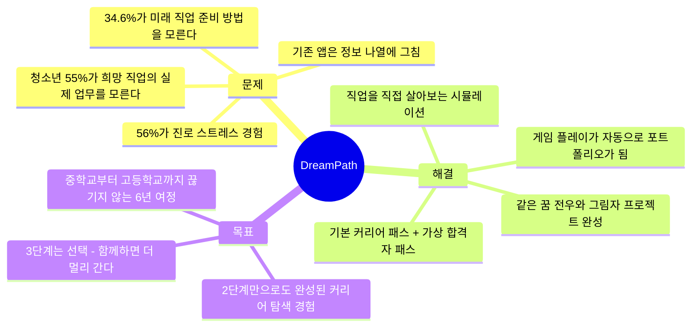

### 0.1 앱 정체성

| 항목 | 내용 |
|------|------|
| **앱 이름** | DreamPath (드림패스) |
| **슬로건** | "직업을 살아보고, 전우와 함께 완성한다" |
| **핵심 정체성** | 직업 체험 시뮬 + 커리어 패스 설계 + 전우 프로젝트 RPG |
| **타겟 사용자** | 초등 고학년 ~ 고등학생 + 부모 + 교사 |
| **핵심 차별점** | 2단계만으로 커리어 패스 완성 / 가상 합격자 패스 비교 / 전우 그림자 프로젝트 |
| **비전** | 대한민국 청소년이 "진로 불안" 대신 "진로 설렘"을 느끼는 세상 |

### 0.2 핵심 설계 원칙

| 원칙 | 내용 | 이유 |
|------|------|------|
| **일기·기록 강요 없음** | 직접 쓰는 일지 없음. Notion과 경쟁하지 않는다 | 부담 없는 진입 |
| **2단계 = 완성된 경험** | 직업 탐색 + 기본 커리어 패스 + 가상 합격자 패스까지 2단계 제공 | 단계 이탈 허용 |
| **게임이 데이터** | 직접 기록 대신 플레이 행동이 자동으로 포트폴리오가 됨 | 자연스러운 기록 |
| **3단계는 선택** | 2단계에서 멈춰도 완성된 경험. 억지로 3단계 유도 안 함 | 자유도 설계 |
| **배포가 완성 기준** | 만들다 멈춤은 완성이 아님. MVP 배포까지 트래킹 | 커리어 증명 결과물 |

---

## 1. 경쟁 앱 분석

### 1.1 경쟁 서비스 전체 지형도

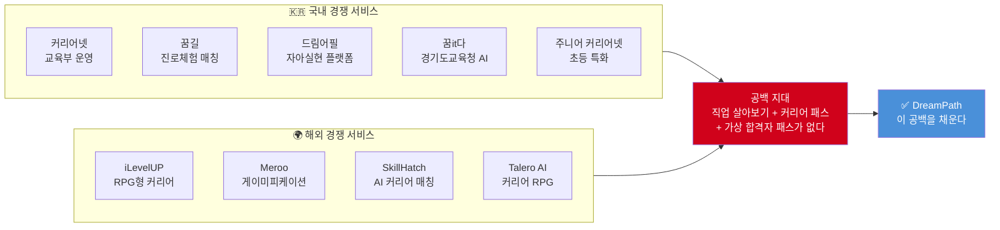

### 1.2 국내 경쟁 서비스 비교표

| 서비스 | 대상 | 핵심 기능 | 강점 | 약점 |
|--------|------|----------|------|------|
| **커리어넷** | 초~대학 | 홀랜드 검사, 직업백과, 학과정보 | 공신력, 무료, 방대한 DB | PC 중심, 탐색 후 행동 연결 없음 |
| **꿈길** | 중·고 | 진로체험 기관 매칭 | 체험 기관 연결 | 예약만 가능, 사후 기록 없음 |
| **드림어필** | 중·고 | 꿈 실천 응원, 기록 | 6만 청소년, 846개교 도입 | 커리어 패스 설계 없음 |
| **꿈it다** | 초5~고3 | AI 진로로드맵, 모의면접 | 2025 신규, AI 기반 | 경기도 한정, 커뮤니티 없음 |
| **주니어 커리어넷** | 초등 | 진로탐험대 미션 | 게이미피케이션 시도 | 초등 한정, 중·고 연계 없음 |

### 1.3 해외 경쟁 서비스 비교표

| 서비스 | 국가 | 핵심 기능 | 강점 | 약점 |
|--------|------|----------|------|------|
| **iLevelUP** | 미국 | RPG 퀘스트, 3명의 멘토 NPC, 장학금 매칭 | 게이미피케이션 완성도 높음 | 한국 입시 맥락 없음 |
| **Meroo** | 호주 | 미니게임으로 강점 발견, 직업 매칭 | 자기 발견 + 직업 연결 잘 됨 | 커뮤니티 없음, 한국 직업 DB 없음 |
| **SkillHatch** | 미국 | AI 커리어 어시스턴트, 포인트 시스템 | 인턴십·해커톤 통합 DB | 청소년 대상 아님 |
| **Talero AI** | 미국 | 커리어 RPG, AI 매칭 | RPG 콘셉트 | 성인 대상, 탐색보다 매칭 중심 |

### 1.4 기능 매트릭스 — DreamPath가 채우는 공백

| 기능 | 커리어넷 | 꿈길 | 드림어필 | 꿈it다 | iLevelUP | Meroo | **DreamPath** |
|------|---------|------|---------|--------|----------|-------|---------------|
| 자기 발견 검사 | ✅ 홀랜드 | ❌ | ❌ | ✅ AI | ✅ 성격검사 | ✅ 미니게임 | ✅ **RIASEC 게임형 퀴즈** |
| 직업 체험 시뮬 | ❌ | ❌ | ❌ | ❌ | ⚠️ 퀘스트 | ✅ 미니게임 | ✅ **하루 시뮬 + 1주 캠프 + 1달 그림자** |
| 기본 커리어 패스 | ❌ | ❌ | ❌ | ❌ | ❌ | ❌ | ✅ **초→중→고→대학 로드맵** |
| 가상 합격자 패스 | ❌ | ❌ | ❌ | ❌ | ❌ | ❌ | ✅ **학종/정시/특기자 벤치마크** |
| 전우 시스템 | ❌ | ❌ | ✅ 응원 | ❌ | ❌ | ❌ | ✅ **클루 매칭 + 그림자 프로젝트** |
| 프로젝트 → 포트폴리오 | ❌ | ❌ | ❌ | ❌ | ❌ | ❌ | ✅ **배포까지 자동 트래킹** |
| 입시 연계 | ❌ | ❌ | ❌ | ✅ 일부 | ❌ | ❌ | ✅ **2028 대입 개편 반영** |
| 부모·교사 연결 | ❌ | ❌ | ❌ | ❌ | ❌ | ❌ | ✅ **리포트 공유 시스템** |
| 모바일 최적화 | ❌ PC | ❌ PC | ✅ | ✅ | ✅ | ✅ | ✅ **모바일 퍼스트** |

---

## 2. DreamPath의 5대 차별점

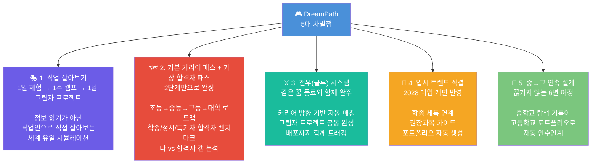

### 2.1 차별점 상세 비교표

| 차별점 | 기존 서비스 | DreamPath | 왜 다른가? |
|--------|-----------|------------|----------|
| **직업 살아보기** | 텍스트 읽기, 영상 수동 시청 | 1일 하루 시뮬 → 1주 캠프 → 1달 그림자 프로젝트 | 직접 플레이하며 진짜 직업 현실 경험 |
| **기본 커리어 패스** | 없음 | 초→중→고→대학 학기별 체크리스트 | "지금 내 학년에서 무엇을 해야 하는가" 명확 |
| **가상 합격자 패스** | 없음 | 학종/정시/특기자 경로별 합격 사례 시뮬 | "합격자는 이 시점에 이걸 했는데, 나는?" |
| **전우 시스템** | 없음 (모두 개인 탐색) | RIASEC + 커리어 방향 기반 클루 자동 매칭 | 같은 방향 동료와 프로젝트 완주 |
| **배포 트래킹** | 없음 | 기획 → 개발 → 배포까지 단계별 인증 | "만들다 멈춤"이 아닌 완성된 포트폴리오 |
| **6년 연속 설계** | 모두 단발성 | 중1~고3 데이터 연속, 인수인계 시스템 | 고3 자소서에 중학교 탐색부터 쓸 수 있음 |

---

## 3. 홀랜드 검사(Holland RIASEC) 심층 분석

### 3.1 RIASEC 6가지 유형 비교표

| 유형 | 코드 | 핵심 특성 | 에너지 올라가는 순간 | 잘 맞는 직업 분야 | DreamPath 추천 체험 |
|------|------|---------|-----------------|----------------|-------------------|
| **현실형** | R | 손으로 만들기, 몸 쓰기 | 레고 조립, 운동, 요리 | 공학, 건축, 스포츠 | 로봇 엔지니어 하루 시뮬 |
| **탐구형** | I | 왜? 어떻게? 질문 | 실험, 퍼즐 풀기, 코딩 | 과학, 의학, IT, 연구 | AI 연구원 1주 캠프 |
| **예술형** | A | 만들고 표현하기 | 그림 그리기, 음악, 글쓰기 | 디자인, 미디어, 예술 | UX 디자이너 하루 시뮬 |
| **사회형** | S | 사람 돕고 가르치기 | 친구 고민 상담, 가르치기 | 교육, 의료, 복지 | 의사 응급실 체험 |
| **진취형** | E | 이끌고 설득하기 | 발표, 토론, 프로젝트 주도 | 경영, 법, 정치, 영업 | 창업가 투자 유치 체험 |
| **관습형** | C | 계획하고 정리하기 | 일정 정리, 데이터 분류 | 회계, 행정, 금융 | 데이터 분석가 시뮬 |

### 3.2 RIASEC 유형 관계도

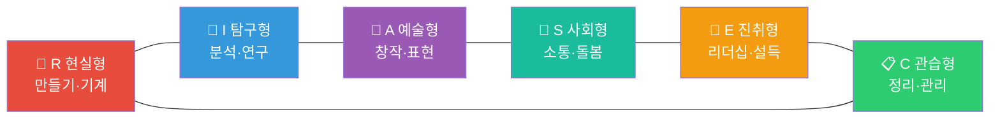

> **인접 유형은 유사도 높음** (R-I, A-S 등), **대각선 유형은 반대 성향** (R-S, I-E, A-C)

### 3.3 기존 홀랜드 검사의 한계 vs DreamPath의 해결책

| 한계 | 구체적 문제 | DreamPath 해결책 |
|------|-----------|-----------------|
| **결과 불일치** | 할 때마다 결과가 달라짐 | 검사 결과 + 플레이 행동 데이터 통합 분석 |
| **라벨링 위험** | "나는 A형이니까 예술만" 고정 사고 | 검사는 참고. 시뮬레이션 행동 패턴이 주력 |
| **신생 직업 미반영** | AI 시대 직업이 DB에 없음 | AI 기반 매핑 엔진으로 실시간 업데이트 |
| **문항이 추상적** | 중학생에게 60문항이 지루함 | 상황 선택형 퀴즈 20문항으로 재설계 (5분) |
| **행동 연결 없음** | 결과 보고 끝, 다음 행동 없음 | 결과 → 직업 추천 → 하루 시뮬레이션 자동 연결 |
| **1회성** | 한 번 하고 잊어버림 | 시뮬레이션 플레이 행동 누적으로 유형 정교화 |

---

## 4. 교육 트렌드 분석 — 왜 지금 DreamPath인가?

### 4.1 2028 대입 개편 핵심 변화

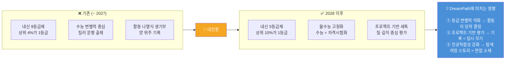

### 4.2 학년별 내신·수능·전공 프로젝트 준비 비율

| 학년 | 내신 관리 | 수능 대비 | 전공 프로젝트 | 커리어 탐색 | DreamPath 핵심 활용 |
|------|---------|---------|------------|-----------|-------------------|
| 중1~중2 | 15% | 0% | 10% | **75%** | 적성 검사 + 직업 살아보기 |
| 중3 | 25% | 5% | 15% | **55%** | 커리어 패스 설계 + 고교 계열 전략 |
| 고1 | 35% | 15% | **25%** | 25% | 합격자 패스 비교 + 심화 직업 체험 |
| 고2 | 30% | 20% | **35%** | 15% | 그림자 프로젝트 + 포트폴리오 구축 |
| 고3 | 20% | 30% | **30%** | 20% | 포트폴리오 완성 + 자소서 AI 지원 |

### 4.3 학생부종합전형 대비 차이

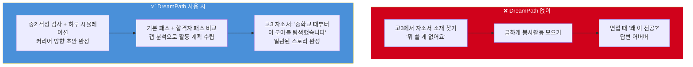

---

## 5. 앱 3단계 구조 전체 개요

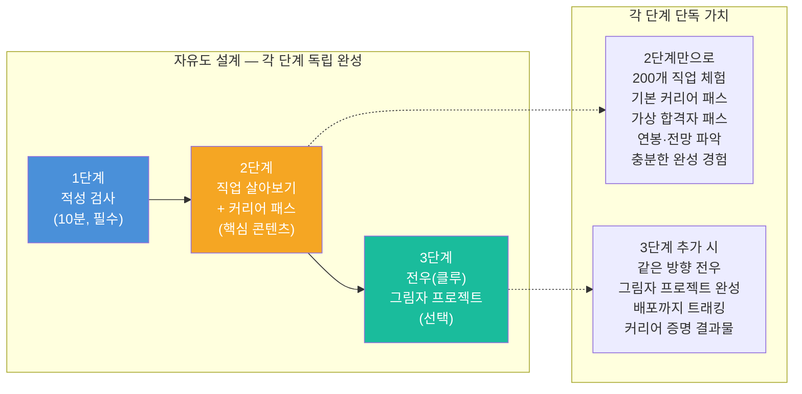

| 단계 | 목표 | 소요 시간 | 결과물 | 필수 여부 |
|------|------|---------|--------|---------|
| **1단계: 적성 검사** | RIASEC 유형 파악 + 직업 추천 큐 생성 | 10분 | 유형 카드 + 추천 직업 TOP10 | ✅ 필수 |
| **2단계: 직업 살아보기** | 200개 직업 체험 + 커리어 패스 완성 | 자유 (수일~수개월) | 기본 패스 + 합격자 패스 비교 + 개인 커리어 패스 | ✅ 핵심 |
| **3단계: 전우 프로젝트** | 클루 결성 + 그림자 프로젝트 + 배포 | 1달 그림자 프로젝트 | 배포된 프로젝트 + 포트폴리오 | 🟢 선택 |

---

## 6. 1단계: 직업 적성 검사

### 6.1 1단계 목표

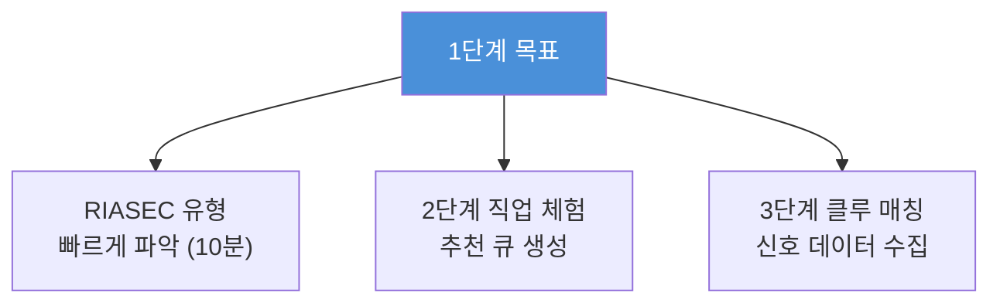

### 6.2 검사 흐름

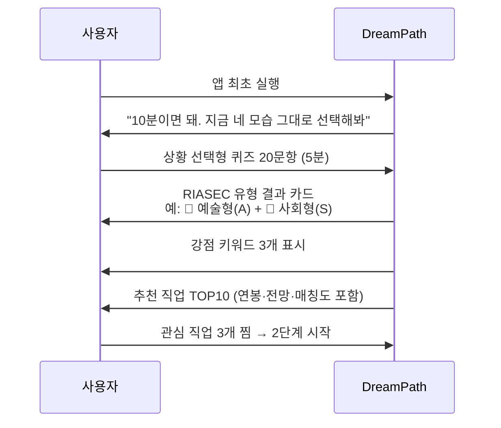

### 6.3 화면 설계 — 검사 진행 화면

```
┌─────────────────────────────────┐
│  DreamPath                      │
│─────────────────────────────────│
│                                 │
│  🧭 Question 7 / 20             │
│  ━━━━━━━━━━━░░░░░░░░  35%       │
│                                 │
│  ┌─────────────────────────────┐│
│  │ 학교 축제를 준비하고 있어.  ││
│  │ 네가 가장 하고 싶은 역할은? ││
│  └─────────────────────────────┘│
│                                 │
│  ┌─────────────────────────────┐│
│  │  🎨 포스터 직접 디자인하기  ││
│  └─────────────────────────────┘│
│  ┌─────────────────────────────┐│
│  │  🔧 무대·조명 세팅하기      ││
│  └─────────────────────────────┘│
│  ┌─────────────────────────────┐│
│  │  📣 사회 보고 분위기 이끌기 ││
│  └─────────────────────────────┘│
│  ┌─────────────────────────────┐│
│  │  📋 전체 일정 관리하기      ││
│  └─────────────────────────────┘│
│                                 │
└─────────────────────────────────┘
```

### 6.4 화면 설계 — 검사 결과 화면

```
┌─────────────────────────────────┐
│  🎉 검사 완료!                   │
│─────────────────────────────────│
│                                 │
│  너의 유형은                     │
│  🎨 예술형 + 🤝 사회형          │
│                                 │
│  ┌─────────────────────────────┐│
│  │  강점 키워드                ││
│  │  #표현 #공감 #창작 #소통    ││
│  └─────────────────────────────┘│
│                                 │
│  추천 직업 TOP 10               │
│  ──────────────────             │
│  1. 🎨 UX 디자이너  매칭 97%    │
│     연봉 3,800~7,000만 / ★★★★☆  │
│                                 │
│  2. 🏠 공간 디자이너  매칭 94%  │
│     연봉 3,500~6,000만 / ★★★★☆  │
│                                 │
│  3. 📱 브랜드 마케터  매칭 88%  │
│     연봉 3,200~6,500만 / ★★★★★  │
│  ...                            │
│                                 │
│  [관심 직업 3개 찜하고 탐험 시작 →]│
│                                 │
└─────────────────────────────────┘
```

### 6.5 학년별 맞춤 검사 경험

| 학년 | 시작 메시지 | 추천 직업군 | 첫 시뮬 추천 | 긴급도 |
|------|-----------|-----------|-----------|------|
| 초5~6 / 예술형 | "아직 뭐가 될지 몰라도 OK. 다양하게 살아보자!" | UX·게임기획·건축·영화감독 | UX 디자이너 하루 체험 | 🟢 낮음 |
| 중1 / 예술형 | "감각이 생겼어. Figma 한 번 살아볼까?" | UX·게임기획·광고기획·건축 | UX 디자이너 하루 체험 | 🟡 보통 |
| 중3 / 탐구형 | "좋아하는 분야가 보여. 깊이 살아볼 시간!" | AI 연구원·의사·생명공학자 | AI 연구원 하루 체험 | 🟠 높음 |
| 고1 / 사회형 | "입시가 시작됐어. 직업과 대학을 연결해야 해" | 교사·사회복지사·변호사·의사 | 의사 응급실 체험 | 🔴 매우 높음 |
| 고2 / 진취형 | "수시 설계 직전. 내 직업이 선택을 결정한다" | 창업가·경영자·마케터·변호사 | 창업가 투자 유치 체험 | 🚨 긴급 |

---

## 7. 2단계: 직업 살아보기 + 커리어 패스 탐색

### 7.0 200개 직업 × 8대 왕국 — 살아보기 관리 시스템

> **"200개 직업을 한 번에 탐색하는 게 아니라, 왕국을 여행하며 삶으로써 발견한다"**
> 8대 왕국 구조는 방대한 직업 세계를 여행 가능한 크기로 나누는 핵심 설계다.

#### 8대 왕국 × 살아보기 전체 구조

| 왕국 | 아이콘 | 직업 수 | 핵심 성격 | RIASEC 연계 | 대표 직업 |
|-----|-------|---------|---------|-----------|---------|
| **탐구 왕국** | 🔬 | 25개 | 질문하고 연구하는 사람들 | I (탐구형) | 의사, AI연구원, 약사, 생명공학연구원 |
| **창작 왕국** | 🎨 | 25개 | 만들고 표현하는 사람들 | A (예술형) | UX디자이너, 웹툰작가, 건축가, 영화·영상감독 |
| **기술 왕국** | 💻 | 25개 | 설계하고 구현하는 사람들 | R+I (현실+탐구) | 앱개발자, 데이터사이언티스트, 정보보안, 로봇공학자 |
| **자연 왕국** | 🌱 | 25개 | 생명과 환경을 돌보는 사람들 | R+I (현실+탐구) | 환경공학자, 수의사, 스마트팜전문가, 해양생물학자 |
| **연결 왕국** | 🤝 | 25개 | 사람을 돕고 연결하는 사람들 | S (사회형) | 교사, 심리상담사, 간호사, 사회복지사 |
| **질서 왕국** | 🏛️ | 25개 | 규칙과 정의를 세우는 사람들 | E+C (진취+관습) | 변호사, 외교관, 회계사·세무사, 프로파일러 |
| **소통 왕국** | 📣 | 25개 | 이야기하고 설득하는 사람들 | E+A (진취+예술) | 유튜버·크리에이터, 디지털마케터, 방송PD, 게임기획자 |
| **도전 왕국** | 🚀 | 25개 | 새로운 것을 만들고 도전하는 사람들 | E (진취형) | 스타트업창업가, 투자분석가, PM, 경영컨설턴트 |

#### 왕국 여권 시스템 (Kingdom Passport)

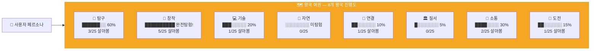

#### 왕국 입국 → 탐색 → 마스터 단계별 관리

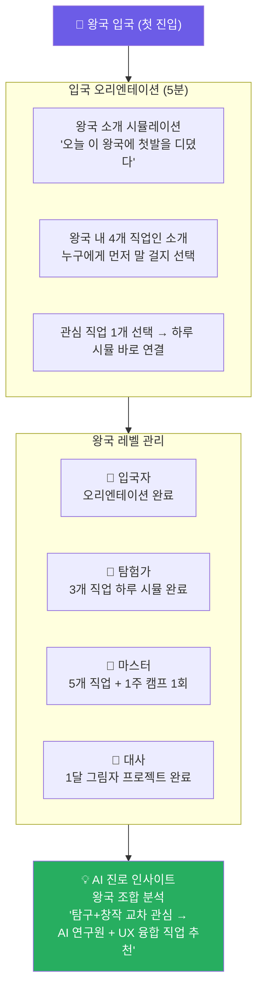

#### 왕국별 살아보기 진행 관리 비교표

| 관리 방식 | 단계 | 조건 | 보상 |
|---------|-----|-----|-----|
| **왕국 입국** | 1단계 | RIASEC 매칭도 50%+ | 왕국 여권 도장 |
| **첫 살아보기** | 2단계 | 하루 시뮬 1회 완료 | +30 XP + 씨앗 뱃지 |
| **탐험가** | 3단계 | 3개 직업 시뮬 완료 | +50 XP + 탐험가 뱃지 |
| **1주 캠프** | 4단계 | 관심 직업 1주 캠프 완료 | +200 XP + 수료 뱃지 |
| **왕국 마스터** | 5단계 | 5개 직업 시뮬 + 1주 캠프 | +500 XP + 마스터 뱃지 |
| **왕국 대사** | 6단계 | 1달 그림자 프로젝트 완료 | +1000 XP + 대사 뱃지 + 3단계 팀 리더 자격 |

#### 왕국 오리엔테이션 시뮬 예시 — 창작 왕국

```
╔══════════════════════════════════════════╗
║  🎨 창작 왕국 입국 오리엔테이션          ║
║  "이곳은 만들고 표현하는 사람들의 세계"  ║
╠══════════════════════════════════════════╣
║                                          ║
║  🌅 오전 9시, 공유 스튜디오              ║
║                                          ║
║  당신은 오늘 창작 왕국에 첫발을 디뎠다.  ║
║  4명의 직업인이 같은 공간에서 일하고 있다.║
║                                          ║
║  → 누구에게 먼저 말을 걸 것인가?         ║
║                                          ║
║  A. 🎨 UX 디자이너 — 사용자 인터뷰 분석 ║
║  B. ✏️ 웹툰 작가 — 스케치북에 캐릭터 중 ║
║  C. 🏗️ 건축가 — 3D 모델 돌려보는 중    ║
║  D. 🎬 영상감독 — 편집 타임라인 작업 중 ║
║                                          ║
║  💡 선택 후 그 직업 하루 시뮬 바로 시작! ║
╚══════════════════════════════════════════╝
```

#### 8대 왕국 세계 지도 — 탐험 현황 화면

```
┌──────────────────────────────────────────┐
│  🌍 직업 세계 여행지도                    │
│  [왕국별] [전체 목록] [추천순]            │
│──────────────────────────────────────────│
│                                          │
│  ┌──────────┐  ┌──────────┐             │
│  │ 🔬 탐구  │  │ 🎨 창작  │             │
│  │ ██████░░ │  │ ██████████│             │
│  │  60%    │  │ 완전탐험! │             │
│  │  3/25   │  │  5/25    │             │
│  └──────────┘  └──────────┘             │
│                                          │
│  ┌──────────┐  ┌──────────┐             │
│  │ 💻 기술  │  │ 🌱 자연  │             │
│  │ ███░░░░░ │  │ ░░░░░░░░ │             │
│  │  20%    │  │ 미탐험   │             │
│  └──────────┘  └──────────┘             │
│                                          │
│  ┌──────────┐  ┌──────────┐             │
│  │ 🤝 연결  │  │ 🏛️ 질서  │             │
│  │ ██░░░░░░ │  │ █░░░░░░░ │             │
│  │  10%    │  │   5%    │             │
│  └──────────┘  └──────────┘             │
│                                          │
│  ┌──────────┐  ┌──────────┐             │
│  │ 📣 소통  │  │ 🚀 도전  │             │
│  │ ████░░░░ │  │ ██░░░░░░ │             │
│  │  30%    │  │  15%    │             │
│  └──────────┘  └──────────┘             │
│                                          │
│  총 탐험: 13/200 직업 (6.5%)            │
│  ████░░░░░░░░░░░░░░░░░░░░               │
│                                          │
│  🎯 오늘 추천: 자연 왕국 첫 탐험!        │
│  [수의사 하루 살아보기 →]               │
└──────────────────────────────────────────┘
```

#### 살아보기 깊이 단계 — 왕국 내 1개 직업 성장 구조

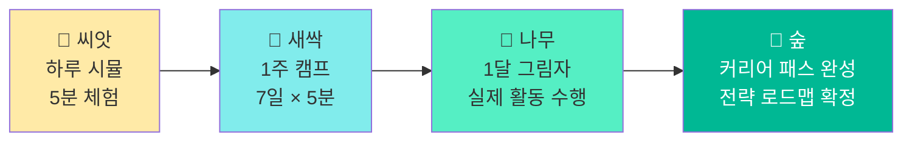

#### AI 진로 인사이트 — 왕국 조합 분석

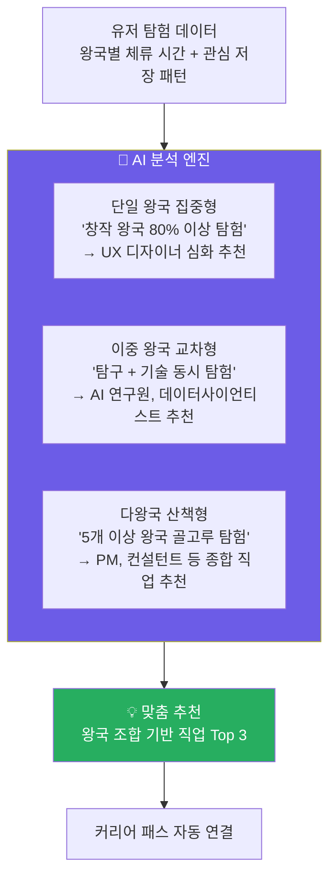

---

### 7.1 2단계 핵심 철학

> **"2단계는 단순 직업 정보 탐색이 아니다."**
> 각 직업의 **기본 커리어 패스**(초→중→고→대학 로드맵)와
> **가상 합격자 패스**(실제 합격 사례 기반 시뮬레이션)까지 제공하여,
> **2단계만으로도 "나는 이 직업을 위해 무엇을 해야 하는지" 완전히 파악** 가능하다.

### 7.2 2단계 마일스톤

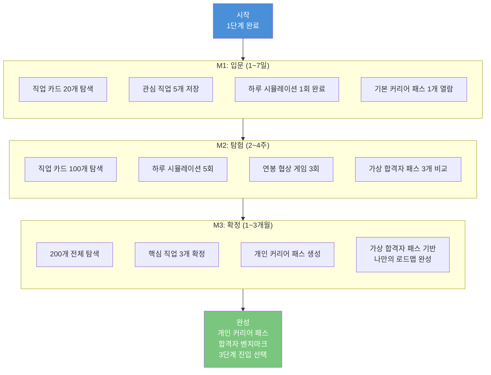

### 7.3 직업 살아보기 — 3단계 몰입 구조

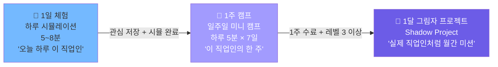

#### 1일 체험: 하루 시뮬레이션 (5~8분)

```
┌─────────────────────────────────┐
│  🎮 UX 디자이너 하루 체험        │
│  ─────────────────────────────  │
│                                 │
│  ☀️ 오전 9시, 스타트업 사무실   │
│                                 │
│  팀장이 슬랙 메시지를 보냈다.    │
│  "오늘 오후 3시 클라이언트       │
│  발표인데, 수정 요청이 왔어요.   │
│  메인 컬러 전체 바꿔야 할 것     │
│  같은데요..."                   │
│                                 │
│  ─────────────────────────────  │
│  어떻게 할까?                    │
│                                 │
│  ┌─────────────────────────────┐│
│  │  😤 묵묵히 수정 시작한다    ││
│  └─────────────────────────────┘│
│  ┌─────────────────────────────┐│
│  │  💬 왜 바꾸는지 이유를      ││
│  │     먼저 물어본다           ││
│  └─────────────────────────────┘│
│  ┌─────────────────────────────┐│
│  │  🎨 3가지 대안을 빠르게     ││
│  │     만들어서 선택하게 한다  ││
│  └─────────────────────────────┘│
│                                 │
│  💡 결과는 선택에 따라 달라져!  │
└─────────────────────────────────┘
```

#### 하루 시뮬 결산 화면

```
┌─────────────────────────────────┐
│  🌙 하루 결산: UX 디자이너      │
│─────────────────────────────────│
│                                 │
│  💬 이유를 물어봤더니...         │
│  클라이언트가 "사실 대표님이     │
│  파란색 싫어하셔서요"라고 했다.  │
│  → 실제 문제를 파악하고 해결!   │
│     [+30XP] 문제해결력 뱃지 🔍  │
│                                 │
│  UX 디자이너 현실 지수          │
│  스트레스  ████████░░  8/10     │
│  자유도    ██████░░░░  6/10     │
│  보람      █████████░  9/10     │
│  연봉 (5년차) 약 5,200만원      │
│                                 │
│  "이 직업, 나한테 맞을까?"       │
│  ❤️ 관심 저장   🔁 다시 해보기  │
│                                 │
└─────────────────────────────────┘
```

#### 1주 캠프: UX 디자이너 예시

| 요일 | 미션 제목 | 실제 활동 내용 | 소요 시간 | XP |
|-----|---------|------------|---------|-----|
| **월요일** | 스탠드업 미팅 | 팀에게 금주 목표 3가지 브리핑 시뮬 | 5분 | +15 XP |
| **화요일** | 사용자 인터뷰 | 인터뷰 질문 3개 설계 + 인사이트 기록 | 7분 | +20 XP |
| **수요일** | 와이어프레임 | Figma 앱 화면 1개 스케치 미션 | 10분 | +25 XP |
| **목요일** | 클라이언트 발표 | 발표 흐름 선택지 시뮬 (설득력 점수) | 6분 | +20 XP |
| **금요일** | 주간 회고 | 이번 주 배운 것 3가지 기록 | 5분 | +15 XP |
| **토요일** | 커리어 패스 확인 | 이 직업이 되려면 지금 뭘 해야 하는가? | 5분 | +20 XP |
| **일요일** | 1주 결산 | 체험 결산 카드 발급 + 다음 스텝 확인 | 3분 | +85 XP |

> 1주 캠프 완료 시 **"UX 디자이너 1주 수료" 뱃지** + **+200 XP** 지급

### 7.4 직업 카드 정보 구조 (5레이어)

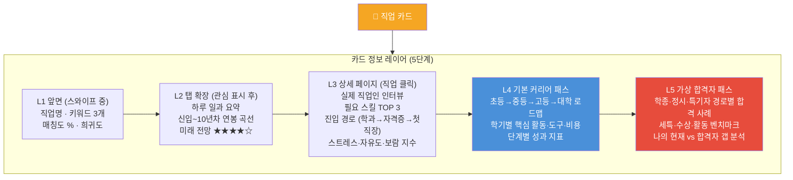

### 7.5 직업 카드 스와이프 화면

```
┌─────────────────────────────────┐
│  🗺️ 직업 세계 탐험              │
│─────────────────────────────────│
│                                 │
│  [내 성향 맞춤] [전체] [8대 분야]│
│                                 │
│  ┌─────────────────────────────┐│
│  │  🎨 공간 디자이너            ││
│  │  ★★★ 내 성향 매칭 95%       ││
│  │                             ││
│  │  사람들이 생활하는 공간을     ││
│  │  아름답고 편하게 디자인하는   ││
│  │  사람                       ││
│  │                             ││
│  │  미래 전망: ★★★★☆           ││
│  │  연봉: 3,500~6,000만원      ││
│  │                             ││
│  │  [▶ 하루 시뮬] [🗺️ 커리어 패스]││
│  │                             ││
│  │     [← 패스]  [관심 ❤️ →]  ││
│  └─────────────────────────────┘│
│                                 │
│  탐험 진행도: 23/200 직업       │
│  ████░░░░░░░░░░░ 11.5%          │
│                                 │
└─────────────────────────────────┘
```

### 7.6 커리어 패스 표시 방식 — 왕국별 구조

> **"어떤 왕국의 직업이냐에 따라, 커리어 패스의 모양이 달라진다"**
> 왕국별 핵심 관문 → 직업별 세부 로드맵 → 내 현재 위치 자동 표시

#### 왕국별 커리어 패스 핵심 관문 비교표

| 왕국 | 중학교 관문 | 고등학교 관문 | 대학 진입 방식 | 필수 성과물 |
|-----|-----------|------------|------------|---------|
| 🔬 **탐구 왕국** | 올림피아드·탐구대회 | 내신 1~2등급 + R&E | 수능 + 학종 내신 | 탐구 보고서·수상 |
| 🎨 **창작 왕국** | 포트폴리오 시작·공모전 | 세특 연계 + 포폴 완성 | 실기·학종·특기 | 포트폴리오 20작품+ |
| 💻 **기술 왕국** | Python·알고리즘 시작 | GitHub + KOI / 공모전 | SW특기자·학종 | GitHub 레포·프로젝트 |
| 🌱 **자연 왕국** | 생물·환경 탐구·봉사 | 생명과학 세특 + 동아리 | 학종·수능최저 | 탐구 보고서·봉사 기록 |
| 🤝 **연결 왕국** | 봉사·상담·교육 체험 | 사회 세특 + 교육 활동 | 학종·사범대·사회대 | 활동 포트폴리오 |
| 🏛️ **질서 왕국** | 논리·글쓰기·모의법정 | 수능 최저 관리 | 법대·행정·경찰 | 토론·논술·수상 |
| 📣 **소통 왕국** | 콘텐츠 제작·방송부 | 미디어 세특 + 제작물 | 미디어·광고·언론 | 콘텐츠 채널·제작물 |
| 🚀 **도전 왕국** | 비즈쿨·아이디어 대회 | 창업 동아리 + MVP | 경영·창업 전형 | 사업계획서·MVP |

#### 커리어 패스 3층 표시 구조

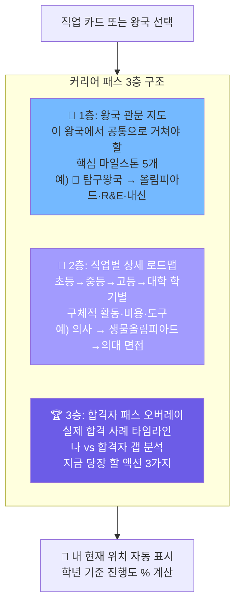

#### 왕국별 커리어 패스 화면 전환 흐름

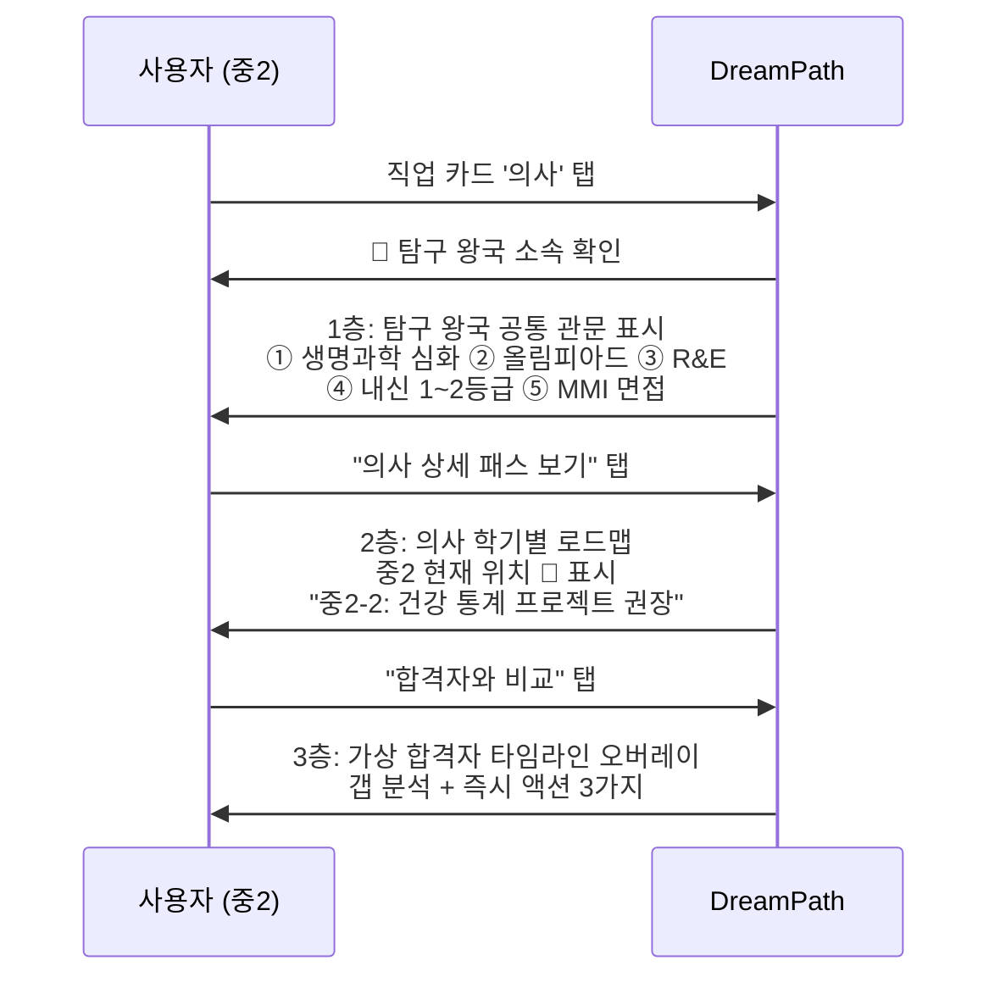

---

### 7.7 기본 커리어 패스 화면

```
┌─────────────────────────────────┐
│  🗺️ UX 디자이너 커리어 패스      │
│  [기본 패스] [합격자 패스] [비교] │
│─────────────────────────────────│
│                                 │
│  📍 나의 현재: 중2               │
│  ━━━━━━━━━━●━━━━━━━━  중등 단계  │
│                                 │
│  ┌─ 초등 (완료) ──────────────┐ │
│  │ ✅ 미술 학원 · 디자인 캠프  │ │
│  │ ✅ 스크래치 코딩 기초       │ │
│  └────────────────────────────┘ │
│                                 │
│  ┌─ 중등 (현재) ──────────────┐ │
│  │ 📌 중2-1: 디자인 씽킹 PBL  │ │
│  │    도구: Figma 무료 / 비용 0│ │
│  │ 📌 중2-2: UI 리디자인 공모전│ │
│  │    도구: Adobe XD / 비용 0  │ │
│  │ ☐ 중3-1: 포트폴리오 시작   │ │
│  │ ☐ 중3-2: IT 공모전 도전    │ │
│  └────────────────────────────┘ │
│                                 │
│  ┌─ 고등 (예정) ──────────────┐ │
│  │ 🔒 고1: 미술·정보 세특 전략 │ │
│  │ 🔒 고2: R&E + 포폴 완성    │ │
│  │ 🔒 고3: 수시 6장 전략      │ │
│  └────────────────────────────┘ │
│                                 │
│  [전체 로드맵 PDF 저장]          │
│                                 │
└─────────────────────────────────┘
```

### 7.8 가상 합격자 패스 화면

```
┌─────────────────────────────────┐
│  🏆 UX 디자이너 합격자 패스      │
│  [기본 패스] [합격자 패스] [비교] │
│─────────────────────────────────│
│                                 │
│  전형 선택                       │
│  [학종 ✓] [정시] [특기자] [해외] │
│                                 │
│  👩 가상 합격자: 김서진           │
│  서울대 디자인학부 학종 합격      │
│  유형: 예술형(A) + 탐구형(I)     │
│                                 │
│  📊 합격 핵심 스펙               │
│  내신: 1.8등급 / 세특: 디자인 6학기│
│  수상: 교내 디자인대회 3회 입상   │
│  활동: R&E + 디자인 동아리 회장  │
│                                 │
│  📅 합격자 타임라인              │
│  고1-1: "사용자 중심 디자인 원리" │
│  고2-1: R&E "고령자 UI 접근성"   │
│  고2-2: 디자인 동아리 전시회 기획 │
│                                 │
│  🔍 나 vs 김서진 비교            │
│  ┌──────────┬───────┬──────────┐│
│  │ 항목     │ 나    │ 김서진   ││
│  │ 내신     │ 2.3   │ 1.8     ││
│  │ 세특     │ 2학기 │ 6학기   ││
│  │ 수상     │ 1회   │ 3회     ││
│  └──────────┴───────┴──────────┘│
│                                 │
│  💡 보완 추천: R&E 프로그램 신청  │
│  [내 패스 저장] [다른 합격자 보기]│
│                                 │
└─────────────────────────────────┘
```

### 7.9 기본 패스 vs 합격자 패스 비교 오버레이

```
┌──────────────────────────────────────────┐
│  🔍 비교 모드: 기본 패스 vs 합격자 패스    │
│──────────────────────────────────────────│
│                                          │
│  📍 현재: 중2 2학기                       │
│                                          │
│  기본 커리어 패스       합격자 (김서진)    │
│  ─────────────         ──────────────    │
│  중2-1                  중2-1             │
│  ✅ 디자인 씽킹 PBL    ✅ 미술 심화반     │
│                         ✅ Figma 독학     │
│                                          │
│  중2-2                  중2-2             │
│  📌 UI 공모전 도전     ✅ 교내 디자인대회  │
│                         ⚠️ 갭: 코딩 활동  │
│                                          │
│  💡 지금 추천 액션                        │
│  1. 코딩 동아리 가입 (합격자 대비 부족)   │
│  2. Figma 튜토리얼 시작 (무료, 2주)      │
│  3. 교내 디자인 대회 참가 신청            │
│                                          │
│  [액션 체크리스트 저장] [알림 설정]       │
└──────────────────────────────────────────┘
```

### 7.10 연봉 협상 게임 화면

```
┌─────────────────────────────────┐
│  💰 연봉 협상 게임: UX 디자이너 │
│─────────────────────────────────│
│                                 │
│  👤 신입 디자이너 1년차          │
│     포트폴리오: ★★★☆☆           │
│     학력: 홍익대 시각디자인      │
│                                 │
│  🏢 면접관: "희망 연봉이         │
│  어떻게 되시나요?"               │
│                                 │
│  업계 평균: 2,800 ~ 3,500만원   │
│                                 │
│  나의 제시 연봉                  │
│  ◀  [   3,200만원   ]  ▶       │
│     (슬라이더로 조정)            │
│                                 │
│  전략 힌트 보기 (유료 또는 광고) │
│                                 │
│  [협상 제시하기]                 │
│                                 │
│  현실: 너무 높으면 탈락,         │
│       너무 낮으면 손해!          │
└─────────────────────────────────┘
```

### 7.11 2단계 완성 결과물 — 개인 커리어 패스

```
┌─────────────────────────────────┐
│  📁 나의 커리어 패스             │
│  [공유] [PDF 저장] [3단계 시작] │
│─────────────────────────────────│
│                                 │
│  🧭 나의 유형                   │
│  🎨 예술형(A) + 🤝 사회형(S)   │
│                                 │
│  🎮 탐험 기록 (자동 저장)        │
│  탐험한 직업: 47개              │
│  시뮬레이션 완료: 8개           │
│  커리어 패스 열람: 12개         │
│  합격자 패스 비교: 5회          │
│  총 플레이 시간: 3시간 20분     │
│                                 │
│  ❤️ 관심 직업 TOP 3             │
│  1순위  UX 디자이너    ★★★★★   │
│  2순위  공간 디자이너  ★★★★☆   │
│  3순위  브랜드 마케터  ★★★☆☆   │
│                                 │
│  🗺️ 나의 커리어 로드맵           │
│  지금(중2) → [고등 전략] →      │
│  [대학 탐색] → [포트폴리오] →   │
│  [첫 직장] → [성장]             │
│                                 │
│  🏆 합격자 벤치마크              │
│  1순위 기준 합격자 대비          │
│  달성도: ████████░░ 78%         │
│  보완 포인트: R&E 활동 추가 필요│
│                                 │
│  ─────────────────────────────  │
│  같은 방향 전우 찾기 →          │
│  (3단계 진입, 선택)              │
└─────────────────────────────────┘
```

### 7.12 게임 메카닉: 경험치(XP) 시스템

| 활동 | 개인 XP | 클루 XP | 일일 제한 |
|------|--------|---------|---------|
| 직업 카드 스와이프 | +5 | — | 10회 |
| 하루 시뮬레이션 완료 | +30 | +15 | 2회 |
| 1주 캠프 수료 | +200 | +100 | — |
| 커리어 패스 열람 | +15 | — | 5회 |
| 합격자 패스 비교 | +20 | — | 3회 |
| 연봉 협상 게임 | +25 | — | 2회 |
| 클루 토론 참여 | +15 | +20 | 3회 |
| 클루원 응원 리액션 | +5 | +10 | 5회 |
| 1달 그림자 프로젝트 완성 | +500 | +250 | — |

### 7.13 뱃지 시스템

| 카테고리 | 뱃지 이름 | 획득 조건 | 희귀도 |
|---------|---------|---------|--------|
| **직업 체험** | 🎭 첫 발걸음 | 하루 시뮬레이션 1회 완료 | ⭐ 일반 |
| **직업 체험** | 🗓️ 1주 수료생 | 1주 캠프 완료 (직업 1개) | ⭐⭐ 보통 |
| **직업 체험** | 🌍 직업 마스터 | 8개 분야 모두 시뮬 완료 | ⭐⭐⭐ 희귀 |
| **커리어 패스** | 🗺️ 로드맵 탐험가 | 기본 패스 10개 열람 | ⭐⭐ 보통 |
| **커리어 패스** | 🏆 벤치마커 | 합격자 패스 5회 비교 | ⭐⭐⭐ 희귀 |
| **탐험** | 🌏 세계 여행자 | 직업 50개 탐험 | ⭐⭐ 보통 |
| **전우** | ⚔️ 전우 발견 | 첫 클루 가입 | ⭐ 일반 |
| **프로젝트** | 🚀 배포 완료 | 그림자 프로젝트 배포 | ⭐⭐⭐⭐ 에픽 |
| **특별** | ⭐ DreamFestival | DreamFestival 출품 | ⭐⭐⭐⭐⭐ 전설 |

---

> 📌 **이 문서의 하편(下)에서 계속됩니다**
> - 3단계: 전우(클루) 시스템 + 그림자 프로젝트 상세 설계
> - 유저 시나리오 6종 (페르소나별 일일·주간·학기 시나리오)
> - 전체 화면 설계 (홈·탐험·클루·커리어 패스·포트폴리오)
> - 수익 모델 및 개발 로드맵
> - KPI 및 성공 지표

---

*작성일: 2026년 2월 | DreamPath 상세 기획서 V2 (상)*
*이전 버전: DreamPath_상세기획서_상.md (V1) → 통합 업데이트*
