# DreamPath 상세 기획서 V2 (하)
# — 3단계 전우 시스템 · 유저 시나리오 · 화면 설계 · 수익 모델 · 개발 로드맵

> **"혼자 가면 빠르고, 함께 가면 멀리 간다."**
> 이 문서는 [DreamPath_상세기획서_V2_상.md]의 후속 문서입니다.

---

## 8. 3단계: 전우(클루) 시스템 + 그림자 프로젝트

### 8.1 3단계 설계 철학

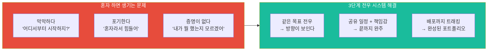

| 원칙 | 내용 | 이유 |
|------|------|------|
| **전우(戰友) 관계** | 팀원이 아닌 전우. 같은 전쟁을 싸우는 동료 | 게임적 몰입감 + 책임감 |
| **코딩은 외부에서** | 플랫폼은 기획/일정/문의만 관리. 실제 개발은 외부 도구 | 진입장벽 최소화 |
| **배포가 완성 기준** | MVP 배포까지 트래킹. "만들다 멈춤"은 완성이 아님 | 커리어 증명 가능 결과물 |
| **문의 = 생명줄** | 초보 개발자의 첫 질문을 환영하는 문화 | 이탈 방지 핵심 장치 |
| **개인도, 팀도** | 솔로 트랙 + 클루 트랙 모두 동등하게 지원 | 성격·상황 다양성 반영 |
| **기록이 포트폴리오** | 기획서, 일정표, 문의 해결 과정이 자동으로 포트폴리오 | 별도 작성 없음 |

### 8.2 전우(클루) 매칭 시스템

#### 매칭 기준

| 매칭 요소 | 가중치 | 판단 기준 | 예시 |
|----------|--------|----------|------|
| **커리어 방향 일치** | 40% | 관심 직업 카테고리 동일 | UX디자이너 지망생끼리 |
| **RIASEC 유형 유사** | 25% | 동일하거나 보완적 유형 | 예술형 + 탐구형 조합 |
| **프로젝트 유형 선호** | 20% | 개인/팀, 프로젝트 종류 선택 | "앱 만들고 싶어" |
| **학년/나이 근접** | 10% | ±2년 이내 | 중3 ~ 고2 |
| **활동 시간대** | 5% | 주말형/평일형 | 주말 오후 주로 활동 |

#### 매칭 흐름

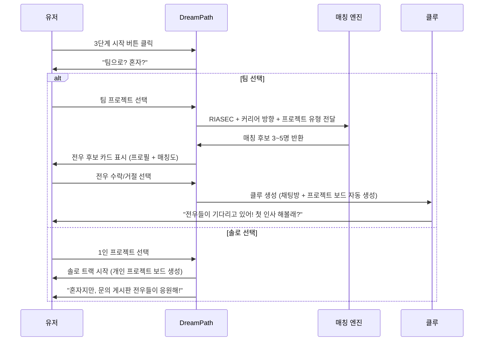

#### 전우 후보 프로필 카드 화면

```
┌─────────────────────────────────┐
│  ⚔️ 전우 후보                    │
│─────────────────────────────────│
│                                 │
│  👩 닉네임: 별하                 │
│  🎨 예술형(A) + 탐구형(I)       │
│  📍 고1 / 서울                  │
│                                 │
│  꿈: UX 디자이너                │
│  목표: "앱 포트폴리오 만들고 싶어"│
│                                 │
│  ┌─────────────────────────────┐│
│  │ 탐험한 직업: 67개            ││
│  │ 시뮬레이션: 12회             ││
│  │ 2단계 완료 ✅                ││
│  └─────────────────────────────┘│
│                                 │
│  전우 매칭도 ████████████ 94%   │
│                                 │
│  [⚔️ 전우 맺기]  [다음 후보 →]  │
│                                 │
└─────────────────────────────────┘
```

### 8.3 1달 그림자 프로젝트 (Shadow Project)

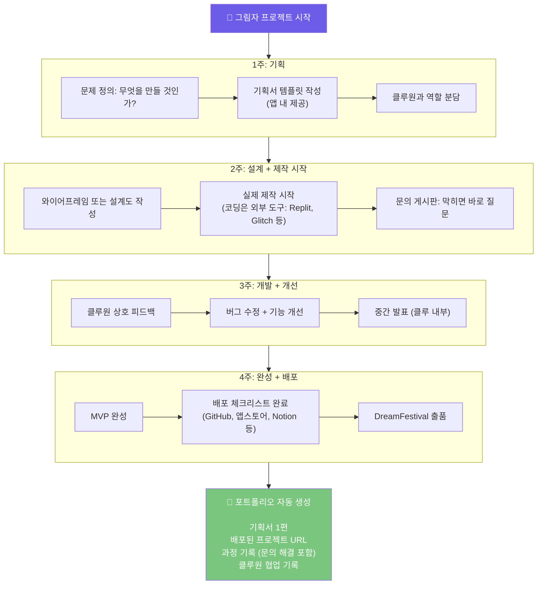

#### 그림자 프로젝트 클루 화면

```
┌─────────────────────────────────┐
│  ⚔️ 클루: 디자인 드리머즈        │
│  클루 레벨 Lv.4 ████████░░ 80%  │
│─────────────────────────────────│
│                                 │
│  👧서연  👩지민  👦하준  👧별하   │
│  Lv.4   Lv.3   Lv.3   Lv.4    │
│                                 │
│  🚀 그림자 프로젝트              │
│  "동네 카페 인테리어 AI 추천 앱" │
│                                 │
│  ┌─────────────────────────────┐│
│  │ 현재 진행 단계              ││
│  │ 1기획 ✅  2설계 ✅  3개발 📌  ││
│  │ ────────────────────────── ││
│  │ 3주차 체크리스트            ││
│  │ ☑️ 서연: 메인 UI 완성        ││
│  │ ☑️ 지민: 데이터 연결         ││
│  │ ☐ 하준: 테스트 케이스 작성   ││
│  │ ☑️ 별하: 디자인 QA           ││
│  └─────────────────────────────┘│
│                                 │
│  💬 클루 채팅                   │
│  ──────────────────             │
│  지민: API 연결 됐어! 테스트해봐 │
│  서연: 대박! 화면 연결해볼게요   │
│                                 │
│  [메시지 입력...]      [전송]   │
│  [📌 문의 올리기] [📁 기획서]   │
│                                 │
└─────────────────────────────────┘
```

### 8.4 문의 공유 생태계

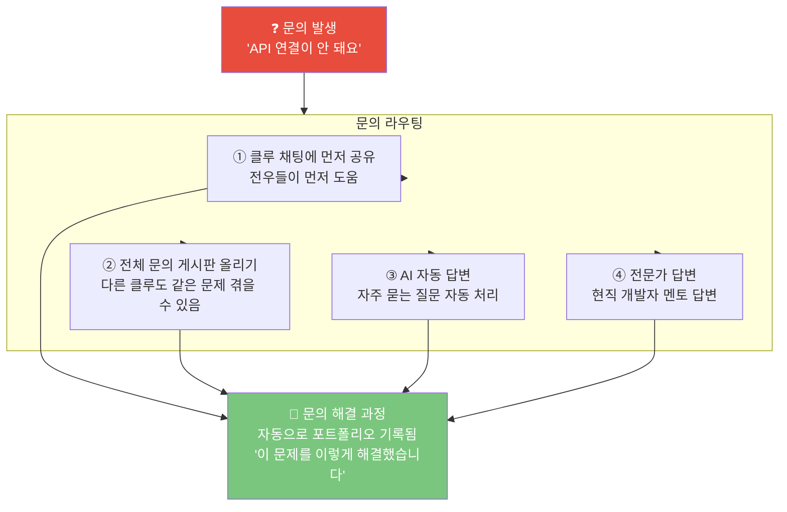

### 8.5 왕국별 협력 프로젝트 구상 시스템

> **"같은 왕국끼리는 너무 비슷하다. 다른 왕국이 만날 때 진짜 프로젝트가 태어난다."**
> 왕국 조합 × 역할 분담 × 모집 게시판 = 실제 세상을 바꾸는 그림자 프로젝트

#### 8.5.1 왕국 조합 × 프로젝트 유형 비교표

| 왕국 조합 | 프로젝트 유형 | 예시 프로젝트 | 산출물 | 추천 학년 |
|---------|-----------|-----------|------|---------|
| 🎨 창작 × 💻 기술 | **앱 개발** | 진로 추천 앱, 공간 인테리어 AI | 배포된 앱 URL | 중3~고2 |
| 🔬 탐구 × 📣 소통 | **연구·발표** | 청소년 정신건강 백서 | 보고서 + 발표 영상 | 고1~고2 |
| 🤝 연결 × 📣 소통 | **사회 캠페인** | 학교폭력 예방 캠페인 | 영상 + 캠페인 사이트 | 중2~고1 |
| 🌱 자연 × 💻 기술 | **환경 솔루션** | 스마트팜 모니터링 앱 | IoT 프로토타입 | 고1~고2 |
| 🎨 창작 × 📣 소통 | **창작 콘텐츠** | 진로 탐색 웹툰 제작 | 웹툰 10화 배포 | 중1~중3 |
| 🚀 도전 × 💻 기술 | **비즈니스 MVP** | 중학생 창업 플랫폼 | 사업계획서 + MVP | 고2~고3 |
| 🏛️ 질서 × 🤝 연결 | **정책 제안** | 학생 권리 조례안 작성 | 정책 제안서 + 발표 | 고1~고2 |
| 🔬 탐구 × 🌱 자연 | **융합 연구** | 기후 변화 AI 예측 모델 | GitHub + 논문 초안 | 고2~고3 |

#### 8.5.2 프로젝트 모집 게시판 시스템

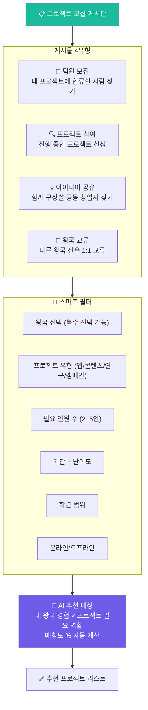

#### 8.5.3 프로젝트 모집 카드 화면

```
╔══════════════════════════════════════════╗
║  📢 팀원 모집                            ║
╠══════════════════════════════════════════╣
║                                          ║
║  프로젝트: "동네 카페 인테리어 AI 추천 앱"║
║  왕국 조합: 🎨 창작 × 💻 기술           ║
║                                          ║
║  👥 현재 팀                              ║
║  서연 — 🎨 창작 왕국 마스터 (중3)        ║
║  지민 — 💻 기술 왕국 탐험가 (고1)        ║
║                                          ║
║  🔍 지금 찾는 사람 (2자리 남음)          ║
║  ① 🌱 자연 왕국 경험자 1명             ║
║     역할: 카페 공간 환경 분석 담당        ║
║  ② 📣 소통 왕국 경험자 1명              ║
║     역할: SNS 홍보 + 발표 담당           ║
║                                          ║
║  📅 기간: 4주 (3월 시작)                 ║
║  🎯 목표: 앱 배포 + DreamFestival 출품  ║
║  📍 활동: 온라인 + 주말 오프라인         ║
║                                          ║
║  ━━━━━━━━━━━━━━━━━━━━━━━━━━━━━━━━       ║
║  나의 매칭도: ████████████ 91%           ║
║  이유: 창작 왕국 1주 캠프 완료 ✅        ║
║                                          ║
║  [참여 신청하기]  [북마크]  [더 보기]    ║
╚══════════════════════════════════════════╝
```

#### 8.5.4 역할별 모집 포지션 시스템

| 프로젝트 포지션 | 필요 왕국 경험 | 주요 담당 | 팀당 인원 |
|-------------|-------------|---------|---------|
| **기획자 (PM)** | 🚀 도전 or 🏛️ 질서 | 일정·역할 관리, 기획서 작성 | 1명 필수 |
| **디자이너** | 🎨 창작 | UI/UX, 시각 자료, 발표자료 | 1명 |
| **개발자** | 💻 기술 | 코드 작성, 배포, GitHub | 1~2명 |
| **연구원** | 🔬 탐구 | 데이터 분석, 리서치, 보고서 | 1명 |
| **홍보·소통** | 📣 소통 | SNS, 발표, 영상 제작 | 1명 |
| **현장 담당** | 🌱 자연 or 🤝 연결 | 현장 조사, 인터뷰, 봉사 연계 | 상황별 |

#### 8.5.5 왕국 교류 미팅 (Kingdom Exchange)

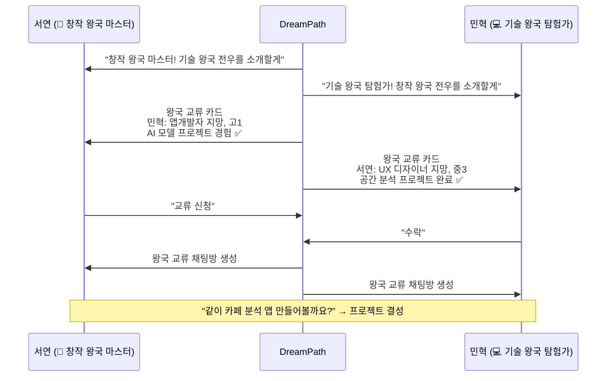

#### 8.5.6 프로젝트 구상 → 모집 → 팀 결성 → 완주 전체 플로우

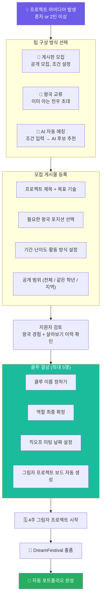

#### 8.5.7 프로젝트 유형별 4주 일정 템플릿 비교표

| 주차 | 앱 개발 프로젝트 | 연구·보고서 프로젝트 | 창작 콘텐츠 프로젝트 | 사회 캠페인 프로젝트 |
|-----|--------------|-----------------|-----------------|----------------|
| **1주: 기획** | 기능 정의 + 와이어프레임 | 주제 확정 + 조사 계획 | 스토리보드 + 역할 분담 | 캠페인 목표 + 채널 선정 |
| **2주: 제작** | 개발 시작 + 디자인 | 데이터 수집 + 분석 | 콘텐츠 1차 제작 | 콘텐츠 제작 + 홍보 시작 |
| **3주: 개선** | 테스트 + 버그 수정 | 초안 작성 + 클루 피드백 | 2차 수정 + 공개 준비 | 반응 분석 + 방향 수정 |
| **4주: 배포** | 앱스토어 / GitHub 배포 | 최종 보고서 + 발표 | 플랫폼 공개 + 공유 | 최종 보고 + DreamFestival |

---

### 8.7 DreamFestival — 학기 말 이벤트

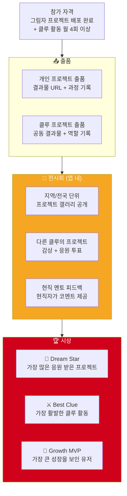

---

## 9. 유저 시나리오 — 5가지 페르소나별 완전 시나리오

### 9.0 페르소나 전체 맵

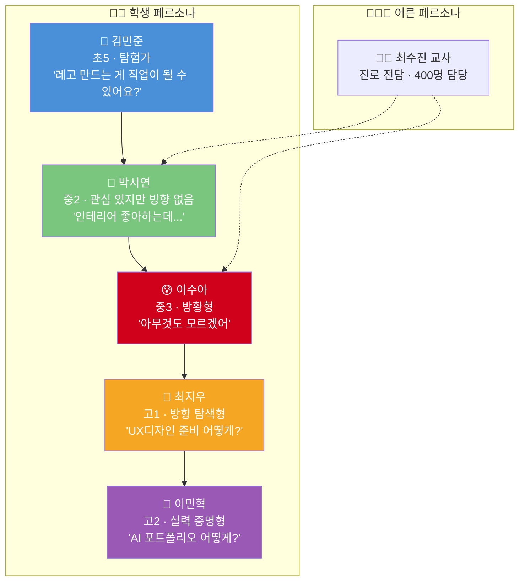

---

### 9.1 시나리오 A — 김민준 (초5, 탐험가형)

```
╔══════════════════════════════════════════════════════╗
║  👦 김민준 / 11세 / 초5 / 서울 노원구                ║
║  RIASEC: R(현실형) + I(탐구형)                       ║
║  "레고 만드는 게 직업이 될 수 있어요?"                ║
╚══════════════════════════════════════════════════════╝
```

#### 1단계 결과 및 2단계 진입

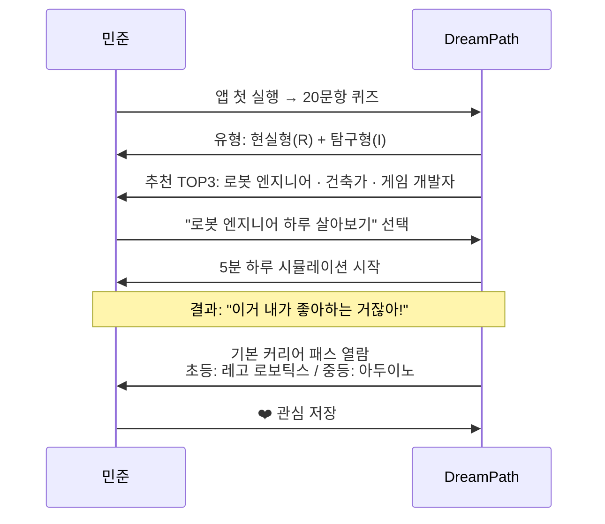

#### 주간 시나리오 (주말 15분)

| 시간 | 활동 | 앱 기능 | 결과 |
|------|------|--------|------|
| 0~5분 | 로봇 엔지니어 하루 시뮬레이션 | 선택지 스토리형 체험 | "회로 설계하는 부분이 제일 재밌어요!" |
| 5~10분 | 기본 커리어 패스 확인 | 초등 단계 체크리스트 | "중학교 때 아두이노 배워야 하네!" |
| 10~15분 | 직업 카드 5장 스와이프 | 틴더형 탐색 | 게임 개발자 카드 ❤️ 추가 저장 |

#### 학기 성장 타임라인

| 월 | 핵심 활동 | 결과물 |
|----|---------|--------|
| 1개월 | 적성 검사 + 하루 시뮬 3회 | RIASEC 유형 카드 |
| 2개월 | 직업 탐험 30개, 1주 캠프 1회 (로봇 엔지니어) | 1주 수료 뱃지 |
| 3개월 | 커리어 패스 5개 열람 + 합격자 패스 1회 비교 | 개인 커리어 패스 초안 |
| 4개월 | 3단계 클루 매칭 (로봇/공학 관심) | 클루 결성 |
| 5개월 | 그림자 프로젝트 시작 (미니 로봇 설계 노션) | 기획서 완성 |
| 6개월 | DreamFestival 출품 | 포트폴리오 1차 완성 |

---

### 9.2 시나리오 B — 박서연 (중2, 핵심 페르소나)

```
╔══════════════════════════════════════════════════════╗
║  👧 박서연 / 14세 / 중2 / 경기도 수원                ║
║  RIASEC: A(예술형) + S(사회형)                       ║
║  "인테리어 좋아하는데, 그게 직업이 될 수 있을까?"      ║
╚══════════════════════════════════════════════════════╝
```

#### 일일 시나리오 (평일 5분)

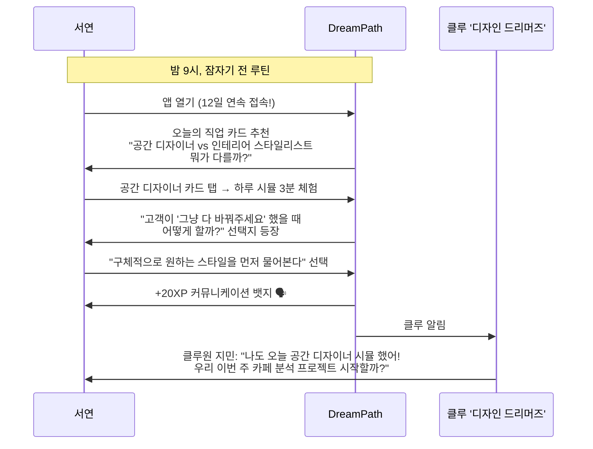

#### 2단계에서 3단계로 자연스러운 전환

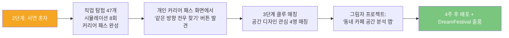

#### 부모 연동 시나리오

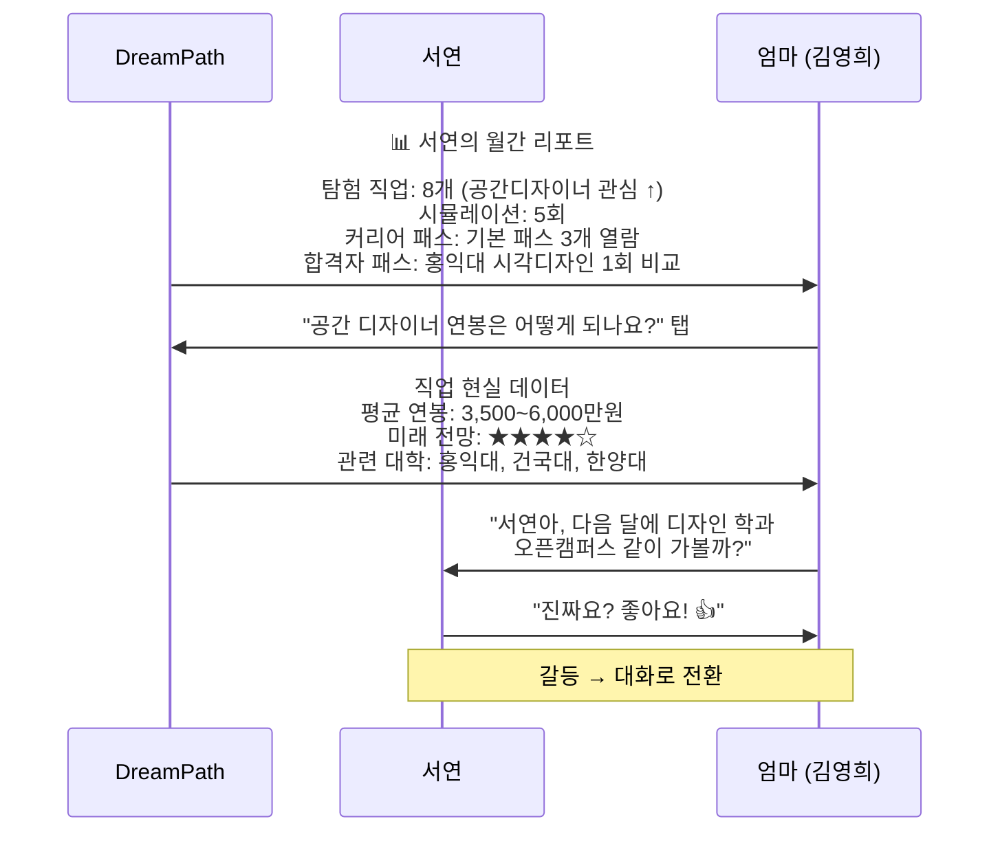

---

### 9.3 시나리오 C — 이수아 (중3, 방황형)

```
╔══════════════════════════════════════════════════════╗
║  😰 이수아 / 15세 / 중3 / 인천                       ║
║  RIASEC: 미측정 (검사 거부)                          ║
║  "아무것도 모르겠어요. 친구들은 다 뭔가 있는 것 같은데"║
╚══════════════════════════════════════════════════════╝
```

#### 방황형 특화 온보딩 흐름

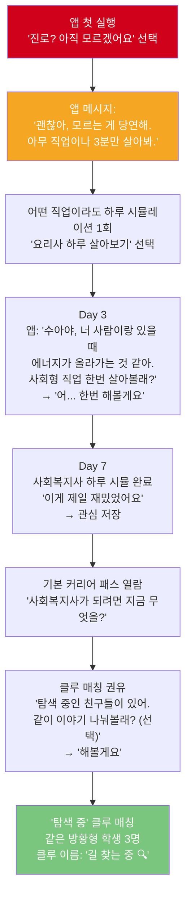

#### 수아의 3개월 변화 여정

| 시기 | 수아의 상태 | 앱 접근 방식 | 핵심 활동 | 변화 |
|------|-----------|-----------|---------|------|
| **1주~2주** | "아무것도 모르겠어" | 부담 없이 하루 시뮬 1회만 | 아무 직업이나 체험 | "이거 생각보다 재미있네" |
| **3주~4주** | "사람 관련 직업이 좋은 것 같기도..." | 사회형 직업 추천 카드 | 사회복지사·교사 시뮬 | "사람 돕는 직업이 맞는 것 같아" |
| **5주~6주** | "클루 친구들이랑 얘기하니까 좋아" | 클루 활동 시작 | 토론 참여, 서로 관심사 공유 | "나만 모르는 게 아니구나" |
| **7주~8주** | "커리어 패스를 보니 방향이 생겼어" | 기본 커리어 패스 열람 | 사회복지사 커리어 패스 체크 | "중3인데 아직 늦지 않았네" |
| **9주~10주** | "한번 해볼까" | 그림자 프로젝트 제안 | 클루와 '학교 문제 발견 캠페인' 기획 | "프로젝트 재밌어요!" |
| **11주~12주** | "나도 뭔가 하고 있다!" | 포트폴리오 자동 생성 | 시뮬레이션 기록 + 프로젝트 기획서 정리 | 개인 커리어 패스 완성 |

> **핵심 설계**: 방황형에게 절대 강요하지 않는다. 1회 하루 시뮬로 시작. 재미있으면 더 보여주고, 방향이 보이면 커리어 패스 연결.

---

### 9.4 시나리오 D — 최지우 (고1, 방향 탐색형)

```
╔══════════════════════════════════════════════════════╗
║  👩 최지우 / 16세 / 고1 / 서울 노원구                 ║
║  RIASEC: A(예술형) + E(진취형)                       ║
║  "UX 디자인이 좋다는 건 알았는데, 고등학교에서 뭘 해야?"║
╚══════════════════════════════════════════════════════╝
```

#### 중→고 커리어 패스 인수인계 시나리오

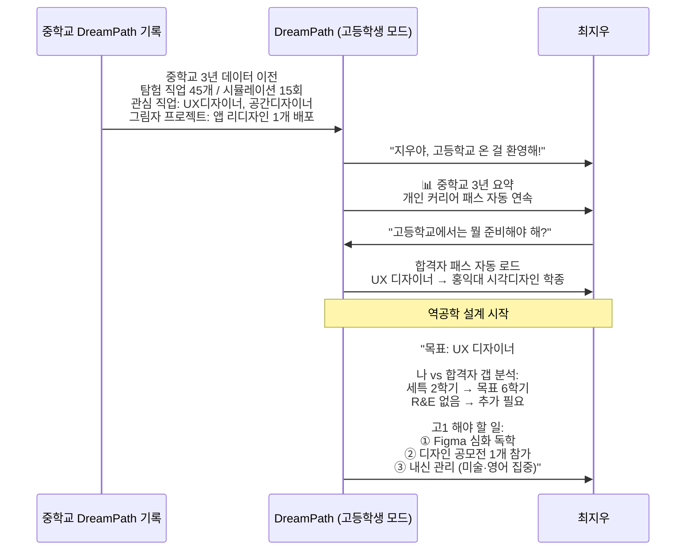

#### 고1 학기별 상세 시나리오

| 시기 | 핵심 활동 | DreamPath 활용 | 클루 활동 | 산출물 |
|------|---------|--------------|---------|--------|
| 고1 3월 | 계열 확정 (예체능+인문 융합) | 합격자 패스 계열별 비교 | 고1 디자인 클루 매칭 | 계열 선택 보고서 |
| 고1 4~5월 | Figma 독학 시작 | 스킬 로드맵 가이드 | 클루원끼리 Figma 스터디 | Figma 포트폴리오 5작품 |
| 고1 6~7월 | 디자인 공모전 참가 | 공모전 DB + 알림 | 클루 공모전 함께 참가 | 공모전 출품작 |
| 고1 8~9월 | 그림자 프로젝트 시작 | 프로젝트 보드 + 클루 채팅 | 클루 역할 분담 | UX 리서치 보고서 |
| 고1 10~11월 | 포트폴리오 1차 정리 | 자동 포트폴리오 생성 | 클루 포트폴리오 리뷰 | 포트폴리오 PDF 10페이지 |
| 고1 12~2월 | 멘토 연결 (현직 UX 디자이너) | 멘토 매칭 시스템 | 멘토 세션 클루원 공동 참가 | 멘토 피드백 기록 |

---

### 9.5 시나리오 E — 이민혁 (고2, 실력 증명형)

```
╔══════════════════════════════════════════════════════╗
║  👦 이민혁 / 17세 / 고2 / 경기 성남시                 ║
║  RIASEC: I(탐구형) + C(관습형)                       ║
║  "AI 개발자 목표는 확실한데, 포트폴리오가 막막해"       ║
╚══════════════════════════════════════════════════════╝
```

#### 1달 그림자 프로젝트 시나리오

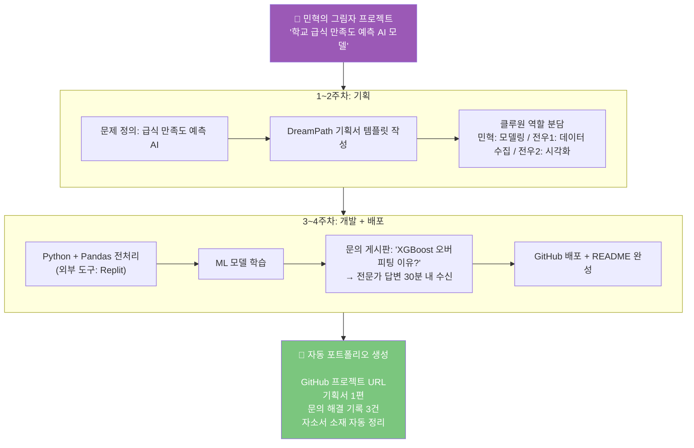

#### 입시 서류 자동 연결

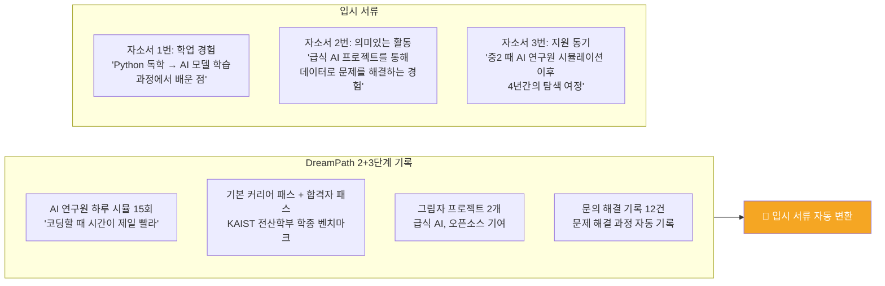

---

### 9.6 시나리오 F — 최수진 교사 (진로 전담)

```
╔══════════════════════════════════════════════════════╗
║  👩‍🏫 최수진 / 38세 / 중학교 진로 전담 교사 / 경력 8년║
║  담당 학생: 약 400명                                  ║
║  "개인 상담을 하고 싶지만 400명은 불가능"               ║
╚══════════════════════════════════════════════════════╝
```

#### 교사 대시보드 시나리오

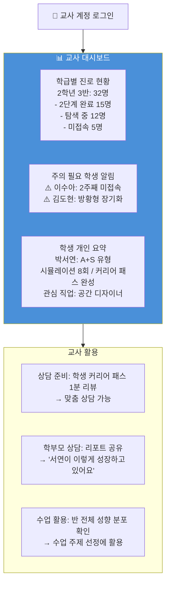

---

## 10. 전체 화면 설계

### 10.1 앱 정보 아키텍처

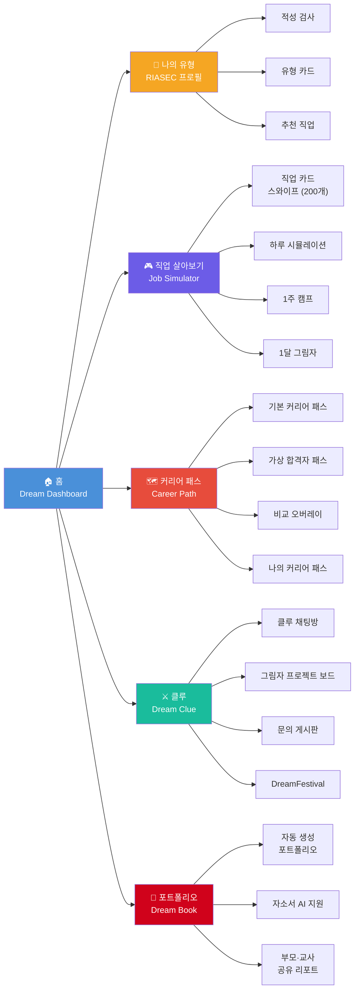

### 10.2 홈 화면 (Dream Dashboard)

```
┌─────────────────────────────────┐
│  DreamPath               🔔 ⚙️  │
│─────────────────────────────────│
│                                 │
│  🎨 서연 — 예술형 + 사회형      │
│  Lv.4 탐험가 ████████░░ 78%     │
│                                 │
│  ┌─────────────────────────────┐│
│  │ 🎮 오늘의 추천 체험          ││
│  │ "공간 디자이너 하루 살아보기" ││
│  │ ★★★ 매칭 95% · 5분          ││
│  │              [살아보기 →]   ││
│  └─────────────────────────────┘│
│                                 │
│  📋 오늘의 미션                  │
│  ☐ 직업 카드 1장 스와이프 (+5XP)│
│  ☐ 하루 시뮬레이션 1회  (+30XP)│
│  ☐ 클루원에게 응원 1개  (+5XP) │
│                                 │
│  🗺️ 나의 커리어 패스            │
│  UX 디자이너 달성도 ███░ 78%    │
│  [보완 추천 3가지 확인 →]       │
│                                 │
│  ⚔️ 클루: 디자인 드리머즈        │
│  "지민: 오늘 API 연결 됐어!"    │
│  [클루 채팅 열기 →]             │
│                                 │
│─────────────────────────────────│
│  🧭    🎮    🗺️    ⚔️    📁    │
│  유형  살기  패스  클루  포폴  │
└─────────────────────────────────┘
```

### 10.3 직업 살아보기 화면 (Job Simulator)

```
┌─────────────────────────────────┐
│  🎮 직업 살아보기                │
│─────────────────────────────────│
│                                 │
│  [내 성향 맞춤] [전체] [8대 분야]│
│                                 │
│  탐험 진행도: 47/200 직업       │
│  █████████░░░░░ 23.5%           │
│                                 │
│  ┌─────────────────────────────┐│
│  │  🎨 공간 디자이너            ││
│  │  매칭 95% · ★★★★☆ 전망    ││
│  │                             ││
│  │  [▶ 하루 살아보기 5분]      ││
│  │  [📅 1주 캠프 신청]          ││
│  │  [🗺️ 커리어 패스 보기]      ││
│  │                             ││
│  │  연봉: 3,500~6,000만원      ││
│  │                             ││
│  │     [← 패스]  [관심 ❤️ →]  ││
│  └─────────────────────────────┘│
│                                 │
│  ❤️ 관심 저장한 직업 (7개)       │
│  UX디자이너 · 공간디자이너 · +5 │
│                                 │
└─────────────────────────────────┘
```

### 10.4 커리어 패스 화면

```
┌─────────────────────────────────┐
│  🗺️ 나의 커리어 패스             │
│─────────────────────────────────│
│                                 │
│  🎯 목표 직업: UX 디자이너      │
│                                 │
│  [기본 패스] [합격자 패스] [비교]│
│                                 │
│  📍 현재: 중2 2학기              │
│                                 │
│  ━━━━━━━━●━━━━━━━━━━━━━━━━━     │
│  초등   중등   고등   대학       │
│  완료   📌     🔒     🔒         │
│                                 │
│  📌 지금 해야 할 것 (중등)       │
│  ☑️ 디자인 씽킹 PBL 참여        │
│  📌 UI 리디자인 공모전 도전 (D-14)│
│  ☐ 중3-1: 포트폴리오 시작       │
│                                 │
│  🏆 합격자 대비 달성도           │
│  내신 ████████░░ 80%            │
│  세특 ████░░░░░░ 40%            │
│  수상 ██░░░░░░░░ 20%            │
│                                 │
│  💡 보완 추천                   │
│  → 코딩 동아리 가입 (우선순위 1) │
│                                 │
│  [PDF 저장] [알림 설정]         │
└─────────────────────────────────┘
```

### 10.5 포트폴리오 화면 (Dream Book)

```
┌─────────────────────────────────┐
│  📁 서연의 Dream Book            │
│  [편집] [PDF 다운로드] [공유]    │
│─────────────────────────────────│
│                                 │
│  🙋 나는 이런 사람               │
│  강점: 창작형 / 표현형 / 설계형  │
│  RIASEC: A(예술) + S(사회)      │
│                                 │
│  🎮 직업 탐험 기록 (47개)        │
│  ❤️ UX디자이너 | 공간디자이너    │
│  ❤️ 인테리어 스타일리스트        │
│                                 │
│  🗺️ 커리어 패스 달성도           │
│  UX 디자이너 목표 ███░ 78%      │
│                                 │
│  🚀 그림자 프로젝트 (2개)        │
│  ┌──────────┐ ┌──────────┐     │
│  │📱앱 리디자│ │🏠카페 분석│     │
│  │인 챌린지  │ │ AI 앱    │     │
│  │ 배포 ✅  │ │ 배포 ✅  │     │
│  └──────────┘ └──────────┘     │
│                                 │
│  📈 성장 타임라인                │
│  3월 ─── 5월 ─── 7월 ─── 9월   │
│  검사완료  첫시뮬  클루결성  배포 │
│                                 │
└─────────────────────────────────┘
```

---

## 11. 수익 모델

### 11.1 수익 구조

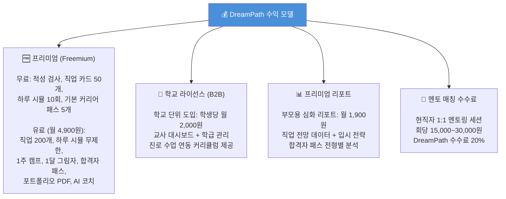

### 11.2 프리미엄 vs 무료 기능 비교

| 기능 | 무료 | 유료 (월 4,900원) |
|------|------|-----------------|
| 적성 검사 | ✅ 1회 | ✅ 무제한 재검사 |
| 직업 카드 스와이프 | ✅ 50개 | ✅ 200개+ |
| 하루 시뮬레이션 | ✅ 10회 | ✅ 무제한 |
| 1주 캠프 | ❌ | ✅ |
| 1달 그림자 프로젝트 | ❌ | ✅ |
| 기본 커리어 패스 | ✅ 5개 | ✅ 전체 |
| 가상 합격자 패스 | ❌ | ✅ 학종/정시/특기자/해외 |
| 비교 오버레이 | ❌ | ✅ |
| 클루 매칭 | ✅ 1개 | ✅ 무제한 |
| 포트폴리오 PDF | ❌ | ✅ |
| 자소서 AI 지원 | ❌ | ✅ |
| 멘토 매칭 | ❌ | ✅ |

### 11.3 예상 수익 시뮬레이션

| 항목 | 출시 6개월 | 출시 1년 | 출시 2년 |
|------|----------|---------|---------|
| 가입 사용자 | 50,000명 | 200,000명 | 500,000명 |
| 유료 전환율 | 5% | 8% | 12% |
| 학교 라이선스 | 50개교 | 200개교 | 500개교 |
| 월 매출 (추정) | 약 3,000만원 | 약 1.5억원 | 약 5억원 |

---

## 12. 개발 로드맵

### 12.1 전체 로드맵

```mermaid
gantt
    title DreamPath 개발 로드맵
    dateFormat YYYY-MM
    section Phase 1: MVP (3개월)
    적성 검사 + RIASEC 결과           :2026-04, 3w
    직업 카드 스와이프 (50개)          :2026-04, 5w
    하루 시뮬레이션 (20개 직업)        :2026-05, 5w
    캐릭터 레벨 + 뱃지 시스템          :2026-05, 3w
    클루 매칭 + 채팅 기본              :2026-06, 4w
    section Phase 2: 베타 (3개월)
    기본 커리어 패스 (50개 직업)       :2026-07, 6w
    1주 캠프 시스템                    :2026-07, 4w
    가상 합격자 패스 (학종/정시)        :2026-08, 6w
    포트폴리오 자동 생성               :2026-09, 4w
    section Phase 3: 정식 출시 (6개월)
    직업 200개 확대 + 1달 그림자       :2026-10, 8w
    가상 합격자 패스 (특기자/해외)     :2026-11, 4w
    비교 오버레이 + 갭 분석            :2026-11, 4w
    문의 공유 생태계                    :2026-12, 6w
    교사 대시보드                      :2027-01, 6w
    자소서 AI 지원                     :2027-02, 6w
    DreamFestival 시스템               :2027-03, 4w
```

### 12.2 MVP 핵심 기능 정의

| 우선순위 | 기능 | 왜 MVP인가? | 개발 기간 |
|---------|------|-----------|---------|
| 🔴 P0 | 적성 검사 (20문항) | 모든 여정의 시작점 | 2주 |
| 🔴 P0 | 직업 카드 스와이프 (50개) | 핵심 가치 체험 | 4주 |
| 🔴 P0 | 하루 시뮬레이션 (20개) | 차별점의 핵심 | 5주 |
| 🔴 P0 | 클루 매칭 + 채팅 | 전우 시스템 체험 | 4주 |
| 🟡 P1 | 기본 커리어 패스 (50개) | 행동 유도 핵심 | 6주 |
| 🟡 P1 | 캐릭터 레벨 + 뱃지 | 리텐션 동기 | 2주 |
| 🟡 P1 | 부모 리포트 (기본) | 부모 참여 유도 | 2주 |
| 🟢 P2 | 가상 합격자 패스 | 프리미엄 차별점 | 6주 |
| 🟢 P2 | 포트폴리오 PDF | 유료 전환 유도 | 3주 |

### 12.3 기술 스택

| 영역 | 기술 | 선택 이유 |
|------|------|---------|
| **프론트엔드** | React Native (Expo) | iOS + Android 동시 개발, 빠른 MVP |
| **백엔드** | Node.js + Express | 빠른 API 개발 |
| **데이터베이스** | PostgreSQL + Redis | 관계형 데이터 + 실시간 캐싱 |
| **실시간 채팅** | Socket.io | 클루 채팅 실시간 |
| **AI 엔진** | OpenAI API + 커스텀 모델 | 직업 매핑, 합격자 패스 생성 |
| **인프라** | AWS (EC2 + RDS + S3) | 확장성 + 안정성 |
| **분석** | Mixpanel + BigQuery | 사용자 행동 분석 |

---

## 13. KPI 및 성공 지표

### 13.1 핵심 지표 대시보드

```mermaid
flowchart LR
    KPI["📊 DreamPath KPI"] --> K1 & K2 & K3 & K4 & K5

    K1["📱 리텐션<br>D1: 70%+<br>D7: 40%+<br>D30: 25%+"]

    K2["🎮 체험 깊이<br>하루 시뮬 완료율<br>DAU 기준 50%+"]

    K3["🗺️ 커리어 패스<br>기본 패스 열람<br>가입 후 7일내 80%+"]

    K4["⚔️ 클루 활동<br>주간 클루 참여율<br>60%+ (주 1회 이상)"]

    K5["📁 포트폴리오<br>그림자 프로젝트 배포율<br>3단계 진입자 기준 40%+"]
```

### 13.2 사용자 성공 지표

| 지표 | 초등 | 중학생 | 고등학생 | 교사 | 부모 |
|------|------|--------|---------|------|------|
| 시뮬레이션 횟수 | 10회+/학기 | 20회+/학기 | 30회+/학기 | — | — |
| 커리어 패스 완성 | 기본 패스 1개 | 기본+합격자 패스 | 나만의 패스 완성 | — | — |
| 그림자 프로젝트 | 기획까지 | 1개 배포 | 2개 배포 | — | — |
| 진로 불안 지수 | — | 30% 감소 | 40% 감소 | — | — |
| 상담 준비 시간 | — | — | — | 50% 절감 | — |
| 리포트 열람 | — | — | — | — | 월 2회+ |

---

## 14. 결론 — DreamPath 핵심 가치 정리

```mermaid
flowchart TD
    Core["🌟 DreamPath 핵심 가치"] --> V1 & V2 & V3

    subgraph V1["직접 살아본다"]
        V1A["하루 시뮬로 직업인이 되어본다"]
        V1B["1주 캠프로 깊이 체험한다"]
        V1C["1달 그림자로 현실을 경험한다"]
    end

    subgraph V2["길이 보인다"]
        V2A["기본 커리어 패스: 지금 뭘 해야 하는가"]
        V2B["합격자 패스: 어디까지 가야 하는가"]
        V2C["갭 분석: 지금 부족한 것은 무엇인가"]
    end

    subgraph V3["함께 완성한다"]
        V3A["전우와 함께 배포까지 완주"]
        V3B["문의 해결 과정이 포트폴리오가 됨"]
        V3C["DreamFestival에서 세상에 발표"]
    end

    V1 & V2 & V3 --> Mission["🎯 미션<br><br>'대한민국 모든 청소년이<br>진로 불안 대신 진로 설렘을 느끼고,<br>직업을 살아보며 자신의 길을 발견하는 세상을 만든다'"]

    style Core fill:#4A90D9,color:#fff
    style Mission fill:#7BC67E,color:#fff
```

### 한 줄 핵심

> **"직업을 고르는 게 아니라, 직업을 살아보는 것."**
>
> 10분 검사로 방향이 보이고,
> 직접 살아보며 현실을 알고,
> 전우와 함께 완성하며 증명한다.
> **DreamPath는 그 여정 전체를 함께 기록한다.**

---

> 📌 **참고 데이터 출처**
> - 교육부·한국직업능력연구원 「2024 초·중등 진로교육 현황조사」(n=38,481)
> - 커리어넷 직업흥미검사(H) RIASEC 설계 자료
> - 2028 대입 개편안 — 교육부 발표 (2024)
> - 경기도교육청 「꿈it(잇)다」 AI 진로진학 시스템 (2025)
> - 드림어필 운영 현황 (2025, 6만 사용자)
> - iLevelUP, Meroo, SkillHatch 해외 앱 분석 (2025)
> - World Economic Forum: Future of Jobs Report 2025

---

*작성일: 2026년 2월 | DreamPath 상세 기획서 V2 (하)*
*이전 버전: DreamPath_상세기획서_하.md (V1) → 통합 업데이트*
