# Dream Path 앱 상세 기획서 (상)
# — 경쟁 분석 · 차별점 · 홀랜드 검사 · 교육 트렌드 · 콘셉트 설계

> **"혼자 꾸면 꿈, 함께 걸으면 길"**
> 커리어 탐색 + 함께하는 프로젝트 + 게임형 성장 RPG

---

## 0. Executive Summary — 왜 Dream Path인가?

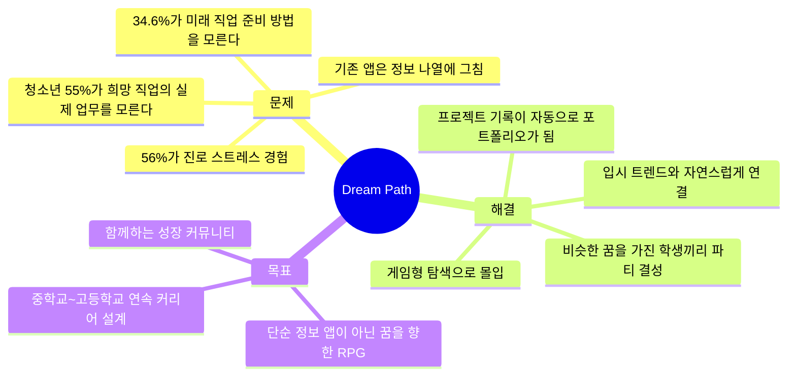

### 0.1 앱 정체성 한눈에 보기

| 항목 | 내용 |
|------|------|
| **앱 이름** | Dream Path (드림패스) |
| **슬로건** | "혼자 꾸면 꿈, 함께 걸으면 길" |
| **핵심 정체성** | 커리어 탐색 + 함께하는 프로젝트 + 게임형 성장 RPG |
| **타겟 사용자** | 초등 고학년 ~ 고등학생 + 부모 + 교사 |
| **핵심 차별점** | 꿈이 같은 사람끼리 파티를 맺어 함께 성장하는 유일한 앱 |
| **비전** | 대한민국 청소년이 "진로 불안" 대신 "진로 설렘"을 느끼는 세상 |

---

## 1. 경쟁 앱 분석 — 국내 · 해외 전체 비교

### 1.1 국내 경쟁 서비스 상세 비교

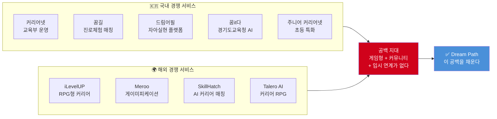

| 서비스 | 운영 주체 | 대상 | 핵심 기능 | 강점 | 약점 | 사용자 수 |
|--------|----------|------|----------|------|------|----------|
| **커리어넷** | 교육부·한국직업능력연구원 | 초~대학 | 진로검사(홀랜드H/K), 직업백과, 학과정보 | 공신력, 무료, 방대한 DB | PC 중심, UI 구식, 행동 연결 없음, 기록 안 됨 | 약 600만+ |
| **꿈길** | 교육부 | 중·고 | 진로체험 기관 매칭 | 체험 기관 연결 | 예약만 가능, 사후 기록 없음 | 비공개 |
| **드림어필** | 스타트업 | 중·고 | 꿈 실천 응원, 기록 | 6만 청소년 사용, 846개교 도입 | 커리어 패스 설계 없음, 게임성 약함 | 6만+ |
| **꿈it(잇)다** | 경기도교육청 | 초5~고3 | AI 진로로드맵, 모의면접 | 2025 신규, AI 기반 | 경기도 한정, 커뮤니티 없음 | 2,500개교 예정 |
| **주니어 커리어넷** | 교육부 | 초등 | 진로탐험대 미션 | 게이미피케이션 시도 | 초등 한정, 중·고 연계 없음 | 비공개 |

### 1.2 해외 경쟁 서비스 상세 비교

| 서비스 | 국가 | 대상 | 핵심 기능 | 강점 | 약점 |
|--------|------|------|----------|------|------|
| **iLevelUP** | 미국 | 고등·대학 | RPG 퀘스트, 3명의 멘토 NPC, 장학금 매칭 | 게이미피케이션 완성도 높음 | 한국 입시 맥락 없음, 영어 전용 |
| **Meroo** | 호주 | 16~25세 | 미니게임으로 강점 발견, 직업 매칭 | 자기 발견 + 직업 연결 잘 됨 | 커뮤니티 없음, 한국 직업 DB 없음 |
| **SkillHatch** | 미국 | 대학생 | AI 커리어 어시스턴트, 포인트 시스템 | 인턴십·해커톤 통합 DB | 청소년 대상 아님, 탐색 기능 약함 |
| **Talero AI** | 미국 | 구직자 | 커리어 RPG, AI 매칭 | RPG 콘셉트 | 성인 대상, 탐색보다 매칭 중심 |

### 1.3 경쟁 서비스 기능 매트릭스 (핵심 비교표)

| 기능 | 커리어넷 | 꿈길 | 드림어필 | 꿈it다 | iLevelUP | Meroo | **Dream Path** |
|------|---------|------|---------|--------|----------|-------|---------------|
| 자기 발견 검사 | ✅ 홀랜드 | ❌ | ❌ | ✅ AI | ✅ 성격검사 | ✅ 미니게임 | ✅ **에너지일기 + 홀랜드 + AI** |
| 직업 탐색 | ✅ 텍스트 | ❌ | ❌ | ✅ AI | ✅ 카드형 | ✅ 매칭 | ✅ **게임 맵 + 시뮬레이션** |
| 체험 기록 | ❌ | ❌ | ✅ 일부 | ❌ | ❌ | ❌ | ✅ **자동 포트폴리오** |
| 프로젝트 가이드 | ❌ | ❌ | ❌ | ❌ | ❌ | ❌ | ✅ **4주/8주 미니 프로젝트** |
| 게이미피케이션 | ❌ | ❌ | ⚠️ 약함 | ❌ | ✅ RPG | ✅ 미니게임 | ✅ **RPG + 파티 + 퀘스트** |
| 커뮤니티 | ❌ | ❌ | ✅ 응원 | ❌ | ❌ | ❌ | ✅ **파티 시스템 (꿈 동료)** |
| 입시 연계 | ❌ | ❌ | ❌ | ✅ 일부 | ❌ | ❌ | ✅ **학종·수시·포트폴리오** |
| 부모·교사 연결 | ❌ | ❌ | ❌ | ❌ | ❌ | ❌ | ✅ **리포트 공유 시스템** |
| 모바일 최적화 | ❌ PC중심 | ❌ PC | ✅ | ✅ | ✅ | ✅ | ✅ **모바일 퍼스트** |
| 한국 입시 맥락 | ✅ | ✅ | ✅ | ✅ | ❌ | ❌ | ✅ **2028 대입 개편 반영** |

### 1.4 시장 공백 분석 — Dream Path가 채우는 빈 곳

| 서비스명       | 정보 나열 (낮음=0, 높음=1) | 행동 유도 (낮음=0, 높음=1) | 개인 탐색 (낮음=0, 높음=1) | 커뮤니티 성장 (낮음=0, 높음=1) | 주요 특징                      | 비고                    |
|----------------|------------------------|------------------------|------------------------|------------------------|-----------------------------|-----------------------|
| 커리어넷        | 0.3                    | 0.2                    | ○                      | △                      | 국가 진로정보 대표 서비스        | 기존 진로 서비스 밀집 영역     |
| 꿈길           | 0.2                    | 0.15                   | ○                      | △                      | 체험 기관 정보 중심             | 기존 진로 서비스 밀집 영역     |
| 드림어필        | 0.4                    | 0.55                   | ○                      | ○                      | 일부 응원 커뮤니티, 기록 가능      | 커뮤니티는 있으나 행동 적음     |
| 꿈it다         | 0.5                    | 0.25                   | ○                      | △                      | AI 진로추천, 경기도 중심          | 기존 진로 서비스 밀집 영역     |
| iLevelUP       | 0.7                    | 0.3                    | △                      | △                      | 게이미피케이션 RPG, 영어권        | 행동 유도 영역                |
| Meroo          | 0.6                    | 0.2                    | ○                      | △                      | 미니게임 직업 매칭, 커뮤니티 약함   | 행동 유도 영역                |
| Dream Path     | 0.85                   | 0.85                   | ◎                      | ◎                      | 게임+커뮤니티+입시연계, 높은 유도   | Dream Path 목표 지점           |

* ○=강조, △=중간, ◎=최고

- x축: 정보 나열(좌) → 행동 유도(우)
- y축: 개인 탐색(하) → 커뮤니티 성장(상)
- Dream Path는 가장 우상단(행동+커뮤니티 성장) 목표

---

## 2. Dream Path의 5대 차별점과 강점

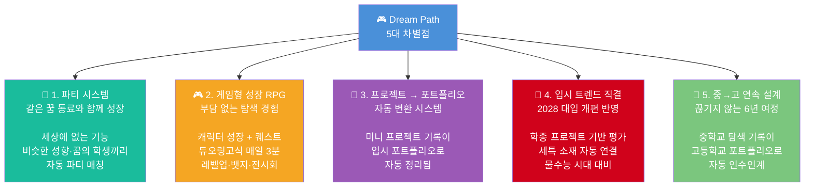

### 2.1 차별점 상세 비교표

| 차별점 | 기존 서비스 | Dream Path | 왜 다른가? |
|--------|-----------|------------|----------|
| **파티 시스템** | 없음 (모두 개인 탐색) | 같은 꿈 3~5명 자동 매칭, 공동 퀘스트 | 진로 탐색의 외로움 해결. "나만 고민하는 게 아니구나" |
| **게임형 RPG** | 주니어 커리어넷 미션 정도 | 캐릭터 성장, 챕터 진행, 보스 배틀 | 점수·등급이 아닌 "성장 스토리"로 동기 부여 |
| **프로젝트 자동 포트폴리오** | 없음 | 4주/8주 프로젝트 기록 → PDF 자동 생성 | 활동 기록이 입시 서류로 바로 연결 |
| **2028 입시 연계** | 커리어넷: 검사만, 꿈it다: 일부 | 학종 세특 연계, 권장과목 가이드, 전공적합성 매핑 | 프로젝트 기반 평가 트렌드에 최적화 |
| **6년 연속 설계** | 모두 단발성 | 중1~고3 데이터 연속, 인수인계 시스템 | 고3 자소서에 중학교 탐색부터 쓸 수 있음 |

### 2.2 Dream Path가 추구하는 3가지 목표

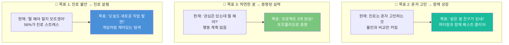

| 목표 | 측정 지표 | 6개월 목표 | 1년 목표 |
|------|---------|-----------|---------|
| 진로 불안 → 설렘 | 월간 진로 불안 지수 (자가 평가) | 불안 지수 30% 감소 | 불안 지수 50% 감소 |
| 혼자 → 함께 | 파티 내 상호작용 횟수 | 주 3회 이상 파티 활동 | 파티 프로젝트 1개 공동 완성 |
| 막연 → 증명 | 포트폴리오 완성도 | 미니 프로젝트 2개 완성 | 포트폴리오 PDF 1차 완성 |

---

## 3. 홀랜드 검사(Holland RIASEC) 심층 분석

### 3.1 홀랜드 검사란?

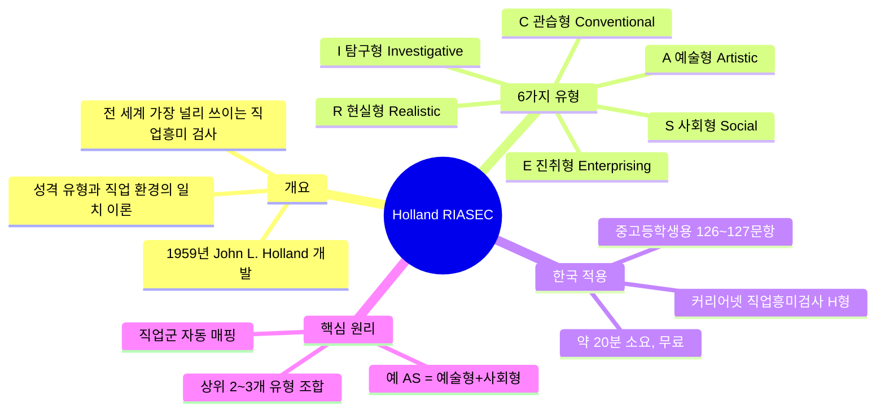

### 3.2 RIASEC 6가지 유형 상세 비교표

| 유형 | 코드 | 핵심 특성 | 대표 강점 | 에너지 올라가는 순간 | 잘 맞는 직업 분야 | 대표 직업 예시 |
|------|------|---------|---------|-----------------|----------------|-------------|
| **현실형** | R | 손으로 만들기, 몸 쓰기 | 정밀함, 체력, 기계적 감각 | 레고 조립, 운동, 요리 | 공학, 건축, 스포츠, 농업 | 로봇 엔지니어, 건축가, 스포츠 코치 |
| **탐구형** | I | 왜? 어떻게? 질문 | 분석력, 논리, 호기심 | 실험, 퍼즐 풀기, 코딩 | 과학, 의학, IT, 연구 | 데이터 사이언티스트, 의사, 연구원 |
| **예술형** | A | 만들고 표현하기 | 창의력, 감수성, 상상력 | 그림 그리기, 음악, 글쓰기 | 디자인, 미디어, 예술, 문학 | UX 디자이너, 웹툰 작가, 영화감독 |
| **사회형** | S | 사람 돕고 가르치기 | 공감력, 소통, 배려 | 친구 고민 상담, 가르치기 | 교육, 의료, 복지, 상담 | 교사, 간호사, 사회복지사 |
| **진취형** | E | 이끌고 설득하기 | 리더십, 추진력, 자신감 | 발표, 토론, 프로젝트 주도 | 경영, 법, 정치, 영업 | 스타트업 창업가, 마케터, 변호사 |
| **관습형** | C | 계획하고 정리하기 | 꼼꼼함, 책임감, 성실 | 일정 정리, 데이터 분류 | 회계, 행정, 금융, 데이터 | 회계사, 데이터 분석가, 행정가 |

### 3.3 RIASEC 유형 관계도 (육각형 모델)

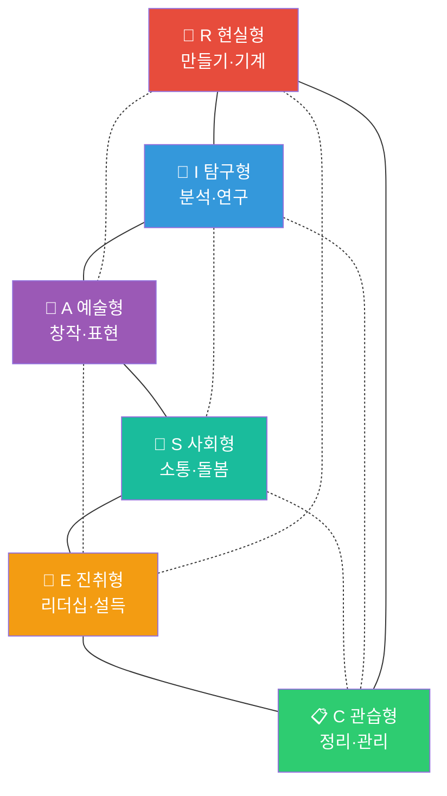

> **해석 방법**: 인접한 유형은 유사도 높음 (R-I, A-S 등), 대각선 유형은 반대 성향 (R-S, I-E, A-C)

### 3.4 홀랜드 검사의 한계 vs Dream Path의 대안

| 한계 | 구체적 문제 | Dream Path의 해결책 |
|------|-----------|-------------------|
| **결과 불일치** | 할 때마다 결과가 달라짐 | 시간별 추이 시각화 → "트렌드"가 진짜 성향 |
| **라벨링 위험** | "나는 A형이니까 예술만" 고정 사고 | 검사는 참고, 에너지 일기의 패턴이 주력 |
| **신생 직업 미반영** | AI 시대 직업이 DB에 없음 | AI 기반 매핑 엔진으로 실시간 업데이트 |
| **문항이 추상적** | 중학생에게 60문항이 지루함 | 게임형 미니 퀴즈로 재설계 (5분 완성) |
| **행동 연결 없음** | 결과 보고 끝, 다음 행동 없음 | 결과 → 직업 추천 → 미니 프로젝트까지 자동 연결 |
| **1회성** | 한 번 하고 잊어버림 | 3개월마다 재검사, 성장 비교 제공 |

### 3.5 Dream Path에서의 자기 발견 시스템 (홀랜드 검사 재설계)

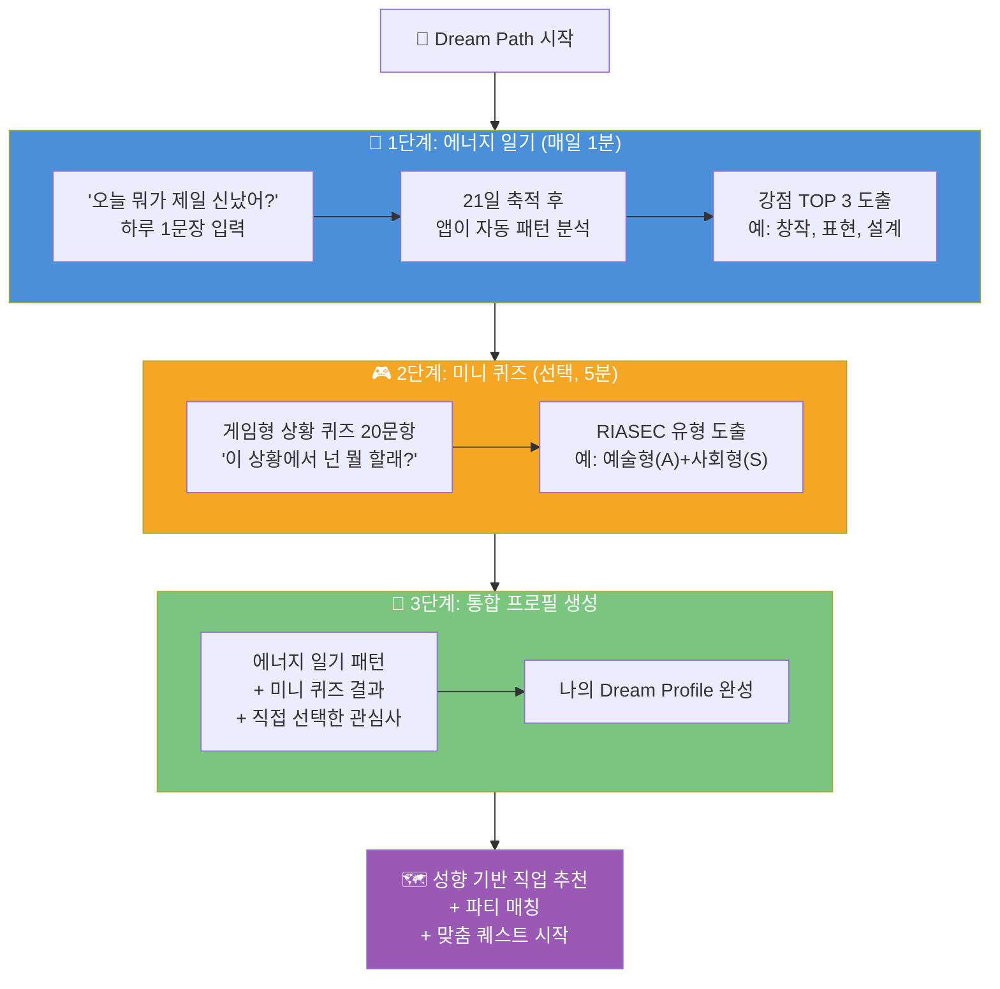

---

## 4. 교육 트렌드 분석 — 왜 지금 Dream Path인가?

### 4.1 2028 대입 개편 핵심 변화

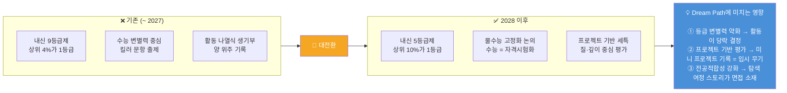

### 4.2 내신 · 수능 · 학종 비율 변화 추이

| 시기 | 내신(교과전형) | 수능(정시) | 학종(종합전형) | 핵심 트렌드 |
|------|-------------|----------|-------------|-----------|
| 2024~2025 | 약 40% | 약 30% | 약 30% | 내신 중심 |
| 2026~2027 | 약 35% | 약 30% | 약 35% | 학종 비중 증가 시작 |
| **2028 이후** | 약 30% | 약 25% | **약 40%+** | **학종이 최대 전형, 프로젝트 기반 평가 본격화** |

### 4.3 학생부종합전형에서 Dream Path가 만드는 차이

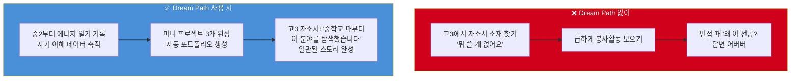

### 4.4 학년별 내신 · 수능 · 전공 프로젝트 준비 비율 가이드

| 학년 | 내신 관리 | 수능 대비 | 전공 프로젝트 | 커리어 탐색 | Dream Path 핵심 기능 |
|------|---------|---------|------------|-----------|-------------------|
| 중1~중2 | 15% | 0% | 10% | **75%** | 에너지 일기, 직업 탐험, 파티 매칭 |
| 중3 | 25% | 5% | 15% | **55%** | 미니 프로젝트, 고교 계열 설계 |
| 고1 | 35% | 15% | **25%** | 25% | 심화 탐색, 권장과목 가이드, 프로젝트 시작 |
| 고2 | 30% | 20% | **35%** | 15% | 심화 프로젝트, 멘토 연결, 포트폴리오 구축 |
| 고3 | 20% | 30% | **30%** | 20% | 포트폴리오 완성, 자소서 AI 지원, 면접 준비 |

### 4.5 프로젝트 기반 평가 트렌드 상세

| 평가 요소 | 과거 방식 | 2028 이후 트렌드 | Dream Path 대응 |
|---------|---------|----------------|----------------|
| **전공적합성** | "이 전공 관련 활동 했음" 나열 | "왜 이 전공인가?" 탐색 과정 스토리 | 중학교 탐색 → 고교 심화 → 확신의 여정 기록 |
| **학업역량** | 내신 등급 중심 | 심화 과목 이수 + 탐구 깊이 | 프로젝트에서 학습한 내용 자동 태깅 |
| **공동체역량** | 봉사 시간 나열 | 협업 과정과 역할 구체화 | 파티 프로젝트 협업 기록 자동 생성 |
| **자기주도성** | "스스로 공부했음" 추상적 | 문제 발견 → 해결 과정 구체화 | 미니 프로젝트 4주 과정 단계별 기록 |
| **성장가능성** | 단편적 활동 나열 | 시간에 따른 성장 변화 곡선 | 에너지 일기 → 프로젝트 → 포트폴리오 성장 타임라인 |

---

## 5. Dream Path 콘셉트 설계

### 5.1 앱 세계관

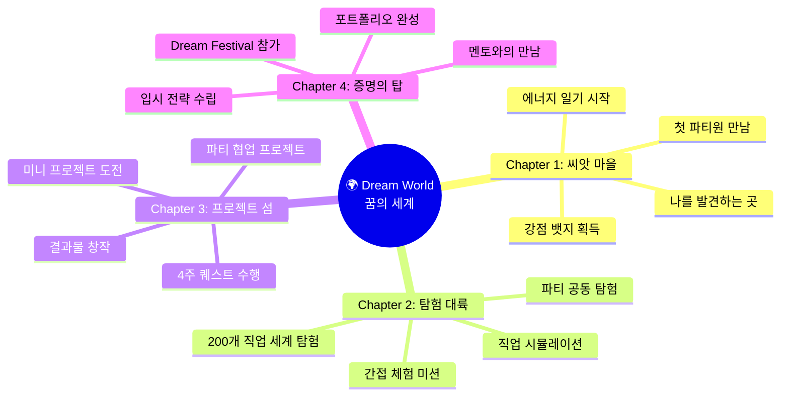

### 5.2 캐릭터 성장 시스템

| 성장 단계 | 이름 | 조건 | 외형 변화 | 해금 기능 |
|---------|------|------|---------|---------|
| Lv.1 | 🌰 씨앗 | 앱 가입 | 작은 씨앗 | 에너지 일기 |
| Lv.2 | 🌱 새싹 | 에너지 일기 7일 연속 | 싹이 올라옴 | 직업 탐험 지도 해금 |
| Lv.3 | 🌿 풀잎 | 강점 프로필 완성 | 잎이 펼쳐짐 | 파티 매칭 해금 |
| Lv.4 | 🌳 나무 | 미니 프로젝트 1개 완성 | 나무로 성장 | 심화 프로젝트 해금 |
| Lv.5 | 🌲 숲 | 포트폴리오 1차 완성 | 숲이 형성 | 멘토 연결 해금 |
| Lv.6 | 🏔️ 산 | 심화 프로젝트 2개+ 완성 | 산이 됨 | Dream Festival 참가 |
| Lv.7 | ⭐ 별 | 고3 포트폴리오 최종 완성 | 별이 됨 | 후배 멘토 NPC 등록 |

### 5.3 파티 시스템 상세 설계

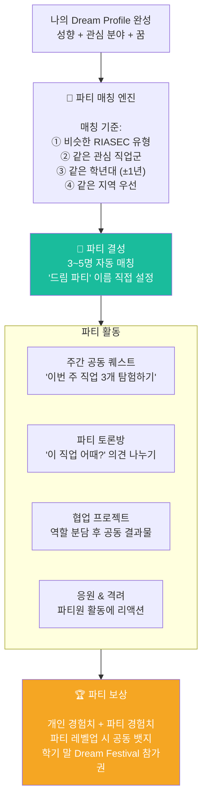

### 5.4 파티 운영 규칙

| 규칙 | 내용 | 이유 |
|------|------|------|
| 파티 인원 | 3~5명 (최적 4명) | 너무 적으면 외롭고, 많으면 무임승차 발생 |
| 매칭 주기 | 학기 시작 시 자동 매칭, 중간 변경 1회 가능 | 안정적 관계 형성 + 미스매칭 대비 |
| 활동 최소치 | 주 1회 이상 파티 활동 참여 | 유령 파티 방지 |
| 익명 옵션 | 닉네임 사용, 실명 공개는 선택 | 사이버 안전 |
| 신고 시스템 | 부적절 행동 즉시 신고 → 운영팀 검토 | 안전한 커뮤니티 유지 |
| 교사 모니터링 | 학교 단위 사용 시 교사가 파티 활동 열람 가능 | 학교 현장 연계 |

### 5.5 퀘스트 시스템

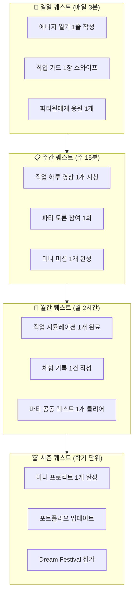

### 5.6 앱 정보 아키텍처 (전체 화면 구조)

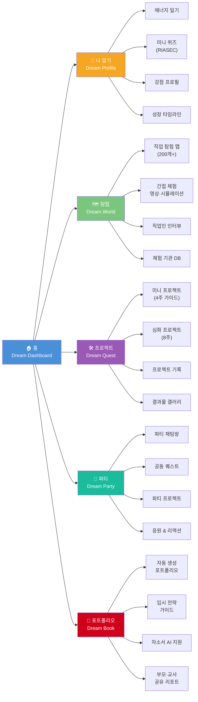

---

## 6. 사용자 유형별 앱 접근 전략

### 6.1 사용자 세그먼트 매트릭스

| 사용자 유형 | 나이 | 핵심 니즈 | 앱 진입 포인트 | 핵심 기능 | 성공 지표 |
|-----------|------|---------|-------------|---------|---------|
| 초등 고학년 | 10~12 | "뭐가 재미있는지 알고 싶어" | 직업 탐험 맵 (게임) | 에너지 일기 + 직업 카드 스와이프 | 탐험 직업 30개+ |
| 중학생 (탐험가) | 13~15 | "관심사를 직업으로 연결하고 싶어" | 관심사 입력 → 직업 매핑 | 미니 프로젝트 + 파티 | 프로젝트 2개 완성 |
| 중학생 (방황형) | 13~15 | "아무것도 모르겠어, 나부터 알고 싶어" | 에너지 일기 (부담 없이) | 자기 발견 + 작은 성공 경험 | 강점 프로필 완성 |
| 고등학생 (확정형) | 16~18 | "목표는 있는데 어떻게 증명하지?" | 역공학 설계 도구 | 심화 프로젝트 + 포트폴리오 | 포트폴리오 PDF 완성 |
| 고등학생 (전환형) | 16~18 | "진로를 바꿨는데 늦지 않았을까?" | 긴급 로드맵 생성 | 빠른 탐색 + 집중 프로젝트 | 3개월 내 방향 재설정 |
| 진로 교사 | 30~50대 | "400명을 개별 관리하고 싶은데 시간이 없어" | 교사 대시보드 | 학생 진로 이력 자동 요약 | 상담 준비 시간 50% 절감 |
| 학부모 | 40~50대 | "아이 진로를 지지하고 싶은데 데이터가 없어" | 자녀 탐색 리포트 | 직업 전망 데이터 + 대화 가이드 | 부모-자녀 갈등 감소 |

---

> 📌 **이 문서의 하편(下)에서 계속됩니다**
> - 상세 유저 시나리오 6종 (페르소나별 일일·주간·월간·학기 시나리오)
> - 게임 메카닉 상세 설계
> - 화면별 와이어프레임 설계
> - 수익 모델 및 개발 로드맵

---
*작성일: 2026년 2월 | Dream Path 앱 상세 기획서 (상)*
