# DreamPath 알고리즘 설계서
# — 2단계·3단계 동작 원리 · 관계도 · 순서도 · UI 스타일 가이드

> **V0 구현 기준 문서** — 소스 코드 없음. 알고리즘·순서도·상태 머신·관계도 위주.

---

## 0. 앱 전체 데이터 흐름 관계도

### 0.1 핵심 엔티티 관계도

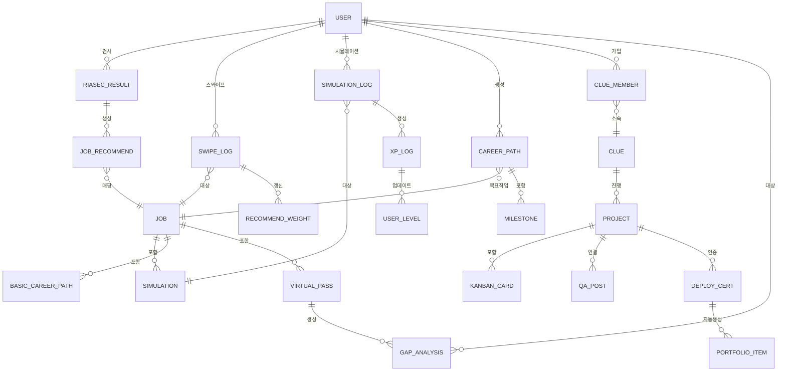

### 0.2 단계별 데이터 흐름

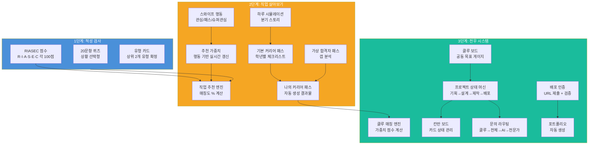

---

## 1. UI 스타일 가이드 (V0 구현 기준)

### 1.1 디자인 시스템

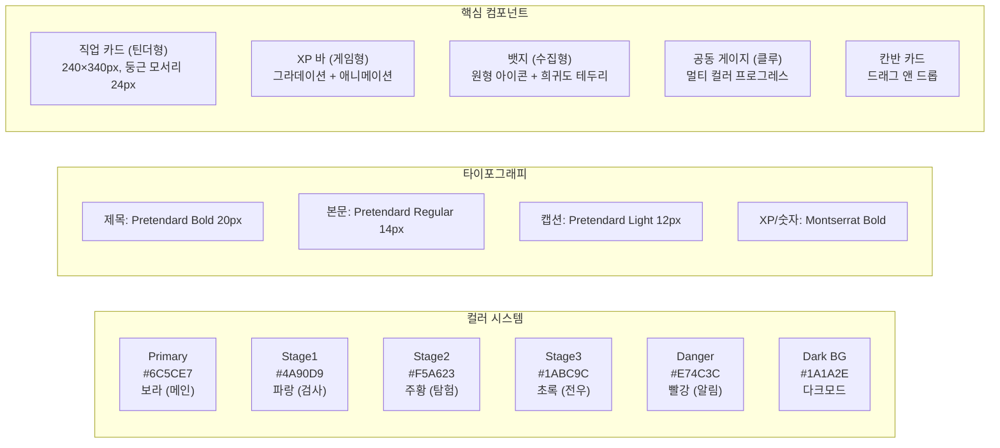

### 1.2 화면 레이아웃 패턴

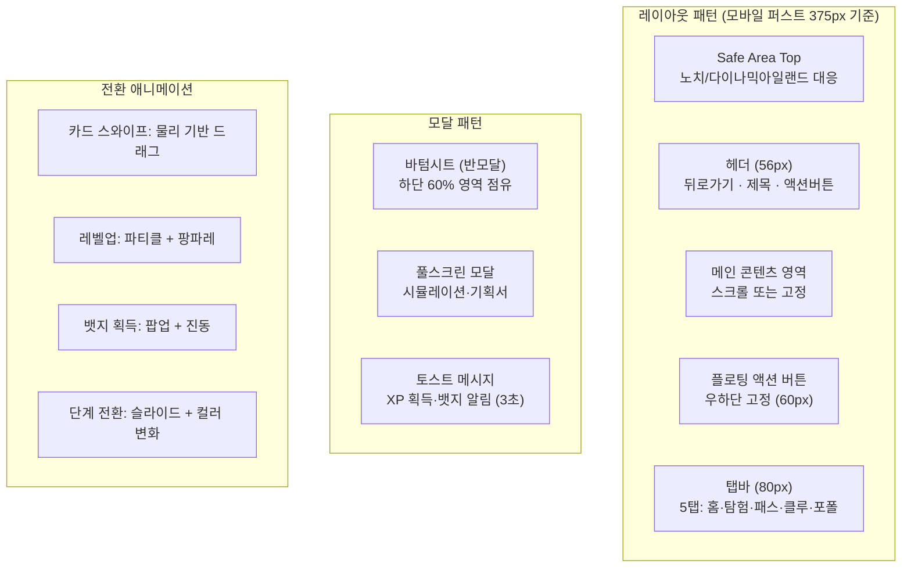

### 1.3 게이미피케이션 UI 요소

| UI 요소 | 위치 | 동작 | 시각 효과 |
|---------|------|------|---------|
| **XP 바** | 홈 상단 | 행동마다 채워짐 | 주황→노랑 그라데이션, 흔들림 애니메이션 |
| **레벨 배지** | 프로필 옆 | 레벨업 시 변경 | 반짝임 + 팡파레 팝업 |
| **직업 카드 희귀도** | 카드 테두리 | 스와이프 등장 시 | 일반: 회색 / 희귀: 파랑 빛남 / 에픽: 주황 빛남 / 전설: 빨강 빛남 |
| **클루 게이지** | 클루 보드 상단 | 전우 활동마다 채워짐 | 멀티컬러, 물결 애니메이션 |
| **배포 인증 효과** | 배포 완료 시 | 즉시 트리거 | 화면 전체 파티클 + 전설 뱃지 팝업 |
| **연속 출석 불꽃** | 홈 화면 | 매일 접속 시 | 불꽃 이모지 + 카운터 |

---

## 2. 2단계 알고리즘 상세 설계

### 2.1 직업 추천 알고리즘

#### 입력 → 처리 → 출력

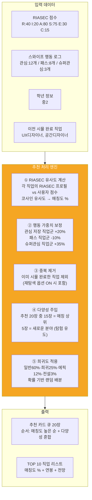

#### 매칭도 계산 공식

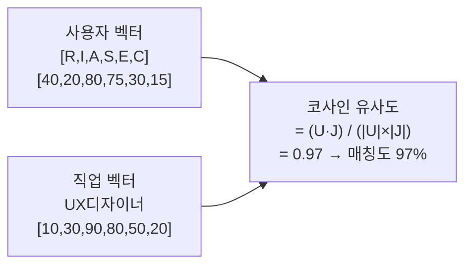

---

### 2.2 직업 카드 스와이프 알고리즘

#### 전체 순서도

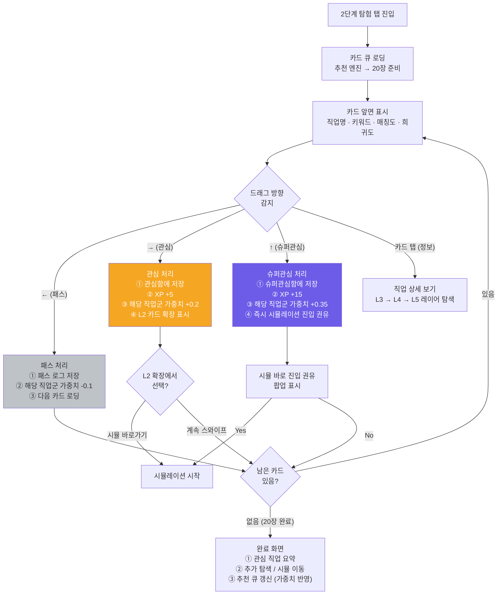

#### L1~L5 카드 레이어 열람 흐름

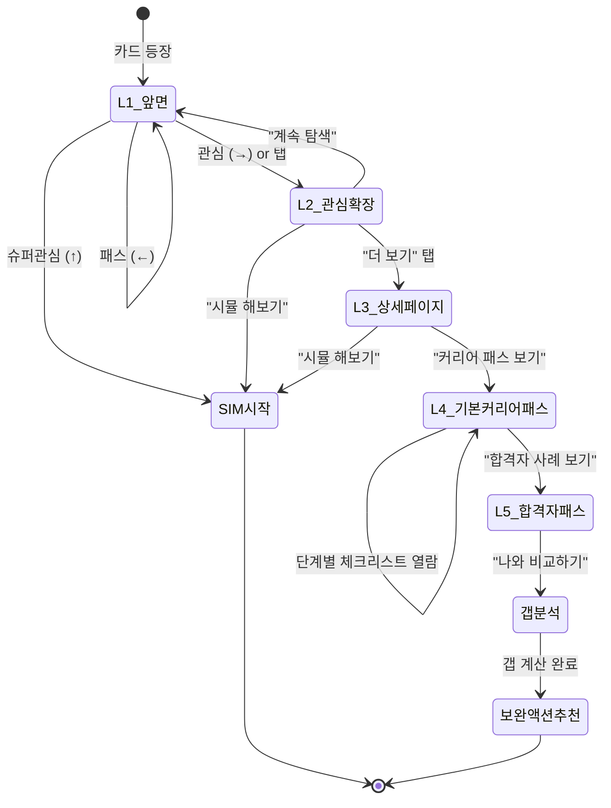

---

### 2.3 하루 시뮬레이션 상태 머신

#### 전체 분기 구조

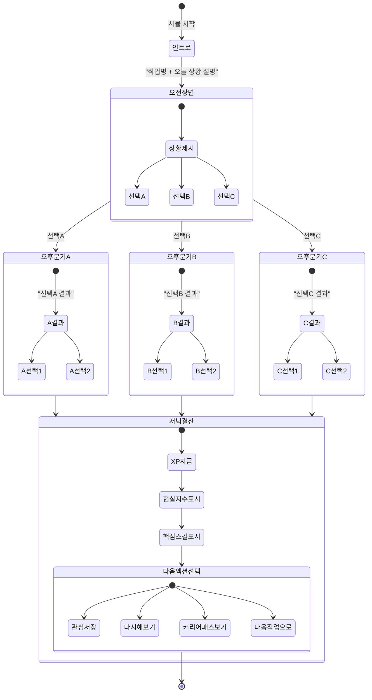

#### 시뮬레이션 점수 계산 알고리즘

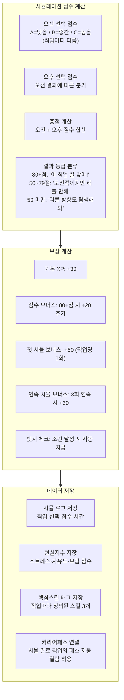

---

### 2.4 커리어 패스 생성 알고리즘

#### 기본 커리어 패스 자동 생성 순서도

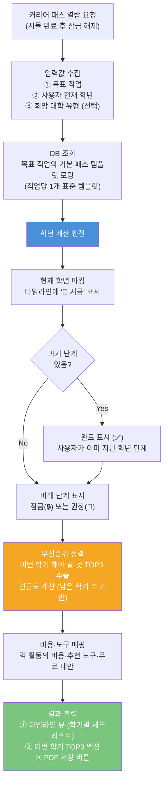

#### 긴급도 계산 로직

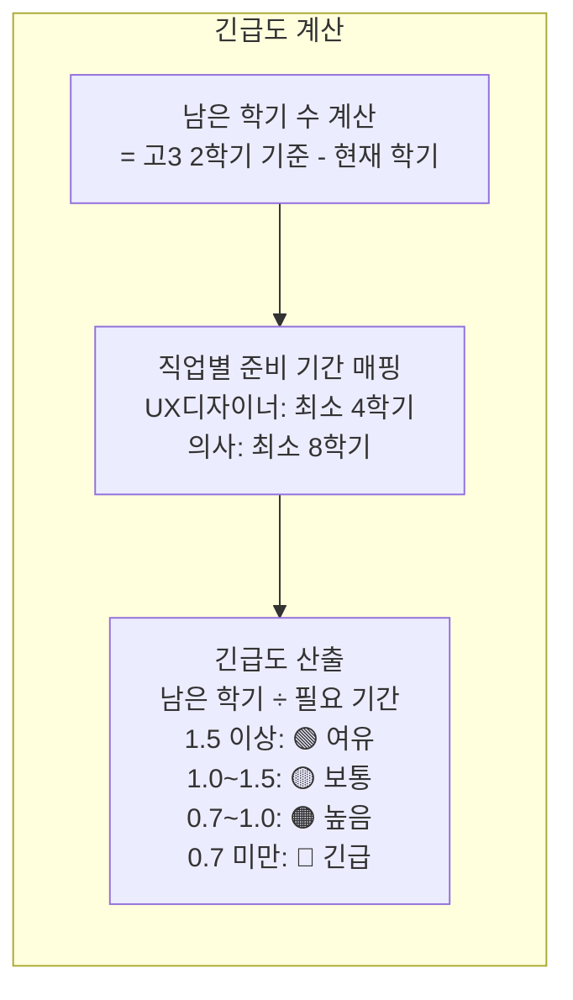

---

### 2.5 가상 합격자 패스 갭 분석 알고리즘

#### 전체 처리 순서

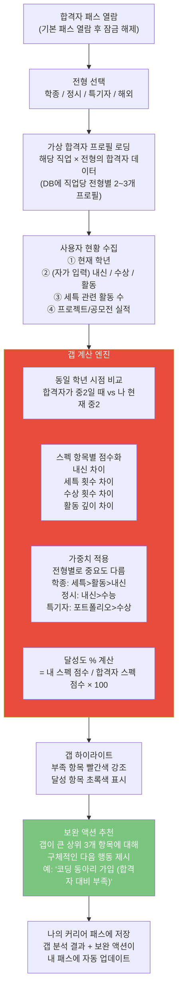

#### 갭 분석 항목 구조

| 분석 항목 | 사용자 입력 방법 | 합격자 데이터 | 차이 계산 |
|---------|--------------|------------|---------|
| 내신 등급 | 직접 입력 (1.0~9.0) | 합격자 내신 등급 | 수치 차이 |
| 세특 관련 횟수 | 직접 입력 (0~6) | 합격자 세특 수 | 횟수 차이 |
| 수상 실적 | 직접 입력 (0~n) | 합격자 수상 횟수 | 횟수 차이 |
| 탐구/R&E 활동 | 있음/없음 선택 | 합격자 활동 여부 | 0 or 1 |
| 포트폴리오 작품 | 직접 입력 (0~n) | 합격자 작품 수 | 횟수 차이 |
| 공모전 도전 | 직접 입력 (0~n) | 합격자 공모전 수 | 횟수 차이 |

---

### 2.6 XP → 레벨 → 기능 잠금 해제 상태 머신

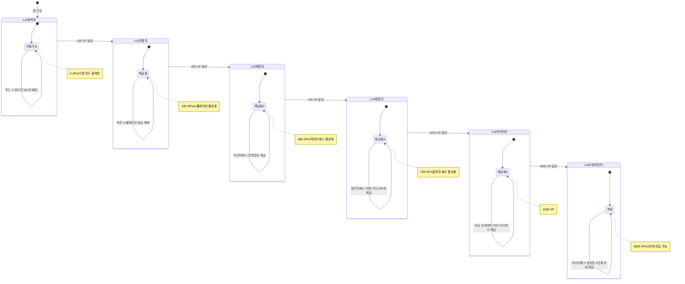

---

### 2.7 나의 커리어 패스 자동 생성 알고리즘

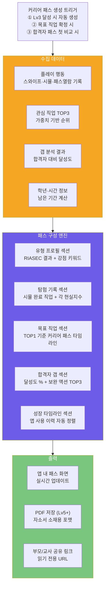

---

## 3. 3단계 알고리즘 상세 설계

### 3.1 클루 매칭 알고리즘

#### 매칭 점수 계산 순서도

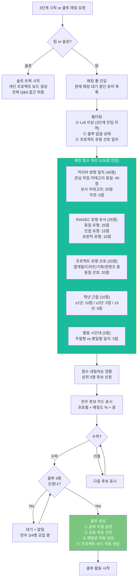

---

### 3.2 프로젝트 상태 머신

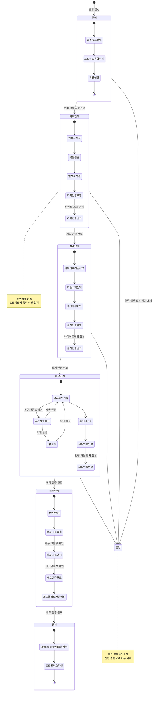

#### 단계 전환 조건 상세표

| 전환 | 조건 | 검증 방법 | 실패 시 처리 |
|------|------|---------|------------|
| 준비 → 기획 | 공동 목표 선언 완료 | 텍스트 입력 확인 | 입력 유도 팝업 |
| 기획 → 설계 | 기획서 완성도 70%+ | 필수 항목 7개 중 5개+ 입력 | 미완성 항목 하이라이트 |
| 설계 → 제작 | 와이어프레임 or 플로우차트 첨부 | 이미지/링크 존재 확인 | Figma 템플릿 추천 |
| 제작 → 배포 | 진행 캡처 첨부 + 전원 체크인 | 이미지 존재 + 모든 멤버 확인 | 미체크인 멤버 알림 |
| 배포 인증 | 배포 URL 유효성 | HTTP 200 응답 확인 | 배포 가이드 링크 제공 |

---

### 3.3 칸반 보드 상태 관리

#### 카드 생명주기

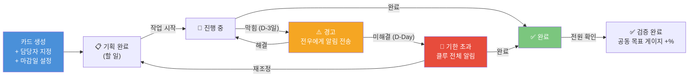

#### 공동 목표 게이지 계산

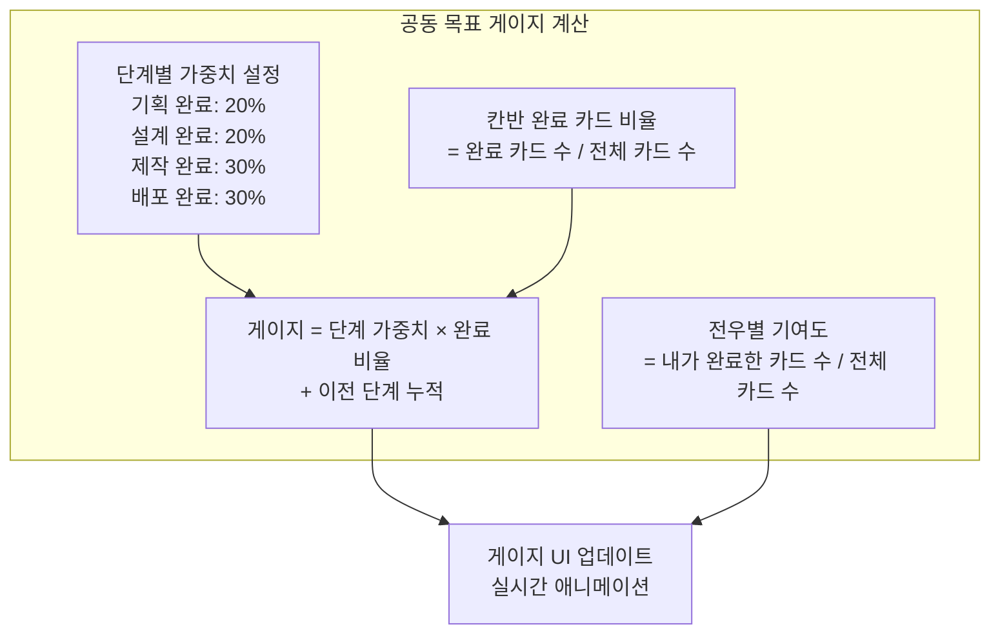

---

### 3.4 문의 라우팅 알고리즘

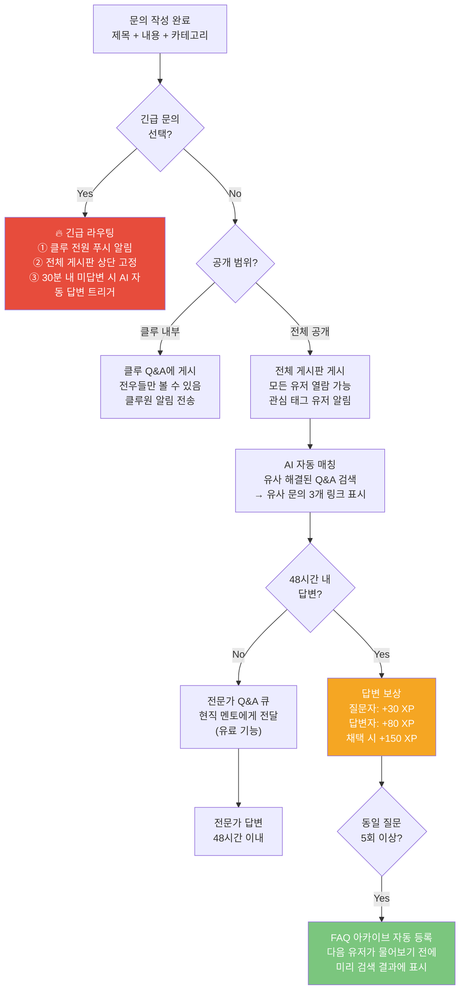

---

### 3.5 배포 인증 알고리즘

```mermaid
flowchart TD
    START["배포 인증 요청<br/>유저가 URL 제출"]

    START --> TYPE{"프로젝트 타입<br/>선택"}

    TYPE -->|"웹"| WEB_CHECK["URL 유효성 검사<br/>① HTTP GET 요청<br/>② 200 응답 확인<br/>③ 콘텐츠 존재 확인"]

    TYPE -->|"디자인"| DESIGN_CHECK["Figma/Behance 링크<br/>① 도메인 검증 (figma.com/behance.net)<br/>② 공개 설정 확인<br/>③ 링크 유효성 확인"]

    TYPE -->|"기획서"| DOC_CHECK["Notion/PDF<br/>① 도메인 or 파일 확인<br/>② 공개 접근 가능 여부<br/>③ 콘텐츠 분량 확인 (최소 3페이지)"]

    TYPE -->|"콘텐츠"| CONTENT_CHECK["YouTube/블로그<br/>① URL 유효성<br/>② 공개 여부 확인"]

    WEB_CHECK & DESIGN_CHECK & DOC_CHECK & CONTENT_CHECK --> VALIDATE{"검증 통과?"}

    VALIDATE -->|"Yes"| SCREENSHOT["스크린샷 확인<br/>유저 제출 스크린샷 존재 여부"]

    VALIDATE -->|"No"| FAIL["인증 실패<br/>오류 메시지 + 배포 가이드 링크"]

    SCREENSHOT --> CERT["배포 인증 완료!<br/>① 인증 스탬프 발급<br/>② +500 XP 지급<br/>③ 전설 뱃지 '첫 배포' 지급<br/>④ 포트폴리오 자동 생성 트리거<br/>⑤ DreamFestival 출품 자격 부여"]

    FAIL --> RETRY["재시도 권유<br/>'배포 가이드' 링크 제공"]

    style CERT fill:#7BC67E,color:#fff
    style FAIL fill:#E74C3C,color:#fff
```

---

### 3.6 포트폴리오 자동 생성 알고리즘

```mermaid
flowchart TD
    TRIGGER["포트폴리오 생성 트리거<br/>① 배포 인증 완료<br/>② 분기별 자동 업데이트<br/>③ 사용자 수동 요청"]

    TRIGGER --> COLLECT["전체 활동 데이터 수집"]

    subgraph COLLECT["수집 항목"]
        C1["2단계 탐험 기록<br/>시뮬 완료 직업 목록<br/>현실지수·핵심스킬 태그"]
        C2["커리어 패스 데이터<br/>목표 직업·달성도·보완 액션"]
        C3["3단계 프로젝트 기록<br/>기획서·일정표·배포 URL<br/>역할·기여도"]
        C4["문의 활동 기록<br/>질문 횟수·답변 횟수·채택 횟수"]
        C5["뱃지·XP·레벨 기록"]
    end

    COLLECT --> FORMAT["포트폴리오 포맷 적용"]

    subgraph FORMAT["섹션 자동 구성"]
        F1["① 나는 이런 사람<br/>RIASEC 유형 + 강점 키워드"]
        F2["② 직업 탐험 여정<br/>살아본 직업 + 현실지수 비교"]
        F3["③ 커리어 방향<br/>목표 직업 + 합격자 대비 달성도"]
        F4["④ 완성한 프로젝트<br/>배포 URL + 역할 + 기여도"]
        F5["⑤ 성장 타임라인<br/>시간순 주요 이정표 자동 정렬"]
        F6["⑥ 자소서 소재 추천<br/>AI가 활동 데이터에서 추출한<br/>자소서 활용 가능 경험 3개"]
    end

    FORMAT --> OUTPUT{"출력 형태"}

    OUTPUT -->|"앱 내 보기"| APP_VIEW["앱 내 포트폴리오 탭<br/>실시간 업데이트 뷰"]

    OUTPUT -->|"PDF 저장 (Lv5+)"| PDF["PDF 생성<br/>A4 2~4페이지<br/>자소서용 포맷"]

    OUTPUT -->|"공유 링크"| SHARE["읽기 전용 URL 생성<br/>부모·교사에게 공유"]

    style COLLECT fill:#4A90D9,color:#fff
    style FORMAT fill:#6C5CE7,color:#fff
    style OUTPUT fill:#7BC67E,color:#fff
```

---

## 4. 2단계·3단계 전체 관계도 (통합)

### 4.1 2단계 내부 컴포넌트 관계도

```mermaid
flowchart TD
    RIASEC["RIASEC 결과<br/>(1단계에서 입력)"]

    subgraph Engine2["2단계 핵심 엔진"]
        REC_ENGINE["추천 엔진<br/>매칭도 % 계산"]
        SWIPE_LOG["스와이프 로그<br/>행동 데이터"]
        WEIGHT_TABLE["가중치 테이블<br/>실시간 갱신"]
        SIM_ENGINE["시뮬레이션 엔진<br/>분기 스토리 실행"]
        PATH_ENGINE["패스 생성 엔진<br/>학년 기반 체크리스트"]
        GAP_ENGINE["갭 분석 엔진<br/>사용자 vs 합격자"]
    end

    subgraph DB2["2단계 데이터"]
        JOB_DB["직업 DB<br/>200개 직업 정보"]
        CAREER_DB["커리어 패스 DB<br/>직업별 표준 템플릿"]
        VPASS_DB["합격자 패스 DB<br/>직업×전형별 프로필"]
        SCORE_DB["XP/레벨 DB<br/>사용자별 누적 점수"]
    end

    subgraph Output2["2단계 결과물"]
        CARD_QUEUE["카드 큐 (20장)"]
        MY_PATH["나의 커리어 패스"]
        GAP_RESULT["갭 분석 결과"]
        LEVEL_STATE["레벨 상태"]
    end

    RIASEC --> REC_ENGINE
    SWIPE_LOG --> WEIGHT_TABLE
    WEIGHT_TABLE --> REC_ENGINE
    REC_ENGINE --> CARD_QUEUE

    CARD_QUEUE --> SIM_ENGINE
    JOB_DB --> SIM_ENGINE
    SIM_ENGINE --> SCORE_DB

    CAREER_DB --> PATH_ENGINE
    SIM_ENGINE --> PATH_ENGINE
    PATH_ENGINE --> MY_PATH

    VPASS_DB --> GAP_ENGINE
    MY_PATH --> GAP_ENGINE
    GAP_ENGINE --> GAP_RESULT

    SCORE_DB --> LEVEL_STATE
    LEVEL_STATE -->|"Lv6 달성"| STAGE3_UNLOCK["3단계 잠금 해제"]
```

### 4.2 3단계 내부 컴포넌트 관계도

```mermaid
flowchart TD
    MY_PATH["나의 커리어 패스<br/>(2단계 결과)"]
    LEVEL6["Lv6 달성<br/>(2단계 조건)"]

    subgraph Engine3["3단계 핵심 엔진"]
        MATCH_ENGINE["클루 매칭 엔진<br/>가중치 점수 계산"]
        STATE_MACHINE["프로젝트 상태 머신<br/>기획→설계→제작→배포"]
        KANBAN_ENGINE["칸반 보드 엔진<br/>카드 상태 관리"]
        QA_ROUTER["문의 라우터<br/>채널 분배"]
        DEPLOY_CHECK["배포 인증기<br/>URL 유효성 검사"]
        PORT_GEN["포트폴리오 생성기<br/>데이터 자동 조합"]
    end

    subgraph DB3["3단계 데이터"]
        CLUE_DB["클루 DB<br/>멤버·상태·기여도"]
        PROJECT_DB["프로젝트 DB<br/>기획서·일정·단계"]
        QA_DB["Q&A DB<br/>문의·답변·채택"]
        CERT_DB["인증 DB<br/>배포 URL·타임스탬프"]
    end

    subgraph Output3["3단계 결과물"]
        CLUE_BOARD["클루 보드<br/>공동 목표 게이지"]
        KANBAN_VIEW["칸반 보드 뷰"]
        QA_FEED["Q&A 피드"]
        PORTFOLIO["포트폴리오<br/>(자동 생성)"]
        FESTIVAL["DreamFestival<br/>출품 자격"]
    end

    MY_PATH & LEVEL6 --> MATCH_ENGINE
    MATCH_ENGINE --> CLUE_DB
    CLUE_DB --> STATE_MACHINE
    STATE_MACHINE --> PROJECT_DB
    PROJECT_DB --> KANBAN_ENGINE
    KANBAN_ENGINE --> KANBAN_VIEW
    KANBAN_ENGINE --> CLUE_BOARD

    STATE_MACHINE --> QA_ROUTER
    QA_ROUTER --> QA_DB
    QA_DB --> QA_FEED

    STATE_MACHINE -->|"배포 단계"| DEPLOY_CHECK
    DEPLOY_CHECK --> CERT_DB
    CERT_DB --> PORT_GEN
    PORT_GEN --> PORTFOLIO
    PORT_GEN --> FESTIVAL
```

### 4.3 2단계 → 3단계 연결 관계도

```mermaid
flowchart LR
    subgraph S2["2단계 출력"]
        S2A["나의 커리어 패스<br/>목표 직업 + 달성도"]
        S2B["RIASEC 유형 + 행동 패턴"]
        S2C["Lv6 달성"]
        S2D["시뮬 완료 직업 목록"]
    end

    subgraph Connect["연결 데이터"]
        C1["클루 매칭 기준 데이터<br/>커리어 방향 + 유형"]
        C2["프로젝트 방향 데이터<br/>어떤 직업 분야의 프로젝트?"]
        C3["포트폴리오 씨앗<br/>2단계 탐험 기록 → 3단계 포폴의 도입부"]
    end

    subgraph S3["3단계 입력"]
        S3A["클루 매칭 조건"]
        S3B["프로젝트 유형 추천"]
        S3C["포트폴리오 자동 인계"]
    end

    S2A --> C1 --> S3A
    S2B --> C1
    S2C --> S3A
    S2A --> C2 --> S3B
    S2D --> C3 --> S3C

    style S2 fill:#F5A623,color:#fff
    style Connect fill:#6C5CE7,color:#fff
    style S3 fill:#1ABC9C,color:#fff
```

---

## 5. 화면 전환 플로우 (앱 내비게이션)

### 5.1 전체 내비게이션 구조

```mermaid
flowchart TD
    SPLASH["스플래시 화면<br/>로고 + 로딩"]

    SPLASH --> AUTH{"로그인<br/>여부?"}

    AUTH -->|"신규"| ONBOARD["온보딩<br/>① 닉네임 입력<br/>② 학년 선택<br/>③ 적성 검사 안내"]

    AUTH -->|"기존"| HOME

    ONBOARD --> QUIZ["1단계: 적성 검사<br/>20문항"]

    QUIZ --> RESULT["검사 결과 화면<br/>유형 카드 + TOP10"]

    RESULT --> HOME["홈 (Dream Dashboard)<br/>탭바: 홈·탐험·패스·클루·포폴"]

    subgraph TAB["탭 내비게이션 (5탭)"]
        T1["🏠 홈<br/>오늘의 추천 + 미션 + 클루 요약"]
        T2["🎮 탐험<br/>카드 스와이프 + 시뮬레이션"]
        T3["🗺️ 패스<br/>기본패스 + 합격자패스 + 나의패스"]
        T4["⚔️ 클루<br/>클루 보드 + 프로젝트 + Q&A"]
        T5["📁 포폴<br/>포트폴리오 + PDF + 공유"]
    end

    HOME --> TAB

    subgraph MODAL["모달/오버레이"]
        M1["시뮬레이션 풀스크린<br/>탭바 숨김"]
        M2["기획서 작성 풀스크린<br/>탭바 숨김"]
        M3["XP/뱃지 팝업<br/>반투명 오버레이"]
        M4["합격자 비교 바텀시트<br/>하단 60%"]
    end

    T2 --> M1
    T4 --> M2
    T2 & T3 & T4 --> M3
    T3 --> M4
```

### 5.2 2단계 화면 전환 흐름

```mermaid
flowchart TD
    HOME_CARD["홈의 '오늘의 추천 체험' 카드"]
    EXPLORE_TAB["탐험 탭 직접 진입"]

    HOME_CARD --> EXPLORE
    EXPLORE_TAB --> EXPLORE

    EXPLORE["탐험 메인<br/>필터 + 진행도 + 카드 스택"]

    EXPLORE --> SWIPE["카드 스와이프 모드<br/>20장 연속"]

    SWIPE -->|"관심 저장"| L2["L2 확장 팝업<br/>연봉곡선 + 하루일과"]

    L2 -->|"시뮬 해보기"| SIM_FULL["시뮬레이션 풀스크린<br/>(탭바 숨김)"]

    SIM_FULL --> SIM_RESULT["시뮬 결산 화면<br/>XP + 현실지수 + 핵심스킬"]

    SIM_RESULT -->|"커리어 패스 보기"| PATH_TAB["패스 탭 이동"]
    SIM_RESULT -->|"관심 저장"| INTEREST["관심함"]
    SIM_RESULT -->|"다시 해보기"| SIM_FULL
    SIM_RESULT -->|"다음 직업"| SWIPE

    PATH_TAB --> BASIC_PATH["기본 커리어 패스<br/>학년별 타임라인"]

    BASIC_PATH -->|"합격자 보기"| VPASS["가상 합격자 패스<br/>전형 선택 → 프로필"]

    VPASS --> COMPARE["비교 오버레이<br/>나 vs 합격자 갭"]

    COMPARE --> ACTION["보완 액션 추천<br/>TOP3 다음 행동"]

    ACTION --> MY_PATH["나의 커리어 패스<br/>자동 업데이트"]

    MY_PATH -->|"Lv6 + '전우 찾기'"| STAGE3["3단계 진입"]
```

### 5.3 3단계 화면 전환 흐름

```mermaid
flowchart TD
    CLUE_TAB["클루 탭 진입"]

    CLUE_TAB --> CHECK{"클루<br/>있음?"}

    CHECK -->|"없음"| MATCH_START["클루 매칭 시작 화면<br/>'팀으로? 혼자?'"]

    CHECK -->|"있음"| CLUE_BOARD["클루 보드<br/>공동 목표 게이지 + 멤버"]

    MATCH_START -->|"팀"| CANDIDATE["전우 후보 카드<br/>3~5명 순차 표시"]
    MATCH_START -->|"솔로"| SOLO_BOARD["솔로 프로젝트 보드"]

    CANDIDATE --> CLUE_CREATE["클루 결성 화면<br/>이름 설정 + 공동 목표 선언"]

    CLUE_CREATE --> CLUE_BOARD

    CLUE_BOARD --> PROJ_BOARD["프로젝트 보드<br/>현재 단계 + 칸반"]

    PROJ_BOARD --> KANBAN["칸반 보드<br/>할 일 / 진행 중 / 완료"]

    KANBAN --> PLANNING["기획서 작성 풀스크린<br/>(기획 단계만 활성)"]
    KANBAN --> QA_BOARD["Q&A 게시판<br/>클루 내부 + 전체"]

    QA_BOARD --> QA_WRITE["문의 작성 화면<br/>카테고리 + 내용"]
    QA_BOARD --> QA_DETAIL["문의 상세/답변 화면"]

    PROJ_BOARD -->|"배포 단계"| DEPLOY_CERT["배포 인증 화면<br/>URL 입력 + 스크린샷"]

    DEPLOY_CERT -->|"인증 완료"| CELEBRATION["배포 완료 축하 화면<br/>파티클 + 전설 뱃지 팝업"]

    CELEBRATION --> PORTFOLIO["포트폴리오 탭 이동<br/>자동 생성 확인"]
    CELEBRATION --> FESTIVAL["DreamFestival 출품 화면"]
```

---

## 6. 알림(Push) 트리거 알고리즘

```mermaid
flowchart TD
    subgraph Triggers["알림 트리거"]
        T1["⏰ 리텐션 알림<br/>48시간 미접속 시<br/>'새 직업 카드가 기다려!'"]
        T2["📅 마일스톤 알림<br/>커리어 패스 기한 D-7<br/>'이번 주 공모전 마감이야!'"]
        T3["⚔️ 클루 알림<br/>전우 활동 발생 시<br/>'지민이 칸반 완료했어!'"]
        T4["🔥 긴급 문의 알림<br/>전우가 긴급 문의 올림<br/>'도움이 필요해! +80XP'"]
        T5["🏆 배포 완료 알림<br/>클루원이 배포 인증<br/>'우리 클루 목표 달성!'"]
        T6["⚡ XP 보너스 알림<br/>연속 출석 7일 임박<br/>'내일 접속하면 7일 연속!'"]
    end

    subgraph Rule["발송 규칙"]
        R1["1일 최대 알림: 3개<br/>우선순위: 긴급>배포>마일스톤>클루>리텐션"]
        R2["야간 발송 금지<br/>22:00 ~ 08:00 큐잉 후 아침 발송"]
        R3["알림 OFF 유저 제외<br/>설정에서 카테고리별 끄기 가능"]
    end

    Triggers --> Rule
```

---

*작성일: 2026년 2월 | DreamPath 알고리즘 설계서 V1*
*참조 문서: DreamPath_상세기획서_V2_상.md / DreamPath_상세기획서_V2_하.md*
