# DreamPath 핵심 기획서 — 3단계 집중 설계
# 유저 시나리오 · 화면 설계 · 관계도 · 운영 구조

> **"2단계만 해도 충분히 가치 있다. 3단계는 선택이다."**
> 혼자서도 커리어를 완성할 수 있고, 함께라면 더 멀리 갈 수 있다.

---

## 0. 설계 철학 — 왜 이 구조인가?

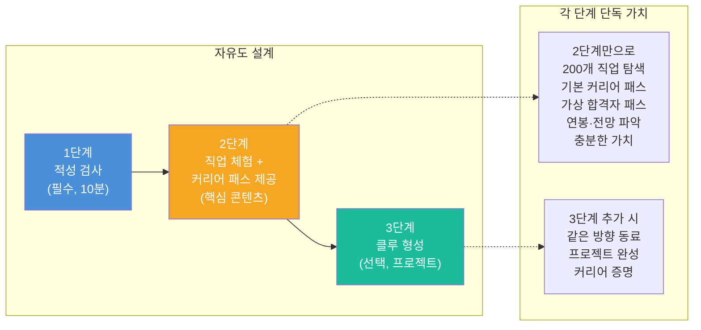

### 핵심 설계 원칙

| 원칙 | 내용 |
|------|------|
| **일기·기록 없음** | 사용자가 직접 쓰는 일지·노트 없음. Notion과 경쟁하지 않는다 |
| **단계 이탈 허용** | 2단계에서 멈춰도 완성된 경험. 억지로 3단계 유도 안 함 |
| **2단계 = 완성된 경험** | 직업 탐색 + 기본 커리어 패스 + 가상 합격자 사례까지 2단계에서 제공 |
| **게임이 데이터** | 직접 기록 대신 플레이 행동이 자동으로 포트폴리오가 됨 |
| **On/Off 유연** | 클루는 기본 온라인. 오프라인은 선택이지 강제가 아님 |
| **개인도, 함께도** | 클루 없이 개인 커리어 패스도 완성 가능 |

---

## 1단계: 직업 적성 검사

### 1.1 목표

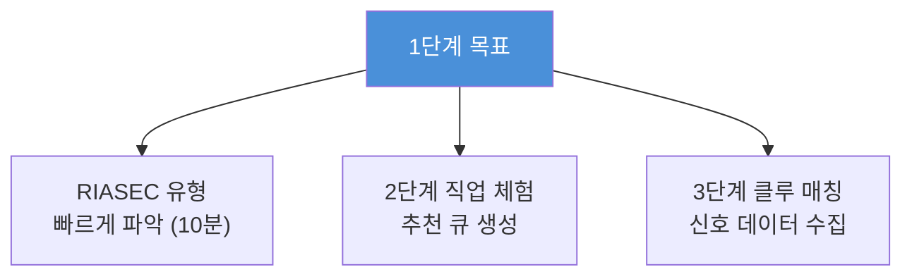

### 1.2 검사 흐름

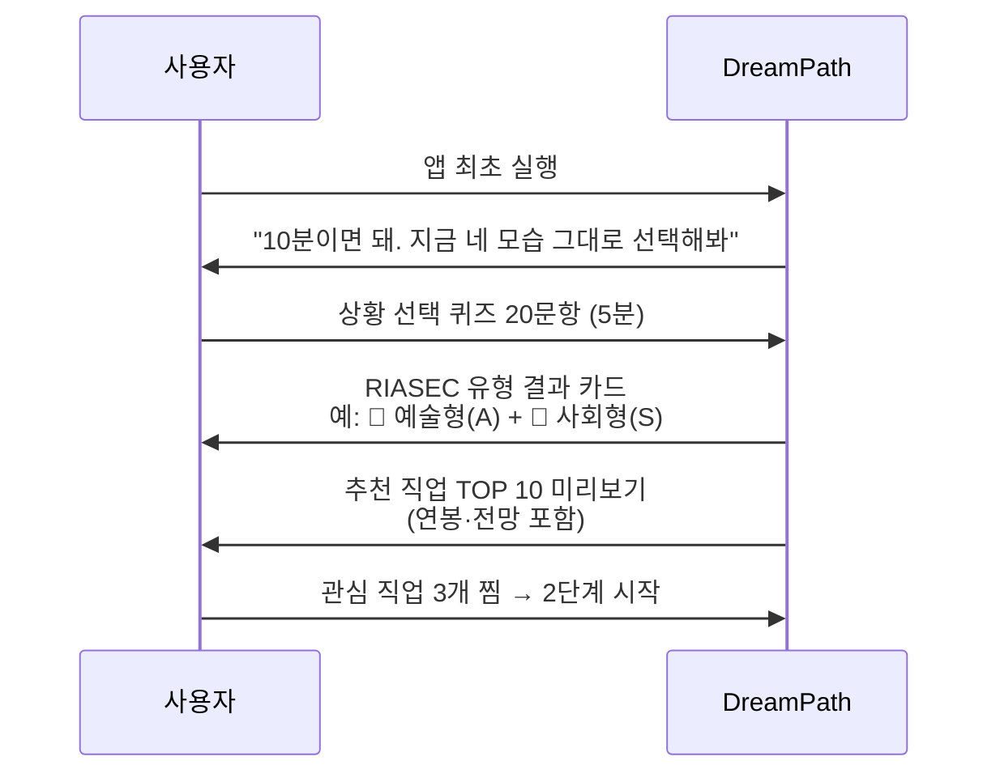

### 1.3 화면 설계

```
┌─────────────────────────────────┐
│  DreamPath                      │
│─────────────────────────────────│
│                                 │
│  🧭 Question 7 / 20             │
│  ━━━━━━━━━━━░░░░░░░░  35%       │
│                                 │
│  ┌─────────────────────────────┐│
│  │ 학교 축제를 준비하고 있어.  ││
│  │ 네가 가장 하고 싶은 역할은? ││
│  └─────────────────────────────┘│
│                                 │
│  ┌─────────────────────────────┐│
│  │  🎨 포스터 직접 디자인하기  ││
│  └─────────────────────────────┘│
│  ┌─────────────────────────────┐│
│  │  🔧 무대·조명 세팅하기      ││
│  └─────────────────────────────┘│
│  ┌─────────────────────────────┐│
│  │  📣 사회 보고 분위기 이끌기  ││
│  └─────────────────────────────┘│
│  ┌─────────────────────────────┐│
│  │  📋 전체 일정 관리하기      ││
│  └─────────────────────────────┘│
│                                 │
└─────────────────────────────────┘
```

```
┌─────────────────────────────────┐
│  🎉 검사 완료!                   │
│─────────────────────────────────│
│                                 │
│  너의 유형은                     │
│  🎨 예술형 + 🤝 사회형          │
│                                 │
│  ┌─────────────────────────────┐│
│  │  강점 키워드                ││
│  │  #표현 #공감 #창작 #소통    ││
│  └─────────────────────────────┘│
│                                 │
│  추천 직업 TOP 10               │
│  ──────────────────             │
│  1. 🎨 UX 디자이너  매칭 97%    │
│     연봉 3,800~7,000만 / ★★★★☆  │
│                                 │
│  2. 🏠 공간 디자이너  매칭 94%  │
│     연봉 3,500~6,000만 / ★★★★☆  │
│                                 │
│  3. 📱 브랜드 마케터  매칭 88%  │
│     연봉 3,200~6,500만 / ★★★★★  │
│  ...                            │
│                                 │
│  [관심 직업 3개 찜하고 탐험 시작 →]│
│                                 │
└─────────────────────────────────┘
```

---

## 2단계: 200개 직업 체험 + 커리어 패스 탐색 (게임형)

### 2.1 단계 목표 (마일스톤)

> **2단계는 단순 직업 정보 탐색이 아니다.**
> 각 직업의 **기본 커리어 패스**(초등→중등→고등→대학 로드맵)와
> **가상 합격자 패스**(실제 합격 사례 기반 시뮬레이션)까지 제공하여,
> 2단계만으로도 "나는 이 직업을 위해 무엇을 해야 하는지" 완전히 파악할 수 있다.

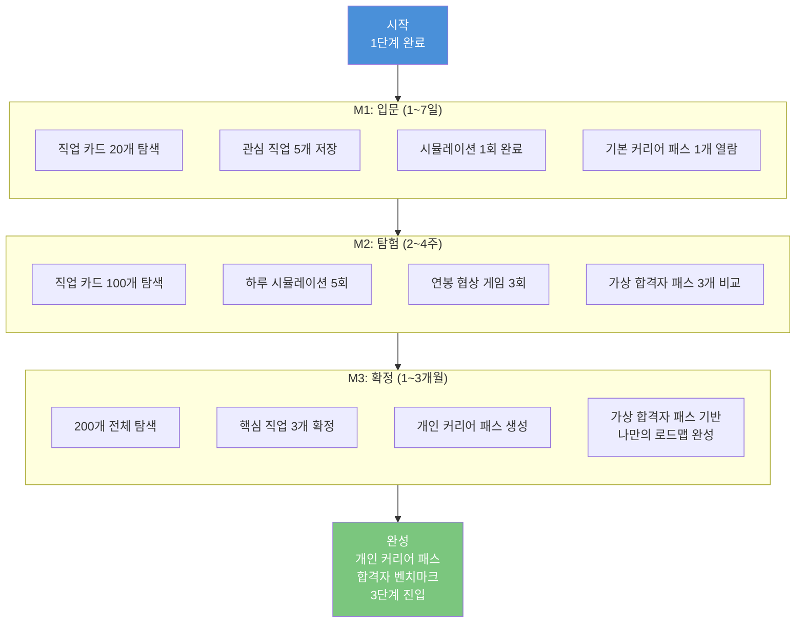

### 2.2 핵심 게임 메카닉

#### 게임 요소 전체 구조

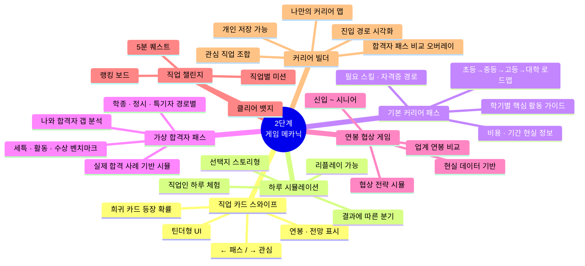

#### 게임 요소 상세 비교표 (경쟁 앱 대비)

| 게임 요소 | 커리어넷 | iLevelUP | Meroo | **DreamPath** | 차별점 |
|---------|---------|---------|-------|--------------|--------|
| 직업 탐색 UI | 텍스트 목록 | RPG 카드 | 매칭형 | **스와이프 + 필터** | 모바일 최적화 |
| 직업 체험 | 텍스트 설명 | 퀘스트 | 미니게임 | **하루 시뮬레이션** | 현실 직업인 기반 |
| 커리어 패스 | 없음 | 없음 | 없음 | **초→중→고→대학 로드맵** | 학기별 구체 가이드 |
| 합격자 사례 | 없음 | 없음 | 없음 | **가상 합격자 패스** | 학종/정시 경로별 벤치마크 |
| 연봉 정보 | 통계표 | 없음 | 없음 | **커리어 곡선 게임** | 협상 체험 |
| 참여 유도 | 없음 | 레벨업 | 점수 | **수집 + 챌린지** | 한국 맥락 |
| 결과 활용 | 없음 | 없음 | 없음 | **커리어 패스 자동 생성** | 합격자 패스 비교 + 3단계 연결 |

### 2.3 직업 카드 상세 정보 구조

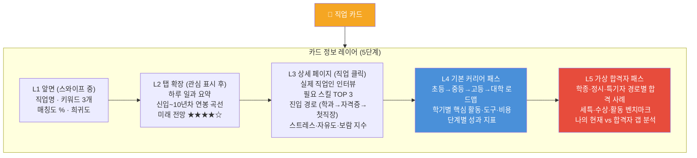

### 2.4 하루 시뮬레이션 화면 설계

```
┌─────────────────────────────────┐
│  🎮 UX 디자이너 하루 체험        │
│  ─────────────────────────────  │
│                                 │
│  ☀️ 오전 9시, 스타트업 사무실   │
│                                 │
│  팀장이 슬랙 메시지를 보냈다.    │
│  "오늘 오후 3시 클라이언트       │
│  발표인데, 수정 요청이 왔어요.   │
│  메인 컬러 전체 바꿔야 할 것     │
│  같은데요..."                   │
│                                 │
│  ─────────────────────────────  │
│  어떻게 할까?                    │
│                                 │
│  ┌─────────────────────────────┐│
│  │  😤 일단 화가 나지만        ││
│  │  묵묵히 수정 시작한다       ││
│  └─────────────────────────────┘│
│  ┌─────────────────────────────┐│
│  │  💬 클라이언트에게 왜 바꾸는││
│  │  지 이유를 먼저 물어본다    ││
│  └─────────────────────────────┘│
│  ┌─────────────────────────────┐│
│  │  🎨 3가지 대안을 빠르게     ││
│  │  만들어서 선택하게 한다     ││
│  └─────────────────────────────┘│
│                                 │
│  💡 결과는 선택에 따라 달라져!  │
└─────────────────────────────────┘
```

```
┌─────────────────────────────────┐
│  🌙 하루 결산: UX 디자이너      │
│─────────────────────────────────│
│                                 │
│  오늘 나의 선택 결과             │
│                                 │
│  💬 이유를 물어봤더니...         │
│  클라이언트가 "사실 대표님이     │
│  파란색 싫어하셔서요"라고 했다.  │
│  → 실제 문제를 파악하고 해결!   │
│     [+30XP] 문제해결력 뱃지 🔍  │
│                                 │
│  ─────────────────────────────  │
│  UX 디자이너 현실 지수          │
│  스트레스  ████████░░  8/10     │
│  자유도    ██████░░░░  6/10     │
│  보람      █████████░  9/10     │
│  연봉 (5년차) 약 5,200만원      │
│                                 │
│  "이 직업, 나한테 맞을까?"       │
│  ❤️ 관심 저장   🔁 다시 해보기  │
│                                 │
└─────────────────────────────────┘
```

### 2.5 기본 커리어 패스 + 가상 합격자 패스 상세 설계

> **2단계의 핵심 차별점**: 단순 직업 정보가 아닌, "이 직업을 위해 지금부터 무엇을 해야 하는가"를 구체적으로 보여준다.

#### 2.5.1 기본 커리어 패스 구조

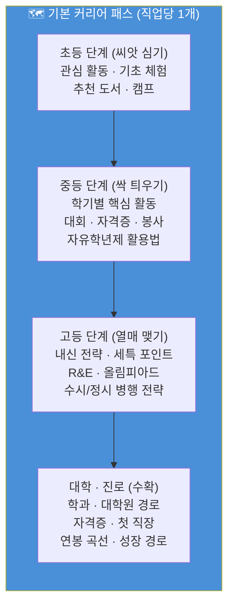

#### 기본 커리어 패스 정보 구성표

| 단계 | 제공 정보 | 데이터 소스 | 표시 형태 |
|------|---------|----------|---------|
| **초등** | 추천 체험·독서·캠프 / 비용·기간 | 교육부·커리어넷 | 타임라인 카드 |
| **중등** | 학기별 활동·대회·자격증 / 자유학년제 활용 | 커리어넷·학교알리미 | 학기별 체크리스트 |
| **고등** | 내신 전략·세특 키워드·수시/정시 전략 | 대입 데이터·입시 분석 | 전략 카드 + 세특 예시 |
| **대학 이후** | 학과·대학원·자격증·첫 직장·연봉 곡선 | 직업 DB·통계청 | 커리어 곡선 그래프 |

#### 기본 커리어 패스 화면 설계

```
┌─────────────────────────────────┐
│  🗺️ UX 디자이너 커리어 패스      │
│  [기본 패스] [합격자 패스] [비교] │
│─────────────────────────────────│
│                                 │
│  📍 나의 현재: 중2               │
│  ━━━━━━━━━━●━━━━━━━━  중등 단계  │
│                                 │
│  ┌─ 초등 (완료) ──────────────┐ │
│  │ ✅ 미술 학원 · 디자인 캠프  │ │
│  │ ✅ 스크래치 코딩 기초       │ │
│  └────────────────────────────┘ │
│                                 │
│  ┌─ 중등 (현재) ──────────────┐ │
│  │ 📌 중2-1: 디자인 씽킹 PBL  │ │
│  │    도구: Figma 무료 / 비용 0│ │
│  │ 📌 중2-2: UI 리디자인 공모전│ │
│  │    도구: Adobe XD / 비용 0  │ │
│  │ ☐ 중3-1: 포트폴리오 시작   │ │
│  │ ☐ 중3-2: IT 공모전 도전    │ │
│  └────────────────────────────┘ │
│                                 │
│  ┌─ 고등 (예정) ──────────────┐ │
│  │ 🔒 고1: 미술·정보 세특 전략 │ │
│  │ 🔒 고2: R&E + 포폴 완성    │ │
│  │ 🔒 고3: 수시 6장 전략      │ │
│  └────────────────────────────┘ │
│                                 │
│  [전체 로드맵 PDF 저장]         │
│                                 │
└─────────────────────────────────┘
```

#### 2.5.2 가상 합격자 패스 구조

> 실제 합격 사례 데이터를 기반으로 구성한 **가상의 합격자 프로필**.
> "이 직업을 위해 합격한 사람은 어떤 경로를 걸었는가?"를 보여준다.

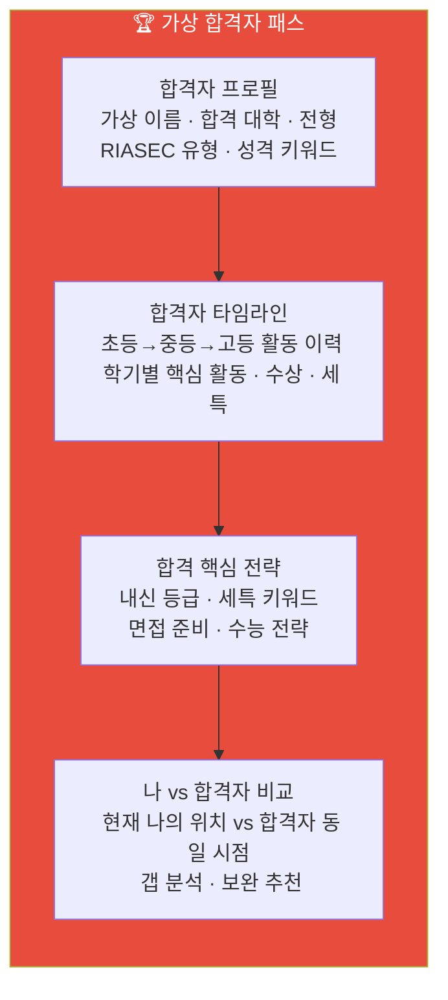

#### 가상 합격자 패스 유형별 비교표

| 전형 유형 | 합격자 프로필 예시 | 핵심 스펙 | 특징 |
|---------|---------------|---------|------|
| **학종 합격자** | "김서진" 서울대 디자인학부 학종 | 내신 1.8 / 세특 디자인 일관성 / R&E | 탐구 스토리 일관성 강조 |
| **정시 합격자** | "박하윤" 홍익대 시각디자인 정시 | 수능 상위 5% / 실기 우수 | 수능+실기 병행 전략 |
| **특기자 합격자** | "이준호" KAIST 산업디자인 특기자 | SW 공모전 대상 / GitHub 포폴 | 실적 기반 포트폴리오 |
| **해외 합격자** | "최민서" 파슨스 디자인 스쿨 | GPA 3.8 / 포트폴리오 20작품 / TOEFL 105 | 해외 포폴 + 어학 전략 |

#### 가상 합격자 패스 화면 설계

```
┌─────────────────────────────────┐
│  🏆 UX 디자이너 합격자 패스      │
│  [기본 패스] [합격자 패스] [비교] │
│─────────────────────────────────│
│                                 │
│  전형 선택                       │
│  [학종 ✓] [정시] [특기자] [해외] │
│                                 │
│  ─────────────────────────────  │
│  👩 가상 합격자: 김서진           │
│  서울대 디자인학부 학종 합격      │
│  유형: 예술형(A)+탐구형(I)       │
│                                 │
│  📊 합격 핵심 스펙               │
│  내신: 1.8등급 / 세특: 디자인 6학기│
│  수상: 교내 디자인대회 3회 입상   │
│  활동: R&E + 디자인 동아리 회장  │
│                                 │
│  📅 합격자 타임라인 (고등)       │
│  ──────────────────             │
│  고1-1: 미술 세특 "사용자 중심   │
│         디자인 원리 탐구"        │
│  고1-2: 정보 세특 "앱 프로토타입 │
│         제작 및 사용성 평가"     │
│  고2-1: R&E "고령자 UI 접근성   │
│         연구" → 교내 발표        │
│  고2-2: 디자인 동아리 전시회 기획│
│  고3-1: 수시 6장 (서울대·연세대  │
│         ·홍익대 학종 집중)       │
│                                 │
│  ─────────────────────────────  │
│  🔍 나 vs 김서진 비교            │
│  ┌──────────┬───────┬──────────┐│
│  │ 항목     │ 나    │ 김서진   ││
│  ├──────────┼───────┼──────────┤│
│  │ 내신     │ 2.3   │ 1.8     ││
│  │ 세특     │ 2학기 │ 6학기   ││
│  │ 수상     │ 1회   │ 3회     ││
│  │ 활동     │ 동아리│ R&E+회장││
│  └──────────┴───────┴──────────┘│
│                                 │
│  💡 보완 추천: "내신 0.5등급 향상│
│  + R&E 프로그램 신청 추천"       │
│                                 │
│  [다른 합격자 보기] [내 패스 저장]│
└─────────────────────────────────┘
```

#### 2.5.3 기본 패스 vs 합격자 패스 비교 오버레이

> 두 패스를 겹쳐서 보여주는 비교 모드. "합격자는 이 시점에 이걸 했는데, 나는?"

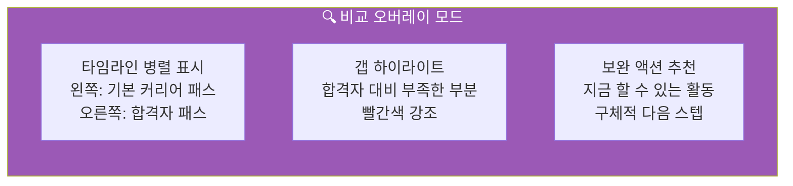

```
┌──────────────────────────────────────────┐
│  🔍 비교 모드: 기본 패스 vs 합격자 패스    │
│─────────────────────────────────────────-│
│                                          │
│  📍 현재: 중2 2학기                       │
│                                          │
│  기본 커리어 패스      합격자 (김서진)     │
│  ─────────────        ──────────────     │
│  중2-1                 중2-1              │
│  ✅ 디자인 씽킹 PBL   ✅ 미술 심화반      │
│                        ✅ Figma 독학      │
│                                          │
│  중2-2                 중2-2              │
│  📌 UI 공모전 도전    ✅ 교내 디자인대회  │
│                        ✅ 코딩 동아리 가입│
│                        ⚠️ 갭: 코딩 활동   │
│                                          │
│  ─────────────────────────────────────── │
│  💡 지금 추천 액션                        │
│  1. 코딩 동아리 가입 (합격자 대비 부족)   │
│  2. Figma 튜토리얼 시작 (무료, 2주)      │
│  3. 교내 디자인 대회 참가 신청            │
│                                          │
│  [액션 체크리스트 저장] [알림 설정]       │
└──────────────────────────────────────────┘
```

### 2.6 연봉 협상 게임 화면

```
┌─────────────────────────────────┐
│  💰 연봉 협상 게임: UX 디자이너 │
│─────────────────────────────────│
│                                 │
│  👤 신입 디자이너 1년차          │
│     포트폴리오: ★★★☆☆           │
│     학력: 홍익대 시각디자인      │
│                                 │
│  🏢 면접관: "희망 연봉이         │
│  어떻게 되시나요?"               │
│                                 │
│  업계 평균: 2,800 ~ 3,500만원   │
│  ─────────────────────────────  │
│                                 │
│  나의 제시 연봉                  │
│  ◀  [   3,200만원   ]  ▶       │
│     (슬라이더로 조정)            │
│                                 │
│  전략 힌트 보기 (광고 또는 유료) │
│                                 │
│  [협상 제시하기]                 │
│                                 │
│  현실: 너무 높으면 탈락,         │
│       너무 낮으면 손해!          │
└─────────────────────────────────┘
```

### 2.7 개인 커리어 패스 (2단계 완성본)

> **2단계만 완료해도 이것이 결과물이 된다.**
> 직업 탐색 + 기본 커리어 패스 + 가상 합격자 패스 비교까지 포함된 완성형 결과물.

```
┌─────────────────────────────────┐
│  📁 나의 커리어 패스             │
│  [공유] [PDF 저장] [3단계 시작] │
│─────────────────────────────────│
│                                 │
│  🧭 나의 유형                   │
│  🎨 예술형(A) + 🤝 사회형(S)   │
│                                 │
│  🎮 탐험 기록 (자동 저장)        │
│  탐험한 직업: 47개              │
│  시뮬레이션 완료: 8개           │
│  커리어 패스 열람: 12개         │
│  합격자 패스 비교: 5회          │
│  총 플레이 시간: 3시간 20분     │
│                                 │
│  ❤️ 관심 직업 TOP 3             │
│  1순위  UX 디자이너    ★★★★★   │
│  2순위  공간 디자이너  ★★★★☆   │
│  3순위  브랜드 마케터  ★★★☆☆   │
│                                 │
│  🗺️ 나의 커리어 로드맵           │
│  지금(중2) → [고등 전략] →      │
│  [대학 탐색] → [포트폴리오]     │
│  → [첫 직장] → [성장]           │
│                                 │
│  🏆 합격자 벤치마크              │
│  1순위 기준 합격자 대비          │
│  달성도: ████████░░ 78%         │
│  보완 포인트: R&E 활동 추가 필요│
│                                 │
│  ─────────────────────────────  │
│  같은 방향 클루 찾기 →          │
│  (3단계 진입, 선택)              │
└─────────────────────────────────┘
```

### 2.8 유저 시나리오 A: 중2 박서연 (2단계만 이용)

```
╔══════════════════════════════════════════╗
║  👧 박서연 / 14세 / 중2 / 수원          ║
║  목표: 인테리어에 관심, 직업 탐색 중    ║
║  이용 패턴: 2단계에서 멈춤 (3단계 미진입)║
╚══════════════════════════════════════════╝
```

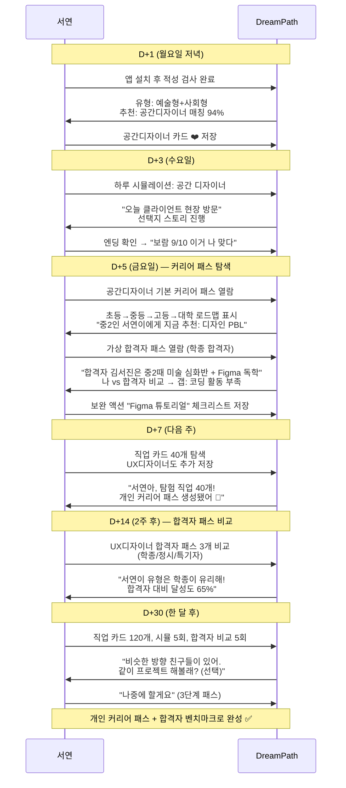

---

## 3단계: 클루(Clue) 형성 + 커리어 패스 프로젝트

### 3.1 단계 목표

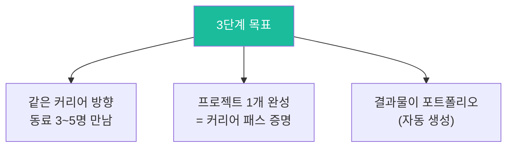

### 3.2 클루 마일스톤 (Jira-like 구조)

```mermaid
flowchart LR
    subgraph Sprint0["📌 Sprint 0 (1주)<br> 클루 결성"]
        S0A["매칭 완료<br> 3~5명"]
        S0B["클루 이름 설정"]
        S0C["프로젝트 주제 투표"]
    end

    subgraph Sprint1["🔍 Sprint 1 (2주)<br> 탐색"]
        S1A["현직자 인터뷰<br> (각 1명 담당)"]
        S1B["직업 현실 조사<br> 분담 후 공유"]
        S1C["인터뷰 내용<br> 앱에 업로드"]
    end

    subgraph Sprint2["📐 Sprint 2 (2주)<br> 기획"]
        S2A["프로젝트 범위 확정"]
        S2B["역할 분담"]
        S2C["일정 합의"]
    end

    subgraph Sprint3["🛠️ Sprint 3 (4주)<br> 제작"]
        S3A["클루원 각자 파트 제작"]
        S3B["중간 점검<br> (2주차)"]
        S3C["최종 통합"]
    end

    subgraph Sprint4["🏆 Sprint 4 (1주)<br> 완성"]
        S4A["DreamFestival<br> 출품 or 비공개"]
        S4B["클루 회고<br> (선택)"]
        S4C["개인 포트폴리오<br> 자동 업데이트"]
    end

    Sprint0 --> Sprint1 --> Sprint2 --> Sprint3 --> Sprint4
```

### 3.3 On/Off 모임 설계

> **기본은 온라인, 오프라인은 선택이다.**
> 억지로 만나게 하면 부담이 된다. 만나고 싶을 때 만날 수 있는 구조.

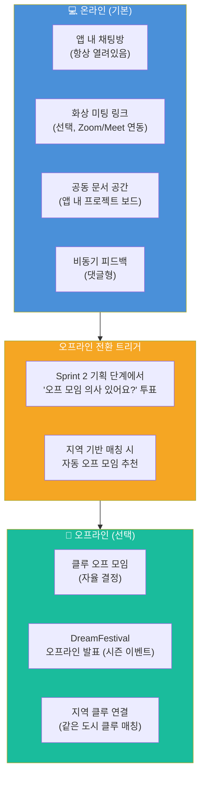

#### On/Off 모임 형식 비교

| 형태 | 빈도 | 도구 | 목적 | 강제 여부 |
|------|------|------|------|----------|
| **앱 내 채팅** | 수시 | DreamPath 채팅 | 일상 소통·진행 공유 | 아니오 |
| **화상 미팅** | Sprint당 1회 (선택) | Zoom/Meet 링크 | 진행 점검·방향 조율 | 아니오 |
| **오프라인 모임** | 자율 (권장 월 1회) | 카페·도서관 등 | 친밀감·집중 작업 | 아니오 |
| **DreamFestival** | 시즌 1회 | 앱 내 + 오프 이벤트 | 결과물 발표·축하 | 아니오 |

### 3.4 클루 화면 설계

#### 클루 메인 화면

```
┌─────────────────────────────────┐
│  🤝 클루: 디자인 파인더즈        │
│  Sprint 2 기획 중  ██████░░ 60% │
│─────────────────────────────────│
│                                 │
│  👧서연  👩지민  👦하준  👧예은  │
│  역할분담 공간디자 UX조사  마케팅│
│                                 │
│  ─────────────────────────────  │
│  🎯 현재 Sprint: 기획 (2주차)   │
│                                 │
│  ☑️ 서연: 공간디자이너 인터뷰 ✅ │
│  ☑️ 지민: UX디자이너 인터뷰 ✅  │
│  ☐ 하준: 건축가 인터뷰 (진행중) │
│  ☐ 예은: 마케터 인터뷰 (예정)   │
│                                 │
│  ─────────────────────────────  │
│  💬 클루 채팅 (3개 새 메시지)   │
│  지민: "인터뷰 녹음 올렸어!"    │
│  하준: "나 내일 한다 ㅎㅎ"      │
│                                 │
│  [채팅 열기] [화상 미팅 잡기]   │
│                                 │
│  📌 다음: Sprint 2 기획 완성    │
│  D-5일                          │
└─────────────────────────────────┘
```

#### 프로젝트 보드 화면 (간소화 Kanban)

```
┌─────────────────────────────────────────────────┐
│  🛠️ 프로젝트 보드: "공간 디자이너 커리어 가이드"  │
│─────────────────────────────────────────────────│
│                                                 │
│  📋 할 일        🔄 진행중       ✅ 완료         │
│  ─────────      ──────────      ───────         │
│  □ 최종          ■ 하준         ■ 서연           │
│    편집           건축가          공간디자이너    │
│                   인터뷰          인터뷰          │
│  □ PDF            정리중         ■ 지민           │
│    취합                           UX디자이너      │
│                  ■ 예은           인터뷰          │
│                   마케터                          │
│                   섭외중                          │
│                                                 │
│  [+ 항목 추가]          [스프린트 완료 체크]     │
│                                                 │
└─────────────────────────────────────────────────┘
```

#### 클루 프로젝트 유형 선택 화면

```
┌─────────────────────────────────┐
│  📌 프로젝트 유형 선택           │
│  (클루원 투표)                  │
│─────────────────────────────────│
│                                 │
│  ┌─────────────────────────────┐│
│  │ 🗺️ 커리어 로드맵 제작       ││
│  │ 우리가 꿈꾸는 직업의 완전    ││
│  │ 가이드 만들기 (4주)         ││
│  │ 투표: ██████░░ 서연,지민    ││
│  └─────────────────────────────┘│
│  ┌─────────────────────────────┐│
│  │ 🎥 현직자 인터뷰 시리즈     ││
│  │ 실제 현직자를 만나 인터뷰    ││
│  │ 콘텐츠 제작 (6주)           ││
│  │ 투표: ████░░░░ 하준         ││
│  └─────────────────────────────┘│
│  ┌─────────────────────────────┐│
│  │ 🛠️ 실제 미니 프로젝트       ││
│  │ 직업 관련 결과물 직접 제작   ││
│  │ (앱 목업/디자인 등) (8주)   ││
│  │ 투표: ██░░░░░░ 예은         ││
│  └─────────────────────────────┘│
│                                 │
│  [투표 마감 D-2일]              │
└─────────────────────────────────┘
```

### 3.5 유저 시나리오 B: 고1 최지우 (2→3단계 진행)

```
╔══════════════════════════════════════════╗
║  👩 최지우 / 16세 / 고1 / 서울          ║
║  목표: UX 디자이너 확정, 포트폴리오 필요 ║
║  이용 패턴: 2단계 → 3단계 클루 진입     ║
╚══════════════════════════════════════════╝
```

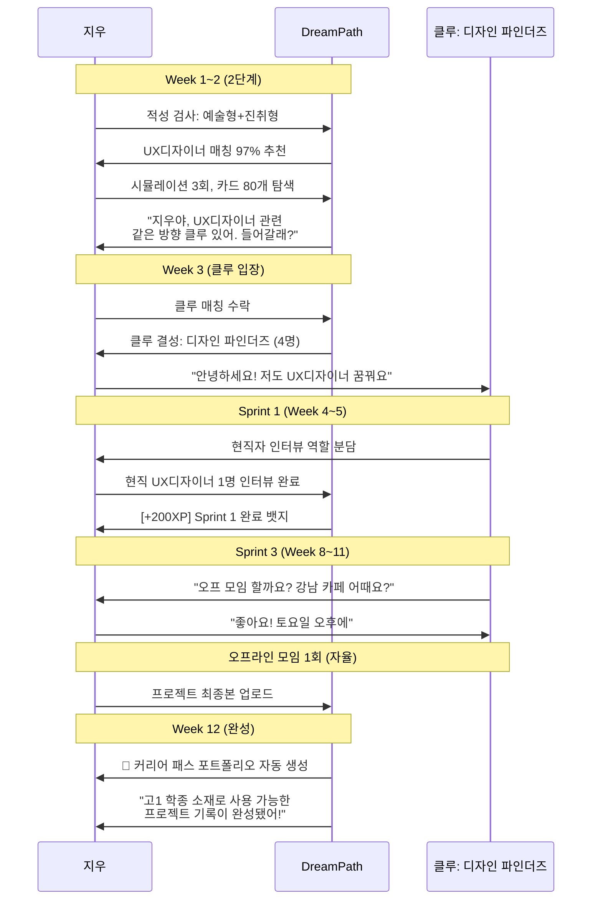

### 3.6 유저 시나리오 C: 중3 이수아 (개인 커리어 패스로 완성)

```
╔══════════════════════════════════════════╗
║  😶 이수아 / 15세 / 중3 / 인천          ║
║  특성: 방황형, 클루 부담스러움          ║
║  이용 패턴: 2단계 완료 → 개인 패스 완성 ║
╚══════════════════════════════════════════╝
```

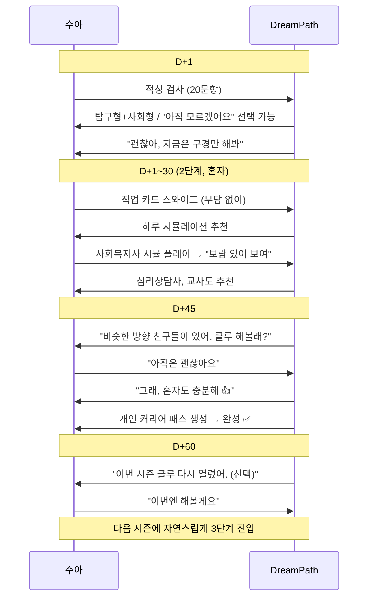

---

## 4. 전체 관계도

### 4.1 사용자-기능 관계도 (ERD 방식)

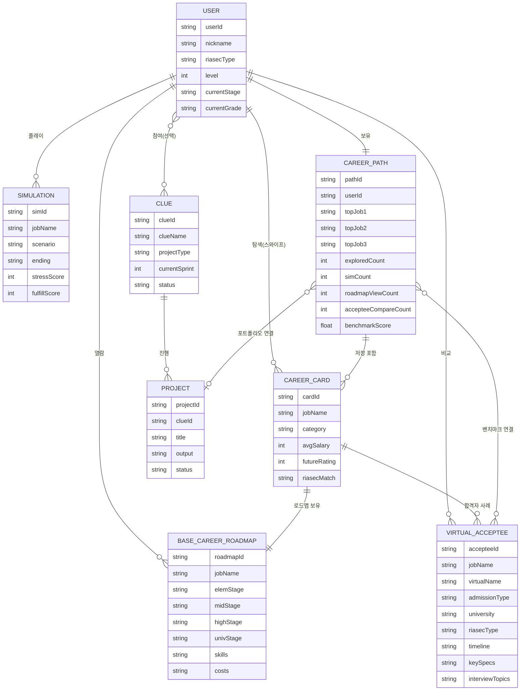

### 4.2 단계별 데이터 흐름

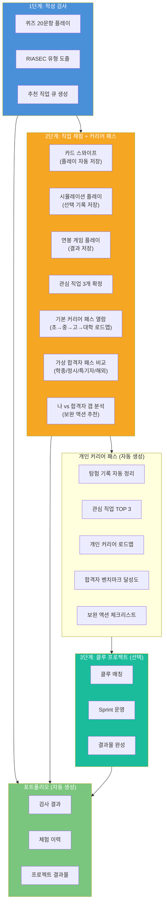

### 4.3 시스템 아키텍처 관계도

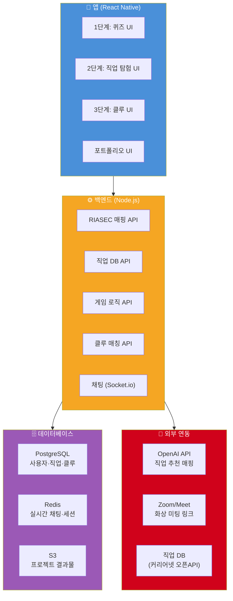

---

## 5. 운영 구조 (Simplified Sprint)

### 5.1 앱 시즌 운영 캘린더

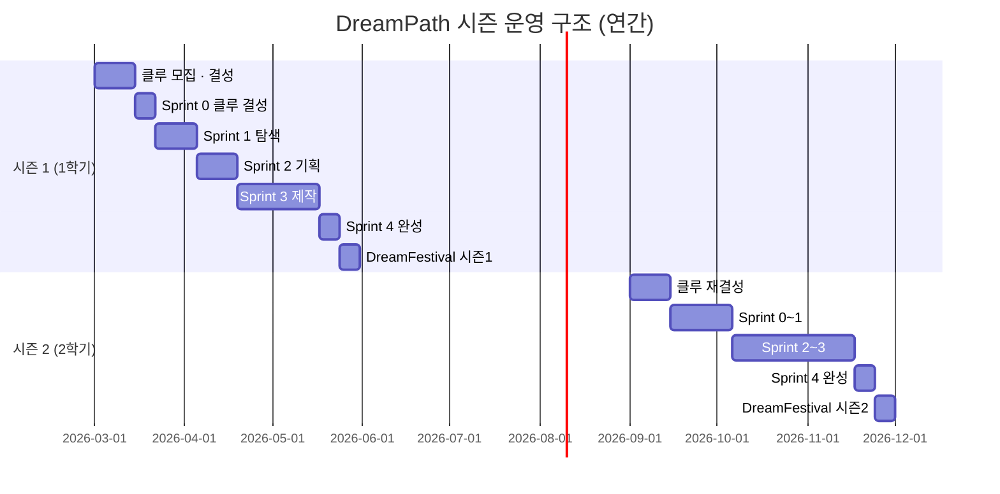

### 5.2 클루 스프린트 운영 규칙

| Sprint | 기간 | 목표 | 클루 필수 활동 | 개인도 가능? |
|--------|------|------|--------------|------------|
| Sprint 0 | 1주 | 클루 결성 | 이름 설정·프로젝트 투표 | ❌ |
| Sprint 1 | 2주 | 탐색·조사 | 역할별 인터뷰·조사 | ❌ (클루 협업) |
| Sprint 2 | 2주 | 기획 | 범위 확정·역할 분담 | ❌ |
| Sprint 3 | 4주 | 제작 | 파트별 제작 후 통합 | ✅ (각자 파트) |
| Sprint 4 | 1주 | 완성 | 결과물 제출·포폴 생성 | ✅ |

### 5.3 참여율 높이는 장치

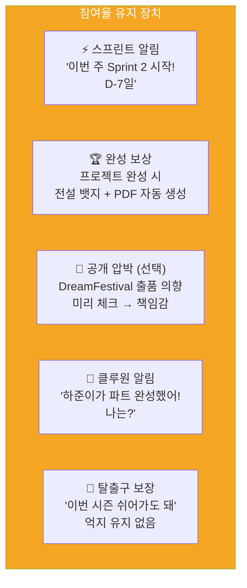

### 5.4 이탈 방지 설계

| 시점 | 이탈 위험 | 대응 |
|------|---------|------|
| 2단계 시작 직후 | "뭘 먼저 해야 해?" | 1단계 결과 기반 첫 카드 자동 추천 |
| 2단계 3일 경과 | "직업 정보만으로 부족" | 기본 커리어 패스 자동 추천 → "이 직업 로드맵 볼래?" |
| 2단계 1주 경과 | 지루함 | 가상 합격자 패스 오픈 → "합격자는 이렇게 준비했어" |
| 2단계 2주 경과 | "나는 어디쯤이지?" | 나 vs 합격자 갭 분석 → 보완 액션 추천 |
| 3단계 클루 결성 후 | "내가 뭘 해야 하지?" | Sprint 0 가이드 팝업 자동 제공 |
| Sprint 2 기획 단계 | "어렵다" | 프로젝트 유형별 템플릿 제공 |
| Sprint 3 중반 | 무기력 | 클루원 진행 현황 서로 보여주기 |

---

## 6. DreamFestival (시즌 마무리 이벤트)

### 6.1 개요

```mermaid
flowchart TD
    Qualify["참가 자격<br> 개인: 커리어 패스 완성<br> 클루: 프로젝트 결과물 1개"] --> Submit

    subgraph Submit["📤 출품"]
        S1["개인 커리어 패스<br> (2단계 완성자)"]
        S2["클루 프로젝트<br> (3단계 완성자)"]
    end

    Submit --> Festival

    subgraph Festival["🎪 DreamFestival (앱 내 갤러리)"]
        F1["전체 공개 갤러리"]
        F2["좋아요 · 응원"]
        F3["현직자 한 줄 피드백<br> (선택, 유료 기능)"]
    end

    Festival --> Award

    subgraph Award["🏆 시즌 어워드"]
        A1["🥇 Best Career Path<br> 가장 많은 응원"]
        A2["🤝 Best Clue<br> 가장 활발한 클루"]
        A3["🌱 Growth Award<br> 가장 크게 성장"]
    end

    style Festival fill:#F5A623,color:#fff
    style Award fill:#D0021B,color:#fff
```

### 6.2 On/Off 이벤트 구성

| 구분 | 온라인 (기본) | 오프라인 (선택) |
|------|-------------|---------------|
| **참가 방법** | 앱 내 결과물 업로드 | 지역별 오프 행사 (대도시) |
| **발표** | 앱 갤러리 공개 | 소규모 발표회 (자율 참가) |
| **시상** | 앱 내 뱃지·PDF | 실물 상장 (오프 참가자) |
| **운영 비용** | 최소 | 후원사/교육청 연계 검토 |

---

## 7. 수익 모델 (2단계 중심 재설계)

> 2단계가 핵심 콘텐츠이므로, 2단계 깊이에서 수익이 나야 한다.

```mermaid
flowchart TD
    Revenue["💰 수익 구조"] --> R1 & R2 & R3

    R1["🆓 무료<br> 1단계 전체<br> 2단계 직업 카드 50개<br> 시뮬레이션 3회<br> 개인 커리어 패스 기본"]

    R2["⭐ 프리미엄 (월 4,900원)<br> 2단계 200개 전체<br> 시뮬레이션 무제한<br> 연봉 협상 게임<br> 3단계 클루 1개<br> DreamFestival 출품<br> 포트폴리오 PDF"]

    R3["🏫 학교 라이선스 (학생당 월 2,000원)<br> 전 기능 + 교사 현황 대시보드<br> 학급 클루 관리"]

    style R1 fill:#7BC67E,color:#fff
    style R2 fill:#F5A623,color:#fff
    style R3 fill:#4A90D9,color:#fff
```

---

## 8. 화면 정보 아키텍처 (전체)

```mermaid
flowchart LR
    Home["🏠 홈"] --> M1 & M2 & M3 & M4

    subgraph M1["🧭 적성 검사"]
        M1a["퀴즈 (최초 1회)"]
        M1b["결과 카드"]
        M1c["재검사 (분기)"]
    end

    subgraph M2["🎮 직업 탐험 + 커리어 패스 (2단계)"]
        M2a["직업 카드 스와이프"]
        M2b["하루 시뮬레이션"]
        M2c["기본 커리어 패스 열람"]
        M2d["가상 합격자 패스 비교"]
        M2e["연봉 협상 게임"]
        M2f["직업 챌린지"]
        M2g["내 관심 직업함"]
    end

    subgraph M3["🗺️ 나의 커리어 패스"]
        M3a["개인 커리어 패스"]
        M3b["합격자 벤치마크 달성도"]
        M3c["보완 액션 체크리스트"]
        M3d["탐험 기록 (자동)"]
        M3e["포트폴리오 PDF"]
    end

    subgraph M4["🤝 클루 (선택, 3단계)"]
        M4a["클루 찾기 / 만들기"]
        M4b["클루 채팅"]
        M4c["프로젝트 보드"]
        M4d["DreamFestival"]
    end

    style Home fill:#4A90D9,color:#fff
    style M2 fill:#F5A623,color:#fff
    style M4 fill:#1ABC9C,color:#fff
```

---

## 9. MVP 개발 우선순위

| 우선순위 | 기능 | 단계 | 이유 | 예상 기간 |
|---------|------|------|------|---------|
| 🔴 P0 | 적성 검사 (20문항) | 1단계 | 진입 필수 | 2주 |
| 🔴 P0 | 직업 카드 스와이프 (50개) | 2단계 | 핵심 체험 | 4주 |
| 🔴 P0 | 하루 시뮬레이션 (10개) | 2단계 | 핵심 차별점 | 4주 |
| 🔴 P0 | 기본 커리어 패스 (32개 직업) | 2단계 | **2단계 핵심 가치** | 6주 |
| 🔴 P0 | 가상 합격자 패스 (직업당 2~4개) | 2단계 | **2단계 핵심 차별점** | 6주 |
| 🔴 P0 | 개인 커리어 패스 자동 생성 | 2단계 | 결과물 필수 | 2주 |
| 🟡 P1 | 나 vs 합격자 갭 분석 + 보완 추천 | 2단계 | 개인화 핵심 | 3주 |
| 🟡 P1 | 연봉 협상 게임 (5개 직업) | 2단계 | 참여율 핵심 | 3주 |
| 🟡 P1 | 클루 매칭 + 채팅 | 3단계 | 커뮤니티 핵심 | 4주 |
| 🟡 P1 | 프로젝트 보드 (Kanban) | 3단계 | 클루 운영 | 3주 |
| 🟢 P2 | 직업 카드 200개 확장 | 2단계 | 콘텐츠 확장 | 8주 |
| 🟢 P2 | 해외 합격자 패스 확장 | 2단계 | 해외 대입 수요 | 4주 |
| 🟢 P2 | DreamFestival | 3단계 | 시즌 이벤트 | 4주 |
| 🟢 P2 | 포트폴리오 PDF 생성 | 공통 | 유료 전환 | 3주 |

---

*작성일: 2026년 2월 | DreamPath 핵심 기획서 v1.0*
