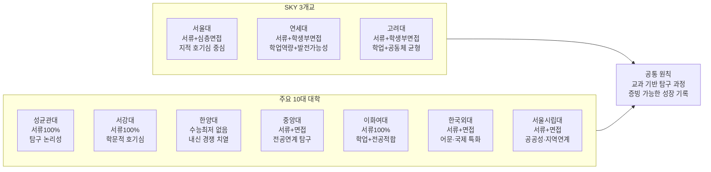
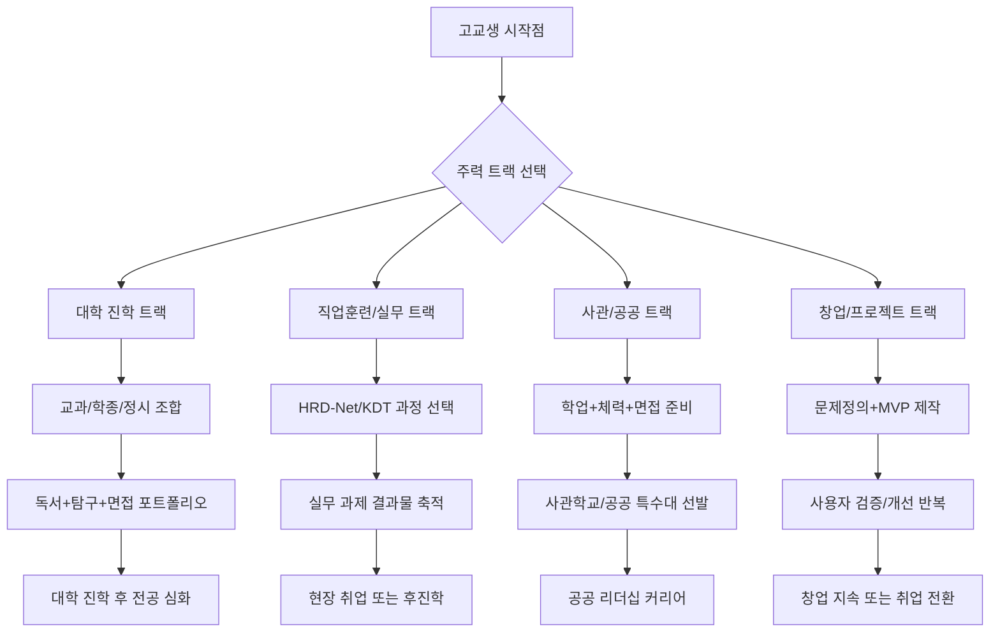
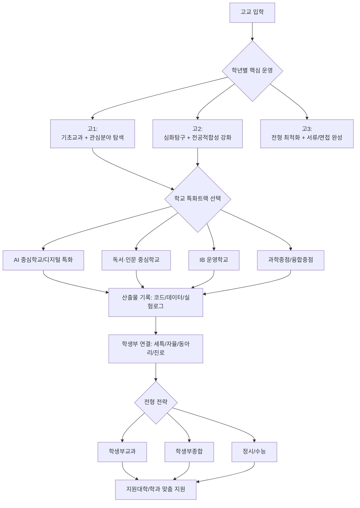
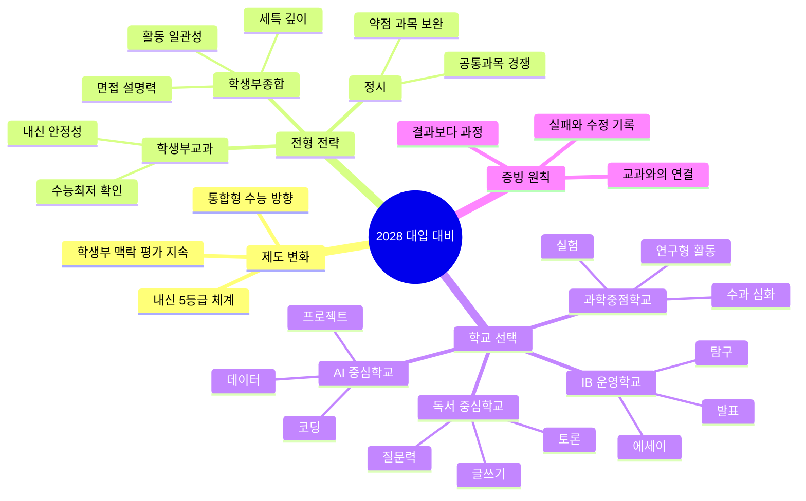
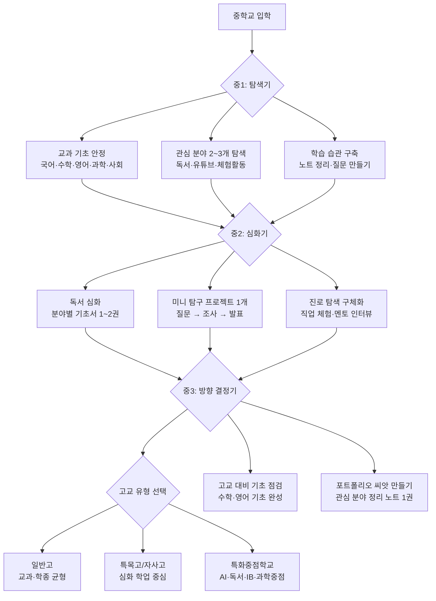
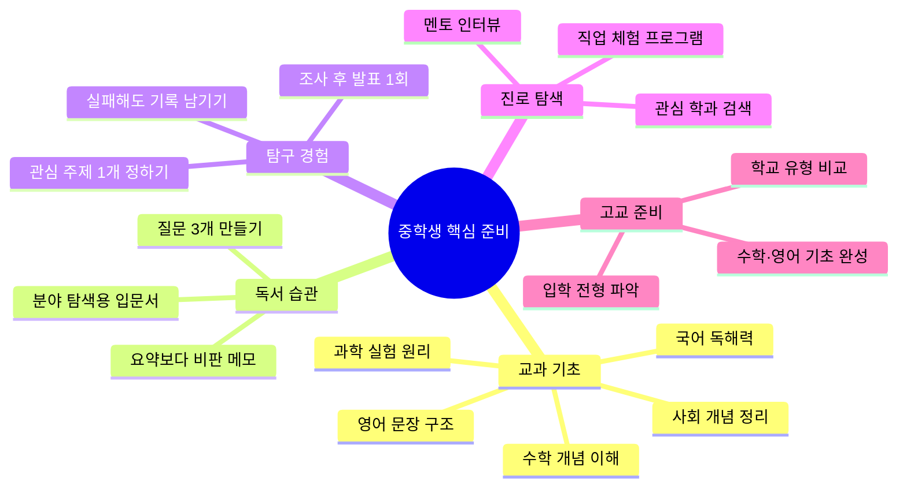
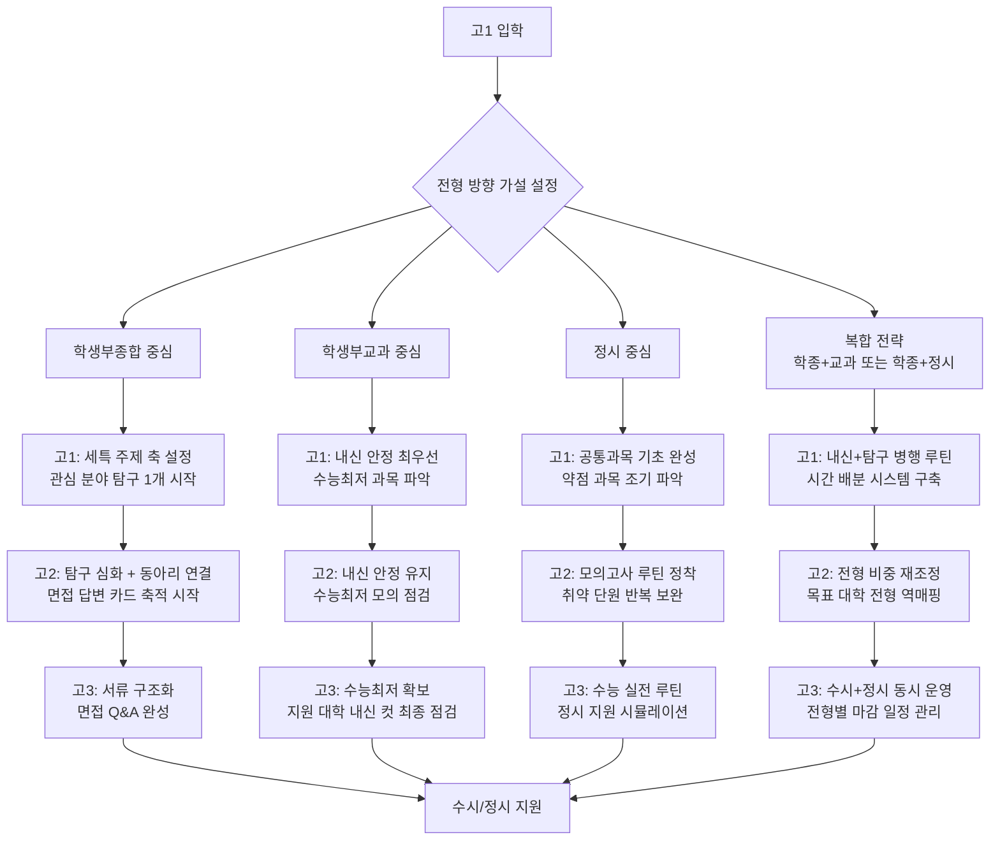
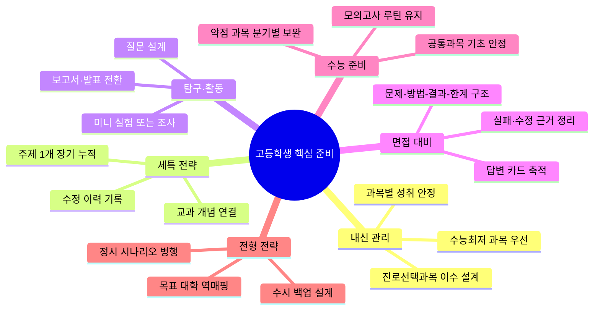
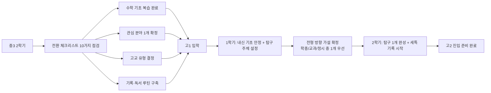

# 2026·2028 대입 학종/교과 비중 및 수상·논문·대회활동 영향 정리

> 범위: 전국 4년제 일반 기준(교육부/대교협 공통 변화 중심)  
> 문서 목적: `2026 확정 정보`와 `2028 제도 변화 + 합리적 전망`을 분리해, 실제 준비 우선순위를 제시

---

## 1) 핵심 결론(먼저 보기)

### [확정] 2026학년도 큰 그림

- 수시 중심 구조는 유지되고, 수시 안에서는 학생부위주(교과+학종)가 핵심 축입니다.
- 공개된 시행계획 기준으로 학생부교과 비중이 학종보다 더 큽니다.
- 정시는 여전히 수능위주 중심입니다.

### [확정] 2028학년도 변화의 방향

- 통합형 수능(선택과목 축소/폐지 방향)과 고교 내신 체계 변화(5등급 체계)가 핵심입니다.
- 즉, `내신 해석 방식`과 `수능 경쟁 구도`가 동시에 바뀌어, 대학의 전형별 평가 디테일이 일부 재조정될 가능성이 큽니다.

### [실무 결론] 수상·논문·대회·인턴·캠프 영향

- 활동 자체의 "스펙 이름"보다, 학교 교육과정 안에서 검증 가능한 `과정·성장·연계성`이 훨씬 중요합니다.
- 교외 실적은 직접 점수화가 제한적이거나 미반영인 경우가 많고, 반영되더라도 대학/전형별로 방식이 다릅니다.
- 따라서 활동은 "직접 가산점"보다 "세특/면접에서 설명 가능한 학업 맥락"을 만드는 용도로 설계해야 합니다.

---

## 2) 2026 vs 2028 비교 프레임

## 2-1. 전형 구조 비교(전국 단위 관점)

| 구분 | 2026학년도 | 2028학년도 |
|---|---|---|
| 수시/정시 구조 | [확정] 수시 중심 기조 유지 | [전망] 수시 중심 가능성 높음(대학별 조정 폭 존재) |
| 수시 내 학생부교과 | [확정] 큰 비중 유지 | [전망] 내신 체계 변화로 대학별 산식 조정 가능 |
| 수시 내 학생부종합 | [확정] 주요 축 유지 | [전망] 서류 정성평가는 유지, 평가 포인트 재해석 가능 |
| 정시 수능위주 | [확정] 높은 비중 유지 | [확정+전망] 통합형 수능 전환 영향으로 대학별 반영 룰 조정 가능 |

## 2-2. 평가 요소 비교(학생 관점)

| 항목 | 2026학년도 | 2028학년도 |
|---|---|---|
| 내신 해석 | [확정] 기존 체계 기반 | [확정] 5등급 체계 적용에 따른 변별/해석 재정비 |
| 수능 체계 | [확정] 선택과목 체계 잔존 | [확정] 선택과목 구조 변화(통합형 방향) |
| 학생부 해석 | [확정] 교과+세특 중심 해석 강화 | [전망] 정량보다 맥락 평가 중요도 유지 가능성 |
| 서류평가 난이도 | [확정] 진로일관성·교과연계 요구 | [전망] 동일하되 내신체계 변화 반영 문항 가능 |

---

## 3) 학종·교과 비중: 숫자와 해석

## 3-1. [확정] 2026학년도 참고 수치(전국 단위 시행계획 요약)

아래는 공개 보도자료/시행계획 요약에서 반복 확인되는 값입니다.

- 전체 모집인원: 345,179명
- 수시: 275,848명(79.9%)
- 정시: 69,331명(20.1%)
- 수시 내 학생부교과: 155,495명(56.4%)
- 수시 내 학생부종합: 81,373명(29.5%)

> 해석 포인트  
> - "학종이 중요하다"는 말은 맞지만, "교과보다 더 큰 비중"이라는 의미는 아닙니다(전국 총량 기준).  
> - 수험생 개인 전략은 총량보다 `지원 대학·모집단위`의 전형별 선발 비율이 더 중요합니다.

## 3-2. [전망] 2028학년도 비중 변화 시나리오(공식+추정 분리)

2028은 제도 변화가 크지만, 대학별 최종 모집요강이 모두 확정된 상태가 아니므로 시나리오로 해석합니다.

| 시나리오 | 학종 비중 | 교과 비중 | 정시(수능) 비중 | 발생 조건 |
|---|---|---|---|---|
| 보수적 시나리오 | 유사 유지 | 유사 유지 | 유사 유지 | 대학들이 큰 구조 변경 없이 산식만 조정 |
| 중립 시나리오 | 소폭 조정 | 소폭 조정 | 소폭 조정 | 내신 5등급 해석 보완 위해 전형별 미세 조정 |
| 변동 확대 시나리오 | 대학별 편차 확대 | 대학별 편차 확대 | 대학별 편차 확대 | 상위권/지역거점별 선발철학 차이 확대 |

> 실무적으로는 "전국 평균 비중 예측"보다 "목표 대학 10~15개 전형비율 변동"을 추적하는 것이 정확합니다.

---

## 4) 수상·논문·대회·인턴·캠프 영향도 매트릭스

## 4-1. 영향도 기준(이 문서의 공통 룰)

- `직접 반영`: 전형요소 또는 공식 제출서류에서 직접 평가 가능
- `간접 반영`: 세특·면접·활동 맥락을 통해 역량 입증에 사용
- `제한/주의`: 대학 공통 유의사항 또는 모집요강에서 직접 반영 제한 가능

## 4-2. 활동별 영향(전국 공통 경향)

| 활동 항목 | 2026 영향 | 2028 영향 전망 | 실무 판단 |
|---|---|---|---|
| 교내 수상 | 간접 반영 강함 | 간접 반영 유지 가능성 높음 | "수상 개수"보다 교과/탐구 연계 서사가 핵심 |
| 교외 대회 수상 | 직접 반영 제한적/미반영 가능 | 동일 또는 더 엄격한 해석 가능 | 교외 스펙 자체보다 학교 내 확장 기록 필요 |
| 논문(R&E/소논문 포함) | 직접 반영보다 간접 반영 중심 | 동일 기조 가능성 높음 | 연구 "결과"보다 "질문-방법-검증 과정" 중요 |
| 인턴(외부기관) | 대학/전형별 편차 큼 | 편차 유지 가능 | 증빙 가능성과 교육과정 연계성이 없으면 효과 제한 |
| 캠프/체험 프로그램 | 직접 가점 낮음 | 직접 가점 낮음 유지 가능 | 체험 후 교과 탐구 산출물로 전환해야 유효 |

## 4-3. 사용자가 궁금해하신 항목별 상세 해석

### A. 수상

- 교내 수상은 맥락(어떤 과목 탐구를 어떤 기준으로 수행했는지)이 잡히면 학종 면접/서류에서 설명력이 큽니다.
- 교외 수상은 대학별 미반영 또는 제한 반영이 빈번하므로, "수상 자체"를 목표로 하면 효율이 낮습니다.

### B. 논문

- "논문이 있으면 무조건 유리"는 과장입니다.
- 학교 수업/탐구와 연결된 검증 가능한 연구 과정(주제 설정, 방법, 데이터 해석)이 더 중요합니다.

### C. 대회

- 대회는 결과보다 과정 증빙이 핵심입니다.
- 특히 활동 이후 교과 세부능력/발표/보고서로 연결되지 않으면 입시 효용이 크게 떨어집니다.

### D. 인턴/캠프

- 인턴/캠프 자체는 체험 성격으로 분류되는 경우가 많아 직접 점수 기여가 제한적입니다.
- 다만 진로탐색의 깊이를 만들어 면접에서 진정성과 학업 동기를 설명하는 데는 유효할 수 있습니다.

---

## 4-4. SKY 및 주요 10대 대학별 변화 조짐(2026~2028)

> [주의] 아래는 각 대학 입학처 공개 자료·설명회·보도자료 기반의 경향 정리입니다.  
> 매년 모집요강이 변경되므로, 반드시 해당 연도 원문으로 최종 확인하세요.

### 서울대학교

| 항목 | 현황 및 변화 조짐 |
|---|---|
| 지역균형전형 | 학생부교과 중심, 수능최저 적용. 내신 안정성이 최우선 |
| 일반전형(학종) | 서류+면접. 세특 깊이와 지적 호기심 중심 평가 강화 흐름 |
| 2028 대비 | 5등급 내신 체계 도입 시 세특·과목 맥락 해석 비중 더 커질 가능성 |
| 활동 평가 방향 | 교외 스펙보다 학교 수업 기반 탐구 과정의 진정성을 중시 |
| 면접 특징 | 제시문 기반 심층 면접. 단순 암기보다 논리적 사고·근거 제시 요구 |

### 연세대학교

| 항목 | 현황 및 변화 조짐 |
|---|---|
| 추천형(교과) | 학교장 추천 + 수능최저. 내신 상위권 + 최저 충족이 핵심 |
| 활동우수형(학종) | 서류+면접. 전공적합성보다 학업역량·발전가능성 평가 강화 |
| 국제형 | 어문·국제계열 특화. 영어 역량 + 글로벌 이슈 탐구 중심 |
| 2028 대비 | 통합형 수능 전환 시 수능최저 충족 구도 변화 가능. 교과전형 산식 조정 가능성 |
| 면접 특징 | 제시문 없이 학생부 기반 질문. 활동의 구체적 근거와 성찰 요구 |

### 고려대학교

| 항목 | 현황 및 변화 조짐 |
|---|---|
| 학교추천전형(교과) | 수능최저 적용. 내신 + 최저 동시 충족이 당락 변수 |
| 일반전형(학종) | 서류+면접. 학업역량·공동체역량 균형 평가 |
| 2028 대비 | 5등급 내신 체계 도입 시 과목 이수 구성과 세특 맥락 해석 강화 가능 |
| 활동 평가 방향 | 동아리·자율활동보다 교과 연계 탐구 활동의 일관성 중시 |
| 면접 특징 | 학생부 기반 제시문 없는 면접. 활동 동기·과정·결과를 구조적으로 설명해야 함 |

### 성균관대학교

| 항목 | 현황 및 변화 조짐 |
|---|---|
| 학과모집(교과) | 수능최저 적용. 내신 안정 + 최저 충족 필수 |
| 탐구형인재(학종) | 서류 100%. 면접 없음. 세특·탐구 기록의 질이 당락 결정 |
| 2028 대비 | 면접 없는 서류 100% 구조에서 5등급 내신 체계 도입 시 세특 해석 기준 재정비 가능성 |
| 활동 평가 방향 | 탐구 과정의 논리성과 학문적 깊이를 서류에서 집중 평가 |

### 서강대학교

| 항목 | 현황 및 변화 조짐 |
|---|---|
| 학교생활우수자(교과) | 수능최저 적용. 내신 + 최저 동시 관리 필수 |
| 일반형(학종) | 서류 100%. 전공 연계 탐구 역량 중심 평가 |
| 2028 대비 | 소규모 선발 특성상 대학별 조정 폭이 클 수 있음. 매년 모집요강 업데이트 필수 |
| 활동 평가 방향 | 학문적 호기심과 자기주도 탐구의 일관성을 중시 |

### 한양대학교

| 항목 | 현황 및 변화 조짐 |
|---|---|
| 학생부교과(교과) | 수능최저 없음. 내신 성적만으로 선발. 내신 경쟁이 매우 치열 |
| 서류형(학종) | 수능최저 없음. 서류 100%. 학업역량·성장가능성 중심 |
| 2028 대비 | 수능최저 없는 구조에서 5등급 내신 체계 도입 시 내신 해석 방식 재정비 가능성 |
| 특이점 | 수능최저 없는 교과전형으로 내신 최상위권 집중 현상 강함 |

### 중앙대학교

| 항목 | 현황 및 변화 조짐 |
|---|---|
| 학생부교과(교과) | 수능최저 적용. 내신 + 최저 병행 관리 |
| 탐구형인재(학종) | 서류+면접. 전공 연계 탐구 역량 중심 |
| 2028 대비 | 전형 구조 유지 가능성 높으나 내신 체계 변화에 따른 산식 조정 가능 |

### 이화여자대학교

| 항목 | 현황 및 변화 조짐 |
|---|---|
| 고교추천전형(교과) | 수능최저 적용. 내신 + 최저 충족 필수 |
| 미래인재전형(학종) | 서류 100%. 학업역량·전공적합성 중심 |
| 2028 대비 | 여대 특성상 계열별 선발 비율 조정 가능성. 모집요강 연도별 확인 필수 |

### 한국외국어대학교

| 항목 | 현황 및 변화 조짐 |
|---|---|
| 학생부교과(교과) | 수능최저 적용. 어문계열 특성상 영어 최저 중요 |
| 학생부종합(학종) | 서류+면접. 어문·국제 계열 탐구 역량 중심 |
| 2028 대비 | 통합형 수능 전환 시 어문계열 수능최저 구성 변화 가능성 주목 |

### 서울시립대학교

| 항목 | 현황 및 변화 조짐 |
|---|---|
| 학생부교과(교과) | 수능최저 적용. 비용 대비 경쟁력으로 지원자 증가 추세 |
| 학생부종합(학종) | 서류+면접. 지역 연계·공공성 관심 학생에게 적합 |
| 2028 대비 | 공립대 특성상 교육부 정책 변화에 민감. 내신 체계 변화 반영 가능성 |

## 4-5. 10대 대학 공통 변화 조짐 요약

| 변화 방향 | 구체 내용 | 학생 대응 포인트 |
|---|---|---|
| 세특 해석 강화 | 5등급 내신 체계 도입 시 단순 등급보다 과목 맥락·탐구 기록 비중 증가 예상 | 세특 주제 일관성 + 탐구 과정 기록 강화 |
| 수능최저 변동 | 통합형 수능 전환 시 최저 충족 구도 재편 가능 | 목표 대학 수능최저 매년 업데이트 확인 |
| 면접 질문 심화 | 단순 활동 나열보다 근거·수정·성찰 중심 질문 증가 | 활동 직후 5문장 카드 누적 필수 |
| 전공적합성 → 학업역량 | 좁은 전공 스펙보다 학문적 사고력·발전가능성 평가 강화 | 단일 전공 집착보다 탐구 역량의 폭 확보 |
| 교외 활동 제한 강화 | 교외 스펙 직접 반영 제한 기조 유지 또는 강화 | 교내 기록 품질에 집중 |

## 4-6. 대학별 전형 성격 한눈에 비교



---

## 5) 학종/교과 준비 전략(2026~2028 공통)

## 5-1. 잘 먹히는 전략

- 교과 성취 + 세특 탐구를 한 주제 축으로 누적
- 활동 1개를 보고서/발표/후속탐구로 2~3회 확장
- 면접 대비용으로 활동의 실패/수정 이력까지 기록
- 대학별 모집요강의 "평가항목 문장"을 기준으로 포트폴리오 재정리

## 5-2. 효율이 낮은 전략

- 교외 스펙 나열(수상 개수 경쟁)
- 논문 제목/캠프 수료증 중심 포장
- 진로와 무관한 대회 다량 참여
- 증빙이 어려운 외부활동 과장

---

## 6) 학년별 실행 체크리스트(고1~고3)

## 6-1. 고1

- 교과 기초 + 관심 전공 1~2개 탐색
- 탐구 활동은 "짧고 명확한 질문형"으로 시작
- 교내 활동 1개를 교과 발표/보고서로 연결

## 6-2. 고2

- 전공연계 교과 성취도 안정화
- 활동은 양보다 질(심화 1~2개)
- 면접 대비용 근거자료(노트, 데이터, 피드백 반영 기록) 축적

## 6-3. 고3

- 지원 대학별 전형요소 역매핑
- 학종은 서류의 일관성/증빙 정리, 교과는 내신 안정 관리
- 정시는 수능 최저/정시 확장 시나리오까지 동시 운영

---

## 7) 빠른 의사결정 표(질문별 답변)

| 질문 | 답변 |
|---|---|
| 2026에서 학종 vs 교과, 어느 쪽이 더 큰가? | 전국 총량 기준으로는 교과가 더 큼. 단, 목표 대학/학과별로 역전 가능 |
| 2028에서 학종이 줄어드나? | 현재 시점에서는 단정 불가. 제도 변화로 대학별 편차가 커질 가능성이 더 현실적 |
| 수상이 당락을 결정하나? | 단독 결정력은 낮고, 교과연계 맥락/면접 설명력이 핵심 |
| 논문이 필수인가? | 필수 아님. 연구적 사고와 검증 과정이 핵심 |
| 인턴/캠프가 유리한가? | 직접 가점은 제한적. 활동 후 학교 맥락으로 환원해야 유효 |

---

## 8) 출처 및 근거 신뢰도

## 8-1. 직접 참고한 외부 링크

- 2026 시행계획 관련 보도(정책브리핑):  
  [https://www.korea.kr/news/pressReleaseView.do?newsId=156628824&pWise=sub&pWiseSub=J2](https://www.korea.kr/news/pressReleaseView.do?newsId=156628824&pWise=sub&pWiseSub=J2)
- 2028 대입개편 시안/정책뉴스(정책브리핑):  
  [https://www.korea.kr/news/policyNewsView.do?newsId=148921191](https://www.korea.kr/news/policyNewsView.do?newsId=148921191)
- 대입전형자료(학생부) 온라인 제공 안내 참고 링크:  
  [https://www.knsu.ac.kr/ipsi/notice/notice.do?articleNo=54006&mode=view](https://www.knsu.ac.kr/ipsi/notice/notice.do?articleNo=54006&mode=view)
  [https://www.korea.kr/news/policyNewsView.do?newsId=148947529&pWise=widget&pWiseWid=oka](https://www.korea.kr/news/policyNewsView.do?newsId=148947529&pWise=widget&pWiseWid=oka)

## 8-2. 신뢰도 라벨

- `높음`: 정책/시행계획 수치, 제도 개편 방향
- `중간`: 대학 현장 적용 방식(연도별·대학별 편차 존재)
- `주의`: 활동별 직접/간접 반영의 일반화 표현(반드시 모집요강으로 재검증 필요)

## 8-3. 필수 주의

- 본 문서는 전국 공통 경향 정리입니다.
- 실제 지원 전략은 `대학별 모집요강`, `학과별 전형방법`, `제출서류 유의사항`을 최종 기준으로 확정해야 합니다.

---

## 9) 독서 비중 + 프로젝트 준비단계(실행형)

## 9-1. 전형별 독서 비중(권장)

| 전형/루트 | 독서 비중(권장) | 실무 해석 |
|---|---|---|
| 학생부교과 중심 | 15~25% | 내신이 우선. 독서는 세특 설명력 보강용 |
| 학생부종합 중심 | 30~45% | 독서 기반 질문-탐구-발표로 이어지는 구조가 핵심 |
| 정시 중심 | 10~20% | 수능이 우선. 면접/학과적합성 대비 최소 루틴 필요 |
| 특수학교/특성화 루트 | 25~40% | 학교/기관 성격에 맞는 분야 독서가 중요 |

> 독서 비중은 "시간 비율"입니다.  
> 예: 주당 20시간 학습이라면 학종형은 6~9시간을 독서+정리(요약/질문노트)에 배분

## 9-2. 독서를 입시효율로 바꾸는 4단계

1. `읽기`: 전공기초 1권 + 심화 1권 + 최신 아티클/논문 요약
2. `질문`: 책당 핵심 질문 3개 작성(왜/어떻게/그래서 무엇)
3. `적용`: 수업 발표, 탐구 보고서, 동아리 토론으로 전환
4. `축적`: 세특 연결 문장 + 면접 답변 카드로 누적

## 9-3. 프로젝트 준비단계(고1~고3 공통)

| 단계 | 산출물 | 확인 포인트 |
|---|---|---|
| 0단계 문제정의 | 주제 1문장 | 진로와 연결되는 실제 문제인가 |
| 1단계 기초독서 | 2~4주 독서노트 | 선행지식 없이 제작부터 시작하지 않았는가 |
| 2단계 미니실험/프로토타입 | 초안 결과물 1개 | 실패 원인과 수정이력 기록 여부 |
| 3단계 확장탐구 | 보고서/발표자료 | 교과 개념(수학/과학/사회/국어) 연결 여부 |
| 4단계 검증/피드백 | 교사·멘토 피드백 반영본 | 수정 전후 변화가 문서로 남는가 |
| 5단계 입시정리 | 세특 문장, 면접 Q&A | 성과보다 과정 설명이 가능한가 |

## 9-4. 프로젝트 유형별 예시(다양성 강화)

| 커리어 유형 | 프로젝트 예시 | 추천 결과물 |
|---|---|---|
| 연구/의학 | 질병 데이터 시각화 + 예방 캠페인 설계 | 데이터 리포트 + 발표 영상 |
| 공학/IT | 학교 생활 불편 해결 앱(출결/학습관리) | 기획서 + 프로토타입 + 회고 |
| 인문/사회 | 지역 이슈 인터뷰 기반 정책 제안 | 인터뷰 기록 + 정책 브리프 |
| 경영/창업 | 동아리 기반 소규모 MVP 운영 | 손익표 + 고객 피드백 표 |
| 디자인/콘텐츠 | 공공문제 인포그래픽/영상 캠페인 | 포트폴리오 + 반응분석 |
| 공공/법/행정 | 학교 규정 개선 제안 프로젝트 | 비교표 + 제안서 + 토론기록 |

---

## 10) 서울24·태재대·특수학교 상세 가이드

## 10-1. 서울24(서울권 주요 대학군) 준비 포인트

> `서울24`는 입시 현장에서 서울권 주요 대학들을 묶어 부르는 실무 용어로 사용됩니다.  
> 대학별 전형 차이가 크므로, 동일 전략을 일괄 적용하면 오차가 큽니다.

| 항목 | 실무 포인트 |
|---|---|
| 교과전형 | 내신 안정성이 최우선. 수능최저 적용 여부를 먼저 확인 |
| 학종전형 | 세특의 전공적합성, 활동의 일관성, 면접 대응력이 당락 변수 |
| 논술/면접 | 대학별 출제 성향 차이가 커서 기출 기반 개별 대비가 필요 |
| 공통 전략 | "지원대학 12~15개 전형요소 역매핑표"를 반드시 작성 |

## 10-2. 태재대학교(특수 신설 성격 대학) 준비 포인트

> [주의] 태재대학교는 교육철학/선발방식이 일반 대규모 대학과 다를 수 있어,  
> 최신 모집요강·학교 공식 안내를 최우선으로 확인해야 합니다.

| 항목 | 권장 준비 |
|---|---|
| 학업기초 | 영어/글쓰기/토론 기반 역량 강화 |
| 탐구역량 | 독서-프로젝트-에세이의 연결 고리 구축 |
| 글로벌소통 | 국제 이슈 기반 발표/토론 기록 축적 |
| 인성/협업 | 팀 프로젝트에서 역할과 갈등조정 사례 정리 |

## 10-3. 특수학교군(대학 외 포함)별 차이

| 구분 | 대표 예시 | 선발 성격 | 준비 우선순위 |
|---|---|---|---|
| 과학기술특성화대 | KAIST, GIST, DGIST, UNIST | 수학·과학 심화 + 탐구 | 심화 교과 + 연구형 프로젝트 |
| 사관학교 | 육사/해사/공사/국간사 | 학업 + 체력 + 인성/면접 | 체력, 리더십, 국가관, 면접 |
| 경찰/공공 특수대 | 경찰대 등 | 학업 + 적성 + 면접 | 국·수·영 기본기 + 상황판단 |
| 예술·실기 특화 | 예체능 특성 대학/계열 | 실기 + 포트폴리오 | 작품집 + 실전평가 루틴 |

---

## 11) 대학에 국한하지 않는 커리어 루트 맵

## 11-1. 고교생 이후 선택 가능한 루트(요청 반영)

| 루트 | 대표 기관/형태 | 적합 성향 | 핵심 준비 |
|---|---|---|---|
| 일반대학 진학 | 4년제/전문대 | 학문·연구·자격 기반 | 내신/수능 + 전형 맞춤 포트폴리오 |
| 직업훈련소/직업교육 | 한국폴리텍, KDT 부트캠프, 지역훈련기관 | 실무형/빠른 취업 | 기초역량 + 포트폴리오 + 실습시간 |
| 사관학교/군 루트 | 사관학교, 부사관·군특기 | 규율/리더십/공공성 | 체력 + 면접 + 신체검사 + 학업 |
| 공공훈련·기능경기 | 기능대회, 공공기술훈련 | 기술숙련/자격 중심 | 기능사·산업기사 + 실전과제 |
| 기업연계 캠프/아카데미 | SW캠프, 메이커캠프, 산학연계 과정 | 프로젝트형/협업형 | 팀 프로젝트 + 발표역량 |
| 창업·프리랜서 루트 | 1인 창업, 팀 창업, 콘텐츠 사업 | 도전/실행 중심 | MVP, 고객검증, 기초회계 |

## 11-2. 루트별 진입 난이도와 시간축

| 루트 | 초기 진입 난이도 | 취업/성과까지 평균 시간 | 장점 | 리스크 |
|---|---|---|---|---|
| 일반대학 | 중~상 | 3~6년 | 선택지 넓음 | 비용/시간 부담 |
| 직업훈련소 | 중 | 6개월~2년 | 빠른 실무전환 | 전공심화 한계 가능 |
| 사관학교/군 | 상 | 4년+ | 안정성/리더십 경력 | 선발기준 엄격 |
| 공공기술훈련 | 중 | 1~3년 | 자격 기반 명확 | 직무 편중 가능 |
| 캠프/아카데미 | 하~중 | 3개월~1년 | 경험 축적 빠름 | 단독 학력 대체는 제한적 |
| 창업 | 상 | 개인차 큼 | 성장 상한 높음 | 실패확률/변동성 큼 |

## 11-3. 앱에 바로 넣기 좋은 커리어 패스 구조(콘텐츠용)

아래 구조로 경로 데이터를 관리하면, 대학 중심이 아닌 멀티 루트 추천에 적합합니다.

```json
{
  "pathId": "public_service_military_route",
  "pathName": "공공·사관 루트",
  "entryStage": "highschool_grade_1_3",
  "requiredCore": ["학업기초", "체력", "면접", "인성"],
  "milestones": [
    "기초 성적 관리",
    "체력 기준 달성",
    "면접 시나리오 훈련",
    "전형별 지원 전략 확정"
  ],
  "alternatives": [
    "경찰/공공대",
    "직업훈련 후 공공기관 기술직",
    "일반대 ROTC"
  ]
}
```

---

## 12) 구조도/단계도 도식화

## 12-1. 진학·취업 멀티 루트 구조도



## 12-2. 독서-프로젝트-평가 연결 단계도

```mermaid
flowchart LR
    readInput["독서 입력 <br> 기초서+심화서+아티클"] --> questionDesign[ "질문 설계<br>핵심 질문 3개"]
    questionDesign --> prototypeBuild["프로토타입/탐구 실행"]
    prototypeBuild --> evidenceRecord["증빙 기록<br>실패/수정/재실험"]
    evidenceRecord --> classLink["교과 연결<br>세특/발표/보고서"]
    classLink --> interviewPrep["면접 답변 카드 정리"]
    interviewPrep --> finalEvaluation["전형별 제출/면접 평가"]
```

---

## 13) 더 구체적인 예시(실행 샘플)

## 13-1. 학종형(서울권 주요 대학군 지향) 8주 샘플

| 주차 | 독서 | 프로젝트 | 결과물 |
|---|---|---|---|
| 1~2주 | 전공기초서 1권 + 관련 기사 4개 | 주제 정의(문제 1개) | 질문노트 1장 |
| 3~4주 | 심화서 1권 + 논문 요약 2편 | 미니 실험/초안 제작 | 실험기록표, 오류로그 |
| 5~6주 | 피드백 반영용 추가 독서 | 2차 개선 + 발표자료 제작 | 발표 슬라이드, 수정이력 |
| 7~8주 | 면접 예상 질문 관련 독서 | 세특/면접 스토리 정리 | 1분/3분 답변카드 |

실전 포인트:
- 8주 종료 시 `읽은 자료 목록`보다 `수정 전후 비교표`가 더 강한 증빙이 됩니다.
- 교내 활동으로 환원되지 않으면 입시 효율이 크게 낮아집니다.

## 13-2. 태재대/토론·에세이형 학교 대비 샘플

| 준비 축 | 낮은 완성도 예시 | 높은 완성도 예시 |
|---|---|---|
| 독서 | 요약만 작성 | 반대 관점 포함 비판 노트 작성 |
| 프로젝트 | 개인 과제 1회 | 팀 협업 + 갈등조정 기록 포함 |
| 토론 | 주장 위주 발언 | 근거 출처 + 반론 대응 구조 |
| 면접 | 경험 나열 | "문제-선택-근거-결과-한계" 구조 답변 |

## 13-3. 대학 외 루트 샘플(직업훈련/사관/캠프)

| 루트 | 6개월 목표 | 필수 산출물 | 평가 기준 |
|---|---|---|---|
| 직업훈련(KDT/폴리텍) | 실무 과제 3개 완성 | GitHub/작품집/실습리포트 | 취업 연계 가능성 |
| 사관/공공 | 체력 기준 통과 + 면접 준비 | 체력기록표 + 상황면접 노트 | 종합 선발 적합성 |
| 기업연계 캠프 | 팀 프로젝트 2회 | 데모영상 + 회고 문서 | 협업/문제해결 역량 |

## 13-4. 실패 사례를 바꿔 쓰는 방식(면접용)

| 흔한 실패 | 개선 질문 | 면접에서 유효한 답변 포인트 |
|---|---|---|
| 대회 탈락 후 중단 | 왜 실패했는가(근거) | 데이터 부족/검증 부족을 수치로 설명 |
| 프로젝트 범위 과대 | 범위를 어떻게 줄였는가 | 핵심 기능 1개로 축소 후 품질 개선 |
| 독서만 하고 산출물 없음 | 무엇으로 환원했는가 | 발표/보고서/후속실험으로 연결 |

---

## 14) 근거 자료 확장(공식 우선)

## 14-1. 정책/전형 구조 확인용

- 교육부 정책브리핑(2026 시행계획):  
  [https://www.korea.kr/news/pressReleaseView.do?newsId=156628824&pWise=sub&pWiseSub=J2](https://www.korea.kr/news/pressReleaseView.do?newsId=156628824&pWise=sub&pWiseSub=J2)
- 교육부 정책브리핑(2028 개편 방향):  
  [https://www.korea.kr/news/policyNewsView.do?newsId=148921191](https://www.korea.kr/news/policyNewsView.do?newsId=148921191)
- 한국대학교육협의회 공지/입시 자료:  
  [https://www.kcue.or.kr/news/sub02/sub01.php](https://www.kcue.or.kr/news/sub02/sub01.php)
- 대학입학전형 시행계획 자료(PDF):  
  [https://www.kcue.or.kr/_upload/news/2025/11/13/application_2f5e1705ff002f061cda853ca7bb14c4.pdf](https://www.kcue.or.kr/_upload/news/2025/11/13/application_2f5e1705ff002f061cda853ca7bb14c4.pdf)

## 14-2. 대학/특수학교 확인용

- 태재대학교 입학정보:  
  [https://admission.taejae.ac.kr/](https://admission.taejae.ac.kr/)
- 태재대학교 공식 홈페이지:  
  [https://www.taejae.ac.kr/](https://www.taejae.ac.kr/)
- 육군사관학교 공식 사이트:  
  [https://www.kma.ac.kr/](https://www.kma.ac.kr/)

## 14-3. 대학 외 진로훈련 확인용

- 직업훈련포털 HRD-Net(고용24):  
  [http://hrd.work24.go.kr/](http://hrd.work24.go.kr/)
- 학교생활기록부 온라인 제공 관련 안내(참고):  
  [https://www.korea.kr/news/policyNewsView.do?newsId=148947529&pWise=widget&pWiseWid=oka](https://www.korea.kr/news/policyNewsView.do?newsId=148947529&pWise=widget&pWiseWid=oka)

## 14-4. 근거 적용 우선순위

1. 교육부/대교협/해당 대학 입학처 공지
2. 해당 연도 모집요강 원문(PDF)
3. 입학처 QnA/설명회 자료
4. 언론/2차 요약 자료(보조)

---

## 15) 마지막 정리(업데이트)

- `독서`: 학종형은 주당 학습시간의 30~45%를 독서+정리로 배치하면 효율이 높음.
- `프로젝트`: 결과물보다 문제정의-실험-수정-검증의 과정 기록이 당락에 더 중요.
- `서울24/태재대/특수학교`: 한 번에 묶지 말고 전형요소를 역매핑해 개별 최적화 필요.
- `커리어패스`: 대학 외에도 직업훈련소, 사관학교, 기능훈련, 캠프, 창업 루트를 동등하게 설계해야 앱 목적과 맞음.

---

## 16) 요청 반영: 구조도 + 마인드맵(고교 중심 강화)

## 16-1. 고교 3년 전략 구조도(입시·진로 통합)



## 16-2. 마인드맵: 2028 대비 핵심 프레임



---

## 17) 2028학년도 제도 구체 해설(확정/주의 분리)

## 17-1. 핵심 변화 5가지

| 항목 | 2028 포인트 | 입시 실무 영향 |
|---|---|---|
| 내신 체계 | 5등급 체계 적용 | 같은 등급 내 변별을 위해 세특/과목 맥락 해석이 더 중요해질 수 있음 |
| 수능 구조 | 통합형 방향(선택과목 구조 변화) | 과목 선택 유불리보다 공통 학업기초 경쟁이 커질 가능성 |
| 학생부 해석 | 정량 단순합보다 맥락 평가 강화 흐름 지속 | "무엇을 했는가"보다 "왜·어떻게 성장했는가"가 핵심 |
| 대학별 산식 | 대학별 조정 가능성 확대 | 목표 대학별 반영비율/최저/면접 유무를 매년 업데이트 필요 |
| 평가 질문 | 과정 검증형 질문 증가 가능 | 면접에서 활동 동기-방법-수정-결과를 구조화해 답변해야 함 |

## 17-2. 2028에서 실제로 달라지는 준비 방식

1. `내신 관리 방식 전환`  
   - 단순 평균점수 집착보다, 과목별 학업 태도/심화 탐구 흔적을 같이 관리해야 합니다.
2. `수능 운영 방식 전환`  
   - 선택과목 전략보다 공통 기초 학력(국어·수학·영어 기반)의 안정성이 중요해집니다.
3. `학생부 기록 방식 전환`  
   - 활동 "개수"보다 동일 주제를 장기간 발전시킨 누적 기록이 유리합니다.
4. `면접 대비 방식 전환`  
   - "잘했다" 중심 답변보다 실패와 수정 근거(데이터, 피드백, 재시도)를 제시해야 설득력이 높습니다.

## 17-3. 전형별 2028 대응 포인트

| 전형 | 2028 대응 우선순위 | 피해야 할 실수 |
|---|---|---|
| 학생부교과 | 내신 안정 + 수능최저 충족 + 과목 선택의 일관성 | 내신만 보고 수능최저/면접 요소를 놓치는 것 |
| 학생부종합 | 세특 깊이 + 탐구 연속성 + 면접 증빙자료 | 교외 스펙 나열로 서류를 채우는 것 |
| 정시 | 공통과목 기반 점수 안정 + 약점 과목 조기보완 | 모의고사 등락에 따라 전략을 자주 바꾸는 것 |

## 17-4. [중요] 반드시 분리해서 볼 것

- `확정`: 제도의 큰 방향(내신 체계/수능 구조 변화)
- `매년 변동`: 대학별 전형 요소 반영비율, 수능최저, 면접 방식
- `실무 원칙`: 목표 대학별 모집요강 원문(PDF)으로 최종 확정

---

## 18) 고등학교 중심: 특화 중점학교별 준비 가이드(AI·독서·IB 등)

> 학교 명칭은 교육청/학교마다 다를 수 있습니다.  
> 아래는 실무에서 자주 보는 "운영 성격" 기준 분류입니다.

## 18-1. 유형별 비교표

| 학교 유형 | 수업/활동 특징 | 학생부에 남기기 좋은 증빙 | 잘 맞는 학생 | 주의할 점 |
|---|---|---|---|---|
| AI 중심학교(디지털·SW 중점) | 코딩, 데이터 분석, AI 활용 프로젝트 | 코드 저장소, 데이터 분석 리포트, 모델 개선 기록 | 공학/IT/문제해결 선호 | 결과물만 보여주고 학습과정을 기록하지 않으면 약함 |
| 독서 중심학교(인문·토론 중점) | 고전/사회과학 독서, 토론, 비판적 글쓰기 | 질문노트, 독서-수업 연계 에세이, 토론 반론 기록 | 인문/사회/법/정책 관심 | 요약 위주 독서만 하면 변별력이 낮음 |
| IB 운영학교 | 탐구 기반 수업, 에세이/발표/프로젝트 비중 높음 | 탐구질문 설계, 과정형 평가 기록, 발표 피드백 반영본 | 자기주도 학습 강한 학생 | 과제량이 많아 시간관리 실패 시 전체 성과 하락 |
| 과학중점/융합중점학교 | 수학·과학 심화, 실험·연구형 활동 | 실험설계서, 데이터 해석표, 실패-재실험 로그 | 이공계/의학계열 관심 | 선행만 하고 탐구기록이 없으면 학종 설득력 부족 |
| 국제·외국어 중점학교 | 영어/제2외국어, 국제이슈 프로젝트 | 영문 발표자료, 이슈 분석 보고서, 비교문화 토론 기록 | 국제학/경영/외교 관심 | 어학점수 중심 준비로 사고력 증빙이 비어버리기 쉬움 |

## 18-2. 학교 유형별 1년 실행 루틴(예시)

| 유형 | 분기별 핵심 과제 |
|---|---|
| AI 중심학교 | 1분기: 기초코딩 + 데이터 읽기 / 2분기: 미니프로젝트 / 3분기: 개선실험 / 4분기: 보고서·발표 |
| 독서 중심학교 | 1분기: 독서루틴 구축 / 2분기: 질문노트 고도화 / 3분기: 토론-에세이 연결 / 4분기: 면접형 답변 정리 |
| IB 운영학교 | 1분기: 탐구주제 설정 / 2분기: 자료조사·방법론 정리 / 3분기: 초안·피드백 / 4분기: 최종발표·성찰기록 |
| 과학중점학교 | 1분기: 실험기초 정리 / 2분기: 1차 실험 / 3분기: 변수통제 재실험 / 4분기: 결과해석·세특연결 |

## 18-3. 고교 선택 시 체크리스트(학부모/학생 공통)

1. `과정 중심 평가 문화`가 실제 있는가? (결과만 보는지, 과정 피드백을 주는지)
2. `세특 연결 구조`가 있는가? (수업-동아리-발표가 분리되지 않는지)
3. `교사 피드백 빈도`가 충분한가? (수정 전후를 남길 기회가 있는지)
4. `본인 성향`과 맞는가? (AI형/독서형/탐구형 중 어디에 강점이 있는지)
5. `대입 전형 궁합`이 맞는가? (학종 지향인지, 교과·정시 중심인지)

---

## 19) 앱/문서 운영용 JSON 구조 예시(고교 특화트랙 관리)

아래처럼 JSON으로 관리하면 학교 유형별 준비 데이터를 앱에 재사용하기 쉽습니다.

```json
{
  "highSchoolFocusTracks": [
    {
      "trackId": "ai_focus_highschool",
      "trackName": "AI 중심학교 트랙",
      "coreCompetencies": ["프로그래밍", "데이터해석", "문제해결", "협업"],
      "recommendedOutputs": ["프로젝트 보고서", "코드 저장소", "개선 로그"],
      "admissionFit": ["학생부종합", "학생부교과(심화과목 강점 시)", "정시 병행"],
      "riskNotes": ["결과물 편중", "과정 기록 부족"]
    },
    {
      "trackId": "reading_focus_highschool",
      "trackName": "독서 중심학교 트랙",
      "coreCompetencies": ["비판적 읽기", "질문 설계", "글쓰기", "토론"],
      "recommendedOutputs": ["질문노트", "비판 에세이", "토론 반론 기록"],
      "admissionFit": ["학생부종합", "면접형 전형"],
      "riskNotes": ["요약형 독서에 머무름", "실천형 탐구 부족"]
    },
    {
      "trackId": "ib_focus_highschool",
      "trackName": "IB 운영학교 트랙",
      "coreCompetencies": ["탐구설계", "논증", "발표", "자기관리"],
      "recommendedOutputs": ["탐구리포트", "발표자료", "피드백 반영 기록"],
      "admissionFit": ["학생부종합", "서류+면접형 전형"],
      "riskNotes": ["과제량 과부하", "시간관리 실패"]
    }
  ]
}
```

---

## 20) 심화 FAQ 30선(고교·학부모·상담 실무형)

> 원칙: 아래 답변은 전국 공통 프레임입니다. 실제 지원은 반드시 해당 연도 모집요강 원문으로 최종 확정하세요.

### Q1. 2028에서 "내신 5등급"이면 상위권 변별이 약해지는 것 아닌가요?
- 핵심 답변: 단순 등급 숫자만 보면 그렇게 느껴질 수 있지만, 대학은 과목 구성·이수 맥락·세특 내용으로 보완 평가할 가능성이 큽니다.
- 실행 포인트: 같은 등급이라도 과목 난이도, 탐구 연계, 피드백 반영 흔적을 남겨 "질적 차이"를 만들면 됩니다.

### Q2. 2028에서 학종이 줄고 정시가 크게 늘어날 가능성이 높나요?
- 핵심 답변: 현재 시점에서 일괄 단정은 어렵고, 대학별 편차 확대가 더 현실적인 시나리오입니다.
- 실행 포인트: "전국 평균 예측"보다 목표 대학 10~15개 전형 비율 변화를 연도별로 추적하세요.

### Q3. 학생부교과 전형은 정말 내신만 보면 되나요?
- 핵심 답변: 아닙니다. 대학에 따라 수능최저, 면접, 진로선택과목 반영 방식이 당락을 좌우합니다.
- 실행 포인트: 내신 관리와 함께 수능최저 충족 가능성을 동시 점검해야 안전합니다.

### Q4. 학종에서 가장 큰 감점 요인은 무엇인가요?
- 핵심 답변: 활동 부족 자체보다, 활동 간 연결이 끊기고 자기주도성이 보이지 않는 서류가 약합니다.
- 실행 포인트: "주제 1개를 장기 확장"하는 누적형 설계를 기본으로 하세요.

### Q5. 교외 수상은 입시에 거의 의미가 없나요?
- 핵심 답변: 대학·전형별로 직접 반영이 제한적인 경우가 많아 단독 효용은 낮을 수 있습니다.
- 실행 포인트: 교외 활동은 반드시 교내 교과 탐구/발표/보고서로 환원해 간접 증빙으로 바꾸세요.

### Q6. 논문(R&E/소논문) 경험은 어느 정도까지 유효한가요?
- 핵심 답변: 결과 논문 제목보다 연구 질문 설정, 방법, 한계 인식, 수정 과정이 더 중요합니다.
- 실행 포인트: 실패 가설과 재설계 과정을 기록하면 면접 설득력이 크게 올라갑니다.

### Q7. 인턴·캠프는 비용 대비 효율이 낮은가요?
- 핵심 답변: 직접 점수화가 제한적이라 "스펙용"이면 효율이 낮고, 진로탐색·동기 검증용이면 의미가 있습니다.
- 실행 포인트: 참여 후 2주 내 산출물(보고서/발표/후속 실험)을 반드시 남기세요.

### Q8. AI 중심학교를 가면 무조건 공대/CS에 유리한가요?
- 핵심 답변: 자동 유리가 아니라, 학교의 프로젝트를 학생부 증빙으로 변환했을 때 유리합니다.
- 실행 포인트: 코드 결과물뿐 아니라 문제정의-데이터-개선 로그를 함께 관리하세요.

### Q9. 독서 중심학교는 인문계열에만 유리한가요?
- 핵심 답변: 아닙니다. 공학·의학 계열도 독서 기반 질문 설계와 윤리적 판단 역량이 중요합니다.
- 실행 포인트: 전공서 + 사회적 쟁점 자료를 묶어 "기술+사회" 관점 글쓰기를 해두면 좋습니다.

### Q10. IB 운영학교 출신이 국내 대입 학종에서 불리한가요?
- 핵심 답변: 불리/유리를 단정할 수 없고, 평가 언어를 국내 전형 문맥으로 잘 번역하는지가 핵심입니다.
- 실행 포인트: 탐구과정 기록을 국내 학생부/면접 답변 구조로 재정리하세요.

### Q11. 과학중점학교는 내신이 불리해질 수 있다는 말이 사실인가요?
- 핵심 답변: 학교/과목별 경쟁 강도가 높아 체감 난도가 높을 수는 있으나, 심화 학습 증빙 강점도 큽니다.
- 실행 포인트: 내신 안정권을 우선 확보하고, 심화 실험의 질로 학종 경쟁력을 보완하세요.

### Q12. 학교 선택에서 가장 먼저 봐야 할 지표는 무엇인가요?
- 핵심 답변: 진학 실적 숫자 1개보다 "수업-탐구-기록-피드백 시스템"의 실제 작동 여부가 더 중요합니다.
- 실행 포인트: 설명회에서 학생 산출물 샘플과 교사 피드백 루틴을 직접 확인하세요.

### Q13. 2028 대비를 고1부터 너무 이르게 시작하면 과한가요?
- 핵심 답변: 과도한 선행보다, 조기 루틴 구축(독서·질문·기록)은 오히려 리스크를 줄입니다.
- 실행 포인트: 고1은 "완성도"보다 "지속 가능한 학습 시스템" 구축에 집중하세요.

### Q14. 내신과 탐구를 동시에 잡기 어려울 때 우선순위는?
- 핵심 답변: 대부분의 경우 내신 안정이 1순위이며, 탐구는 과목 연계형으로 최소 고효율 운영이 맞습니다.
- 실행 포인트: "과목 수행평가와 동일 주제"로 탐구를 설계해 시간 중복을 줄이세요.

### Q15. 학종 준비에서 독서 비중을 얼마나 둬야 하나요?
- 핵심 답변: 학종 지향이면 주당 학습시간의 약 30~45%를 독서+정리로 배치하는 방식이 실무적으로 유효합니다.
- 실행 포인트: 독서량보다 질문노트 품질과 후속 산출물 전환율을 관리하세요.

### Q16. 면접 대비는 언제 시작하는 게 맞나요?
- 핵심 답변: 고3 몰아서 준비하면 늦는 경우가 많고, 고2부터 답변 카드 축적이 필요합니다.
- 실행 포인트: 활동 직후 "문제-방법-결과-한계-다음 계획" 5문장 카드로 저장하세요.

### Q17. 세특에 남기기 좋은 활동의 공통 조건은?
- 핵심 답변: 교과 개념이 명확하고, 학생의 선택·수정·검증 흔적이 남는 활동입니다.
- 실행 포인트: 발표 한 번으로 끝내지 말고 후속 검증을 1회 이상 추가하세요.

### Q18. 정시 병행 전략은 언제부터 설계해야 하나요?
- 핵심 답변: 학종/교과 준비생도 고2부터 정시 백업 시나리오를 병행하는 것이 안전합니다.
- 실행 포인트: 모의고사 약점 과목을 분기별로 1개씩 집중 보완하세요.

### Q19. "활동 많이 한 학생"과 "활동 적지만 깊은 학생" 중 누가 유리한가요?
- 핵심 답변: 최근 평가는 양보다 깊이와 일관성에 무게가 실리는 경향이 강합니다.
- 실행 포인트: 활동 수를 줄이고, 동일 주제의 확장 기록을 2~3회 누적하세요.

### Q20. 학원/외부컨설팅 없이도 학종 경쟁력을 만들 수 있나요?
- 핵심 답변: 가능합니다. 학교 수업 기반의 질문-탐구-발표 루틴만 제대로 돌아가면 충분히 경쟁력 있습니다.
- 실행 포인트: 교사 피드백을 문서로 남기고 수정 전후를 비교 기록하세요.

### Q21. AI 프로젝트에서 가장 흔한 실수는 무엇인가요?
- 핵심 답변: 기술 데모만 있고 데이터 신뢰성·오류 분석·윤리 고려가 빠지는 경우입니다.
- 실행 포인트: 데이터 출처, 편향, 한계를 반드시 별도 항목으로 기록하세요.

### Q22. 독서학교에서 변별력 있는 산출물은 무엇인가요?
- 핵심 답변: 단순 요약이 아니라 반대 관점 비교, 근거 검증, 정책/실천 제안이 담긴 글입니다.
- 실행 포인트: "주장-근거-반론-재반론" 구조로 에세이를 작성하세요.

### Q23. IB형 탐구활동을 국내 학생부 문맥으로 옮기는 방법은?
- 핵심 답변: 평가 기준 용어를 국내 교과 개념과 연결해 재서술하면 전달력이 높아집니다.
- 실행 포인트: 탐구 질문, 방법, 결과, 성찰을 과목별 성취기준과 매칭해 정리하세요.

### Q24. 대학이 활동의 진위/깊이를 어떻게 검증하나요?
- 핵심 답변: 서류 간 일관성, 세부 질문 대응력, 수치·근거 제시 여부로 검증합니다.
- 실행 포인트: 면접 예상 질문에 대해 근거 자료(노트, 로그, 초안)를 함께 준비하세요.

### Q25. 특화학교 선택에서 학부모가 놓치기 쉬운 리스크는?
- 핵심 답변: 학교 브랜드만 보고 자녀 성향·학습 습관과의 적합성을 충분히 검토하지 않는 점입니다.
- 실행 포인트: 2~4주 체험형 루틴을 먼저 돌려보고 적합도를 판단하세요.

### Q26. 2028에서 사교육 의존도가 더 커질까요?
- 핵심 답변: 제도 변화기에는 불안 심리로 의존이 커질 수 있으나, 학교 내 증빙 품질이 핵심이라는 점은 변하지 않습니다.
- 실행 포인트: 외부 활동을 늘리기보다 교내 기록 품질과 교과 성취 안정에 우선 투자하세요.

### Q27. 고1 때 진로가 바뀌면 기존 활동이 불리해지나요?
- 핵심 답변: 완전히 불리하지 않습니다. 변화의 이유와 학습 전환 과정이 논리적이면 오히려 성찰 역량으로 해석될 수 있습니다.
- 실행 포인트: 전환 전후의 공통 역량(탐구력, 데이터해석, 글쓰기)을 연결해 설명하세요.

### Q28. 상위권 대학 지원에서 마지막 6개월의 핵심은?
- 핵심 답변: 신규 스펙 추가보다 기존 활동의 구조화·증빙화·면접 대응력을 완성하는 단계입니다.
- 실행 포인트: "지원학과별 답변카드 세트"를 만들어 반복 점검하세요.

### Q29. 학교생활기록부에서 절대 비워두면 안 되는 영역은?
- 핵심 답변: 교과 세특의 일관성과 진로 관련 활동의 연결 축이 비면 경쟁력이 크게 떨어집니다.
- 실행 포인트: 학기마다 핵심 주제 1개를 정하고 모든 활동을 그 축으로 연결하세요.

### Q30. 결국 2028 대비의 본질을 한 문장으로 말하면?
- 핵심 답변: "등급 경쟁"을 넘어, 교과 기반 문제해결 과정을 증빙 가능한 형태로 누적하는 것입니다.
- 실행 포인트: 매월 1회 `성과보다 과정 점검 회의`를 하며 기록 체계를 유지하세요.

---

## 21) 중학생 관점 전용 가이드

> 중학생은 아직 "입시 준비"가 아니라 `탐색과 기초 체력 만들기` 단계입니다.  
> 지금 해야 할 것은 스펙 쌓기가 아니라, 고등학교에서 빠르게 출발할 수 있는 습관과 방향 감각을 만드는 것입니다.

## 21-1. 중학생 3년 준비 구조도



## 21-2. 마인드맵: 중학생이 지금 당장 해야 할 것



## 21-3. 학년별 핵심 과제 표(중1~중3)

| 학년 | 교과 | 독서 | 탐구·활동 | 진로 |
|---|---|---|---|---|
| 중1 | 국·수·영·과·사 기초 개념 정리 | 관심 분야 입문서 1~2권 | 관심 주제 1개 찾기 | 직업 세계 탐색(체험·영상) |
| 중2 | 취약 과목 집중 보완 | 분야별 기초서 2권 + 질문노트 | 미니 탐구 1개(조사→발표) | 직업 체험 1회 이상 + 멘토 대화 |
| 중3 | 수학·영어 고교 대비 기초 완성 | 전공 관련 입문서 1권 | 탐구 결과물 1개 완성 | 고교 유형 결정 + 진로 방향 1개 확정 |

## 21-4. 고교 유형 선택 전략 표(중3 기준)

| 고교 유형 | 특징 | 적합한 학생 | 주의할 점 | 대입 연결 |
|---|---|---|---|---|
| 일반고(일반) | 교과·학종·정시 균형 | 방향이 아직 유동적인 학생 | 학교별 수준 차이 큼 | 교과·학종·정시 모두 가능 |
| 자율형사립고(자사고) | 심화 교과 + 경쟁 환경 | 학업 의지 강하고 자기관리 가능한 학생 | 내신 경쟁 강도 높음 | 학종 중심, 정시 병행 |
| 외국어고/국제고 | 어문·국제 계열 특화 | 어문·외교·국제 관심 학생 | 계열 제한 있음 | 어문·사회계열 학종 |
| 과학고/영재학교 | 수학·과학 심화 | 이공계 탁월한 역량 보유 학생 | 선발 경쟁 매우 치열 | 과기특성화대·이공계 학종 |
| AI 중심학교 | 코딩·데이터·AI 프로젝트 | 공학·IT 관심 학생 | 결과물 기록 관리 필요 | 공학계열 학종 |
| 독서·인문 중점학교 | 독서·토론·글쓰기 중심 | 인문·사회·법 관심 학생 | 요약형 독서로 그치면 약함 | 인문·사회계열 학종 |
| IB 운영학교 | 탐구·에세이·발표 중심 | 자기주도 학습 강한 학생 | 과제량 많아 시간관리 필수 | 학종(서류+면접형) |
| 과학중점학교 | 수·과 심화 + 실험 | 이공계 관심 일반고형 학생 | 내신 경쟁 강도 확인 필요 | 이공계 학종·교과 |

## 21-5. 중학생이 자주 하는 실수 5가지

1. `스펙 먼저 쌓기`: 방향도 없이 대회·캠프를 먼저 찾는 것 → 관심 분야 탐색이 먼저입니다.
2. `수학 선행만 하기`: 선행 진도를 앞서가면서 현행 개념 이해가 구멍 나는 것 → 개념 완성이 선행보다 중요합니다.
3. `독서를 요약으로 끝내기`: 읽었다는 기록만 남기고 질문·적용이 없는 것 → 질문 3개 만들기가 핵심입니다.
4. `고교 선택을 부모가 결정하기`: 본인 성향 없이 순위·명성만 보고 결정하는 것 → 자기 학습 방식과 맞는지가 더 중요합니다.
5. `중3까지 아무것도 안 하다가 몰아서 준비하기`: 갑작스러운 준비는 습관이 없어 지속이 어렵습니다 → 중1부터 작은 루틴이 훨씬 강합니다.

---

## 22) 고등학생 관점 전용 가이드

> 고등학생은 이미 입시 시계가 돌아가고 있습니다.  
> 핵심은 `전형 선택 → 역매핑 → 증빙 누적`의 3단계를 학년마다 반복하는 것입니다.

## 22-1. 고교 3년 전략 구조도(전형 분기 포함)



## 22-2. 마인드맵: 고등학생이 지금 당장 해야 할 것



## 22-3. 고1~고3 월별 핵심 체크리스트

| 시기 | 내신·교과 | 탐구·세특 | 면접·서류 | 수능·정시 |
|---|---|---|---|---|
| 고1 1학기 | 전 과목 기초 안정, 취약 과목 파악 | 관심 주제 1개 설정, 질문노트 시작 | 활동 후 5문장 기록 습관 | 공통과목 개념 정리 |
| 고1 2학기 | 내신 유지, 진로선택과목 이수 계획 | 미니 탐구 1개 완성(발표 포함) | 탐구 결과물 1개 저장 | 수학·영어 기초 점검 |
| 고2 1학기 | 전공연계 과목 성취 강화 | 탐구 심화(2차 실험 또는 확장 조사) | 면접 답변 카드 10개 이상 | 모의고사 루틴 정착 |
| 고2 2학기 | 내신 안정 + 수능최저 과목 집중 | 동아리·자율 활동과 세특 연결 | 지원 대학 전형 역매핑 시작 | 약점 단원 집중 보완 |
| 고3 1학기 | 내신 마지막 관리, 수능최저 시뮬레이션 | 서류 증빙 정리, 활동 구조화 | 면접 Q&A 완성, 모의면접 1회 | 수능 실전 루틴 확립 |
| 고3 2학기 | 수시 원서 접수 후 수능 집중 | 서류 제출 후 면접 최종 준비 | 대학별 면접 기출 기반 대비 | 정시 지원 시뮬레이션 |

## 22-4. 전형별 고교 3년 준비 로드맵 비교

| 항목 | 학생부교과 | 학생부종합 | 정시(수능) |
|---|---|---|---|
| 고1 핵심 | 내신 전 과목 안정 | 관심 분야 탐구 주제 설정 | 공통과목 개념 완성 |
| 고2 핵심 | 수능최저 과목 집중 + 내신 유지 | 탐구 심화 + 세특 연결 + 면접 카드 | 모의고사 루틴 + 약점 보완 |
| 고3 핵심 | 수능최저 확보 + 지원 컷 점검 | 서류 구조화 + 면접 완성 | 수능 실전 + 정시 지원 시뮬 |
| 산출물 | 내신 성적표 + 수능최저 충족 | 세특 기록 + 탐구 결과물 + 면접 카드 | 수능 성적 + 정시 배치 분석표 |
| 리스크 | 수능최저 미충족 | 활동 연결 끊김, 면접 준비 부족 | 수능 당일 컨디션, 점수 편차 |
| 병행 전략 | 학종 최소 백업 유지 | 정시 시나리오 동시 운영 | 수시 소수 지원 유지 |

## 22-5. 고등학생이 자주 하는 실수 5가지

1. `고1 때 전형을 너무 일찍 확정하기`: 방향이 바뀔 수 있으므로 고1은 가설 설정, 고2에 재조정이 맞습니다.
2. `세특을 교사에게만 맡기기`: 세특은 학생이 먼저 탐구 기록을 제공해야 교사가 잘 쓸 수 있습니다.
3. `활동 수를 늘리는 것으로 경쟁력을 만들려 하기`: 동일 주제 2~3회 확장이 다양한 활동 10개보다 강합니다.
4. `수능최저를 나중에 확인하기`: 학종 지원자도 수능최저 미충족으로 불합격하는 경우가 많습니다 → 고2부터 병행 점검이 필수입니다.
5. `면접을 고3 직전에만 준비하기`: 면접 답변은 활동 직후 5문장 카드로 꾸준히 쌓아야 설득력이 생깁니다.

---

## 23) 중학생 → 고등학생 전환 체크리스트

> 중3 2학기 ~ 고1 1학기 초는 입시 준비의 실질적 출발선입니다.  
> 이 시기에 아래 10가지를 점검하면 고1 적응 속도가 크게 달라집니다.

## 23-1. 전환기 필수 점검 10가지

| 번호 | 점검 항목 | 확인 기준 | 미비 시 대응 |
|---|---|---|---|
| 1 | 진학할 고교 유형 확정 | 일반고/특목고/특화중점 중 1개 결정 | 학교별 입학 전형 일정 재확인 |
| 2 | 수학 기초 완성 여부 | 중학 수학 전 단원 개념 설명 가능한지 | 고1 수학 선행보다 중학 개념 복습 우선 |
| 3 | 영어 독해 기초 수준 | 중학 영어 지문 80% 이상 이해 가능한지 | 기초 문법 + 어휘 1,000개 정리 |
| 4 | 관심 분야 1개 확정 | "나는 ○○에 관심 있다"를 1문장으로 말할 수 있는지 | 직업 체험·독서로 2~3개 후보 좁히기 |
| 5 | 독서 루틴 존재 여부 | 월 1권 이상 읽고 질문 3개 만드는 습관 | 주 30분 독서 시간 고정 |
| 6 | 기록 습관 존재 여부 | 활동 후 메모를 남기는 습관이 있는지 | 노트 1권 지정해 활동 직후 5문장 기록 |
| 7 | 고교 전형 구조 기초 이해 | 교과/학종/정시 차이를 설명할 수 있는지 | 본 문서 섹션 2~3 먼저 읽기 |
| 8 | 목표 대학/학과 후보 | 막연하더라도 3~5개 후보 있는지 | 대학 입학처 홈페이지 1곳 탐색 |
| 9 | 체력·생활 루틴 점검 | 규칙적 수면·식사·운동 습관 있는지 | 고교 입학 전 2주간 생활 패턴 정착 |
| 10 | 자기 학습 방식 파악 | 혼자 공부할 때 집중 방식(시각/청각/실습) 아는지 | 학습 유형 자가진단 1회 실시 |

## 23-2. 고교 특화트랙 선택 자가진단표

> 아래 질문에 솔직하게 답하고, 가장 많이 해당하는 트랙을 우선 고려하세요.

| 질문 | AI 중심 | 독서·인문 | IB 운영 | 과학중점 | 국제·외국어 |
|---|:---:|:---:|:---:|:---:|:---:|
| 코딩이나 데이터 다루는 것이 재미있다 | ✔ | | | | |
| 책을 읽고 내 의견을 글로 쓰는 것이 좋다 | | ✔ | ✔ | | |
| 실험하고 결과를 분석하는 것이 좋다 | ✔ | | ✔ | ✔ | |
| 영어로 발표하거나 토론하고 싶다 | | | ✔ | | ✔ |
| 수학·과학 문제를 깊이 파고드는 것이 좋다 | ✔ | | | ✔ | |
| 사회 문제를 분석하고 해결책을 제안하고 싶다 | | ✔ | ✔ | | ✔ |
| 프로젝트를 스스로 계획하고 완성하는 것이 좋다 | ✔ | | ✔ | ✔ | |
| 외국어나 다른 나라 문화에 관심이 많다 | | | ✔ | | ✔ |
| 혼자 공부하는 것보다 팀 협업이 더 잘 맞는다 | ✔ | | ✔ | | ✔ |
| 결과보다 과정을 기록하고 성찰하는 것이 익숙하다 | | ✔ | ✔ | ✔ | |

> 체크 수가 가장 많은 트랙이 1순위 후보입니다.  
> 동점이면 본인의 진로 방향(이공계/인문계/국제계)을 기준으로 최종 결정하세요.

## 23-3. 전환기 구조도(중3 말 → 고1 초)



## 23-4. 중학생·고등학생 전체 타임라인 한눈에 보기

| 시기 | 핵심 목표 | 반드시 완성할 것 | 피해야 할 것 |
|---|---|---|---|
| 중1 | 탐색·습관 | 학습 루틴, 관심 분야 2~3개 탐색 | 선행 과부하, 스펙 쌓기 |
| 중2 | 심화·경험 | 미니 탐구 1개, 독서 질문노트 | 요약형 독서, 방향 없는 대회 참가 |
| 중3 | 방향 결정 | 고교 유형 결정, 수학·영어 기초 완성 | 막연한 명문고 선택, 준비 없이 진학 |
| 고1 | 기초 안정 | 내신 안정, 탐구 주제 설정, 기록 습관 | 전형 조기 확정, 세특 방치 |
| 고2 | 심화·증빙 | 탐구 심화, 면접 카드 축적, 전형 역매핑 | 활동 수 늘리기, 수능최저 무시 |
| 고3 | 완성·지원 | 서류 구조화, 면접 완성, 수능 실전 루틴 | 신규 스펙 추가, 전략 자주 바꾸기 |
