# 2026·2028 대입 학종/교과 비중 및 수상·논문·대회활동 영향 정리 (상)

> 범위: 전국 4년제 일반 기준(교육부/대교협 공통 변화 중심)  
> 문서 목적: `2026 확정 정보`와 `2028 변화 대응`을 중학생~고등학생 눈높이로 쉽게 설명

---

## 0) 입시 용어 정리표(중학생 눈높이)

> 읽는 방법: `한 줄 뜻`을 먼저 보고, `중학생이 지금 할 일`만 바로 실행하면 됩니다.

| 용어 | 한 줄 뜻 | 왜 중요한지 | 중학생이 지금 할 일 |
|---|---|---|---|
| 학종(학생부종합전형) | 학교생활 기록을 종합적으로 평가하는 전형 | 점수만이 아니라 과정·성장·탐구를 봄 | 활동 후 5문장 기록 습관 만들기 |
| 교과(학생부교과전형) | 내신 성적 중심으로 선발하는 전형 | 내신 안정이 합격의 기본축 | 중학 개념 구멍 없이 교과 기초 완성 |
| 수시 | 고3 때 수능 전후로 지원하는 전형 묶음 | 학종·교과 등 대부분이 수시에 포함 | 고교 유형과 본인 강점 맞추기 |
| 정시 | 수능 점수 중심으로 선발하는 전형 | 수능 실력이 당락의 핵심 | 국·수·영 기초 독해/개념 습관 만들기 |
| 내신 | 학교 시험/수행평가 결과로 나오는 성적 | 교과전형은 내신이 거의 전부 | 시험 직전 몰아치기 대신 주간 복습 루틴 |
| 세특 | 과목별 세부능력·특기사항 기록 | 학종에서 탐구 깊이를 보여주는 핵심 | 수업 질문, 발표, 수정 과정을 남기기 |
| 학생부 | 학교생활기록부 전체 | 대학이 학생의 학업 태도와 성장 확인 | 활동 증빙을 노트로 꾸준히 축적 |
| 수능최저 | 수시 합격을 위해 필요한 최소 수능 기준 | 내신이 좋아도 최저 미충족이면 불합격 가능 | 고교 들어가면 목표 대학 최저조건 확인 |
| 모집요강 | 대학이 공개하는 전형별 공식 설명서 | 최종 기준은 언제나 모집요강 원문 | 관심 대학 입학처 공지 읽는 습관 |
| 전형요소 | 대학이 평가할 항목(내신, 서류, 면접 등) | 어떤 준비가 점수에 연결되는지 결정 | 준비 전에 전형요소부터 체크하기 |
| 서류평가 | 학생부/자기소개 자료를 읽고 평가 | 활동 나열보다 연결성과 진정성이 중요 | 같은 주제의 활동을 2~3회 확장 |
| 면접 | 질문에 답하며 역량을 검증하는 평가 | 기록의 진위와 사고력을 직접 확인 | 문제-방법-결과-한계 구조로 말하기 연습 |
| 진로선택과목 | 학생이 진로에 맞춰 고르는 과목 | 관심 분야 일관성을 보여주는 근거 | 좋아하는 분야를 1문장으로 정의 |
| 공통과목 | 대부분 학생이 배우는 기본 과목 | 내신·수능 기초 체력을 결정 | 개념 이해 중심으로 기초 다지기 |
| 선택과목 | 학생이 추가로 고르는 과목 | 지원학과와 과목 궁합에 영향 | 적성(흥미+성취) 우선으로 고르기 |
| 교내활동 | 학교 안에서 하는 동아리·발표·탐구 | 학생부에 연결되기 쉬워 효율이 높음 | 외부 스펙보다 교내 활동 집중 |
| 교외활동 | 학교 밖 대회·캠프·인턴 등 | 직접 반영 제한이 있어 효율 편차 큼 | 참여 후 반드시 교내 산출물로 환원 |
| 탐구활동 | 질문을 정하고 조사·실험하는 활동 | 학종 평가에서 사고력 근거가 됨 | 월 1회 미니 탐구 결과물 만들기 |
| 수행평가 | 수업 중 과제로 평가하는 항목 | 내신과 세특을 동시에 좌우 | 수행 주제를 탐구 기록과 연결 |
| 동아리 | 관심 주제로 팀 활동하는 학교 프로그램 | 지속성과 협업 역량 증빙에 유리 | 역할 분담과 회고 기록 남기기 |
| 자율활동 | 학교 행사·자치 등 자율 영역 활동 | 공동체 역량과 책임감을 보여줌 | 맡은 역할과 개선 아이디어 기록 |
| 진로활동 | 진로 탐색 관련 활동 기록 | 진로 일관성과 동기를 설명하는 근거 | 직업 체험 후 배운 점 3개 정리 |
| 포트폴리오 | 결과물과 과정 기록 묶음 | 면접/서류에서 설명력을 높임 | 노트 한 권을 전용 포트폴리오로 운영 |
| 역매핑 | 목표 대학 요구조건에서 거꾸로 계획 세우기 | 낭비 없이 필요한 준비만 할 수 있음 | 고교 진학 후 목표 대학 5개 정리 |
| 증빙 | 실제로 했다는 근거 자료(노트, 로그 등) | 말보다 기록이 설득력이 큼 | 활동 직후 사진·메모·자료 보관 |
| 성장서사 | 처음→실패→수정→개선의 이야기 구조 | 학종/면접에서 강력한 차별화 요소 | 실패 기록을 숨기지 말고 정리 |
| 학업역량 | 과목 이해·문제해결·학습 지속력 | 모든 전형의 기본 경쟁력 | 매일 60~90분 집중 학습 루틴 |
| 전공적합성 | 지원 분야와 활동의 관련성 | 학종 질문의 핵심 주제 | 관심 분야 관련 독서+탐구 연결 |
| 공동체역량 | 협업, 배려, 책임감, 리더십 | 학교생활 전반 평가에 반영 | 팀 프로젝트에서 역할 성실히 수행 |
| 자기주도성 | 스스로 계획·실행·수정하는 힘 | 장기 준비에서 가장 큰 차이 생성 | 주간 계획표를 직접 세우고 점검 |
| 비교과 | 시험 점수 외 활동 영역 | 과거보다 양보다 질이 더 중요 | 활동 수 줄이고 깊이 늘리기 |
| 독서기록 | 읽은 책과 질문·적용 내용 | 세특·면접에서 사고력 근거 제공 | 책마다 질문 3개를 남기는 습관 |
| 보고서 | 조사·실험 내용을 글로 정리한 산출물 | 활동을 평가 가능한 형태로 변환 | 월 1회 1~2쪽 미니 보고서 작성 |
| 발표 | 탐구 결과를 설명하는 표현 활동 | 논리력·소통력·근거 제시력 강화 | 수업 발표 기회가 있으면 우선 참여 |
| 피드백반영 | 지적받은 부분을 수정한 기록 | 성장 가능성을 가장 잘 보여줌 | 수정 전/후 차이를 한 줄로 기록 |
| 모의고사 | 수능 형식으로 보는 연습 시험 | 정시/수능 대비의 현실 점검 도구 | 틀린 문제 원인 분류 습관 만들기 |
| 지원전략 | 대학/학과/전형을 조합하는 계획 | 같은 성적도 전략에 따라 결과가 달라짐 | 고교에서 매 학기 전략 점검 습관 |
| 안전지원 | 합격 가능성이 높은 지원 카드 | 불확실성 관리에 필수 | 도전/적정/안전 개념 미리 이해 |
| 적정지원 | 현재 실력 기준 도전 가능한 카드 | 합격 확률과 목표 균형점 | 모의 성적 기반 현실 판단 연습 |
| 도전지원 | 상향 목표 카드 | 합격 시 기대값이 큼, 리스크도 큼 | 핵심 약점 1개를 먼저 보완 |

---

## 1) 핵심 결론(먼저 보기)

### [확정] 2026학년도 큰 그림

- 수시 중심 구조는 유지되고, 수시 안에서는 학생부위주(교과+학종)가 핵심 축입니다.
- 공개된 시행계획 기준으로 학생부교과 비중이 학종보다 더 큽니다.
- 정시는 여전히 수능위주 중심입니다.

### [확정] 2028학년도 변화의 방향

- 통합형 수능 방향과 고교 내신 체계 변화(5등급 체계)가 핵심입니다.
- 즉, `내신 해석 방식`과 `수능 경쟁 구도`가 동시에 바뀌어 대학별 디테일 조정이 발생할 수 있습니다.

### [실무 결론] 수상·논문·대회·인턴·캠프 영향

- 활동 이름보다 학교 교육과정 안에서 검증 가능한 `과정·성장·연계성`이 훨씬 중요합니다.
- 교외 실적은 직접 점수화 제한이 많으므로, 교내 수업·세특으로 환원해야 효율이 높습니다.

---

## 2) 2026 vs 2028 비교 프레임

## 2-1. 전형 구조 비교(전국 단위 관점)

| 구분 | 2026학년도 | 2028학년도 |
|---|---|---|
| 수시/정시 구조 | [확정] 수시 중심 기조 유지 | [전망] 수시 중심 가능성 높음(대학별 조정 폭 존재) |
| 수시 내 학생부교과 | [확정] 큰 비중 유지 | [전망] 내신 체계 변화로 대학별 산식 조정 가능 |
| 수시 내 학생부종합 | [확정] 주요 축 유지 | [전망] 정성평가 유지, 평가 포인트 재해석 가능 |
| 정시 수능위주 | [확정] 높은 비중 유지 | [확정+전망] 통합형 수능 전환 영향 반영 가능 |

## 2-2. 평가 요소 비교(학생 관점)

| 항목 | 2026학년도 | 2028학년도 |
|---|---|---|
| 내신 해석 | [확정] 기존 체계 기반 | [확정] 5등급 체계 적용에 따른 재정비 |
| 수능 체계 | [확정] 선택과목 체계 잔존 | [확정] 선택과목 구조 변화(통합형 방향) |
| 학생부 해석 | [확정] 교과+세특 중심 | [전망] 정량보다 맥락 평가 중요도 유지 가능성 |
| 서류평가 | [확정] 진로일관성·교과연계 요구 | [전망] 동일하되 질문 방식 심화 가능 |

---

## 3) 학종·교과 비중: 숫자와 해석

## 3-1. [확정] 2026학년도 참고 수치

- 전체 모집인원: 345,179명
- 수시: 275,848명(79.9%)
- 정시: 69,331명(20.1%)
- 수시 내 학생부교과: 155,495명(56.4%)
- 수시 내 학생부종합: 81,373명(29.5%)

> 해석 포인트  
> - "학종이 중요"는 맞지만, 전국 총량에서는 교과 비중이 더 큽니다.  
> - 개인 전략은 전국 평균보다 `목표 대학·학과 전형 비율`이 더 중요합니다.

## 3-2. [전망] 2028학년도 비중 변화 시나리오

| 시나리오 | 학종 비중 | 교과 비중 | 정시 비중 | 발생 조건 |
|---|---|---|---|---|
| 보수적 | 유사 유지 | 유사 유지 | 유사 유지 | 대학들이 산식만 조정 |
| 중립 | 소폭 조정 | 소폭 조정 | 소폭 조정 | 내신 5등급 보완 조정 |
| 변동 확대 | 대학별 편차 확대 | 대학별 편차 확대 | 대학별 편차 확대 | 선발철학 차이 확대 |

---

## 4) 수상·논문·대회·인턴·캠프 영향 요약

## 4-1. 영향도 기준

- `직접 반영`: 전형요소 또는 공식 제출서류에서 직접 평가 가능
- `간접 반영`: 세특·면접·활동 맥락으로 역량 입증
- `제한/주의`: 대학별 유의사항에 따라 직접 반영 제한 가능

## 4-2. 활동별 영향(전국 공통 경향)

| 활동 항목 | 2026 영향 | 2028 영향 전망 | 실무 판단 |
|---|---|---|---|
| 교내 수상 | 간접 반영 강함 | 간접 반영 유지 가능성 높음 | 수상 개수보다 교과·탐구 연결이 핵심 |
| 교외 대회 수상 | 직접 반영 제한적 | 동일 또는 더 엄격 가능 | 교외 스펙 자체보다 교내 확장 기록 필요 |
| 논문(R&E/소논문) | 간접 반영 중심 | 동일 기조 가능성 높음 | 결과보다 질문-방법-검증 과정이 중요 |
| 인턴(외부기관) | 대학/전형별 편차 큼 | 편차 유지 가능 | 교육과정 연계성 없으면 효용 제한 |
| 캠프/체험 | 직접 가점 낮음 | 직접 가점 낮음 유지 가능 | 체험 후 산출물 전환 필수 |

---

## 5) 준비 예시 커리큘럼(하이브리드: 학년별 + 트랙별)

> 구성 원칙  
> - 학년축: `중1~중3`, `고1~고3`  
> - 트랙축: `학종형`, `교과형`, `정시형`  
> - 공통 포맷: `핵심 역량`, `추천 활동`, `필수 산출물`, `피해야 할 실수`, `월간 점검 질문`

## 5-1. 중1~중3 학년별 기본 로드맵

| 학년 | 핵심 역량 | 추천 활동 | 필수 산출물 | 피해야 할 실수 |
|---|---|---|---|---|
| 중1 | 학습습관·기초교과 | 국수영과사 기초 루틴, 관심분야 탐색 | 주간 학습로그, 질문노트 시작 | 선행만 앞서고 개념 구멍 방치 |
| 중2 | 질문력·탐구 기초 | 미니 탐구 1회, 독서-발표 연결 | 1~2쪽 탐구보고서, 발표 슬라이드 | 활동은 많은데 기록이 없음 |
| 중3 | 전환기 설계력 | 고교 유형 비교, 진로 후보 압축 | 고교선택 비교표, 진로 1문장 선언 | 부모/주변 기준만으로 학교 결정 |

## 5-2. 고1~고3 학년별 기본 로드맵

| 학년 | 핵심 역량 | 추천 활동 | 필수 산출물 | 피해야 할 실수 |
|---|---|---|---|---|
| 고1 | 내신 기초 안정 + 주제 설정 | 수업질문·미니탐구·수행평가 연계 | 과목별 질문노트, 탐구 초안 1개 | 전형을 너무 빨리 확정 |
| 고2 | 심화탐구 + 증빙 축적 | 주제 확장(2차 실험/조사), 면접 카드 시작 | 수정이력표, 면접 카드 10개 | 활동 수만 늘리고 깊이 부족 |
| 고3 | 지원 최적화 + 완성 | 대학별 역매핑, 서류 구조화, 실전면접 | 전형별 체크리스트, Q&A 세트 | 신규 스펙 추가로 분산 |

## 5-3. 트랙별 로드맵(중학생 → 고등학생 연계)

| 트랙 | 중학생 단계(중1~중3) | 고등학생 단계(고1~고3) | 핵심 역량 |
|---|---|---|---|
| 학종형 | 독서 질문력 + 미니 탐구 + 발표 경험 | 세특 주제 누적 + 탐구 심화 + 면접 근거 | 질문설계, 자기주도성, 증빙력 |
| 교과형 | 교과 개념 완성 + 시험 루틴 | 내신 안정 + 수능최저 병행 + 과목 이수 설계 | 성실성, 학업지속력, 시간관리 |
| 정시형 | 국수영 기초 체력 + 오답 습관 | 공통과목 점수 안정 + 약점단원 반복 보완 | 문제해결력, 집중력, 복원력 |

## 5-4. 트랙별 상세 실행표(고등학생 중심)

| 전형 트랙 | 핵심 역량 | 추천 활동 | 필수 산출물 | 피해야 할 실수 | 월간 점검 질문 |
|---|---|---|---|---|---|
| 학종형 | 세특 깊이, 탐구 연속성, 면접 설명력 | 교과연계 탐구 1개를 2~3회 확장 | 질문노트, 보고서, 수정로그, 면접카드 | 교외 스펙 나열식 준비 | "이번 달 탐구는 왜 시작했고 무엇을 고쳤나?" |
| 교과형 | 내신 안정, 최저 충족, 과목전략 | 내신 우선 학습 + 수행평가 최적화 | 과목별 오답노트, 수행평가 초안/수정본 | 내신만 보고 최저조건 무시 | "최저 미충족 위험 과목은 무엇인가?" |
| 정시형 | 공통과목 점수 안정, 약점보완 | 모의고사 루틴 + 단원별 약점 훈련 | 월간 성적추이표, 오답 유형표 | 시험 직전 전략 급변 | "점수를 깎는 반복 실수 1개를 줄였는가?" |

## 5-5. 중학생 전용 4주 루틴(전환 준비형)

| 주차 | 교과 | 독서 | 탐구 | 기록 |
|---|---|---|---|---|
| 1주 | 수학·영어 개념 점검 | 입문서 1권 시작 | 관심주제 3개 후보 작성 | 질문노트 시작 |
| 2주 | 취약 단원 복습 | 핵심 질문 3개 작성 | 후보 중 1개 선정 | 5문장 활동기록 |
| 3주 | 학교 수행 대비 | 기사/자료 2개 추가 읽기 | 미니 조사/실험 | 조사표 정리 |
| 4주 | 단원 테스트 | 읽은 내용 1페이지 요약 | 3분 발표 연습 | 피드백 반영 기록 |

## 5-6. 고등학생 전용 8주 루틴(실전형)

| 주차 | 학종형 중심 과제 | 교과형 중심 과제 | 정시형 중심 과제 | 공통 산출물 |
|---|---|---|---|---|
| 1~2주 | 주제 정의 + 질문 설계 | 중간/기말 목표 점수 설정 | 과목별 현수준 진단 | 월간 계획표 |
| 3~4주 | 미니 탐구/실험 초안 | 수행평가 초안 완성 | 약점 단원 보완 1차 | 초안+오답노트 |
| 5~6주 | 피드백 반영 2차 결과 | 내신 취약 과목 집중 복습 | 모의고사 실전 루틴 | 수정로그 |
| 7~8주 | 면접 답변 카드 정리 | 최저 충족 점검 | 점수 변동 원인 분석 | 1분/3분 답변카드 |

## 5-7. 역량 매핑표(학생/학부모 공통)

| 역량 | 학종형 비중 | 교과형 비중 | 정시형 비중 | 키우는 방법 |
|---|---:|---:|---:|---|
| 학업지속력 | 높음 | 매우 높음 | 높음 | 주간 학습 루틴 고정 |
| 질문설계력 | 매우 높음 | 중간 | 중간 | 독서 후 질문 3개 작성 |
| 기록·증빙력 | 매우 높음 | 높음 | 중간 | 수정 전후 로그 남기기 |
| 시간관리 | 높음 | 매우 높음 | 매우 높음 | 주간 계획-회고 1회 |
| 시험복원력 | 중간 | 높음 | 매우 높음 | 오답 원인 분류 습관 |
| 소통·설명력 | 매우 높음 | 중간 | 중간 | 3분 발표/답변 훈련 |

## 5-8. 중학생·고등학생 월간 점검표

| 점검 항목 | 중학생 체크 | 고등학생 체크 |
|---|---|---|
| 교과 기초 | 개념 구멍 없는가? | 내신/모의 약점이 줄었는가? |
| 독서 | 책마다 질문 3개가 있는가? | 독서가 세특/탐구로 이어졌는가? |
| 탐구 | 미니 탐구 1개를 끝냈는가? | 같은 주제를 심화·확장했는가? |
| 기록 | 활동 후 즉시 메모했는가? | 수정 전후 근거를 남겼는가? |
| 진로 | 관심 분야가 선명해졌는가? | 목표 대학·학과와 연결되는가? |

## 5-9. 합격 예시 커리큘럼(중학생/고등학생 실행형)

### [중학생 예시 A] 학종형 씨앗 만들기(중2 기준, 12주)

이 커리큘럼은 "학종을 지금 준비한다"가 아니라, 고등학교에서 학종 경쟁력을 빠르게 만들 수 있는 습관을 만드는 과정입니다.

1. `1~4주(탐색)`  
   - 주제 3개를 탐색하고 1개를 선택합니다(예: "학교 급식 음식물 쓰레기 줄이기").  
   - 독서 2권(입문서 1권 + 관련 기사 묶음), 질문노트 12개를 작성합니다.
2. `5~8주(실행)`  
   - 교내에서 가능한 미니 프로젝트를 수행합니다(관찰표, 설문, 간단 실험).  
   - 교사 피드백을 2회 받고, 수정 전/후 비교표를 작성합니다.
3. `9~12주(정리)`  
   - 발표 자료 10장 내외, 2쪽 보고서, 1분 발표 영상을 만듭니다.  
   - "왜 시작했는지-무엇을 바꿨는지-무엇을 배웠는지" 3문장 카드 6개를 완성합니다.

합격 관점에서 의미 있는 결과물:
- 질문노트 12개
- 수정이력 2회 이상
- 발표자료 1세트
- 과정 중심 회고문 1개

### [고등학생 예시 B] 학종형 합격 루틴(고1~고3 누적형)

이 예시는 "활동 많이"가 아니라 "한 주제 축 누적"으로 서류·면접 설득력을 만드는 모델입니다.

- `고1`: 주제 축 1개 설정, 교과 발표 2회, 미니 탐구 1개
- `고2`: 같은 주제 심화(방법 변경/데이터 추가), 동아리/자율활동 연결, 면접 카드 20개
- `고3`: 지원학과 기준으로 서류 구조화, 면접 Q&A 완성, 증빙 자료 정렬

핵심 운영 원칙:
- 매달 "신규 활동 1개"보다 "기존 활동 개선 1회"를 우선합니다.
- 모든 활동은 `교과개념-탐구실행-피드백-수정` 4칸으로 기록합니다.
- 면접 준비는 고3 시작이 아니라 고2부터 카드 누적으로 시작합니다.

### [고등학생 예시 C] 교과형 합격 루틴(수능최저 병행형)

교과형에서 실제 탈락을 만드는 대표 변수는 `수능최저 미충족`입니다.  
따라서 "내신 관리"와 "최저 병행"을 분리하지 않고 한 시스템으로 운영해야 합니다.

- `고1`: 내신 안정권 진입(주요 과목 취약단원 제거), 모의고사 베이스라인 확보
- `고2`: 내신 유지 + 최저 요구 과목 집중, 분기별 모의 최저 충족률 점검
- `고3`: 원서 카드(도전/적정/안전) 구성, 최저 충족 시나리오별 지원 전략 확정

### [고등학생 예시 D] 정시형 합격 루틴(성적 복원형)

- `고1`: 공통과목 개념 완성 + 오답 유형 분류 습관 정착
- `고2`: 과목별 취약영역 집중 보완 + 월간 실전 모의 루틴
- `고3`: 실전 컨디션 관리 + 시간 배분 고정 + 변동성 관리

정시형에서 점수를 올리는 핵심:
- 문제를 많이 푸는 것보다 "같은 실수 재발 방지" 로그가 더 중요합니다.
- 월 1회는 전 과목 총평보다 과목별 치명 오류 1개를 제거하는 데 집중합니다.

## 5-10. 구조도: 중학생→고등학생 합격 준비 흐름

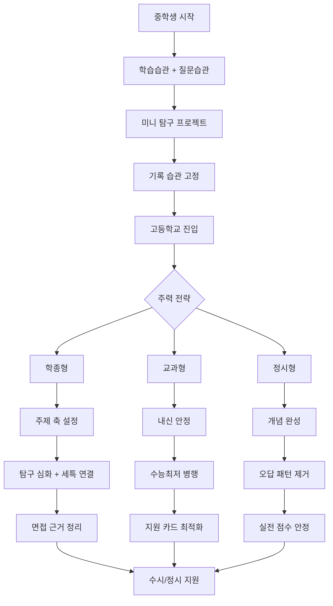

## 5-11. 단계도: 월간 실행 루프(고입·대입 공통)

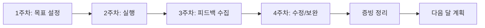

운영 팁:
- 중학생은 `실행`보다 `습관 고정`의 성공률을 목표로 둡니다.
- 고등학생은 `증빙 정리`까지 완료해야 한 달이 끝난 것으로 봅니다.
- 학부모는 "결과 질문"보다 "이번 달 무엇을 수정했는지"를 먼저 확인하는 것이 효과적입니다.

---

## 6) 전환기 체크리스트(중3 말 → 고1 초)

| 번호 | 점검 항목 | 확인 기준 | 미비 시 대응 |
|---|---|---|---|
| 1 | 고교 유형 선택 | 일반고/특목고/특화중점 중 1개 방향 | 학교 설명회·교육과정표 재확인 |
| 2 | 수학 기초 완성 | 중학 핵심 단원 설명 가능 | 선행보다 개념 복습 우선 |
| 3 | 영어 독해 기초 | 교과 지문 80% 이상 이해 | 문법+어휘 루틴 재설정 |
| 4 | 관심 분야 1개 | "왜 관심 있는지" 1문장 설명 가능 | 직업 체험/독서로 후보 압축 |
| 5 | 기록 습관 | 활동 후 5문장 기록 가능 | 전용 노트 1권 고정 운영 |
| 6 | 전형 이해 | 교과/학종/정시 차이 설명 가능 | 본 문서 0~5장 반복 확인 |

---

## 7) 상편 요약

- `중학생`: 스펙보다 기초교과·독서질문·미니탐구·기록습관이 우선입니다.
- `고등학생`: 전형을 고르고(가설), 역매핑하고, 증빙을 누적하는 루틴이 핵심입니다.
- `공통`: 활동의 양보다 과정 기록의 질이 합격 확률을 높입니다.

---

## 8) 하편 안내

심화 내용(대학별 변화 조짐, 멀티 커리어 루트, JSON 구조 예시, 고교 특화트랙, 심화 FAQ)은 아래 하편에서 이어집니다.

- [2026_2028_대입_학종_교과_비중_및_수상_논문_대회활동_영향_정리_하.md](./2026_2028_대입_학종_교과_비중_및_수상_논문_대회활동_영향_정리_하.md)

---

## 9) 중학생 심화 Q&A 20선(끝판왕)

> 이 섹션은 중학생 본인과 학부모가 실제로 가장 많이 막히는 질문 20개를 골라, 단순 조언이 아닌 "왜 그런지 + 어떻게 하면 되는지 + 무엇을 피해야 하는지"를 함께 담았습니다.

---

### Q1. 중학교 때 공부를 잘 못해도 좋은 고등학교에 갈 수 있나요?

**배경**: 많은 학생이 중학교 성적이 낮으면 좋은 고등학교 진학 자체가 막힌다고 오해합니다. 하지만 고등학교 유형에 따라 진입 기준이 완전히 다릅니다.

**핵심 답변**: 일반고는 대부분 추첨 또는 거주지 배정이므로 중학교 성적이 직접 영향을 주지 않습니다.   자사고·외고·과학고 등 특목고는 자체 전형(내신+면접+서류)이 있어 중학 성적이 중요하지만, 이 학교들이 유일한 선택지는 아닙니다.   중학 성적이 낮더라도 고등학교 입학 후 빠르게 역전하는 사례는 매우 많습니다.   핵심은 "어느 학교를 가느냐"보다 "들어간 학교에서 어떤 기록을 만드느냐"입니다.

**실행 포인트**:
- 지금 당장 목표 고교 유형을 결정하기보다, 중학교 내신을 안정시키는 것이 먼저입니다.
- 특목고 지원을 고려한다면 중2 2학기부터 내신 관리와 탐구 활동을 병행해야 합니다.
- 일반고 진학 예정이라면 고교 입학 전 수학·영어 기초 완성에 집중하세요.

**피해야 할 실수**: 중학교 성적이 낮다고 포기하거나, 반대로 특목고 진학만이 성공이라고 믿는 것 모두 위험합니다.

---

### Q2. 중학생 때 선행학습을 얼마나 해야 하나요?

**배경**: 학원가에서는 "고1 수학을 중2 때 끝내야 한다"는 말이 흔합니다. 하지만 선행의 효과는 학생마다 크게 다릅니다.

**핵심 답변**: 선행학습은 현행 개념이 완전히 잡힌 학생에게만 효과가 있습니다. 
 현행에 구멍이 있는 상태에서 선행을 하면, 고등학교에서 개념이 무너지는 속도가 더 빠릅니다. 
 수학 기준으로 중학 수학 전 단원을 "설명할 수 있는 수준"으로 이해한 뒤에 고등 수학 선행을 시작하는 것이 안전합니다. 
 영어는 선행보다 독해 기초와 어휘 확장이 더 중요합니다.

**실행 포인트**:
- 현재 배우는 단원에서 틀린 문제의 원인을 설명할 수 있는지 먼저 점검하세요.
- 선행보다 "현행 완성도 90% 이상"을 먼저 달성하는 것이 고등학교 내신에서 훨씬 유리합니다.
- 선행 진도가 빠른 친구와 비교하지 마세요. 고등학교 1학기 중간고사에서 결과가 갈립니다.

**피해야 할 실수**: 선행 진도를 빠르게 나가는 것 자체를 목표로 삼는 것. 이해 없이 진도만 나가면 고등학교에서 오히려 더 많은 시간을 재학습에 써야 합니다.

---

### Q3. 독서를 어떻게 해야 입시에 도움이 되나요?

**배경**: "독서를 많이 하면 좋다"는 말은 누구나 하지만, 어떻게 읽어야 하는지는 잘 알려주지 않습니다.

**핵심 답변**: 입시에서 독서가 평가되는 방식은 "읽은 책 목록"이 아니라 "책에서 무엇을 질문하고 어떻게 연결했는지"입니다.  따라서 책을 읽은 후 반드시 질문 3개를 만들어야 합니다. 질문은 "왜 이런 현상이 생기는가?",  "이 주장의 반대 근거는 무엇인가?", "이것을 내 관심 분야에 적용하면 어떻게 되는가?" 형태가 좋습니다.  이 질문이 나중에 탐구 주제가 되고, 세특 내용이 되고, 면접 답변의 근거가 됩니다.

**실행 포인트**:
- 책 1권을 읽을 때 질문노트에 최소 3개의 질문을 남기세요.
- 질문 중 1개는 반드시 "이것이 틀릴 수 있는 경우"를 생각해보세요. 비판적 읽기가 됩니다.
- 읽은 책을 수업 내용이나 탐구 주제와 연결하는 1문장을 추가로 작성하면 세특 연결이 쉬워집니다.

**피해야 할 실수**: 책을 많이 읽었다는 기록만 남기는 것. 권수보다 질문의 깊이가 훨씬 중요합니다.

---

### Q4. 진로를 아직 모르는데, 어떻게 준비해야 하나요?

**배경**: 중학생에게 "진로가 뭐야?"라고 물으면 대부분 모른다고 합니다. 이것은 정상입니다. 문제는 진로를 모른다는 이유로 아무것도 하지 않는 것입니다.

**핵심 답변**: 진로를 모르는 것은 문제가 아닙니다. 
 진로는 탐색하면서 좁혀지는 것이지, 처음부터 정해지는 것이 아닙니다. 
 중학생 단계에서는 "내가 어떤 활동을 할 때 시간이 빨리 가는가?"를 기준으로 관심 분야 2~3개를 탐색하는 것이 목표입니다. 
 이 탐색 과정 자체가 나중에 자기소개서와 면접의 재료가 됩니다.

**실행 포인트**:
- 유튜브, 책, 직업 체험 프로그램을 통해 관심 분야 3개를 찾고, 각각 "왜 흥미로운지" 1문장씩 써보세요.
- 관심 분야와 관련된 책 1권을 읽고 질문노트를 만들어보세요.
- 진로 탐색 일지를 만들어 "이번 달 새로 알게 된 직업/분야"를 1개씩 기록하세요.

**피해야 할 실수**: 
  부모님이나 주변의 기대에 맞춰 진로를 억지로 정하는 것. 
  나중에 고등학교에서 탐구 활동과 연결이 안 되면 서류 전체가 흔들립니다.

---

### Q5. 탐구 활동을 처음 시작하려면 어떻게 해야 하나요?

**배경**: "탐구 활동을 해야 한다"는 말을 듣지만, 어디서 시작해야 할지 막막한 학생이 많습니다.

**핵심 답변**: 탐구는 거창한 실험이 아니라 "궁금한 것을 조사하고 정리하는 것"에서 시작합니다. 
 가장 쉬운 시작은 "내가 불편하거나 이상하다고 느낀 것 1가지"를 주제로 잡는 것입니다. 
 예를 들어 "학교 화장실이 항상 더러운 이유는 무엇인가?", "급식에서 음식물 쓰레기가 가장 많이 나오는 요일은 언제인가?" 같은 주제도 충분합니다. 
 중요한 것은 주제의 수준이 아니라 "질문→조사→결론→한계 인식"의 흐름을 경험하는 것입니다.

**실행 포인트**:
- 주제를 정할 때 "왜 이것이 궁금한가?"를 1문장으로 먼저 쓰세요.
- 조사 방법을 2가지 이상 사용하세요(인터넷 조사 + 직접 관찰, 또는 설문 + 인터뷰).
- 결론을 낼 때 "내가 틀렸을 수도 있는 이유"를 1개 이상 포함하면 탐구의 질이 올라갑니다.

**피해야 할 실수**: 탐구 결과가 "기대한 것과 다르게 나왔다"고 실패라고 생각하는 것. 예상과 다른 결과야말로 가장 좋은 탐구 재료입니다.

---

### Q6. 동아리 활동은 어떤 것을 골라야 하나요?

**배경**: 동아리를 "스펙용"으로 고르는 학생이 많습니다. 하지만 관심 없는 동아리는 기록이 약해집니다.

**핵심 답변**: 동아리는 "가장 오래 할 수 있는 것"을 기준으로 골라야 합니다. 
 고등학교에서 학종을 준비할 때 동아리는 3년간 같은 주제를 심화하는 공간이 되어야 합니다. 
 중학교 동아리는 직접 입시에 반영되지 않지만, 고등학교에서 어떤 동아리를 선택하고 어떻게 운영할지 연습하는 기회입니다.
 관심 분야와 연결된 동아리에서 1년 이상 활동하면서 "내가 이 분야에서 어떤 역할을 할 수 있는지"를 확인하세요.

**실행 포인트**:
- 동아리 활동 후 매번 "오늘 무엇을 했고, 무엇이 어려웠고, 다음에 어떻게 할 것인가" 3문장을 기록하세요.
- 동아리에서 팀원과 의견이 충돌했을 때 어떻게 해결했는지 기록하면 나중에 면접 재료가 됩니다.
- 동아리 결과물(발표자료, 보고서, 작품 등)을 반드시 보관하세요.

**피해야 할 실수**: 여러 동아리를 짧게 경험하는 것. 깊이 없는 활동 나열은 입시에서 오히려 불리합니다.

---

### Q7. 수행평가를 잘 받으려면 어떻게 해야 하나요?

**배경**: 수행평가는 내신에 포함되면서 동시에 세특 기록의 재료가 됩니다. 중학교 때부터 수행평가를 제대로 이해하면 고등학교에서 유리합니다.

**핵심 답변**: 수행평가에서 높은 점수를 받는 것도 중요하지만, 더 중요한 것은 수행평가 과정을 기록으로 남기는 것입니다. 
  고등학교에서는 수행평가 주제를 탐구 활동과 연결하고, 그 과정을 세특에 반영할 수 있습니다. 
  수행평가 준비 과정에서 "왜 이 주제를 선택했는지", "어떤 방법으로 접근했는지", "결과가 예상과 달랐다면 왜 그런지"를 기록해두면 나중에 면접 답변 재료가 됩니다.

**실행 포인트**:
- 수행평가 제출 후 반드시 초안과 최종본을 모두 보관하세요.
- 교사 피드백을 받았다면 "무엇을 수정했는지" 한 줄로 기록하세요.
- 수행평가 주제를 독서나 탐구 활동과 연결하면 학습 효율이 2배가 됩니다.

**피해야 할 실수**: 수행평가를 제출하고 나서 완전히 잊어버리는 것. 나중에 포트폴리오를 만들 때 가장 중요한 재료가 됩니다.

---

### Q8. 중학교 때 영어 공부는 어떻게 해야 하나요?

**배경**: 영어는 고등학교 내신과 수능 모두에서 중요하지만, 중학교 때 방향을 잘못 잡으면 고등학교에서 큰 어려움을 겪습니다.

**핵심 답변**: 중학교 영어의 핵심은 문법 구조 이해와 독해 기초입니다. 
  단어를 많이 외우는 것보다 문장 구조를 이해하고 긴 지문을 읽을 수 있는 능력이 더 중요합니다. 
  고등학교 수능 영어는 독해 중심이므로, 중학교 때부터 영어 지문을 매일 1~2개씩 읽고 주제를 파악하는 연습을 하면 고등학교에서 훨씬 수월합니다. 
  회화나 영어 말하기 능력은 입시에서 직접적인 영향이 제한적이므로, 독해와 어휘에 우선순위를 두세요.

**실행 포인트**:
- 매일 영어 지문 1개를 읽고 "주제 1문장 + 모르는 단어 3개"를 기록하세요.
- 문법은 개념 이해 후 바로 문장 만들기 연습을 하세요(암기보다 활용이 중요).
- 어휘는 문맥 속에서 외우는 것이 단어장 암기보다 기억에 오래 남습니다.

**피해야 할 실수**: 영어 회화 학원에만 집중하면서 독해와 문법을 소홀히 하는 것.

---

### Q9. 수학이 너무 어려운데, 포기해야 할까요?

**배경**: "수포자(수학 포기자)"가 되면 고등학교에서 선택할 수 있는 전형이 크게 줄어듭니다.

**핵심 답변**: 수학을 포기하면 정시에서 수능 수학이 약해지고, 교과전형에서 수학 내신이 낮아지며, 이공계 학종에서도 불리해집니다.   수학이 어렵게 느껴지는 이유는 대부분 "이전 단원의 개념이 완성되지 않은 상태에서 다음 단원으로 넘어갔기 때문"입니다.   지금 어려운 단원보다 2~3단원 전으로 돌아가서 개념을 다시 잡는 것이 가장 빠른 해결책입니다.

**실행 포인트**:
- 틀린 문제를 풀 때 "어느 개념이 부족해서 틀렸는지"를 먼저 파악하세요.
- 개념 이해 후 같은 유형 문제를 3개 이상 풀어서 "설명할 수 있는 수준"까지 올리세요.
- 수학 공부는 매일 30분이라도 꾸준히 하는 것이 주말 몰아치기보다 훨씬 효과적입니다.

**피해야 할 실수**: 어려운 문제집을 사서 처음부터 풀려는 것. 기초 개념이 없는 상태에서 어려운 문제는 자신감만 낮춥니다.

---

### Q10. 중학교 때 봉사활동은 얼마나 해야 하나요?

**배경**: 봉사활동 시간을 채우는 것에 집중하는 학생이 많습니다. 하지만 입시에서 봉사활동이 평가되는 방식은 다릅니다.

**핵심 답변**: 봉사활동은 시간 수보다 "어떤 경험을 했고 무엇을 배웠는지"가 중요합니다.   고등학교 학종에서 봉사활동은 공동체 역량을 보여주는 근거로 사용됩니다.   단순 반복 봉사보다 관심 분야와 연결된 봉사(예: 환경 관심 학생이 환경 정화 봉사 + 환경 문제 탐구)가 훨씬 설득력이 있습니다.   중학교 때는 다양한 봉사를 경험하면서 어떤 활동이 본인에게 의미 있는지 탐색하는 것이 좋습니다.

**실행 포인트**:
- 봉사활동 후 반드시 "무엇을 했고, 무엇이 어려웠고, 무엇을 배웠는지" 3문장을 기록하세요.
- 같은 봉사를 반복할 때 "지난번보다 무엇이 나아졌는지"를 추가로 기록하면 성장 서사가 만들어집니다.
- 봉사 경험이 관심 분야 탐구로 이어지면 가장 좋은 재료가 됩니다.

**피해야 할 실수**: 봉사 시간만 채우고 기록을 남기지 않는 것.

---

### Q11. 고등학교 선택에서 가장 중요한 기준은 무엇인가요?

**배경**: 고등학교 선택은 이후 3년의 학습 환경과 입시 전략을 결정합니다. 하지만 많은 학부모가 학교 명성이나 진학 실적 숫자만 보고 결정합니다.

**핵심 답변**: 고등학교 선택에서 가장 중요한 기준은 "그 학교의 수업-탐구-기록-피드백 시스템이 실제로 작동하는가"입니다. 
 학종을 준비한다면 교사가 세특을 얼마나 구체적으로 써주는지, 탐구 활동을 지원하는 환경이 있는지가 핵심입니다. 
 교과전형을 준비한다면 내신 경쟁 강도와 수능최저 충족 지원 환경이 중요합니다.
 학교 설명회에서 진학 실적 숫자보다 "학생 산출물 샘플"과 "교사 피드백 루틴"을 직접 물어보세요.

**실행 포인트**:
- 관심 있는 고등학교 설명회에 직접 참석해서 재학생 선배에게 "세특을 어떻게 관리하는지" 물어보세요.
- 학교 홈페이지에서 교육과정표를 확인해서 본인이 원하는 진로선택과목이 개설되어 있는지 확인하세요.
- 통학 거리와 생활 패턴도 중요합니다. 체력이 소진되면 학습 효율이 떨어집니다.

**피해야 할 실수**: 부모님 지인의 추천이나 인터넷 커뮤니티 평판만으로 학교를 결정하는 것.

---

### Q12. 중학교 때 스펙을 쌓아야 하나요?

**배경**: 학원가에서 "중학교 때부터 스펙을 쌓아야 한다"는 말이 많습니다. 하지만 이것은 대부분 과장되거나 잘못된 정보입니다.

**핵심 답변**: 중학교 활동은 고등학교 학생부에 직접 반영되지 않습니다. 
  따라서 중학교 때 교외 대회 수상이나 스펙을 쌓는 것은 고등학교 입시에 직접적인 도움이 되지 않습니다. 
  중학교 때 해야 할 것은 스펙이 아니라 "고등학교에서 빠르게 출발할 수 있는 습관과 역량"입니다. 
  구체적으로는 학습 루틴, 질문 습관, 기록 습관, 탐구 경험입니다.

**실행 포인트**:
- 비싼 캠프나 대회 참가보다 매일 30분 독서와 질문노트 작성이 장기적으로 훨씬 가치 있습니다.
- 학교 안에서 할 수 있는 활동(수업 발표, 동아리, 수행평가)을 충실히 하는 것이 우선입니다.
- 교외 활동을 했다면 반드시 교내 산출물(보고서, 발표)로 전환하는 연습을 하세요.

**피해야 할 실수**: 비용이 많이 드는 외부 프로그램에 참가하면서 정작 학교 수업을 소홀히 하는 것.

---

### Q13. 중학교 내신 관리는 어떻게 해야 하나요?

**배경**: 중학교 내신은 고등학교 입시에 직접 반영되지 않지만(일반고 기준), 특목고·자사고 지원 시에는 중요합니다.

**핵심 답변**: 중학교 내신의 가장 큰 가치는 "고등학교 내신 관리 방법을 연습하는 것"입니다. 
 시험 직전 몰아치기보다 주간 복습 루틴을 만들어 꾸준히 관리하는 습관이 고등학교에서 결정적인 차이를 만듭니다. 
 특목고·자사고를 목표로 한다면 중1부터 전 과목 내신을 안정적으로 관리해야 합니다.

**실행 포인트**:
- 매주 금요일 그 주에 배운 내용을 1페이지로 요약하는 습관을 만드세요.
- 시험 2주 전부터 준비하는 루틴을 고정하세요. 고등학교에서도 같은 루틴을 쓸 수 있습니다.
- 틀린 문제는 "왜 틀렸는지" 원인을 분류해서 오답노트에 기록하세요.

**피해야 할 실수**: 시험 직전에만 공부하는 습관. 고등학교에서 이 습관은 내신 붕괴로 이어집니다.

---

### Q14. 중학생이 진로 탐색을 위해 할 수 있는 구체적인 활동은 무엇인가요?

**배경**: 진로 탐색이라고 하면 막연하게 느껴집니다. 구체적으로 무엇을 해야 하는지 모르는 학생이 많습니다.

**핵심 답변**: 진로 탐색은 크게 세 가지 방법으로 할 수 있습니다. 
  첫째, 독서를 통한 간접 경험(관심 분야 입문서 읽기). 
  둘째, 체험을 통한 직접 경험(직업 체험 프로그램, 진로 캠프). 
  셋째, 대화를 통한 탐색(관심 분야 종사자 인터뷰, 선배 멘토링). 이 세 가지를 조합하면 진로 방향이 점점 선명해집니다.

**실행 포인트**:
- 학교에서 운영하는 진로 체험 프로그램에 적극 참여하고, 체험 후 "배운 점 3가지"를 기록하세요.
- 관심 있는 직업을 가진 사람의 유튜브 채널이나 인터뷰를 찾아보고 "내가 몰랐던 것 2가지"를 기록하세요.
- 진로 탐색 일지를 만들어 매달 새로 알게 된 것을 1개씩 추가하세요.

**피해야 할 실수**: 부모님이 원하는 직업을 탐색하는 것. 본인이 실제로 흥미를 느끼는 분야를 찾는 것이 핵심입니다.

---

### Q15. 중학교 때 글쓰기 능력을 어떻게 키울 수 있나요?

**배경**: 학종에서 세특, 자기소개서(폐지 추세이나 일부 대학 유지), 면접 답변 모두 글쓰기 능력과 직결됩니다.

**핵심 답변**: 글쓰기 능력은 "많이 쓰는 것"보다 "구조를 갖추고 쓰는 것"으로 키워집니다. 
  가장 효과적인 방법은 매일 짧게라도 "주장-근거-결론" 3단 구조로 쓰는 연습을 하는 것입니다. 
  독서 후 질문노트에 답을 쓸 때도 이 구조를 적용하면 자연스럽게 논리적 글쓰기가 됩니다.

**실행 포인트**:
- 매일 5~10분, 그날 배운 것 중 가장 인상 깊은 것을 3문장으로 쓰세요(주장-근거-결론).
- 독서 후 "이 책의 핵심 주장은 무엇이고, 나는 왜 동의하거나 동의하지 않는가"를 1단락으로 써보세요.
- 쓴 글을 3일 후 다시 읽고 "더 명확하게 바꿀 수 있는 문장"을 1개 찾아 수정하세요.

**피해야 할 실수**: 길게 쓰는 것을 잘 쓰는 것으로 착각하는 것. 짧고 명확한 글이 훨씬 설득력이 있습니다.

---

### Q16. 중학교 때 수학·과학 올림피아드 준비가 필요한가요?

**배경**: 과학고·영재학교를 목표로 하는 학생들 사이에서 올림피아드 준비가 필수처럼 여겨집니다.

**핵심 답변**: 과학고·영재학교를 목표로 한다면 올림피아드 준비가 도움이 됩니다. 
  하지만 일반고 진학 후 이공계 학종을 준비하는 학생에게는 올림피아드보다 교과 기초 완성과 탐구 활동 경험이 더 중요합니다. 
  올림피아드는 결과(수상)보다 준비 과정에서 심화 개념을 익히는 것에 의미가 있습니다. 
  수상 결과가 없어도 준비 과정에서 배운 내용을 탐구 활동에 적용하면 충분히 활용할 수 있습니다.

**실행 포인트**:
- 과학고·영재학교를 목표로 한다면 중1부터 수학·과학 심화 개념을 체계적으로 공부하세요.
- 일반고 진학 예정이라면 올림피아드보다 교과 기초 완성에 집중하세요.
- 올림피아드 준비를 하더라도 학교 내신을 소홀히 하지 마세요.

**피해야 할 실수**: 올림피아드 수상이 없으면 이공계 진학이 불가능하다고 생각하는 것.

---

### Q17. 중학교 때 영어 회화나 토익 준비가 필요한가요?

**배경**: 영어 회화 능력이 입시에 직접 반영된다는 오해가 있습니다.

**핵심 답변**: 국내 대학 입시에서 영어 회화 능력은 직접 평가되지 않습니다. 
  수능 영어는 독해 중심이고, 학종 면접도 한국어로 진행됩니다. 
  따라서 중학교 때 영어 회화보다 독해 기초와 어휘 확장에 집중하는 것이 입시에 더 유리합니다. 
  단, 외고·국제고·태재대학교 등 영어 역량을 중시하는 학교를 목표로 한다면 영어 말하기와 쓰기 능력도 함께 키워야 합니다.

**실행 포인트**:
- 목표 학교가 영어 역량을 중시하는지 먼저 확인하세요.
- 일반 대학 입시를 목표로 한다면 영어 독해와 어휘에 우선 집중하세요.
- 영어 원서 읽기는 독해 능력과 어휘를 동시에 키울 수 있는 좋은 방법입니다.

**피해야 할 실수**: 영어 회화 학원에 많은 시간을 쓰면서 수학·국어 기초를 소홀히 하는 것.

---

### Q18. 중학교 때 학습 루틴을 어떻게 만들어야 하나요?

**배경**: 고등학교에서 성적이 좋은 학생들의 공통점 중 하나는 중학교 때부터 안정적인 학습 루틴이 있었다는 것입니다.

**핵심 답변**: 학습 루틴의 핵심은 "매일 같은 시간에 같은 방식으로 공부하는 것"입니다. 
  처음에는 하루 1~2시간이라도 충분합니다. 중요한 것은 양보다 일관성입니다. 
  루틴이 만들어지면 고등학교에서 학습 시간을 늘리는 것이 훨씬 쉬워집니다. 
  루틴은 "공부 시작 의식"(예: 책상 정리 → 오늘 목표 쓰기)과 "공부 종료 의식"(예: 오늘 배운 것 3줄 요약)을 포함하면 효과가 높아집니다.

**실행 포인트**:
- 매일 공부 시작 전 "오늘 반드시 끝낼 것 3가지"를 적고, 끝난 것에 체크하세요.
- 공부 종료 후 "오늘 가장 잘 이해한 것 1가지 + 아직 모르는 것 1가지"를 기록하세요.
- 루틴을 처음 만들 때는 작게 시작하세요. 하루 30분 루틴을 2주 유지하면 1시간으로 늘리세요.

**피해야 할 실수**: 처음부터 너무 빡빡한 루틴을 만들어서 며칠 만에 포기하는 것.

---

### Q19. 중3 겨울방학을 어떻게 보내야 하나요?

**배경**: 중3 겨울방학은 고등학교 입학 전 마지막 준비 기간입니다. 
  이 시기를 어떻게 보내느냐가 고1 1학기 성적에 직접 영향을 줍니다.

**핵심 답변**: 중3 겨울방학의 최우선 과제는 수학과 영어 기초 완성입니다. 
  고등학교 1학기 수학은 중학교 수학의 개념이 완성된 학생에게 훨씬 수월합니다. 
  영어는 고등학교 교과서 수준의 지문을 읽고 이해할 수 있는 독해력을 갖추는 것이 목표입니다. 
  선행보다 현행 완성을 우선하고, 남은 시간에 관심 분야 독서와 탐구 주제 탐색을 하세요.

**실행 포인트**:
- 수학: 중학교 전 단원 핵심 개념을 1번씩 정리하고, 각 단원에서 틀린 문제 유형을 파악하세요.
- 영어: 고등학교 교과서 1과 정도의 지문을 읽고 내용을 요약하는 연습을 하세요.
- 관심 분야 책 1권을 읽고 질문노트를 완성하세요. 고1 첫 탐구 주제의 씨앗이 됩니다.

**피해야 할 실수**: 겨울방학 전체를 선행 학원으로 채우는 것. 기초가 없는 선행은 고1 내신에서 오히려 역효과를 냅니다.

---

### Q20. 중학생 때 가장 후회하는 것은 무엇인가요?(선배들의 공통 답변)

**배경**: 고등학생이 된 후 중학교 시절을 돌아보면 공통적으로 후회하는 것들이 있습니다.

**핵심 답변**: 고등학생 선배들이 가장 많이 후회하는 것은 다음 세 가지입니다. 
  첫째, "수학 기초를 제대로 안 잡고 넘어온 것"입니다. 고등학교 수학은 중학교 수학의 연장선이라 기초가 없으면 처음부터 무너집니다. 
  둘째, "기록 습관을 안 만든 것"입니다. 고등학교에서 세특과 포트폴리오를 만들 때 중학교 때 기록이 없으면 처음부터 시작해야 합니다. 
  셋째, "진로를 너무 늦게 탐색한 것"입니다. 고1 때 진로가 없으면 탐구 주제를 잡는 것 자체가 어렵습니다.

**실행 포인트**:
- 지금 당장 수학 기초 점검을 시작하세요. 중학교 수학 전 단원에서 설명할 수 없는 개념이 있다면 그것부터 잡으세요.
- 오늘부터 활동 후 5문장 기록 습관을 시작하세요. 처음에는 3문장도 충분합니다.
- 이번 달 관심 분야 책 1권을 읽고 질문 3개를 만들어보세요.

**피해야 할 실수**: "아직 중학생이니까 나중에 해도 된다"는 생각. 고등학교에서 습관을 새로 만드는 것은 훨씬 어렵습니다.

---

## 10) 중학생 고교 유형별 합격 전략(4종 시나리오)

> 고등학교 유형에 따라 준비 방향이 완전히 달라집니다. 아래는 각 유형별 실제 준비 루틴입니다.

### 10-1. 일반고 진학 전략

일반고는 대부분 추첨 또는 거주지 배정이므로 "합격 전략"보다 "진학 후 전략"이 더 중요합니다.

**진학 전 준비(중3 겨울방학)**:
- 수학 기초 완성: 중학 수학 전 단원 개념 정리
- 영어 독해 기초: 교과서 수준 지문 독해 가능
- 관심 분야 1개 확정: "왜 관심 있는지" 1문장 설명 가능

**진학 후 전략(고1 1학기)**:
- 내신 안정이 최우선입니다. 첫 중간고사에서 목표 등급을 설정하고 반드시 달성하세요.
- 동시에 탐구 주제 1개를 설정하고 질문노트를 시작하세요.
- 수행평가와 탐구 활동을 연결하면 시간 효율이 높아집니다.

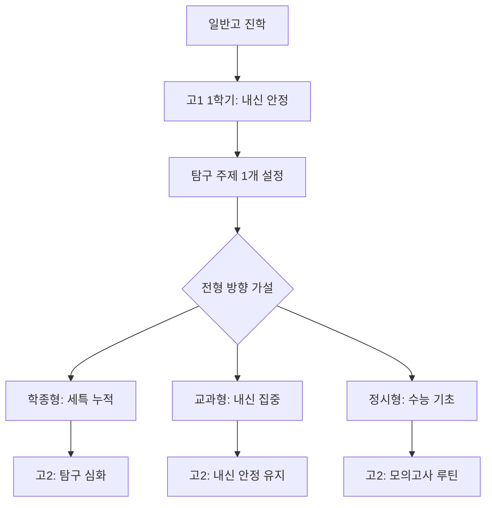

---

### 10-2. 자사고 진학 전략

자사고는 자체 전형(내신+면접)으로 선발하며, 진학 후 내신 경쟁이 매우 치열합니다.

**지원 전 준비(중2~중3)**:
- 내신 관리: 전 과목 상위권 유지(학교별 기준 다름, 보통 상위 10~20% 이내)
- 면접 준비: "왜 이 학교에 오고 싶은가", "본인의 강점은 무엇인가" 1분 답변 준비
- 탐구 경험: 미니 탐구 1개 완성 + 발표 경험

**진학 후 전략**:
- 자사고는 내신 경쟁이 치열하므로 내신 관리에 더 많은 시간이 필요합니다.
- 학종을 준비한다면 내신과 탐구 활동을 동시에 운영하는 시스템이 필수입니다.
- 수능 최저를 요구하는 교과전형도 병행 준비하는 것이 안전합니다.

---

### 10-3. 외고·국제고 진학 전략

외고·국제고는 어문·국제 계열 특화 학교로, 진학 후 해당 계열 학종에 유리합니다.

**지원 전 준비(중2~중3)**:
- 영어 역량: 독해 + 말하기 + 쓰기 균형 있게 준비
- 자기소개서: "왜 외고/국제고인가", "어떤 활동을 했는가" 구체적으로 작성
- 면접: 영어 면접 또는 한국어 면접 준비(학교별 상이)

**진학 후 전략**:
- 어문·국제 계열 탐구 활동(국제 이슈 분석, 비교문화 프로젝트)을 세특과 연결하세요.
- 영어 글쓰기와 발표 역량을 꾸준히 키우면 학종 면접에서 차별화됩니다.

---

### 10-4. 과학고·영재학교 진학 전략

과학고·영재학교는 수학·과학 심화 역량을 집중적으로 평가합니다.

**지원 전 준비(중1~중3)**:
- 수학·과학 심화: 교과 개념 완성 후 심화 문제 풀기
- 탐구 활동: 과학 실험 + 데이터 분석 + 보고서 작성 경험
- 수학·과학 올림피아드 준비(필수는 아니지만 도움이 됨)

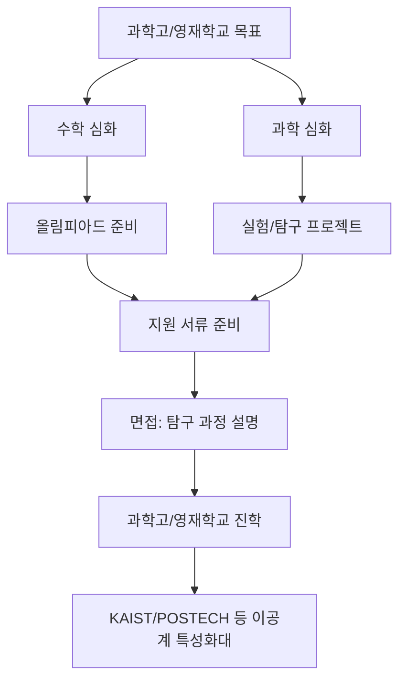

**진학 후 전략**:
- 과학고·영재학교 진학 후에는 수학·과학 심화 학습이 핵심입니다.
- 연구 프로젝트(R&E)에 적극 참여하고, 연구 과정을 상세히 기록하세요.
- 이공계 특성화대(KAIST, POSTECH 등) 진학을 목표로 한다면 수학·과학 성취가 최우선입니다.

---

## 11) AI시대 변화와 중학생 대응 전략

### 11-1. AI 도구가 학습과 탐구에 미치는 영향

**배경**: ChatGPT, Claude, Gemini 같은 AI 도구가 일상화되면서 학습 방식이 빠르게 바뀌고 있습니다. 중학생도 이 변화를 이해하고 대응해야 합니다.

**AI 도구의 역할 변화**:
- 과거: 정보 검색은 구글, 학습은 교과서와 문제집
- 현재: AI가 개념 설명, 문제 풀이, 보고서 초안 작성까지 지원
- 미래: AI는 "학습 도우미"이자 "탐구 파트너"로 자리잡을 것

**중학생이 AI를 활용하는 올바른 방법**:

1. **개념 이해 단계**: AI에게 어려운 개념을 쉽게 설명해달라고 요청하세요. 단, AI의 설명을 그대로 받아들이지 말고 교과서와 비교하세요.

2. **질문 생성 단계**: 수업 내용에서 궁금한 것을 AI에게 물어보고, AI의 답변에서 또 다른 질문을 만드세요. 이 과정이 탐구의 시작입니다.

3. **탐구 설계 단계**: 탐구 주제를 정했을 때 AI에게 "이 주제를 어떻게 조사하면 좋을까?"라고 물어보세요. AI가 제안한 방법 중 실행 가능한 것을 선택하세요.

4. **보고서 작성 단계**: AI에게 보고서 초안을 요청하되, 반드시 본인이 직접 수정하고 근거를 추가하세요. AI가 쓴 글을 그대로 제출하면 표절로 간주될 수 있습니다.

**중학생이 키워야 할 AI시대 핵심 역량**:
- `질문 설계력`: AI에게 정확한 질문을 하는 능력
- `비판적 검증력`: AI의 답변이 맞는지 확인하는 능력
- `창의적 적용력`: AI의 아이디어를 본인의 맥락에 맞게 변형하는 능력
- `윤리적 판단력`: AI를 어디까지 활용해야 하는지 판단하는 능력

**실행 포인트**:
- AI 도구를 사용할 때 "이것이 내 학습에 도움이 되는가, 아니면 사고를 대체하는가"를 항상 질문하세요.
- AI가 준 답변을 그대로 쓰지 말고, 반드시 본인의 언어로 다시 정리하세요.
- AI 활용 기록을 남기세요. "AI에게 이런 질문을 했고, 이런 답변을 받았고, 나는 이것을 이렇게 수정했다"는 과정이 나중에 탐구 기록이 됩니다.

**피해야 할 실수**: AI에게 전적으로 의존해서 본인의 사고력이 약해지는 것.

---

### 11-2. 마인드맵: AI시대 중학생 핵심 역량

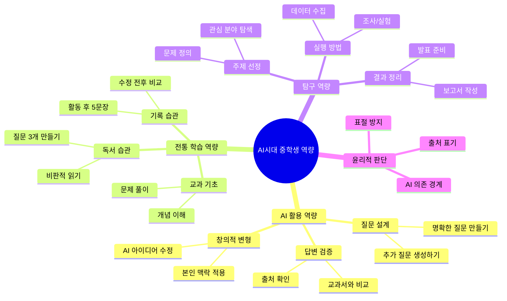

---

### 11-3. AI 도구 활용 탐구 프로젝트 예시(중학생용)

**프로젝트 A: 학교 급식 만족도 분석(AI 활용형)**

1. **문제 정의 (1주차)**
   - 질문: "우리 학교 급식 만족도가 낮은 이유는 무엇인가?"
   - AI 활용: ChatGPT에게 "급식 만족도를 조사하는 방법"을 물어보고, 설문 문항 초안을 받음

2. **조사 설계 (2주차)**
   - 설문 문항 10개를 AI 초안에서 5개로 축소하고, 본인이 직접 2개 추가
   - 설문 대상과 방법 결정(학급 친구 30명)

3. **데이터 수집 (3주차)**
   - 설문 실시 + 결과 정리
   - AI에게 "설문 결과를 어떻게 분석하면 좋을까?" 질문

4. **분석 및 해석 (4주차)**
   - AI가 제안한 분석 방법 중 실행 가능한 것 선택(예: 빈도 분석)
   - 결과 해석은 본인이 직접 작성(AI 답변은 참고만)

5. **보고서 작성 (5~6주차)**
   - AI에게 보고서 구조를 물어보고, 초안 작성
   - 교사 피드백 받고 수정
   - 최종본에 "AI 활용 내역"을 별도 항목으로 명시

**AI 활용 기록 예시**:
- "ChatGPT를 통해 설문 문항 초안을 받았고, 이 중 3개를 본인 맥락에 맞게 수정했습니다."
- "데이터 분석 방법을 AI에게 질문했고, 빈도 분석 방법을 선택해 직접 실행했습니다."

---

### 11-4. 프로젝트 중심 12주 커리큘럼(중학생 실전형)

이 커리큘럼은 중학생이 처음부터 끝까지 하나의 프로젝트를 완성하는 과정입니다.

**1~2주차: 탐색과 주제 선정**
- 관심 분야 3개 후보 작성
- 각 후보에 대해 "왜 궁금한가" 1문장씩 작성
- AI에게 각 주제의 조사 가능성을 질문
- 최종 주제 1개 확정

**3~4주차: 기초 조사**
- 관련 책 1권 + 기사 3개 읽기
- 질문노트 10개 작성
- AI에게 "이 주제를 더 깊이 탐구하려면 어떤 방법이 있을까?" 질문
- 조사 방법 2가지 선정(예: 설문 + 인터뷰)

**5~6주차: 실행**
- 조사 방법 1차 실행
- 데이터 수집 및 정리
- 예상과 다른 결과가 나왔다면 "왜 다른가?" 분석
- AI에게 "이 결과를 어떻게 해석하면 좋을까?" 질문하고, 답변 검증

**7~8주차: 피드백과 수정**
- 교사 또는 멘토에게 중간 결과 공유
- 피드백 받은 내용 정리
- 수정 계획 수립
- 2차 조사 또는 보완 실행

**9~10주차: 결과 정리**
- 보고서 초안 작성(AI 활용 가능, 단 본인이 반드시 수정)
- 발표 자료 10장 내외 제작
- 핵심 결론 3문장 정리

**11~12주차: 발표와 회고**
- 3분 발표 연습
- 발표 후 질문에 답변하는 연습
- 프로젝트 전체 회고: "무엇을 배웠는가 + 무엇이 어려웠는가 + 다음에는 무엇을 다르게 할 것인가"

**완성 체크리스트**:
- [ ] 주제 선정 이유 1문장
- [ ] 질문노트 10개 이상
- [ ] 조사 방법 2가지 이상 실행
- [ ] 수정 전후 비교 기록
- [ ] 보고서 3~5쪽
- [ ] 발표 자료 10장
- [ ] 3분 발표 영상 또는 대본
- [ ] 회고문 1쪽

---

### 11-5. 프로젝트 유형별 단계도

**유형 1: 과학실험형 프로젝트**

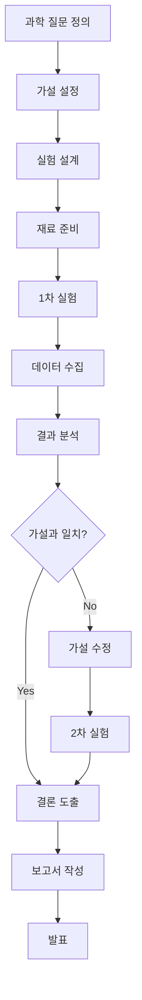

**유형 2: 사회조사형 프로젝트**

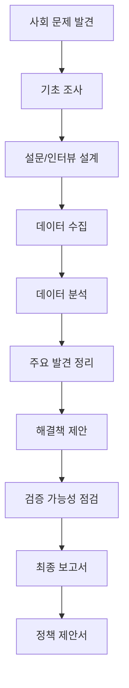

**유형 3: 창작형 프로젝트**

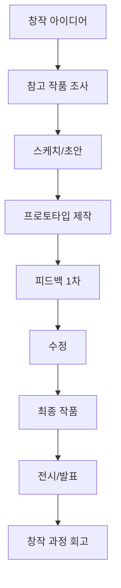

**유형 4: 문제해결형 프로젝트**

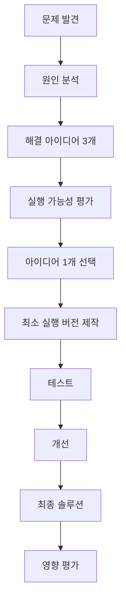

---

### 11-6. 중학생 월간 실행 루틴(4주 사이클)

**1주차: 계획**
- 이번 달 목표 1개 설정(예: 미니 탐구 1개 완성)
- 목표 달성을 위한 행동 3가지 정의
- 필요한 자료와 도구 준비
- 일일 학습 시간표 작성

**2주차: 실행**
- 계획한 행동 실행
- 매일 실행 여부 체크
- 어려운 점 기록
- 필요시 AI 도구 활용

**3주차: 피드백**
- 교사, 부모, 멘토에게 중간 결과 공유
- 피드백 내용 정리
- 수정 계획 수립
- 추가 조사 또는 보완 실행

**4주차: 수정과 회고**
- 피드백 반영해서 최종 완성
- 수정 전후 비교표 작성
- 이번 달 회고: "무엇을 배웠는가 + 무엇이 어려웠는가 + 다음 달 개선 계획"
- 다음 달 목표 설정

**월간 루틴 구조도**:

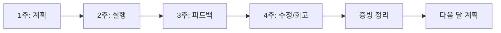

---

### 11-7. 중학생 주간 실행 루틴(일일 시간표 예시)

**월~금 루틴 (학기 중)**:
- 오후 4~5시: 학교 수업 복습 + 오답 정리 (60분)
- 오후 5~6시: 독서 또는 탐구 활동 (60분)
- 오후 6~7시: 저녁 식사 및 휴식
- 오후 7~8시: 수학 개념 학습 또는 문제 풀이 (60분)
- 오후 8~9시: 영어 독해 또는 어휘 학습 (60분)
- 오후 9~10시: 오늘 배운 것 정리 + 내일 계획 (30분)

**토요일 루틴**:
- 오전 10~12시: 이번 주 복습 + 취약 과목 보완 (120분)
- 오후 2~4시: 탐구 프로젝트 집중 시간 (120분)
- 오후 4~5시: 주간 회고 + 다음 주 계획 (60분)

**일요일 루틴**:
- 오전 10~11시: 독서 (60분)
- 오후 2~3시: 질문노트 정리 (60분)
- 나머지 시간: 휴식 및 자유 활동

**일일 루틴 구조도**:

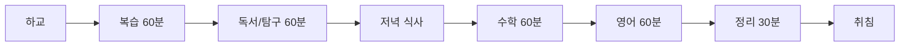

**루틴 운영 팁**:
- 처음에는 하루 2시간으로 시작하고, 익숙해지면 3~4시간으로 늘리세요.
- 루틴을 지키지 못한 날이 있어도 괜찮습니다. 다음 날 다시 시작하세요.
- 주말에는 평일보다 여유 있게 운영하고, 반드시 휴식 시간을 포함하세요.

---

### 11-8. 실패 사례와 성공 전환 사례

**실패 사례 1: 프로젝트 주제가 너무 큼**
- 문제: "기후변화 해결 방안"처럼 너무 큰 주제를 선택
- 결과: 조사 범위가 너무 넓어서 3개월이 지나도 완성 못함
- 전환: 주제를 "우리 학교 전기 사용량 줄이기"로 축소
- 성공: 2개월 안에 조사-제안-발표 완성

**실패 사례 2: AI에 전적으로 의존**
- 문제: 보고서 전체를 AI에게 작성하게 하고 그대로 제출
- 결과: 교사가 표절 의심, 본인도 내용을 설명 못함
- 전환: AI는 초안만 받고, 본인이 직접 수정하고 근거 추가
- 성공: 보고서 완성도 향상 + 면접에서 설명 가능

**실패 사례 3: 기록을 남기지 않음**
- 문제: 프로젝트는 완성했지만 과정 기록이 없음
- 결과: 고등학교에서 포트폴리오 만들 때 재료가 없음
- 전환: 매주 "이번 주 무엇을 했는가" 5문장 기록 시작
- 성공: 고1 때 포트폴리오를 빠르게 완성

---

### 11-9. 중학생 프로젝트 완성도 체크리스트

프로젝트를 완성했다고 판단하는 기준입니다.

**필수 항목**:
- [ ] 주제 선정 이유가 1문장으로 명확한가?
- [ ] 질문이 3개 이상 있는가?
- [ ] 조사 방법이 2가지 이상인가?
- [ ] 데이터나 자료가 수집되었는가?
- [ ] 예상과 다른 결과에 대한 해석이 있는가?
- [ ] 교사 피드백을 1회 이상 받았는가?
- [ ] 수정 전후 비교가 기록되었는가?
- [ ] 보고서 또는 발표 자료가 완성되었는가?
- [ ] 3분 발표가 가능한가?
- [ ] 회고문이 작성되었는가?

**선택 항목** (있으면 더 좋음):
- [ ] AI 활용 내역이 기록되었는가?
- [ ] 실패와 수정 과정이 상세한가?
- [ ] 다음 탐구 주제로 연결되는가?
- [ ] 사진이나 영상 자료가 있는가?

---

### 11-10. 중학생이 AI시대에 키워야 할 역량 우선순위

**1순위: 질문 설계력**
- AI는 질문에 답할 수 있지만, 질문을 만들어주지는 않습니다.
- 좋은 질문을 만드는 능력이 AI시대의 가장 중요한 역량입니다.
- 연습 방법: 수업 후 "왜?", "어떻게?", "그래서?"를 붙여 질문 3개 만들기

**2순위: 비판적 검증력**
- AI의 답변이 항상 맞는 것은 아닙니다.
- AI 답변을 교과서, 신뢰할 수 있는 자료와 비교하는 습관이 필수입니다.
- 연습 방법: AI 답변을 받으면 "이것이 틀릴 수 있는 경우는 무엇인가?" 질문하기

**3순위: 창의적 적용력**
- AI의 아이디어를 본인의 상황에 맞게 변형하는 능력입니다.
- 연습 방법: AI가 준 아이디어를 "내 학교/내 관심사에 맞게 바꾸면?" 질문하기

**4순위: 윤리적 판단력**
- AI를 어디까지 활용해야 하는지, 어디서부터 표절인지 판단하는 능력입니다.
- 연습 방법: AI 활용 후 "이것을 그대로 쓰면 표절인가?" 스스로 질문하기
