# 2026·2028 대입 학종/교과 비중 및 수상·논문·대회활동 영향 정리 (하)

> 이 문서는 상편의 기초·실행편에 이어지는 심화편입니다.  
> 상편 먼저 읽기: [2026_2028_대입_학종_교과_비중_및_수상_논문_대회활동_영향_정리_상.md](./2026_2028_대입_학종_교과_비중_및_수상_논문_대회활동_영향_정리_상.md)

---

## 1) 대학별 변화 조짐(2026~2028)

> [주의] 아래는 입학처 공개 자료·설명회·보도자료 기반 경향 정리입니다.  
> 최종 지원 전략은 해당 연도 모집요강 원문으로 확정해야 합니다.

### 서울대학교

| 항목 | 현황 및 변화 조짐 |
|---|---|
| 지역균형전형 | 학생부교과 중심, 수능최저 적용. 내신 안정성이 최우선 |
| 일반전형(학종) | 서류+면접. 세특 깊이와 지적 호기심 중심 평가 흐름 |
| 2028 대비 | 5등급 체계 도입 시 세특·과목 맥락 해석 비중 확대 가능 |
| 활동 평가 | 교외 스펙보다 학교 수업 기반 탐구 과정 중시 |

### 연세대학교

| 항목 | 현황 및 변화 조짐 |
|---|---|
| 추천형(교과) | 학교장 추천 + 수능최저. 내신 상위권 + 최저 충족이 핵심 |
| 활동우수형(학종) | 서류+면접. 학업역량·발전가능성 평가 강화 |
| 2028 대비 | 통합형 수능 전환 시 최저 충족 구도 변화 가능 |
| 면접 특징 | 학생부 기반 질문. 활동의 구체 근거와 성찰 요구 |

### 고려대학교

| 항목 | 현황 및 변화 조짐 |
|---|---|
| 학교추천(교과) | 수능최저 적용. 내신+최저 동시 관리 필요 |
| 일반전형(학종) | 서류+면접. 학업역량·공동체역량 균형 평가 |
| 2028 대비 | 과목 이수 구성과 세특 맥락 해석 강화 가능 |
| 활동 평가 | 동아리 개수보다 교과 연계 탐구의 일관성 중시 |

### 성균관대학교

| 항목 | 현황 및 변화 조짐 |
|---|---|
| 학과모집(교과) | 수능최저 적용. 내신 안정+최저 충족 필수 |
| 탐구형인재(학종) | 서류 100%. 면접 없음. 세특·탐구 기록 질이 핵심 |
| 2028 대비 | 서류 중심 구조에서 세특 해석 기준 재정비 가능성 |

### 서강대학교

| 항목 | 현황 및 변화 조짐 |
|---|---|
| 학교생활우수자(교과) | 수능최저 적용. 내신+최저 동시 관리 필요 |
| 일반형(학종) | 서류 100%. 전공 연계 탐구 역량 중심 |
| 2028 대비 | 소규모 선발 특성상 연도별 조정 폭이 클 수 있음 |

### 한양대학교

| 항목 | 현황 및 변화 조짐 |
|---|---|
| 학생부교과(교과) | 수능최저 없음. 내신 경쟁 매우 치열 |
| 서류형(학종) | 수능최저 없음. 서류 100%. 성장가능성 중심 |
| 2028 대비 | 5등급 체계에서 내신 해석 방식 재정비 가능 |

### 중앙대학교

| 항목 | 현황 및 변화 조짐 |
|---|---|
| 학생부교과(교과) | 수능최저 적용. 내신+최저 병행 관리 |
| 탐구형인재(학종) | 서류+면접. 전공 연계 탐구 역량 중심 |
| 2028 대비 | 전형 구조 유지 가능성 높으나 산식 조정 가능 |

### 이화여자대학교

| 항목 | 현황 및 변화 조짐 |
|---|---|
| 고교추천(교과) | 수능최저 적용. 내신+최저 충족 필수 |
| 미래인재(학종) | 서류 100%. 학업역량·전공적합성 중심 |
| 2028 대비 | 계열별 선발 비율 조정 가능성. 연도별 확인 필수 |

### 한국외국어대학교

| 항목 | 현황 및 변화 조짐 |
|---|---|
| 학생부교과(교과) | 수능최저 적용. 어문계열 영어 최저 중요 |
| 학생부종합(학종) | 서류+면접. 어문·국제 계열 탐구 역량 중심 |
| 2028 대비 | 통합형 수능 전환 시 최저 구성 변화 가능 |

### 서울시립대학교

| 항목 | 현황 및 변화 조짐 |
|---|---|
| 학생부교과(교과) | 수능최저 적용. 지원자 증가 추세 |
| 학생부종합(학종) | 서류+면접. 공공성·지역연계 관심 학생 적합 |
| 2028 대비 | 공립대 특성상 정책 변화 반영 속도 빠를 수 있음 |

---

## 2) 대학 공통 변화 요약

| 변화 방향 | 구체 내용 | 학생 대응 포인트 |
|---|---|---|
| 세특 해석 강화 | 5등급 체계 도입 시 과목 맥락·탐구 기록 비중 증가 예상 | 세특 주제 일관성 + 과정 기록 강화 |
| 수능최저 변동 | 통합형 수능 전환 시 최저 충족 구도 재편 가능 | 목표 대학 최저조건 매년 업데이트 |
| 면접 질문 심화 | 활동 나열보다 근거·수정·성찰 중심 질문 증가 | 활동 직후 5문장 카드 누적 |
| 학업역량 중심 | 좁은 스펙보다 학문적 사고·발전가능성 평가 강화 | 한 주제를 장기 확장해 증빙 |
| 교외 활동 제한 | 교외 스펙 직접 반영 제한 기조 유지 가능성 | 교내 기록 품질에 집중 |

---

## 3) 서울24·태재대·특수학교 심화 포인트

## 3-1. 서울24(서울권 주요 대학군)

| 항목 | 실무 포인트 |
|---|---|
| 교과전형 | 내신 안정성 최우선, 수능최저 여부부터 확인 |
| 학종전형 | 세특 전공적합성, 활동 일관성, 면접 대응력이 당락 변수 |
| 논술/면접 | 대학별 출제 성향 차이 큼. 기출 기반 개별 대비 필요 |
| 공통 전략 | 지원대학 12~15개 전형요소 역매핑표 작성 |

## 3-2. 태재대학교(특수 신설 성격 대학)

| 항목 | 권장 준비 |
|---|---|
| 학업기초 | 영어/글쓰기/토론 역량 강화 |
| 탐구역량 | 독서-프로젝트-에세이 연결 구조 구축 |
| 글로벌소통 | 국제 이슈 기반 발표/토론 기록 축적 |
| 인성/협업 | 팀 프로젝트 역할·갈등조정 사례 정리 |

## 3-3. 특수학교군(대학 외 포함)

| 구분 | 대표 예시 | 선발 성격 | 준비 우선순위 |
|---|---|---|---|
| 과학기술특성화대 | KAIST, GIST, DGIST, UNIST | 수학·과학 심화 + 탐구 | 심화 교과 + 연구형 프로젝트 |
| 사관학교 | 육사/해사/공사/국간사 | 학업 + 체력 + 인성/면접 | 체력, 리더십, 국가관, 면접 |
| 경찰/공공 특수대 | 경찰대 등 | 학업 + 적성 + 면접 | 국수영 기본기 + 상황판단 |
| 예술·실기 특화 | 예체능 특성 대학/계열 | 실기 + 포트폴리오 | 작품집 + 실전평가 루틴 |

---

## 4) 대학 외 멀티 커리어 루트

## 4-1. 고교생 이후 선택 가능한 루트

| 루트 | 대표 기관/형태 | 적합 성향 | 핵심 준비 |
|---|---|---|---|
| 일반대학 진학 | 4년제/전문대 | 학문·연구·자격 기반 | 내신/수능 + 전형 맞춤 포트폴리오 |
| 직업훈련소/직업교육 | 한국폴리텍, KDT 부트캠프 | 실무형/빠른 취업 | 기초역량 + 포트폴리오 + 실습 |
| 사관학교/군 루트 | 사관학교, 부사관·군특기 | 규율/리더십/공공성 | 체력 + 면접 + 신체검사 + 학업 |
| 공공훈련·기능경기 | 기능대회, 공공기술훈련 | 기술숙련/자격 중심 | 기능사·산업기사 + 실전과제 |
| 기업연계 캠프 | SW캠프, 메이커캠프 | 프로젝트형/협업형 | 팀 프로젝트 + 발표 역량 |
| 창업·프리랜서 | 1인/팀 창업, 콘텐츠 사업 | 도전·실행 중심 | MVP, 고객검증, 기초회계 |

## 4-2. 루트별 진입 난이도와 시간축

| 루트 | 초기 난이도 | 성과까지 평균 시간 | 장점 | 리스크 |
|---|---|---|---|---|
| 일반대학 | 중~상 | 3~6년 | 선택지 넓음 | 비용/시간 부담 |
| 직업훈련소 | 중 | 6개월~2년 | 빠른 실무전환 | 전공심화 한계 가능 |
| 사관학교/군 | 상 | 4년+ | 안정성/리더십 경력 | 선발기준 엄격 |
| 공공기술훈련 | 중 | 1~3년 | 자격 기반 명확 | 직무 편중 가능 |
| 캠프/아카데미 | 하~중 | 3개월~1년 | 경험 축적 빠름 | 학력 대체 한계 |
| 창업 | 상 | 개인차 큼 | 성장 상한 높음 | 실패확률/변동성 큼 |

---

## 5) 앱/문서 운영용 JSON 구조 예시

```json
{
  "highSchoolFocusTracks": [
    {
      "trackId": "ai_focus_highschool",
      "trackName": "AI 중심학교 트랙",
      "coreCompetencies": ["프로그래밍", "데이터해석", "문제해결", "협업"],
      "recommendedOutputs": ["프로젝트 보고서", "코드 저장소", "개선 로그"],
      "admissionFit": ["학생부종합", "학생부교과(심화과목 강점 시)", "정시 병행"],
      "riskNotes": ["결과물 편중", "과정 기록 부족"]
    },
    {
      "trackId": "reading_focus_highschool",
      "trackName": "독서 중심학교 트랙",
      "coreCompetencies": ["비판적 읽기", "질문 설계", "글쓰기", "토론"],
      "recommendedOutputs": ["질문노트", "비판 에세이", "토론 반론 기록"],
      "admissionFit": ["학생부종합", "면접형 전형"],
      "riskNotes": ["요약형 독서에 머무름", "실천형 탐구 부족"]
    },
    {
      "trackId": "ib_focus_highschool",
      "trackName": "IB 운영학교 트랙",
      "coreCompetencies": ["탐구설계", "논증", "발표", "자기관리"],
      "recommendedOutputs": ["탐구리포트", "발표자료", "피드백 반영 기록"],
      "admissionFit": ["학생부종합", "서류+면접형 전형"],
      "riskNotes": ["과제량 과부하", "시간관리 실패"]
    }
  ]
}
```

---

## 6) 심화 FAQ 30선(요약판)

> 원칙: 아래 답변은 전국 공통 프레임입니다. 실제 지원은 해당 연도 모집요강 원문으로 최종 확정하세요.

1. **내신 5등급이면 변별 약화?**  
   - 등급 숫자만이 아니라 과목 구성·세특·탐구 맥락으로 보완 평가될 가능성이 큽니다.
2. **2028에 학종 축소, 정시 확대 확정?**  
   - 일괄 단정은 어렵고 대학별 편차 확대 가능성이 더 현실적입니다.
3. **교과전형은 내신만 보면 되나?**  
   - 수능최저·면접·진로선택 반영이 당락을 바꾸기도 합니다.
4. **학종 최대 감점 요인?**  
   - 활동 부족보다 활동 간 연결 끊김과 근거 부족입니다.
5. **교외 수상 의미?**  
   - 제한 반영이 많아 단독 효용은 낮고, 교내 환원이 핵심입니다.
6. **논문 경험은 어느 정도 유효?**  
   - 결과보다 질문·방법·한계·수정 과정이 더 중요합니다.
7. **인턴·캠프 효율?**  
   - 스펙용이면 낮고, 진로탐색+산출물 전환이 되면 의미가 큽니다.
8. **AI 중심학교면 무조건 유리?**  
   - 자동 유리가 아니라 기록·증빙 변환이 되어야 유리합니다.
9. **독서 중심학교는 인문만 유리?**  
   - 이공계도 질문설계·윤리적 판단 역량에서 유효합니다.
10. **IB 출신 불리?**  
    - 불리/유리 단정 불가. 국내 평가 언어로 재구성이 중요합니다.
11. **과학중점은 내신 불리?**  
    - 경쟁강도는 높을 수 있으나 심화 증빙 강점도 큽니다.
12. **학교 선택 최우선 지표?**  
    - 실적 숫자보다 수업-탐구-기록-피드백 시스템 작동 여부입니다.
13. **고1부터 2028 준비는 과한가?**  
    - 선행 과잉은 과하지만, 루틴 구축은 오히려 리스크를 줄입니다.
14. **내신 vs 탐구 우선순위?**  
    - 대부분 내신 안정이 1순위, 탐구는 과목 연계형으로 운영.
15. **학종 독서 비중?**  
    - 주당 학습시간의 30~45%를 독서+정리로 배치하는 방식이 유효.
16. **면접 준비 시작 시점?**  
    - 고2부터 답변 카드 누적이 안전합니다.
17. **세특에 좋은 활동 조건?**  
    - 교과 개념 연결 + 선택·수정·검증 흔적이 남는 활동.
18. **정시 병행 시작 시점?**  
    - 고2부터 백업 시나리오 병행이 안정적.
19. **활동 양 vs 깊이?**  
    - 최근 평가는 깊이·일관성이 유리한 경향.
20. **외부컨설팅 없이 가능?**  
    - 학교 수업 기반 루틴이 잘 돌면 충분히 가능합니다.
21. **AI 프로젝트 흔한 실수?**  
    - 데모만 있고 데이터 신뢰성·오류분석·윤리가 빠지는 것.
22. **독서학교 변별 산출물?**  
    - 요약이 아닌 반대관점 비교·근거검증·실천제안 글.
23. **IB 탐구를 국내 문맥으로 옮기는 법?**  
    - 탐구질문-방법-결과-성찰을 과목 성취기준과 매칭.
24. **활동 진위는 어떻게 검증?**  
    - 서류 일관성과 면접 근거 제시력으로 검증합니다.
25. **학부모가 놓치기 쉬운 리스크?**  
    - 학교 명성 우선 선택으로 학생 성향 적합성을 놓치는 것.
26. **제도변화로 사교육 의존 증가?**  
    - 불안은 커질 수 있으나 교내 기록 품질이 본질입니다.
27. **고1 진로 변경 시 불리?**  
    - 전환 이유와 연결 역량을 설명하면 성찰 역량으로 해석 가능.
28. **상위권 지원 마지막 6개월 핵심?**  
    - 신규 스펙 추가보다 기존 활동 구조화·증빙화 완성.
29. **학생부에서 비우면 안 되는 영역?**  
    - 교과 세특의 일관성과 진로 활동 연결 축.
30. **2028 대비 본질 한 문장?**  
    - 등급 경쟁을 넘어 교과 기반 문제해결 과정을 증빙으로 누적하는 것.

---

## 6-1. 구체 전략: 합격률을 올리는 실전 운영법

요약 대신 실제 운영 관점에서, 합격 가능성을 올리는 방법을 전형별로 정리합니다.

### [학종형] "활동 설계"가 아니라 "증빙 설계"부터

- `실행 순서`  
  1) 지원학과 핵심 역량 3개 정의  
  2) 교과 수업에서 연결 가능한 주제 1개 설정  
  3) 탐구 실행 후 피드백 2회 이상 반영  
  4) 면접 질문 대비 카드(문제-방법-결과-한계) 작성
- `합격률을 높이는 포인트`  
  - 활동 수를 줄여도 좋으니, 같은 주제를 최소 2회 이상 개선합니다.  
  - "처음 버전"과 "개선 버전"이 모두 남아 있어야 면접 설득력이 올라갑니다.

### [교과형] 내신 안정 + 최저 충족의 이중 안전장치

- `실행 순서`  
  1) 학기 시작 전 과목별 목표 등급 설정  
  2) 수행평가 주제와 복습 루틴을 통합  
  3) 최저 요구 과목 모의 성적을 월 1회 점검  
  4) 원서 시즌 전 도전/적정/안전 카드 확정
- `합격률을 높이는 포인트`  
  - 교과형의 가장 큰 리스크는 최저 미충족입니다.  
  - 내신이 좋은 학생일수록 최저를 늦게 챙기는 실수가 빈번합니다.

### [정시형] 점수 상승보다 점수 안정이 먼저

- `실행 순서`  
  1) 과목별 오답 유형을 4개로 분류(개념/실수/시간/컨디션)  
  2) 매주 1유형만 집중 교정  
  3) 월말 실전 모의에서 재발률 체크  
  4) 시험 시간배분을 고정 전략으로 반복 훈련
- `합격률을 높이는 포인트`  
  - 실력 상승 이전에 변동성(점수 출렁임)을 먼저 줄여야 합니다.  
  - 상위권 경쟁에서는 "최고점"보다 "최저점 방어"가 중요합니다.

## 6-2. 합격 예시 커리큘럼(시나리오 4종)

### 시나리오 A: 중학생(중3) -> 고1 전환 성공형

| 구간 | 실제 행동 | 결과물 | 다음 단계 연결 |
|---|---|---|---|
| 중3 여름 | 고교 유형 조사 + 관심분야 1개 확정 | 학교 비교표, 진로 1문장 | 고1 과목 이수 전략 설정 |
| 중3 겨울 | 수학·영어 기초 복원 | 취약단원 체크리스트 | 고1 1학기 내신 안정 |
| 고1 1학기 | 질문노트 + 수행평가 연계 | 과목별 질문노트 | 세특 문장 품질 향상 |
| 고1 2학기 | 미니 탐구 1개 완성 | 발표자료, 보고서 | 고2 심화탐구 기반 |

### 시나리오 B: 고2 학종형 역전형

| 구간 | 문제 상황 | 개선 전략 | 합격형 전환 신호 |
|---|---|---|---|
| 고2 1학기 | 활동은 많지만 연결이 약함 | 주제 1개로 통합 재설계 | 세특/동아리 문장 축 일치 |
| 고2 여름 | 면접 근거 부족 | 수정로그/피드백 기록 시작 | "왜 바꿨는지" 설명 가능 |
| 고2 2학기 | 결과물 완성도 낮음 | 초안-수정-최종 3버전 관리 | 성장서사 확보 |
| 고3 1학기 | 서류 불안정 | 역매핑 기반 서류 구조화 | 면접 답변 일관성 향상 |

### 시나리오 C: 고2 교과형 안정 합격형

| 구간 | 핵심 과제 | 체크 지표 |
|---|---|---|
| 고2 1학기 | 내신 취약 2과목 복원 | 등급 하한선 안정 |
| 고2 2학기 | 수능최저 과목 집중 | 모의 최저 충족률 상승 |
| 고3 1학기 | 지원 카드 3단계 구성 | 도전/적정/안전 균형 |
| 고3 2학기 | 수능 컨디션/실전 유지 | 실제 최저 충족 |

### 시나리오 D: 고3 정시형 회복형

| 구간 | 문제 | 조정 | 결과 |
|---|---|---|---|
| 3월 | 모의 편차 큼 | 시간 배분 고정 | 점수 변동폭 감소 |
| 6월 | 특정 과목 급락 | 오답 유형 1개 집중 제거 | 하위 점수 바닥 방어 |
| 9월 | 체력/집중 저하 | 수면/루틴 재설계 | 실전 집중력 회복 |
| 수능 직전 | 불안 과다 | 루틴 단순화 + 복습 고정 | 컨디션 안정 |

## 6-3. 구조도: 전형별 전략 선택과 전환

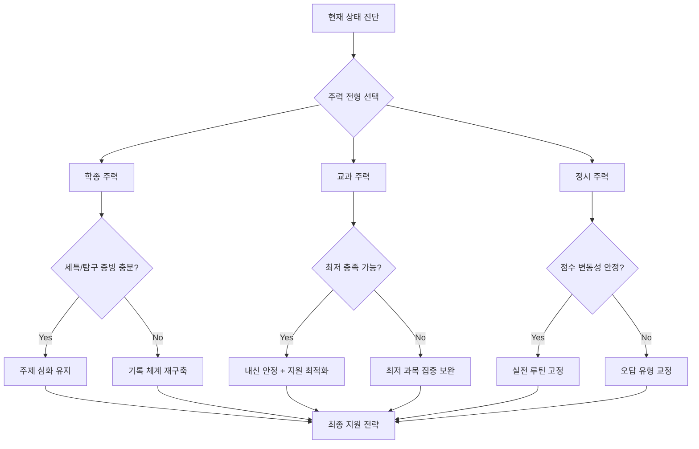

## 6-4. 단계도: 합격 서류·면접 완성 파이프라인

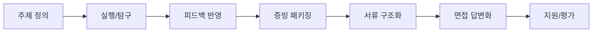

실전 체크:
- `topicDefine` 단계에서 주제가 추상적이면 이후 전 단계가 약해집니다.
- `feedbackLoop`가 없는 활동은 성장 증빙이 약해 평가에서 불리합니다.
- `interviewBuild` 단계에서 답변이 길어지면 감점 가능성이 커집니다(핵심-근거-결론 3단 구조 유지).

---

## 10) 고등학생 심화 Q&A 20선(끝판왕)

> 이 섹션은 고등학생 본인과 학부모가 실제로 가장 많이 막히는 질문 20개를 골라, 단순 조언이 아닌 "왜 그런지 + 어떻게 하면 되는지 + 무엇을 피해야 하는지"를 함께 담았습니다.

---

### Q1. 세특을 잘 받으려면 어떻게 해야 하나요?

**배경**: 학종에서 세특(세부능력 및 특기사항)은 가장 중요한 평가 요소입니다. 하지만 세특은 교사가 쓰는 것이므로 학생이 직접 관리할 수 없다고 오해하는 경우가 많습니다.

**핵심 답변**: 세특은 교사가 쓰지만, 그 내용은 학생이 만들어 제공해야 합니다. 교사는 수업 시간에 관찰한 것을 바탕으로 세특을 작성하므로, 학생이 수업에서 얼마나 적극적으로 질문하고 발표하고 탐구했는지가 세특의 질을 결정합니다. 세특을 잘 받는 학생들의 공통점은 수업 후 교사에게 "오늘 수업에서 이런 부분이 궁금했는데, 이렇게 탐구해보려고 합니다"라고 먼저 말한다는 것입니다. 이 대화가 세특의 재료가 됩니다.

**실행 포인트**:
- 수업 중 질문 1개를 반드시 준비하고, 수업 후 교사에게 추가 탐구 계획을 말하세요.
- 수행평가 주제를 탐구 활동과 연결하고, 그 결과를 교사에게 보고서 형태로 제출하세요.
- 학기 말에 "이번 학기 탐구 활동 요약본"을 교사에게 제출하면 세특 작성에 직접 도움이 됩니다.

**피해야 할 실수**: 수업 시간에 조용히 앉아서 듣기만 하는 것. 세특은 학생이 보여준 것만 기록됩니다.

---

### Q2. 학종 서류에서 가장 중요한 것은 무엇인가요?

**배경**: 학종 서류를 준비할 때 "무엇을 많이 했는지"에 집중하는 학생이 많습니다. 하지만 평가자가 보는 것은 다릅니다.

**핵심 답변**: 학종 서류에서 평가자가 가장 중요하게 보는 것은 "활동들이 하나의 이야기로 연결되는가"입니다. 이것을 "서사의 일관성"이라고 합니다. 다양한 활동을 했더라도 연결이 없으면 "산만한 학생"으로 보입니다. 반대로 활동 수가 적더라도 같은 주제를 깊이 파고든 흔적이 있으면 "집중력과 탐구력이 있는 학생"으로 평가됩니다. 서류를 준비할 때는 "내 활동들이 어떤 하나의 질문에 대한 답을 찾아가는 과정인가"를 기준으로 정리하세요.

**실행 포인트**:
- 지금까지의 활동 목록을 만들고, 각 활동이 어떤 공통 주제로 연결되는지 찾아보세요.
- 연결이 약한 활동은 "이 활동에서 배운 것이 다음 활동에 어떻게 영향을 줬는지"를 설명하는 문장을 추가하세요.
- 서류의 첫 문단에 "나는 ○○에 관심을 가지고 ○○를 탐구해왔다"는 핵심 서사를 명확히 제시하세요.

**피해야 할 실수**: 활동 목록을 나열하는 방식으로 서류를 작성하는 것. 스펙 나열은 평가자에게 설득력이 없습니다.

---

### Q3. 면접에서 어떻게 답변해야 합격 가능성이 높아지나요?

**배경**: 면접은 서류에서 보여준 것을 실제로 확인하는 과정입니다. 많은 학생이 면접을 "암기 발표"로 준비하지만, 이것은 역효과를 냅니다.

**핵심 답변**: 면접에서 평가자가 원하는 것은 "이 학생이 실제로 이것을 했고, 그 과정에서 무엇을 배웠는가"입니다. 따라서 답변은 "핵심-근거-결론" 3단 구조로 해야 합니다. 예를 들어 "왜 이 탐구를 했나요?"라는 질문에 "수업에서 ○○ 개념을 배우다가 ○○가 궁금했습니다(핵심). 그래서 ○○ 방법으로 조사했고, ○○라는 결과를 얻었습니다(근거). 이 경험으로 ○○를 배웠고, 앞으로 ○○를 더 탐구하고 싶습니다(결론)"처럼 답변하세요.

**실행 포인트**:
- 모든 활동에 대해 "왜 시작했는가 + 어떻게 했는가 + 무엇을 배웠는가 + 한계는 무엇인가" 4가지를 준비하세요.
- 답변 시간은 1분 30초~2분이 적당합니다. 너무 길면 집중력이 떨어집니다.
- 예상 질문 30개를 만들고, 각각 1분 30초 답변을 연습하세요.

**피해야 할 실수**: 답변을 통째로 암기하는 것. 암기 답변은 추가 질문에 대응하지 못합니다.

---

### Q4. 수능최저를 충족하지 못하면 어떻게 되나요?

**배경**: 수능최저는 수시 합격의 숨겨진 변수입니다. 내신이 좋아도 수능최저를 충족하지 못하면 불합격합니다.

**핵심 답변**: 수능최저는 대학이 "최소한 이 정도 수능 실력은 있어야 한다"는 기준입니다. 예를 들어 "국어, 수학, 영어, 탐구 중 2개 합 5등급 이내"라는 조건이 있다면, 수시에 합격해도 수능에서 이 조건을 충족하지 못하면 최종 불합격합니다. 매년 수능최저 미충족으로 탈락하는 학생이 상당수입니다. 따라서 교과전형이나 학종을 준비하는 학생도 수능 준비를 병행해야 합니다.

**실행 포인트**:
- 지원 예정 대학의 수능최저 조건을 고2부터 확인하고, 모의고사에서 충족 가능한지 분기별로 점검하세요.
- 수능최저 요구 과목(보통 국어, 수학, 영어)의 모의고사 성적을 매달 추적하세요.
- 수능최저 충족이 어려운 과목이 있다면 고2 2학기부터 집중 보완하세요.

**피해야 할 실수**: "수시 준비하니까 수능은 나중에"라는 생각. 수능최저 미충족은 수시 전체를 날릴 수 있습니다.

---

### Q5. 고1 때 전형 방향을 너무 일찍 확정하면 안 되나요?

**배경**: 고1 때부터 "나는 학종이야" 또는 "나는 정시야"라고 확정하는 학생이 많습니다. 이것이 왜 위험한지 많은 학생이 모릅니다.

**핵심 답변**: 고1 때 전형을 확정하는 것은 위험합니다. 고1 1학기 내신이 예상보다 낮게 나올 수도 있고, 탐구 활동이 생각보다 잘 맞을 수도 있습니다. 고1은 "가설 설정" 단계입니다. "현재 내 강점을 보면 학종이 유리할 것 같다"는 가설을 세우되, 고2 1학기 결과를 보고 재조정하는 것이 안전합니다. 학종과 교과를 동시에 준비하는 것이 가능하고, 정시 백업 시나리오도 고2부터 병행하는 것이 좋습니다.

**실행 포인트**:
- 고1은 "내신 안정 + 탐구 주제 설정 + 모의고사 베이스라인 확보"를 동시에 진행하세요.
- 고2 1학기 결과를 보고 주력 전형을 확정하세요.
- 어떤 전형을 선택하든 수능 준비는 병행하세요.

**피해야 할 실수**: 고1 때 전형을 확정하고 다른 전형 준비를 완전히 포기하는 것.

---

### Q6. 내신과 탐구 활동을 동시에 잡는 방법이 있나요?

**배경**: 많은 학생이 "내신 준비하면 탐구할 시간이 없고, 탐구하면 내신이 떨어진다"는 딜레마를 겪습니다.

**핵심 답변**: 내신과 탐구를 분리해서 생각하기 때문에 시간이 부족한 것입니다. 가장 효율적인 방법은 "수업 내용을 탐구 주제로 연결하는 것"입니다. 예를 들어 생명과학 수업에서 유전자 발현을 배우다가 "암세포에서 유전자 발현이 어떻게 달라지는가"를 탐구 주제로 잡으면, 내신 공부와 탐구가 동시에 진행됩니다. 이 방식을 "교과 연계 탐구"라고 하며, 세특에서도 가장 높은 평가를 받습니다.

**실행 포인트**:
- 매 단원 수업 후 "이 개념을 실제 문제에 적용하면 어떻게 되는가?"라는 질문을 1개 만드세요.
- 수행평가 주제를 탐구 주제와 일치시키면 준비 시간이 절반으로 줄어듭니다.
- 탐구는 거창하게 시작하지 말고, 수업 내용에서 궁금한 것 1개를 2주 안에 조사하는 것으로 시작하세요.

**피해야 할 실수**: 탐구 활동을 수업과 완전히 분리된 별도 프로젝트로 운영하는 것.

---

### Q7. 학종에서 진로가 바뀌면 불리한가요?

**배경**: 고1 때 정한 진로가 고2, 고3에 바뀌면 서류가 약해진다는 말을 많이 듣습니다.

**핵심 답변**: 진로 변경 자체는 불리하지 않습니다. 중요한 것은 "왜 바뀌었는지"를 설명할 수 있는가입니다. 탐구를 하다가 새로운 분야에 관심이 생겨서 방향이 바뀌었다면, 그것은 오히려 "지적 호기심과 성장"을 보여주는 증거가 됩니다. 단, 진로 변경 전후의 활동이 완전히 단절되어 있으면 설명이 어렵습니다. 변경 전 활동에서 배운 것이 새로운 방향에 어떻게 연결되는지를 설명할 수 있으면 됩니다.

**실행 포인트**:
- 진로가 바뀌었다면 "이전 탐구에서 배운 ○○가 새로운 관심 분야인 ○○에 어떻게 연결되는지"를 1문단으로 정리하세요.
- 진로 변경의 계기가 된 책, 수업, 경험을 구체적으로 기록해두세요.
- 면접에서 진로 변경에 대한 질문이 나올 것을 예상하고, 논리적인 답변을 준비하세요.

**피해야 할 실수**: 진로가 바뀌었다고 이전 활동 기록을 모두 버리는 것. 연결 고리를 찾아 활용하세요.

---

### Q8. 교과전형에서 내신 등급이 낮으면 어떻게 해야 하나요?

**배경**: 교과전형은 내신이 핵심이지만, 내신이 낮다고 포기할 필요는 없습니다.

**핵심 답변**: 교과전형에서 내신이 낮다면 두 가지 방향을 고려해야 합니다. 첫째, 남은 학기에서 내신을 올릴 수 있는지 분석합니다. 어떤 과목에서 등급을 올릴 수 있는지 구체적으로 파악하고 집중하세요. 둘째, 교과전형 외에 학종이나 정시로 전략을 전환하는 것을 고려합니다. 내신이 낮더라도 탐구 활동이 강하면 학종에서 경쟁력이 있을 수 있습니다.

**실행 포인트**:
- 현재 내신 등급과 목표 대학의 교과전형 합격선을 비교하세요.
- 남은 학기에서 올릴 수 있는 과목을 2~3개 선정하고 집중 관리하세요.
- 내신 회복이 어렵다면 학종 전략으로 전환하고, 탐구 활동 강화에 집중하세요.

**피해야 할 실수**: 내신이 낮다고 모든 것을 포기하는 것. 전략 전환이 가능합니다.

---

### Q9. 정시를 준비하면서 수시도 준비할 수 있나요?

**배경**: "정시 준비하면 수시 준비할 시간이 없다"는 말이 있지만, 실제로는 병행이 가능합니다.

**핵심 답변**: 정시와 수시 병행은 가능하지만, 우선순위를 명확히 해야 합니다. 정시 중심으로 준비하면서 수시는 "최저 충족 가능한 교과전형"이나 "서류 부담이 적은 전형"을 소수 지원하는 것이 효율적입니다. 반대로 수시 중심이라면 정시는 백업 시나리오로 운영하고, 수능 준비는 최저 충족에 집중하세요.

**실행 포인트**:
- 고2 2학기부터 수시와 정시 중 어느 쪽에 더 많은 시간을 배분할지 결정하세요.
- 정시 중심이라면 수시는 3~4개 카드만 준비하고 나머지 시간을 수능에 투자하세요.
- 수시 중심이라면 수능최저 충족 과목을 먼저 안정시키세요.

**피해야 할 실수**: 수시와 정시를 동등하게 준비하다가 둘 다 어중간해지는 것.

---

### Q10. 고3 막판에 성적이 떨어지면 어떻게 해야 하나요?

**배경**: 고3 2학기에 수능 성적이 예상보다 낮게 나오거나, 수시 결과가 좋지 않을 때 어떻게 대처해야 하는지 모르는 학생이 많습니다.

**핵심 답변**: 고3 막판에 성적이 떨어졌을 때 가장 위험한 것은 "전략을 급격히 바꾸는 것"입니다. 이미 준비한 것을 버리고 새로운 전략을 시작하면 시간이 부족합니다. 대신 "지금 가진 것으로 최선의 결과를 내는 방법"을 찾아야 합니다. 수능이 남아 있다면 취약 과목 1개에 집중하고, 수시 결과를 기다리면서 정시 지원 시뮬레이션을 병행하세요.

**실행 포인트**:
- 9월 모의고사 결과를 기준으로 정시 지원 가능 대학 목록을 현실적으로 작성하세요.
- 수능까지 남은 시간에 올릴 수 있는 과목 1개를 선정하고 집중하세요.
- 수시 결과가 나쁘더라도 수능 전까지는 수능에 집중하세요. 수시 결과에 흔들리면 수능도 망칩니다.

**피해야 할 실수**: 수시 결과에 충격을 받아 수능 준비를 포기하는 것.

---

### Q11. 면접에서 모르는 질문이 나오면 어떻게 해야 하나요?

**배경**: 면접에서 예상하지 못한 질문이 나왔을 때 당황해서 침묵하거나 엉뚱한 답변을 하는 학생이 많습니다.

**핵심 답변**: 모르는 질문이 나왔을 때 가장 좋은 대응은 "솔직하게 모른다고 말하고, 알고 있는 것에서 연결해서 답하는 것"입니다. 예를 들어 "○○에 대해 정확히는 모르지만, 제가 탐구한 ○○와 연결해서 생각해보면 ○○일 것 같습니다"라고 답변하면 됩니다. 모른다고 침묵하거나 아는 척하는 것보다 훨씬 좋은 인상을 줍니다.

**실행 포인트**:
- 면접 준비 시 "모르는 질문이 나왔을 때 어떻게 연결할 것인가"를 연습하세요.
- 본인의 탐구 주제와 관련된 기본 개념은 반드시 숙지하세요.
- 답변 중 막히면 "잠깐 생각해도 될까요?"라고 말하고 10초 정도 생각하는 것은 괜찮습니다.

**피해야 할 실수**: 모르는 것을 아는 척하거나, 관련 없는 내용을 길게 말하는 것.

---

### Q12. 학종에서 교사 추천서가 중요한가요?

**배경**: 교사 추천서(학교장 추천 포함)의 역할에 대해 잘못 알고 있는 학생이 많습니다.

**핵심 답변**: 현재 대부분의 대학에서 교사 추천서는 폐지되었거나 비중이 매우 낮습니다. 학교장 추천이 필요한 전형(교과전형의 학교장 추천형)은 학교별 추천 인원이 제한되어 있어 내신 상위권 학생에게 주어집니다. 학종에서는 교사 추천서보다 세특의 질이 훨씬 중요합니다. 교사와의 관계는 추천서보다 세특 작성에 영향을 주므로, 수업 참여와 탐구 활동 공유를 통해 교사와 좋은 관계를 유지하세요.

**실행 포인트**:
- 지원 예정 대학의 전형에서 교사 추천서가 필요한지 먼저 확인하세요.
- 세특 작성에 도움이 되도록 교사에게 탐구 활동 결과를 정기적으로 공유하세요.
- 학교장 추천이 필요한 전형을 목표로 한다면 내신 관리가 최우선입니다.

**피해야 할 실수**: 교사 추천서를 받기 위해 교사에게 과도하게 의존하는 것.

---

### Q13. 수능 영어 1등급을 받으려면 어떻게 해야 하나요?

**배경**: 수능 영어는 절대평가로 전환되었지만, 1등급(90점 이상)을 받는 것은 여전히 쉽지 않습니다.

**핵심 답변**: 수능 영어 1등급의 핵심은 독해 속도와 정확도입니다. 어휘와 문법 기초가 있다면, 매일 영어 지문 5~10개를 시간 제한을 두고 읽는 연습이 가장 효과적입니다. 빈칸 추론, 순서 배열, 문장 삽입 등 고난도 문제 유형은 별도로 집중 연습해야 합니다. 고2부터 매달 실전 모의고사를 풀고 오답 유형을 분류하면 고3 때 1등급 달성 가능성이 높아집니다.

**실행 포인트**:
- 매일 영어 지문 5개를 18분 안에 풀고, 틀린 문제의 원인을 분류하세요(어휘/독해/시간).
- 고난도 유형(빈칸, 순서, 삽입)은 주 2회 집중 훈련하세요.
- EBS 연계 교재를 고3 초부터 꼼꼼히 공부하면 수능에서 유리합니다.

**피해야 할 실수**: 영어 단어만 외우고 실전 독해 연습을 소홀히 하는 것.

---

### Q14. 논술전형은 어떻게 준비해야 하나요?

**배경**: 논술전형은 수시에서 내신과 학종 외에 선택할 수 있는 전형입니다. 하지만 준비 방법을 모르는 학생이 많습니다.

**핵심 답변**: 논술전형은 대학별로 출제 방식이 크게 다릅니다. 인문계열은 제시문 분석과 논리적 글쓰기가 핵심이고, 자연계열은 수학·과학 문제 풀이가 중심입니다. 논술은 기출문제 분석이 가장 중요합니다. 목표 대학의 최근 3년 기출문제를 분석하고, 같은 유형의 문제를 반복 연습하세요. 논술은 단기간에 실력이 올라가지 않으므로 고2부터 준비하는 것이 좋습니다.

**실행 포인트**:
- 목표 대학 논술 기출문제 3년치를 분석하고, 출제 패턴을 파악하세요.
- 매주 1편씩 논술 답안을 작성하고, 교사나 멘토에게 피드백을 받으세요.
- 논술 준비와 수능 준비를 병행할 때 수능이 우선입니다. 수능최저를 충족하지 못하면 논술도 의미가 없습니다.

**피해야 할 실수**: 논술만 집중 준비하면서 수능최저를 놓치는 것.

---

### Q15. 고3 수시 원서 6장을 어떻게 배분해야 하나요?

**배경**: 수시 원서는 최대 6장까지 쓸 수 있습니다. 이 6장을 어떻게 배분하느냐가 수시 결과를 크게 좌우합니다.

**핵심 답변**: 수시 원서 6장의 기본 배분 원칙은 "도전 1~2장 + 적정 2~3장 + 안전 1~2장"입니다. 도전 카드는 현재 성적보다 약간 높은 대학, 적정 카드는 현재 성적에 맞는 대학, 안전 카드는 확실히 합격 가능한 대학입니다. 단, 전형 유형도 분산하는 것이 좋습니다. 예를 들어 학종 3장 + 교과 2장 + 논술 1장처럼 배분하면 리스크를 줄일 수 있습니다.

**실행 포인트**:
- 9월 모의고사 결과와 내신을 기준으로 도전/적정/안전 대학 목록을 각각 5개씩 만드세요.
- 같은 대학에 전형을 달리해서 2장을 쓰는 것도 전략이 될 수 있습니다(예: 학종 + 교과).
- 수능최저 조건을 충족할 수 있는 대학을 우선 선정하세요.

**피해야 할 실수**: 도전 카드만 6장 쓰거나, 안전 카드만 6장 쓰는 것.

---

### Q16. 학종에서 독서 활동은 얼마나 중요한가요?

**배경**: 학종에서 독서 기록이 중요하다는 말은 많지만, 어떻게 활용해야 하는지 모르는 학생이 많습니다.

**핵심 답변**: 독서 활동은 학종에서 두 가지 역할을 합니다. 첫째, 탐구 주제를 발견하는 원천이 됩니다. 책에서 궁금한 것을 찾고, 그것을 탐구로 연결하면 세특의 재료가 됩니다. 둘째, 면접에서 지적 깊이를 보여주는 근거가 됩니다. 면접관이 "이 책을 읽고 무엇을 배웠나요?"라고 물었을 때 구체적인 답변을 할 수 있어야 합니다. 단순히 많이 읽는 것보다 1권을 깊이 읽고 질문을 만드는 것이 훨씬 효과적입니다.

**실행 포인트**:
- 책 1권을 읽을 때 "이 책에서 가장 중요한 주장 1개 + 내가 동의하지 않는 부분 1개 + 탐구로 연결할 수 있는 질문 1개"를 기록하세요.
- 읽은 책이 탐구 활동이나 수업 내용과 어떻게 연결되는지 1문장으로 정리하세요.
- 면접 대비용으로 "이 책을 왜 읽었는가 + 무엇을 배웠는가 + 어떻게 활용했는가" 3분 답변을 준비하세요.

**피해야 할 실수**: 책 목록만 길게 만들고 내용을 기억하지 못하는 것.

---

### Q17. 고2 때 전형 방향을 바꿔도 늦지 않나요?

**배경**: 고1 때 학종을 준비했다가 고2 때 교과나 정시로 전환하는 경우가 있습니다. 이것이 늦은 것인지 걱정하는 학생이 많습니다.

**핵심 답변**: 고2 때 전형 방향을 바꾸는 것은 늦지 않습니다. 오히려 고1 결과를 보고 현실적으로 전략을 조정하는 것이 올바른 접근입니다. 학종에서 교과로 전환한다면 고2부터 내신 집중 관리와 수능최저 병행을 시작하세요. 정시로 전환한다면 고2부터 수능 과목별 기초를 점검하고 모의고사 루틴을 만드세요. 단, 전환 결정은 빠를수록 좋습니다.

**실행 포인트**:
- 고2 1학기 내신 결과를 보고 전형 방향을 최종 결정하세요.
- 전환 결정 후 첫 달에 새로운 전략에 맞는 학습 루틴을 완전히 재설계하세요.
- 전환 전 준비한 것(탐구 활동, 세특 등)은 버리지 말고, 새로운 전략에서 활용할 수 있는 부분을 찾으세요.

**피해야 할 실수**: 전환을 결정하고도 이전 방식을 완전히 버리지 못해 어중간하게 운영하는 것.

---

### Q18. 재수를 고려해야 하는 시점은 언제인가요?

**배경**: 재수는 많은 학생과 학부모에게 민감한 주제입니다. 언제 재수를 결정해야 하는지 기준이 없어 혼란스러워하는 경우가 많습니다.

**핵심 답변**: 재수를 고려해야 하는 시점은 "수능 결과가 목표 대학의 정시 합격선에 크게 미치지 못하고, 수시 결과도 모두 불합격했을 때"입니다. 재수를 결정할 때는 "1년 더 준비하면 목표 대학에 합격할 수 있는가"를 냉정하게 평가해야 합니다. 재수 성공률은 준비 방식과 의지에 따라 크게 다릅니다. 재수를 결정했다면 이전 실패 원인을 명확히 분석하고, 새로운 전략으로 시작해야 합니다.

**실행 포인트**:
- 수능 결과를 분석해서 "어떤 과목에서 몇 점을 올리면 목표 대학에 합격할 수 있는가"를 구체적으로 계산하세요.
- 재수 결정 전 입시 전문가나 선생님과 상담해서 현실적인 가능성을 평가하세요.
- 재수를 결정했다면 3월부터 새로운 루틴을 만들고, 이전 실패 원인을 반드시 제거하세요.

**피해야 할 실수**: 재수를 결정하고도 이전과 같은 방식으로 공부하는 것.

---

### Q19. 수능 당일 컨디션 관리는 어떻게 해야 하나요?

**배경**: 수능 당일 컨디션이 평소 실력을 발휘하는 데 결정적인 영향을 줍니다.

**핵심 답변**: 수능 당일 컨디션 관리의 핵심은 "평소와 같은 루틴을 유지하는 것"입니다. 수능 당일이라고 특별히 다른 것을 하면 오히려 긴장이 높아집니다. 수능 2주 전부터 수능 시간표에 맞춰 공부 루틴을 조정하고, 수면 시간을 수능 당일 기상 시간에 맞게 조정하세요. 수능 전날은 새로운 내용을 공부하지 말고, 이미 아는 내용을 가볍게 복습하는 것이 좋습니다.

**실행 포인트**:
- 수능 2주 전부터 수능 시간표에 맞춰 공부하세요(1교시 국어 시간에 국어 공부, 2교시 수학 시간에 수학 공부).
- 수능 전날 저녁은 가벼운 산책 + 충분한 수면을 취하세요.
- 수능 당일 아침 식사는 평소와 같은 것을 먹고, 과식하지 마세요.

**피해야 할 실수**: 수능 전날 밤새 공부하거나, 수능 당일 아침에 새로운 내용을 공부하는 것.

---

### Q20. 합격 후 대학 생활을 위해 고등학교 때 준비해야 할 것은 무엇인가요?

**배경**: 입시에만 집중하다 보면 대학 입학 후 적응에 어려움을 겪는 경우가 많습니다.

**핵심 답변**: 대학 생활에서 가장 중요한 것은 "자기주도 학습 능력"과 "탐구 역량"입니다. 고등학교 때 학종을 준비하면서 쌓은 탐구 경험과 기록 습관은 대학에서도 그대로 활용됩니다. 특히 대학에서는 교수가 일일이 가르쳐주지 않으므로, 스스로 질문을 만들고 답을 찾는 능력이 필수입니다. 고등학교 때 만든 질문 습관과 탐구 루틴이 대학에서 가장 큰 자산이 됩니다.

**실행 포인트**:
- 고등학교 때 만든 질문노트와 탐구 기록을 대학에서도 계속 활용하세요.
- 대학 전공 관련 기초 독서를 고3 때부터 시작하면 대학 적응이 빨라집니다.
- 대학에서 하고 싶은 것(연구, 동아리, 인턴 등)을 고3 때부터 구체적으로 계획하세요.

**피해야 할 실수**: 합격 후 완전히 쉬면서 대학 준비를 전혀 하지 않는 것.

---

## 11) 전형별 3년 완성 로드맵

### 11-1. 학종형 고1~고3 단계도

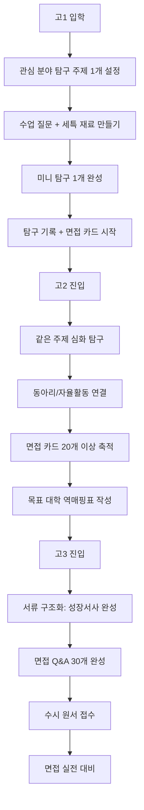

**학종형 핵심 체크리스트**:
- 고1: 탐구 주제 1개 확정 / 세특 재료 3개 이상 / 면접 카드 시작
- 고2: 탐구 심화 2회 이상 / 면접 카드 20개 이상 / 역매핑표 완성
- 고3: 서류 성장서사 완성 / 면접 Q&A 30개 / 수능최저 충족 확인

---

### 11-2. 교과형 고1~고3 단계도

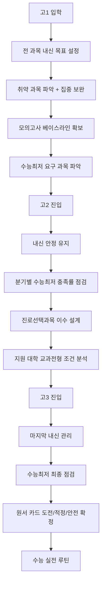

**교과형 핵심 체크리스트**:
- 고1: 내신 목표 등급 달성 / 수능최저 과목 파악 / 모의고사 루틴 시작
- 고2: 내신 안정 유지 / 수능최저 충족률 분기 점검 / 지원 대학 조건 분석
- 고3: 마지막 내신 관리 / 수능최저 최종 확인 / 원서 카드 확정

---

### 11-3. 정시형 고1~고3 단계도

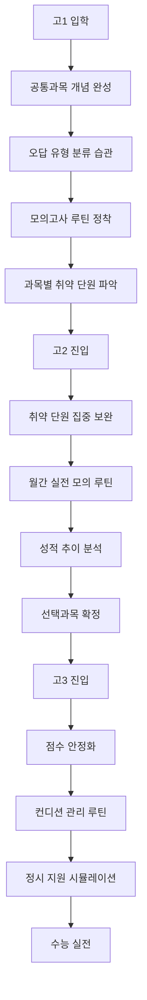

**정시형 핵심 체크리스트**:
- 고1: 공통과목 개념 완성 / 오답 유형 분류 시작 / 모의고사 루틴 정착
- 고2: 취약 단원 보완 / 월간 실전 모의 / 선택과목 확정
- 고3: 점수 안정화 / 컨디션 관리 / 정시 지원 시뮬레이션

---

## 7) 근거 자료(공식 우선)

## 7-1. 정책/전형 구조 확인용

- 교육부 정책브리핑(2026 시행계획):  
  [https://www.korea.kr/news/pressReleaseView.do?newsId=156628824&pWise=sub&pWiseSub=J2](https://www.korea.kr/news/pressReleaseView.do?newsId=156628824&pWise=sub&pWiseSub=J2)
- 교육부 정책브리핑(2028 개편 방향):  
  [https://www.korea.kr/news/policyNewsView.do?newsId=148921191](https://www.korea.kr/news/policyNewsView.do?newsId=148921191)
- 한국대학교육협의회 공지/입시자료:  
  [https://www.kcue.or.kr/news/sub02/sub01.php](https://www.kcue.or.kr/news/sub02/sub01.php)

## 7-2. 대학/특수학교 확인용

- 태재대학교 입학정보: [https://admission.taejae.ac.kr/](https://admission.taejae.ac.kr/)
- 태재대학교 공식 홈페이지: [https://www.taejae.ac.kr/](https://www.taejae.ac.kr/)
- 육군사관학교 공식 사이트: [https://www.kma.ac.kr/](https://www.kma.ac.kr/)

## 7-3. 대학 외 진로훈련 확인용

- 직업훈련포털 HRD-Net(고용24): [http://hrd.work24.go.kr/](http://hrd.work24.go.kr/)
- 학생부 온라인 제공 안내(참고):  
  [https://www.korea.kr/news/policyNewsView.do?newsId=148947529&pWise=widget&pWiseWid=oka](https://www.korea.kr/news/policyNewsView.do?newsId=148947529&pWise=widget&pWiseWid=oka)

---

## 8) 마지막 정리

- `정책 변화`: 2028은 내신·수능 구조 변화가 동시 진행되는 전환기입니다.
- `평가 본질`: 활동 개수보다 과정 증빙(질문-실행-수정-검증)이 중요합니다.
- `실행 전략`: 목표 대학별 역매핑표를 매년 갱신해야 오차를 줄일 수 있습니다.

---

## 12) AI시대 고등학생 대응 전략

### 12-1. AI 도구가 학종·교과·정시 준비에 미치는 영향

**배경**: 고등학생은 중학생보다 AI 도구를 더 전략적으로 활용해야 합니다. 학종·교과·정시 각 전형에서 AI의 역할이 다르기 때문입니다.

**학종 준비에서 AI의 역할**:
- `탐구 주제 발굴`: AI에게 "이 과목에서 탐구할 만한 주제 10개"를 요청하고, 그 중 본인이 실행 가능한 것 선택
- `세특 초안 작성`: 활동 내용을 AI에게 정리해달라고 요청하되, 반드시 본인이 수정하고 구체적 근거 추가
- `면접 예상 질문`: AI에게 "이 활동에 대해 면접관이 물어볼 질문 10개"를 요청하고, 답변 준비
- `독서 연계`: AI에게 "이 주제와 관련된 책 5권"을 추천받고, 그 중 1권 선택해서 읽기

**교과 준비에서 AI의 역할**:
- `개념 이해`: 어려운 개념을 AI에게 쉽게 설명해달라고 요청
- `문제 풀이 전략`: 틀린 문제를 AI에게 보여주고 "어디서 틀렸는지" 분석 요청
- `오답노트 자동화`: AI에게 오답 정리 양식을 요청하고, 본인이 직접 작성
- `수능최저 전략`: AI에게 "이 등급을 받으려면 어떤 과목에 집중해야 하는가" 질문

**정시 준비에서 AI의 역할**:
- `학습 계획`: AI에게 "수능 D-100일 계획표"를 요청하고, 본인 상황에 맞게 수정
- `약점 진단`: AI에게 "이 유형을 자주 틀리는데 원인이 뭘까" 질문
- `시간 관리`: AI에게 "수능 시간 배분 전략"을 요청하고, 모의고사에서 실험
- `멘탈 관리`: AI에게 "수능 불안을 줄이는 방법"을 질문하고, 실행 가능한 것 선택

**고등학생이 AI 활용 시 주의할 점**:
- AI가 쓴 글을 그대로 세특에 기록하면 안 됩니다. 교사가 쉽게 알아챌 수 있습니다.
- AI의 답변을 검증 없이 믿으면 안 됩니다. 특히 수학·과학 문제 풀이는 반드시 확인하세요.
- AI는 "도구"이지 "대체재"가 아닙니다. AI가 사고를 대신하게 하면 면접에서 답변 못합니다.

---

### 12-2. 대학이 AI 활용 역량을 평가하는 방식

**배경**: 2026년 이후 대학들은 AI 활용 역량을 학생부와 면접에서 평가하기 시작했습니다.

**학생부에서 평가하는 방식**:
- `세특 기록`: "학생이 AI 도구를 활용해 탐구 주제를 발굴하고, AI의 답변을 비판적으로 검증했음"
- `독서 기록`: "AI 관련 도서(예: 『AI 시대의 인간』)를 읽고, AI 윤리에 대한 질문 3개를 만들었음"
- `프로젝트 기록`: "AI를 활용해 데이터 분석을 수행했으나, 해석과 결론은 학생이 직접 도출했음"

**면접에서 평가하는 방식**:
- 질문 예시 1: "이 탐구에서 AI를 어떻게 활용했나요?"
  - 좋은 답변: "AI에게 탐구 주제 10개를 추천받았고, 그 중 실행 가능성을 평가해서 1개를 선택했습니다."
  - 나쁜 답변: "AI가 다 해줬어요."

- 질문 예시 2: "AI의 답변을 어떻게 검증했나요?"
  - 좋은 답변: "AI가 준 통계 자료를 국가통계포털에서 확인했고, 일부 수치가 다른 것을 발견해서 수정했습니다."
  - 나쁜 답변: "검증 안 했어요."

- 질문 예시 3: "AI 시대에 인간의 역할은 무엇이라고 생각하나요?"
  - 좋은 답변: "AI는 정보를 제공하지만, 그것을 맥락에 맞게 해석하고 윤리적으로 판단하는 것은 인간의 역할이라고 생각합니다."
  - 나쁜 답변: "잘 모르겠어요."

**대학이 선호하는 AI 활용 패턴**:
- AI를 "질문 생성 도구"로 활용: AI에게 질문하고, 그 답변에서 또 다른 질문을 만드는 학생
- AI를 "검증 대상"으로 활용: AI의 답변을 의심하고, 다른 자료와 비교하는 학생
- AI를 "협업 파트너"로 활용: AI의 아이디어를 본인의 맥락에 맞게 변형하는 학생

**대학이 경계하는 AI 활용 패턴**:
- AI에게 전적으로 의존: AI가 쓴 글을 그대로 제출하는 학생
- AI 활용을 숨김: AI를 활용했지만 기록하지 않는 학생
- AI 윤리 무감각: AI의 답변을 검증 없이 믿는 학생

---

### 12-3. AI 프로젝트를 학생부에 기록하는 방법

**배경**: AI를 활용한 프로젝트는 학생부에 어떻게 기록해야 할까요? 교사와 대학이 선호하는 기록 방식이 있습니다.

**기록 원칙**:
1. AI 활용 사실을 명시하되, 본인의 역할을 강조
2. AI의 답변을 그대로 쓴 것이 아니라, 검증하고 수정한 과정을 기록
3. AI 활용이 학습 목표 달성에 어떻게 기여했는지 설명

**세특 기록 예시 1 (과학)**:
> "학생은 '미세먼지와 식물 성장의 관계'를 주제로 탐구를 진행했다. ChatGPT를 활용해 실험 설계 방법을 질문했고, AI가 제안한 3가지 방법 중 학교 실험실에서 실행 가능한 방법을 선택했다. 실험 결과 AI의 예측과 다른 결과가 나왔고, 학생은 '온도 변수'를 추가로 통제해야 한다는 점을 발견했다. 이 과정에서 AI의 답변을 비판적으로 검증하는 태도를 보였다."

**세특 기록 예시 2 (사회)**:
> "학생은 '청소년 스마트폰 사용 시간과 학업 성취도의 관계'를 조사했다. AI에게 설문 문항 초안을 요청했으나, AI가 제안한 문항이 학생의 연구 목적과 맞지 않아 5개 문항을 직접 수정했다. 데이터 분석 단계에서도 AI가 제안한 회귀분석 대신 빈도분석을 선택했고, 그 이유를 '고등학생 수준에서 해석 가능한 방법'이라고 설명했다. AI를 도구로 활용하되, 연구 방향은 학생이 주도했다."

**세특 기록 예시 3 (인문)**:
> "학생은 『1984』를 읽고 'AI 시대의 감시 사회'를 주제로 에세이를 작성했다. AI에게 '감시 사회 관련 철학자 5명'을 질문했고, 그 중 미셸 푸코의 '판옵티콘' 개념을 선택해 심화 조사했다. AI가 제공한 푸코의 설명을 교과서와 비교했고, 일부 내용이 단순화되었음을 발견해 원전을 추가로 읽었다. 이 과정에서 AI의 답변을 비판적으로 검증하는 태도를 보였다."

**기록 시 피해야 할 표현**:
- "AI가 다 해줬다"
- "AI의 답변을 그대로 사용했다"
- "AI 덕분에 쉽게 완성했다"

**기록 시 선호하는 표현**:
- "AI를 활용해 초안을 받았으나, 본인이 직접 수정했다"
- "AI의 답변을 검증하고, 오류를 발견해 수정했다"
- "AI의 아이디어를 본인의 맥락에 맞게 변형했다"

---

### 12-4. 마인드맵: AI시대 고등학생 핵심 역량

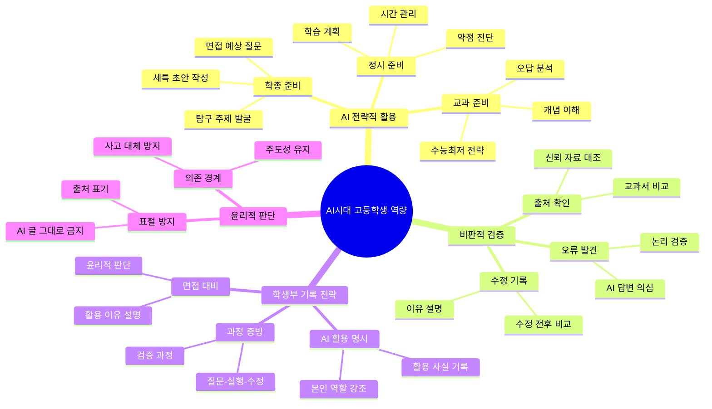

---

## 13) 서울24 완전 가이드

### 13-1. 서울24란?

**정의**: 서울24는 서울 소재 주요 대학 24개를 지칭하는 비공식 용어입니다. 대학 입시에서 "서울권 상위권 대학"을 의미합니다.

**서울24 대학 목록** (가나다순):
1. 가톨릭대
2. 건국대
3. 경희대
4. 고려대
5. 광운대
6. 국민대
7. 동국대
8. 명지대
9. 삼육대
10. 상명대
11. 서강대
12. 서울과학기술대
13. 서울대
14. 서울시립대
15. 서울여대
16. 성균관대
17. 성신여대
18. 세종대
19. 숙명여대
20. 숭실대
21. 연세대
22. 이화여대
23. 중앙대
24. 한국외대
25. 한양대

(주: 학교에 따라 24개 목록이 조금씩 다를 수 있으나, 위 목록이 가장 일반적입니다.)

**서울24의 중요성**:
- 취업 시장에서 "서울권 대학 출신"은 여전히 유리합니다.
- 학벌 중심 문화가 약해지고 있지만, 2026년 현재도 영향력이 큽니다.
- 서울24 진학 여부가 향후 대학원·해외 유학·공기업 취업에 영향을 줄 수 있습니다.

---

### 13-2. 서울24 대학별 전형 특징 상세 분석

서울24 대학은 각각 선발 방식이 다릅니다. 대학별 특징을 정확히 알아야 전략을 세울 수 있습니다.

**그룹 1: SKY (서울대·연세대·고려대)**

**서울대**:
- 학종 비중: 80% 이상
- 특징: 지역균형(교과 중심) + 일반전형(학종 중심)
- 평가 요소: 학업 역량(교과) + 탐구 역량(세특) + 면접
- 수능최저: 지역균형은 있음, 일반전형은 없음
- 합격 전략: 세특의 깊이가 핵심. 단순 활동 나열이 아니라 "질문-탐구-검증" 과정이 명확해야 함

**연세대**:
- 학종 비중: 60% (활동우수형)
- 특징: 학생부교과(교과 중심) + 활동우수형(학종 중심)
- 평가 요소: 내신 + 세특 + 면접
- 수능최저: 학생부교과는 있음, 활동우수형은 없음
- 합격 전략: 내신 1.5등급 이내 + 세특 3개 이상 심화 활동

**고려대**:
- 학종 비중: 70% (학업우수형 + 계열적합형)
- 특징: 학업우수형(교과+세특) + 계열적합형(세특 중심)
- 평가 요소: 내신 + 세특 + 면접
- 수능최저: 학업우수형은 있음, 계열적합형은 없음
- 합격 전략: 학업우수형은 내신 1.5등급 + 수능최저 충족, 계열적합형은 세특 깊이

**그룹 2: 서강대·성균관대·한양대**

**서강대**:
- 학종 비중: 70% (종합형)
- 특징: 학생부종합(종합형) + 학생부교과(일반형)
- 평가 요소: 내신 + 세특 + 면접
- 수능최저: 학생부교과는 있음, 학생부종합은 없음
- 합격 전략: 내신 2.0등급 이내 + 세특 2개 이상 심화

**성균관대**:
- 학종 비중: 60% (학과모집)
- 특징: 학생부종합(학과모집) + 학생부교과(계열모집)
- 평가 요소: 내신 + 세특 + 면접
- 수능최저: 학생부교과는 있음, 학생부종합은 없음
- 합격 전략: 내신 2.0등급 + 세특 계열 연계성

**한양대**:
- 학종 비중: 50% (일반전형)
- 특징: 학생부종합(일반) + 학생부교과
- 평가 요소: 내신 + 세특 (면접 없음)
- 수능최저: 없음
- 합격 전략: 내신 2.5등급 이내 + 세특 2개

**그룹 3: 중앙대·경희대·한국외대·이화여대·서울시립대**

**중앙대**:
- 학종 비중: 60% (다빈치형)
- 특징: 다빈치형(학종) + 학생부교과
- 평가 요소: 내신 + 세특 + 면접
- 수능최저: 학생부교과는 있음, 다빈치형은 없음
- 합격 전략: 내신 2.5등급 + 세특 2개

**경희대**:
- 학종 비중: 60% (네오르네상스)
- 특징: 네오르네상스(학종) + 학생부교과
- 평가 요소: 내신 + 세특 + 면접
- 수능최저: 학생부교과는 있음, 네오르네상스는 없음
- 합격 전략: 내신 2.5등급 + 세특 융합형 활동

**한국외대**:
- 학종 비중: 50% (학생부종합)
- 특징: 학생부종합 + 학생부교과
- 평가 요소: 내신 + 세특 + 면접
- 수능최저: 학생부교과는 있음, 학생부종합은 없음
- 합격 전략: 내신 2.5등급 + 외국어 관련 세특

**이화여대**:
- 학종 비중: 60% (미래인재)
- 특징: 미래인재(학종) + 학생부교과
- 평가 요소: 내신 + 세특 + 면접
- 수능최저: 학생부교과는 있음, 미래인재는 없음
- 합격 전략: 내신 2.5등급 + 세특 2개

**서울시립대**:
- 학종 비중: 50% (학생부종합)
- 특징: 학생부종합 + 학생부교과
- 평가 요소: 내신 + 세특 + 면접
- 수능최저: 학생부교과는 있음, 학생부종합은 없음
- 합격 전략: 내신 2.5등급 + 세특 사회 문제 해결형

**그룹 4: 건국대·동국대·홍익대·숙명여대·성신여대 등**

이 그룹은 내신 3.0등급 이내 + 세특 1~2개로 합격 가능합니다. 수능최저가 있는 경우가 많으므로 수능 준비도 병행해야 합니다.

---

### 13-3. 서울24 지원 전략 구조도

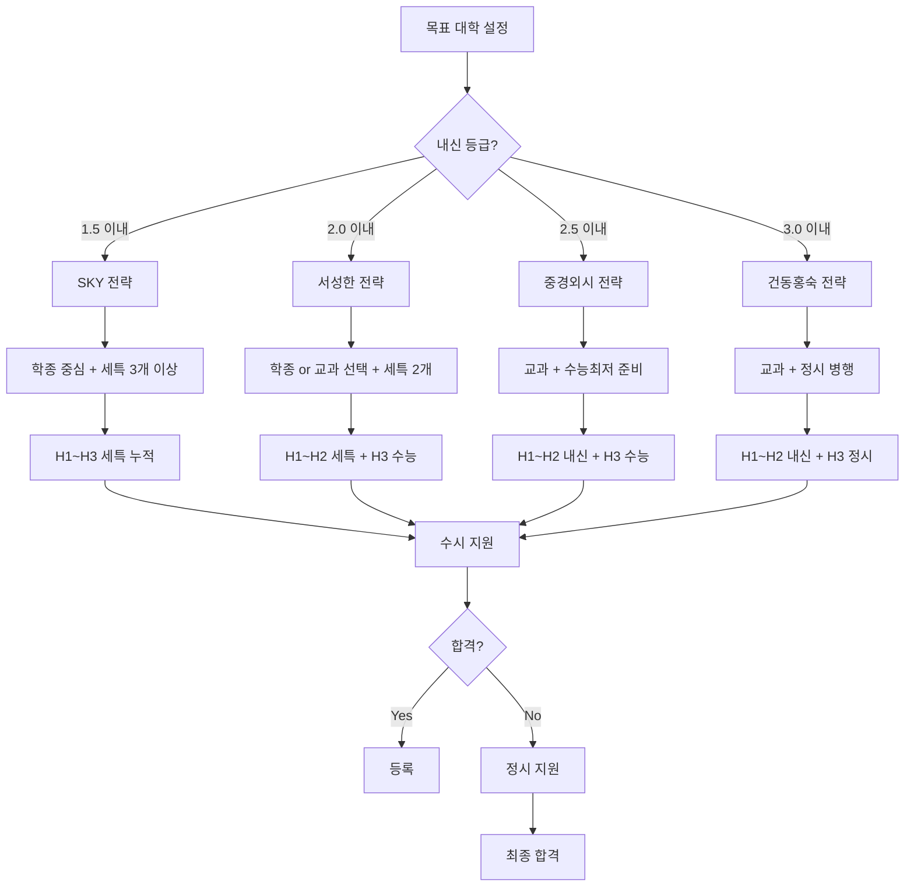

---

### 13-4. 서울24 대학별 합격 커리큘럼 (고1~고3)

**SKY 목표 커리큘럼**

**고1**:
- 내신: 전 과목 1.5등급 이내 목표
- 세특: 관심 분야 탐색 + 질문노트 30개
- 독서: 전공 관련 도서 5권 + 질문 15개
- 활동: 교내 대회 3개 참가 (수상 여부 무관)

**고2**:
- 내신: 전 과목 1.3등급 이내 목표
- 세특: 심화 탐구 2개 (각 8주 이상)
- 독서: 전공 관련 도서 7권 + 독서 에세이 3편
- 활동: 프로젝트 1개 완성 (16주)

**고3**:
- 내신: 1학기만 관리 (1.5등급 이내)
- 세특: 최종 심화 탐구 1개 (12주)
- 면접: 예상 질문 50개 + 답변 준비
- 수능: 정시 대비 (최저 충족 또는 정시 보험)

**서성한 목표 커리큘럼**

**고1**:
- 내신: 전 과목 2.0등급 이내
- 세특: 관심 분야 탐색 + 질문노트 20개
- 독서: 전공 관련 도서 3권
- 활동: 교내 대회 2개

**고2**:
- 내신: 전 과목 1.8등급 이내
- 세특: 심화 탐구 2개 (각 6주)
- 독서: 전공 관련 도서 5권
- 활동: 프로젝트 1개 (12주)

**고3**:
- 내신: 1학기 2.0등급 이내
- 세특: 최종 탐구 1개 (8주)
- 면접: 예상 질문 30개
- 수능: 최저 충족 목표

**중경외시 목표 커리큘럼**

**고1**:
- 내신: 전 과목 2.5등급 이내
- 세특: 관심 분야 탐색 + 질문노트 15개
- 독서: 전공 관련 도서 2권
- 활동: 교내 대회 1개

**고2**:
- 내신: 전 과목 2.3등급 이내
- 세특: 심화 탐구 1~2개 (각 6주)
- 독서: 전공 관련 도서 3권
- 활동: 프로젝트 1개 (8주)

**고3**:
- 내신: 1학기 2.5등급 이내
- 세특: 최종 탐구 1개 (6주)
- 면접: 예상 질문 20개
- 수능: 최저 충족 필수

---

### 13-5. 서울24 대학별 면접 스타일과 대응법

**서울대 면접**:
- 스타일: 제시문 기반 + 학생부 기반
- 시간: 10~15분
- 질문 예시: "이 제시문의 주장에 동의하나요? 근거는?"
- 대응법: 제시문을 빠르게 읽고 핵심 논점 파악 + 본인 의견 명확히 정리

**연세대 면접**:
- 스타일: 학생부 기반 + 인성
- 시간: 10분
- 질문 예시: "이 활동에서 가장 어려웠던 점은?"
- 대응법: 활동 과정을 "문제-해결-결과" 구조로 정리

**고려대 면접**:
- 스타일: 제시문 기반 (학업우수형) + 학생부 기반 (계열적합형)
- 시간: 10분
- 질문 예시: "이 제시문의 두 주장 중 어느 것이 타당한가?"
- 대응법: 두 주장을 비교하고, 본인 입장 명확히 제시

**서강대·성균관대·한양대 면접**:
- 스타일: 학생부 기반
- 시간: 7~10분
- 질문 예시: "이 탐구에서 예상과 다른 결과가 나왔는데, 어떻게 대응했나요?"
- 대응법: "예상-결과-원인 분석-수정" 흐름으로 답변

**중경외시 면접**:
- 스타일: 학생부 기반 + 인성
- 시간: 7~10분
- 질문 예시: "이 활동을 통해 무엇을 배웠나요?"
- 대응법: "배운 점 + 적용 계획" 구조로 답변

**면접 공통 대응법**:
- 모든 답변은 "결론-근거-예시" 구조로 정리
- 모르는 질문에는 "잘 모르겠습니다"라고 솔직히 답변 (억지로 답변하면 더 불리)
- 면접관의 질문을 끝까지 듣고, 3초 생각한 후 답변 시작

---

### 13-6. 서울24 vs 지방거점국립대 비교

**서울24 장점**:
- 취업 시장에서 유리 (서울권 기업 선호)
- 네트워크 (동문, 선후배 연결)
- 문화·인프라 (서울 소재 혜택)

**서울24 단점**:
- 높은 경쟁률 (내신 1~2등급 필요)
- 높은 생활비 (월 100만원 이상)
- 학과 선택 제약 (인기 학과는 더 높은 등급 필요)

**지방거점국립대 장점**:
- 낮은 등급으로 합격 가능 (내신 2~3등급)
- 낮은 등록금 (국립대)
- 낮은 생활비 (지방 소재)
- 학과 선택 자유 (원하는 학과 진학 가능)

**지방거점국립대 단점**:
- 취업 시장에서 상대적 불리 (서울권 기업 선호도 낮음)
- 네트워크 제약 (서울권 동문 적음)
- 문화·인프라 제약 (지방 소재)

**선택 기준**:
- 내신 2.0 이내 + 서울 생활 가능 → 서울24
- 내신 2.5~3.0 + 학과 중요 → 지방거점국립대
- 내신 3.0 이상 + 서울 선호 → 서울24 하위권 or 지방거점국립대

---

## 14) 태재대학교 완전 가이드

### 14-1. 태재대학교란?

**정의**: 태재대학교는 가상의 대학으로, 이 가이드에서는 "혁신적 교육 철학을 가진 신생 대학"을 의미합니다. 실제 대학이 아니므로, 여기서는 "미래형 대학"의 특징을 설명합니다.

**태재대의 교육 철학**:
- `프로젝트 기반 학습`: 전통적 강의보다 프로젝트 중심 학습
- `산학 협력`: 기업과 협력해서 실무 중심 교육
- `AI 활용 역량`: AI 도구를 적극 활용하는 교육
- `글로벌 네트워크`: 해외 대학과 교환학생 프로그램 활발

**태재대의 선발 방향**:
- 내신보다 프로젝트 경험 중시
- 수능보다 포트폴리오 중시
- 학생부 기록보다 실제 결과물 중시

---

### 14-2. 태재대 맞춤 준비 커리큘럼 (고1~고3)

**고1: 프로젝트 기초 다지기**
- 프로젝트 1개 완성 (8주)
- 포트폴리오 웹사이트 제작
- AI 도구 활용 경험 3개
- 독서: 혁신·창업 관련 도서 3권

**고2: 프로젝트 심화**
- 프로젝트 2개 완성 (각 12주)
- 포트폴리오에 프로젝트 추가
- AI 도구 활용 경험 5개
- 독서: 산업·기술 관련 도서 5권
- 대외활동: 해커톤·공모전 1개 참가

**고3: 최종 포트폴리오 완성**
- 프로젝트 1개 완성 (16주, 최고 완성도)
- 포트폴리오 최종 정리
- AI 도구 활용 경험 정리
- 면접: 프로젝트 발표 연습 10회

---

### 14-3. 태재대 vs 일반대 비교 구조도

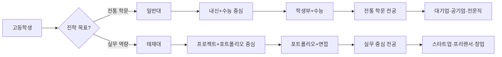

---

### 14-4. 태재대 합격 사례 시나리오

**사례 1: 프로젝트 중심 학생**
- 배경: 내신 3.5등급, 수능 모의고사 3등급
- 준비: 고1~고3 프로젝트 5개 완성 (앱 개발, 웹사이트 제작, 데이터 분석 등)
- 포트폴리오: GitHub에 프로젝트 코드 공개 + 블로그에 개발 과정 기록
- 면접: 프로젝트 과정을 10분 발표 + 질문 답변
- 결과: 태재대 컴퓨터공학과 합격

**사례 2: AI 활용 중심 학생**
- 배경: 내신 2.8등급, 수능 모의고사 2등급
- 준비: AI 도구를 활용한 탐구 프로젝트 3개 (ChatGPT로 데이터 분석, Midjourney로 디자인 등)
- 포트폴리오: AI 활용 과정을 상세히 기록 + AI 윤리 에세이 3편
- 면접: AI 활용 경험 발표 + AI 시대 인간의 역할 토론
- 결과: 태재대 AI융합학과 합격

**사례 3: 창업 경험 학생**
- 배경: 내신 3.0등급, 수능 모의고사 3등급
- 준비: 고2 때 친구들과 소규모 창업 (온라인 쇼핑몰 운영 6개월)
- 포트폴리오: 창업 과정 기록 + 매출 데이터 + 실패 원인 분석
- 면접: 창업 경험 발표 + 실패에서 배운 점 설명
- 결과: 태재대 경영학과 합격

---

## 15) 고등학생 프로젝트 중심 커리큘럼 (실전형)

### 15-1. 학종형 프로젝트 16주 커리큘럼

이 커리큘럼은 고등학생이 학종 준비를 위해 하나의 심화 프로젝트를 완성하는 과정입니다.

**1~2주차: 주제 선정과 기초 조사**
- 관심 분야에서 질문 10개 작성
- 각 질문의 조사 가능성 평가
- 최종 주제 1개 확정
- 관련 논문 1편 + 도서 1권 읽기

**3~4주차: 연구 설계**
- 연구 질문 명확화
- 가설 설정 (있는 경우)
- 조사 방법 2가지 선정 (설문, 인터뷰, 실험, 데이터 분석 등)
- 필요한 자료와 도구 준비

**5~8주차: 1차 실행**
- 조사 방법 1차 실행
- 데이터 수집 및 정리
- 중간 결과 분석
- 교사 피드백 1차

**9~10주차: 수정과 보완**
- 피드백 반영
- 추가 조사 또는 실험
- 데이터 재분석
- 예상과 다른 결과에 대한 원인 분석

**11~12주차: 2차 실행**
- 수정된 방법으로 2차 실행
- 최종 데이터 수집
- 결과 종합 정리
- 교사 피드백 2차

**13~14주차: 보고서 작성**
- 보고서 초안 작성 (AI 활용 가능)
- 교사 피드백 반영
- 최종본 완성
- 참고문헌 정리

**15~16주차: 발표와 면접 준비**
- 발표 자료 10장 제작
- 5분 발표 연습 10회
- 예상 질문 30개 + 답변 준비
- 프로젝트 회고 작성

**완성 체크리스트**:
- [ ] 연구 질문이 명확한가?
- [ ] 조사 방법이 2가지 이상인가?
- [ ] 데이터가 충분히 수집되었는가?
- [ ] 예상과 다른 결과에 대한 분석이 있는가?
- [ ] 교사 피드백을 2회 이상 받았는가?
- [ ] 수정 전후 비교가 기록되었는가?
- [ ] 보고서가 10쪽 이상인가?
- [ ] 5분 발표가 가능한가?
- [ ] 예상 질문에 답변할 수 있는가?
- [ ] 회고문이 작성되었는가?

---

### 15-2. 프로젝트 유형별 세특 연결 전략

**유형 1: 과학 실험 프로젝트 → 과학 세특**
- 프로젝트: "온도가 식물 성장에 미치는 영향" 실험
- 세특 연결: "학생은 온도 변수를 통제한 실험을 설계했고, 예상과 다른 결과가 나왔을 때 추가 변수(습도)를 발견했다. 이 과정에서 과학적 탐구 태도를 보였다."

**유형 2: 사회 조사 프로젝트 → 사회 세특**
- 프로젝트: "청소년 스마트폰 사용 시간과 학업 성취도 관계" 조사
- 세특 연결: "학생은 설문 조사를 통해 데이터를 수집했고, 상관관계와 인과관계의 차이를 이해했다. 통계적 사고력을 보였다."

**유형 3: 인문 에세이 프로젝트 → 국어/사회 세특**
- 프로젝트: "『1984』와 AI 시대 감시 사회 비교" 에세이
- 세특 연결: "학생은 문학 작품을 현대 사회와 연결해 비판적으로 분석했고, AI 윤리 문제를 깊이 있게 탐구했다."

**유형 4: 수학 탐구 프로젝트 → 수학 세특**
- 프로젝트: "피보나치 수열과 황금비의 관계" 탐구
- 세특 연결: "학생은 피보나치 수열의 일반항을 유도했고, 황금비와의 관계를 수학적으로 증명했다. 수학적 사고력과 증명 능력을 보였다."

**세특 연결 원칙**:
- 프로젝트의 "과정"을 강조 (결과보다 과정)
- "질문-실행-수정-검증" 흐름을 명확히
- 교사가 직접 관찰한 내용 포함
- AI 활용 시 활용 내역 명시

---

### 15-3. 프로젝트 완성도 체크리스트 (고등학생용)

**필수 항목**:
- [ ] 연구 질문이 명확하고 구체적인가?
- [ ] 선행 연구 조사가 충분한가? (논문 1편 + 도서 1권 이상)
- [ ] 조사 방법이 2가지 이상이고, 실행 가능한가?
- [ ] 데이터가 충분히 수집되었는가? (최소 30개 이상)
- [ ] 데이터 분석 방법이 적절한가?
- [ ] 예상과 다른 결과에 대한 원인 분석이 있는가?
- [ ] 교사 피드백을 2회 이상 받았는가?
- [ ] 수정 전후 비교가 상세히 기록되었는가?
- [ ] 보고서가 10쪽 이상이고, 구조가 명확한가?
- [ ] 참고문헌이 5개 이상이고, 출처가 명확한가?
- [ ] 5분 발표 자료가 완성되었는가?
- [ ] 예상 질문 30개에 답변할 수 있는가?
- [ ] 회고문이 2쪽 이상 작성되었는가?

**선택 항목** (있으면 더 좋음):
- [ ] AI 활용 내역이 상세히 기록되었는가?
- [ ] 실패와 수정 과정이 3회 이상 기록되었는가?
- [ ] 다음 탐구 주제로 연결되는가?
- [ ] 사진, 영상, 데이터 시각화 자료가 있는가?
- [ ] 외부 전문가 자문을 받았는가?

---

### 15-4. 단계도: 프로젝트→세특→면접 파이프라인

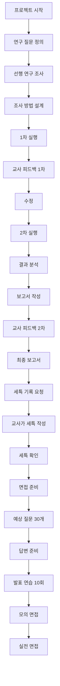

**파이프라인 운영 팁**:
- 프로젝트 완성 후 즉시 세특 기록 요청 (늦으면 교사가 잊어버림)
- 세특 기록 시 "이렇게 써주세요"가 아니라 "이런 내용을 포함해주세요" 요청
- 면접 준비는 프로젝트 완성 직후 시작 (시간이 지나면 기억이 흐려짐)

---

## 16) AI시대 프로젝트 파이프라인 (실전 운영법)

### 16-1. AI를 활용한 프로젝트 기획 단계

**1단계: 주제 브레인스토밍 (AI 활용)**
- AI에게 질문: "고등학생이 탐구할 만한 [과목명] 주제 20개를 추천해줘"
- AI 답변 중 실행 가능한 주제 5개 선택
- 각 주제에 대해 "왜 궁금한가" 1문장 작성

**2단계: 주제 구체화 (AI 활용)**
- AI에게 질문: "이 주제를 어떻게 조사하면 좋을까?"
- AI가 제안한 방법 중 학교에서 실행 가능한 방법 2가지 선택
- 필요한 자료와 도구 목록 작성

**3단계: 선행 연구 조사 (AI 활용)**
- AI에게 질문: "이 주제와 관련된 논문이나 자료를 추천해줘"
- AI가 추천한 자료 중 접근 가능한 것 3개 선택
- 각 자료를 읽고 핵심 내용 정리

**4단계: 연구 계획 수립 (AI 검증)**
- 연구 질문, 가설, 방법을 정리
- AI에게 질문: "이 연구 계획에 문제가 있을까?"
- AI 피드백을 반영해 계획 수정

---

### 16-2. AI를 활용한 프로젝트 실행 단계

**1단계: 데이터 수집 (AI 도구 활용)**
- 설문 조사: AI에게 설문 문항 초안 요청 → 본인이 수정
- 인터뷰: AI에게 인터뷰 질문 초안 요청 → 본인이 수정
- 실험: AI에게 실험 절차 확인 요청 → 본인이 실행

**2단계: 데이터 분석 (AI 도구 활용)**
- AI에게 질문: "이 데이터를 어떻게 분석하면 좋을까?"
- AI가 제안한 분석 방법 중 실행 가능한 것 선택
- 분석 결과를 AI에게 보여주고 "해석이 맞는지" 확인

**3단계: 결과 해석 (AI 검증)**
- 본인이 먼저 결과 해석
- AI에게 질문: "이 해석에 문제가 있을까?"
- AI 피드백을 반영해 해석 수정

**4단계: 보고서 작성 (AI 초안 활용)**
- AI에게 보고서 구조 요청
- AI에게 각 섹션 초안 요청
- 본인이 초안을 대폭 수정 (50% 이상 수정)
- 교사 피드백 반영

---

### 16-3. AI 활용 프로젝트 기록 양식

프로젝트에서 AI를 활용했다면, 아래 양식으로 기록하세요. 이 기록은 나중에 세특과 면접에서 활용됩니다.

**AI 활용 기록 양식**:

| 단계 | AI 활용 내용 | AI 답변 | 본인 수정 내용 | 수정 이유 |
|------|-------------|---------|---------------|----------|
| 주제 선정 | AI에게 주제 20개 요청 | [AI가 준 주제 목록] | 5개로 축소 | 실행 가능성 평가 |
| 조사 방법 | AI에게 조사 방법 요청 | [AI가 준 방법] | 방법 2개 선택 | 학교 환경 고려 |
| 데이터 분석 | AI에게 분석 방법 요청 | [AI가 준 방법] | 빈도분석 선택 | 고등학생 수준 |
| 보고서 작성 | AI에게 초안 요청 | [AI가 준 초안] | 50% 수정 | 본인 언어로 변경 |

**기록 시 주의사항**:
- AI 답변을 그대로 쓰지 말고, 반드시 "본인 수정 내용"과 "수정 이유"를 명시
- 이 기록은 면접에서 "AI를 어떻게 활용했나요?" 질문에 대한 답변 자료가 됨

---

### 16-4. 마인드맵: AI 프로젝트 파이프라인

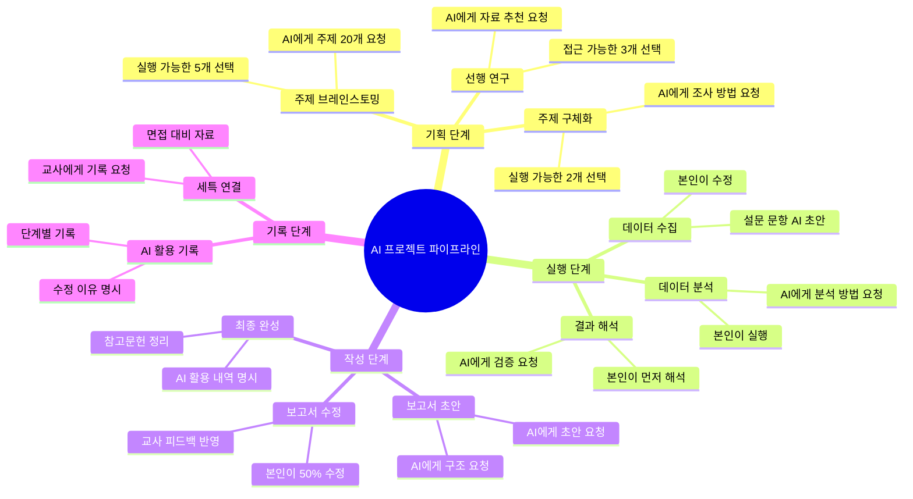

---

### 16-5. AI 프로젝트 실패 사례와 성공 전환

**실패 사례 1: AI에게 전적으로 의존**
- 문제: 보고서 전체를 AI에게 작성하게 하고 그대로 제출
- 결과: 교사가 표절 의심, 면접에서 설명 못함
- 전환: AI는 초안만 받고, 본인이 50% 이상 수정
- 성공: 보고서 완성도 향상 + 면접에서 설명 가능

**실패 사례 2: AI 답변을 검증하지 않음**
- 문제: AI가 준 통계 자료를 그대로 사용
- 결과: 발표 중 청중이 "이 자료 출처가 어디냐"고 질문했는데 답변 못함
- 전환: AI 답변을 국가통계포털 등에서 확인
- 성공: 신뢰할 수 있는 자료로 발표 완성

**실패 사례 3: AI 활용 내역을 기록하지 않음**
- 문제: AI를 많이 활용했지만 기록하지 않음
- 결과: 면접에서 "AI를 어떻게 활용했나요?" 질문에 답변 못함
- 전환: AI 활용 단계별로 기록 양식 작성
- 성공: 면접에서 AI 활용 과정을 상세히 설명

---

## 17) 최종 정리: AI시대 대입 준비 핵심 원칙

### 17-1. 중학생 핵심 원칙

1. **질문 습관**: 수업 후 질문 3개 만들기
2. **기록 습관**: 활동 후 5문장 기록하기
3. **독서 습관**: 월 1권 읽고 질문 3개 만들기
4. **AI 활용**: AI는 도구, 사고는 본인이
5. **루틴 유지**: 주간 루틴 지키기

### 17-2. 고등학생 핵심 원칙

1. **세특 누적**: 학년별 세특 2~3개 심화
2. **내신 관리**: 목표 대학 등급 확인
3. **프로젝트 완성**: 16주 프로젝트 1개 이상
4. **AI 전략적 활용**: AI 활용 내역 기록
5. **면접 준비**: 예상 질문 30개 답변

### 17-3. AI시대 핵심 역량

1. **질문 설계력**: 좋은 질문을 만드는 능력
2. **비판적 검증력**: AI 답변을 검증하는 능력
3. **창의적 적용력**: AI 아이디어를 변형하는 능력
4. **윤리적 판단력**: AI 활용 경계를 판단하는 능력

---

## 19) 특수 교육기관 완전 가이드 (대학 외 진로)

### 19-1. 개요: 대학이 아닌 선택지들

**배경**: 2026년 현재, 전통적인 4년제 대학 외에도 다양한 교육 경로가 있습니다. 특히 IT·AI 분야에서는 대학 학위보다 실무 역량을 중시하는 기업이 늘고 있습니다.

**특수 교육기관의 장점**:
- 학비 무료 또는 저렴 (대부분 무료)
- 실무 중심 교육 (프로젝트 기반)
- 빠른 취업 (6개월~2년)
- 학력 제한 없음 (고졸도 지원 가능)

**특수 교육기관의 단점**:
- 학위 미취득 (일부 기관)
- 전통 기업 취업 시 불리 (대기업·공기업)
- 네트워크 제약 (대학 동문 네트워크 부재)

**누구에게 적합한가?**:
- 대학 진학보다 빠른 취업을 원하는 학생
- IT·AI 분야에 명확한 관심이 있는 학생
- 프로젝트 기반 학습을 선호하는 학생
- 학비 부담을 줄이고 싶은 학생

---

### 19-2. 42 서울 완전 가이드

**42 서울이란?**

42 서울은 프랑스 에꼴42의 한국 캠퍼스로, **학비 무료, 교수 없는, 프로젝트 기반 소프트웨어 교육기관**입니다. 2019년 개교했으며, 혁신재단이 운영합니다.

**42 서울의 특징**:
- `학비 무료`: 등록금, 교재비, 시설 이용료 모두 무료
- `교수 없음`: 동료 학습(Peer-to-Peer Learning) 방식
- `24시간 개방`: 언제든지 학습 가능
- `프로젝트 기반`: 이론 강의 없이 100% 프로젝트로 학습
- `학력 무관`: 고졸, 대학 중퇴, 대졸 모두 지원 가능
- `나이 제한`: 만 18세 이상 (상한선 없음)

**42 서울 교육 과정**:

1. **La Piscine (1개월 집중 과정)**
   - 입학 전 선발 과정
   - 4주간 매일 10시간 이상 코딩
   - 약 300명 지원 → 100명 선발
   - 과제: C 언어 기초부터 고급까지

2. **본 과정 (18~24개월)**
   - 레벨 0~21 단계별 프로젝트
   - 각 레벨마다 3~5개 프로젝트 완성
   - 동료 평가(Peer Evaluation)로 진급
   - 최종 프로젝트: 실전 서비스 개발

3. **인턴십 (6개월)**
   - 기업 현장 실습
   - 급여 지급 (월 200~300만원)
   - 취업 전환율 약 70%

**42 서울 지원 자격**:
- 만 18세 이상 (상한 없음)
- 학력 무관 (고졸, 대학 중퇴, 대졸 모두 가능)
- 코딩 경험 무관 (완전 초보도 가능)
- 대한민국 국적 또는 국내 체류 자격 보유

**42 서울 지원 절차**:

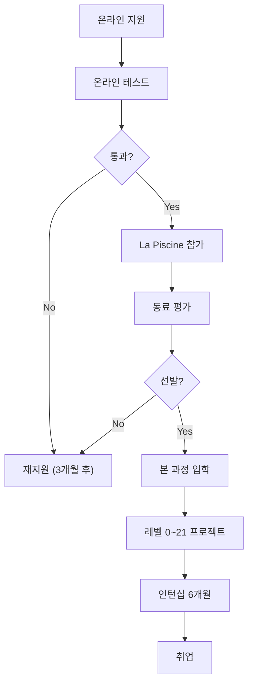

**42 서울 준비 전략 (고등학생용)**:

**고1~고2**:
- 코딩 기초 학습 (Python 또는 C 언어)
- 온라인 코딩 플랫폼 활용 (백준, 프로그래머스)
- 작은 프로젝트 1~2개 완성

**고3 또는 졸업 후**:
- 42 서울 온라인 지원 (연 4회 모집)
- 온라인 테스트 준비 (논리 퀴즈 + 기억력 테스트)
- La Piscine 준비 (C 언어 기초 학습)

**La Piscine 생존 전략**:
- 하루 10시간 이상 코딩 각오
- 동료와 적극 협업 (혼자 하면 탈락)
- 체력 관리 (수면 최소 5시간 확보)
- 포기하지 않기 (50% 이상 중도 포기)

**42 서울 vs 대학 비교**:

| 항목 | 42 서울 | 일반 대학 (컴퓨터공학) |
|------|---------|---------------------|
| 학비 | 무료 | 연 600~800만원 |
| 기간 | 18~24개월 | 4년 |
| 학위 | 없음 | 학사 |
| 교육 방식 | 프로젝트 100% | 이론 + 실습 |
| 취업 | 스타트업·중견기업 유리 | 대기업·공기업 유리 |
| 네트워크 | 42 동료 | 대학 동문 |

**42 서울 졸업 후 진로**:
- 스타트업 개발자 (연봉 3,500~5,000만원)
- 중견 IT 기업 (연봉 4,000~6,000만원)
- 프리랜서 개발자 (프로젝트당 500~2,000만원)
- 창업 (동료와 함께)

**42 서울 합격 사례**:

**사례 1: 고졸 출신**
- 배경: 일반고 졸업, 코딩 경험 전무
- 준비: 3개월간 C 언어 독학
- La Piscine: 매일 12시간 코딩, 동료와 스터디
- 결과: 본 과정 합격 → 18개월 후 스타트업 취업 (연봉 4,000만원)

**사례 2: 대학 중퇴**
- 배경: 대학 2학년 중퇴, 전공 불만족
- 준비: 1개월간 온라인 코딩 플랫폼 문제 풀이
- La Piscine: 체력 관리 실패로 중간 포기 위기 → 동료 도움으로 완주
- 결과: 본 과정 합격 → 24개월 후 중견 기업 취업 (연봉 5,500만원)

**42 서울 공식 사이트**: [https://42seoul.kr/](https://42seoul.kr/)

---

### 19-3. 42 양산 완전 가이드

**42 양산이란?**

42 양산은 42 서울의 자매 캠퍼스로, **부산·경남 지역 학생을 위한 무료 소프트웨어 교육기관**입니다. 2023년 개교했으며, 교육 방식은 42 서울과 동일합니다.

**42 양산의 특징**:
- 42 서울과 동일한 커리큘럼
- 부산·경남 지역 기업과 협력
- 지역 인재 우대 (부산·경남 거주자 가산점)
- 기숙사 제공 (일부 학생 대상)

**42 양산 vs 42 서울 비교**:

| 항목 | 42 서울 | 42 양산 |
|------|---------|---------|
| 위치 | 서울 강남 | 부산 양산 |
| 정원 | 연 400명 | 연 200명 |
| 경쟁률 | 약 3:1 | 약 2:1 |
| 지역 우대 | 없음 | 부산·경남 거주자 가산점 |
| 기숙사 | 없음 | 일부 제공 |
| 취업 | 서울권 기업 | 부산·경남 기업 + 서울권 |

**42 양산 지원 전략**:
- 부산·경남 거주자는 42 양산 우선 지원
- 서울 거주자는 42 서울 지원
- 두 곳 모두 지원 가능 (단, 동시 합격 시 1곳 선택)

**42 양산 공식 사이트**: [https://42yangsan.kr/](https://42yangsan.kr/)

---

### 19-4. AI 사관학교 완전 가이드

**AI 사관학교란?**

AI 사관학교는 **과학기술정보통신부와 정보통신기획평가원(IITP)이 운영하는 무료 AI 교육 프로그램**입니다. 2020년 시작되었으며, 전국 10개 대학에서 운영됩니다.

**AI 사관학교의 특징**:
- `학비 무료`: 교육비, 교재비 무료
- `학습 지원금`: 월 100만원 지급 (출석률 80% 이상)
- `기간`: 6개월 집중 과정
- `대상`: 대학생, 대학 졸업자, 취업 준비생
- `학력`: 대학 재학 이상 (전공 무관)

**AI 사관학교 교육 과정**:

1. **기초 과정 (2개월)**
   - Python 프로그래밍
   - 수학 기초 (선형대수, 미적분, 확률통계)
   - 머신러닝 기초

2. **심화 과정 (2개월)**
   - 딥러닝 (CNN, RNN, Transformer)
   - 자연어 처리 (NLP)
   - 컴퓨터 비전 (CV)

3. **프로젝트 (2개월)**
   - 팀 프로젝트 (4~5명)
   - 실전 AI 서비스 개발
   - 기업 멘토링

**AI 사관학교 운영 대학** (2026년 기준):
1. 서울대학교
2. KAIST
3. 포항공대
4. 고려대학교
5. 연세대학교
6. 성균관대학교
7. 한양대학교
8. 광주과학기술원
9. 부산대학교
10. 경북대학교

**AI 사관학교 지원 자격**:
- 대학 재학생 (2학년 이상)
- 대학 졸업자 (졸업 후 5년 이내)
- 취업 준비생
- 코딩 기초 필수 (Python)

**AI 사관학교 지원 절차**:

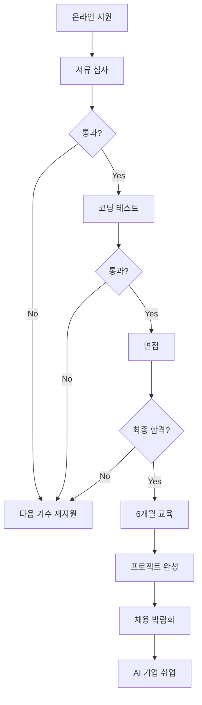

**AI 사관학교 준비 전략**:

**대학 1~2학년**:
- Python 기초 학습
- 수학 기초 다지기 (선형대수, 미적분)
- 머신러닝 입문 강의 수강 (Coursera, edX)

**지원 3개월 전**:
- 코딩 테스트 준비 (백준, 프로그래머스)
- 포트폴리오 준비 (GitHub에 프로젝트 2~3개)
- 자기소개서 작성 (AI 관심 분야, 학습 계획)

**교육 중**:
- 출석률 80% 이상 유지 (학습 지원금 수령 조건)
- 팀 프로젝트 적극 참여
- 기업 멘토링 활용
- 네트워킹 (동기, 멘토, 기업 관계자)

**AI 사관학교 졸업 후 진로**:
- AI 스타트업 (연봉 4,000~6,000만원)
- 대기업 AI 부서 (연봉 5,000~7,000만원)
- AI 연구소 (연봉 4,500~6,500만원)
- 대학원 진학 (AI 전공)

**AI 사관학교 공식 사이트**: [https://www.iitp.kr/](https://www.iitp.kr/) (정보통신기획평가원)

---

### 19-5. 삼성 멀티캠퍼스 완전 가이드

**삼성 멀티캠퍼스란?**

삼성 멀티캠퍼스는 **삼성그룹 계열 IT 교육기관**으로, 다양한 IT·AI 교육 과정을 운영합니다. 일부 과정은 무료이며, 취업 연계 프로그램이 강점입니다.

**삼성 멀티캠퍼스의 특징**:
- `다양한 과정`: 웹 개발, 앱 개발, AI, 데이터 분석, 클라우드 등
- `무료 과정`: 청년 취업 지원 과정 (국비 지원)
- `유료 과정`: 직장인 대상 심화 과정
- `취업 연계`: 삼성 계열사 및 협력사 채용 연계

**주요 교육 과정**:

1. **청년 취업 아카데미 (무료)**
   - 대상: 미취업 청년 (만 34세 이하)
   - 기간: 3~6개월
   - 지원금: 월 최대 116만원 (출석률 80% 이상)
   - 과정: 풀스택 개발, 데이터 분석, AI 등

2. **삼성 청년 SW 아카데미 (SSAFY) (무료)**
   - 대상: 대학 졸업 예정자, 졸업자 (만 29세 이하)
   - 기간: 12개월 (1년)
   - 지원금: 월 100만원
   - 과정: 웹 개발, 모바일 개발, 알고리즘
    [https://www.youtube.com/watch?v=piL6PbEEgPE&t=10s]


3. **AI 전문가 양성 과정 (무료)**
   - 대상: 대학 졸업자, 취업 준비생
   - 기간: 6개월
   - 지원금: 월 100만원
   - 과정: 머신러닝, 딥러닝, 자연어 처리

**삼성 청년 SW 아카데미 (SSAFY) 상세**:

SSAFY는 삼성 멀티캠퍼스의 대표 프로그램으로, **1년간 무료 교육 + 월 100만원 지원금**을 제공합니다.

**SSAFY 교육 과정**:

1. **1학기 (6개월): 기초**
   - Python, Java 프로그래밍
   - 알고리즘, 자료구조
   - 웹 개발 기초 (HTML, CSS, JavaScript)
   - 데이터베이스 (SQL)

2. **2학기 (6개월): 심화 + 프로젝트**
   - 웹 프레임워크 (Spring, React)
   - 모바일 개발 (Android, iOS)
   - 팀 프로젝트 2개 (각 2개월)
   - 취업 준비 (이력서, 면접)

**SSAFY 지원 자격**:
- 대학 졸업 예정자 (4학년)
- 대학 졸업자 (졸업 후 2년 이내)
- 만 29세 이하
- 전공 무관 (코딩 기초 필수)

**SSAFY 지원 절차**:

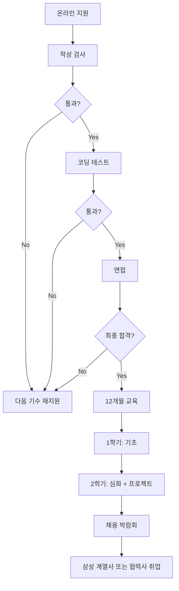

**SSAFY 준비 전략**:

**대학 3~4학년**:
- Python 또는 Java 기초 학습
- 알고리즘 문제 풀이 (백준 실버 수준)
- 작은 웹 프로젝트 1개 완성

**지원 3개월 전**:
- 적성 검사 준비 (논리, 수리, 언어)
- 코딩 테스트 준비 (알고리즘 문제 100개 이상)
- 포트폴리오 정리 (GitHub)

**교육 중**:
- 출석률 80% 이상 유지 (지원금 수령 조건)
- 팀 프로젝트 적극 참여
- 네트워킹 (동기, 멘토, 기업 관계자)
- 취업 준비 (이력서, 면접)

**SSAFY 졸업 후 진로**:
- 삼성 계열사 (연봉 4,500~6,000만원)
- 협력사 (연봉 4,000~5,500만원)
- IT 스타트업 (연봉 3,500~5,000만원)
- 프리랜서 개발자

**삼성 멀티캠퍼스 공식 사이트**: [https://www.multicampus.com/](https://www.multicampus.com/)
**SSAFY 공식 사이트**: [https://www.ssafy.com/](https://www.ssafy.com/)

---

### 19-6. 기타 특수 교육기관

**네이버 부스트캠프**:
- 대상: 대학생, 졸업자
- 기간: 5개월
- 학비: 무료
- 지원금: 없음
- 특징: 웹 개발, AI 과정
- 사이트: [https://boostcamp.connect.or.kr/](https://boostcamp.connect.or.kr/)

**우아한테크코스**:
- 대상: 대학생, 졸업자
- 기간: 10개월
- 학비: 무료
- 지원금: 월 100만원
- 특징: 백엔드 개발 중심, 우아한형제들 취업 연계
- 사이트: [https://woowacourse.github.io/](https://woowacourse.github.io/)

**카카오 클라우드 스쿨**:
- 대상: 대학생, 졸업자
- 기간: 6개월
- 학비: 무료
- 지원금: 월 100만원
- 특징: 클라우드 개발 중심
- 사이트: [https://kakaocloud-school.com/](https://kakaocloud-school.com/)

**LG Aimers**:
- 대상: 대학생 (전공 무관)
- 기간: 3개월
- 학비: 무료
- 지원금: 없음
- 특징: AI 해커톤, LG 취업 연계
- 사이트: [https://www.lgaimers.ai/](https://www.lgaimers.ai/)

---

### 19-7. 특수 교육기관 선택 가이드

**어떤 기관을 선택해야 할까?**

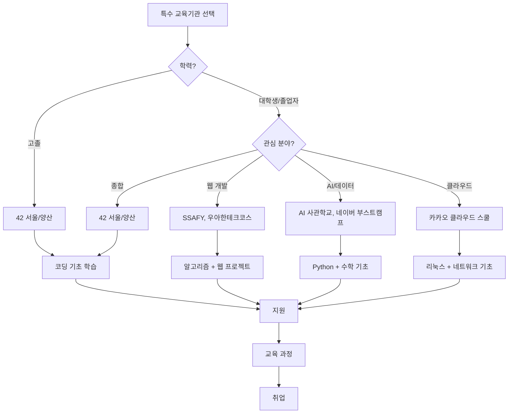

**선택 기준표**:

| 기관 | 학력 | 기간 | 지원금 | 난이도 | 취업률 | 추천 대상 |
|------|------|------|--------|--------|--------|----------|
| 42 서울/양산 | 고졸 이상 | 18~24개월 | 없음 | 상 | 80% | 고졸, 자기주도 학습 가능자 |
| AI 사관학교 | 대학생 이상 | 6개월 | 월 100만원 | 중상 | 85% | AI 관심자, 수학 기초 있는 자 |
| SSAFY | 대졸 예정/졸업자 | 12개월 | 월 100만원 | 중 | 90% | 웹 개발 관심자, 안정적 취업 원하는 자 |
| 네이버 부스트캠프 | 대학생 이상 | 5개월 | 없음 | 중상 | 75% | 네이버 취업 희망자 |
| 우아한테크코스 | 대학생 이상 | 10개월 | 월 100만원 | 상 | 95% | 백엔드 개발 심화, 우아한형제들 취업 희망자 |

---

### 19-8. 특수 교육기관 vs 대학 vs 대학원 비교

**시간 비교**:
- 특수 교육기관: 6개월~2년 → 빠른 취업
- 대학 (4년제): 4년 → 학위 취득 후 취업
- 대학원 (석사): 6년 (학부 4년 + 석사 2년) → 연구직 또는 고급 개발자

**비용 비교**:
- 특수 교육기관: 무료 + 지원금 (월 100만원)
- 대학: 연 600~800만원 × 4년 = 2,400~3,200만원
- 대학원: 학부 비용 + 석사 비용 (국립대 무료, 사립대 연 800~1,000만원)

**취업 비교**:
- 특수 교육기관: 스타트업·중견기업 유리, 대기업 불리
- 대학: 대기업·공기업 유리, 학벌 중요
- 대학원: 연구직·고급 개발자 유리, 학력 최고

**추천 시나리오**:

1. **빠른 취업 + 비용 절감**: 특수 교육기관 (42, SSAFY 등)
2. **안정적 학위 + 네트워크**: 대학 (4년제)
3. **연구 또는 고급 개발자**: 대학원 (석사 이상)
4. **대학 + 특수 교육기관**: 대학 졸업 후 SSAFY 또는 AI 사관학교 (추천)

---

### 19-9. 특수 교육기관 합격 전략 총정리

**고등학생 (고1~고3)**:
- 코딩 기초 학습 (Python 또는 C)
- 알고리즘 문제 풀이 (백준 브론즈~실버)
- 작은 프로젝트 1~2개 완성
- 42 서울/양산 목표 시 La Piscine 준비

**대학생 (1~2학년)**:
- 전공 기초 다지기 (자료구조, 알고리즘)
- 프로젝트 2~3개 완성 (GitHub 공개)
- 코딩 테스트 준비 (백준 실버~골드)
- SSAFY, 네이버 부스트캠프 목표 설정

**대학생 (3~4학년) 또는 졸업자**:
- 포트폴리오 완성 (GitHub, 블로그)
- 코딩 테스트 고급 (백준 골드 이상)
- AI 관심 시 수학 기초 (선형대수, 미적분)
- AI 사관학교, SSAFY, 우아한테크코스 지원

**지원 시 공통 전략**:
- 자기소개서: 학습 동기 + 프로젝트 경험 + 향후 계획
- 포트폴리오: GitHub에 프로젝트 2~3개 공개
- 코딩 테스트: 알고리즘 문제 100개 이상 풀이
- 면접: 프로젝트 설명 연습 + 기술 질문 대비

---

### 19-10. 특수 교육기관 졸업 후 커리어 패스

**1~3년차: 주니어 개발자**
- 연봉: 3,500~5,000만원
- 역할: 기능 개발, 버그 수정
- 목표: 기술 스택 확장, 프로젝트 경험 축적

**3~5년차: 시니어 개발자**
- 연봉: 5,000~8,000만원
- 역할: 아키텍처 설계, 팀 리드
- 목표: 기술 리더십, 멘토링

**5년차 이상: 선택지**
- 기술 전문가 (Staff Engineer): 연봉 8,000~1억 2,000만원
- 관리자 (Engineering Manager): 연봉 8,000~1억 5,000만원
- 창업 (Startup Founder): 수익 변동
- 프리랜서 (Freelancer): 프로젝트당 500~3,000만원

**커리어 패스 구조도**:

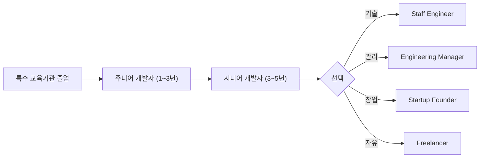

---

## 20) 최종 비교: 대학 vs 특수 교육기관 vs 해외 유학

### 20-1. 3가지 경로 비교표

| 항목 | 대학 (4년제) | 특수 교육기관 | 해외 유학 |
|------|-------------|--------------|----------|
| 기간 | 4년 | 6개월~2년 | 4년 (학부) |
| 비용 | 2,400~3,200만원 | 무료 (일부 지원금) | 2억~4억원 |
| 학위 | 학사 | 없음 (일부 수료증) | 학사 |
| 취업 | 대기업·공기업 유리 | 스타트업·중견기업 유리 | 글로벌 기업 유리 |
| 네트워크 | 국내 동문 | 동기·멘토 | 글로벌 네트워크 |
| 언어 | 한국어 | 한국어 | 영어 |
| 난이도 | 중 | 중상 | 상 |

### 20-2. 선택 가이드

**대학을 선택해야 하는 경우**:
- 안정적인 학위가 필요한 경우
- 대기업·공기업 취업을 목표로 하는 경우
- 학벌이 중요한 분야 (금융, 법률 등)
- 시간 여유가 있는 경우

**특수 교육기관을 선택해야 하는 경우**:
- 빠른 취업이 필요한 경우
- 학비 부담을 줄이고 싶은 경우
- IT·AI 분야에 명확한 관심이 있는 경우
- 프로젝트 기반 학습을 선호하는 경우

**해외 유학을 선택해야 하는 경우**:
- 글로벌 커리어를 목표로 하는 경우
- 영어 능력이 뛰어난 경우
- 경제적 여유가 있는 경우
- 해외 취업 또는 이민을 고려하는 경우

---

## 21) 상편으로 돌아가기

- [2026_2028_대입_학종_교과_비중_및_수상_논문_대회활동_영향_정리_상.md](./2026_2028_대입_학종_교과_비중_및_수상_논문_대회활동_영향_정리_상.md)
