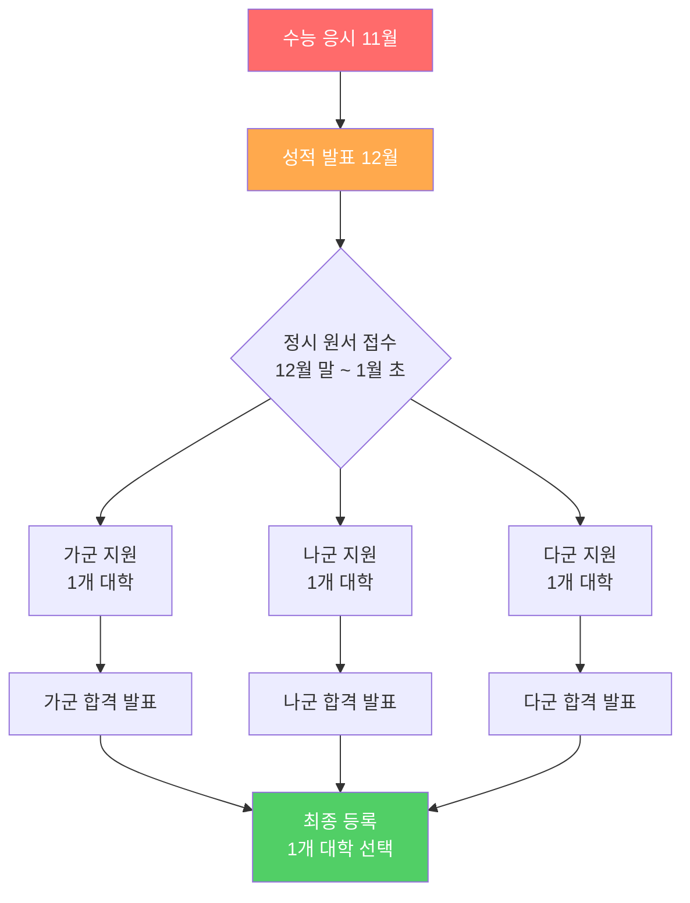
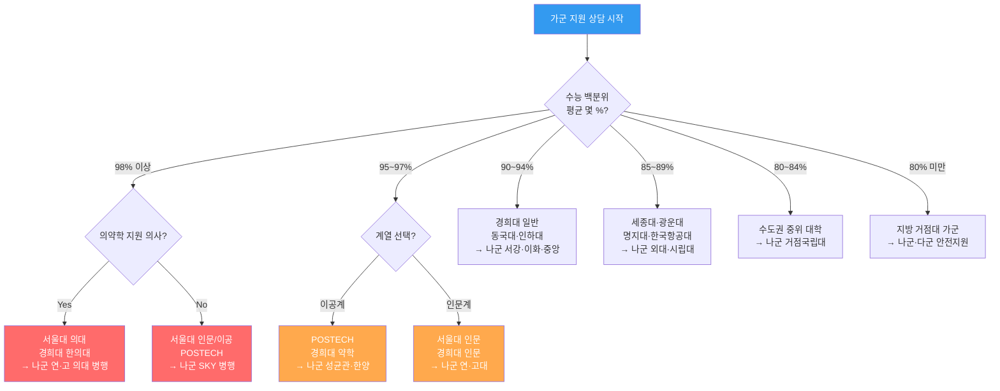
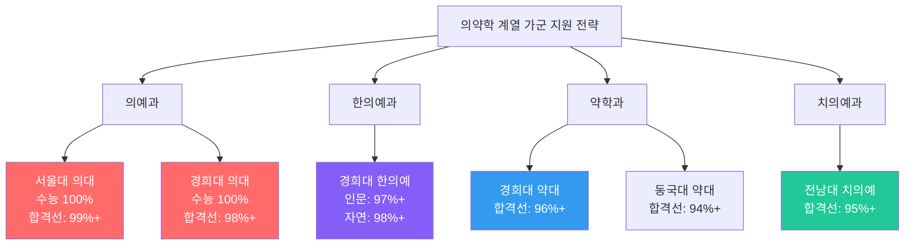
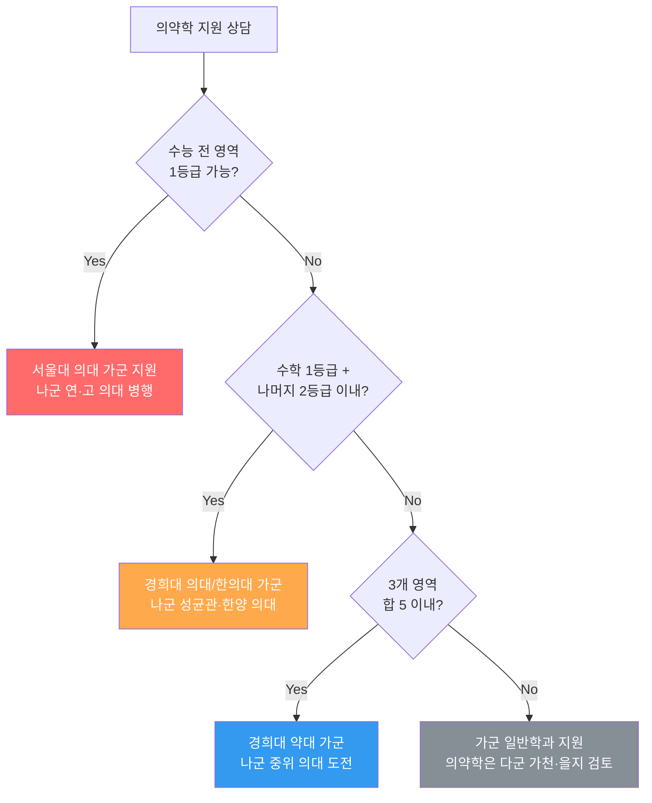
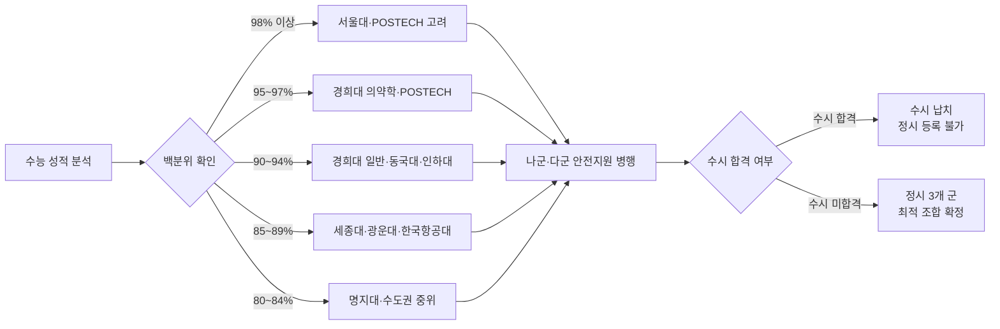
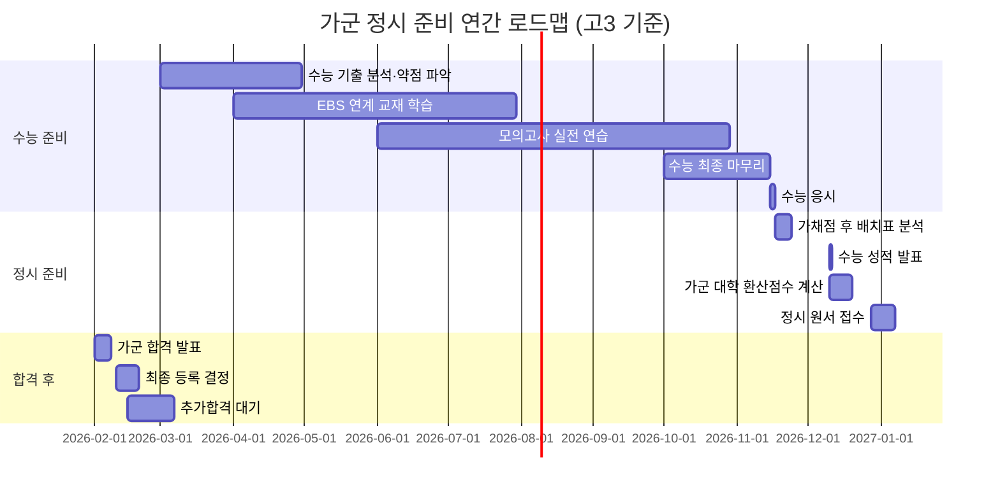
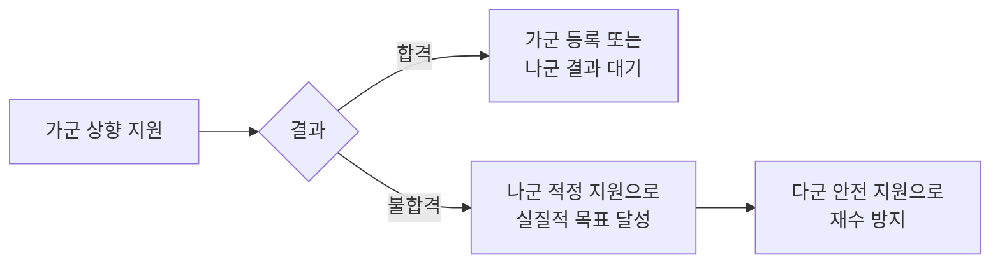
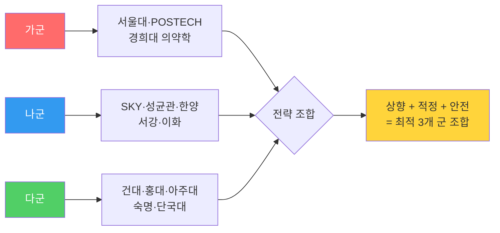
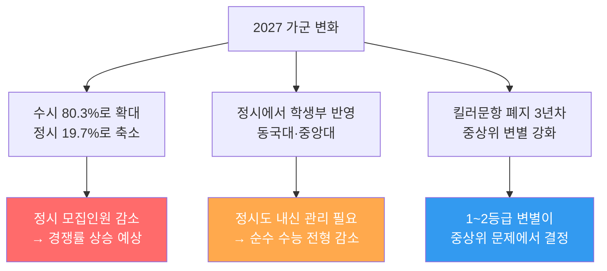
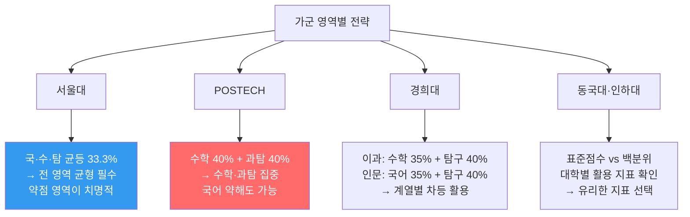

# 국내 대학 입시제도 — 가군 (정시모집 가군)

> **정시 가군**은 수능 성적 위주로 선발하는 정시모집의 첫 번째 그룹입니다.
> 학생은 가·나·다군에서 각 1회씩, 총 3회 지원 가능합니다.

---

## 정시 가군 지원 구조도

---

## 학생 상담용 — 성적 구간별 지원 의사결정 트리

---

## 가군 주요 대학 현황표 (확장판)

| 순위 | 대학명 | 계열 | 주요 전형 | 수능 반영 비율 | 2025 경쟁률 | 합격선(백분위) | 특이사항 |
|------|--------|------|-----------|--------------|------------|--------------|---------|
| 1 | **서울대학교** | 전 계열 | 일반전형(정시) | 수능 100% | 2.5~3.5:1 | 97~99% | 2단계: 서류 포함 |
| 2 | **포항공과대학교(POSTECH)** | 이공계 | 일반전형 | 수능 100% | 3.0~4.0:1 | 96~99% | 수학·과탐 비중 높음 |
| 3 | **경희대학교** | 인문·이공·예체능 | 일반전형(가) | 수능 100% | 4.0~8.0:1 | 85~99% | 의대·한의대 가군 |
| 4 | **동국대학교** | 인문·이공 | 정시 일반(가) | 수능 100% | 5.0~7.0:1 | 82~92% | 불교계열 특수 |
| 5 | **인하대학교** | 인문·이공 | 일반전형(가) | 수능 100% | 4.5~6.5:1 | 80~90% | 항공·공대 강세 |
| 6 | **세종대학교** | 인문·이공 | 일반전형(가) | 수능 100% | 5.0~7.0:1 | 78~88% | 호텔관광·SW 특화 |
| 7 | **광운대학교** | 이공계 | 일반전형 | 수능 100% | 5.5~7.5:1 | 76~86% | SW·전자 특화 |
| 8 | **한국항공대학교** | 이공계 | 일반전형 | 수능 100% | 4.0~6.0:1 | 78~88% | 항공우주 특화 |
| 9 | **서울여자대학교** | 인문·이공 | 일반전형 | 수능 100% | 4.0~5.5:1 | 72~82% | |
| 10 | **명지대학교** | 인문·이공 | 일반전형(가) | 수능 100% | 4.5~6.0:1 | 70~80% | |

> ※ 가군 배치는 매년 변경될 수 있으므로 반드시 해당 연도 모집요강 확인 필요

---

## 가군 수능 반영 영역 비교표 (상세)

| 대학 | 국어 | 수학 | 영어 | 탐구 | 한국사 | 활용 지표 | 비고 |
|------|------|------|------|------|--------|---------|------|
| 서울대 | 33.3% | 33.3% | 등급제 | 33.3% | 감점 | 표준점수 | 영어 1→0점, 2→-1점 |
| POSTECH | 20% | 40% | 등급제 | 40% | 감점 | 표준점수 | 수학·과탐 우선 |
| 경희대(이) | 25% | 35% | 등급제 | 40% | 감점 | 표준점수 | 과탐 2과목 |
| 경희대(인) | 35% | 25% | 등급제 | 40% | 감점 | 표준점수 | 사탐 2과목 |
| 동국대(이) | 25% | 35% | 등급제 | 40% | 감점 | 백분위 | |
| 동국대(인) | 35% | 25% | 등급제 | 40% | 감점 | 백분위 | |
| 인하대(이) | 25% | 35% | 등급제 | 40% | 감점 | 표준점수 | |
| 인하대(인) | 30% | 25% | 등급제 | 45% | 감점 | 표준점수 | |
| 세종대 | 30% | 30% | 등급제 | 40% | 감점 | 백분위 | |
| 광운대 | 25% | 35% | 등급제 | 40% | 감점 | 표준점수 | |

### 영어 등급별 환산점수 비교

| 등급 | 서울대 | 경희대 | 동국대 | 인하대 | 세종대 |
|------|--------|--------|--------|--------|--------|
| 1등급 | 0 (감점없음) | 100 | 100 | 100 | 100 |
| 2등급 | -1 | 96 | 95 | 96 | 95 |
| 3등급 | -3 | 90 | 88 | 90 | 88 |
| 4등급 | -5 | 82 | 78 | 82 | 78 |
| 5등급 | -7 | 72 | 66 | 72 | 66 |
| 6등급 | -9 | 60 | 54 | 60 | 54 |

---

## 가군 의약학 계열 집중 분석

### 의약학 계열 상세 입결 분석표

| 계열 | 대학(가군 배치) | 모집인원 | 수능 최저 기준 | 합격선(백분위) | 경쟁률 | 추합 비율 |
|------|----------------|---------|--------------|--------------|--------|---------|
| 의예과 | 서울대 | 약 45명 | 4개 영역 합 4 이내 | 99~99.5% | 2.5~3.5:1 | 50~100% |
| 의예과 | 경희대 | 약 40명 | 수학 1등급 필수 | 98~99% | 3.5~5.0:1 | 100~200% |
| 한의예과(인) | 경희대 | 약 30명 | 4개 영역 합 5 이내 | 97~98% | 4~7:1 | 150~250% |
| 한의예과(자) | 경희대 | 약 25명 | 4개 영역 합 5 이내 | 97.5~98.5% | 3.5~5.5:1 | 100~200% |
| 약학과 | 경희대 | 약 35명 | 3개 영역 합 4 이내 | 96~98% | 5~8:1 | 200~350% |
| 약학과 | 동국대 | 약 25명 | 3개 영역 합 5 이내 | 94~96% | 6~9:1 | 250~400% |
| 치의예과 | 전남대 | 약 20명 | 4개 영역 합 5 이내 | 95~97% | 4~6:1 | 150~250% |

### 의약학 상담 시나리오

---

## 학생 유형별 가군 상담 전략표

### 유형 1: 최상위권 학생 (백분위 98%+)

| 항목 | 전략 내용 |
|------|---------|
| **가군 목표** | 서울대 또는 POSTECH |
| **나군 병행** | 연세대·고려대 (안전지원) |
| **다군 병행** | 성균관대·한양대 분할 모집 (보험) |
| **핵심 포인트** | 서울대 2단계 서류 준비 필수 |
| **리스크** | 수시 납치 가능성 → 수시 6개 중 안전지원 확인 |
| **상담 질문** | "수시에서 안전지원 넣었나요? 수시 납치되면 정시 불가합니다" |

### 유형 2: 상위권 학생 (백분위 93~97%)

| 항목 | 전략 내용 |
|------|---------|
| **가군 목표** | 경희대 인기학과 또는 POSTECH 소신지원 |
| **나군 병행** | 성균관대·한양대·서강대 |
| **다군 병행** | 건국대·아주대 |
| **핵심 포인트** | 수능 반영 비율에 따라 유불리 분석 필수 |
| **리스크** | 가군 상향 실패 시 나군이 실질적 목표 |
| **상담 질문** | "수학 vs 탐구 어디가 강한가요? 반영 비율 맞춤 대학 찾겠습니다" |

### 유형 3: 중상위권 학생 (백분위 87~92%)

| 항목 | 전략 내용 |
|------|---------|
| **가군 목표** | 동국대·인하대·세종대 |
| **나군 병행** | 중앙대·외대·시립대 |
| **다군 병행** | 숭실대·국민대·단국대 |
| **핵심 포인트** | 가군에서 적정지원, 나군에서 소신 가능 |
| **리스크** | 경쟁률 변동에 민감한 구간 |
| **상담 질문** | "가군 적정, 나군 소신, 다군 안전 — 3단계 조합 만들겠습니다" |

### 유형 4: 중위권 학생 (백분위 80~86%)

| 항목 | 전략 내용 |
|------|---------|
| **가군 목표** | 광운대·명지대·한국항공대 |
| **나군 병행** | 거점 국립대 (부산대·경북대·충남대) |
| **다군 병행** | 경기대·수도권 중위 대학 |
| **핵심 포인트** | 학과 선택이 대학 선택보다 중요한 구간 |
| **리스크** | 재수 vs 현역 진학 의사결정 필요 |
| **상담 질문** | "대학 이름 vs 학과 적성, 어느 쪽이 더 중요한가요?" |

---

## 가군 지원 전략 플로우 (상세)

---

## 가군 주요 학과별 수능 최저 기준 (상세)

| 학과 계열 | 인문 일반 | 이공 일반 | 의약학 | 예체능 | 교육계열 |
|----------|---------|---------|--------|--------|---------|
| 수능 활용 방식 | 국·수·영·탐 | 수·과탐 비중↑ | 전 영역 최상위 | 실기 병행 | 국·수·영·탐 |
| 영어 반영 | 등급 환산 | 등급 환산 | 등급 환산 | 등급 환산 | 등급 환산 |
| 탐구 반영 | 사탐 2과목 평균 | 과탐 2과목 평균 | 과탐 2과목 합 | 선택 과목 | 2과목 평균 |
| 한국사 | 감점 | 감점 | 감점 | 감점 | 감점 |
| 합격선 범위 | 80~95% | 82~97% | 95~99.5% | 별도 | 85~93% |

---

## 가군 월별 준비 로드맵

---

## 상담 시 자주 묻는 질문 (FAQ)

### Q1. "가군에서 상향 지원하고 싶은데, 떨어지면 어떡하죠?"

> **상담 포인트**: "가군 상향은 나군·다군이 탄탄할 때만 추천합니다. 3개 군 전체를 하나의 전략으로 봐야 합니다."

### Q2. "서울대 가군이랑 연세대 나군, 둘 다 지원 가능한가요?"

> **답변**: 가능합니다. 가·나·다군은 각각 1개씩 지원하므로, 서울대(가) + 연세대(나) + 건국대(다) 같은 조합이 가능합니다. 단, 수시에서 합격하면 정시 지원 자체가 불가능합니다.

### Q3. "수시 납치가 뭔가요?"

> **답변**: 수시에서 합격한 학생은 정시에 지원할 수 없습니다. 수시 6개 중 안전지원을 넣었다면, 그 대학에 합격 시 정시 기회를 잃게 됩니다. 이를 "수시 납치"라고 합니다.

### Q4. "추가합격(추합)은 얼마나 기대할 수 있나요?"

| 대학 | 추합 비율 (평균) | 추합 기간 | 비고 |
|------|---------------|---------|------|
| 서울대 | 50~100% | 2~3주 | 의대 추합 적음 |
| 경희대 | 100~300% | 3~4주 | 의약학 추합 많음 |
| 동국대 | 200~400% | 3~4주 | 인문계 추합 많음 |
| 인하대 | 150~300% | 3~4주 | 공대 추합 보통 |

---

## 가군 합격 사례 시나리오 (상담용)

### 사례 1: 서울대 경영학과 합격

| 항목 | 내용 |
|------|------|
| **수능 성적** | 국어 1등급(131) / 수학 1등급(137) / 영어 1등급 / 사탐 1등급(68+67) |
| **백분위** | 평균 98.7% |
| **가군 지원** | 서울대 경영학과 |
| **나군 지원** | 연세대 경영학과 (안전) |
| **다군 지원** | 성균관대 경영학과 (보험) |
| **결과** | 서울대 최초합 → 서울대 등록 |
| **핵심 전략** | 수능 전 영역 1등급 확보, 서류 준비 병행 |

### 사례 2: 경희대 한의예과 합격

| 항목 | 내용 |
|------|------|
| **수능 성적** | 국어 1등급(128) / 수학 2등급(130) / 영어 1등급 / 과탐 1등급(66+65) |
| **백분위** | 평균 97.2% |
| **가군 지원** | 경희대 한의예과(자연) |
| **나군 지원** | 한양대 의예과 (상향) |
| **다군 지원** | 아주대 의예과 (안전) |
| **결과** | 경희대 추합 3순위 합격 |
| **핵심 전략** | 가군 적정, 나군 상향, 다군 안전의 3단계 조합 |

### 사례 3: 인하대 컴퓨터공학과 합격

| 항목 | 내용 |
|------|------|
| **수능 성적** | 국어 3등급(115) / 수학 2등급(128) / 영어 2등급 / 과탐 2등급(62+60) |
| **백분위** | 평균 88.5% |
| **가군 지원** | 인하대 컴퓨터공학과 |
| **나군 지원** | 중앙대 소프트웨어학부 (소신) |
| **다군 지원** | 숭실대 컴퓨터학부 (안전) |
| **결과** | 인하대 최초합 합격 |
| **핵심 전략** | 수학·과탐 반영 비율 높은 대학 선택 |

---

## 가군 전략 수립 체크리스트 (상담사용)

### 수능 전 체크리스트
- [ ] 6월·9월 모의고사 기준 가군 목표 대학 설정
- [ ] 수능 영역별 강약점 분석 → 유리한 반영 비율 대학 탐색
- [ ] 수시 6개 지원 시 수시 납치 가능성 사전 점검
- [ ] 의약학 지원 시 수능 최저 기준 사전 확인

### 수능 후 체크리스트
- [ ] 수능 가채점 기준 백분위 산출
- [ ] 가군 대학 모집요강 확인 (해당 연도)
- [ ] 수능 영역별 반영 비율 적용 환산점수 계산
- [ ] 전년도 합격자 평균·최저 백분위 비교
- [ ] 나군·다군 안전 지원 대학 동시 검토
- [ ] 추가합격(추합) 가능성 분석
- [ ] 수시 최초합·충원합격 여부 확인 (수시 납치 대비)

### 합격 후 체크리스트
- [ ] 가·나·다군 합격 결과 비교 후 최종 등록 결정
- [ ] 추합 대기 시 등록금 납부 기한 확인
- [ ] 등록 포기 시 환불 절차 확인

---

## 가군 vs 나군 vs 다군 비교 요약

| 구분 | 가군 | 나군 | 다군 |
|------|------|------|------|
| **역할** | 상향 도전 or 의약학 | 핵심 목표 대학 | 안전 보험 |
| **대표 대학** | 서울대·POSTECH·경희대 | 연·고·성·한·서강 | 건대·홍대·아주대 |
| **입결 범위** | 80~99.5% | 85~99% | 70~97% |
| **추합 비율** | 보통 | 높음 | 매우 높음 |
| **전략 핵심** | 나군이 탄탄해야 상향 가능 | 실질적 진학 대학 | 재수 방지 안전망 |

---

## 2027~2028 입시 변화에 따른 가군 새 전략

### 2027학년도 가군 영향 분석

| 변화 | 가군 영향 | 대응 전략 |
|------|---------|---------|
| 정시 비율 축소 | 가군 경쟁률 소폭 상승 | 수시와 정시 투트랙 준비 |
| 학생부 반영 확대 | 동국대 정시에서 학생부 반영 | 내신도 포기하지 말 것 |
| 킬러문항 폐지 | 1~3등급 간 점수 차이 축소 | 실수 줄이기가 최우선 |
| 무전공 선발 확대 | 합격선 변동 가능 | 무전공 vs 학과 직접 비교 |

### 2028 수능 대비 — 가군 선제 전략

| 현행 (2027 수능) | 2028 수능 | 가군 영향 |
|------------|---------|---------|
| 과탐 선택과목 2개 | 통합과학 (전원 동일) | POSTECH 반영 방식 변경 예상 |
| 사탐 선택과목 2개 | 통합사회 (전원 동일) | 서울대 인문 반영 방식 변경 예상 |
| 선택과목 유불리 | 유불리 해소 | 공정한 경쟁 환경 |
| 킬러문항 폐지 | 융합형 문항 | 통합적 사고력 필요 |

> **상담 포인트**: "2028 수능부터 선택과목이 사라집니다. 현 고2는 통합사회·통합과학을 고1 때 배운 내용부터 다시 복습해야 합니다."

---

## 추가 합격 사례 시나리오

### 사례 4: 서울대 컴퓨터공학부 합격 (수시 납치 방지 성공)

| 항목 | 내용 |
|------|------|
| **수능 성적** | 국어 1등급(132) / 수학 1등급(139) / 영어 1등급 / 과탐 1등급(69+67) |
| **백분위** | 평균 99.1% |
| **내신** | 2.3등급 (수시 불리) |
| **수시 전략** | 6개 모두 상향 지원 → 전부 불합격 (의도적) |
| **가군** | 서울대 컴퓨터공학부 (합격) |
| **나군** | 연세대 컴퓨터과학 (안전) |
| **다군** | 성균관대 소프트웨어 (보험) |
| **핵심 전략** | 내신이 약해 수시 불리 → 수시 6개 상향으로 납치 방지 → 정시 집중 |
| **상담 포인트** | "내신이 약하면 수시를 포기하는 것이 아니라, 전부 상향 지원해서 납치를 방지하세요" |

### 사례 5: 경희대 약학과 합격 (수학 강점 활용)

| 항목 | 내용 |
|------|------|
| **수능 성적** | 국어 2등급(123) / 수학 1등급(136) / 영어 1등급 / 과탐 1등급(66+65) |
| **백분위** | 평균 96.8% |
| **가군** | 경희대 약학과 (추합 5순위 합격) |
| **나군** | 한양대 화학공학 (합격 — 미등록) |
| **다군** | 아주대 약학과 (합격 — 미등록) |
| **핵심 전략** | 수학 35% 반영 대학 선택 → 수학 강점 극대화 |
| **점수 분석** | 국어 약점(2등급)을 수학·과탐 강점으로 상쇄. 경희대 약대는 수학 35% + 과탐 40% = 75%가 이과 과목 |

### 사례 6: POSTECH 합격 (과탐 만점 전략)

| 항목 | 내용 |
|------|------|
| **수능 성적** | 국어 3등급(112) / 수학 1등급(138) / 영어 2등급 / 과탐 1등급(70+68) |
| **백분위** | 평균 96.2% |
| **가군** | POSTECH (합격) |
| **핵심 전략** | POSTECH은 수학 40% + 과탐 40% = 80%가 이과 과목. 국어·영어가 약해도 수학·과탐이 만점급이면 합격 가능 |
| **점수 분석** | 국어 3등급이지만 반영 비율 20%로 영향 최소화. 수학+과탐에서 압도적 점수 확보 |

### 사례 7: 동국대 경찰행정학과 합격 (2027 학생부 반영 대비)

| 항목 | 내용 |
|------|------|
| **수능 성적** | 국어 2등급(121) / 수학 3등급(118) / 영어 2등급 / 사탐 2등급(63+61) |
| **백분위** | 평균 85.7% |
| **내신** | 3.2등급 |
| **가군** | 동국대 경찰행정학과 (합격) |
| **핵심 전략** | 2027부터 동국대 정시에서 학생부 반영 → 내신 3등급이 가산점 역할 |
| **상담 포인트** | "정시에서도 내신이 반영되는 대학이 늘고 있습니다. 내신을 완전히 포기하지 마세요" |

---

## 영역별 점수 올리기 전략 (가군 특화)

### 가군 대학별 유리한 영역 분석

### 수학 등급별 올리기 전략

| 현재 등급 | 목표 | 기간 | 핵심 전략 | 추천 교재 |
|---------|------|------|---------|---------|
| 5등급 → 3등급 | 기본 개념 완성 | 6개월 | 교과서 예제 + 수학의 정석 기본 | 수학의 정석, 개념원리 |
| 3등급 → 2등급 | 유형별 풀이 | 3~4개월 | 기출 유형 분류 + 반복 풀이 | 마플, 쎈 |
| 2등급 → 1등급 | 실수 제로 | 3~4개월 | 시간 관리 + 고난도 3~4문제 | 블랙라벨, 기출 |
| 3등급 → 1등급 | 종합 | 8~12개월 | 개념 → 유형 → 실전 순서 | 단계별 교재 |

### 탐구 과목 선택 & 고득점 전략

| 과탐 조합 | 난이도 | 1등급 비율 | 추천 학생 | 가군 유리 대학 |
|---------|--------|---------|---------|------------|
| 물리+화학 | 매우 어려움 | 4~5% | 수학 강한 이과 | POSTECH, 서울대 이공 |
| 화학+생물 | 어려움 | 5~6% | 의약학 지원 | 경희대 의약학 |
| 생물+지구과학 | 보통 | 6~7% | 생명과학 지원 | 동국대, 인하대 |
| 물리+지구과학 | 보통 | 5~6% | 공학 지원 | POSTECH, 인하대 |

| 사탐 조합 | 난이도 | 1등급 비율 | 추천 학생 | 가군 유리 대학 |
|---------|--------|---------|---------|------------|
| 생활과윤리+사회문화 | 쉬움 | 7~8% | 암기 강한 인문 | 서울대 인문, 경희대 인문 |
| 한국지리+세계지리 | 보통 | 5~6% | 지리 관심 | 동국대 인문 |
| 윤리와사상+정치와법 | 어려움 | 4~5% | 법학·정치 지원 | 서울대 사회과학 |

---

## 관련 링크

| 기관 | URL | 활용 목적 |
|------|-----|---------|
| 대학어디가 | www.adiga.kr | 대학별 모집요강·합격자 현황 |
| 수능성적 배치표 | 각 학원 배치표 | 수능 후 지원 참고 |
| 입시결과 공시 | 각 대학 입학처 | 전년도 합격선 확인 |
| 진학사 | www.jinhak.com | 합격예측·배치표 |
| 유웨이 | www.uway.com | 정시 합격예측 |
| 메가스터디 | www.megastudy.net | 수능 분석·배치표 |

---

> 작성일: 2026년 2월 | 다음 파일: [나군 대학 입시](국내_나군_대학_입시.md)
