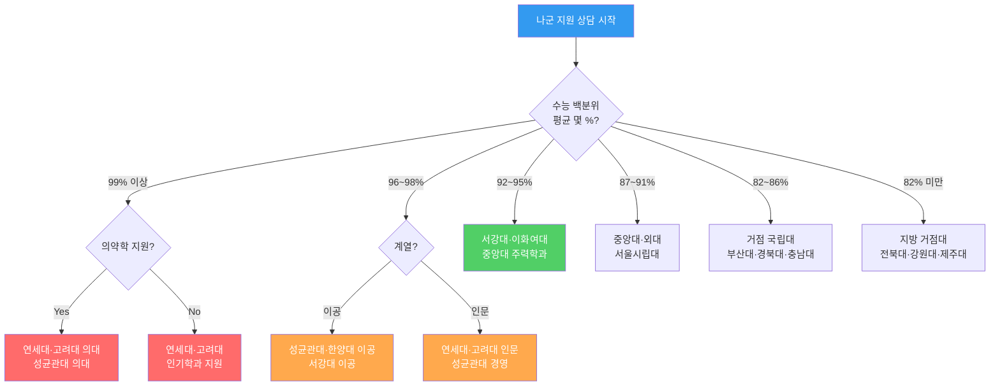
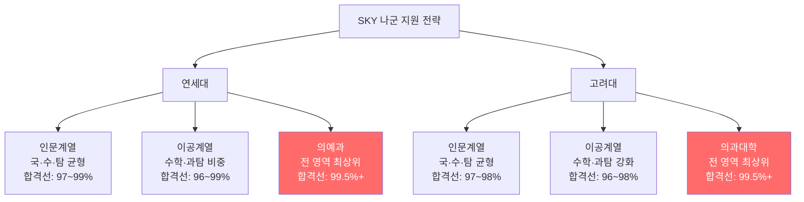
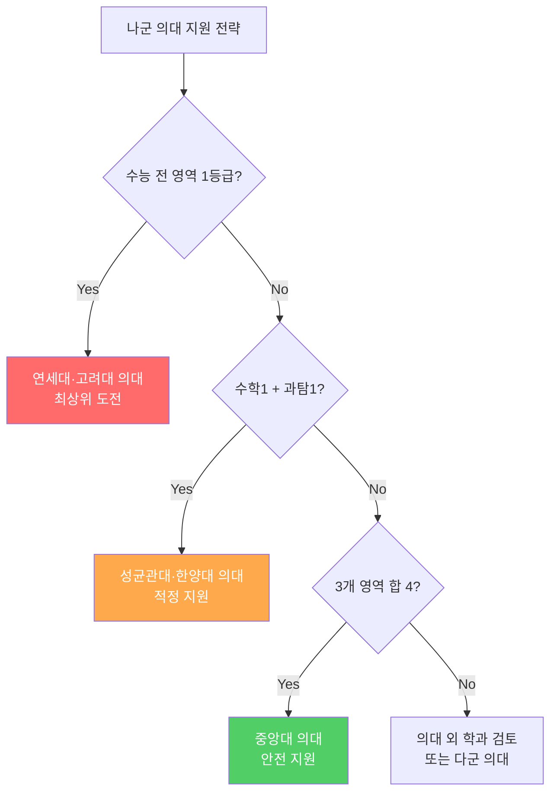
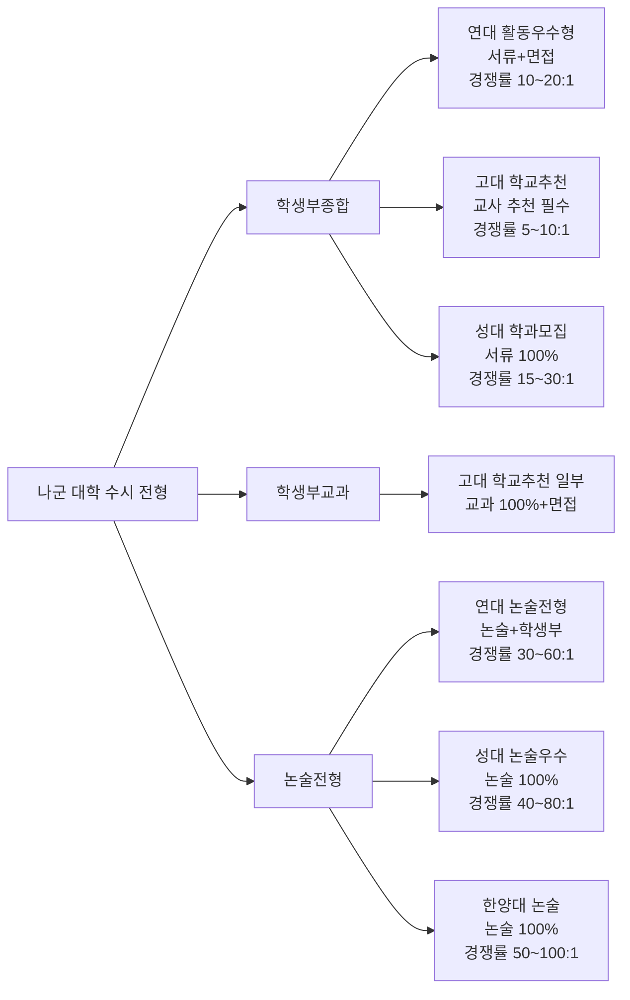
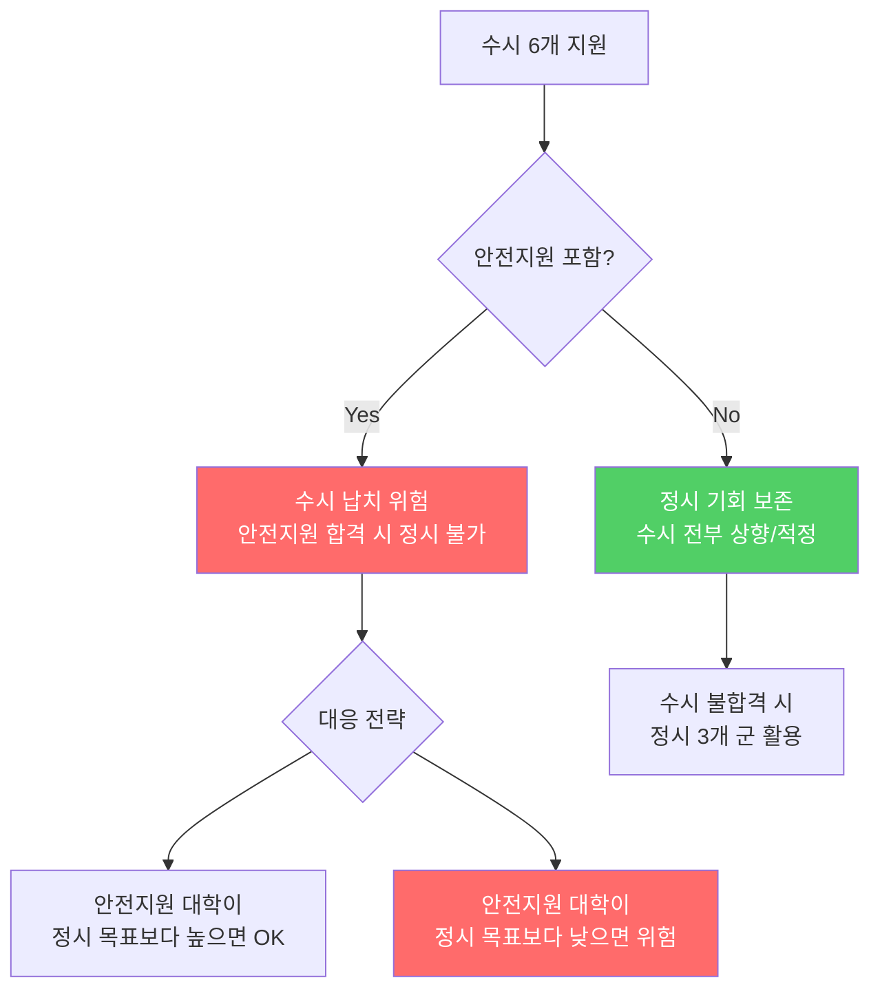
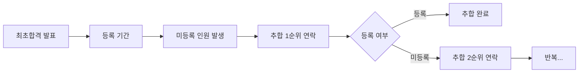
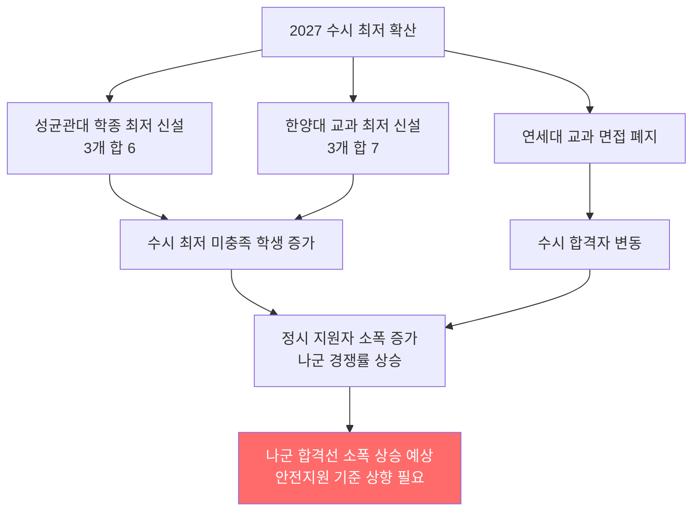

# 국내 대학 입시제도 — 나군 (정시모집 나군)

> **정시 나군**은 최상위 SKY 대학 및 서울 주요 대학이 대거 포진된 핵심 군입니다.
> 가군 지원 후 나군에서 상향·적정·안전을 조합하는 것이 일반적인 전략입니다.

---

## 나군 지원 전략 의사결정 트리 (상담용)

---

## 나군 주요 대학 현황표 (서울권 확장)

| 순위 | 대학명 | 약칭 | 주요 전형 | 수능 반영 | 2025 경쟁률 | 합격선(백분위) | 특이사항 |
|------|--------|------|-----------|----------|------------|--------------|---------|
| 1 | **연세대학교** | 연대 | 일반전형 | 수능 100% | 3.0~4.5:1 | 96~99% | 전 계열 나군 배치 |
| 2 | **고려대학교** | 고대 | 일반전형 | 수능 100% | 3.0~4.5:1 | 96~99% | 논술 없음, 수능 순수 반영 |
| 3 | **성균관대학교** | 성대 | 일반전형 | 수능 100% | 4.0~6.0:1 | 93~98% | 글로벌·소프트웨어학부 강세 |
| 4 | **한양대학교** | 한대 | 일반전형 | 수능 100% | 4.0~6.0:1 | 92~97% | 공과대학 강세 |
| 5 | **서강대학교** | 서강 | 일반전형 | 수능 100% | 4.5~6.5:1 | 91~96% | 인문·경영·이공 균형 |
| 6 | **이화여자대학교** | 이화 | 일반전형 | 수능 100% | 3.5~5.5:1 | 89~95% | 여대 최상위 |
| 7 | **중앙대학교** | 중대 | 일반전형 | 수능 100% | 5.0~7.0:1 | 87~95% | 의대 나군 배치 |
| 8 | **한국외국어대학교** | 외대 | 일반전형 | 수능 100% | 5.0~7.0:1 | 85~93% | 어문계열 최강 |
| 9 | **서울시립대학교** | 시립대 | 일반전형 | 수능 100% | 4.5~6.5:1 | 85~93% | 국립 혜택, 낮은 등록금 |
| 10 | **숙명여자대학교** | 숙명 | 일반전형 | 수능 100% | 4.0~5.5:1 | 82~90% | 여대 강세 |

---

## 나군 주요 대학 수능 반영 영역 비교표 (상세)

| 대학 | 국어 | 수학 | 영어 | 탐구 | 제2외국어 | 활용 지표 | 비고 |
|------|------|------|------|------|---------|---------|------|
| 연세대(인) | 33.3% | 33.3% | 등급제 | 33.3% | - | 표준점수 | 영어 1→100점 환산 |
| 연세대(이) | 22.2% | 44.4% | 등급제 | 33.3% | - | 표준점수 | 수학 가중 |
| 고려대(인) | 33.3% | 33.3% | 등급제 | 33.3% | - | 표준점수 | 영어 1등급 가점 |
| 고려대(이) | 25% | 37.5% | 등급제 | 37.5% | - | 표준점수 | 수학·과탐 우선 |
| 성균관대(인) | 33% | 33% | 등급제 | 33% | - | 표준점수 | 계열별 차등 |
| 성균관대(이) | 20% | 40% | 등급제 | 40% | - | 표준점수 | 수학·과탐 우선 |
| 한양대(인) | 30% | 30% | 등급제 | 40% | - | 표준점수 | |
| 한양대(이) | 20% | 35% | 등급제 | 45% | - | 표준점수 | 이공계 수학 우선 |
| 서강대 | 36.4% | 36.4% | 등급제 | 27.3% | - | 표준점수 | 사탐/과탐 동일 |
| 이화여대(인) | 35% | 25% | 등급제 | 40% | - | 표준점수 | |
| 이화여대(이) | 25% | 35% | 등급제 | 40% | - | 표준점수 | |
| 중앙대 | 30% | 30% | 등급제 | 40% | - | 표준점수 | |
| 외대 | 45% | 25% | 등급제 | 30% | 5% | 표준점수 | 제2외국어 반영 |
| 서울시립대 | 30% | 35% | 등급제 | 35% | - | 표준점수 | |

### 영어 등급별 환산점수 비교 (나군 주요 대학)

| 등급 | 연세대 | 고려대 | 성균관대 | 한양대 | 서강대 | 중앙대 |
|------|--------|--------|---------|--------|--------|--------|
| 1등급 | 100 | 100 | 100 | 100 | 100 | 100 |
| 2등급 | 96 | 97 | 95 | 96 | 95 | 97 |
| 3등급 | 90 | 92 | 87.5 | 90 | 87.5 | 92 |
| 4등급 | 82 | 85 | 75 | 82 | 75 | 85 |
| 5등급 | 72 | 75 | 60 | 72 | 60 | 75 |

> **상담 포인트**: 영어 2등급이면 대부분 3~5점 손해. 영어 3등급부터 대학별 편차가 커지므로 유불리 분석 필수

---

## SKY 대학 나군 집중 분석

### SKY 학과별 입결 상세표

| 대학 | 학과 계열 | 대표 학과 | 합격선(백분위) | 경쟁률 | 추합 비율 |
|------|---------|---------|--------------|--------|---------|
| 연세대 | 의예과 | 의과대학 | 99.5%+ | 3~4:1 | 30~50% |
| 연세대 | 경영 | 경영학과 | 98~99% | 4~5:1 | 100~150% |
| 연세대 | 이공 상위 | 컴퓨터과학 | 97~98% | 4~6:1 | 150~200% |
| 연세대 | 이공 중위 | 화학공학 | 95~97% | 5~7:1 | 200~300% |
| 연세대 | 인문 상위 | 경제학과 | 97~98% | 4~5:1 | 100~200% |
| 연세대 | 인문 중위 | 사회학과 | 95~97% | 5~7:1 | 200~350% |
| 고려대 | 의과대학 | 의과대학 | 99.5%+ | 3~4:1 | 30~50% |
| 고려대 | 경영 | 경영학과 | 97~99% | 4~5:1 | 100~150% |
| 고려대 | 이공 상위 | 컴퓨터학과 | 96~98% | 5~6:1 | 150~250% |
| 고려대 | 이공 중위 | 전기전자 | 95~97% | 5~7:1 | 200~300% |
| 고려대 | 인문 상위 | 법학과 | 97~98% | 4~5:1 | 100~200% |
| 고려대 | 인문 중위 | 국어국문 | 94~96% | 6~8:1 | 250~400% |

### 연세대 vs 고려대 상세 비교

| 구분 | 연세대 | 고려대 |
|------|--------|--------|
| 정시 모집 규모 | 약 850명 | 약 900명 |
| 수능 반영 방식 | 표준점수 | 표준점수 |
| 영어 반영 | 환산 점수 (1등급 100점) | 환산 점수 (1등급 100점) |
| 의예과 배치 | 나군 | 나군 |
| 인문 합격선 | 97~99% | 97~98% |
| 이공 합격선 | 96~99% | 96~98% |
| 추가합격률 | 약 200~300% | 약 150~250% |
| 수시 이탈률 | 높음 (수시 합격자 多) | 높음 |
| 등록금 (인문) | 약 ₩850만/년 | 약 ₩830만/년 |
| 등록금 (이공) | 약 ₩1,050만/년 | 약 ₩1,020만/년 |
| 캠퍼스 | 신촌 (서울) | 안암 (서울) |
| 강점 분야 | 경영·의학·공학·국제학 | 법학·경영·이공·미디어 |

---

## 나군 의대 현황 (상세)

| 대학 | 모집 인원 | 수능 반영 | 합격선 | 경쟁률 | 추합 비율 | 특이사항 |
|------|---------|---------|--------|--------|---------|---------|
| 연세대 의예과 | 약 50명 | 수능 100% | 99.5%+ | 3~4:1 | 30~50% | 정시 나군 최상위 |
| 고려대 의과대학 | 약 55명 | 수능 100% | 99.5%+ | 3~4:1 | 30~50% | |
| 성균관대 의과대학 | 약 40명 | 수능 100% | 99%+ | 3.5~4.5:1 | 50~80% | 삼성서울병원 연계 |
| 한양대 의과대학 | 약 40명 | 수능 100% | 99%+ | 3.5~4.5:1 | 50~100% | |
| 중앙대 의과대학 | 약 40명 | 수능 100% | 98~99% | 4~5:1 | 80~120% | |

---

## 나군 수시 전형 비교 (상세)

### 수시 vs 정시 교차 전략표

| 상황 | 수시 전략 | 정시 전략 | 상담 포인트 |
|------|---------|---------|-----------|
| 내신 1~2등급 + 수능 약함 | 학종·교과 집중 | 정시 안전지원 | "내신이 강하면 수시에 올인하세요" |
| 내신 3~4등급 + 수능 강함 | 논술 위주 | 정시 주력 | "수능이 강하면 정시가 유리합니다" |
| 내신 2~3등급 + 수능 보통 | 학종+논술 병행 | 정시 적정 | "수시·정시 투트랙으로 가겠습니다" |
| 내신 4등급+ + 수능 최상위 | 수시 소신 | 정시 올인 | "정시에 집중하되 수시 1~2개 소신" |
| 특기 보유 (올림피아드 등) | 특기자전형 | 정시 병행 | "특기자 전형 우선, 정시는 보험" |

### 수시 납치 방지 전략

---

## 나군 거점 국립대 현황 (상세)

| 대학 | 지역 | 주요 계열 | 입결 범위 | 경쟁률 | 등록금(연) | 특이사항 |
|------|------|----------|---------|--------|---------|---------|
| 부산대학교 | 부산 | 전 계열 | 75~92% | 4~6:1 | ₩400~600만 | 의치한 포함, 부산 최상위 |
| 경북대학교 | 대구 | 전 계열 | 72~90% | 4~6:1 | ₩400~600만 | 이공계 강세 |
| 전남대학교 | 광주 | 전 계열 | 70~90% | 3.5~5.5:1 | ₩350~550만 | 의치한 강세 |
| 충남대학교 | 대전 | 전 계열 | 70~88% | 4~5.5:1 | ₩380~580만 | 과학기술 특화 |
| 전북대학교 | 전주 | 전 계열 | 68~85% | 3.5~5:1 | ₩350~550만 | |
| 강원대학교 | 춘천 | 전 계열 | 65~83% | 3~4.5:1 | ₩350~530만 | |
| 제주대학교 | 제주 | 전 계열 | 60~80% | 3~4:1 | ₩350~530만 | 섬 지역 특수성 |

### 거점 국립대 vs 서울 중위권 사립대 비교

| 비교 항목 | 거점 국립대 | 서울 중위권 사립대 |
|---------|-----------|---------------|
| **등록금** | ₩350~600만/년 | ₩800~1,100만/년 |
| **장학금** | 국가장학금 + 교내 | 교내 장학금 위주 |
| **취업률** | 지역 취업 강세 | 서울 취업 유리 |
| **대학원 진학** | 연구 인프라 우수 | 서울 소재 이점 |
| **생활비** | 월 50~80만원 | 월 80~120만원 |
| **네트워크** | 지역 기반 | 서울 기반 |
| **추천 학생** | 지역 정착 희망, 비용 중시 | 서울 취업 희망, 네트워크 중시 |

> **상담 포인트**: "등록금이 절반이고 장학금도 풍부합니다. 지역 취업이나 대학원 진학 계획이 있다면 거점 국립대가 현명한 선택입니다."

---

## 학생 유형별 나군 상담 전략표

### 유형 1: SKY 목표 학생

| 항목 | 전략 내용 |
|------|---------|
| **나군 목표** | 연세대 또는 고려대 |
| **가군 조합** | 서울대 상향 or 경희대 의약학 |
| **다군 조합** | 성균관대·한양대 분할 모집 (보험) |
| **핵심 포인트** | 수능 전 영역 1~2등급 필수, 영어 1등급 확보 |
| **상담 질문** | "연세대와 고려대 중 어디가 유리한지, 반영 비율로 분석하겠습니다" |

### 유형 2: 서울 상위권 목표 학생

| 항목 | 전략 내용 |
|------|---------|
| **나군 목표** | 성균관대·한양대·서강대 |
| **가군 조합** | 경희대·동국대 적정 |
| **다군 조합** | 건국대·홍익대 안전 |
| **핵심 포인트** | 수학·탐구 반영 비율 맞춤 대학 선택 |
| **상담 질문** | "수학이 강하면 한양대, 국어가 강하면 서강대가 유리합니다" |

### 유형 3: 서울 중위권 목표 학생

| 항목 | 전략 내용 |
|------|---------|
| **나군 목표** | 중앙대·외대·이화여대·시립대 |
| **가군 조합** | 인하대·세종대 적정 |
| **다군 조합** | 숭실대·국민대 안전 |
| **핵심 포인트** | 학과 선택이 대학 선택만큼 중요 |
| **상담 질문** | "어문계열이면 외대, 경영이면 중앙대가 강합니다" |

### 유형 4: 거점 국립대 목표 학생

| 항목 | 전략 내용 |
|------|---------|
| **나군 목표** | 부산대·경북대·충남대 |
| **가군 조합** | 서울 중위권 소신 |
| **다군 조합** | 지방 거점대 다른 학과 안전 |
| **핵심 포인트** | 등록금 절감, 지역 취업 연계 |
| **상담 질문** | "지역에서 취업할 계획이면 거점 국립대가 최선입니다" |

---

## 나군 합격 사례 시나리오 (상담용)

### 사례 1: 연세대 경영학과 합격

| 항목 | 내용 |
|------|------|
| **수능 성적** | 국어 1등급(130) / 수학 1등급(136) / 영어 1등급 / 사탐 1등급(67+66) |
| **백분위** | 평균 98.2% |
| **가군** | 서울대 경영학과 (불합격) |
| **나군** | 연세대 경영학과 (합격) |
| **다군** | 성균관대 경영학과 (미지원 — 연대 합격) |
| **핵심 전략** | 가군 상향 + 나군 적정 조합, 서울대 불합격 대비 나군 확보 |

### 사례 2: 한양대 컴퓨터소프트웨어학부 합격

| 항목 | 내용 |
|------|------|
| **수능 성적** | 국어 2등급(122) / 수학 1등급(135) / 영어 1등급 / 과탐 1등급(66+64) |
| **백분위** | 평균 96.8% |
| **가군** | POSTECH (불합격) |
| **나군** | 한양대 컴퓨터소프트웨어 (추합 합격) |
| **다군** | 아주대 소프트웨어 (합격 — 미등록) |
| **핵심 전략** | 수학·과탐 강점 활용, 이공계 반영 비율 높은 대학 선택 |

### 사례 3: 부산대 경영학과 합격

| 항목 | 내용 |
|------|------|
| **수능 성적** | 국어 3등급(116) / 수학 2등급(126) / 영어 2등급 / 사탐 2등급(61+59) |
| **백분위** | 평균 85.3% |
| **가군** | 인하대 경영학과 (불합격) |
| **나군** | 부산대 경영학과 (합격) |
| **다군** | 경상국립대 경영학과 (안전) |
| **핵심 전략** | 거점 국립대 선택으로 등록금 절감 + 지역 취업 연계 |

---

## 나군 상담 시 자주 묻는 질문 (FAQ)

### Q1. "연세대와 고려대 중 어디를 지원해야 하나요?"

> **답변**: 두 대학의 수능 반영 방식이 거의 동일하므로, 학과 선호도와 캠퍼스 위치로 결정하세요. 다만 세부 환산점수에서 미세한 차이가 있으므로, 본인 성적으로 양교 환산점수를 모두 계산해 비교하는 것이 정확합니다.

### Q2. "나군에서 상향 지원하면 다군이 중요한가요?"

> **답변**: 매우 중요합니다. 가군·나군 모두 상향이면 다군이 유일한 안전망입니다. 다군에서 확실히 합격 가능한 대학을 반드시 확보하세요.

### Q3. "추가합격(추합)은 어떻게 진행되나요?"

> **상담 포인트**: "SKY 대학은 수시 이탈이 많아 추합 비율이 높습니다. 연세대는 200~300%, 고려대는 150~250%까지 추합이 돌아갑니다."

### Q4. "서울 사립대 vs 거점 국립대, 어느 쪽이 나은가요?"

| 판단 기준 | 서울 사립대 추천 | 거점 국립대 추천 |
|---------|-------------|-------------|
| 취업 지역 | 서울·수도권 | 지방·해당 지역 |
| 비용 민감도 | 낮음 | 높음 |
| 대학원 계획 | 서울 소재 대학원 | 해당 대학 대학원 |
| 네트워크 | 서울 기반 필요 | 지역 기반 충분 |
| 전공 분야 | 경영·인문·사회 | 이공·의학·농학 |

---

## 나군 지원 체크리스트 (상담사용)

### 수능 전
- [ ] 6월·9월 모의고사 기준 나군 목표 대학 설정
- [ ] 수시 6개 지원 시 수시 납치 가능성 점검
- [ ] SKY 지원 시 수능 전 영역 1~2등급 목표 설정

### 수능 후
- [ ] 가군 결과 예측 후 나군 목표 조정
- [ ] SKY vs 성·한·서강·이화 비교 분석
- [ ] 수능 반영 영역·비율 맞춤 환산 점수 계산
- [ ] 의약학 계열 별도 전략 수립
- [ ] 다군 안전 지원 병행 결정
- [ ] 수시 납치 가능성 사전 점검
- [ ] 추합 순위 및 이탈률 분석

### 합격 후
- [ ] 가·나·다군 합격 결과 비교
- [ ] 추합 대기 시 등록금 납부 기한 확인
- [ ] 최종 등록 대학 결정 및 등록

---

## 2027 입시 변화에 따른 나군 새 전략

### 수시 최저 변화가 나군 정시에 미치는 영향

| 변화 | 나군 영향 | 대응 전략 |
|------|---------|---------|
| 성대 학종 최저 신설 | 수시 탈락 → 정시 유입 | 성대 나군 합격선 소폭 상승 예상 |
| 한양대 교과 최저 신설 | 수시 탈락 → 정시 유입 | 한양대 나군 합격선 소폭 상승 예상 |
| 연세대 면접 폐지 | 면접 부담 감소 → 수시 지원 증가 | 연세대 수시 경쟁률 상승, 정시 영향 제한적 |
| 무전공 선발 확대 | 학과별 합격선 변동 | 무전공 vs 학과 직접 비교 필수 |

### SKY 새 전략 — 수시+정시 교차 최적화

| 전략 | 수시 (6개) | 정시 나군 | 핵심 |
|------|---------|---------|------|
| **수시 올인형** | SKY 학종 3개 + 논술 2개 + 안전 1개 | 나군 안전지원 | 내신 1~2등급 + 수능 최저 충족 |
| **정시 올인형** | 수시 6개 전부 상향 (납치 방지) | SKY 나군 집중 | 내신 약, 수능 강 |
| **투트랙형** | 학종 2개 + 논술 2개 + 적정 2개 | 나군 적정 | 내신·수능 모두 보통 |
| **논술 특화형** | 논술 4개 + 학종 2개 | 나군 적정 | 내신 약, 논술 강, 수능 보통 |

---

## 추가 합격 사례 시나리오

### 사례 4: 성균관대 글로벌경영 합격 (수시 최저 미충족 → 정시 전환)

| 항목 | 내용 |
|------|------|
| **내신** | 1.8등급 |
| **수능** | 국어 1등급(129) / 수학 2등급(129) / 영어 2등급 / 사탐 1등급(66+65) |
| **수시 전략** | 성대 학종 지원 → 수능 최저 3개 합 6 미충족 (영어 2등급으로 합 7) |
| **정시 전환** | 나군 성균관대 글로벌경영 지원 |
| **결과** | 성대 나군 추합 합격 |
| **교훈** | "수시 최저를 충족하지 못하면 정시로 전환해야 합니다. 수능 영어 1등급이 핵심이었습니다" |

### 사례 5: 고려대 컴퓨터학과 합격 (논술 탈락 → 정시 성공)

| 항목 | 내용 |
|------|------|
| **내신** | 3.5등급 |
| **수능** | 국어 2등급(124) / 수학 1등급(137) / 영어 1등급 / 과탐 1등급(67+66) |
| **수시** | 연세대·성대·한양대 논술 3개 + 학종 3개 → 전부 불합격 |
| **나군** | 고려대 컴퓨터학과 (합격) |
| **점수 분석** | 고려대 이공계: 수학 37.5% + 과탐 37.5% = 75%가 이과 과목. 수학·과탐 1등급으로 국어 약점 상쇄 |
| **교훈** | "내신이 약해도 수능 이과 과목이 강하면 고려대 이공계는 충분히 가능합니다" |

### 사례 6: 이화여대 약학과 합격 (여대 전략)

| 항목 | 내용 |
|------|------|
| **수능** | 국어 2등급(122) / 수학 1등급(134) / 영어 1등급 / 과탐 1등급(65+64) |
| **백분위** | 평균 95.8% |
| **나군** | 이화여대 약학과 (합격) |
| **점수 분석** | 이화여대 이공계: 수학 35% + 탐구 40% = 75%. 여대이므로 경쟁 범위가 여학생으로 한정 → 합격선이 공학대보다 약간 낮음 |
| **교훈** | "여학생은 이화여대·숙명여대를 전략적으로 활용하면 합격 가능성이 높아집니다" |

---

## 나군 영역별 점수 올리기 전략

### 나군 대학별 유리한 영역 분석

| 대학 | 국어 강하면 | 수학 강하면 | 탐구 강하면 | 영어 약하면 |
|------|---------|---------|---------|---------|
| 연세대(인) | 유리 (33.3%) | 유리 (33.3%) | 유리 (33.3%) | 2등급까지 OK |
| 연세대(이) | 불리 (22.2%) | **매우 유리 (44.4%)** | 유리 (33.3%) | 2등급까지 OK |
| 고려대(이) | 불리 (25%) | **유리 (37.5%)** | **유리 (37.5%)** | 2등급까지 OK |
| 한양대(이) | 불리 (20%) | **유리 (35%)** | **매우 유리 (45%)** | 2등급까지 OK |
| 서강대 | **유리 (36.4%)** | **유리 (36.4%)** | 불리 (27.3%) | 3등급부터 큰 손해 |
| 외대 | **매우 유리 (45%)** | 불리 (25%) | 보통 (30%) | 3등급부터 큰 손해 |

> **상담 포인트**: "수학이 강하면 연세대(이)·한양대(이), 국어가 강하면 서강대·외대가 유리합니다. 본인 강점에 맞는 대학을 선택하는 것이 핵심입니다."

---

> 작성일: 2026년 2월 | 이전 파일: [가군 대학 입시](국내_가군_대학_입시.md) | 다음 파일: [다군 대학 입시](국내_다군_대학_입시.md)
