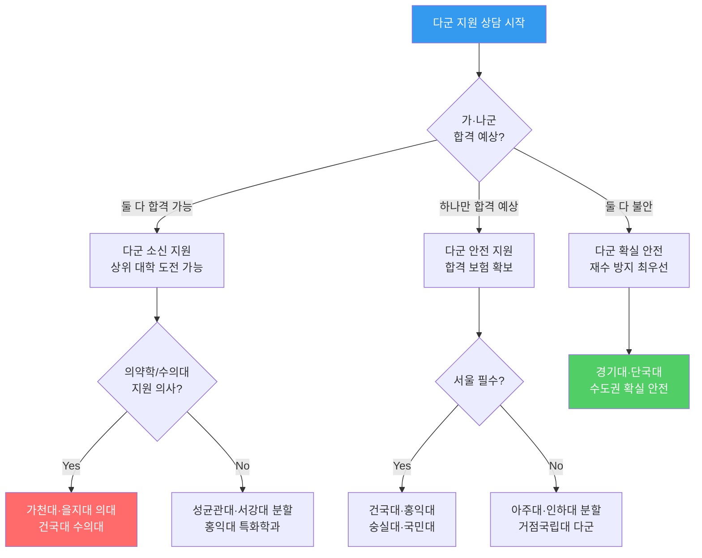
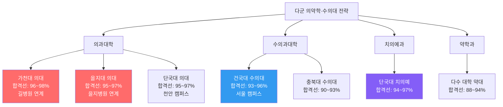
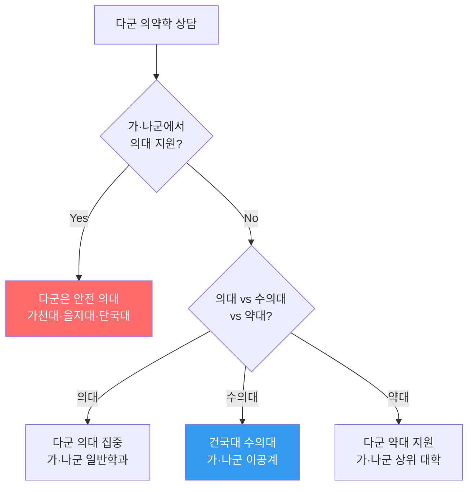
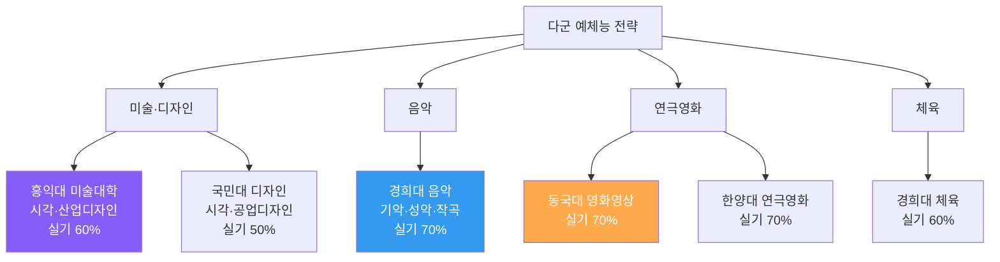
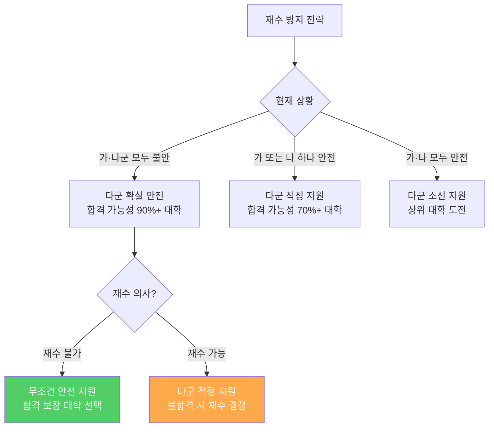
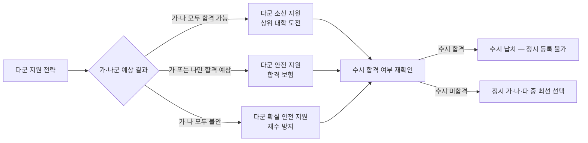
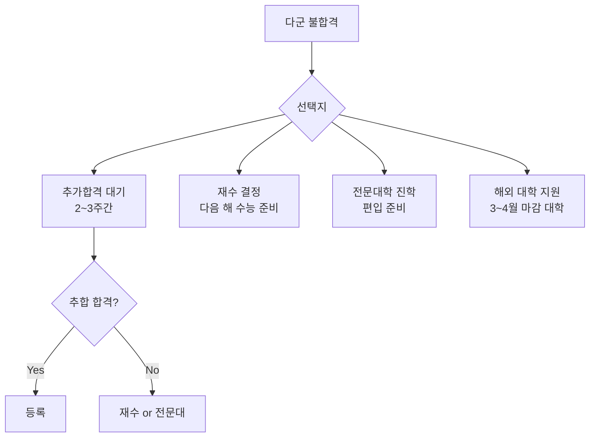

# 국내 대학 입시제도 — 다군 (정시모집 다군)

> **정시 다군**은 마지막 안전 지원 기회이자, 일부 특화 대학이 배치된 전략적 군입니다.
> 가·나군에서 상향/적정 지원 후, 다군에서 안전 지원을 선택하는 것이 일반적입니다.

---

## 다군 지원 전략 의사결정 트리 (상담용)

---

## 다군 주요 대학 현황표 (확장판)

| 순위 | 대학명 | 지역 | 특화 분야 | 입결 범위 | 경쟁률 | 추합 비율 | 특이사항 |
|------|--------|------|---------|---------|--------|---------|---------|
| 1 | **성균관대학교** (일부) | 서울/수원 | 이공계 | 90~97% | 4~6:1 | 200~350% | 나군과 분할 |
| 2 | **서강대학교** (일부) | 서울 | 인문·경영 | 90~96% | 4~6:1 | 200~350% | 나군과 분할 |
| 3 | **건국대학교** | 서울 | 수의대·공대 | 78~92% | 5~8:1 | 250~400% | 수의대 다군 배치 |
| 4 | **홍익대학교** | 서울/세종 | 미술·건축·공대 | 78~90% | 5~8:1 | 200~350% | 예체능 강세 |
| 5 | **숙명여자대학교** | 서울 | 인문·이공 | 82~90% | 4~6:1 | 200~300% | 여대 강세 |
| 6 | **아주대학교** | 수원 | 의대·공대 | 78~92% | 5~7:1 | 200~350% | 의대 다군 배치 |
| 7 | **숭실대학교** | 서울 | IT·공학 | 75~85% | 5~7:1 | 250~400% | |
| 8 | **국민대학교** | 서울 | 디자인·공학 | 73~85% | 5~7:1 | 250~400% | |
| 9 | **단국대학교** | 서울/천안 | 공대·의대 | 70~88% | 5~8:1 | 200~350% | 치의예 다군 배치 |
| 10 | **가천대학교** | 성남 | 의대·공대 | 72~90% | 5~8:1 | 200~350% | 의대 다군 배치 |
| 11 | **을지대학교** | 성남/대전 | 의대·보건 | 78~93% | 4~6:1 | 150~250% | 의대 다군 |
| 12 | **인하대학교** (일부) | 인천 | 항공·공대 | 75~88% | 5~7:1 | 200~350% | 가·다군 분할 |
| 13 | **한국외국어대학교** (일부) | 서울 | 어문·국제 | 85~93% | 5~7:1 | 200~300% | 나·다군 분할 |
| 14 | **동덕여자대학교** | 서울 | 인문·예체능 | 70~82% | 4~6:1 | 250~400% | |
| 15 | **경기대학교** | 수원 | 인문·이공 | 60~75% | 4~6:1 | 300~500% | |

---

## 다군 수능 반영 영역 비교표 (상세)

| 대학 | 국어 | 수학 | 영어 | 탐구 | 활용 지표 | 비고 |
|------|------|------|------|------|---------|------|
| 성균관대(다/이) | 20% | 40% | 등급제 | 40% | 표준점수 | 이공계 수탐 우선 |
| 서강대(다) | 36.4% | 36.4% | 등급제 | 27.3% | 표준점수 | |
| 건국대(인) | 35% | 25% | 등급제 | 40% | 표준점수 | |
| 건국대(이) | 25% | 35% | 등급제 | 40% | 표준점수 | |
| 홍익대(인) | 35% | 25% | 등급제 | 40% | 표준점수 | 계열별 차등 |
| 홍익대(이) | 20% | 40% | 등급제 | 40% | 표준점수 | |
| 숭실대 | 25% | 35% | 등급제 | 40% | 표준점수 | |
| 아주대 | 25% | 35% | 등급제 | 40% | 표준점수 | 의대 별도 |
| 가천대 | 30% | 35% | 등급제 | 35% | 표준점수 | 의대 별도 |
| 국민대 | 30% | 30% | 등급제 | 40% | 백분위 | |
| 단국대 | 30% | 30% | 등급제 | 40% | 백분위 | |

---

## 다군 의·수의대 집중 분석

### 다군 의약학 상담 시나리오

| 계열 | 대학 | 다군 모집 인원 | 합격선 | 경쟁률 | 추합 비율 | 특이사항 |
|------|------|------------|--------|--------|---------|---------|
| 의예과 | 가천대 | 약 30명 | 96~98% | 4~6:1 | 100~200% | 길병원 연계 |
| 의예과 | 을지대 | 약 30명 | 95~97% | 4~5:1 | 80~150% | 을지병원 연계 |
| 의예과 | 단국대 | 약 25명 | 95~97% | 4~6:1 | 100~200% | 천안 캠퍼스 |
| 수의예과 | 건국대 | 약 30명 | 93~96% | 5~8:1 | 150~250% | 이공계 탐구 반영 |
| 수의예과 | 충북대 | 약 20명 | 90~93% | 4~6:1 | 100~200% | |
| 치의예과 | 단국대 | 약 25명 | 94~97% | 4~6:1 | 100~200% | |
| 약학과 | 다수 대학 | 소규모 | 88~94% | 6~10:1 | 200~400% | |

---

## 다군 예체능 계열 현황 (상세)

### 예체능 대학별 상세 비교표

| 대학 | 전형 | 실기 반영 | 수능 반영 | 수능 최저 | 특화 분야 | 경쟁률 |
|------|------|---------|---------|---------|---------|--------|
| 홍익대학교 | 실기우수자 | 60% | 40% | 있음 | 시각·산업디자인, 미술 | 8~15:1 |
| 한양대학교 (일부) | 실기전형 | 70% | 30% | 있음 | 연극영화, 무용 | 10~20:1 |
| 경희대학교 (일부) | 실기전형 | 60~80% | 20~40% | 있음 | 음악, 무용, 체육 | 8~15:1 |
| 동국대학교 | 실기전형 | 70% | 30% | 있음 | 영화·영상 | 15~25:1 |
| 중앙대학교 (일부) | 실기전형 | 60% | 40% | 있음 | 예술계열 | 10~20:1 |
| 국민대학교 | 실기전형 | 50% | 50% | 있음 | 디자인·공예 | 8~12:1 |

### 예체능 상담 포인트

| 질문 | 상담 답변 |
|------|---------|
| "미술 대학 어디가 좋나요?" | "홍익대가 미술 분야 국내 최고입니다. 실기 비중이 60%이므로 실기 준비가 핵심입니다" |
| "연극영화 어디가 유명한가요?" | "한양대·동국대·중앙대가 3대 연극영화 명문입니다. 실기 70% 반영이므로 실기 준비에 집중하세요" |
| "수능 최저가 있나요?" | "대부분 있습니다. 보통 2~3개 영역 합 6~8 이내입니다. 수능 준비도 병행해야 합니다" |
| "실기 준비는 언제부터?" | "최소 고2부터 전문 실기 학원에서 준비하는 것이 일반적입니다" |

---

## 다군 안전지원 전략 (재수 방지)

### 재수 vs 현역 진학 의사결정표

| 판단 기준 | 현역 진학 추천 | 재수 추천 |
|---------|-------------|---------|
| **목표 대학과 격차** | 1~2단계 이내 | 3단계 이상 |
| **수능 성적 추이** | 하락 또는 정체 | 상승 추세 |
| **멘탈 상태** | 지침 / 불안 | 의지 강함 |
| **가정 경제 상황** | 부담 있음 | 여유 있음 |
| **재수 성공률** | 통계적 30~40% 상승 | 본인 상황 고려 |
| **학과 적성** | 현재 합격 대학에 만족 | 목표 학과 필수 |

> **상담 포인트**: "재수해서 성적이 오르는 학생은 약 30~40%입니다. 현재 합격 가능한 대학에서 원하는 학과가 있다면 현역 진학을 추천합니다."

---

## 다군 거점 국립대 다군 배치 현황 (상세)

| 대학 | 지역 | 다군 배치 학과 | 입결 | 경쟁률 | 등록금(연) | 특이사항 |
|------|------|-------------|------|--------|---------|---------|
| 충남대학교 (일부) | 대전 | 공대·농대 일부 | 70~85% | 3.5~5:1 | ₩380~580만 | KAIST 인접 |
| 전북대학교 (일부) | 전주 | 농대·수의대 일부 | 68~85% | 3~5:1 | ₩350~550만 | |
| 경상국립대학교 | 진주 | 공대·농대 | 65~80% | 3~4.5:1 | ₩350~530만 | |
| 강원대학교 (일부) | 춘천 | 이공계 일부 | 63~80% | 3~4:1 | ₩350~530만 | |
| 제주대학교 (일부) | 제주 | 전 계열 일부 | 58~76% | 2.5~4:1 | ₩350~530만 | 섬 지역 특수성 |

---

## 다군 전략 상세 플로우

---

## 학생 유형별 다군 상담 전략표

### 유형 1: 의약학 다군 지원 학생

| 항목 | 전략 내용 |
|------|---------|
| **다군 목표** | 가천대·을지대·단국대 의대 |
| **가군 조합** | 서울대·경희대 의대 (상향) |
| **나군 조합** | 연·고·성·한 의대 (적정) |
| **핵심 포인트** | 3개 군 모두 의대 지원 가능 |
| **상담 질문** | "의대만 고집하시나요? 약대·수의대도 검토할까요?" |

### 유형 2: 서울 안전지원 학생

| 항목 | 전략 내용 |
|------|---------|
| **다군 목표** | 건국대·홍익대·숭실대·국민대 |
| **가군 조합** | 동국대·인하대 (적정) |
| **나군 조합** | 중앙대·외대 (소신) |
| **핵심 포인트** | 서울 소재 확보가 최우선 |
| **상담 질문** | "서울 캠퍼스 필수인가요? 수원·인천도 괜찮으시면 선택지가 넓어집니다" |

### 유형 3: 재수 방지 최우선 학생

| 항목 | 전략 내용 |
|------|---------|
| **다군 목표** | 경기대·단국대(천안)·수도권 확실 안전 |
| **가군 조합** | 적정 지원 |
| **나군 조합** | 적정 지원 |
| **핵심 포인트** | 다군에서 반드시 합격 확보 |
| **상담 질문** | "재수 의사가 없으시면 다군은 무조건 안전하게 가겠습니다" |

---

## 다군 합격 사례 시나리오 (상담용)

### 사례 1: 건국대 수의예과 합격

| 항목 | 내용 |
|------|------|
| **수능 성적** | 국어 2등급(124) / 수학 1등급(133) / 영어 1등급 / 과탐 1등급(65+64) |
| **백분위** | 평균 95.2% |
| **가군** | 경희대 약학과 (불합격) |
| **나군** | 성균관대 생명공학 (합격) |
| **다군** | 건국대 수의예과 (합격) |
| **최종 선택** | 건국대 수의예과 (수의사 꿈) |
| **핵심 전략** | 나군 안전 확보 후 다군에서 꿈의 학과 도전 |

### 사례 2: 홍익대 시각디자인학과 합격

| 항목 | 내용 |
|------|------|
| **수능 성적** | 국어 3등급(115) / 수학 4등급(108) / 영어 2등급 / 사탐 3등급(58+56) |
| **백분위** | 평균 78.5% |
| **실기 성적** | 기초디자인 상위 10% |
| **가군** | 경희대 시각디자인 (불합격) |
| **나군** | 이화여대 디자인 (불합격) |
| **다군** | 홍익대 시각디자인 (합격) |
| **핵심 전략** | 실기 60% 반영 → 실기 강점 최대 활용 |

### 사례 3: 숭실대 컴퓨터학부 합격 (재수 방지)

| 항목 | 내용 |
|------|------|
| **수능 성적** | 국어 3등급(114) / 수학 2등급(127) / 영어 2등급 / 과탐 3등급(59+57) |
| **백분위** | 평균 82.3% |
| **가군** | 세종대 컴퓨터공학 (불합격) |
| **나군** | 서울시립대 컴퓨터과학 (불합격) |
| **다군** | 숭실대 컴퓨터학부 (추합 합격) |
| **핵심 전략** | 다군 안전지원으로 재수 방지 성공 |

---

## 다군 상담 시 자주 묻는 질문 (FAQ)

### Q1. "다군에서 성균관대·서강대 분할 모집이 뭔가요?"

> **답변**: 성균관대와 서강대는 나군과 다군에 모집인원을 분할 배치합니다. 나군에서 불합격해도 다군에서 다시 지원할 수 있습니다. 단, 같은 학과가 아닐 수 있으므로 모집요강을 확인하세요.

### Q2. "추합이 많이 도는 대학은 어디인가요?"

| 대학 | 추합 비율 | 이유 |
|------|---------|------|
| 건국대 | 250~400% | 수시 이탈 + 상위 대학 등록 |
| 숭실대 | 250~400% | 동일 |
| 국민대 | 250~400% | 동일 |
| 경기대 | 300~500% | 매우 높은 이탈률 |

### Q3. "다군까지 불합격하면 어떻게 하나요?"

---

## 다군 지원 체크리스트 (상담사용)

### 수능 전
- [ ] 다군 안전지원 대학 사전 리스트 작성
- [ ] 예체능 지원 시 실기 준비 상태 점검
- [ ] 재수 의사 사전 확인

### 수능 후
- [ ] 가·나군 지원 결과 예측 후 다군 포지션 결정
- [ ] 수시 합격 여부 최종 확인 (납치 여부)
- [ ] 다군 의약학·수의대 입결 분석
- [ ] 홍익대 등 예체능 실기 준비 여부 확인
- [ ] 지역 거점 국립대 다군 모집 여부 확인
- [ ] 재수 vs 현역 진학 최종 의사결정

### 합격 후
- [ ] 가·나·다군 합격 결과 종합 비교
- [ ] 추합 대기 시 등록금 납부 기한 확인
- [ ] 최종 등록 대학 결정

---

## 2027 입시 변화에 따른 다군 새 전략

### 다군 핵심 변화

| 변화 | 다군 영향 | 대응 전략 |
|------|---------|---------|
| 수시 최저 확산 | 수시 탈락 → 정시 유입 → 다군 경쟁률 상승 | 안전지원 기준 1~2% 상향 |
| 무전공 선발 확대 | 건국대·홍익대 무전공 모집 증가 | 무전공 합격선 별도 분석 |
| 홍익대 최저 완화 (2합5) | 수시 합격자 증가 → 정시 모집 감소 가능 | 정시 경쟁률 변동 주의 |
| 중앙대 창의형논술 신설 | 수시에서 최저 미적용 논술 → 수시 합격 증가 | 다군 중앙대 분할 모집 영향 |

### 추가 합격 사례

### 사례 4: 아주대 의대 합격 (다군 의대 집중 전략)

| 항목 | 내용 |
|------|------|
| **수능** | 국어 2등급(123) / 수학 1등급(135) / 영어 1등급 / 과탐 1등급(66+65) |
| **백분위** | 평균 96.5% |
| **가군** | 서울대 의대 (불합격) |
| **나군** | 연세대 의대 (불합격) |
| **다군** | 아주대 의대 (추합 합격) |
| **핵심 전략** | 3개 군 모두 의대 지원 → 다군에서 최종 합격. "의대만 고집하면 3개 군 모두 의대로 가야 합니다" |

### 사례 5: 국민대 소프트웨어학부 합격 (무전공 vs 학과 직접 비교)

| 항목 | 내용 |
|------|------|
| **수능** | 국어 3등급(113) / 수학 2등급(126) / 영어 3등급 / 과탐 3등급(58+56) |
| **백분위** | 평균 79.8% |
| **다군** | 국민대 소프트웨어학부 (합격) |
| **비교** | 무전공 합격선 77% vs 소프트웨어 직접 82% → 무전공이 5% 낮음 |
| **선택** | 소프트웨어 직접 지원 (전공 확실하므로) |
| **교훈** | "전공이 확실하면 학과 직접 지원이 유리합니다. 무전공은 1학년 GPA 경쟁이 치열합니다" |

---

> 작성일: 2026년 2월 | 이전 파일: [나군 대학 입시](국내_나군_대학_입시.md) | 다음 파일: [라군 특수전형](국내_라군_특수전형_입시.md)
