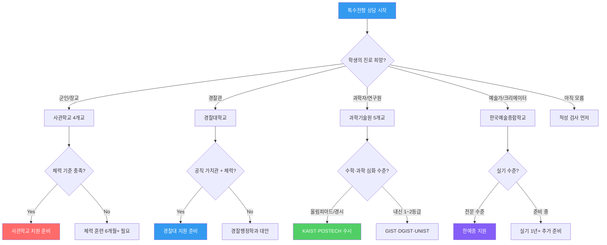
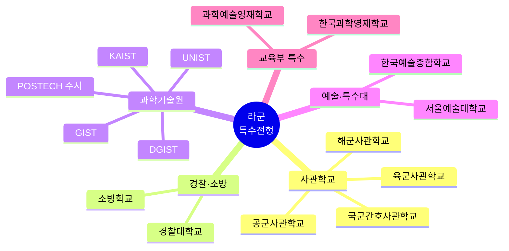
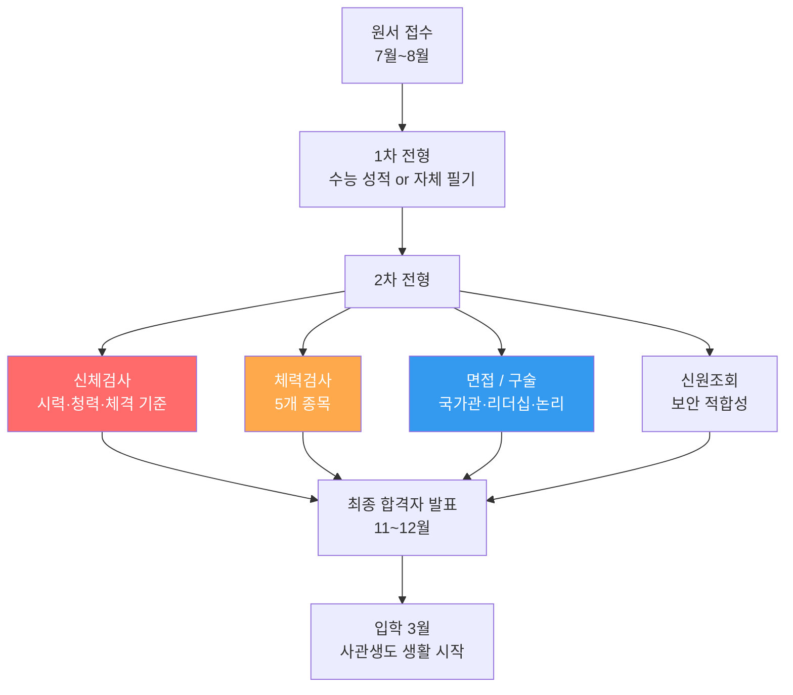
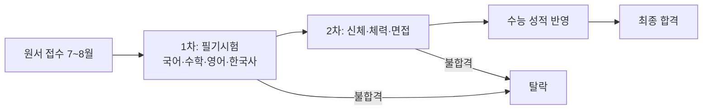
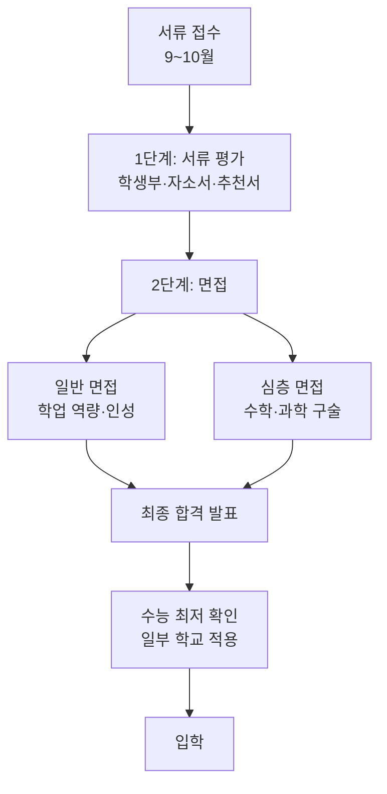
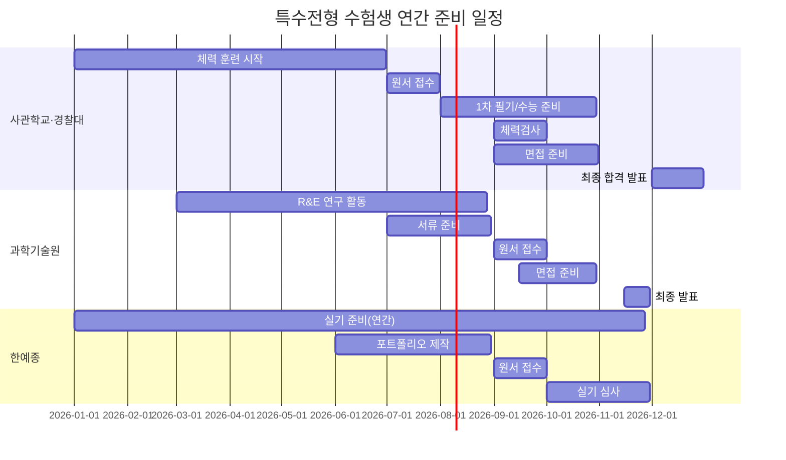
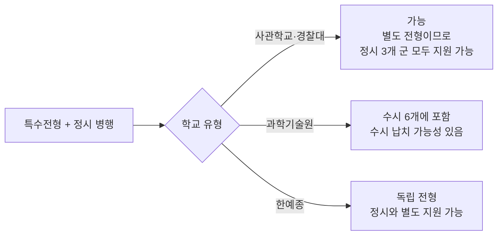

# 국내 대학 입시제도 — 라군 (특수전형 · 별도 모집)

> **라군(특수전형)**은 공식 정시 군 구분은 아니지만, 사관학교·경찰대·과학기술원·예술대 등
> 독립적인 별도 전형으로 가·나·다군과 무관하게 지원 가능한 특수 학교들을 묶어 정리합니다.
> 이 학교들은 수능 전후 자체 시험·면접·체력검사를 병행합니다.

---

## 특수전형 상담 의사결정 트리

---

## 특수전형 학교 분류 구조도

---

## 사관학교 비교표 (상세)

| 구분 | 육군사관학교 | 해군사관학교 | 공군사관학교 | 국군간호사관학교 |
|------|------------|------------|------------|--------------|
| 위치 | 서울 노원구 | 경남 창원시 | 충북 청주시 | 대전 유성구 |
| 수업 연한 | 4년 | 4년 | 4년 | 4년 |
| 졸업 후 | 육군 소위 임관 | 해군 소위 임관 | 공군 소위 임관 | 간호 장교 임관 |
| 의무 복무 | 7년 | 10년 | 10년 | 6년 |
| 등록금 | 전액 면제 | 전액 면제 | 전액 면제 | 전액 면제 |
| 생활비 | 월 급여 지급 (약 50만원) | 월 급여 지급 | 월 급여 지급 | 월 급여 지급 |
| 원서 접수 | 7~8월 | 7~8월 | 7~8월 | 7~8월 |
| 전형 방법 | 1차: 수능 / 2차: 체력+면접+한국사 | 동일 | 동일 | 동일 |
| 연간 모집 | 약 330명 | 약 170명 | 약 215명 | 약 90명 |
| 남녀 비율 | 남 85% / 여 15% | 남 85% / 여 15% | 남 85% / 여 15% | 남 30% / 여 70% |
| 합격 수능 수준 | 상위 15~25% | 상위 15~25% | 상위 15~25% | 상위 20~30% |

### 사관학교 전형 절차 (상세)

### 사관학교 체력검사 기준표 (상세)

| 종목 | 만점 기준 (남) | 합격 기준 (남) | 만점 기준 (여) | 합격 기준 (여) |
|------|-------------|-------------|-------------|-------------|
| **1.5km 달리기** | 5분 40초 | 7분 44초 | 7분 15초 | 9분 30초 |
| **팔굽혀펴기** | 72회/2분 | 30회/2분 | 25회/2분 | 10회/2분 |
| **윗몸일으키기** | 86회/2분 | 50회/2분 | 70회/2분 | 35회/2분 |
| **100m 달리기** | 12.3초 | 15.0초 | 15.0초 | 18.5초 |
| **왕복오래달리기** | 100회 | 55회 | 65회 | 30회 |

> **상담 포인트**: "체력검사에서 탈락하는 학생이 의외로 많습니다. 최소 6개월 전부터 체력 훈련을 시작하세요. 특히 1.5km 달리기와 팔굽혀펴기가 가장 어렵습니다."

### 사관학교 신체검사 기준

| 항목 | 기준 | 불합격 사유 |
|------|------|---------|
| 시력 | 교정시력 0.7 이상 | 라식/라섹 수술 후 6개월 경과 필요 |
| 색각 | 정상 색각 | 색약·색맹 불합격 |
| 청력 | 정상 | 난청 불합격 |
| 신장 | 남 159cm+ / 여 155cm+ | 미달 시 불합격 |
| 체중 | BMI 17~33 | 과체중·저체중 불합격 |
| 문신 | 없어야 함 | 문신 있으면 불합격 |
| 치아 | 건강한 치아 | 심한 부정교합 불합격 |

### 사관학교 면접 평가 항목

| 평가 영역 | 비중 | 평가 내용 | 준비 방법 |
|---------|------|---------|---------|
| 국가관·안보관 | 30% | 대한민국 안보 인식, 군인 소명의식 | 안보 이슈 정리, 시사 상식 |
| 리더십·품성 | 25% | 리더십 경험, 팀워크, 도덕성 | 학교 활동 사례 정리 |
| 논리적 사고 | 25% | 상황 판단력, 문제 해결 능력 | 토론·발표 연습 |
| 표현력·자세 | 20% | 발표력, 자세, 예절 | 모의 면접 연습 |

### 사관학교 상담 시나리오

| 상담 질문 | 답변 |
|---------|------|
| "사관학교 가면 월급 받나요?" | "네, 생도 기간에도 월 약 50만원 급여가 지급됩니다. 등록금 전액 면제이고 숙식도 제공됩니다" |
| "의무 복무 기간이 길지 않나요?" | "육사 7년, 해·공사 10년입니다. 하지만 장교로서 안정적 커리어와 연금이 보장됩니다" |
| "여학생도 지원 가능한가요?" | "네, 모든 사관학교에 여학생 모집이 있습니다. 간호사관학교는 여학생 비율이 70%입니다" |
| "체력이 약한데 가능할까요?" | "최소 6개월 체력 훈련이 필요합니다. 체력검사에서 탈락하면 아무리 성적이 좋아도 불합격입니다" |
| "정시와 동시 지원 가능한가요?" | "네, 사관학교는 별도 전형이므로 정시 가·나·다군과 중복 지원 가능합니다" |

| 전형 단계 | 반영 비율 | 평가 내용 |
|---------|---------|---------|
| 1차 (수능/학생부) | 40~50% | 수능 점수 또는 학생부 성적 |
| 체력검사 | 10~15% | 오래달리기·팔굽혀펴기·윗몸일으키기 |
| 면접·구술 | 25~35% | 리더십·국가관·논리적 사고 |
| 신체검사 | P/F | 합격 기준 충족 필수 |

---

## 경찰대학교 (상세)

| 구분 | 내용 |
|------|------|
| 위치 | 충남 아산시 |
| 수업 연한 | 4년 |
| 졸업 후 | 경찰 경위 임관 |
| 의무 복무 | 6년 |
| 등록금 | 전액 면제 |
| 생활비 | 교육비 지원 |
| 연간 모집 | 약 100명 (남 80 / 여 20) |
| 원서 접수 | 7~8월 |
| 합격 수능 수준 | 상위 5~10% |

### 경찰대 전형 절차

### 경찰대 필기시험 과목별 분석

| 과목 | 출제 범위 | 난이도 | 준비 방법 |
|------|---------|--------|---------|
| 국어 | 수능 국어 수준 + 법률 지문 | 수능보다 약간 어려움 | 수능 국어 + 법률 기초 |
| 수학 | 수능 수학 수준 | 수능과 유사 | 수능 수학 준비로 충분 |
| 영어 | 수능 영어 수준 + 실용 영어 | 수능과 유사 | 수능 영어 + 시사 영어 |
| 한국사 | 한국사능력검정 수준 | 보통 | 한국사능력검정 2급 이상 |

### 경찰대 체력검사 기준

| 종목 | 만점 (남) | 합격 (남) | 만점 (여) | 합격 (여) |
|------|---------|---------|---------|---------|
| 100m 달리기 | 12.5초 | 15.5초 | 15.5초 | 19.0초 |
| 1000m 달리기 | 3분 15초 | 4분 30초 | 4분 00초 | 5분 30초 |
| 윗몸일으키기 | 72회/분 | 40회/분 | 55회/분 | 25회/분 |
| 좌우 악력 | 61kg+ | 36kg+ | 40kg+ | 24kg+ |
| 팔굽혀펴기 | 58회/분 | 25회/분 | 30회/분 | 10회/분 |

| 전형 단계 | 반영 비율 | 내용 |
|---------|---------|------|
| 1차 필기 | 50% | 국어·수학·영어·한국사 |
| 수능 | 30% | 수능 성적 활용 |
| 체력검사 | 10% | 100m, 1000m, 윗몸일으키기 등 |
| 면접 | 10% | 봉사정신·도덕성·판단력 |

### 경찰대 vs 경찰행정학과 비교

| 비교 항목 | 경찰대학교 | 일반대 경찰행정학과 |
|---------|---------|---------------|
| 졸업 후 직급 | 경위 (7급) | 순경 (9급) 시험 필요 |
| 등록금 | 전액 면제 | 일반 대학 수준 |
| 의무 복무 | 6년 | 없음 |
| 합격 난이도 | 매우 높음 (상위 5~10%) | 대학별 상이 |
| 경찰 진출 보장 | 100% | 시험 합격 필요 |
| 추천 학생 | 성적 우수 + 체력 + 공직 가치관 | 경찰 희망 + 일반 대학 선호 |

---

## 과학기술원(UST) 비교표 (상세)

| 구분 | KAIST | POSTECH | GIST | DGIST | UNIST |
|------|-------|---------|------|-------|-------|
| 위치 | 대전 | 포항 | 광주 | 대구 | 울산 |
| 설립 | 1971 | 1986 | 1993 | 2004 | 2009 |
| 전형 방식 | 수시 100% | 수시+정시 소규모 | 수시 중심 | 수시 중심 | 수시 중심 |
| 수능 활용 | 최저 활용(일부) | 정시 가군 | 최저 활용 | 최저 활용 | 최저 활용 |
| 등록금 | 실질 무료(장학금) | 일부 장학 | 지원 多 | 지원 多 | 지원 多 |
| 전공 특화 | 전 이공계 | 이공계 전반 | 이공·과학기술 | 기초과학·융합 | 이공계 전반 |
| 연간 모집 | 약 800명 | 약 310명 | 약 200명 | 약 150명 | 약 400명 |
| 경쟁률 | 3~5:1 | 4~6:1 | 3~5:1 | 3~4:1 | 3~5:1 |
| 합격 내신 | 1~2등급 | 1~2등급 | 1~3등급 | 1~3등급 | 1~3등급 |
| 특이사항 | 영어 수업 多 | 연구 중심 | 빛과학도시 | 차세대연구 | 산학연계 강함 |

### 과학기술원 수시 전형 절차

### 과학기술원 면접 유형별 준비 가이드

| 면접 유형 | 대학 | 내용 | 준비 방법 |
|---------|------|------|---------|
| 수학 구술 | KAIST·POSTECH | 수학 문제 풀이 + 설명 | 수학 심화 문제집, 구술 연습 |
| 과학 구술 | KAIST·POSTECH | 물리·화학 개념 설명 | 과학 원리 깊이 이해, 실험 설계 |
| 인성 면접 | 전체 | 지원동기·학업계획·인성 | 자소서 기반 예상 질문 준비 |
| 창의성 면접 | GIST·DGIST | 창의적 문제 해결 | 과학 토론, 아이디어 발표 연습 |
| 연구 발표 | UNIST | 연구 경험 발표 | R&E, 과학전람회 경험 정리 |

### 과학기술원 면접 예상 질문 (상담용)

| 질문 유형 | 예시 질문 | 좋은 답변 방향 |
|---------|---------|------------|
| 지원동기 | "왜 KAIST를 선택했나요?" | 구체적 연구 분야 + 교수님 연구실 언급 |
| 학업계획 | "입학 후 어떤 연구를 하고 싶나요?" | 관심 분야 + 구체적 연구 주제 |
| 수학 구술 | "이 미분방정식을 풀어보세요" | 풀이 과정을 논리적으로 설명 |
| 과학 구술 | "엔트로피란 무엇인가요?" | 개념 + 일상 예시 + 응용 |
| 인성 | "팀 프로젝트에서 갈등 경험은?" | 구체적 사례 + 해결 과정 + 배운 점 |

### 과학기술원 상담 시나리오

| 학생 유형 | 추천 대학 | 이유 |
|---------|---------|------|
| 수학 올림피아드 수상 | KAIST·POSTECH | 수학 심화 면접에 강점 |
| 과학전람회 수상 | GIST·DGIST | 연구 경험 중시 |
| 내신 1등급 + 연구 경험 | KAIST | 종합적 평가 |
| 내신 2등급 + 특기 | UNIST·GIST | 특기 반영 비중 높음 |
| 코딩·SW 특기 | KAIST·UNIST | SW 특화 전형 |

---

## 한국예술종합학교 (한예종) 상세

| 구분 | 내용 |
|------|------|
| 위치 | 서울 서초구 |
| 설립 주체 | 문화체육관광부 |
| 특화 분야 | 음악·연극·영상·무용·미술·전통예술 |
| 수능 반영 | 없음 (실기·면접 100%) |
| 등록금 | 일반 대학 수준 (국립) |
| 지원 조건 | 별도 실기 능력 필요 |

### 한예종 원별 상세 비교

| 원 | 모집 분야 | 주요 전형 | 실기 비중 | 경쟁률 | 준비 기간 |
|-----|---------|---------|---------|--------|---------|
| 음악원 | 기악·성악·작곡 | 실기 100% | 매우 높음 | 15~30:1 | 최소 5년+ |
| 연극원 | 연기·연출·극작 | 실기+면접 | 높음 | 50~100:1 | 최소 2년+ |
| 영상원 | 영화·방송영상·애니 | 실기+서류 | 높음 | 30~60:1 | 최소 1년+ |
| 무용원 | 한국·발레·현대무용 | 실기 100% | 매우 높음 | 10~20:1 | 최소 10년+ |
| 미술원 | 조형예술·디자인 | 실기+포트폴리오 | 높음 | 20~40:1 | 최소 2년+ |
| 전통예술원 | 국악·전통예술 | 실기 100% | 매우 높음 | 5~15:1 | 최소 5년+ |

### 한예종 vs 일반대 예술학과 비교

| 비교 항목 | 한예종 | 일반대 예술학과 |
|---------|--------|-------------|
| 수능 반영 | 없음 | 있음 (수능 최저 포함) |
| 실기 비중 | 100% | 50~70% |
| 교수진 | 현역 예술가 중심 | 학술+실기 혼합 |
| 졸업 후 진로 | 전문 예술가 | 예술가 + 일반 취업 |
| 등록금 | 국립 수준 (저렴) | 사립 수준 (비쌈) |
| 추천 학생 | 예술 전업 희망 | 예술 + 일반 진로 병행 |

---

## 특수전형 학교 종합 비교표

| 구분 | 사관학교 | 경찰대 | 과학기술원 | 한국예술종합학교 |
|------|--------|--------|---------|--------------|
| 수능 활용 | 1차 또는 별도 필기 | 일부 반영 | 최저 기준(일부) | 미활용 |
| 등록금 | 전액 면제 | 전액 면제 | 실질 무료 ~ 일반 | 국립 수준 |
| 졸업 후 진로 | 직업군인/장교 | 경찰 경위 | 연구원·엔지니어 | 예술가·크리에이터 |
| 의무 복무 | 6~10년 | 6년 | 없음 | 없음 |
| 특기 필요 | 체력·리더십 | 체력·공직 가치관 | 수학·과학 심화 | 예술 실기 능력 |
| 지원 시기 | 7~8월 (수능 전) | 7~8월 | 9~10월 | 9~11월 |
| 정시와 중복 지원 | 가능 (별도 전형) | 가능 | 수시이므로 수시 중복 불가 | 독립 전형 |
| 합격 난이도 | 상위 15~25% | 상위 5~10% | 상위 1~5% | 실기 수준 |
| 연간 총 비용 | 0원 (급여 지급) | 0원 | 0~200만원 | 400~600만원 |

---

## 특수전형 준비 로드맵

---

## 특수전형 상담 FAQ

### Q1. "사관학교 가면 자유가 없지 않나요?"

> **답변**: 생도 기간(4년)은 군사 훈련과 학업을 병행하므로 일반 대학보다 자유가 제한됩니다. 하지만 주말 외출·외박이 가능하고, 방학 기간에는 자유 시간이 있습니다. 졸업 후 장교로서 안정적 커리어와 연금이 보장됩니다.

### Q2. "과학기술원은 수능을 안 봐도 되나요?"

> **답변**: KAIST는 수시 100%이므로 수능 성적이 필요 없습니다. 하지만 POSTECH은 정시 가군에 소규모 모집이 있어 수능 성적을 활용합니다. GIST·DGIST·UNIST는 수능 최저 기준을 일부 적용합니다.

### Q3. "한예종은 수능 준비 안 해도 되나요?"

> **답변**: 한예종은 수능을 반영하지 않으므로 실기 준비에 집중할 수 있습니다. 하지만 한예종 불합격 시 일반 대학 예체능 전형에 지원하려면 수능 최저 기준이 있으므로, 최소한의 수능 준비는 병행하는 것이 안전합니다.

### Q4. "특수전형과 정시를 동시에 준비할 수 있나요?"

---

## 특수전형 지원 체크리스트 (상담사용)

### 사관학교·경찰대
- [ ] 신체검사 기준 사전 확인 (시력·색각·신장)
- [ ] 체력검사 기준 확인 및 훈련 계획 수립 (최소 6개월)
- [ ] 면접 준비: 국가관·리더십·시사 상식
- [ ] 수능 병행 준비 일정 조율
- [ ] 의무 복무 기간 고려한 커리어 플랜 수립

### 과학기술원
- [ ] 수학·과학 심화 학습 (올림피아드·경시대회)
- [ ] R&E 연구 활동 경험 확보
- [ ] 자소서 작성 (연구 경험·지원동기)
- [ ] 면접 준비: 수학·과학 구술 연습
- [ ] 수시 6개 지원 중 과학기술원 포함 여부 결정

### 한예종
- [ ] 실기 레퍼토리/포트폴리오 준비
- [ ] 전문 실기 학원 수강 여부 확인
- [ ] 한예종 불합격 시 대안 대학 리스트 작성
- [ ] 수능 최소 준비 (일반대 예체능 수능 최저 대비)

---

> 작성일: 2026년 2월 | 이전 파일: [다군 대학 입시](국내_다군_대학_입시.md) | 다음 파일: [해외 가군(미국) 대학 입시](해외_가군_미국_대학_입시.md)
