# 대학 입시제도 총정리 — 국내 · 해외 완전 가이드

> 국내 정시 가·나·다·라군부터 미국·영국·아시아·캐나다·호주까지
> 커리어패스별 최적 대학 진학 전략을 한 눈에 정리합니다.

---

## 상담 첫 단계 — 학생 유형 진단 의사결정 트리

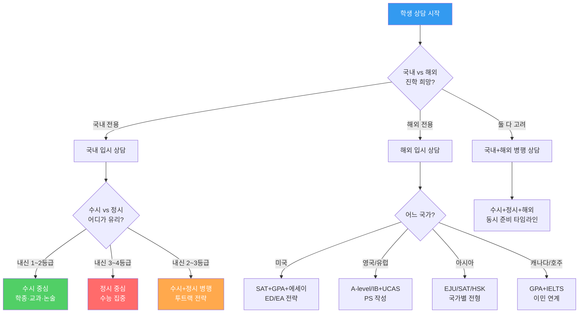

---

## 전체 파일 구조

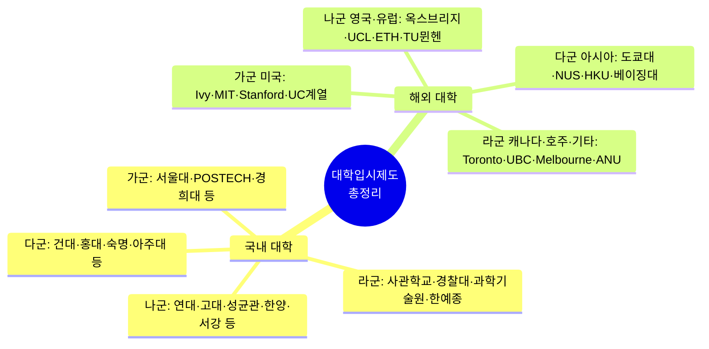

---

## 국내 vs 해외 입시 핵심 비교표

| 구분 | 국내 (한국) | 미국 | 영국 | 아시아 | 캐나다/호주 |
|------|------------|------|------|--------|-----------|
| 주요 시험 | 수능 | SAT/ACT | A-level/IB | EJU/HKDSE/가오카오 | 내신/ATAR |
| 영어 요구 | 수능 영어 | 원어민 | IELTS 6.5~7.5 | IELTS 6.0~7.0 | IELTS 6.0~7.0 |
| 지원 횟수 | 수시 6회+정시 3회 | 제한 없음 | UCAS 5개 | 대학별 상이 | 대학별 상이 |
| 합격 결정 | 12~1월 | 3~4월 | 8월(성적 발표 후) | 3~5월 | 2~5월 |
| 학비 수준 | ₩400~800만/년 | $70,000~90,000/년 | £20,000~45,000/년 | 다양 | AU$/CA$ 20,000~60,000 |
| 장학금 | 국가장학금·교내 | Need-blind 일부 | 소규모 | 정부 장학금 | 이민 연계 |
| 이민 연계 | 낮음 | 보통 | 보통 | 낮음 | 높음 |
| 준비 기간 | 고3 집중 | 고1~고3 | 고2~고3 | 고2~고3 | 고3 |
| 난이도 | 수능 집중 | 종합 평가 | 학업 집중 | 시험 집중 | 성적 집중 |

---

## 학생 유형별 최적 입시 전략 매트릭스 (상담용)

### 성적 유형별

| 학생 유형 | 국내 전략 | 해외 전략 | 상담 포인트 |
|---------|---------|---------|-----------|
| 내신 1등급 + 수능 1등급 | 수시 학종 SKY + 정시 서울대 | 미국 Ivy ED + 영국 옥스브리지 | "최상위권은 모든 선택지가 열려있습니다" |
| 내신 1등급 + 수능 3등급 | 수시 학종 집중 | 미국 EA/RD + 캐나다 | "수시에 올인하세요. 해외는 GPA 강점 활용" |
| 내신 3등급 + 수능 1등급 | 정시 SKY 집중 | 미국 Test-Strong + 영국 | "정시가 주력입니다. 해외는 SAT 강점 활용" |
| 내신 2등급 + 수능 2등급 | 수시+정시 병행 | 캐나다·호주 GPA 활용 | "투트랙으로 가겠습니다" |
| 내신 4등급 + 수능 4등급 | 정시 중위권 + 수시 논술 | 아시아·캐나다 중위권 | "현실적 목표 설정이 중요합니다" |
| 특기 보유 (올림피아드) | 수시 특기자 + 과학기술원 | 미국 Ivy 특기 어필 | "특기를 최대한 활용하는 전략" |
| 예체능 특기 | 수시 실기전형 + 한예종 | 미국 예술대 + 영국 | "실기 수준이 핵심입니다" |

### 진로 목표별

| 진로 목표 | 국내 추천 | 해외 추천 | 비용 (4년) | 상담 포인트 |
|---------|---------|---------|---------|-----------|
| 의사 | 서울대·연세대·고려대 의대 | Johns Hopkins·Oxford | ₩4,000만 vs $280,000 | "국내 의대가 비용 대비 최선" |
| AI 연구원 | KAIST·서울대·POSTECH | MIT·Stanford·CMU | ₩2,000만 vs $280,000 | "해외 대학원 진학을 고려하면 국내 학부 → 해외 석박사" |
| 변호사 | 서울대·연세대·고려대 법학 | Yale·Harvard Law | ₩4,000만 vs $280,000 | "한국 변호사는 국내 로스쿨 필수" |
| 외교관 | 서울대·연세대·외대 | Georgetown·LSE | ₩3,500만 vs $280,000 | "외교관 시험은 국내 준비가 유리" |
| 글로벌 기업 취업 | 연세대·고려대·성균관 경영 | Wharton·LSE·NUS | ₩3,500만 vs $280,000 | "해외 학위가 글로벌 취업에 유리" |
| 수의사 | 건국대·서울대 수의대 | Cornell·Edinburgh | ₩3,000만 vs $240,000 | "국내 수의대가 비용 대비 최선" |
| UX 디자이너 | 홍익대·이화·서울대 | RISD·Parsons·RCA | ₩3,500만 vs $280,000 | "포트폴리오가 핵심" |
| 게임 개발자 | 성균관·한양·KAIST | CMU·DigiPen | ₩3,000만 vs $200,000 | "실력 중심 업계, 포트폴리오 > 학벌" |

---

## 국내 정시 군별 지원 전략 총괄

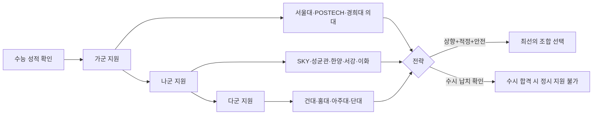

### 군별 지원 전략 요약

| 군 | 전략 키워드 | 주요 대학군 | 입결 범위(백분위) | 추합 비율 |
|----|-----------|----------|---------------|---------|
| **가군** | 상향 도전 or 의약학 | 서울대·POSTECH·경희대(의) | 80~99.5% | 50~300% |
| **나군** | 핵심 목표 대학 | SKY·성균관·한양·서강·이화 | 82~99.5% | 100~400% |
| **다군** | 안전 보험 + 틈새 | 건대·홍대·숙명·아주대 | 60~97% | 200~500% |
| **라군** | 별도 전형 | 사관학교·경찰대·과학기술원·한예종 | 별도 기준 | - |

### 성적 구간별 3개 군 조합 추천표

| 백분위 | 가군 (상향) | 나군 (적정/목표) | 다군 (안전) |
|--------|-----------|---------------|-----------|
| 99%+ | 서울대 의대 | 연세대·고려대 의대 | 성균관대 의대 |
| 97~98% | 서울대 인문/이공 | 연세대·고려대 | 성균관대·한양대 |
| 94~96% | POSTECH·경희대(의) | 성균관대·한양대 | 서강대·이화·중앙대 |
| 90~93% | 경희대·동국대 | 서강대·이화·중앙대 | 건국대·홍익대 |
| 85~89% | 인하대·세종대 | 중앙대·외대·시립대 | 숭실대·국민대 |
| 80~84% | 광운대·명지대 | 거점국립대 | 경기대·단국대 |
| 75~79% | 수도권 중위 | 지방 거점대 | 지방 대학 |

---

## 해외 대학 군별 분류 및 전략

| 군 | 국가/지역 | 전략 포인트 | 핵심 준비 사항 | 비용(4년) |
|----|---------|-----------|------------|---------|
| **가군** | 미국 | ED/EA 조기 지원 합격률 2배 | SAT 1450+, GPA 3.9+, 에세이 | $280,000~360,000 |
| **나군** | 영국·유럽 | UCAS 5개 전략적 선택 | A-level/IB, IELTS 7.0+, PS | £80,000~180,000 |
| **다군** | 아시아 | 지리적 이점 + 경비 절감 | EJU/SAT, IELTS 6.5+, 현지 언어 | ₩4,000만~1.5억 |
| **라군** | 캐나다·호주 | 이민 연계 장기 전략 | 내신, IELTS 6.5~7.0 | CA$/AU$ 80,000~260,000 |

---

## 국내·해외 학비 비교 (연간 기준 + 4년 총비용)

| 국가 | 최저/년 | 평균/년 | 최고/년 | 4년 총비용(평균) | 생활비 포함 |
|------|--------|--------|--------|-------------|---------|
| 한국 국립대 | ₩200만 | ₩400만 | ₩600만 | ₩1,600만 | ₩4,000만 |
| 한국 사립대 | ₩600만 | ₩900만 | ₩1,200만 | ₩3,600만 | ₩6,000만 |
| 미국 사립 | $50,000 | $70,000 | $90,000 | $280,000 | $360,000 |
| 미국 공립 (out-of-state) | $25,000 | $35,000 | $50,000 | $140,000 | $220,000 |
| 영국 | £20,000 | £28,000 | £45,000 | £84,000 (3년) | £120,000 |
| 유럽 (독일·스웨덴 등) | €0 | €3,000 | €20,000 | €12,000 | €60,000 |
| 싱가포르 | S$30,000 | S$38,000 | S$50,000 | S$152,000 | S$220,000 |
| 일본 국공립 | ¥535,800 | ¥535,800 | ¥535,800 | ¥2,143,200 | ¥6,000,000 |
| 캐나다 | CA$22,000 | CA$35,000 | CA$65,000 | CA$140,000 | CA$220,000 |
| 호주 | AU$28,000 | AU$38,000 | AU$55,000 | AU$152,000 | AU$240,000 |

### 비용 대비 효율 분석 (상담용)

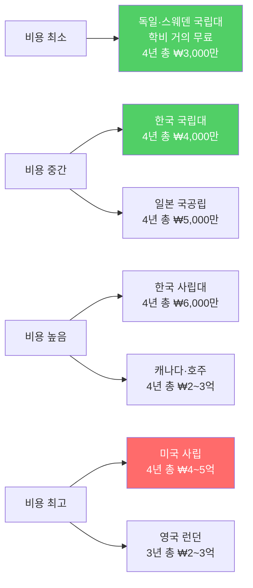

---

## 커리어패스별 최적 대학 추천 매트릭스

### 이공계·AI·데이터 계열

| 직업 목표 | 국내 추천 | 미국 추천 | 영국/유럽 추천 | 아시아 추천 |
|---------|---------|---------|------------|----------|
| AI 연구원 | 서울대·KAIST·POSTECH | MIT·Stanford·CMU | ETH Zurich·Imperial | NUS·도쿄대 |
| 데이터사이언티스트 | KAIST·성균관·한양 | UC Berkeley·Cornell | UCL·Edinburgh | NUS·NTU |
| 앱개발자 | KAIST·한양·POSTECH | Carnegie Mellon·UIUC | Imperial·Bristol | NUS·HKUST |
| 로봇공학자 | KAIST·POSTECH·서울대 | MIT·CMU·Georgia Tech | ETH·TU München | 도쿄대·NUS |

### 의약학·생명과학 계열

| 직업 목표 | 국내 추천 | 미국 추천 | 영국 추천 | 아시아 추천 |
|---------|---------|---------|---------|----------|
| 의사 | 서울대·연세대·고려대 의대 | Johns Hopkins·Harvard | Oxford·Cambridge | NUS·HKU 의대 |
| 약사 | 서울대·성균관·이화 약대 | UCSF·Michigan | UCL·Edinburgh | NUS·NTU |
| 생명공학 | KAIST·성균관·POSTECH | MIT·Stanford | Imperial·Cambridge | NUS·도쿄대 |
| 수의사 | 건국대·서울대·전북대 수의대 | Cornell·UC Davis | Edinburgh·RVC | 도쿄대 |

### 인문·사회·경영 계열

| 직업 목표 | 국내 추천 | 미국 추천 | 영국 추천 | 아시아 추천 |
|---------|---------|---------|---------|----------|
| 변호사 | 서울대·연세대·고려대 법학 | Yale·Harvard Law | Oxford·Cambridge | NUS 법학 |
| 외교관 | 서울대·연대·외대 | Georgetown·Princeton | LSE·Oxford | NUS·베이징대 |
| 경영컨설턴트 | 연세대·고려대·성균관 경영 | Harvard·Wharton | LSE·LBS | NUS·NTU |
| 투자분석가 | 연세대·고려대·서강대 경영 | Wharton·Columbia | LSE·Oxbridge | HKU·NUS |

### 창작·디자인·미디어 계열

| 직업 목표 | 국내 추천 | 미국 추천 | 영국 추천 | 기타 추천 |
|---------|---------|---------|---------|---------|
| UX 디자이너 | 홍익대·이화·서울대 디자인 | RISD·Parsons·CMU | RCA·AA School | 싱가포르 NTU 디자인 |
| 영화감독 | 한국예술종합학교·중앙대 | USC Film·NYU Tisch | NFTS·LFS | 베이징영화학원 |
| 게임기획자 | 성균관·한양·숭실 | CMU·DigiPen | Abertay·Bradford | 리츠메이칸(일본) |

---

## 글로벌 대학 QS 순위 기반 군별 배치

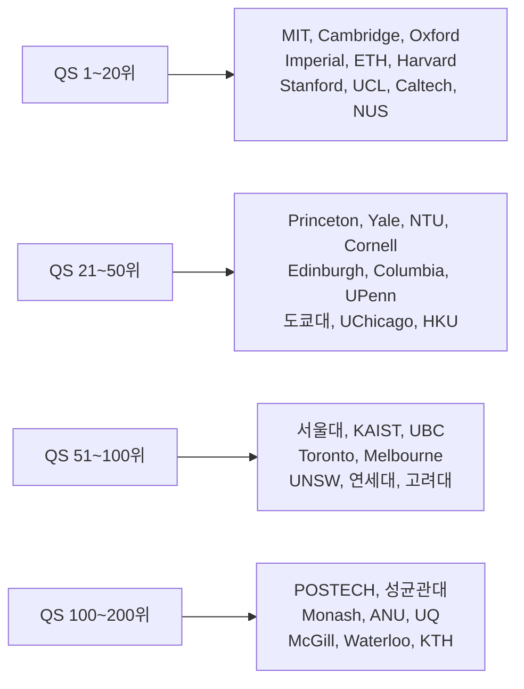

---

## 전형별 핵심 평가요소 비교

| 전형 | 학업 성적 | 에세이/자소서 | 과외활동 | 추천서 | 면접 | 시험 |
|------|---------|------------|--------|--------|------|------|
| 국내 수시 (학종) | ★★★★ | ★★★★ | ★★★★★ | ★★★ | ★★★★ | ★★★ |
| 국내 수시 (교과) | ★★★★★ | ★★ | ★★ | ★★ | ★★ | ★★★ |
| 국내 수시 (논술) | ★★★ | ★★ | ★★ | ★★ | ★★ | ★★★★★ |
| 국내 정시 | ★★★★★ | ★ | ★ | ★ | ★ | ★★★★★ |
| 미국 사립 | ★★★★ | ★★★★★ | ★★★★★ | ★★★★ | ★★★ | ★★★★ |
| 미국 공립 | ★★★★★ | ★★★ | ★★★ | ★★★ | ★★ | ★★★★ |
| 영국 UCAS | ★★★★★ | ★★★★★ | ★★★ | ★★★★ | ★★★★ | ★★★★★ |
| 싱가포르 | ★★★★★ | ★★★ | ★★★ | ★★★ | ★★★ | ★★★★ |
| 일본 국공립 | ★★★★★ | ★★ | ★★ | ★★ | ★★ | ★★★★★ |
| 캐나다·호주 | ★★★★★ | ★★★ | ★★ | ★★★ | ★★ | ★★★ |

---

## 국내·해외 입시 준비 타임라인

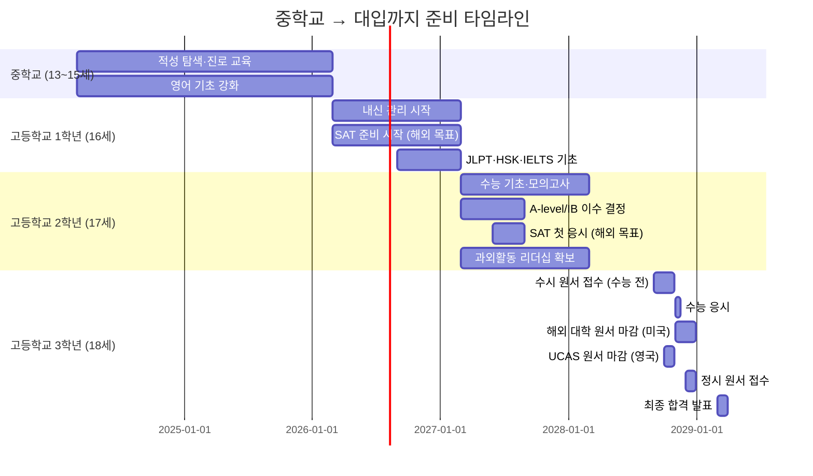

---

## 상담 시 핵심 질문 체크리스트

### 첫 상담 시 반드시 확인할 10가지

| # | 질문 | 목적 |
|---|------|------|
| 1 | "국내와 해외 중 어디를 희망하시나요?" | 전략 방향 설정 |
| 2 | "현재 내신 등급은 몇 등급인가요?" | 수시/정시 유불리 판단 |
| 3 | "모의고사 등급은 어떻게 되나요?" | 정시 목표 설정 |
| 4 | "희망 학과나 진로가 있나요?" | 대학·학과 매칭 |
| 5 | "학비 예산은 어느 정도인가요?" | 국내/해외 선택 |
| 6 | "수시에서 안전지원을 넣었나요?" | 수시 납치 위험 점검 |
| 7 | "특기나 수상 경력이 있나요?" | 특기자전형·해외 어필 |
| 8 | "재수 의사가 있나요?" | 안전지원 수준 결정 |
| 9 | "영어 능력 수준은?" | 해외 지원 가능성 |
| 10 | "부모님의 의견은?" | 가정 내 합의 확인 |

### 상담 결과 기록 양식

| 항목 | 내용 |
|------|------|
| 학생명 | |
| 상담일 | |
| 현재 학년 | |
| 내신 등급 | 국어: / 수학: / 영어: / 탐구: |
| 모의고사 등급 | 국어: / 수학: / 영어: / 탐구: |
| 희망 진로 | |
| 국내/해외 | |
| 수시 지원 현황 | 1: / 2: / 3: / 4: / 5: / 6: |
| 정시 전략 | 가군: / 나군: / 다군: |
| 해외 지원 | |
| 특이사항 | |
| 다음 상담일 | |

---

## 2027~2028 입시 제도 변화 총정리 (최신)

### 2027학년도 주요 변화 요약

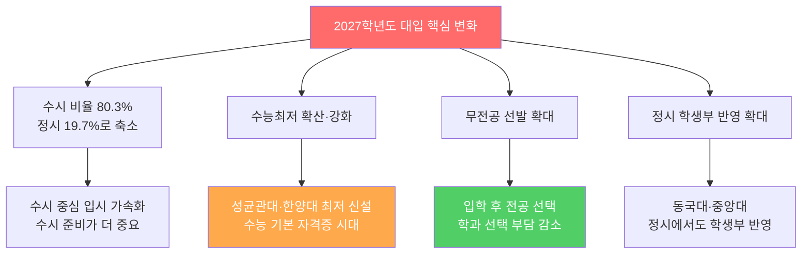

### 대학별 2027 전형 변경 핵심표

| 대학 | 변경 내용 | 영향 | 상담 포인트 |
|------|---------|------|-----------|
| **성균관대** | 융합인재전형 수능최저 신설 (3개 합 6) | 수능 준비 병행 필수 | "성대 학종도 이제 수능 최저가 있습니다" |
| **한양대** | 교과추천형 수능최저 적용 (3개 합 7) | 수능 기본 준비 필요 | "한양대도 최저가 생겼습니다" |
| **연세대** | 교과추천형 면접 폐지, 최저 유지 | 면접 부담 감소 | "면접 없이 교과+수능으로 결정됩니다" |
| **중앙대** | 성장형인재 신설 (면접 30%, 최저 적용) | 면접 비중 증가 | "면접 준비가 핵심입니다" |
| **중앙대** | 창의형논술 신설 (최저 미적용) | 논술만으로 합격 가능 | "수능 부담 없이 논술로 도전 가능" |
| **동국대** | 정시에서 학생부평가 도입 | 정시도 학생부 관리 필요 | "정시도 내신이 반영됩니다" |
| **홍익대** | 수능최저 완화 (3합8 → 2합5) | 부담 감소 | "최저 기준이 많이 낮아졌습니다" |

### 2028학년도 수능 구조 대변혁 (현 고1 대상)

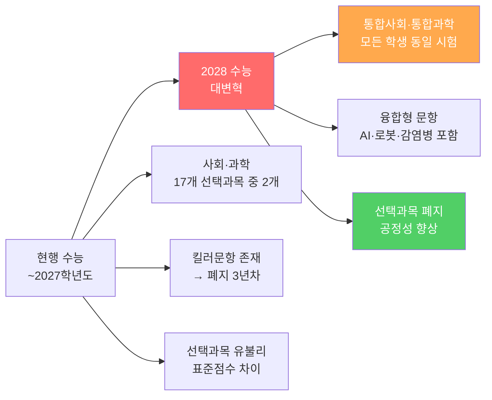

| 구분 | 현행 (~2027) | 2028 이후 |
|------|-----------|---------|
| 사회 | 17개 선택과목 중 최대 2개 | **통합사회** (전원 동일) |
| 과학 | 17개 선택과목 중 최대 2개 | **통합과학** (전원 동일) |
| 수학 | 확률과통계/미적분/기하 선택 | 공통+선택 구조 변경 |
| 영어 | 절대평가 (등급제) | 유지 |
| 한국사 | 필수 (등급제) | 유지 |
| 정보 | - | **정보 과목 신설** |
| 난이도 | 킬러문항 폐지 | 융합형 문항 (AI·로봇 등) |

> **상담 포인트**: "현 고1부터 수능이 완전히 바뀝니다. 선택과목이 사라지고 통합형으로 바뀌므로, 고1 때 배운 통합사회·통합과학을 철저히 준비해야 합니다."

### 학년별 대응 전략표

| 현재 학년 | 해당 수능 | 핵심 변화 | 전략 |
|---------|---------|---------|------|
| **고3 (2026)** | 2027학년도 | 수시 최저 확산, 무전공 확대 | 수능 최저 충족 + 수시 집중 |
| **고2 (2027)** | 2028학년도 | 통합사회·통합과학, 정보 신설 | 고1 교과 복습, 융합형 사고 |
| **고1 (2028)** | 2029학년도 | 2028 체제 안정화 | 통합교과 기초 확립 |
| **중3 (2029)** | 2030학년도 | 완전 정착 | 진로 탐색 + 기초 학력 |

---

## 영역별 점수 올리기 전략 (상담용)

### 수능 영역별 고득점 전략

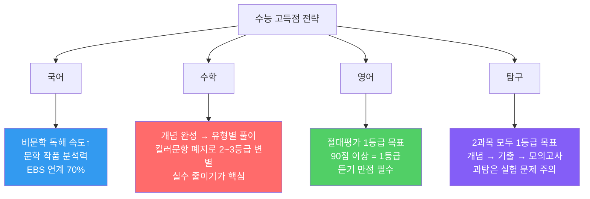

| 영역 | 1등급 컷 | 고득점 핵심 | 자주 하는 실수 | 준비 기간 |
|------|---------|---------|------------|---------|
| **국어** | 상위 4% | 비문학 3지문 정확 독해 | 시간 부족으로 뒷부분 실수 | 6개월+ |
| **수학** | 상위 4% | 킬러 폐지 → 중상위 문제 정확도 | 계산 실수, 조건 누락 | 12개월+ |
| **영어** | 90점+ | 듣기 만점 + 독해 2개 이내 틀림 | 빈칸추론·순서배열 | 3~6개월 |
| **탐구** | 상위 4% | 개념 완벽 이해 + 실험 해석 | 선택과목 유불리 무시 | 6개월+ |
| **한국사** | 등급제 | 4등급 이상 (감점 방지) | 근현대사 혼동 | 1~2개월 |

### 등급별 점수 올리기 로드맵

| 현재 등급 | 목표 등급 | 소요 기간 | 핵심 전략 |
|---------|---------|---------|---------|
| 5등급 → 3등급 | 2단계 상승 | 6~12개월 | 기본 개념 완성 + 기출 반복 |
| 3등급 → 2등급 | 1단계 상승 | 3~6개월 | 유형별 풀이법 + 실수 줄이기 |
| 2등급 → 1등급 | 1단계 상승 | 3~6개월 | 고난도 문제 + 시간 관리 |
| 4등급 → 1등급 | 3단계 상승 | 12~18개월 | 체계적 장기 계획 필수 |

> **상담 포인트**: "킬러문항이 폐지되면서 1~2등급 변별이 중상위 난이도에서 이루어집니다. 어려운 문제를 맞추는 것보다 쉬운 문제를 틀리지 않는 것이 더 중요합니다."

---

## 새로운 입시 전략 — 2027~2028 대응

### 전략 1: 수능최저 시대의 수시 전략

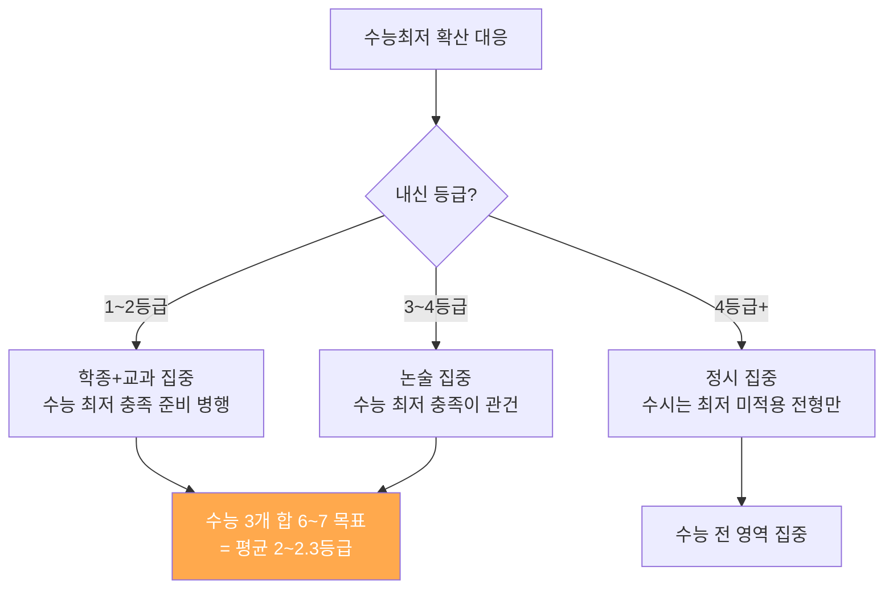

| 수능최저 유형 | 해당 대학 | 충족 난이도 | 전략 |
|-----------|---------|---------|------|
| 3개 합 5 이내 | 서울대·연세대 일부 | 매우 어려움 | 전 영역 2등급 이내 필요 |
| 3개 합 6 이내 | 성균관대·고려대 | 어려움 | 1개 1등급 + 2개 2~3등급 |
| 3개 합 7 이내 | 한양대·중앙대 | 보통 | 평균 2.3등급 |
| 2개 합 5 이내 | 홍익대 | 보통 | 강한 2개 영역 집중 |
| 최저 미적용 | 한양대 논술·중앙대 창의형 | - | 수능 부담 없이 전형 집중 |

### 전략 2: 무전공 선발 활용 전략

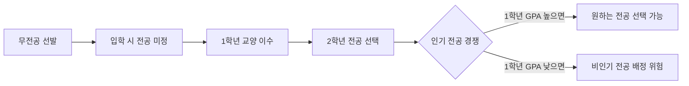

| 장점 | 단점 | 추천 학생 |
|------|------|---------|
| 전공 선택 유예 가능 | 인기 전공 경쟁 치열 | 진로가 불확실한 학생 |
| 합격선이 낮을 수 있음 | 1학년 GPA 관리 필수 | 다양한 관심사를 가진 학생 |
| 학과 변경 기회 | 원하는 전공 보장 안됨 | 대학 이름이 중요한 학생 |

> **상담 포인트**: "무전공으로 입학하면 합격선이 낮을 수 있지만, 1학년 때 좋은 성적을 받아야 원하는 전공을 선택할 수 있습니다. 전공이 확실하면 학과 직접 지원이 유리합니다."

### 전략 3: 2028 수능 대비 선제 전략 (현 고2)

| 시기 | 준비 내용 | 핵심 포인트 |
|------|---------|-----------|
| 고2 1학기 | 통합사회·통합과학 고1 교과서 복습 | 기초 개념 재확립 |
| 고2 여름 | 2027년 6월 모의평가 분석 | 최초 통합형 문항 유형 파악 |
| 고2 2학기 | 융합형 문제 풀이 연습 | AI·로봇·감염병 관련 지문 |
| 고3 1학기 | EBS 연계 교재 + 모의고사 | 실전 감각 |
| 고3 2학기 | 수능 최종 마무리 | 시간 관리 + 실수 방지 |

---

## 🇰🇷 국내 입시 자주 묻는 질문 40선 (상담용)

---

### 📌 [수능 기초] 1~10번

**Q01. 수능은 언제, 몇 번 볼 수 있나요?**
> 매년 11월 셋째 주 목요일에 1회만 치릅니다. 재응시를 원하면 다음 해에 다시 봐야 합니다. 고3 재학생과 졸업생(N수생) 모두 응시 가능합니다.

**Q02. 수능 과목은 어떻게 구성되나요?**

| 영역 | 과목 | 시간 | 2028 이후 변화 |
|------|------|------|------------|
| 국어 | 공통+선택(화법작문/언어매체) | 80분 | 구조 유지 |
| 수학 | 공통+선택(확통/미적/기하) | 100분 | 구조 변경 예정 |
| 영어 | 절대평가 | 70분 | 유지 |
| 한국사 | 필수, 절대평가 | 30분 | 유지 |
| 탐구 | 사탐/과탐/직탐 중 2과목 | 60분 | **2028: 통합사회·통합과학** |
| 제2외국어/한문 | 선택 | 40분 | 유지 |

**Q03. 영어 절대평가는 어떻게 계산되나요?**
> 원점수 90점 이상 = 1등급, 80점 이상 = 2등급, 70점 이상 = 3등급... 10점 간격으로 등급이 나뉩니다. 1등급이면 대부분 대학에서 만점 처리, 2등급부터 5~10점씩 감점됩니다.

**Q04. 수능 가채점과 실제 성적 발표는 언제인가요?**
> 수능 당일 오후부터 각 학원에서 가채점 서비스를 제공합니다. 공식 성적 발표는 수능 약 4주 후(12월 초~중순)입니다. 가채점으로도 지원 전략 수립이 가능합니다.

**Q05. 표준점수와 백분위의 차이는 무엇인가요?**
> **표준점수**: 전체 응시자 평균·표준편차를 반영한 점수 (시험이 어려울수록 올라감). **백분위**: 본인보다 낮은 점수를 받은 응시자의 비율 (백분위 99 = 상위 1%). 대학마다 활용 지표가 다르므로 지원 전 확인 필수입니다.

**Q06. 킬러문항 폐지가 수능 준비에 어떤 영향을 주나요?**
> 2024학년도부터 킬러문항이 폐지되어 초고난도 문제가 사라졌습니다. 그 결과 **1~2등급 변별이 중상위 문제**에서 이루어집니다. 어려운 문제 1개보다 쉬운 문제 10개를 완벽히 맞추는 전략이 더 중요해졌습니다.

**Q07. 수능 최저학력기준이란 무엇인가요?**
> 수시에서 합격 결정 전, 수능 성적이 일정 기준 이상이어야 최종 합격이 되는 조건입니다. 
 예: "3개 영역 합 6 이내" = 3개 영역 등급의 합이 6 이하여야 합격. 수능 최저를 충족하지 못하면 내신·면접이 아무리 좋아도 탈락합니다.

**Q08. 2028학년도 수능이 바뀐다고 하는데, 어떻게 변하나요?**
> 탐구 영역이 완전히 바뀝니다. 현재 17개 선택과목 중 2개를 고르는 방식에서 **'통합사회'와 '통합과학'으로 전원 동일한 시험**으로 바뀝니다. 
    또한 정보 과목이 신설됩니다. 현 고2(2028 수능 응시)부터 적용됩니다.

**Q09. 수능을 잘 못 봤으면 무조건 재수해야 하나요?**
> 아닙니다. 수능 성적이 낮아도 수시 합격 가능성, 희망 학과 여부, 비용, 멘탈 상태 등을 종합해 판단해야 합니다. 
    재수 후 성적이 오르는 비율은 약 30~40%이고, 오히려 떨어지는 경우도 20~30%입니다. 상담사와 함께 현실적으로 분석해야 합니다.

**Q10. EBS 연계 교재를 꼭 공부해야 하나요?**
> 수능 출제의 약 70%가 EBS 연계입니다. 완전히 똑같은 문제가 나오는 것이 아니라 지문·소재·개념이 유사하게 출제됩니다. 
    특히 국어 비문학, 영어 독해에서 연계 체감이 큽니다. EBS 교재는 필수이지만 맹목적 암기보다 개념 이해 중심으로 공부하세요.

---

### 📌 [수시 전략] 11~20번

**Q11. 수시와 정시 중 어느 것이 유리한가요?**

| 구분 | 수시 유리 | 정시 유리 |
|------|---------|---------|
| 내신 | 1~2등급 | 4등급 이하 |
| 수능 | 3~4등급 이하 | 1~2등급 |
| 비교과 | 풍부한 경우 | 없는 경우 |
| 2027 추세 | 수시 80.3%로 확대 | 정시 19.7%로 축소 |

> **상담 포인트**: "내신이 좋으면 수시, 수능이 좋으면 정시가 유리합니다. 둘 다 보통이면 투트랙으로 준비하세요."

**Q12. 수시 6개를 어떻게 배분해야 하나요?**
> 일반적으로 **상향 1~2개 + 적정 2~3개 + 안전 1~2개** 조합을 추천합니다. 
    안전지원 대학은 정시 목표보다 낮은 곳이면 안 됩니다 — 그렇게 되면 수시 납치 위험이 있습니다.

**Q13. 수시 납치가 무엇인가요? 어떻게 피하나요?**
> 수시에서 합격하면 무조건 그 대학에 등록해야 하고, 정시에 지원할 수 없습니다. 안전지원이 정시 목표보다 낮은 대학이면, 그 대학에 납치되는 것입니다.   **해결책**: 안전지원 대학을 정시 목표와 같거나 높은 수준으로 설정하거나, 수시 6개를 전부 상향으로 넣어 납치 자체를 피하세요.

**Q14. 학생부종합전형(학종)은 무엇을 주로 보나요?**

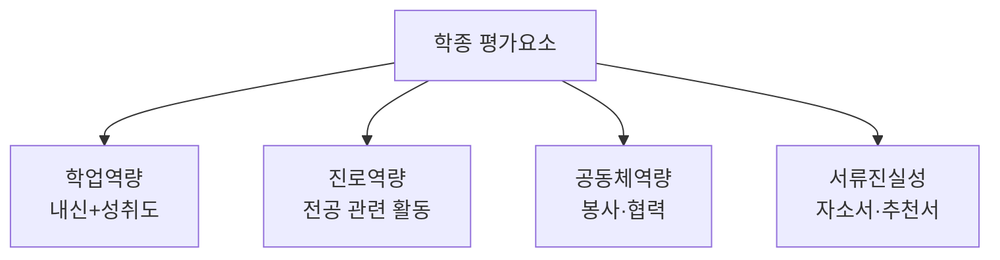

> 학업역량 40% + 진로역량 40% + 공동체역량 20% 정도로 반영됩니다. 내신이 전부가 아니라 **스토리와 성장 과정**이 핵심입니다.

**Q15. 학생부교과전형과 학종의 차이는 무엇인가요?**
> **교과전형**: 내신(교과 성적)을 수치로만 평가. 1등급에 가까울수록 유리. 수능 최저기준이 있는 경우 많음.
  **학종**: 내신 + 비교과(동아리·봉사·수상·독서 등) + 자소서 + 추천서를 종합 평가. 내신이 다소 낮아도 스토리가 좋으면 합격 가능.

**Q16. 논술전형은 경쟁률이 너무 높지 않나요?**
> 논술 경쟁률은 50~100:1로 매우 높습니다. 하지만 **수능 최저기준 충족자만 논술 채점**하는 경우가 많아, 실질 경쟁률은 10~20:1로 낮아집니다. 
  내신이 3~4등급이어도 논술 실력과 수능 최저만 충족하면 충분히 합격 가능합니다.

**Q17. 자기소개서(자소서)는 어떻게 써야 하나요?**
> 핵심 원칙 세 가지: 
    **① 구체적 에피소드** (언제, 어디서, 무엇을 했는지), 
    **② 성장과 변화** (그 경험으로 무엇이 달라졌는지), 
    **③ 진정성** (포장하지 말고 솔직하게). 학교생활기록부에 없는 내용을 쓰면 확인이 안 되므로, 반드시 생기부 기반으로 작성하세요.

**Q18. 면접은 어떻게 준비해야 하나요?**
> **서류 기반 면접**: 자소서와 생기부를 완벽히 숙지하고, 예상 질문 30~50개를 뽑아 연습. 
    **인성 면접**: 솔직하고 일관된 답변. 
    **제시문 면접**: 30분 준비 후 발표 → 전공 관련 지식과 논리적 사고 연습 필수. 모의 면접을 최소 3~5회 이상 해야 합니다.

**Q19. 생활기록부(생기부) 관리는 언제부터 시작해야 하나요?**
> **고1 입학 첫 날부터**입니다. 생기부는 고1~고3 전체가 기록되므로 늦게 시작할수록 불리합니다. 
   특히 동아리·수상·독서·세특(세부능력특기사항)은 1학년 때부터 체계적으로 쌓아야 합니다.

**Q20. 수능 최저기준을 충족 못 하면 수시 합격이 취소되나요?**
> 네, 수능 최저기준이 있는 전형에서 최저를 충족하지 못하면 
    1단계·면접에서 아무리 잘해도 최종 불합격입니다.
         예: 고려대 학교추천전형 수능 최저 3개 합 7 
                 — 국어 2등급+수학 2등급+영어 3등급이면 합 7이므로 충족. 수능 최저가 있는 전형은 반드시 수능 준비를 병행해야 합니다.

---

### 📌 [정시·대학 선택] 21~30번

**Q21. 정시에서 가·나·다군은 어떻게 활용하나요?**

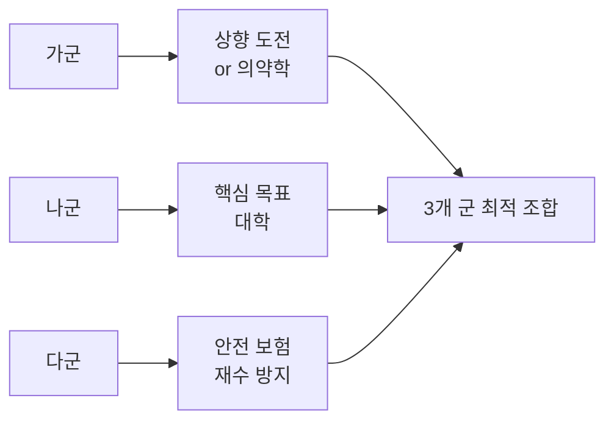

> "가·나·다군 중 하나에만 최종 등록 가능합니다. 세 군 모두 합격해도 한 곳만 선택해야 합니다."

**Q22. 추가합격(추합)은 얼마나 기대할 수 있나요?**
> 대학에 따라 다르지만, 수시 이탈로 인해 정시 추합이 많이 돌아갑니다.
    SKY 대학은 100~300% (모집인원의 1~3배), 중위권 대학은 200~500%까지 돌기도 합니다. 
    추합을 기다릴 때는 다른 합격 대학에 우선 등록하고 기다리세요.

**Q23. 서울대·연세대·고려대 중 어디가 더 합격하기 쉬운가요?**
> 학과에 따라 다릅니다. 수능 반영 방식도 다르므로 본인 성적 구성에 따라 유불리가 달라집니다. 
    **수학 강하면** 연세대(이) 유리,  **국어 강하면** 서강대·고려대(인) 유리.  전년도 합격선과 본인 수능 환산점수를 비교해 결정하세요.

**Q24. 서울 소재 대학과 거점 국립대 중 어디가 더 좋은가요?**

| 비교 | 서울 사립대 | 거점 국립대 |
|------|---------|---------|
| 등록금 | ₩800~1,100만/년 | ₩400~600만/년 |
| 취업 | 서울·수도권 유리 | 지역 취업 유리 |
| 장학금 | 교내 위주 | 국가장학금+교내 |
| 대학원 | 서울 소재 이점 | 연구 인프라 우수 |
> "지역 취업 계획이면 거점 국립대, 서울 취업이면 서울 소재 대학을 추천합니다."

**Q25. 의대를 가려면 수능 점수가 얼마나 필요한가요?**
> 서울 주요 의대(서울대·연세대·고려대)는 **백분위 99.5% 이상**, 수도권 의대는 **98~99%**, 지방 국립대 의대는 **95~98%**, 지방 사립 의대는 **93~96%**가 합격선입니다. 전 영역 1등급이 기본 요건이며, 1개 영역에서도 2등급이면 서울 의대는 매우 어렵습니다.

**Q26. 약학과는 어떻게 가나요? 의대랑 비슷하게 어려운가요?**
> 약학과는 2022년부터 학부 직접 입학으로 바뀌었습니다. 수능 백분위 94~98% 수준으로 의대보다 약간 낮습니다. 경쟁률은 오히려 의대보다 높은 경우도 있습니다. 화학·생물 관련 이과 지식이 중요합니다.

**Q27. 무전공 선발로 입학하면 원하는 전공을 선택할 수 있나요?**
> 반드시 그렇지는 않습니다. 무전공 입학 후 1~2학년 성적(GPA) 기준으로 전공을 배정받는 경우가 많습니다. 인기 전공(의예·컴공 등)은 무전공 입학생들 사이에서도 경쟁이 치열합니다. 전공이 확실하면 학과 직접 지원이 안전합니다.

**Q28. 수시에서 특기자전형이란 무엇인가요?**
> 수학·과학 올림피아드, 외국어 특기, 예체능 특기 등을 가진 학생을 선발하는 전형입니다. SKY를 비롯한 상위권 대학에서 소규모로 운영합니다. 
    수능 최저가 없는 경우가 많지만, 특기 수준이 국내 최상위 이상이어야 합니다.

**Q29. 편입은 언제 가능하며, 일반 입시보다 쉬운가요?**
> 2~3학년 재학 후 편입시험(학사편입)에 응시할 수 있습니다. 
    상위권 대학 편입 경쟁률은 매우 높고, 영어(TOEIC 등) + 전공 필기시험이 있습니다. 
    "쉽다"라고 할 수 없지만, 내신·수능과는 다른 준비가 필요합니다. 
    특히 전문대 졸업 후 4년제 편입 시 활용도 높습니다.

**Q30. 정시에서 수시 최초합과 수시 충원합 차이는 무엇인가요?**
>   **최초합**: 수시 1단계·면접 등 전형 후 최초로 합격 발표된 인원.
    **충원합(추합)**: 최초합 합격자 중 등록 포기자가 생겼을 때 대기 순번대로 연락되는 합격. 수시 최초합·충원합 모두 등록하면 정시에 지원 불가입니다.

---

### 📌 [특수전형·기타] 31~40번

**Q31. 사관학교는 어떻게 지원하나요?**
> 7~8월에 원서를 접수합니다 (수능 이전).
     1차 서류/필기 → 2차 신체·체력·면접 순서입니다. 
    정시 가·나·다군과 중복 지원이 가능합니다. 등록금이 전액 면제되고 월 급여도 지급되지만, 졸업 후 6~10년 의무 복무가 있습니다.

**Q32. 경찰대학교는 서울대보다 들어가기 어렵나요?**
> 수능 성적 기준으로는 서울대보다 낮습니다 (상위 5~10% 수준). 
    하지만 1차 자체 필기시험,   2차 체력·신체·면접을 추가로 통과해야 하므로 종합적으로 쉽지 않습니다.  공직 가치관과 체력이 좋고 졸업 후 경찰 진출이 확실하다면 최선의 선택입니다.

**Q33. KAIST, POSTECH은 내신이 낮아도 갈 수 있나요?**
> 수시 100%(KAIST) 또는 수시 중심(POSTECH)이라 내신만 보지 않습니다. 
    올림피아드 수상, 연구 경험, R&E 활동, 심화 학습 등 **학문적 열정과 수학·과학 심화 능력**이 핵심입니다. 
    내신 1~3등급 학생도 합격하지만, 활동과 면접 준비가 철저해야 합니다.

**Q34. 한국예술종합학교(한예종)는 수능을 안 봐도 되나요?**
> 네, 한예종은 수능을 전혀 반영하지 않습니다. 실기 100%로 선발합니다. 
    경쟁률이 매우 높고 실기 수준이 프로 수준이어야 합니다. 
    다만 한예종 불합격 시 대안이 없으므로, 일반 대학 예체능 전형(수능 최저 있음)도 병행 준비하는 것이 안전합니다.

**Q35. 지방 학생은 서울 대학 입시에서 불리한가요?**
> 수능·정시에서는 불리하지 않습니다. 
    다만 학생부종합에서 서울 학교보다 비교과 기회가 적을 수 있습니다. 
    단, 많은 대학이 지역균형 전형을 운영해 지방 학생을 별도 선발합니다. 
    수도권 대학의 지역균형 모집이 786명 증가(2027)하고 있습니다.

**Q36. 검정고시 출신도 수시에 지원할 수 있나요?**
> 검정고시 출신은 학생부가 없어 학종·교과전형 지원이 불가한 경우가 많습니다. 
    논술전형, 정시 일반전형은 지원 가능합니다. 일부 대학은 검정고시 학생부종합전형을 별도 운영하기도 합니다. 
    지원 전 해당 대학 모집요강을 반드시 확인하세요.

**Q37. N수생(재수생)은 수시에서 불리한가요?**
> 재수생은 학생부가 고3 때까지만 기록되어 있고, 이후 비교과 활동이 없습니다. 
    일부 대학은 재수생 지원을 제한하기도 합니다. 
    반면 **수능·논술·정시**에서는 전혀 불리하지 않습니다. 재수생은 정시 집중 전략을 권장합니다.

**Q38. 국가장학금은 어떻게 받나요?**
> 한국장학재단에 소득분위 신청을 하면 됩니다. 
    소득 1~8구간에 따라 최대 연 700만원까지 지원됩니다. 
    국립대는 소득 3구간 이하 학생에게 등록금 전액 지원도 가능합니다. 
    합격 후 바로 신청하고, 성적 기준(직전 학기 12학점 이상, B학점 이상)을 유지해야 계속 받을 수 있습니다.

**Q39. 반수(半修)란 무엇이고, 추천하나요?**
> 대학에 재학 중이면서 수능을 다시 보는 것입니다. 1~2학기 재학 후 수능에 재응시해 더 좋은 대학으로 가려는 전략입니다. 
    심리적으로 불안정하고, 대학 수업과 수능 준비를 병행해야 하는 부담이 있습니다. 목표와 의지가 확실할 때만 추천합니다.

**Q40. 입시에서 가장 많이 하는 실수 TOP 5는 무엇인가요?**

| 순위 | 실수 | 대응 방법 |
|------|------|---------|
| 1 | 수시 납치 (안전지원이 정시 목표보다 낮음) | 수시 안전지원 = 정시 목표 이상으로 설정 |
| 2 | 수능 최저 미충족 | 수시·정시 병행 준비 시 최저 반드시 확인 |
| 3 | 가·나·다군 모두 상향 지원 | 다군은 무조건 안전지원 |
| 4 | 추합 기다리다 등록 기한 놓침 | 추합 대기 중에도 현재 합격 대학 임시 등록 |
| 5 | 모집요강 확인 안 하고 지원 | 매년 바뀌는 모집요강 반드시 최신 확인 |

---

## 🌍 해외 입시 자주 묻는 질문 40선 (상담용)

---

### 📌 [미국 입시 기초] 1~10번

**Q01. 미국 대학 입시는 국내 입시와 무엇이 가장 다른가요?**

| 구분 | 국내 | 미국 |
|------|------|------|
| 핵심 요소 | 수능·내신 | GPA·SAT·에세이·과외활동 |
| 지원 횟수 | 수시 6회+정시 3회 | 제한 없음 |
| 합격 결정 | 12~1월 | 3~4월 (RD) / 12월 (ED) |
| 면접 | 수시 일부 | 선택적 동문 인터뷰 |
| 에세이 비중 | 낮음 | 매우 높음 (★★★★★) |

**Q02. SAT는 꼭 봐야 하나요? Test-Optional 아닌가요?**
> 2026년 기준 Harvard·MIT·Yale·Dartmouth·Brown·Georgetown 등이 SAT를 다시 필수로 요구합니다. 
    Test-Optional 대학도 합격자의 70%가 SAT를 제출합니다. 
    **1450점 이상이면 반드시 제출, 1400점 미만이면 제출 여부를 상담사와 검토하세요.**

**Q03. SAT 점수를 올리려면 어떻게 해야 하나요?**

| 현재 점수 | 목표 | 기간 | 전략 |
|---------|------|------|------|
| 1200 미만 | 1400 | 12개월+ | 기초 영어·수학 + Khan Academy |
| 1300~1399 | 1450 | 6개월 | 오답 분석 + 약점 영역 집중 |
| 1400~1449 | 1500 | 3~4개월 | 시간 관리 + 고난도 유형 |
| 1450~1499 | 1550+ | 3개월 | 실전 모의고사 + 세부 전략 |

> **공식 무료 준비**: Khan Academy SAT 준비 프로그램 (College Board 공식 제휴)

**Q04. GPA는 어떻게 관리해야 하나요?**
> 한국 내신을 미국식 GPA(4.0 만점)로 환산하여 제출합니다. 
    AP/IB 과목 이수 시 가중치(5.0)가 부여됩니다. 
    Ivy League는 unweighted GPA 3.9+ 가 일반적 기준입니다. 한국 내신 1.5등급 이내를 유지하는 것을 목표로 하세요.

**Q05. ED(Early Decision)와 EA(Early Action)의 차이는 무엇인가요?**

| 구분 | ED | EA/REA |
|------|----|----|
| 마감일 | 11월 1일 | 11월 1일 |
| 결과 발표 | 12월 중순 | 12월~1월 |
| 구속력 | **있음** (합격 시 무조건 등록) | **없음** |
| 합격률 | RD의 2~5배 | RD의 1.5~2배 |
| 장학금 협상 | 불가 | 가능 |
> "1순위 대학이 확실하고 재정 상황이 괜찮으면 ED를 강력히 추천합니다."

**Q06. Common Application 에세이는 어떻게 써야 하나요?**
> **650단어 내외**로, 7개 주제 중 하나를 선택합니다. 핵심 원칙: 
 ① 나만의 이야기 (남과 다른 관점), 
 ② 구체적 에피소드 (추상론 금지), 
 ③ 성장과 변화 (결말이 있어야 함), 
 ④ 진정성 (AI 작성 금지 — 감지 시 불합격). 
 한국적 배경(이중언어, 문화 경험)을 강점으로 활용하세요.

**Q07. 과외활동(EC)은 어떻게 준비해야 하나요?**
> 개수보다 **깊이와 일관성**이 중요합니다. 10개 얕은 활동보다 3개 깊은 활동이 낫습니다. Ivy League는 다음 중 하나 이상을 원합니다: 
    ① 올림피아드·대회 수상, 
    ② 연구 논문·인턴십, 
    ③ 창업·사회적 임팩트, 
    ④ 예체능 특기. 9학년(고1)부터 시작하세요.

**Q08. 추천서는 누구한테 받아야 하나요?**
> 교사 추천서 2명 + 카운셀러 추천서 1명이 기본입니다. 
    추천서 교사는 **본인을 잘 아는 교과 선생님** (단순히 성적 좋은 과목 선생님이 아니라)을 선택하세요. 
    11학년 때 부탁하고, 충분한 시간을 드리세요. 추천서에는 구체적 에피소드가 담겨야 강력한 추천서가 됩니다.

**Q09. UC계열(UCLA, UC Berkeley 등)은 SAT를 안 봐도 되나요?**
>   네, UC 계열은 2021년부터 SAT/ACT를 공식적으로 반영하지 않습니다. 
    대신 UC 에세이 4개(Personal Insight Questions)가 핵심입니다. GPA + 에세이 + 과외활동으로 승부해야 합니다.

**Q10. 미국 대학 학비 재정보조는 실제로 얼마나 받을 수 있나요?**

| 가정 소득 (연) | Harvard 기준 예상 부담 | 비고 |
|------------|-----------------|------|
| ₩5,000만 이하 | $0~3,000 | 거의 전액 지원 |
| ₩5,000만~₩1억 | $3,000~15,000 | 상당 부분 지원 |
| ₩1억~₩2억 | $15,000~40,000 | 일부 지원 |
| ₩2억 이상 | $50,000~80,000 | 거의 자비 |
> "Need-blind 대학(Harvard, Yale, Princeton, MIT)은 합격만 하면 학비 걱정이 줄어듭니다. CSS Profile을 정확히 작성하세요."

---

### 📌 [미국·영국·유럽 전략] 11~20번

**Q11. Ivy League가 아니어도 미국에서 좋은 취업을 할 수 있나요?**
> 네, 오히려 Georgia Tech·UIUC·Purdue(공학), UMich·UVA(경영·법), NYU·Emory(금융·의학) 등은 특정 산업에서 Ivy League 못지않은 취업률을 자랑합니다. 학비는 절반 수준입니다.

**Q12. 영국 UCAS Personal Statement는 어떻게 써야 하나요?**
> 4,000자(영문) 이내, 1개의 에세이로 5개 대학 모두에 제출합니다. **구성**: 도입(전공 선택 이유) 20% + 학업 경험(관련 독서·연구) 40% + 과외활동 20% + 결론(미래 계획) 20%. 미국 에세이와 달리 **학문적 열정 80%** 중심으로 써야 합니다.

**Q13. 옥스브리지(Oxford·Cambridge) 입시는 어떻게 다른가요?**
> 일반 UCAS 마감보다 3개월 빠른 10월 15일 마감. 자체 입학시험(MAT·TSA·BMAT·STEP 등) 필수. 면접은 교수와 학문적 토론 방식으로 진행됩니다. 합격률은 약 17~18%이며 유학생은 10~12%입니다.

**Q14. A-level과 IB 중 무엇이 더 유리한가요?**
> 영국 대학은 A-level을 선호하지만, IB도 동등하게 인정합니다. 미국·캐나다·유럽 대학에는 IB가 더 광범위하게 인정됩니다. **여러 나라를 동시에 노린다면 IB**, **영국 집중이면 A-level**을 추천합니다.

**Q15. 독일 대학은 정말 무료인가요? 한국 학생도 해당되나요?**
> 대부분의 독일 공립대학은 학비가 없습니다 (학기당 €150~350 행정비만). 한국 학생도 동일 조건이 적용됩니다. 단, **학부는 독일어 수업**(TestDaF 4×4 수준 필요), **석사부터 영어 과정** 가능. 학비 절약이 최우선이면 독일 대학을 적극 고려하세요.

**Q16. 싱가포르 NUS·NTU는 한국 수능 성적으로 지원 가능한가요?**
> 네, NUS와 NTU는 한국 수능 성적을 공식 인정합니다. 수능 전 영역 1~2등급 + IELTS 6.5+ 이면 지원 가능합니다. MOE 장학금(학비 50% 감면, 3년 취업 조건)도 신청할 수 있습니다.

**Q17. 일본 대학은 왜 가나요? 한국과 비교해 장단점은?**

| 비교 | 일본 | 한국 |
|------|------|------|
| 학비 | 국공립 연 ₩500만 | 국립 연 ₩400~600만 |
| 취업 | 일본 기업 취업 유리 | 한국 기업 취업 유리 |
| 생활 | 안전하고 깔끔 | 익숙한 환경 |
| 언어 | 일본어 필요 | 모국어 |
| 추천 | 일본 취업 희망, 한일 비즈니스 | 한국 취업 확실 |

**Q18. 캐나다·호주는 이민을 위해 가는 건가요?**
> 이민 연계가 강점이지만, 학위 자체의 가치도 높습니다. Toronto·UBC(캐나다), Melbourne·UNSW(호주)는 QS 세계 50위권 대학입니다. 졸업 후 취업비자(캐나다 PGWP 3년 / 호주 485 비자 2~4년) → 영주권 경로가 잘 갖춰져 있어 장기 이민을 고려한다면 최선의 선택입니다.

**Q19. 홍콩 대학은 안전한가요? (사회적 불안 고려)**
> 2020년 이후 홍콩의 정치적 상황으로 일부 학생이 우려하지만, HKU·HKUST·CUHK는 여전히 QS 세계 20~50위권 명문입니다. 학문의 자유와 캠퍼스 안전에는 큰 문제가 없으며, 졸업 후 국제 금융·비즈니스 분야 취업에 매우 유리합니다. 장기 거주 계획이 없다면 충분히 추천합니다.

**Q20. 해외 대학과 국내 대학을 동시에 준비할 수 있나요?**
> 가능합니다. 하지만 시간·비용·에너지가 많이 필요합니다. 현실적 조합: ① 국내 수시 + 미국 RD (타임라인 겹치지 않음), ② 국내 정시 + 일본·싱가포르 (1~3월 지원), ③ 국내 수시·정시 + 캐나다·호주 (11~1월 지원). 해외는 에세이·시험 준비가 추가되므로 고2 여름부터 준비해야 합니다.

---

### 📌 [실전·비용·비자·진로] 21~40번

**Q21. 해외 대학 학비는 총 얼마나 드나요? (4년 기준)**

| 국가 | 학비(4년) | 생활비(4년) | 총 비용 |
|------|---------|---------|--------|
| 미국 사립 | $280,000 | $80,000 | **$360,000 (약 ₩5억)** |
| 영국 (3년) | £84,000 | £48,000 | **£132,000 (약 ₩2.3억)** |
| 독일 | €6,000 | €48,000 | **€54,000 (약 ₩8,000만)** |
| 싱가포르 | S$140,000 | S$60,000 | **S$200,000 (약 ₩2억)** |
| 캐나다 | CA$140,000 | CA$80,000 | **CA$220,000 (약 ₩2.2억)** |
| 호주 | AU$152,000 | AU$88,000 | **AU$240,000 (약 ₩2.2억)** |
| 일본 국공립 | ¥2,100,000 | ¥4,800,000 | **¥6,900,000 (약 ₩6,500만)** |

**Q22. 해외 장학금은 어떻게 받나요?**

| 장학금 | 대상 국가 | 금액 | 경쟁률 |
|--------|---------|------|--------|
| 한국 정부 장학금(GKS) | 전 세계 | 학비+생활비 전액 | 높음 |
| Chevening | 영국 (석사) | 전액 | 높음 |
| DAAD | 독일 | 월 €861~1,200 | 보통 |
| MEXT | 일본 | 월 ¥117,000~145,000 | 보통 |
| Harvard Need-blind | 미국 | 소득 따라 전액 가능 | 합격이 관건 |
| MOE Tuition Grant | 싱가포르 | 학비 50% | 비교적 쉬움 |

**Q23. F-1 비자 (미국 학생비자)는 어떻게 받나요?**
> 합격 후 대학에서 I-20 서류를 발급합니다 → SEVIS 비용 납부 → 미국 대사관 비자 인터뷰 → F-1 비자 발급. 인터뷰에서는 학업 계획, 귀국 의사, 재정 능력을 주로 묻습니다. 합격 후 6개월 이내에 신청 권장합니다.

**Q24. 미국·영국·캐나다 등에서 아르바이트를 할 수 있나요?**

| 국가 | 허용 시간 | 비고 |
|------|---------|------|
| 미국 (F-1) | 캠퍼스 내 주 20시간 | 캠퍼스 외 불가 (OPT/CPT 별도) |
| 영국 | 주 20시간 | 방학 중 전일 가능 |
| 캐나다 | 주 20시간 | 방학 중 전일 가능 |
| 호주 | 주 48시간/2주 | 방학 중 무제한 |
| 일본 | 주 28시간 | 자격외활동허가 신청 |

**Q25. 해외 대학 졸업 후 한국에서 학위 인정이 되나요?**
> 미국·영국·캐나다·호주·일본 등 주요 국가의 정규 4년제 대학 학사 학위는 한국에서 정식 학사로 인정됩니다. 취업 시에도 해외 학사 학위를 국내 학사와 동등하게 인정합니다. 다만 의사·약사·변호사 등 전문직 자격은 별도 국내 시험이 필요합니다.

**Q26. 영국 의대를 나오면 한국에서 의사로 일할 수 있나요?**
> 영국 의대 졸업 후 한국 의사 면허를 취득하려면 **한국 의사 국가고시에 합격**해야 합니다. 외국 의대 졸업자도 응시 가능하지만, 한국 의과 교육과정과 다를 수 있어 별도 준비가 필요합니다. 영국에서 의사로 일하려면 영국 GMC 등록이 별도로 필요합니다.

**Q27. 해외 대학에서 전공을 바꿀 수 있나요?**
> 미국은 2학년까지 전공 선언을 유예하는 대학이 많고, undecided(미정)로 입학 후 바꾸는 것이 일반적입니다. 영국은 전공 변경이 비교적 어렵습니다 (처음부터 전공 기반 선발). 캐나다·호주는 1학년 후 변경 가능한 경우가 많습니다.

**Q28. 해외에서 공부하다 한국으로 돌아오면 취업이 잘 되나요?**
> 분야에 따라 크게 다릅니다. 글로벌 기업·금융·컨설팅·IT 분야는 해외 학위가 매우 유리합니다. 반면 공무원·법조·의료 등 내수 중심 직종은 오히려 국내 학위가 유리할 수 있습니다. 졸업 후 진로를 먼저 정하고 국내/해외를 결정하세요.

**Q29. 해외에서 한국어를 쓰며 살 수 있나요? 적응이 어렵지 않나요?**

| 국가 | 한국인 커뮤니티 | 적응 난이도 | 팁 |
|------|------------|---------|-----|
| 미국 (LA·NY) | 매우 큼 | 보통 | 코리아타운 활용 |
| 캐나다 (밴쿠버·토론토) | 매우 큼 | 쉬움 | 한인 비중 높음 |
| 호주 (시드니·멜버른) | 큼 | 쉬움 | |
| 일본 | 보통 | 쉬움 (문화 유사) | |
| 싱가포르 | 보통 | 쉬움 (영어 환경) | |
| 독일 | 소규모 | 어려움 | 독일어 필수 |

**Q30. 해외 대학 입시 컨설팅은 필요한가요?**
> 미국 Ivy League·영국 옥스브리지 수준이면 전문 입시 컨설팅이 에세이·활동 전략에서 실질적 도움이 됩니다. 비용은 한국 기준 연 300만~1,500만원입니다. 캐나다·호주는 상대적으로 간단하므로 컨설팅 없이도 충분히 준비 가능합니다.

**Q31. 국제학교를 나온 학생이 더 유리한가요?**
> 미국·영국 등 해외 지원 시 국제학교 IB·A-level 이수가 도움이 됩니다. 하지만 국내 대학 정시·수시에서는 한국 일반고와 동일한 평가를 받습니다. 양쪽 다 목표라면 한국 일반고 + SAT 병행이 현실적입니다.

**Q32. TOEFL과 IELTS 중 어느 것이 유리한가요?**

| 구분 | TOEFL iBT | IELTS Academic |
|------|----------|----------------|
| 미국 대학 | 선호 (대부분 인정) | 인정 |
| 영국·호주·캐나다 | 인정 | 선호 |
| 목표 점수 | 100~110+ | 7.0~7.5+ |
| 시험 특성 | 컴퓨터 기반, 통합 형식 | 대면 Speaking 포함 |
> "미국이 목표면 TOEFL, 영국·호주가 목표면 IELTS를 추천합니다."

**Q33. IB(국제바칼로레아)는 국내 대학에서도 인정되나요?**
> 일부 국내 대학(특히 연세대·서강대 등)이 IB 성적을 수능 대체로 인정하거나, 별도 IB 전형을 운영합니다. 하지만 대부분의 국내 대학은 IB보다 수능을 요구합니다. IB를 이수하면서 국내 입시를 준비하는 것은 매우 부담이 크므로, 해외 진학이 확실할 때만 IB를 권장합니다.

**Q34. 어학연수 경험이 해외 입시에 도움이 되나요?**
> 어학연수 자체는 입시에서 큰 가산점이 아닙니다. 대신 **TOEFL/IELTS 점수**, **과외활동**, **에세이**가 핵심입니다. 짧은 어학연수보다 그 시간에 SAT 준비나 의미 있는 활동을 하는 것이 더 효과적입니다.

**Q35. 해외 대학 입시에서 한국계 학생이 불리한가요?**
> 미국 일부 사립대(특히 Ivy)에서 아시안 학생 합격률이 낮다는 분석이 있습니다. 그러나 2023년 대법원 판결로 인종 고려 정책이 금지되어, 이제는 성적과 활동만으로 평가됩니다. **한국적 배경(이중문화, 언어, 가족 스토리)을 강점으로 어필**하는 것이 중요합니다.

**Q36. 캐나다 Waterloo 컴퓨터과학은 어떻게 가나요? 정말 좋은가요?**
> Waterloo CS는 세계 최대 Co-op 프로그램으로 유명합니다. 입학 요구: 내신 상위 + IELTS 7.0+. 한국 내신 1~2등급 + 수능 1~2등급 수준이 필요합니다. 졸업 후 Google·Microsoft 인턴 급여가 월 CA$6,000~8,000입니다. 취업 확실한 이공계 학생에게 적극 추천합니다.

**Q37. 호주 대학 파운데이션 코스는 어떻게 진행되나요?**
> 고교 졸업 후 대학 부설 파운데이션 1년을 이수하면 해당 대학 2학년(또는 1학년) 진학이 보장됩니다. IELTS 5.5 수준으로 입학 가능하고, 파운데이션 수료 후 IELTS 6.5~7.0으로 올립니다. Melbourne Trinity College, Sydney Taylors College 등이 유명합니다.

**Q38. 중국 베이징대·칭화대는 외국인 입학이 어떻게 되나요?**
> 외국인 유학생 전형으로 SAT/수능/내신 + HSK 5~6급 성적으로 지원합니다. 학비는 연 ¥28,000~45,000(약 ₩500~800만)으로 저렴합니다. 졸업 후 중국 내 한국 기업이나 중국 기업 취업에 유리합니다. 단, HSK 6급 준비에 최소 18~24개월이 필요합니다.

**Q39. 해외 대학과 국내 대학원을 조합하는 전략은 어떤가요?**

| 조합 | 장점 | 추천 분야 |
|------|------|---------|
| 국내 학부 → 미국/영국 대학원 | 국내 기반 + 해외 학위 | AI·경영·법학·경제 |
| 해외 학부 → 국내 취업 | 해외 경험 + 국내 네트워크 | 글로벌 기업 국내 지사 |
| 해외 학부 → 해외 취업 | 글로벌 커리어 | IT·금융·컨설팅 |
| 국내 학부 → 해외 취업 | 비용 절감 + 해외 도전 | 영어 역량 확실 시 |

**Q40. 해외 입시에서 가장 많이 하는 실수 TOP 5는 무엇인가요?**

| 순위 | 실수 | 해결책 |
|------|------|--------|
| 1 | ED로 지원하고 재정 상황 미확인 → 합격 후 등록 못함 | ED 지원 전 CSS Profile 시뮬레이션 필수 |
| 2 | 에세이를 AI로 작성 → 감지 시 자동 불합격 | 반드시 본인이 직접 작성 |
| 3 | TOEFL/IELTS 목표 점수 과소평가 | 목표 대학 최소 요구 점수보다 0.5~1점 높게 준비 |
| 4 | 마감일 혼동 (옥스브리지 10/15 vs UCAS 1/15) | 각 대학·제도별 마감일 캘린더 작성 |
| 5 | 한국 내신을 그대로 제출 (GPA 환산 없이) | 4.0 만점 기준으로 환산하여 제출 |

---

## 파일 인덱스

| 파일명 | 내용 | 주요 대상 |
|--------|------|---------|
| [국내_가군_대학_입시.md](국내_가군_대학_입시.md) | 서울대·POSTECH·경희대(의) 등 가군 | 최상위~상위권 |
| [국내_나군_대학_입시.md](국내_나군_대학_입시.md) | SKY·성균관·한양·서강·이화 등 나군 | 상위~중상위권 |
| [국내_다군_대학_입시.md](국내_다군_대학_입시.md) | 건대·홍대·숙명·아주대 등 다군 | 중상위~중위권 |
| [국내_라군_특수전형_입시.md](국내_라군_특수전형_입시.md) | 사관학교·경찰대·과학기술원·한예종 | 특수 진로 |
| [해외_가군_미국_대학_입시.md](해외_가군_미국_대학_입시.md) | Ivy League·MIT·Stanford·UC계열 | 해외 최상위 |
| [해외_나군_영국_유럽_대학_입시.md](해외_나군_영국_유럽_대학_입시.md) | 옥스브리지·UCL·ETH·TU뮌헨·EPFL | 영국·유럽 |
| [해외_다군_아시아_대학_입시.md](해외_다군_아시아_대학_입시.md) | 도쿄대·NUS·HKU·베이징대·칭화대 | 아시아 |
| [해외_라군_캐나다_호주_기타_대학_입시.md](해외_라군_캐나다_호주_기타_대학_입시.md) | Toronto·UBC·Melbourne·ANU·IIT | 이민 연계 |

---

> 작성일: 2026년 2월 | 본 가이드는 커리어패스 기반 대학 입시 전략 수립용으로 제작되었습니다.
> 최신 모집요강은 반드시 해당 연도 각 대학 공식 입학처를 통해 확인하시기 바랍니다.
