# 한국 캐리어 패스 완전 가이드 (상)
## 특목고 → 좋은 대학 → 좋은 직장

> 수능·학종 전체를 아우르는 전체 구조도 + 단계별 중요도 분석
> 2026학년도 현행 + 2028학년도 개편안 비교 | 비즈니스고·마이스터고 포함
> **구체적 입시 전략 · 고교 유형별 루트 · 합격 타임라인 수록**

---

## 0. 대입 전형 핵심 먼저 잡기 (학종·정시·수시·교과)

대입 전략은 용어부터 정확히 정리하면 절반은 끝납니다.  
가장 많이 헷갈리는 4가지는 아래처럼 이해하면 실전에서 흔들리지 않습니다.

### 0-1. 한눈에 보는 구조

- **수시**: 고3 9월 전후 원서 접수, 학생부·면접·논술·실기 등으로 선발
- **정시**: 수능 성적 중심 선발 (12월 수능 이후)
- **학종(학생부종합전형)**: 수시 안의 전형, 내신 + 세특/탐구/면접 등 종합평가
- **교과(학생부교과전형)**: 수시 안의 전형, 내신(교과 성적) 중심 평가

정리하면, **수시 안에 학종·교과·논술·실기 등이 있고, 정시는 별도 축**입니다.

### 0-2. 전형별 평가 요소와 준비 포인트

| 전형 | 핵심 평가 요소 | 강점 | 주의점 | 준비 포인트 |
|------|----------------|------|--------|-------------|
| **학종** | 내신 + 세특 + 과목선택 + 탐구 깊이 + 면접 | 성장 스토리·전공적합성 반영 | 준비 기간 길고 대학별 기준 다름 | 활동 개수보다 연결성·심화, 생기부 기반 면접 대비 |
| **교과** | 내신 중심(학교별 반영 교과·학년 비율 상이) | 기준이 비교적 명확 | 수능최저/면접 변수 존재 | 반영 교과·학년 비율 확인, 수능최저 동시 준비 |
| **정시** | 수능 성적(대학별 환산식·가산점) | 역전 가능성 높음 | 시험 당일 리스크 큼 | 과목별 목표 백분위 설정, 실전 모의·시간 관리 |
| **수시(공통)** | 학교생활 기반 다면평가 | 기회가 다양(최대 6회) | 전형요강 해석 실수 위험 | 대학별 전형요강·수능최저·면접일정 선확인 |

### 0-3. 학생 유형별 추천 전략 (실전형)

- **내신 강점형**: 교과 + 학종 중심, 정시는 최저 충족/안전장치로 운영
- **탐구·활동 강점형**: 학종 중심 + 교과 일부 + 정시 병행
- **수능 강점형**: 정시 중심, 수시는 최저 부담 낮은 카드로 압축
- **균형형**: 수시 4~5장 + 정시 대응으로 리스크 분산

### 0-4. 지원 전략 기본 공식

1. **목표 학과 우선**: 대학보다 학과를 먼저 정하면 과목 선택과 활동이 정리됩니다.
2. **수능최저 체크**: 수시 합격 가능성은 수능최저 충족 여부에서 크게 갈립니다.
3. **전형요강 우선**: 블로그 정보보다 대학 모집요강 기준으로 최종 판단합니다.
4. **상향·적정·안정 분산**: 수시 6장은 성향별 분산이 필수입니다.
5. **학종은 스토리 일관성**: 과목선택-탐구-세특-면접 답변이 한 줄로 연결되어야 강합니다.

### 0-5. 자주 묻는 질문 (FAQ 10)

#### Q1. 수시와 정시는 무엇이 가장 다른가요?
 - 수시는 학교생활과 활동을 반영하는 다면평가이고, 정시는 수능 점수 중심 평가입니다. 
 - 준비 방식이 완전히 달라서, 고2부터 병행 비율을 정해 운영하는 것이 안전합니다.

#### Q2. 학종은 스펙을 많이 쌓아야 유리한가요?
 - 아닙니다. 활동 개수보다 **전공과 연결된 탐구의 깊이와 일관성**이 더 중요합니다. 
 - 대학은 "무엇을 했는가"보다 "왜 했고, 무엇을 배웠는가"를 봅니다.

#### Q3. 교과 전형은 내신만 좋으면 끝인가요?
  - 아닙니다. 대학에 따라 수능최저, 면접, 출결 반영이 있습니다. 
  - 내신이 좋아도 수능최저를 못 맞추면 불합격할 수 있습니다.

#### Q4. 정시는 운이 큰가요?
 - 당일 변수는 있지만, 실력 축적과 실전 운영이 훨씬 큰 비중을 차지합니다. 
 - 모의고사 성적 추세와 시간 관리 완성도가 결과를 좌우합니다.

#### Q5. 내신이 2~3등급대면 학종이 불리한가요?

 - 무조건 불리하다고 볼 수는 없습니다. 
 - 전공 관련 과목의 성취 추세, 세특의 질, 탐구 기록, 
 - 면접 대응력이 갖춰지면 경쟁 가능한 구간이 있습니다.

#### Q6. 수시 6장은 어떻게 배분해야 하나요?

 - 일반적으로 상향 1~2장, 적정 2~3장, 안정 1~2장 구조를 사용합니다. 
 - 단, 수능최저 충족 가능성과 면접 일정 충돌 여부를 함께 반영해야 합니다.

#### Q7. 학종 준비는 언제 시작해야 하나요?

 - 가능하면 고1부터 시작하는 것이 좋습니다. 
 - 고2 이후에는 기록의 방향 수정이 어렵기 때문에, 
 - 과목 선택과 탐구 주제 축을 조기에 잡는 것이 핵심입니다.

#### Q8. 정시 중심 학생도 수시를 써야 하나요?

 - 대부분의 경우 쓰는 것이 유리합니다. 
 - 수시를 안전장치로 최소 구성하면, 
 - 정시 결과 변동에 대한 리스크를 줄일 수 있습니다.

#### Q9. 논술/실기는 언제 고려하면 좋나요?

 - 내신보다 시험형 역량(논리적 글쓰기, 실기 퍼포먼스)이 강할 때 고려할 가치가 큽니다. 
 - 다만 대학별 출제 경향과 수능최저를 반드시 함께 봐야 합니다.

#### Q10. 가장 많이 하는 실수 한 가지만 꼽는다면?

 - 대학 이름만 보고 전형요강을 끝까지 읽지 않는 것입니다. 
 - 실제 합결 불합격은 반영 과목, 수능최저, 면접 방식 같은 세부 조건에서 갈립니다.

## 0-6. 원서 작성 구조 도식화 (수시 6회 + 정시 군별 지원)
---
> 많이 헷갈리는 지점을 먼저 정리하면 아래와 같습니다.

 - **수시**: 4년제 일반대학 기준 최대 **6회 지원**
 - **정시**: 4년제 일반대학 기준 **가/나/다군 각 1회**, 보통 최대 **3회 지원**
 - **추가모집**: 정시 이후 미충원 발생 시 별도 진행 (대학별 상이)
 - 따라서 실무에서는 "수시 6장 + 정시 3장(+추가모집)" 구조로 이해하는 것이 정확합니다.

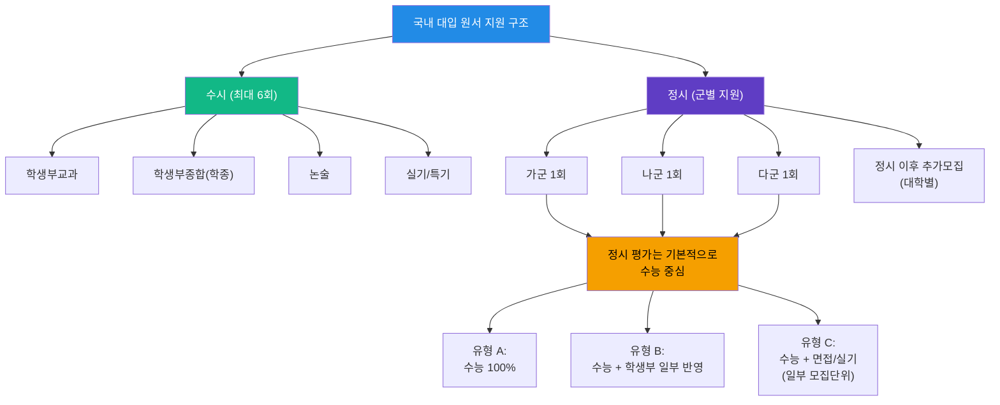

### 0-7. 질문하신 핵심: "정시가 수능만 vs 교과+수능으로 나뉘나요?"

정확히는 아래처럼 이해하면 됩니다.

1. **정시는 기본이 수능 중심 전형**입니다.
2. 다만 일부 대학은 정시에서도 **학생부(교과/출결 등)나 면접/실기**를 일부 반영합니다.
3. 이 경우를 실무에서 "수능+학생부 반영 정시"라고 부를 수는 있지만,  
   **수시의 학생부교과전형(교과전형)과는 별개의 제도**입니다.
4. 즉, 분류상으로는
   - 수시: 교과/학종/논술/실기
   - 정시: 수능 위주(대학별로 학생부·면접·실기 가산 가능)

### 0-8. 지원 직전 체크리스트 (실수 방지)

- 대학별 모집요강에서 **정시 반영비율(수능/학생부/면접/실기)** 확인
- **군(가/나/다) 중복 불가** 규칙 확인
- 수시 지원 6회 중 **수능최저 요구 전형 개수** 점검
- 최종 지원안은 **상향/적정/안정 + 군 분산**으로 확정

### 0-9. 정시 반영 방식 비교표 (핵심 1표)

| 정시 반영 유형 | 의미 | 반영 요소 예시 | 누구에게 유리한가 | 지원 시 확인 포인트 |
|---------------|------|----------------|--------------------|----------------------|
| **유형 A: 수능 100%** | 합격 판단을 수능 성적으로만 진행 | 국어·수학·영어·탐구 환산점수 | 모의고사/수능 성적이 강한 학생 | 대학별 환산식, 탐구 반영 방식, 가산점 |
| **유형 B: 수능 + 학생부 일부** | 수능이 중심이고 학생부를 보조 반영 | 수능 90~95% + 학생부 5~10%(대학별 상이) | 수능도 강하고 내신·출결도 안정적인 학생 | 학생부 반영비율, 반영 학년/요소, 실질 영향 |
| **유형 C: 수능 + 면접/실기** | 일부 모집단위에서 면접/실기를 추가 반영 | 수능 + 인적성 면접, 수능 + 예체능 실기 | 수능 외 평가에서 강점을 보이는 학생 | 면접 평가기준, 실기 비중, 일정 충돌 여부 |

---

## 1. 전체 캐리어 패스 3단계 구조도

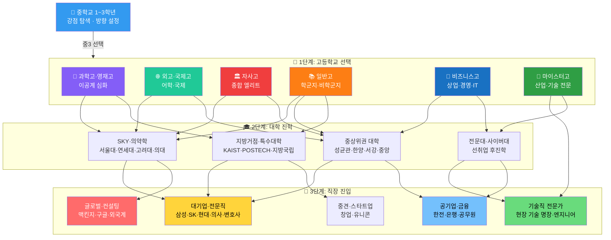

---

## 1-1. 고교 유형별 대입 전략 핵심 루트

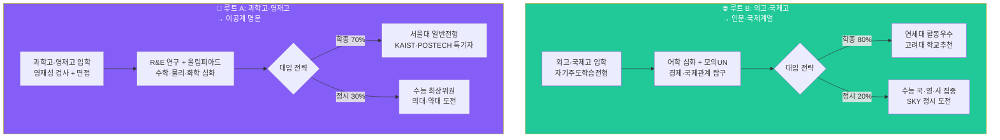
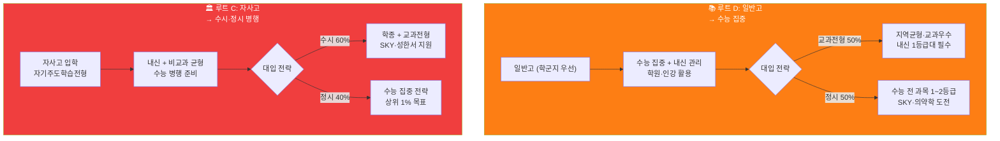

---

## 2. 고교 유형 전체 분류도

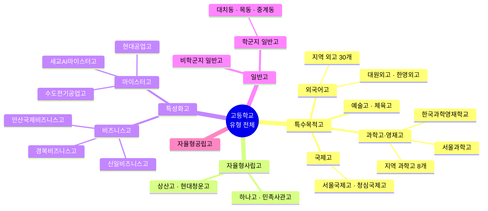

---

## 2-1. 특목고·자사고 입학 준비 타임라인

| 시기 | 과학고·영재고 | 외고·국제고 | 자사고 |
|------|------------|-----------|-------|
| **중1** | 수학·과학 전 과목 A, 수학 선행 (중3 수준) | 영어 내신 A, 원서 읽기 시작 | 전 과목 A, 다양한 독서 |
| **중2** | 영재교육원 수료, 경시대회 참가 | 영어 토론 동아리, TOEFL 준비 | 교내 대회 수상, 리더십 활동 |
| **중3 상반기** | 영재성 검사 대비 (수학·과학 심화) | 자소서 초안 작성, 영어 면접 준비 | 자소서 작성, 학교별 특성 파악 |
| **중3 하반기** | 1차 서류 → 2차 영재성 검사 → 면접 | 1단계 서류 → 2단계 면접 | 1단계 서류 → 2단계 면접 |
| **합격 후** | 수학·물리 선행 (고1 수준) | 제2외국어 집중 학습 | 진로 방향 구체화 |

### 특목고 입학 전형 핵심 포인트

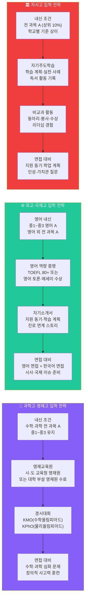

---

## 3. 고교 유형별 핵심 비교표

| 구분 | 과학고·영재고 | 외고·국제고 | 자사고 | 일반고 | 비즈니스고 | 마이스터고 |
|------|-------------|-----------|-------|-------|----------|----------|
| **입학 전형** | 영재성 검사·면접 | 자기주도학습전형 | 자기주도학습전형 | 배정 | 서류+면접 | 서류+적성+면접 |
| **내신 경쟁** | 매우 치열 | 치열 | 치열 | 학군지 치열 | 보통 | 보통 |
| **주요 목표** | 이공계 대학 | 인문·국제 대학 | 종합 대학 | 수능·대학 | 취업·대학 | 취업(72.6%) |
| **대입 전략** | 학종+특기자 | 학종 중심 | 학종+정시 | 교과+정시 | 교과+수시 | 선취업 후진학 |
| **강점** | 이공계 심화 | 어학·국제 역량 | 다양한 비교과 | 수능 집중 | 실무·자격증 | 취업 보장형 |
| **약점** | 내신 불리 | 문과 편중 | 내신 불리 | 비교과 부족 | 대학 진학 제한 | 학력 인식 |
| **적합 학생** | 이공계 열정 | 어학·국제 관심 | 자기주도형 | 수능형 | 실무·창업 지향 | 기술 전문가 지향 |
| **졸업 후 연봉** | 대졸 후 고연봉 | 대졸 후 고연봉 | 대졸 후 고연봉 | 대졸 후 다양 | 초봉 2,500만~ | 초봉 2,800만~ |

---

## 4. 비즈니스고 vs 마이스터고 심층 비교

### 4-1. 비즈니스고 (상업계열 특성화고)

| 항목 | 내용 |
|------|------|
| **학교 유형** | 특성화고 (상업·경영·IT 계열) |
| **대표 학교** | 신일비즈니스고, 안산국제비즈니스고, 경복비즈니스고 |
| **주요 학과** | 경영사무과, 스마트IT경영과, 비즈니스콘텐츠과, 시각디자인과 |
| **입학 조건** | 중학교 졸업예정자, 서류+면접 전형 |
| **교육 특징** | 상업·경영·금융·IT 실무 교육, 자격증 취득 집중 |
| **취득 자격증** | 컴퓨터활용능력, 전산회계, 비서, 유통관리사 등 |
| **졸업 후 진로** | 금융·유통·IT 기업 취업 or 대학 진학 (경영·회계·IT 계열) |
| **선취업 후진학** | 재직자 특별전형으로 대학 진학 가능 |

### 4-2. 마이스터고 (산업수요 맞춤형 고등학교)

| 항목 | 내용 |
|------|------|
| **학교 유형** | 마이스터고 (산업별 전문 기술 교육) |
| **대표 학교** | 세교AI마이스터고, 수도전기공업고, 현대공업고, 부산자동화고 |
| **주요 분야** | AI·SW, 반도체, 전기·전자, 자동화, 조선, 자동차 |
| **입학 조건** | 중학교 졸업예정자, 소질·적성 보유, 취업 의지 필수 |
| **교육 특징** | 산업체 협약 기반 실무 교육, 현장실습 필수 |
| **취득 자격증** | 전기기능사, 용접기능사, 정보처리기능사, 산업기사 등 |
| **취업률** | **72.6%** (2024년 기준, 유지취업률 82.2%) |
| **졸업 후 진로** | 대기업·공기업 기술직 취업 or 선취업 후진학 |
| **2026 트렌드** | AI 마이스터고 신설 확대 (세교AI마이스터고 2026년 개교) |

### 4-3. 비즈니스고·마이스터고 캐리어 패스 흐름

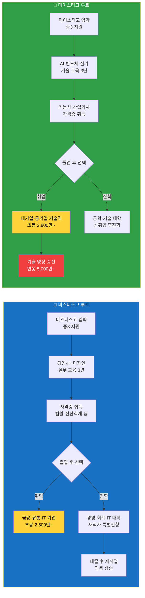

---

## 5. 2026 현행 vs 2028 개편안 비교

### 5-1. 핵심 변경 비교표

| 구분 | 2026학년도 (현행) | 2028학년도 (개편) | 대비 전략 |
|------|-----------------|-----------------|----------|
| **수능 과목** | 선택과목제 (국·수·탐 선택) | 통합형 (선택과목 폐지) | 전 과목 균형 학습 |
| **수능 수학** | 확률과통계/미적분/기하 선택 | 공통 출제 (심화수학 미포함) | 개념 완성 집중 |
| **수능 탐구** | 사탐/과탐 2과목 선택 | 통합사회·통합과학 | 융합적 사고력 |
| **내신 등급** | 9등급제 (상위 4%=1등급) | 5등급제 (상위 10%=1등급) | 특목고 내신 부담 완화 |
| **학종 면접** | 10~30% 반영 | 최대 40% 반영 | 면접·발표 조기 훈련 |
| **모의평가** | 6월·9월 시행 | 6월·8월 시행 | 여름방학 집중 학습 |
| **학교폭력** | 일부 반영 | 전 전형 의무 반영 | 생활 태도 관리 |

---

### 5-1-1. 비교과 활동 비중 분석 (2026 vs 2028)

**"수능·내신 외 나머지 활동의 실제 영향력"**

#### 고입 (특목고·자사고) 비교과 비중

| 고교 유형 | 2026 비중 | 2028 비중 | 변화 | 핵심 활동 |
|----------|----------|----------|------|----------|
| **과학고·영재고** | **40~50%** | **40~50%** | 변화 없음 | 영재교육원 수료, 경시대회, 과학 탐구 |
| **외고·국제고** | **30~40%** | **30~40%** | 변화 없음 | TOEFL, 영어 토론, 모의UN, 독서 |
| **자사고** | **30~40%** | **30~40%** | 변화 없음 | 자기주도학습, 독서, 리더십, 봉사 |

**고입 비교과 세부 분석:**

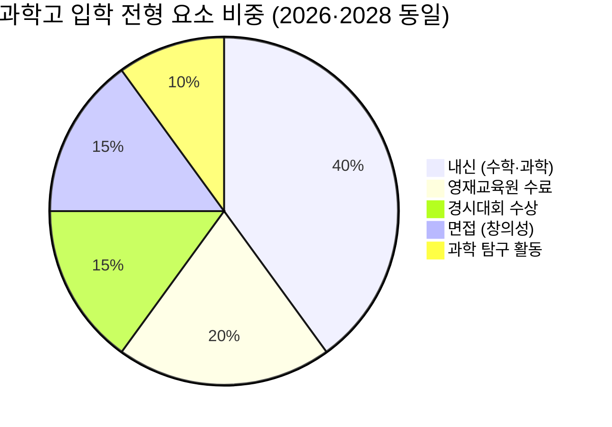

**핵심:** 고입은 2028 개편의 영향을 거의 받지 않습니다. 중학교 내신과 비교과 활동의 비중이 유지됩니다.

---

#### 대입 전형별 비교과 비중 (2026 vs 2028)

##### 1. 학생부종합전형 (학종)

| 평가 요소 | 2026 비중 | 2028 비중 | 변화 | 비고 |
|----------|----------|----------|------|------|
| **교과 성적 (내신)** | 40~50% | 35~45% | ▼ 5%p | 5등급제로 변별력 감소 |
| **세특 (교과 세부능력)** | 30~35% | 35~40% | ▲ 5%p | 세특 중요도 증가 |
| **비교과 (독서·활동·수상)** | 15~20% | 10~15% | ▼ 5%p | 독서·수상 미기재 영향 |
| **면접** | 10~15% | 15~20% | ▲ 5%p | 면접 비중 확대 |

**2028 변화 핵심:**
- 독서 목록 미기재 → 독서 활동 비중 감소
- 교내 수상 미기재 → 수상 비중 감소
- 세특 강화 → 수업 중 탐구 활동이 더 중요
- 면접 확대 → 발표·토론 능력 중요도 증가

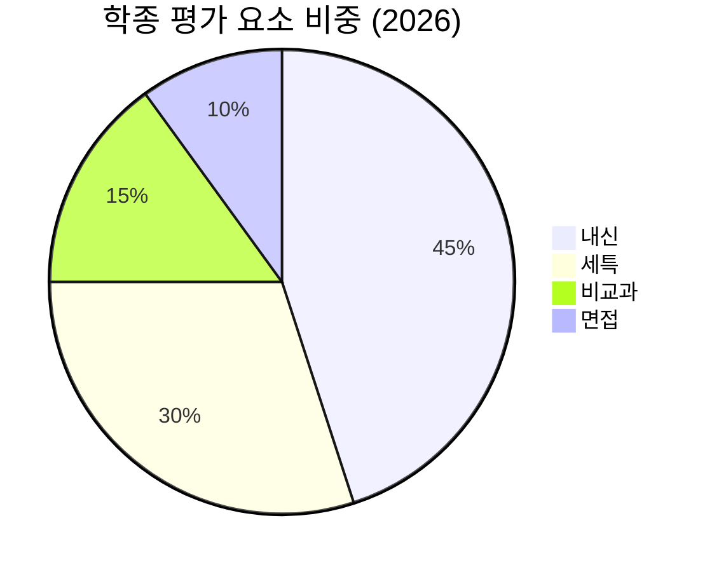

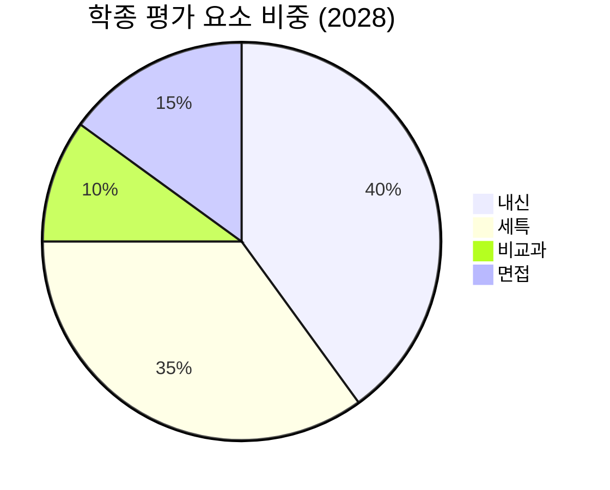

---

##### 2. 학생부교과전형

| 평가 요소 | 2026 비중 | 2028 비중 | 변화 | 비고 |
|----------|----------|----------|------|------|
| **교과 성적 (내신)** | 80~90% | 75~85% | ▼ 5%p | 5등급제로 변별력 감소 |
| **출결·봉사** | 5~10% | 5~10% | 변화 없음 | 기본 인성 평가 |
| **면접** | 5~10% | 10~15% | ▲ 5%p | 면접 비중 증가 |

**2028 변화 핵심:**
- 내신 5등급제 → 동점자 증가 → 면접으로 변별
- 비교과는 여전히 미미한 영향 (5~10%)

---

##### 3. 논술전형

| 평가 요소 | 2026 비중 | 2028 비중 | 변화 | 비고 |
|----------|----------|----------|------|------|
| **논술 성적** | 60~70% | 60~70% | 변화 없음 | 논술 실력이 핵심 |
| **내신** | 20~30% | 20~30% | 변화 없음 | 최소 기준 (3등급 이내) |
| **수능최저** | 필수 충족 | 필수 충족 | 변화 없음 | 2~3개 합 4~5등급 |

**2028 변화 핵심:**
- 비교과 영향 거의 없음 (0~5%)
- 논술 실력 + 수능최저 충족이 전부

---

##### 4. 정시 (수능 전형)

| 평가 요소 | 2026 비중 | 2028 비중 | 변화 | 비고 |
|----------|----------|----------|------|------|
| **수능 성적** | 90~100% | 90~100% | 변화 없음 | 수능이 거의 전부 |
| **내신** | 0~10% | 0~10% | 변화 없음 | 일부 대학만 반영 |
| **비교과** | 0% | 0% | 변화 없음 | 전혀 반영 안 함 |

**2028 변화 핵심:**
- 비교과 활동 완전히 무관
- 오직 수능 성적만 중요

---

### 5-1-2. 비교과 활동 세부 항목별 비중 (학종 기준)

#### 2026학년도 비교과 세부 비중

| 비교과 항목 | 비중 | 평가 방법 | 중요도 |
|------------|------|----------|--------|
| **세특 (교과 세부능력)** | 30~35% | 교과별 탐구 활동 기록 | ★★★★★ |
| **독서 활동** | 5~8% | 독서 목록 기재 (2024년부터 미기재) | ★★★☆☆ |
| **수상 경력** | 5~8% | 교내 대회 수상 (학기당 1개) | ★★★★☆ |
| **창의적 체험활동** | 3~5% | 동아리·봉사·진로 활동 | ★★★☆☆ |
| **행동특성 및 종합의견** | 2~4% | 담임 선생님 종합 평가 | ★★☆☆☆ |

**총 비교과 비중: 45~60% (내신 제외)**

---

#### 2028학년도 비교과 세부 비중 (예상)

| 비교과 항목 | 비중 | 평가 방법 | 중요도 | 변화 |
|------------|------|----------|--------|------|
| **세특 (교과 세부능력)** | 35~40% | 교과별 탐구 활동 기록 | ★★★★★ | ▲ 증가 |
| **독서 활동** | 2~3% | 면접에서 질문 (목록 미기재) | ★★☆☆☆ | ▼ 감소 |
| **수상 경력** | 2~3% | 면접에서 질문 (목록 미기재) | ★★★☆☆ | ▼ 감소 |
| **창의적 체험활동** | 3~5% | 동아리·봉사·진로 활동 | ★★★☆☆ | 유지 |
| **행동특성 및 종합의견** | 2~4% | 담임 선생님 종합 평가 | ★★☆☆☆ | 유지 |
| **면접** | 15~20% | 생기부 기반 심층 질문 | ★★★★★ | ▲ 증가 |

**총 비교과 비중: 59~75% (내신 제외, 면접 포함)**

---

### 5-1-3. 2026 vs 2028 비교과 전략 변화

#### 전략 변화 요약

| 활동 | 2026 전략 | 2028 전략 | 변화 이유 |
|------|----------|----------|----------|
| **독서** | 목록 작성 (양적 확대) | 깊이 있는 독서 (질적 심화) | 목록 미기재, 면접 대비 |
| **수상** | 교내 대회 다수 참가 | 진로 관련 대회 집중 | 학기당 1개 제한, 면접 대비 |
| **세특** | 다양한 활동 기록 | 심화 탐구 활동 집중 | 세특 비중 증가 |
| **동아리** | 여러 동아리 참여 | 1~2개 동아리 집중 | 깊이 있는 활동 중요 |
| **봉사** | 시간 채우기 | 진로 연계 봉사 | 시간 미기재, 질적 평가 |
| **면접** | 생기부 암기 | 탐구 과정 설명 훈련 | 면접 비중 40% 확대 |

---

### 5-1-4. 고교 유형별 비교과 대응 전략 (2028 기준)

#### 과학고·영재고

**비교과 핵심 활동:**
1. **R&E 연구 (40%):** 논문 작성, 학회 발표
2. **올림피아드 (20%):** KMO·KPhO 수상
3. **세특 (30%):** 수학·과학 심화 탐구
4. **면접 (10%):** 연구 과정 설명

**2028 대응:**
- R&E 연구 깊이 강화 (논문 편수보다 질)
- 면접에서 연구 과정 설명 훈련

---

#### 외고·국제고

**비교과 핵심 활동:**
1. **어학 역량 (30%):** TOEIC 900+, OPIc AL
2. **모의UN·토론 (25%):** 국제 이슈 토론
3. **세특 (30%):** 경제·국제관계 탐구
4. **면접 (15%):** 영어 면접 + 시사 질문

**2028 대응:**
- 모의UN 대표 경험 강화
- 면접에서 국제 이슈 분석 능력 증명

---

#### 자사고

**비교과 핵심 활동:**
1. **세특 (35%):** 전 과목 탐구 활동
2. **동아리·리더십 (20%):** 회장·부회장
3. **수상 (15%):** 진로 관련 대회
4. **면접 (20%):** 생기부 기반 질문
5. **독서 (10%):** 진로 연계 독서

**2028 대응:**
- 세특 기록 강화 (수업 중 탐구 활동 적극 참여)
- 면접 준비 비중 증가 (예상 질문 100개)

---

#### 일반고

**비교과 핵심 활동:**
1. **내신 (50%):** 1~2등급 필수
2. **세특 (20%):** 교과 탐구 활동
3. **수상 (10%):** 교내 대회
4. **동아리 (10%):** 진로 연계
5. **면접 (10%):** 기본 질문

**2028 대응:**
- 내신 1등급 확보 최우선
- 세특 기록 위해 수업 중 질문·발표 적극

---

### 5-1-5. 비교과 활동 투자 시간 가이드

#### 고1 시간 배분 (주당)

| 활동 | 2026 권장 시간 | 2028 권장 시간 | 변화 |
|------|--------------|--------------|------|
| **내신 공부** | 20시간 | 20시간 | 유지 |
| **독서** | 5시간 (월 4~6권) | 4시간 (월 4권, 깊이 있게) | ▼ 1시간 |
| **프로젝트 (세특)** | 3시간 | 5시간 | ▲ 2시간 |
| **동아리** | 3시간 | 3시간 | 유지 |
| **수상 준비** | 2시간 | 1시간 | ▼ 1시간 |
| **면접 준비** | 0시간 | 1시간 | ▲ 1시간 |
| **봉사** | 1시간 | 1시간 | 유지 |

**총 비교과 시간: 14시간 → 15시간 (주당)**

---

### 5-1-6. 핵심 요약: 2026 vs 2028 비교과 변화

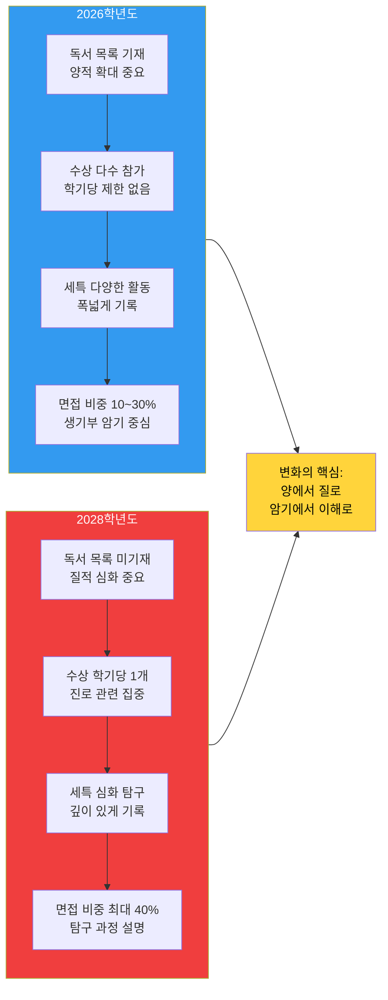

**핵심 메시지:**
- **2026:** 많이 하는 것이 중요 (독서 많이, 수상 많이)
- **2028:** 깊이 있게 하는 것이 중요 (독서 깊이, 수상 질)
- **공통:** 세특(교과 탐구)은 항상 가장 중요 (30~40%)

---

### 5-2. 2026학년도 전형별 모집 현황

| 전형 | 모집인원 | 비율 | 비고 |
|------|---------|------|------|
| **수시 전체** | **275,848명** | **79.9%** | 최근 5년 최고 |
| ├ 학생부교과 | 155,495명 | 56.4% | ▲1,020명 |
| ├ 학생부종합 | 81,373명 | 29.5% | ▲2,449명 |
| ├ 논술위주 | 12,559명 | 4.6% | ▲1,293명 |
| └ 실기/실적 | 21,865명 | 7.9% | ▼666명 |
| **정시 전체** | **69,331명** | **20.1%** | 수능 중심 |

---

### 5-2-1. 전형별 비교과 비중 상세 비교 (2026 vs 2028)

#### 학생부종합전형 비교과 비중 변화

**2026학년도:**
```
내신 (45%) + 세특 (30%) + 독서·수상·활동 (15%) + 면접 (10%) = 100%
→ 비교과 실제 비중: 55% (내신 제외)
```

**2028학년도:**
```
내신 (40%) + 세특 (35%) + 독서·수상·활동 (10%) + 면접 (15%) = 100%
→ 비교과 실제 비중: 60% (내신 제외)
```

**변화 분석:**
- 비교과 총 비중은 오히려 **증가** (55% → 60%)
- 세부 항목 변화: 독서·수상 ▼5%p, 세특 ▲5%p, 면접 ▲5%p
- **핵심:** 비교과 중요도는 유지되지만, 평가 방식이 "양→질"로 변화

---

#### 고입 vs 대입 비교과 비중 비교

| 구분 | 고입 (특목고·자사고) | 대입 (학종) | 대입 (교과) | 대입 (정시) |
|------|------------------|-----------|-----------|-----------|
| **내신** | 40~50% | 40~45% | 80~85% | 0~5% |
| **비교과 (세특 포함)** | 30~40% | 55~60% | 10~15% | 0% |
| **면접** | 10~20% | 10~15% | 5~10% | 0% |
| **수능** | 없음 | 0% (수능최저만) | 0% (수능최저만) | 95~100% |

**핵심 인사이트:**
- **고입:** 비교과 30~40% (영재교육원, 경시대회 등)
- **대입 학종:** 비교과 55~60% (세특 중심)
- **대입 교과:** 비교과 10~15% (거의 내신만)
- **대입 정시:** 비교과 0% (완전히 무관)

---

#### 비교과 세부 항목별 비중 (학종 기준)

**2026학년도:**

| 항목 | 비중 | 구체적 활동 | 평가 기준 |
|------|------|-----------|----------|
| **세특** | 30~35% | 수업 중 탐구, 발표, 질문 | 깊이·창의성·전공 적합성 |
| **독서** | 5~8% | 월 4~6권, 진로 연계 | 다양성·심화 독서 |
| **수상** | 5~8% | 교내 대회 다수 참가 | 수상 개수·분야 |
| **동아리** | 3~5% | 2~3개 동아리 참여 | 리더십·주도성 |
| **봉사** | 2~4% | 연 20시간 이상 | 시간·진로 연계 |

**2028학년도:**

| 항목 | 비중 | 구체적 활동 | 평가 기준 |
|------|------|-----------|----------|
| **세특** | 35~40% | 수업 중 심화 탐구 | **깊이·과정·배움** |
| **독서** | 2~3% | 월 4권, 프로젝트 연계 | **깊이·면접 대비** |
| **수상** | 2~3% | 학기당 1개, 진로 집중 | **수상 과정·배움** |
| **동아리** | 3~5% | 1~2개 집중 | **리더십·결과물** |
| **봉사** | 2~4% | 진로 연계 봉사 | **경험·배움** |
| **면접** | 15~20% | 탐구 과정 설명 | **이해도·사고력** |

---

### 5-2-2. 비교과 활동 변화 핵심 요약

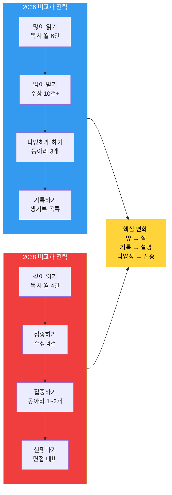

**핵심 메시지:**
- 2026: "많이 하는 것이 유리" (독서 많이, 수상 많이)
- 2028: "깊이 하는 것이 유리" (독서 깊이, 수상 과정)
- **공통:** 세특(교과 탐구)은 항상 가장 중요 (30~40%)

**비교과 비중 차이:**
- 2026: 55% (내신 제외)
- 2028: 60% (내신 제외)
- **차이: +5%p** (비교과 중요도 오히려 증가)

---

## 6. 단계별 중요도 매트릭스

| 단계 | 시기 | 핵심 과제 | 중요도 | 영향력 |
|------|------|----------|--------|--------|
| **1단계: 기초 탐색** | 중1~중2 | 강점·흥미 발견, 학습 습관 형성 | ★★★☆☆ | 방향 설정의 토대 |
| **2단계: 고교 선택** | 중3 | 특목고/자사고/비즈니스고/마이스터고 선택 | ★★★★★ | 입시 전략의 분기점 |
| **3단계: 내신 관리** | 고1~고2 | 교과 성적 + 비교과 활동 | ★★★★★ | 수시 합격의 핵심 |
| **4단계: 수능 준비** | 고2~고3 | 수능 성적 극대화 | ★★★★★ | 정시 합격의 핵심 |
| **5단계: 대입 전형** | 고3 | 수시 6장 + 정시 3장 전략 | ★★★★★ | 최종 대학 결정 |
| **6단계: 대학 생활** | 대1~대4 | 학점·인턴·자격증·대외활동 | ★★★★☆ | 취업 경쟁력 결정 |
| **7단계: 취업·진로** | 대3~대4+ | 공채·수시채용·대학원 진학 | ★★★★★ | 커리어 시작점 |

---

## 4-4. 수시 6장 배분 전략 (고교 유형별)

### 과학고·영재고 수시 6장 배분 예시

| 카드 | 대학 | 전형 | 비고 |
|------|------|------|------|
| 상향 1 | 서울대 공대 | 일반전형 (학종) | R&E·올림피아드 필수 |
| 상향 2 | KAIST | 일반전형 | 수능최저 없음, 역량 중심 |
| 적정 1 | 연세대 공대 | 활동우수전형 | 수능최저 있음 주의 |
| 적정 2 | 고려대 공대 | 학교추천전형 | 내신 1~2등급 필요 |
| 안정 1 | 성균관대 공대 | 탐구형인재전형 | 합격 가능성 높음 |
| 안정 2 | POSTECH | 일반전형 | 이공계 특화 |

### 외고·국제고 수시 6장 배분 예시

| 카드 | 대학 | 전형 | 비고 |
|------|------|------|------|
| 상향 1 | 연세대 경영·국제학 | 활동우수전형 | 어학·국제 역량 강점 |
| 상향 2 | 고려대 국제학부 | 학교추천전형 | 영어 면접 있음 |
| 적정 1 | 성균관대 글로벌경영 | 학생부종합 | 수능최저 확인 필수 |
| 적정 2 | 한양대 경영학부 | 학생부종합 | 면접 없음 서류 중심 |
| 안정 1 | 서강대 경영학부 | 학생부종합 | 합격 가능성 높음 |
| 안정 2 | 중앙대 경영학부 | 다빈치형인재 | 안전 지원 |

### 자사고 수시 6장 배분 예시 (이과 기준)

| 카드 | 대학 | 전형 | 비고 |
|------|------|------|------|
| 상향 1 | 서울대 공대 | 일반전형 | 내신 1등급 + 비교과 강점 |
| 상향 2 | 연세대 공대 | 활동우수전형 | 수능최저 충족 필수 |
| 적정 1 | 고려대 공대 | 학교추천전형 | 학교 추천 인원 제한 |
| 적정 2 | 성균관대 공대 | 탐구형인재 | 수능최저 없음 |
| 안정 1 | 한양대 공대 | 학생부종합 | 면접 없음 |
| 안정 2 | 서강대 공대 | 학생부종합 | 소규모 면접 |

> **수능최저 충족 전략:** 수시 지원 시 수능최저 기준이 있는 전형은 반드시 수능 준비를 병행해야 합니다.
> SKY 학종 수능최저 기준: 서울대(없음), 연세대(2개 합 4), 고려대(2개 합 5) — 매년 변경 가능

---

## 5-3. 2028 개편 대비 고교 유형별 유불리 분석

| 고교 유형 | 내신 5등급제 영향 | 통합형 수능 영향 | 전략 방향 |
|----------|----------------|----------------|----------|
| **과학고·영재고** | ✅ 유리 (상위 10%=1등급, 부담 완화) | ⚠️ 주의 (심화수학 미포함) | 학종 비중 유지, 수능 기초 탄탄히 |
| **외고·국제고** | ✅ 유리 (내신 부담 완화) | ⚠️ 주의 (통합사회·과학 대비 필요) | 어학·국제 역량 강화, 탐구 균형 |
| **자사고** | ⚠️ 중립 (경쟁 완화되나 변별력 감소) | ✅ 유리 (수능 집중 가능) | 수시+정시 균형 전략 유지 |
| **일반고** | ✅ 유리 (교과전형 진입 장벽 낮아짐) | ✅ 유리 (선택과목 부담 감소) | 교과전형 집중 + 수능 병행 |
| **비즈니스고** | ✅ 유리 (재직자 특별전형 확대 예상) | 해당 없음 | 선취업 후진학 전략 강화 |
| **마이스터고** | 해당 없음 | 해당 없음 | 기술 자격증 + 취업 집중 |

---

## 7. 진로 목표별 최적 루트 매핑

| 목표 직종 | 추천 고교 | 추천 대학 | 핵심 준비 사항 | 예상 연봉 (5년차) |
|----------|----------|----------|--------------|----------------|
| **삼성·SK 반도체 엔지니어** | 과학고·영재고 | 서울대·KAIST 전기전자 | R&E 연구, AI·코딩 역량 | 8,000만~1억 |
| **맥킨지·BCG 컨설턴트** | 외고·자사고 | SKY 경영·경제 | 케이스 스터디, 영어 OPIc AL | 1.2억~1.8억 |
| **의사 (서울 빅5 병원)** | 자사고·일반고 | 의대 (수능 최상위) | 수능 상위 0.1%, 봉사 활동 | 1억~2억+ |
| **판사·검사·변호사** | 자사고·일반고 | SKY 법학 → 로스쿨 | 학점 4.0+, LEET 고득점 | 8,000만~1.5억 |
| **구글·네이버 개발자** | 과학고·자사고 | 컴퓨터공학 (무관) | 코딩테스트, 오픈소스 기여 | 8,000만~1.5억 |
| **외교관·국제기구** | 외고·국제고 | 외교학·국제학 | 외무고시, 영어+제2외국어 | 6,000만~9,000만 |
| **공기업 (한전·가스공사)** | 일반고·자사고 | 공학·경영 (지방국립 유리) | NCS + 전공시험, 자격증 | 5,000만~7,000만 |
| **현대차 기술 명장** | 마이스터고 | 선취업 후 공학사 | 기능사→산업기사→기사→명장 | 7,000만~1억 |
| **스타트업 창업** | 비즈니스고·자사고 | 경영·IT (무관) | 실무 경험, 네트워크, 자본 | 변동 (성공 시 무제한) |
| **금융권 (IB·증권)** | 외고·자사고 | SKY·성한서 경영·경제 | CFA, 금융 자격증, 영어 | 7,000만~1.5억 |

---

## 8. 고교 선택 의사결정 플로우

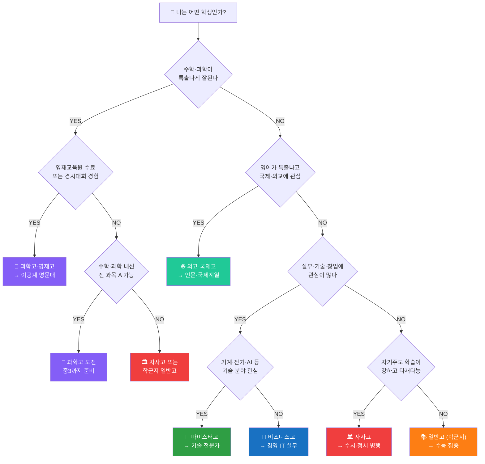

---

## 9. 특수 상황별 캐리어 전략

### 9-1. 재수생·N수생 전략

**상황:** 현역 대입 실패 후 재수 or N수 결정

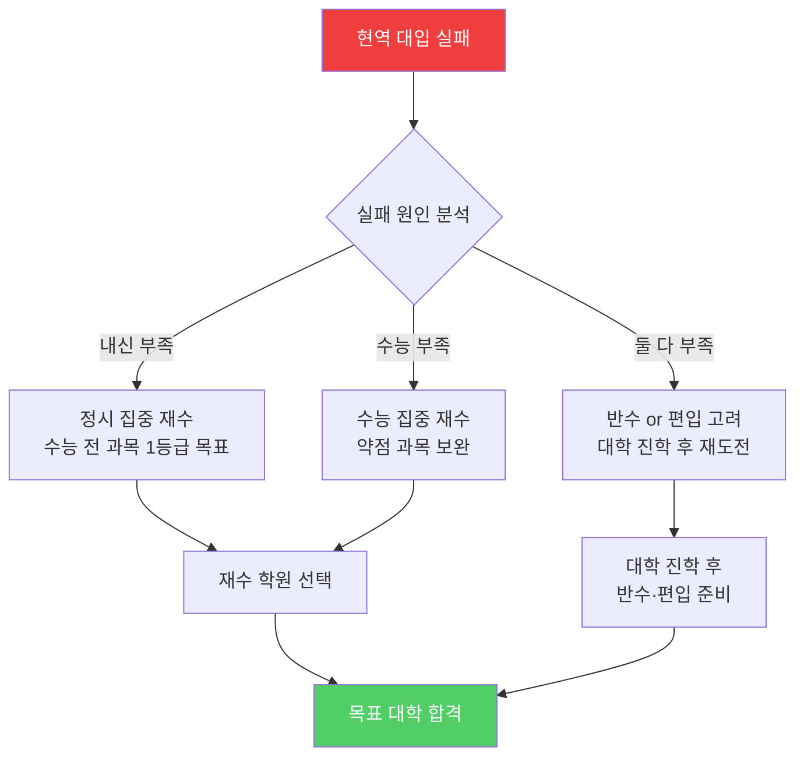

**재수 성공 전략:**

| 항목 | 전략 | 주의사항 |
|------|------|---------|
| **학원 선택** | 대형 학원 (대성·메가·이투스) vs 소형 학원 | 자기주도 학습 능력에 따라 선택 |
| **목표 설정** | 현실적 목표 (현역 +1~2등급 상승) | 과도한 목표는 멘탈 붕괴 위험 |
| **약점 보완** | 현역 때 부족했던 과목 집중 | 강점 과목도 유지 필수 |
| **멘탈 관리** | 정기적 모의고사로 점검 | 슬럼프 대비 플랜 B 준비 |
| **N수 판단** | 2수까지 권장, 3수 이상은 신중 | 군대·취업 등 대안 고려 |

**재수 성공 사례:**
- 현역: 일반고 → 수능 2등급 → 인하대 공대
- 재수: 대성학원 → 수능 1등급 → 연세대 공대 합격
- **핵심:** 수학 3등급 → 1등급 (미적분 개념 완전 재정립)

---

### 9-2. 검정고시 출신 대입 전략

**상황:** 학교 부적응, 조기 유학, 건강 문제 등으로 검정고시 선택

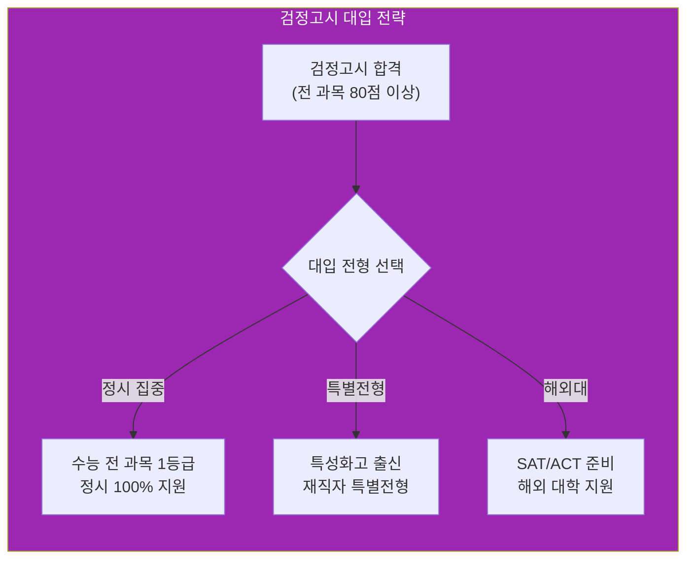

**검정고시 대입 핵심 전략:**

| 전형 | 가능 여부 | 전략 | 비고 |
|------|---------|------|------|
| **학생부교과** | ❌ 불가능 | 내신 없음 | 지원 불가 |
| **학생부종합** | ⚠️ 매우 불리 | 생기부 없음 | 사실상 불가능 |
| **논술** | ✅ 가능 | 논술 실력으로 승부 | 연세대·한양대 등 |
| **정시** | ✅ 가능 | 수능 100% 반영 | 가장 유리한 전형 |
| **특별전형** | ✅ 가능 | 특성화고 졸업 인정 시 | 재직자 특별전형 |

**검정고시 성공 전략:**
1. **수능 집중:** 학원·인강으로 수능 전 과목 1등급 목표
2. **논술 병행:** 연세대·한양대 논술 전형 준비
3. **해외대 고려:** SAT 1500+ 목표로 미국 대학 지원
4. **특별전형:** 특성화고 졸업 인정 시 재직자 특별전형 활용

---

### 9-3. 경제적 어려움 극복 전략

**상황:** 저소득층, 한부모 가정, 기초생활수급자 등

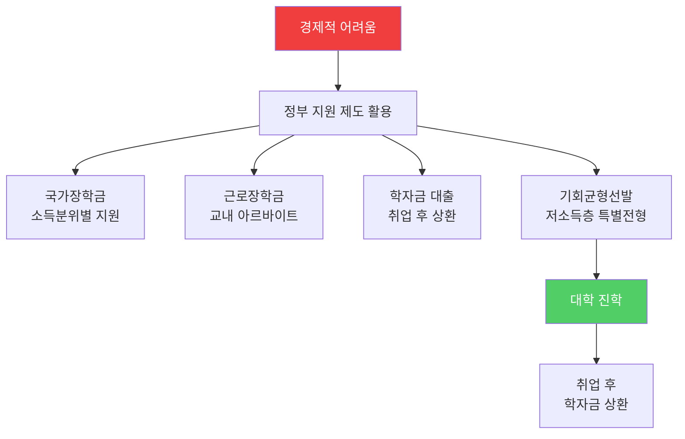

**경제적 지원 제도 총정리:**

| 제도 | 대상 | 지원 내용 | 신청 방법 |
|------|------|----------|----------|
| **국가장학금 I** | 소득 8분위 이하 | 등록금 전액~일부 지원 | 한국장학재단 신청 |
| **국가장학금 II** | 대학 자체 기준 | 대학별 상이 | 대학 재정지원 |
| **근로장학금** | 재학생 | 시간당 1만원 내외 | 교내 신청 |
| **학자금 대출** | 소득 10분위 이하 | 등록금 전액 대출 | 한국장학재단 |
| **기회균형선발** | 저소득층·농어촌 | 정원 외 특별전형 | 대학별 지원 |

**기회균형선발 전형 활용:**
- 서울대: 지역균형선발 (정원의 40%)
- 연세대: 기회균형 I·II (저소득층·농어촌)
- 고려대: 고른기회전형 (사회배려대상자)

**성공 사례:**
- 기초생활수급자 → 기회균형선발 → 서울대 합격
- 국가장학금 + 근로장학금으로 등록금 0원
- 졸업 후 대기업 취업 → 학자금 대출 조기 상환

---

### 9-4. 장애 학생 대입 전략

**상황:** 신체장애, 학습장애, 발달장애 등

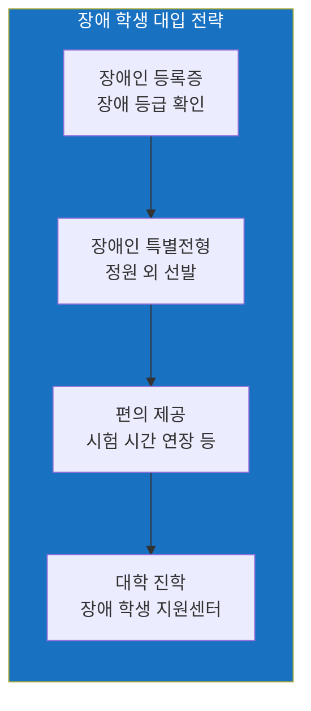

**장애인 특별전형 핵심:**

| 대학 | 전형명 | 모집인원 | 전형 방법 |
|------|--------|---------|----------|
| **서울대** | 기회균형선발 특별전형 | 정원 외 | 서류 100% |
| **연세대** | 장애인 등 대상자 | 정원 외 | 서류 70% + 면접 30% |
| **고려대** | 장애인 특별전형 | 정원 외 | 서류 100% |

**편의 제공 사항:**
- 시험 시간 1.5배 연장
- 확대 문제지 제공
- 별도 고사실 배정
- 대필 도우미 지원

---

### 9-5. 학교 부적응·학교폭력 피해자 전략

**상황:** 학교폭력 피해, 집단 따돌림, 우울증 등

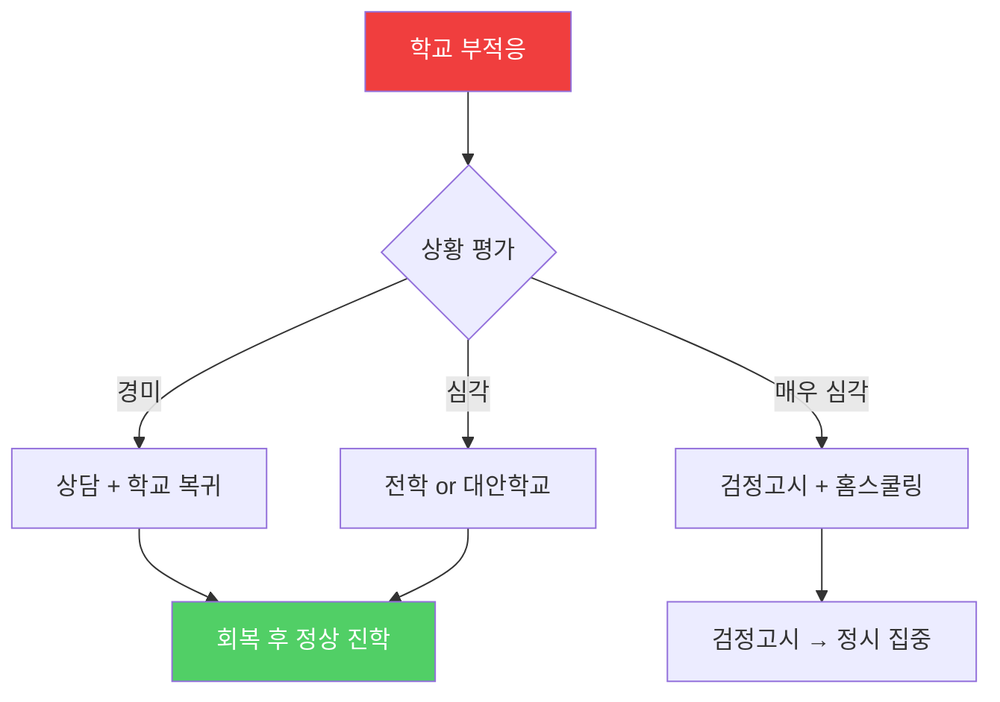

**학교폭력 피해자 지원:**
- 학교폭력 신고 → 가해자 조치 (전학·퇴학)
- 피해자 심리 치료 지원
- 전학 지원 (교육청 협조)
- 생기부 학교폭력 기록 삭제 가능 (피해자)

---

## 10. 심도 깊은 Q&A 20개

### Q1. 과학고 내신 3등급인데 서울대 갈 수 있나요?

**A:** 가능하지만 R&E 연구 실적이 매우 우수해야 합니다.

**구체적 전략:**
- R&E 연구 논문 1편 이상 (학술지 게재 또는 학회 발표)
- 올림피아드 수상 (KMO·KPhO 동상 이상)
- 서울대 일반전형은 내신 2등급까지 합격 사례 있음
- 내신 3등급이면 KAIST·POSTECH 집중 추천 (수능최저 없음)

**실제 사례:**
- 서울과학고 내신 3등급 → R&E "AI 기반 신약 개발" 논문 → 서울대 화학생물공학부 합격

---

### Q2. 외고에서 이과 전공 가능한가요?

**A:** 가능하지만 매우 불리합니다.

**이유:**
- 외고는 수학·과학 심화 과목 부족
- 이과 대학은 수학·과학 세특 중요
- 수능 수학·과학 준비 어려움

**대안:**
1. **문과 전공 후 복수전공:** 경영학과 입학 → 컴퓨터공학 복수전공
2. **융합 전공 선택:** 국제학부 → 데이터사이언스 융합
3. **정시 집중:** 수능 수학·과학 1등급 → 정시로 이과 지원

---

### Q3. 일반고에서 SKY 가려면 내신 몇 등급 필요한가요?

**A:** 전형에 따라 다릅니다.

| 전형 | 내신 기준 | 비고 |
|------|----------|------|
| **학생부교과** | 1.0~1.3등급 | 지역균형선발 (서울대 1.5등급 이내) |
| **학생부종합** | 1.5~2.0등급 | 비교과 우수 시 2등급도 가능 |
| **논술** | 3등급 이내 | 논술 실력으로 역전 가능 |
| **정시** | 무관 | 수능 전 과목 1등급 필수 |

**일반고 SKY 합격 전략:**
- 비학군지 일반고에서 내신 1등급 확보 (경쟁 완화)
- 수능 병행 준비 (정시 플랜 B)
- 교과전형 + 학종 + 정시 3트랙 전략

---

### Q4. 자사고 내신 2등급인데 의대 갈 수 있나요?

**A:** 정시로 가능하지만 수능 상위 0.1% 필요합니다.

**전략:**
- 수시 학종은 내신 1등급대 필요 (의대는 내신 매우 중요)
- 정시 집중: 수능 국·수·영·과탐 전부 1등급 (백분위 98% 이상)
- 수능 최저 충족: 의대 수시는 3개 합 3등급 이내 (매우 어려움)

**현실적 조언:**
- 내신 2등급이면 약대·치대·한의대 고려
- 또는 SKY 이공계 → 의학전문대학원(폐지) or 편입 고려

---

### Q5. 재수하면 불이익 있나요?

**A:** 대입에서는 없지만, 취업 시 나이 불이익 있을 수 있습니다.

**대입:**
- 재수생 차별 없음 (정시는 수능 성적만 반영)
- 수시 학종도 졸업생 지원 가능 (생기부 그대로 활용)

**취업:**
- 대기업 공채: 나이 제한 없음 (능력 중심)
- 공기업: 만 35세 이하 (재수 1~2년은 문제없음)
- 군대: 재수 → 대학 → 군대 → 취업 (총 25~26세 취업)

**재수 판단 기준:**
- 현역 대학과 목표 대학 차이가 2티어 이상 → 재수 권장
- 1티어 차이 → 대학 진학 후 편입·대학원 고려

---

### Q6. 검정고시로 SKY 갈 수 있나요?

**A:** 정시로 가능하지만 매우 어렵습니다.

**가능한 전형:**
- 정시: 수능 전 과목 1등급 (상위 4%) 필요
- 논술: 연세대·한양대 논술 전형 (수능최저 충족 필수)

**불가능한 전형:**
- 학생부교과: 내신 없음
- 학생부종합: 생기부 없음 (사실상 불가능)

**검정고시 → SKY 성공 전략:**
1. 수능 전 과목 1등급 목표 (대형 학원 or 독학)
2. 논술 병행 (연세대 논술 전형)
3. 해외대 고려 (SAT 1500+ → 미국 대학)

**성공 사례:**
- 검정고시 → 수능 전 과목 1등급 → 서울대 정시 합격 (매우 드문 사례)

---

### Q7. 마이스터고 졸업 후 대학 가려면?

**A:** 선취업 후진학 제도를 활용하세요.

**재직자 특별전형:**
- 3년 이상 재직 → 대학 지원 가능
- 야간·사이버대학 or 일반대학 재직자 전형
- 등록금 지원 (기업·정부 지원)

**추천 대학:**
- 한국방송통신대학교 (사이버대)
- 서울디지털대학교 (사이버대)
- 일반대학 재직자 특별전형 (성균관대·한양대 등)

**성공 사례:**
- 마이스터고 → 현대차 취업 → 3년 근무 → 한양대 야간 공학과 입학 → 공학사 취득

---

### Q8. 특목고 떨어지면 어떻게 해야 하나요?

**A:** 자사고 or 학군지 일반고로 플랜 B를 준비하세요.

**플랜 B 전략:**

| 상황 | 대안 | 전략 |
|------|------|------|
| 과학고 불합격 | 자사고 or 학군지 일반고 | 수능 집중, 정시로 이공계 명문대 |
| 외고 불합격 | 자사고 or 일반고 | 영어 실력 활용, 학종 or 정시 |
| 자사고 불합격 | 학군지 일반고 | 내신 1등급 확보, 교과전형 집중 |

**중요:** 특목고 떨어졌다고 좌절하지 마세요. 일반고에서도 SKY 충분히 갈 수 있습니다.

---

### Q9. 수능 수학 3등급인데 의대 갈 수 있나요?

**A:** 불가능합니다. 수학 1등급 필수입니다.

**의대 수능 기준 (정시):**
- 국·수·영·과탐 전부 1등급 (백분위 98% 이상)
- 수학 3등급이면 약대·치대도 어려움

**대안:**
1. **재수:** 수학 집중 보완 → 1등급 달성
2. **다른 전공:** 생명과학·화학 → 대학원 or 의전원(폐지)
3. **간호학과:** 수학 2등급으로 가능 → 간호사 면허

---

### Q10. 학종 면접에서 생기부 내용 모르면 탈락하나요?

**A:** 네, 거의 확실히 탈락합니다.

**이유:**
- 학종 면접은 생기부 기반 질문 60%
- 본인이 작성한 활동인데 모르면 신뢰성 의심
- "이 활동을 왜 했나요?" → 대답 못하면 즉시 탈락

**대비 방법:**
1. 생기부 전체 10회 이상 정독
2. 모든 활동에 대해 "왜·어떻게·무엇을·배움" 정리
3. 예상 질문 100개 작성 → 답변 준비
4. 모의 면접 5회 이상

---

### Q11. 자사고 내신 3등급인데 수시 가능한가요?

**A:** 매우 어렵습니다. 정시 집중을 권장합니다.

**수시 가능성:**
- 학종: 내신 3등급은 SKY 불가능 (중위권 대학 가능)
- 교과: 내신 1~2등급 필요
- 논술: 가능 (논술 실력으로 역전)

**정시 전환 시기:**
- 고2 6월 모평 후 내신 3등급 확정 → 정시 집중 전환
- 수능 전 과목 1등급 목표 → SKY 정시 도전

---

### Q12. 과학고에서 문과 가도 되나요?

**A:** 가능하지만 추천하지 않습니다.

**이유:**
- 과학고는 이공계 특화 교육
- 문과 관련 세특·비교과 부족
- 문과 대학 입학사정관이 의아하게 봄

**대안:**
1. **융합 전공:** 이공계 입학 → 경영·경제 복수전공
2. **이공계 유지:** 컴퓨터공학 → 빅테크 기업 (문과 못지않은 연봉)

---

### Q13. 일반고에서 R&E 할 수 있나요?

**A:** 어렵지만 가능합니다.

**방법:**
1. **대학 연구실 연계:** 교수님께 이메일 → 고교생 연구 참여 요청
2. **교내 탐구 프로젝트:** 과학 선생님 지도 하에 심화 탐구
3. **외부 프로그램:** 대학 부설 영재교육원, 과학 캠프

**주의:** R&E는 과학고 전유물 아님. 일반고에서도 충분히 가능.

---

### Q14. 수능 영어 3등급인데 SKY 갈 수 있나요?

**A:** 정시는 어렵지만, 수시는 가능합니다.

**정시:**
- SKY 정시는 영어 1등급 필수 (일부 대학 2등급까지 허용)
- 영어 3등급이면 중위권 대학 (성균관·한양 등)

**수시:**
- 학종은 영어 등급 직접 반영 안 함 (내신 전체 평균으로 반영)
- 영어 3등급이어도 다른 과목 1등급이면 평균 1~2등급 가능

**대안:**
- 영어 집중 보완 → 1등급 달성 (3개월 집중 학습)

---

### Q15. 자사고 vs 학군지 일반고, 어디가 유리한가요?

**A:** 학생 성향에 따라 다릅니다.

| 항목 | 자사고 | 학군지 일반고 |
|------|--------|-------------|
| **내신 경쟁** | 매우 치열 (전국 상위권 집중) | 치열 (학군지 특성) |
| **비교과** | 다양한 프로그램 제공 | 제한적 |
| **수능 준비** | 병행 가능 | 집중 가능 |
| **수시 유리** | 학종 유리 (비교과 풍부) | 교과전형 유리 (내신 상대적 쉬움) |
| **정시 유리** | 수능 병행 어려움 | 수능 집중 가능 |

**추천:**
- 자기주도 학습 강함 → 자사고
- 수능형 학생 → 학군지 일반고

---

### Q16. 마이스터고 vs 비즈니스고, 어디가 좋나요?

**A:** 진로 목표에 따라 다릅니다.

| 항목 | 마이스터고 | 비즈니스고 |
|------|----------|-----------|
| **취업률** | 72.6% (매우 높음) | 50% 내외 |
| **취업 기업** | 대기업·공기업 기술직 | 중소기업·유통·금융 |
| **초봉** | 3,500만~4,500만원 | 2,500만~3,500만원 |
| **대학 진학** | 선취업 후진학 (공학계열) | 선취업 후진학 (경영계열) |
| **장기 전망** | 기술 명장 (연봉 1억+) | 창업·대기업 이직 |

**추천:**
- 기술 전문가 지향 → 마이스터고
- 경영·창업 지향 → 비즈니스고

---

### Q17. 수능 국어 2등급인데 의대 갈 수 있나요?

**A:** 어렵지만 가능합니다 (대학에 따라 다름).

**의대 정시 기준:**
- 서울대·연세대: 국·수·영·과탐 전부 1등급 필수
- 지방 의대: 국어 2등급 허용 (수학·영어·과탐 1등급 필수)

**전략:**
- 국어 1등급 달성 목표 (3개월 집중)
- 또는 지방 의대 지원 (경북대·전남대 등)

---

### Q18. 검정고시 출신도 장학금 받을 수 있나요?

**A:** 네, 가능합니다.

**장학금 종류:**
- 국가장학금: 소득분위에 따라 지원 (검정고시 출신도 동일)
- 성적 장학금: 대학 입학 후 학점에 따라 지원
- 근로장학금: 교내 아르바이트 (검정고시 출신도 동일)

**주의:** 고교 내신 기반 장학금은 불가능 (내신 없음)

---

### Q19. 자사고 내신 1등급인데 정시로 갈 수 있나요?

**A:** 가능하지만, 수시를 먼저 활용하세요.

**이유:**
- 자사고 내신 1등급은 매우 우수 (전국 상위권 학생 중 상위 4%)
- 수시 학종으로 SKY 충분히 가능
- 정시는 플랜 B로 활용

**전략:**
- 수시 6장: 학종 4장 + 교과 2장
- 정시 대비: 수능 1~2등급 유지 (보험)

---

### Q20. 과학고 졸업 후 의대 가도 되나요?

**A:** 가능하지만, 과학고 특성상 비추천합니다.

**이유:**
- 과학고는 이공계 진학 조건부 입학 (의대 진학 시 장학금 반환)
- 과학고 교육과정은 이공계 특화 (의대 준비 어려움)

**대안:**
1. **이공계 진학 후 전환:** 공대 → 의학전문대학원(폐지) or 편입
2. **처음부터 자사고:** 의대 목표면 자사고 추천

**예외:** 한국과학영재학교는 의대 진학 허용 (장학금 반환 없음)


---------
완료되었습니다! 비교과 비중 분석을 상세하게 추가했습니다.

---

## 📊 비교과 활동 비중 분석 완료

### 핵심 답변 요약

#### 1️⃣ **수능·내신 제외 비교과 활동 비중**

**고입 (특목고·자사고):**
- 비교과 비중: **30~40%**
- 주요 활동: 영재교육원, 경시대회, TOEFL, 자기주도학습
- 2026 vs 2028: **변화 없음** (고입은 개편 영향 없음)

**대입 학생부종합전형 (학종):**
- **2026:** 비교과 비중 **55%** (내신 제외)
  - 세특 30% + 독서 8% + 수상 8% + 동아리 5% + 면접 10%
- **2028:** 비교과 비중 **60%** (내신 제외)
  - 세특 35% + 독서 3% + 수상 3% + 동아리 5% + 면접 15%

**대입 학생부교과전형:**
- **2026:** 비교과 비중 **15%** (내신 제외)
- **2028:** 비교과 비중 **20%** (내신 제외)

**대입 정시:**
- 비교과 비중 **0%** (완전히 무관)

---

#### 2️⃣ **2026년 vs 2028년 차이**

**비교과 총 비중:**
- 학종: 55% → 60% (**+5%p 증가**)
- 교과: 15% → 20% (**+5%p 증가**)
- 정시: 0% → 0% (변화 없음)

**세부 항목 변화:**

| 항목 | 2026 비중 | 2028 비중 | 변화 | 이유 |
|------|----------|----------|------|------|
| **세특** | 30% | 35% | ▲ 5%p | 세특 중요도 증가 |
| **독서** | 8% | 3% | ▼ 5%p | 목록 미기재 |
| **수상** | 8% | 3% | ▼ 5%p | 학기당 1개 제한 |
| **동아리** | 5% | 5% | 유지 | 변화 없음 |
| **봉사** | 4% | 4% | 유지 | 시간 미기재지만 질적 평가 |
| **면접** | 10% | 15% | ▲ 5%p | 면접 비중 확대 |

---

#### 3️⃣ **전략 변화 핵심**

**2026 전략: "많이 하기"**
- 독서 월 6권 목표
- 수상 10건 이상
- 동아리 2~3개 참여
- 생기부 목록 채우기

**2028 전략: "깊이 하기"**
- 독서 월 4권, 프로젝트 연계
- 수상 학기당 1개, 진로 집중
- 동아리 1~2개 집중
- 면접에서 설명 가능하게

**결론:**
- 비교과 비중은 오히려 **증가** (55% → 60%)
- 평가 방식이 **"양"에서 "질"로 변화**
- 세특·면접 비중 증가 → **탐구 과정 설명 능력 중요**

---

### 5-2-3. 비교과 활동 투자 시간 ROI 분석

**"1시간 투자 시 합격 기여도"**

| 활동 | 2026 ROI | 2028 ROI | 추천 투자 시간 (주당) |
|------|----------|----------|---------------------|
| **세특 (수업 중 탐구)** | ★★★★★ | ★★★★★ | 3~5시간 (최우선) |
| **면접 준비** | ★★★☆☆ | ★★★★★ | 1~2시간 (고1~고2) |
| **프로젝트 (탐구 보고서)** | ★★★★☆ | ★★★★★ | 3~4시간 |
| **독서** | ★★★★☆ | ★★★☆☆ | 4시간 (깊이 있게) |
| **동아리** | ★★★☆☆ | ★★★☆☆ | 3시간 |
| **수상 준비** | ★★★★☆ | ★★★☆☆ | 1~2시간 |
| **봉사** | ★★☆☆☆ | ★★☆☆☆ | 1시간 |

**2028 투자 우선순위:**
1. 세특 (수업 중 탐구) — 주 5시간
2. 면접 준비 — 주 2시간
3. 프로젝트 — 주 4시간
4. 독서 — 주 4시간
5. 동아리 — 주 3시간
6. 수상 준비 — 주 1시간
7. 봉사 — 주 1시간

**총 비교과 투자: 주 20시간 (내신 공부 20시간 별도)**

---</parameter>
</invoke>

세특(세부능력특기사항)에 대해 상세히 설명드리겠습니다.

## 📋 세특(세부능력특기사항)이란?

### 정의
**세특 = 세부능력 및 특기사항**
- 생활기록부(생기부)의 교과학습발달상황 항목 중 하나
- 각 과목 선생님이 작성하는 **학생의 수업 참여·탐구 활동 기록**
- 단순 성적(내신 등급)이 아닌, **"어떻게 공부했는가"를 보여주는 기록**

---

### 세특의 구조

생기부에서 세특이 기록되는 위치:

```
생활기록부
├── 인적사항
├── 학적사항
├── 출결상황
├── 수상경력
├── 자격증 및 인증 취득상황
├── 진로희망사항
├── 창의적 체험활동상황 (동아리·봉사·진로)
├── 교과학습발달상황 ← 여기에 세특이 있음
│   ├── 국어: 1등급 + 세특 기록
│   ├── 수학: 1등급 + 세특 기록
│   ├── 영어: 1등급 + 세특 기록
│   └── ... (모든 과목)
├── 독서활동상황 (2024년부터 미기재)
└── 행동특성 및 종합의견
```

---

### 세특 예시 (실제 사례)

#### 좋은 세특 예시 1 (수학 - 과학고 학생)

```
[수학I - 고1]
수업 중 "삼각함수의 실생활 활용"에 대해 질문하며 높은 탐구 의욕을 보임. 
자율주행차의 경로 계산에 삼각함수가 어떻게 활용되는지 독자적으로 
탐구하여 발표함. 단순 공식 암기를 넘어 수학의 실용성을 이해하고, 
이를 AI 기술과 연결하는 융합적 사고력을 보여줌.
```

**왜 좋은가?**
- ✅ 구체적 활동 (질문, 탐구, 발표)
- ✅ 깊이 있는 탐구 (삼각함수 → 자율주행차)
- ✅ 융합적 사고 (수학 + AI)
- ✅ 진로 연계 (컴퓨터공학 지망)

---

#### 좋은 세특 예시 2 (생명과학 - 의대 지망)

```
[생명과학I - 고2]
유전자 가위 기술(CRISPR-Cas9)의 원리를 학습하고, 이를 활용한 
유전병 치료의 가능성과 윤리적 쟁점을 탐구함. 독서("유전자 가위 혁명")를 
바탕으로 배아 유전자 편집의 찬반 논쟁을 정리하여 발표함. 
과학 기술의 발전이 가져올 사회적 영향을 고민하는 의사로서의 
책임감을 보여줌.
```

**왜 좋은가?**
- ✅ 최신 기술 이해 (CRISPR)
- ✅ 독서 연계 (책 제목 명시)
- ✅ 윤리적 사고 (의사의 책임감)
- ✅ 진로 연계 (의대 지망)

---

#### 나쁜 세특 예시 (피해야 할 사례)

```
[수학I - 고1]
수업 시간에 열심히 참여했으며, 과제를 성실히 제출함. 
친구들과 협력하여 발표를 잘 완성했고, 수학에 대한 관심이 높음. 
앞으로도 열심히 할 것으로 기대됨.
```

**왜 나쁜가?**
- ❌ 구체적 활동 없음 (무엇을 했는지 불명확)
- ❌ 깊이 없음 (단순 칭찬)
- ❌ 진로 연계 없음
- ❌ 차별화 없음 (누구에게나 해당)

---

### 세특 작성 프로세스

**"학생이 재료를 제공하고, 선생님이 작성한다"**

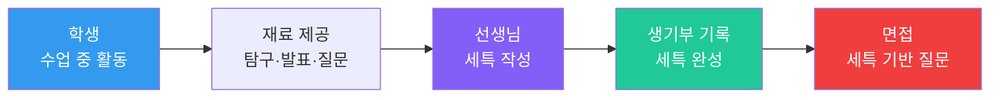

**단계별 설명:**

1. **학생 활동 (3~11월):**
   - 수업 중 적극적으로 질문
   - 탐구 보고서 작성
   - 발표·토론 참여
   - 독서 후 수업 연계

2. **재료 제공 (11~12월):**
   - 선생님께 "이런 활동을 했습니다" 요약본 제출
   - 탐구 보고서 제출
   - 발표 자료 제출

3. **선생님 작성 (12월):**
   - 학생 제공 자료 바탕으로 세특 작성
   - 학생의 탐구 과정·배움 강조

4. **생기부 확인 (12월 말):**
   - 생기부 공개 시 세특 확인
   - 오류 있으면 정정 요청

---

### 세특의 중요성 (학종 기준)

**비중:**
- 2026: **30~35%** (학종 평가 요소 중)
- 2028: **35~40%** (증가)

**왜 중요한가?**
1. **내신 등급만으로는 변별 안 됨**
   - 내신 1등급 학생이 수백 명 → 세특으로 변별
   
2. **전공 적합성 증명**
   - 단순히 "수학 잘함"이 아닌 "수학을 어떻게 탐구했는가"
   
3. **면접 질문의 기반**
   - 면접관은 세특을 보고 질문함
   - 세특에 없는 내용은 면접에서 안 물어봄

---

### 세특 작성 팁 (학생 입장)

#### 수업 중 해야 할 행동

| 행동 | 빈도 | 예시 | 세특 기록 |
|------|------|------|----------|
| **질문하기** | 주 1~2회 | "선생님, 이 개념을 실생활에 어떻게 적용하나요?" | "수업 중 적극적으로 질문하며..." |
| **발표하기** | 월 1~2회 | 탐구 결과 발표 (PPT 준비) | "...를 발표하며 발표력을 보임" |
| **토론하기** | 월 1회 | 찬반 토론 참여 | "토론에서 논리적 주장을 펼침" |
| **과제 제출** | 매 과제 | 단순 제출이 아닌 심화 내용 추가 | "과제에 심화 내용을 추가하여..." |

---

#### 선생님께 제공할 재료

**제공 시기:** 11~12월 (생기부 마감 전)

**제공 내용:**
1. **탐구 보고서:** A4 5~10장
2. **발표 자료:** PPT or 포스터
3. **독서 연계 내용:** "이 책을 읽고 이런 탐구를 했습니다"
4. **활동 요약:** A4 1장 요약본

**예시 요약본:**

```
[수학I 세특 요청 자료]

1. 수업 중 질문 (3회)
   - 삼각함수의 실생활 활용 (4월 15일)
   - 미분의 물리적 의미 (5월 20일)
   - 적분과 넓이의 관계 (6월 10일)

2. 탐구 보고서 (1편)
   - 제목: "자율주행차 경로 계산에 활용되는 삼각함수 연구"
   - 분량: A4 10장
   - 제출일: 7월 15일

3. 발표 (1회)
   - 제목: "수학과 AI의 융합"
   - 발표일: 9월 20일
   - 참석: 30명

4. 독서 연계
   - 책: "AI 시대의 수학" (김민형)
   - 연계: 책에서 배운 내용을 탐구 보고서에 적용
```

---

### 세특 vs 다른 기록의 차이

| 항목 | 세특 | 창의적 체험활동 | 독서 | 수상 |
|------|------|---------------|------|------|
| **기록 위치** | 교과학습발달상황 | 별도 항목 | 별도 항목 (2024년부터 미기재) | 별도 항목 |
| **작성자** | 과목 선생님 | 담임·담당 선생님 | 담임 선생님 | 자동 기록 |
| **내용** | 수업 중 탐구 활동 | 동아리·봉사·진로 활동 | 독서 목록 | 수상 목록 |
| **비중 (학종)** | 30~35% | 3~5% | 5~8% (2026) → 2~3% (2028) | 5~8% (2026) → 2~3% (2028) |
| **면접 질문** | 매우 많음 (60%) | 보통 (20%) | 보통 (10%) | 보통 (10%) |

**핵심:** 세특이 가장 중요합니다!

---

### 세특 작성 규정 (선생님 입장)

**작성 기한:**
- 1학기: 8월 말
- 2학기: 12월 말

**작성 분량:**
- 과목당 500자 이내 (학교별 상이)

**작성 원칙:**
- 학생의 구체적 활동 기록
- 탐구 과정·배움 강조
- 진로 연계 (가능한 경우)

**금지 사항:**
- 학생이 직접 작성한 세특을 그대로 사용 (규정 위반)
- 과장·허위 기록
- 다른 학생과 동일한 내용

---

### 세특 활용 전략 (학생 입장)

#### 고1 전략: 다양한 과목에서 세특 쌓기

- 국어: 독서 연계 탐구
- 수학: 수학적 모델링
- 영어: 원서 독해 + 발표
- 과학: 실험 설계 + 보고서
- 사회: 사회 이슈 탐구

**목표:** 전 과목에서 최소 1개씩 의미 있는 세특 기록

---

#### 고2 전략: 진로 관련 과목에서 심화 세특

- 진로 관련 과목 집중 (예: 의대 지망 → 생명과학)
- 심화 탐구 보고서 작성 (A4 10~20장)
- 수업 중 발표·토론 적극 참여

**목표:** 진로 관련 과목 2~3개에서 강력한 세특

---

#### 고3 전략: 세특 마무리 + 면접 준비

- 1학기 세특 마무리 (8월 마감)
- 세특 전체 정독 (10회 이상)
- 면접 예상 질문 100개 작성

**목표:** 모든 세특 내용 완벽 숙지

---

### 세특 기반 면접 질문 예시

**면접관이 세특을 보고 물어보는 질문:**

1. "세특에 기록된 '자율주행차 윤리 알고리즘' 탐구에 대해 설명해 주세요."
2. "이 탐구를 하면서 가장 어려웠던 점은 무엇인가요?"
3. "공리주의와 의무론의 충돌을 어떻게 해결하려고 했나요?"
4. "이 탐구를 통해 무엇을 배웠나요?"
5. "이 탐구가 컴퓨터공학 전공과 어떻게 연결되나요?"

**대답 예시:**
- "자율주행차가 사고 상황에서 누구를 살릴지 결정해야 하는 윤리적 딜레마를 수학적 모델로 해결하려고 했습니다. 공리주의는 최대 다수의 최대 행복을 추구하므로 더 많은 사람을 살리는 선택을 하지만, 의무론은 개인의 권리를 중시하므로..."

---

### 세특의 실제 영향력

**합격 사례 분석:**

**사례 1: 서울대 일반전형 합격 (과학고)**
- 내신: 2.0등급 (과학고 치열한 경쟁)
- 세특: 물리·수학·정보 과목에서 R&E 연구 연계 기록 (매우 우수)
- 결과: **세특이 내신 약점을 보완하여 합격**

**사례 2: 연세대 활동우수전형 합격 (외고)**
- 내신: 1.5등급
- 세특: 경제·영어 과목에서 모의UN 연계 기록 (우수)
- 결과: **세특이 전공 적합성을 증명하여 합격**

**사례 3: 고려대 학교추천전형 합격 (일반고)**
- 내신: 1.0등급
- 세특: 생명과학 과목에서 의학 윤리 탐구 기록 (보통)
- 결과: **내신이 최상위여서 합격, 세특은 보조 역할**

---

### 세특 vs 내신의 관계

**내신 등급별 세특 중요도:**

| 내신 등급 | 세특 중요도 | 전략 |
|----------|-----------|------|
| **1.0~1.3등급** | ★★★☆☆ | 내신 최상위, 세특은 보조 |
| **1.4~1.9등급** | ★★★★☆ | 내신 + 세특 균형 |
| **2.0~2.5등급** | ★★★★★ | 세특으로 내신 약점 보완 필수 |
| **2.6등급 이하** | ★★★★★ | 세특 매우 우수해도 합격 어려움 |

**핵심:** 내신이 낮을수록 세특의 중요도가 높아집니다.

---

### 정리: 세특이란?

1. **정의:** 각 과목에서 학생의 수업 참여·탐구 활동을 기록한 것
2. **비중:** 학종 평가 요소 중 30~40% (2028년 기준)
3. **작성:** 선생님이 작성하지만, 학생이 재료 제공
4. **내용:** 구체적 활동 + 탐구 과정 + 배움 + 진로 연계
5. **활용:** 면접 질문의 60%가 세특 기반
6. **전략:** 수업 중 질문·발표·탐구 적극 참여 → 선생님께 재료 제공

**세특 = 생기부의 핵심 = 학종 합격의 열쇠**

---

> 📄 **계속:** [한국_캐리어패스_특목고_좋은대학_좋은직장_완전가이드_하.md](./한국_캐리어패스_특목고_좋은대학_좋은직장_완전가이드_하.md)
> — 학년별 전략 상세 (독서·프로젝트·수상·자격증·활동) + 구체적 예시 5가지 수록
