# 한국 캐리어 패스 — 일반 루트 & 특수 루트 상세 예시
## 구체적 사례 기반 완전 가이드

> 📄 **관련 문서:**
> - [캐리어패스 완전가이드 (상)](./한국_캐리어패스_특목고_좋은대학_좋은직장_완전가이드.md) — 전체 구조도·고교 비교
> - [캐리어패스 완전가이드 (하)](./한국_캐리어패스_특목고_좋은대학_좋은직장_완전가이드_하.md) — 학년별 전략·예시 5가지

---

## 전체 루트 지도

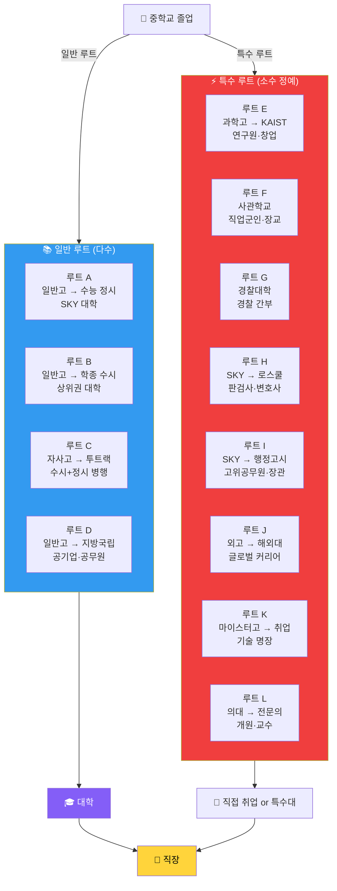

---

## PART 1. 일반 루트 상세 예시

---

### 루트 A: 일반고 → 수능 정시 → SKY 대학 → 대기업

> **"내신보다 수능이 강한 학생의 정석 루트"**

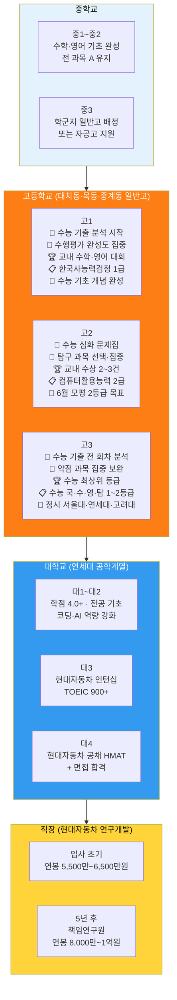

**루트 A 핵심 포인트:**

| 항목 | 전략 | 주의사항 |
|------|------|---------|
| **수능 집중 시기** | 고1부터 수능 기초, 고2부터 본격 | 내신 포기 금물 (최소 3등급 유지) |
| **정시 지원 전략** | 가군 안정 + 나군 적정 + 다군 상향 | 반수 가능성 염두 |
| **대학 생활** | 인턴 2회 이상 필수 | 학점 3.7 미만 시 대기업 서류 불리 |
| **취약점** | 비교과 없어 수시 지원 어려움 | 정시 올인 시 멘탈 관리 중요 |

---

### 루트 B: 일반고 → 학종 수시 → 중상위권 대학 → 공기업

> **"내신과 비교과를 꾸준히 쌓은 성실형 학생의 루트"**

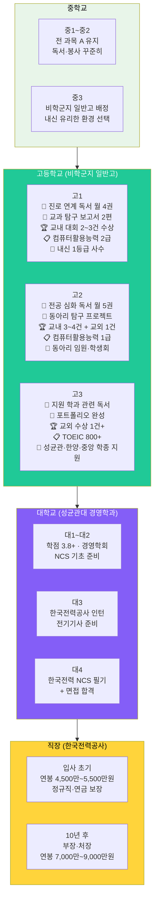

**루트 B 핵심 포인트:**

| 항목 | 전략 | 주의사항 |
|------|------|---------|
| **내신 관리** | 비학군지에서 1등급 확보 유리 | 세특 내용이 합격 당락 결정 |
| **비교과 스토리** | 중1~고3 일관된 진로 스토리 | 활동 많다고 좋은 것 아님, 질이 중요 |
| **공기업 준비** | 대학 3학년부터 NCS 준비 | 전기기사 등 자격증 필수 |
| **취약점** | 수능 낮으면 정시 보험 없음 | 수능 최저 충족 여부 확인 필수 |

---

### 루트 C: 자사고 → 투트랙 → SKY + 의약학 도전

> **"수시와 정시를 모두 준비하는 전략형 학생의 루트"**

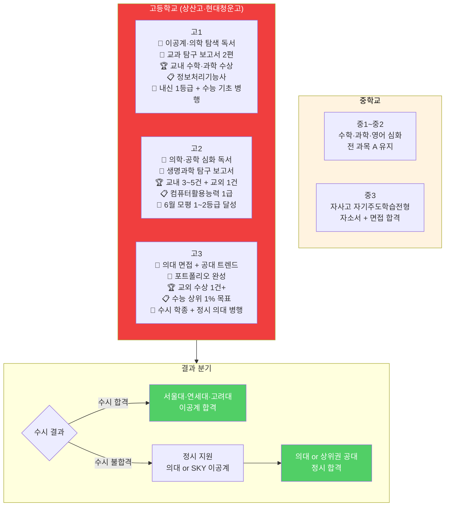

**루트 C 핵심 포인트:**

| 항목 | 전략 | 주의사항 |
|------|------|---------|
| **비중 조절** | 고1: 내신 70 / 수능 30 → 고3: 내신 30 / 수능 70 | 두 마리 토끼 잡다 둘 다 놓치는 경우 주의 |
| **수시 6장 배분** | 상향 2 (서울대·연세대) + 적정 2 + 안정 2 | 수능최저 충족 가능한 전형 선택 |
| **정시 보험** | 수능 상위 1% 이내 목표 | 자사고 내신 불리 → 정시 비중 높여야 |
| **취약점** | 자사고 내신 경쟁 매우 치열 | 내신 3등급 이하 시 전략 재수립 필요 |

---

### 루트 D: 일반고 → 지방거점국립대 → 공무원·지역 전문가

> **"지역 기반으로 안정적인 커리어를 구축하는 루트"**

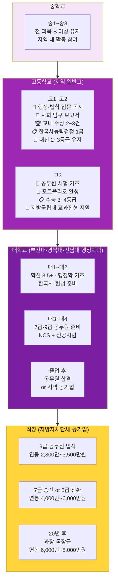

---

## PART 2. 특수 루트 상세 예시

---

### 루트 E: 과학고·영재고 → KAIST → 연구원·딥테크 창업

> **"대한민국 최고 이공계 엘리트 루트"**

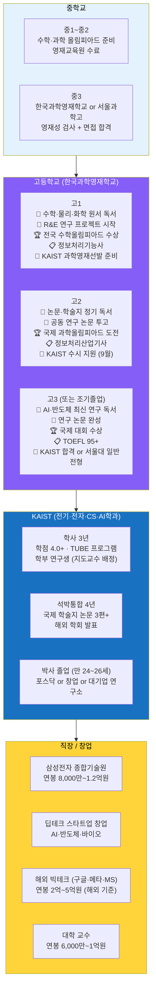

**KAIST TUBE 프로그램 (조기 박사 루트):**

| 단계 | 기간 | 조건 | 결과 |
|------|------|------|------|
| 학사 과정 | 3학기 이수 | 69학점+, 평점 3.7+ | 조기 대학원 진입 |
| 석박통합 | 4년 | 논문 3편+ | 박사학위 취득 |
| **총 기간** | **약 7년** | **만 24세 박사** | **최연소 연구자** |

---

### 루트 F: 일반고 → 사관학교 → 직업군인 → 장성·국방부

> **"국가에 헌신하며 안정적 커리어를 구축하는 특수 루트"**

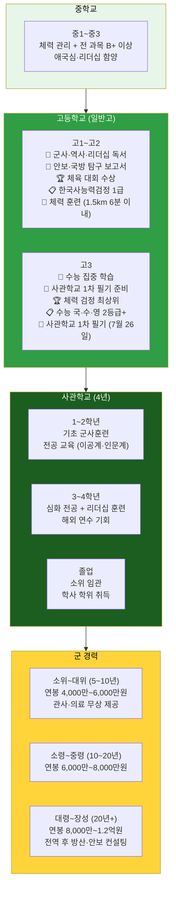

**사관학교 4개교 비교:**

| 학교 | 모집인원 | 특징 | 주요 전공 | 임관 후 |
|------|---------|------|---------|--------|
| **육군사관학교** | 330명 | 미래국방인재전형 신설 | 이공계·인문계 | 육군 소위 |
| **해군사관학교** | 285명 | 해군·해병대 임관 | 공학·항해 | 해군 소위 |
| **공군사관학교** | 175명 | 조종사 양성 | 항공우주공학 | 공군 소위 |
| **국군간호사관학교** | 35명 | 여성 비율 높음 | 간호학 | 군의관 소위 |

**1차 필기 시험 (7월 26일 — 경찰대와 동일):**
- 국어, 수학, 영어 필기 + 한국사
- 수능 최저: 국·수·영·탐 중 2개 2등급 이내

---

### 루트 G: 일반고 → 경찰대학 → 경찰 간부 → 경찰청장

> **"경쟁률 86.9:1, 대한민국 최고 경쟁률의 특수 루트"**

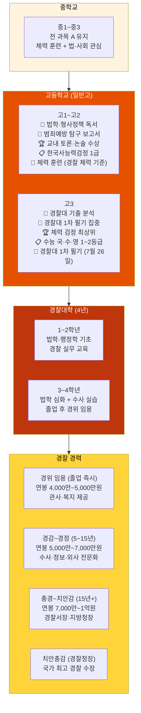

**경찰대 전형 구조 (2026학년도):**

| 전형 요소 | 비중 | 세부 내용 |
|---------|------|---------|
| 1차 필기 | 20% | 국어·수학·영어 (7월 26일) |
| 수능 | 50% | 국·수·영·탐 반영 |
| 학생부 | 15% | 교과 성적 |
| 면접 | 10% | 인성·가치관·상황 판단 |
| 체력 검정 | 5% | 100m·1000m·윗몸일으키기 등 |
| **총 경쟁률** | **86.9:1** | 4,344명 지원 / 50명 선발 |

---

### 루트 H: SKY 대학 → 로스쿨 → 판검사·변호사

> **"사법시험 폐지 후 유일한 법조인 루트"**

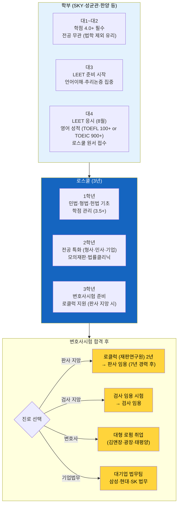

**로스쿨 입학 핵심 스펙:**

| 항목 | 최소 기준 | 상위권 로스쿨 기준 |
|------|---------|-----------------|
| **학부 학점** | 3.5 이상 | 4.0 이상 |
| **LEET 점수** | 언어+추리 평균 60점+ | 70점+ (상위 10%) |
| **영어 성적** | TOEIC 800+ | TOEFL 100+ or TOEIC 950+ |
| **자기소개서** | 법조인 지망 동기 | 구체적 경험·활동 |
| **합격 후** | 변호사시험 합격률 55% | 상위 로스쿨 70%+ |

**연봉 현황:**

| 직종 | 초봉 | 10년 후 |
|------|------|--------|
| 판사 | 6,500만~7,500만원 | 8,000만~1억원 |
| 검사 | 5,500만~6,500만원 | 7,000만~9,000만원 |
| 대형 로펌 변호사 | 8,000만~1.2억원 | 2억~5억원+ |
| 기업 법무팀 | 6,000만~8,000만원 | 1억~2억원 |

---

### 루트 I: SKY 대학 → 행정고시(5급) → 고위공무원·장관

> **"국가를 운영하는 엘리트 관료 루트, 경쟁률 31.2:1"**

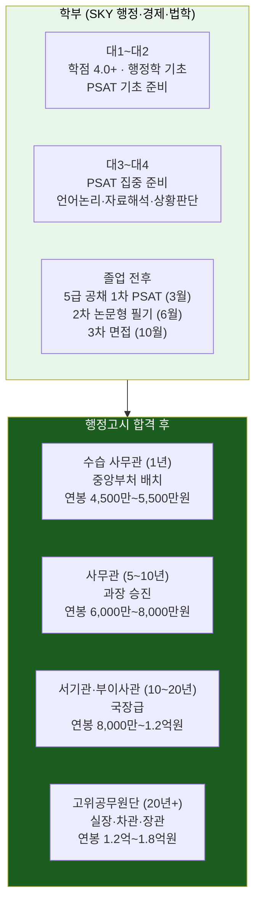

**행정고시 PSAT 과목별 전략:**

| 과목 | 문항 수 | 핵심 전략 | 준비 기간 |
|------|--------|---------|---------|
| **언어논리** | 40문항 | 독해 속도 + 논리 추론 | 6개월+ |
| **자료해석** | 40문항 | 수치 계산 + 도표 분석 | 6개월+ |
| **상황판단** | 40문항 | 법령·규정 적용 + 퍼즐 | 6개월+ |
| **헌법** | 25문항 | 조문 암기 + 판례 이해 | 3개월 |

---

### 루트 J: 외고·국제고 → 해외 명문대 → 글로벌 커리어

> **"국내 입시를 벗어나 세계 무대로 나가는 루트"**

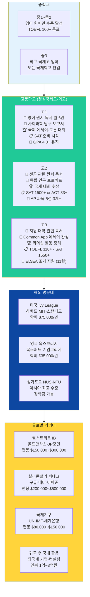

**해외 대학 지원 핵심 스펙 (미국 기준):**

| 항목 | 일반 대학 | Ivy League |
|------|---------|-----------|
| **GPA** | 3.7+ | 4.0 (최상위) |
| **SAT** | 1400+ | 1550+ |
| **TOEFL** | 100+ | 110+ |
| **AP 과목** | 3개+ | 5개+ (5점) |
| **과외활동** | 2~3개 | 리더십 + 수상 |
| **에세이** | 진정성 | 독창성 + 스토리 |

---

### 루트 K: 일반고 → 의대 → 전문의 → 교수·개원

> **"한국 최고 인기 루트, 수능 상위 0.1% 필요"**

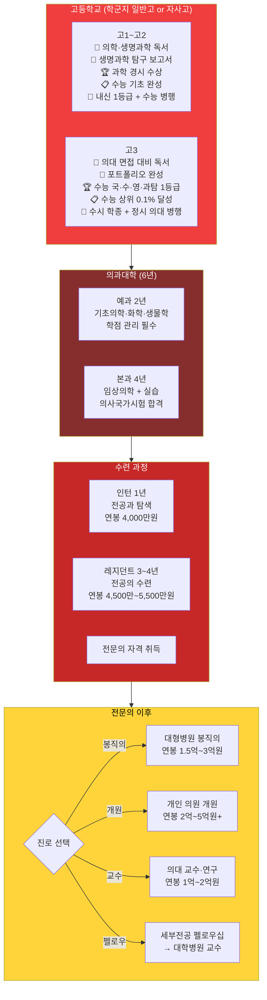

**의대 입시 현실 (2026학년도):**

| 구분 | 수시 학종 | 수시 교과 | 정시 |
|------|---------|---------|------|
| **내신 기준** | 1등급 초반 | 1등급 초반 | 해당 없음 |
| **수능 기준** | 최저 3개 1등급 | 최저 3개 1등급 | 국·수·영·과탐 전부 1등급 |
| **비교과** | 의료 봉사·탐구 필수 | 불필요 | 불필요 |
| **경쟁률** | 20~40:1 | 10~20:1 | 5~10:1 |

---

## PART 3. 루트별 종합 비교

### 난이도 × 보상 매트릭스

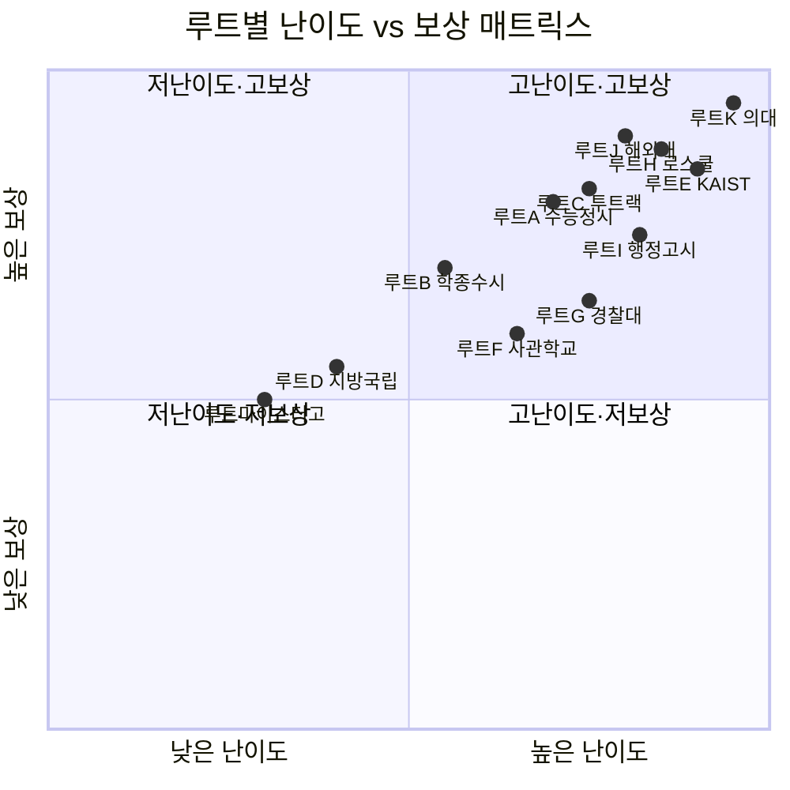

### 루트별 핵심 요약표

| 루트 | 고교 | 대학/기관 | 핵심 관문 | 예상 연봉 (10년차) | 안정성 |
|------|------|---------|---------|-----------------|--------|
| **A. 수능 정시** | 일반고 | SKY 이공계 | 수능 1~2등급 | 8,000만~1.2억 | ★★★★☆ |
| **B. 학종 수시** | 일반고 | 중상위권 | 내신 1~2등급 + 세특 | 5,000만~8,000만 | ★★★★☆ |
| **C. 투트랙** | 자사고 | SKY·의약학 | 내신 + 수능 병행 | 8,000만~2억+ | ★★★★☆ |
| **D. 지방국립** | 일반고 | 지방거점국립 | 내신 2~3등급 | 5,000만~7,000만 | ★★★★★ |
| **E. KAIST** | 과학고·영재고 | KAIST·POSTECH | 올림피아드·R&E | 1억~5억 (해외) | ★★★☆☆ |
| **F. 사관학교** | 일반고 | 육·해·공·국간사 | 체력+수능+면접 | 6,000만~1억 | ★★★★★ |
| **G. 경찰대** | 일반고 | 경찰대학 | 필기+수능+체력 | 5,000만~8,000만 | ★★★★★ |
| **H. 로스쿨** | 어디서나 | SKY → 로스쿨 | LEET + 학점 4.0 | 1억~5억 (로펌) | ★★★☆☆ |
| **I. 행정고시** | 어디서나 | SKY → 고시 | PSAT + 논문 | 8,000만~1.8억 | ★★★★★ |
| **J. 해외대** | 외고·국제고 | Ivy·옥스브리지 | SAT+GPA+에세이 | 2억~5억 (해외) | ★★★☆☆ |
| **K. 의대** | 자사고·일반고 | 의과대학 | 수능 0.1% | 2억~5억 | ★★★★★ |
| **마이스터고** | 마이스터고 | 직취업 | 기능사+실습 | 5,000만~7,000만 | ★★★★☆ |

---

## 부록: 특수 루트 준비 타임라인

```mermaid
gantt
    title 특수 루트별 준비 시작 시기
    dateFormat X
    axisFormat 학년
    section 사관학교·경찰대
    체력 훈련 시작          :0, 3
    수능·필기 집중          :2, 3
    1차 필기 (7월)          :3, 3
    section KAIST 과학영재
    올림피아드 준비         :0, 2
    R&E 연구 시작           :1, 2
    수시 지원 (9월)         :2, 2
    section 로스쿨
    학부 학점 관리          :4, 4
    LEET 준비               :6, 4
    로스쿨 지원             :7, 4
    section 행정고시
    PSAT 기초 준비          :4, 4
    본격 고시 준비          :6, 4
    1차 PSAT (3월)          :7, 4
    section 해외대
    SAT 준비 시작           :1, 2
    AP 과목 이수            :1, 2
    ED 지원 (11월)          :2, 2
```

---

## PART 4. 특수 상황별 루트 전략

### 루트 M: 재수생·N수생 → 목표 대학 재도전

> **"현역 실패는 끝이 아니다. 재수는 새로운 시작이다"**

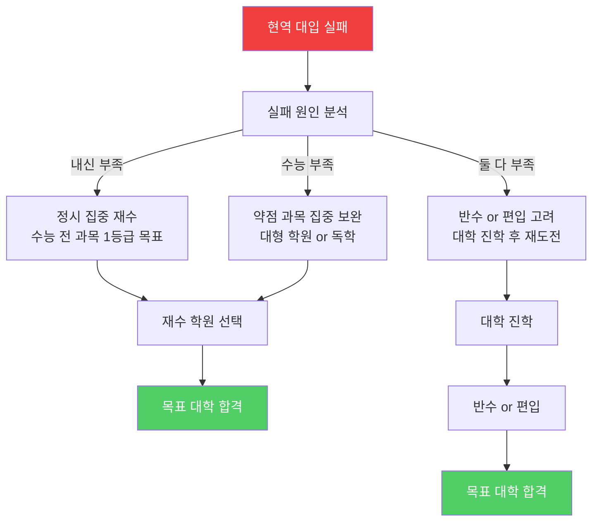

**재수 성공 전략 상세:**

| 월 | 재수 학원 | 독학 재수 | 비고 |
|----|----------|----------|------|
| **1~2월** | 학원 등록, 레벨 테스트 | 약점 과목 파악, 교재 선정 | 현역 수능 분석 필수 |
| **3~5월** | 기초 개념 완성 | 개념서 정독 (국·수·영) | 3월 모의고사 중요 |
| **6~7월** | 6월 모평 후 전략 수정 | 기출 문제 풀이 시작 | 목표 등급 재설정 |
| **8~9월** | 여름 특강 집중 | 약점 과목 집중 보완 | 9월 모평이 실전 예측 |
| **10~11월** | 파이널 모의고사 | 실전 감각 유지 | 멘탈 관리 최우선 |
| **11월** | **수능 본시험** | **수능 본시험** | 현역보다 1~2등급 상승 목표 |

**재수 성공 사례:**
- 현역: 수능 2등급 → 인하대 공대
- 재수: 대성학원 → 수능 1등급 → 연세대 공대 합격
- 핵심: 수학 미적분 개념 완전 재정립 + 멘탈 관리

---

### 루트 N: 검정고시 → 정시 집중 → 명문대

> **"학교 없어도 꿈은 있다"**

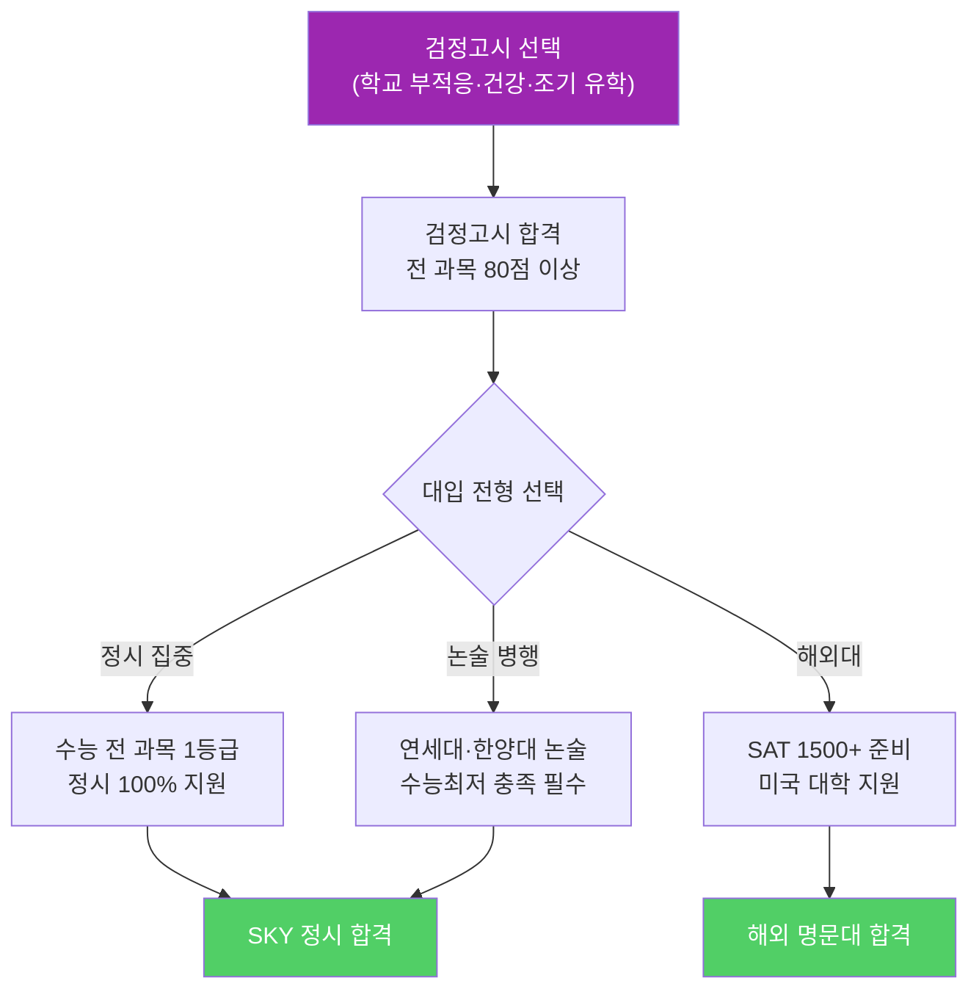

**검정고시 대입 전략:**

| 전형 | 가능 여부 | 합격 난이도 | 전략 |
|------|---------|-----------|------|
| **학생부교과** | ❌ 불가능 | - | 내신 없음 |
| **학생부종합** | ⚠️ 매우 불리 | ★★★★★ | 생기부 없어 사실상 불가능 |
| **논술** | ✅ 가능 | ★★★★☆ | 논술 실력 + 수능최저 충족 |
| **정시** | ✅ 가능 | ★★★☆☆ | 수능 전 과목 1등급 필수 |
| **해외대** | ✅ 가능 | ★★★★☆ | SAT 1500+ + 에세이 |

---

### 루트 O: 경제적 어려움 → 기회균형선발 → 명문대

> **"가난은 핑계가 아니다. 기회는 있다"**

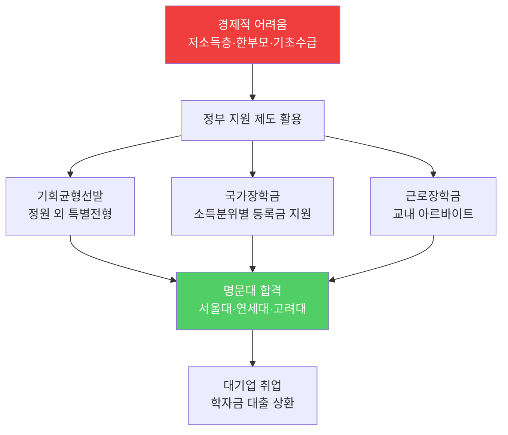

**경제적 지원 제도 총정리:**

| 제도 | 대상 | 지원 내용 | 신청 방법 |
|------|------|----------|----------|
| **국가장학금 I** | 소득 8분위 이하 | 등록금 전액~일부 | 한국장학재단 |
| **국가장학금 II** | 대학 자체 기준 | 대학별 상이 | 대학 재정지원 |
| **근로장학금** | 재학생 | 시간당 1만원 | 교내 신청 |
| **학자금 대출** | 소득 10분위 이하 | 등록금 전액 대출 | 한국장학재단 |
| **기회균형선발** | 저소득층·농어촌 | 정원 외 특별전형 | 대학별 지원 |

---

### 루트 P: 장애 학생 → 장애인 특별전형 → 명문대

> **"장애는 불편함이지 불가능이 아니다"**

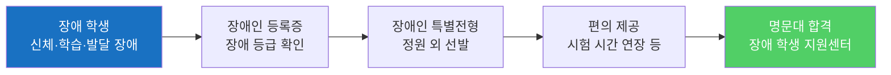

**장애인 특별전형 핵심:**

| 대학 | 전형명 | 모집인원 | 전형 방법 | 편의 제공 |
|------|--------|---------|----------|----------|
| **서울대** | 기회균형선발 | 정원 외 | 서류 100% | 시험 시간 1.5배 |
| **연세대** | 장애인 등 대상자 | 정원 외 | 서류 70% + 면접 30% | 확대 문제지 |
| **고려대** | 장애인 특별전형 | 정원 외 | 서류 100% | 별도 고사실 |

---

## PART 5. 심도 깊은 Q&A 20개

### Q1. 재수하면 대학에서 불이익 있나요?

**A:** 대입에서는 없지만, 나이로 인한 취업 불이익은 있을 수 있습니다.

**대입:**
- 재수생 차별 없음 (정시는 수능 성적만 반영)
- 수시 학종도 졸업생 지원 가능

**취업:**
- 대기업: 나이 제한 없음 (능력 중심)
- 공기업: 만 35세 이하 (재수 1~2년 문제없음)
- 군대: 재수 → 대학 → 군대 → 취업 (총 25~26세)

---

### Q2. 3수 이상은 하지 말아야 하나요?

**A:** 3수 이상은 신중하게 판단하세요.

**이유:**
- 2수까지는 일반적, 3수부터는 리스크 증가
- 나이 불이익 (취업 시 25~26세가 적정)
- 멘탈 붕괴 위험 (장기전은 정신력 소모)

**대안:**
- 대학 진학 후 편입 (2학년 or 3학년 편입)
- 대학원으로 명문대 진입 (학부 중위권 → 대학원 SKY)

---

### Q3. 검정고시로 서울대 갈 수 있나요?

**A:** 정시로 가능하지만 매우 어렵습니다.

**현실:**
- 수능 전 과목 1등급 (상위 4%) 필요
- 검정고시 출신 서울대 합격 사례 매우 드뭄 (연 1~2명)

**대안:**
- 논술 전형 (연세대·한양대)
- 해외대 (SAT 1500+ → 미국 대학)
- 지방 국립대 → 대학원 서울대

---

### Q4. 기회균형선발은 누구나 지원 가능한가요?

**A:** 아니요, 자격 조건이 있습니다.

**자격 조건:**
- 저소득층: 소득 3분위 이하 or 기초생활수급자
- 농어촌: 중·고교 6년 농어촌 거주
- 특성화고: 특성화고 졸업 (예정)

**지원 방법:**
- 대학별 모집 요강 확인
- 증빙 서류 제출 (소득 증명, 거주 증명 등)

---

### Q5. 장애인 특별전형은 어떤 장애만 가능한가요?

**A:** 장애인 등록증이 있으면 모두 가능합니다.

**대상:**
- 신체 장애 (지체·시각·청각 등)
- 발달 장애 (자폐·지적 장애 등)
- 정신 장애 (우울증·조현병 등)

**주의:** 장애 등급 폐지 (2019년) → 장애 정도로 구분 (중증·경증)

---

### Q6. 재수 학원은 어디가 좋나요?

**A:** 학생 성향에 따라 다릅니다.

| 학원 | 특징 | 추천 대상 |
|------|------|----------|
| **대성학원** | 대형, 체계적 커리큘럼 | 자기주도 학습 약한 학생 |
| **메가스터디** | 인강 + 오프라인 병행 | 인강 익숙한 학생 |
| **이투스** | 소규모 관리형 | 밀착 관리 필요한 학생 |
| **독학** | 자율 학습 | 자기주도 학습 강한 학생 |

---

### Q7. 검정고시 출신도 장학금 받을 수 있나요?

**A:** 네, 가능합니다.

**장학금 종류:**
- 국가장학금: 소득분위에 따라 지원 (검정고시 출신 동일)
- 성적 장학금: 대학 입학 후 학점에 따라 지원
- 근로장학금: 교내 아르바이트 (검정고시 출신 동일)

**주의:** 고교 내신 기반 장학금은 불가능 (내신 없음)

---

### Q8. 재수 vs 반수, 어느 것이 유리한가요?

**A:** 재수가 유리합니다.

**이유:**
- 재수: 수능 집중 가능 (대학 수업 없음)
- 반수: 대학 수업 + 수능 병행 (매우 힘듦)

**반수 추천 조건:**
- 현역 수능 1~2등급 (약간만 올리면 목표 대학)
- 대학 수업 부담 적음 (1학년 1학기)

---

### Q9. 경제적 어려움으로 학원 못 가면 어떻게 하나요?

**A:** 인강 + 독학으로 충분히 가능합니다.

**무료·저렴한 학습 자원:**
- EBS 인강 (무료)
- 메가스터디·이투스 인강 (월 10만원 내외)
- 유튜브 (무료, 개념 설명 풍부)
- 도서관 독서실 (무료 자습 공간)

**성공 사례:**
- 기초생활수급자 → EBS 인강 독학 → 서울대 합격

---

### Q10. 장애인 특별전형으로 합격하면 대학 생활 지원 있나요?

**A:** 네, 장애 학생 지원센터에서 지원합니다.

**지원 내용:**
- 학습 지원: 노트 필기 도우미, 대필 도우미
- 시설 지원: 엘리베이터, 경사로, 장애인 화장실
- 기숙사: 장애 학생 전용 기숙사 (1인실)
- 상담: 심리 상담, 진로 상담

---

### Q11. 재수 중 멘탈 관리는 어떻게 하나요?

**A:** 정기적 모의고사 + 적절한 휴식이 핵심입니다.

**멘탈 관리 전략:**
- 월 1회 모의고사로 성장 확인
- 주 1회 휴식 (영화·운동 등)
- 슬럼프 시 선생님·부모님과 상담
- 목표 대학 캠퍼스 방문 (동기 부여)

---

### Q12. 검정고시 합격 점수는 몇 점이나 되나요?

**A:** 전 과목 평균 60점 이상입니다.

**합격 기준:**
- 전 과목 평균 60점 이상
- 각 과목 40점 이상 (과락 없어야 함)

**추천 목표:**
- 전 과목 80점 이상 (대입 시 유리)
- 특히 국·수·영은 90점 이상 목표

---

### Q13. 기회균형선발로 합격하면 등록금 면제인가요?

**A:** 아니요, 별도로 국가장학금 신청해야 합니다.

**오해:**
- 기회균형선발 = 입학 전형 (등록금 지원 X)
- 국가장학금 = 등록금 지원 (별도 신청)

**절차:**
1. 기회균형선발로 합격
2. 국가장학금 신청 (한국장학재단)
3. 소득분위에 따라 등록금 지원

---

### Q14. 재수 중 아르바이트 해도 되나요?

**A:** 비추천합니다.

**이유:**
- 재수는 수능 집중이 최우선
- 아르바이트는 시간·체력 소모 큼
- 1년 집중 투자가 평생 결정

**예외:**
- 경제적으로 매우 어려운 경우 (주말만 단기 알바)

---

### Q15. 검정고시 출신도 대학원 갈 수 있나요?

**A:** 네, 가능합니다.

**절차:**
1. 검정고시 → 대학 (정시 or 논술)
2. 대학 졸업 (학사 학위 취득)
3. 대학원 진학 (석사·박사)

**주의:** 대학원은 학부 성적 중요 (검정고시 출신 여부 무관)

---

### Q16. 재수 중 친구 만나면 안 되나요?

**A:** 적절히 만나세요 (주 1회 정도).

**이유:**
- 완전 단절은 멘탈 악화
- 친구와의 대화는 스트레스 해소

**주의:**
- 친구가 대학 다니는 이야기는 듣지 마세요 (비교 의식)
- 재수 친구와 만나는 것 추천 (공감대 형성)

---

### Q17. 기회균형선발 합격률은 얼마나 되나요?

**A:** 일반 전형보다 높습니다.

**합격률 비교:**
- 일반 전형: 5~10:1 (경쟁률)
- 기회균형선발: 2~5:1 (경쟁률 낮음)

**이유:**
- 정원 외 선발 (일반 전형과 별도)
- 지원 자격 제한 (저소득층·농어촌 등)

---

### Q18. 장애인 특별전형도 면접 있나요?

**A:** 대학에 따라 다릅니다.

**면접 유무:**
- 서울대: 없음 (서류 100%)
- 연세대: 있음 (서류 70% + 면접 30%)
- 고려대: 없음 (서류 100%)

**면접 편의:**
- 시간 연장 (1.5배)
- 별도 고사실 배정
- 보조 기구 사용 허용

---

### Q19. 재수 중 수능 날짜는 언제인가요?

**A:** 매년 11월 셋째 주 목요일입니다.

**2026학년도:** 2025년 11월 13일 (목)
**2027학년도:** 2026년 11월 12일 (목)

**주의:** 재수생은 수능 접수 기간 놓치지 마세요 (8월 중순).

---

### Q20. 검정고시 출신도 군대 가나요?

**A:** 네, 동일하게 병역 의무 있습니다.

**병역:**
- 만 18세 이상 남성 (검정고시 출신 동일)
- 대학 재학 중 입영 연기 가능
- 대학 졸업 후 or 재학 중 입대

**추천:** 대학 2학년 or 3학년 휴학 후 입대 (복학 후 취업 준비)

---

> **핵심 메시지:** 어떤 루트를 선택하든, **중학교 때 방향을 잡고, 고등학교 때 실행하고, 대학에서 증명하는** 3단계 원칙은 동일합니다.
> 특수 루트는 높은 보상을 주지만 그만큼 준비 기간과 난이도가 높습니다. 자신의 강점과 성향에 맞는 루트를 선택하는 것이 가장 중요합니다.

---

> **참고:** 이 문서는 2026년 3월 기준 정보를 바탕으로 작성되었습니다.
> 최신 정보는 [대입정보포털](https://www.adiga.kr), [사이버국가고시센터](https://www.gosi.kr), [경찰대학](https://www.police.ac.kr)에서 확인하시기 바랍니다.
