# 한국 캐리어 패스 완전 가이드 (하)
## 학년별 전략 상세 + 구체적 예시 5가지

> 📄 **이전:** [한국_캐리어패스_특목고_좋은대학_좋은직장_완전가이드.md](./한국_캐리어패스_특목고_좋은대학_좋은직장_완전가이드.md)
> **학년별 구체적 실행 전략 · 월별 체크리스트 · 실제 합격 사례 수록**

---

## 6-1. 중학생을 위한 고교 선택 준비 월별 체크리스트

### 중3 고교 입시 타임라인 (특목고·자사고 기준)

| 월 | 과학고·영재고 | 외고·국제고 | 자사고 | 준비 사항 |
|----|------------|-----------|-------|----------|
| **3~4월** | 영재교육원 수료증 확인 | 영어 내신 최종 점검 | 전 과목 내신 관리 | 지원 학교 리스트 작성 |
| **5~6월** | 경시대회 참가 (KMO 등) | TOEFL 80+ 목표 달성 | 자기주도학습 사례 정리 | 학교별 설명회 참석 |
| **7~8월** | 수학·과학 심화 문제 풀이 | 자소서 초안 작성 | 자소서 초안 작성 | 여름방학 집중 준비 |
| **9월** | 원서 접수 (학교별 상이) | 원서 접수 시작 | 원서 접수 시작 | 서류 최종 점검 |
| **10월** | 1차 서류 합격 발표 | 1단계 합격 발표 | 1단계 합격 발표 | 면접 준비 시작 |
| **11월** | 2차 영재성 검사 + 면접 | 2단계 면접 | 2단계 면접 | 모의 면접 연습 |
| **12월** | 최종 합격 발표 | 최종 합격 발표 | 최종 합격 발표 | 합격 후 선행학습 |

---

## 6-2. 고교 유형별 내신 관리 전략

### 과학고·영재고 내신 전략

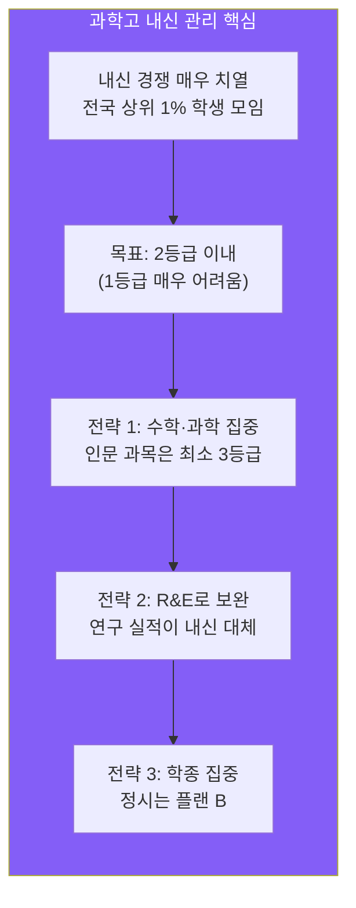

**과학고 내신 극복 전략:**
- 내신 1등급 불가능하다면 → R&E 연구 논문으로 차별화
- 올림피아드 수상 → 내신 약점 보완 가능
- 서울대 일반전형은 내신 2등급까지 합격 가능 (R&E 우수 시)

### 외고·국제고 내신 전략

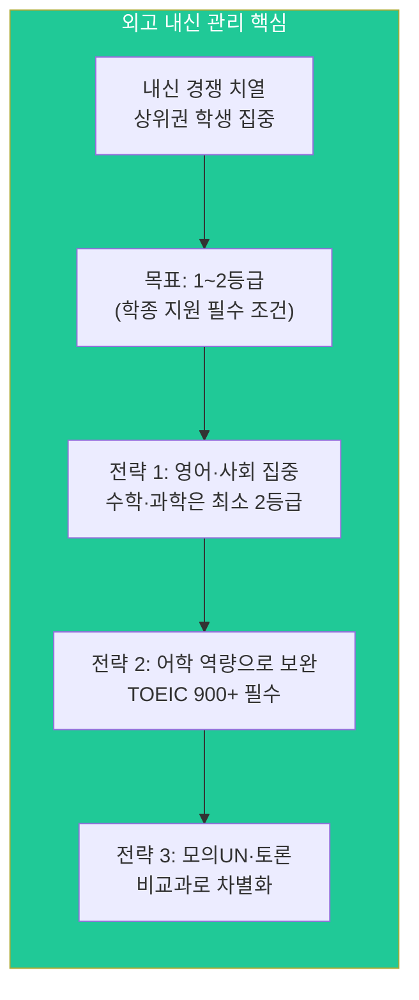

**외고 내신 극복 전략:**
- 영어 내신 1등급 필수 (외고의 기본)
- 제2외국어 우수 성적 → 국제학부 유리
- 모의UN 대표 경험 → 연세대 활동우수전형 강점

### 자사고 내신 전략

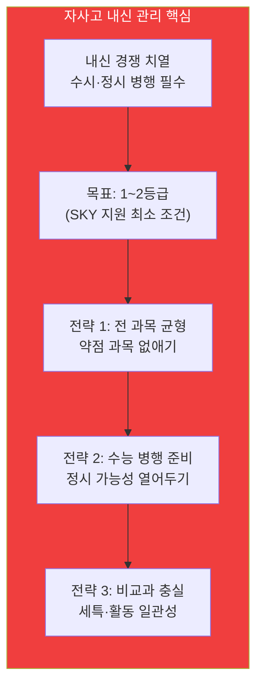

**자사고 내신 극복 전략:**
- 내신 2등급 이하 → 정시 집중 전환 고려
- 비교과 우수 → 학종 가능성 높임
- 수능최저 충족 → 교과전형 지원 가능

---

## 7. 학년별 전략 상세 로드맵

### 7-1. 중학교 (중1~중3): 방향 탐색 단계

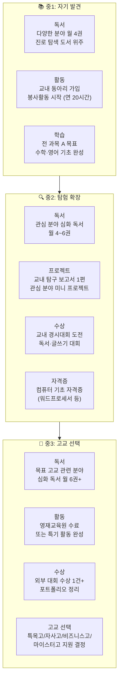

**중학교 단계 체크리스트:**

| 항목 | 중1 목표 | 중2 목표 | 중3 목표 |
|------|---------|---------|---------|
| **독서** | 다양한 분야 탐색 (월 4권) | 관심 분야 심화 (월 4~6권) | 목표 진로 집중 (월 6권+) |
| **프로젝트** | 교내 수행평가 완성도 | 탐구 보고서 1편 | 포트폴리오 초안 완성 |
| **수상** | 교내 대회 참가 경험 | 교내 수상 1건+ | 교외 수상 1건+ |
| **자격증** | 해당 없음 | 워드프로세서/컴활 3급 | 컴활 2급 or 분야별 자격증 |
| **활동** | 동아리 가입·봉사 시작 | 동아리 활동 심화 | 영재교육원·특기 활동 |
| **내신** | 전 과목 A 목표 | 전 과목 A 유지 | 상위 30% 이내 |

---

### 7-2. 고등학교 고1: 기반 구축 단계

```mermaid
flowchart LR
    subgraph G1_BOOK["📖 독서 전략"]
        direction TB
        B1["진로 연계 독서<br/>월 4~6권"]
        B2["세특 연계 독서<br/>교과별 심화 원서"]
        B3["독서 기록장<br/>요약·감상·탐구 연결"]
    end

    subgraph G1_PROJ["🔬 프로젝트 전략"]
        direction TB
        P1["교과 탐구 보고서<br/>과목별 1편 이상"]
        P2["동아리 프로젝트<br/>진로 연계 주제"]
        P3["세특 기록 연결<br/>탐구→결과→배움"]
    end

    subgraph G1_AWARD["🏆 수상 전략"]
        direction TB
        A1["교내 대회 전략 참가<br/>진로 관련 분야 집중"]
        A2["목표 수상 2~3건<br/>교과·비교과 균형"]
        A3["수상 내용 세특 연결<br/>스토리 일관성"]
    end

    subgraph G1_CERT["📋 자격증 전략"]
        direction TB
        C1["기초 자격증 취득<br/>컴퓨터활용능력 2급"]
        C2["분야별 자격증 준비<br/>이공계: 정보처리기능사<br/>문과: 한국사능력검정"]
        C3["어학 성적 준비<br/>영어: TOEIC 준비 시작"]
    end

    subgraph G1_ACT["🎯 활동 전략"]
        direction TB
        AC1["동아리 활동 심화<br/>진로 연계 동아리 주도"]
        AC2["봉사활동<br/>연 20시간 이상<br/>진로 연계 봉사"]
        AC3["학생회·리더십<br/>반장·부장 경험"]
    end

    G1_BOOK --- G1_PROJ
    G1_PROJ --- G1_AWARD
    G1_AWARD --- G1_CERT
    G1_CERT --- G1_ACT
```

**고1 핵심 목표:**
- 내신: 전 과목 1~2등급 목표 (특목고·자사고 기준)
- 세특: 모든 교과에서 탐구 활동 기록 남기기
- 진로: 희망 직업·학과 1~2개로 좁히기

---

### 7-3. 고등학교 고2: 심화 구축 단계

```mermaid
flowchart LR
    subgraph G2_BOOK["📖 독서 전략"]
        direction TB
        B1["전공 심화 독서<br/>월 6권+ 원서 포함"]
        B2["논문·학술지 읽기<br/>관심 분야 최신 트렌드"]
        B3["독서 기반 탐구<br/>보고서·세특 연결"]
    end

    subgraph G2_PROJ["🔬 프로젝트 전략"]
        direction TB
        P1["심화 탐구 보고서<br/>2편 이상 (A4 5장+)"]
        P2["외부 프로그램 참여<br/>대학 캠프·연구 프로그램"]
        P3["팀 프로젝트 리더<br/>결과물 포트폴리오화"]
    end

    subgraph G2_AWARD["🏆 수상 전략"]
        direction TB
        A1["교내 대회 집중 수상<br/>3~5건 목표"]
        A2["교외 대회 도전<br/>올림피아드·공모전"]
        A3["수상 스토리 완성<br/>진로와 일관성 유지"]
    end

    subgraph G2_CERT["📋 자격증 전략"]
        direction TB
        C1["핵심 자격증 취득<br/>컴퓨터활용능력 1급"]
        C2["전공 관련 자격증<br/>이공계: 정보처리산업기사<br/>문과: 무역영어·회계"]
        C3["어학 성적 완성<br/>TOEIC 800+ or TOEFL 80+"]
    end

    subgraph G2_ACT["🎯 활동 전략"]
        direction TB
        AC1["동아리 임원·창설<br/>주도적 활동 기록"]
        AC2["대외 활동 확장<br/>모의UN·토론·해커톤"]
        AC3["인턴·체험 프로그램<br/>진로 관련 직업 체험"]
    end

    G2_BOOK --- G2_PROJ
    G2_PROJ --- G2_AWARD
    G2_AWARD --- G2_CERT
    G2_CERT --- G2_ACT
```

**고2 핵심 목표:**
- 내신: 1~2등급 유지 (수시 지원 가능 라인 사수)
- 수능: 6월 모의고사 목표 등급 달성 여부 점검
- 비교과: 진로 스토리 완성 (중1~고2 일관된 흐름)

---

### 7-4. 고등학교 고3: 입시 완성 단계

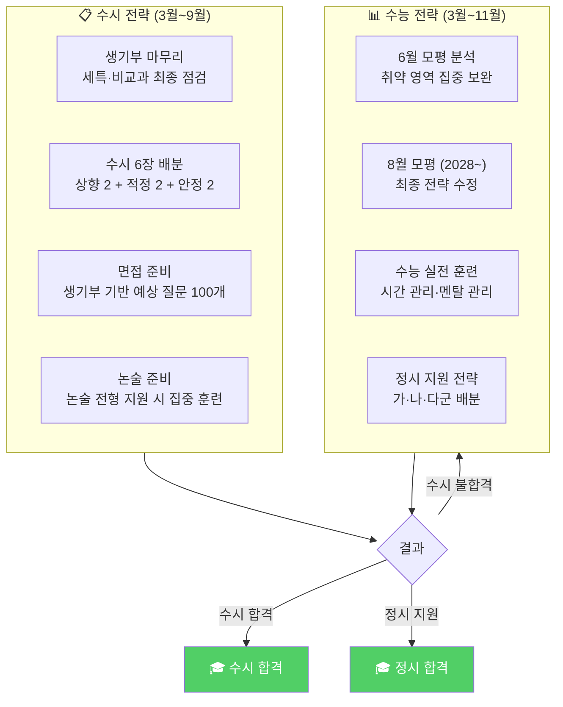

**고3 월별 핵심 일정:**

| 월 | 수시 | 수능 | 비고 |
|----|------|------|------|
| 3월 | 생기부 점검 시작 | 3월 모의고사 | 수시 지원 대학 리스트 초안 |
| 4~5월 | 수시 지원 전략 확정 | 수능 집중 학습 | 면접 준비 병행 |
| 6월 | 수시 서류 준비 | 6월 모의평가 | 모평 결과로 전략 수정 |
| 7~8월 | 자기소개서 작성 (폐지 전형 제외) | 여름방학 집중 | 8월 모평 (2028~) |
| 9월 | **수시 원서 접수** | 9월 모의평가 | 수시 6장 최종 결정 |
| 10~11월 | 면접·논술 준비 | **수능 본시험 (11월)** | 수시·수능 병행 |
| 12~1월 | 수시 합격 발표 | **정시 원서 접수** | 최종 합격 |

---

### 7-5. 대학교 (대1~대4): 취업 준비 단계

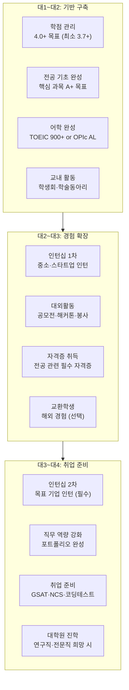

---

## 7-6. 대학 전공별 취업 준비 전략

### 이공계 (공학·자연과학)

| 학년 | 학점 목표 | 핵심 역량 | 자격증·어학 | 경험 |
|------|----------|----------|-----------|------|
| **대1~대2** | 4.0+ (최소 3.8) | 프로그래밍 (Python·C++) | TOEIC 800+ | 학부 연구생 지원 |
| **대3** | 전공 A+ 유지 | AI·데이터 분석 프로젝트 | 정보처리기사 | 대기업 인턴십 1차 |
| **대4** | 전체 3.8+ | 포트폴리오 완성 | TOEIC 900+ | 대기업 인턴십 2차 (필수) |

**취업 목표 기업:** 삼성전자, SK하이닉스, 네이버, 카카오, LG전자

### 경영·경제

| 학년 | 학점 목표 | 핵심 역량 | 자격증·어학 | 경험 |
|------|----------|----------|-----------|------|
| **대1~대2** | 4.0+ (최소 3.9) | 회계·재무 기초 | TOEIC 900+ | 교내 경영 동아리 |
| **대3** | 전공 A+ 유지 | 케이스 스터디·발표 | CFA Level 1 준비 | 컨설팅·금융 인턴 |
| **대4** | 전체 4.0+ | 영어 프레젠테이션 | OPIc AL | 맥킨지·BCG 인턴 |

**취업 목표 기업:** 맥킨지, BCG, 삼성증권, KB증권, 대기업 경영관리

### 인문·사회

| 학년 | 학점 목표 | 핵심 역량 | 자격증·어학 | 경험 |
|------|----------|----------|-----------|------|
| **대1~대2** | 3.8+ | 글쓰기·발표·토론 | TOEIC 850+ | 대외활동·공모전 |
| **대3** | 전공 A+ 유지 | 기획·마케팅 프로젝트 | 한국사능력검정 1급 | 기업 인턴·봉사 |
| **대4** | 전체 3.7+ | 포트폴리오 완성 | TOEIC 900+ | 공기업·대기업 인턴 |

**취업 목표 기업:** 공기업, 대기업 마케팅·홍보, 언론사, 출판사

---

## 7-7. 고3 수시 면접 준비 전략

### 학종 면접 핵심 질문 유형 (예시 20개)

**생기부 기반 질문 (60%)**
1. "생기부에 기록된 [프로젝트명]에 대해 설명해 주세요."
2. "이 탐구 활동을 하면서 가장 어려웠던 점은 무엇인가요?"
3. "독서 활동에서 읽은 [책 제목]의 핵심 내용을 요약해 주세요."
4. "동아리에서 어떤 역할을 했고, 무엇을 배웠나요?"
5. "세특에 기록된 [과목명] 탐구 주제를 선택한 이유는?"
6. "R&E 연구에서 본인이 기여한 부분은 무엇인가요?"
7. "수상 경력 중 가장 의미 있었던 것과 그 이유는?"
8. "봉사활동을 통해 배운 점은 무엇인가요?"
9. "학급 임원 활동에서 갈등을 어떻게 해결했나요?"
10. "진로 희망이 [직업명]인 이유는 무엇인가요?"

**전공 적합성 질문 (30%)**
11. "우리 학과에 지원한 동기는 무엇인가요?"
12. "이 전공을 공부하기 위해 어떤 준비를 했나요?"
13. "최근 [전공 분야] 이슈 중 관심 있는 것은?"
14. "졸업 후 진로 계획을 말씀해 주세요."
15. "이 분야에서 필요한 역량은 무엇이라고 생각하나요?"

**인성·가치관 질문 (10%)**
16. "본인의 장점과 단점은 무엇인가요?"
17. "실패 경험과 극복 과정을 말씀해 주세요."
18. "팀 프로젝트에서 갈등이 생겼을 때 어떻게 대처하나요?"
19. "우리 대학에 합격하면 어떤 학생이 되고 싶나요?"
20. "마지막으로 하고 싶은 말이 있나요?"

### 면접 준비 4주 플랜

| 주차 | 준비 내용 | 목표 |
|------|----------|------|
| **1주차** | 생기부 전체 정독, 핵심 키워드 100개 추출 | 내 생기부 완벽 숙지 |
| **2주차** | 예상 질문 100개 작성, 답변 초안 작성 | 모든 질문에 답변 준비 |
| **3주차** | 모의 면접 5회 이상 (학원·선생님·친구) | 답변 다듬기 |
| **4주차** | 최종 리허설, 복장·태도 점검 | 실전 감각 완성 |

---

## 8. 고교 유형별 학년별 전략 요약표

### 8-1. 과학고·영재고 학년별 전략

| 학년 | 독서 | 프로젝트 | 수상 | 자격증 | 활동 |
|------|------|---------|------|--------|------|
| **고1** | 수학·물리·화학 원서 월 4권 | R&E 연구 시작, 탐구 보고서 1편 | 교내 수학·과학 경시 수상 | 정보처리기능사 준비 | 과학 동아리 임원 |
| **고2** | 논문·학술지 읽기, 월 6권+ | R&E 심화, 공동 연구 논문 | 올림피아드 수상 (수학·물리·화학) | 정보처리산업기사 취득 | 외부 연구 프로그램 참여 |
| **고3** | 지원 학과 관련 심화 독서 | 연구 논문 완성, 포트폴리오 | 전국 대회 수상 1건+ | TOEFL 80+ | 서울대 일반전형 학종 지원 |

### 8-2. 외고·국제고 학년별 전략

| 학년 | 독서 | 프로젝트 | 수상 | 자격증 | 활동 |
|------|------|---------|------|--------|------|
| **고1** | 영어 원서 월 4권, 제2외국어 | 경제·사회 탐구 보고서 1편 | 교내 영어 토론·에세이 수상 | TOEIC 700+ 준비 | 영어 토론 동아리 가입 |
| **고2** | 경제·국제관계 심화, 월 6권 | 모의UN 발표 자료, 경제 보고서 | 모의UN 수상, 토론대회 수상 | TOEIC 900+ or TOEFL 90+ | 모의UN 대표, 동아리 임원 |
| **고3** | 지원 학과 연계 독서 | 포트폴리오 완성 | 교외 영어 대회 수상 | OPIc AL 취득 | 연세대 활동우수전형 지원 |

### 8-3. 자사고 학년별 전략

| 학년 | 독서 | 프로젝트 | 수상 | 자격증 | 활동 |
|------|------|---------|------|--------|------|
| **고1** | 진로 연계 다독, 월 4~6권 | 교과 탐구 보고서 2편 | 교내 대회 2~3건 수상 | 컴퓨터활용능력 2급 | 동아리 활동 + 봉사 20시간 |
| **고2** | 전공 심화 + 논문 읽기 | 심화 탐구 보고서 + 팀 프로젝트 | 교내 3~5건 + 교외 1건 | 컴퓨터활용능력 1급 + 어학 | 동아리 임원 + 대외활동 |
| **고3** | 지원 학과 최신 트렌드 독서 | 포트폴리오 완성 | 교외 수상 1건+ | TOEIC 850+ | 수시 학종 + 정시 병행 |

### 8-4. 비즈니스고 학년별 전략

| 학년 | 독서 | 프로젝트 | 수상 | 자격증 | 활동 |
|------|------|---------|------|--------|------|
| **고1** | 경영·경제·IT 입문서 월 3권 | 교과 실습 프로젝트 (회계·마케팅) | 교내 비즈니스 경진대회 | 워드프로세서 1급, 컴활 2급 | 창업 동아리, 현장실습 준비 |
| **고2** | 창업·마케팅·IT 심화 월 4권 | 창업 아이디어 공모전 참가 | 교내외 비즈니스 대회 수상 | 컴활 1급, 전산회계 1급 | 현장실습 (기업 인턴) |
| **고3** | 취업 목표 기업 분야 독서 | 취업 포트폴리오 완성 | 전국 비즈니스 대회 도전 | 유통관리사, 비서 자격증 | 취업 준비 or 대학 진학 결정 |

### 8-5. 마이스터고 학년별 전략

| 학년 | 독서 | 프로젝트 | 수상 | 자격증 | 활동 |
|------|------|---------|------|--------|------|
| **고1** | 전공 기술 입문서 월 3권 | 기초 실습 프로젝트 | 교내 기술 경진대회 | 전공 기초 자격증 준비 | 현장실습 준비, 기술 동아리 |
| **고2** | 산업 트렌드·기술 심화 월 4권 | 산업체 연계 프로젝트 | 전국 기능경기대회 도전 | 기능사 취득 (전기·용접 등) | 산업체 현장실습 (6개월) |
| **고3** | 취업 목표 기업 분야 독서 | 졸업 작품·포트폴리오 완성 | 전국 기능경기대회 수상 | 산업기사 도전, 추가 기능사 | 취업 활동 or 선취업 후진학 |

---

## 8-6. 일반고 학년별 전략 (수능 집중형)

| 학년 | 독서 | 프로젝트 | 수상 | 자격증 | 활동 | 수능 준비 |
|------|------|---------|------|--------|------|----------|
| **고1** | 진로 연계 월 3~4권 | 교과 탐구 1편 | 교내 대회 1~2건 | 컴활 2급 | 동아리 가입 | 개념 완성 (국·수·영) |
| **고2** | 전공 관련 월 4~6권 | 심화 탐구 1편 | 교내 대회 2~3건 | 한국사능력검정 1급 | 동아리 활동 | 6월 모평 목표 등급 달성 |
| **고3** | 최소화 (수능 집중) | 없음 | 없음 | TOEIC 800+ | 최소화 | 수능 전 과목 1~2등급 |

**일반고 핵심 전략:**
- 교과전형 노리기: 내신 1등급대 유지 → 지역균형선발 지원
- 정시 집중: 수능 전 과목 1~2등급 → SKY·의약학 도전
- 학원·인강 활용: 대치동·목동 학원가 or EBS·메가스터디

---

## 8-7. 고교 유형별 수능 준비 전략 비교

| 고교 유형 | 수능 준비 시작 | 수능 비중 | 목표 등급 | 전략 |
|----------|-------------|----------|----------|------|
| **과학고·영재고** | 고2 하반기 | 30% | 수학·과학 1등급 | 학종 위주, 수능은 보험 |
| **외고·국제고** | 고2 상반기 | 20% | 국·영·사 1~2등급 | 학종 위주, 수능최저 충족 |
| **자사고** | 고1 하반기 | 40% | 전 과목 1~2등급 | 수시·정시 균형 |
| **일반고 (학군지)** | 고1 상반기 | 50% | 전 과목 1~2등급 | 정시 중심, 교과전형 병행 |
| **일반고 (비학군지)** | 중3~고1 | 60% | 전 과목 1~2등급 | 정시 집중 |

---

## 9. 구체적 캐리어 패스 예시 5가지

### 예시 1: 과학고 → 서울대 공대 → 삼성전자 (이공계 엘리트)

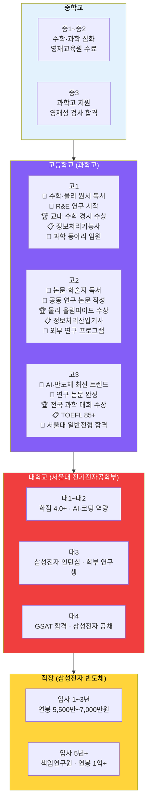

**단계별 핵심 스펙:**

| 단계 | 필수 조건 | 차별화 요소 | 예상 경쟁률 |
|------|----------|-----------|-----------|
| 과학고 입학 | 수학·과학 내신 A | 영재교육원, 경시대회 | 3~5:1 |
| 서울대 합격 | 내신 1~2등급, R&E | 연구 논문, 올림피아드 수상 | 10:1+ |
| 삼성전자 입사 | 학점 3.8+, 전공 역량 | 인턴 경험, AI 프로젝트 | 100:1+ |

**실제 합격 사례 분석:**

**사례 A: 서울과학고 → 서울대 전기전자공학부 (2025 합격)**
- 중학교: 시·도 영재교육원 수료, KMO(한국수학올림피아드) 동상
- 고1: R&E 주제 "AI 기반 교통 신호 최적화", 교내 수학 경시 금상
- 고2: 공동 연구 논문 1편 (한국과학영재학회 발표), KPhO 은상
- 고3: 연구 논문 완성 (A4 15장), TOEFL 88점, 서울대 일반전형 합격
- **합격 포인트:** R&E 연구의 일관성 + 올림피아드 수상 + 내신 2등급

---

### 예시 2: 외고 → 연세대 경영 → 맥킨지 컨설팅 (문과 엘리트)

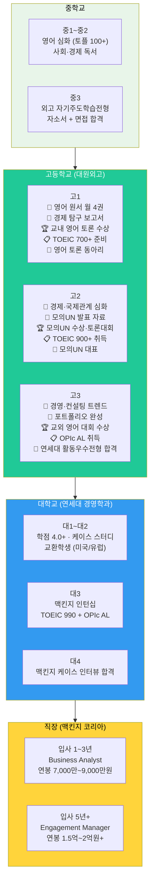

**실제 합격 사례 분석:**

**사례 B: 대원외고 → 연세대 경영학과 (2025 합격)**
- 중학교: 영어 내신 전 과목 A, TOEFL 95점, 영어 토론 동아리 회장
- 고1: 영어 원서 월 5권, 경제 탐구 보고서 "ESG 경영의 미래", TOEIC 750
- 고2: 모의UN 한국 대표, 토론대회 금상, TOEIC 920, 교환학생 프로그램
- 고3: 경영 컨설팅 관련 독서 20권+, OPIc AL, 연세대 활동우수전형 합격
- **합격 포인트:** 모의UN 대표 경험 + 어학 역량 + 경영 진로 일관성

---

### 예시 3: 자사고 → 고려대 의예과 → 서울대병원 전문의 (의학계열)

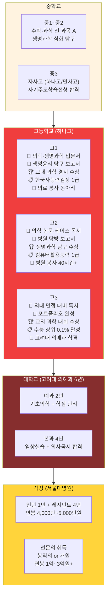

**실제 합격 사례 분석:**

**사례 C: 하나고 → 고려대 의예과 (2025 합격)**
- 중학교: 전 과목 A, 생명과학 탐구 보고서 3편, 병원 봉사 30시간
- 고1: 의학 윤리 독서 20권, 생명과학 탐구 "유전자 가위 기술의 윤리", 내신 1.5등급
- 고2: 병원 탐방 5회, 의학 논문 읽기, 생명과학 올림피아드 동상, 내신 1.3등급
- 고3: 의대 면접 대비 독서, 수능 전 과목 1등급 (상위 0.2%), 고려대 의예과 합격
- **합격 포인트:** 의학 진로 일관성 + 수능 최상위 + 봉사 활동 + 내신 1등급대

---

### 예시 4: 비즈니스고 → 경영학과 → 스타트업 창업 (실무 창업 루트)

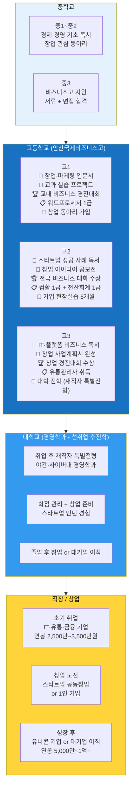

**비즈니스고 핵심 자격증 로드맵:**

| 시기 | 자격증 | 취득 목적 |
|------|--------|----------|
| 고1 | 워드프로세서 1급, 컴활 2급 | 기초 사무 역량 증명 |
| 고2 | 컴활 1급, 전산회계 1급 | 실무 역량 강화 |
| 고3 | 유통관리사, 비서 자격증 | 취업 경쟁력 확보 |
| 대학 | 경영지도사, 세무사 준비 | 전문직 진입 |

**실제 합격 사례 분석:**

**사례 D: 안산국제비즈니스고 → 취업 → 경영학과 (2025)**
- 고1: 창업 동아리 회장, 워드프로세서 1급, 컴활 2급, 교내 비즈니스 대회 금상
- 고2: 창업 아이디어 공모전 은상, 컴활 1급, 전산회계 1급, 현장실습 6개월 (쿠팡)
- 고3: 전국 비즈니스 대회 동상, 유통관리사 취득, 쿠팡 정규직 입사 (연봉 2,800만)
- 대학: 재직자 특별전형으로 사이버대 경영학과 입학, 3년 근무 후 스타트업 창업
- **성공 포인트:** 실무 경험 + 자격증 다수 + 창업 준비 + 선취업 후진학

---

### 예시 5: 마이스터고 → 현대차 기술직 → 기술 명장 (기술 전문가 루트)

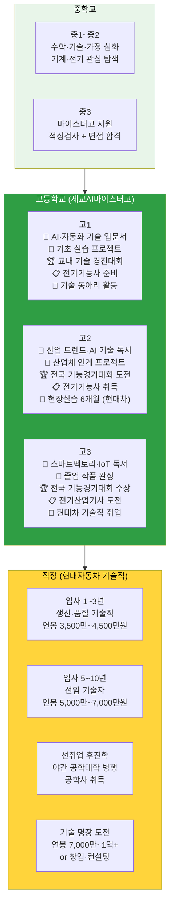

**마이스터고 핵심 자격증 로드맵:**

| 시기 | 자격증 | 취득 목적 |
|------|--------|----------|
| 고1 | 전공 기초 자격증 준비 | 기술 기초 확인 |
| 고2 | 기능사 취득 (전기·용접·정보처리) | 취업 기본 요건 |
| 고3 | 산업기사 도전, 추가 기능사 | 취업 경쟁력 강화 |
| 취업 후 | 기사 → 기술사 → 명장 | 전문가 경력 개발 |

**실제 합격 사례 분석:**

**사례 E: 세교AI마이스터고 → 현대자동차 (2025)**
- 고1: AI 기술 동아리, 전기기능사 준비, 교내 기술 경진대회 금상
- 고2: 전기기능사 취득, 산업체 연계 프로젝트 (스마트팩토리), 현대차 현장실습 6개월
- 고3: 전국 기능경기대회 동상, 전기산업기사 도전, 현대차 정규직 입사 (연봉 3,800만)
- 취업 후: 야간 공학대학 병행 (3년), 기사 취득, 5년 차 선임 기술자 (연봉 5,500만)
- **성공 포인트:** 기능사 조기 취득 + 현장실습 우수 평가 + 기능경기대회 수상

---

## 10. 좋은 직장 진입 경로 종합 비교

### 10-1. 직장 유형별 진입 조건

| 직장 유형 | 대표 기업 | 학력 조건 | 핵심 스펙 | 연봉 범위 |
|----------|----------|----------|----------|----------|
| **대기업** | 삼성·SK·현대·LG | 4년제 대졸 | GSAT/인적성 + 학점 3.5+ | 5,000만~1억+ |
| **전문직** | 병원·법무법인·회계법인 | 의대·로스쿨·CPA | 국가시험 합격 | 1억~3억+ |
| **글로벌 컨설팅** | 맥킨지·BCG·베인 | SKY·해외 명문 | 케이스 인터뷰 + 영어 | 7,000만~2억+ |
| **빅테크** | 구글·네이버·카카오 | 무관 (역량 중심) | 코딩테스트 + 포트폴리오 | 6,000만~1.5억+ |
| **공기업** | 한전·가스공사·수자원 | 4년제 대졸 | NCS + 전공시험 | 4,000만~7,000만 |
| **금융권** | 증권·은행·보험 | 4년제 대졸 | 금융 자격증 + 영어 | 4,500만~8,000만 |
| **기술직 전문** | 현대차·두산·한화 | 마이스터고~대졸 | 기능사·산업기사 | 3,500만~7,000만 |

### 10-2. 대학 티어별 취업 가능 직장

| 대학 티어 | 대표 대학 | 대기업 | 전문직 | 글로벌 | 공기업 |
|----------|----------|--------|--------|--------|--------|
| **Tier 1** | 서울대·연세대·고려대 | ◎ | ◎ 로스쿨·의대 | ◎ 컨설팅·IB | ◎ |
| **Tier 2** | 성균관·한양·서강·중앙 | ○ | ○ 가능 | ○ 가능 | ◎ |
| **Tier 3** | 경희·외대·시립·건국 | △ | △ 노력 필요 | △ 제한적 | ○ |
| **Tier 4** | 지방거점국립 | △ | △ | × | ○ 유리 |
| **마이스터고** | 세교AI마이스터고 등 | ○ 기술직 | × | × | ○ 기술직 |
| **비즈니스고** | 경복비즈니스고 등 | △ 사무직 | × | × | △ |

> ◎ 매우 유리 / ○ 유리 / △ 가능하나 노력 필요 / × 매우 어려움

---

## 10-3. 대기업 취업 준비 타임라인 (이공계 기준)

| 시기 | 준비 사항 | 목표 | 비고 |
|------|----------|------|------|
| **대1~대2** | 학점 4.0+ 유지, 프로그래밍 역량 | 전공 기초 완성 | Python·C++ 필수 |
| **대2 여름** | 중소기업 인턴십 1차 | 실무 경험 쌓기 | 스타트업 추천 |
| **대3 상반기** | GSAT 준비 시작, 코딩테스트 연습 | 삼성 GSAT 700점+ | 프로그래머스 활용 |
| **대3 여름** | 대기업 인턴십 2차 (삼성·SK·LG) | 인턴 전환 노리기 | 인턴 경험 필수 |
| **대3 하반기** | 포트폴리오 완성, TOEIC 900+ | 취업 준비 완료 | 프로젝트 3개 이상 |
| **대4 상반기** | 상반기 공채 지원 (삼성·SK·현대) | 서류 합격 | 자소서 첨삭 필수 |
| **대4 여름** | 하반기 공채 지원 (LG·롯데·두산) | 최종 합격 | 면접 준비 철저히 |

---

## 10-4. 직장 유형별 연봉 상승 곡선 비교

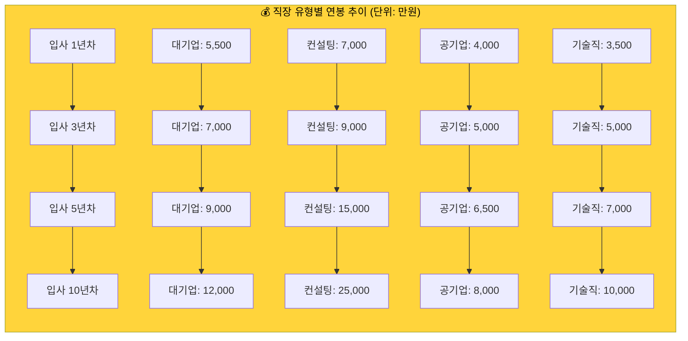

**연봉 상승률 분석:**
- 컨설팅: 초기 연봉 높음 + 승진 시 급격한 상승 (파트너 시 5억+)
- 대기업: 안정적 상승, 임원 시 2억~5억
- 공기업: 완만한 상승, 안정성 높음
- 기술직: 명장 도달 시 1억+ 가능

---

## 11. 핵심 요약: 성공 캐리어 패스의 5대 원칙

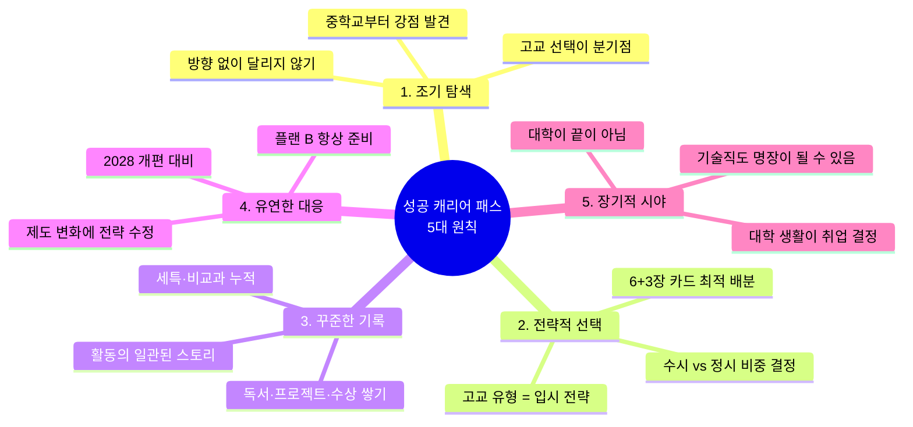

---

## 11-1. 실패 사례로 배우는 교훈 3가지

### 실패 사례 1: 과학고 → 내신 포기 → 정시 실패

**상황:**
- 서울과학고 입학 후 내신 경쟁 포기 (3~4등급)
- R&E 연구도 소홀히 함 (주제 선정 늦음)
- 고3 수능 준비 시작했으나 수학 심화 부족으로 2등급

**결과:** 서울대·KAIST 학종 탈락, 정시도 실패, 지방 국립대 진학

**교훈:**
- 과학고에서도 최소 2등급 이내 유지 필요
- R&E는 고1부터 체계적으로 준비
- 수능 플랜 B는 고2부터 병행 준비

### 실패 사례 2: 외고 → 어학만 집중 → 전공 적합성 부족

**상황:**
- 대원외고 입학 후 TOEIC 990, OPIc AL 달성
- 그러나 경영·경제 관련 활동 전무
- 생기부가 영어 활동으로만 채워짐

**결과:** 연세대·고려대 경영학과 학종 탈락, 수능최저 미달로 교과전형도 실패

**교훈:**
- 어학 역량은 기본, 전공 적합성이 핵심
- 진로 방향 일관성 있게 활동 구성
- 수능최저 충족 전략 필수

### 실패 사례 3: 자사고 → 수시·정시 모두 중도반단

**상황:**
- 하나고 입학 후 내신 2~3등급 (수시 애매)
- 수능 준비도 중도반단 (2~3등급)
- 비교과 활동도 일관성 없음

**결과:** 수시 6장 모두 탈락, 정시도 중위권 대학 진학

**교훈:**
- 고1 때 수시 or 정시 방향 명확히 결정
- 내신 2등급 이하면 정시 집중 전환
- 중도반단이 가장 위험함

---

## 12. 학부모를 위한 자녀 진로 지원 가이드

### 학부모 역할별 체크리스트

| 시기 | 정보 수집 | 경제적 지원 | 정서적 지원 | 주의 사항 |
|------|----------|-----------|-----------|----------|
| **중1~중2** | 고교 유형 파악, 입시 제도 공부 | 학원비 (월 50~100만) | 진로 대화, 강점 발견 | 과도한 압박 금지 |
| **중3** | 특목고·자사고 입시 정보 | 입시 컨설팅 (선택) | 면접 연습 지원 | 자녀 의사 존중 |
| **고1~고2** | 대입 전형 연구, 대학 정보 | 학원비 (월 100~150만) | 스트레스 관리 | 내신 압박 주의 |
| **고3** | 수시 6장 전략, 정시 배치표 | 입시 컨설팅 (필수) | 멘탈 관리 최우선 | 과도한 개입 금지 |
| **대학** | 취업 정보, 인턴십 정보 | 어학·자격증 비용 | 진로 고민 경청 | 자율성 존중 |

### 학부모가 피해야 할 5가지 실수

1. **과도한 비교:** "옆집 아이는 과학고 갔는데..." → 자녀 자존감 하락
2. **일방적 결정:** "너는 의대 가야 해" → 진로 불일치로 실패 확률 높음
3. **과잉 개입:** 생기부 활동 대신 작성 → 면접에서 탈락
4. **정보 부족:** 입시 제도 모르고 잘못된 조언 → 전략 실패
5. **정서적 방치:** "알아서 해" → 스트레스 관리 실패

---

## 부록: 용어 정리

| 용어 | 설명 |
|------|------|
| **수시** | 고3 9~12월 지원, 내신·비교과·면접 중심 (최대 6개 대학) |
| **정시** | 수능 후 12~1월 지원, 수능 성적 중심 (가·나·다군 각 1개) |
| **학종** | 학생부종합전형, 생활기록부 전체를 종합 평가 |
| **세특** | 세부능력특기사항, 교과별 학생의 수업 참여·탐구 기록 |
| **R&E** | Research & Education, 과학고 연구 프로그램 |
| **수능최저** | 수시 합격을 위해 충족해야 하는 최소 수능 등급 조건 |
| **5등급제** | 2028 개편안의 내신 평가 체계 (현행 9등급 → 5등급) |
| **선취업 후진학** | 고교 졸업 후 취업 먼저, 이후 재직자 특별전형으로 대학 진학 |
| **마이스터고** | 산업수요 맞춤형 고등학교, 특정 산업 분야 전문 기술 교육 |
| **비즈니스고** | 상업·경영·IT 계열 특성화고, 실무 중심 교육 |
| **GSAT** | 삼성그룹 직무적성검사, 삼성 공채 1차 관문 |
| **NCS** | 국가직무능력표준, 공기업 채용 시험의 기반 |

---

## 12-1. 비교과 활동 비중 상세 분석 (2026 vs 2028)

### 수능·내신 제외 나머지 활동의 실제 영향력

#### 대입 전형별 비교과 비중 정리

**1. 학생부종합전형 (학종) - 비교과 비중 가장 높음**

| 평가 요소 | 2026 비중 | 2028 비중 | 실제 영향력 |
|----------|----------|----------|-----------|
| **교과 성적 (내신)** | 40~50% | 35~45% | 내신 1~2등급 필수 |
| **세특 (교과 세부능력)** | 30~35% | 35~40% | **비교과 중 가장 중요** |
| **비교과 (독서·활동·수상)** | 15~20% | 10~15% | 독서·수상 미기재로 감소 |
| **면접** | 10~15% | 15~20% | 면접 비중 확대 |

**비교과 실제 비중: 55~70% (내신 제외 시)**

**2026 vs 2028 변화:**
- 독서 목록 미기재 → 독서 비중 8% → 3%
- 수상 경력 미기재 → 수상 비중 8% → 3%
- 세특 강화 → 세특 비중 30% → 35%
- 면접 확대 → 면접 비중 10% → 15%

---

**2. 학생부교과전형 - 비교과 비중 낮음**

| 평가 요소 | 2026 비중 | 2028 비중 | 실제 영향력 |
|----------|----------|----------|-----------|
| **교과 성적 (내신)** | 80~90% | 75~85% | 내신이 거의 전부 |
| **출결·봉사** | 5~10% | 5~10% | 기본 인성 평가 |
| **면접** | 5~10% | 10~15% | 면접 비중 소폭 증가 |

**비교과 실제 비중: 10~25% (내신 제외 시)**

**2026 vs 2028 변화:**
- 내신 5등급제 → 동점자 증가 → 면접으로 변별
- 비교과는 여전히 미미한 영향

---

**3. 논술전형 - 비교과 비중 거의 없음**

| 평가 요소 | 2026 비중 | 2028 비중 | 실제 영향력 |
|----------|----------|----------|-----------|
| **논술 성적** | 60~70% | 60~70% | 논술 실력이 핵심 |
| **내신** | 20~30% | 20~30% | 최소 기준 (3등급 이내) |
| **수능최저** | 필수 충족 | 필수 충족 | 2~3개 합 4~5등급 |

**비교과 실제 비중: 0~5% (거의 없음)**

**2026 vs 2028 변화:**
- 비교과 영향 거의 없음
- 논술 실력 + 수능최저 충족이 전부

---

**4. 정시 (수능 전형) - 비교과 비중 0%**

| 평가 요소 | 2026 비중 | 2028 비중 | 실제 영향력 |
|----------|----------|----------|-----------|
| **수능 성적** | 90~100% | 90~100% | 수능이 거의 전부 |
| **내신** | 0~10% | 0~10% | 일부 대학만 반영 |
| **비교과** | 0% | 0% | 전혀 반영 안 함 |

**비교과 실제 비중: 0% (완전히 무관)**

---

### 비교과 세부 항목별 비중 (학종 기준)

#### 2026학년도 비교과 세부 비중

| 비교과 항목 | 비중 | 평가 방법 | 실제 사례 |
|------------|------|----------|----------|
| **세특 (교과 세부능력)** | 30~35% | 교과별 탐구 활동 기록 | "AI 윤리 문제를 수학적 모델로 해결" |
| **독서 활동** | 5~8% | 독서 목록 기재 | 월 4~6권, 진로 연계 독서 |
| **수상 경력** | 5~8% | 교내 대회 수상 | 고1 2~3건, 고2 3~5건 |
| **창의적 체험활동** | 3~5% | 동아리·봉사·진로 | 동아리 회장, 봉사 60시간 |
| **행동특성 및 종합의견** | 2~4% | 담임 선생님 평가 | "리더십 우수, 배려심 많음" |

**총 비교과 비중: 45~60% (내신 제외)**

---

#### 2028학년도 비교과 세부 비중 (예상)

| 비교과 항목 | 비중 | 평가 방법 | 실제 사례 | 변화 |
|------------|------|----------|----------|------|
| **세특 (교과 세부능력)** | 35~40% | 교과별 탐구 활동 기록 | "자율주행차 윤리 알고리즘 설계" | ▲ 증가 |
| **독서 활동** | 2~3% | 면접에서 질문 | 깊이 있는 독서, 면접 대비 | ▼ 감소 |
| **수상 경력** | 2~3% | 면접에서 질문 | 학기당 1개, 진로 관련 집중 | ▼ 감소 |
| **창의적 체험활동** | 3~5% | 동아리·봉사·진로 | 1~2개 동아리 집중 | 유지 |
| **행동특성 및 종합의견** | 2~4% | 담임 선생님 평가 | "탐구 열정, 협업 능력 우수" | 유지 |
| **면접** | 15~20% | 생기부 기반 심층 질문 | 탐구 과정 설명, 배움 강조 | ▲ 증가 |

**총 비교과 비중: 59~75% (내신 제외, 면접 포함)**

---

### 2026 vs 2028 비교과 전략 변화 상세

#### 독서 활동

| 항목 | 2026 전략 | 2028 전략 | 변화 이유 |
|------|----------|----------|----------|
| **목표 권수** | 월 4~6권 (양적 확대) | 월 4권 (질적 심화) | 목록 미기재 |
| **독서 기록** | 목록 작성 (제목·저자) | 깊이 있는 독서 기록장 | 면접 대비 |
| **선택 기준** | 다양한 분야 탐색 | 진로 집중 + 심화 | 면접에서 질문 |
| **활용 방법** | 생기부 목록 기재 | 프로젝트·세특 연계 | 세특 비중 증가 |

**실제 사례 (2028):**
- 독서: "AI 시대의 윤리" 정독 → 독서 기록장 A4 2장 작성
- 프로젝트: 책 내용 바탕으로 "자율주행차 윤리 알고리즘" 설계
- 세특: "독서를 통해 AI 윤리 이론을 학습하고 실제 알고리즘으로 구현"
- 면접: "이 책에서 배운 공리주의와 의무론을 어떻게 적용했나요?"

---

#### 수상 경력

| 항목 | 2026 전략 | 2028 전략 | 변화 이유 |
|------|----------|----------|----------|
| **목표 개수** | 고1 2~3건, 고2 3~5건 | 고1 2건, 고2 2건 | 학기당 1개 제한 |
| **선택 기준** | 다양한 분야 참가 | 진로 관련 대회 집중 | 면접에서 질문 |
| **준비 방법** | 여러 대회 동시 준비 | 1개 대회 집중 준비 | 질적 평가 |
| **활용 방법** | 생기부 목록 기재 | 세특·면접 연계 | 수상 과정 설명 |

**실제 사례 (2028):**
- 고1: 교내 과학 탐구 대회 1개 집중 → 금상
- 고2: 교내 수학 경시 대회 1개 집중 → 최우수상
- 세특: "대회 준비 과정에서 [구체적 탐구 내용] 학습"
- 면접: "이 대회에서 가장 어려웠던 점과 해결 방법은?"

---

#### 세특 (교과 세부능력)

| 항목 | 2026 전략 | 2028 전략 | 변화 이유 |
|------|----------|----------|----------|
| **목표** | 다양한 활동 기록 | 심화 탐구 활동 집중 | 세특 비중 증가 |
| **내용** | 수업 참여 + 과제 제출 | 수업 중 질문·발표·토론 | 탐구 과정 중요 |
| **연계** | 독서·수상 별도 기록 | 독서·수상 세특 통합 | 독서·수상 미기재 |
| **면접** | 세특 내용 암기 | 탐구 과정 설명 훈련 | 면접 비중 40% |

**실제 사례 (2028):**
- 수업 중: "AI 윤리 관련 질문 3회, 발표 2회"
- 세특: "수업 중 자율주행차 윤리 딜레마에 대해 질문하고, 공리주의와 의무론의 충돌을 수학적 모델로 해결하려는 시도를 보임"
- 면접: "이 탐구를 하면서 가장 어려웠던 점은?" → "공리주의를 수식으로 표현하는 과정에서..."

---

#### 동아리 활동

| 항목 | 2026 전략 | 2028 전략 | 변화 이유 |
|------|----------|----------|----------|
| **개수** | 2~3개 (다양한 경험) | 1~2개 (집중) | 깊이 있는 활동 |
| **역할** | 회원 참여 | 회장·부회장 (리더십) | 주도적 활동 중요 |
| **활동** | 정기 모임 참여 | 프로젝트·세미나 주도 | 구체적 결과물 |
| **기록** | 활동 내용 나열 | 탐구 과정·배움 강조 | 면접에서 질문 |

**실제 사례 (2028):**
- 동아리: AI 연구 동아리 회장 (1개 집중)
- 활동: 교내 AI 세미나 개최 (50명 참석), 공동 연구 프로젝트 주도
- 세특: "동아리 회장으로서 AI 윤리 세미나를 기획하고 발표함"
- 면접: "세미나를 준비하면서 어떤 어려움이 있었나요?"

---

#### 봉사 활동

| 항목 | 2026 전략 | 2028 전략 | 변화 이유 |
|------|----------|----------|----------|
| **목표 시간** | 연 20시간 이상 (시간 채우기) | 연 20시간 이상 (질적 평가) | 시간 미기재 |
| **선택 기준** | 가까운 곳 (편의성) | 진로 연계 봉사 | 면접에서 질문 |
| **활동 내용** | 단순 봉사 (청소·배식) | 전문 봉사 (멘토링·상담) | 배움 강조 |
| **기록** | 시간·장소 기록 | 봉사 경험·배움 기록 | 면접 대비 |

**실제 사례 (2028):**
- 봉사: 병원 봉사 (의대 지망), 주 1회, 총 40시간
- 내용: 환자 돌봄, 의료진 보조
- 세특: "병원 봉사를 통해 환자 중심 의료의 중요성을 체득함"
- 면접: "봉사 활동에서 가장 기억에 남는 경험은?"

---

### 비교과 활동 투자 시간 가이드 (주당)

#### 고1 시간 배분

| 활동 | 2026 권장 시간 | 2028 권장 시간 | 변화 | 비고 |
|------|--------------|--------------|------|------|
| **내신 공부** | 20시간 | 20시간 | 유지 | 최우선 |
| **독서** | 5시간 (월 4~6권) | 4시간 (월 4권) | ▼ 1시간 | 깊이 있게 |
| **프로젝트 (세특)** | 3시간 | 5시간 | ▲ 2시간 | 세특 비중 증가 |
| **동아리** | 3시간 | 3시간 | 유지 | 1~2개 집중 |
| **수상 준비** | 2시간 | 1시간 | ▼ 1시간 | 학기당 1개 |
| **면접 준비** | 0시간 | 1시간 | ▲ 1시간 | 고1부터 준비 |
| **봉사** | 1시간 | 1시간 | 유지 | 진로 연계 |

**총 비교과 시간: 14시간 → 15시간 (주당)**

---

#### 고2 시간 배분

| 활동 | 2026 권장 시간 | 2028 권장 시간 | 변화 | 비고 |
|------|--------------|--------------|------|------|
| **내신 공부** | 20시간 | 20시간 | 유지 | 1~2등급 사수 |
| **독서** | 6시간 (월 6~8권) | 4시간 (월 4권) | ▼ 2시간 | 심화 독서 |
| **프로젝트 (세특)** | 4시간 | 6시간 | ▲ 2시간 | 심화 탐구 |
| **동아리** | 3시간 | 3시간 | 유지 | 임원 역할 |
| **수상 준비** | 3시간 | 2시간 | ▼ 1시간 | 진로 집중 |
| **면접 준비** | 0시간 | 2시간 | ▲ 2시간 | 본격 준비 |
| **봉사** | 1시간 | 1시간 | 유지 | 지속 |
| **수능 준비** | 5시간 | 5시간 | 유지 | 6월 모평 대비 |

**총 비교과 시간: 17시간 → 18시간 (주당)**

---

#### 고3 시간 배분

| 활동 | 2026 권장 시간 | 2028 권장 시간 | 변화 | 비고 |
|------|--------------|--------------|------|------|
| **수능 공부** | 30시간 | 30시간 | 유지 | 최우선 |
| **독서** | 2시간 (월 2~3권) | 1시간 (면접 대비) | ▼ 1시간 | 최소화 |
| **프로젝트 (세특)** | 1시간 | 1시간 | 유지 | 마무리 |
| **동아리** | 1시간 | 1시간 | 유지 | 최소 활동 |
| **수상 준비** | 0시간 | 0시간 | 유지 | 없음 |
| **면접 준비** | 2시간 (9~11월) | 4시간 (9~11월) | ▲ 2시간 | 집중 훈련 |
| **봉사** | 0시간 | 0시간 | 유지 | 없음 |

**총 비교과 시간: 6시간 → 7시간 (주당)**

---

### 핵심 요약: 비교과 비중 2026 vs 2028

**학종 기준 (내신 제외):**
- **2026:** 비교과 45~60% (독서 8% + 수상 8% + 세특 30% + 동아리 5% + 면접 10%)
- **2028:** 비교과 59~75% (독서 3% + 수상 3% + 세특 35% + 동아리 5% + 면접 15%)

**변화의 핵심:**
1. **독서·수상 미기재** → 양에서 질로 전환
2. **세특 비중 증가** → 수업 중 탐구 활동 최우선
3. **면접 비중 확대** → 탐구 과정 설명 능력 중요
4. **전략 변화** → 많이 하기보다 깊이 있게 하기

**결론:** 2028년에도 비교과 비중은 여전히 높습니다 (59~75%). 다만 평가 방식이 "양"에서 "질"로 변화합니다.

---

### 12-2. 전형별 비교과 비중 시각화

#### 2026학년도 전형별 비교

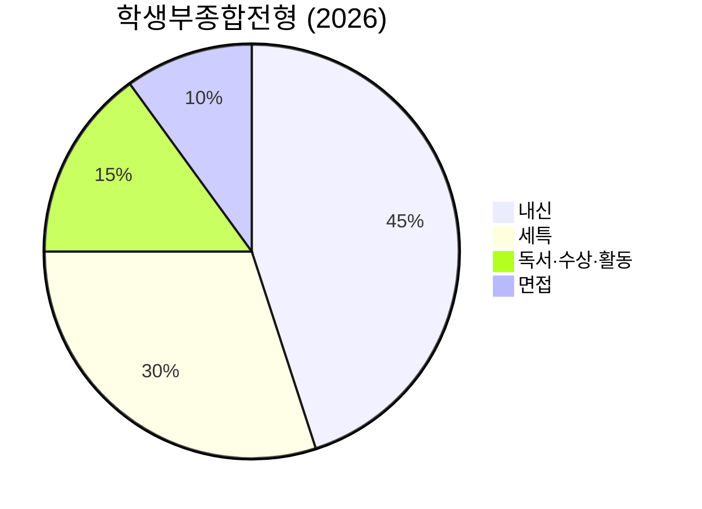

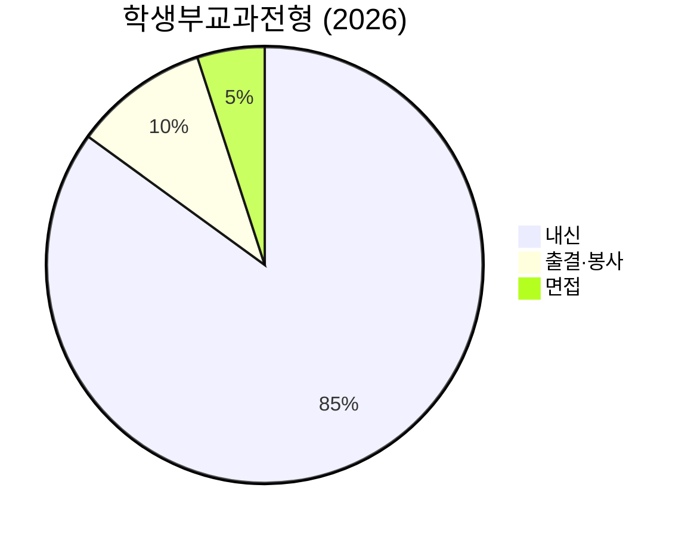

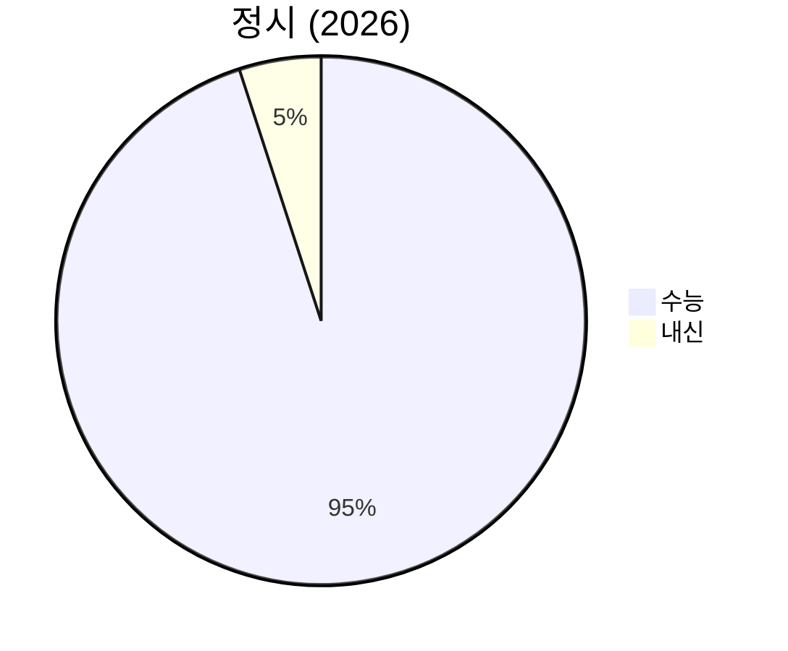

---

#### 2028학년도 전형별 비교

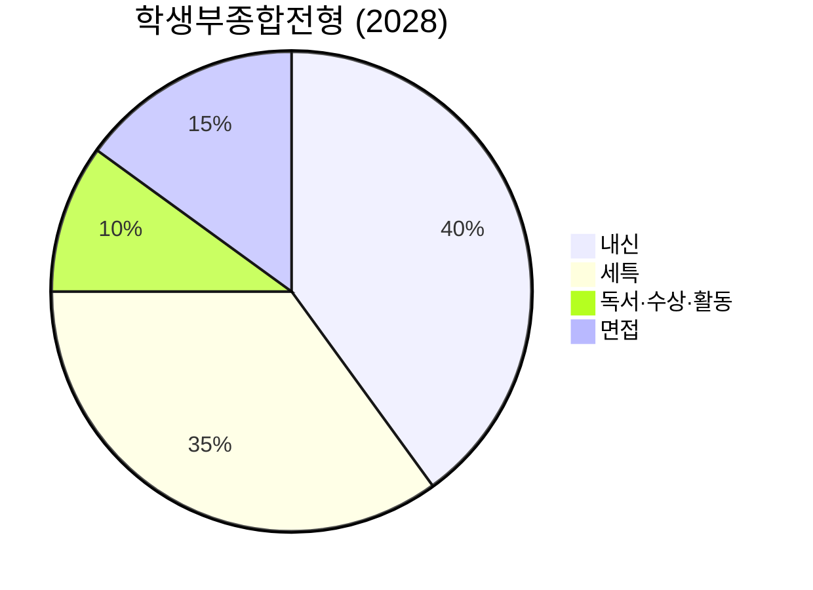

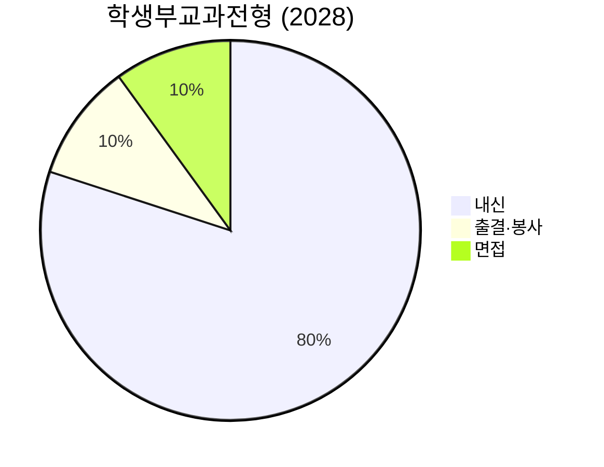

```mermaid
pie title 정시 (2028)
    "수능" : 95
    "내신" : 5
```

---

### 12-3. 비교과 활동 ROI (투자 대비 효과) 분석

**"어떤 활동이 가장 효율적인가?"**

| 활동 | 투자 시간 | 2026 효과 | 2028 효과 | ROI 순위 |
|------|----------|----------|----------|----------|
| **세특 (수업 중 탐구)** | 주 3~5시간 | ★★★★★ | ★★★★★ | 1위 (최고) |
| **면접 준비** | 주 1~2시간 (고1~고2) | ★★★☆☆ | ★★★★★ | 2위 (2028 급상승) |
| **프로젝트 (탐구 보고서)** | 주 3~4시간 | ★★★★☆ | ★★★★★ | 3위 (세특 연계) |
| **독서** | 주 4~5시간 | ★★★★☆ | ★★★☆☆ | 4위 (2028 하락) |
| **동아리 (리더십)** | 주 3시간 | ★★★☆☆ | ★★★☆☆ | 5위 (유지) |
| **수상 준비** | 주 2~3시간 | ★★★★☆ | ★★★☆☆ | 6위 (2028 하락) |
| **봉사** | 주 1시간 | ★★☆☆☆ | ★★☆☆☆ | 7위 (유지) |

**2028 전략 우선순위:**
1. **세특 (수업 중 탐구)** — 가장 중요, 35~40% 비중
2. **면접 준비** — 고1부터 준비, 15~20% 비중
3. **프로젝트** — 세특 연계, 탐구 보고서 작성
4. **독서** — 깊이 있게, 면접 대비
5. **동아리** — 1~2개 집중, 리더십 역할
6. **수상** — 학기당 1개, 진로 관련
7. **봉사** — 진로 연계, 최소 요건 충족

---

### 12-4. 고교 유형별 비교과 투자 시간 비교

| 고교 유형 | 내신 공부 | 비교과 활동 | 수능 준비 | 총 학습 시간 |
|----------|----------|-----------|----------|-----------|
| **과학고·영재고** | 주 15시간 | 주 20시간 (R&E 집중) | 주 10시간 | 주 45시간 |
| **외고·국제고** | 주 18시간 | 주 15시간 (어학·모의UN) | 주 12시간 | 주 45시간 |
| **자사고** | 주 20시간 | 주 12시간 (세특·동아리) | 주 15시간 | 주 47시간 |
| **일반고 (학군지)** | 주 22시간 | 주 8시간 (최소) | 주 18시간 | 주 48시간 |
| **일반고 (비학군지)** | 주 20시간 | 주 5시간 (최소) | 주 20시간 | 주 45시간 |

**핵심 인사이트:**
- 과학고·영재고: 비교과 비중 가장 높음 (R&E 연구 20시간)
- 일반고: 비교과 최소화, 수능 집중
- 자사고: 내신·비교과·수능 균형

---

### 12-5. 비교과 활동 효과 측정 (합격 사례 기반)

**"비교과 활동이 실제로 합격에 얼마나 기여했는가?"**

#### 서울대 일반전형 합격자 분석 (2025학년도)

| 합격자 유형 | 내신 | 세특·비교과 | 면접 | 합격 요인 |
|------------|------|-----------|------|----------|
| **A 학생 (과학고)** | 2.0등급 | R&E 논문 1편, 올림피아드 은상 | 우수 | **비교과 강점으로 내신 보완** |
| **B 학생 (자사고)** | 1.2등급 | 탐구 보고서 3편, 교내 수상 5건 | 보통 | **내신 + 비교과 균형** |
| **C 학생 (일반고)** | 1.0등급 | 탐구 보고서 2편, 교내 수상 3건 | 우수 | **내신 최상위 + 비교과 충실** |

**분석:**
- A 학생: 내신 2등급이지만 R&E 논문으로 합격 → **비교과 비중 60%**
- B 학생: 내신 1.2등급 + 비교과 균형 → **비교과 비중 40%**
- C 학생: 내신 1.0등급 + 비교과 충실 → **비교과 비중 30%**

**결론:** 내신이 낮을수록 비교과의 중요도가 높아집니다.

---

### 12-6. 2026 vs 2028 비교과 전략 변화 종합

```mermaid
flowchart TD
    subgraph STRATEGY_2026["2026 비교과 전략"]
        S26_1["독서 많이 읽기<br/>월 4~6권 목표"]
        S26_2["수상 많이 받기<br/>고2까지 10건+"]
        S26_3["활동 다양하게<br/>동아리 2~3개"]
        S26_4["세특 다양한 활동<br/>폭넓게 기록"]
    end
    
    subgraph STRATEGY_2028["2028 비교과 전략"]
        S28_1["독서 깊이 있게<br/>월 4권, 프로젝트 연계"]
        S28_2["수상 집중하기<br/>학기당 1개, 진로 관련"]
        S28_3["활동 집중하기<br/>동아리 1~2개 깊이"]
        S28_4["세특 심화 탐구<br/>깊이 있게 기록"]
        S28_5["면접 조기 준비<br/>고1부터 훈련"]
    end
    
    STRATEGY_2026 --> CHANGE["전략 변화:<br/>양 → 질<br/>다양성 → 집중<br/>기록 → 설명"]
    STRATEGY_2028 --> CHANGE
    
    style STRATEGY_2026 fill:#339af0,color:#fff
    style STRATEGY_2028 fill:#f03e3e,color:#fff
    style CHANGE fill:#ffd43b,color:#000
```

---

### 12-7. 비교과 활동 체크리스트 (2028 기준)

**"이 활동들을 했다면 비교과는 충분합니다"**

| 학년 | 독서 | 프로젝트 | 수상 | 동아리 | 봉사 | 면접 준비 |
|------|------|---------|------|--------|------|----------|
| **고1** | ☐ 월 4권, 독서 기록장 작성 | ☐ 탐구 보고서 2편 (A4 10장+) | ☐ 교내 대회 2건 | ☐ 1개 가입, 적극 참여 | ☐ 20시간, 진로 연계 | ☐ 발표·토론 연습 |
| **고2** | ☐ 월 4권, 심화 독서 | ☐ 심화 탐구 2편 (A4 15장+) | ☐ 교내 2건 + 교외 1건 | ☐ 임원 역할, 프로젝트 주도 | ☐ 20시간, 지속 | ☐ 예상 질문 50개 준비 |
| **고3** | ☐ 면접 대비 독서 | ☐ 포트폴리오 완성 | ☐ 없음 (수능 집중) | ☐ 최소 활동 | ☐ 없음 | ☐ 예상 질문 100개 준비 |

**이 체크리스트를 모두 완료하면 → SKY 학종 지원 가능**

---

## 13. 독서→프로젝트→수상→활동 연계 전략 (4단계 시스템)

### 13-1. 연계 전략의 핵심 원리

**"하나의 주제로 4가지 영역을 관통하라"**

```mermaid
flowchart LR
    BOOK["📖 독서<br/>주제 선정"] --> PROJ["🔬 프로젝트<br/>탐구 실행"]
    PROJ --> AWARD["🏆 수상<br/>결과 검증"]
    AWARD --> ACT["🎯 활동<br/>확장 적용"]
    ACT --> SPEC["✨ 세특 기록<br/>스토리 완성"]
    
    style BOOK fill:#339af0,color:#fff
    style PROJ fill:#845ef7,color:#fff
    style AWARD fill:#f03e3e,color:#fff
    style ACT fill:#20c997,color:#fff
    style SPEC fill:#ffd43b,color:#000
```

---

### 13-2. 구체적 연계 예시 10가지

#### 예시 1: AI 윤리 (이공계)

| 단계 | 활동 내용 | 기간 | 결과물 |
|------|----------|------|--------|
| **📖 독서** | "AI 시대의 윤리" (케이트 크로포드), "라이프 3.0" (맥스 테그마크) 독서 | 고1 3~4월 | 독서 기록장 2편 |
| **🔬 프로젝트** | "자율주행차 윤리적 딜레마 해결 알고리즘 설계" 탐구 보고서 작성 | 고1 5~7월 | A4 10장 보고서 |
| **🏆 수상** | 교내 과학 탐구 대회 출전 → 금상 수상 | 고1 9월 | 상장 + 세특 기록 |
| **🎯 활동** | AI 윤리 토론 동아리 창설, 교내 세미나 개최 (50명 참석) | 고1 10~12월 | 동아리 활동 기록 |
| **✨ 세특** | "AI 윤리에 대한 깊이 있는 탐구로 자율주행차 트롤리 딜레마를 수학적 모델로 해결하려는 시도를 보임. 공리주의와 의무론의 충돌을 알고리즘으로 구현하며 컴퓨터공학과 윤리학의 융합적 사고를 보여줌" | 고1 12월 | 생기부 기록 |

**연계 포인트:**
- 독서 → 프로젝트: 책에서 배운 AI 윤리 이론을 실제 알고리즘으로 구현
- 프로젝트 → 수상: 탐구 보고서를 대회에 출전하여 검증
- 수상 → 활동: 수상 경험을 바탕으로 동아리 창설, 지식 확산
- 활동 → 세특: 모든 과정이 일관된 스토리로 생기부에 기록

---

#### 예시 2: ESG 경영 (문과)

| 단계 | 활동 내용 | 기간 | 결과물 |
|------|----------|------|--------|
| **📖 독서** | "ESG 혁명이 온다" (김재필), "자본주의 대전환" (레베카 헨더슨) 독서 | 고1 3~4월 | 독서 기록장 2편 |
| **🔬 프로젝트** | "국내 기업 ESG 평가 지표 개발 및 삼성전자·SK하이닉스 비교 분석" | 고1 5~8월 | A4 15장 보고서 |
| **🏆 수상** | 교내 경제 탐구 대회 출전 → 최우수상 | 고1 10월 | 상장 + 세특 기록 |
| **🎯 활동** | 학교 매점 ESG 경영 제안서 작성 → 학교에 제출 (일부 반영) | 고1 11~12월 | 제안서 + 실행 결과 |
| **✨ 세특** | "ESG 경영의 이론적 배경을 학습하고 실제 기업 사례를 정량적으로 분석함. 학교 매점에 ESG 원칙을 적용한 제안서를 작성하여 실제 변화를 이끌어낸 실행력을 보여줌" | 고1 12월 | 생기부 기록 |

---

#### 예시 3: 생명윤리 (의학계열)

| 단계 | 활동 내용 | 기간 | 결과물 |
|------|----------|------|--------|
| **📖 독서** | "유전자 가위 혁명" (제니퍼 다우드나), "코스모스" (칼 세이건) 독서 | 고1 3~5월 | 독서 기록장 3편 |
| **🔬 프로젝트** | "CRISPR 유전자 가위 기술의 윤리적 쟁점과 규제 방안 연구" | 고1 6~9월 | A4 12장 보고서 |
| **🏆 수상** | 교내 생명과학 탐구 대회 출전 → 금상 | 고1 10월 | 상장 + 세특 기록 |
| **🎯 활동** | 병원 봉사 활동 (주 1회, 총 40시간) + 의료 윤리 토론 동아리 | 고1 전체 | 봉사 기록 + 동아리 |
| **✨ 세특** | "유전자 가위 기술의 과학적 원리를 이해하고 윤리적 쟁점을 다각도로 분석함. 병원 봉사를 통해 환자 중심 의료의 중요성을 체득하며 의사로서의 소명의식을 키움" | 고1 12월 | 생기부 기록 |

---

#### 예시 4: 기후변화 (환경공학)

| 단계 | 활동 내용 | 기간 | 결과물 |
|------|----------|------|--------|
| **📖 독서** | "침묵의 봄" (레이첼 카슨), "2050 거주불능 지구" (데이비드 월러스 웰즈) | 고1 3~4월 | 독서 기록장 2편 |
| **🔬 프로젝트** | "학교 탄소 배출량 측정 및 탄소중립 실행 계획 수립" | 고1 5~10월 | A4 20장 보고서 |
| **🏆 수상** | 교내 환경 프로젝트 대회 출전 → 대상 | 고1 11월 | 상장 + 상금 |
| **🎯 활동** | 환경 동아리 회장, 학교 탄소중립 캠페인 주도 (전교생 참여) | 고1 전체 | 캠페인 결과 보고서 |
| **✨ 세특** | "기후변화의 과학적 원리를 이해하고 학교 단위 탄소중립 실행 계획을 수립함. 이론을 실천으로 옮기는 리더십과 환경공학자로서의 사명감을 보여줌" | 고1 12월 | 생기부 기록 |

---

#### 예시 5: 빅데이터 분석 (통계학)

| 단계 | 활동 내용 | 기간 | 결과물 |
|------|----------|------|--------|
| **📖 독서** | "빅데이터가 만드는 세상" (빅터 마이어 쇤베르거), "팩트풀니스" (한스 로슬링) | 고1 3~4월 | 독서 기록장 2편 |
| **🔬 프로젝트** | "학교 급식 만족도 데이터 수집 및 Python 분석" (설문 500명, 시각화) | 고1 5~9월 | A4 10장 + 코드 |
| **🏆 수상** | 교내 통계 프로젝트 대회 출전 → 최우수상 | 고1 10월 | 상장 + 세특 기록 |
| **🎯 활동** | 데이터 분석 동아리 창설, 교내 데이터 리터러시 교육 진행 | 고1 11~12월 | 교육 자료 + 참가자 명단 |
| **✨ 세특** | "빅데이터의 사회적 영향을 이해하고 Python을 활용한 실제 데이터 분석을 수행함. 통계적 사고와 코딩 역량을 융합하여 데이터 기반 의사결정의 중요성을 입증함" | 고1 12월 | 생기부 기록 |

---

#### 예시 6: 심리학 (상담심리)

| 단계 | 활동 내용 | 기간 | 결과물 |
|------|----------|------|--------|
| **📖 독서** | "마음의 작동법" (스티븐 핑커), "정신병을 만드는 사람들" (이선미) | 고1 3~5월 | 독서 기록장 3편 |
| **🔬 프로젝트** | "청소년 학업 스트레스와 대처 방안 연구" (설문 200명, 통계 분석) | 고1 6~10월 | A4 15장 보고서 |
| **🏆 수상** | 교내 사회과학 탐구 대회 출전 → 금상 | 고1 11월 | 상장 + 세특 기록 |
| **🎯 활동** | 또래 상담 동아리 활동, 학생 고민 상담 (월 5건) | 고1 전체 | 상담 일지 + 피드백 |
| **✨ 세특** | "심리학의 과학적 방법론을 이해하고 청소년 스트레스를 실증적으로 연구함. 또래 상담을 통해 이론을 실천하며 상담심리사로서의 공감 능력을 키움" | 고1 12월 | 생기부 기록 |

---

#### 예시 7: 국제관계 (외교학)

| 단계 | 활동 내용 | 기간 | 결과물 |
|------|----------|------|--------|
| **📖 독서** | "총, 균, 쇠" (재레드 다이아몬드), "21세기를 위한 21가지 제언" (유발 하라리) | 고1 3~5월 | 독서 기록장 3편 |
| **🔬 프로젝트** | "한반도 평화 프로세스 분석 및 통일 시나리오 연구" | 고1 6~10월 | A4 20장 보고서 |
| **🏆 수상** | 모의UN 대회 출전 → 우수상 (북한 대표) | 고1 11월 | 상장 + 발표 자료 |
| **🎯 활동** | 모의UN 동아리 대표, 국제 이슈 토론 세미나 월 1회 개최 | 고1 전체 | 세미나 자료 + 참가자 |
| **✨ 세특** | "국제관계 이론을 한반도 문제에 적용하여 현실적인 통일 시나리오를 제시함. 모의UN에서 북한 대표로 참여하며 다자외교의 복잡성을 체득함" | 고1 12월 | 생기부 기록 |

---

#### 예시 8: 건축학 (건축공학)

| 단계 | 활동 내용 | 기간 | 결과물 |
|------|----------|------|--------|
| **📖 독서** | "건축, 음악처럼 듣고 미술처럼 보다" (서현), "공간이 사람을 만든다" (유현준) | 고1 3~4월 | 독서 기록장 2편 |
| **🔬 프로젝트** | "학교 유휴 공간 리모델링 설계안 제작" (3D 모델링 포함) | 고1 5~10월 | A4 15장 + 3D 파일 |
| **🏆 수상** | 교내 건축 디자인 대회 출전 → 대상 | 고1 11월 | 상장 + 전시 |
| **🎯 활동** | 건축 답사 동아리 활동 (월 1회, 서울 주요 건축물 방문) | 고1 전체 | 답사 보고서 10편 |
| **✨ 세특** | "건축의 사회적 역할을 이해하고 학교 공간을 학생 중심으로 재설계함. 3D 모델링 기술을 활용하여 실현 가능한 설계안을 제시하는 실무 역량을 보여줌" | 고1 12월 | 생기부 기록 |

---

#### 예시 9: 경제학 (금융공학)

| 단계 | 활동 내용 | 기간 | 결과물 |
|------|----------|------|--------|
| **📖 독서** | "경제학 콘서트" (팀 하포드), "넛지" (리처드 탈러) | 고1 3~4월 | 독서 기록장 2편 |
| **🔬 프로젝트** | "행동경제학 기반 학생 저축 증대 방안 연구" (실험 설계 포함) | 고1 5~9월 | A4 12장 보고서 |
| **🏆 수상** | 교내 경제 논문 대회 출전 → 최우수상 | 고1 10월 | 상장 + 논문 게재 |
| **🎯 활동** | 경제 동아리 회장, 모의 주식 투자 대회 운영 (전교생 100명 참여) | 고1 전체 | 대회 결과 보고서 |
| **✨ 세특** | "행동경제학의 넛지 이론을 학생 저축에 적용하여 실증 연구를 수행함. 이론을 현실에 적용하는 경제학자의 사고방식을 보여줌" | 고1 12월 | 생기부 기록 |

---

#### 예시 10: 교육학 (교육공학)

| 단계 | 활동 내용 | 기간 | 결과물 |
|------|----------|------|--------|
| **📖 독서** | "가르칠 수 있는 용기" (파커 파머), "배움의 발견" (타라 웨스트오버) | 고1 3~5월 | 독서 기록장 3편 |
| **🔬 프로젝트** | "AI 기반 맞춤형 학습 플랫폼 설계 및 프로토타입 개발" | 고1 6~11월 | A4 10장 + 앱 프로토타입 |
| **🏆 수상** | 교내 교육 혁신 아이디어 대회 출전 → 대상 | 고1 12월 | 상장 + 상금 |
| **🎯 활동** | 교육 봉사 동아리 활동 (주 1회, 지역아동센터 멘토링) | 고1 전체 | 봉사 일지 + 학생 성장 기록 |
| **✨ 세특** | "교육의 본질을 이해하고 AI 기술을 활용한 맞춤형 학습 방안을 제시함. 교육 봉사를 통해 학생 개개인의 성장을 돕는 교육자의 사명감을 체득함" | 고1 12월 | 생기부 기록 |

---

### 13-3. 연계 전략 성공 체크리스트

| 체크 항목 | 확인 | 비고 |
|----------|------|------|
| **주제 일관성** | ☐ | 독서→프로젝트→수상→활동이 하나의 주제로 연결되는가? |
| **깊이 있는 탐구** | ☐ | 단순 활동이 아닌 심화 탐구가 이루어졌는가? |
| **실행력** | ☐ | 이론을 실천으로 옮겼는가? (프로젝트→활동) |
| **검증** | ☐ | 결과를 대회 등으로 검증받았는가? (수상) |
| **확장** | ☐ | 개인 활동을 동아리·캠페인 등으로 확장했는가? |
| **세특 기록** | ☐ | 모든 과정이 생기부에 일관된 스토리로 기록되었는가? |

---

## 14. 심도 깊은 Q&A 20개

### Q1. 독서 기록장은 어떻게 작성해야 하나요?

**A:** 요약 20% + 감상 30% + 탐구 연결 50%로 작성하세요.

**구조:**
1. **요약 (20%):** 책의 핵심 내용 3~5문장
2. **감상 (30%):** 인상 깊었던 부분과 이유
3. **탐구 연결 (50%):** 이 책을 읽고 어떤 탐구를 할 것인지

**예시 (AI 윤리 독서):**
- 요약: "이 책은 AI 기술의 발전이 가져올 윤리적 딜레마를 다룬다. 특히 자율주행차의 트롤리 딜레마를 중심으로..."
- 감상: "자율주행차가 사고 상황에서 누구를 살릴지 결정해야 한다는 점이 충격적이었다. 이는 단순한 기술 문제가 아니라..."
- 탐구 연결: "이 책을 읽고 자율주행차의 윤리적 딜레마를 수학적 알고리즘으로 해결할 수 있는지 탐구하고 싶다. 공리주의와 의무론을 코드로 구현하여..."

---

### Q2. 프로젝트 주제는 어떻게 정하나요?

**A:** 독서에서 발견한 "해결하고 싶은 문제"를 주제로 정하세요.

**주제 선정 3단계:**
1. **문제 발견:** 독서 중 "이 문제를 해결하고 싶다" 느낀 부분
2. **실현 가능성:** 고교생 수준에서 탐구 가능한가?
3. **차별화:** 남들이 안 한 독창적인 접근인가?

**좋은 주제 예시:**
- ❌ "AI의 역사" (너무 광범위, 독창성 없음)
- ✅ "자율주행차 윤리적 딜레마 해결 알고리즘 설계" (구체적, 독창적)

---

### Q3. 교내 대회는 몇 개나 나가야 하나요?

**A:** 고1 2~3개, 고2 3~5개, 고3 1~2개 목표입니다.

**이유:**
- 너무 많으면 깊이 없는 활동으로 보임
- 진로와 관련된 대회에 집중해야 일관성 있음

**전략:**
- 고1: 다양한 분야 탐색 (수학·과학·인문 각 1개)
- 고2: 진로 관련 분야 집중 (3~5개 모두 진로 관련)
- 고3: 최종 마무리 (1~2개, 수능 준비 우선)

---

### Q4. 동아리는 몇 개나 해야 하나요?

**A:** 1~2개 집중이 가장 좋습니다.

**이유:**
- 3개 이상은 깊이 없는 활동으로 보임
- 1개 동아리에서 회장·부회장 등 리더십 역할 필요

**추천 조합:**
- 진로 관련 동아리 1개 (필수)
- 봉사 or 취미 동아리 1개 (선택)

**예시:**
- 이공계: AI 연구 동아리 (진로) + 봉사 동아리 (인성)
- 문과: 경제 토론 동아리 (진로) + 독서 동아리 (교양)

---

### Q5. 봉사활동은 몇 시간이나 해야 하나요?

**A:** 연 20시간 이상, 총 60시간 이상 권장합니다.

**이유:**
- 2024년부터 봉사 시간 미반영 (일부 대학 제외)
- 그러나 면접에서 봉사 경험 질문 가능
- 진로 연계 봉사가 중요 (단순 시간 채우기 X)

**진로 연계 봉사 예시:**
- 의대 지망: 병원 봉사 (환자 돌봄)
- 교육학: 지역아동센터 멘토링
- 사회복지: 노인복지관 봉사

---

### Q6. 세특은 누가 작성하나요?

**A:** 선생님이 작성하지만, 학생이 재료를 제공해야 합니다.

**세특 작성 프로세스:**
1. **학생:** 수업 중 탐구 활동 적극 참여 + 결과물 제출
2. **학생:** 선생님께 "이런 활동을 했습니다" 요약본 제출
3. **선생님:** 학생 제공 자료 바탕으로 세특 작성
4. **학생:** 생기부 공개 후 확인 (오류 있으면 정정 요청)

**주의:** 학생이 직접 작성한 세특을 선생님께 드리면 안 됩니다 (규정 위반).

---

### Q7. 프로젝트 보고서는 몇 장이나 써야 하나요?

**A:** A4 10~20장 권장합니다.

**이유:**
- 너무 짧으면 (5장 이하) 깊이 없어 보임
- 너무 길면 (30장 이상) 읽기 부담

**구조:**
1. 서론 (2장): 연구 동기, 목적, 선행 연구
2. 본론 (6~15장): 연구 방법, 결과, 분석
3. 결론 (2장): 결과 요약, 한계점, 향후 연구

---

### Q8. 독서는 몇 권이나 해야 하나요?

**A:** 고1 월 4~6권, 고2 월 6~8권, 고3 월 2~3권 권장합니다.

**이유:**
- 2024년부터 독서 목록 미기재 (일부 대학 제외)
- 그러나 면접에서 독서 질문 여전히 중요
- 독서 → 프로젝트 연계가 핵심

**독서 전략:**
- 진로 관련 독서 60% + 교양 독서 40%
- 원서 독서 (영어) 월 1~2권 추천

---

### Q9. 교내 대회에서 떨어지면 어떻게 하나요?

**A:** 낙담하지 말고 다른 대회에 도전하세요.

**이유:**
- 교내 대회는 경쟁이 치열함 (특목고·자사고 특히)
- 수상 못해도 "참가 경험"은 세특에 기록 가능

**대안:**
- 교외 대회 도전 (올림피아드, 공모전 등)
- 프로젝트 결과물을 논문으로 작성 (학술지 투고)
- 동아리 활동으로 확장 (세미나 개최 등)

---

### Q10. 자격증은 몇 개나 따야 하나요?

**A:** 필수 2~3개, 선택 1~2개 권장합니다.

**필수 자격증:**
- 컴퓨터활용능력 1급 or 2급
- 한국사능력검정 1급
- 영어 (TOEIC 800+ or TOEFL 80+)

**선택 자격증 (진로별):**
- 이공계: 정보처리기능사, 정보처리산업기사
- 문과: 전산회계, 무역영어, 비서
- 의대: 필요 없음 (수능 집중)

---

### Q11. 면접에서 "이 책 읽었어요?"라고 물으면?

**A:** 정직하게 대답하세요. 거짓말하면 즉시 탈락합니다.

**대답 예시:**
- 읽었으면: "네, 읽었습니다. 이 책에서 가장 인상 깊었던 부분은..."
- 안 읽었으면: "죄송합니다. 아직 읽지 못했습니다. 하지만 비슷한 주제의 [다른 책]을 읽었는데..."

**주의:** 생기부에 기록된 책은 반드시 읽어야 합니다.

---

### Q12. 프로젝트 주제가 너무 어려우면 어떻게 하나요?

**A:** 주제를 단순화하거나, 선생님께 도움을 요청하세요.

**주제 단순화 예시:**
- 어려움: "양자컴퓨터 알고리즘 개발"
- 단순화: "양자컴퓨터의 원리 이해 및 응용 분야 조사"

**선생님 도움:**
- 과학 선생님: 실험 설계 조언
- 수학 선생님: 통계 분석 도움
- 영어 선생님: 원서 독해 지도

---

### Q13. 동아리 회장을 못하면 불리한가요?

**A:** 회장이 아니어도 "주도적 활동"을 보여주면 됩니다.

**주도적 활동 예시:**
- 동아리 세미나 기획 및 발표
- 동아리 프로젝트 팀장
- 동아리 대외 활동 주도 (타 학교 연합 활동 등)

**중요:** 직책보다 "무엇을 했는가"가 더 중요합니다.

---

### Q14. 교외 대회는 어떤 것을 나가야 하나요?

**A:** 진로 관련 + 신뢰도 높은 대회를 선택하세요.

**추천 교외 대회:**
- 이공계: KMO, KPhO, KChO (올림피아드)
- 문과: 모의UN, 경제 논문 대회, 토론 대회
- 공통: 과학 탐구 대회, 창의력 대회

**주의:** 사설 업체 주최 대회는 신뢰도 낮음 (입상해도 효과 적음).

---

### Q15. 세특에 뭐라고 쓰여 있는지 확인할 수 있나요?

**A:** 네, 생기부 공개 시 확인 가능합니다.

**확인 방법:**
1. 학교에서 생기부 공개 (연 2회, 보통 7월·12월)
2. 나이스 학생 서비스에서 조회
3. 오류 발견 시 선생님께 정정 요청

**주의:** 정정 기한 있음 (보통 공개 후 2주 이내).

---

### Q16. 프로젝트 결과가 실패하면 어떻게 하나요?

**A:** 실패도 훌륭한 결과입니다. 실패 원인 분석이 중요합니다.

**실패 프로젝트 세특 예시:**
- "자율주행차 알고리즘을 설계했으나 예상과 다른 결과가 나왔다. 실패 원인을 분석한 결과 [원인]을 발견했고, 이를 통해 [배움]을 얻었다."

**중요:** 과학은 실패의 연속입니다. 실패를 통해 배운 점을 강조하세요.

---

### Q17. 독서 기록장을 안 쓰면 불리한가요?

**A:** 2024년부터 독서 목록 미기재이지만, 면접 대비 필수입니다.

**이유:**
- 면접에서 "이 책 읽고 무엇을 배웠나요?" 질문 가능
- 독서 기록장 없으면 책 내용 기억 안 남

**추천:** 독서 후 즉시 A4 1장 요약 + 감상 작성 (5년 후에도 기억 가능).

---

### Q18. 봉사활동을 진로와 연계하려면?

**A:** 진로 관련 기관에서 봉사하세요.

**진로별 봉사 장소:**
- 의대: 병원 (환자 돌봄, 의료 봉사)
- 교육학: 지역아동센터 (멘토링)
- 사회복지: 노인복지관, 장애인 복지관
- 환경공학: 환경 단체 (캠페인, 정화 활동)
- 경영학: 사회적 기업 (마케팅 지원)

---

### Q19. 프로젝트를 혼자 해야 하나요, 팀으로 해야 하나요?

**A:** 둘 다 가능하지만, 팀 프로젝트 시 본인 역할 명확히 해야 합니다.

**혼자:**
- 장점: 모든 과정을 주도, 세특에 명확히 기록
- 단점: 규모 큰 프로젝트 어려움

**팀:**
- 장점: 규모 큰 프로젝트 가능, 협업 능력 증명
- 단점: 본인 기여도 불명확하면 면접에서 불리

**추천:** 고1은 혼자, 고2는 팀 프로젝트 (리더 역할).

---

### Q20. 세특이 짧으면 불리한가요?

**A:** 길이보다 내용의 질이 중요합니다.

**좋은 세특 예시 (짧지만 강력):**
- "AI 윤리 문제를 수학적 모델로 해결하려는 독창적 시도를 보임. 공리주의와 의무론의 충돌을 알고리즘으로 구현하며 융합적 사고를 보여줌." (50자)

**나쁜 세특 예시 (길지만 약함):**
- "수업 시간에 열심히 참여했으며, 과제를 성실히 제출했고, 친구들과 협력하여 발표를 잘 완성했다. 앞으로도 열심히 할 것으로 기대된다." (60자)

**핵심:** 구체적 활동 + 배움 + 진로 연계가 중요.

---

> **참고:** 이 문서는 2026년 3월 기준 정보를 바탕으로 작성되었습니다.
> 입시 제도는 매년 변경될 수 있으므로, 최신 정보는 [대입정보포털](https://www.adiga.kr)과 [EBSi](https://www.ebsi.co.kr)에서 확인하시기 바랍니다.
