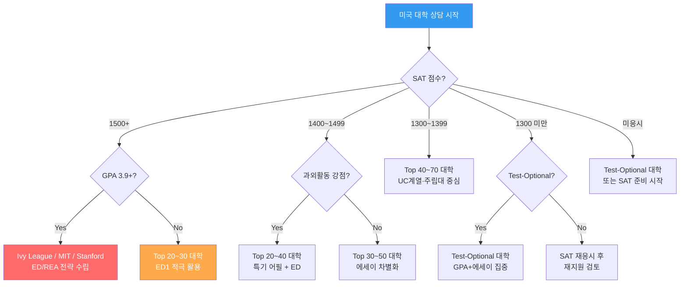
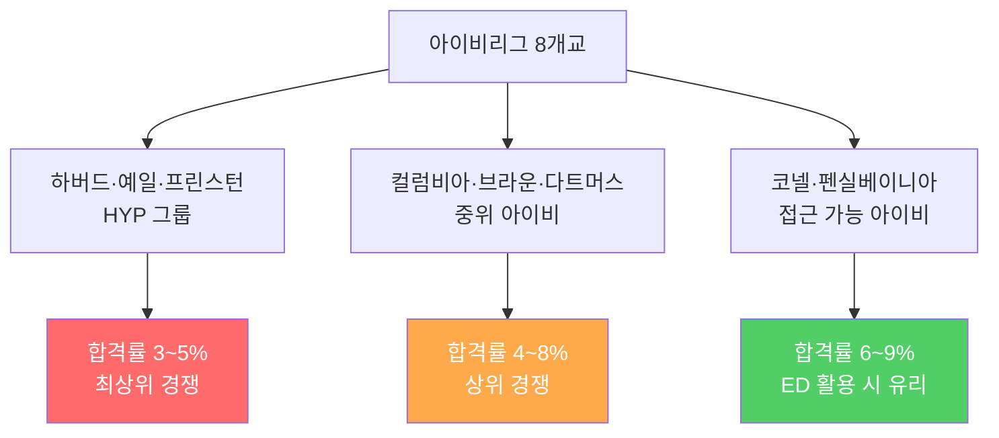
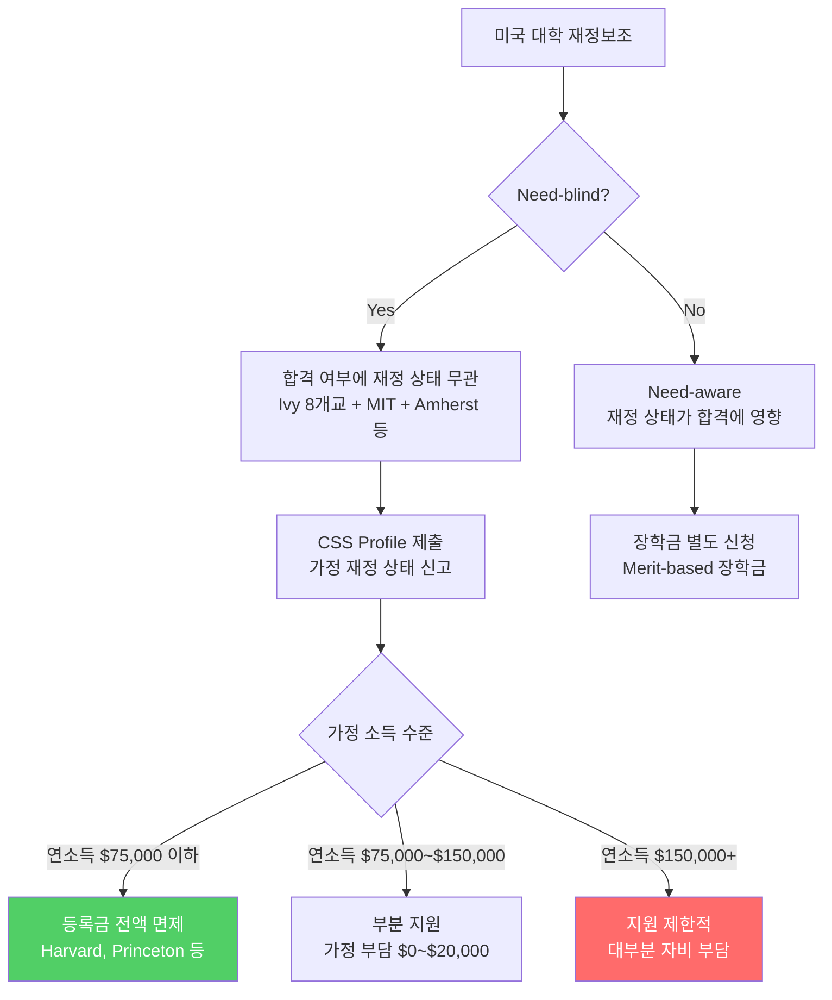
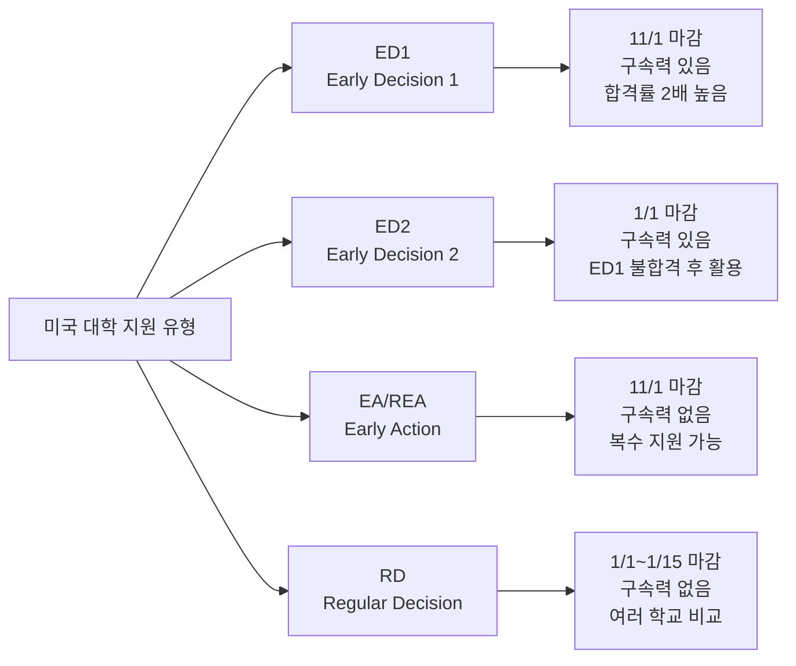
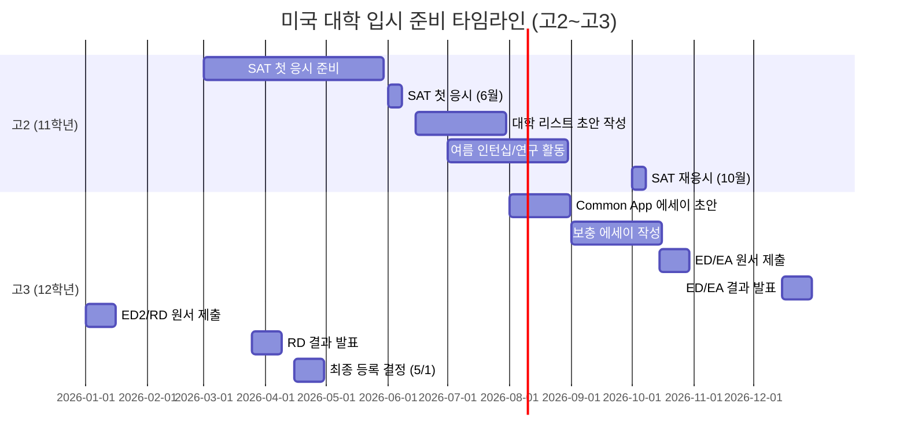
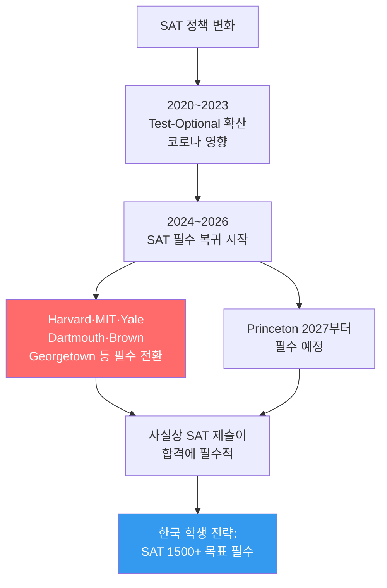
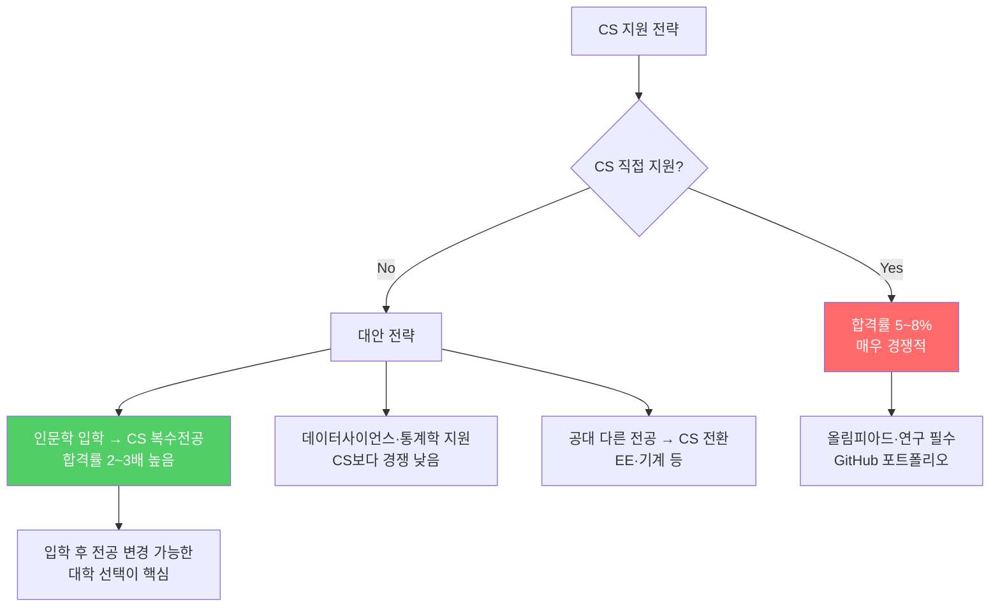

# 해외 대학 입시제도 — 가군: 미국 (USA)

> **미국 대학 입시**는 단순 성적 외 과외활동·에세이·추천서가 핵심입니다.
> Ivy League부터 리버럴아츠까지 지원 유형(ED/EA/RD)에 따른 전략이 중요합니다.

---

## 상담용 의사결정 트리 — 한국 학생 미국 대학 지원



---

## 미국 대학 입시 전체 프로세스

```mermaid
flowchart TD
    A[9~11학년: GPA 관리 + SAT/ACT 준비] --> B[11학년 여름: 대학 리스트 확정]
    B --> C[12학년 8~10월: 원서 작성]
    C --> D{지원 유형}
    D --> |Early Decision 1| E[ED1: 11월 1일 마감<br/>12월 중 결과]
    D --> |Early Action| F[EA: 11월 1일 마감<br/>12월~1월 결과]
    D --> |Early Decision 2| G[ED2: 1월 1일 마감<br/>2월 결과]
    D --> |Regular Decision| H[RD: 1월 1~15일 마감<br/>3월 말~4월 초 결과]

    E --> I{합격?}
    F --> I
    G --> I
    H --> I

    I --> |합격| J[5월 1일 최종 등록 결정]
    I --> |대기(WL)| K[웨이트리스트 대기]
    I --> |불합격| L[다른 학교 등록]
```

---

## 미국 Top 30 대학 비교표

| 순위 | 대학명 | 주 | 합격률 | SAT 중위 50% | GPA 평균 | ED/EA | 한국 학생 팁 |
|------|--------|-----|--------|------------|---------|-------|-----------|
| 1 | **MIT** | MA | 3.9% | 1510~1580 | 4.19 | EA | STEM 올림피아드 강조 |
| 2 | **Stanford** | CA | 3.7% | 1500~1570 | 3.96 | REA | 창업·리더십 어필 |
| 3 | **Harvard** | MA | 3.4% | 1500~1580 | 4.18 | REA | 독특한 스토리 필수 |
| 4 | **Caltech** | CA | 4.6% | 1530~1580 | 4.19 | EA | 연구 경험 중시 |
| 5 | **Yale** | CT | 4.6% | 1500~1560 | 4.12 | REA | 인문+과학 융합 |
| 6 | **Princeton** | NJ | 4.7% | 1500~1570 | 3.9 | REA | 학문적 열정 강조 |
| 7 | **Columbia** | NY | 3.9% | 1500~1560 | 4.12 | ED | ED 합격률 2배 |
| 8 | **UChicago** | IL | 5.4% | 1500~1570 | 4.48 | EA | 독창적 에세이 |
| 9 | **UPenn** | PA | 6.5% | 1500~1560 | 3.9 | ED | Wharton ED 필수 |
| 10 | **Duke** | NC | 6.7% | 1500~1560 | 3.94 | ED | 리더십 강조 |
| 11 | **Northwestern** | IL | 6.8% | 1500~1570 | 4.10 | ED | 저널리즘·공학 |
| 12 | **Dartmouth** | NH | 6.2% | 1490~1570 | 3.9 | ED | 소규모 학부 |
| 13 | **Brown** | RI | 5.5% | 1490~1560 | 4.0 | ED | Open Curriculum |
| 14 | **Vanderbilt** | TN | 7.1% | 1500~1560 | 3.9 | ED | 남부 명문 |
| 15 | **Cornell** | NY | 8.7% | 1470~1560 | 4.05 | ED | 공대·호텔 강세 |
| 16 | **Rice** | TX | 8.7% | 1500~1570 | 3.96 | ED | 소규모·연구 |
| 17 | **Notre Dame** | IN | 12% | 1450~1550 | 4.06 | REA | 가톨릭 전통 |
| 18 | **Georgetown** | DC | 14% | 1410~1540 | 3.87 | EA | 외교·정치 |
| 19 | **UCLA** | CA | 9% | 1290~1510 | 4.15 | 없음 | UC 에세이 별도 |
| 20 | **UC Berkeley** | CA | 14% | 1310~1530 | 4.15 | 없음 | EECS 최강 |
| 21 | **Carnegie Mellon** | PA | 11% | 1490~1570 | 3.9 | ED | CS·로보틱스 |
| 22 | **Emory** | GA | 17% | 1420~1530 | 3.9 | ED | 의학·경영 |
| 23 | **Washington U** | MO | 13% | 1500~1570 | 4.0 | ED | 의학·사회과학 |
| 24 | **Tufts** | MA | 10% | 1450~1540 | 3.9 | ED | 국제관계 |
| 25 | **USC** | CA | 11% | 1380~1540 | 3.79 | ED | 영화·경영 |
| 26 | **UMich** | MI | 18% | 1360~1540 | 3.9 | EA | 공대·경영 |
| 27 | **Georgia Tech** | GA | 18% | 1390~1540 | 4.0 | EA | 공대 특화 |
| 28 | **UNC Chapel Hill** | NC | 17% | 1300~1510 | 4.5 | EA | 주립대 명문 |
| 29 | **UVA** | VA | 19% | 1330~1530 | 4.33 | EA | 인문·법학 |
| 30 | **Boston University** | MA | 14% | 1350~1530 | 3.9 | ED | 도시형 대학 |

> ※ REA = Restrictive Early Action (타 사립대 EA 불가), ED = Early Decision (구속력 있는 조기지원)

---

## Ivy League 8개 대학 집중 비교



| 구분 | Harvard | Yale | Princeton | Columbia | Brown | Dartmouth | Cornell | UPenn |
|------|---------|------|-----------|---------|-------|---------|---------|-------|
| 합격률 | 3.4% | 4.6% | 4.7% | 3.9% | 5.5% | 6.2% | 8.7% | 6.5% |
| 지원 방식 | REA | REA | REA | ED | ED | ED | ED | ED |
| 특화 분야 | 전방위 | 인문·법·의 | 수학·공학 | 도시·인문 | 리버럴아츠 | 사회과학 | 공대·호텔 | 와튼(경영) |
| 학부생 수 | 7,000 | 6,800 | 5,500 | 9,000 | 7,100 | 4,400 | 15,000 | 10,000 |
| Need-blind | Yes | Yes | Yes | Yes | Yes | Yes | Yes | Yes |
| 한국인 재학 | 약 150명 | 약 120명 | 약 100명 | 약 200명 | 약 100명 | 약 60명 | 약 300명 | 약 250명 |

---

## 에세이 전략 가이드 (한국 학생용)

### Common Application 에세이 주제 (2025~2026)

| # | 주제 | 핵심 포인트 | 한국 학생 추천 접근법 |
|---|------|-----------|-----------------|
| 1 | 배경·정체성·관심사·재능 | 자신만의 독특한 이야기 | 한국 문화·이중 언어 경험 |
| 2 | 신념에 도전을 받은 경험 | 성장과 사고 변화 | 한국 교육 시스템에 대한 성찰 |
| 3 | 매력적인 문제나 아이디어 탐구 | 지적 호기심 | 연구·프로젝트 경험 |
| 4 | 활동에서 배운 것 | 리더십·책임감 | 동아리·봉사 리더십 |
| 5 | 성취·깨달음이 성장에 미친 영향 | 전환점 스토리 | 실패 극복 경험 |
| 6 | 지적·감정적 관심 주제 | 학문적 열정 | 전공 관련 깊은 탐구 |
| 7 | 자유 주제 | 창의적 자기표현 | 독창적 스토리텔링 |

### 에세이 작성 DO & DON'T

| DO (해야 할 것) | DON'T (하지 말 것) |
|-------------|---------------|
| 구체적 에피소드로 시작 | 추상적 일반론으로 시작 |
| 본인만의 목소리(voice) 유지 | 다른 사람이 쓴 것 같은 문체 |
| 성장과 변화 과정 보여주기 | 단순 자랑이나 업적 나열 |
| 진정성 있는 감정 표현 | 과장되거나 거짓된 내용 |
| "왜 이 대학인가" 구체적으로 | 어디에나 쓸 수 있는 범용 에세이 |
| 한국적 배경을 강점으로 활용 | 한국 교육의 어려움만 강조 |

### 보충 에세이(Supplemental Essay) 전략

| 대학 | 보충 에세이 유형 | 글자 수 | 핵심 전략 |
|------|-------------|--------|---------|
| Harvard | 추가 에세이 (선택) | 200자 | 짧고 강렬한 자기소개 |
| Yale | "Why Yale" + 추가 | 125~400자 | Yale 고유 프로그램 언급 |
| Columbia | "Why Columbia" + 리스트 | 200자 | Core Curriculum 관심 |
| UPenn | "Why Penn" + 학과 | 300~450자 | Wharton/학과 구체적 |
| MIT | 5개 단답형 | 100~250자 | 유머+진정성 |

---

## 재정보조 & 장학금 가이드



### Need-blind 대학 목록 (국제 학생 포함)

| 대학 | Need-blind (국제) | 평균 재정보조 | 비고 |
|------|-----------------|------------|------|
| Harvard | Yes | $55,000/년 | 소득 $75K 이하 무료 |
| Yale | Yes | $57,000/년 | 소득 $75K 이하 무료 |
| Princeton | Yes | $59,000/년 | 소득 $65K 이하 무료 |
| MIT | Yes | $53,000/년 | |
| Amherst | Yes | $56,000/년 | 리버럴아츠 |
| Dartmouth | Yes | $55,000/년 | 2024년부터 |
| Columbia | Need-aware | $52,000/년 | 국제학생은 Need-aware |
| Cornell | Need-aware | $48,000/년 | 국제학생은 Need-aware |

### 한국 가정 재정보조 현실

| 가정 소득 (원화) | 미국 환산 | 예상 재정보조 | 연간 실부담 |
|-------------|---------|------------|---------|
| ₩5,000만 이하 | ~$38,000 | 전액 또는 대부분 | $0~$5,000 |
| ₩5,000만~₩1억 | $38,000~$75,000 | 상당 부분 | $5,000~$20,000 |
| ₩1억~₩2억 | $75,000~$150,000 | 일부 | $20,000~$50,000 |
| ₩2억 이상 | $150,000+ | 거의 없음 | $60,000~$90,000 |

> **상담 포인트**: "가정 소득이 ₩1억 이하라면 Ivy League가 한국 사립대보다 저렴할 수 있습니다. Need-blind 대학은 합격만 하면 학비 걱정이 없습니다."

---

## 지원 유형별 전략 비교 (상세)



### ED/EA 전략 추천표 (한국 학생용)

| 학생 유형 | ED1 추천 | EA 추천 | ED2 추천 | RD 추천 |
|---------|---------|---------|---------|---------|
| SAT 1550+ / GPA 4.0+ | Columbia·UPenn ED | MIT·Harvard REA | Brown·Dartmouth | Ivy 나머지 |
| SAT 1500+ / GPA 3.9+ | Cornell·Duke ED | UMich·Georgia Tech EA | Vanderbilt·Emory | Top 20~30 |
| SAT 1450+ / GPA 3.8+ | Emory·Tufts ED | UNC·UVA EA | BU·USC | Top 30~50 |
| SAT 1400+ / GPA 3.7+ | BU·USC ED | UMich·Georgia Tech EA | - | UC계열·주립대 |

### ED 합격률 vs RD 합격률 비교

| 대학 | ED 합격률 | RD 합격률 | ED 효과 |
|------|---------|---------|---------|
| Columbia | 10~12% | 2~3% | 약 4배 |
| UPenn | 15~18% | 4~5% | 약 3.5배 |
| Cornell | 18~22% | 6~7% | 약 3배 |
| Duke | 16~20% | 4~5% | 약 4배 |
| Brown | 14~16% | 3~4% | 약 4배 |
| Northwestern | 20~25% | 4~5% | 약 5배 |

> **상담 포인트**: "ED는 구속력이 있지만 합격률이 2~5배 높습니다. 확실한 1순위 대학이 있다면 ED를 강력히 추천합니다."

---

## AP/IB 과목 추천 (한국 학생용)

| 전공 방향 | 필수 AP 과목 | 추천 AP 과목 | IB HL 추천 |
|---------|-----------|-----------|----------|
| 이공계 | Calculus BC, Physics C | Chemistry, CS A, Statistics | Math HL, Physics HL |
| 경영 | Calculus AB/BC, Statistics | Microeconomics, Macroeconomics | Math HL, Economics HL |
| 인문 | English Lit, US History | World History, Psychology | English HL, History HL |
| 의학 | Biology, Chemistry | Calculus BC, Physics | Biology HL, Chemistry HL |
| CS/AI | Calculus BC, CS A | Physics C, Statistics | Math HL, CS HL |

### AP 점수 목표

| 대학 티어 | 목표 AP 점수 | AP 과목 수 |
|---------|-----------|---------|
| Ivy League | 5점 (전 과목) | 8~12개 |
| Top 20 | 4~5점 | 6~10개 |
| Top 30~50 | 4점 이상 | 4~8개 |
| Top 50~100 | 3점 이상 | 3~5개 |

---

## 한국 학생 합격 사례 시나리오

### 사례 1: Harvard REA 합격

| 항목 | 내용 |
|------|------|
| **SAT** | 1560 |
| **GPA** | 4.0 (Unweighted) |
| **AP** | 10개 과목 (전부 5점) |
| **과외활동** | 수학 올림피아드 금메달, AI 연구 논문 발표, 코딩 봉사단체 설립 |
| **에세이** | 한국 교육 시스템에서의 성찰 + AI 윤리에 대한 탐구 |
| **추천서** | 수학 교사 (강력 추천) + 과학 교사 (연구 능력 강조) |
| **핵심 전략** | 학문적 열정 + 사회적 영향력의 조합 |

### 사례 2: Cornell ED 합격 (공대)

| 항목 | 내용 |
|------|------|
| **SAT** | 1510 |
| **GPA** | 3.92 |
| **AP** | 7개 과목 (평균 4.7점) |
| **과외활동** | 로봇 대회 전국 3위, 코딩 동아리 회장, 인턴십 경험 |
| **에세이** | 로봇 대회 실패에서 배운 팀워크와 리더십 |
| **추천서** | 물리 교사 + 카운셀러 |
| **핵심 전략** | ED 활용으로 합격률 3배 상승, 공대 특화 활동 |

### 사례 3: UCLA RD 합격 (경영학)

| 항목 | 내용 |
|------|------|
| **SAT** | 1450 |
| **GPA** | 3.85 |
| **AP** | 5개 과목 (평균 4.2점) |
| **과외활동** | 학생회 부회장, 창업 동아리, 경제 블로그 운영 |
| **에세이** | UC 에세이 4개 — 한국 중소기업 가정에서 배운 기업가 정신 |
| **추천서** | 경제 교사 + 영어 교사 |
| **핵심 전략** | UC 에세이에 한국적 배경을 강점으로 활용 |

---

## 월별 준비 로드맵



---

## 한국 학생 미국 대학 지원 시 유의사항

| 구분 | 주의사항 | 대응 전략 |
|------|---------|---------|
| 경쟁 | 한국계 학생 지원자 많음 | 차별화된 스토리·활동 |
| GPA | 한국 내신 ↔ 미국 GPA 환산 | 4.0 만점 기준 환산 제출 |
| 시험 | TOEFL/IELTS 필요 (영어 비원어민) | TOEFL 100+ / IELTS 7.0+ 목표 |
| 재정 | Need-blind vs Need-aware | CSS Profile 정확히 작성 |
| 비자 | F-1 학생비자 필요 | 합격 후 I-20 발급 |
| 학비 | 연간 $70,000~$90,000+ | 재정보조·장학금 적극 신청 |
| 면접 | 동문 인터뷰 (선택적) | 영어 구술 + 자기소개 연습 |

### 면접 준비 가이드

| 질문 유형 | 예시 질문 | 좋은 답변 방향 |
|---------|---------|------------|
| 자기소개 | "Tell me about yourself" | 에세이와 다른 새로운 면 보여주기 |
| 지원동기 | "Why this university?" | 구체적 프로그램·교수·문화 언급 |
| 과외활동 | "Tell me about your activities" | 가장 의미 있는 1~2개 깊이 설명 |
| 학업 관심 | "What do you want to study?" | 전공 선택 이유 + 구체적 계획 |
| 역질문 | "Do you have questions?" | 대학 생활·문화에 대한 진심 어린 질문 |

---

## 미국 공대 Top 10 (이공계 특화)

| 순위 | 대학 | SAT 중위 | 특화 전공 | 합격률 | 한국 학생 팁 |
|------|------|---------|---------|--------|-----------|
| 1 | MIT | 1510~1580 | 컴공·AI·물리·항공 | 3.9% | 올림피아드 + 연구 |
| 2 | Caltech | 1530~1580 | 물리·화학공학·우주 | 4.6% | 연구 경험 필수 |
| 3 | Stanford | 1500~1570 | 컴공·EE·기계 | 3.7% | 창업 마인드 |
| 4 | Carnegie Mellon | 1490~1570 | 컴공·로보틱스·AI | 11% | CS 포트폴리오 |
| 5 | Georgia Tech | 1390~1540 | 공대 전반 | 18% | 가성비 우수 |
| 6 | UC Berkeley | 1310~1530 | EECS·화학·환경 | 14% | UC 에세이 중요 |
| 7 | Cornell | 1470~1560 | 공대·컴공·농업 | 8.7% | ED 적극 활용 |
| 8 | Purdue | 1280~1490 | 항공·공대 | 44% | 안전지원 추천 |
| 9 | UIUC | 1360~1520 | CS·EE·공대 | 44% | CS 직접 지원 |
| 10 | UT Austin | 1220~1480 | 컴공·공대·경영 | 31% | 텍사스 취업 연계 |

---

## 2026~2027 미국 입시 최신 변화 & 새 전략

### SAT 필수화 트렌드 (핵심 변화)



### SAT 필수/권장 대학 현황 (2026 기준)

| 정책 | 대학 | 한국 학생 전략 |
|------|------|------------|
| **필수 (Required)** | Harvard, MIT, Yale, Dartmouth, Brown, Georgetown, UT Austin | 반드시 고득점 제출 |
| **2027부터 필수** | Princeton | 미리 준비 |
| **Test-Flexible** | Columbia, UChicago | AP/IB로 대체 가능하나 SAT 추천 |
| **Test-Optional (형식적)** | 대부분 Top 50 | 합격자 70%가 점수 제출 → 사실상 필수 |

> **상담 포인트**: "Test-Optional이라고 해도 상위 50개 대학 합격자의 70%가 SAT를 제출합니다. 1450점 이상이면 반드시 제출하세요. 1400점 미만이면 제출하지 않는 것이 유리할 수 있습니다."

### 2026 입시 핵심 트렌드

| 트렌드 | 내용 | 한국 학생 영향 |
|--------|------|------------|
| **지원자 수 폭증** | 96만명+ / 470만건+ 지원 (전년 대비 10%↑) | 합격률 지속 하락 |
| **조기전형 비중 증가** | 73개 대학이 40%+ 조기 선발 | ED/EA 전략이 더 중요 |
| **CS 과포화** | 컴공 지원자 5년간 60%↑, 합격률 5~8% | 인문+CS 복수전공 전략 |
| **레거시 혜택 축소** | 동문 자녀 가산점 감소 | 한국 학생에게 유리 |
| **AI 에세이 감지** | AI 작성 에세이 감지 강화 | 진정성 있는 직접 작성 필수 |
| **지역 다양성 중시** | 동·서해안 쏠림 줄이기 | 한국 출신 차별화 기회 |

### CS(컴퓨터과학) 과포화 대응 전략



> **상담 포인트**: "CS 직접 지원은 합격률이 5~8%로 매우 낮습니다. 인문학이나 수학으로 입학한 후 CS를 복수전공하는 전략이 합격률을 2~3배 높일 수 있습니다."

---

## 추가 합격 사례 시나리오

### 사례 4: MIT EA 합격 (한국 과학고 출신)

| 항목 | 내용 |
|------|------|
| **SAT** | 1580 |
| **GPA** | 4.0 (한국 과학고) |
| **과외활동** | 국제물리올림피아드 은메달, 양자컴퓨팅 연구 논문 |
| **에세이** | 한국 과학고에서의 실험 실패 경험 → 과학적 사고의 전환점 |
| **핵심 전략** | 올림피아드 수상 + 연구 논문 = STEM 최강 프로필 |
| **상담 포인트** | "MIT는 연구 경험과 올림피아드를 매우 중시합니다. 과학고 학생에게 유리합니다" |

### 사례 5: UPenn Wharton ED 합격 (경영학 특화)

| 항목 | 내용 |
|------|------|
| **SAT** | 1540 |
| **GPA** | 3.95 |
| **과외활동** | 학생 창업 (교육 앱 개발, 사용자 5,000명), 경제 블로그 운영 |
| **에세이** | 한국 중소기업 가정에서 배운 기업가 정신 + Wharton의 구체적 프로그램 언급 |
| **핵심 전략** | ED 활용 (합격률 15~18% vs RD 4~5%) + 창업 경험으로 Wharton 적합성 어필 |
| **상담 포인트** | "Wharton은 ED로 지원해야 합니다. 창업 경험이 있으면 매우 유리합니다" |

### 사례 6: UC Berkeley RD 합격 (공립대 전략)

| 항목 | 내용 |
|------|------|
| **SAT** | 1480 |
| **GPA** | 3.88 |
| **과외활동** | 코딩 봉사단체 설립, 지역 도서관 프로그래밍 교육 |
| **UC 에세이** | 4개 에세이 모두 한국적 배경 + 사회 공헌 강조 |
| **핵심 전략** | UC는 SAT 미반영 → GPA + 에세이 + 과외활동으로 승부 |
| **상담 포인트** | "UC 계열은 SAT를 보지 않습니다. 에세이 4개가 매우 중요하고, 사회 공헌 활동이 핵심입니다" |

### 사례 7: Georgia Tech EA 합격 (가성비 전략)

| 항목 | 내용 |
|------|------|
| **SAT** | 1490 |
| **GPA** | 3.82 |
| **과외활동** | 로봇 대회 전국 입상, FRC 팀 리더 |
| **핵심 전략** | Ivy 대신 Georgia Tech EA → 합격률 18% + 학비 $35,000/년 (Ivy의 절반) |
| **졸업 후** | Google·Amazon 취업률 Top 5 |
| **상담 포인트** | "Ivy가 아니어도 Georgia Tech·UIUC·Purdue는 취업률이 Ivy와 비슷합니다. 학비는 절반입니다" |

---

## 상담 FAQ

### Q1. "미국 대학은 너무 비싸지 않나요?"

> **답변**: Need-blind 대학(Harvard, Yale, Princeton, MIT 등)은 가정 소득에 따라 등록금을 조정합니다. 연소득 ₩1억 이하 가정은 한국 사립대보다 저렴할 수 있습니다. CSS Profile을 통해 재정보조를 신청하세요.

### Q2. "SAT를 안 봐도 되는 대학이 있나요?"

> **답변**: 2026년 기준 Harvard·MIT·Yale 등 주요 대학이 SAT 필수로 전환했습니다. Test-Optional이라도 합격자 70%가 점수를 제출합니다. **1450점 이상이면 반드시 제출, 1400점 미만이면 미제출을 고려**하세요.

### Q3. "ED는 꼭 해야 하나요?"

> **답변**: 2026년 기준 73개 대학이 40% 이상을 조기전형으로 선발합니다. ED 합격률이 RD의 2~5배이므로, 확실한 1순위 대학이 있다면 ED를 강력히 추천합니다.

### Q4. "컴퓨터과학(CS)을 지원하고 싶은데 너무 경쟁이 치열하다고 하는데요?"

> **답변**: CS 직접 지원 합격률이 5~8%로 매우 낮습니다. 대안으로 1) 인문학 입학 후 CS 복수전공, 2) 데이터사이언스·통계학 지원, 3) 공대 다른 전공 후 CS 전환 — 이 세 가지 전략을 추천합니다.

### Q5. "AI가 에세이를 써도 되나요?"

> **답변**: 절대 안 됩니다. 2026년부터 대학들이 AI 감지 도구를 적극 활용하고 있습니다. AI가 작성한 에세이가 발각되면 불합격 처리됩니다. 본인의 진정성 있는 이야기를 직접 작성하세요.

---

> 작성일: 2026년 2월 | 다음 파일: [해외 나군(영국/유럽) 대학 입시](해외_나군_영국_유럽_대학_입시.md)
