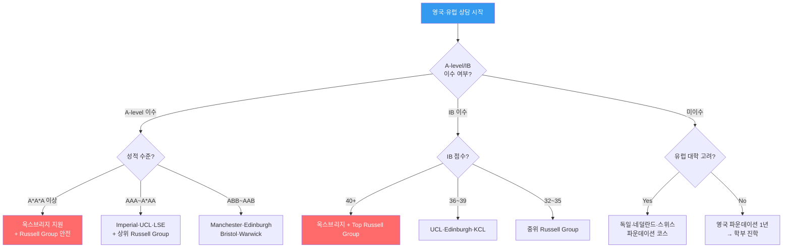
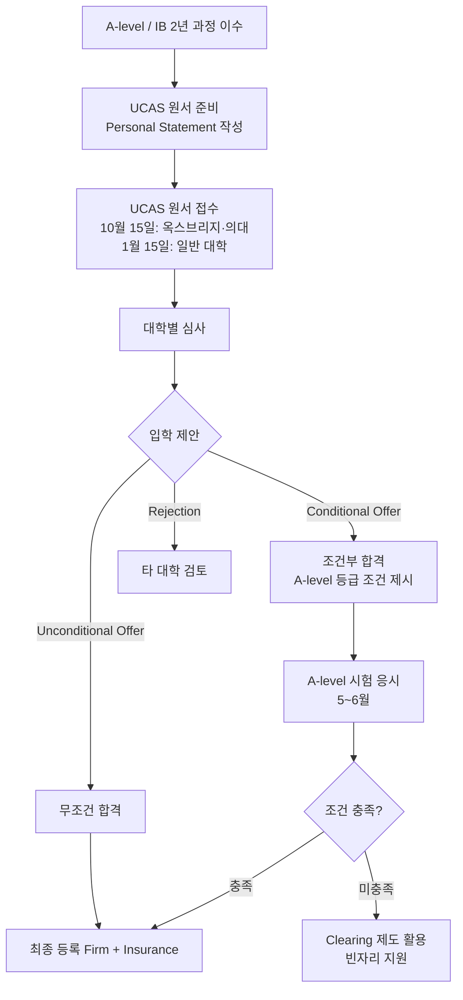
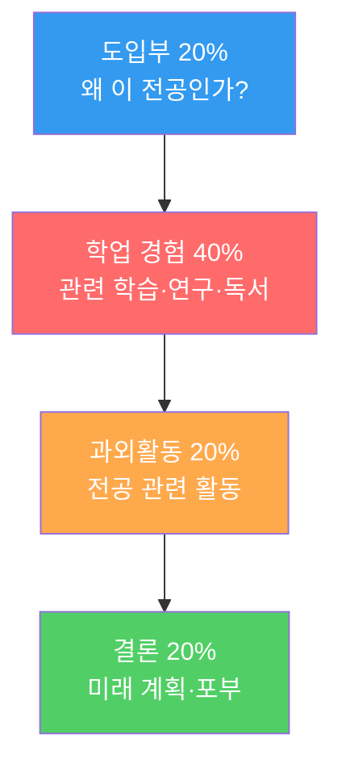
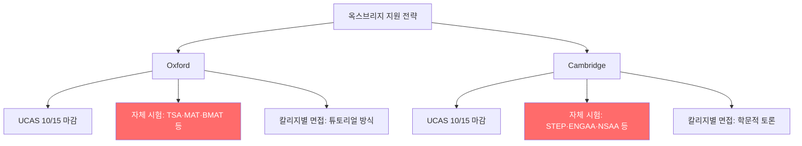
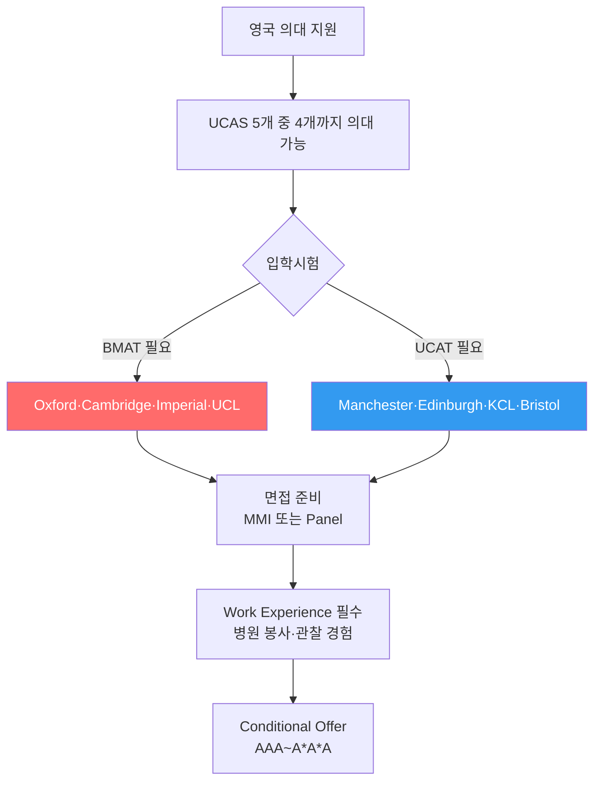
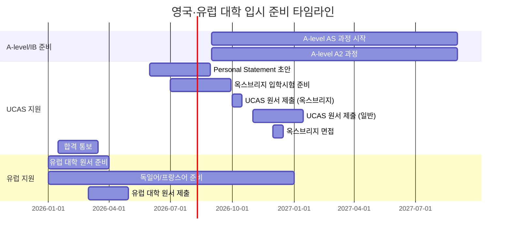

# 해외 대학 입시제도 — 나군: 영국 · 유럽 (UK & Europe)

> **영국 대학 입시(UCAS)**는 최대 5개 대학에 지원하며 A-level 성적이 핵심입니다.
> 유럽 대학은 국가별로 상이하나 학비가 저렴하고 영어 전공이 증가하는 추세입니다.

---

## 상담용 의사결정 트리 — 한국 학생 영국·유럽 지원

---

## 영국 대학 입시 UCAS 프로세스

---

## 영국 Russell Group 대학 비교표 (확장)

| 순위 | 대학명 | 도시 | A-level 조건 | IB 조건 | 특화 분야 | 학비(유학생/년) | 한국 학생 팁 |
|------|--------|------|------------|---------|---------|-------------|-----------|
| 1 | **Oxford** | 옥스퍼드 | A*A*A~A*AA | 39~40 | 전방위 | £28,000~45,000 | 자체시험+면접 필수 |
| 2 | **Cambridge** | 케임브리지 | A*A*A~A*AA | 40~42 | 전방위 | £24,000~58,000 | STEP 시험(수학) |
| 3 | **Imperial** | 런던 | A*AA~AAA | 38~40 | 이공계·의학 | £35,000~45,000 | STEM 강조 |
| 4 | **UCL** | 런던 | AAA~ABB | 36~38 | 인문·의학·공학 | £25,000~35,000 | 다양한 전공 |
| 5 | **LSE** | 런던 | AAA | 37~38 | 경제·사회과학 | £23,000~28,000 | 에세이 중시 |
| 6 | **Edinburgh** | 에딘버러 | AAA~ABB | 36~38 | 의학·인문·AI | £24,000~35,000 | 스코틀랜드 4년제 |
| 7 | **Manchester** | 맨체스터 | AAA~ABB | 35~37 | 공학·경영·의학 | £22,000~35,000 | 산업 연계 |
| 8 | **KCL** | 런던 | AAA~ABB | 35~37 | 의학·법학·인문 | £23,000~38,000 | 런던 소재 |
| 9 | **Bristol** | 브리스틀 | AAA~ABB | 36~38 | 공학·법학 | £21,000~30,000 | |
| 10 | **Warwick** | 코번트리 | AAA~ABB | 36~38 | 경영·수학·공학 | £21,000~30,000 | WBS 경영 |
| 11 | **Durham** | 더럼 | AAA~ABB | 36~38 | 인문·경영·법학 | £20,000~28,000 | 칼리지 시스템 |
| 12 | **Glasgow** | 글래스고 | AAB~BBB | 34~36 | 의학·인문 | £20,000~28,000 | 스코틀랜드 |
| 13 | **Sheffield** | 셰필드 | AAB~BBB | 34~36 | 공학 | £20,000~27,000 | |
| 14 | **Birmingham** | 버밍엄 | ABB~BBB | 32~35 | 전방위 | £20,000~27,000 | |
| 15 | **Nottingham** | 노팅엄 | ABB~BBB | 32~35 | 약학·공학 | £20,000~27,000 | |

---

## Personal Statement 작성 가이드 (한국 학생용)

### PS 구조 (4,000자 / 47줄)

### PS 작성 DO & DON'T

| DO (해야 할 것) | DON'T (하지 말 것) |
|-------------|---------------|
| 전공에 대한 학문적 열정 보여주기 | "어릴 때부터 꿈이었다" 식의 진부한 시작 |
| 구체적 책·논문·실험 언급 | 추상적 일반론 |
| 비판적 사고 보여주기 | 단순 요약이나 나열 |
| 80% 학업 + 20% 과외활동 | 과외활동 나열 (미국 스타일) |
| 5개 대학 모두에 맞는 범용성 | 특정 대학명 언급 (UCAS는 1개 PS) |
| 한국적 배경을 학문적 관점으로 | 한국 교육의 어려움만 강조 |

### 전공별 PS 핵심 포인트

| 전공 | 핵심 내용 | 추천 독서/활동 |
|------|---------|------------|
| 의학 | 임상 경험 + 봉사 + 학문적 관심 | BMJ 논문, 병원 봉사, BMAT/UCAT 준비 |
| 법학 | 법적 사고력 + 시사 분석 | 판례 분석, 모의법정, LNAT 준비 |
| 공학 | 수학·물리 심화 + 프로젝트 | 연구 프로젝트, 코딩, 올림피아드 |
| 경제 | 경제 이론 + 현실 적용 | The Economist, 경제 블로그 |
| 컴퓨터과학 | 코딩 경험 + 알고리즘 | 해커톤, GitHub 프로젝트 |

---

## 옥스브리지 집중 분석

### 옥스브리지 전공별 입학시험

| 전공 | Oxford 시험 | Cambridge 시험 | 준비 기간 |
|------|-----------|-------------|---------|
| 수학 | MAT | STEP | 6개월+ |
| 의학 | BMAT | BMAT | 3~6개월 |
| 법학 | LNAT | - | 3개월 |
| 공학 | PAT | ENGAA | 3~6개월 |
| 자연과학 | - | NSAA | 3~6개월 |
| PPE/인문 | TSA | - | 3개월 |

### 옥스브리지 면접 준비 가이드

| 면접 특징 | 내용 | 준비 방법 |
|---------|------|---------|
| 학문적 토론 | 교수와 1:1 또는 1:2 토론 | 전공 관련 깊은 사고 연습 |
| 문제 풀이 | 즉석에서 문제 풀고 설명 | 사고 과정을 말로 설명하는 연습 |
| 비판적 사고 | "왜?"를 반복하는 질문 | 모든 답에 근거를 대는 연습 |
| 시간 | 20~30분 | 모의 면접 최소 5회 |

| 구분 | Oxford | Cambridge |
|------|--------|-----------|
| 합격률 | 약 17% (전체) | 약 18% (전체) |
| 유학생 합격률 | 약 10~12% | 약 10~12% |
| 지원 마감 | 10월 15일 | 10월 15일 |
| 면접 방식 | 튜토리얼 토론 | 학문적 토론 |
| 학제 | 3년 (일부 4년) | 3~4년 |
| 칼리지 수 | 39개 | 31개 |
| 한국인 재학 | 약 100명 | 약 80명 |

---

## 영국 의대 입시 전략 (한국 학생용)

| 대학 | 입학시험 | A-level 조건 | 면접 방식 | 학비(유학생) | 한국 학생 합격 |
|------|---------|------------|---------|------------|------------|
| Oxford | BMAT | A*AA | Panel | £35,000+ | 매우 어려움 |
| Cambridge | BMAT | A*A*A | Panel | £58,000+ | 매우 어려움 |
| Imperial | BMAT | AAA | MMI | £45,000+ | 어려움 |
| UCL | BMAT/UCAT | AAA | MMI | £35,000+ | 보통 |
| Edinburgh | UCAT | AAA | MMI | £35,000+ | 보통 |
| Manchester | UCAT | AAA | MMI | £35,000+ | 보통 |
| KCL | UCAT | A*AA | MMI | £38,000+ | 보통 |

> **상담 포인트**: "영국 의대는 학부 직접 입학(5~6년)이므로 한국 의대(6년)와 기간이 비슷합니다. 하지만 학비가 매우 비싸고, 영국 의사 면허 취득 후 한국 의사 면허로 전환이 복잡합니다."

---

## 유럽 주요 대학 입시 비교표 (확장)

| 국가 | 대표 대학 | 입시 방식 | 학비(유학생) | 영어 전공 | 생활비(월) | 한국 학생 팁 |
|------|---------|---------|------------|---------|---------|-----------|
| **네덜란드** | TU Delft, Amsterdam, Leiden | 성적+추첨(일부) | €2,500~€20,000 | 매우 많음 | €1,000~1,500 | 영어 전공 풍부 |
| **독일** | LMU München, TU München, Heidelberg | 성적(NC) | 거의 무료(€500~) | 석사 영어 多 | €800~1,200 | 학부 독일어 필수 |
| **프랑스** | École Polytechnique, HEC, ENS | Grandes Écoles 시험 | 매우 저렴 | 일부 영어 | €800~1,500 | 프레파 2년 필수 |
| **스위스** | ETH Zurich, EPFL | 성적+입학시험 | CHF 1,400/년 | 영어 가능 | CHF 1,500~2,000 | 이공계 최상위 |
| **스웨덴** | KTH, Stockholm, Uppsala | 성적 위주 | 무료(EU)/€15,000~(비EU) | 영어 전공 多 | SEK 8,000~12,000 | 복지 좋음 |
| **덴마크** | DTU, Copenhagen | 성적+동기서 | 무료(EU)/€15,000~(비EU) | 영어 전공 多 | DKK 6,000~10,000 | |
| **아일랜드** | Trinity College Dublin, UCD | CAO(포인트제) | €10,000~25,000 | 영어 기본 | €1,000~1,500 | 영미권 학위 |

### 유럽 국가별 상세 분석

#### 독일

| 항목 | 내용 |
|------|------|
| 학비 | 대부분 무료 (학기당 €150~350 행정비) |
| 언어 | 학부: 독일어 필수 (TestDaF 4×4) / 석사: 영어 가능 |
| 입학 조건 | Abitur 동등 학력 + NC (성적 제한) |
| 한국 학생 | 한국 수능 + 1년 파운데이션 또는 대학 1년 이수 |
| 추천 전공 | 공학·자연과학·의학 |
| 취업 | 졸업 후 18개월 구직비자 |

#### 네덜란드

| 항목 | 내용 |
|------|------|
| 학비 | EU: €2,200/년 / 비EU: €8,000~20,000/년 |
| 언어 | 영어 전공 매우 풍부 (학부부터) |
| 입학 조건 | 고교 졸업 + IELTS 6.0~6.5 |
| 한국 학생 | 한국 수능/내신으로 직접 지원 가능 |
| 추천 전공 | 공학·경영·사회과학 |
| 취업 | 졸업 후 1년 구직비자 (Orientation Year) |

#### 스위스 (ETH Zurich / EPFL)

| 항목 | 내용 |
|------|------|
| 학비 | CHF 1,400/년 (약 ₩200만) — 세계 최저 수준 |
| 언어 | ETH: 독일어(학부) / EPFL: 프랑스어(학부) / 석사: 영어 |
| 입학 조건 | 입학시험 또는 파운데이션 |
| 한국 학생 | 입학시험 합격 필요 (수학·물리·화학) |
| 추천 전공 | 이공계 전반 (QS 세계 7위) |
| 특이사항 | 1학년 탈락률 50%+ (엄격한 학사 관리) |

---

## A-level vs IB 비교 (한국 학생용)

| 비교 항목 | A-level | IB (International Baccalaureate) |
|---------|---------|------|
| 과목 수 | 3~4개 (전문화) | 6개 (균형) |
| 평가 방식 | 최종 시험 100% | 시험 80% + IA 20% |
| 기간 | 2년 (AS + A2) | 2년 |
| 영국 대학 | 가장 선호 | 동등 인정 |
| 유럽 대학 | 인정 | 매우 선호 |
| 미국 대학 | 인정 (AP와 유사) | 매우 선호 |
| 한국 학생 추천 | 전공 확실한 학생 | 다양한 관심 학생 |
| 준비 학교 | 영국식 국제학교 | IB 인증 학교 |

---

## 한국 학생 합격 사례 시나리오

### 사례 1: Oxford PPE 합격

| 항목 | 내용 |
|------|------|
| **A-level** | A*A*A (Economics, Mathematics, History) |
| **IELTS** | 8.0 |
| **입학시험** | TSA 상위 10% |
| **PS 핵심** | 한국 경제 성장 모델 분석 + 불평등 문제 탐구 |
| **면접** | 경제학 그래프 즉석 분석 + 정치 철학 토론 |
| **핵심 전략** | 학문적 깊이 + 비판적 사고 강조 |

### 사례 2: Imperial College 공학 합격

| 항목 | 내용 |
|------|------|
| **A-level** | A*AA (Mathematics, Physics, Chemistry) |
| **IELTS** | 7.0 |
| **PS 핵심** | 로봇 프로젝트 + 수학 올림피아드 경험 |
| **핵심 전략** | STEM 활동 집중 + 수학·물리 심화 |

### 사례 3: ETH Zurich 컴퓨터과학 합격

| 항목 | 내용 |
|------|------|
| **학력** | 한국 고교 졸업 + 1년 파운데이션 |
| **입학시험** | 수학·물리 합격 |
| **언어** | 독일어 B2 + 영어 C1 |
| **핵심 전략** | 학비 CHF 1,400/년 → 비용 대비 최고 효율 |

---

## 월별 준비 로드맵

---

## 장학금 기회 (한국 학생용)

| 장학금 | 국가 | 금액 | 대상 | 경쟁률 |
|--------|------|------|------|--------|
| Chevening | 영국 | 전액 (석사) | 2년+ 경력자 | 높음 |
| DAAD | 독일 | 월 €861~1,200 | 학부·석사·박사 | 보통 |
| Erasmus+ | EU 전체 | 월 €800~1,100 | 교환학생 | 보통 |
| Swiss Government | 스위스 | 월 CHF 1,920 | 석사·박사 | 높음 |
| Holland Scholarship | 네덜란드 | €5,000 (1회) | 비EU 학부 | 보통 |
| 한국 정부 장학금 | 전체 | 학비+생활비 | 한국 국적 | 높음 |

---

## 상담 FAQ

### Q1. "영국은 3년제인데 한국에서 인정되나요?"

> **답변**: 영국 학사 3년은 한국에서 정식 학사로 인정됩니다. 다만 일부 한국 기업은 4년제를 선호하므로, 석사 1년을 추가하면 총 4년으로 한국 4년제와 동일합니다.

### Q2. "독일 대학은 정말 무료인가요?"

> **답변**: 대부분의 독일 공립대학은 학비가 무료입니다 (학기당 €150~350 행정비만). 하지만 학부는 독일어 수업이 대부분이므로 독일어 준비가 필수입니다. 석사는 영어 과정이 많습니다.

### Q3. "옥스브리지 면접은 어떻게 준비하나요?"

> **답변**: 옥스브리지 면접은 정답을 찾는 것이 아니라 사고 과정을 보여주는 것입니다. 교수가 문제를 주면 즉석에서 풀면서 생각을 말로 설명해야 합니다. 모의 면접을 최소 5회 이상 연습하세요.

### Q4. "유럽 대학 졸업 후 취업은 어떤가요?"

| 국가 | 졸업 후 구직비자 | 취업 환경 | 영주권 가능성 |
|------|-------------|---------|------------|
| 영국 | 2년 (Graduate Route) | 보통 | 보통 |
| 독일 | 18개월 | 좋음 (공학) | 높음 |
| 네덜란드 | 1년 (Orientation Year) | 좋음 | 보통 |
| 스위스 | 6개월 | 매우 좋음 | 어려움 |
| 스웨덴 | 6개월 | 보통 | 보통 |

---

## 한국 학생 영국·유럽 지원 체크리스트

### 영국
- [ ] A-level 또는 IB 이수 여부 확인
- [ ] IELTS 목표 설정 (7.0+)
- [ ] Personal Statement 4,000자 작성
- [ ] 옥스브리지 지원 시 자체 입학시험 준비
- [ ] 의대 지원 시 BMAT/UCAT + Work Experience
- [ ] 비자 (UK Student Visa) 준비

### 유럽
- [ ] 독일어·프랑스어 등 언어 준비 여부 결정
- [ ] 파운데이션 코스 필요 여부 확인
- [ ] 학비·생활비 예산 계획 (유럽이 미국 대비 저렴)
- [ ] 장학금 신청 일정 확인 (DAAD, Erasmus+ 등)
- [ ] 졸업 후 취업·이민 경로 확인

---

> 작성일: 2026년 2월 | 이전 파일: [해외 가군(미국)](해외_가군_미국_대학_입시.md) | 다음 파일: [해외 다군(아시아)](해외_다군_아시아_대학_입시.md)
