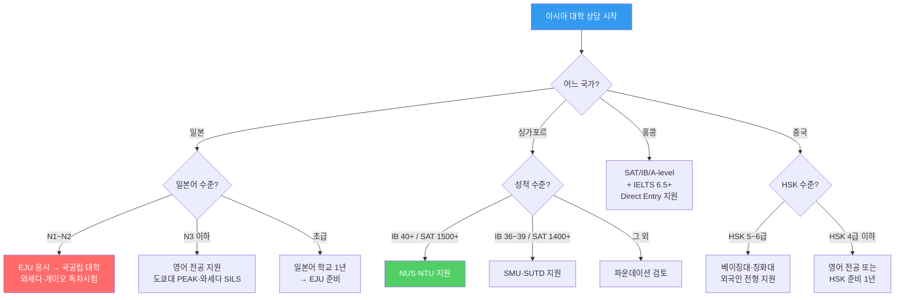
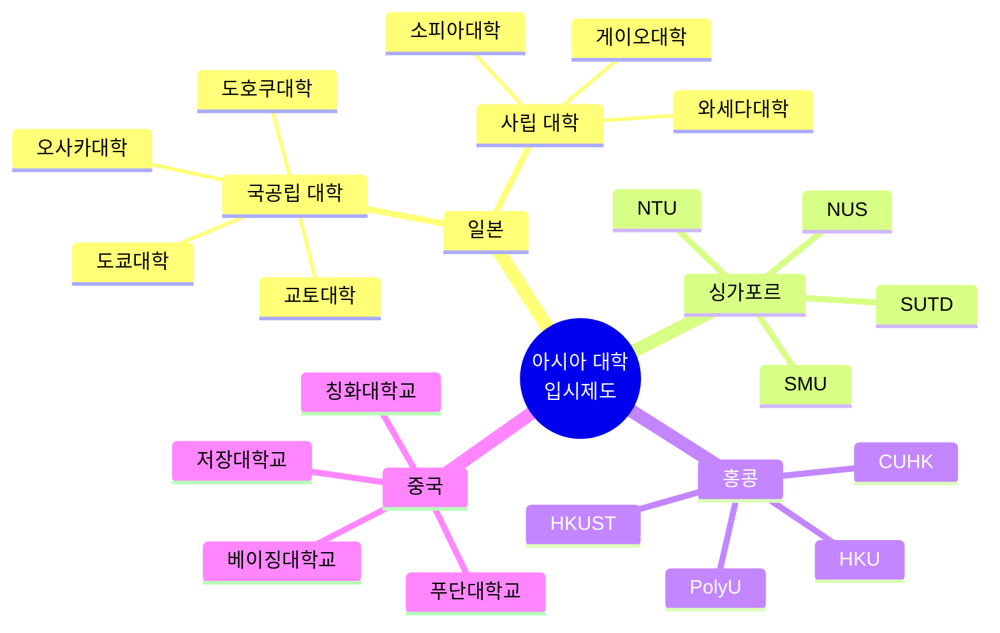
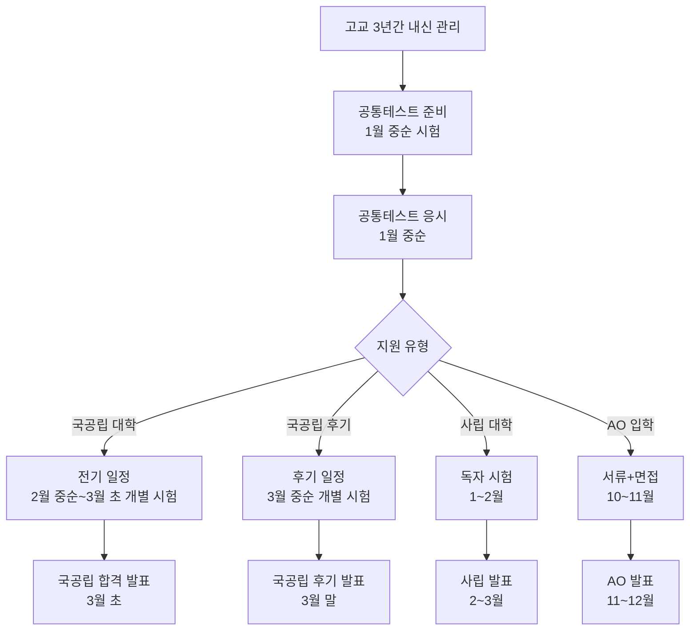
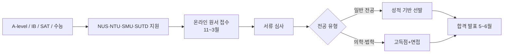
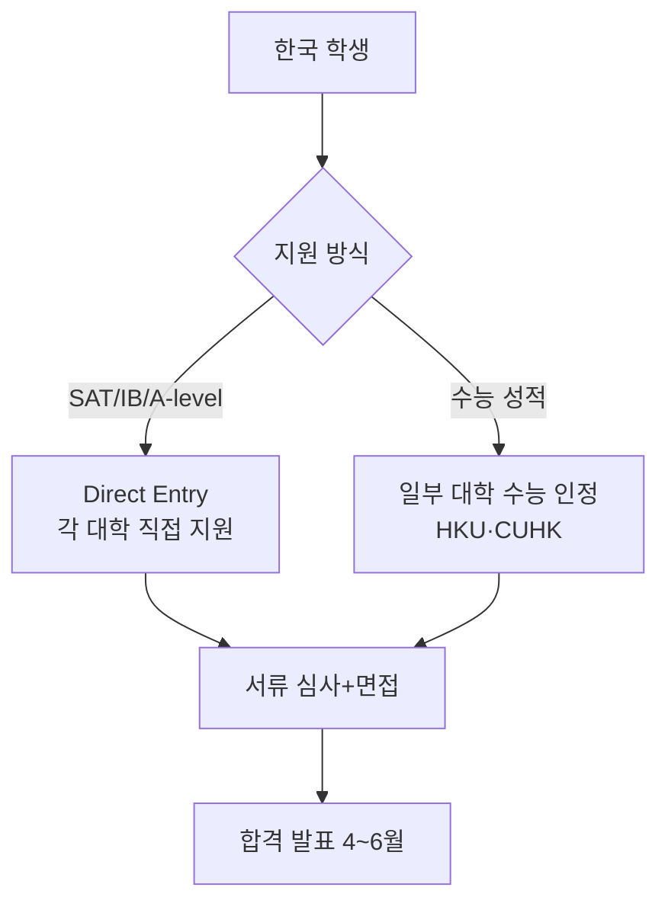
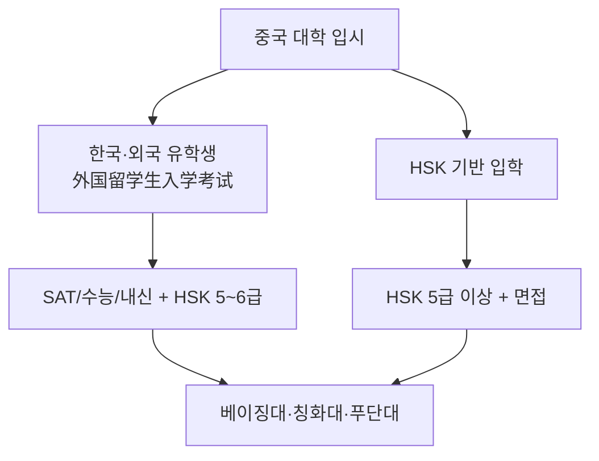
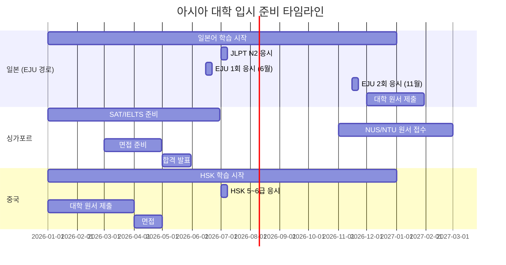

# 해외 대학 입시제도 — 다군: 아시아 (Japan · Singapore · Hong Kong · China)

> **아시아 주요 대학**은 한국 학생에게 지리적·문화적 접근성이 높습니다.
> 일본은 공통테스트, 싱가포르는 A-level/IB, 홍콩은 JUPAS/DSE 기반으로 운영됩니다.

---

## 상담용 의사결정 트리 — 한국 학생 아시아 대학 지원

---

## 아시아 대학 입시 국가별 구조도

---

## 일본 대학 입시 시스템 (상세)

### 일본 대학 입시 프로세스

### 일본 Top 10 대학 비교표 (확장)

| 순위 | 대학명 | 일본어 | 위치 | 특화 분야 | 입시 방식 | 외국인 전형 | 학비(연) | 한국 학생 팁 |
|------|--------|--------|------|---------|---------|-----------|--------|-----------|
| 1 | **도쿄대학** | 東京大学 | 도쿄 | 전방위 | 공통+개별 | PEAK(영어) | ¥535,800 | PEAK 영어 전공 추천 |
| 2 | **교토대학** | 京都大学 | 교토 | 이공·인문 | 공통+개별 | 일부 영어 | ¥535,800 | 연구 중심 |
| 3 | **오사카대학** | 大阪大学 | 오사카 | 의학·공학 | 공통+개별 | 일부 영어 | ¥535,800 | |
| 4 | **도호쿠대학** | 東北大学 | 센다이 | 이공계 | 공통+개별 | Global30 | ¥535,800 | 장학금 풍부 |
| 5 | **규슈대학** | 九州大学 | 후쿠오카 | 공학·의학 | 공통+개별 | 일부 영어 | ¥535,800 | |
| 6 | **나고야대학** | 名古屋大学 | 나고야 | 이공·의학 | 공통+개별 | G30 | ¥535,800 | 도요타 연계 |
| 7 | **홋카이도대학** | 北海道大学 | 삿포로 | 농학·의학 | 공통+개별 | 일부 영어 | ¥535,800 | |
| 8 | **와세다대학** | 早稲田大学 | 도쿄 | 인문·정치·공학 | 독자 시험 | SILS(영어) | ¥1,200,000+ | 영어 전공 풍부 |
| 9 | **게이오대학** | 慶應義塾大学 | 도쿄 | 경영·의학·법학 | 독자 시험 | SFC(영어) | ¥1,200,000+ | |
| 10 | **도쿄공업대학** | 東京工業大学 | 도쿄 | 이공계 전문 | 공통+개별 | 일부 영어 | ¥535,800 | |

### EJU (일본유학시험) 상세 전략

| 과목 | 내용 | 만점 | 목표 점수 (상위 대학) | 준비 방법 |
|------|------|------|-----------------|---------|
| 일본어 | 독해·청해·기술 | 400점 | 340+ | JLPT N1 수준 + EJU 기출 |
| 종합과목 | 사회·지리·역사·경제 | 200점 | 170+ | 일본 고교 사회 교과서 |
| 수학 (이과) | 수학Ⅰ·Ⅱ·Ⅲ | 200점 | 180+ | 일본 수학 교과서 + 기출 |
| 수학 (문과) | 수학Ⅰ·Ⅱ | 200점 | 170+ | |
| 이과 | 물리·화학·생물 중 2과목 | 200점 | 170+ | 일본 이과 교과서 |

### EJU 시험 일정

| 시기 | 1회 (6월) | 2회 (11월) |
|------|---------|---------|
| 원서 접수 | 2~3월 | 7~8월 |
| 시험일 | 6월 중순 | 11월 중순 |
| 성적 발표 | 7월 | 12월 |
| 활용 | 사립대 지원 | 국공립대 지원 |
| 한국 시험장 | 서울·부산 | 서울·부산 |

### 한국 학생 일본 유학 경로 비교

| 경로 | 기간 | 비용 | 난이도 | 추천 학생 |
|------|------|------|--------|---------|
| EJU → 국공립 대학 | 1~2년 준비 | ¥535,800/년 | 높음 | 일본어 N1 + 학업 우수 |
| 영어 전공 (PEAK/SILS) | 직접 지원 | ¥535,800~1,200,000/년 | 중간 | 영어 우수 + SAT/IELTS |
| 일본어학교 → EJU | 1년 어학 + 대학 | ¥700,000(어학)+대학 | 보통 | 일본어 초급~중급 |
| 사립대 독자시험 | 직접 지원 | ¥1,200,000+/년 | 중간 | 일본어 N2+ |

---

## 일본 장학금 상세 가이드

| 장학금 | 지급 기관 | 금액(월) | 대상 | 경쟁률 | 신청 시기 |
|--------|---------|---------|------|--------|---------|
| MEXT (문부과학성) | 일본 정부 | ¥117,000~145,000 | 학부·석사·박사 | 높음 | 4~5월 |
| JASSO 유학생 | JASSO | ¥48,000 | EJU 고득점자 | 보통 | 대학 추천 |
| 사비외국인 장학금 | 각 대학 | ¥30,000~80,000 | 성적 우수자 | 보통 | 입학 후 |
| 수업료 면제 | 국공립 대학 | 수업료 전액/반액 | 경제적 어려움 | 보통 | 매 학기 |
| 로타리 장학금 | 로타리클럽 | ¥100,000+ | 리더십 | 높음 | 10~11월 |

> **상담 포인트**: "일본 국공립대학은 학비가 연 ¥535,800(약 ₩500만)으로 한국 국립대와 비슷합니다. 장학금까지 받으면 실질 부담이 매우 적습니다."

---

## 싱가포르 대학 입시 (상세)

### 싱가포르 입시 프로세스

### 싱가포르 Top 4 대학 비교 (확장)

| 구분 | **NUS** | **NTU** | **SMU** | **SUTD** |
|------|---------|---------|---------|---------|
| QS 순위 | 8위 | 15위 | 50위권 | 50위권 |
| 특화 분야 | 전방위 | 공학·이과 | 경영·법학·사회 | 기술·디자인 |
| 합격률 | 약 17% | 약 25% | 약 20% | 약 30% |
| 학비(유학생/년) | S$35,000~48,000 | S$33,000~48,000 | S$35,000~50,000 | S$35,000~45,000 |
| 입학 요건 | A-level AAA/IB 38+ | A-level AAA/IB 38+ | A-level ABB/IB 36+ | A-level ABB/IB 35+ |
| 한국 수능 인정 | Yes | Yes | Yes | Yes |
| MOE 장학금 | 가능 (3년 취업 조건) | 가능 | 가능 | 가능 |
| 한국인 재학 | 약 200명 | 약 150명 | 약 80명 | 약 30명 |

### 싱가포르 MOE 장학금 (Tuition Grant)

| 항목 | 내용 |
|------|------|
| 지원 금액 | 학비의 약 50% 감면 |
| 조건 | 졸업 후 싱가포르에서 3년 취업 |
| 대상 | 모든 유학생 (성적 기준 충족 시) |
| 신청 | 입학 시 자동 안내 |
| 위약금 | 조건 불이행 시 감면액 전액 반환 |

> **상담 포인트**: "싱가포르 MOE 장학금을 받으면 학비가 절반으로 줄어듭니다. 대신 졸업 후 3년간 싱가포르에서 취업해야 합니다. 글로벌 취업 경험으로 활용하면 좋습니다."

---

## 홍콩 대학 입시 (상세)

### 홍콩 입시 시스템

### 홍콩 Top 5 대학 비교 (확장)

| 구분 | **HKU** | **HKUST** | **CUHK** | **PolyU** | **CityU** |
|------|---------|---------|---------|---------|---------|
| QS 순위 | 17위 | 47위 | 36위 | 65위권 | 70위권 |
| 특화 | 전방위·의학·법학 | 이공·경영 | 인문·사회·의학 | 공학·디자인 | 공학·경영 |
| 합격률 | 약 12% | 약 18% | 약 25% | 약 55% | 약 60% |
| 학비(국제)/년 | HK$145,000~ | HK$140,000~ | HK$135,000~ | HK$120,000~ | HK$120,000~ |
| 수능 인정 | Yes | 일부 | Yes | 일부 | 일부 |
| 장학금 | 풍부 | 풍부 | 풍부 | 보통 | 보통 |
| 한국인 재학 | 약 100명 | 약 80명 | 약 120명 | 약 50명 | 약 40명 |

---

## 중국 대학 입시 (상세)

### 중국 대학 입시 구조

### 중국 Top 대학 비교 (확장)

| 구분 | 베이징대 | 칭화대 | 푸단대 | 저장대 | 상하이교통대 |
|------|--------|--------|--------|--------|----------|
| 위치 | 베이징 | 베이징 | 상하이 | 항저우 | 상하이 |
| QS 순위 | 14위 | 20위 | 39위 | 44위 | 45위 |
| 특화 | 전방위·인문 | 이공계 최강 | 의학·인문 | 이공·의학 | 공학·의학 |
| 외국인 학비/년 | ¥28,000~45,000 | ¥28,000~45,000 | ¥28,000~40,000 | ¥25,000~38,000 | ¥25,000~38,000 |
| HSK 요구 | 6급 | 6급 | 5급~ | 5급~ | 5급~ |
| 영어 전공 | 일부 | 일부 | 일부 | 일부 | 일부 |
| 한국인 재학 | 약 500명 | 약 400명 | 약 300명 | 약 200명 | 약 200명 |

### HSK 준비 가이드

| HSK 급수 | 어휘 수 | 준비 기간 | 대학 지원 가능 |
|---------|--------|---------|------------|
| HSK 4급 | 1,200개 | 6~12개월 | 일부 대학 (어학연수) |
| HSK 5급 | 2,500개 | 12~18개월 | 대부분 대학 |
| HSK 6급 | 5,000개+ | 18~24개월 | 베이징대·칭화대 |

---

## 아시아 대학 국가별 종합 비교

| 구분 | 일본 | 싱가포르 | 홍콩 | 중국 |
|------|------|---------|------|------|
| 입시 방식 | 공통테스트+개별시험 | 성적+면접 | JUPAS/직접지원 | 외국인전형 |
| 언어 | 일본어 필수 (일부 영어) | 영어 | 영어+광둥어(일부) | 중국어 (일부 영어) |
| 학비(연) | 국공립: ¥535,800 | S$33,000~48,000 | HK$120,000~145,000 | ¥25,000~45,000 |
| 생활비(월) | ¥80,000~150,000 | S$1,500~2,500 | HK$8,000~15,000 | ¥3,000~6,000 |
| 장학금 | MEXT·JASSO | MOE Tuition Grant | 대학 장학금 | CSC 정부 장학금 |
| 취업 유리성 | 일본 내 취업 | 동남아·글로벌 | 홍콩·금융 | 중국 내 취업 |
| 한국인 경쟁 | 보통 | 높음 | 보통 | 낮음~보통 |
| 비자 | 유학비자 | Student Pass | Student Visa | X1/X2 비자 |
| 졸업 후 취업비자 | 특정활동비자 | Employment Pass | IANG 비자 | 취업비자 |

---

## 국가별 생활 가이드 (한국 학생용)

### 일본 생활

| 항목 | 도쿄 | 오사카 | 지방 도시 |
|------|------|--------|---------|
| 월세 | ¥60,000~100,000 | ¥40,000~70,000 | ¥25,000~50,000 |
| 식비 | ¥30,000~50,000 | ¥25,000~40,000 | ¥20,000~35,000 |
| 교통비 | ¥10,000~15,000 | ¥8,000~12,000 | ¥5,000~8,000 |
| 아르바이트 | 시급 ¥1,100~1,500 | 시급 ¥1,000~1,300 | 시급 ¥900~1,100 |
| 한국 음식 | 풍부 | 풍부 | 제한적 |

### 싱가포르 생활

| 항목 | 금액 |
|------|------|
| 기숙사 | S$300~600/월 |
| 외부 월세 | S$800~1,500/월 |
| 식비 | S$300~500/월 (호커센터 활용) |
| 교통비 | S$80~120/월 |
| 한국 음식 | 풍부 (한인 커뮤니티 大) |

---

## 한국 학생 합격 사례 시나리오

### 사례 1: 도쿄대 PEAK 합격

| 항목 | 내용 |
|------|------|
| **SAT** | 1480 |
| **IELTS** | 7.5 |
| **내신** | 2등급 |
| **에세이** | 한일 관계에서의 문화 교류 탐구 |
| **핵심 전략** | 영어 전공(PEAK)으로 일본어 불필요, SAT+IELTS 활용 |

### 사례 2: NUS 컴퓨터과학 합격

| 항목 | 내용 |
|------|------|
| **수능** | 국어 1등급 / 수학 1등급 / 영어 1등급 / 과탐 1등급 |
| **IELTS** | 7.0 |
| **과외활동** | 코딩 대회 수상, AI 프로젝트 |
| **핵심 전략** | 한국 수능 성적으로 직접 지원, MOE 장학금 획득 |

### 사례 3: 베이징대 국제관계학 합격

| 항목 | 내용 |
|------|------|
| **HSK** | 6급 (260점) |
| **내신** | 3등급 |
| **면접** | 중국어 면접 + 한중 관계 에세이 |
| **핵심 전략** | HSK 6급 + 중국어 면접 준비, 학비 연 ₩500만 수준 |

---

## 월별 준비 로드맵

---

## 상담 FAQ

### Q1. "일본 대학은 일본어를 꼭 해야 하나요?"

> **답변**: 아닙니다. 도쿄대 PEAK, 와세다 SILS, 게이오 SFC 등 영어 전공이 있습니다. SAT/IELTS로 지원 가능합니다. 하지만 일본 생활과 취업을 위해 일본어 학습을 병행하는 것이 좋습니다.

### Q2. "싱가포르 대학은 한국 수능으로 지원 가능한가요?"

> **답변**: NUS와 NTU는 한국 수능 성적을 공식 인정합니다. 수능 전 영역 1~2등급이면 지원 가능합니다. IELTS 6.5+ 도 필요합니다.

### Q3. "중국 대학 졸업 후 취업은 어떤가요?"

> **답변**: 중국 내 한국 기업이나 중국 기업 취업이 가능합니다. 특히 베이징대·칭화대 졸업생은 한중 비즈니스 분야에서 높은 경쟁력을 가집니다. 다만 중국어 능력이 필수입니다.

---

## 아시아 대학 지원 체크리스트

### 일본
- [ ] EJU 또는 영어 전공 경로 결정
- [ ] JLPT N1~N2 또는 IELTS 7.0+ 준비
- [ ] MEXT/JASSO 장학금 신청 일정 확인
- [ ] 유학비자 신청 준비

### 싱가포르
- [ ] SAT/IB 성적 또는 수능 성적 준비
- [ ] IELTS 6.5+ 준비
- [ ] MOE Tuition Grant 신청 (3년 취업 조건 확인)
- [ ] Student Pass 준비

### 홍콩
- [ ] SAT/A-level + IELTS 준비
- [ ] Direct Entry 원서 작성
- [ ] 장학금 별도 신청

### 중국
- [ ] HSK 5~6급 준비
- [ ] CSC 장학금 신청 일정 확인
- [ ] X1 비자 준비

---

> 작성일: 2026년 2월 | 이전 파일: [해외 나군(영국/유럽)](해외_나군_영국_유럽_대학_입시.md) | 다음 파일: [해외 라군(캐나다/호주/기타)](해외_라군_캐나다_호주_기타_대학_입시.md)
