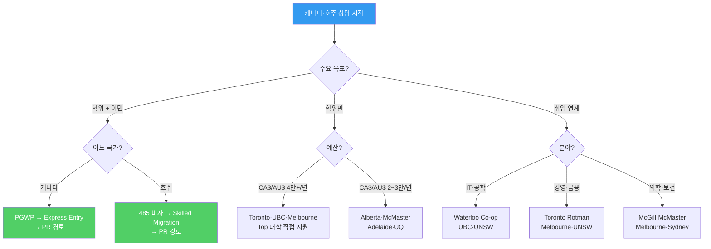
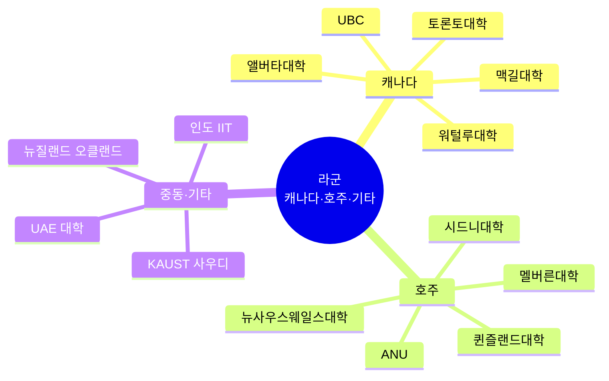
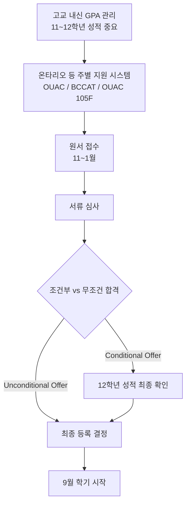
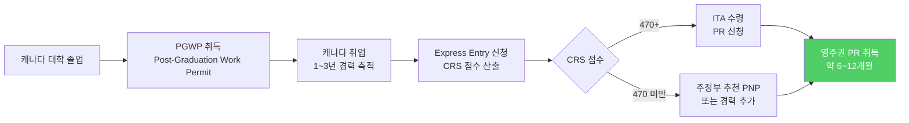
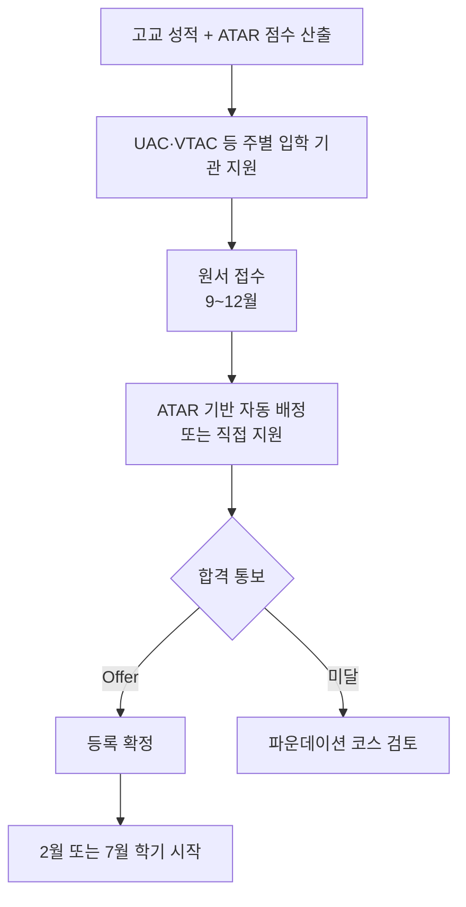
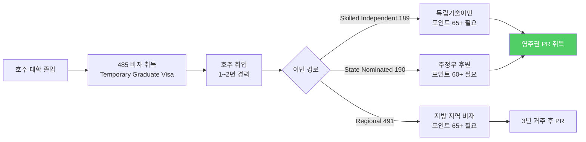
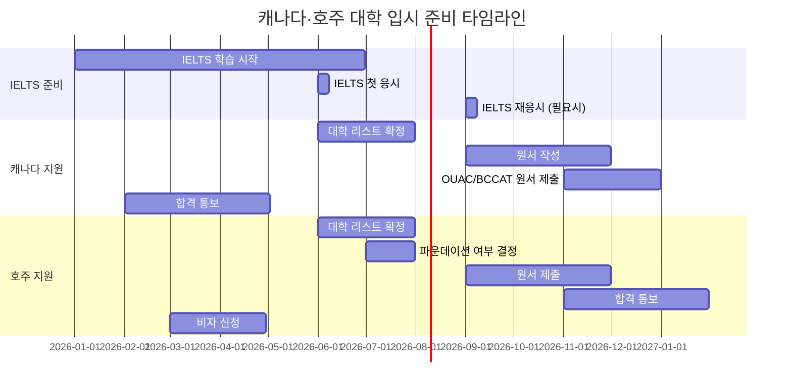

# 해외 대학 입시제도 — 라군: 캐나다 · 호주 · 기타 국가

> **캐나다·호주**는 영어권 유학의 실용적 대안으로, 이민 연계 경로가 강점입니다.
> 중동·인도 등 신흥 유학지도 글로벌 인재 육성 측면에서 주목받고 있습니다.

---

## 상담용 의사결정 트리 — 한국 학생 캐나다·호주 지원

---

## 캐나다·호주·기타 입시 전체 구조도

---

## 캐나다 대학 입시 (상세)

### 캐나다 대학 입시 프로세스

### 캐나다 Top 10 대학 비교표 (확장)

| 순위 | 대학명 | 주 | 특화 분야 | 합격 GPA | 학비(유학생/년) | Co-op | 이민 유리 | 한국 학생 팁 |
|------|--------|-----|---------|---------|-------------|-------|---------|-----------|
| 1 | **Toronto** | ON | 전방위·의학·법학 | 90~95%+ | CA$45,000~65,000 | 일부 | ★★★★ | 가장 경쟁적 |
| 2 | **UBC** | BC | 이공·경영·임업 | 88~94%+ | CA$38,000~55,000 | 다수 | ★★★★★ | 밴쿠버 생활 |
| 3 | **McGill** | QC | 의학·법학·공학 | 90~94%+ | CA$25,000~45,000 | 일부 | ★★★★ | 불어권 (영어 수업) |
| 4 | **Waterloo** | ON | 컴공·공대·수학 | 88~93%+ | CA$35,000~55,000 | 필수 | ★★★★★ | Co-op 세계 최대 |
| 5 | **Alberta** | AB | 공학·의학·농업 | 80~88%+ | CA$28,000~42,000 | 다수 | ★★★★★ | 비용 대비 우수 |
| 6 | **Western** | ON | 경영·의학 | 85~90%+ | CA$28,000~45,000 | 일부 | ★★★★ | Ivey 경영 |
| 7 | **Queens** | ON | 경영·공학·의학 | 87~92%+ | CA$30,000~45,000 | 일부 | ★★★★ | |
| 8 | **McMaster** | ON | 의학·공학 | 85~90%+ | CA$28,000~40,000 | 일부 | ★★★★ | 의대 유명 |
| 9 | **Simon Fraser** | BC | 이공·경영 | 80~86%+ | CA$25,000~35,000 | 다수 | ★★★★★ | Co-op 강세 |
| 10 | **Dalhousie** | NS | 의학·공학·해양 | 75~85%+ | CA$22,000~32,000 | 일부 | ★★★★ | 동부 해안 |

### 캐나다 이민 경로 상세 (PGWP → PR)

### PGWP 기간

| 학업 기간 | PGWP 기간 | 비고 |
|---------|---------|------|
| 8개월~2년 | 학업 기간과 동일 | 최대 2년 |
| 2년 이상 | 3년 | 학사·석사 졸업 |
| 박사 | 3년 | |

### CRS (Comprehensive Ranking System) 점수 구성

| 항목 | 최대 점수 | 한국 학생 평균 |
|------|---------|------------|
| 나이 (20~29세) | 110점 | 100~110점 |
| 학력 (학사) | 120점 | 120점 |
| 언어 (영어 CLB 9+) | 136점 | 100~136점 |
| 캐나다 경력 (1년+) | 80점 | 40~80점 |
| 캐나다 학력 보너스 | 30점 | 30점 |
| 주정부 추천 (PNP) | 600점 | 0 또는 600점 |
| **총점** | **1,200점** | **약 450~500점** |

> **상담 포인트**: "캐나다 대학 졸업 후 3년 취업비자(PGWP)를 받고, 1년 이상 경력을 쌓으면 영주권(PR) 신청이 가능합니다. 캐나다 학력 보너스 30점이 있어 유학생에게 유리합니다."

### Waterloo Co-op 프로그램 상세

| 항목 | 내용 |
|------|------|
| Co-op 구조 | 학기(4개월) + 인턴(4개월) 교대 |
| 총 인턴 횟수 | 4~6회 (약 2년) |
| 인턴 급여 | CA$3,000~8,000/월 (전공별 상이) |
| 참여 기업 | Google, Apple, Microsoft, Amazon, Tesla 등 |
| 졸업 후 취업률 | 95%+ |
| 졸업 시 총 인턴 수입 | CA$50,000~100,000+ |

| 전공 | 평균 인턴 급여(월) | 주요 인턴 기업 |
|------|---------------|------------|
| 컴퓨터과학 | CA$6,000~8,000 | Google, Meta, Shopify |
| 공학 | CA$4,000~6,000 | Tesla, Apple, AMD |
| 수학 | CA$5,000~7,000 | Goldman Sachs, Jane Street |
| 경영 | CA$3,500~5,000 | Deloitte, McKinsey |

---

## 호주 대학 입시 (상세)

### 호주 대학 입시 프로세스

### ATAR 시스템 & 한국 학생 환산

| ATAR 점수 | 의미 | 한국 수능 환산 (참고) |
|---------|------|----------------|
| 99.00+ | 최상위 | 수능 전 영역 1등급 |
| 97.00~98.99 | 의치한 진입 | 수능 1~2등급 |
| 90.00~96.99 | 주요 대학 핵심 학과 | 수능 2~3등급 |
| 80.00~89.99 | 주요 대학 일반 학과 | 수능 3~4등급 |
| 70.00~79.99 | 중위권 대학 | 수능 4~5등급 |

### 호주 Group of Eight (Go8) 대학 비교표 (확장)

| 순위 | 대학명 | 주 | 특화 분야 | ATAR(의대) | 학비(유학생/년) | 이민 유리 | 한국 학생 팁 |
|------|--------|---|---------|-----------|-------------|---------|-----------|
| 1 | **ANU** | ACT | 정치·사회·과학 | 99.0+ | AU$35,000~50,000 | ★★★★ | 캔버라 소재 |
| 2 | **Melbourne** | VIC | 의학·법학·전방위 | 99.0+ | AU$38,000~55,000 | ★★★★★ | 멜버른 생활 |
| 3 | **Sydney** | NSW | 의학·법학·공학 | 99.0+ | AU$38,000~52,000 | ★★★★★ | 시드니 생활 |
| 4 | **UNSW** | NSW | 공학·의학·경영 | 99.0+ | AU$38,000~50,000 | ★★★★★ | 산업 연계 |
| 5 | **UQ** | QLD | 의학·생명·공학 | 98.5+ | AU$35,000~48,000 | ★★★★ | 브리즈번 |
| 6 | **Monash** | VIC | 의학·약학·공학 | 99.0+ | AU$38,000~50,000 | ★★★★★ | 멜버른 |
| 7 | **UWA** | WA | 의학·광업·공학 | 98.0+ | AU$30,000~45,000 | ★★★★★ | 퍼스 (이민 유리) |
| 8 | **Adelaide** | SA | 의학·공학·농업 | 98.0+ | AU$30,000~43,000 | ★★★★★ | 애들레이드 (이민 유리) |

### 호주 이민 경로 상세 (485 비자 → PR)

### 485 비자 기간

| 학업 | 485 비자 기간 | 비고 |
|------|------------|------|
| 학사 (2년+) | 2~4년 | 지역에 따라 상이 |
| 석사 (연구) | 3~5년 | |
| 박사 | 4~6년 | |
| 지방 대학 졸업 | +1~2년 추가 | 지방 보너스 |

### 한국 학생 호주 지원 방법 (상세)

| 방법 | 조건 | 기간 | 비용 | 추천 학생 |
|------|------|------|------|---------|
| 직접 지원 | 수능+내신+IELTS 6.5+ | 바로 입학 | 대학 학비만 | 성적 우수자 |
| 파운데이션 코스 | 고졸+IELTS 5.5+ | 1년 추가 | AU$25,000~35,000 | 일반 학생 |
| Diploma 과정 | 고졸+IELTS 5.5+ | 1년 → 2학년 편입 | AU$25,000~35,000 | 비용 절감 |
| TAFE → 편입 | 고졸+IELTS 5.5+ | 2년 → 편입 | AU$15,000~20,000/년 | 실무 중심 |

### 파운데이션 코스 대학별 비교

| 대학 | 파운데이션 기관 | 기간 | 학비 | IELTS 요구 | 대학 진학률 |
|------|-------------|------|------|---------|---------|
| Melbourne | Trinity College | 10~12개월 | AU$35,000 | 6.0 | 85%+ |
| Sydney | Taylors College | 10~12개월 | AU$33,000 | 5.5 | 80%+ |
| UNSW | UNSW Global | 9~12개월 | AU$32,000 | 5.5 | 85%+ |
| ANU | ANU College | 10~12개월 | AU$30,000 | 5.5 | 80%+ |
| Monash | Monash College | 10~12개월 | AU$30,000 | 5.5 | 85%+ |

---

## 도시별 생활비 비교

| 도시 | 월세(1인실) | 식비(월) | 교통비(월) | 총 생활비(월) | 한국인 커뮤니티 |
|------|---------|--------|---------|-----------|------------|
| 토론토 | CA$1,200~2,000 | CA$400~600 | CA$150 | CA$2,000~3,000 | 매우 큼 |
| 밴쿠버 | CA$1,300~2,200 | CA$400~600 | CA$100 | CA$2,000~3,200 | 매우 큼 |
| 몬트리올 | CA$800~1,400 | CA$350~500 | CA$90 | CA$1,400~2,200 | 큼 |
| 시드니 | AU$1,200~2,000 | AU$400~600 | AU$160 | AU$2,000~3,000 | 매우 큼 |
| 멜버른 | AU$1,000~1,800 | AU$350~550 | AU$150 | AU$1,700~2,700 | 큼 |
| 브리즈번 | AU$800~1,400 | AU$300~500 | AU$130 | AU$1,400~2,200 | 보통 |
| 퍼스 | AU$700~1,200 | AU$300~450 | AU$120 | AU$1,300~2,000 | 보통 |
| 오클랜드 | NZ$900~1,500 | NZ$350~500 | NZ$120 | NZ$1,500~2,300 | 보통 |

---

## 기타 국가 대학 입시 (확장)

### 뉴질랜드 (상세)

| 구분 | 내용 |
|------|------|
| 대표 대학 | Auckland, Otago, Victoria Wellington, Canterbury |
| 입시 방식 | 성적 + IELTS 6.0~6.5 |
| 학비(유학생) | NZ$28,000~42,000/년 |
| 이민 경로 | Post-Study Work Visa (3년) → Skilled Migrant |
| 특이사항 | 이민 비자 연계 좋음, 자연환경 우수 |
| 한국 학생 팁 | 호주보다 경쟁 낮고 이민 경로 유사 |

### 인도 IIT (상세)

| 구분 | 내용 |
|------|------|
| 입시 방식 | JEE Advanced (극도로 어려운 공학 시험) |
| 합격률 | 약 2~3% |
| 학비 | 매우 저렴 (연 ₩100,000~200,000) |
| 외국인 전형 | DASA (Direct Admission of Students Abroad) |
| 졸업 후 | 실리콘밸리 취업률 세계 최상위 |
| 한국 학생 팁 | DASA 전형으로 비교적 쉽게 입학 가능 |

### UAE (상세)

| 대학 | 특화 | 학비 | 장학금 | 비고 |
|------|------|------|--------|------|
| NYUAD | 리버럴아츠 | 장학금 풍부 | 전액 장학금 가능 | NYU 분교, 매우 경쟁적 |
| Khalifa University | 이공·에너지 | 일부 무료 | 정부 지원 | 아부다비 정부 지원 |
| AUD | 경영·건축 | AED 70,000~/년 | 일부 | 중동 비즈니스 연계 |

### 사우디아라비아

| 대학 | 특화 | 학비 | 비고 |
|------|------|------|------|
| KAUST | 이공계 대학원 | 전액 장학금 | 세계적 연구 수준, 생활비 지원 |
| KFUPM | 석유·공학 | 저렴 | 사우디 아람코 연계 |

---

## IELTS 준비 전략 (캐나다·호주 공통)

### 목표 점수별 준비 기간

| 현재 수준 | 목표 점수 | 준비 기간 | 추천 방법 |
|---------|---------|---------|---------|
| 수능 영어 1등급 | IELTS 7.0 | 3~6개월 | 독학 + 모의시험 |
| 수능 영어 2등급 | IELTS 6.5 | 4~8개월 | 학원 + 독학 |
| 수능 영어 3등급 | IELTS 6.0 | 6~12개월 | 학원 집중 |
| 수능 영어 4등급+ | IELTS 5.5 | 8~12개월+ | 학원 + 어학연수 |

### IELTS 영역별 전략

| 영역 | 목표 | 한국 학생 약점 | 대응 전략 |
|------|------|------------|---------|
| Listening | 7.0+ | 영국식 발음 | BBC 팟캐스트, 영드 시청 |
| Reading | 7.0+ | 시간 부족 | 스키밍·스캐닝 연습 |
| Writing | 6.5+ | Task 2 논리 구성 | 에세이 구조 연습, 첨삭 |
| Speaking | 6.5+ | 유창성 부족 | 원어민 회화, 모의 면접 |

---

## 한국 학생 합격 사례 시나리오

### 사례 1: Waterloo 컴퓨터과학 Co-op 합격

| 항목 | 내용 |
|------|------|
| **내신** | 1등급 (수학·과학 특히 우수) |
| **IELTS** | 7.0 |
| **과외활동** | 코딩 대회 수상, GitHub 프로젝트 |
| **핵심 전략** | Co-op 프로그램 활용 → 인턴 수입으로 학비 일부 충당 |
| **졸업 후** | PGWP 3년 → Google Canada 취업 → PR 취득 |

### 사례 2: Melbourne 파운데이션 → 상학 합격

| 항목 | 내용 |
|------|------|
| **내신** | 3등급 |
| **IELTS** | 6.0 (파운데이션 입학 시) → 7.0 (대학 입학 시) |
| **경로** | Trinity College 파운데이션 1년 → Melbourne 상학부 |
| **핵심 전략** | 파운데이션에서 성적 관리 → 대학 직접 진학 |
| **졸업 후** | 485 비자 → 회계 취업 → 190 비자 → PR |

### 사례 3: UBC 경영학 합격

| 항목 | 내용 |
|------|------|
| **내신** | 2등급 |
| **IELTS** | 6.5 |
| **에세이** | 한국 중소기업 가정에서 배운 기업가 정신 |
| **핵심 전략** | 밴쿠버 생활 + Co-op 인턴십 + 이민 경로 |

---

## 라군 국가 종합 비교표 (확장)

| 구분 | 캐나다 | 호주 | 뉴질랜드 | 인도 IIT | UAE |
|------|--------|------|---------|---------|-----|
| 입시 방식 | GPA + 영어 | ATAR + 영어 | 성적 + 영어 | JEE/DASA | 성적 + 영어 |
| 영어 요구 | IELTS 6.5~7.0 | IELTS 6.5~7.5 | IELTS 6.0~6.5 | IELTS 6.0~ | IELTS 6.0~ |
| 학비 수준 | CA$22,000~65,000 | AU$28,000~55,000 | NZ$28,000~42,000 | 매우 저렴 | 다양 |
| 이민 가능성 | ★★★★★ | ★★★★★ | ★★★★ | ★★ | ★★ |
| 취업 환경 | 우수 | 우수 | 보통 | 우수(글로벌) | 중동 특화 |
| 생활비(월) | CA$1,500~3,000 | AU$1,500~3,000 | NZ$1,500~2,500 | ₹20,000~ | AED 3,000~ |
| 한국인 커뮤니티 | 대도시 크게 형성 | 대도시 크게 형성 | 소규모 | 거의 없음 | 소규모 |
| 졸업 후 취업비자 | PGWP 3년 | 485 비자 2~4년 | 3년 | 별도 | 별도 |
| PR까지 기간 | 2~4년 | 2~5년 | 3~5년 | 어려움 | 어려움 |

---

## 월별 준비 로드맵

---

## 상담 FAQ

### Q1. "캐나다와 호주 중 어디가 이민에 유리한가요?"

> **답변**: 둘 다 이민 경로가 잘 갖춰져 있습니다. 캐나다는 Express Entry 시스템이 체계적이고, 호주는 주정부 후원(190/491) 경로가 다양합니다. IT·공학 분야는 캐나다(Waterloo), 의학·간호는 호주가 유리합니다.

### Q2. "파운데이션 코스가 꼭 필요한가요?"

> **답변**: 한국 고교 성적이 우수하고 IELTS 6.5+ 이면 직접 지원이 가능합니다. 하지만 성적이 부족하거나 영어가 약하면 파운데이션 1년을 거치는 것이 안전합니다. 파운데이션 성적으로 대학 진학이 결정되므로 열심히 해야 합니다.

### Q3. "Waterloo Co-op은 정말 좋은가요?"

> **답변**: Waterloo Co-op은 세계 최대 규모로, Google·Apple·Microsoft 등에서 인턴십을 합니다. 인턴 급여가 월 CA$6,000~8,000(CS 기준)이므로 학비 일부를 충당할 수 있고, 졸업 후 취업률이 95%+ 입니다.

### Q4. "호주 지방 대학이 이민에 더 유리한가요?"

> **답변**: 네, 호주는 지방(Regional) 대학 졸업 시 485 비자 기간이 1~2년 추가되고, 이민 포인트에서 5점 보너스가 있습니다. Adelaide, UWA(퍼스) 등이 이민에 유리합니다.

---

## 캐나다·호주 지원 체크리스트 (상담사용)

### 캐나다
- [ ] 한국 내신 GPA 변환 기준 확인 (100점 기준)
- [ ] IELTS 6.5~7.0 목표 설정
- [ ] OUAC/BCCAT 등 주별 지원 시스템 확인
- [ ] Co-op 프로그램 포함 대학 우선 검토
- [ ] PGWP → Express Entry → PR 경로 이해
- [ ] 학비 외 생활비 예산 계획

### 호주
- [ ] 직접 지원 vs 파운데이션 결정
- [ ] IELTS 6.5~7.0 목표 설정
- [ ] Go8 대학 vs 지방 대학 (이민 유리) 비교
- [ ] 485 비자 → Skilled Migration → PR 경로 이해
- [ ] 학비 외 생활비 예산 계획
- [ ] 비자 신청 일정 확인

---

> 작성일: 2026년 2월 | 이전 파일: [해외 다군(아시아)](해외_다군_아시아_대학_입시.md) | 총정리 파일: [대학입시제도 총정리](대학입시제도_총정리.md)
