# AI 시대 32대 직업 커리어패스 × 대입 학종 완전 가이드 (상)
> **8개 왕국 × 대표 직업 4선 = 32개 커리어패스**
> 초등 → 중등 → 고등 → 대입까지의 실전 로드맵 + 학생부종합전형 반영 전략
> **상편: 🔬 탐구 · 🎨 창작 · 💻 기술 · 🌱 자연 왕국 + 대입 학종 제도 총정리**

---

## 전체 32개 직업 구조도

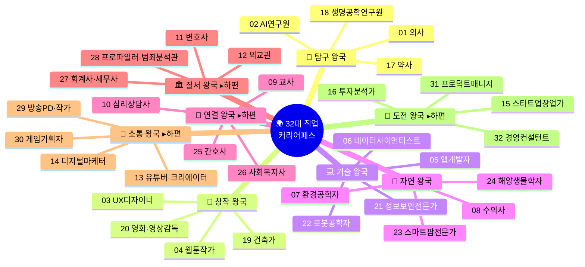

---

## 32개 직업 총괄 비교표

| # | 왕국 | 직업명 | Holland 유형 | 핵심 강점 | AI 대체 위험 | 미래 성장성 | 대입 핵심 전형 |
|---|------|--------|-------------|---------|------------|-----------|------------|
| 01 | 🔬 탐구 | 의사 | I+S | 분석력, 공감력 | 낮음 | ★★★★★ | 학종+정시 |
| 02 | 🔬 탐구 | AI연구원 | I+C | 논리력, 수학 | 매우 낮음 | ★★★★★ | 학종+특기자 |
| 17 | 🔬 탐구 | 약사 | I+C | 약물 분석, 꼼꼼함 | 낮음 | ★★★★ | 정시+학종 |
| 18 | 🔬 탐구 | 생명공학연구원 | I+R | 실험설계, 데이터분석 | 매우 낮음 | ★★★★★ | 학종+정시 |
| 03 | 🎨 창작 | UX디자이너 | A+I | 창의력, 공감 | 중간 | ★★★★ | 학종+실기 |
| 04 | 🎨 창작 | 웹툰작가 | A+R | 스토리텔링, 드로잉 | 중간 | ★★★★ | 실기+학종 |
| 19 | 🎨 창작 | 건축가 | A+R | 공간감각, 구조설계 | 낮음 | ★★★★ | 학종+실기 |
| 20 | 🎨 창작 | 영화·영상감독 | A+E | 연출력, 리더십 | 낮음 | ★★★★ | 실기+학종 |
| 05 | 💻 기술 | 앱개발자 | R+I | 논리력, 문제해결 | 낮음 | ★★★★★ | 학종+SW특기자 |
| 06 | 💻 기술 | 데이터사이언티스트 | I+C | 통계, 분석력 | 낮음 | ★★★★★ | 학종+정시 |
| 21 | 💻 기술 | 정보보안전문가 | I+R | 논리력, 위기대응 | 매우 낮음 | ★★★★★ | 학종+SW특기자 |
| 22 | 💻 기술 | 로봇공학자 | R+I | 하드웨어+SW 융합 | 매우 낮음 | ★★★★★ | 학종+정시 |
| 07 | 🌱 자연 | 환경공학자 | I+R | 관찰력, 과학적 사고 | 낮음 | ★★★★ | 학종+정시 |
| 08 | 🌱 자연 | 수의사 | I+S | 동물 공감, 관찰력 | 낮음 | ★★★★ | 학종+정시 |
| 23 | 🌱 자연 | 스마트팜전문가 | R+I | IoT 기술, 농업과학 | 낮음 | ★★★★★ | 학종+정시 |
| 24 | 🌱 자연 | 해양생물학자 | I+R | 해양탐사, 생태분석 | 매우 낮음 | ★★★★ | 학종+정시 |
| 09 | 🤝 연결 | 교사 | S+E | 공감력, 소통 | 매우 낮음 | ★★★★ | 학종(교대/사범) |
| 10 | 🤝 연결 | 심리상담사 | S+I | 경청, 분석 | 매우 낮음 | ★★★★ | 학종+정시 |
| 25 | 🤝 연결 | 간호사 | S+I | 공감력, 위기대응 | 낮음 | ★★★★★ | 학종+정시 |
| 26 | 🤝 연결 | 사회복지사 | S+E | 공감력, 자원연결 | 매우 낮음 | ★★★★ | 학종+정시 |
| 11 | 🏛️ 질서 | 변호사 | C+E | 논리력, 정의감 | 낮음 | ★★★ | 학종+정시→로스쿨 |
| 12 | 🏛️ 질서 | 외교관 | E+S | 어학, 국제 감각 | 낮음 | ★★★ | 학종+정시→외무고시 |
| 27 | 🏛️ 질서 | 회계사·세무사 | C+I | 수리력, 정확성 | 중간 | ★★★ | 학종+정시→CPA |
| 28 | 🏛️ 질서 | 프로파일러·범죄분석관 | I+C | 심리분석, 논리력 | 낮음 | ★★★★ | 학종+정시 |
| 13 | 📣 소통 | 유튜버·크리에이터 | A+E | 기획력, 표현력 | 중간 | ★★★★ | 학종+실적기반 |
| 14 | 📣 소통 | 디지털마케터 | E+A | 분석, 소비자 심리 | 중간 | ★★★★ | 학종+정시 |
| 29 | 📣 소통 | 방송PD·작가 | A+E | 기획력, 스토리구성 | 낮음 | ★★★★ | 학종+실기 |
| 30 | 📣 소통 | 게임기획자 | A+I | 시스템설계, 창의력 | 낮음 | ★★★★★ | 학종+SW특기자 |
| 15 | 🚀 도전 | 스타트업창업가 | E+I | 추진력, 판단력 | 중간 | ★★★★★ | 학종+창업전형 |
| 16 | 🚀 도전 | 투자분석가 | C+I | 수리력, 냉정함 | 중간 | ★★★★★ | 학종+정시 |
| 31 | 🚀 도전 | 프로덕트매니저(PM) | E+I | 기획력, 소통·조정 | 낮음 | ★★★★★ | 학종+정시 |
| 32 | 🚀 도전 | 경영컨설턴트 | E+C | 분석력, 전략적사고 | 중간 | ★★★★ | 학종+정시 |

---

## 🎓 대입 학생부종합전형(학종) 제도 총정리

> 16개 직업 커리어패스를 실현하기 위해 반드시 알아야 할 대입 제도

### 현행 학종 제도 (2025~2026 기준)

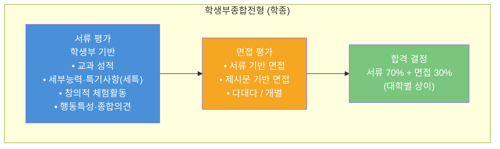

### 학종 핵심 평가 요소 4가지

| 평가 항목 | 세부 내용 | 비중(서울 주요 대학 기준) | 커리어패스 연결 |
|---------|---------|---------------------|------------|
| **학업역량** | 교과 성적, 학업 성취 추이, 탐구 심화 노력 | ★★★★★ | 전 직업 공통 — 해당 전공 관련 교과 성적 |
| **진로역량** | 전공 관련 활동, 진로 탐색의 깊이와 발전 과정 | ★★★★★ | 직업별 프로젝트·대회·탐구 활동 |
| **공동체역량** | 협력, 나눔, 배려, 리더십, 갈등관리 | ★★★☆☆ | 동아리·봉사·팀 프로젝트 경험 |
| **자기주도성** | 주도적 활동, 지적 호기심, 도전 정신 | ★★★★☆ | 자발적 프로젝트·독서·탐구 활동 |

### 현행 대입 전형 유형 비교표

| 전형 유형 | 핵심 평가 | 주요 대상 | 비중(2026 기준) | 적합 직업군 |
|---------|---------|---------|-------------|---------|
| **학생부종합(학종)** | 학생부+면접 | 내신+비교과 우수 | 서울대 100%, 연세대 40%+ | 전 직업 |
| **학생부교과** | 내신 성적 | 내신 최상위 | 지방 거점 국립대 중심 | 전 직업 |
| **논술전형** | 논술 시험 | 논술 우수 | 연세대·성균관대 등 | 변호사·외교관·의사 |
| **정시(수능)** | 수능 점수 | 수능 고득점 | 서울대 40%, 의대 60%+ | 의사·연구원·공학 |
| **실기/실적전형** | 실기+포트폴리오 | 예체능 | 미대·예대 중심 | UX디자이너·웹툰작가 |
| **SW특기자** | 코딩 포트폴리오 | 개발 실적 | 성균관대·숭실대 등 | 앱개발자·데이터사이언티스트 |
| **창업인재전형** | 창업 실적 | 창업 경험 | 한양대·건국대 등 | 스타트업창업가 |

### 2025~2028 학종 제도 주요 변화

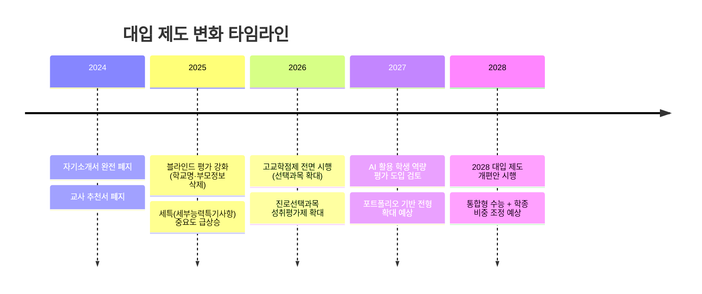

### 변화의 핵심 포인트 — "자소서 없는 시대, 세특이 전부다"

| 변화 | Before (2023 이전) | After (2025~) | 커리어패스 영향 |
|------|------------------|-------------|------------|
| 자기소개서 | 4개 문항 1,500자씩 직접 작성 | **완전 폐지** | 학생부 '세특'에 모든 스토리가 담겨야 함 |
| 교사 추천서 | 교사가 별도 추천서 작성 | **폐지** | 수업 중 보여주는 역량이 세특에 직접 기록 |
| 세특 중요도 | 학생부의 일부분 | **학종의 핵심 평가 자료** | 교과 수업에서 전공 관련 탐구·발표·보고서 필수 |
| 블라인드 평가 | 부분 적용 | **전면 적용** | 학교 브랜드가 아닌 순수 활동·역량으로 평가 |
| 고교학점제 | 시범 운영 | **2025 전면 시행** | 진로에 맞는 선택과목 전략이 매우 중요 |

### 학종 합격을 위한 세특 작성 핵심 — 직업별 교과 연결 전략

| 직업 | 핵심 교과 | 세특에 담을 탐구 주제 예시 | 추천 선택과목(고교학점제) |
|------|---------|---------------------|------------------|
| 의사 | 생명과학Ⅱ, 화학Ⅱ | "지역사회 건강 불평등 데이터 분석" | 생명과학Ⅱ, 화학Ⅱ, 보건, 심리학 |
| AI연구원 | 수학Ⅱ, 미적분, 정보 | "Transformer 모델의 수학적 원리 탐구" | 미적분, 확률과통계, 인공지능수학, 정보 |
| **약사** | 화학Ⅱ, 생명과학Ⅱ | "약물 상호작용의 화학적 메커니즘 분석" | 화학Ⅱ, 생명과학Ⅱ, 보건, 확률과통계 |
| **생명공학연구원** | 생명과학Ⅱ, 화학Ⅱ | "유전자 재조합 기술(GMO)의 안전성 데이터 분석" | 생명과학Ⅱ, 화학Ⅱ, 정보, 확률과통계 |
| UX디자이너 | 미술, 기술·가정 | "학교 급식 주문 앱 UX 리디자인 프로젝트" | 미술창작, 디자인, 정보, 심리학 |
| 웹툰작가 | 미술, 국어 | "AI 시대 웹툰 스토리텔링의 진화" | 미술창작, 문학, 매체미술, 영상제작 |
| **건축가** | 수학, 미술, 물리학Ⅱ | "학교 리모델링 설계 — BIM 3D 모델링 프로젝트" | 물리학Ⅱ, 미적분, 미술창작, 기술·가정 |
| **영화·영상감독** | 미술, 국어(문학) | "단편 영화 연출 — 몽타주 이론과 한국 뉴웨이브 분석" | 영상제작, 문학, 사회문화, 매체미술 |
| 앱개발자 | 정보, 수학 | "Flask로 구현한 학교 Q&A 챗봇" | 정보, 프로그래밍, 미적분, 데이터과학 |
| 데이터사이언티스트 | 확률과통계, 정보 | "공공데이터로 분석한 우리 지역 미세먼지 패턴" | 확률과통계, 미적분, 정보, 경제수학 |
| **정보보안전문가** | 정보, 수학Ⅱ | "학교 네트워크 취약점 분석 및 보안 정책 제안" | 정보, 프로그래밍, 미적분, 확률과통계 |
| **로봇공학자** | 물리학Ⅱ, 정보 | "Arduino 기반 자율주행 로봇의 PID 제어 원리" | 물리학Ⅱ, 미적분, 정보, 프로그래밍 |
| 환경공학자 | 지구과학Ⅱ, 화학 | "학교 옥상 태양광 패널 설치 경제성 분석" | 지구과학Ⅱ, 화학Ⅱ, 환경, 생활과과학 |
| 수의사 | 생명과학Ⅱ, 화학 | "반려동물 영양학 기초 — 사료 성분 분석" | 생명과학Ⅱ, 화학Ⅱ, 농업생명과학, 보건 |
| **스마트팜전문가** | 생명과학Ⅰ, 정보 | "IoT 센서 기반 학교 텃밭 자동화 시스템 구축" | 농업생명과학, 정보, 생명과학Ⅰ, 환경 |
| **해양생물학자** | 생명과학Ⅱ, 지구과학Ⅱ | "해양 미세플라스틱이 갯벌 생태계에 미치는 영향" | 생명과학Ⅱ, 지구과학Ⅱ, 화학Ⅱ, 환경 |

> **하편에서 이어질 내용**: 교사·심리상담사·간호사·사회복지사·변호사·외교관·회계사·프로파일러·유튜버·마케터·방송PD·게임기획자·창업가·투자분석가·PM·컨설턴트의 세특 전략 + 2028 대입 개편안 상세 분석

---

# 🔬 탐구 왕국 — 의사 & AI연구원

---

## 커리어 01: 의사 (임상의 / 전문의)

> **Holland**: 탐구형(I) + 사회형(S) | **에너지 키워드**: 환자 공감, 정밀 진단, 의학 연구
> **대입 경로**: 의대 6년 (의예과 2년 + 의학과 4년) → 인턴 1년 → 레지던트 3~4년
> **핵심 전형**: 정시 60%+ / 학종 30%+ / 논술 일부

### 초등 → 고등 전체 커리어패스 로드맵

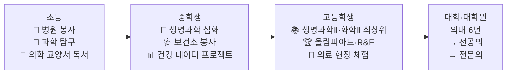

### 초등 단계 (씨앗 심기)

| 학년 | 핵심 활동 | 도구/비용 | 성과물 |
|------|---------|---------|------|
| 초4 | 동네 보건소 봉사 월 1회, 병원 관찰 일기 시작 | 무료 | 봉사 인증서, 관찰 노트 |
| 초5 | 과학 실험 키트로 세포 관찰, 인체 모형 조립 | 실험 키트 3만원 | 실험 보고서 5편 |
| 초6 | 《아픔이 길이 되려면》 독서 + 감상문, 교내 과학탐구대회 | 도서 1.5만원 | **교내 과학대회 입상**, 독서 감상문 |

### 중등 단계 (싹 틔우기)

| 학기 | 핵심 활동 | 대회/외부 활동 | 성과 |
|------|---------|------------|------|
| 중1 1학기 | Holland 검사(I+S 확인), 생명과학 심화 학습 시작 | 커리어넷 검사 | 진로 방향 확정 |
| 중1 2학기 | 지역 보건소 건강 통계 데이터 수집 + 엑셀 분석 | 보건소 봉사 | 건강 통계 보고서 |
| 중2 1학기 | "우리 동네 건강 지도" 프로젝트 (병원·약국·공원 매핑) | 자유학년제 주제탐구 | **교내 탐구대회 우수상** |
| 중2 2학기 | 《이기적 유전자》 독서, 유전학 기초 학습 | 과학 독서 클럽 | 독서 보고서 |
| 중3 1학기 | 생물올림피아드(KBO) 예선 준비, 캠벨 생명과학 정독 | KBO 도전 | 올림피아드 예선 참가 |
| 중3 2학기 | 의료 봉사 누적 50시간, 의사 인터뷰 1회 | 병원 봉사 | 의사 인터뷰 보고서 |

### 고등 단계 (열매 맺기)

| 학기 | 주간 루틴 | 핵심 활동 | 학종 세특 포인트 | 성과 |
|------|---------|---------|-------------|------|
| 고1 1학기 | 평일: 교과 내신 3h / 주말: 탐구 활동 | 생명과학Ⅰ·화학Ⅰ 1등급 목표, 진로선택 "보건" 수강 | 세특: "공중보건 데이터로 본 지역 건강 불평등" 보고서 | 내신 1등급, 세특 기록 |
| 고1 2학기 | 매일: 과학 심화 1.5h | R&E 프로그램 신청, 대학 연구실 견학 | 세특: "AI 진단 보조 기술의 윤리적 쟁점" 에세이 | R&E 선발 |
| 고2 1학기 | 생명과학Ⅱ·화학Ⅱ 집중 | 한국생물올림피아드(KBO) 본선 도전 | 세특: "CRISPR 유전자 편집의 가능성과 한계" 발표 | **KBO 은상**, 내신 1등급 유지 |
| 고2 2학기 | R&E 연구 집중 | 대학 교수 지도 하 연구 보고서 작성 | 세특: R&E 연구 과정·결과 연계 기록 | 연구 보고서 완성 |
| 고3 1학기 | 면접 준비 + 수능 | 수시 6장 (의대 학종+정시 병행) | 최종 세특: 6년간 의학 탐구 여정 정리 | 원서 접수 |
| 고3 2학기 | 수능 + 면접 | MMI(다중미니면접) 대비 | - | **의대 합격** |

### 의대 학종 합격 핵심 전략

| 전략 요소 | 구체적 방법 | 중요도 |
|---------|---------|-------|
| **내신** | 과학·수학 1등급, 전체 평균 1~2등급 | ★★★★★ |
| **세특** | 매 학기 생명과학·화학 교과에서 의학 관련 탐구 기록 | ★★★★★ |
| **탐구 일관성** | 중1~고3까지 "건강·의학" 일관된 관심 스토리 | ★★★★★ |
| **봉사** | 의료 관련 봉사 (병원·보건소·호스피스) 누적 | ★★★★☆ |
| **면접(MMI)** | 의료 윤리 사례 (안락사·유전자 편집·의료 자원 분배) 대비 | ★★★★★ |
| **수능** | 정시 비중 높으므로 수능 최저학력기준 충족 필수 | ★★★★★ |

### 의대 학종 면접 빈출 주제 TOP 5

| # | 면접 주제 | 준비 방법 |
|---|---------|---------|
| 1 | "AI가 의사를 대체할 수 있는가?" | 의료 AI 보조 사례 + 인간 의사의 불가대체 요소 정리 |
| 2 | "임종 환자에게 진실을 말해야 하는가?" | 의료 윤리 원칙 4가지 (자율성·선행·악행금지·정의) |
| 3 | "의료 자원이 부족할 때 누구를 먼저 치료할 것인가?" | 트리아지 원칙 + 공리주의 vs 의무론적 관점 |
| 4 | "유전자 편집 아기(디자이너 베이비)에 대한 입장" | CRISPR 기술 이해 + 사회적 영향 분석 |
| 5 | "의사가 되려는 이유와 어떤 의사가 되고 싶은가?" | 개인 경험 기반 구체적 스토리 (봉사·환자 만남 등) |

### 핵심 성공 지표

| 지표 | 초등 달성 | 중등 달성 | 고등 달성 |
|------|---------|---------|---------|
| 봉사 시간 누적 | 약 20시간 | 약 70시간 | 약 150시간 |
| 과학 탐구 보고서 | 5편 | 8편 | 12편+ |
| 수상 경력 | 교내 입상 | 올림피아드 예선 | **KBO 은상**, R&E 발표 |
| 독서 | 교양 도서 3권 | 전문 도서 5권 | 의학 논문 리딩 10편+ |
| 총 투자 비용 | 약 5만원 | 약 10만원 | 약 30만원 |

---

## 커리어 02: AI 연구원 (머신러닝 엔지니어 / NLP 연구원)

> **Holland**: 탐구형(I) + 관습형(C) | **에너지 키워드**: 알고리즘 설계, 논문 읽기, 모델 학습
> **대입 경로**: 컴퓨터공학·AI학과 → 대학원(석·박사) → 연구소/기업
> **핵심 전형**: 학종 50%+ / SW특기자 / 정시

### 초등 → 고등 전체 커리어패스 로드맵

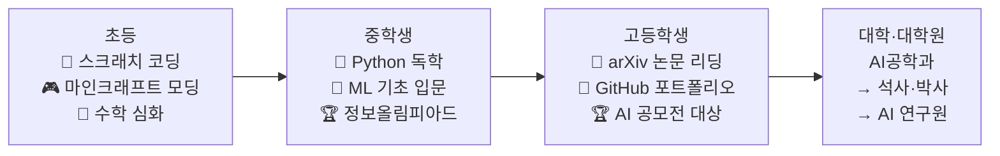

### 초등 단계 (씨앗 심기)

| 학년 | 핵심 활동 | 도구/비용 | 성과물 |
|------|---------|---------|------|
| 초4 | 스크래치로 미니게임 제작, 코딩 캠프 1주 | 스크래치 무료, 캠프 5만원 | 스크래치 게임 5개 |
| 초5 | Python 독학 (유튜브 '나도코딩'), 지역 코딩대회 | Python 무료, 교재 1.5만원 | **지역 코딩대회 입상**, GitHub 개설 |
| 초6 | Python 심화 + 수학 심화 (함수·확률 개념) | VSCode 무료 | GitHub 레포 5개, 수학 심화 완료 |

### 중등 단계 (싹 틔우기)

| 학기 | 핵심 활동 | 대회/외부 활동 | 성과 |
|------|---------|------------|------|
| 중1 1학기 | Holland 검사(I+C), Python 프로젝트 (계산기·날씨 앱) | 커리어넷 검사 | 날씨 앱 완성, Flask 서버 |
| 중1 2학기 | API 활용 토이 프로젝트, 알고리즘 기초 | 백준 문제풀이 | 백준 실버 달성 |
| 중2 1학기 | 학교 급식 알림 텔레그램 봇 제작 | IT 공모전 도전 | **공모전 장려상**, 봇 50명 사용 |
| 중2 2학기 | K-MOOC AI 기초 수강, scikit-learn 입문 | K-MOOC 무료 | AI 기초 수료증, 첫 ML 모델 |
| 중3 1학기 | 코딩 동아리 회장, 후배 Python 교육 | 정보올림피아드(KOI) | KOI 예선 참가 |
| 중3 2학기 | Hugging Face 입문, 감정분석 챗봇 프로토타입 | AI 프로젝트 | 챗봇 프로토타입 완성 |

### 고등 단계 (열매 맺기)

| 학기 | 핵심 활동 | 학종 세특 포인트 | 성과 |
|------|---------|-------------|------|
| 고1 1학기 | 정보과목 1등급, 수학Ⅱ·미적분 심화 | 세특: "학교 상담 AI 챗봇 설계 및 구현 과정" | AI 챗봇 교내 시범 운영 |
| 고1 2학기 | Transformer 이해, NLP 미니 프로젝트 | 세특: "Transformer 모델의 수학적 원리 — 선형대수 관점" | 논문 리딩 노트 30편 |
| 고2 1학기 | **전국 AI 공모전** (고령자 음성 AI 보조) | 세특: "AI 공모전 프로젝트 — 음성 인식 모델 개발 과정과 사회적 의미" | **AI 공모전 대상**, 상금 100만원 |
| 고2 2학기 | GitHub 정리, 오픈소스 기여 | 세특: "오픈소스 기여를 통한 협업 개발 경험" | GitHub Stars 200+, 프로젝트 15개 |
| 고3 1학기 | 수시 원서 전략 (학종+SW특기자 병행) | 최종 세특: "코딩 입문부터 AI 연구까지 6년 여정" | 원서 접수 |
| 고3 2학기 | 면접 대비 (AI 기술·윤리 토론) | - | **AI공학과 합격**, 장학금 |

### AI학과 학종 합격 핵심 전략

| 전략 요소 | 구체적 방법 | 중요도 |
|---------|---------|-------|
| **세특 (정보·수학)** | 매 학기 AI 관련 탐구 프로젝트를 교과와 연결해 기록 | ★★★★★ |
| **포트폴리오** | GitHub 공개 레포 10개+, README 상세 작성, Stars 확보 | ★★★★★ |
| **공모전** | 전국 AI/SW 공모전 1회 이상 수상 | ★★★★☆ |
| **내신** | 수학·정보 1등급, 전체 2등급 이내 | ★★★★☆ |
| **선택과목** | 인공지능수학, 정보, 프로그래밍, 확률과통계 필수 수강 | ★★★★★ |

### 핵심 성공 지표

| 지표 | 초등 달성 | 중등 달성 | 고등 달성 |
|------|---------|---------|---------|
| 코딩 시간 누적 | 약 200시간 | 약 600시간 | 약 1,000시간 |
| 완성 프로젝트 | 5개 | 6개 | 8개 |
| 수상 경력 | 지역 입상 | 공모전 장려상 | **전국 AI 대상** |
| GitHub | 레포 5개 | 레포 10개 | 레포 25개, Stars 200+ |
| 총 투자 비용 | 약 10만원 | 약 5만원 | 약 20만원 |

---

## 커리어 17: 약사 (임상약사 / 제약연구원)

> **Holland**: 탐구형(I) + 관습형(C) | **에너지 키워드**: 약물 분석, 처방 검토, 신약 연구
> **대입 경로**: 약학대학 6년 (약학과 2+4년제) → 약사 면허
> **핵심 전형**: 정시 60%+ / 학종 30%+ / 논술 일부

### 초등 → 고등 전체 커리어패스 로드맵

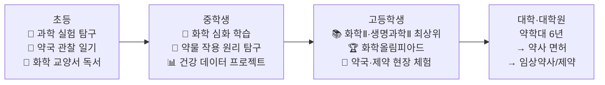

### 초등 단계 (씨앗 심기)

| 학년 | 핵심 활동 | 도구/비용 | 성과물 |
|------|---------|---------|------|
| 초4 | 가정 상비약 분류·관찰 일기, 약국 견학 | 무료 | 약품 관찰 노트 |
| 초5 | 과학 실험 키트 (산·염기 반응, 용해도 실험) | 실험 키트 3만원 | 실험 보고서 5편 |
| 초6 | 《세상을 바꾼 약 이야기》 독서, 교내 과학탐구대회 | 도서 1.5만원 | **교내 과학대회 입상**, 독서 감상문 |

### 중등 단계 (싹 틔우기)

| 학기 | 핵심 활동 | 대회/외부 활동 | 성과 |
|------|---------|------------|------|
| 중1 1학기 | Holland 검사(I+C 확인), 화학 심화 학습 시작 | 커리어넷 검사 | 진로 방향 확정 |
| 중1 2학기 | 일상 속 화학 반응 관찰 보고서 (비타민 용해 속도 실험) | 자유학기제 탐구 | 실험 보고서 |
| 중2 1학기 | "약국에서 가장 많이 팔리는 약 TOP 10" 성분 분석 프로젝트 | 과학 동아리 | **교내 탐구대회 우수상** |
| 중2 2학기 | 《약학 개론》 입문, 약물 작용 메커니즘 기초 독서 | 과학 독서 클럽 | 독서 보고서 |
| 중3 1학기 | 한국화학올림피아드(KChO) 예선 준비 | KChO 도전 | 올림피아드 예선 참가 |
| 중3 2학기 | 약사 인터뷰 1회, 약국·제약사 견학 | 현장 체험 | 약사 인터뷰 보고서 |

### 고등 단계 (열매 맺기)

| 학기 | 핵심 활동 | 학종 세특 포인트 | 성과 |
|------|---------|-------------|------|
| 고1 1학기 | 화학Ⅰ·생명과학Ⅰ 1등급, 진로선택 "보건" 수강 | 세특: "타이레놀 vs 이부프로펜 — 진통제 작용 메커니즘 비교" | 내신 1등급 |
| 고1 2학기 | 약학 관련 논문 리딩, 화학 실험 심화 | 세특: "약물 상호작용의 화학적 원리 — 자몽 주스와 약물 흡수" | 논문 리딩 노트 |
| 고2 1학기 | 한국화학올림피아드 본선, 화학Ⅱ·생명과학Ⅱ 집중 | 세특: "신약 개발 파이프라인과 AI 신약 설계의 가능성" | **KChO 은상** |
| 고2 2학기 | R&E (제약 관련 연구), 약학대 교수 지도 | 세특: R&E 연구 과정·결과 연계 기록 | R&E 보고서 |
| 고3 1학기 | 수시 6장 (약대 학종+정시 병행) | 최종 세특: "화학 탐구에서 약학 연구까지 6년 여정" | 원서 접수 |
| 고3 2학기 | 수능 + 면접 | 약학 윤리·신약 개발 면접 대비 | **약학대 합격** |

### 약학대 학종 합격 핵심 전략

| 전략 요소 | 구체적 방법 | 중요도 |
|---------|---------|-------|
| **내신** | 화학·생명과학·수학 1등급, 전체 1~2등급 | ★★★★★ |
| **세특** | 화학·생명과학 교과에서 약학 관련 탐구 기록 | ★★★★★ |
| **탐구 일관성** | "화학·약물·건강" 일관된 관심 스토리 | ★★★★★ |
| **면접** | 신약 개발 윤리, 약물 오남용, 의약분업 이슈 | ★★★★★ |
| **수능** | 약대 정시 비중 높으므로 수능 최저 충족 필수 | ★★★★★ |

### 핵심 성공 지표

| 지표 | 초등 달성 | 중등 달성 | 고등 달성 |
|------|---------|---------|---------|
| 과학 탐구 보고서 | 5편 | 8편 | 12편+ |
| 수상 경력 | 교내 입상 | 올림피아드 예선 | **KChO 은상**, R&E |
| 독서 | 교양 도서 3권 | 전문 도서 5권 | 약학 논문 리딩 10편+ |
| 총 투자 비용 | 약 5만원 | 약 8만원 | 약 25만원 |

---

## 커리어 18: 생명공학연구원 (바이오엔지니어)

> **Holland**: 탐구형(I) + 현실형(R) | **에너지 키워드**: 유전자 분석, 실험 설계, 바이오 데이터
> **대입 경로**: 생명공학과 / 바이오공학과 / 생물학과 → 대학원(석·박사)
> **핵심 전형**: 학종 50%+ / 정시

### 초등 → 고등 전체 커리어패스 로드맵

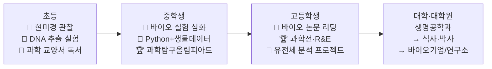

### 초등 단계 (씨앗 심기)

| 학년 | 핵심 활동 | 도구/비용 | 성과물 |
|------|---------|---------|------|
| 초4 | 현미경으로 세포 관찰, 식물 성장 실험 | 현미경 5만원 | 관찰 일지 |
| 초5 | 주방 재료로 DNA 추출 실험(바나나·양파) | 무료 | 실험 보고서 3편 |
| 초6 | 《이중나선》 독서, 교내 과학탐구대회 | 도서 1.5만원 | **교내 과학전 금상** |

### 중등 단계 (싹 틔우기)

| 학기 | 핵심 활동 | 대회/외부 활동 | 성과 |
|------|---------|------------|------|
| 중1 1학기 | 세포 배양 기초 이해, 생명과학 심화 | 과학 동아리 | 세포 관찰 보고서 |
| 중1 2학기 | 발효 과학 프로젝트 (요구르트·김치 유산균 관찰) | 자유학기제 | 발효 실험 보고서 |
| 중2 1학기 | "유전자 변형 식품(GMO)의 찬반 분석" 탐구 보고서 | 교내 과학전 | **과학전 우수상** |
| 중2 2학기 | Python으로 DNA 서열 분석 기초 (NCBI 데이터 활용) | 코딩 동아리 | DNA 분석 프로그램 |
| 중3 1학기 | 생물올림피아드(KBO) 예선, 《캠벨 생명과학》 정독 | KBO 도전 | 올림피아드 예선 참가 |
| 중3 2학기 | 바이오 기업 견학, 연구원 인터뷰 | 현장 체험 | 바이오 산업 분석 보고서 |

### 고등 단계 (열매 맺기)

| 학기 | 핵심 활동 | 학종 세특 포인트 | 성과 |
|------|---------|-------------|------|
| 고1 1학기 | 생명과학Ⅰ·화학Ⅰ 1등급 | 세특: "PCR 기술의 원리와 코로나19 진단 활용" | 내신 1등급 |
| 고1 2학기 | CRISPR 유전자 편집 논문 리딩 | 세특: "CRISPR-Cas9의 작동 원리와 유전 질환 치료 가능성" | 논문 리딩 노트 20편 |
| 고2 1학기 | 대학 연구실 R&E 참여 | 세특: "유전체 빅데이터 분석 — Python으로 분석한 SNP 패턴" | **KBO 은상**, R&E |
| 고2 2학기 | 바이오 해커톤 참가, GitHub 프로젝트 | 세특: "바이오인포매틱스 — 생물학과 컴퓨터과학의 융합" | 해커톤 수상 |
| 고3 1학기 | 수시 원서 (생명공학과 학종) | 최종 세특: "생물 탐구에서 바이오 엔지니어링까지" | 원서 접수 |
| 고3 2학기 | 수능 + 면접 (유전자 편집 윤리, 바이오 산업 전망) | - | **생명공학과 합격** |

### 핵심 성공 지표

| 지표 | 초등 달성 | 중등 달성 | 고등 달성 |
|------|---------|---------|---------|
| 과학 실험 | 관찰 일지, DNA 추출 | Python+바이오 데이터 | R&E, 유전체 분석 |
| 수상 경력 | 교내 과학전 금상 | 과학전 우수상, KBO 예선 | **KBO 은상**, 해커톤 수상 |
| 독서·논문 | 교양 도서 3권 | 전문 도서 5권 | 바이오 논문 리딩 20편+ |
| 총 투자 비용 | 약 8만원 | 약 8만원 | 약 25만원 |

---

# 🎨 창작 왕국 — UX디자이너 & 웹툰작가

---

## 커리어 03: UX/UI 디자이너

> **Holland**: 예술형(A) + 탐구형(I) | **에너지 키워드**: 사용자 공감, 인터페이스 설계, 프로토타이핑
> **대입 경로**: 시각디자인학과 / 산업디자인학과 / 디지털미디어학과
> **핵심 전형**: 학종 40%+ / 실기전형 30%+ / 정시

### 초등 → 고등 전체 커리어패스

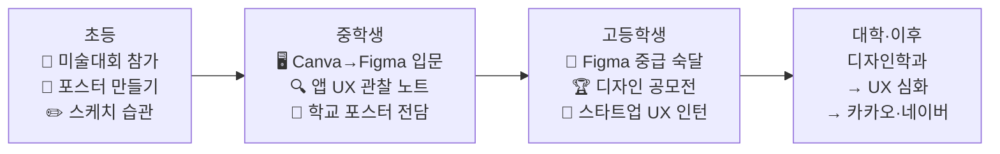

### 중등 핵심: UX 그림자 프로젝트 (중3, 1개월)

| 주차 | 활동 | 방법 | 결과물 |
|------|------|------|------|
| 1주 | 학교 도서관 앱 사용자 관찰 | 방과후 30분, 학생 5명 행동 메모 | 사용자 행동 패턴 노트 |
| 2주 | 인터뷰 실시 (학생 5명, 사서 1명) | 반구조화 인터뷰 각 20분 | 페인 포인트 8개 도출 |
| 3주 | 와이어프레임 → Figma 프로토타입 | 손 스케치 → Figma | 개선 UI 프로토타입 12화면 |
| 4주 | 사용자 테스트 + 개선 | Figma 공유 링크 | **UX 개선 제안서 학교 제출, 채택** |

### 고등 세특 + 학종 전략

| 학기 | 교과 | 세특 기록 주제 | 학종 연결 포인트 |
|------|------|------------|-------------|
| 고1 1학기 | 미술 | "사용자 중심 디자인(HCD)의 5단계 프로세스 — 우리 학교 급식 주문 UX 분석" | 진로역량: 관심 분야 깊은 탐구 |
| 고1 2학기 | 기술·가정 | "모바일 앱 인터페이스의 인체공학적 분석" | 학업역량: 교과 연계 심화 탐구 |
| 고2 1학기 | 미술창작 | "Figma로 구현한 청소년 정신건강 앱 — 기획부터 프로토타입까지" | 진로역량: 실제 프로젝트 완성 |
| 고2 2학기 | 정보 | "사용자 행동 데이터 기반 UI 개선 — A/B 테스트 설계" | 자기주도성: 교과 융합 프로젝트 |

### 디자인학과 학종 vs 실기 비교

| 비교 항목 | 학종 | 실기전형 | 추천 |
|---------|------|--------|------|
| 평가 방식 | 학생부(세특)+면접 | 기초디자인·사고의전환 | 세특 탄탄하면 학종 |
| 내신 반영 | 2~3등급 내 | 최저만 충족 | 내신 좋으면 학종 유리 |
| 포트폴리오 | 세특에 간접 반영 | 직접 제출은 불가 | - |
| 면접 | 디자인 사고 과정 질문 | 없음 | 학종은 논리적 설명 중요 |
| **핵심 팁** | 미술·정보 교과 세특에 UX 프로젝트 과정을 상세 기록 | 기초디자인 실기 학원 1년+ 필요 | 학종이 비용 효율적 |

### 핵심 성공 지표

| 지표 | 초등 달성 | 중등 달성 | 고등 달성 |
|------|---------|---------|---------|
| 디자인 작업물 | 학교 포스터 10장 | Figma 프로토타입 3개 | 케이스 스터디 5개 |
| 도구 숙련도 | 손 스케치 | Canva 중급 → Figma 입문 | Figma 고급, Photoshop 중급 |
| 포트폴리오 | - | SNS 계정 개설 | Behance 5,000+ 조회 |
| 총 투자 비용 | 약 5만원 | 약 10만원 | 약 30만원 |

---

## 커리어 04: 웹툰작가 / 일러스트레이터

> **Holland**: 예술형(A) + 현실형(R) | **에너지 키워드**: 스토리 설계, 캐릭터 창작, 디지털 드로잉
> **대입 경로**: 만화애니메이션학과 / 시각디자인학과 / 디지털아트학과
> **핵심 전형**: 실기전형 50%+ / 학종 30%+ / 수시 실적기반

### 초등 → 고등 핵심 여정

| 단계 | 시기 | 핵심 활동 | 도구/비용 | 성과 |
|------|------|---------|---------|------|
| 그림 습관 형성 | 초3~5 | 매일 30분 스케치, 미술 학원 3년 | 월 6만원 | 교내 미술대회 3회 입상 |
| 디지털 전환 | 초6 | iPad+Procreate 독학, 디지털 드로잉 | iPad 60만원, Procreate 1.5만원 | 디지털 드로잉 일상화 |
| 4컷 만화 제작 | 중1 | 클립스튜디오 입문, 4컷 만화 20편 완성 | 클립스튜디오 월 5천원 | 4컷 만화 20편 |
| 웹툰 스토리 훈련 | 중2 | 좋아하는 웹툰 5편 구조 분석, 단편 2편 완성 | 무료 | 단편 웹툰 2편 완성 |
| 네이버 도전만화 | 중3 | 10화 분량 웹툰 연재 시작 | 네이버 도전만화 무료 | 구독자 확보 시작 |
| 클립스튜디오 심화 | 고1 | 배경·효과·색보정 고급 기술, 포토샵 병행 | 클립스튜디오 프로 3만원 | 작화 퀄리티 상승 |
| 공모전 도전 | 고2 | 네이버웹툰 공모전 / 카카오 오픈 챌린지 참가 | 무료 | **공모전 입상**, 연재 기회 |
| 대입 | 고3 | 포트폴리오 북(단편 3편+연재물 발췌) 완성 | 인쇄 5만원 | 만화애니메이션학과 합격 |

### 학종 세특 전략 — 웹툰작가의 교과 연결

| 교과 | 세특 기록 주제 | 연결 역량 |
|------|------------|---------|
| **국어(문학)** | "서사 구조 분석 — 고전소설의 기승전결과 웹툰 연출의 공통점" | 스토리텔링 능력 |
| **미술창작** | "디지털 드로잉 기법과 전통 수채화 기법의 융합 실험" | 창작 기술 |
| **영어** | "글로벌 웹툰 시장 분석 — 네이버웹툰 영문판 번역 사례 연구" | 글로벌 시야 |
| **사회문화** | "웹툰이 10대 문화에 미치는 영향 — 설문 조사 기반 분석" | 사회적 관심 |

### 핵심 성공 지표

| 지표 | 초등 달성 | 중등 달성 | 고등 달성 |
|------|---------|---------|---------|
| 그림 실력 | 스케치 습관 형성 | 디지털 드로잉 중급 | 프로 수준 채색·연출 |
| 완성 작품 | 스케치북 10권 | 단편 2편 + 4컷 20편 | 연재물 10화+ 완결 |
| 플랫폼 활동 | - | 도전만화 연재 시작 | 구독자 확보, 공모전 입상 |
| 총 투자 비용 | 약 120만원(학원+iPad) | 약 10만원 | 약 10만원 |

---

## 커리어 19: 건축가 / 건축설계사

> **Holland**: 예술형(A) + 현실형(R) | **에너지 키워드**: 공간 설계, 3D 모델링, 구조와 미학의 융합
> **대입 경로**: 건축학과(5년제) / 건축공학과(4년제)
> **핵심 전형**: 학종 40%+ / 실기전형 30%+ / 정시

### 초등 → 고등 전체 커리어패스

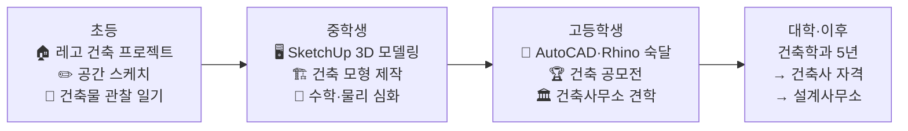

### 중등 핵심: 학교 공간 재설계 프로젝트 (중3, 1개월)

| 주차 | 활동 | 방법 | 결과물 |
|------|------|------|------|
| 1주 | 학교 공간 사용 패턴 관찰 (복도·도서관·운동장) | 동선 분석, 학생 설문 30명 | 공간 사용 분석 보고서 |
| 2주 | 해외 학교 건축 사례 리서치 (핀란드·덴마크) | 인터넷 조사 | 사례 비교 분석표 |
| 3주 | SketchUp으로 도서관 리모델링 3D 모델 제작 | SketchUp 무료 | 3D 모델 + 도면 |
| 4주 | 교장 선생님께 공간 개선 제안서 발표 | PPT 발표 | **제안서 채택, 교내 공간 개선 반영** |

### 고등 세특 + 학종 전략

| 학기 | 교과 | 세특 기록 주제 | 학종 포인트 |
|------|------|------------|---------|
| 고1 1학기 | 미술 | "르코르뷔지에의 건축 5원칙과 현대 공공건축 분석" | 건축 이론 이해 |
| 고1 2학기 | 물리학Ⅰ | "건축 구조역학 기초 — 트러스와 아치의 힘 분산 원리" | 과학+건축 융합 |
| 고2 1학기 | 미적분 | "BIM(Building Information Modeling)과 건축에서의 수학적 최적화" | 디지털 건축 이해 |
| 고2 2학기 | 기술·가정 | "제로에너지 건축물 설계 — 패시브하우스 원리와 한국 적용" | 친환경 건축 역량 |

### 건축학과 학종 합격 핵심

| 전략 요소 | 구체적 방법 | 중요도 |
|---------|---------|-------|
| **공간 감각 포트폴리오** | 스케치→3D모델링→모형 제작의 성장 과정 | ★★★★★ |
| **세특 교과 연결** | 미술·수학·물리 교과에서 건축 탐구 기록 | ★★★★★ |
| **내신** | 수학·물리 1~2등급, 미술 A등급 | ★★★★☆ |
| **대회** | 건축 공모전·모형 대회 수상 | ★★★★☆ |

### 핵심 성공 지표

| 지표 | 초등 달성 | 중등 달성 | 고등 달성 |
|------|---------|---------|---------|
| 설계 작업물 | 레고 건축 10개 | SketchUp 모델 5개 | AutoCAD 도면 + 모형 |
| 도구 숙련도 | 손 스케치 | SketchUp 중급 | AutoCAD·Rhino·BIM 입문 |
| 포트폴리오 | 스케치 모음 | 3D 모델 포트폴리오 | 설계 케이스 스터디 5개 |
| 총 투자 비용 | 약 10만원 | 약 10만원 | 약 25만원 |

---

## 커리어 20: 영화·영상 감독 / PD

> **Holland**: 예술형(A) + 기업형(E) | **에너지 키워드**: 시나리오 구성, 촬영·연출, 팀 리더십
> **대입 경로**: 영화학과 / 영상학과 / 연극영화과
> **핵심 전형**: 실기전형 50%+ / 학종 30%+ / 정시

### 초등 → 고등 핵심 여정

| 단계 | 시기 | 핵심 활동 | 도구/비용 | 성과 |
|------|------|---------|---------|------|
| 영상 감각 형성 | 초4~5 | 스마트폰 단편 영상 촬영, 학교 행사 기록 | 스마트폰 | 1분 영상 10편 |
| 스토리보드 훈련 | 초6 | 좋아하는 영화 장면 분석, 스토리보드 그리기 | 노트 무료 | 영화 분석 노트 5편 |
| 편집 입문 | 중1 | 캡컷→프리미어 프로 입문, 5분 단편 완성 | 프리미어 학생 무료 | 단편 영상 3편 |
| 시나리오 쓰기 | 중2 | 단편 시나리오 3편 완성, 학교 영상 동아리 | 무료 | 시나리오 3편 |
| 교내 영화제 | 중3 | 15분 단편 영화 촬영·편집·출품 | 장비 대여 5만원 | **교내 영화제 최우수작** |
| 전국 청소년 영화제 | 고1 | 전국 청소년 영화제 출품, 촬영 장비 숙련 | 카메라 대여 | 영화제 출품 |
| 공모전 수상 | 고2 | 전국 청소년 영화제 / 부산국제단편영화제 | 제작비 10만원 | **영화제 수상**, 연출작 5편 |
| 대입 | 고3 | 포트폴리오 (단편 3편 + 시나리오), 실기 면접 | 포트폴리오 제작 5만원 | **영화학과 합격** |

### 학종 세특 전략 — 영상감독의 교과 연결

| 교과 | 세특 기록 주제 | 연결 역량 |
|------|------------|---------|
| **국어(문학)** | "영화 시나리오의 서사 구조 — 3막 구조와 캐릭터 아크 분석" | 스토리텔링 |
| **영상제작(선택)** | "조명과 색보정의 심리적 효과 — 봉준호 감독 작품 분석" | 연출 기술 |
| **사회문화** | "한국 영화 산업의 글로벌 경쟁력 — OTT 시대의 변화" | 산업 이해 |
| **영어** | "오스카 수상작 영문 시나리오 분석 — Parasite vs Everything Everywhere" | 글로벌 시야 |

### 핵심 성공 지표

| 지표 | 초등 달성 | 중등 달성 | 고등 달성 |
|------|---------|---------|---------|
| 영상 제작 | 1분 영상 10편 | 단편 영화 3편 (15분) | 연출작 5편, 시나리오 5편 |
| 편집 역량 | 스마트폰 편집 | 프리미어 중급 | 프리미어+다빈치리졸브 고급 |
| 수상 경력 | - | 교내 영화제 최우수작 | **전국 청소년 영화제 수상** |
| 총 투자 비용 | 약 3만원 | 약 10만원 | 약 20만원 |

---

# 💻 기술 왕국 — 앱개발자 & 데이터사이언티스트

---

## 커리어 05: 앱/웹 개발자 (풀스택)

> **Holland**: 현실형(R) + 탐구형(I) | **에너지 키워드**: 코드 디버깅, 서비스 구현, 사용자 피드백
> **대입 경로**: 컴퓨터공학과 / 소프트웨어학과 / 정보통신학과
> **핵심 전형**: 학종 40%+ / SW특기자 / 정시

### 초등 → 고등 전체 커리어패스

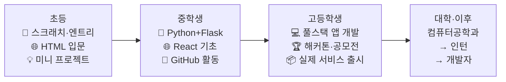

### 중등 단계 핵심 프로젝트 (중2: 학교 급식 알림 앱)

| 단계 | 기간 | 작업 내용 | 도구 | 결과 |
|------|------|---------|------|------|
| 기획 | 1주 | 학교 급식 불편 사항 설문 30명 | Google Forms | 불편 사항 5가지 도출 |
| 설계 | 1주 | 화면 설계 (와이어프레임 8장) | Figma | 앱 설계서 완성 |
| 개발 | 4주 | Python Flask + HTML/CSS 구현 | VSCode, Flask | 급식 알림 웹앱 v1.0 |
| 배포 | 1주 | 학교 서버에 배포, 친구 50명 사용 | Heroku 무료 | **실제 사용자 50명 확보** |
| 개선 | 2주 | 피드백 반영 UI 수정 + 기능 추가 | GitHub | v1.1 업데이트 |

### 고등 세특 + 학종 전략

| 학기 | 교과 | 세특 기록 주제 | 구체적 내용 |
|------|------|------------|---------|
| 고1 1학기 | 정보 | "Flask API 설계와 RESTful 원칙" | 학교 Q&A 챗봇 API 설계 과정 기술 |
| 고1 2학기 | 수학Ⅱ | "최적화 문제와 프로그래밍 — 알고리즘 시간복잡도 분석" | 수학적 사고와 코딩의 연결 |
| 고2 1학기 | 프로그래밍 | "React Native로 구현한 학교 커뮤니티 앱 — 개발 전 과정 기록" | 기획·설계·구현·배포·사용자 피드백 |
| 고2 2학기 | 영어 | "GitHub 오픈소스 기여 경험 — 글로벌 개발자 협업" | 영어 코드리뷰·PR 과정 |

### SW특기자 전형 vs 학종 비교

| 비교 항목 | SW특기자 | 학종 | 추천 |
|---------|--------|------|------|
| 주요 대학 | 성균관대, 숭실대, 한양대(ERICA) | 서울대, 카이스트, 포스텍 | 상위권은 학종 |
| 평가 핵심 | 개발 포트폴리오 + 면접 | 학생부(세특) + 면접 | 코딩 실력 있으면 SW특기자 |
| GitHub 활용 | 포트폴리오에 직접 제출 | 세특에 간접 기록 | GitHub 레포 정리 필수 |
| 내신 비중 | 최저만 충족 | 2~3등급 이내 | 내신 좋으면 학종 유리 |

### 핵심 성공 지표

| 지표 | 초등 달성 | 중등 달성 | 고등 달성 |
|------|---------|---------|---------|
| 프로그래밍 언어 | Scratch, HTML/CSS | Python, JavaScript, SQL | React, Node.js, Flutter |
| 완성 프로젝트 | 미니게임 5개 | 웹앱 3개 | 서비스 2개 출시 |
| GitHub | 계정 개설 | 레포 10개, 커밋 200+ | 레포 20개+, Stars 100+ |
| 대회 | 교내 코딩대회 | IT 공모전 입상 | **전국 해커톤 수상** |
| 총 투자 비용 | 약 5만원 | 약 10만원 | 약 15만원 |

---

## 커리어 06: 데이터 사이언티스트

> **Holland**: 탐구형(I) + 관습형(C) | **에너지 키워드**: 데이터 패턴 발견, 통계 모델링, 시각화
> **대입 경로**: 통계학과 / 산업공학과 / 데이터사이언스학과
> **핵심 전형**: 학종 50%+ / 정시 (수학 강조)

### 초등 → 고등 핵심 여정

| 단계 | 시기 | 핵심 활동 | 도구/비용 | 성과 |
|------|------|---------|---------|------|
| 수학 경시대회 | 초4~6 | KMO 예선 준비, 수학 심화 | 교재 3만원 | **수학 경시대회 지역 입상** |
| 엑셀 데이터 분석 | 중1 | 학급 성적 트렌드 분석, 그래프 제작 | Excel 무료 | 학급 분석 보고서 |
| Python + pandas | 중2 | 공공데이터포털 활용 서울 미세먼지 분석 | Python 무료 | **교내 과학전 데이터 시각화 우수상** |
| 시각화 심화 | 중3 | Matplotlib, Seaborn, 대시보드 제작 | Python 무료 | 교내 과학전 발표 |
| 캐글 입문 | 고1 | Titanic 생존 예측 (캐글 입문 대회) | Kaggle 무료 | 캐글 첫 메달 (Bronze) |
| ML 모델링 | 고2 | 캐글 경진대회 3회, 팀 구성 | Colab 무료 | **캐글 상위 5%**, Expert 등급 |
| 기업 인턴 | 고2 여름 | 데이터분석팀 방학 인턴 4주 | - | 실무 데이터 분석 경험 |
| 대입 완성 | 고3 | GitHub 포트폴리오 정리 | GitHub, Notion | **통계학과 합격** |

### 고등 세특 전략 — 데이터사이언스 교과 연결

| 학기 | 교과 | 세특 기록 주제 | 학종 평가 포인트 |
|------|------|------------|-------------|
| 고1 1학기 | 확률과통계 | "베이즈 정리를 활용한 스팸 메일 분류기 설계 원리" | 학업역량: 교과 개념의 실생활 적용 |
| 고1 2학기 | 정보 | "공공데이터로 분석한 서울시 교통사고 패턴" | 진로역량: 데이터 분석 프로젝트 |
| 고2 1학기 | 미적분 | "경사하강법의 수학적 원리 — 머신러닝 최적화와의 연결" | 학업역량: 수학과 AI의 융합 이해 |
| 고2 2학기 | 경제 | "주가 데이터 시계열 분석과 예측 모델 비교" | 진로역량: 실전 데이터 분석 역량 |

### 핵심 성공 지표

| 지표 | 초등 달성 | 중등 달성 | 고등 달성 |
|------|---------|---------|---------|
| 수학 역량 | KMO 예선 | 통계 기초 완성 | 대학 수준 통계학 이해 |
| 데이터 분석 | - | Excel→Python 전환 | 캐글 Expert |
| 분석 보고서 | - | 3편 | 10편+ |
| 대회 | 수학 경시 입상 | 교내 과학전 수상 | 캐글 상위 5% |
| 총 투자 비용 | 약 5만원 | 약 5만원 | 약 10만원 |

---

## 커리어 21: 정보보안전문가 (화이트해커 / 사이버보안 엔지니어)

> **Holland**: 탐구형(I) + 현실형(R) | **에너지 키워드**: 취약점 분석, 보안 아키텍처, CTF 대회
> **대입 경로**: 정보보호학과 / 컴퓨터공학과 / 사이버보안학과
> **핵심 전형**: 학종 40%+ / SW특기자 / 정시

### 초등 → 고등 전체 커리어패스

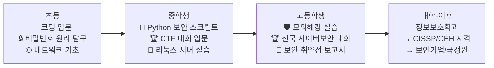

### 중등 단계 핵심 프로젝트 (중2: 학교 네트워크 보안 점검)

| 단계 | 기간 | 작업 내용 | 도구 | 결과 |
|------|------|---------|------|------|
| 학습 | 2주 | 네트워크 기초 (TCP/IP, DNS) 이해 | 무료 강의 | 네트워크 개념 정리 |
| 분석 | 2주 | 학교 와이파이 보안 설정 분석 (교사 허가 하) | Wireshark 무료 | 보안 취약점 5개 도출 |
| 제안 | 1주 | 보안 개선 제안서 작성, 비밀번호 정책 제안 | PPT | **보안 개선 제안서 채택** |
| CTF | 2주 | picoCTF (초급 CTF 대회) 참가 | 무료 | CTF 100문제 풀이 |

### 고등 세특 + 학종 전략

| 학기 | 교과 | 세특 기록 주제 | 학종 포인트 |
|------|------|------------|---------|
| 고1 1학기 | 정보 | "암호학의 수학적 기초 — RSA 알고리즘의 소인수분해 원리" | 보안+수학 융합 |
| 고1 2학기 | 수학Ⅱ | "정수론과 암호화 — 모듈러 연산의 정보보안 적용" | 학업역량 심화 |
| 고2 1학기 | 프로그래밍 | "Python으로 구현한 웹 취약점 스캐너 — OWASP Top 10 분석" | 실전 보안 프로젝트 |
| 고2 2학기 | 사회문화 | "개인정보 유출 사고의 사회적 비용 — 한국 사례 분석" | 보안의 사회적 의미 |

### 핵심 성공 지표

| 지표 | 초등 달성 | 중등 달성 | 고등 달성 |
|------|---------|---------|---------|
| 프로그래밍 | Scratch, HTML | Python, Linux 기초 | 보안 스크립트, 해킹 도구 |
| CTF 성적 | - | picoCTF 100문제 | **전국 CTF 입상** |
| 보안 프로젝트 | - | 학교 보안 점검 | 취약점 보고서 3편 |
| 총 투자 비용 | 약 5만원 | 약 5만원 | 약 15만원 |

---

## 커리어 22: 로봇공학자 (로봇 엔지니어 / 자율주행 연구원)

> **Holland**: 현실형(R) + 탐구형(I) | **에너지 키워드**: 로봇 설계, 센서 제어, 하드웨어+소프트웨어 융합
> **대입 경로**: 기계공학과 / 로봇공학과 / 전자공학과
> **핵심 전형**: 학종 50%+ / 정시

### 초등 → 고등 전체 커리어패스

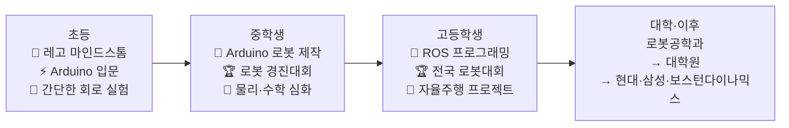

### 초등~중등 핵심 여정

| 단계 | 시기 | 핵심 활동 | 도구/비용 | 성과 |
|------|------|---------|---------|------|
| 레고 로봇 | 초4~5 | 레고 마인드스톰 EV3 조립·프로그래밍 | EV3 세트 40만원 | 미로 탈출 로봇 완성 |
| Arduino 입문 | 초6 | LED 제어, 센서 활용 기초 프로젝트 | Arduino 키트 3만원 | 장애물 감지 자동차 |
| 라인트레이서 | 중1 | 적외선 센서 기반 라인 따라가기 로봇 | 추가 부품 2만원 | **교내 로봇대회 1등** |
| 쓰레기 분류 로봇 | 중2 | 카메라+ML로 재활용 분류 로봇 프로토타입 | 라즈베리파이 8만원 | **IT 공모전 장려상** |
| 드론 제작 | 중3 | 자작 드론 조립·비행 프로그래밍 | 드론 키트 10만원 | 자작 드론 비행 성공 |

### 고등 세특 전략

| 학기 | 교과 | 세특 기록 주제 | 학종 포인트 |
|------|------|------------|---------|
| 고1 1학기 | 물리학Ⅰ | "로봇 팔의 역기구학 — 관절 각도 계산의 물리적 원리" | 물리+로봇 융합 |
| 고1 2학기 | 정보 | "Python+OpenCV로 구현한 물체 인식 로봇 — 컴퓨터 비전 입문" | SW+HW 융합 |
| 고2 1학기 | 미적분 | "PID 제어기의 미적분 원리 — 자율주행 로봇 경로 최적화" | 수학의 공학 적용 |
| 고2 2학기 | 프로그래밍 | "ROS 기반 서비스 로봇 프로토타입 — 교내 안내 로봇 개발" | 실전 프로젝트 |

### 핵심 성공 지표

| 지표 | 초등 달성 | 중등 달성 | 고등 달성 |
|------|---------|---------|---------|
| 로봇 제작 | 레고 로봇 3개 | Arduino 로봇 5개 | ROS 로봇 2개 |
| 수상 경력 | - | 교내 1등, 공모전 장려상 | **전국 로봇대회 수상** |
| 프로그래밍 | Scratch, 블록코딩 | Python, C++ 기초 | ROS, OpenCV, ML |
| 총 투자 비용 | 약 45만원 | 약 25만원 | 약 30만원 |

---

# 🌱 자연 왕국 — 환경공학자 & 수의사

---

## 커리어 07: 환경공학자 / ESG 전문가

> **Holland**: 탐구형(I) + 현실형(R) | **에너지 키워드**: 환경 데이터 시각화, 오염 측정, 정책 제안
> **대입 경로**: 환경공학과 / 지구환경과학과 / 에너지자원공학과
> **핵심 전형**: 학종 50%+ / 정시

### 초등 → 고등 전체 커리어패스

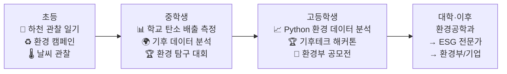

### 중등 핵심 프로젝트: 학교 탄소 배출 측정 (중2)

| 단계 | 내용 | 기간 | 도구 | 결과 |
|------|------|------|------|------|
| 문제 정의 | 학교 건물 에너지 사용 현황 파악 | 1주 | 전기 계량기, 메모 | 월간 전기 사용량 데이터 수집 |
| 데이터 수집 | 교실별 조명·PC·에어컨 사용 시간 기록 | 4주 | Excel, 설문조사 | 3개월 데이터 확보 |
| 분석 | 탄소 환산 계산, 가장 낭비 심한 구역 특정 | 2주 | Excel 그래프 | "3학년 복도 조명이 전체의 23% 차지" |
| 제안서 작성 | 교장 선생님께 에너지 절약 방안 제출 | 1주 | PPT, 보고서 | **제안서 채택, 교내 절전 캠페인** |
| 결과 측정 | 3개월 후 에너지 10% 감소 확인 | 3개월 | 전기 계량기 | 학교 언론 보도 |

### 고등 세특 전략

| 학기 | 교과 | 세특 기록 주제 | 학종 포인트 |
|------|------|------------|---------|
| 고1 1학기 | 지구과학Ⅰ | "우리 지역 대기질 데이터 10년 추이 분석" | 데이터 기반 환경 탐구 |
| 고1 2학기 | 화학Ⅰ | "미세플라스틱의 화학적 분해 메커니즘 탐구" | 과학적 분석력 |
| 고2 1학기 | 환경(선택) | "학교 옥상 태양광 패널 설치 경제성·환경성 비교 분석" | 정책 제안 역량 |
| 고2 2학기 | 정보 | "Python으로 분석한 전국 수질 데이터 패턴" | 디지털 분석 역량 |

### 환경공학과 학종 합격 핵심

| 전략 요소 | 구체적 방법 | 중요도 |
|---------|---------|-------|
| **환경 프로젝트 일관성** | 초등 관찰 → 중등 데이터 측정 → 고등 분석·제안의 성장 스토리 | ★★★★★ |
| **세특 교과 연결** | 화학·지구과학·정보 교과에서 환경 데이터 탐구 기록 | ★★★★★ |
| **실천 활동** | 학교 절전 캠페인, 환경 동아리, 기후 행동 기록 | ★★★★☆ |
| **대회** | 환경부 공모전, 기후테크 해커톤 | ★★★★☆ |

### 핵심 성공 지표

| 지표 | 초등 달성 | 중등 달성 | 고등 달성 |
|------|---------|---------|---------|
| 환경 관찰 | 하천 관찰 일기 2년 | 탄소 측정 프로젝트 | Python 환경 데이터 분석 |
| 환경 활동 | 캠페인 참여 3회 | 학교 절전 캠페인 주도 | 기후테크 해커톤 우승 |
| 보고서 | 관찰 일기 | 탄소 측정 보고서 | 환경 분석 리포트 3편 |
| 총 투자 비용 | 약 3만원 | 약 5만원 | 약 15만원 |

---

## 커리어 08: 수의사

> **Holland**: 탐구형(I) + 사회형(S) | **에너지 키워드**: 동물 공감, 진료 관찰, 생명과학 탐구
> **대입 경로**: 수의과대학 6년 (수의예과 2년 + 수의학과 4년)
> **핵심 전형**: 정시 50%+ / 학종 40%+ (수의대 10개교 경쟁 치열)

### 초등 → 고등 핵심 여정

| 단계 | 시기 | 핵심 활동 | 도구/비용 | 성과 |
|------|------|---------|---------|------|
| 동물 관찰 일기 | 초3~4 | 반려동물 행동 관찰 일기, 동물원 관찰 | 노트 무료 | 관찰 일기 2년분 |
| 동물 봉사 | 초5~6 | 유기동물 보호소 봉사 월 2회, 과학탐구 (동물 행동) | 교통비 | 봉사 50시간, **교내 과학전 금상** |
| 생명과학 심화 | 중1 | 해부 실험(가상), 동물 분류학 독서 | 가상 해부 앱 무료 | 동물 분류 보고서 |
| 동물 행동학 탐구 | 중2 | "반려견 분리불안의 행동 패턴 분석" 탐구 보고서 | 논문 무료 | 동물 행동 탐구 보고서 |
| 수의 현장 탐방 | 중3 | 동물병원 견학 2회, 수의사 인터뷰 | 교통비 | 수의사 인터뷰 보고서 |
| 생명과학Ⅱ 심화 | 고1 | 생명과학Ⅱ·화학Ⅱ 내신 1등급, 동물 복지 에세이 | 교재비 | 내신 1등급, 에세이 |
| 수의 관련 R&E | 고2 | 대학 수의학과 R&E 참여, "반려동물 영양학" 연구 | 연구 참가 무료 | R&E 연구 보고서, **과학전 수상** |
| 대입 완성 | 고3 | 수시 6장 (수의대 학종+정시 병행), 면접 대비 | - | **수의대 합격** |

### 수의대 학종 합격 핵심 전략

| 전략 요소 | 구체적 방법 | 중요도 |
|---------|---------|-------|
| **내신** | 생명과학·화학 1등급 필수, 전체 1~2등급 | ★★★★★ |
| **생명 탐구 일관성** | 초등 동물 관찰 → 중등 행동 탐구 → 고등 수의학 R&E | ★★★★★ |
| **세특** | 생명과학·화학 교과에서 동물·수의학 관련 심화 탐구 | ★★★★★ |
| **봉사** | 동물 보호소·동물 복지 봉사 누적 | ★★★★☆ |
| **면접** | 동물 윤리 (실험동물·공장식 축산·안락사), 원헬스(One Health) 개념 | ★★★★★ |
| **수능** | 수의대 정시 비중 높으므로 수능 최저 충족 필수 | ★★★★★ |

### 수의대 면접 빈출 주제 TOP 5

| # | 면접 주제 | 준비 방법 |
|---|---------|---------|
| 1 | "동물 실험은 윤리적으로 허용되는가?" | 3R원칙(Replace, Reduce, Refine) 이해 |
| 2 | "반려동물 과잉 진료 문제에 대한 의견" | 수의 의료 윤리 + 경제적 접근성 |
| 3 | "인수공통감염병(원헬스) 시대 수의사의 역할" | COVID-19 사례 + One Health 개념 |
| 4 | "공장식 축산의 동물 복지 문제" | 동물 복지 5대 자유 원칙 |
| 5 | "수의사가 되려는 이유와 어떤 수의사가 되고 싶은가?" | 개인 경험 (봉사·관찰·연구) 기반 스토리 |

### 핵심 성공 지표

| 지표 | 초등 달성 | 중등 달성 | 고등 달성 |
|------|---------|---------|---------|
| 동물 관찰 | 관찰 일기 2년 | 행동 탐구 보고서 | R&E 연구 |
| 봉사 | 보호소 50시간 | 80시간 누적 | 150시간 누적 |
| 과학 탐구 | 교내 과학전 금상 | 동물 행동 탐구 | 과학전 수상 + R&E |
| 내신 | - | - | 생명과학·화학 1등급 |
| 총 투자 비용 | 약 5만원 | 약 5만원 | 약 20만원 |

---

## 커리어 23: 스마트팜 전문가 / 농업기술(AgTech) 엔지니어

> **Holland**: 현실형(R) + 탐구형(I) | **에너지 키워드**: IoT 센서, 데이터 기반 재배, 식량 문제 해결
> **대입 경로**: 농업생명과학과 / 바이오시스템공학과 / 식물생명과학과
> **핵심 전형**: 학종 50%+ / 정시

### 초등 → 고등 전체 커리어패스

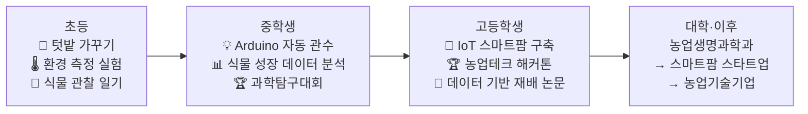

### 중등 핵심 프로젝트: Arduino 자동 관수 시스템 (중2)

| 단계 | 기간 | 작업 내용 | 도구 | 결과 |
|------|------|---------|------|------|
| 학습 | 2주 | 토양 수분 센서·펌프 제어 원리 학습 | Arduino 키트 3만원 | 센서 작동 이해 |
| 제작 | 3주 | 토양 수분 감지 → 자동 물 공급 시스템 제작 | 센서+펌프 2만원 | 자동 관수 시스템 완성 |
| 실험 | 4주 | 자동 관수 vs 수동 관수 식물 성장 비교 실험 | 화분 4개 | 데이터 비교 보고서 |
| 발표 | 1주 | 교내 과학전 발표 | PPT | **교내 과학전 금상** |

### 고등 세특 전략

| 학기 | 교과 | 세특 기록 주제 | 학종 포인트 |
|------|------|------------|---------|
| 고1 1학기 | 생명과학Ⅰ | "식물 호르몬(옥신)과 LED 파장이 수경재배 성장에 미치는 영향" | 생물학+농업 융합 |
| 고1 2학기 | 정보 | "라즈베리파이+IoT 센서로 구축한 미니 스마트팜 — 온도·습도·광량 자동 제어" | 기술+농업 융합 |
| 고2 1학기 | 환경(선택) | "수직 농장(Vertical Farm)의 환경적·경제적 타당성 분석" | 미래 농업 비전 |
| 고2 2학기 | 경제 | "한국 농업의 고령화 문제와 스마트팜 솔루션 — 비용·수익 분석" | 사회 문제 인식 |

### 핵심 성공 지표

| 지표 | 초등 달성 | 중등 달성 | 고등 달성 |
|------|---------|---------|---------|
| 재배 경험 | 텃밭 1년 관찰 일기 | 자동 관수 시스템 제작 | IoT 스마트팜 구축·운영 |
| 기술 역량 | - | Arduino 기초 | 라즈베리파이+IoT+데이터분석 |
| 수상 경력 | 교내 관찰 일기 상 | 과학전 금상 | **농업테크 해커톤 수상** |
| 총 투자 비용 | 약 3만원 | 약 8만원 | 약 20만원 |

---

## 커리어 24: 해양생물학자 / 해양환경 연구원

> **Holland**: 탐구형(I) + 현실형(R) | **에너지 키워드**: 해양 생태 조사, 수중 관찰, 해양 데이터 분석
> **대입 경로**: 해양생물학과 / 해양학과 / 지구환경과학과 → 대학원(석·박사)
> **핵심 전형**: 학종 50%+ / 정시

### 초등 → 고등 핵심 여정

| 단계 | 시기 | 핵심 활동 | 도구/비용 | 성과 |
|------|------|---------|---------|------|
| 바다 관찰 습관 | 초3~5 | 해변 생물 관찰 일기, 갯벌 체험 프로그램 | 교통비+체험비 5만원 | 관찰 일기 2년, 생물 도감 제작 |
| 수중 생태 입문 | 초6 | 아쿠아리움 봉사, 《침묵의 바다》 독서 | 봉사 무료 | 해양 생물 관찰 보고서 |
| 갯벌 생태 조사 | 중1 | 지역 갯벌 생물 종 조사, 분류 보고서 | 관찰 도구 2만원 | **교내 과학전 우수상** |
| 미세플라스틱 탐구 | 중2 | 해수면 미세플라스틱 농도 측정 프로젝트 | 현미경, 필터 | 미세플라스틱 분석 보고서 |
| 해양 데이터 분석 | 중3 | Python으로 해양 수온·염분 데이터 시각화 | Python 무료 | 해양 환경 변화 리포트 |
| 해양생태 R&E | 고1~2 | 대학 해양학과 R&E 참여, 해양 산성화 연구 | 연구 참가 무료 | **R&E 연구 보고서, 과학전 수상** |
| 환경 공모전 | 고2 | 해양환경부 공모전, 해양 쓰레기 솔루션 제안 | 무료 | **장관상 또는 우수상** |
| 대입 | 고3 | 해양생물학과 학종 수시, 면접 | - | **해양학과 합격** |

### 고등 세특 전략

| 학기 | 교과 | 세특 기록 주제 | 학종 포인트 |
|------|------|------------|---------|
| 고1 1학기 | 지구과학Ⅰ | "해양 산성화가 산호초 생태계에 미치는 영향 — 데이터 분석" | 과학적 분석력 |
| 고1 2학기 | 생명과학Ⅰ | "조간대 생물의 환경 적응 전략 — 갯벌 현장 조사 보고서" | 현장 연구 역량 |
| 고2 1학기 | 환경(선택) | "해양 미세플라스틱 오염 현황과 해결 방안 — 국내외 정책 비교" | 환경 정책 이해 |
| 고2 2학기 | 정보 | "Python으로 분석한 동해 수온 10년 변화 패턴 — 기후변화와의 연관성" | 데이터 분석 역량 |

### 핵심 성공 지표

| 지표 | 초등 달성 | 중등 달성 | 고등 달성 |
|------|---------|---------|---------|
| 해양 관찰 | 관찰 일기 2년, 생물 도감 | 갯벌 조사, 미세플라스틱 분석 | R&E 연구, 해양 데이터 분석 |
| 수상 경력 | - | 과학전 우수상 | **R&E + 해양환경 공모전 수상** |
| 독서·논문 | 교양서 3권 | 해양과학 도서 5권 | 해양 논문 리딩 10편+ |
| 총 투자 비용 | 약 8만원 | 약 5만원 | 약 15만원 |

---

## 상편 핵심 요약 — 16개 직업 × 학종 전략 한눈에 보기

| # | 직업 | 학종 핵심 세특 키워드 | 필수 선택과목 | 대입 추천 전형 | 면접 핵심 |
|---|------|------------------|-----------|------------|---------|
| 01 | 의사 | 건강 불평등, AI 의료 윤리 | 생명과학Ⅱ, 화학Ⅱ, 보건 | 정시+학종 | MMI(의료 윤리) |
| 02 | AI연구원 | Transformer, 오픈소스 기여 | 인공지능수학, 정보, 프로그래밍 | 학종+SW특기자 | AI 기술·사회적 영향 |
| 17 | 약사 | 약물 상호작용, 신약 개발 | 화학Ⅱ, 생명과학Ⅱ, 보건 | 정시+학종 | 약학 윤리·약물 오남용 |
| 18 | 생명공학연구원 | CRISPR, 바이오인포매틱스 | 생명과학Ⅱ, 화학Ⅱ, 정보 | 학종+정시 | 유전자 편집 윤리 |
| 03 | UX디자이너 | HCD, 사용자 리서치 | 미술창작, 디자인, 정보 | 학종+실기 | 디자인 사고 과정 |
| 04 | 웹툰작가 | 서사 구조, 디지털 드로잉 | 미술창작, 문학, 매체미술 | 실기+학종 | 포트폴리오 발표 |
| 19 | 건축가 | BIM, 제로에너지 건축 | 물리학Ⅱ, 미적분, 미술창작 | 학종+실기 | 건축 철학·공간 감각 |
| 20 | 영화·영상감독 | 몽타주, 시나리오 구조 | 영상제작, 문학, 사회문화 | 실기+학종 | 연출 의도·작품 발표 |
| 05 | 앱개발자 | API 설계, 풀스택 개발 | 정보, 프로그래밍, 미적분 | 학종+SW특기자 | 개발 과정·협업 경험 |
| 06 | 데이터사이언티스트 | 베이즈 정리, 시계열 분석 | 확률과통계, 정보, 경제수학 | 학종+정시 | 분석 프로젝트 설명 |
| 21 | 정보보안전문가 | RSA 암호, 취약점 분석 | 정보, 프로그래밍, 수학Ⅱ | 학종+SW특기자 | 보안 윤리·사례 분석 |
| 22 | 로봇공학자 | PID 제어, 자율주행 | 물리학Ⅱ, 미적분, 정보 | 학종+정시 | 로봇 윤리·설계 과정 |
| 07 | 환경공학자 | 탄소 측정, ESG 분석 | 지구과학Ⅱ, 환경, 화학Ⅱ | 학종+정시 | 환경 정책 제안 |
| 08 | 수의사 | 동물 행동학, 원헬스 | 생명과학Ⅱ, 화학Ⅱ, 농업생명 | 정시+학종 | 동물 윤리·복지 |
| 23 | 스마트팜전문가 | IoT 센서, 수직 농장 | 농업생명, 정보, 생명과학Ⅰ | 학종+정시 | 식량 문제·기술 해법 |
| 24 | 해양생물학자 | 해양 산성화, 미세플라스틱 | 지구과학Ⅱ, 생명과학Ⅱ, 환경 | 학종+정시 | 해양 환경 보전 |

---

## 고교학점제 시대의 선택과목 전략 — 16개 직업별 추천 조합

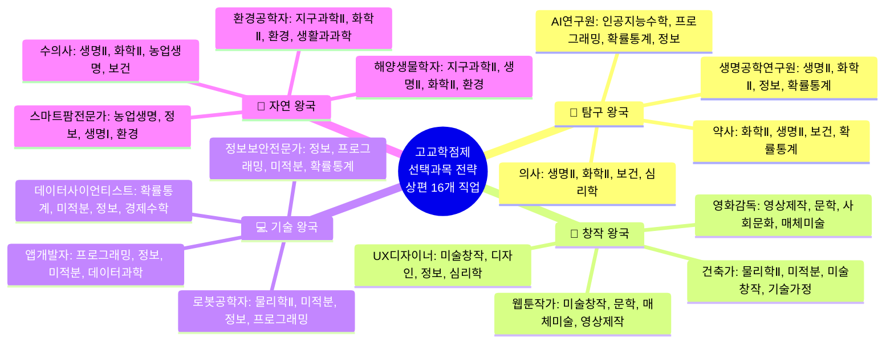

---

> **📌 하편에서 이어집니다**
> - 🤝 연결 왕국: 교사 / 심리상담사 / 간호사 / 사회복지사
> - 🏛️ 질서 왕국: 변호사 / 외교관 / 회계사·세무사 / 프로파일러·범죄분석관
> - 📣 소통 왕국: 유튜버·크리에이터 / 디지털마케터 / 방송PD·작가 / 게임기획자
> - 🚀 도전 왕국: 스타트업창업가 / 투자분석가 / 프로덕트매니저 / 경영컨설턴트
> - 2028 대입 개편안 상세 분석
> - 32개 직업 × 학종 전략 종합 비교표
> - 학부모·학생용 자가 진단 워크시트

---

*작성일: 2026년 2월 | 32대 직업 커리어패스 × 대입 학종 완전 가이드 (상) v2.0*
*참조: 커리어패스_20대_우수사례_벤치마킹_v2.md, 3단계-직업세계-게임형_커리어패스앱_기획.md*
