# AI 시대 32대 직업 커리어패스 × 대입 학종 완전 가이드 (하)
> **8개 왕국 × 대표 직업 4선 = 32개 커리어패스**
> 초등 → 중등 → 고등 → 대입까지의 실전 로드맵 + 학생부종합전형 반영 전략
> **하편: 🤝 연결 · 🏛️ 질서 · 📣 소통 · 🚀 도전 왕국 + 2028 대입 개편 + 종합 비교**

---

## 하편 수록 직업 구조도

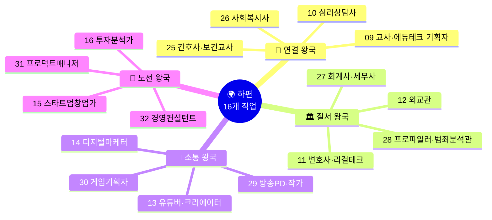

---

# 🤝 연결 왕국 — 교사 & 심리상담사

---

## 커리어 09: 교사 / 에듀테크 기획자

> **Holland**: 사회형(S) + 기업형(E) | **에너지 키워드**: 가르치기, 서비스 기획, 학생 성장 촉진
> **대입 경로**: 교육대학교(초등) / 사범대학(중등) / 교육학과 / 에듀테크 관련 학과
> **핵심 전형**: 학종(교대·사범대 중심) / 정시 / 교직이수

### 초등 → 고등 전체 커리어패스

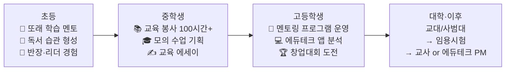

### 중등 교육 봉사 기록 (200시간 로드맵)

| 봉사 기관 | 시기 | 내용 | 시간 | 배운 점 |
|---------|------|------|------|------|
| 지역아동센터 수학 멘토링 | 중1~2 | 초4~6학년 수학 주 2회 | 60시간 | 눈높이 교육, 설명법 |
| 도서관 독서 지도 | 중2 | 초등 독서 토론 진행 | 30시간 | 토론 퍼실리테이션 |
| 다문화 학생 한국어 지도 | 중3 | 주 1회 1:1 한국어 수업 | 40시간 | 문화 공감, 맞춤 교육 |
| 온라인 학습 콘텐츠 제작 | 중3 | 유튜브 수학 풀이 영상 20편 | 50시간 | 영상 제작, 콘텐츠 기획 |
| **총계** | - | - | **180시간** | 교육 현장 이해 |

### 고등 세특 + 학종 전략

| 학기 | 교과 | 세특 기록 주제 | 학종 포인트 |
|------|------|------------|---------|
| 고1 1학기 | 교육학(선택) | "블룸의 교육목표 분류학을 적용한 수업 설계 실습" | 교육학 이론 이해 |
| 고1 2학기 | 정보 | "에듀테크 앱 10개 UX 비교 분석 — 학습 효과 차이 요인" | 디지털 리터러시 |
| 고2 1학기 | 심리학(선택) | "비고츠키 근접발달영역(ZPD)과 AI 개인 맞춤 학습의 연결" | 교육심리학 심화 |
| 고2 2학기 | 사회문화 | "한국 교육 불평등의 구조적 요인 — 지역별 학업 성취도 데이터 분석" | 사회적 관심 + 데이터 역량 |

### 교대/사범대 학종 합격 핵심

| 전략 요소 | 구체적 방법 | 중요도 |
|---------|---------|-------|
| **교육 봉사 일관성** | 초등 멘토 → 중등 봉사 → 고등 프로그램 운영의 성장 스토리 | ★★★★★ |
| **세특** | 교육학·심리학 관련 교과에서 교육 탐구 기록 | ★★★★★ |
| **리더십** | 동아리 회장, 멘토링 프로그램 주도 운영 | ★★★★☆ |
| **내신** | 교대는 전 과목 1~2등급, 사범대는 전공 관련 교과 1등급 | ★★★★★ |
| **면접** | "좋은 교사란?", "AI 시대 교사의 역할 변화" 빈출 | ★★★★★ |

### 핵심 성공 지표

| 지표 | 초등 달성 | 중등 달성 | 고등 달성 |
|------|---------|---------|---------|
| 봉사 시간 | 20시간 | 180시간 | 300시간+ |
| 교육 콘텐츠 | - | 수학 영상 20편 | 멘토링 프로그램 운영 |
| 리더십 | 반장 | 동아리 회장 | 멘토링 프로그램 총괄 |
| 총 투자 비용 | 약 3만원 | 약 5만원 | 약 10만원 |

---

## 커리어 10: 심리상담사 / 임상심리사

> **Holland**: 사회형(S) + 탐구형(I) | **에너지 키워드**: 경청, 공감, 감정 분석, 심리 검사
> **대입 경로**: 심리학과 → 대학원(임상·상담 전공) → 자격증 취득
> **핵심 전형**: 학종 50%+ / 정시

### 초등 → 고등 핵심 여정

| 단계 | 시기 | 핵심 활동 | 도구/비용 | 성과 |
|------|------|---------|---------|------|
| 공감 습관 형성 | 초3~5 | 친구 고민 들어주기, 감정 일기 쓰기 | 노트 무료 | 감정 일기 100일 |
| 심리학 입문 | 초6~중1 | 《미움받을 용기》 독서, 심리 테스트 체험 | 도서 1.5만원 | 독서 감상문 3편 |
| 또래 상담 동아리 | 중2 | 또래 상담 훈련 프로그램 이수, 동아리 활동 | 무료 | **또래 상담사 인증** |
| 심리학 독서 심화 | 중3 | 《감정은 습관이다》, 심리학 개론 선행 | 도서 3만원 | 심리학 독서 보고서 5편 |
| 감정 관찰 일지 | 고1 | 비구조화 관찰 일지 (학교 내 학생 감정 패턴 기록) | 노트 | 관찰 일지 50일분 |
| 청소년 상담 봉사 | 고1~2 | 청소년상담복지센터 봉사 인턴 | 무료 | 봉사 100시간, 사례 분석 3편 |
| 심리학 R&E | 고2 | "SNS 사용 시간과 청소년 우울감의 상관관계 분석" | 설문 도구 무료 | **R&E 연구 보고서, 교내 학술제 발표** |
| 대입 완성 | 고3 | 심리학과 학종 수시 6장, 면접 대비 | - | **심리학과 합격** |

### 심리학과 학종 세특 전략

| 학기 | 교과 | 세특 기록 주제 | 학종 포인트 |
|------|------|------------|---------|
| 고1 1학기 | 심리학(선택) | "인지행동치료(CBT)의 원리와 청소년 불안 장애 적용 사례" | 심리학 이론 깊이 |
| 고1 2학기 | 확률과통계 | "설문 조사 설계와 통계 분석 — 신뢰도·타당도의 수학적 의미" | 연구 방법론 이해 |
| 고2 1학기 | 생명과학Ⅰ | "뇌과학과 감정 — 편도체·전두엽의 역할과 심리상담의 연결" | 생물심리학 이해 |
| 고2 2학기 | 사회문화 | "SNS 시대 청소년 정신건강 실태 — 설문 데이터 분석 기반" | 사회 문제 인식 + 분석 |

### 핵심 성공 지표

| 지표 | 초등 달성 | 중등 달성 | 고등 달성 |
|------|---------|---------|---------|
| 공감 훈련 | 감정 일기 100일 | 또래 상담사 인증 | 상담 봉사 100시간 |
| 심리학 독서 | 교양서 3권 | 전문서 5권 | 논문 리딩 10편 |
| 연구 경험 | - | - | R&E 연구 보고서 |
| 총 투자 비용 | 약 2만원 | 약 5만원 | 약 10만원 |

---

## 커리어 25: 간호사 / 보건교사

> **Holland**: 사회형(S) + 탐구형(I) | **에너지 키워드**: 환자 돌봄, 건강 관리, 의료 현장 대응
> **대입 경로**: 간호학과 4년 → 간호사 면허 → 전문간호사 or 보건교사
> **핵심 전형**: 학종 40%+ / 정시 50%+ (간호학과 수능 최저 비중 높음)

### 초등 → 고등 전체 커리어패스

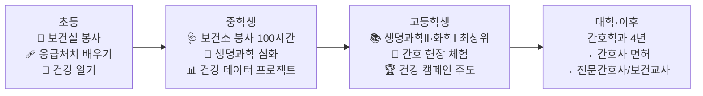

### 중등 핵심: 건강 증진 캠페인 프로젝트 (중2, 1개월)

| 주차 | 활동 | 방법 | 결과물 |
|------|------|------|------|
| 1주 | 학교 학생 건강 실태 설문 (수면·식습관·운동) | Google Forms 100명 | 건강 데이터 수집 |
| 2주 | 데이터 분석 + 건강 문제 도출 | Excel 그래프 | "수면 부족 학생 67%" 발견 |
| 3주 | "Sleep Well 캠페인" 기획 (포스터·방송) | Canva, 학교 방송 | 캠페인 자료 제작 |
| 4주 | 캠페인 실시 + 사후 설문 | 재설문 | **수면 시간 평균 30분 증가, 교내 건강 캠페인 우수상** |

### 고등 세특 + 학종 전략

| 학기 | 교과 | 세특 기록 주제 | 학종 포인트 |
|------|------|------------|---------|
| 고1 1학기 | 생명과학Ⅰ | "면역 체계의 원리와 백신의 작용 메커니즘 — mRNA 백신 심화 탐구" | 의학 지식 깊이 |
| 고1 2학기 | 보건(선택) | "학교 건강증진 프로그램 설계 — 근거기반간호(EBN)의 원리 적용" | 간호학 이론 이해 |
| 고2 1학기 | 심리학(선택) | "환자 심리 이해 — 질병 수용 5단계(퀴블러-로스)와 간호사의 역할" | 환자 공감 역량 |
| 고2 2학기 | 사회문화 | "간호 인력 부족 문제의 구조적 원인 — OECD 비교 데이터 분석" | 사회 문제 인식 |

### 간호학과 학종 합격 핵심

| 전략 요소 | 구체적 방법 | 중요도 |
|---------|---------|-------|
| **내신** | 생명과학·화학 1등급, 전체 2등급 이내 | ★★★★★ |
| **봉사 일관성** | 보건실·병원·요양원 봉사 누적 150시간+ | ★★★★★ |
| **세특** | 생명과학·보건 교과에서 건강·간호 탐구 기록 | ★★★★★ |
| **면접** | 간호 윤리 (환자 자율성·비밀유지), 감염관리 | ★★★★★ |
| **수능** | 간호학과 수능 최저 높으므로 수능 대비 필수 | ★★★★★ |

### 핵심 성공 지표

| 지표 | 초등 달성 | 중등 달성 | 고등 달성 |
|------|---------|---------|---------|
| 봉사 시간 | 20시간 | 100시간 | 200시간+ |
| 건강 프로젝트 | 건강 일기 | 건강 캠페인 주도 | EBN 기반 건강증진 제안 |
| 독서 | 교양 도서 3권 | 간호 입문서 3권 | 간호학 논문 리딩 10편 |
| 총 투자 비용 | 약 3만원 | 약 5만원 | 약 15만원 |

---

## 커리어 26: 사회복지사 / 사회적경제 전문가

> **Holland**: 사회형(S) + 기업형(E) | **에너지 키워드**: 취약계층 지원, 복지 정책, 자원 연결
> **대입 경로**: 사회복지학과 4년 → 사회복지사 1급 자격 → 복지관·정부·NGO
> **핵심 전형**: 학종 50%+ / 정시

### 초등 → 고등 전체 커리어패스

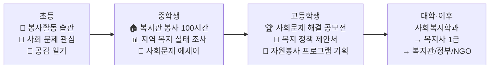

### 중등 봉사 활동 기록 (150시간 로드맵)

| 봉사 기관 | 시기 | 내용 | 시간 | 배운 점 |
|---------|------|------|------|------|
| 지역아동센터 학습 멘토 | 중1 | 초등생 방과후 학습 지도 | 40시간 | 교육 격차 체감 |
| 노인복지관 말벗 봉사 | 중1~2 | 독거노인 주 1회 방문 | 30시간 | 노인 고독 이해 |
| 장애인복지관 활동 보조 | 중2 | 장애인 문화활동 보조 | 30시간 | 사회적 포용 |
| 지역 푸드뱅크 봉사 | 중3 | 결식 아동 식사 배달 | 30시간 | 빈곤 문제 이해 |
| 자원봉사 프로그램 기획 | 중3 | "우리 동네 복지 지도" 제작 프로젝트 | 20시간 | 기획력, 자원 연결 |
| **총계** | - | - | **150시간** | 복지 현장 이해 |

### 고등 세특 전략

| 학기 | 교과 | 세특 기록 주제 | 학종 포인트 |
|------|------|------------|---------|
| 고1 1학기 | 사회문화 | "한국 아동 빈곤율의 구조적 요인 — OECD 복지 지출 비교 분석" | 사회 문제 분석력 |
| 고1 2학기 | 경제 | "기본소득제의 경제적 효과 — 핀란드·한국 실험 비교" | 정책 분석 역량 |
| 고2 1학기 | 심리학(선택) | "트라우마 인폼드 케어(TIC)의 원리와 아동복지 적용" | 심리+복지 융합 |
| 고2 2학기 | 정보 | "공공데이터로 분석한 지역별 복지 사각지대 — 시각화 프로젝트" | 데이터 분석 역량 |

### 핵심 성공 지표

| 지표 | 초등 달성 | 중등 달성 | 고등 달성 |
|------|---------|---------|---------|
| 봉사 시간 | 30시간 | 150시간 | 300시간+ |
| 사회 분석 | 공감 일기 | 복지 실태 조사 | 정책 제안서 3편 |
| 대회 | - | - | **사회문제 해결 공모전 수상** |
| 총 투자 비용 | 약 2만원 | 약 5만원 | 약 10만원 |

---

# 🏛️ 질서 왕국 — 변호사 & 외교관

---

## 커리어 11: 변호사 / 리걸테크 전문가

> **Holland**: 관습형(C) + 기업형(E) | **에너지 키워드**: 법률 논리, 설득, AI 법률 자동화
> **대입 경로**: 법학과 4년 → 로스쿨(법학전문대학원) 3년 → 변호사시험
> **핵심 전형**: 학종 50%+ / 논술 / 정시

### 초등 → 고등 전체 커리어패스

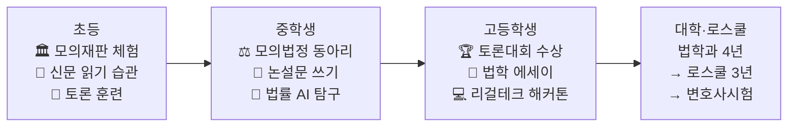

### 중등~고등 핵심 여정

| 단계 | 시기 | 핵심 활동 | 도구/비용 | 성과 |
|------|------|---------|---------|------|
| 모의재판 첫 경험 | 초5 | 학교 법 교육 주간 모의재판, 검사 역할 | 무료 | "논리로 설득하는 것이 에너지" 발견 |
| 시사 토론 습관 | 초6~중1 | 뉴스 읽기 + 가족 토론, 사회 문제 스크랩 | 신문 구독 월 1.5만원 | 사회 현안 이해, 논리 구성 |
| 모의법정 동아리 | 중1~2 | 교내 모의법정 동아리, 검사·변호인 역할 | 무료 | **전국 청소년 모의재판 대회 입상** |
| 법률 AI 탐구 | 중2~3 | ChatGPT 법률 Q&A 실험, 판례 검색 AI 탐구 | ChatGPT 무료 | "AI로 법률 서비스 민주화 가능" 인식 |
| 리걸테크 조사 | 중3 | 국내외 리걸테크 스타트업 20개 분석 보고서 | 인터넷 무료 | 리걸테크 시장 분석 보고서 20페이지 |
| 법률 AI 프로젝트 | 고1 | 부동산 계약서 자동 검토 AI (GPT-4 API) | API 월 3만원 | 계약서 검토 AI 프로토타입 |
| 전국 토론대회 | 고2 | 전국 토론대회 + 리걸테크 해커톤 | 무료 | **토론대회 은상 + 해커톤 우수상** |
| 대입 완성 | 고3 | 법학과 학종 수시 + 논술 병행 | - | **법학과 합격** |

### 법학과 학종 세특 전략

| 학기 | 교과 | 세특 기록 주제 | 학종 포인트 |
|------|------|------------|---------|
| 고1 1학기 | 정치와법 | "헌법재판소 판례 분석 — 양심적 병역거부 결정의 논리 구조" | 법적 분석력 |
| 고1 2학기 | 정보 | "GPT API를 활용한 부동산 계약서 자동 검토 시스템 설계" | 리걸테크 융합 역량 |
| 고2 1학기 | 논술(선택) | "개인정보보호법과 AI 학습 데이터 — 규제와 혁신의 균형" | 법적 사고력+기술 이해 |
| 고2 2학기 | 영어 | "미국 로스쿨 판례 분석 영문 보고서 작성" | 영어 법률 문서 능력 |

### 법학과 → 로스쿨 경로 이해

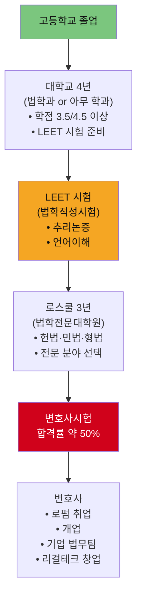

### 핵심 성공 지표

| 지표 | 초등 달성 | 중등 달성 | 고등 달성 |
|------|---------|---------|---------|
| 토론 역량 | 가족 토론 습관 | 모의재판 입상 | **전국 토론대회 은상** |
| 글쓰기 | 독서 감상문 | 논설문 10편 | 법률 에세이 5편 |
| 법률 지식 | 기초 시사 이해 | 헌법 기본 원리 | 판례 분석 능력 |
| 총 투자 비용 | 약 5만원 | 약 10만원 | 약 15만원 |

---

## 커리어 12: 외교관 / 국제기구 직원

> **Holland**: 기업형(E) + 사회형(S) | **에너지 키워드**: 국제 협상, 다문화 소통, 정책 분석
> **대입 경로**: 정치외교학과 / 국제관계학과 → 외무고시(5급 공채) 또는 국제기구 공모
> **핵심 전형**: 학종 50%+ / 정시 / 글로벌전형

### 초등 → 고등 핵심 여정

| 단계 | 시기 | 핵심 활동 | 도구/비용 | 성과 |
|------|------|---------|---------|------|
| 세계 뉴스 관심 | 초4~5 | CNN/BBC 키즈뉴스 시청, 세계 지도 탐구 | 무료 | 세계 뉴스 스크랩 50건 |
| 영어 강화 | 초6 | 영어 원서 독해 시작, 영어 스피치 대회 | 원서 2만원 | 교내 영어 말하기 대회 입상 |
| 모의 유엔(MUN) 입문 | 중1 | 교내 MUN 동아리 가입, 대리인 역할 | 무료 | MUN 기본 역할 수행 |
| 제2외국어 입문 | 중2 | 중국어 or 프랑스어 기초 학습 | 월 5만원 | 기초 회화 가능 |
| 국제 교류 참가 | 중3 | 청소년 국제 교류 프로그램 (온라인) | 무료~5만원 | 해외 학생과 영어 토론 경험 |
| 전국 MUN 참가 | 고1 | 전국 모의 유엔 대회, 결의안 작성 | 참가비 3만원 | **전국 MUN 우수 대표상** |
| 외교 정책 리포트 | 고2 | "한반도 비핵화 협상 분석" 정책 리포트 작성 | 무료 | 리포트 3편, **국제관계 에세이 공모전 수상** |
| 대입 완성 | 고3 | 정치외교학과 학종 + 글로벌전형 수시 | - | **정치외교학과 합격** |

### 외교관 학종 세특 전략

| 학기 | 교과 | 세특 기록 주제 | 학종 포인트 |
|------|------|------------|---------|
| 고1 1학기 | 세계사 | "웨스트팔리아 체제에서 UN까지 — 국제 질서의 변천과 한국의 위치" | 역사적 맥락 이해 |
| 고1 2학기 | 영어 | "TED Talk 분석 — 국제 외교 스피치의 수사학적 전략" | 영어 분석·발표력 |
| 고2 1학기 | 정치와법 | "UN 안전보장이사회 개혁안 비교 분석 — 한국의 상임이사국 진출 가능성" | 국제정치 분석력 |
| 고2 2학기 | 제2외국어 | "프랑코포니와 한국의 다자외교 전략 — 프랑스어권 국가 네트워크 분석" | 다문화·다언어 역량 |

### 외교관 vs 국제기구 진로 비교

| 비교 항목 | 외교관 (한국 외교부) | 국제기구 직원 (UN·OECD) |
|---------|-----------------|-------------------|
| 진입 경로 | 외무고시(5급 공채) 합격 | 국제기구 공석 공모 지원 (JPO 제도) |
| 필수 어학 | 영어 + 제2외국어 1개 | 영어 + 불어/중국어 등 UN 공용어 |
| 주요 업무 | 한국 이익 대변, 양자 협상 | 글로벌 이슈(기후·인권·개발) 해결 |
| 근무지 | 서울 + 전 세계 공관 순환 | 뉴욕·제네바·파리 등 국제기구 소재지 |
| 대학 전공 | 정치외교, 국제관계, 법학 | 국제관계, 경제학, 공공정책 |
| 준비 시작 시기 | 대학 3~4학년 외무고시 준비 | 대학원 진학 + 인턴 경험 |

### 핵심 성공 지표

| 지표 | 초등 달성 | 중등 달성 | 고등 달성 |
|------|---------|---------|---------|
| 어학 | 영어 독해 기초 | 영어 중급+제2외국어 기초 | TOEFL 100+, 제2외국어 중급 |
| 국제 감각 | 세계 뉴스 스크랩 | MUN 참가, 국제 교류 | **전국 MUN 수상**, 정책 리포트 |
| 글쓰기 | 독서 감상문 | 시사 에세이 | 정책 분석 리포트 3편 |
| 총 투자 비용 | 약 3만원 | 약 15만원 | 약 20만원 |

---

## 커리어 27: 회계사(CPA) / 세무사

> **Holland**: 관습형(C) + 탐구형(I) | **에너지 키워드**: 재무제표 분석, 세법 해석, 감사·컨설팅
> **대입 경로**: 경영학과 / 회계학과 → CPA 시험(공인회계사) or 세무사 시험
> **핵심 전형**: 학종 50%+ / 정시 (수학 강조)

### 초등 → 고등 전체 커리어패스

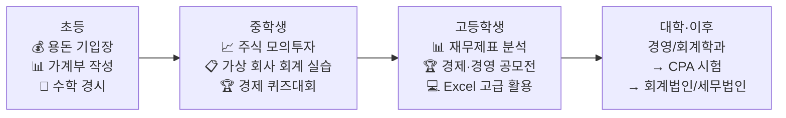

### 중등 핵심: 가상 회사 운영 프로젝트 (중2)

| 단계 | 기간 | 작업 내용 | 도구 | 결과 |
|------|------|---------|------|------|
| 가상 회사 설립 | 1주 | "중2마켓" 가상 회사 설립, 문구류 판매 | Notion | 사업 계획서 |
| 거래 기록 | 4주 | 매입·매출·경비 복식부기 기장 | Excel | 거래장 50건 |
| 재무제표 작성 | 1주 | 손익계산서·재무상태표 작성 | Excel | 월간 재무제표 |
| 세금 계산 | 1주 | 가상 부가가치세·소득세 계산 | 국세청 홈택스 참고 | **교내 경제 발표 최우수상** |

### 고등 세특 전략

| 학기 | 교과 | 세특 기록 주제 | 학종 포인트 |
|------|------|------------|---------|
| 고1 1학기 | 경제 | "기업 재무제표 읽는 법 — 삼성전자 vs 애플 재무 비교 분석" | 재무 분석 역량 |
| 고1 2학기 | 수학Ⅱ | "복리의 수학 — 현재가치와 미래가치 계산의 금융수학적 의미" | 수학+회계 융합 |
| 고2 1학기 | 정보 | "Python으로 자동화한 재무비율 분석 — 상장기업 100개 비교" | 디지털 분석 역량 |
| 고2 2학기 | 정치와법 | "조세 정의란 무엇인가 — 누진세·비례세의 형평성 분석" | 세법 이해+사회적 시야 |

### CPA vs 세무사 비교

| 비교 항목 | 공인회계사(CPA) | 세무사 |
|---------|-------------|------|
| 시험 과목 | 회계학·세법·경영학·경제학 | 세법·회계학·재정학 |
| 합격률 | 약 10~15% | 약 10~12% |
| 주요 업무 | 외부감사, 재무컨설팅, M&A | 세무 신고, 절세 컨설팅, 조세 소송 |
| 진출 분야 | 4대 회계법인(삼정·삼일·안진·한영) | 세무법인, 개업, 기업 세무팀 |
| 연봉 (초년) | 약 5,000~6,000만원 | 약 4,000~5,000만원 |

### 핵심 성공 지표

| 지표 | 초등 달성 | 중등 달성 | 고등 달성 |
|------|---------|---------|---------|
| 수학 역량 | 수학 경시 참가 | 복식부기 이해 | 재무제표 분석 능력 |
| 경제·회계 | 용돈 기입장 | 가상 회사 운영 | 상장기업 재무 분석 |
| 대회 | - | 교내 경제 발표 최우수상 | **경제·경영 공모전 수상** |
| 총 투자 비용 | 약 3만원 | 약 5만원 | 약 15만원 |

---

## 커리어 28: 프로파일러(범죄분석관) / 과학수사 전문가

> **Holland**: 탐구형(I) + 관습형(C) | **에너지 키워드**: 심리 분석, 범죄 패턴 추론, 과학적 수사
> **대입 경로**: 범죄심리학과 / 경찰행정학과 / 심리학과 → 경찰청 범죄분석관
> **핵심 전형**: 학종 50%+ / 정시

### 초등 → 고등 전체 커리어패스

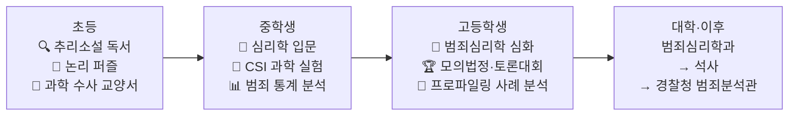

### 중등 핵심 여정

| 단계 | 시기 | 핵심 활동 | 도구/비용 | 성과 |
|------|------|---------|---------|------|
| 추리 습관 형성 | 초4~6 | 셜록 홈즈·명탐정 코난 독서, 논리 퍼즐 100문제 | 도서 3만원 | 논리 퍼즐 100문제 완료 |
| CSI 과학 실험 | 중1 | 지문 채취·혈흔 감정 모의 실험 | 과학 키트 3만원 | 과학 수사 실험 보고서 5편 |
| 범죄 통계 분석 | 중2 | 경찰청 범죄 통계 데이터 시각화 프로젝트 | Excel 무료 | **교내 사회탐구 우수상** |
| 심리학 독서 심화 | 중2~3 | 《프로파일러의 눈》, 《범죄심리학 개론》 독서 | 도서 3만원 | 독서 보고서 5편 |
| 모의 프로파일링 | 중3 | 실제 사건 공개 자료 기반 모의 프로파일링 실습 | 인터넷 무료 | 프로파일링 보고서 3편 |

### 고등 세특 전략

| 학기 | 교과 | 세특 기록 주제 | 학종 포인트 |
|------|------|------------|---------|
| 고1 1학기 | 심리학(선택) | "범죄자의 인지 왜곡 — 합리화와 도덕적 이탈 이론 분석" | 범죄심리학 이론 |
| 고1 2학기 | 생명과학Ⅰ | "뇌과학으로 본 반사회적 성격장애 — 전두엽·편도체 기능 분석" | 뇌과학+심리 융합 |
| 고2 1학기 | 확률과통계 | "지리적 프로파일링의 통계학적 원리 — 범죄 발생 패턴 분석" | 데이터 분석력 |
| 고2 2학기 | 정치와법 | "과학 수사 증거의 법적 증거능력 — DNA 감정의 신뢰도 분석" | 법적 분석력 |

### 프로파일러 진로 경로

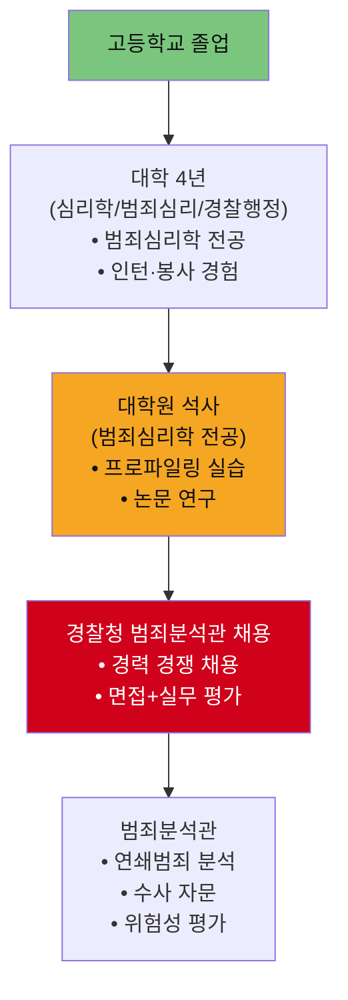

### 핵심 성공 지표

| 지표 | 초등 달성 | 중등 달성 | 고등 달성 |
|------|---------|---------|---------|
| 논리·추론 | 추리소설 20권 | 모의 프로파일링 3편 | 사례 분석 보고서 5편 |
| 심리학 이해 | 기초 관심 | 독서 5권, 심리 검사 이해 | 범죄심리학 논문 리딩 |
| 데이터 분석 | - | 범죄 통계 시각화 | 지리적 프로파일링 분석 |
| 총 투자 비용 | 약 5만원 | 약 10만원 | 약 15만원 |

---

# 📣 소통 왕국 — 유튜버·크리에이터 & 디지털마케터

---

## 커리어 13: 유튜버 / 콘텐츠 크리에이터

> **Holland**: 예술형(A) + 기업형(E) | **에너지 키워드**: 스토리텔링, 편집, 알고리즘 분석
> **대입 경로**: 미디어커뮤니케이션학과 / 영상학과 / 신문방송학과
> **핵심 전형**: 학종 40%+ / 실적기반 전형 / 정시

### 초등 → 고등 전체 커리어패스

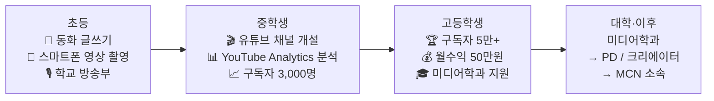

### 유튜브 성장 분석 (월별 구독자 추이)

| 시기 | 구독자 수 | 핵심 전략 | 인기 영상 |
|------|---------|---------|---------|
| 중1 개설 | 0 → 200명 | 주 1회 업로드, 학습법 콘텐츠 | "중학교 입학 준비 꿀팁" |
| 중1 말 | 200 → 500명 | 썸네일 A/B 테스트 시작 | "자유학기제 완벽 정리" |
| 중2 상반기 | 500 → 1,500명 | 편집 통일, 시리즈물 기획 | "중2 현실 공부 루틴" |
| 중2 하반기 | 1,500 → 3,000명 | YouTube Analytics 분석 반영 | "수학 포기자 탈출기 ep.1~5" |
| 중3 | 3,000 → 8,000명 | 릴스·쇼츠 멀티 플랫폼 | "시험 D-7 최소한의 공부법" |
| 고1 | 8,000 → 20,000명 | 협찬 수락, 퀄리티 업 | "고등학교 진짜 공부법" |
| 고2 | 20,000 → 52,000명 | 스튜디오 셋업, 장편 기획물 | "서울대 간다면 이렇게 공부한다" |

### 고등 세특 전략 — 크리에이터의 교과 연결

| 학기 | 교과 | 세특 기록 주제 | 학종 포인트 |
|------|------|------------|---------|
| 고1 1학기 | 영상제작(선택) | "유튜브 알고리즘의 작동 원리 — CTR과 시청 지속률 최적화 전략" | 미디어 기술 이해 |
| 고1 2학기 | 확률과통계 | "YouTube Analytics 데이터 기반 콘텐츠 성과 예측 모델" | 데이터 분석력 |
| 고2 1학기 | 사회문화 | "10대 미디어 소비 패턴 변화 — 숏폼 콘텐츠가 주의력에 미치는 영향" | 미디어 리터러시 |
| 고2 2학기 | 영어 | "글로벌 크리에이터 이코노미 분석 — MrBeast 비즈니스 모델" | 글로벌 미디어 시야 |

### 크리에이터 고2 기준 월 수입 구조

| 수입원 | 금액 | 비중 |
|------|------|------|
| YouTube AdSense | 약 20만원 | 40% |
| 브랜드 협찬 (문구류, 교육앱) | 약 20만원 | 40% |
| 멤버십 | 약 5만원 | 10% |
| 전자책 판매 | 약 5만원 | 10% |
| **합계** | **약 50만원/월** | 100% |

### 핵심 성공 지표

| 지표 | 초등 달성 | 중등 달성 | 고등 달성 |
|------|---------|---------|---------|
| 영상 제작 | 스마트폰 촬영 | 편집 중급 (캡컷→프리미어) | 고급 편집 + 기획 |
| 구독자 | - | 3,000명 | 52,000명 |
| 수익 | - | - | 월 50만원 |
| 총 투자 비용 | 약 3만원 | 약 10만원 | 약 20만원 |

---

## 커리어 14: 디지털 마케터 / 그로스 해커

> **Holland**: 기업형(E) + 예술형(A) | **에너지 키워드**: 브랜드 스토리, 소비자 심리, 데이터 광고
> **대입 경로**: 경영학과 / 광고홍보학과 / 미디어커뮤니케이션학과
> **핵심 전형**: 학종 50%+ / 정시

### 초등 → 고등 핵심 여정

| 단계 | 시기 | 핵심 활동 | 도구/비용 | 성과 |
|------|------|---------|---------|------|
| 학급 홍보물 제작 | 초5~6 | 학급 행사 포스터, 학교 신문 편집 | Canva 무료 | 홍보물 10건 |
| 소비자 관찰 일기 | 중1 | 광고 분석 노트 ("왜 이 광고가 효과적인가") | 노트 무료 | 광고 분석 노트 50편 |
| SNS 마케팅 실험 | 중2 | 학교 매점 인스타그램 운영 자원봉사 | Instagram 무료 | 팔로워 300→800명, **매출 20% 증가** |
| 브랜드 기획 | 중3 | 가상 브랜드 기획 (타겟·포지셔닝·로고) | Canva, Notion | 브랜드 기획서 30페이지 |
| 디지털 마케팅 수료 | 고1 | Google 디지털 마케팅 무료 강좌 | 무료 | Google 디지털 마케팅 수료증 |
| 실전 광고 운영 | 고1 | 지인 소상공인 SNS 광고 무료 대행 | Meta 광고 5만원 | ROAS 180%, 도달수 5배 |
| 브랜드 공모전 | 고2 | 전국 마케팅 공모전 | 무료 | **금상 수상** |
| 대입 완성 | 고3 | 포트폴리오 사이트, 마케팅학과 수시 | Notion 무료 | **경영/마케팅학과 합격** |

### 고등 세특 전략

| 학기 | 교과 | 세특 기록 주제 | 학종 포인트 |
|------|------|------------|---------|
| 고1 1학기 | 경제 | "가격 탄력성과 마케팅 가격 전략 — 편의점 PB상품 사례 분석" | 경제 이론+실전 적용 |
| 고1 2학기 | 정보 | "구글 애널리틱스4 데이터 해석 — 소상공인 웹사이트 트래픽 분석" | 디지털 분석 역량 |
| 고2 1학기 | 심리학(선택) | "소비자 의사결정 과정과 넛지 이론 — 학교 급식 선택에 적용" | 행동경제학 이해 |
| 고2 2학기 | 영어 | "Philip Kotler의 Marketing 5.0 핵심 개념 영문 분석 보고서" | 마케팅 원서 독해력 |

### 핵심 성공 지표

| 지표 | 초등 달성 | 중등 달성 | 고등 달성 |
|------|---------|---------|---------|
| 마케팅 실전 | 학급 포스터 | 학교 매점 SNS 운영 | 소상공인 광고 대행 |
| 분석 역량 | - | 게시물 반응 비교 | GA4 + Meta Ads 활용 |
| 대회 | - | - | **브랜드 공모전 금상** |
| 총 투자 비용 | 약 3만원 | 약 5만원 | 약 15만원 |

---

## 커리어 29: 방송 PD / 방송작가

> **Holland**: 예술형(A) + 기업형(E) | **에너지 키워드**: 프로그램 기획, 스토리 구성, 팀 연출
> **대입 경로**: 신문방송학과 / 미디어학과 / 영상학과 → 방송사 공채 or 외주 제작사
> **핵심 전형**: 학종 40%+ / 실기전형 / 정시

### 초등 → 고등 전체 커리어패스

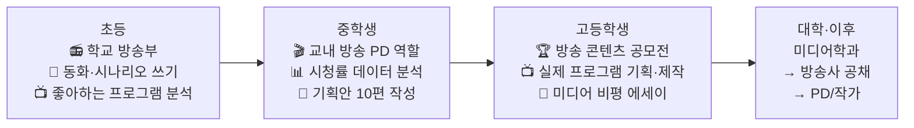

### 중등 핵심: 교내 방송 프로그램 기획·제작 (중2)

| 단계 | 기간 | 작업 내용 | 도구 | 결과 |
|------|------|---------|------|------|
| 기획 | 2주 | "우리 학교 숨은 이야기" 다큐 프로그램 기획안 | Notion | 기획안 10페이지 |
| 섭외·취재 | 2주 | 교사 3명·학생 5명 인터뷰, 촬영 스케줄링 | 스마트폰 | 인터뷰 소스 8개 |
| 촬영·편집 | 3주 | 20분 분량 다큐 촬영·편집 | 프리미어 프로 | 완성본 20분 |
| 상영·피드백 | 1주 | 교내 상영회, 학생 반응 설문 | Google Forms | **교내 방송 콘텐츠상 대상** |

### 고등 세특 전략

| 학기 | 교과 | 세특 기록 주제 | 학종 포인트 |
|------|------|------------|---------|
| 고1 1학기 | 영상제작(선택) | "방송 프로그램 기획의 5단계 — 리서치에서 편성까지" | 미디어 제작 프로세스 이해 |
| 고1 2학기 | 국어(화법과작문) | "방송 대본의 구성 원리 — 예능·다큐·드라마 대본 비교 분석" | 글쓰기 역량 |
| 고2 1학기 | 사회문화 | "OTT 시대 방송 산업의 변화 — 시청률 vs 조회수의 경제학" | 미디어 산업 이해 |
| 고2 2학기 | 영어 | "BBC 다큐멘터리 Planet Earth의 내레이션 분석 — 영상 스토리텔링 기법" | 글로벌 미디어 시야 |

### 핵심 성공 지표

| 지표 | 초등 달성 | 중등 달성 | 고등 달성 |
|------|---------|---------|---------|
| 방송 제작 | 학교 방송부 1년 | 교내 다큐 20분 1편 | 프로그램 기획안 5편, 영상 3편 |
| 글쓰기 | 동화·시나리오 | 기획안 10편, 대본 5편 | 미디어 비평 에세이 5편 |
| 수상 | - | 교내 방송콘텐츠 대상 | **방송 콘텐츠 공모전 수상** |
| 총 투자 비용 | 약 3만원 | 약 10만원 | 약 15만원 |

---

## 커리어 30: 게임기획자 (게임 디자이너 / 레벨 디자이너)

> **Holland**: 예술형(A) + 탐구형(I) | **에너지 키워드**: 게임 시스템 설계, 레벨 밸런싱, 사용자 경험
> **대입 경로**: 게임학과 / 컴퓨터공학과 / 소프트웨어학과 / 디지털미디어학과
> **핵심 전형**: 학종 40%+ / SW특기자 / 정시

### 초등 → 고등 전체 커리어패스

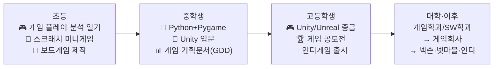

### 중등 핵심: 첫 완성 게임 프로젝트 (중2~3)

| 단계 | 시기 | 핵심 활동 | 도구 | 성과 |
|------|------|---------|------|------|
| 게임 분석 | 중1 | 좋아하는 게임 10개 시스템 분석 노트 | 노트, 스프레드시트 | 게임 분석 보고서 10편 |
| Pygame 입문 | 중1~2 | Python+Pygame으로 슈팅·퍼즐 게임 제작 | Python 무료 | 미니게임 5개 완성 |
| Unity 입문 | 중2 | Unity 2D 튜토리얼, 플랫포머 게임 제작 | Unity Personal 무료 | 2D 플랫포머 완성 |
| GDD 작성 | 중3 | 게임 기획문서(Game Design Document) 작성법 학습 | Notion 무료 | GDD 3편 완성 |
| 첫 출시 | 중3 | itch.io에 인디 게임 첫 출시 | itch.io 무료 | **첫 인디게임 출시, 다운로드 200회** |

### 고등 세특 전략

| 학기 | 교과 | 세특 기록 주제 | 학종 포인트 |
|------|------|------------|---------|
| 고1 1학기 | 정보 | "게임 AI의 알고리즘 — A* 경로탐색과 FSM 상태관리" | 게임 프로그래밍 역량 |
| 고1 2학기 | 확률과통계 | "게임 밸런싱의 수학 — 가챠 확률 설계와 기댓값 분석" | 수학의 실전 적용 |
| 고2 1학기 | 프로그래밍 | "Unity로 개발한 교육용 퍼즐 게임 — 기획부터 출시까지 개발 과정" | 프로젝트 완성 역량 |
| 고2 2학기 | 심리학(선택) | "게임 몰입 이론(Flow Theory)과 사용자 경험 설계" | 심리학+게임 융합 |

### 게임기획자 vs 게임프로그래머 비교

| 비교 항목 | 게임기획자 | 게임프로그래머 |
|---------|---------|----------|
| 핵심 역량 | 시스템 설계, 레벨 디자인, 스토리 구성 | C++/C# 코딩, 엔진 최적화, 물리엔진 |
| 필요 도구 | Excel, Notion, Unity(기초), Figma | Unity/Unreal, Visual Studio, Git |
| 대학 전공 | 게임학과, 미디어학과, SW학과 | 컴퓨터공학과, 소프트웨어학과 |
| 취업 포트폴리오 | GDD 3편 + 출시 게임 1편 | 게임 프로젝트 코드 + 데모 |
| 연봉 (초년) | 약 3,000~4,000만원 | 약 3,500~5,000만원 |

### 핵심 성공 지표

| 지표 | 초등 달성 | 중등 달성 | 고등 달성 |
|------|---------|---------|---------|
| 게임 제작 | 스크래치 미니게임 5개 | Pygame 5개, Unity 1개 | Unity 출시작 2개 |
| 기획 문서 | 보드게임 룰 설계 | GDD 3편 | 상세 GDD 5편 |
| 플랫폼 활동 | - | itch.io 첫 출시 | **게임 공모전 수상**, 다운로드 1,000+ |
| 총 투자 비용 | 약 3만원 | 약 5만원 | 약 15만원 |

---

# 🚀 도전 왕국 — 스타트업창업가 & 투자분석가

---

## 커리어 15: 스타트업 창업가 / 프로덕트 매니저

> **Holland**: 기업형(E) + 탐구형(I) | **에너지 키워드**: 문제 발굴, 팀 이끌기, MVP 빌딩
> **대입 경로**: 경영학과 / 창업학과 / 컴퓨터공학과
> **핵심 전형**: 학종 40%+ / 창업인재전형(한양대·건국대 등) / 정시

### 초등 → 고등 전체 커리어패스

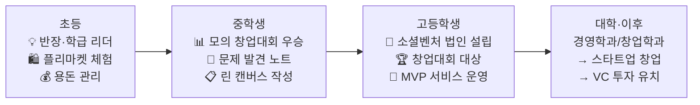

### 중등 모의 창업대회 수상 아이디어 (중2 실제 발표)

| 항목 | 내용 |
|------|------|
| **문제 발견** | 독거노인 식사 공백: 주말 저녁 배달 서비스 없음, 노인 73%가 주 2회 이상 식사 거름 |
| **솔루션** | '이웃반찬': 중학생 봉사자가 토요일 반찬 배달 + 안부 확인 |
| **비즈니스 모델** | 지역구청 위탁 운영 + 식품 기업 CSR 후원 |
| **차별점** | 기술이 아닌 "인간적 연결"에 집중 |
| **심사 결과** | **창업대회 최우수상** + 지역신문 보도 |

### 고등 세특 + 학종 전략

| 학기 | 교과 | 세특 기록 주제 | 학종 포인트 |
|------|------|------------|---------|
| 고1 1학기 | 경제 | "린 스타트업 방법론 — MVP와 피봇의 경제학적 의미" | 창업 이론 이해 |
| 고1 2학기 | 사회문화 | "독거노인 식사 문제의 구조적 원인 — 사회적기업 솔루션" | 사회 문제 분석력 |
| 고2 1학기 | 정보 | "React Native로 구현한 이웃반찬 앱 — MVP 개발 과정" | 기술+창업 융합 |
| 고2 2학기 | 영어 | "Y Combinator 지원서 분석 — 글로벌 스타트업 생태계 이해" | 글로벌 창업 시야 |

### 고2 법인 설립 과정 (소셜벤처)

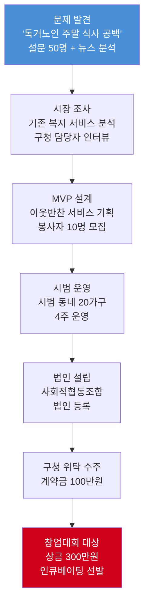

### 창업인재전형 안내

| 대학교 | 전형명 | 지원 자격 | 평가 방식 |
|------|------|---------|---------|
| **한양대** | 창업인재전형 | 창업 경험 보유 고교생 | 서류 50% + 면접 50% |
| **건국대** | 창업적성우수자 | 창업 실적 or 아이디어 | 서류 + 면접 |
| **숭실대** | 사회봉사자전형 | 소셜벤처 활동 실적 | 서류 + 면접 |
| **서강대** | 학종(일반) | 창업 활동 세특 기록 | 서류 100% or 서류+면접 |

### 핵심 성공 지표

| 지표 | 초등 달성 | 중등 달성 | 고등 달성 |
|------|---------|---------|---------|
| 리더십 | 반장, 학급회의 주도 | 모의 창업대회 우승 | 법인 설립, 대상 수상 |
| 비즈니스 | 용돈 관리 | 린 캔버스 작성 | 실제 매출 + 투자 |
| 팀 운영 | - | 3인 팀 구성 | 10인 조직 운영 |
| 총 투자 비용 | 약 3만원 | 약 5만원 | 약 35만원 (법인 설립 포함) |

---

## 커리어 16: 투자분석가 / 펀드매니저

> **Holland**: 관습형(C) + 탐구형(I) | **에너지 키워드**: 재무 분석, 밸류에이션, 포트폴리오 관리
> **대입 경로**: 경제학과 / 경영학과 / 금융공학과
> **핵심 전형**: 학종 50%+ / 정시 (수학 강조)

### 초등 → 고등 핵심 여정

| 단계 | 시기 | 핵심 활동 | 도구/비용 | 성과 |
|------|------|---------|---------|------|
| 용돈 투자 실험 | 초5 | 용돈 5만원으로 주식 첫 경험, 경제 일기 | 증권사 앱 무료 | 경제 일기 1년, 수익 +6% |
| 경제 공부 | 초6 | 어린이 경제 신문, 가족 경제 토론 | 월 1.5만원 | 경제 개념 이해 |
| 모의 투자 대회 | 중1 | 증권사 청소년 모의투자 대회 | 무료 | **모의투자 1위**, 수익률 38% |
| Python 금융 분석 | 중2 | yfinance로 주가 분석, 백테스팅 | Python 무료 | 삼성전자 5년 주가 분석 보고서 |
| 알고리즘 트레이딩 | 중3 | 이동평균 기반 자동매매 시뮬레이션 | Backtrader 무료 | 시뮬레이션 수익률 연 15% |
| 핀테크 앱 개발 | 고1~2 | 간편 가계부 + 지출 AI 분석 앱 | React Native 무료 | 앱 출시, 사용자 100명 |
| 금융 해커톤 | 고2 | 금융감독원 주최 핀테크 해커톤 | 무료 | **우수상**, 멘토 연결 |
| 대입 완성 | 고3 | 금융공학과 학종 수시 + 정시 | - | **금융공학과 합격** |

### 고등 세특 전략

| 학기 | 교과 | 세특 기록 주제 | 학종 포인트 |
|------|------|------------|---------|
| 고1 1학기 | 경제 | "행동경제학의 관점에서 분석한 한국 개인투자자의 비합리적 의사결정" | 경제 이론+실증 분석 |
| 고1 2학기 | 미적분 | "Black-Scholes 옵션 가격결정 모형의 수학적 구조" | 금융수학 이해 |
| 고2 1학기 | 정보 | "Python으로 구현한 KOSPI 200 종목 팩터 분석 — 가치·모멘텀·퀄리티" | 퀀트 분석 역량 |
| 고2 2학기 | 영어 | "Warren Buffett's Letter to Shareholders 분석 — 장기 투자 철학의 정수" | 영어 금융 문서 독해 |

### 핵심 성공 지표

| 지표 | 초등 달성 | 중등 달성 | 고등 달성 |
|------|---------|---------|---------|
| 경제 이해 | 경제 일기 1년 | 주가 분석 보고서 | 팩터 투자 분석 |
| 코딩+금융 | - | Python 금융 분석 | 핀테크 앱 개발 |
| 대회 | - | 모의투자 1위 | **핀테크 해커톤 우수상** |
| 총 투자 비용 | 약 5만원 | 약 5만원 | 약 15만원 |

---

## 커리어 31: 프로덕트 매니저(PM) / IT 서비스 기획자

> **Holland**: 기업형(E) + 탐구형(I) | **에너지 키워드**: 사용자 문제 정의, 제품 로드맵, 데이터 기반 의사결정
> **대입 경로**: 경영학과 / 산업공학과 / 컴퓨터공학과 → IT 기업 PM 직군
> **핵심 전형**: 학종 50%+ / 정시

### 초등 → 고등 전체 커리어패스

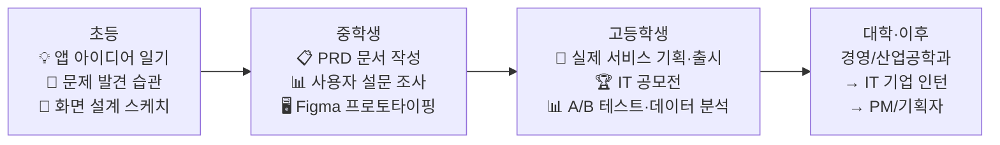

### 중등 핵심: 학교 문제 해결 앱 기획 프로젝트 (중2)

| 단계 | 기간 | 작업 내용 | 도구 | 결과 |
|------|------|---------|------|------|
| 문제 발견 | 1주 | "학교 생활 불편 사항" 설문 100명, 인터뷰 10명 | Google Forms | 불편 사항 TOP 5 도출 |
| 경쟁 분석 | 1주 | 기존 교육 앱 10개 장단점 비교 분석 | Notion 스프레드시트 | 경쟁 분석표 |
| PRD 작성 | 1주 | 제품 요구사항 문서(PRD) 작성 — 타겟·핵심 기능·성공 지표 | Notion | PRD 10페이지 |
| 프로토타입 | 2주 | Figma 프로토타입 제작 + 사용자 테스트 5명 | Figma 무료 | 프로토타입 15화면 |
| 검증 | 1주 | 사용자 테스트 결과 반영 → 최종 기획안 | Notion | **교내 IT 프로젝트 발표회 최우수상** |

### 고등 세특 전략

| 학기 | 교과 | 세특 기록 주제 | 학종 포인트 |
|------|------|------------|---------|
| 고1 1학기 | 경제 | "플랫폼 비즈니스 모델 분석 — 카카오·네이버의 양면시장 전략" | 비즈니스 모델 이해 |
| 고1 2학기 | 정보 | "사용자 행동 데이터 기반 제품 개선 — GA4 퍼널 분석 실습" | 데이터 기반 의사결정 |
| 고2 1학기 | 심리학(선택) | "UX 심리학 — 인지 부하 이론과 앱 인터페이스 설계 원칙" | 사용자 심리 이해 |
| 고2 2학기 | 영어 | "실리콘밸리 PM의 역할 — 《Inspired》 원서 핵심 분석" | 글로벌 IT 시야 |

### PM에게 필요한 역량 삼각형

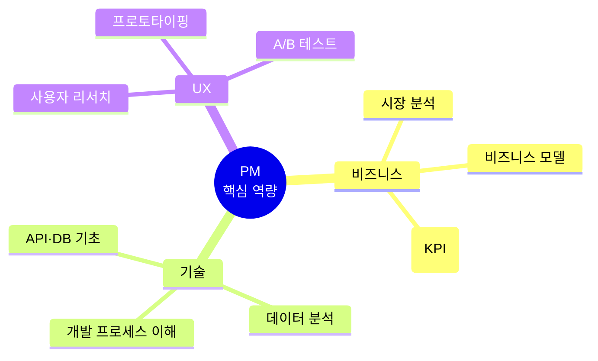

### 핵심 성공 지표

| 지표 | 초등 달성 | 중등 달성 | 고등 달성 |
|------|---------|---------|---------|
| 기획 문서 | 앱 아이디어 노트 | PRD 3편, 프로토타입 3개 | 서비스 기획서 5편, 실제 출시 1건 |
| 데이터 분석 | - | 설문 분석 | GA4·A/B 테스트 |
| 대회 | - | 교내 IT 프로젝트 최우수상 | **IT 공모전 수상** |
| 총 투자 비용 | 약 3만원 | 약 5만원 | 약 15만원 |

---

## 커리어 32: 경영 컨설턴트 / 전략 컨설턴트

> **Holland**: 기업형(E) + 관습형(C) | **에너지 키워드**: 문제 구조화, 데이터 분석, 전략 제안
> **대입 경로**: 경영학과 / 경제학과 / 산업공학과 → 컨설팅펌(맥킨지·BCG·베인)
> **핵심 전형**: 학종 50%+ / 정시 (수학·영어 강조)

### 초등 → 고등 전체 커리어패스

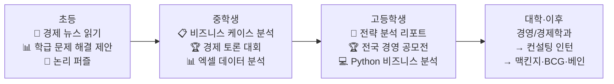

### 중등 핵심: 학교 매점 경영 개선 프로젝트 (중2)

| 단계 | 기간 | 작업 내용 | 도구 | 결과 |
|------|------|---------|------|------|
| 현황 분석 | 1주 | 학교 매점 매출 데이터 수집, 학생 설문 80명 | Excel, Google Forms | 현황 분석 보고서 |
| 문제 구조화 | 1주 | "매출 하락 원인" 이슈 트리(Issue Tree) 작성 | PowerPoint | 이슈 트리 + 가설 5개 |
| 데이터 검증 | 2주 | 가설별 데이터 분석, 경쟁 분석 (편의점 vs 매점) | Excel | 가설 검증 결과표 |
| 전략 제안 | 1주 | "매점 3대 개선 전략" 발표 (메뉴·가격·동선) | PPT 발표 | **제안 채택, 매출 15% 증가** |

### 고등 세특 전략

| 학기 | 교과 | 세특 기록 주제 | 학종 포인트 |
|------|------|------------|---------|
| 고1 1학기 | 경제 | "포터의 5 Forces 분석 — 한국 커피 시장의 경쟁 구조" | 전략 프레임워크 이해 |
| 고1 2학기 | 확률과통계 | "회귀분석의 비즈니스 적용 — 광고비와 매출의 상관관계 분석" | 데이터 기반 사고 |
| 고2 1학기 | 정보 | "Python으로 분석한 상장기업 100개 SWOT 자동 분류 — NLP 활용" | 기술+비즈니스 융합 |
| 고2 2학기 | 영어 | "McKinsey 7S 프레임워크의 실전 적용 — 영문 케이스 분석" | 글로벌 컨설팅 이해 |

### 컨설턴트 진로 경로

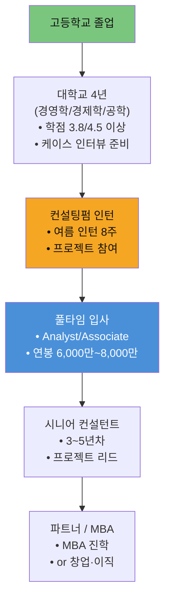

### 핵심 성공 지표

| 지표 | 초등 달성 | 중등 달성 | 고등 달성 |
|------|---------|---------|---------|
| 분석력 | 경제 뉴스 스크랩 | 이슈 트리·SWOT 분석 | 전략 프레임워크 활용 |
| 발표력 | 학급 제안 | 매점 경영 개선 발표 | **경영 공모전 수상** |
| 영어 | - | 영어 원서 독해 | 영문 케이스 분석 |
| 총 투자 비용 | 약 3만원 | 약 5만원 | 약 15만원 |

---

# 📊 2028 대입 제도 개편 상세 분석

---

## 현재 논의 중인 2028 대입 개편 방향

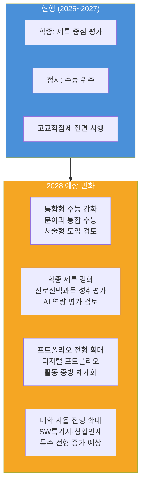

## 직업별 2028 대입 변화 영향 분석

| # | 직업 | 현행 학종 반영 | 2028 변화 예상 | 대응 전략 |
|---|------|------------|------------|---------|
| 01 | 의사 | 세특+내신+수능 최저 | 수능 서술형 확대 → 과학 서술 대비 | 과학 서술형 문제풀이 훈련 |
| 02 | AI연구원 | 세특+GitHub | AI 활용 역량 평가 도입 가능 | AI 프로젝트 포트폴리오 체계화 |
| 17 | 약사 | 세특+내신+수능 최저 | 약대 정시 비중 유지 | 화학·생명과학 서술형 대비 |
| 18 | 생명공학연구원 | 세특+R&E | AI+바이오 융합 역량 평가 가능 | 바이오인포매틱스 프로젝트 |
| 03 | UX디자이너 | 세특+실기 | 디지털 포트폴리오 전형 확대 | Figma 작업물 디지털 아카이빙 |
| 04 | 웹툰작가 | 실기+학종 | 실기 비중 유지, 디지털 제출 확대 | 온라인 포트폴리오 강화 |
| 19 | 건축가 | 세특+실기 | BIM·디지털 설계 역량 평가 가능 | 3D 모델링 포트폴리오 체계화 |
| 20 | 영화·영상감독 | 실기+학종 | 영상 포트폴리오 전형 확대 | 작품 영상 아카이빙·영화제 실적 |
| 05 | 앱개발자 | 학종+SW특기자 | SW특기자 전형 확대 예상 | GitHub Stars·프로젝트 체계 관리 |
| 06 | 데이터사이언티스트 | 학종+정시 | 데이터 리터러시 역량 평가 가능 | 캐글·데이터 분석 프로젝트 증빙 |
| 21 | 정보보안전문가 | 학종+SW특기자 | 보안 인재 전형 신설 가능 | CTF 대회 실적+보안 프로젝트 |
| 22 | 로봇공학자 | 학종+정시 | 공학 포트폴리오 전형 확대 | 로봇 제작 프로젝트 문서화 |
| 07 | 환경공학자 | 학종+정시 | ESG 관련 전형 신설 가능 | 환경 프로젝트 성과 문서화 |
| 08 | 수의사 | 정시+학종 | 의학 계열 정시 비중 유지 | 수능 과학 고득점 유지 전략 |
| 23 | 스마트팜전문가 | 학종+정시 | 농업기술 전형 확대 가능 | IoT+농업 융합 프로젝트 기록 |
| 24 | 해양생물학자 | 학종+정시 | 해양환경 전문 인재 수요 증가 | 해양 R&E+데이터 분석 역량 |
| 09 | 교사 | 학종(교대/사범) | 교대 정원 감소 → 경쟁 심화 | 내신 1등급+교육 봉사 차별화 |
| 10 | 심리상담사 | 학종+정시 | 심리학과 인기 상승 → 경쟁↑ | 심리학 R&E 경험 차별화 |
| 25 | 간호사 | 학종+정시 | 간호학과 수능 최저 유지 | 수능 대비+건강증진 프로젝트 |
| 26 | 사회복지사 | 학종+정시 | 변화 적음, 봉사 활동 중요 | 복지 봉사 누적+정책 분석 역량 |
| 11 | 변호사 | 학종+논술 | 논술전형 축소 가능 → 학종 강화 | 세특에 법학 탐구 집중 기록 |
| 12 | 외교관 | 학종+글로벌 | 글로벌전형 확대 예상 | 영어+제2외국어 강화, MUN 실적 |
| 27 | 회계사 | 학종+정시 | 금융학과 수학 비중 강화 | 수학 서술형+재무 분석 역량 |
| 28 | 프로파일러 | 학종+정시 | 범죄심리학과 인기 상승 | 심리학 R&E+데이터 분석 차별화 |
| 13 | 유튜버 | 학종+실적 | 미디어학과 실적기반 전형 확대 | 채널 성과 데이터 정리 |
| 14 | 마케터 | 학종+정시 | 변화 적음 | 마케팅 실전 경험 기록 |
| 29 | 방송PD | 학종+실기 | 영상 포트폴리오 전형 확대 | 방송 제작물 아카이빙 |
| 30 | 게임기획자 | 학종+SW특기자 | 게임학과 전형 확대 예상 | 출시 게임+GDD 포트폴리오 |
| 15 | 창업가 | 학종+창업인재 | 창업인재전형 확대 예상 | 법인·매출 등 객관적 실적 확보 |
| 16 | 투자분석가 | 학종+정시 | 금융학과 수학 비중 강화 | 수학 서술형 대비 + 금융 분석 역량 |
| 31 | PM | 학종+정시 | IT 서비스 기획 전형 확대 가능 | 서비스 기획·출시 실적 기록 |
| 32 | 경영컨설턴트 | 학종+정시 | 변화 적음, 수학·영어 강화 | 전략 분석 역량+영어 원서 독해 |

---

## 앞으로 반영하게 될 제도: 핵심 변화 5가지

### 1. 고교학점제 전면 시행 (2025~)

| 변화 | 내용 | 커리어패스 영향 |
|------|------|------------|
| **선택과목 확대** | 학생이 직접 시간표를 설계 (대학 수강신청처럼) | 진로에 맞는 과목 선택이 학종 핵심 |
| **성취평가제** | 진로선택과목은 A·B·C 절대평가 | 진로선택과목 A등급 필수 |
| **교과 다양성** | 인공지능수학, 프로그래밍, 심리학, 환경 등 신설 | 직업별 추천 선택과목 전략 중요 |

### 2. 자기소개서 폐지 → 세특이 전부 (2024~)

| Before | After | 전략 |
|--------|-------|------|
| 자소서 4개 문항으로 스토리텔링 | 학생부 세특에 스토리가 담겨야 함 | **수업 중 탐구·발표·보고서가 곧 자소서** |
| 학생이 직접 작성 | 교사가 관찰해서 기록 | 교사에게 탐구 활동을 적극 보여줘야 함 |
| 수정·보완 가능 | 한 번 기록되면 변경 불가 | 매 학기 계획적으로 세특 소재 만들기 |

### 3. 블라인드 평가 전면 적용 (2025~)

| 삭제 항목 | 영향 | 전략 |
|---------|------|------|
| 출신 학교명 | 학교 브랜드 효과 사라짐 | 순수 활동·역량으로 승부 |
| 부모 직업·직위 | 부모 배경 활용 불가 | 학생 본인의 자발적 활동 강조 |
| 수상 실적 상세 | 수상명만 기록, 상세 불가 | 세특에 수상 관련 탐구 과정 기록 |

### 4. AI 활용 역량 평가 검토 (2027~)

| 검토 내용 | 예상 방향 | 대비 전략 |
|---------|---------|---------|
| AI 도구 활용 능력 평가 | 대입 면접에서 AI 활용 질문 가능 | ChatGPT·코딩 AI 활용 경험 축적 |
| AI 윤리 의식 평가 | AI 윤리 관련 에세이·토론 출제 | AI 윤리 가이드라인 이해 |
| AI 협업 능력 | AI와 함께 문제 해결하는 과제 출제 | AI를 도구로 활용한 프로젝트 경험 |

### 5. 디지털 포트폴리오 전형 확대 (2027~2028 예상)

| 예상 변화 | 적용 대상 | 준비 방법 |
|---------|---------|---------|
| 디지털 포트폴리오 공식 제출 허용 | SW특기자, 디자인, 미디어 계열 | GitHub, Behance, YouTube 채널 체계 관리 |
| 활동 증빙 디지털화 | 전 학과 | Notion 포트폴리오 정기 업데이트 |
| 영상 포트폴리오 | 미디어·영상 계열 | 작업물 영상 아카이빙 |

---

# 📊 32개 직업 종합 비교 분석

---

## 32개 직업 × 학종 전략 완전 비교표

| # | 직업 | 학종 핵심 세특 키워드 | 필수 선택과목 | 추천 전형 | 면접 핵심 | 내신 목표 |
|---|------|------------------|-----------|---------|---------|---------|
| 01 | 의사 | 건강 불평등, AI 의료 윤리 | 생명Ⅱ, 화학Ⅱ, 보건 | 정시+학종 | MMI(의료 윤리) | 전체 1등급 |
| 02 | AI연구원 | Transformer, 오픈소스 | 인공지능수학, 정보, 프로그래밍 | 학종+SW특기자 | AI 기술·사회영향 | 수학·정보 1등급 |
| 17 | 약사 | 약물 상호작용, 신약 개발 | 화학Ⅱ, 생명Ⅱ, 보건 | 정시+학종 | 약학 윤리·약물 오남용 | 전체 1등급 |
| 18 | 생명공학연구원 | CRISPR, 바이오인포매틱스 | 생명Ⅱ, 화학Ⅱ, 정보 | 학종+정시 | 유전자 편집 윤리 | 과학 1등급 |
| 03 | UX디자이너 | HCD, 사용자 리서치 | 미술창작, 디자인, 정보 | 학종+실기 | 디자인 사고 과정 | 전체 2~3등급 |
| 04 | 웹툰작가 | 서사 구조, 디지털 드로잉 | 미술창작, 문학, 매체미술 | 실기+학종 | 포트폴리오 발표 | 전체 3~4등급 |
| 19 | 건축가 | BIM, 제로에너지 건축 | 물리Ⅱ, 미적분, 미술창작 | 학종+실기 | 건축 철학·공간 감각 | 수학·물리 1~2등급 |
| 20 | 영화·영상감독 | 몽타주, 시나리오 구조 | 영상제작, 문학, 사회문화 | 실기+학종 | 연출 의도·작품 | 전체 3~4등급 |
| 05 | 앱개발자 | API 설계, 풀스택 개발 | 정보, 프로그래밍, 미적분 | 학종+SW특기자 | 개발 과정·협업 | 수학·정보 1~2등급 |
| 06 | 데이터사이언티스트 | 베이즈 정리, 시계열 분석 | 확률과통계, 정보, 경제수학 | 학종+정시 | 분석 프로젝트 | 수학 1등급 |
| 21 | 정보보안전문가 | RSA 암호, 취약점 분석 | 정보, 프로그래밍, 수학Ⅱ | 학종+SW특기자 | 보안 윤리·사례 | 수학·정보 1~2등급 |
| 22 | 로봇공학자 | PID 제어, 자율주행 | 물리Ⅱ, 미적분, 정보 | 학종+정시 | 로봇 윤리·설계 | 수학·물리 1등급 |
| 07 | 환경공학자 | 탄소 측정, ESG 분석 | 지구과학Ⅱ, 환경, 화학Ⅱ | 학종+정시 | 환경 정책 제안 | 과학 1~2등급 |
| 08 | 수의사 | 동물 행동학, 원헬스 | 생명Ⅱ, 화학Ⅱ, 농업생명 | 정시+학종 | 동물 윤리·복지 | 전체 1등급 |
| 23 | 스마트팜전문가 | IoT 센서, 수직 농장 | 농업생명, 정보, 생명Ⅰ | 학종+정시 | 식량 문제·기술 | 과학·정보 2등급 |
| 24 | 해양생물학자 | 해양 산성화, 미세플라스틱 | 지구과학Ⅱ, 생명Ⅱ, 환경 | 학종+정시 | 해양 환경 보전 | 과학 1~2등급 |
| 09 | 교사 | 블룸 분류학, ZPD 이론 | 교육학, 심리학, 전공교과 | 학종(교대/사범) | 좋은 교사상 | 전체 1~2등급 |
| 10 | 심리상담사 | CBT 이론, 뇌과학 | 심리학, 생명과학Ⅰ, 사회문화 | 학종+정시 | 상담 윤리·공감 | 전체 2~3등급 |
| 25 | 간호사 | 면역체계, EBN 원리 | 생명Ⅰ, 화학Ⅰ, 보건 | 학종+정시 | 간호 윤리·공감 | 전체 2등급 |
| 26 | 사회복지사 | 아동 빈곤, TIC 이론 | 사회문화, 심리학, 경제 | 학종+정시 | 복지 정책·공감 | 전체 2~3등급 |
| 11 | 변호사 | 헌법 판례, 리걸테크 | 정치와법, 논술, 정보 | 학종+논술 | 법적 논리·윤리 | 전체 1~2등급 |
| 12 | 외교관 | UN 개혁, 다자외교 | 세계사, 정치와법, 제2외국어 | 학종+글로벌 | 국제 이슈 분석 | 전체 1~2등급 |
| 27 | 회계사 | 재무제표, 조세 정의 | 경제, 수학Ⅱ, 정보 | 학종+정시 | 회계 윤리·분석 | 수학 1등급 |
| 28 | 프로파일러 | 인지 왜곡, 지리적 프로파일링 | 심리학, 생명Ⅰ, 확률통계 | 학종+정시 | 범죄심리·윤리 | 전체 2~3등급 |
| 13 | 유튜버 | 알고리즘, 미디어 리터러시 | 영상제작, 사회문화, 확률통계 | 학종+실적 | 콘텐츠 전략 | 전체 2~3등급 |
| 14 | 마케터 | 가격 탄력성, 넛지 이론 | 경제, 심리학, 정보 | 학종+정시 | 마케팅 사례 분석 | 전체 2~3등급 |
| 29 | 방송PD | 프로그램 기획, OTT 분석 | 영상제작, 화법과작문, 사회문화 | 학종+실기 | 기획의도 발표 | 전체 2~3등급 |
| 30 | 게임기획자 | A* 알고리즘, Flow 이론 | 정보, 프로그래밍, 심리학 | 학종+SW특기자 | 게임 설계 철학 | 수학·정보 2등급 |
| 15 | 창업가 | 린 스타트업, MVP | 경제, 정보, 사회문화 | 학종+창업인재 | 창업 경험 발표 | 전체 2~3등급 |
| 16 | 투자분석가 | 팩터 분석, 옵션 가격 | 미적분, 경제, 정보 | 학종+정시 | 금융 분석 역량 | 수학 1등급 |
| 31 | PM | 플랫폼 비즈니스, UX 심리 | 경제, 정보, 심리학 | 학종+정시 | 서비스 기획 역량 | 전체 2~3등급 |
| 32 | 경영컨설턴트 | 5 Forces, 회귀분석 | 경제, 확률통계, 영어 | 학종+정시 | 전략 분석·발표 | 전체 1~2등급 |

---

## 32개 직업 투자 비용 vs 성과 분석

| # | 직업 | 총 투자 비용 (초~고) | 주요 무료 도구 | 핵심 성과 지표 |
|---|------|----------------|------------|------------|
| 01 | 의사 | 약 45만원 | 커리어넷, PubMed | KBO 은상, 내신 1등급 |
| 02 | AI연구원 | 약 35만원 | Python, GitHub, Colab | AI 공모전 대상, Stars 200+ |
| 17 | 약사 | 약 38만원 | 커리어넷, NCBI | KChO 은상, 내신 1등급 |
| 18 | 생명공학연구원 | 약 41만원 | Python, NCBI, Colab | KBO 은상, 해커톤 수상 |
| 03 | UX디자이너 | 약 45만원 | Figma, Canva | 공모전 입상, Behance 5,000뷰 |
| 04 | 웹툰작가 | 약 140만원 | 네이버 도전만화 | 공모전 입상, 연재 경험 |
| 19 | 건축가 | 약 45만원 | SketchUp, AutoCAD 학생판 | 건축 공모전, 모형 포트폴리오 |
| 20 | 영화·영상감독 | 약 33만원 | 프리미어 학생판, YouTube | 청소년 영화제 수상 |
| 05 | 앱개발자 | 약 30만원 | VSCode, GitHub, Heroku | 해커톤 수상, 서비스 출시 |
| 06 | 데이터사이언티스트 | 약 20만원 | Python, Kaggle, Colab | 캐글 Expert, 인턴 |
| 21 | 정보보안전문가 | 약 25만원 | Wireshark, picoCTF, Linux | 전국 CTF 입상 |
| 22 | 로봇공학자 | 약 100만원 | Arduino IDE, ROS, OpenCV | 전국 로봇대회 수상 |
| 07 | 환경공학자 | 약 25만원 | Python, 에어코리아 | 해커톤 우승, 장관상 |
| 08 | 수의사 | 약 30만원 | 가상 해부 앱 | R&E, 올림피아드 |
| 23 | 스마트팜전문가 | 약 31만원 | Arduino, 라즈베리파이 | 농업테크 해커톤 수상 |
| 24 | 해양생물학자 | 약 28만원 | Python, 해양환경DB | R&E, 해양환경 공모전 수상 |
| 09 | 교사 | 약 20만원 | 무료 봉사 플랫폼 | 봉사 300시간, 멘토링 운영 |
| 10 | 심리상담사 | 약 20만원 | 무료 봉사·검사 도구 | 또래 상담 인증, R&E |
| 25 | 간호사 | 약 23만원 | 무료 봉사 플랫폼 | 봉사 200시간, 건강 캠페인 |
| 26 | 사회복지사 | 약 17만원 | 공공데이터, 봉사 플랫폼 | 봉사 300시간, 공모전 수상 |
| 11 | 변호사 | 약 30만원 | 무료 판례 DB | 토론대회 은상, 해커톤 |
| 12 | 외교관 | 약 40만원 | BBC, MUN 무료 | MUN 우수 대표상 |
| 27 | 회계사 | 약 23만원 | Excel, 홈택스, DART | 경영 공모전 수상 |
| 28 | 프로파일러 | 약 30만원 | 경찰청 통계, Python | 사회탐구 우수상, 사례분석 |
| 13 | 유튜버 | 약 35만원 | YouTube, CapCut | 구독자 5만, 월수익 50만 |
| 14 | 마케터 | 약 25만원 | GA4, Canva, Instagram | 공모전 금상, 인턴 |
| 29 | 방송PD | 약 28만원 | 프리미어, YouTube | 방송 콘텐츠 공모전 수상 |
| 30 | 게임기획자 | 약 23만원 | Unity, itch.io, Pygame | 게임 공모전 수상, 출시 |
| 15 | 창업가 | 약 45만원 | Notion, Figma | 법인 설립, 대상+상금 300만 |
| 16 | 투자분석가 | 약 25만원 | Python, yfinance | 모의투자 1위, 해커톤 수상 |
| 31 | PM | 약 23만원 | Figma, Notion, GA4 | IT 공모전 수상, 서비스 출시 |
| 32 | 경영컨설턴트 | 약 23만원 | Excel, Python, Notion | 경영 공모전 수상 |

> **평균 총 투자 비용**: 약 35만원 (초4~고3, 6~8년간)
> **비고**: 대부분 무료 도구 활용, 비용보다 **시간 투자와 꾸준함**이 핵심

---

## 나에게 맞는 직업 찾기 — 자가 진단 워크시트

| 질문 | 내 답변 | 추천 직업 (상편) | 추천 직업 (하편) |
|------|---------|------------|------------|
| 실험하거나 연구할 때 몰입한다 | | 의사(01), AI연구원(02), 약사(17), 생명공학연구원(18) | 프로파일러(28) |
| 아픈 사람을 돕고 싶다 | | 의사(01), 약사(17), 수의사(08) | 간호사(25), 심리상담사(10) |
| 코딩이나 수학 문제에 시간 가는 줄 모른다 | | AI연구원(02), 앱개발자(05), 데이터(06), 정보보안(21) | 투자분석가(16), 게임기획자(30) |
| 그림 그리기, 디자인, 만들기가 좋다 | | UX디자이너(03), 웹툰작가(04), 건축가(19) | - |
| 자연·동물·환경에 관심이 많다 | | 환경공학자(07), 수의사(08), 스마트팜(23), 해양생물학자(24) | - |
| 사람을 돕거나 가르칠 때 보람을 느낀다 | | - | 교사(09), 심리상담사(10), 간호사(25), 사회복지사(26) |
| 논리적 토론과 설득을 잘한다 | | - | 변호사(11), 외교관(12), 경영컨설턴트(32) |
| 영상 만들기, SNS에 에너지가 생긴다 | | 영화감독(20) | 유튜버(13), 마케터(14), 방송PD(29) |
| 사업 아이디어가 자꾸 떠오른다 | | - | 창업가(15), 투자분석가(16), PM(31) |
| 세계 뉴스와 국제 문제에 관심이 많다 | | 환경공학자(07) | 외교관(12), 경영컨설턴트(32) |
| 로봇·하드웨어 만들기에 빠진다 | | 로봇공학자(22), 스마트팜(23) | - |
| 게임 플레이하면서 시스템을 분석한다 | | - | 게임기획자(30) |
| 범죄·심리 추리에 관심이 많다 | | - | 프로파일러(28), 변호사(11) |
| 숫자·회계·세금에 관심이 간다 | | - | 회계사(27), 투자분석가(16) |
| 바다·해양에 유독 끌린다 | | 해양생물학자(24) | - |
| 서비스·제품을 기획하는 게 즐겁다 | | UX디자이너(03) | PM(31), 마케터(14) |

---

## 학교급별 공통 핵심 마일스톤 (전 직업 공통)

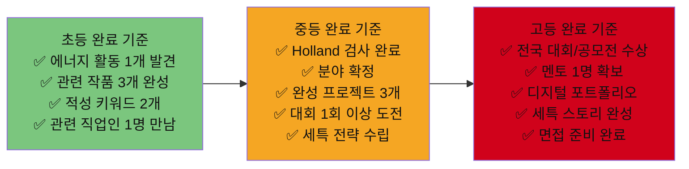

---

## 커리어패스 3단계 핵심 공식 요약

```mermaid
mindmap
  root((커리어패스<br>성공 공식))
    중학교 핵심
      에너지 발견
        Holland 검사
        에너지 일기 30일
      첫 완성물
        그림자 프로젝트
        작은 것 완성
      경험 기록
        Notion 포트폴리오
        사진·영상 증거
    고등학교 핵심
      세특 전략
        매 학기 진로 연결
        교과별 탐구 주제
      전문성 집중
        분야 1개에 올인
        깊이 > 넓이
      대외 성과
        전국 공모전 수상
        인턴·실무 경험
    대입 전략
      학종
        세특 일관성
        면접 스토리
      정시
        수능 최저 충족
        수학·과학 고득점
      특수 전형
        SW특기자
        창업인재
        글로벌전형
```

---

## 학부모 가이드 — 자녀 커리어패스 지원 5대 원칙

| # | 원칙 | 설명 | Do | Don't |
|---|------|------|-----|------|
| 1 | **관찰하라** | 아이가 에너지를 쏟는 활동을 관찰 | 에너지 일기 함께 쓰기 | 부모의 꿈 강요 |
| 2 | **기다려라** | 분야 확정은 중2~3에 해도 충분 | 다양한 체험 기회 제공 | "너는 의사가 되어야 해" |
| 3 | **연결하라** | 멘토·현직자·선배와 연결 | 부모 네트워크 활용 | 학원만 보내기 |
| 4 | **기록하라** | 활동 기록을 함께 관리 | Notion 포트폴리오 관리 | "알아서 해" |
| 5 | **응원하라** | 실패해도 괜찮다는 메시지 | 과정을 칭찬 | 결과만 보기 |

---

> **핵심 메시지**
> 32가지 직업 모두 **초등에서 에너지 발견 → 중학교에서 검증 + 첫 완성물 → 고등에서 세특 전략 + 대외 성과** 패턴을 따릅니다.
> 분야는 달라도 **꾸준함, 프로젝트 완성, 세특 기록**이라는 세 가지 공식은 동일합니다.
> 총 투자 비용은 평균 35만원 — 비용이 아닌 **시간과 의지가 유일한 진입 장벽**입니다.
> 2028 대입 개편에서도 **"일관된 진로 스토리 + 세특 기록"**의 중요성은 더욱 커집니다.

---

*작성일: 2026년 2월 | 32대 직업 커리어패스 × 대입 학종 완전 가이드 (하) v2.0*
*참조: 커리어패스_20대_우수사례_벤치마킹_v2.md, 3단계-직업세계-게임형_커리어패스앱_기획.md*
