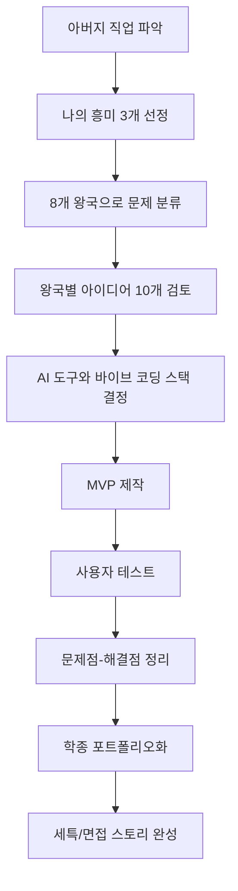
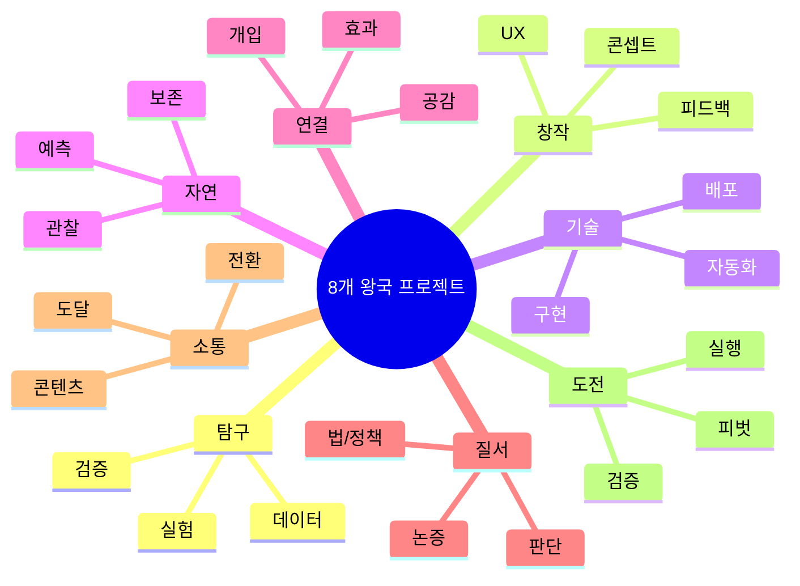

# 8개 왕국 AI/바이브 코딩 프로젝트 아이디어북

고등학생이 학종을 준비하면서, `아버지 직업`과 `나의 흥미`를 연결해 프로젝트를 설계할 수 있도록 만든 대형 기획 문서입니다.

---

## 문서 구성

- `config/kingdom-project-config.json`: 라벨, 워크플로우, 공통 도구 스택
- `kingdoms/01_탐구_왕국.md`
- `kingdoms/02_창작_왕국.md`
- `kingdoms/03_기술_왕국.md`
- `kingdoms/04_자연_왕국.md`
- `kingdoms/05_연결_왕국.md`
- `kingdoms/06_질서_왕국.md`
- `kingdoms/07_소통_왕국.md`
- `kingdoms/08_도전_왕국.md`

---

## 전체 기획 흐름

---

## 왕국별 빠른 선택 가이드

| 나의 성향 | 추천 왕국 | 시작 프로젝트 타입 |
|---|---|---|
| 실험/분석 좋아함 | 탐구 | 데이터 분석형 앱 |
| 그림/영상/디자인 좋아함 | 창작 | 콘텐츠/UX 개선형 앱 |
| 코딩/자동화 좋아함 | 기술 | 서비스형 웹앱 |
| 동식물/환경 관심 | 자연 | 관찰/모니터링 앱 |
| 사람 돕는 일 선호 | 연결 | 매칭/상담 보조 앱 |
| 토론/법/정책 관심 | 질서 | 브리핑/법령 검색 앱 |
| 홍보/미디어 관심 | 소통 | SNS 분석/콘텐츠 도구 |
| 실행/창업/리더십 선호 | 도전 | 실험형 비즈니스 앱 |

---

## 학종 제출용 최소 산출물

1. 문제 정의서 1부
2. 유저 시나리오 3개 이상
3. MVP 데모 링크
4. 사용자 피드백 10건 이상
5. 개선 전/후 비교 지표 1개 이상
6. 회고 및 확장 계획

---

## 왕국별 마인드맵(통합)

