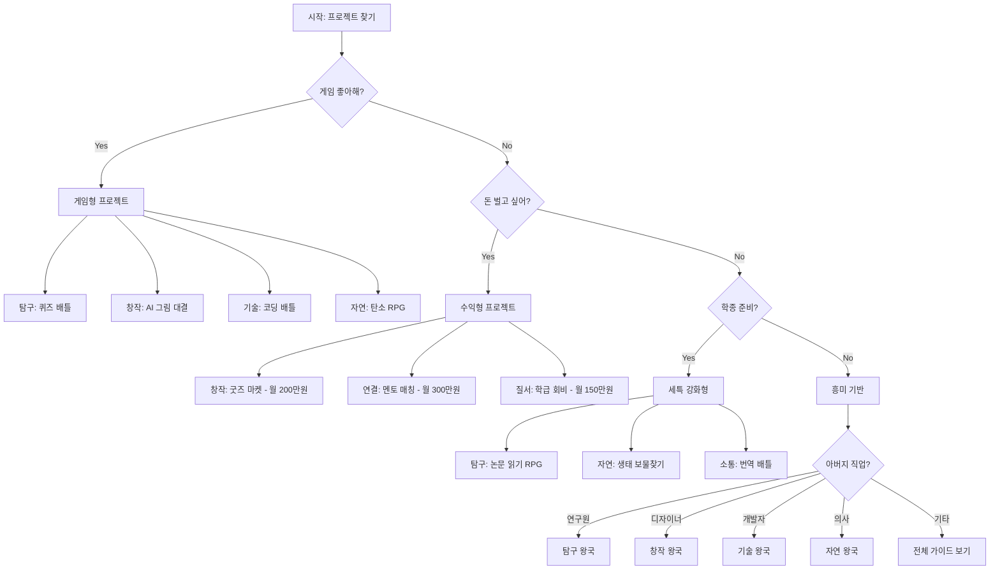
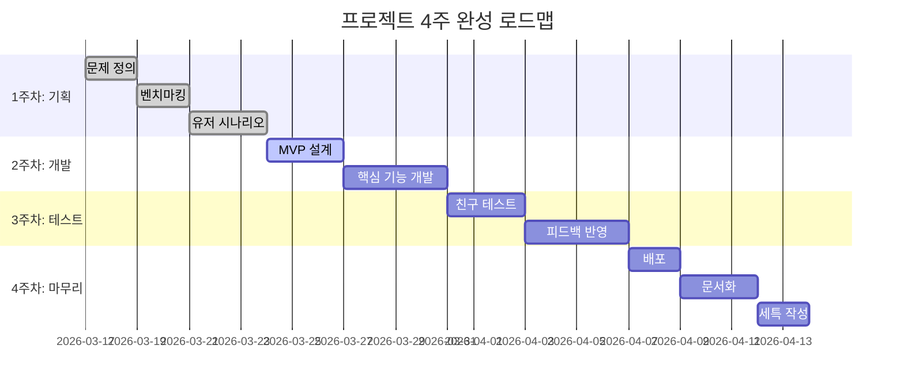

# 8개 왕국 AI/바이브 코딩 프로젝트 아이디어북 v2.0

> **"게임처럼 재미있고, 실제로 돈 벌고, 학종에도 쓰는"**  
> 고등학생을 위한 80개 실전 프로젝트 가이드

---

## 🎯 v2.0 업데이트 핵심

### 기존 v1.0의 문제점
- ❌ 너무 학문적, 연구 중심
- ❌ 수익 모델 불명확
- ❌ 재미 요소 부족
- ❌ 실제 창업 어려움

### v2.0 개선 사항
- ✅ **게임형**: 포인트, 랭킹, 배지, 대결, 챌린지
- ✅ **실생활**: 매일 쓰는 앱, 학교/집에서 바로 적용
- ✅ **수익성**: 구체적 금액, 실제 창업 가능
- ✅ **벤치마킹**: 실제 수상작, 성공 사례 기반

---

## 📁 문서 구성

```
8개왕국_AI프로젝트_아이디어/
├── README_v2.md (이 파일)
├── 00_전체_프로젝트_가이드_v2.md (80개 프로젝트 마스터 인덱스)
├── config/
│   └── kingdom-project-config.json
└── kingdoms/
    ├── 01_탐구_왕국_v2.md (과학, 실험, 데이터)
    ├── 02_창작_왕국_v2.md (디자인, 영상, 음악)
    ├── 03_기술_왕국_v2.md (코딩, 로봇, 앱)
    ├── 04_자연_왕국_v2.md (환경, 식물, 동물)
    ├── 05_연결_왕국_v2.md (소통, 매칭, 커뮤니티)
    ├── 06_질서_왕국_v2.md (관리, 효율, 시스템)
    ├── 07_소통_왕국_v2.md (언어, 번역, 표현)
    └── 08_도전_왕국_v2.md (스포츠, 경쟁, 도전)
```

---

## 🎮 프로젝트 선택 플로우차트



---

## 🏆 실제 수상작 기반 벤치마킹

### 국내 청소년 창업/개발 수상작

| 프로젝트 | 수상/성과 | 핵심 아이디어 | 관련 왕국 |
|---------|----------|-------------|----------|
| **나비얌** | 4억 투자 유치 | 급식카드 디지털화 | 질서 |
| **민들레마음** | 하루 60만원 매출 | 환아 그림 굿즈 | 창작 |
| **TAGBACK** | JA 2위 | NFC 분실물 키링 | 기술 |
| **먹어보시개** | STAC 최우수상 | 반려견 음식 판별 | 자연 |
| **알고싶었성** | STAC 최우수상 | 청소년 성교육 | 소통 |
| **REPORCH** | JA 우승 | 코딩 교육 게임 | 기술 |
| **Triple** | 앱잼 최우수상 | 지하철 맞춤 솔루션 | 연결 |

### 글로벌 게임형 성공 사례

| 서비스 | 핵심 메커니즘 | 적용 가능 왕국 |
|--------|-------------|--------------|
| 포켓몬 GO | 위치기반 수집 | 탐구, 자연 |
| 링 피트 | 운동 RPG | 도전 |
| 포레스트 | 습관 타이쿤 | 탐구, 도전 |
| 다마고치 | 캐릭터 육성 | 자연, 도전 |
| 쿠키런 | 타이쿤 경영 | 창작, 질서 |
| 틱톡 | 챌린지 + 수익화 | 창작, 소통 |

---

## 💰 수익 모델 분류

### 1. 라이선스 판매 (B2B)
- 학교당 월 5~30만원
- 예: 출석 게임, 급식 예측, 방송 앱
- **장점**: 안정적 수익
- **단점**: 영업 필요

### 2. 플랫폼 수수료 (Marketplace)
- 거래액의 20~30%
- 예: 굿즈 마켓, 멘토 매칭, 재능 교환
- **장점**: 확장성 높음
- **단점**: 초기 사용자 확보 어려움

### 3. 프리미엄 구독 (Freemium)
- 월 2,900~9,900원
- 예: AI 분석, 프리미엄 기능, 광고 제거
- **장점**: 지속 수익
- **단점**: 무료 기능 매력적이어야 함

### 4. 광고 수익 (Ad Revenue)
- 월 50~200만원 (사용자 1,000명 기준)
- 예: 게임 앱, SNS, 콘텐츠 플랫폼
- **장점**: 사용자 부담 없음
- **단점**: 대규모 사용자 필요

### 5. 제휴 마케팅 (Affiliate)
- 판매액의 5~20%
- 예: 쇼핑몰 링크, 교구 판매, 건강식품
- **장점**: 재고 부담 없음
- **단점**: 전환율 낮음

---

## 🎓 최소 학종 산출물 (프로젝트당)

### 필수 5종 세트

1. **문제 정의서** (1페이지)
   - 누구의, 어떤 문제인가?
   - 통계/설문 데이터
   - 기존 해결책의 한계

2. **유저 시나리오** (1페이지)
   - 실제 사용 스토리
   - Before/After 비교
   - 핵심 기능 3가지

3. **MVP 링크** (1개)
   - Vercel/Netlify 배포
   - 또는 앱 APK/TestFlight
   - 또는 Figma 프로토타입

4. **실사용 피드백** (10건 이상)
   - 친구/가족 테스트
   - 설문 결과
   - 개선 제안

5. **회고 및 개선 계획** (1페이지)
   - 배운 점 3가지
   - 실패한 점 2가지
   - 다음 버전 계획

### 세특 작성 공식

```
"[문제] + [해결 방법] + [기술 스택] + [정량 성과] + [정성 성과]"

예시:
"학급 과학 흥미도 40% 문제를 해결하기 위해 위치기반 퀴즈 게임 앱 개발. 
Flutter + Firebase + ChatGPT API로 실시간 랭킹 구현. 
한 달간 학급 30명 사용 결과 평균 성적 0.3등급 향상, 
흥미도 75%로 증가. 타 학교 3곳 도입으로 월 30만원 수익 창출."
```

---

## 🛠️ 바이브 코딩 도구 추천

### AI 코딩 어시스턴트
- **Cursor**: 전체 프로젝트 생성 (추천 ⭐⭐⭐⭐⭐)
- **GitHub Copilot**: 코드 자동완성
- **Replit**: 브라우저 코딩 + 배포
- **v0**: UI 컴포넌트 생성
- **Bolt.new**: 풀스택 앱 즉시 생성

### AI 콘텐츠 생성
- **ChatGPT**: 기획, 문제 생성, 조언
- **Claude**: 긴 문서 분석, 코드 리뷰
- **DALL-E 3**: 이미지 생성
- **Suno AI**: 음악 생성
- **Runway**: 영상 편집

### 노코드/로우코드
- **Figma**: UI 디자인
- **Canva**: 그래픽 디자인
- **Notion**: 데이터베이스
- **Airtable**: 스프레드시트 DB
- **Zapier**: 자동화

### 배포/호스팅
- **Vercel**: 웹 배포 (무료)
- **Netlify**: 웹 배포 (무료)
- **Firebase**: 백엔드 (무료)
- **Supabase**: DB + Auth (무료)
- **Expo**: 앱 배포

---

## 📊 왕국별 프로젝트 통계

| 왕국 | 프로젝트 수 | 평균 예상 수익 | 난이도 | 추천 학년 |
|-----|-----------|--------------|--------|----------|
| 탐구 | 10 | 70만원 | ⭐⭐⭐ | 고1~고3 |
| 창작 | 10 | 90만원 | ⭐⭐⭐⭐ | 고1~고3 |
| 기술 | 10 | 120만원 | ⭐⭐⭐⭐⭐ | 고2~고3 |
| 자연 | 10 | 60만원 | ⭐⭐ | 고1~고2 |
| 연결 | 10 | 150만원 | ⭐⭐⭐ | 고1~고3 |
| 질서 | 10 | 100만원 | ⭐⭐⭐⭐ | 고2~고3 |
| 소통 | 10 | 80만원 | ⭐⭐⭐ | 고1~고3 |
| 도전 | 10 | 70만원 | ⭐⭐ | 고1~고2 |

---

## 🚀 4주 완성 로드맵



---

## 🎯 Top 10 학종 임팩트 프로젝트

| 순위 | 프로젝트 | 왕국 | 세특 강도 | 수익성 | 난이도 |
|-----|---------|------|----------|--------|--------|
| 1 | 학교 굿즈 마켓 | 창작 | ⭐⭐⭐⭐⭐ | ⭐⭐⭐⭐⭐ | ⭐⭐⭐ |
| 2 | 멘토-멘티 매칭 | 연결 | ⭐⭐⭐⭐⭐ | ⭐⭐⭐⭐⭐ | ⭐⭐⭐⭐ |
| 3 | 반려동물 AI 진단 | 탐구 | ⭐⭐⭐⭐⭐ | ⭐⭐⭐⭐⭐ | ⭐⭐⭐⭐ |
| 4 | 학급 회비 관리 | 질서 | ⭐⭐⭐⭐ | ⭐⭐⭐⭐⭐ | ⭐⭐⭐ |
| 5 | 교육 숏폼 플랫폼 | 창작 | ⭐⭐⭐⭐⭐ | ⭐⭐⭐⭐⭐ | ⭐⭐⭐⭐ |
| 6 | NFC 출석 게임 | 기술 | ⭐⭐⭐⭐ | ⭐⭐⭐⭐ | ⭐⭐⭐⭐ |
| 7 | 탄소 발자국 RPG | 자연 | ⭐⭐⭐⭐⭐ | ⭐⭐⭐ | ⭐⭐⭐ |
| 8 | 번역 배틀 게임 | 소통 | ⭐⭐⭐⭐ | ⭐⭐⭐⭐ | ⭐⭐⭐ |
| 9 | 체력 측정 RPG | 도전 | ⭐⭐⭐⭐ | ⭐⭐⭐ | ⭐⭐ |
| 10 | 논문 읽기 RPG | 탐구 | ⭐⭐⭐⭐⭐ | ⭐⭐⭐⭐ | ⭐⭐⭐⭐ |

---

## 📖 사용 방법

### 1단계: 왕국 선택
- 아버지 직업 또는 나의 흥미로 선택
- 또는 플로우차트 따라가기

### 2단계: 프로젝트 선택
- 각 왕국 파일에서 10개 중 1개 선택
- 수익성/난이도/흥미 고려

### 3단계: 벤치마킹
- 제시된 실제 서비스 사용해보기
- 장단점 분석

### 4단계: MVP 제작
- 바이브 코딩 도구 활용
- 4주 로드맵 따라가기

### 5단계: 피드백
- 최소 10명 테스트
- 개선 반영

### 6단계: 학종 기록
- 세특 작성
- 포트폴리오 정리

---

## 💡 성공 체크리스트

### 프로젝트 시작 전
- [ ] 문제가 실제로 존재하는가? (설문 10명 이상)
- [ ] 내가 매일 쓸 만한가?
- [ ] 친구들도 쓸 것 같은가?
- [ ] 수익 모델이 명확한가?
- [ ] 4주 안에 만들 수 있는가?

### 개발 중
- [ ] 핵심 기능 3개만 집중했는가?
- [ ] 매주 친구에게 보여주는가?
- [ ] 피드백을 반영하는가?
- [ ] 포기하고 싶을 때 버티는가?

### 완성 후
- [ ] 실제 사용자 10명 이상인가?
- [ ] 돈을 벌었는가? (또는 벌 수 있는가?)
- [ ] 세특에 쓸 수 있는가?
- [ ] 다음 프로젝트 아이디어가 생겼는가?

---

## 🎉 시작하기

1. **[00_전체_프로젝트_가이드_v2.md](./00_전체_프로젝트_가이드_v2.md)** 에서 80개 프로젝트 한눈에 보기
2. **kingdoms/** 폴더에서 관심 왕국 파일 열기
3. **config/kingdom-project-config.json** 에서 전체 설정 확인

---

## 📞 문의 및 피드백

- 프로젝트 성공 사례 공유 환영
- 추가 아이디어 제안 환영
- 실제 창업 후기 공유 환영

**"학문적 연구가 아니라, 게임처럼 재미있고 돈도 버는 프로젝트!"**
