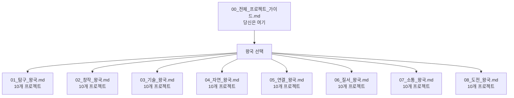
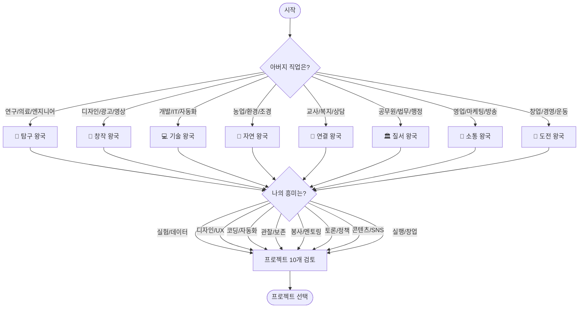
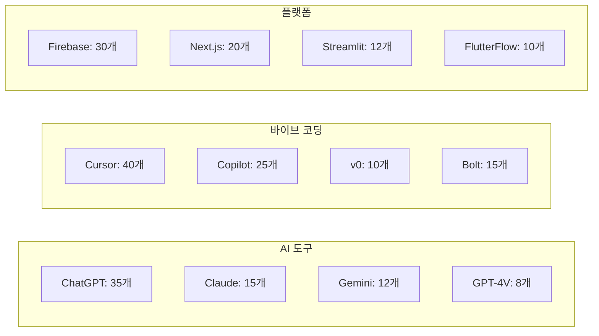
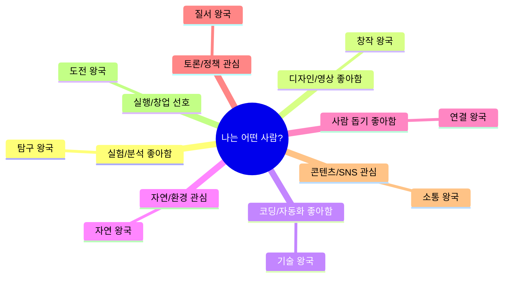
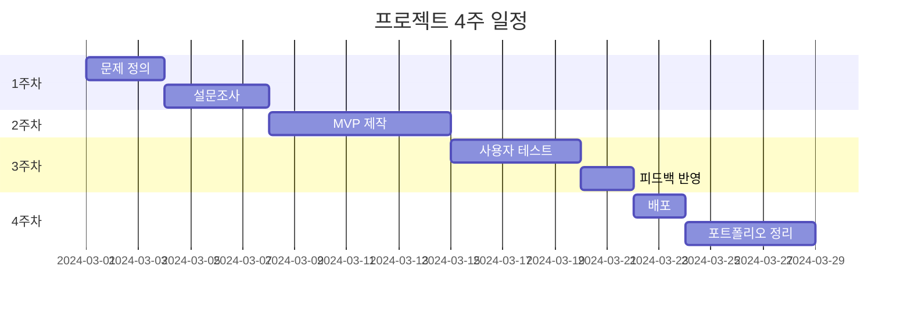
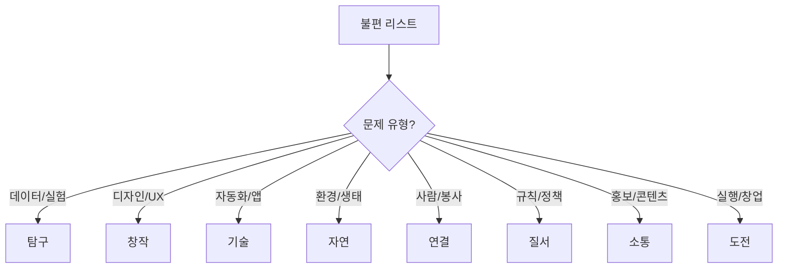
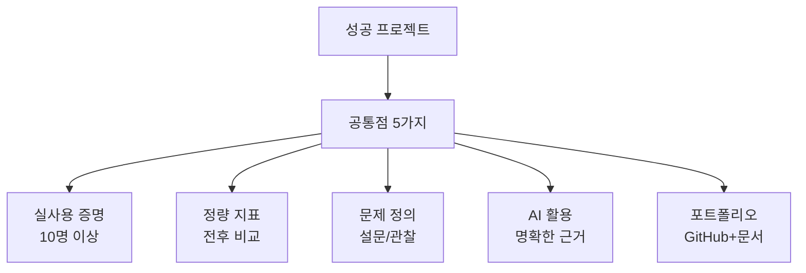

# 8개 왕국 AI 프로젝트 아이디어북 - 전체 가이드

## 📚 문서 구성



---

## 🎯 프로젝트 선택 플로우차트



---

## 📊 전체 프로젝트 80개 한눈에 보기

### 왕국별 프로젝트 수 및 난이도 분포

| 왕국 | 프로젝트 수 | 쉬움 | 보통 | 어려움 | 평균 기간 |
|------|------------|------|------|--------|----------|
| 🔬 탐구 | 10 | 2 | 5 | 3 | 4주 |
| 🎨 창작 | 10 | 3 | 5 | 2 | 4주 |
| 💻 기술 | 10 | 2 | 6 | 2 | 5주 |
| 🌱 자연 | 10 | 3 | 6 | 1 | 4주 |
| 🤝 연결 | 10 | 3 | 5 | 2 | 4주 |
| 🏛️ 질서 | 10 | 2 | 6 | 2 | 4주 |
| 📣 소통 | 10 | 4 | 5 | 1 | 4주 |
| 🚀 도전 | 10 | 3 | 5 | 2 | 4주 |
| **합계** | **80** | **22** | **43** | **15** | **4.1주** |

### 기술 스택별 프로젝트 분류



---

## 🎓 학년별 추천 프로젝트

### 고1 (진로 탐색기)

**추천 난이도**: ⭐~⭐⭐  
**추천 기간**: 2~4주  
**추천 프로젝트**:

| 왕국 | 프로젝트 ID | 이유 |
|------|------------|------|
| 탐구 | EXP-02, EXP-03, EXP-05 | 논문 읽기, 주제 선정 도움 |
| 창작 | CRE-02, CRE-04 | UX 기초, 발표 개선 |
| 기술 | TEC-02, TEC-08 | 학습 도구, 간단한 앱 |
| 자연 | NAT-01, NAT-05 | 관찰 기록, 환경 실천 |
| 연결 | CON-01, CON-08 | 봉사 매칭, 진로 대화 |
| 질서 | ORD-03, ORD-08 | 시사 이해, 용어 학습 |
| 소통 | COM-05, COM-09 | 콘텐츠 제작, SNS 기초 |
| 도전 | CHL-08, CHL-10 | 목표 관리, 대회 준비 |

### 고2 (심화 및 차별화)

**추천 난이도**: ⭐⭐~⭐⭐⭐  
**추천 기간**: 4~6주  
**추천 프로젝트**:

| 왕국 | 프로젝트 ID | 이유 |
|------|------------|------|
| 탐구 | EXP-01, EXP-04, EXP-06 | 데이터 분석, 통계 심화 |
| 창작 | CRE-01, CRE-03, CRE-08 | A/B 테스트, 영상 제작 |
| 기술 | TEC-03, TEC-06, TEC-07 | 이미지 인식, 추천 시스템 |
| 자연 | NAT-03, NAT-06, NAT-10 | 모니터링, 캠페인 효과 |
| 연결 | CON-03, CON-04, CON-10 | 매칭 시스템, 갈등 관리 |
| 질서 | ORD-01, ORD-02, ORD-05 | 법률 분석, 토론 준비 |
| 소통 | COM-01, COM-02, COM-04 | 홍보 전략, SNS 분석 |
| 도전 | CHL-01, CHL-03, CHL-04 | 창업 실험, KPI 관리 |

### 고3 (포트폴리오 완성)

**추천 난이도**: ⭐⭐  
**추천 기간**: 2~3주 (빠른 완성)  
**추천 프로젝트**:

| 왕국 | 프로젝트 ID | 이유 |
|------|------------|------|
| 탐구 | EXP-09 | 면접 준비 도구 |
| 창작 | CRE-09 | 빠른 산출물 |
| 기술 | TEC-09 | 면접 질문 생성 |
| 연결 | CON-06 | 봉사 정리 |
| 질서 | ORD-09 | 시사 정리 |

---

## 🏆 학종 임팩트별 프로젝트 순위

### TOP 10 (학종 효과 최대)

| 순위 | 프로젝트 ID | 이유 | 예상 효과 |
|------|------------|------|----------|
| 1 | EXP-01 | 실사용 증명 가능, 정량 지표 명확 | ⭐⭐⭐⭐⭐ |
| 2 | TEC-02 | 학급 전체 사용, 학습 효과 측정 | ⭐⭐⭐⭐⭐ |
| 3 | CRE-02 | 학교 공식 채택 가능성, UX 개선 증명 | ⭐⭐⭐⭐⭐ |
| 4 | CON-03 | 멘토링 효과 성적으로 증명 | ⭐⭐⭐⭐⭐ |
| 5 | NAT-03 | 환경 데이터 장기 추적, 사회 기여 | ⭐⭐⭐⭐ |
| 6 | ORD-01 | 사회 문제 해결, 법률 연계 | ⭐⭐⭐⭐ |
| 7 | COM-02 | 개인 채널 운영 증명, 데이터 기반 | ⭐⭐⭐⭐ |
| 8 | CHL-01 | 실제 매출 증명, 창업 경험 | ⭐⭐⭐⭐ |
| 9 | TEC-03 | 학교 문제 해결, 실사용 | ⭐⭐⭐⭐ |
| 10 | NAT-01 | 생태 조사 데이터, 과학 연계 | ⭐⭐⭐⭐ |

---

## 🛠️ 도구별 프로젝트 찾기

### ChatGPT 활용 프로젝트

- **탐구**: EXP-01, EXP-02, EXP-06, EXP-09
- **창작**: CRE-03, CRE-05, CRE-06
- **기술**: TEC-02, TEC-09
- **자연**: NAT-06
- **연결**: CON-02, CON-04, CON-08
- **질서**: ORD-02, ORD-06
- **소통**: COM-01, COM-05
- **도전**: CHL-04, CHL-07

### Cursor/Copilot 바이브 코딩 프로젝트

- **탐구**: EXP-01, EXP-04, EXP-06, EXP-08
- **창작**: CRE-01, CRE-04, CRE-07, CRE-08, CRE-09
- **기술**: TEC-01, TEC-02, TEC-05, TEC-06, TEC-07, TEC-08, TEC-10
- **자연**: NAT-01, NAT-03, NAT-06, NAT-09, NAT-10
- **연결**: CON-01, CON-04, CON-07, CON-10
- **질서**: ORD-01, ORD-05, ORD-06, ORD-08
- **소통**: COM-01, COM-08, COM-10
- **도전**: CHL-03, CHL-05

### Firebase 활용 프로젝트

- **탐구**: EXP-03, EXP-10
- **기술**: TEC-01, TEC-02, TEC-07
- **자연**: NAT-07
- **연결**: CON-01
- **질서**: ORD-10
- **도전**: CHL-03, CHL-08

---

## 📋 프로젝트 선택 체크리스트

### 1단계: 나의 상황 파악

```
□ 아버지 직업: _______________
□ 나의 흥미 TOP 3: _______________, _______________, _______________
□ 현재 학년: 고___
□ 사용 가능한 시간: 주 ___ 시간
□ 코딩 경험: □ 없음  □ 기초  □ 중급  □ 고급
□ 희망 전공: _______________
```

### 2단계: 왕국 선택 (최대 2개)



### 3단계: 프로젝트 선택 기준

| 기준 | 질문 | 점수 |
|------|------|------|
| **필요성** | 이 문제가 정말 불편한가? | /10 |
| **실현 가능성** | 4주 안에 만들 수 있는가? | /10 |
| **사용자 확보** | 10명 이상 사용할 수 있는가? | /10 |
| **학종 연계** | 세특/면접에 쓸 수 있는가? | /10 |
| **흥미도** | 끝까지 할 수 있는가? | /10 |

**총점 40점 이상 → 진행 추천**

---

## 🚀 4주 실행 로드맵 (공통)



### 주차별 체크리스트

**1주차: 문제 정의**
- [ ] 아버지 직업과 연결 포인트 찾기
- [ ] 생활 속 불편 3가지 리스트업
- [ ] 설문조사 10명 이상
- [ ] 벤치마킹 3개 서비스 조사

**2주차: MVP 제작**
- [ ] 핵심 기능 3개 정의
- [ ] 바이브 코딩으로 프로토타입 제작
- [ ] AI API 연동
- [ ] 내부 테스트 (본인 + 친구 2명)

**3주차: 사용자 테스트**
- [ ] 테스트 사용자 10명 모집
- [ ] 피드백 수집 (설문 or 인터뷰)
- [ ] 버그 수정
- [ ] 개선 사항 반영

**4주차: 배포 및 정리**
- [ ] 정식 배포 (Vercel, Streamlit Cloud 등)
- [ ] GitHub README 작성
- [ ] 포트폴리오 문서 작성
- [ ] 선생님께 프로젝트 설명
- [ ] 세특 연결 확인

---

## 💡 아이디어 발굴 5단계 방법론

### 1단계: 아버지 직업 관찰

**질문 리스트**:
- 아버지는 어떤 일을 하시나요?
- 일하실 때 어떤 도구를 사용하시나요?
- 어떤 문제를 자주 해결하시나요?
- 회사에서 어떤 시스템을 사용하시나요?

**대화 예시**:
```
나: "아빠, 회사에서 어떤 프로그램 쓰세요?"
아버지: "엑셀로 데이터 정리하고, 품질 관리 시스템으로 불량률 추적해."
나: "불량이 나오면 어떻게 하세요?"
아버지: "원인 분석하고 개선안 만들지."
💡 → 실험 오차 원인 진단 프로젝트 아이디어!
```

### 2단계: 나의 불편 수집

**기록 방법**: 1주일간 불편 일기 작성

```
[월요일]
- 수행평가 마감 깜빡함 → 일정 관리 앱?
- 실험 데이터 정리 1시간 걸림 → 자동화?

[화요일]
- 분실물 게시판에서 못 찾음 → 이미지 검색?
- 급식 메뉴 별로 → 선호도 조사?

[수요일]
- 봉사처 찾기 어려움 → 매칭 앱?
...
```

### 3단계: 왕국 분류



### 4단계: 벤치마킹

**조사 항목**:
- 기존 솔루션이 있는가?
- 장점과 단점은?
- 내가 개선할 수 있는 부분은?

**예시**:
```
문제: 논문 읽기 어려움
기존: Semantic Scholar (영어, 복잡)
개선: 한글 논문, 3줄 요약, 학생용 UI
```

### 5단계: MVP 범위 정하기

**핵심 기능 3개만 선정**:

```
❌ 너무 많은 기능:
- 실험 로그 입력
- AI 분석
- 보고서 생성
- 팀 협업
- 모바일 앱
- 음성 인식
- 3D 시각화

✅ 핵심 3개만:
- 실험 로그 입력
- AI 분석
- 보고서 생성
```

---

## 📊 왕국별 프로젝트 전체 목록

### 🔬 탐구 왕국 (10개)

1. **EXP-01**: 실험 로그 자동 분석 앱 - 품질관리 아버지 x 화학 실험
2. **EXP-02**: 논문 3줄 요약 도우미 - 연구소 아버지 x 생명과학
3. **EXP-03**: 과학탐구 주제 추천기 - 엔지니어 아버지 x 발명
4. **EXP-04**: 미세먼지-집중도 상관 분석기 - 운전직 아버지 x 수학 통계
5. **EXP-05**: 생물 관찰 자동 분류 노트 - 농업 아버지 x 생물
6. **EXP-06**: 물리 실험 오차 원인 진단기 - 제조업 아버지 x 물리
7. **EXP-07**: 의학 기사 팩트체크 봇 - 병원 종사 아버지 x 의학
8. **EXP-08**: 시험 성적-수면 데이터 분석 앱 - 야간근무 아버지 x 자기관리
9. **EXP-09**: 과학 전시 발표 스크립트 생성기 - 기술직 아버지 x 발표
10. **EXP-10**: 약품 복용 알림-기록 연구 앱 - 약국 관련 아버지 x 헬스케어

### 🎨 창작 왕국 (10개)

1. **CRE-01**: 학교 행사 포스터 A/B 추천기 - 광고업 아버지 x 그래픽
2. **CRE-02**: 급식실 UX 개선 리디자인 - 자영업 아버지 x UX
3. **CRE-03**: 동아리 영상 스토리보드 생성기 - 영상업 아버지 x 편집
4. **CRE-04**: 내신 발표 슬라이드 디자인 코치 - 영업직 아버지 x 발표
5. **CRE-05**: 교내 브랜드 굿즈 생성기 - 소상공인 아버지 x 브랜딩
6. **CRE-06**: 웹툰 콘셉트 피드백 봇 - 프리랜서 아버지 x 스토리
7. **CRE-07**: 교실 공간 리디자인 시뮬레이터 - 건설 아버지 x 인테리어
8. **CRE-08**: 썸네일 클릭률 개선 대시보드 - 마케팅 아버지 x 유튜브
9. **CRE-09**: 학교 홍보 카드뉴스 자동 작성기 - 공공기관 아버지 x 디자인
10. **CRE-10**: 감정 기반 음악-배경 추천기 - 음악취미 아버지 x 영상

### 💻 기술 왕국 (10개)

1. **TEC-01**: 수행평가 일정 통합 알림 앱 - 사무직 아버지 x 앱개발
2. **TEC-02**: 과목별 질문 챗봇 - 개발자 아버지 x AI
3. **TEC-03**: 교내 분실물 이미지 매칭 앱 - 공장관리 아버지 x 컴비전
4. **TEC-04**: 진로 로드맵 생성기 - 기술영업 아버지 x 데이터
5. **TEC-05**: 공부시간 자동 태깅 타이머 - 자영업 아버지 x 생산성
6. **TEC-06**: 코딩 과제 자동 코드리뷰 봇 - IT아버지 x 백엔드
7. **TEC-07**: 급식 메뉴 선호도 예측 앱 - 요식업 아버지 x 추천시스템
8. **TEC-08**: 학교 공지 요약 봇 - 행정 아버지 x 자동화
9. **TEC-09**: AI 면접 질문 생성기 - 인사담당 아버지 x 취업준비
10. **TEC-10**: 학급 민원 접수-분류 시스템 - 서비스직 아버지 x 문제해결

### 🌱 자연 왕국 (10개)

1. **NAT-01**: 학교 숲 생물종 기록 앱 - 조경 아버지 x 생물
2. **NAT-02**: 반려식물 건강 진단기 - 농업 아버지 x 식물
3. **NAT-03**: 하천 수질 모니터링 대시보드 - 환경업 아버지 x 데이터
4. **NAT-04**: 통학길 온도지도 만들기 - 배달직 아버지 x 지도
5. **NAT-05**: 분리수거 분류 도우미 - 시설관리 아버지 x 환경
6. **NAT-06**: 교내 전력 절감 추천기 - 전기직 아버지 x 에너지
7. **NAT-07**: 비 오는 날 교통안전 알림 앱 - 운송직 아버지 x 안전
8. **NAT-08**: 텃밭 수확량 예측기 - 농업 아버지 x 수학
9. **NAT-09**: 교실 공기질 체크 봇 - 공조직 아버지 x 과학
10. **NAT-10**: 생태 캠페인 임팩트 추적기 - 공공기관 아버지 x 사회참여

### 🤝 연결 왕국 (10개)

1. **CON-01**: 봉사활동 매칭 플랫폼 - 복지사 아버지 x 봉사
2. **CON-02**: 또래 고민 감정분석 챗봇 - 상담 아버지 x 심리
3. **CON-03**: 멘토-멘티 학습 매칭기 - 교사 아버지 x 교육
4. **CON-04**: 학급 갈등 중재 기록 앱 - 서비스직 아버지 x 리더십
5. **CON-05**: 지역 돌봄 정보 지도 - 간호직 아버지 x 지역활동
6. **CON-06**: 봉사시간 자동 리포터 - 공무원 아버지 x 기록관리
7. **CON-07**: 고립 학생 조기 신호 대시보드 - 학교행정 아버지 x 데이터
8. **CON-08**: 부모-학생 진로 대화 카드 앱 - 영업 아버지 x 커뮤니케이션
9. **CON-09**: 다문화 친구 번역 도움 노트 - 무역 아버지 x 언어
10. **CON-10**: 동아리 참여율 개선 코치 - 자영업 아버지 x 운영

### 🏛️ 질서 왕국 (10개)

1. **ORD-01**: 청소년 노동권 Q&A 봇 - 공무원 아버지 x 법
2. **ORD-02**: 토론 찬반 논거 생성기 - 교사 아버지 x 토론
3. **ORD-03**: 시사 뉴스 5분 브리핑 앱 - 행정 아버지 x 시사
4. **ORD-04**: 학교 규정 검색 도우미 - 군/경 아버지 x 규칙
5. **ORD-05**: 정책 시뮬레이션 대시보드 - 금융 아버지 x 경제
6. **ORD-06**: 모의재판 케이스 정리 도구 - 법무 아버지 x 발표
7. **ORD-07**: 학급 예산 투명 공개 앱 - 회계 아버지 x 데이터
8. **ORD-08**: 법률 용어 쉬운말 변환기 - 공공기관 아버지 x 언어
9. **ORD-09**: 선거 공약 비교 매트릭스 - 정치관심 아버지 x 분석
10. **ORD-10**: 학교 민원 처리 상태 트래커 - 행정 아버지 x 서비스 개선

### 📣 소통 왕국 (10개)

1. **COM-01**: 학교 행사 홍보 카피 생성기 - 영업 아버지 x 글쓰기
2. **COM-02**: 썸네일 CTR 개선 실험툴 - 마케팅 아버지 x 유튜브
3. **COM-03**: 교내 뉴스레터 자동 편집기 - 언론 아버지 x 편집
4. **COM-04**: 학생회 SNS 반응 분석기 - 자영업 아버지 x SNS
5. **COM-05**: 숏폼 스크립트 3막 생성기 - 방송 아버지 x 영상
6. **COM-06**: 교지 독자 반응 예측기 - 출판 아버지 x 글쓰기
7. **COM-07**: 학교 홍보 영상 자막 생성기 - 영상업 아버지 x 자막
8. **COM-08**: 동아리 모집 포스터 최적화 툴 - 디자인 아버지 x 홍보
9. **COM-09**: 학급 SNS 콘텐츠 캘린더 - 마케팅 아버지 x 기획
10. **COM-10**: 교내 방송 대본 감정 분석기 - 방송 아버지 x 스크립트

### 🚀 도전 왕국 (10개)

1. **CHL-01**: 학교 축제 창업 시뮬레이터 - 창업 아버지 x 사업
2. **CHL-02**: 운동 기록 AI 코칭 앱 - 체육 아버지 x 운동
3. **CHL-03**: 미니 창업 KPI 대시보드 - 자영업 아버지 x 경영
4. **CHL-04**: 피치덱 자동 생성 도구 - 투자 아버지 x 발표
5. **CHL-05**: 학급 프로젝트 진행률 트래커 - PM 아버지 x 관리
6. **CHL-06**: 동아리 부스 수익 예측기 - 영업 아버지 x 재무
7. **CHL-07**: 학생 스타트업 아이디어 검증툴 - 컨설팅 아버지 x 창업
8. **CHL-08**: 체력 측정 기록-목표 앱 - 군인 아버지 x 체육
9. **CHL-09**: 학교 협동조합 운영 시뮬레이터 - 경영 아버지 x 사회적경제
10. **CHL-10**: 대회 출전 전략 플래너 - 코치 아버지 x 전략

---

## 🎯 성공 사례 패턴 분석

### 학종 합격으로 이어진 프로젝트 특징



### 실패 사례에서 배우기

| 실패 원인 | 비율 | 예방 방법 |
|----------|------|----------|
| 기능 과다 | 40% | 핵심 3개만 선정 |
| 사용자 없음 | 30% | 사전 설문 필수 |
| 기술 난이도 | 20% | 바이브 코딩 활용 |
| 시간 부족 | 10% | 4주 이내 프로젝트 선택 |

---

## 📖 다음 단계

1. **왕국 선택**: 아버지 직업 + 나의 흥미로 1~2개 왕국 선정
2. **프로젝트 검토**: 해당 왕국 파일에서 10개 프로젝트 상세 확인
3. **체크리스트 작성**: 필요성/실현가능성/사용자 확보 점수 계산
4. **MVP 시작**: 1주차 문제 정의부터 시작

---

**문서 버전**: v1.0  
**최종 업데이트**: 2024-03-16  
**총 프로젝트 수**: 80개  
**작성자**: DreamPath 프로젝트팀
