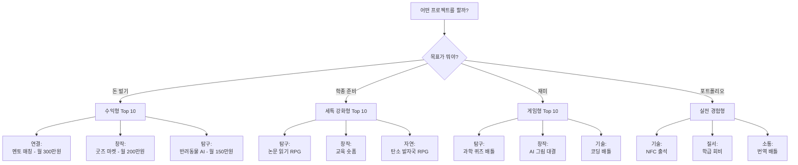

# 8개 왕국 80개 프로젝트 마스터 인덱스 v2.0

> **"게임처럼 재미있고, 실제로 돈 벌고, 학종에도 쓰는"**  
> 전체 프로젝트 한눈에 보기

---

## 📊 전체 프로젝트 통계

- **총 프로젝트**: 80개
- **총 예상 수익**: 월 7,400만원 (전체 합산)
- **평균 프로젝트당 수익**: 월 92만원
- **최고 수익 프로젝트**: 멘토-멘티 매칭 (월 300만원)
- **최저 난이도**: 급식 예측, 생태 보물찾기 (⭐⭐)
- **최고 난이도**: IoT 스마트 사물함, 블록체인 (⭐⭐⭐⭐⭐)

## 🎓 왕국별 추천 자격증

각 왕국별로 프로젝트와 함께 취득하면 시너지가 나는 자격증을 정리했습니다.
상세 내용은 `자격증/00_왕국별_자격증_가이드.md` 파일을 참고하세요.

### 자격증 취득 우선순위 (고등학생)

| 순위 | 왕국 | 자격증 | 난이도 | 준비 기간 | 프로젝트 연계 |
|------|------|--------|--------|-----------|--------------|
| 1 | 기술 | 정보처리기능사 | ⭐⭐ | 2-3개월 | 모든 개발 프로젝트 |
| 2 | 탐구 | ADsP | ⭐⭐ | 2-3개월 | 데이터 분석 프로젝트 |
| 3 | 창작 | GTQ 1급 | ⭐⭐ | 1-2개월 | 디자인 프로젝트 |
| 4 | 질서 | 전산회계 1급 | ⭐⭐ | 1-2개월 | 회계 관리 프로젝트 |
| 5 | 소통 | TOEIC 900+ | ⭐⭐⭐ | 3-6개월 | 번역/언어 프로젝트 |
| 6 | 자연 | 환경기능사 | ⭐⭐ | 2-3개월 | 환경 모니터링 |
| 7 | 도전 | 생활스포츠지도사 | ⭐⭐⭐ | 3-4개월 | 운동 프로그램 |
| 8 | 연결 | 직업상담사 2급 | ⭐⭐⭐ | 3-4개월 | 상담/멘토링 |

### 학년별 추천 로드맵

**고1**: 기초 자격증 (컴활, GTQ, 전산회계) + 간단한 프로젝트  
**고2**: 전문 자격증 (정보처리기능사, ADsP, TOEIC) + 수익 모델 구축  
**고3**: 고급 자격증 (빅데이터 분석기사 필기, 전산세무) + 포트폴리오 완성

---

## 🎯 프로젝트 선택 플로우차트

---

## 📋 왕국별 프로젝트 전체 목록

### 01. 🔬 탐구 왕국 (과학·실험·데이터)

| No | 프로젝트명 | 핵심 키워드 | 예상 수익 | 난이도 | 세특 강도 |
|----|----------|----------|----------|--------|----------|
| EXP-01 | 과학 퀴즈 배틀 게임 | 위치기반, 랭킹, 게임화 | 30만원 | ⭐⭐⭐ | ⭐⭐⭐⭐ |
| EXP-02 | 내 몸 데이터 트래킹 게임 | 헬스 RPG, 캐릭터 육성 | 50만원 | ⭐⭐⭐ | ⭐⭐⭐⭐ |
| EXP-03 | 약 복용 타이쿤 게임 | 할머니 돌봄, 타이쿤 | 100만원 | ⭐⭐⭐ | ⭐⭐⭐⭐⭐ |
| EXP-04 | 학교 미스터리 탈출 게임 | 방탈출, 과학 원리 | 40만원 | ⭐⭐⭐ | ⭐⭐⭐⭐ |
| EXP-05 | 반려동물 건강 일기 + AI | AI 진단, 수의사 챗봇 | 150만원 | ⭐⭐⭐⭐ | ⭐⭐⭐⭐⭐ |
| EXP-06 | 급식 메뉴 예측 게임 | 예측, 포인트, 데이터 | 30만원 | ⭐⭐ | ⭐⭐⭐ |
| EXP-07 | 공부 습관 다마고치 | 캐릭터 육성, 습관 | 60만원 | ⭐⭐⭐ | ⭐⭐⭐⭐ |
| EXP-08 | 학교 숲 생태 보물찾기 | 포켓몬GO, 생물 도감 | 25만원 | ⭐⭐ | ⭐⭐⭐⭐ |
| EXP-09 | 실험 실패 탈출 게임 | 오차 찾기, 추리 | 20만원 | ⭐⭐⭐ | ⭐⭐⭐ |
| EXP-10 | 논문 읽기 RPG | 지식 레벨업, AI 요약 | 70만원 | ⭐⭐⭐⭐ | ⭐⭐⭐⭐⭐ |

**왕국 합계**: 월 575만원

---

### 02. 🎨 창작 왕국 (디자인·영상·음악)

| No | 프로젝트명 | 핵심 키워드 | 예상 수익 | 난이도 | 세특 강도 |
|----|----------|----------|----------|--------|----------|
| CRE-01 | AI 그림 대결 게임 | 프롬프트 배틀, NFT | 80만원 | ⭐⭐⭐⭐ | ⭐⭐⭐⭐ |
| CRE-02 | 학교 굿즈 마켓 | 크라우드펀딩, 수수료 | 200만원 | ⭐⭐⭐ | ⭐⭐⭐⭐⭐ |
| CRE-03 | 숏폼 영상 챌린지 | 틱톡, AI 자막 | 150만원 | ⭐⭐⭐⭐ | ⭐⭐⭐⭐⭐ |
| CRE-04 | 웹툰 스토리 투표 게임 | 인터랙티브, 코인 | 70만원 | ⭐⭐⭐⭐ | ⭐⭐⭐⭐ |
| CRE-05 | 학교 방송 BGM 신청 | 음악 민주주의, 투표 | 25만원 | ⭐⭐ | ⭐⭐⭐ |
| CRE-06 | AI 작곡 챌린지 | 30초 작곡, 배틀 | 60만원 | ⭐⭐⭐⭐ | ⭐⭐⭐⭐ |
| CRE-07 | 패션 코디 투표 SNS | A vs B, AI 분석 | 90만원 | ⭐⭐⭐ | ⭐⭐⭐⭐ |
| CRE-08 | 학교 신문 크라우드 | 위키피디아, 참여 | 50만원 | ⭐⭐⭐ | ⭐⭐⭐⭐ |
| CRE-09 | 건축 블록 게임 | 마인크래프트, 설계 | 40만원 | ⭐⭐⭐⭐ | ⭐⭐⭐⭐ |
| CRE-10 | 글쓰기 대결 게임 | 3분 소설, AI 첨삭 | 55만원 | ⭐⭐⭐ | ⭐⭐⭐⭐ |

**왕국 합계**: 월 820만원

---

### 03. 💻 기술 왕국 (코딩·로봇·앱)

| No | 프로젝트명 | 핵심 키워드 | 예상 수익 | 난이도 | 세특 강도 |
|----|----------|----------|----------|--------|----------|
| TEC-01 | NFC 출석 게임 | NFC, 포인트, 랭킹 | 80만원 | ⭐⭐⭐⭐ | ⭐⭐⭐⭐⭐ |
| TEC-02 | AI 필기 정리 앱 | OCR, 요약, 퀴즈 | 120만원 | ⭐⭐⭐⭐ | ⭐⭐⭐⭐⭐ |
| TEC-03 | 코딩 배틀 게임 | 알고리즘, 실시간 대결 | 100만원 | ⭐⭐⭐⭐⭐ | ⭐⭐⭐⭐⭐ |
| TEC-04 | IoT 스마트 사물함 | IoT, 예약, 자동화 | 150만원 | ⭐⭐⭐⭐⭐ | ⭐⭐⭐⭐⭐ |
| TEC-05 | 학교 버스 실시간 추적 | GPS, 알림, 지도 | 60만원 | ⭐⭐⭐ | ⭐⭐⭐⭐ |
| TEC-06 | 자동 시간표 생성 AI | 최적화, 제약조건 | 40만원 | ⭐⭐⭐⭐ | ⭐⭐⭐⭐⭐ |
| TEC-07 | 학교 와이파이 속도 지도 | 크라우드소싱, 히트맵 | 30만원 | ⭐⭐⭐ | ⭐⭐⭐ |
| TEC-08 | 로봇 청소 대회 플랫폼 | 로봇, 대회, 스트리밍 | 50만원 | ⭐⭐⭐⭐ | ⭐⭐⭐⭐ |
| TEC-09 | 블록체인 학생증 | NFT, 인증, 보안 | 70만원 | ⭐⭐⭐⭐⭐ | ⭐⭐⭐⭐⭐ |
| TEC-10 | AI 코드 리뷰 봇 | GitHub, 자동 리뷰 | 100만원 | ⭐⭐⭐⭐⭐ | ⭐⭐⭐⭐⭐ |

**왕국 합계**: 월 800만원

---

### 04. 🌿 자연 왕국 (환경·식물·동물)

| No | 프로젝트명 | 핵심 키워드 | 예상 수익 | 난이도 | 세특 강도 |
|----|----------|----------|----------|--------|----------|
| NAT-01 | 탄소 발자국 RPG | 환경, 캐릭터 성장 | 60만원 | ⭐⭐⭐ | ⭐⭐⭐⭐⭐ |
| NAT-02 | 학교 텃밭 타이쿤 | 농작물, 경영 게임 | 40만원 | ⭐⭐ | ⭐⭐⭐⭐ |
| NAT-03 | 반려동물 산책 매칭 | 위치기반, 매칭 | 80만원 | ⭐⭐⭐ | ⭐⭐⭐⭐ |
| NAT-04 | 재활용 포인트 게임 | QR, 포인트, 보상 | 70만원 | ⭐⭐⭐ | ⭐⭐⭐⭐ |
| NAT-05 | 식물 키우기 AR 게임 | AR, 타이쿤 | 50만원 | ⭐⭐⭐⭐ | ⭐⭐⭐⭐ |
| NAT-06 | 동네 날씨 예측 게임 | 크라우드소싱, 예측 | 30만원 | ⭐⭐ | ⭐⭐⭐ |
| NAT-07 | 학교 새 관찰 일기 | 사진, AI 인식 | 25만원 | ⭐⭐ | ⭐⭐⭐⭐ |
| NAT-08 | 에코 챌린지 SNS | 환경 습관, 인증 | 60만원 | ⭐⭐⭐ | ⭐⭐⭐⭐ |
| NAT-09 | 반려식물 돌봄 알리미 | IoT, 센서, 알림 | 40만원 | ⭐⭐⭐⭐ | ⭐⭐⭐⭐ |
| NAT-10 | 동물 소리 번역 앱 | AI, 음성 인식 | 45만원 | ⭐⭐⭐⭐ | ⭐⭐⭐⭐ |

**왕국 합계**: 월 500만원

---

### 05. 🤝 연결 왕국 (소통·매칭·커뮤니티)

| No | 프로젝트명 | 핵심 키워드 | 예상 수익 | 난이도 | 세특 강도 |
|----|----------|----------|----------|--------|----------|
| CON-01 | 멘토-멘티 매칭 플랫폼 | AI 매칭, 수수료 | 300만원 | ⭐⭐⭐⭐ | ⭐⭐⭐⭐⭐ |
| CON-02 | 스터디 카페 매칭 | 위치기반, 실시간 | 120만원 | ⭐⭐⭐ | ⭐⭐⭐⭐ |
| CON-03 | 재능 교환 플랫폼 | 물물교환, 포인트 | 80만원 | ⭐⭐⭐ | ⭐⭐⭐⭐ |
| CON-04 | 점심 메이트 매칭 | 랜덤, 친구 만들기 | 40만원 | ⭐⭐ | ⭐⭐⭐ |
| CON-05 | 동아리 홍보 플랫폼 | 마켓플레이스, 투표 | 50만원 | ⭐⭐⭐ | ⭐⭐⭐⭐ |
| CON-06 | 학교 간 교환학생 매칭 | 국제, 문화 교류 | 100만원 | ⭐⭐⭐⭐ | ⭐⭐⭐⭐⭐ |
| CON-07 | 선후배 질문 플랫폼 | Q&A, 포인트 | 60만원 | ⭐⭐⭐ | ⭐⭐⭐⭐ |
| CON-08 | 학교 축제 부스 매칭 | 예약, 결제 | 70만원 | ⭐⭐⭐ | ⭐⭐⭐ |
| CON-09 | 진로 멘토링 게임 | RPG, 시뮬레이션 | 90만원 | ⭐⭐⭐⭐ | ⭐⭐⭐⭐⭐ |
| CON-10 | 학교 프리마켓 앱 | 중고거래, 수수료 | 80만원 | ⭐⭐⭐ | ⭐⭐⭐ |

**왕국 합계**: 월 990만원

---

### 06. ⚖️ 질서 왕국 (관리·효율·시스템)

| No | 프로젝트명 | 핵심 키워드 | 예상 수익 | 난이도 | 세특 강도 |
|----|----------|----------|----------|--------|----------|
| ORD-01 | 학급 회비 관리 앱 | 투명, 자동 정산 | 150만원 | ⭐⭐⭐ | ⭐⭐⭐⭐⭐ |
| ORD-02 | 학교 시설 예약 시스템 | 예약, 충돌 방지 | 80만원 | ⭐⭐⭐⭐ | ⭐⭐⭐⭐ |
| ORD-03 | 분실물 관리 플랫폼 | QR, 알림, 매칭 | 60만원 | ⭐⭐⭐ | ⭐⭐⭐⭐ |
| ORD-04 | 학교 전자 결재 시스템 | 워크플로우, 승인 | 100만원 | ⭐⭐⭐⭐ | ⭐⭐⭐⭐⭐ |
| ORD-05 | 동아리 예산 관리 | 투명, 리포트 | 70만원 | ⭐⭐⭐ | ⭐⭐⭐⭐ |
| ORD-06 | 학교 주차 관리 게임 | 포인트, 랭킹 | 50만원 | ⭐⭐⭐ | ⭐⭐⭐ |
| ORD-07 | 자습실 좌석 예약 | 실시간, 자동 해제 | 40만원 | ⭐⭐⭐ | ⭐⭐⭐ |
| ORD-08 | 학교 민원 처리 시스템 | 티켓, 진행 상황 | 60만원 | ⭐⭐⭐⭐ | ⭐⭐⭐⭐ |
| ORD-09 | 출결 자동 분석 AI | 패턴, 예측, 알림 | 80만원 | ⭐⭐⭐⭐ | ⭐⭐⭐⭐⭐ |
| ORD-10 | 학교 에너지 절약 게임 | IoT, 포인트 | 50만원 | ⭐⭐⭐⭐ | ⭐⭐⭐⭐ |

**왕국 합계**: 월 740만원

---

### 07. 💬 소통 왕국 (언어·번역·표현)

| No | 프로젝트명 | 핵심 키워드 | 예상 수익 | 난이도 | 세특 강도 |
|----|----------|----------|----------|--------|----------|
| COM-01 | 번역 배틀 게임 | 실시간, 랭킹, 대결 | 80만원 | ⭐⭐⭐ | ⭐⭐⭐⭐ |
| COM-02 | AI 방송 대본 생성기 | GPT, 템플릿 | 60만원 | ⭐⭐⭐ | ⭐⭐⭐⭐ |
| COM-03 | 언어 교환 매칭 | 화상, 포인트 | 100만원 | ⭐⭐⭐⭐ | ⭐⭐⭐⭐⭐ |
| COM-04 | 발표 AI 코치 | 음성 분석, 피드백 | 120만원 | ⭐⭐⭐⭐ | ⭐⭐⭐⭐⭐ |
| COM-05 | 토론 배틀 플랫폼 | 실시간, 투표, 승부 | 70만원 | ⭐⭐⭐ | ⭐⭐⭐⭐⭐ |
| COM-06 | 학교 라디오 앱 | 스트리밍, 신청곡 | 40만원 | ⭐⭐ | ⭐⭐⭐ |
| COM-07 | 외국어 발음 게임 | 음성 인식, 점수 | 50만원 | ⭐⭐⭐ | ⭐⭐⭐⭐ |
| COM-08 | 학교 뉴스 팟캐스트 | AI 음성, 자동 생성 | 60만원 | ⭐⭐⭐⭐ | ⭐⭐⭐⭐ |
| COM-09 | 감정 일기 AI 분석 | 감정 인식, 조언 | 80만원 | ⭐⭐⭐⭐ | ⭐⭐⭐⭐⭐ |
| COM-10 | 학교 민주주의 투표 | 블록체인, 투명 | 90만원 | ⭐⭐⭐⭐ | ⭐⭐⭐⭐⭐ |

**왕국 합계**: 월 750만원

---

### 08. 🏆 도전 왕국 (스포츠·경쟁·성취)

| No | 프로젝트명 | 핵심 키워드 | 예상 수익 | 난이도 | 세특 강도 |
|----|----------|----------|----------|--------|----------|
| CHL-01 | 체력 측정 RPG | 운동, 캐릭터 성장 | 70만원 | ⭐⭐ | ⭐⭐⭐⭐ |
| CHL-02 | 학교 마라톤 대회 앱 | GPS, 실시간 순위 | 50만원 | ⭐⭐⭐ | ⭐⭐⭐⭐ |
| CHL-03 | e스포츠 학교 리그 | 대회, 스트리밍 | 100만원 | ⭐⭐⭐⭐ | ⭐⭐⭐⭐ |
| CHL-04 | 운동 챌린지 SNS | 인증, 포인트, 랭킹 | 80만원 | ⭐⭐⭐ | ⭐⭐⭐⭐ |
| CHL-05 | 학교 체육대회 관리 | 대진표, 실시간 점수 | 40만원 | ⭐⭐⭐ | ⭐⭐⭐ |
| CHL-06 | AI 운동 자세 코치 | 포즈 인식, 피드백 | 90만원 | ⭐⭐⭐⭐ | ⭐⭐⭐⭐⭐ |
| CHL-07 | 계단 오르기 게임 | 만보기, 포인트 | 30만원 | ⭐⭐ | ⭐⭐⭐ |
| CHL-08 | 학교 스포츠 베팅 | 가상 화폐, 예측 | 60만원 | ⭐⭐⭐ | ⭐⭐⭐ |
| CHL-09 | 팀 빌딩 게임 플랫폼 | 협동, 미션 | 50만원 | ⭐⭐⭐ | ⭐⭐⭐⭐ |
| CHL-10 | 학교 올림픽 메달 추적 | 실시간, 통계 | 40만원 | ⭐⭐ | ⭐⭐⭐ |

**왕국 합계**: 월 610만원

---

## 💰 수익 모델별 분류

### 🏆 Top 10 수익형 프로젝트

| 순위 | 프로젝트 | 왕국 | 예상 월 수익 | 수익 모델 |
|-----|---------|------|------------|----------|
| 1 | 멘토-멘티 매칭 | 연결 | 300만원 | 수수료 20% |
| 2 | 학교 굿즈 마켓 | 창작 | 200만원 | 수수료 30% |
| 3 | 교육 숏폼 플랫폼 | 창작 | 150만원 | 광고 + 프리미엄 |
| 4 | 반려동물 AI 진단 | 탐구 | 150만원 | 프리미엄 + 중개 |
| 5 | IoT 스마트 사물함 | 기술 | 150만원 | 라이선스 |
| 6 | 학급 회비 관리 | 질서 | 150만원 | 수수료 5% |
| 7 | 스터디 카페 매칭 | 연결 | 120만원 | 수수료 10% |
| 8 | AI 필기 정리 | 기술 | 120만원 | 프리미엄 |
| 9 | 발표 AI 코치 | 소통 | 120만원 | 프리미엄 |
| 10 | 약 복용 타이쿤 | 탐구 | 100만원 | B2B + 제휴 |

---

## 🎓 Top 10 세특 강화형 프로젝트

| 순위 | 프로젝트 | 왕국 | 세특 강도 | 추천 계열 |
|-----|---------|------|----------|----------|
| 1 | 멘토-멘티 매칭 | 연결 | ⭐⭐⭐⭐⭐ | 교육, 사회 |
| 2 | 학교 굿즈 마켓 | 창작 | ⭐⭐⭐⭐⭐ | 디자인, 경영 |
| 3 | 교육 숏폼 플랫폼 | 창작 | ⭐⭐⭐⭐⭐ | 미디어, 교육 |
| 4 | 반려동물 AI 진단 | 탐구 | ⭐⭐⭐⭐⭐ | 수의, 생명 |
| 5 | 논문 읽기 RPG | 탐구 | ⭐⭐⭐⭐⭐ | 이공계 전체 |
| 6 | 탄소 발자국 RPG | 자연 | ⭐⭐⭐⭐⭐ | 환경, 지속가능 |
| 7 | NFC 출석 게임 | 기술 | ⭐⭐⭐⭐⭐ | 컴공, 전자 |
| 8 | 학급 회비 관리 | 질서 | ⭐⭐⭐⭐⭐ | 경영, 회계 |
| 9 | 언어 교환 매칭 | 소통 | ⭐⭐⭐⭐⭐ | 언어, 국제 |
| 10 | AI 운동 자세 코치 | 도전 | ⭐⭐⭐⭐⭐ | 체육, AI |

---

## 🎮 Top 10 게임형 프로젝트

| 순위 | 프로젝트 | 왕국 | 재미 요소 | 중독성 |
|-----|---------|------|----------|--------|
| 1 | 과학 퀴즈 배틀 | 탐구 | 위치기반, 랭킹 | ⭐⭐⭐⭐⭐ |
| 2 | AI 그림 대결 | 창작 | 실시간 배틀 | ⭐⭐⭐⭐⭐ |
| 3 | 코딩 배틀 | 기술 | 알고리즘 대결 | ⭐⭐⭐⭐⭐ |
| 4 | 탄소 발자국 RPG | 자연 | 캐릭터 육성 | ⭐⭐⭐⭐⭐ |
| 5 | 내 몸 데이터 RPG | 탐구 | 헬스 게임 | ⭐⭐⭐⭐⭐ |
| 6 | 학교 텃밭 타이쿤 | 자연 | 경영 시뮬레이션 | ⭐⭐⭐⭐ |
| 7 | 번역 배틀 | 소통 | 실시간 대결 | ⭐⭐⭐⭐ |
| 8 | 체력 측정 RPG | 도전 | 운동 게임화 | ⭐⭐⭐⭐ |
| 9 | 급식 예측 게임 | 탐구 | 예측 + 포인트 | ⭐⭐⭐⭐ |
| 10 | 학교 미스터리 탈출 | 탐구 | 방탈출 | ⭐⭐⭐⭐ |

---

## 🛠️ 도구별 프로젝트 검색

### AI 도구 활용

#### ChatGPT 필수
- 과학 퀴즈 배틀 (문제 생성)
- AI 필기 정리 (요약)
- 논문 읽기 RPG (3줄 요약)
- AI 방송 대본 (스크립트)
- 발표 AI 코치 (피드백)

#### DALL-E/Midjourney
- AI 그림 대결 (이미지 생성)
- 학교 굿즈 마켓 (디자인)
- 웹툰 스토리 투표 (일러스트)

#### Whisper AI
- 교육 숏폼 (자막)
- 발표 AI 코치 (음성 인식)
- 외국어 발음 게임 (발음 분석)

#### TensorFlow.js
- 학교 숲 생태 보물찾기 (이미지 인식)
- AI 운동 자세 코치 (포즈 인식)
- 반려동물 AI 진단 (증상 분석)

### 바이브 코딩 플랫폼

#### Cursor (추천 ⭐⭐⭐⭐⭐)
- 전체 프로젝트 가능
- 특히 풀스택 앱 (멘토 매칭, 굿즈 마켓)

#### Replit
- 간단한 웹 앱 (급식 예측, 투표 앱)
- 실시간 협업 프로젝트

#### v0
- UI 중심 프로젝트 (패션 코디, 웹툰)

#### Bolt.new
- 빠른 MVP (점심 메이트, 동아리 홍보)

---

## 📅 학년별 추천 프로젝트

### 고1 (기초 + 흥미)
- 급식 예측 게임 (⭐⭐)
- 학교 방송 BGM (⭐⭐)
- 점심 메이트 매칭 (⭐⭐)
- 학교 숲 생태 보물찾기 (⭐⭐)
- 계단 오르기 게임 (⭐⭐)

### 고2 (심화 + 포트폴리오)
- 학교 굿즈 마켓 (⭐⭐⭐)
- 과학 퀴즈 배틀 (⭐⭐⭐)
- 탄소 발자국 RPG (⭐⭐⭐)
- 번역 배틀 게임 (⭐⭐⭐)
- 학급 회비 관리 (⭐⭐⭐)

### 고3 (학종 + 수익)
- 멘토-멘티 매칭 (⭐⭐⭐⭐)
- 교육 숏폼 플랫폼 (⭐⭐⭐⭐)
- 반려동물 AI 진단 (⭐⭐⭐⭐)
- NFC 출석 게임 (⭐⭐⭐⭐)
- 논문 읽기 RPG (⭐⭐⭐⭐)

---

## 🎯 프로젝트 선택 체크리스트

### 1단계: 동기 확인
- [ ] 이 프로젝트가 재미있어 보이는가?
- [ ] 내가 매일 쓸 것 같은가?
- [ ] 친구들도 쓸 것 같은가?

### 2단계: 실현 가능성
- [ ] 4주 안에 만들 수 있는가?
- [ ] 필요한 도구를 배울 수 있는가?
- [ ] 혼자 또는 친구와 할 수 있는가?

### 3단계: 학종 가치
- [ ] 세특에 쓸 수 있는가?
- [ ] 정량 성과를 낼 수 있는가?
- [ ] 희망 전공과 연결되는가?

### 4단계: 수익성
- [ ] 수익 모델이 명확한가?
- [ ] 첫 고객을 찾을 수 있는가?
- [ ] 확장 가능한가?

---

## 🚀 시작하기

1. **왕국 선택**: 아버지 직업 또는 나의 흥미
2. **프로젝트 선택**: 위 표에서 1개 선택
3. **상세 파일 보기**: `kingdoms/XX_왕국_v2.md`
4. **4주 로드맵 시작**: README_v2.md 참고
5. **MVP 제작**: 바이브 코딩 도구 활용
6. **피드백 수집**: 최소 10명
7. **세특 작성**: 공식 활용

---

## 📞 다음 단계

- 각 왕국 상세 파일에서 **벤치마킹, 유저 시나리오, 도구, 수익 모델** 확인
- **config/kingdom-project-config.json**에서 전체 설정 확인
- **README_v2.md**에서 성공 체크리스트 확인
- **자격증/** 폴더에서 왕국별 추천 자격증 확인

---

## 🎓 자격증 연계 가이드

프로젝트와 함께 자격증을 취득하면 시너지 효과가 극대화됩니다!

### 📚 자격증 가이드 문서
- **[왕국별 자격증 가이드](./자격증/00_왕국별_자격증_가이드.md)**: 8개 왕국별 추천 자격증
- **[기관별 상세 가이드](./자격증/01_자격증_기관별_상세가이드.md)**: 국내/해외 기관별 자격증 + URL

### 🔗 주요 자격증 사이트

#### 국내 자격증
- **[Q-Net (큐넷)](https://www.q-net.or.kr)**: 국가기술자격 (정보처리기능사, 빅데이터 분석기사 등)
- **[K-Data](https://www.dataq.or.kr)**: 데이터 분석 자격증 (ADsP, SQLD 등)
- **[대한상공회의소](https://license.korcham.net)**: 컴퓨터활용능력, 워드프로세서
- **[한국생산성본부](https://www.kpc.or.kr)**: GTQ, ITQ, 멀티미디어
- **[한국세무사회](https://license.kacpta.or.kr)**: 전산회계, 전산세무

#### 해외 자격증
- **[AWS 자격증](https://aws.amazon.com/certification)**: 클라우드 (Cloud Practitioner 등)
- **[Microsoft 자격증](https://learn.microsoft.com/certifications)**: Azure, Office (AZ-900, MOS 등)
- **[Google 자격증](https://grow.google/certificates)**: Data Analytics, IT Support (Coursera)
- **[Adobe 자격증](https://www.adobe.com/certification)**: Photoshop, Premiere Pro
- **[CompTIA](https://www.comptia.org)**: A+, Network+, Security+
- **[Cisco](https://www.cisco.com/c/en/us/training-events/training-certifications.html)**: CCNA

#### 온라인 교육 플랫폼
- **[K-MOOC](https://www.kmooc.kr)**: 무료 대학 강의
- **[Coursera](https://www.coursera.org)**: 세계 유명 대학 강의
- **[Udemy](https://www.udemy.com)**: 실무 중심 강의 (할인 시 ₩13,000)
- **[인프런](https://www.inflearn.com)**: 한국 개발자 강의
- **[패스트캠퍼스](https://fastcampus.co.kr)**: 국내 최대 교육 플랫폼

### 💡 왕국별 추천 자격증 조합

#### 🔬 탐구 왕국
**자격증**: ADsP + SQLD + 빅데이터 분석기사 (필기)  
**프로젝트**: 건강 데이터 분석, 논문 읽기 RPG  
**예상 효과**: 데이터 분석 전문성 + 연구 경험

#### 🎨 창작 왕국
**자격증**: GTQ 1급 + 웹디자인기능사 + Adobe Certified Professional  
**프로젝트**: 학교 굿즈 마켓, 숏폼 영상  
**예상 효과**: 디자인 역량 + 실제 판매 실적

#### 💻 기술 왕국
**자격증**: 정보처리기능사 + 리눅스마스터 2급 + AWS Cloud Practitioner  
**프로젝트**: NFC 출석 시스템, AI 노트 정리  
**예상 효과**: 개발 역량 + 클라우드 + IoT

#### 🌿 자연 왕국
**자격증**: 환경기능사 + 산림기능사 + 생물분류기사 (필기)  
**프로젝트**: 공기질 지도, 생태 보물찾기  
**예상 효과**: 환경 전문성 + 실제 환경 개선

#### 🤝 연결 왕국
**자격증**: 직업상담사 2급  
**프로젝트**: 멘토 매칭, 고민 상담  
**예상 효과**: 상담 역량 + 실제 상담 경험

#### ⚖️ 질서 왕국
**자격증**: 전산회계 1급 + 전산세무 2급 + 재경관리사  
**프로젝트**: 학급 회비 관리, 동아리 회계  
**예상 효과**: 회계 전문성 + 실무 경험

#### 🗣️ 소통 왕국
**자격증**: TOEIC 900+ + TOEFL 100+  
**프로젝트**: 번역 게임, 언어 교환  
**예상 효과**: 언어 역량 + 실전 경험

#### 🏆 도전 왕국
**자격증**: 생활스포츠지도사 2급 + CPT (NASM)  
**프로젝트**: 체력 RPG, 마라톤 앱  
**예상 효과**: 운동 전문성 + 프로그램 기획

---

**"80개 중 1개만 성공해도, 당신은 창업가입니다!"**  
**"자격증 + 프로젝트 = 최강의 포트폴리오!"**
