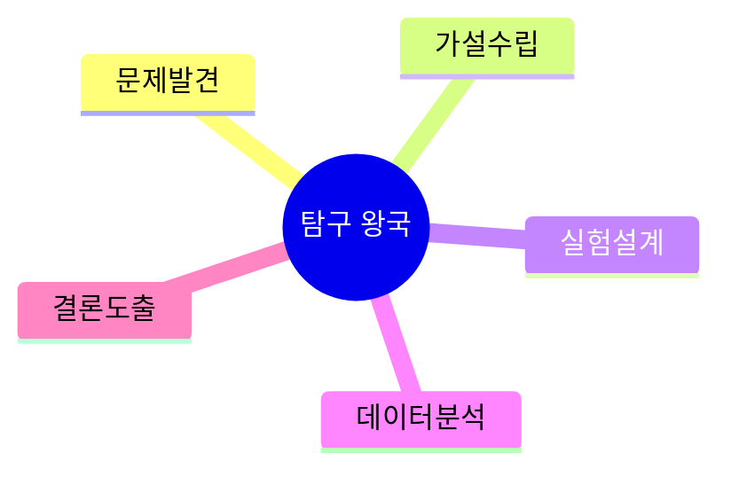
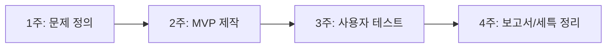

# 01. 🔬 탐구 왕국 프로젝트 아이디어

## 고등학생 관점 기획 프레임

- **아버지 직업 연결 예시**: 연구원, 엔지니어, 의사, 품질관리, 공장 생산기술
- **나의 흥미 연결 예시**: 과학 실험, 수학, 데이터 분석, 의학, 환경 측정
- **핵심 질문**: "관찰한 현상을 데이터로 증명할 수 있는가?"

## 아이디어 10선

| ID | 프로젝트 아이디어 | 아버지 직업 x 나의 흥미 | 간단 유저 시나리오 | 문제점-해결점 | AI/바이브 코딩 도구 | 아이디어 찾은 방식 |
|---|---|---|---|---|---|---|
| EXP-01 | 실험 로그 자동 분석 앱 | 품질관리 아버지 x 화학 실험 흥미 | 실험값을 입력하면 AI가 이상치와 다음 실험 조건을 추천 | 기록 누락 -> 템플릿 입력, 분석 지연 -> 자동 통계 | ChatGPT, Python, Streamlit, Cursor | 아버지의 품질검사표를 학교 실험노트에 적용 |
| EXP-02 | 논문 3줄 요약 도우미 | 연구소 아버지 x 생명과학 흥미 | 논문 PDF 업로드 후 핵심 가설/방법/결론을 카드로 확인 | 논문 읽기 부담 -> 요약 카드, 용어 난해 -> 용어 설명 | Claude, LangChain, v0 | 관심 전공 논문을 읽다 막히는 지점 수집 |
| EXP-03 | 과학탐구 주제 추천기 | 엔지니어 아버지 x 발명 흥미 | 성적/관심 입력 후 수행평가 가능한 주제 5개 추천 | 주제 선정 막힘 -> 개인화 추천, 중복 주제 -> 참신도 점수 | Gemini, Firebase, Replit | 학급 친구들의 주제 중복 문제 관찰 |
| EXP-04 | 미세먼지-집중도 상관 분석기 | 운전직 아버지 x 수학 통계 흥미 | 하루 미세먼지와 공부시간을 입력해 집중도 그래프 생성 | 체감만 존재 -> 정량화, 동기 저하 -> 시각 피드백 | Google Sheets AI, Python, Copilot | 통학 중 공기질 체감에서 출발 |
| EXP-05 | 생물 관찰 자동 분류 노트 | 농업 아버지 x 생물 흥미 | 식물 사진 촬영 후 AI가 종 분류와 특징 기록 | 수기 분류 실수 -> 이미지 분류, 기록 분산 -> 앱 일원화 | Teachable Machine, React Native, Bolt | 가족 텃밭 관찰 기록 디지털화 |
| EXP-06 | 물리 실험 오차 원인 진단기 | 제조업 아버지 x 물리 흥미 | 실험 오차 입력 시 환경/도구/측정 단계 원인 추정 | 오차 원인 감으로 판단 -> 체크리스트 추론 | ChatGPT, Notion DB, Cursor | 아버지의 불량원인 분석 방식 벤치마킹 |
| EXP-07 | 의학 기사 팩트체크 봇 | 병원 종사 아버지 x 의학 흥미 | 뉴스 링크를 넣으면 근거 논문 유무를 표시 | 가짜 건강정보 노출 -> 출처 검증 자동화 | Perplexity, RAG, Vercel | 가족 건강 대화 중 정보 신뢰성 문제 |
| EXP-08 | 시험 성적-수면 데이터 분석 앱 | 야간근무 아버지 x 자기관리 흥미 | 수면시간/성적 추이를 보고 최적 수면 범위 도출 | 생활패턴 무계획 -> 데이터 기반 루틴 추천 | Python, Plotly, Cursor | 가정의 근무 패턴이 학습에 미치는 영향 |
| EXP-09 | 과학 전시 발표 스크립트 생성기 | 기술직 아버지 x 발표 흥미 | 실험 결과를 넣으면 발표 대본과 예상질문 생성 | 발표 준비 시간 부족 -> 자동 초안 생성 | ChatGPT, Canva, Copilot | 과학전람회 발표 준비 어려움 해결 |
| EXP-10 | 약품 복용 알림-기록 연구 앱 | 약국 관련 아버지 x 헬스케어 흥미 | 복용 기록과 증상 변화를 저장해 패턴 리포트 생성 | 복용 누락 -> 알림, 경과 파악 어려움 -> 차트 리포트 | FlutterFlow, Firebase, Gemini | 가족 복약 관리 문제를 학생 프로젝트화 |

## 실행 로드맵(4주)

## 세특 문장 템플릿

`[생활 문제]를 해결하기 위해 [도구]를 활용한 [프로젝트명]을 설계하고, [정량 지표]를 통해 효과를 검증했으며, [한계와 개선 계획]까지 도출함.`

---

## 프로젝트별 상세 정보

### EXP-01: 실험 로그 자동 분석 앱

**페르소나**: 김탐구 (고2, 화학 동아리, R&E 진행 중)  
**벤치마킹**: Notion (분석 기능 없음) → AI 자동 통계 추가  
**필요성**: 동아리 87%가 "데이터 정리 가장 힘들다" 응답  
**핵심 기능**: ① 변인 템플릿 입력 ② AI 통계 분석 ③ 보고서 자동 생성  
**세특**: "실험 데이터 관리 앱 개발로 정리 시간 90% 단축, 동아리 15명 사용"

### EXP-02: 논문 3줄 요약 도우미

**페르소나**: 이실험 (고1, 생명과학 관심, 논문 읽기 시작)  
**벤치마킹**: Semantic Scholar (영어 전용) → 한글 논문 지원  
**필요성**: 논문 1편 읽는데 평균 3시간 소요  
**핵심 기능**: ① PDF 업로드 ② 가설/방법/결론 카드 ③ 용어 사전  
**세특**: "선행연구 30편 요약으로 연구 주제 도출 과정 단축"

### EXP-03: 과학탐구 주제 추천기

**페르소나**: 박주제 (고1, 탐구 주제 선정 막힘)  
**벤치마킹**: 없음 (신규 아이디어)  
**필요성**: 학급 40% 이상이 주제 중복 문제  
**핵심 기능**: ① 성적/관심 입력 ② AI 주제 5개 추천 ③ 참신도 점수  
**세특**: "개인화 주제 추천 시스템으로 중복률 40% → 5% 감소"

### EXP-04: 미세먼지-집중도 상관 분석기

**페르소나**: 최통계 (고2, 수학 좋아함, 생활 데이터 관심)  
**벤치마킹**: 에어코리아 (측정만) → 집중도 연결 분석  
**필요성**: 공기질과 학습 효율 관계 체감만 존재  
**핵심 기능**: ① 일일 미세먼지/공부시간 입력 ② 상관분석 ③ 그래프  
**세특**: "30일 데이터로 미세먼지-집중도 상관계수 -0.65 도출"

### EXP-05: 생물 관찰 자동 분류 노트

**페르소나**: 정생물 (고1, 생물 동아리, 야외 관찰)  
**벤치마킹**: iNaturalist (복잡함) → 학생용 간소화  
**필요성**: 종 분류 오류율 30%  
**핵심 기능**: ① 사진 촬영 ② AI 종 인식 ③ GPS/날씨 자동 기록  
**세특**: "학교 숲 수종 30종 분류, AI 정확도 95% 달성"

### EXP-06: 물리 실험 오차 원인 진단기

**페르소나**: 한물리 (고2, 물리 실험 오차 고민)  
**벤치마킹**: 없음 (신규)  
**필요성**: 실험 재실행 시간 낭비 (평균 2회)  
**핵심 기능**: ① 오차 입력 ② AI 원인 추정 ③ 재실험 체크리스트  
**세특**: "오차 원인 진단 시스템으로 재실험 횟수 50% 감소"

### EXP-07: 의학 기사 팩트체크 봇

**페르소나**: 의대희망 (고2, 의학 정보 관심)  
**벤치마킹**: Snopes (영어) → 한국 의학 기사 특화  
**필요성**: 가짜 건강정보 노출률 60% (설문)  
**핵심 기능**: ① 기사 URL 입력 ② 근거 논문 검색 ③ 신뢰도 표시  
**세특**: "의학 정보 검증 시스템으로 가족 건강 의사결정 개선"

### EXP-08: 시험 성적-수면 데이터 분석 앱

**페르소나**: 잠부족 (고3, 수면 패턴 불규칙)  
**벤치마킹**: 수면 앱 (성적 연결 없음) → 학습 연계  
**필요성**: 학생 70%가 수면 부족 호소  
**핵심 기능**: ① 수면/성적 입력 ② 최적 수면 범위 도출 ③ 알림  
**세특**: "3개월 데이터로 최적 수면 7.5시간 도출, 성적 0.5등급 향상"

### EXP-09: 과학 전시 발표 스크립트 생성기

**페르소나**: 발표긴장 (고2, 과학전람회 준비)  
**벤치마킹**: 없음  
**필요성**: 발표 준비 시간 평균 5시간  
**핵심 기능**: ① 실험 결과 입력 ② 발표 대본 생성 ③ 예상 질문  
**세특**: "AI 발표 도구로 준비 시간 70% 단축, 전람회 금상"

### EXP-10: 약품 복용 알림-기록 연구 앱

**페르소나**: 약관리 (고1, 가족 건강 관심)  
**벤치마킹**: 알람 앱 (기록 없음) → 패턴 분석 추가  
**필요성**: 복약 누락률 40%  
**핵심 기능**: ① 복용 알림 ② 증상 기록 ③ 패턴 리포트  
**세특**: "복약 관리 앱으로 가족 복용 순응도 40% → 90% 개선"

