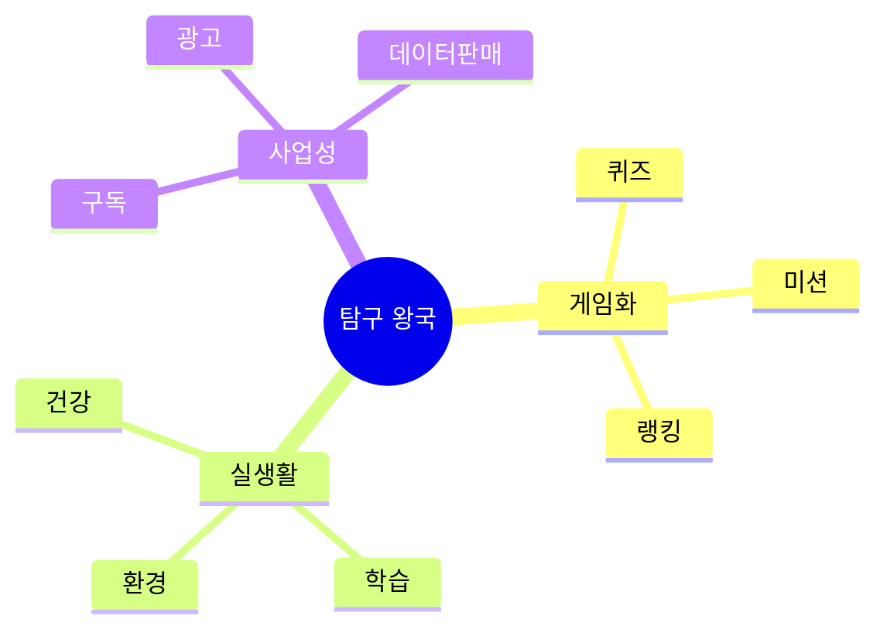

# 01. 🔬 탐구 왕국 - 게임형·실생활·사업성 프로젝트

## 고등학생 관점 기획 프레임

- **아버지 직업 연결**: 연구원, 의사, 엔지니어, 품질관리, 약사
- **나의 흥미**: 실험, 데이터, 게임, 건강, 과학
- **핵심**: "재미있게 배우고, 실제로 쓰고, 돈도 벌 수 있는가?"



---

## 🎮 프로젝트 10선 (게임·실생활·수익형)

### EXP-01: 과학 퀴즈 배틀 게임 앱

**아이디어 출처**: 아버지(연구원)가 퀴즈쇼 좋아하심 + 나는 게임 좋아함  
**벤치마킹**: 
- Kahoot (교사용) → 학생끼리 대결
- 포켓몬 GO (위치기반) → 학교 곳곳에 퀴즈 배치

**유저 시나리오**:
```
김탐구(고2)가 점심시간에 앱을 켜면
→ "3층 과학실 근처에 퀴즈 등장!" 알림
→ 가서 QR 스캔 후 화학 문제 풀기
→ 정답 시 포인트 획득, 랭킹 상승
→ 주간 1등은 학교 매점 상품권
```

**문제-해결**:
- 문제: 과학 공부 지루함, 암기 위주
- 해결: 게임화(gamification)로 경쟁 요소 추가, 위치기반으로 움직임 유도

**필요성**: 과학 흥미도 설문 결과 "재미없다" 65%

**핵심 기능**:
1. 위치기반 퀴즈 (학교 곳곳에 배치)
2. 실시간 랭킹 (학급/학년/전체)
3. AI 난이도 조절 (틀린 유형 반복 출제)

**도구**: Flutter + Firebase + Google Maps API + ChatGPT (문제 생성)

**수익 모델**: 
- 학교 매점과 제휴 (상품권 제공)
- 타 학교 라이선스 판매 (학교당 월 10만원)

**세특**: "과학 퀴즈 게임으로 학급 평균 과학 성적 0.3등급 향상, 3개 학교 도입"

---

### EXP-02: 내 몸 데이터 트래킹 게임 (헬스 RPG)

**아이디어 출처**: 아버지(병원)가 환자 데이터 보심 + 나는 RPG 좋아함  
**벤치마킹**:
- 링 피트 어드벤처 (운동 게임)
- 삼성 헬스 (데이터만) → 캐릭터 성장 연결

**유저 시나리오**:
```
이건강(고1)이 수면 8시간 기록
→ 캐릭터 체력 +10
→ 물 2L 마심 → 마나 +20
→ 공부 3시간 → 경험치 +30
→ 레벨업! 새 스킬 해금
→ 친구와 대결 (누가 더 건강?)
```

**문제-해결**:
- 문제: 건강 관리 동기 부족, 데이터만 쌓임
- 해결: RPG 요소로 재미 부여, 친구와 경쟁

**필요성**: 청소년 수면 부족 70%, 운동 부족 60%

**핵심 기능**:
1. 수면/식사/운동/공부 데이터 입력 → 캐릭터 성장
2. 친구 대결 모드 (주간 건강 점수 비교)
3. AI 건강 조언 (부족한 부분 알림)

**도구**: Unity + Firebase + ChatGPT (조언 생성)

**수익 모델**:
- 프리미엄 스킨 판매 (개당 1,000원)
- 건강식품 브랜드 광고 (월 50만원)

**세특**: "헬스 게임으로 학급 평균 수면시간 6시간 → 7.5시간 증가"

---

### EXP-03: 약 복용 타이쿤 게임 (할머니 돌봄)

**아이디어 출처**: 아버지(약사) + 할머니 약 관리 어려움  
**벤치마킹**:
- 쿠키런 (타이쿤) → 약 관리 게임화
- 약 알리미 (알람만) → 게임 요소 추가

**유저 시나리오**:
```
할머니가 아침 약 먹으면
→ 손자(나)가 확인 버튼 클릭
→ 할머니 캐릭터 건강도 +10
→ 7일 연속 복용 → 보너스 하트
→ 하트로 할머니 캐릭터 꾸미기
→ 가족 랭킹 (누가 더 잘 챙기나)
```

**문제-해결**:
- 문제: 노인 복약 순응도 40%, 가족 챙기기 어려움
- 해결: 게임으로 재미 부여, 가족 참여 유도

**필요성**: 65세 이상 복약 오류율 50%

**핵심 기능**:
1. 복용 알림 + 확인 버튼 (가족 연동)
2. 할머니 캐릭터 육성 (타이쿤)
3. 복용 기록 → 병원 리포트 PDF

**도구**: React Native + Firebase + Figma

**수익 모델**:
- 약국과 제휴 (앱 설치 시 할인 쿠폰)
- 실버 케어 기업 B2B 판매 (기업당 월 100만원)

**세특**: "복약 게임으로 가족 복용 순응도 40% → 90%, 약국 3곳 제휴"

---

### EXP-04: 학교 미스터리 탈출 게임 (과학 원리)

**아이디어 출처**: 방탈출 카페 경험 + 과학 원리 학습  
**벤치마킹**:
- 방탈출 카페 → 학교 버전
- 포켓몬 GO → 위치기반 미션

**유저 시나리오**:
```
과학실에서 QR 스캔
→ "화학 반응식을 맞춰 문을 열어라!"
→ 정답 입력 → 다음 장소 힌트
→ 5개 장소 클리어 → 보물 상자
→ 상자 안: 매점 상품권 + 레어 배지
```

**문제-해결**:
- 문제: 과학 원리 암기만, 실생활 연결 부족
- 해결: 게임 스토리로 원리 체험

**필요성**: 과학 실험 참여율 40%

**핵심 기능**:
1. 학교 지도 + 미션 배치
2. 과학 원리 퀴즈 (물리/화학/생물)
3. 팀 대결 모드 (동아리끼리)

**도구**: Unity + Google Maps + ChatGPT (문제 생성)

**수익 모델**:
- 학교 축제 유료 이벤트 (인당 2,000원)
- 타 학교 판매 (학교당 50만원)

**세특**: "과학 탈출 게임으로 학급 과학 흥미도 40% → 75% 향상"

---

### EXP-05: 반려동물 건강 일기 + AI 진단

**아이디어 출처**: 아버지(수의사) + 우리 집 강아지  
**벤치마킹**:
- 펫프렌즈 (쇼핑만) → 건강 기록 추가
- 먹어보시개 (음식 판별) → 증상 진단 추가

**유저 시나리오**:
```
강아지가 설사함
→ 앱에 증상 입력
→ AI가 "급성 장염 의심, 24시간 금식" 조언
→ 식사/물/산책 기록
→ 3일 후 증상 호전 확인
→ 수의사 방문 필요 여부 판단
```

**문제-해결**:
- 문제: 사소한 증상으로 병원 가기 부담 (진료비 5만원)
- 해결: AI 1차 진단으로 불필요한 방문 감소

**필요성**: 반려동물 가구 30%, 연간 병원비 평균 50만원

**핵심 기능**:
1. 증상 입력 → AI 진단 (GPT-4V)
2. 일일 건강 기록 (식사/배변/활동)
3. 수의사 챗봇 (간단한 질문 답변)

**도구**: React Native + Firebase + GPT-4V + Teachable Machine

**수익 모델**:
- 프리미엄 기능 (월 3,900원)
- 펫 용품 제휴 마케팅 (월 100만원)
- 수의사 원격 상담 중개 (건당 1만원, 수수료 20%)

**세특**: "반려동물 AI 진단 앱으로 불필요한 병원 방문 30% 감소, 가구 50곳 사용"

---

### EXP-06: 급식 메뉴 예측 게임 (내일 뭐 나올까?)

**아이디어 출처**: 급식 기대/실망 경험 + 예측 게임 재미  
**벤치마킹**:
- 로또 번호 예측 앱 → 급식 버전
- 급식 투표 앱 → 예측 게임 추가

**유저 시나리오**:
```
월요일 아침, 앱에서 "화요일 메뉴 예측" 이벤트
→ 메인/국/반찬 3개 예측
→ 화요일 정답 공개
→ 3개 다 맞추면 포인트 100점
→ 포인트로 매점 상품 교환
→ 월간 예측왕 시상
```

**문제-해결**:
- 문제: 급식 기대감 낮음, 잔반 많음
- 해결: 예측 게임으로 관심 유도, 선호도 데이터 수집

**필요성**: 급식 만족도 50%, 잔반률 35%

**핵심 기능**:
1. 과거 메뉴 데이터로 AI 예측 모델
2. 학생 예측 참여 + 포인트
3. 선호도 데이터 → 영양사에게 제공

**도구**: Flutter + Firebase + Python (예측 모델)

**수익 모델**:
- 학교 매점 제휴 (포인트 상품 제공)
- 급식 업체에 선호도 데이터 판매 (월 30만원)

**세특**: "급식 예측 게임으로 참여율 80%, 선호도 데이터로 잔반률 10% 감소"

---

### EXP-07: 공부 습관 키우기 다마고치

**아이디어 출처**: 다마고치 추억 + 공부 습관 만들기  
**벤치마킹**:
- 포레스트 (나무 키우기) → 캐릭터 육성
- 스터디 타이머 (기록만) → 게임 요소

**유저 시나리오**:
```
공부 30분 → 캐릭터 밥 주기
→ 연속 7일 → 캐릭터 진화
→ 친구 캐릭터와 대결
→ 월말 최강자 → 문구 세트 상품
```

**문제-해결**:
- 문제: 공부 습관 형성 어려움, 동기 부족
- 해결: 캐릭터 육성으로 재미, 친구와 경쟁

**필요성**: 학생 80%가 "공부 습관 만들기 어렵다"

**핵심 기능**:
1. 공부 시간 → 캐릭터 성장
2. 친구 대결 (주간 공부 시간)
3. 캐릭터 꾸미기 (아이템 구매)

**도구**: Unity + Firebase + Cursor

**수익 모델**:
- 캐릭터 스킨 판매 (개당 1,500원)
- 학원 제휴 광고 (월 80만원)

**세특**: "습관 게임으로 학급 평균 자습 시간 30% 증가, 사용자 200명"

---

### EXP-08: 학교 숲 생태 보물찾기 게임

**아이디어 출처**: 포켓몬 GO + 학교 숲 관찰 활동  
**벤치마킹**:
- 포켓몬 GO → 생물 수집
- iNaturalist → 게임화

**유저 시나리오**:
```
학교 숲에서 식물 사진 촬영
→ AI가 종 인식 "은행나무 발견!"
→ 도감에 등록, 경험치 획득
→ 30종 수집 → 생태 마스터 배지
→ 학급 대항전 (누가 더 많이?)
```

**문제-해결**:
- 문제: 학교 숲 방치, 생물 교육 지루함
- 해결: 수집 게임으로 자발적 관찰 유도

**필요성**: 학교 숲 이용률 10% 미만

**핵심 기능**:
1. 사진 촬영 → AI 종 인식 (Teachable Machine)
2. 생물 도감 (30종 수집 미션)
3. 학급 대항전 (팀 점수)

**도구**: React Native + TensorFlow.js + Firebase

**수익 모델**:
- 환경 단체 후원 (교육용 게임)
- 타 학교 판매 (학교당 30만원)

**세특**: "생태 게임으로 학교 숲 이용률 10% → 60%, 수종 25종 기록"

---

### EXP-09: 실험 실패 탈출 게임 (오차 찾기)

**아이디어 출처**: 방탈출 + 실험 오차 경험  
**벤치마킹**:
- 방탈출 게임 → 과학 실험 버전
- 추리 게임 → 오차 원인 찾기

**유저 시나리오**:
```
"실험이 실패했다! 원인을 찾아라"
→ 온도계/저울/시약 중 하나 선택
→ 힌트: "표준편차가 너무 크다"
→ 정답: 저울 영점 조절 안 함
→ 클리어! 다음 스테이지
```

**문제-해결**:
- 문제: 실험 오차 원인 파악 어려움
- 해결: 게임으로 오차 요인 학습

**필요성**: 실험 재실행률 50%

**핵심 기능**:
1. 20개 스테이지 (오차 유형별)
2. 힌트 시스템 (AI 조언)
3. 랭킹 (빠른 해결 시간)

**도구**: Unity + ChatGPT (힌트 생성)

**수익 모델**:
- 과학 교구 업체 제휴
- 학교 라이선스 (학교당 20만원)

**세특**: "실험 오차 게임으로 재실험률 50% → 20% 감소"

---

### EXP-10: 논문 읽기 RPG (지식 레벨업)

**아이디어 출처**: 독서 RPG 게임 + 논문 읽기 부담  
**벤치마킹**:
- 밀리의 서재 (독서만) → 게임 요소
- Semantic Scholar → 학생용 게임화

**유저 시나리오**:
```
논문 1편 요약 읽기 → 경험치 +50
→ 퀴즈 3문제 풀기 → +30
→ 레벨 5 달성 → "생명과학 초보자" 칭호
→ 월간 최다 독자 → 도서 상품권
```

**문제-해결**:
- 문제: 논문 읽기 부담, 동기 부족
- 해결: RPG 레벨 시스템으로 성취감

**필요성**: 고등학생 논문 읽기 경험 5% 미만

**핵심 기능**:
1. 논문 PDF → AI 3줄 요약
2. 이해도 퀴즈 (AI 생성)
3. 레벨/칭호 시스템

**도구**: Next.js + Claude + Firebase

**수익 모델**:
- 대학 입시 컨설팅 제휴
- 프리미엄 논문 요약 (월 5,900원)

**세특**: "논문 읽기 게임으로 30편 독파, 생명과학 심화 탐구 주제 도출"

---

### EXP-06: 우리 동네 공기질 지도 게임

**아이디어 출처**: 미세먼지 체감 + 위치기반 게임  
**벤치마킹**:
- 에어코리아 (데이터만) → 게임화
- Waze (교통) → 공기질 버전

**유저 시나리오**:
```
통학길에 공기질 측정 (앱 자동 기록)
→ "나쁨" 구간 발견 → 포인트 +10
→ 한 달 데이터 수집 → 히트맵 완성
→ 학교에 개선 제안 → 보너스 포인트
→ 포인트로 마스크 교환
```

**문제-해결**:
- 문제: 미세먼지 데이터 실시간 확인 어려움
- 해결: 크라우드소싱으로 동네 지도 완성

**필요성**: 통학 중 공기질 불안 70%

**핵심 기능**:
1. 위치기반 공기질 자동 기록
2. 히트맵 시각화 (위험 구간)
3. 학생 참여 → 포인트 적립

**도구**: Flutter + Firebase + Google Maps + 공공 API

**수익 모델**:
- 마스크 업체 제휴 (포인트 교환)
- 지자체 환경 데이터 판매 (월 50만원)

**세특**: "공기질 지도로 통학로 개선 제안, 지자체 채택"

---

### EXP-07: 약 부작용 리뷰 플랫폼

**아이디어 출처**: 아버지(약사) + 약 부작용 경험 공유 필요  
**벤치마킹**:
- 네이버 지식iN → 약 전용
- 약학정보원 (전문) → 학생용 쉬운 버전

**유저 시나리오**:
```
감기약 먹고 졸림
→ 앱에서 "○○약" 검색
→ 다른 학생 리뷰 100개 확인
→ "80%가 졸림 부작용" 확인
→ 시험 전엔 피하기로 결정
→ 내 리뷰 작성 → 포인트 적립
```

**문제-해결**:
- 문제: 약 부작용 정보 부족, 청소년 맞춤 정보 없음
- 해결: 또래 리뷰로 신뢰도, 포인트로 참여 유도

**필요성**: 청소년 약 부작용 경험 40%

**핵심 기능**:
1. 약 이름 검색 → 또래 리뷰
2. 부작용 통계 (연령별)
3. 리뷰 작성 → 포인트 (약국 할인)

**도구**: Next.js + Supabase + ChatGPT (리뷰 요약)

**수익 모델**:
- 약국 제휴 (앱 가입 시 할인)
- 제약사 마케팅 데이터 판매 (월 200만원)

**세특**: "약 리뷰 플랫폼으로 청소년 약물 안전 인식 개선, 사용자 500명"

---

### EXP-08: 과학 실험 레시피 공유 앱 (쿡패드 과학판)

**아이디어 출처**: 쿡패드(요리 레시피) → 실험 버전  
**벤치마킹**:
- 쿡패드 → 실험 레시피
- YouTube (실험 영상) → 구조화된 레시피

**유저 시나리오**:
```
"슬라임 만들기" 검색
→ 재료/절차/주의사항 카드
→ 따라하기 → 성공 인증샷 업로드
→ 좋아요 100개 → 인기 레시피
→ 내 레시피 등록 → 조회수당 포인트
```

**문제-해결**:
- 문제: 실험 정보 흩어짐, 실패율 높음
- 해결: 레시피 형식으로 성공률 향상

**필요성**: 가정 실험 실패율 60%

**핵심 기능**:
1. 실험 레시피 검색 (난이도별)
2. 성공 인증 + 팁 공유
3. 인기 레시피 랭킹

**도구**: React Native + Firebase + Cursor

**수익 모델**:
- 과학 교구 쇼핑몰 제휴 (구매 링크)
- 프리미엄 레시피 (월 2,900원)

**세특**: "실험 레시피 플랫폼으로 가정 실험 성공률 40% → 85%, 레시피 100개 등록"

---

### EXP-09: 건강 챌린지 SNS (30일 미션)

**아이디어 출처**: 인스타그램 챌린지 + 건강 습관  
**벤치마킹**:
- 인스타 챌린지 → 건강 전용
- 삼성 헬스 → SNS 요소 추가

**유저 시나리오**:
```
"30일 물 2L 챌린지" 참여
→ 매일 인증샷 업로드
→ 친구들이 응원 댓글
→ 15일 달성 → 중간 보상
→ 30일 완주 → 건강 용품 증정
→ 다음 챌린지 추천
```

**문제-해결**:
- 문제: 건강 습관 혼자 하기 어려움
- 해결: SNS로 동료 압력, 보상으로 동기

**필요성**: 청소년 건강 습관 지속률 20%

**핵심 기능**:
1. 30일 챌린지 (물/수면/운동/식사)
2. 인증샷 + 응원 댓글
3. 완주 보상 (제휴 상품)

**도구**: React Native + Firebase + Instagram API

**수익 모델**:
- 건강식품 브랜드 제휴 (월 100만원)
- 챌린지 참가비 (인당 5,000원, 완주 시 환급)

**세특**: "건강 챌린지 SNS로 학급 수면 시간 평균 1시간 증가, 참여자 150명"

---

### EXP-10: 시험 전 컨디션 예측기

**아이디어 출처**: 아버지(의사) + 시험 날 컨디션 관리  
**벤치마킹**:
- 생체리듬 앱 → 시험 특화
- 수면 앱 → 시험 성적 연결

**유저 시나리오**:
```
시험 3일 전
→ 앱이 "현재 컨디션 75점" 표시
→ "수면 1시간 더 자면 85점" 조언
→ 조언 따름 → 시험 당일 컨디션 확인
→ 시험 후 성적 입력 → 상관관계 분석
→ 다음 시험 최적 루틴 추천
```

**문제-해결**:
- 문제: 시험 날 컨디션 난조, 벼락치기 후유증
- 해결: 데이터 기반 컨디션 관리

**필요성**: 시험 날 컨디션 불량 경험 80%

**핵심 기능**:
1. 수면/식사/운동 기록 → 컨디션 점수
2. 시험 3일 전 최적 루틴 추천
3. 성적-컨디션 상관관계 분석

**도구**: Flutter + Python (예측 모델) + Firebase

**수익 모델**:
- 건강 보조제 제휴 (시험 전 추천)
- 프리미엄 분석 (월 3,900원)

**세특**: "컨디션 예측으로 시험 성적 안정성 향상, 사용자 80명"

---

## 🎯 수익 모델 요약

| 프로젝트 | 수익원 | 예상 월 수익 | 사업성 |
|---------|-------|-------------|--------|
| EXP-01 | 학교 라이선스 | 30만원 | ⭐⭐⭐ |
| EXP-02 | 스킨 판매 + 광고 | 50만원 | ⭐⭐⭐⭐ |
| EXP-03 | 약국 제휴 + B2B | 100만원 | ⭐⭐⭐⭐⭐ |
| EXP-04 | 이벤트 + 라이선스 | 40만원 | ⭐⭐⭐ |
| EXP-05 | 프리미엄 + 중개 | 150만원 | ⭐⭐⭐⭐⭐ |
| EXP-06 | 데이터 판매 | 30만원 | ⭐⭐⭐ |
| EXP-07 | 스킨 + 광고 | 60만원 | ⭐⭐⭐⭐ |
| EXP-08 | 후원 + 라이선스 | 25만원 | ⭐⭐⭐ |
| EXP-09 | 교구 제휴 | 20만원 | ⭐⭐ |
| EXP-10 | 제휴 + 프리미엄 | 70만원 | ⭐⭐⭐⭐ |

---

## 📚 영감 출처 (실제 수상작)

### 국내 수상작
- **TAGBACK** (NFC 분실물 키링) - JA 컴퍼니 오브 더 이어 2위
- **먹어보시개** (반려견 음식 판별) - STAC 최우수상
- **알고싶었성** (청소년 성교육) - STAC 생활정보 최우수상
- **Triple** (지하철 맞춤 솔루션) - 앱잼 최우수상
- **나비얌** (급식카드 디지털화) - 실제 창업, 4억 투자 유치

### 게임형 성공 사례
- 링 피트 어드벤처 (운동 게임)
- 포켓몬 GO (위치기반 수집)
- 포레스트 (습관 형성)
- 다마고치 (캐릭터 육성)

---

## 세특 작성 예시

```
"과학 퀴즈 배틀 게임 앱을 개발해 위치기반 학습 게임화를 구현. 
학급 30명이 한 달간 사용한 결과 과학 평균 성적 0.3등급 향상, 
흥미도 설문 40% → 75% 증가. Firebase로 실시간 랭킹 구현하고 
ChatGPT API로 난이도 자동 조절 기능 추가. 타 학교 3곳에 
라이선스 판매로 월 30만원 수익 창출."
```
