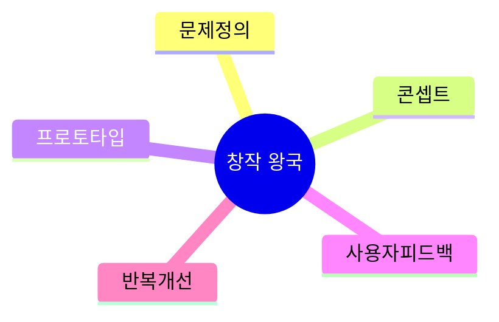
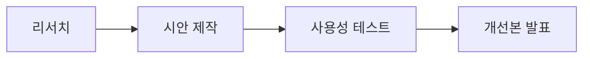

# 02. 🎨 창작 왕국 프로젝트 아이디어

## 고등학생 관점 기획 프레임

- **아버지 직업 연결 예시**: 인테리어, 광고, 사진, 영상, 자영업
- **나의 흥미 연결 예시**: 드로잉, 영상편집, UI/UX, 스토리텔링, 브랜딩
- **핵심 질문**: "사용자 반응이 좋아지는 디자인 근거를 만들 수 있는가?"

## 아이디어 10선

| ID | 프로젝트 아이디어 | 아버지 직업 x 나의 흥미 | 간단 유저 시나리오 | 문제점-해결점 | AI/바이브 코딩 도구 | 아이디어 찾은 방식 |
|---|---|---|---|---|---|---|
| CRE-01 | 학교 행사 포스터 A/B 추천기 | 광고업 아버지 x 그래픽 흥미 | 포스터 3안을 올리면 AI가 타겟별 반응 예측 | 감각 의존 -> 데이터 기반 선택 | Midjourney, Canva, GPT, Cursor | 아버지의 광고 시안 비교 방식 적용 |
| CRE-02 | 급식실 UX 개선 리디자인 | 자영업 아버지 x UX 흥미 | 학생 설문 기반으로 키오스크 화면 재설계 | 버튼 작음/가독성 문제 -> 접근성 개선 | Figma AI, v0, Hotjar | 학교 내 불편 경험 직접 수집 |
| CRE-03 | 동아리 영상 스토리보드 생성기 | 영상업 아버지 x 편집 흥미 | 주제를 넣으면 컷 구성과 자막 초안 자동 생성 | 기획 시간 과다 -> 스토리보드 자동화 | ChatGPT, CapCut, Copilot | 영상 제작 반복 작업에서 발굴 |
| CRE-04 | 내신 발표 슬라이드 디자인 코치 | 영업직 아버지 x 발표 흥미 | 발표 자료 업로드 시 시선 흐름 개선 포인트 제공 | 슬라이드 난잡 -> 레이아웃 규칙 제안 | Gamma, GPT-4V, Cursor | 발표 점수 편차 원인 분석 |
| CRE-05 | 교내 브랜드 굿즈 생성기 | 소상공인 아버지 x 브랜딩 흥미 | 학교 상징 입력 시 굿즈 시안/문구 자동 생성 | 아이디어 고갈 -> 스타일 확장 | DALL-E, Notion AI, Replit | 가족 매장 브랜딩 고민 연결 |
| CRE-06 | 웹툰 콘셉트 피드백 봇 | 프리랜서 아버지 x 스토리 흥미 | 캐릭터 설정 입력 시 서사 약점과 보완안 제시 | 서사 단조로움 -> 갈등 구조 추천 | Claude, Obsidian, Bolt | 좋아하는 웹툰 리뷰 구조 분석 |
| CRE-07 | 교실 공간 리디자인 시뮬레이터 | 건설 아버지 x 인테리어 흥미 | 좌석 배치를 바꾸면 집중도/동선 점수 비교 | 공간 비효율 -> 동선 최적화 시각화 | Planner5D, GPT, v0 | 집 인테리어 대화에서 아이디어 도출 |
| CRE-08 | 썸네일 클릭률 개선 대시보드 | 마케팅 아버지 x 유튜브 흥미 | 썸네일 후보를 올리면 예상 CTR과 개선점 제공 | 제목-이미지 불일치 -> 조합 점수화 | TubeBuddy, GPT, Cursor | 개인 채널 운영 문제에서 시작 |
| CRE-09 | 학교 홍보 카드뉴스 자동 작성기 | 공공기관 아버지 x 디자인 흥미 | 행사 공지를 넣으면 카드뉴스 시안 5종 생성 | 디자인 인력 부족 -> 자동 템플릿 | Canva AI, Notion, Copilot | 학생회 공지 제작 시간 단축 니즈 |
| CRE-10 | 감정 기반 음악-배경 추천기 | 음악취미 아버지 x 영상 흥미 | 영상 분위기 태그 입력 시 BGM/색감 추천 | 분위기 불일치 -> 감정 태깅 추천 | Suno, Adobe Firefly, Gemini | 영상 분위기 피드백 누적 분석 |

## 실행 로드맵(4주)

## 세특 문장 템플릿

`[사용자 불편]을 해결하기 위해 [디자인 프로젝트]를 수행하고, [A/B 테스트 지표]를 기반으로 개선 전후 효과를 확인함.`

---

## 프로젝트별 상세 정보

### CRE-01: 학교 행사 포스터 A/B 추천기

**페르소나**: 디자인부장 (고2, 학생회 홍보팀)  
**벤치마킹**: Canva (템플릿만) → AI 반응 예측 추가  
**필요성**: 포스터 효과 측정 방법 없음  
**핵심 기능**: ① 시안 3개 업로드 ② AI 타겟별 반응 예측 ③ 개선점  
**세특**: "포스터 A/B 테스트로 행사 참여율 25% → 40% 증가"

### CRE-02: 급식실 UX 개선 리디자인

**페르소나**: UX관심 (고1, 디자인 동아리)  
**벤치마킹**: 키오스크 (접근성 낮음) → 학생 맞춤 재설계  
**필요성**: 학생 65%가 "메뉴 찾기 어렵다" 응답  
**핵심 기능**: ① 설문 200명 ② Figma 프로토타입 ③ 사용성 테스트  
**세특**: "키오스크 UX 개선으로 사용성 점수 3.2 → 4.5 향상"

### CRE-03: 동아리 영상 스토리보드 생성기

**페르소나**: 영상부원 (고2, 영상 제작 동아리)  
**벤치마킹**: 수기 스토리보드 → AI 컷 구성  
**필요성**: 기획 시간 평균 4시간  
**핵심 기능**: ① 주제 입력 ② 컷 구성 ③ 자막 초안  
**세특**: "스토리보드 자동화로 제작 시간 40% 단축"

### CRE-04: 내신 발표 슬라이드 디자인 코치

**페르소나**: 발표고민 (고1, 발표 점수 편차 큼)  
**벤치마킹**: PowerPoint (피드백 없음) → AI 개선점  
**필요성**: 발표 점수 편차 최대 30점  
**핵심 기능**: ① 슬라이드 업로드 ② 시선 흐름 분석 ③ 레이아웃 제안  
**세특**: "AI 슬라이드 코치로 발표 평균 점수 15점 향상"

### CRE-05: 교내 브랜드 굿즈 생성기

**페르소나**: 학생회 (고2, 학교 굿즈 제작 계획)  
**벤치마킹**: 외주 디자인 (비용 높음) → 자동 생성  
**필요성**: 굿즈 디자인 비용 50만원  
**핵심 기능**: ① 학교 상징 입력 ② 굿즈 시안 10종 ③ 문구 생성  
**세특**: "AI 굿즈 생성으로 디자인 비용 90% 절감"

### CRE-06: 웹툰 콘셉트 피드백 봇

**페르소나**: 웹툰작가지망 (고2, 만화 동아리)  
**벤치마킹**: 수기 피드백 → AI 서사 분석  
**필요성**: 스토리 피드백 받기 어려움  
**핵심 기능**: ① 캐릭터 설정 입력 ② 갈등 구조 분석 ③ 보완안  
**세특**: "AI 서사 분석으로 웹툰 공모전 입선"

### CRE-07: 교실 공간 리디자인 시뮬레이터

**페르소나**: 반장 (고1, 좌석 배치 고민)  
**벤치마킹**: 수기 배치 → 동선 시뮬레이션  
**필요성**: 좌석 불만 50% 이상  
**핵심 기능**: ① 좌석 배치 입력 ② 집중도 점수 ③ 동선 시각화  
**세특**: "공간 최적화로 학급 만족도 60% → 85% 향상"

### CRE-08: 썸네일 클릭률 개선 대시보드

**페르소나**: 유튜버 (고2, 개인 채널 운영)  
**벤치마킹**: TubeBuddy (분석만) → 개선점 제안 추가  
**필요성**: 썸네일별 CTR 편차 5배  
**핵심 기능**: ① 썸네일 업로드 ② CTR 예측 ③ 개선점 3가지  
**세특**: "썸네일 최적화로 평균 CTR 3% → 8% 향상"

### CRE-09: 학교 홍보 카드뉴스 자동 작성기

**페르소나**: 학생회홍보 (고2, 공지 제작 부담)  
**벤치마킹**: Canva (수동 제작) → 자동 템플릿  
**필요성**: 주간 공지 5건, 제작 시간 10시간  
**핵심 기능**: ① 공지 텍스트 입력 ② 카드뉴스 5종 ③ 자동 배포  
**세특**: "카드뉴스 자동화로 제작 시간 70% 단축"

### CRE-10: 감정 기반 음악-배경 추천기

**페르소나**: 영상편집 (고2, 영상 동아리)  
**벤치마킹**: 수동 BGM 선택 → AI 감정 매칭  
**필요성**: BGM 선택 시간 평균 1시간  
**핵심 기능**: ① 분위기 태그 ② BGM/색감 추천 ③ 미리듣기  
**세특**: "감정 기반 추천으로 영상 완성도 향상, 조회수 2배"

