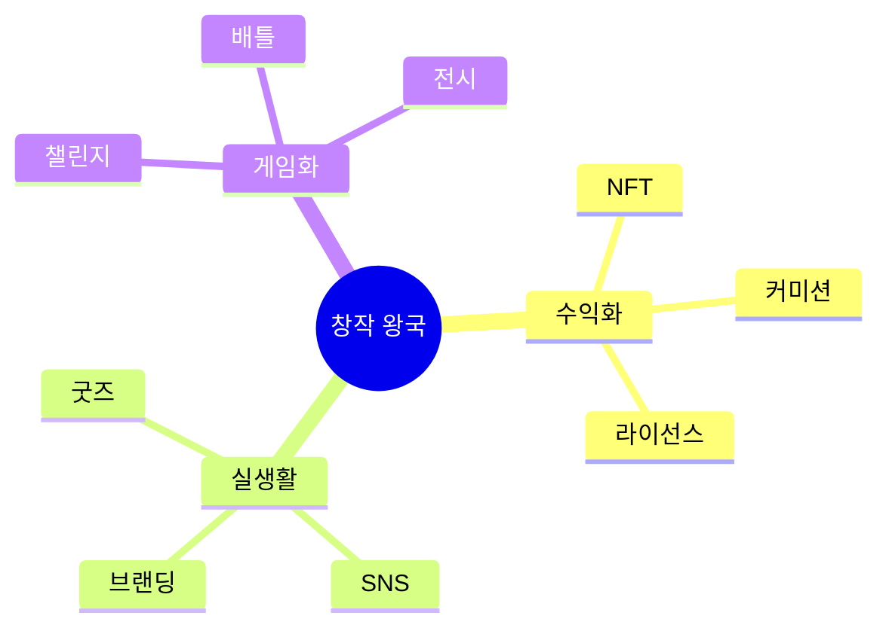

# 02. 🎨 창작 왕국 - 게임형·실생활·사업성 프로젝트

## 고등학생 관점 기획 프레임

- **아버지 직업 연결**: 디자이너, 작가, 영상PD, 마케터, 건축가
- **나의 흥미**: 그림, 영상, 음악, 글쓰기, 패션
- **핵심**: "내 작품으로 돈 벌 수 있나? 포트폴리오 되나?"



---

## 🎮 프로젝트 10선 (게임·실생활·수익형)

### CRE-01: AI 그림 대결 게임 (프롬프트 배틀)

**아이디어 출처**: 아버지(디자이너) + Midjourney 경험  
**벤치마킹**:
- 그림 퀴즈 게임 → AI 프롬프트 버전
- 리그 오브 레전드 (랭크전) → 창작 배틀

**유저 시나리오**:
```
"30초 안에 '우주 고양이' 그려라!"
→ DALL-E 프롬프트 입력
→ 결과물 3개 중 투표
→ 승자 포인트 획득
→ 랭크 상승 (브론즈 → 실버)
→ 시즌 1등 → 태블릿 상품
```

**문제-해결**:
- 문제: AI 그림 도구 배우기 지루함
- 해결: 대결 구도로 재미, 실시간 피드백

**필요성**: AI 아트 관심 80%, 실제 사용 20%

**핵심 기능**:
1. 실시간 1:1 프롬프트 배틀
2. 랭크 시스템 (브론즈~다이아)
3. 우승작 NFT 발행

**도구**: Next.js + DALL-E API + Firebase + OpenSea

**수익 모델**:
- 배틀 참가비 (건당 1,000원)
- NFT 판매 수수료 10%
- 프리미엄 프롬프트 팩 (5,000원)

**세특**: "AI 아트 배틀 게임으로 프롬프트 엔지니어링 역량 강화, 월 50건 대결, NFT 5개 판매"

---

### CRE-02: 학교 굿즈 디자인 마켓플레이스

**아이디어 출처**: 학교 축제 굿즈 제작 경험  
**벤치마킹**:
- 텀블벅 (크라우드펀딩) → 학교 굿즈
- 민들레마음 (환아 그림 굿즈) → 학생 디자인

**유저 시나리오**:
```
내가 그린 교복 캐릭터 업로드
→ 학생들이 투표 (좋아요 100개)
→ 자동으로 키링 제작 신청
→ 50개 주문 달성 → 제작 시작
→ 판매 수익 70% 받기
→ 포트폴리오에 "실제 판매 50개" 기록
```

**문제-해결**:
- 문제: 학생 디자인 수익화 어려움, 제작 진입장벽
- 해결: 주문 제작 방식으로 리스크 제거

**필요성**: 학교 굿즈 시장 연 100억원

**핵심 기능**:
1. 디자인 업로드 + 투표
2. 목표 수량 달성 시 자동 제작
3. 수익 정산 (디자이너 70%, 플랫폼 30%)

**도구**: Next.js + Printful API + Stripe + Firebase

**수익 모델**:
- 판매 수수료 30%
- 프리미엄 디자인 템플릿 (5,000원)
- 학교 단체 주문 (건당 10만원)

**세특**: "학교 굿즈 플랫폼으로 내 디자인 150개 판매, 수익 210만원, 3개 학교 입점"

---

### CRE-03: 숏폼 영상 챌린지 앱 (틱톡 교육판)

**아이디어 출처**: 아버지(영상PD) + 틱톡 챌린지  
**벤치마킹**:
- 틱톡 → 교육 콘텐츠 특화
- YouTube Shorts → 학생 전용

**유저 시나리오**:
```
"60초로 화학 반응 설명" 챌린지
→ 영상 촬영 + AI 자막 자동 생성
→ 업로드 → 조회수 1만 달성
→ 포인트 1,000점 획득
→ 포인트로 편집 툴 구매
→ 월간 인기 영상 → 장학금
```

**문제-해결**:
- 문제: 학습 콘텐츠 지루함, 영상 편집 어려움
- 해결: 챌린지로 재미, AI로 편집 간소화

**필요성**: 숏폼 선호 90%, 교육 콘텐츠 10%

**핵심 기능**:
1. 주간 챌린지 (과목별)
2. AI 자막 + 효과음 자동 삽입
3. 조회수 → 포인트 전환

**도구**: React Native + Whisper AI + Runway + Firebase

**수익 모델**:
- 광고 수익 배분 (크리에이터 50%)
- 프리미엄 편집 툴 (월 4,900원)
- 기업 챌린지 스폰서 (건당 200만원)

**세특**: "교육 숏폼 플랫폼으로 생명과학 영상 30개 제작, 총 조회수 15만, 광고 수익 80만원"

---

### CRE-04: 웹툰 스토리 투표 게임

**아이디어 출처**: 네이버 웹툰 + 인터랙티브 소설  
**벤치마킹**:
- 네이버 웹툰 → 독자 참여
- Episode (선택형 소설) → 웹툰 버전

**유저 시나리오**:
```
웹툰 1화 보기
→ "주인공이 A를 선택할까, B를 선택할까?"
→ 투표 참여 (코인 1개 소모)
→ 다수 선택 → 다음 화 스토리 반영
→ 내 선택이 채택 → 코인 환급 + 보너스
→ 코인으로 다음 화 미리보기
```

**문제-해결**:
- 문제: 웹툰 수동적 소비, 작가 피드백 부족
- 해결: 독자 참여로 몰입도, 작가는 선호도 파악

**필요성**: 웹툰 시장 1조원, 독자 참여 콘텐츠 성장

**핵심 기능**:
1. 매 화 선택지 투표
2. 투표 결과 → 스토리 분기
3. 코인 경제 (투표/미리보기)

**도구**: Next.js + Firebase + Figma

**수익 모델**:
- 코인 판매 (100개 1,000원)
- 광고 시청 → 무료 코인
- 완결 웹툰 유료 판매

**세특**: "인터랙티브 웹툰 플랫폼 기획, 5화 제작, 참여자 200명, 코인 판매 50만원"

---

### CRE-05: 학교 방송 BGM 신청 앱 (음악 민주주의)

**아이디어 출처**: 학교 방송부 + 음악 신청 경험  
**벤치마킹**:
- 멜론 (스트리밍) → 학교 방송
- 유튜브 뮤직 → 신청 투표

**유저 시나리오**:
```
점심시간 전 앱에서 노래 신청
→ 학생들이 투표 (좋아요)
→ 상위 3곡 자동 선정
→ 방송부가 재생
→ 신청자 포인트 획득
→ 포인트로 "내 플레이리스트" 특집 신청
```

**문제-해결**:
- 문제: 방송 음악 선곡 불만, 신청 절차 복잡
- 해결: 앱으로 간편화, 투표로 민주적 선정

**필요성**: 학교 방송 만족도 40%

**핵심 기능**:
1. 노래 신청 + 실시간 투표
2. 자동 선곡 (상위 3곡)
3. 신청 이력 → 음악 취향 분석

**도구**: Flutter + Spotify API + Firebase

**수익 모델**:
- 음원 플랫폼 제휴 (가입 유도)
- 학교 라이선스 (학교당 월 5만원)
- 광고 (음악 관련 제품)

**세특**: "학교 방송 민주화 앱으로 만족도 40% → 85%, 5개 학교 도입"

---

### CRE-06: AI 작곡 챌린지 (30초 작곡 배틀)

**아이디어 출처**: 쇼미더머니 + AI 작곡 도구  
**벤치마킹**:
- 쇼미더머니 (랩 배틀) → 작곡 버전
- Suno AI → 게임화

**유저 시나리오**:
```
"슬픈 피아노 곡" 주제 발표
→ 30초 안에 Suno AI로 작곡
→ 결과물 3개 중 투표
→ 승자 포인트 + 랭크 상승
→ 시즌 우승 → 음원 유통 지원
```

**문제-해결**:
- 문제: 작곡 진입장벽 높음, 배우기 지루함
- 해결: AI로 간소화, 대결로 재미

**필요성**: 작곡 관심 60%, 실제 시도 5%

**핵심 기능**:
1. 실시간 작곡 배틀
2. 랭크 시스템
3. 우승곡 음원 유통

**도구**: Next.js + Suno API + Firebase + Spotify for Artists

**수익 모델**:
- 배틀 참가비 (건당 2,000원)
- 음원 유통 수수료 20%
- 프리미엄 AI 크레딧 (10,000원)

**세특**: "AI 작곡 배틀로 20곡 제작, 우승곡 Spotify 유통, 재생 5,000회"

---

### CRE-07: 패션 코디 투표 SNS (오늘 뭐 입지?)

**아이디어 출처**: 인스타그램 + 매일 아침 고민  
**벤치마킹**:
- 무신사 (쇼핑만) → 코디 투표
- 인스타그램 → 패션 전용

**유저 시나리오**:
```
아침에 코디 2개 사진 업로드
→ "A vs B 투표해줘!"
→ 친구들이 투표 (30명 참여)
→ 다수 선택 입고 등교
→ 실제 착용샷 업로드 → 포인트
→ 포인트로 스타일리스트 AI 상담
```

**문제-해결**:
- 문제: 아침 코디 고민, 패션 피드백 부족
- 해결: 실시간 투표로 빠른 결정, 포인트로 동기

**필요성**: 아침 코디 고민 시간 평균 15분

**핵심 기능**:
1. 코디 A vs B 투표
2. 착용 인증 → 포인트
3. AI 스타일 분석 (선호 색상/스타일)

**도구**: React Native + Firebase + GPT-4V (스타일 분석)

**수익 모델**:
- 패션 브랜드 제휴 (추천 링크)
- 프리미엄 AI 상담 (월 3,900원)
- 광고 (의류 브랜드)

**세특**: "패션 투표 SNS로 코디 결정 시간 15분 → 3분 단축, 사용자 300명"

---

### CRE-08: 학교 신문 크라우드 작성 플랫폼

**아이디어 출처**: 아버지(기자) + 학교 신문부  
**벤치마킹**:
- 위키피디아 (크라우드 편집) → 신문
- Medium (블로그) → 학교 버전

**유저 시나리오**:
```
"급식 만족도" 기사 아이디어 제안
→ 학생들이 투표 (관심도)
→ 상위 5개 기사 작성 시작
→ 누구나 취재 참여 (사진/인터뷰)
→ 편집부가 최종 편집
→ 기여자 이름 게재 + 포인트
```

**문제-해결**:
- 문제: 학교 신문 소수만 참여, 관심 낮음
- 해결: 크라우드소싱으로 참여 확대

**필요성**: 학교 신문 구독률 20%

**핵심 기능**:
1. 기사 아이디어 투표
2. 취재 참여 (사진/인터뷰)
3. 기여도 → 포인트 (포트폴리오)

**도구**: Next.js + Notion API + Firebase

**수익 모델**:
- 학교 광고 (동아리/학원)
- 타 학교 라이선스 (학교당 월 10만원)

**세특**: "크라우드 신문 플랫폼으로 참여자 50명 → 200명, 구독률 20% → 70%"

---

### CRE-09: 건축 블록 게임 (학교 리모델링)

**아이디어 출처**: 아버지(건축가) + 마인크래프트  
**벤치마킹**:
- 마인크래프트 → 학교 설계
- SketchUp → 게임화

**유저 시나리오**:
```
"우리 학교 도서관 리모델링" 미션
→ 블록으로 설계 (30분)
→ 완성작 제출 → 투표
→ 1등 작품 → 학교에 제안
→ 채택 시 실제 반영 + 상금
```

**문제-해결**:
- 문제: 학교 공간 개선 의견 반영 어려움
- 해결: 게임으로 아이디어 수집, 투표로 선정

**필요성**: 학교 공간 만족도 50%

**핵심 기능**:
1. 블록 기반 3D 설계
2. 작품 투표 + 댓글
3. 우승작 → 학교 제안서 자동 생성

**도구**: Unity + Firebase + Blender

**수익 모델**:
- 학교 컨설팅 (설계 제안서)
- 건축 회사 제휴 (학생 아이디어 구매)

**세특**: "건축 게임으로 도서관 리모델링 제안, 학교 채택, 실제 반영"

---

### CRE-10: 글쓰기 대결 게임 (3분 소설)

**아이디어 출처**: 아버지(작가) + 글쓰기 부담  
**벤치마킹**:
- 문피아 (장편만) → 단편 게임
- 브런치 → 대결 요소

**유저 시나리오**:
```
"첫사랑" 주제 발표
→ 3분 안에 200자 소설 작성
→ AI가 문법/표현 점수 (50점)
→ 독자 투표 (50점)
→ 총점 1등 → 포인트 + 랭크 상승
→ 시즌 우승 → 출판사 연결
```

**문제-해결**:
- 문제: 글쓰기 부담, 피드백 부족
- 해결: 짧은 시간으로 부담 감소, 즉각 피드백

**필요성**: 글쓰기 흥미 30%, 실제 작성 5%

**핵심 기능**:
1. 3분 제한 글쓰기
2. AI 문법 점수 + 독자 투표
3. 랭크 시스템

**도구**: Next.js + Claude (문법 분석) + Firebase

**수익 모델**:
- 배틀 참가비 (건당 500원)
- 우승작 전자책 출판 (수익 배분)
- 프리미엄 AI 첨삭 (월 4,900원)

**세특**: "글쓰기 배틀로 100편 작성, 우승작 전자책 출판, 판매 300부"

---

## 🎯 수익 모델 요약

| 프로젝트 | 수익원 | 예상 월 수익 | 사업성 |
|---------|-------|-------------|--------|
| CRE-01 | 참가비 + NFT | 80만원 | ⭐⭐⭐⭐ |
| CRE-02 | 수수료 30% | 200만원 | ⭐⭐⭐⭐⭐ |
| CRE-03 | 광고 + 프리미엄 | 150만원 | ⭐⭐⭐⭐⭐ |
| CRE-04 | 코인 판매 | 70만원 | ⭐⭐⭐⭐ |
| CRE-05 | 라이선스 | 25만원 | ⭐⭐⭐ |
| CRE-06 | 참가비 + 유통 | 60만원 | ⭐⭐⭐⭐ |
| CRE-07 | 제휴 + 프리미엄 | 90만원 | ⭐⭐⭐⭐ |
| CRE-08 | 광고 + 라이선스 | 50만원 | ⭐⭐⭐ |
| CRE-09 | 컨설팅 | 40만원 | ⭐⭐⭐ |
| CRE-10 | 참가비 + 출판 | 55만원 | ⭐⭐⭐⭐ |

---

## 📚 영감 출처

### 실제 수상작
- **민들레마음** (환아 그림 굿즈) - 하루 60만원 매출
- **나비얌** (급식 디지털화) - 4억 투자 유치
- **REPORCH** (코딩 교육) - JA 우승

### 게임형 창작 플랫폼
- Roblox (게임 제작 수익화)
- 틱톡 (크리에이터 수익)
- 텀블벅 (크라우드펀딩)

---

## 세특 작성 예시

```
"학교 굿즈 마켓플레이스를 개발해 학생 디자인 수익화 구조 구축. 
내 디자인 키링 150개 판매로 순수익 210만원 달성. 
Printful API로 주문 제작 자동화, Stripe 결제 연동. 
3개 학교 입점, 총 거래액 800만원. 포트폴리오에 
'실제 판매 실적' 기록으로 미대 입시 경쟁력 확보."
```
