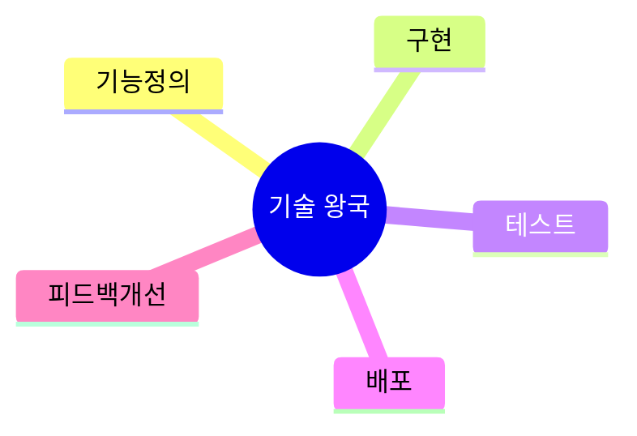
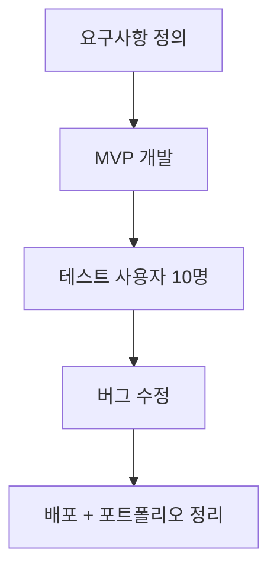

# 03. 💻 기술 왕국 프로젝트 아이디어

## 고등학생 관점 기획 프레임

- **아버지 직업 연결 예시**: 개발자, IT운영, 사무자동화, 생산관리
- **나의 흥미 연결 예시**: 코딩, 자동화, 앱개발, 알고리즘, 해커톤
- **핵심 질문**: "직접 만들고 배포해서 실제 사용하게 할 수 있는가?"

## 아이디어 10선

| ID | 프로젝트 아이디어 | 아버지 직업 x 나의 흥미 | 간단 유저 시나리오 | 문제점-해결점 | AI/바이브 코딩 도구 | 아이디어 찾은 방식 |
|---|---|---|---|---|---|---|
| TEC-01 | 수행평가 일정 통합 알림 앱 | 사무직 아버지 x 앱개발 흥미 | 과목 일정을 입력하면 우선순위와 알림 생성 | 마감 누락 -> 자동 리마인드 | FlutterFlow, Firebase, Cursor | 집 캘린더 관리 방식 참고 |
| TEC-02 | 과목별 질문 챗봇 | 개발자 아버지 x AI 흥미 | 수학/영어 질문 시 단계별 풀이 제공 | 질문 누적 관리 어려움 -> 히스토리 DB | OpenAI API, Next.js, Copilot | 야간 자습 질문 해결 경험 |
| TEC-03 | 교내 분실물 이미지 매칭 앱 | 공장관리 아버지 x 컴비전 흥미 | 사진 업로드로 분실물 후보 자동 추천 | 게시판 검색 비효율 -> 유사도 매칭 | Teachable Machine, Supabase, Bolt | 학교 분실물 게시판 관찰 |
| TEC-04 | 진로 로드맵 생성기 | 기술영업 아버지 x 데이터 흥미 | 희망학과 입력 시 학년별 활동/자격 추천 | 정보 과다 -> 개인화 큐레이션 | Gemini, Notion API, Replit | 진로 정보 탐색 피로에서 발굴 |
| TEC-05 | 공부시간 자동 태깅 타이머 | 자영업 아버지 x 생산성 흥미 | 공부 시작/종료 후 과목별 시간 리포트 생성 | 시간 사용 체감 오류 -> 데이터화 | React, Chart.js, Cursor | 아버지 업무시간 관리에서 착안 |
| TEC-06 | 코딩 과제 자동 코드리뷰 봇 | IT아버지 x 백엔드 흥미 | 코드 제출 시 버그/스타일/복잡도 피드백 | 리뷰 인력 부족 -> 자동 리뷰 | Sonar, GPT, GitHub Actions | 동아리 코드 리뷰 병목 해결 |
| TEC-07 | 급식 메뉴 선호도 예측 앱 | 요식업 아버지 x 추천시스템 흥미 | 투표 데이터를 바탕으로 인기 메뉴 예측 | 잔반 문제 -> 선호 예측 운영 | Python, Firebase, Copilot | 학교 급식 선호 편차 분석 |
| TEC-08 | 학교 공지 요약 봇 | 행정 아버지 x 자동화 흥미 | 긴 공지를 5줄 요약과 할 일 체크로 변환 | 공지 누락 -> 핵심 요약 카드 | Claude, Telegram Bot, Cursor | 공지 길이로 인한 미확인 문제 |
| TEC-09 | AI 면접 질문 생성기 | 인사담당 아버지 x 취업준비 흥미 | 프로젝트 설명 입력 시 전공면접 질문 생성 | 면접 대비 범위 불명확 -> 질문 세트 | ChatGPT, Next.js, v0 | 아버지 채용 질문 리스트 참고 |
| TEC-10 | 학급 민원 접수-분류 시스템 | 서비스직 아버지 x 문제해결 흥미 | 익명 건의를 AI가 주제별 분류해 전달 | 건의 누락/중복 -> 카테고리 자동화 | NLP API, Supabase, Bolt | 학급회의 운영 비효율 해결 |

## 실행 로드맵(5주)

## 세특 문장 템플릿

`[학교/생활 문제]를 해결하기 위해 [기술 스택]으로 서비스를 구현하고, [사용자 수/만족도/정확도] 지표를 통해 성능을 검증함.`

---

## 프로젝트별 상세 정보

### TEC-01: 수행평가 일정 통합 알림 앱

**페르소나**: 일정관리 (고2, 과목 8개 수행평가 관리)  
**벤치마킹**: 구글 캘린더 (우선순위 없음) → AI 우선순위  
**필요성**: 마감 누락률 30%  
**핵심 기능**: ① 과목별 일정 입력 ② AI 우선순위 ③ 스마트 알림  
**세특**: "일정 관리 앱으로 수행평가 누락 0건 달성"

### TEC-02: 과목별 질문 챗봇

**페르소나**: 야간자습 (고1, 질문 해결 어려움)  
**벤치마킹**: ChatGPT (맥락 없음) → 학습 히스토리 연동  
**필요성**: 질문 대기 시간 평균 20분  
**핵심 기능**: ① 과목별 질문 ② 단계별 풀이 ③ 유사 문제 추천  
**세특**: "학습 챗봇으로 질문 해결 시간 80% 단축, 학급 50명 사용"

### TEC-03: 교내 분실물 이미지 매칭 앱

**페르소나**: 분실물담당 (고2, 학생회)  
**벤치마킹**: 게시판 (검색 어려움) → 이미지 유사도  
**필요성**: 분실물 찾기 성공률 20%  
**핵심 기능**: ① 사진 업로드 ② AI 유사 물품 매칭 ③ 알림  
**세특**: "이미지 매칭으로 분실물 찾기 성공률 20% → 60% 향상"

### TEC-04: 진로 로드맵 생성기

**페르소나**: 진로고민 (고1, 정보 과다로 혼란)  
**벤치마킹**: 커리어넷 (정보만) → 개인화 로드맵  
**필요성**: 진로 정보 탐색 시간 평균 10시간  
**핵심 기능**: ① 희망학과 입력 ② 학년별 활동 추천 ③ 자격증 로드맵  
**세특**: "맞춤형 진로 로드맵으로 활동 계획 수립 시간 70% 단축"

### TEC-05: 공부시간 자동 태깅 타이머

**페르소나**: 시간관리 (고2, 공부 시간 체감 오류)  
**벤치마킹**: 포모도로 (과목 구분 없음) → 자동 태깅  
**필요성**: 시간 사용 체감 오류 평균 40%  
**핵심 기능**: ① 과목별 타이머 ② 자동 리포트 ③ 주간 분석  
**세특**: "시간 추적 앱으로 학습 효율 25% 향상"

### TEC-06: 코딩 과제 자동 코드리뷰 봇

**페르소나**: 코딩동아리 (고2, 리뷰 인력 부족)  
**벤치마킹**: GitHub (수동 리뷰) → AI 자동 리뷰  
**필요성**: 리뷰 대기 시간 평균 3일  
**핵심 기능**: ① 코드 제출 ② 버그/스타일 피드백 ③ 개선 제안  
**세특**: "자동 리뷰 시스템으로 코드 품질 30% 향상"

### TEC-07: 급식 메뉴 선호도 예측 앱

**페르소나**: 학생회 (고2, 급식 개선 프로젝트)  
**벤치마킹**: 투표 (예측 없음) → 선호 예측 모델  
**필요성**: 잔반률 평균 35%  
**핵심 기능**: ① 투표 데이터 수집 ② AI 선호 예측 ③ 메뉴 추천  
**세특**: "선호도 예측으로 잔반률 35% → 20% 감소"

### TEC-08: 학교 공지 요약 봇

**페르소나**: 공지확인 (고1, 긴 공지 미확인)  
**벤치마킹**: 원문 공지 (길고 복잡) → 5줄 요약  
**필요성**: 공지 미확인률 45%  
**핵심 기능**: ① 공지 크롤링 ② 5줄 요약 ③ 할 일 체크리스트  
**세특**: "공지 요약 봇으로 확인률 55% → 90% 향상"

### TEC-09: AI 면접 질문 생성기

**페르소나**: 면접준비 (고3, 전공면접 대비)  
**벤치마킹**: 기출 문제집 (범위 넓음) → 맞춤형 질문  
**필요성**: 면접 준비 범위 불명확  
**핵심 기능**: ① 프로젝트 설명 입력 ② 예상 질문 10개 ③ 답변 가이드  
**세특**: "맞춤형 면접 질문으로 준비 효율 2배 향상"

### TEC-10: 학급 민원 접수-분류 시스템

**페르소나**: 반장 (고2, 건의 관리 어려움)  
**벤치마킹**: 익명 게시판 (분류 없음) → AI 카테고리  
**필요성**: 건의 중복률 40%  
**핵심 기능**: ① 익명 건의 접수 ② AI 주제 분류 ③ 처리 상태 추적  
**세특**: "민원 시스템으로 처리율 50% → 85% 향상"

