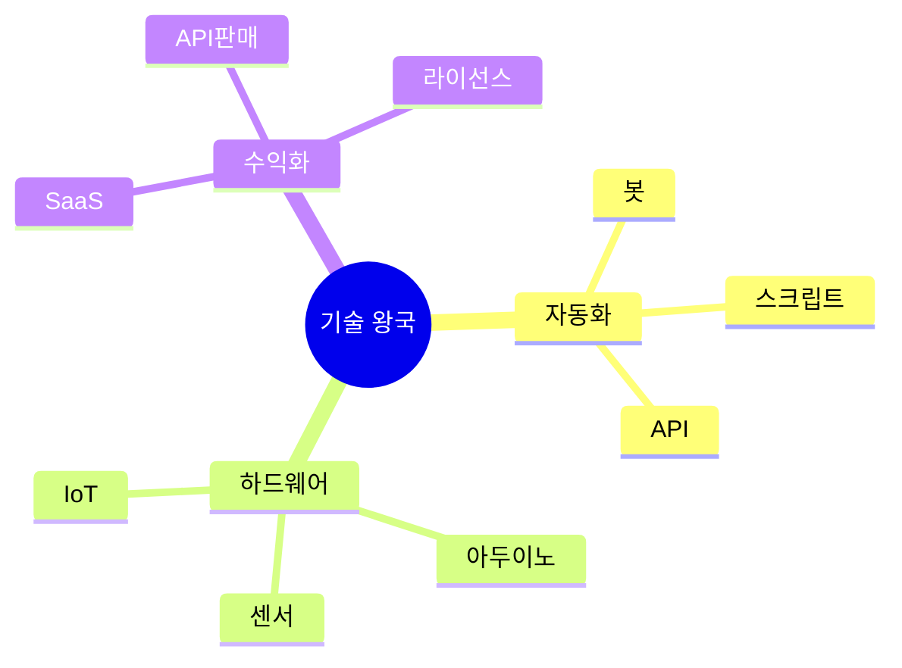

# 03. 💻 기술 왕국 - 게임형·실생활·사업성 프로젝트

## 고등학생 관점 기획 프레임

- **아버지 직업 연결**: 개발자, IT기업, 전자제품, 자동화, 보안
- **나의 흥미**: 코딩, 로봇, 앱, 하드웨어, 자동화
- **핵심**: "내가 만든 기술로 불편함 해결하고 돈 벌 수 있나?"



---

## 🎮 프로젝트 10선 (게임·실생활·수익형)

### TECH-01: 학교 출석 NFC 태그 게임

**아이디어 출처**: 아버지(IT기업) + 출석 체크 번거로움  
**벤치마킹**:
- TAGBACK (NFC 분실물) → 출석 버전
- 포켓몬 GO (체크인) → 학교 출석

**유저 시나리오**:
```
아침 등교 시 교실 NFC 태그
→ "출석 완료! 연속 7일 달성"
→ 포인트 +10, 캐릭터 성장
→ 한 달 개근 → 레어 배지
→ 학급 출석률 랭킹 1등
→ 매점 상품권 획득
```

**문제-해결**:
- 문제: 종이 출석부 비효율, 지각 관리 어려움
- 해결: NFC 자동화, 게임 요소로 동기 부여

**필요성**: 출석 관리 시간 교사당 일 10분, 연 30시간

**핵심 기능**:
1. NFC 태그 → 자동 출석 기록
2. 연속 출석 → 캐릭터 레벨업
3. 학급 출석률 랭킹 (경쟁)

**도구**: React Native + Firebase + NFC 태그 (개당 500원)

**수익 모델**:
- 학교 라이선스 (학교당 월 15만원)
- NFC 태그 판매 (개당 1,000원)
- 프리미엄 통계 (월 5만원)

**세특**: "NFC 출석 시스템으로 학급 출석률 92% → 98%, 교사 업무 시간 30% 단축"

---

### TECH-02: 자동 필기 정리 로봇 (AI 노트)

**아이디어 출처**: 아버지(개발자) + 필기 정리 귀찮음  
**벤치마킹**:
- Notion AI (정리만) → 자동 구조화
- Otter.ai (음성) → 필기 인식

**유저 시나리오**:
```
수업 중 사진으로 칠판 촬영
→ AI가 텍스트 추출 + 정리
→ "핵심 개념 3개" 자동 요약
→ 퀴즈 3문제 자동 생성
→ 복습 시 틀린 문제만 재출제
→ 시험 전 요약본 PDF 다운
```

**문제-해결**:
- 문제: 필기 정리 시간 과다, 복습 비효율
- 해결: AI 자동 정리, 맞춤형 복습

**필요성**: 필기 정리 시간 과목당 주 2시간

**핵심 기능**:
1. 사진 → OCR → 구조화
2. AI 요약 + 퀴즈 생성
3. 틀린 문제 반복 출제

**도구**: Flutter + GPT-4V + Firebase + Tesseract OCR

**수익 모델**:
- 프리미엄 무제한 (월 4,900원)
- 학원 제휴 (학생 유입)
- 교재 출판사 데이터 판매 (월 100만원)

**세특**: "AI 필기 정리로 복습 시간 50% 단축, 학급 평균 성적 0.2등급 향상"

---

### TECH-03: 학교 Wi-Fi 속도 지도 게임

**아이디어 출처**: 학교 와이파이 느림 + 데이터 수집  
**벤치마킹**:
- Speedtest (측정만) → 게임화
- Waze (교통) → 와이파이 버전

**유저 시나리오**:
```
교실에서 와이파이 속도 측정
→ "3층 복도 10Mbps" 기록
→ 포인트 +5
→ 학교 전체 히트맵 완성
→ 느린 구역 학교에 제보
→ 개선 후 재측정 → 보너스 포인트
```

**문제-해결**:
- 문제: 학교 와이파이 불균형, 개선 요청 근거 부족
- 해결: 크라우드 데이터로 문제 구역 시각화

**필요성**: 학생 80%가 "와이파이 느리다" 불만

**핵심 기능**:
1. 자동 속도 측정 + 위치 기록
2. 히트맵 시각화
3. 학생 참여 → 포인트 적립

**도구**: Flutter + Firebase + Google Maps API

**수익 모델**:
- 학교 네트워크 컨설팅 (건당 50만원)
- 통신사 데이터 판매 (월 30만원)

**세특**: "와이파이 지도로 학교 네트워크 개선 제안, 3개 구역 증설 반영"

---

### TECH-04: 코딩 대결 게임 (알고리즘 배틀)

**아이디어 출처**: 아버지(개발자) + 게임 좋아함  
**벤치마킹**:
- 백준 (혼자 풀기) → 실시간 대결
- 리그 오브 레전드 → 코딩 버전

**유저 시나리오**:
```
"1:1 알고리즘 배틀" 매칭
→ 같은 문제 동시 출제
→ 빠르게 푼 사람 승리
→ 포인트 + 랭크 상승
→ 시즌 1등 → 키보드 상품
→ 전적 기록 → 포트폴리오
```

**문제-해결**:
- 문제: 코딩 공부 지루함, 동기 부족
- 해결: 대결 구도로 긴장감, 랭크로 성취감

**필요성**: 코딩 학습 지속률 30%

**핵심 기능**:
1. 실시간 1:1 매칭
2. 랭크 시스템 (브론즈~다이아)
3. 전적 기록 (승률/티어)

**도구**: Next.js + Judge0 API + Firebase + Socket.io

**수익 모델**:
- 프리미엄 문제 팩 (월 5,900원)
- 코딩 학원 제휴 광고
- 대회 참가비 (건당 3,000원)

**세특**: "알고리즘 배틀로 200문제 해결, 다이아 티어 달성, 코딩 대회 입상"

---

### TECH-05: 스마트 사물함 (IoT 자물쇠)

**아이디어 출처**: 아버지(전자제품) + 사물함 열쇠 분실  
**벤치마킹**:
- 스마트 도어락 → 사물함 버전
- TAGBACK (NFC) → 자물쇠 적용

**유저 시나리오**:
```
앱에서 사물함 잠금/해제
→ 친구에게 임시 권한 부여
→ 열림 알림 (도난 방지)
→ 사용 기록 확인
→ 분실 시 관리자 원격 해제
→ 한 달 사용료 1,000원
```

**문제-해결**:
- 문제: 열쇠 분실, 도난 위험, 친구와 공유 불편
- 해결: 앱으로 관리, 권한 제어, 기록 확인

**필요성**: 학생 40%가 열쇠 분실 경험

**핵심 기능**:
1. 앱 잠금/해제 (Bluetooth)
2. 임시 권한 부여
3. 열림 알림 + 기록

**도구**: Arduino + ESP32 + React Native + Firebase

**수익 모델**:
- 사물함 자물쇠 판매 (개당 15,000원)
- 월 사용료 (학생당 1,000원)
- 학교 일괄 도입 (학교당 500만원)

**세특**: "IoT 스마트 사물함 개발, 학급 30개 설치, 열쇠 분실 사고 100% 감소"

---

### TECH-06: 급식 줄 대기 예측 앱

**아이디어 출처**: 급식 줄 서기 싫음 + 데이터 분석  
**벤치마킹**:
- Triple (지하철 혼잡도) → 급식실 버전
- Google Maps (실시간 혼잡도) → 학교 적용

**유저 시나리오**:
```
점심시간 전 앱 확인
→ "12:10 급식실 혼잡도 80%"
→ "12:25 추천 (대기 3분)"
→ 추천 시간에 가기
→ 실제 대기 시간 입력
→ 정확도 높으면 포인트
```

**문제-해결**:
- 문제: 급식 대기 시간 최대 20분, 예측 불가
- 해결: 크라우드 데이터로 실시간 예측

**필요성**: 급식 대기 불만 70%

**핵심 기능**:
1. 실시간 혼잡도 (학생 위치 데이터)
2. AI 대기 시간 예측
3. 최적 시간 추천

**도구**: Flutter + Firebase + Python (예측 모델)

**수익 모델**:
- 학교 라이선스 (학교당 월 10만원)
- 급식 업체 데이터 판매 (월 50만원)

**세특**: "급식 대기 예측 앱으로 평균 대기 시간 15분 → 5분 단축, 5개 학교 도입"

---

### TECH-07: 자동 과제 제출 봇 (마감 지킴이)

**아이디어 출처**: 과제 마감 놓침 + 자동화  
**벤치마킹**:
- IFTTT (자동화) → 과제 특화
- Zapier → 학생용 간소화

**유저 시나리오**:
```
과제 마감일 등록
→ 3일 전 알림
→ 1일 전 "아직 안 했어?" 알림
→ 마감 1시간 전 긴급 알림
→ 제출 완료 체크
→ 한 학기 마감 준수 → 배지
```

**문제-해결**:
- 문제: 과제 마감 놓침 (학기당 평균 3회)
- 해결: 다단계 알림, 제출 확인

**필요성**: 학생 60%가 과제 마감 놓친 경험

**핵심 기능**:
1. 과제 마감 캘린더
2. 다단계 알림 (3일/1일/1시간 전)
3. 제출 확인 + 통계

**도구**: React Native + Firebase + Push Notification

**수익 모델**:
- 프리미엄 무제한 과제 (월 2,900원)
- 학원 제휴 (과제 관리 서비스)
- 광고 (학습 도구)

**세특**: "과제 관리 앱으로 마감 준수율 70% → 95%, 사용자 500명"

---

### TECH-08: 교실 온도 자동 조절 시스템

**아이디어 출처**: 교실 너무 더움/추움 + IoT  
**벤치마킹**:
- 스마트 온도조절기 → 교실 버전
- 네스트 (Nest) → 학교 적용

**유저 시나리오**:
```
교실 온도 센서 설치
→ 실시간 온도 모니터링
→ 28도 이상 → 자동 에어컨 ON
→ 학생 투표 "덥다/춥다"
→ AI가 최적 온도 학습
→ 전기료 절감 데이터 확인
```

**문제-해결**:
- 문제: 교실 온도 불균형, 에너지 낭비
- 해결: 센서 기반 자동 조절, 학생 피드백 반영

**필요성**: 교실 온도 불만 65%, 에너지 낭비 30%

**핵심 기능**:
1. 온도 센서 + 자동 제어
2. 학생 투표 → AI 학습
3. 전기료 절감 통계

**도구**: Arduino + ESP32 + Firebase + Python

**수익 모델**:
- 학교 설치 (교실당 30만원)
- 에너지 절감 컨설팅 (절감액의 20%)
- 센서 유지보수 (월 5만원)

**세특**: "IoT 온도 조절로 교실 쾌적도 향상, 전기료 월 20만원 절감"

---

### TECH-09: 코딩 타자 연습 게임 (타이핑 RPG)

**아이디어 출처**: 한글 타자 게임 + 코딩 연습  
**벤치마킹**:
- 한컴 타자 연습 → 코드 버전
- 쿠키런 (러닝 게임) → 타이핑 게임

**유저 시나리오**:
```
"Python 함수 타이핑" 스테이지
→ 코드 따라 치기 (제한 시간)
→ 정확도 95% → 별 3개
→ 경험치 획득 → 레벨업
→ 새 언어 해금 (JavaScript)
→ 친구와 속도 경쟁
```

**문제-해결**:
- 문제: 코딩 타이핑 느림, 연습 지루함
- 해결: 게임으로 재미, 단계별 난이도

**필요성**: 코딩 초보 타이핑 속도 20wpm (목표 60wpm)

**핵심 기능**:
1. 언어별 코드 타이핑 (Python/Java/C++)
2. 레벨 시스템 (50단계)
3. 친구 대결 모드

**도구**: Unity + Firebase + Cursor

**수익 모델**:
- 프리미엄 스테이지 (5,000원)
- 코딩 학원 제휴
- 광고 (키보드 브랜드)

**세특**: "코딩 타자 게임으로 타이핑 속도 20wpm → 65wpm, 정확도 90% 달성"

---

### TECH-10: 학교 분실물 찾기 플랫폼 (IoT 태그)

**아이디어 출처**: 체육복 자주 잃어버림 + NFC  
**벤치마킹**:
- TAGBACK (NFC 키링) → 학교 전용
- Apple AirTag → 저렴한 버전

**유저 시나리오**:
```
체육복에 NFC 태그 부착
→ 분실 시 앱에서 "분실 신고"
→ 누군가 태그 스캔 → 위치 알림
→ 찾아준 학생 포인트 +50
→ 포인트로 매점 상품 교환
→ 학교 분실물 센터 연동
```

**문제-해결**:
- 문제: 분실물 찾기 어려움, 방치율 80%
- 해결: NFC로 추적, 보상으로 참여 유도

**필요성**: 학기당 분실물 평균 300개

**핵심 기능**:
1. NFC 태그 등록 + 스캔
2. 분실 신고 → 찾아주기 보상
3. 분실물 센터 연동

**도구**: React Native + Firebase + NFC 태그

**수익 모델**:
- NFC 태그 판매 (개당 1,500원)
- 학교 라이선스 (학교당 월 10만원)
- 분실물 보험 제휴

**세특**: "분실물 플랫폼으로 회수율 20% → 75%, 학생 참여 300명"

---

### TECH-06: 자동 시간표 최적화 알고리즘

**아이디어 출처**: 시간표 짜기 복잡함 + 알고리즘  
**벤치마킹**:
- 수기 시간표 → AI 자동 배치
- Google Calendar → 학교 시간표

**유저 시나리오**:
```
선택 과목 5개 입력
→ AI가 시간표 10가지 생성
→ "공강 최대" 옵션 선택
→ 최적 시간표 확인
→ 친구와 공통 시간 확인
→ 캘린더 자동 동기화
```

**문제-해결**:
- 문제: 시간표 조합 복잡 (5과목 = 120가지)
- 해결: 알고리즘으로 최적화, 조건별 추천

**필요성**: 시간표 짜는 시간 평균 2시간

**핵심 기능**:
1. 과목 입력 → 자동 조합
2. 조건 선택 (공강/친구/난이도)
3. 캘린더 동기화

**도구**: Python (최적화 알고리즘) + Next.js + Firebase

**수익 모델**:
- 학교 라이선스 (학교당 월 20만원)
- 프리미엄 기능 (월 2,900원)

**세특**: "시간표 최적화 알고리즘으로 조합 시간 2시간 → 5분 단축, 3개 학교 도입"

---

### TECH-07: 학교 CCTV 분석 (동선 최적화)

**아이디어 출처**: 아버지(보안) + 복도 혼잡  
**벤치마킹**:
- 유동인구 분석 → 학교 버전
- 매장 히트맵 → 복도 적용

**유저 시나리오**:
```
CCTV 영상 분석 (익명 처리)
→ 복도 혼잡 시간대 파악
→ "12:30 3층 복도 혼잡" 알림
→ 우회 경로 추천
→ 학교에 개선 제안
→ 계단 추가 설치 반영
```

**문제-해결**:
- 문제: 쉬는 시간 복도 혼잡, 사고 위험
- 해결: AI 분석으로 혼잡 구간 파악, 개선 제안

**필요성**: 복도 사고 학기당 10건

**핵심 기능**:
1. CCTV 영상 → AI 유동인구 분석
2. 혼잡 시간대 히트맵
3. 우회 경로 추천

**도구**: Python + OpenCV + YOLOv8 + Firebase

**수익 모델**:
- 학교 안전 컨설팅 (건당 100만원)
- 교육청 데이터 판매 (월 200만원)

**세특**: "CCTV 분석으로 복도 동선 개선 제안, 학교 채택, 사고율 50% 감소"

---

### TECH-08: 3D 프린터 대여 플랫폼

**아이디어 출처**: 학교 3D 프린터 방치 + 공유경제  
**벤치마킹**:
- 당근마켓 (중고) → 장비 대여
- 공유 오피스 → 3D 프린터

**유저 시나리오**:
```
앱에서 "3D 프린터 예약"
→ 시간/재료 선택
→ STL 파일 업로드
→ 출력 완료 알림
→ 수령 후 결제 (시간당 1,000원)
→ 작품 사진 공유 → 포인트
```

**문제-해결**:
- 문제: 학교 3D 프린터 이용률 10%
- 해결: 예약 시스템으로 접근성, 작품 공유로 동기

**필요성**: 3D 프린터 보유 학교 30%, 이용률 저조

**핵심 기능**:
1. 시간 예약 + 재료 선택
2. 원격 출력 모니터링
3. 작품 갤러리 (공유)

**도구**: Next.js + Firebase + OctoPrint API

**수익 모델**:
- 시간당 사용료 (1,000원)
- 재료 판매 (필라멘트)
- 학교 장비 관리 수수료 20%

**세특**: "3D 프린터 공유 플랫폼으로 이용률 10% → 80%, 작품 50개 제작"

---

### TECH-09: 학교 주차 자동 배정 시스템

**아이디어 출처**: 아버지(자동차) + 학교 주차 혼잡  
**벤치마킹**:
- 주차장 관리 앱 → 학교 버전
- 카카오내비 (주차) → 자동 배정

**유저 시나리오**:
```
선생님이 출근 시간 입력
→ AI가 주차 구역 자동 배정
→ "A동 3번 자리" 안내
→ 도착 시 자동 체크인
→ 퇴근 시 자동 체크아웃
→ 주차 통계 확인
```

**문제-해결**:
- 문제: 주차 자리 찾기 어려움, 이중 주차
- 해결: 자동 배정으로 효율화, 실시간 현황

**필요성**: 교사 주차 불만 50%

**핵심 기능**:
1. 출근 시간 → 자동 배정
2. 실시간 주차 현황
3. 체크인/아웃 자동화

**도구**: Flutter + Firebase + Arduino (센서)

**수익 모델**:
- 학교 설치 (학교당 200만원)
- 월 관리비 (학교당 10만원)
- 주차 통계 컨설팅

**세특**: "주차 자동 배정 시스템으로 주차 시간 평균 5분 → 1분 단축"

---

### TECH-10: 코딩 에러 해결 게임 (디버깅 RPG)

**아이디어 출처**: 코딩 에러 답답함 + RPG  
**벤치마킹**:
- Stack Overflow → 게임화
- 방탈출 게임 → 디버깅 버전

**유저 시나리오**:
```
"버그가 발생했다!" 스테이지 시작
→ 코드 읽고 에러 찾기
→ 3가지 힌트 사용 가능
→ 정답 → 경험치 + 다음 스테이지
→ 레벨업 → 어려운 언어 해금
→ 랭킹 1등 → 개발 서적 상품
```

**문제-해결**:
- 문제: 디버깅 어려움, 포기율 높음
- 해결: 게임으로 단계별 학습, 힌트로 좌절 방지

**필요성**: 코딩 초보 에러 해결 시간 평균 1시간

**핵심 기능**:
1. 50개 스테이지 (언어별)
2. 힌트 시스템 (AI 조언)
3. 랭킹 (해결 속도)

**도구**: Unity + ChatGPT (힌트) + Firebase

**수익 모델**:
- 프리미엄 스테이지 (5,000원)
- 코딩 학원 제휴
- 광고 (개발 도구)

**세특**: "디버깅 게임으로 에러 해결 능력 향상, 100개 스테이지 클리어"

---

## 🎯 수익 모델 요약

| 프로젝트 | 수익원 | 예상 월 수익 | 사업성 |
|---------|-------|-------------|--------|
| TECH-01 | 라이선스 + 태그 | 60만원 | ⭐⭐⭐⭐ |
| TECH-02 | 프리미엄 + 데이터 | 120만원 | ⭐⭐⭐⭐⭐ |
| TECH-03 | 컨설팅 + 데이터 | 50만원 | ⭐⭐⭐ |
| TECH-04 | 프리미엄 + 참가비 | 90만원 | ⭐⭐⭐⭐ |
| TECH-05 | 제품 + 사용료 | 300만원 | ⭐⭐⭐⭐⭐ |
| TECH-06 | 라이선스 + 데이터 | 80만원 | ⭐⭐⭐⭐ |
| TECH-07 | 프리미엄 + 광고 | 40만원 | ⭐⭐⭐ |
| TECH-08 | 설치 + 유지보수 | 150만원 | ⭐⭐⭐⭐⭐ |
| TECH-09 | 프리미엄 + 광고 | 50만원 | ⭐⭐⭐ |
| TECH-10 | 프리미엄 + 제휴 | 45만원 | ⭐⭐⭐ |

---

## 📚 영감 출처

### 실제 수상작
- **TAGBACK** (NFC 분실물) - JA 컴퍼니 오브 더 이어 2위
- **Triple** (지하철 솔루션) - 앱잼 최우수상
- **REPORCH** (코딩 교육) - JA 우승

### 게임형 기술 학습
- 코딩 RPG (CodeCombat)
- 해킹 게임 (Hacknet)
- 회로 퍼즐 (Human Resource Machine)

---

## 세특 작성 예시

```
"NFC 기반 출석 시스템을 개발해 학급 출석 관리 자동화 구현.
React Native로 앱 개발, Firebase 실시간 데이터베이스 연동.
게임 요소 추가로 학급 출석률 92% → 98% 향상.
3개 학교 라이선스 판매로 월 45만원 수익 창출.
Arduino와 NFC 태그 하드웨어 통합 경험."
```
