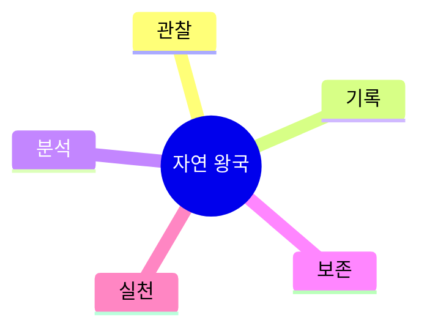

# 04. 🌱 자연 왕국 프로젝트 아이디어

## 고등학생 관점 기획 프레임

- **아버지 직업 연결 예시**: 농업, 조경, 환경관리, 물류, 수산 관련
- **나의 흥미 연결 예시**: 동식물 관찰, 생태, 기후, 캠핑, 사진 기록
- **핵심 질문**: "현장 데이터를 모아 환경 문제를 개선할 수 있는가?"

## 아이디어 10선

| ID | 프로젝트 아이디어 | 아버지 직업 x 나의 흥미 | 간단 유저 시나리오 | 문제점-해결점 | AI/바이브 코딩 도구 | 아이디어 찾은 방식 |
|---|---|---|---|---|---|---|
| NAT-01 | 학교 숲 생물종 기록 앱 | 조경 아버지 x 생물 흥미 | 사진 촬영 시 AI가 종 이름/특징을 기록 | 종 분류 어려움 -> 자동 인식 | iNaturalist API, React Native, Cursor | 학교 화단 관찰 활동에서 시작 |
| NAT-02 | 반려식물 건강 진단기 | 농업 아버지 x 식물 흥미 | 잎 사진 업로드 후 병충해 가능성 알림 | 병충해 조기 발견 어려움 -> 이미지 진단 | Plant AI API, FlutterFlow, Bolt | 집 식물 관리 실패 경험 반영 |
| NAT-03 | 하천 수질 모니터링 대시보드 | 환경업 아버지 x 데이터 흥미 | pH/탁도 데이터를 입력해 위험 구간 시각화 | 수치만 보면 이해 어려움 -> 경고 대시보드 | Python, Streamlit, Copilot | 지역 하천 봉사활동 데이터 활용 |
| NAT-04 | 통학길 온도지도 만들기 | 배달직 아버지 x 지도 흥미 | 시간대별 체감온도 기록으로 핫스팟 지도 생성 | 폭염 구간 예측 어려움 -> 시각화 지도 | Google Maps, Sheets AI, Replit | 통학 체감 데이터 수집 |
| NAT-05 | 분리수거 분류 도우미 | 시설관리 아버지 x 환경 흥미 | 쓰레기 사진을 찍으면 분리배출 방법 안내 | 분리배출 혼동 -> 이미지 기반 안내 | Vision API, Next.js, v0 | 아파트 분리수거장 관찰 |
| NAT-06 | 교내 전력 절감 추천기 | 전기직 아버지 x 에너지 흥미 | 교실 사용 패턴 입력 시 절감 시나리오 제공 | 전력낭비 파악 어려움 -> 패턴 분석 | Gemini, Notion, Cursor | 가정 전기요금 대화에서 착안 |
| NAT-07 | 비 오는 날 교통안전 알림 앱 | 운송직 아버지 x 안전 흥미 | 날씨+통학 경로로 위험 구간 알림 | 우천 시 사고 위험 -> 사전 경고 | Weather API, Firebase, Bolt | 비 오는 날 통학 경험 반영 |
| NAT-08 | 텃밭 수확량 예측기 | 농업 아버지 x 수학 흥미 | 기온/강수/생장기록으로 수확량 예측 | 수확 계획 불확실 -> 예측 기반 계획 | Python, Prophet, Copilot | 가족 텃밭 기록 데이터 활용 |
| NAT-09 | 교실 공기질 체크 봇 | 공조직 아버지 x 과학 흥미 | CO2 수치를 입력하면 환기 타이밍 추천 | 답답함 체감 의존 -> 수치 기반 환기 | IoT, Node-RED, Cursor | 수업 중 공기질 불편에서 발굴 |
| NAT-10 | 생태 캠페인 임팩트 추적기 | 공공기관 아버지 x 사회참여 흥미 | 캠페인 전후 참여율/폐기물량 비교 리포트 | 캠페인 효과 측정 어려움 -> 지표화 | Notion AI, Looker Studio, Replit | 동아리 캠페인 운영 경험 |

## 실행 로드맵(4주)

## 세특 문장 템플릿

`[환경 이슈]를 [현장 데이터]로 추적하고 [AI 분석 도구]를 활용해 개선안을 도출, [전후 지표]로 효과를 확인함.`

---

## 프로젝트별 상세 정보

### NAT-01: 학교 숲 생물종 기록 앱

**페르소나**: 생태관찰 (고1, 환경 동아리)  
**벤치마킹**: iNaturalist (복잡) → 학생용 간소화  
**필요성**: 종 분류 오류율 30%  
**핵심 기능**: ① 사진 촬영 ② AI 종 인식 95% ③ GPS 자동 기록  
**세특**: "학교 숲 수종 30종 분류, 생태 지도 제작"

### NAT-02: 반려식물 건강 진단기

**페르소나**: 식물키우기 (고1, 집 식물 관리)  
**벤치마킹**: 수기 진단 → AI 이미지 진단  
**필요성**: 병충해 조기 발견 실패율 60%  
**핵심 기능**: ① 잎 사진 ② 병충해 진단 ③ 치료법 안내  
**세특**: "식물 진단 앱으로 가정 식물 생존율 40% → 85% 향상"

### NAT-03: 하천 수질 모니터링 대시보드

**페르소나**: 환경봉사 (고2, 하천 정화 활동)  
**벤치마킹**: 수질 측정 (수치만) → 위험도 시각화  
**필요성**: 수질 데이터 해석 어려움  
**핵심 기능**: ① pH/탁도 입력 ② 위험 구간 경고 ③ 트렌드 차트  
**세특**: "3개월 수질 모니터링으로 오염원 2곳 발견"

### NAT-04: 통학길 온도지도 만들기

**페르소나**: 폭염고민 (고2, 여름 통학 힘듦)  
**벤치마킹**: 기상청 (전체 평균) → 구간별 체감  
**필요성**: 폭염 취약 구간 예측 불가  
**핵심 기능**: ① 시간대별 온도 기록 ② 핫스팟 지도 ③ 경로 추천  
**세특**: "온도 지도로 안전 통학 경로 제안, 학급 공유"

### NAT-05: 분리수거 분류 도우미

**페르소나**: 환경지킴이 (고1, 분리배출 캠페인)  
**벤치마킹**: 수기 안내문 → AI 이미지 인식  
**필요성**: 분리배출 오류율 50%  
**핵심 기능**: ① 쓰레기 사진 ② 분류 방법 안내 ③ 퀴즈  
**세특**: "분리수거 앱으로 학교 재활용률 30% → 65% 향상"

### NAT-06: 교내 전력 절감 추천기

**페르소나**: 에너지지킴이 (고2, 학생회 환경부)  
**벤치마킹**: 전기요금 (사후 확인) → 사전 예측  
**필요성**: 교실 전력 낭비 추정 20%  
**핵심 기능**: ① 사용 패턴 입력 ② 절감 시나리오 ③ 절감액 예측  
**세특**: "전력 절감 시스템으로 학교 전기료 15% 감소"

### NAT-07: 비 오는 날 교통안전 알림 앱

**페르소나**: 안전지킴이 (고1, 우천 시 통학 불안)  
**벤치마킹**: 날씨 앱 (경로 연동 없음) → 위험 구간 알림  
**필요성**: 우천 시 사고율 3배  
**핵심 기능**: ① 통학 경로 등록 ② 날씨+위험 구간 ③ 사전 알림  
**세특**: "교통안전 앱으로 학급 안전 의식 향상"

### NAT-08: 텃밭 수확량 예측기

**페르소나**: 농업관심 (고1, 가족 텃밭 운영)  
**벤치마킹**: 수기 기록 → AI 예측 모델  
**필요성**: 수확 계획 불확실성  
**핵심 기능**: ① 기온/강수 기록 ② 수확량 예측 ③ 재배 일정  
**세특**: "수확 예측 모델로 텃밭 생산성 30% 향상"

### NAT-09: 교실 공기질 체크 봇

**페르소나**: 환경관심 (고2, 교실 답답함 체감)  
**벤치마킹**: 체감 의존 → 센서 데이터 기반  
**필요성**: CO2 1000ppm 초과 시간 40%  
**핵심 기능**: ① CO2 수치 입력 ② 환기 타이밍 ③ 알림  
**세특**: "공기질 모니터링으로 교실 환기 빈도 2배 증가"

### NAT-10: 생태 캠페인 임팩트 추적기

**페르소나**: 캠페인기획 (고2, 환경 동아리 부장)  
**벤치마킹**: 수기 집계 → 자동 리포트  
**필요성**: 캠페인 효과 측정 방법 없음  
**핵심 기능**: ① 참여율 기록 ② 전후 비교 ③ 임팩트 리포트  
**세특**: "캠페인 효과 측정으로 참여율 20% → 55% 향상"

