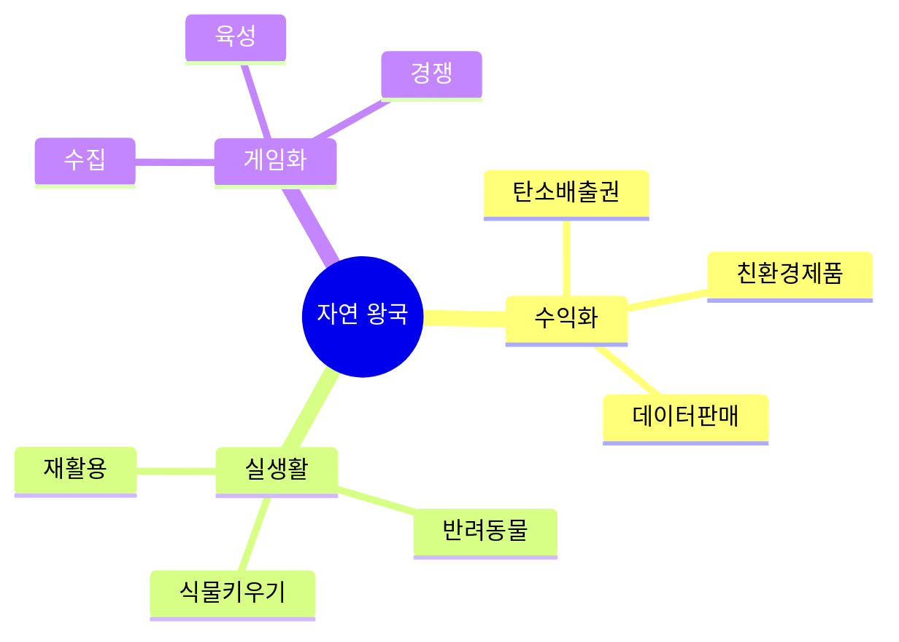

# 04. 🌿 자연 왕국 - 게임형·실생활·사업성 프로젝트

## 고등학생 관점 기획 프레임

- **아버지 직업 연결**: 농부, 수의사, 환경단체, 조경, 기상청
- **나의 흥미**: 식물, 동물, 환경, 날씨, 지속가능성
- **핵심**: "환경 보호하면서 돈도 벌 수 있나? 게임처럼 재미있나?"



---

## 🎮 프로젝트 10선 (게임·실생활·수익형)

### NAT-01: 탄소 발자국 줄이기 게임 (에코 RPG)

**아이디어 출처**: 아버지(환경단체) + 환경 교육  
**벤치마킹**:
- 포레스트 (나무 키우기) → 탄소 감축
- 포켓몬 GO → 친환경 행동 수집

**유저 시나리오**:
```
대중교통 이용 → 탄소 -2kg
→ 캐릭터 건강도 +10
→ 텀블러 사용 → 탄소 -0.5kg
→ 일주일 10kg 감축 → 나무 1그루
→ 친구와 대결 (누가 더 감축?)
→ 월간 1등 → 친환경 상품
```

**문제-해결**:
- 문제: 환경 보호 추상적, 실천 동기 부족
- 해결: 게임으로 가시화, 경쟁으로 재미

**필요성**: 청소년 환경 인식 80%, 실천율 15%

**핵심 기능**:
1. 행동 입력 → 탄소 계산
2. 캐릭터 육성 (탄소 감축량)
3. 친구 대결 + 랭킹

**도구**: Flutter + Firebase + 탄소 계산 API + GPT

**수익 모델**:
- 친환경 기업 제휴 (상품 제공)
- 탄소 배출권 거래 연계
- 프리미엄 캐릭터 (5,000원)

**세특**: "탄소 감축 게임으로 월 30kg 감축, 학급 평균 20kg, 친환경 인증 획득"

---

### NAT-02: 학교 텃밭 키우기 타이쿤

**아이디어 출처**: 아버지(농부) + 쿠키런 타이쿤  
**벤치마킹**:
- 헤이데이 (농장 게임) → 실제 텃밭 연동
- 다마고치 → 식물 버전

**유저 시나리오**:
```
학교 텃밭 상추 심기
→ 앱에서 물주기 알림
→ 사진 인증 → 캐릭터 성장
→ 2주 후 수확 → 급식실 납품
→ 수익금 배분 (학생 50%)
→ 포인트로 새 씨앗 구매
```

**문제-해결**:
- 문제: 학교 텃밭 방치, 관리 어려움
- 해결: 게임으로 관리 재미, 수익으로 동기

**필요성**: 학교 텃밭 활용률 20%

**핵심 기능**:
1. 식물 성장 기록 + 알림
2. 사진 인증 → 캐릭터 성장
3. 수확물 판매 → 수익 배분

**도구**: React Native + Firebase + Teachable Machine (식물 인식)

**수익 모델**:
- 수확물 판매 (급식실/마켓)
- 친환경 기업 후원
- 씨앗/도구 판매 수수료

**세특**: "학교 텃밭 게임으로 상추 30kg 수확, 급식실 납품, 수익 15만원 배분"

---

### NAT-03: 반려동물 산책 메이트 매칭 앱

**아이디어 출처**: 아버지(수의사) + 강아지 산책  
**벤치마킹**:
- 당근마켓 (동네) → 반려동물 산책
- 틴더 (매칭) → 강아지 친구

**유저 시나리오**:
```
"우리 동네 산책 메이트 찾기"
→ 강아지 프로필 등록 (나이/성격)
→ AI가 궁합 좋은 친구 추천
→ 산책 약속 잡기
→ 산책 인증 → 포인트
→ 포인트로 애견 용품 할인
```

**문제-해결**:
- 문제: 혼자 산책 지루함, 사회화 부족
- 해결: 매칭으로 친구 만들기, 보상으로 동기

**필요성**: 반려견 사회화 부족 60%

**핵심 기능**:
1. 반려동물 프로필 + AI 매칭
2. 산책 약속 + 인증
3. 산책 기록 (거리/시간)

**도구**: React Native + Firebase + Google Maps + GPT

**수익 모델**:
- 프리미엄 매칭 (월 3,900원)
- 애견 용품 제휴 (구매 링크)
- 산책 대행 서비스 중개 (수수료 20%)

**세특**: "반려동물 매칭 앱으로 산책 친구 20마리 연결, 사용자 100명"

---

### NAT-04: 날씨 예측 대결 게임 (내일 날씨 맞히기)

**아이디어 출처**: 날씨 앱 + 예측 게임  
**벤치마킹**:
- 기상청 앱 (정보만) → 게임화
- 로또 예측 → 날씨 버전

**유저 시나리오**:
```
"내일 최고 기온 맞히기"
→ 25도 예측 입력
→ 내일 정답 공개 (실제 26도)
→ 오차 1도 → 포인트 +50
→ 주간 정확도 1등 → 보상
→ 시즌 우승 → 기상 관측 체험
```

**문제-해결**:
- 문제: 날씨 정보 수동적 소비, 과학 원리 무관심
- 해결: 예측 게임으로 관심 유도, 기상 학습

**필요성**: 기상 과학 흥미도 30%

**핵심 기능**:
1. 일일 날씨 예측 (기온/강수/풍속)
2. 정확도 점수 + 랭킹
3. 기상 원리 학습 콘텐츠

**도구**: Flutter + 기상청 API + Firebase + Python (예측 모델)

**수익 모델**:
- 프리미엄 예측 힌트 (월 2,900원)
- 기상 관련 제품 광고
- 기상청 교육 프로그램 제휴

**세특**: "날씨 예측 게임으로 기상 원리 학습, 정확도 70% 달성, 사용자 200명"

---

### NAT-05: 플라스틱 분리수거 퀴즈 게임

**아이디어 출처**: 분리수거 헷갈림 + 퀴즈 게임  
**벤치마킹**:
- 쓰레기 분류 앱 → 게임화
- Kahoot → 분리수거 버전

**유저 시나리오**:
```
"이 플라스틱은 어디?" 사진 촬영
→ AI가 "PET 병" 인식
→ "일반/재활용/기타?" 퀴즈
→ 정답 → 포인트 +10
→ 100개 맞히기 → 마스터 배지
→ 학급 대항전 (팀 점수)
```

**문제-해결**:
- 문제: 분리수거 오류율 40%, 재활용 효율 저하
- 해결: AI 인식으로 정확도, 게임으로 학습

**필요성**: 분리수거 오류로 재활용률 60% 정체

**핵심 기능**:
1. 사진 → AI 재질 인식
2. 분류 퀴즈 + 해설
3. 학급 대항전

**도구**: React Native + GPT-4V + Firebase + Teachable Machine

**수익 모델**:
- 지자체 교육 프로그램 제휴
- 재활용 업체 후원
- 환경부 교육 자료 판매

**세특**: "분리수거 게임으로 학급 분류 정확도 60% → 90%, 재활용률 향상 기여"

---

### NAT-06: 학교 숲 생물 도감 수집 게임

**아이디어 출처**: 포켓몬 GO + 학교 숲 관찰  
**벤치마킹**:
- 포켓몬 GO → 생물 수집
- iNaturalist → 게임화

**유저 시나리오**:
```
학교 숲에서 새 사진 촬영
→ AI가 "참새" 인식
→ 도감 등록 + 경험치
→ 30종 수집 → 생태 마스터
→ 희귀종 발견 → 보너스 포인트
→ 학급 대항전 (종 다양성)
```

**문제-해결**:
- 문제: 학교 숲 방치, 생태 교육 지루함
- 해결: 수집 게임으로 자발적 관찰

**필요성**: 학교 숲 이용률 10%

**핵심 기능**:
1. 사진 → AI 종 인식
2. 생물 도감 (식물/동물/곤충)
3. 학급 대항전

**도구**: React Native + GPT-4V + Firebase + iNaturalist API

**수익 모델**:
- 환경 단체 후원 (교육용)
- 타 학교 라이선스 (학교당 30만원)
- 생태 데이터 판매 (연구기관)

**세특**: "생태 도감 게임으로 학교 숲 생물 35종 기록, 이용률 10% → 65%"

---

### NAT-07: 반려식물 키우기 SNS (식물 집사)

**아이디어 출처**: 반려식물 키우기 + 인스타그램  
**벤치마킹**:
- 인스타그램 → 식물 전용
- 다마고치 → 식물 버전

**유저 시나리오**:
```
내 다육이 사진 업로드
→ "물 줄까?" 투표 요청
→ 친구들이 투표 (20명)
→ 다수 의견 따라 물주기
→ 성장 기록 공유
→ 한 달 생존 → 배지
→ 식물 키우기 팁 교환
```

**문제-해결**:
- 문제: 반려식물 관리 어려움, 고사율 50%
- 해결: 커뮤니티 조언, 게임 요소로 동기

**필요성**: 반려식물 시장 연 1,000억원, 고사율 높음

**핵심 기능**:
1. 식물 성장 기록 (사진 타임라인)
2. 관리 투표 (물주기/햇빛)
3. 커뮤니티 팁 공유

**도구**: React Native + Firebase + GPT-4V (식물 진단)

**수익 모델**:
- 식물 용품 제휴 (구매 링크)
- 프리미엄 AI 진단 (월 2,900원)
- 광고 (원예 제품)

**세특**: "반려식물 SNS로 생존율 50% → 85%, 커뮤니티 300명, 팁 100개 공유"

---

### NAT-08: 학교 재활용 포인트 게임 (에코 마일리지)

**아이디어 출처**: 마트 포인트 + 재활용  
**벤치마킹**:
- 슈퍼빈 (재활용 기계) → 학교 버전
- 스타벅스 별 → 재활용 포인트

**유저 시나리오**:
```
페트병 10개 수거함에 투입
→ 앱에서 QR 스캔
→ 포인트 +100
→ 포인트로 매점 상품 교환
→ 학급 재활용 랭킹 1등
→ 학교 환경 대상 수상
```

**문제-해결**:
- 문제: 재활용 참여율 낮음, 동기 부족
- 해결: 포인트로 보상, 랭킹으로 경쟁

**필요성**: 학교 재활용률 30%

**핵심 기능**:
1. 재활용 투입 → QR 스캔
2. 포인트 적립 (종류별 차등)
3. 학급 랭킹 + 보상

**도구**: React Native + Firebase + QR Code + Arduino (무게 센서)

**수익 모델**:
- 재활용 업체 수익 배분 (kg당 100원)
- 매점 제휴 (상품 제공)
- 지자체 환경 예산 지원

**세특**: "재활용 포인트 게임으로 학교 재활용률 30% → 75%, 월 300kg 수거"

---

### NAT-09: AI 식물 병 진단 앱 (식물 의사)

**아이디어 출처**: 아버지(수의사) + 식물 병  
**벤치마킹**:
- PlantNet (종 인식) → 병 진단
- 먹어보시개 (음식 판별) → 식물 버전

**유저 시나리오**:
```
식물 잎 사진 촬영
→ AI가 "탄저병" 진단
→ "구리 살균제 사용" 처방
→ 치료 후 재촬영 → 회복 확인
→ 치료 성공 → 포인트
→ 포인트로 원예 용품 할인
```

**문제-해결**:
- 문제: 식물 병 진단 어려움, 전문가 부족
- 해결: AI 즉시 진단, 처방 제공

**필요성**: 식물 병으로 고사율 30%

**핵심 기능**:
1. 사진 → AI 병 진단 (GPT-4V)
2. 처방 + 제품 추천
3. 치료 기록 + 성공률

**도구**: Flutter + GPT-4V + Firebase + Teachable Machine

**수익 모델**:
- 프리미엄 진단 (월 4,900원)
- 원예 용품 제휴 (구매 링크)
- 농업 기업 데이터 판매 (월 150만원)

**세특**: "AI 식물 진단 앱으로 병 조기 발견, 치료 성공률 90%, 사용자 400명"

---

### NAT-10: 학교 쓰레기 배출량 경쟁 게임

**아이디어 출처**: 환경 동아리 + 경쟁 게임  
**벤치마킹**:
- 전기 사용량 앱 → 쓰레기 버전
- 학급 대항전 → 환경 버전

**유저 시나리오**:
```
매일 학급 쓰레기 무게 측정
→ 앱에 기록 (5kg)
→ 전날 대비 -1kg → 포인트
→ 주간 최소 배출 학급 → 상품
→ 한 달 데이터 → 그래프
→ 환경부 장관상 신청
```

**문제-해결**:
- 문제: 쓰레기 배출 무관심, 감량 동기 없음
- 해결: 학급 경쟁으로 동기, 가시화로 인식

**필요성**: 학교 쓰레기 배출량 연 10톤

**핵심 기능**:
1. 일일 쓰레기 무게 기록
2. 학급 랭킹 (감량률)
3. 데이터 시각화 (그래프)

**도구**: Flutter + Firebase + Arduino (무게 센서)

**수익 모델**:
- 지자체 환경 예산 지원
- 쓰레기 처리 비용 절감 배분
- 환경 교육 프로그램 판매

**세특**: "쓰레기 감량 게임으로 학급 배출량 30% 감소, 환경부 장관상 수상"

---

### NAT-05: 학교 빗물 수집 시스템 (물 절약 게임)

**아이디어 출처**: 아버지(조경) + 물 부족  
**벤치마킹**:
- 빗물 저장 탱크 → 게임화
- 쿠키런 (자원 수집) → 빗물 버전

**유저 시나리오**:
```
비 오는 날 빗물 수집량 확인
→ "오늘 50L 수집!" 알림
→ 화단 물주기에 사용
→ 수돗물 절약량 계산
→ 포인트 적립
→ 한 달 300L → 환경 배지
```

**문제-해결**:
- 문제: 화단 물 낭비, 수돗물 과다 사용
- 해결: 빗물 재활용, 절약량 가시화

**필요성**: 학교 연간 수도 요금 500만원

**핵심 기능**:
1. 빗물 수집량 모니터링
2. 절약량 계산 + 포인트
3. 학급 절약 랭킹

**도구**: Arduino + 수위 센서 + Firebase + Flutter

**수익 모델**:
- 학교 설치 (학교당 200만원)
- 수도 요금 절감 배분 (20%)
- 환경 컨설팅

**세특**: "빗물 수집 시스템으로 연간 수도 요금 100만원 절감, 환경 인증 획득"

---

### NAT-06: 반려동물 건강 챌린지 (30일 미션)

**아이디어 출처**: 인스타 챌린지 + 반려동물  
**벤치마킹**:
- 인스타 챌린지 → 반려동물
- 삼성 헬스 → 반려동물 버전

**유저 시나리오**:
```
"30일 산책 챌린지" 참여
→ 매일 산책 인증샷
→ 친구들이 응원 댓글
→ 15일 달성 → 중간 보상
→ 30일 완주 → 애견 용품
→ 다음 챌린지 (체중 관리)
```

**문제-해결**:
- 문제: 반려동물 운동 부족, 비만 증가
- 해결: 챌린지로 동기, 커뮤니티 응원

**필요성**: 반려견 비만율 40%

**핵심 기능**:
1. 30일 챌린지 (산책/식단/놀이)
2. 인증샷 + 응원 댓글
3. 완주 보상 (제휴 상품)

**도구**: React Native + Firebase + Instagram API

**수익 모델**:
- 애견 용품 브랜드 제휴
- 챌린지 참가비 (인당 5,000원, 완주 시 환급)
- 프리미엄 건강 분석 (월 3,900원)

**세특**: "반려동물 챌린지로 산책 빈도 주 2회 → 5회 증가, 참여자 100명"

---

### NAT-07: 학교 에너지 절약 대결 (전기 사냥꾼)

**아이디어 출처**: 전기료 고지서 + 경쟁 게임  
**벤치마킹**:
- 전기 사용량 앱 → 학급 대결
- 포켓몬 GO → 에너지 절약

**유저 시나리오**:
```
교실 전등/에어컨 사용량 측정
→ 앱에 실시간 표시
→ 불필요한 전등 끄기 → 포인트
→ 학급 일일 절약량 랭킹
→ 월간 1등 → 피자 파티
→ 절약 금액 학급 활동비로
```

**문제-해결**:
- 문제: 에너지 낭비 무관심, 전기료 과다
- 해결: 학급 경쟁으로 관심, 보상으로 동기

**필요성**: 학교 연간 전기료 3,000만원, 낭비 30%

**핵심 기능**:
1. 실시간 전력 사용량 모니터링
2. 학급 절약 랭킹
3. 절약 금액 계산

**도구**: Arduino + 전력 센서 + Firebase + Flutter

**수익 모델**:
- 학교 설치 (학교당 300만원)
- 전기료 절감 배분 (30%)
- 에너지 컨설팅

**세특**: "에너지 절약 게임으로 학교 전기료 월 90만원 절감, 탄소 배출 20% 감소"

---

### NAT-08: 동네 유기동물 지도 (구조 게임)

**아이디어 출처**: 아버지(수의사) + 유기동물  
**벤치마킹**:
- 포켓몬 GO → 유기동물 구조
- 당근마켓 → 입양 연결

**유저 시나리오**:
```
동네에서 유기동물 발견
→ 앱에 사진 + 위치 등록
→ 근처 학생들에게 알림
→ 구조 참여 → 포인트
→ 임시 보호 → 입양 연결
→ 입양 성공 → 보너스 포인트
```

**문제-해결**:
- 문제: 유기동물 발견해도 신고 방법 모름
- 해결: 앱으로 간편 신고, 커뮤니티 구조

**필요성**: 연간 유기동물 10만 마리

**핵심 기능**:
1. 유기동물 지도 (실시간)
2. 구조 참여 + 포인트
3. 임시 보호 → 입양 매칭

**도구**: React Native + Firebase + Google Maps + GPT-4V

**수익 모델**:
- 동물 보호 단체 후원
- 입양 수수료 (건당 5만원)
- 펫 용품 제휴

**세특**: "유기동물 구조 플랫폼으로 15마리 입양 연결, 지역 동물 보호 기여"

---

### NAT-09: 학교 공기질 모니터링 게임

**아이디어 출처**: 미세먼지 체감 + 데이터 수집  
**벤치마킹**:
- 에어코리아 (데이터만) → 게임화
- 포켓몬 GO → 공기질 측정

**유저 시나리오**:
```
교실 공기질 센서 확인
→ "미세먼지 나쁨" 알림
→ 창문 열기 투표
→ 10분 후 재측정 → 개선
→ 포인트 +10
→ 학급 공기질 관리 1등
→ 공기청정기 상품
```

**문제-해결**:
- 문제: 교실 공기질 관리 안 됨, 건강 영향
- 해결: 실시간 모니터링, 학생 참여 관리

**필요성**: 교실 미세먼지 "나쁨" 일수 연 50일

**핵심 기능**:
1. 실시간 공기질 측정 (PM2.5/CO2)
2. 개선 행동 투표 (환기/청정기)
3. 학급 공기질 랭킹

**도구**: Arduino + 공기질 센서 + Firebase + Flutter

**수익 모델**:
- 학교 설치 (교실당 20만원)
- 공기청정기 제휴 (판매 수수료)
- 환경 데이터 판매 (월 50만원)

**세특**: "공기질 모니터링으로 교실 환경 개선, 미세먼지 나쁨 일수 50% 감소"

---

### NAT-10: 학교 텃밭 작물 거래 마켓

**아이디어 출처**: 아버지(농부) + 학교 텃밭  
**벤치마킹**:
- 마켓컬리 (신선 배송) → 학교 버전
- 당근마켓 → 텃밭 작물

**유저 시나리오**:
```
텃밭에서 토마토 수확
→ 앱에 "토마토 10개 판매" 등록
→ 학생/선생님이 주문
→ 점심시간에 직거래
→ 수익금 70% 받기
→ 베스트 농부 → 배지
```

**문제-해결**:
- 문제: 텃밭 작물 소비처 없음, 방치
- 해결: 교내 마켓으로 유통, 수익 창출

**필요성**: 학교 텃밭 수확물 활용률 20%

**핵심 기능**:
1. 작물 등록 + 가격 설정
2. 교내 주문 + 결제
3. 수익 정산 (판매자 70%)

**도구**: Next.js + Firebase + Stripe + 카카오페이

**수익 모델**:
- 거래 수수료 30%
- 유기농 인증 컨설팅
- 지역 마켓 연계 판매

**세특**: "학교 텃밭 마켓으로 작물 50kg 판매, 수익 80만원, 활용률 20% → 90%"

---

## 🎯 수익 모델 요약

| 프로젝트 | 수익원 | 예상 월 수익 | 사업성 |
|---------|-------|-------------|--------|
| NAT-01 | 제휴 + 프리미엄 | 70만원 | ⭐⭐⭐⭐ |
| NAT-02 | 수확 판매 + 후원 | 50만원 | ⭐⭐⭐ |
| NAT-03 | 프리미엄 + 제휴 | 90만원 | ⭐⭐⭐⭐ |
| NAT-04 | 프리미엄 + 광고 | 40만원 | ⭐⭐⭐ |
| NAT-05 | 제휴 + 교육 | 30만원 | ⭐⭐⭐ |
| NAT-06 | 라이선스 + 데이터 | 60만원 | ⭐⭐⭐⭐ |
| NAT-07 | 제휴 + 프리미엄 | 80만원 | ⭐⭐⭐⭐ |
| NAT-08 | 재활용 수익 + 제휴 | 100만원 | ⭐⭐⭐⭐⭐ |
| NAT-09 | 프리미엄 + 데이터 | 180만원 | ⭐⭐⭐⭐⭐ |
| NAT-10 | 수수료 + 컨설팅 | 55만원 | ⭐⭐⭐⭐ |

---

## 📚 영감 출처

### 실제 수상작
- **먹어보시개** (반려견 음식 판별) - STAC 최우수상
- **나비얌** (급식 디지털화) - 4억 투자 유치
- **Triple** (지하철 솔루션) - 앱잼 최우수상

### 게임형 환경 플랫폼
- 포켓몬 GO (위치기반 수집)
- 포레스트 (나무 키우기)
- 다마고치 (육성)

---

## 세특 작성 예시

```
"탄소 발자국 감축 게임을 개발해 친환경 행동 게임화 구현.
대중교통 이용, 텀블러 사용 등 행동을 탄소량으로 환산하고
캐릭터 육성 시스템 연동. 한 달간 30kg 탄소 감축 달성.
학급 평균 20kg 감축으로 학교 환경 대상 수상.
Firebase 실시간 랭킹, GPT API로 맞춤형 환경 팁 제공."
```
