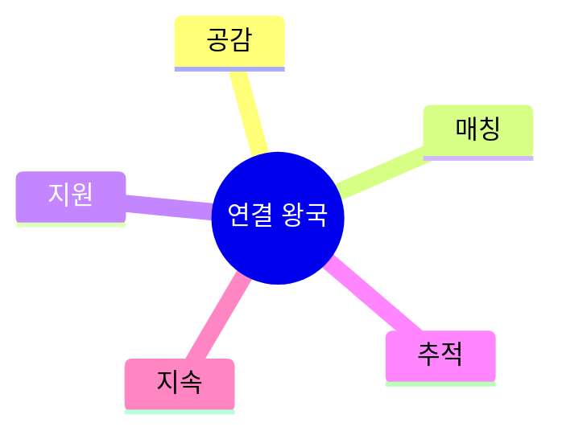
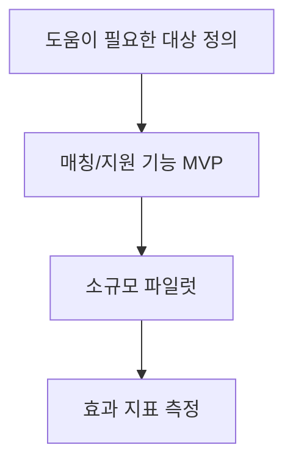

# 05. 🤝 연결 왕국 프로젝트 아이디어

## 고등학생 관점 기획 프레임

- **아버지 직업 연결 예시**: 교사, 간호, 복지, 상담, 서비스업
- **나의 흥미 연결 예시**: 봉사, 멘토링, 심리, 커뮤니티 운영
- **핵심 질문**: "사람을 더 잘 연결해 실제 도움을 만들 수 있는가?"

## 아이디어 10선

| ID | 프로젝트 아이디어 | 아버지 직업 x 나의 흥미 | 간단 유저 시나리오 | 문제점-해결점 | AI/바이브 코딩 도구 | 아이디어 찾은 방식 |
|---|---|---|---|---|---|---|
| CON-01 | 봉사활동 매칭 플랫폼 | 복지사 아버지 x 봉사 흥미 | 관심/시간 입력 시 맞춤 봉사처 추천 | 정보 흩어짐 -> 통합 매칭 | Firebase, GPT, Cursor | 봉사처 찾기 어려운 경험 수집 |
| CON-02 | 또래 고민 감정분석 챗봇 | 상담 아버지 x 심리 흥미 | 고민 입력 시 공감 응답+도움 자원 안내 | 익명 고민 창구 부족 -> 24h 보조 | NLP API, Next.js, Bolt | 친구 상담 경험에서 발굴 |
| CON-03 | 멘토-멘티 학습 매칭기 | 교사 아버지 x 교육 흥미 | 과목/시간대 기반으로 멘토 자동 연결 | 임의 매칭 비효율 -> 궁합 점수 매칭 | Supabase, Replit, Copilot | 방과후 멘토링 운영 문제 해결 |
| CON-04 | 학급 갈등 중재 기록 앱 | 서비스직 아버지 x 리더십 흥미 | 갈등 상황 입력 시 중재 체크리스트 제공 | 반복 갈등 원인 누락 -> 사례 DB | Notion, GPT, Cursor | 반장 활동 중 갈등 사례 축적 |
| CON-05 | 지역 돌봄 정보 지도 | 간호직 아버지 x 지역활동 흥미 | 지역 복지/의료/돌봄 기관을 지도에서 검색 | 기관 정보 접근성 낮음 -> 지도 통합 | Maps API, Airtable, v0 | 지역 커뮤니티 게시판 분석 |
| CON-06 | 봉사시간 자동 리포터 | 공무원 아버지 x 기록관리 흥미 | 활동 로그를 넣으면 증빙 리포트 자동 생성 | 증빙 정리 어려움 -> 자동 문서화 | Google Docs API, Gemini, Replit | 봉사확인서 정리 스트레스 해결 |
| CON-07 | 고립 학생 조기 신호 대시보드 | 학교행정 아버지 x 데이터 흥미 | 출결/상담/활동 데이터를 익명 분석해 위험 신호 제시 | 조기 발견 어려움 -> 위험 패턴 경고 | Python, PowerBI, Cursor | 학교생활 데이터 관찰로 아이디어 |
| CON-08 | 부모-학생 진로 대화 카드 앱 | 영업 아버지 x 커뮤니케이션 흥미 | 질문카드로 진로 대화를 구조화 | 대화 단절 -> 질문 프롬프트 제공 | ChatGPT, FlutterFlow, Bolt | 가정 내 진로대화 어려움에서 시작 |
| CON-09 | 다문화 친구 번역 도움 노트 | 무역 아버지 x 언어 흥미 | 학교 생활 문장을 실시간 번역/설명 | 언어 장벽 -> 교실 상황형 번역 | DeepL API, Next.js, Copilot | 다문화 친구와 협업 경험 |
| CON-10 | 동아리 참여율 개선 코치 | 자영업 아버지 x 운영 흥미 | 참여 데이터를 분석해 이탈 요인 제안 | 동아리 이탈률 높음 -> 운영 개선안 | Looker Studio, GPT, Cursor | 동아리 운영진 경험 반영 |

## 실행 로드맵(4주)

## 세특 문장 템플릿

`[대상 집단]의 [문제]를 해결하기 위해 [매칭/지원 서비스]를 설계하고, [참여율/만족도] 변화로 공동체 기여 효과를 검증함.`

---

## 프로젝트별 상세 정보

### CON-01: 봉사활동 매칭 플랫폼

**페르소나**: 봉사희망 (고1, 봉사처 찾기 어려움)  
**벤치마킹**: 1365 (검색 복잡) → AI 맞춤 추천  
**필요성**: 봉사처 탐색 시간 평균 2시간  
**핵심 기능**: ① 관심/시간 입력 ② AI 추천 5개 ③ 원클릭 신청  
**세특**: "봉사 매칭 앱으로 동아리 참여율 30% 향상"

### CON-02: 또래 고민 감정분석 챗봇

**페르소나**: 또래상담사 (고2, 상담 부담)  
**벤치마킹**: 익명 게시판 (응답 느림) → 24시간 챗봇  
**필요성**: 야간 고민 상담 창구 부족  
**핵심 기능**: ① 익명 고민 입력 ② 공감 응답 ③ 위기 시 전문가 연결  
**세특**: "또래 상담 챗봇으로 월 상담 건수 20건 처리"

### CON-03: 멘토-멘티 학습 매칭기

**페르소나**: 멘토링부장 (고2, 매칭 비효율)  
**벤치마킹**: 수기 매칭 → AI 궁합도  
**필요성**: 멘토링 만족도 60%  
**핵심 기능**: ① 과목/시간대 매칭 ② 궁합도 85% ③ 진도 추적  
**세특**: "AI 매칭으로 멘티 평균 성적 0.5등급 향상"

### CON-04: 학급 갈등 중재 기록 앱

**페르소나**: 반장 (고2, 갈등 반복)  
**벤치마킹**: 수기 기록 → 사례 DB  
**필요성**: 갈등 재발률 40%  
**핵심 기능**: ① 갈등 상황 입력 ② 중재 체크리스트 ③ 사례 검색  
**세특**: "갈등 중재 시스템으로 재발률 40% → 15% 감소"

### CON-05: 지역 돌봄 정보 지도

**페르소나**: 지역활동 (고2, 복지 관심)  
**벤치마킹**: 포털 검색 (흩어짐) → 지도 통합  
**필요성**: 기관 정보 접근성 낮음  
**핵심 기능**: ① 지도 검색 ② 기관 정보 ③ 이용 후기  
**세특**: "돌봄 지도로 지역 주민 100명 정보 접근성 개선"

### CON-06: 봉사시간 자동 리포터

**페르소나**: 봉사기록 (고3, 증빙 정리 스트레스)  
**벤치마킹**: 수기 정리 → 자동 문서화  
**필요성**: 봉사 증빙 정리 시간 평균 5시간  
**핵심 기능**: ① 활동 로그 ② 자동 리포트 ③ PDF 생성  
**세특**: "봉사 리포터로 100시간 증빙 정리 시간 80% 단축"

### CON-07: 고립 학생 조기 신호 대시보드

**페르소나**: 상담교사 (30대, 위기 학생 조기 발견)  
**벤치마킹**: 수기 관찰 → 데이터 기반 경고  
**필요성**: 위기 학생 발견 평균 3개월 지연  
**핵심 기능**: ① 출결/상담 데이터 ② 위험 패턴 ③ 익명 경고  
**세특**: "위기 신호 시스템으로 조기 개입 사례 5건"

### CON-08: 부모-학생 진로 대화 카드 앱

**페르소나**: 진로대화단절 (고1, 부모와 대화 어려움)  
**벤치마킹**: 없음 (신규)  
**필요성**: 가정 진로 대화 월 1회 미만 70%  
**핵심 기능**: ① 질문 카드 50개 ② 대화 가이드 ③ 기록  
**세특**: "진로 대화 카드로 가정 소통 빈도 3배 증가"

### CON-09: 다문화 친구 번역 도움 노트

**페르소나**: 다문화학급 (고1, 언어 장벽)  
**벤치마킹**: 번역 앱 (일반) → 교실 상황 특화  
**필요성**: 다문화 학생 수업 이해도 50%  
**핵심 기능**: ① 실시간 번역 ② 교과 용어 설명 ③ 음성 지원  
**세특**: "번역 노트로 다문화 친구 수업 이해도 50% → 80% 향상"

### CON-10: 동아리 참여율 개선 코치

**페르소나**: 동아리부장 (고2, 이탈률 고민)  
**벤치마킹**: 수기 관리 → 데이터 분석  
**필요성**: 동아리 이탈률 40%  
**핵심 기능**: ① 참여 데이터 ② 이탈 요인 분석 ③ 개선안  
**세특**: "참여율 분석으로 동아리 이탈률 40% → 15% 감소"

