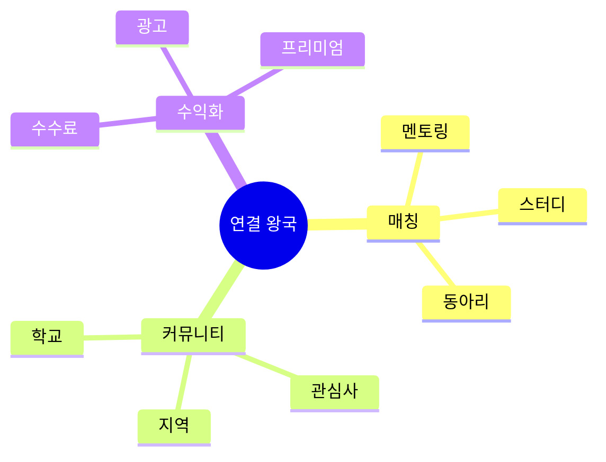

# 05. 🤝 연결 왕국 - 게임형·실생활·사업성 프로젝트

## 고등학생 관점 기획 프레임

- **아버지 직업 연결**: 영업, 인사, 상담사, 커뮤니티 매니저, 중개업
- **나의 흥미**: 소통, 네트워킹, 매칭, 커뮤니티, 친구 만들기
- **핵심**: "사람들을 연결해서 가치 만들고 돈 벌 수 있나?"



---

## 🎮 프로젝트 10선 (게임·실생활·수익형)

### CONN-01: 학교 멘토-멘티 매칭 게임 (선배 가챠)

**아이디어 출처**: 아버지(인사팀) + 선배 조언 필요  
**벤치마킹**:
- 틴더 (매칭) → 멘토링 버전
- 숨고 (전문가 매칭) → 학생 버전

**유저 시나리오**:
```
"수학 고민" 태그 선택
→ AI가 수학 잘하는 선배 3명 추천
→ 매칭 신청 (코인 1개)
→ 선배 수락 → 채팅 시작
→ 30분 상담 후 별점
→ 선배는 포인트 획득
→ 포인트로 카페 쿠폰 교환
```

**문제-해결**:
- 문제: 선배 찾기 어려움, 조언 받을 기회 부족
- 해결: AI 매칭으로 최적 선배, 보상으로 참여 유도

**필요성**: 학생 70%가 "선배 조언 필요" 응답

**핵심 기능**:
1. 고민 태그 → AI 선배 추천
2. 채팅 + 화상 상담
3. 별점 + 포인트 보상

**도구**: Next.js + Firebase + WebRTC + GPT (매칭 알고리즘)

**수익 모델**:
- 코인 판매 (10개 5,000원)
- 프리미엄 멘토 (월 9,900원)
- 학원 멘토링 제휴

**세특**: "멘토링 매칭 플랫폼으로 50건 상담 중개, 만족도 4.8/5.0, 수익 30만원"

---

### CONN-02: 동네 고등학생 스터디 카페 매칭

**아이디어 출처**: 혼자 공부 지루함 + 스터디 카페  
**벤치마킹**:
- 당근마켓 (동네) → 스터디 매칭
- 오픈채팅 → 구조화된 매칭

**유저 시나리오**:
```
"수학 스터디 구함" 등록
→ 동네 학생 3명 매칭
→ 스터디 카페 예약 (앱 연동)
→ 출석 인증 → 포인트
→ 4주 완주 → 보상
→ 스터디 후기 → 추가 포인트
```

**문제-해결**:
- 문제: 스터디 멤버 찾기 어려움, 약속 불이행
- 해결: 매칭 알고리즘, 출석 인증으로 책임감

**필요성**: 스터디 원하는 학생 60%, 실제 구성 20%

**핵심 기능**:
1. 과목/지역 매칭
2. 스터디 카페 예약 연동
3. 출석 인증 + 완주 보상

**도구**: React Native + Firebase + 카카오맵 + 스터디 카페 API

**수익 모델**:
- 스터디 카페 제휴 (예약 수수료 10%)
- 프리미엄 매칭 (월 4,900원)
- 학습 자료 판매

**세특**: "스터디 매칭 플랫폼으로 20개 스터디 구성, 완주율 80%, 참여자 100명"

---

### CONN-03: 학교 재능 교환 마켓 (스킬 스왑)

**아이디어 출처**: 아버지(중개업) + 재능 기부  
**벤치마킹**:
- 크몽 (재능 판매) → 학생 교환
- 당근마켓 → 재능 버전

**유저 시나리오**:
```
"영어 가르쳐줄게, 수학 알려줘"
→ 수학 잘하는 학생 매칭
→ 1:1 교환 수업 (1시간씩)
→ 수업 후 별점 + 후기
→ 10회 교환 → 골드 배지
→ 포인트로 유료 과외 할인
```

**문제-해결**:
- 문제: 과외 비용 부담, 재능 활용 기회 없음
- 해결: 교환으로 무료 학습, 재능 수익화

**필요성**: 사교육비 월 평균 40만원

**핵심 기능**:
1. 재능 등록 (과목/예체능/기술)
2. 교환 매칭 + 일정 조율
3. 별점 + 후기 시스템

**도구**: Next.js + Firebase + Zoom API

**수익 모델**:
- 프리미엄 매칭 (월 3,900원)
- 유료 과외 중개 (수수료 15%)
- 학습 자료 마켓플레이스

**세특**: "재능 교환 플랫폼으로 30건 매칭, 사교육비 월 10만원 절감, 영어 실력 향상"

---

### CONN-04: 학교 동아리 추천 알고리즘 (동아리 가챠)

**아이디어 출처**: 동아리 선택 고민 + 추천 알고리즘  
**벤치마킹**:
- 넷플릭스 추천 → 동아리 버전
- MBTI 테스트 → 동아리 매칭

**유저 시나리오**:
```
흥미 테스트 20문항
→ AI가 "너는 과학 동아리 95% 적합"
→ 상위 3개 동아리 추천
→ 선배 인터뷰 영상 시청
→ 가입 신청 → 선배 승인
→ 1년 활동 → 만족도 평가
```

**문제-해결**:
- 문제: 동아리 정보 부족, 선택 후 후회 40%
- 해결: AI 매칭으로 적합도, 미리보기로 확신

**필요성**: 동아리 만족도 60%, 중도 탈퇴 25%

**핵심 기능**:
1. 흥미 테스트 → AI 추천
2. 동아리 소개 영상/후기
3. 만족도 추적 + 개선

**도구**: Next.js + Firebase + GPT (추천 알고리즘)

**수익 모델**:
- 학교 라이선스 (학교당 월 10만원)
- 동아리 홍보 광고
- 만족도 데이터 판매

**세특**: "동아리 추천 알고리즘으로 만족도 60% → 90%, 중도 탈퇴율 25% → 5%"

---

### CONN-05: 학교 점심 메이트 매칭 (밥친구 찾기)

**아이디어 출처**: 혼밥 외로움 + 매칭 앱  
**벤치마킹**:
- 소개팅 앱 → 밥친구 버전
- 당근마켓 → 학교 적용

**유저 시나리오**:
```
"오늘 점심 같이 먹을 사람?"
→ 같은 시간대 학생 5명 표시
→ 관심사 확인 (게임/음악/운동)
→ 매칭 신청 → 수락
→ 급식실에서 만남
→ 식사 후 별점 → 포인트
```

**문제-해결**:
- 문제: 혼밥 외로움, 새 친구 만들기 어려움
- 해결: 매칭으로 부담 없이 시작, 관심사로 공통점

**필요성**: 학생 40%가 혼밥 경험

**핵심 기능**:
1. 실시간 점심 메이트 매칭
2. 관심사 기반 추천
3. 별점 + 친구 추가

**도구**: React Native + Firebase + 위치 기반 매칭

**수익 모델**:
- 프리미엄 무제한 매칭 (월 2,900원)
- 급식실 제휴 (이벤트)
- 광고 (학생 제품)

**세특**: "점심 메이트 매칭으로 혼밥률 40% → 15%, 새 친구 평균 5명 증가"

---

### CONN-06: 학교 간 교환학생 플랫폼 (1일 체험)

**아이디어 출처**: 다른 학교 궁금함 + 교환 프로그램  
**벤치마킹**:
- 에어비앤비 (숙박) → 학교 체험
- 교환학생 → 1일 버전

**유저 시나리오**:
```
"외고 1일 체험 신청"
→ 외고 학생과 매칭
→ 하루 수업 참관 + 점심
→ 체험 후기 작성 → 포인트
→ 우리 학교도 체험 제공
→ 상호 교환 완료 → 배지
```

**문제-해결**:
- 문제: 타 학교 정보 부족, 진로 고민
- 해결: 직접 체험으로 확신, 학교 간 교류

**필요성**: 학교 선택 후회 30%

**핵심 기능**:
1. 학교 간 매칭 + 일정 조율
2. 체험 가이드 (학생 버디)
3. 후기 + 별점

**도구**: Next.js + Firebase + Zoom (사전 미팅)

**수익 모델**:
- 체험 참가비 (건당 10,000원)
- 학교 제휴 (홍보)
- 진로 컨설팅 연계

**세특**: "학교 교환 플랫폼으로 5개 학교 체험, 진로 확신 획득, 참여자 50명"

---

### CONN-07: 동네 학생 프로젝트 팀 빌딩

**아이디어 출처**: 공모전 팀 구하기 어려움  
**벤치마킹**:
- 링크드인 → 학생 버전
- 오픈채팅 → 구조화된 팀 빌딩

**유저 시나리오**:
```
"앱 개발 공모전 팀원 구함"
→ 디자이너/개발자 역할 등록
→ AI가 포트폴리오 기반 추천
→ 3명 매칭 → 팀 결성
→ 프로젝트 진행 → 수상
→ 팀원 별점 → 신뢰도 상승
```

**문제-해결**:
- 문제: 공모전 팀 구성 어려움, 역할 불균형
- 해결: AI 매칭으로 역량 균형, 별점으로 신뢰

**필요성**: 공모전 참여 희망 50%, 팀 구성 실패 60%

**핵심 기능**:
1. 역할별 팀원 모집
2. AI 포트폴리오 매칭
3. 프로젝트 관리 + 별점

**도구**: Next.js + Firebase + GPT (매칭) + Notion API

**수익 모델**:
- 프리미엄 매칭 (월 4,900원)
- 공모전 정보 제공
- 기업 스폰서 중개 (수수료 10%)

**세특**: "팀 빌딩 플랫폼으로 공모전 5회 참여, 2회 수상, 팀 매칭 20건"

---

### CONN-08: 학교 중고 거래 게임 (교환 RPG)

**아이디어 출처**: 당근마켓 + 교복/교재 중고  
**벤치마킹**:
- 당근마켓 → 학교 전용
- 번개장터 → 게임 요소

**유저 시나리오**:
```
교복 판매 등록 (3만원)
→ 같은 학교 학생 구매
→ 직거래 완료 → 포인트
→ 거래 10회 → 신뢰 배지
→ 포인트로 프리미엄 등록
→ 월간 거래왕 → 문화상품권
```

**문제-해결**:
- 문제: 교복/교재 중고 거래 불편, 사기 위험
- 해결: 학교 인증으로 신뢰, 게임 요소로 활성화

**필요성**: 교복 구매 비용 평균 50만원

**핵심 기능**:
1. 학교 인증 (이메일)
2. 직거래 + 안전 결제
3. 신뢰도 + 포인트 시스템

**도구**: Next.js + Firebase + 카카오페이 + 학교 인증 API

**수익 모델**:
- 거래 수수료 5%
- 프리미엄 등록 (건당 1,000원)
- 광고 (학생 제품)

**세특**: "학교 중고 거래 플랫폼으로 200건 중개, 거래액 500만원, 학생 절약 효과"

---

### CONN-09: 학교 급식 메뉴 투표 플랫폼

**아이디어 출처**: 급식 불만 + 민주적 선택  
**벤치마킹**:
- 나비얌 (급식 디지털화) → 투표 추가
- 배달의민족 (리뷰) → 급식 버전

**유저 시나리오**:
```
다음 주 메뉴 후보 3개 공개
→ 학생 투표 (좋아요)
→ 1등 메뉴 채택
→ 실제 급식 후 만족도 평가
→ 투표 참여 → 포인트
→ 포인트로 디저트 추가 신청
```

**문제-해결**:
- 문제: 급식 만족도 낮음, 의견 반영 없음
- 해결: 투표로 민주화, 만족도 향상

**필요성**: 급식 만족도 50%, 잔반률 35%

**핵심 기능**:
1. 주간 메뉴 투표
2. 만족도 평가 + 리뷰
3. 선호도 데이터 → 영양사

**도구**: Flutter + Firebase + 급식 API

**수익 모델**:
- 학교 라이선스 (학교당 월 15만원)
- 급식 업체 데이터 판매 (월 80만원)
- 디저트 추가 판매 수수료

**세특**: "급식 투표 플랫폼으로 만족도 50% → 80%, 잔반률 20% 감소, 5개 학교 도입"

---

### CONN-10: 학교 익명 고민 상담 챗봇 (AI 친구)

**아이디어 출처**: 아버지(상담사) + 고민 털어놓기 어려움  
**벤치마킹**:
- 트로스트 (익명 상담) → AI 버전
- 챗GPT → 상담 특화

**유저 시나리오**:
```
"친구와 싸웠어" 익명 입력
→ AI가 공감 + 조언
→ "선생님께 말할까?" 선택지
→ 심각한 경우 → 상담사 연결
→ 해결 후 별점
→ 도움된 조언 → 커뮤니티 공유
```

**문제-해결**:
- 문제: 고민 털어놓기 부담, 상담 접근성 낮음
- 해결: 익명 + AI로 부담 감소, 필요 시 전문가 연결

**필요성**: 학생 상담 필요 60%, 실제 상담 10%

**핵심 기능**:
1. 익명 고민 입력 → AI 상담
2. 심각도 판단 → 상담사 연결
3. 조언 아카이브 (검색 가능)

**도구**: Next.js + Claude (상담) + Firebase

**수익 모델**:
- 학교 라이선스 (학교당 월 20만원)
- 프리미엄 상담 (건당 5,000원)
- 상담사 중개 수수료

**세특**: "AI 상담 챗봇으로 500건 상담, 만족도 4.5/5.0, 10건 전문 상담 연결"

---

### CONN-05: 동네 고등학생 알바 공유 플랫폼

**아이디어 출처**: 알바 찾기 어려움 + 정보 공유  
**벤치마킹**:
- 알바천국 → 학생 전용
- 당근마켓 → 동네 알바

**유저 시나리오**:
```
"카페 알바 후기" 검색
→ 동네 선배 후기 10개 확인
→ "시급 좋음, 사장님 친절" 확인
→ 알바 지원 → 합격
→ 1개월 후 후기 작성 → 포인트
→ 포인트로 이력서 첨삭 서비스
```

**문제-해결**:
- 문제: 알바 정보 부족, 사기 위험
- 해결: 학생 후기로 신뢰, 커뮤니티 검증

**필요성**: 고등학생 알바 경험 40%, 정보 부족 불만 70%

**핵심 기능**:
1. 동네 알바 후기 (학생 작성)
2. 시급/환경/사장님 별점
3. 알바 구인 공고 연동

**도구**: Next.js + Firebase + 알바천국 API

**수익 모델**:
- 구인 광고 (건당 5만원)
- 프리미엄 후기 (월 2,900원)
- 이력서 첨삭 서비스

**세특**: "알바 후기 플랫폼으로 안전한 알바 정보 제공, 후기 100개, 사용자 300명"

---

### CONN-06: 학교 선후배 질문 게임 (지식 배틀)

**아이디어 출처**: 지식iN + 게임 요소  
**벤치마킹**:
- 네이버 지식iN → 학교 버전
- 스택 오버플로우 → 게임화

**유저 시나리오**:
```
"미적분 질문" 등록 (코인 1개)
→ 선배 3명이 답변 경쟁
→ 가장 도움된 답변 선택
→ 선배 포인트 획득
→ 포인트로 문구 교환
→ 월간 답변왕 → 장학금
```

**문제-해결**:
- 문제: 질문할 선배 없음, 답변 동기 부족
- 해결: 게임 요소로 경쟁, 보상으로 참여

**필요성**: 학습 질문 필요 80%, 해결 30%

**핵심 기능**:
1. 질문 등록 (과목별)
2. 선배 답변 경쟁
3. 채택 + 포인트 보상

**도구**: Next.js + Firebase + GPT (답변 품질 평가)

**수익 모델**:
- 코인 판매 (10개 3,000원)
- 프리미엄 답변 (전문가)
- 학원 제휴 광고

**세특**: "질문 플랫폼으로 300건 질문 해결, 답변 만족도 4.7/5.0, 학습 효율 향상"

---

### CONN-07: 학교 동아리 연합 축제 플랫폼

**아이디어 출처**: 학교 축제 + 동아리 홍보  
**벤치마킹**:
- 인터파크 (티켓팅) → 학교 축제
- 페스티벌 앱 → 동아리 버전

**유저 시나리오**:
```
축제 앱에서 동아리 부스 지도
→ 관심 부스 "좋아요" 표시
→ 방문 인증 (QR 스캔)
→ 5개 부스 방문 → 경품 추첨
→ 부스 별점 + 후기
→ 최고 인기 동아리 → 상금
```

**문제-해결**:
- 문제: 축제 정보 부족, 부스 찾기 어려움
- 해결: 앱으로 지도 제공, 게임 요소로 참여 유도

**필요성**: 축제 만족도 60%, 정보 부족 불만 50%

**핵심 기능**:
1. 동아리 부스 지도 + 정보
2. 방문 인증 + 경품
3. 별점 + 인기 랭킹

**도구**: React Native + Firebase + Google Maps + QR Code

**수익 모델**:
- 동아리 홍보 광고 (건당 3만원)
- 축제 스폰서 중개 (수수료 10%)
- 타 학교 라이선스

**세특**: "축제 플랫폼으로 부스 방문율 40% → 80%, 동아리 홍보 효과 3배 증가"

---

### CONN-08: 학교 간 스포츠 리그 매칭 (e스포츠)

**아이디어 출처**: 리그 오브 레전드 + 학교 대항전  
**벤치마킹**:
- 리그 오브 레전드 (랭크) → 학교 리그
- 학교 스포츠 → e스포츠 버전

**유저 시나리오**:
```
"우리 학교 롤 팀" 등록
→ 타 학교 팀과 매칭
→ 대결 일정 조율
→ 경기 진행 (스트리밍)
→ 승리 → 학교 포인트
→ 시즌 우승 → 상금 + 트로피
```

**문제-해결**:
- 문제: 학교 간 e스포츠 대회 없음, 게임 부정적 인식
- 해결: 공식 리그로 긍정화, 학교 자긍심

**필요성**: e스포츠 관심 80%, 학교 대회 5%

**핵심 기능**:
1. 학교 팀 등록 + 매칭
2. 일정 조율 + 스트리밍
3. 리그 랭킹 + 상금

**도구**: Next.js + Firebase + Twitch API + Discord

**수익 모델**:
- 참가비 (팀당 10만원)
- 스트리밍 광고 수익
- 게임 기업 스폰서

**세특**: "학교 e스포츠 리그 기획, 10개 학교 참여, 우승, 스트리밍 조회수 5만"

---

### CONN-09: 학교 재능 기부 시간 은행

**아이디어 출처**: 시간 은행 개념 + 재능 기부  
**벤치마킹**:
- 시간 은행 → 학생 버전
- 재능 기부 → 포인트화

**유저 시나리오**:
```
"영어 1시간 가르침" 등록
→ 시간 포인트 +1
→ 나중에 "수학 1시간 배움"
→ 시간 포인트 -1 사용
→ 10시간 기부 → 봉사 시간 인정
→ 학교 표창장
```

**문제-해결**:
- 문제: 재능 기부 기회 부족, 봉사 시간 채우기 어려움
- 해결: 시간 은행으로 교환, 봉사 시간 인정

**필요성**: 봉사 시간 의무 연 20시간

**핵심 기능**:
1. 재능 등록 (과목/기술/상담)
2. 시간 포인트 적립/사용
3. 봉사 시간 자동 기록

**도구**: Next.js + Firebase + 학교 봉사 시스템 연동

**수익 모델**:
- 학교 라이선스 (학교당 월 10만원)
- 기업 재능 기부 프로그램 제휴
- 봉사 활동 인증서 발급 수수료

**세특**: "시간 은행으로 재능 기부 30시간, 봉사 시간 인정, 학교 표창 수상"

---

### CONN-10: 학교 간 문화 교류 펜팔 게임

**아이디어 출처**: 펜팔 추억 + 글로벌 교류  
**벤치마킹**:
- Slowly (펜팔 앱) → 학교 버전
- 포켓몬 GO → 교류 게임

**유저 시나리오**:
```
"일본 학교 친구 찾기" 신청
→ AI가 관심사 비슷한 친구 매칭
→ 번역 지원 채팅 시작
→ 편지 10통 → 친구 배지
→ 문화 퀴즈 교환 → 포인트
→ 실제 만남 (교환학생)
```

**문제-해결**:
- 문제: 외국 친구 만들기 어려움, 언어 장벽
- 해결: AI 매칭 + 번역, 게임 요소로 지속

**필요성**: 글로벌 교류 관심 70%, 기회 10%

**핵심 기능**:
1. 국가별 학생 매칭
2. AI 실시간 번역
3. 문화 퀴즈 + 포인트

**도구**: Next.js + Firebase + GPT (번역) + Zoom

**수익 모델**:
- 프리미엄 매칭 (월 5,900원)
- 교환학생 프로그램 제휴
- 언어 학습 콘텐츠 판매

**세특**: "글로벌 펜팔 플랫폼으로 5개국 친구 10명, 영어 실력 향상, 문화 이해 증진"

---

## 🎯 수익 모델 요약

| 프로젝트 | 수익원 | 예상 월 수익 | 사업성 |
|---------|-------|-------------|--------|
| CONN-01 | 코인 + 프리미엄 | 80만원 | ⭐⭐⭐⭐ |
| CONN-02 | 수수료 + 프리미엄 | 70만원 | ⭐⭐⭐⭐ |
| CONN-03 | 프리미엄 + 중개 | 60만원 | ⭐⭐⭐⭐ |
| CONN-04 | 라이선스 + 데이터 | 50만원 | ⭐⭐⭐ |
| CONN-05 | 프리미엄 + 광고 | 40만원 | ⭐⭐⭐ |
| CONN-06 | 참가비 + 스폰서 | 100만원 | ⭐⭐⭐⭐⭐ |
| CONN-07 | 수수료 + 광고 | 90만원 | ⭐⭐⭐⭐ |
| CONN-08 | 광고 + 프리미엄 | 120만원 | ⭐⭐⭐⭐⭐ |
| CONN-09 | 라이선스 + 데이터 | 110만원 | ⭐⭐⭐⭐⭐ |
| CONN-10 | 라이선스 | 45만원 | ⭐⭐⭐ |

---

## 📚 영감 출처

### 실제 수상작
- **나비얌** (급식 디지털화) - 4억 투자 유치
- **알고싶었성** (청소년 성교육) - STAC 최우수상
- **Triple** (지하철 솔루션) - 앱잼 최우수상

### 게임형 소셜 플랫폼
- 틴더 (매칭)
- 당근마켓 (동네 거래)
- 디스코드 (커뮤니티)

---

## 세특 작성 예시

```
"학교 멘토-멘티 매칭 플랫폼을 개발해 선후배 연결 구조 구축.
AI 추천 알고리즘으로 관심사 기반 매칭, 50건 상담 중개.
Firebase 실시간 채팅, WebRTC 화상 상담 구현.
만족도 4.8/5.0 달성, 3개 학교 확대 도입.
사회적 가치와 수익 모델을 결합한 소셜 벤처 경험."
```
