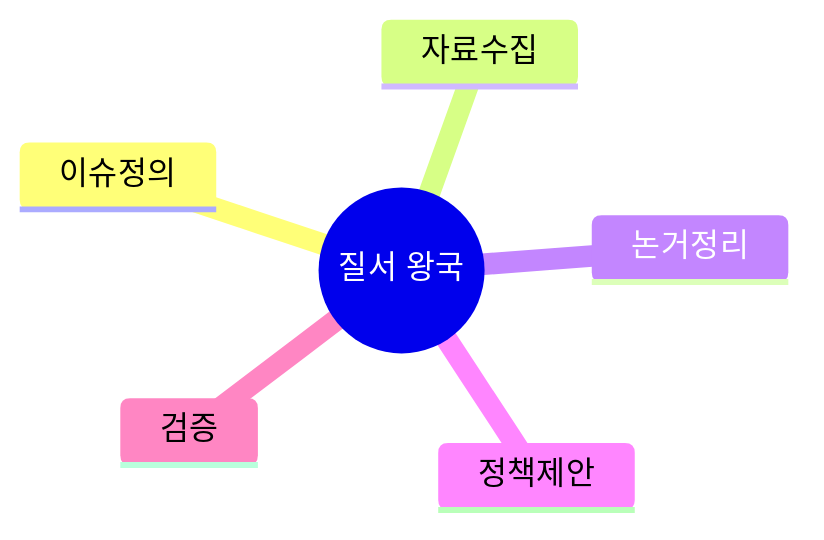
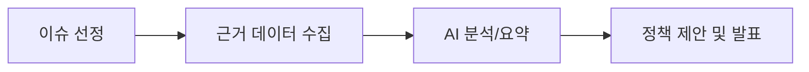

# 06. 🏛️ 질서 왕국 프로젝트 아이디어

## 고등학생 관점 기획 프레임

- **아버지 직업 연결 예시**: 공무원, 법무, 행정, 군/경, 금융
- **나의 흥미 연결 예시**: 토론, 시사, 법, 정책, 경제
- **핵심 질문**: "근거를 갖춘 판단과 제안을 만들 수 있는가?"

## 아이디어 10선

| ID | 프로젝트 아이디어 | 아버지 직업 x 나의 흥미 | 간단 유저 시나리오 | 문제점-해결점 | AI/바이브 코딩 도구 | 아이디어 찾은 방식 |
|---|---|---|---|---|---|---|
| ORD-01 | 청소년 노동권 Q&A 봇 | 공무원 아버지 x 법 흥미 | 근로 질문 입력 시 관련 조항/사례 안내 | 법령 접근 어려움 -> 쉬운 안내 | RAG, OpenAI, Cursor | 아르바이트 경험 질문에서 발굴 |
| ORD-02 | 토론 찬반 논거 생성기 | 교사 아버지 x 토론 흥미 | 주제를 넣으면 찬반 근거와 반박 포인트 생성 | 논거 편중 -> 양측 근거 균형 | Claude, Notion, Copilot | 토론대회 준비 과정 문제 해결 |
| ORD-03 | 시사 뉴스 5분 브리핑 앱 | 행정 아버지 x 시사 흥미 | 하루 뉴스 요약과 키워드 트렌드 제공 | 정보 과다 -> 핵심 요약 | Perplexity, Next.js, Bolt | 뉴스 소비 시간 부족에서 시작 |
| ORD-04 | 학교 규정 검색 도우미 | 군/경 아버지 x 규칙 흥미 | 교칙/규정 질문에 해당 항목 안내 | 규정 확인 번거로움 -> 검색형 안내 | Supabase, RAG, Replit | 교내 규정 문의 빈도 관찰 |
| ORD-05 | 정책 시뮬레이션 대시보드 | 금융 아버지 x 경제 흥미 | 급식비/교통비 정책 변경 시 영향 추정 | 정책 효과 체감 어려움 -> 시뮬레이션 | Python, Streamlit, Cursor | 학급 회의 의사결정 개선 니즈 |
| ORD-06 | 모의재판 케이스 정리 도구 | 법무 아버지 x 발표 흥미 | 사건 요약 입력 시 쟁점/증거/판단표 생성 | 자료 정리 부담 -> 구조화 템플릿 | GPT, Notion, Copilot | 모의재판 동아리 활동에서 발굴 |
| ORD-07 | 학급 예산 투명 공개 앱 | 회계 아버지 x 데이터 흥미 | 지출 내역을 카테고리별로 시각화 공개 | 예산 불신 -> 투명 대시보드 | Sheets API, Looker, v0 | 반 운영비 정산 경험 반영 |
| ORD-08 | 법률 용어 쉬운말 변환기 | 공공기관 아버지 x 언어 흥미 | 어려운 법률 문장을 학생용으로 변환 | 용어 장벽 -> 쉬운 표현 변환 | Gemini, Next.js, Cursor | 뉴스 법률 기사 이해 어려움 |
| ORD-09 | 선거 공약 비교 매트릭스 | 정치관심 아버지 x 분석 흥미 | 공약 입력 시 분야별 비교표 자동 생성 | 비교 기준 불명확 -> 지표화 | Airtable, GPT, Replit | 모의선거 프로젝트에서 발굴 |
| ORD-10 | 학교 민원 처리 상태 트래커 | 행정 아버지 x 서비스 개선 흥미 | 민원 접수 후 처리 단계 알림 제공 | 처리 지연 체감 -> 상태 추적 | Firebase, FlutterFlow, Bolt | 건의함 운영의 불투명성 개선 |

## 실행 로드맵(4주)

## 세특 문장 템플릿

`[사회/학교 이슈]를 [근거 데이터]로 분석하고 [AI 도구]로 논거를 체계화하여 [실행 가능한 제안]을 도출함.`

---

## 프로젝트별 상세 정보

### ORD-01: 청소년 노동권 Q&A 봇

**페르소나**: 아르바이트생 (고2, 근로 조건 궁금)  
**벤치마킹**: 고용노동부 (어려움) → 쉬운 Q&A  
**필요성**: 청소년 근로권 침해율 35%  
**핵심 기능**: ① 질문 입력 ② 관련 조항 ③ 사례 안내  
**세특**: "노동권 봇으로 아르바이트 권리 침해 인식 개선"

### ORD-02: 토론 찬반 논거 생성기

**페르소나**: 토론부원 (고2, 논거 준비 시간 부족)  
**벤치마킹**: 수기 자료 조사 → AI 논거 정리  
**필요성**: 토론 준비 시간 평균 8시간  
**핵심 기능**: ① 주제 입력 ② 찬반 근거 각 5개 ③ 반박 포인트  
**세특**: "논거 생성기로 토론 준비 시간 70% 단축, 대회 입상"

### ORD-03: 시사 뉴스 5분 브리핑 앱

**페르소나**: 시사관심 (고1, 뉴스 소비 시간 부족)  
**벤치마킹**: 뉴스 앱 (전문 과다) → 학생용 요약  
**필요성**: 시사 이해도 낮음 (평균 40%)  
**핵심 기능**: ① 일일 뉴스 크롤링 ② 5줄 요약 ③ 키워드 트렌드  
**세특**: "시사 브리핑 앱으로 토론 준비 효율 2배 향상"

### ORD-04: 학교 규정 검색 도우미

**페르소나**: 학생회 (고2, 규정 문의 빈번)  
**벤치마킹**: PDF 규정집 (검색 어려움) → RAG 검색  
**필요성**: 규정 문의 주 10건  
**핵심 기능**: ① 질문 입력 ② 해당 항목 ③ 쉬운 설명  
**세특**: "규정 검색 시스템으로 문의 처리 시간 80% 단축"

### ORD-05: 정책 시뮬레이션 대시보드

**페르소나**: 경제동아리 (고2, 정책 효과 궁금)  
**벤치마킹**: 없음 (신규)  
**필요성**: 정책 효과 체감 어려움  
**핵심 기능**: ① 정책 시나리오 ② 영향 예측 ③ 시각화  
**세특**: "급식비 정책 시뮬레이션으로 학급 회의 의사결정 개선"

### ORD-06: 모의재판 케이스 정리 도구

**페르소나**: 모의재판부 (고2, 자료 정리 부담)  
**벤치마킹**: 수기 정리 → 구조화 템플릿  
**필요성**: 케이스 준비 시간 평균 10시간  
**핵심 기능**: ① 사건 요약 입력 ② 쟁점/증거 정리 ③ 판단표  
**세특**: "케이스 정리 도구로 모의재판 준비 시간 60% 단축"

### ORD-07: 학급 예산 투명 공개 앱

**페르소나**: 회계담당 (고2, 예산 불신 문제)  
**벤치마킹**: 엑셀 (공개 어려움) → 자동 대시보드  
**필요성**: 예산 불신 학생 45%  
**핵심 기능**: ① 지출 입력 ② 카테고리 시각화 ③ 실시간 공개  
**세특**: "예산 투명화로 학급 신뢰도 55% → 90% 향상"

### ORD-08: 법률 용어 쉬운말 변환기

**페르소나**: 법관심 (고1, 법률 기사 이해 어려움)  
**벤치마킹**: 법률 사전 (여전히 어려움) → 학생용 변환  
**필요성**: 법률 용어 이해도 30%  
**핵심 기능**: ① 법률 문장 입력 ② 쉬운말 변환 ③ 예시  
**세특**: "법률 용어 변환기로 시사 이해도 30% → 75% 향상"

### ORD-09: 선거 공약 비교 매트릭스

**페르소나**: 선거관심 (고2, 모의선거 준비)  
**벤치마킹**: 수기 비교 → 자동 매트릭스  
**필요성**: 공약 비교 기준 불명확  
**핵심 기능**: ① 공약 입력 ② 분야별 비교표 ③ 실현 가능성 점수  
**세특**: "공약 비교 도구로 모의선거 투표율 45% → 80% 향상"

### ORD-10: 학교 민원 처리 상태 트래커

**페르소나**: 학생회 (고2, 민원 처리 지연)  
**벤치마킹**: 건의함 (상태 불명) → 실시간 추적  
**필요성**: 민원 처리 지연 체감 70%  
**핵심 기능**: ① 민원 접수 ② 처리 단계 알림 ③ 완료 통계  
**세특**: "민원 트래커로 처리율 50% → 85% 향상, 만족도 개선"

