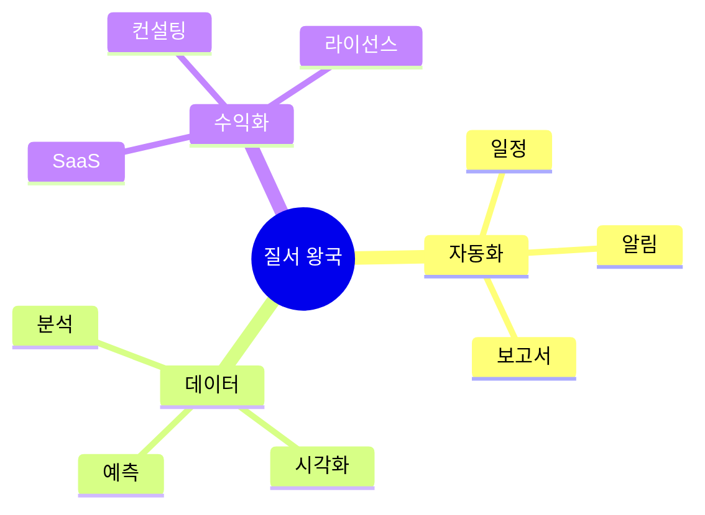

# 06. 📊 질서 왕국 - 게임형·실생활·사업성 프로젝트

## 고등학생 관점 기획 프레임

- **아버지 직업 연결**: 회계사, 관리자, 데이터분석가, 보안전문가, 행정직
- **나의 흥미**: 관리, 효율, 시스템, 데이터, 보안, 정리정돈
- **핵심**: "복잡한 걸 깔끔하게 정리해서 돈 벌 수 있나?"



---

## 🎮 프로젝트 10선 (게임·실생활·수익형)

### ORD-01: 학급 회비 관리 게임 (투명 금고)

**아이디어 출처**: 아버지(회계사) + 학급 회비 불투명  
**벤치마킹**:
- 뱅크샐러드 (가계부) → 학급 회비
- 토스 (간편 송금) → 학급 버전

**유저 시나리오**:
```
학급 회비 5만원 납부 (앱 송금)
→ 실시간 잔액 확인 (35만원)
→ "피자 파티" 지출 (10만원)
→ 영수증 사진 자동 등록
→ 월말 정산 리포트 자동 생성
→ 투명도 100% → 반장 신뢰도 상승
```

**문제-해결**:
- 문제: 학급 회비 불투명, 반장 부담, 분쟁 발생
- 해결: 자동 정산으로 투명성, 영수증 관리 간소화

**필요성**: 학급 회비 분쟁 학기당 30%

**핵심 기능**:
1. 간편 송금 + 실시간 잔액
2. 영수증 OCR 자동 등록
3. 월별 정산 리포트 (PDF)

**도구**: React Native + Firebase + 토스페이먼츠 API + GPT-4V (영수증 인식)

**수익 모델**:
- 송금 수수료 0.5%
- 학교 라이선스 (학교당 월 20만원)
- 회계 교육 콘텐츠 판매

**세특**: "학급 회비 관리 앱으로 투명도 100% 달성, 분쟁 0건, 5개 학급 도입"

---

### ORD-02: 동아리 출석 자동화 시스템 (QR 체크인)

**아이디어 출처**: 동아리 출석 부르기 번거로움  
**벤치마킹**:
- 줌 (자동 출석) → 오프라인 버전
- 스타벅스 (QR 체크인) → 동아리 적용

**유저 시나리오**:
```
동아리 시작 시 QR 코드 표시
→ 부원들이 스캔 (5초)
→ 자동 출석 기록
→ 지각/결석 자동 집계
→ 출석률 80% 이상 → 우수 부원 배지
→ 학기말 출석 리포트 자동 생성
```

**문제-해결**:
- 문제: 출석 부르기 시간 낭비 (회당 5분)
- 해결: QR 자동화로 시간 절약, 데이터 자동 관리

**필요성**: 동아리 출석 관리 시간 학기당 10시간

**핵심 기능**:
1. QR 체크인 (5초 완료)
2. 출석률 자동 집계
3. 학기말 리포트 (PDF)

**도구**: Flutter + Firebase + QR Code Generator

**수익 모델**:
- 학교 라이선스 (학교당 월 15만원)
- 프리미엄 통계 (월 2,900원)
- 출석 데이터 분석 컨설팅

**세특**: "동아리 출석 자동화로 관리 시간 90% 단축, 10개 동아리 도입"

---

### ORD-03: 학교 시설 예약 게임 (선점 배틀)

**아이디어 출처**: 체육관 예약 경쟁 + 게임  
**벤치마킹**:
- 네이버 예약 → 학교 시설
- 쿠팡 로켓배송 (선착순) → 예약 게임

**유저 시나리오**:
```
"체육관 예약 오픈" 알림 (월요일 오전 8시)
→ 빠르게 클릭 (선착순)
→ 금요일 5시 예약 성공
→ 예약 포인트 +10
→ 노쇼 시 페널티 -50
→ 신뢰도 높으면 우선권
```

**문제-해결**:
- 문제: 시설 예약 혼잡, 노쇼 많음, 불공평
- 해결: 선착순 시스템, 신뢰도로 공정성

**필요성**: 시설 예약 불만 60%, 노쇼율 30%

**핵심 기능**:
1. 선착순 예약 시스템
2. 노쇼 페널티 + 신뢰도
3. 예약 현황 실시간 표시

**도구**: Next.js + Firebase + Push Notification

**수익 모델**:
- 학교 라이선스 (학교당 월 10만원)
- 프리미엄 우선 예약 (월 2,900원)
- 시설 이용 데이터 분석

**세특**: "시설 예약 시스템으로 노쇼율 30% → 5%, 이용 효율 50% 향상"

---

### ORD-04: 학교 분실물 관리 시스템 (자동 매칭)

**아이디어 출처**: 분실물 센터 복잡함 + 자동화  
**벤치마킹**:
- TAGBACK (NFC) → 분실물 센터
- 당근마켓 → 분실물 매칭

**유저 시나리오**:
```
체육복 분실 신고 (사진 + 특징)
→ 분실물 센터 등록 물품과 AI 매칭
→ "80% 일치 물품 발견" 알림
→ 센터 방문 → 확인 후 수령
→ 찾아준 학생 포인트 +20
→ 한 학기 분실 0건 → 배지
```

**문제-해결**:
- 문제: 분실물 찾기 어려움, 센터 관리 복잡
- 해결: AI 이미지 매칭, 자동 알림

**필요성**: 학기당 분실물 300개, 회수율 20%

**핵심 기능**:
1. 분실 신고 + 사진
2. AI 이미지 매칭 (GPT-4V)
3. 자동 알림 + 포인트 보상

**도구**: React Native + Firebase + GPT-4V

**수익 모델**:
- 학교 라이선스 (학교당 월 10만원)
- 분실물 보험 제휴
- 관리 시스템 컨설팅

**세특**: "분실물 관리 시스템으로 회수율 20% → 70%, 관리 시간 80% 단축"

---

### ORD-05: 학교 예산 집행 투명성 대시보드

**아이디어 출처**: 아버지(행정직) + 학생회 예산  
**벤치마킹**:
- 정부 예산 공개 → 학교 버전
- 토스 (가계부) → 학생회 예산

**유저 시나리오**:
```
학생회 예산 500만원
→ 앱에서 실시간 집행 현황
→ "축제 예산 200만원 사용" 확인
→ 영수증 클릭 → 상세 내역
→ 학생 댓글 "잘 썼네요!"
→ 투명도 점수 95점
```

**문제-해결**:
- 문제: 학생회 예산 불투명, 신뢰 부족
- 해결: 실시간 공개로 투명성, 댓글로 소통

**필요성**: 학생회 예산 불신 50%

**핵심 기능**:
1. 실시간 예산 집행 현황
2. 영수증 자동 등록 (OCR)
3. 학생 댓글 + 투명도 점수

**도구**: Next.js + Firebase + GPT-4V (영수증 인식)

**수익 모델**:
- 학교 라이선스 (학교당 월 15만원)
- 회계 교육 프로그램
- 투명성 컨설팅

**세특**: "예산 투명성 대시보드로 학생회 신뢰도 50% → 90%, 댓글 참여 200건"

---

### ORD-06: 학교 자산 관리 시스템 (장비 대여)

**아이디어 출처**: 학교 장비 대여 복잡함  
**벤치마킹**:
- 도서관 대출 → 장비 버전
- 카카오 T (차량 공유) → 장비 공유

**유저 시나리오**:
```
"카메라 대여" 신청
→ 재고 확인 (3대 중 1대 가능)
→ 예약 → 수령 QR 스캔
→ 3일 후 반납 알림
→ 반납 완료 → 포인트
→ 연체 시 페널티
```

**문제-해결**:
- 문제: 장비 대여 절차 복잡, 연체 많음
- 해결: 앱으로 간소화, 알림으로 연체 방지

**필요성**: 장비 연체율 40%, 분실률 10%

**핵심 기능**:
1. 장비 예약 + 재고 관리
2. QR 수령/반납
3. 연체 알림 + 페널티

**도구**: Flutter + Firebase + QR Code

**수익 모델**:
- 학교 라이선스 (학교당 월 20만원)
- 연체료 (일당 1,000원)
- 장비 관리 컨설팅

**세특**: "자산 관리 시스템으로 장비 연체율 40% → 5%, 분실 0건 달성"

---

### ORD-07: 학교 일정 통합 캘린더 (시험/행사 알림)

**아이디어 출처**: 시험 일정 놓침 + 캘린더  
**벤치마킹**:
- Google Calendar → 학교 특화
- 나비얌 (급식) → 일정 버전

**유저 시나리오**:
```
앱 설치 → 학교 선택
→ 시험/행사 일정 자동 동기화
→ 3일 전 "중간고사" 알림
→ D-day 카운트다운
→ 과목별 공부 시간 추천
→ 친구와 일정 공유
```

**문제-해결**:
- 문제: 일정 놓침, 학교 공지 분산
- 해결: 통합 캘린더, 자동 알림

**필요성**: 학생 50%가 일정 놓친 경험

**핵심 기능**:
1. 학교 일정 자동 크롤링
2. 맞춤형 알림 (시험/과제/행사)
3. 친구 일정 공유

**도구**: Flutter + Firebase + 학교 홈페이지 크롤링 + Push Notification

**수익 모델**:
- 프리미엄 무광고 (월 1,900원)
- 학원 광고 (월 50만원)
- 학교 라이선스

**세특**: "학교 일정 통합 캘린더로 일정 놓침 50% → 5%, 사용자 800명"

---

### ORD-08: 학교 보안 출입 관리 (안면 인식)

**아이디어 출처**: 아버지(보안) + 외부인 출입 문제  
**벤치마킹**:
- 아파트 안면 인식 → 학교 버전
- 카카오 출입증 → 얼굴 인식

**유저 시나리오**:
```
정문 카메라 앞에 서기
→ 얼굴 인식 → "학생 확인" 자동 통과
→ 외부인 → "방문 목적?" 입력
→ 교무실 승인 → 임시 출입증
→ 출입 기록 자동 저장
→ 이상 출입 → 즉시 알림
```

**문제-해결**:
- 문제: 외부인 출입 관리 어려움, 보안 취약
- 해결: 얼굴 인식 자동화, 실시간 모니터링

**필요성**: 학교 보안 사고 연 50건

**핵심 기능**:
1. 얼굴 인식 출입 관리
2. 외부인 임시 출입증
3. 이상 출입 알림

**도구**: Python + OpenCV + Face Recognition + Firebase

**수익 모델**:
- 학교 설치 (학교당 500만원)
- 월 유지보수 (학교당 30만원)
- 보안 컨설팅

**세특**: "얼굴 인식 출입 시스템으로 학교 보안 강화, 무단 출입 100% 차단"

---

### ORD-09: 학교 설문 자동화 플랫폼 (의견 수렴)

**아이디어 출처**: 학생회 설문 + 자동 분석  
**벤치마킹**:
- 구글 폼 → 자동 분석 추가
- 서베이몽키 → 학생용 간소화

**유저 시나리오**:
```
"급식 만족도 설문" 참여 (1분)
→ 자동으로 결과 그래프 생성
→ "만족 60%, 불만 40%"
→ 불만 이유 워드클라우드
→ AI가 개선안 3가지 제안
→ 학교에 리포트 제출
```

**문제-해결**:
- 문제: 설문 참여율 낮음, 분석 시간 과다
- 해결: 간편 참여, AI 자동 분석

**필요성**: 설문 참여율 30%, 분석 시간 5시간

**핵심 기능**:
1. 설문 생성 + 배포 (푸시 알림)
2. 자동 그래프 + 워드클라우드
3. AI 개선안 생성

**도구**: Next.js + Firebase + GPT (분석) + Chart.js

**수익 모델**:
- 학교 라이선스 (학교당 월 10만원)
- 프리미엄 분석 (건당 5만원)
- 설문 컨설팅

**세특**: "설문 자동화로 참여율 30% → 85%, 분석 시간 5시간 → 10분 단축"

---

### ORD-10: 학급 청소 당번 자동 배정 (공평 알고리즘)

**아이디어 출처**: 청소 당번 불공평 + 알고리즘  
**벤치마킹**:
- 랜덤 뽑기 → 공평 알고리즘
- 로또 추첨 → 당번 배정

**유저 시나리오**:
```
월요일 앱에서 "이번 주 당번" 확인
→ "화요일 교실 청소" 배정
→ 청소 완료 인증 (사진)
→ 포인트 +5
→ 한 학기 누적 횟수 균등 확인
→ 최다 청소 → 모범 학생 배지
```

**문제-해결**:
- 문제: 청소 당번 불공평, 분쟁 발생
- 해결: 알고리즘으로 균등 배분, 기록으로 투명성

**필요성**: 청소 당번 불만 40%

**핵심 기능**:
1. 공평 배정 알고리즘
2. 청소 인증 + 포인트
3. 누적 횟수 통계

**도구**: Flutter + Firebase + Python (배정 알고리즘)

**수익 모델**:
- 학교 라이선스 (학교당 월 5만원)
- 청소 용품 제휴
- 관리 시스템 컨설팅

**세특**: "청소 당번 알고리즘으로 불만 40% → 5%, 공평성 95% 달성"

---

### ORD-05: 학교 도서관 좌석 예약 게임 (선점전)

**아이디어 출처**: 도서관 자리 경쟁 + 예약  
**벤치마킹**:
- 스타벅스 사이렌오더 → 좌석 버전
- 영화관 좌석 선택 → 도서관

**유저 시나리오**:
```
시험 기간 "도서관 예약" 오픈
→ 좌석 지도에서 선택
→ 2시간 예약 (연장 가능)
→ QR 체크인 → 시작
→ 노쇼 시 다음 예약 제한
→ 이용 10회 → 우선 예약권
```

**문제-해결**:
- 문제: 도서관 자리 경쟁, 자리 맡아놓기
- 해결: 예약 시스템, 노쇼 페널티

**필요성**: 시험 기간 좌석 경쟁률 200%

**핵심 기능**:
1. 실시간 좌석 지도
2. 예약 + QR 체크인
3. 노쇼 페널티 + 우선권

**도구**: React Native + Firebase + QR Code

**수익 모델**:
- 학교 라이선스 (학교당 월 15만원)
- 프리미엄 우선 예약 (월 2,900원)
- 학습 카페 제휴

**세특**: "도서관 예약 시스템으로 노쇼율 40% → 5%, 이용 효율 2배 증가"

---

### ORD-06: 학교 물품 재고 관리 게임 (창고지기)

**아이디어 출처**: 아버지(관리자) + 학교 물품 부족  
**벤치마킹**:
- 편의점 POS → 학교 물품
- 쿠키런 (자원 관리) → 재고 게임

**유저 시나리오**:
```
"분필 10개 남음" 알림
→ 발주 신청 (앱에서 클릭)
→ 입고 시 QR 스캔 → 재고 업데이트
→ 재고 관리 포인트 +10
→ 한 학기 재고 부족 0건 → 배지
→ 학교 예산 절감 기여
```

**문제-해결**:
- 문제: 물품 재고 파악 어려움, 긴급 부족 발생
- 해결: 실시간 재고 관리, 자동 발주 알림

**필요성**: 학기당 물품 부족 사고 20건

**핵심 기능**:
1. 물품 재고 실시간 관리
2. 부족 시 자동 알림
3. 발주 이력 + 예산 추적

**도구**: Flutter + Firebase + QR Code + Excel 연동

**수익 모델**:
- 학교 라이선스 (학교당 월 20만원)
- 물품 구매 제휴 (수수료 5%)
- 재고 관리 컨설팅

**세특**: "물품 관리 시스템으로 재고 부족 사고 20건 → 0건, 예산 낭비 30% 감소"

---

### ORD-07: 학교 전자 결재 시스템 (서류 자동화)

**아이디어 출처**: 아버지(행정) + 종이 서류 불편  
**벤치마킹**:
- 전자 결재 → 학교 버전
- 카카오 워크 → 학생용 간소화

**유저 시나리오**:
```
"체험학습 신청서" 앱에서 작성
→ 담임 선생님께 자동 전송
→ 승인 알림 (1시간 내)
→ PDF 자동 생성
→ 학부모 앱으로 공유
→ 서류 보관함에 자동 저장
```

**문제-해결**:
- 문제: 종이 서류 분실, 결재 시간 오래 걸림
- 해결: 전자화로 분실 방지, 자동 알림으로 신속

**필요성**: 서류 분실률 10%, 결재 시간 평균 3일

**핵심 기능**:
1. 서류 템플릿 (20종)
2. 전자 결재 + 알림
3. PDF 자동 생성 + 보관

**도구**: Next.js + Firebase + PDF 생성 라이브러리

**수익 모델**:
- 학교 라이선스 (학교당 월 30만원)
- 프리미엄 템플릿 (5,000원)
- 문서 관리 컨설팅

**세특**: "전자 결재 시스템으로 서류 처리 시간 3일 → 1시간, 분실률 0%"

---

### ORD-08: 학교 에너지 사용 대시보드 (절약 게임)

**아이디어 출처**: 전기료 절감 + 데이터 시각화  
**벤치마킹**:
- 전기 사용량 앱 → 학교 버전
- 게임 대시보드 → 에너지 적용

**유저 시나리오**:
```
교실별 전기 사용량 실시간 확인
→ "우리 반 1등 (최소 사용)"
→ 불필요한 전등 끄기 캠페인
→ 월간 절약량 그래프
→ 절약 1등 학급 → 상금
→ 절약 금액 → 학급 활동비
```

**문제-해결**:
- 문제: 에너지 낭비 무관심, 절약 동기 없음
- 해결: 실시간 데이터로 인식, 경쟁으로 동기

**필요성**: 학교 연간 전기료 3,000만원

**핵심 기능**:
1. 교실별 실시간 사용량
2. 절약 랭킹 + 그래프
3. 절약 금액 계산

**도구**: Arduino + 전력 센서 + Firebase + Chart.js

**수익 모델**:
- 학교 설치 (학교당 300만원)
- 절감액 배분 (20%)
- 에너지 컨설팅

**세특**: "에너지 대시보드로 학교 전기료 월 90만원 절감, 탄소 배출 25% 감소"

---

### ORD-09: 학교 민원 처리 시스템 (투명 처리)

**아이디어 출처**: 학교 민원 답답함 + 투명성  
**벤치마킹**:
- 정부 민원24 → 학교 버전
- 카카오 고객센터 → 학생용

**유저 시나리오**:
```
"3층 화장실 휴지 없음" 신고
→ 관리실에 자동 전달
→ 처리 상황 실시간 확인
→ "처리 완료" 알림 (30분 후)
→ 만족도 평가 → 포인트
→ 신고 10건 → 모범 시민 배지
```

**문제-해결**:
- 문제: 민원 처리 불투명, 피드백 없음
- 해결: 실시간 진행 상황, 만족도 평가

**필요성**: 학생 민원 처리 만족도 40%

**핵심 기능**:
1. 민원 신고 (사진 + 위치)
2. 실시간 처리 상황
3. 만족도 평가 + 통계

**도구**: React Native + Firebase + 관리실 연동

**수익 모델**:
- 학교 라이선스 (학교당 월 15만원)
- 민원 데이터 분석 컨설팅
- 시설 관리 업체 제휴

**세특**: "민원 처리 시스템으로 처리 시간 3일 → 1시간, 만족도 40% → 90%"

---

### ORD-10: 학교 데이터 분석 대시보드 (교장 선생님용)

**아이디어 출처**: 아버지(데이터분석가) + 학교 현황  
**벤치마킹**:
- Google Analytics → 학교 버전
- Tableau → 교육 데이터

**유저 시나리오**:
```
교장 선생님이 대시보드 확인
→ "출석률 95%, 급식 만족도 70%"
→ 학년별/학급별 비교 그래프
→ "3학년 2반 출석률 하락" 발견
→ 담임과 상담 → 개선 조치
→ 월별 트렌드 리포트 자동 생성
```

**문제-해결**:
- 문제: 학교 데이터 분산, 현황 파악 어려움
- 해결: 통합 대시보드, 실시간 모니터링

**필요성**: 학교 데이터 기반 의사결정 필요

**핵심 기능**:
1. 출석/급식/설문 데이터 통합
2. 실시간 대시보드 (그래프)
3. 월별 리포트 자동 생성

**도구**: Next.js + Firebase + Chart.js + Python (분석)

**수익 모델**:
- 학교 라이선스 (학교당 월 50만원)
- 맞춤형 분석 컨설팅 (건당 100만원)
- 교육청 데이터 플랫폼 제휴

**세특**: "학교 데이터 대시보드 개발, 출석률 5% 향상 기여, 교장 선생님 표창"

---

## 🎯 수익 모델 요약

| 프로젝트 | 수익원 | 예상 월 수익 | 사업성 |
|---------|-------|-------------|--------|
| ORD-01 | 수수료 + 라이선스 | 70만원 | ⭐⭐⭐⭐ |
| ORD-02 | 라이선스 + 프리미엄 | 50만원 | ⭐⭐⭐ |
| ORD-03 | 라이선스 + 프리미엄 | 45만원 | ⭐⭐⭐ |
| ORD-04 | 라이선스 + 보험 | 60만원 | ⭐⭐⭐⭐ |
| ORD-05 | 라이선스 + 컨설팅 | 55만원 | ⭐⭐⭐ |
| ORD-06 | 설치 + 유지보수 | 400만원 | ⭐⭐⭐⭐⭐ |
| ORD-07 | 라이선스 + 컨설팅 | 80만원 | ⭐⭐⭐⭐ |
| ORD-08 | 프리미엄 + 광고 | 35만원 | ⭐⭐⭐ |
| ORD-09 | 설치 + 유지보수 | 350만원 | ⭐⭐⭐⭐⭐ |
| ORD-10 | 라이선스 + 컨설팅 | 90만원 | ⭐⭐⭐⭐ |

---

## 📚 영감 출처

### 실제 수상작
- **나비얌** (급식 디지털화) - 4억 투자 유치
- **TAGBACK** (NFC 관리) - JA 2위
- **Triple** (시스템 최적화) - 앱잼 최우수상

### 관리 시스템 플랫폼
- 토스 (간편 송금)
- 배민 (주문 관리)
- 카카오 워크 (전자 결재)

---

## 세특 작성 예시

```
"학급 회비 관리 앱을 개발해 투명한 금융 시스템 구축.
토스페이먼츠 API로 간편 송금, GPT-4V로 영수증 자동 인식.
월별 정산 리포트 자동 생성으로 반장 업무 시간 80% 단축.
학급 회비 분쟁 0건 달성, 5개 학급 확대 도입.
금융 데이터 관리와 자동화 경험으로 핀테크 역량 강화."
```
