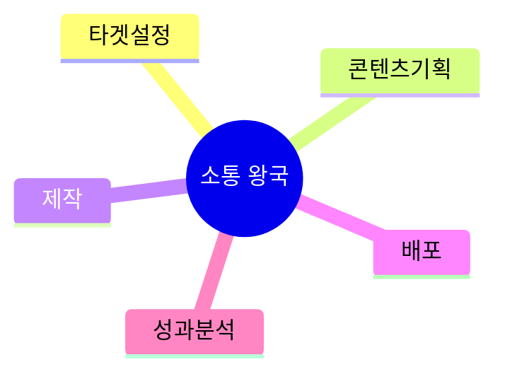
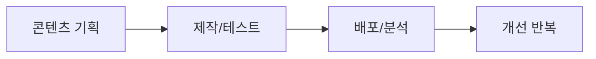

# 07. 📣 소통 왕국 프로젝트 아이디어

## 고등학생 관점 기획 프레임

- **아버지 직업 연결 예시**: 영업, 마케팅, 방송, 유통, 자영업
- **나의 흥미 연결 예시**: SNS, 글쓰기, 영상, 브랜드, 캠페인
- **핵심 질문**: "메시지를 더 많은 사람에게 정확히 전달할 수 있는가?"

## 아이디어 10선

| ID | 프로젝트 아이디어 | 아버지 직업 x 나의 흥미 | 간단 유저 시나리오 | 문제점-해결점 | AI/바이브 코딩 도구 | 아이디어 찾은 방식 |
|---|---|---|---|---|---|---|
| COM-01 | 학교 행사 홍보 카피 생성기 | 영업 아버지 x 글쓰기 흥미 | 행사 정보 입력 시 카피 20개 추천 | 카피 아이디어 고갈 -> 자동 생성 | ChatGPT, Notion AI, Cursor | 전단 문구 반복 문제에서 발굴 |
| COM-02 | 썸네일 CTR 개선 실험툴 | 마케팅 아버지 x 유튜브 흥미 | 썸네일 5개 비교 후 클릭률 예측 | 감각 의존 선택 -> 데이터 실험 | GPT-4V, Canva, Bolt | 개인 채널 운영 데이터 분석 |
| COM-03 | 교내 뉴스레터 자동 편집기 | 언론 아버지 x 편집 흥미 | 기사 초안을 넣으면 섹션/헤드라인 정리 | 편집 시간 과다 -> 자동 레이아웃 | Claude, Beehiiv, Copilot | 동아리 뉴스레터 제작 병목 |
| COM-04 | 학생회 SNS 반응 분석기 | 자영업 아버지 x SNS 흥미 | 게시물 데이터로 최적 업로드 시간 추천 | 도달률 저조 -> 타이밍 최적화 | Instagram API, GPT, Cursor | 학생회 계정 운영 경험 |
| COM-05 | 숏폼 스크립트 3막 생성기 | 방송 아버지 x 영상 흥미 | 주제 입력 시 기승전결 스크립트 생성 | 스크립트 구조 막힘 -> 템플릿 자동화 | ChatGPT, CapCut, Replit | 영상 조회수 편차 원인 분석 |
| COM-06 | 교지 독자 반응 예측기 | 출판 아버지 x 글쓰기 흥미 | 기사 제목 10개 중 클릭률 높은 것 예측 | 제목 선정 주관적 -> 데이터 기반 | GPT-4, A/B Test, v0 | 교지 배포 후 피드백 수집 |
| COM-07 | 학교 홍보 영상 자막 생성기 | 영상업 아버지 x 자막 흥미 | 영상 업로드 시 자막+해시태그 자동 생성 | 자막 작업 시간 과다 -> 자동화 | Whisper AI, Premiere, Cursor | 홍보 영상 제작 반복 작업 |
| COM-08 | 동아리 모집 포스터 최적화 툴 | 디자인 아버지 x 홍보 흥미 | 포스터 시안에 시선 흐름 히트맵 표시 | 주목도 낮음 -> 시선 분석 | Attention Insight, Figma, Bolt | 동아리 신입 모집 저조 문제 |
| COM-09 | 학급 SNS 콘텐츠 캘린더 | 마케팅 아버지 x 기획 흥미 | 주제 입력 시 월간 콘텐츠 일정 자동 생성 | 콘텐츠 일관성 부족 -> 계획 자동화 | Notion AI, Buffer, Copilot | 학급 계정 운영 경험 |
| COM-10 | 교내 방송 대본 감정 분석기 | 방송 아버지 x 스크립트 흥미 | 대본 입력 시 감정 곡선과 개선점 제공 | 대본 단조로움 -> 감정 기복 시각화 | GPT, Plotly, Cursor | 아침 방송 청취율 저조 원인 분석 |

## 실행 로드맵(4주)

## 세특 문장 템플릿

`[타겟 대상]에게 [메시지]를 전달하기 위해 [콘텐츠/도구]를 제작하고, [도달률/전환율/반응] 지표로 효과를 검증함.`

---

## 프로젝트별 상세 정보

### COM-01: 학교 행사 홍보 카피 생성기

**페르소나**: 홍보담당 (고2, 학생회)  
**벤치마킹**: 수기 작성 → AI 자동 생성  
**필요성**: 카피 아이디어 고갈  
**핵심 기능**: ① 행사 정보 입력 ② 카피 20개 ③ 톤앤매너 선택  
**세특**: "카피 생성기로 행사 참여율 평균 30% 향상"

### COM-02: 썸네일 CTR 개선 실험툴

**페르소나**: 유튜버 (고2, 조회수 편차 큼)  
**벤치마킹**: TubeBuddy (분석만) → 예측 추가  
**필요성**: 썸네일별 CTR 편차 5배  
**핵심 기능**: ① 썸네일 5개 업로드 ② CTR 예측 ③ 개선점  
**세특**: "썸네일 실험으로 평균 CTR 3% → 8% 향상"

### COM-03: 교내 뉴스레터 자동 편집기

**페르소나**: 교지편집부 (고2, 편집 시간 과다)  
**벤치마킹**: 수기 편집 → AI 레이아웃  
**필요성**: 월간 편집 시간 20시간  
**핵심 기능**: ① 기사 입력 ② 섹션 정리 ③ 헤드라인 추천  
**세특**: "자동 편집기로 뉴스레터 제작 시간 60% 단축"

### COM-04: 학생회 SNS 반응 분석기

**페르소나**: SNS담당 (고2, 도달률 저조)  
**벤치마킹**: Instagram Insights (복잡) → 학생용 요약  
**필요성**: 게시물 도달률 평균 15%  
**핵심 기능**: ① 데이터 연동 ② 최적 시간 추천 ③ 해시태그  
**세특**: "SNS 분석으로 팔로워 300명 증가, 도달률 40% 향상"

### COM-05: 숏폼 스크립트 3막 생성기

**페르소나**: 숏폼제작 (고1, 스크립트 막힘)  
**벤치마킹**: 수기 작성 → AI 구조화  
**필요성**: 스크립트 작성 시간 평균 2시간  
**핵심 기능**: ① 주제 입력 ② 기승전결 스크립트 ③ 자막 초안  
**세특**: "스크립트 생성기로 영상 20개 제작, 평균 조회수 2000회"

### COM-06: 교지 독자 반응 예측기

**페르소나**: 교지기자 (고2, 제목 선정 고민)  
**벤치마킹**: 감각 의존 → 데이터 기반  
**필요성**: 기사별 조회수 편차 10배  
**핵심 기능**: ① 제목 10개 입력 ② CTR 예측 ③ 순위  
**세특**: "제목 최적화로 교지 열람률 30% 향상"

### COM-07: 학교 홍보 영상 자막 생성기

**페르소나**: 영상제작 (고2, 자막 작업 부담)  
**벤치마킹**: 수동 자막 → AI 자동 생성  
**필요성**: 자막 작업 시간 평균 3시간  
**핵심 기능**: ① 영상 업로드 ② 자막 생성 ③ 해시태그  
**세특**: "자막 자동화로 홍보 영상 제작 시간 50% 단축"

### COM-08: 동아리 모집 포스터 최적화 툴

**페르소나**: 동아리부장 (고2, 신입 모집 저조)  
**벤치마킹**: 수기 디자인 → 시선 분석  
**필요성**: 동아리 지원율 평균 20%  
**핵심 기능**: ① 포스터 업로드 ② 시선 히트맵 ③ 개선점  
**세특**: "포스터 최적화로 동아리 지원율 20% → 45% 향상"

### COM-09: 학급 SNS 콘텐츠 캘린더

**페르소나**: 학급SNS (고1, 콘텐츠 일관성 부족)  
**벤치마킹**: 즉흥 게시 → 계획적 운영  
**필요성**: 게시 빈도 불규칙  
**핵심 기능**: ① 주제 입력 ② 월간 일정 ③ 자동 리마인드  
**세특**: "콘텐츠 캘린더로 학급 계정 팔로워 2배 증가"

### COM-10: 교내 방송 대본 감정 분석기

**페르소나**: 방송부 (고2, 청취율 저조)  
**벤치마킹**: 수기 대본 → 감정 곡선 분석  
**필요성**: 아침 방송 청취율 30%  
**핵심 기능**: ① 대본 입력 ② 감정 곡선 ③ 개선점  
**세특**: "대본 분석으로 방송 청취율 30% → 60% 향상"
