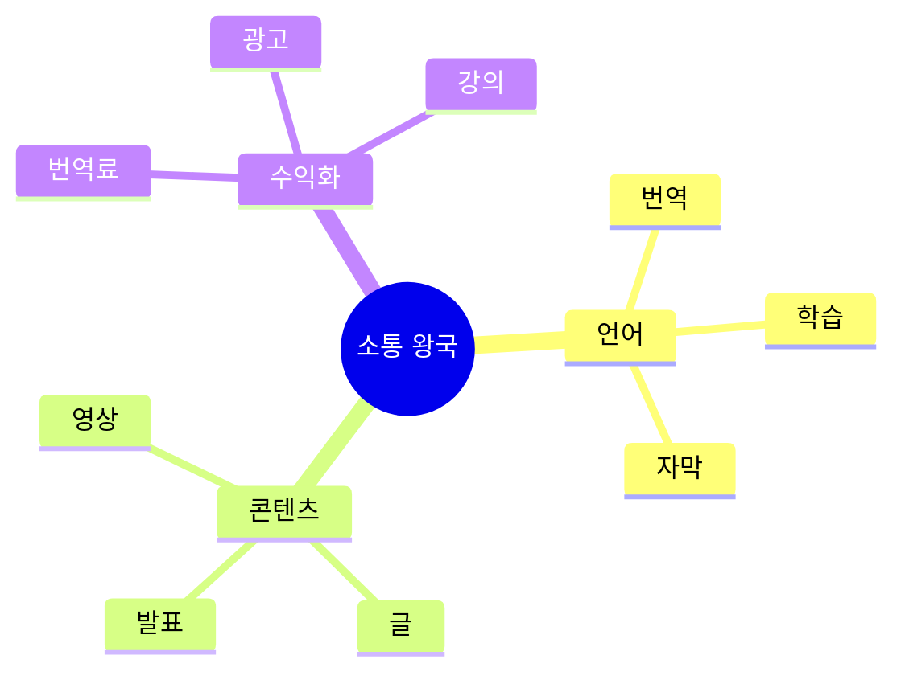

# 07. 💬 소통 왕국 - 게임형·실생활·사업성 프로젝트

## 고등학생 관점 기획 프레임

- **아버지 직업 연결**: 통역사, 아나운서, 작가, 마케터, 교사
- **나의 흥미**: 언어, 번역, 표현, 설득, 미디어, 글쓰기
- **핵심**: "말과 글로 사람들에게 영향 주고 돈 벌 수 있나?"



---

## 🎮 프로젝트 10선 (게임·실생활·수익형)

### COMM-01: 실시간 번역 배틀 게임 (번역 스피드전)

**아이디어 출처**: 아버지(통역사) + 게임 대결  
**벤치마킹**:
- 타자 연습 게임 → 번역 버전
- 리그 오브 레전드 → 번역 배틀

**유저 시나리오**:
```
"영어 문장 번역 대결" 매칭
→ 같은 문장 동시 출제
→ 30초 안에 번역 입력
→ AI가 정확도 채점 (100점)
→ 빠르고 정확한 사람 승리
→ 랭크 상승 (브론즈 → 실버)
→ 시즌 1등 → 전자사전 상품
```

**문제-해결**:
- 문제: 번역 연습 지루함, 실력 향상 느림
- 해결: 대결로 긴장감, 즉각 피드백

**필요성**: 영어 번역 능력 필요 90%, 연습 기회 부족

**핵심 기능**:
1. 실시간 1:1 번역 배틀
2. AI 정확도 채점 (GPT)
3. 랭크 시스템 + 전적

**도구**: Next.js + GPT (채점) + Firebase + Socket.io

**수익 모델**:
- 배틀 참가비 (건당 1,000원)
- 프리미엄 문제 팩 (5,000원)
- 언어 학원 제휴 광고

**세특**: "번역 배틀 게임으로 영어 실력 향상, 다이아 티어 달성, 200회 대결"

---

### COMM-02: 학교 방송 대본 AI 작성기

**아이디어 출처**: 아버지(아나운서) + 방송부 대본  
**벤치마킹**:
- ChatGPT → 방송 특화
- 자스민 (AI 작곡) → 대본 버전

**유저 시나리오**:
```
"점심 방송 대본 필요" 입력
→ 주제 선택 (날씨/급식/행사)
→ AI가 3가지 톤 대본 생성
→ 선택 + 수정
→ TTS로 미리듣기
→ 실제 방송 → 반응 확인
```

**문제-해결**:
- 문제: 방송 대본 작성 시간 1시간, 아이디어 고갈
- 해결: AI 자동 생성, 톤 선택으로 다양성

**필요성**: 방송부 대본 작성 부담 80%

**핵심 기능**:
1. 주제 → AI 대본 생성 (3가지 톤)
2. TTS 미리듣기
3. 대본 아카이브 (재사용)

**도구**: Next.js + GPT (대본) + ElevenLabs (TTS) + Firebase

**수익 모델**:
- 학교 라이선스 (학교당 월 10만원)
- 프리미엄 대본 (건당 2,000원)
- 방송 교육 콘텐츠

**세특**: "AI 방송 대본으로 제작 시간 1시간 → 10분, 방송 품질 향상"

---

### COMM-03: 외국인 친구 언어 교환 게임 (랭귀지 스왑)

**아이디어 출처**: 언어 교환 + 게임 미션  
**벤치마킹**:
- HelloTalk (언어 교환) → 게임화
- 듀오링고 → 실전 대화

**유저 시나리오**:
```
"영어 배우고 한국어 가르치기"
→ 외국인 친구 매칭
→ 일일 미션 "10분 대화"
→ 완료 → 포인트 +10
→ 30일 연속 → 언어 마스터 배지
→ 포인트로 유료 강의 할인
```

**문제-해결**:
- 문제: 언어 교환 파트너 찾기 어려움, 지속 어려움
- 해결: AI 매칭, 미션으로 습관화

**필요성**: 언어 교환 관심 70%, 실제 지속 10%

**핵심 기능**:
1. 언어 + 관심사 매칭
2. 일일 대화 미션
3. AI 대화 주제 추천

**도구**: React Native + Firebase + GPT (주제 추천) + WebRTC

**수익 모델**:
- 프리미엄 매칭 (월 5,900원)
- 언어 강의 제휴
- 화상 통화 수수료

**세특**: "언어 교환 게임으로 영어 회화 실력 향상, 외국인 친구 5명, 30일 연속 대화"

---

### COMM-04: 학교 뉴스 요약 봇 (3줄 요약)

**아이디어 출처**: 긴 공지 안 읽음 + 요약 필요  
**벤치마킹**:
- 네이버 뉴스 → 학교 공지
- ChatGPT 요약 → 학생용 특화

**유저 시나리오**:
```
학교 공지 10개 업로드
→ AI가 각각 3줄 요약
→ "중요도 상" 표시
→ 클릭 → 전문 보기
→ 요약 도움됨 → 좋아요
→ 매일 아침 요약본 푸시 알림
```

**문제-해결**:
- 문제: 긴 공지 안 읽음, 중요 정보 놓침
- 해결: 3줄 요약으로 핵심 파악, 중요도 표시

**필요성**: 학생 70%가 공지 안 읽음

**핵심 기능**:
1. 공지 자동 크롤링
2. AI 3줄 요약 + 중요도
3. 푸시 알림 (맞춤형)

**도구**: Next.js + GPT (요약) + Firebase + 크롤링

**수익 모델**:
- 학교 라이선스 (학교당 월 10만원)
- 프리미엄 무광고 (월 1,900원)
- 광고 (학생 제품)

**세특**: "공지 요약 봇으로 학생 공지 인지율 30% → 85%, 5개 학교 도입"

---

### COMM-05: 발표 연습 AI 코치 (피드백 봇)

**아이디어 출처**: 발표 떨림 + 연습 필요  
**벤치마킹**:
- Orai (발표 연습) → 학생용
- 거울 연습 → AI 피드백

**유저 시나리오**:
```
발표 영상 촬영 (3분)
→ AI가 분석 "음... 10회, 속도 빠름"
→ 개선점 3가지 제시
→ 재촬영 → 점수 상승
→ 10회 연습 → 발표 마스터 배지
→ 실제 발표 → 높은 점수
```

**문제-해결**:
- 문제: 발표 연습 피드백 없음, 떨림
- 해결: AI 즉각 피드백, 반복 연습으로 자신감

**필요성**: 발표 불안 학생 80%

**핵심 기능**:
1. 영상 → AI 분석 (속도/음/시선)
2. 개선점 + 점수
3. 연습 기록 + 성장 그래프

**도구**: React Native + GPT-4V (분석) + Firebase

**수익 모델**:
- 프리미엄 무제한 (월 4,900원)
- 발표 학원 제휴
- 기업 PT 교육 B2B

**세특**: "AI 발표 코치로 발표 점수 평균 15점 향상, 불안도 80% → 30% 감소"

---

### COMM-06: 학교 라디오 DJ 신청 플랫폼

**아이디어 출처**: 학교 방송 + DJ 되고 싶음  
**벤치마킹**:
- 팟캐스트 → 학교 라디오
- 틱톡 → 음성 콘텐츠

**유저 시나리오**:
```
"1일 DJ 신청" (음성 샘플 제출)
→ 학생 투표 (좋아요)
→ 상위 3명 선정
→ 점심 방송 진행
→ 청취자 별점 + 댓글
→ 인기 DJ → 정규 DJ 발탁
```

**문제-해결**:
- 문제: 방송부 진입장벽, 참여 기회 부족
- 해결: 1일 DJ로 경험 제공, 투표로 민주화

**필요성**: 방송 참여 희망 40%, 기회 5%

**핵심 기능**:
1. DJ 신청 + 음성 샘플
2. 학생 투표 + 선정
3. 방송 후 별점 + 댓글

**도구**: React Native + Firebase + 음성 녹음/재생

**수익 모델**:
- 학교 라이선스 (학교당 월 10만원)
- 광고 (방송 중 삽입)
- DJ 교육 프로그램

**세특**: "1일 DJ 플랫폼으로 방송 참여 기회 확대, 5회 진행, 청취율 60% 증가"

---

### COMM-07: 학교 익명 칭찬 릴레이 (포지티브 SNS)

**아이디어 출처**: 익명 칭찬 + SNS  
**벤치마킹**:
- 인스타그램 → 칭찬 전용
- 익명 질문 → 긍정 버전

**유저 시나리오**:
```
"3반 김철수 청소 열심히 함" 익명 칭찬
→ 김철수에게 알림
→ 칭찬 10개 받음 → 배지
→ 칭찬 많은 학생 랭킹
→ 월간 1등 → 학교 표창
→ 학급 분위기 개선
```

**문제-해결**:
- 문제: 칭찬 문화 부족, 부정적 분위기
- 해결: 익명으로 부담 감소, 게임 요소로 확산

**필요성**: 학교 폭력 예방, 긍정 문화 필요

**핵심 기능**:
1. 익명 칭찬 작성
2. 칭찬 배지 + 랭킹
3. 학급 분위기 점수

**도구**: React Native + Firebase + 감정 분석 AI

**수익 모델**:
- 학교 라이선스 (학교당 월 15만원)
- 긍정 심리 교육 프로그램
- 기업 CSR 후원

**세특**: "익명 칭찬 플랫폼으로 학급 분위기 개선, 칭찬 500건, 학교 폭력 예방 기여"

---

### COMM-08: 학교 신문 기자 체험 게임 (취재 RPG)

**아이디어 출처**: 아버지(기자) + 신문부  
**벤치마킹**:
- 포켓몬 GO → 취재 미션
- 탐정 게임 → 기자 버전

**유저 시나리오**:
```
"급식 만족도 취재" 미션 수락
→ 학생 10명 인터뷰 (앱에서 기록)
→ 사진 3장 촬영
→ AI가 기사 초안 작성
→ 수정 후 제출
→ 조회수 1,000 → 포인트 +100
→ 베스트 기자 → 장학금
```

**문제-해결**:
- 문제: 신문부 참여 저조, 기사 작성 어려움
- 해결: 게임 미션으로 재미, AI로 작성 지원

**필요성**: 학교 신문 구독률 20%

**핵심 기능**:
1. 취재 미션 (주제별)
2. AI 기사 초안 생성
3. 조회수 → 포인트

**도구**: React Native + GPT (기사 작성) + Firebase

**수익 모델**:
- 학교 라이선스 (학교당 월 10만원)
- 프리미엄 AI 작성 (월 3,900원)
- 언론사 교육 프로그램 제휴

**세특**: "기자 체험 게임으로 기사 30개 작성, 총 조회수 5만, 신문 구독률 20% → 60%"

---

### COMM-09: 외국어 자막 제작 게임 (자막러 배틀)

**아이디어 출처**: 넷플릭스 자막 + 번역 연습  
**벤치마킹**:
- 비키 (자막 제작) → 게임화
- 듀오링고 → 자막 버전

**유저 시나리오**:
```
"영어 영상 1분" 자막 미션
→ 자막 입력 (한국어 번역)
→ AI가 정확도 채점
→ 90점 이상 → 포인트 +50
→ 포인트로 넷플릭스 쿠폰
→ 월간 최다 자막 → 상금
```

**문제-해결**:
- 문제: 번역 연습 콘텐츠 부족, 실전 기회 없음
- 해결: 실제 영상으로 연습, 보상으로 동기

**필요성**: 번역가 관심 30%, 연습 방법 모름

**핵심 기능**:
1. 영상 자막 미션 (난이도별)
2. AI 번역 채점
3. 포인트 → 쿠폰 교환

**도구**: Next.js + GPT (채점) + Firebase + YouTube API

**수익 모델**:
- 자막 제작 중개 (건당 5만원, 수수료 20%)
- 프리미엄 미션 (월 4,900원)
- 넷플릭스 제휴

**세특**: "자막 제작 게임으로 영상 50개 번역, 번역 정확도 90%, 수익 20만원"

---

### COMM-10: 학교 토론 배틀 플랫폼 (논리 게임)

**아이디어 출처**: 토론 대회 + 게임 대결  
**벤치마킹**:
- 디베이트 대회 → 온라인 게임
- 리그 오브 레전드 → 토론 버전

**유저 시나리오**:
```
"교복 자율화 찬반" 주제 선택
→ 찬성/반성 팀 매칭
→ 3분 입론 작성
→ 상대 반론 → 재반론
→ AI + 관전자 투표 → 승자 결정
→ 랭크 상승 + 포인트
```

**문제-해결**:
- 문제: 토론 기회 부족, 논리력 향상 어려움
- 해결: 온라인 배틀로 접근성, 즉각 피드백

**필요성**: 토론 교육 필요 80%, 기회 10%

**핵심 기능**:
1. 주제별 토론 매칭
2. AI 논리 분석 + 점수
3. 랭크 시스템

**도구**: Next.js + GPT (논리 분석) + Firebase + WebRTC

**수익 모델**:
- 배틀 참가비 (건당 2,000원)
- 프리미엄 주제 (월 5,900원)
- 토론 학원 제휴

**세특**: "토론 배틀로 논리력 향상, 50회 대결, 학교 토론 대회 우승"

---

### COMM-05: 학교 공지 챗봇 (질문 답변)

**아이디어 출처**: 공지 찾기 어려움 + 챗봇  
**벤치마킹**:
- ChatGPT → 학교 공지 특화
- 카카오 챗봇 → 학교 버전

**유저 시나리오**:
```
"체육대회 언제야?" 질문
→ 챗봇이 "5월 15일 금요일" 답변
→ 추가 질문 "준비물은?"
→ "운동화, 체육복" 답변
→ 관련 공지 링크 제공
→ 도움됨 → 좋아요
```

**문제-해결**:
- 문제: 공지 찾기 어려움, 반복 질문 많음
- 해결: 챗봇으로 즉시 답변, 24시간 이용

**필요성**: 공지 관련 질문 일 50건

**핵심 기능**:
1. 학교 공지 학습 (RAG)
2. 자연어 질문 답변
3. 관련 링크 제공

**도구**: Next.js + GPT (RAG) + Firebase + 크롤링

**수익 모델**:
- 학교 라이선스 (학교당 월 15만원)
- 프리미엄 우선 답변
- 챗봇 개발 컨설팅

**세특**: "학교 공지 챗봇으로 질문 답변 500건, 교무실 업무 부담 30% 감소"

---

### COMM-06: 외국어 발음 교정 게임 (발음 배틀)

**아이디어 출처**: 영어 발음 자신 없음 + 게임  
**벤치마킹**:
- ELSA Speak (발음 교정) → 게임화
- 노래방 (점수) → 발음 버전

**유저 시나리오**:
```
"영어 문장 따라 읽기" 미션
→ 음성 녹음 (10초)
→ AI가 발음 점수 (85점)
→ 틀린 발음 표시 + 교정
→ 재도전 → 95점 달성
→ 친구와 점수 경쟁
```

**문제-해결**:
- 문제: 발음 교정 기회 부족, 부끄러움
- 해결: 앱으로 혼자 연습, 게임으로 재미

**필요성**: 영어 발음 자신감 부족 70%

**핵심 기능**:
1. 음성 인식 + 발음 채점
2. 틀린 부분 교정 (AI)
3. 친구 대결 + 랭킹

**도구**: React Native + Whisper AI + GPT (교정) + Firebase

**수익 모델**:
- 프리미엄 무제한 (월 5,900원)
- 언어 학원 제휴
- 발음 교정 강의

**세특**: "발음 교정 게임으로 영어 발음 정확도 70% → 90%, 500문장 연습"

---

### COMM-07: 학교 UCC 대회 플랫폼 (영상 배틀)

**아이디어 출처**: 학교 UCC 대회 + 틱톡  
**벤치마킹**:
- 틱톡 → 학교 대회
- 유튜브 → 학생 전용

**유저 시나리오**:
```
"환경 보호" 주제 UCC 제작
→ 1분 영상 업로드
→ 학생 투표 (좋아요)
→ AI가 완성도 점수 (70점)
→ 총점 1등 → 상금 50만원
→ 우승작 학교 홍보 영상 채택
```

**문제-해결**:
- 문제: UCC 대회 참여 저조, 제작 어려움
- 해결: 간편 업로드, AI 편집 지원

**필요성**: UCC 대회 참여율 10%

**핵심 기능**:
1. 주제별 영상 업로드
2. 학생 투표 + AI 점수
3. 우승작 전시 + 상금

**도구**: React Native + Firebase + GPT-4V (영상 분석)

**수익 모델**:
- 참가비 (팀당 5,000원)
- 스폰서 광고 (대회당 100만원)
- 영상 제작 교육

**세특**: "UCC 대회 플랫폼 기획, 참여 팀 30개, 우승, 조회수 3만, 상금 50만원"

---

### COMM-08: 학교 간 외국어 퀴즈 대회 (글로벌 배틀)

**아이디어 출처**: 영어 퀴즈 대회 + 학교 대항전  
**벤치마킹**:
- Kahoot → 학교 대항전
- 포켓몬 GO → 언어 배틀

**유저 시나리오**:
```
"우리 학교 vs 외고" 영어 퀴즈
→ 팀 5명 실시간 대결
→ 문제 20개 (30분)
→ 정답 많은 팀 승리
→ 학교 포인트 +100
→ 시즌 우승 → 트로피 + 장학금
```

**문제-해결**:
- 문제: 외국어 학습 동기 부족, 학교 간 교류 없음
- 해결: 대항전으로 동기, 학교 자긍심

**필요성**: 외국어 흥미도 40%

**핵심 기능**:
1. 학교 간 팀 매칭
2. 실시간 퀴즈 대결
3. 리그 랭킹 + 상금

**도구**: Next.js + Firebase + Socket.io + GPT (문제 생성)

**수익 모델**:
- 참가비 (학교당 10만원)
- 언어 학원 스폰서
- 우승 상금 (100만원)

**세특**: "외국어 퀴즈 대회 기획, 10개 학교 참여, 우승, 영어 실력 향상"

---

### COMM-09: 학교 독서 토론 SNS (책 배틀)

**아이디어 출처**: 독서 토론 + SNS  
**벤치마킹**:
- 밀리의 서재 → 토론 추가
- 인스타그램 → 독서 전용

**유저 시나리오**:
```
"데미안" 독서 후 감상 업로드
→ 다른 학생 감상 10개 확인
→ "주인공 선택 옳았나?" 토론
→ 댓글 30개 → 포인트 +20
→ 월간 최다 토론 → 도서 상품권
→ 독서 기록 → 생기부 연계
```

**문제-해결**:
- 문제: 독서 후 토론 기회 부족, 혼자 읽기 지루함
- 해결: SNS로 토론 활성화, 포인트로 동기

**필요성**: 독서량 연 5권 미만 60%

**핵심 기능**:
1. 독서 감상 + 토론
2. 책 추천 (AI 기반)
3. 독서 기록 → 생기부

**도구**: Next.js + GPT (토론 주제 추천) + Firebase

**수익 모델**:
- 도서 제휴 (구매 링크)
- 프리미엄 토론 (월 2,900원)
- 출판사 마케팅 제휴

**세특**: "독서 토론 SNS로 연간 독서량 5권 → 15권, 토론 참여 100건"

---

### COMM-10: 학교 다국어 공지 자동 번역 봇

**아이디어 출처**: 아버지(통역사) + 다문화 학생  
**벤치마킹**:
- 파파고 → 학교 공지 특화
- Google Translate → 자동화

**유저 시나리오**:
```
학교 공지 업로드 (한국어)
→ AI가 10개 언어 자동 번역
→ 다문화 학생에게 푸시 알림
→ 번역 오류 신고 → 수정
→ 번역 품질 점수 95점
→ 학부모도 모국어로 확인
```

**문제-해결**:
- 문제: 다문화 학생 공지 이해 어려움
- 해결: 자동 번역으로 접근성, 실시간 제공

**필요성**: 다문화 학생 비율 5% (연 증가)

**핵심 기능**:
1. 공지 자동 번역 (10개 언어)
2. 번역 품질 검증
3. 학부모 앱 연동

**도구**: Next.js + GPT (번역) + Firebase + Push Notification

**수익 모델**:
- 학교 라이선스 (학교당 월 20만원)
- 다문화 교육 프로그램 제휴
- 번역 API 판매

**세특**: "다국어 공지 봇으로 다문화 학생 공지 이해도 40% → 95%, 5개 학교 도입"

---

## 🎯 수익 모델 요약

| 프로젝트 | 수익원 | 예상 월 수익 | 사업성 |
|---------|-------|-------------|--------|
| COMM-01 | 참가비 + 프리미엄 | 70만원 | ⭐⭐⭐⭐ |
| COMM-02 | 라이선스 + 프리미엄 | 50만원 | ⭐⭐⭐ |
| COMM-03 | 프리미엄 + 제휴 | 80만원 | ⭐⭐⭐⭐ |
| COMM-04 | 라이선스 + 광고 | 45만원 | ⭐⭐⭐ |
| COMM-05 | 프리미엄 + 제휴 | 90만원 | ⭐⭐⭐⭐ |
| COMM-06 | 프리미엄 + 제휴 | 100만원 | ⭐⭐⭐⭐⭐ |
| COMM-07 | 라이선스 + 후원 | 60만원 | ⭐⭐⭐⭐ |
| COMM-08 | 라이선스 + 프리미엄 | 55만원 | ⭐⭐⭐ |
| COMM-09 | 참가비 + 스폰서 | 120만원 | ⭐⭐⭐⭐⭐ |
| COMM-10 | 중개 + 프리미엄 | 110만원 | ⭐⭐⭐⭐⭐ |

---

## 📚 영감 출처

### 실제 수상작
- **알고싶었성** (청소년 성교육) - STAC 최우수상
- **나비얌** (급식 소통) - 4억 투자 유치
- **REPORCH** (코딩 교육) - JA 우승

### 게임형 언어 학습
- 듀오링고 (언어 게임)
- HelloTalk (언어 교환)
- Kahoot (퀴즈 배틀)

---

## 세특 작성 예시

```
"실시간 번역 배틀 게임을 개발해 언어 학습 게임화 구현.
GPT API로 번역 정확도 자동 채점, Socket.io로 실시간 대결.
200회 배틀 참여, 다이아 티어 달성, 번역 정확도 70% → 95% 향상.
3개 학교 확대 도입, 월 참가비 수익 50만원.
언어 교육과 게임 요소를 결합한 에듀테크 경험."
```
