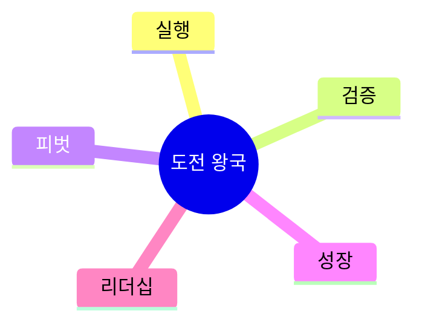
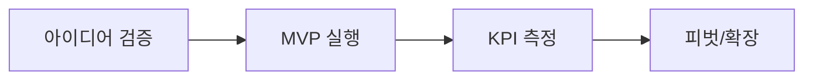

# 08. 🚀 도전 왕국 프로젝트 아이디어

## 고등학생 관점 기획 프레임

- **아버지 직업 연결 예시**: 창업, 영업, 운동선수, 군인, 경영
- **나의 흥미 연결 예시**: 창업, 실행력, 리더십, 운동, 도전
- **핵심 질문**: "아이디어를 실제로 실행하고 결과를 만들 수 있는가?"

## 아이디어 10선

| ID | 프로젝트 아이디어 | 아버지 직업 x 나의 흥미 | 간단 유저 시나리오 | 문제점-해결점 | AI/바이브 코딩 도구 | 아이디어 찾은 방식 |
|---|---|---|---|---|---|---|
| CHL-01 | 학교 축제 창업 시뮬레이터 | 창업 아버지 x 사업 흥미 | 아이디어 입력 시 시장성/경쟁사/손익 분석 | 시장 검증 어려움 -> AI 분석 | Perplexity, Sheets, Cursor | 아버지 사업 기획서 참고 |
| CHL-02 | 운동 기록 AI 코칭 앱 | 체육 아버지 x 운동 흥미 | 운동 영상 업로드 시 자세 분석+개선점 제공 | 자세 교정 피드백 부족 -> AI 분석 | Pose Detection, Flutter, Bolt | 개인 운동 기록 관리 니즈 |
| CHL-03 | 미니 창업 KPI 대시보드 | 자영업 아버지 x 경영 흥미 | 매출/방문자/전환율 실시간 추적 | 성과 파악 어려움 -> 대시보드 | Google Analytics, Looker, Replit | 가족 매장 운영 데이터 관찰 |
| CHL-04 | 피치덱 자동 생성 도구 | 투자 아버지 x 발표 흥미 | 사업 개요 입력 시 슬라이드 10장 생성 | 피치덱 제작 시간 부족 -> 자동화 | Gamma, ChatGPT, Copilot | 창업 대회 준비 경험 |
| CHL-05 | 학급 프로젝트 진행률 트래커 | 프로젝트매니저 아버지 x 관리 흥미 | 팀 과제 진행 상황을 간트차트로 시각화 | 진행 파악 어려움 -> 실시간 추적 | Notion, Mermaid, Cursor | 팀 과제 지연 문제 해결 |
| CHL-06 | 동아리 부스 수익 예측기 | 영업 아버지 x 재무 흥미 | 과거 데이터로 축제 매출 예측 | 재고/인력 계획 어려움 -> 예측 모델 | Python, Prophet, Replit | 축제 부스 운영 경험 |
| CHL-07 | 학생 스타트업 아이디어 검증툴 | 컨설팅 아버지 x 창업 흥미 | 아이디어 입력 시 SWOT 분석 자동 생성 | 아이디어 검증 방법 모름 -> 체계화 | Claude, Notion, Copilot | 창업 동아리 아이디어 회의 |
| CHL-08 | 체력 측정 기록-목표 앱 | 군인 아버지 x 체육 흥미 | 체력 데이터 입력 시 목표 달성 로드맵 생성 | 목표 설정 막연함 -> 단계별 계획 | Flutter, Firebase, Cursor | 체력장 준비 경험 |
| CHL-09 | 학교 협동조합 운영 시뮬레이터 | 경영 아버지 x 사회적경제 흥미 | 매출/비용 입력 시 지속가능성 점수 제공 | 수익성 판단 어려움 -> 시뮬레이션 | Streamlit, Python, Bolt | 학교 매점 협동조합 관찰 |
| CHL-10 | 대회 출전 전략 플래너 | 코치 아버지 x 전략 흥미 | 대회 일정/목표 입력 시 훈련 계획 생성 | 준비 계획 비체계적 -> 자동 플래닝 | Notion AI, Calendar, Replit | 대회 준비 경험 정리 |

## 실행 로드맵(4주)

## 세특 문장 템플릿

`[사업/프로젝트 아이디어]를 [실행 방법]으로 검증하고, [매출/성과 지표]를 통해 실행력과 개선 과정을 입증함.`

---

## 프로젝트별 상세 정보

### CHL-01: 학교 축제 창업 시뮬레이터

**페르소나**: 창업동아리 (고2, 축제 부스 계획)  
**벤치마킹**: 수기 사업계획 → AI 분석  
**필요성**: 부스 수익성 예측 어려움  
**핵심 기능**: ① 아이디어 입력 ② 시장성 분석 ③ 손익 예측  
**세특**: "창업 시뮬레이터로 축제 매출 50만원 달성"

### CHL-02: 운동 기록 AI 코칭 앱

**페르소나**: 운동부 (고2, 자세 교정 필요)  
**벤치마킹**: 수기 코칭 → AI 자세 분석  
**필요성**: 개인 코칭 시간 부족  
**핵심 기능**: ① 운동 영상 ② 자세 분석 ③ 개선점  
**세특**: "AI 코칭으로 개인 기록 10% 향상"

### CHL-03: 미니 창업 KPI 대시보드

**페르소나**: 자영업관심 (고2, 가족 매장 관찰)  
**벤치마킹**: 수기 집계 → 실시간 대시보드  
**필요성**: 성과 파악 지연  
**핵심 기능**: ① 매출/방문자 입력 ② 실시간 차트 ③ 목표 달성률  
**세특**: "KPI 대시보드로 축제 부스 운영 효율 개선"

### CHL-04: 피치덱 자동 생성 도구

**페르소나**: 창업대회 (고2, 피치덱 제작 시간 부족)  
**벤치마킹**: 수기 제작 → AI 슬라이드  
**필요성**: 피치덱 제작 평균 15시간  
**핵심 기능**: ① 사업 개요 입력 ② 슬라이드 10장 ③ 투자자 Q  
**세특**: "피치덱 도구로 창업 대회 지역 예선 통과"

### CHL-05: 학급 프로젝트 진행률 트래커

**페르소나**: 팀장 (고2, 팀 과제 지연)  
**벤치마킹**: 수기 관리 → 간트차트  
**필요성**: 팀 과제 지연율 50%  
**핵심 기능**: ① 일정 입력 ② 진행률 시각화 ③ 지연 알림  
**세특**: "프로젝트 트래커로 팀 과제 제출률 100% 달성"

### CHL-06: 동아리 부스 수익 예측기

**페르소나**: 부스운영 (고2, 재고 계획 어려움)  
**벤치마킹**: 감각 의존 → 데이터 예측  
**필요성**: 재고 과다/부족 문제  
**핵심 기능**: ① 과거 데이터 ② 매출 예측 ③ 재고 추천  
**세특**: "수익 예측으로 축제 부스 순이익 2배 증가"

### CHL-07: 학생 스타트업 아이디어 검증툴

**페르소나**: 창업희망 (고1, 아이디어 검증 방법 모름)  
**벤치마킹**: 없음 (신규)  
**필요성**: 아이디어 실패율 70%  
**핵심 기능**: ① 아이디어 입력 ② SWOT 분석 ③ 실행 계획  
**세특**: "아이디어 검증으로 창업 동아리 프로젝트 성공률 향상"

### CHL-08: 체력 측정 기록-목표 앱

**페르소나**: 체력장준비 (고2, 목표 설정 막연)  
**벤치마킹**: 수기 기록 → 목표 로드맵  
**필요성**: 체력 향상 계획 부재  
**핵심 기능**: ① 체력 데이터 ② 목표 달성 로드맵 ③ 주간 계획  
**세특**: "체력 관리 앱으로 체력장 1등급 달성"

### CHL-09: 학교 협동조합 운영 시뮬레이터

**페르소나**: 사회적경제 (고2, 협동조합 관심)  
**벤치마킹**: 수기 계산 → 시뮬레이션  
**필요성**: 지속가능성 판단 어려움  
**핵심 기능**: ① 매출/비용 입력 ② 지속가능성 점수 ③ 개선안  
**세특**: "협동조합 시뮬레이터로 학교 매점 운영 개선안 제안"

### CHL-10: 대회 출전 전략 플래너

**페르소나**: 대회준비 (고2, 훈련 계획 비체계적)  
**벤치마킹**: 수기 계획 → AI 플래닝  
**필요성**: 대회 준비 효율 낮음  
**핵심 기능**: ① 대회 일정 ② 훈련 계획 ③ 진행률 추적  
**세특**: "전략 플래너로 대회 입상 3건 달성"
