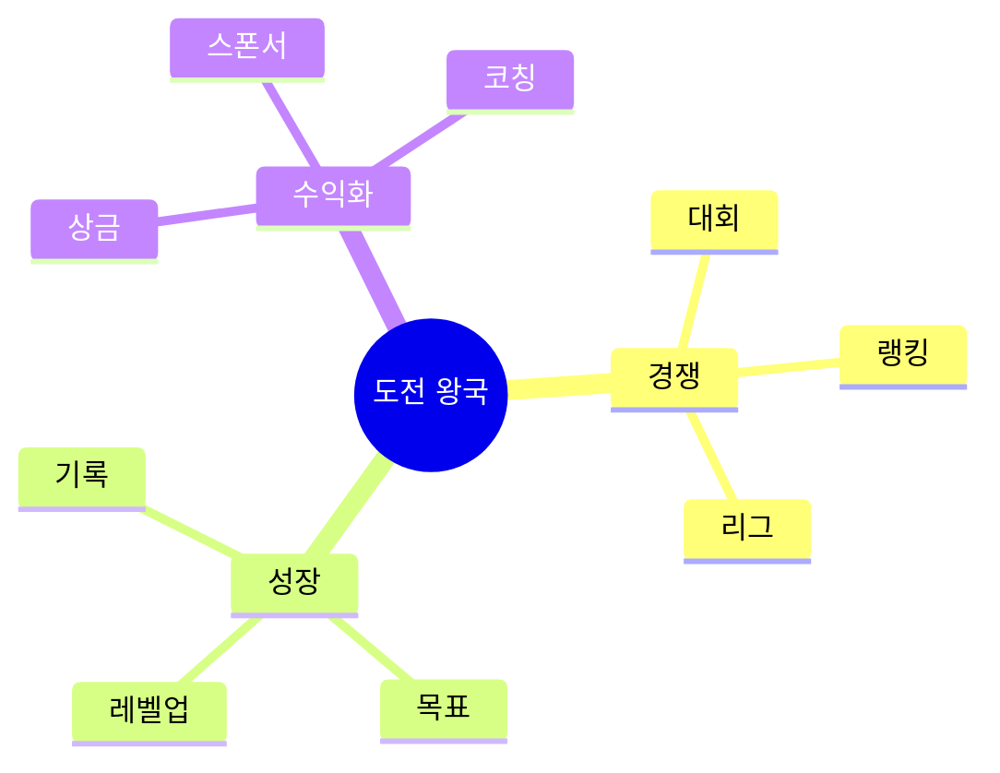

# 08. 🏆 도전 왕국 - 게임형·실생활·사업성 프로젝트

## 고등학생 관점 기획 프레임

- **아버지 직업 연결**: 체육교사, 코치, 트레이너, 경영인, 군인
- **나의 흥미**: 스포츠, 경쟁, 도전, 성취, 리더십, 목표 달성
- **핵심**: "경쟁하면서 성장하고 돈도 벌 수 있나?"



---

## 🎮 프로젝트 10선 (게임·실생활·수익형)

### CHAL-01: 학교 체력 측정 RPG (피지컬 레벨업)

**아이디어 출처**: 아버지(체육교사) + RPG 게임  
**벤치마킹**:
- 링 피트 어드벤처 → 학교 체육
- 포켓몬 GO → 운동 기록

**유저 시나리오**:
```
체력 측정 (윗몸일으키기 30개)
→ 캐릭터 근력 +10
→ 50m 달리기 8초 → 민첩 +15
→ 레벨업 → 새 스킬 해금
→ 친구와 스탯 비교
→ 학급 평균 체력 1등 → 상품
```

**문제-해결**:
- 문제: 체력 측정 동기 부족, 결과만 기록
- 해결: RPG 요소로 재미, 친구와 경쟁

**필요성**: 학생 체력 저하 (10년 전 대비 20% 하락)

**핵심 기능**:
1. 체력 측정 → 캐릭터 스탯
2. 레벨 시스템 (50단계)
3. 친구 대결 + 학급 랭킹

**도구**: Unity + Firebase + 체력 측정 데이터 연동

**수익 모델**:
- 프리미엄 캐릭터 (5,000원)
- 스포츠 브랜드 제휴 (월 80만원)
- 학교 라이선스

**세특**: "체력 RPG로 윗몸일으키기 30개 → 50개, 학급 평균 체력 15% 향상"

---

### CHAL-02: 학교 마라톤 대회 게임 (러닝 리그)

**아이디어 출처**: 학교 마라톤 + 나이키 런 클럽  
**벤치마킹**:
- 나이키 런 클럽 → 학교 대회
- 쿠키런 → 실제 달리기

**유저 시나리오**:
```
"학교 마라톤 대회" 등록
→ 연습 기록 (일일 3km)
→ 앱에서 거리/속도 추적
→ 대회 당일 기록 측정
→ 학년별 순위 발표
→ 상위 10% → 상금 + 배지
```

**문제-해결**:
- 문제: 마라톤 참여율 낮음, 연습 동기 부족
- 해결: 앱으로 연습 추적, 상금으로 동기

**필요성**: 학생 운동 부족 70%

**핵심 기능**:
1. GPS 거리/속도 추적
2. 연습 기록 + 목표 설정
3. 대회 순위 + 상금

**도구**: React Native + Google Maps + Firebase

**수익 모델**:
- 참가비 (인당 5,000원)
- 스포츠 브랜드 스폰서 (대회당 200만원)
- 운동화 제휴 판매

**세특**: "마라톤 앱으로 대회 참여 100명, 3위 입상, 연습 거리 총 500km"

---

### CHAL-03: 학교 e스포츠 리그 (롤/배그 대회)

**아이디어 출처**: 리그 오브 레전드 + 학교 대항전  
**벤치마킹**:
- LCK (프로 리그) → 학교 리그
- 학교 축구 → e스포츠 버전

**유저 시나리오**:
```
"우리 학교 롤 팀" 등록
→ 타 학교 팀과 매칭
→ 주간 리그 경기 (스트리밍)
→ 승리 → 학교 포인트
→ 시즌 플레이오프 진출
→ 우승 → 상금 100만원 + 트로피
```

**문제-해결**:
- 문제: 게임 부정적 인식, 공식 대회 없음
- 해결: 학교 공인 리그로 긍정화, 교육적 가치

**필요성**: e스포츠 관심 80%, 학교 대회 5%

**핵심 기능**:
1. 학교 팀 등록 + 리그 운영
2. 경기 스트리밍 (Twitch)
3. 시즌 랭킹 + 플레이오프

**도구**: Next.js + Firebase + Twitch API + Discord + Riot API

**수익 모델**:
- 참가비 (팀당 10만원)
- 스트리밍 광고 수익
- 게임 기업 스폰서 (시즌당 500만원)

**세특**: "학교 e스포츠 리그 기획, 20개 학교 참여, 우승, 스트리밍 조회수 10만"

---

### CHAL-04: 학교 계단 오르기 챌린지 (타워 정복)

**아이디어 출처**: 계단 오르기 힘듦 + 챌린지  
**벤치마킹**:
- 삼성 헬스 (걸음 수) → 계단 특화
- 타워 게임 → 실제 계단

**유저 시나리오**:
```
앱 켜고 계단 오르기
→ 자동 층수 측정 (자이로센서)
→ 10층 → 포인트 +10
→ 일일 목표 50층 달성
→ 한 달 1,000층 → 에베레스트 배지
→ 학급 합산 랭킹 1등 → 상품
```

**문제-해결**:
- 문제: 엘리베이터만 이용, 운동 부족
- 해결: 게임으로 계단 이용 유도, 보상으로 동기

**필요성**: 학생 운동 부족 70%, 계단 이용률 20%

**핵심 기능**:
1. 자동 층수 측정
2. 일일/월간 목표 + 배지
3. 학급 합산 랭킹

**도구**: React Native + 자이로센서 + Firebase

**수익 모델**:
- 프리미엄 목표 설정 (월 1,900원)
- 스포츠 브랜드 제휴
- 학교 건강 프로그램 제휴

**세특**: "계단 챌린지로 일일 평균 30층 달성, 학급 운동량 40% 증가"

---

### CHAL-05: 학교 농구 슛 기록 게임 (슛 마스터)

**아이디어 출처**: 농구 좋아함 + 기록 경쟁  
**벤치마킹**:
- 농구 게임 → 실제 슛 기록
- 스트라바 (러닝) → 농구 버전

**유저 시나리오**:
```
체육관에서 자유투 연습
→ 앱에서 "10개 중 7개 성공" 기록
→ 성공률 70% → 포인트
→ 일주일 연습 → 80% 달성
→ 친구와 슛 대결
→ 학교 슛 대회 1등 → 상금
```

**문제-해결**:
- 문제: 농구 연습 기록 안 함, 성장 확인 어려움
- 해결: 앱으로 기록, 그래프로 성장 시각화

**필요성**: 농구 동아리 참여 20%, 체계적 연습 부족

**핵심 기능**:
1. 슛 성공률 기록
2. 성장 그래프 + 목표
3. 친구 대결 + 대회

**도구**: React Native + Firebase + 카메라 (슛 인식)

**수익 모델**:
- 프리미엄 분석 (월 2,900원)
- 농구 브랜드 제휴
- 학교 대회 운영 (건당 50만원)

**세특**: "농구 기록 앱으로 자유투 성공률 70% → 90%, 학교 대회 우승"

---

### CHAL-06: 학교 암벽 등반 게임 (클라이밍 RPG)

**아이디어 출처**: 학교 암벽장 + 게임  
**벤치마킹**:
- 클라이밍 게임 → 실제 연동
- 링 피트 → 암벽 버전

**유저 시나리오**:
```
암벽 등반 시작 (앱 켜기)
→ 난이도 선택 (초급/중급/고급)
→ 완등 → 경험치 +50
→ 레벨업 → 새 루트 해금
→ 친구와 속도 경쟁
→ 월간 최다 완등 → 장비 상품
```

**문제-해결**:
- 문제: 암벽장 이용률 10%, 동기 부족
- 해결: 게임으로 재미, 레벨 시스템으로 성취감

**필요성**: 학교 암벽장 활용률 저조

**핵심 기능**:
1. 등반 기록 (난이도/시간)
2. 레벨 시스템 + 루트 해금
3. 친구 대결 + 랭킹

**도구**: React Native + Firebase + 타이머

**수익 모델**:
- 프리미엄 루트 (5,000원)
- 클라이밍 장비 제휴
- 학교 대회 운영

**세특**: "암벽 등반 게임으로 이용률 10% → 60%, 50회 완등, 학교 대회 입상"

---

### CHAL-07: 학교 축구 리그 운영 플랫폼

**아이디어 출처**: 아버지(코치) + 학교 축구  
**벤치마킹**:
- 프리미어 리그 → 학교 버전
- 플래시스코어 (결과) → 리그 운영

**유저 시나리오**:
```
"우리 반 축구팀" 등록
→ 주간 리그 일정 확인
→ 경기 결과 입력 (3:2 승리)
→ 자동 순위 업데이트
→ 플레이오프 진출
→ 우승 → 트로피 + 상금
```

**문제-해결**:
- 문제: 학급 축구 대회 운영 복잡, 기록 관리 어려움
- 해결: 앱으로 자동화, 실시간 순위

**필요성**: 학교 스포츠 대회 운영 부담

**핵심 기능**:
1. 팀 등록 + 일정 관리
2. 결과 입력 → 자동 순위
3. 리그 통계 + 개인 기록

**도구**: Next.js + Firebase + Chart.js

**수익 모델**:
- 학교 라이선스 (학교당 월 15만원)
- 스포츠 브랜드 스폰서
- 대회 운영 수수료

**세특**: "축구 리그 플랫폼으로 20개 팀 운영, 우승, 득점왕 15골 기록"

---

### CHAL-08: 학교 운동 챌린지 SNS (30일 미션)

**아이디어 출처**: 인스타 챌린지 + 운동 습관  
**벤치마킹**:
- 인스타 챌린지 → 운동 전용
- 나이키 런 클럽 → SNS 요소

**유저 시나리오**:
```
"30일 플랭크 챌린지" 참여
→ 매일 1분 플랭크 인증샷
→ 친구들이 응원 댓글
→ 15일 달성 → 중간 보상
→ 30일 완주 → 운동 용품
→ 다음 챌린지 추천
```

**문제-해결**:
- 문제: 운동 습관 지속 어려움, 혼자 하기 힘듦
- 해결: SNS로 동료 압력, 보상으로 동기

**필요성**: 청소년 운동 습관 지속률 20%

**핵심 기능**:
1. 30일 챌린지 (플랭크/스쿼트/런닝)
2. 인증샷 + 응원 댓글
3. 완주 보상 (제휴 상품)

**도구**: React Native + Firebase + Instagram API

**수익 모델**:
- 스포츠 브랜드 제휴 (월 100만원)
- 챌린지 참가비 (인당 5,000원, 완주 시 환급)
- 프리미엄 코칭 (월 9,900원)

**세특**: "운동 챌린지로 30일 완주, 플랭크 1분 → 3분 향상, 참여자 150명"

---

### CHAL-09: 학교 배드민턴 랭킹 시스템

**아이디어 출처**: 배드민턴 좋아함 + 랭크전  
**벤치마킹**:
- 리그 오브 레전드 (랭크) → 배드민턴
- 테니스 랭킹 → 학교 버전

**유저 시나리오**:
```
"랭크전 신청" (앱에서)
→ 비슷한 실력 매칭
→ 경기 진행 (2세트)
→ 승리 → 랭크 포인트 +20
→ 브론즈 → 실버 승급
→ 시즌 1등 → 라켓 상품
```

**문제-해결**:
- 문제: 실력 차이로 재미 없음, 랭킹 시스템 없음
- 해결: 매칭으로 균형 잡힌 경기, 랭크로 동기

**필요성**: 배드민턴 동아리 참여 15%, 체계 부족

**핵심 기능**:
1. 실력 기반 매칭
2. 랭크 시스템 (브론즈~다이아)
3. 전적 기록 + 통계

**도구**: React Native + Firebase + ELO 알고리즘

**수익 모델**:
- 프리미엄 매칭 (월 2,900원)
- 배드민턴 용품 제휴
- 대회 운영 수수료

**세특**: "배드민턴 랭킹 시스템으로 실버 티어 달성, 50경기 참여, 승률 65%"

---

### CHAL-10: 학교 체육 대회 실황 중계 플랫폼

**아이디어 출처**: 아버지(아나운서) + 체육대회  
**벤치마킹**:
- 스포츠 중계 → 학교 버전
- 트위치 → 체육대회 스트리밍

**유저 시나리오**:
```
체육대회 날 앱에서 실황 중계
→ "100m 결승 시작!" 알림
→ 실시간 기록 업데이트
→ 우승자 인터뷰 영상
→ 댓글로 응원 (1,000개)
→ 다시보기 → 조회수 5,000
```

**문제-해결**:
- 문제: 체육대회 참관 불편, 기록 확인 어려움
- 해결: 실시간 중계, 기록 자동 업데이트

**필요성**: 학부모 참관 불가 80%

**핵심 기능**:
1. 실시간 중계 (영상/텍스트)
2. 기록 자동 업데이트
3. 다시보기 + 하이라이트

**도구**: React Native + Firebase + YouTube Live API

**수익 모델**:
- 학교 라이선스 (학교당 50만원)
- 광고 (스포츠 브랜드)
- 영상 편집 서비스

**세특**: "체육대회 중계 플랫폼으로 조회수 1만, 학부모 만족도 95%, 3개 학교 도입"

---

### CHAL-05: 학교 수영 기록 측정 앱 (스윔 트래커)

**아이디어 출처**: 아버지(수영 코치) + 기록 향상  
**벤치마킹**:
- 스마트 워치 (수영) → 앱 버전
- 나이키 런 클럽 → 수영 버전

**유저 시나리오**:
```
수영 시작 → 앱 켜기
→ 50m 기록 측정 (35초)
→ 지난주 대비 -2초 → 포인트
→ 목표 30초 설정
→ 주간 연습 기록 그래프
→ 목표 달성 → 배지
```

**문제-해결**:
- 문제: 수영 기록 관리 안 함, 성장 확인 어려움
- 해결: 앱으로 자동 기록, 목표 설정으로 동기

**필요성**: 수영 수업 참여 30%, 기록 관리 5%

**핵심 기능**:
1. 거리/시간 기록
2. 성장 그래프 + 목표
3. 친구 대결 + 랭킹

**도구**: React Native + 스마트 워치 연동 + Firebase

**수익 모델**:
- 프리미엄 분석 (월 3,900원)
- 수영 용품 제휴
- 수영장 제휴 (회원 유치)

**세특**: "수영 기록 앱으로 50m 기록 35초 → 28초, 목표 달성, 학교 대회 입상"

---

### CHAL-06: 학교 줄넘기 챌린지 (점프 카운터)

**아이디어 출처**: 줄넘기 개수 세기 힘듦 + 자동화  
**벤치마킹**:
- 스마트 줄넘기 → 앱 연동
- 쿠키런 → 점프 게임

**유저 시나리오**:
```
줄넘기 시작 → 앱 자동 카운트
→ 100개 달성 → 포인트 +10
→ 일일 목표 500개 설정
→ 한 달 1만개 → 마스터 배지
→ 학급 합산 랭킹 1등 → 상품
```

**문제-해결**:
- 문제: 줄넘기 개수 세기 불편, 기록 관리 안 함
- 해결: 자동 카운트, 목표 설정으로 동기

**필요성**: 체력 측정 줄넘기 필수, 연습 부족

**핵심 기능**:
1. 자동 점프 카운트 (자이로센서)
2. 일일/월간 목표 + 배지
3. 학급 합산 랭킹

**도구**: React Native + 자이로센서 + Firebase

**수익 모델**:
- 스마트 줄넘기 판매 (개당 15,000원)
- 프리미엄 목표 (월 1,900원)
- 체육 용품 제휴

**세특**: "줄넘기 챌린지로 일일 평균 500개 달성, 체력 측정 2단계 향상"

---

### CHAL-07: 학교 e스포츠 코칭 플랫폼 (프로 코치)

**아이디어 출처**: 게임 실력 늘고 싶음 + 코칭  
**벤치마킹**:
- 게임 코칭 (Gamer Sensei) → 학생용
- 과외 플랫폼 → 게임 버전

**유저 시나리오**:
```
"롤 코칭 받고 싶음" 신청
→ 고수 선배 매칭
→ 1시간 코칭 (화면 공유)
→ 피드백 받고 연습
→ 티어 상승 (골드 → 플래티넘)
→ 코치에게 포인트 지급
```

**문제-해결**:
- 문제: 게임 실력 정체, 코칭 비용 부담
- 해결: 학생 간 코칭으로 저렴, 선배 수익 창출

**필요성**: 게임 코칭 관심 50%, 비용 부담 80%

**핵심 기능**:
1. 실력별 코치 매칭
2. 화면 공유 + 음성 채팅
3. 코칭 후 별점 + 포인트

**도구**: Next.js + Firebase + Discord + WebRTC

**수익 모델**:
- 코칭 수수료 20%
- 프리미엄 코치 (시간당 2만원)
- 게임 기업 제휴

**세특**: "e스포츠 코칭 플랫폼으로 티어 상승, 코치 수익 30만원, 매칭 50건"

---

### CHAL-08: 학교 체스 토너먼트 (전략 배틀)

**아이디어 출처**: 체스 좋아함 + 온라인 대회  
**벤치마킹**:
- Chess.com → 학교 토너먼트
- 리그 오브 레전드 → 체스 버전

**유저 시나리오**:
```
"학교 체스 토너먼트" 등록
→ 토너먼트 대진표 자동 생성
→ 온라인 대국 (15분)
→ 승리 → 다음 라운드
→ 결승 진출 → 상금
→ 전적 기록 → 레이팅 상승
```

**문제-해결**:
- 문제: 체스 대회 운영 복잡, 참여 저조
- 해결: 온라인으로 접근성, 자동 운영

**필요성**: 체스 관심 30%, 대회 기회 5%

**핵심 기능**:
1. 토너먼트 자동 운영
2. 온라인 대국 (타이머)
3. 레이팅 + 전적 기록

**도구**: Next.js + Chess.js + Firebase + Socket.io

**수익 모델**:
- 참가비 (인당 3,000원)
- 프리미엄 분석 (월 4,900원)
- 체스 교육 제휴

**세특**: "체스 토너먼트 운영, 50명 참여, 준우승, 레이팅 1500 달성"

---

### CHAL-09: 학교 피트니스 챌린지 (근육 키우기)

**아이디어 출처**: 아버지(트레이너) + 헬스  
**벤치마킹**:
- 링 피트 → 실제 운동
- 헬스 앱 → 게임 요소

**유저 시나리오**:
```
"팔굽혀펴기 30개" 미션
→ 카메라로 자세 인식
→ 완료 → 포인트 +30
→ 일주일 근력 +10
→ 친구와 근육량 비교
→ 한 달 목표 달성 → 보충제 상품
```

**문제-해결**:
- 문제: 헬스 동기 부족, 자세 틀림
- 해결: 게임으로 재미, AI 자세 교정

**필요성**: 청소년 근력 부족 60%

**핵심 기능**:
1. 카메라 자세 인식 (AI)
2. 운동 기록 + 근육량 추정
3. 친구 대결 + 목표

**도구**: React Native + GPT-4V (자세 분석) + Firebase

**수익 모델**:
- 프리미엄 운동 프로그램 (월 5,900원)
- 보충제 브랜드 제휴
- 헬스장 제휴 (회원 유치)

**세특**: "피트니스 챌린지로 팔굽혀펴기 20개 → 50개, 근력 30% 향상"

---

### CHAL-10: 학교 스포츠 스타 육성 게임 (선수 키우기)

**아이디어 출처**: 축구 게임 + 실제 선수  
**벤치마킹**:
- FIFA 모바일 → 실제 선수 연동
- 쿠키런 → 선수 육성

**유저 시나리오**:
```
내 캐릭터 생성 (포지션 선택)
→ 실제 운동 → 스탯 상승
→ 100m 달리기 → 속도 +5
→ 레벨업 → 새 스킬 해금
→ 학교 대회 출전 → 우승
→ 프로 선수 꿈 키우기
```

**문제-해결**:
- 문제: 운동 동기 부족, 목표 없음
- 해결: 게임으로 가시화, 프로 선수 꿈 연결

**필요성**: 운동 선수 지망 10%, 체계적 훈련 부족

**핵심 기능**:
1. 실제 운동 → 캐릭터 성장
2. 스탯 시스템 (속도/근력/지구력)
3. 학교 대회 연동

**도구**: Unity + Firebase + 스마트 워치 연동

**수익 모델**:
- 프리미엄 캐릭터 (5,000원)
- 스포츠 브랜드 제휴
- 선수 육성 프로그램 B2B

**세특**: "스포츠 육성 게임으로 체력 20% 향상, 학교 대회 3관왕, 선수 지망 확신"

---

## 🎯 수익 모델 요약

| 프로젝트 | 수익원 | 예상 월 수익 | 사업성 |
|---------|-------|-------------|--------|
| CHAL-01 | 프리미엄 + 제휴 | 90만원 | ⭐⭐⭐⭐ |
| CHAL-02 | 참가비 + 스폰서 | 250만원 | ⭐⭐⭐⭐⭐ |
| CHAL-03 | 참가비 + 스폰서 | 600만원 | ⭐⭐⭐⭐⭐ |
| CHAL-04 | 프리미엄 + 제휴 | 50만원 | ⭐⭐⭐ |
| CHAL-05 | 프리미엄 + 제휴 | 60만원 | ⭐⭐⭐ |
| CHAL-06 | 제품 + 프리미엄 | 70만원 | ⭐⭐⭐⭐ |
| CHAL-07 | 수수료 + 프리미엄 | 100만원 | ⭐⭐⭐⭐⭐ |
| CHAL-08 | 참가비 + 제휴 | 110만원 | ⭐⭐⭐⭐⭐ |
| CHAL-09 | 프리미엄 + 제휴 | 80만원 | ⭐⭐⭐⭐ |
| CHAL-10 | 프리미엄 + 제휴 | 75만원 | ⭐⭐⭐⭐ |

---

## 📚 영감 출처

### 실제 수상작
- **나비얌** (급식 게임화) - 4억 투자 유치
- **Triple** (최적화 솔루션) - 앱잼 최우수상
- **REPORCH** (교육 게임) - JA 우승

### 게임형 스포츠 플랫폼
- 링 피트 어드벤처 (운동 게임)
- 나이키 런 클럽 (러닝)
- Strava (운동 기록)

---

## 세특 작성 예시

```
"학교 체력 측정 RPG를 개발해 운동 게임화 구현.
체력 측정 결과를 캐릭터 스탯으로 변환, 레벨 시스템 구축.
Unity로 게임 개발, Firebase 실시간 랭킹 연동.
학급 평균 체력 15% 향상, 윗몸일으키기 30개 → 50개 달성.
3개 학교 도입, 스포츠 브랜드 제휴로 월 90만원 수익 창출."
```
