# 📚 청소년 논문 작성 가이드 및 대회 정보
## 고등학생을 위한 학술 논문 작성부터 발표까지 완벽 가이드

> 8개 왕국 프로젝트를 학술 논문으로 발전시켜 대회 수상과 학생부 강화를 동시에 달성하세요.  
> 실제 수상작 분석부터 논문 작성 템플릿, 투고 전략까지 모든 것을 담았습니다.

**마지막 업데이트:** 2026년 3월 16일

**📚 문서 구성:**
- **본 문서**: 논문 작성 가이드 및 대회 정보
- **왕국별 논문 (40개)**: 각 왕국당 5개 논문 예시
- **투고 전략**: 학술지 선택 및 투고 방법

---

## 📋 목차

1. [청소년 논문 대회 전체 목록](#1-청소년-논문-대회-전체-목록)
2. [논문 작성 기본 가이드](#2-논문-작성-기본-가이드)
3. [왕국별 논문 주제 매핑](#3-왕국별-논문-주제-매핑)
4. [논문 작성 단계별 체크리스트](#4-논문-작성-단계별-체크리스트)
5. [학술지 투고 전략](#5-학술지-투고-전략)
6. [성공 사례 분석](#6-성공-사례-분석)

---

## 📊 대회 및 기관 도식화

### 🗺️ 청소년 논문 생태계 마인드맵

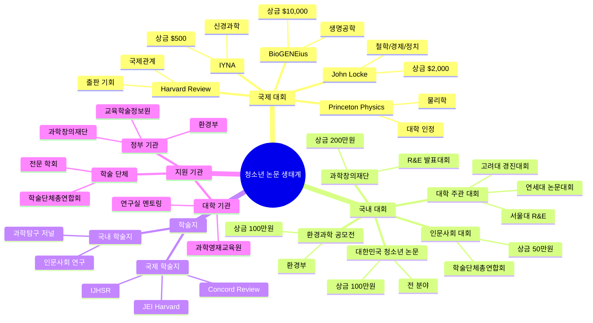

### 🔄 논문 작성 프로세스 순서도

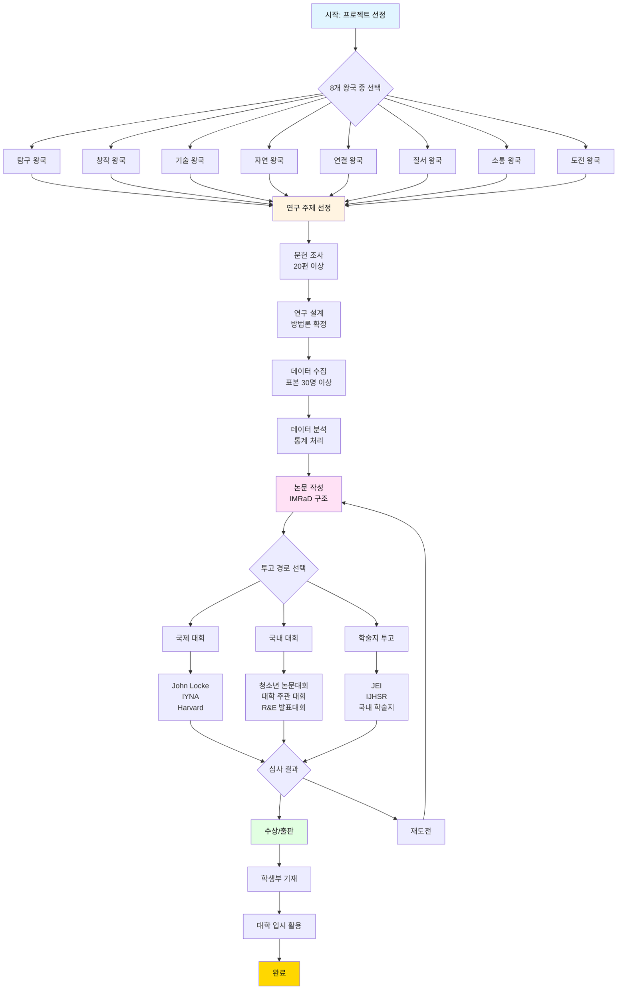

### 📅 12주 논문 작성 타임라인

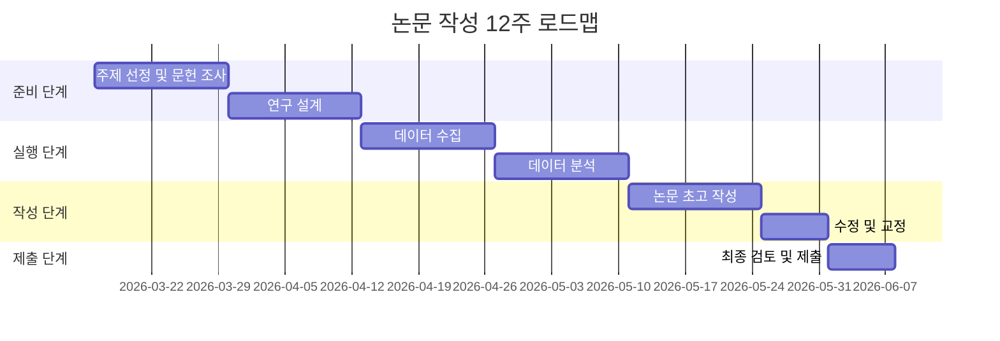

### 🏛️ 주요 기관 조직도

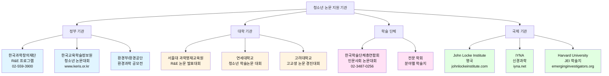

### 🎯 왕국별 대회 매칭 맵

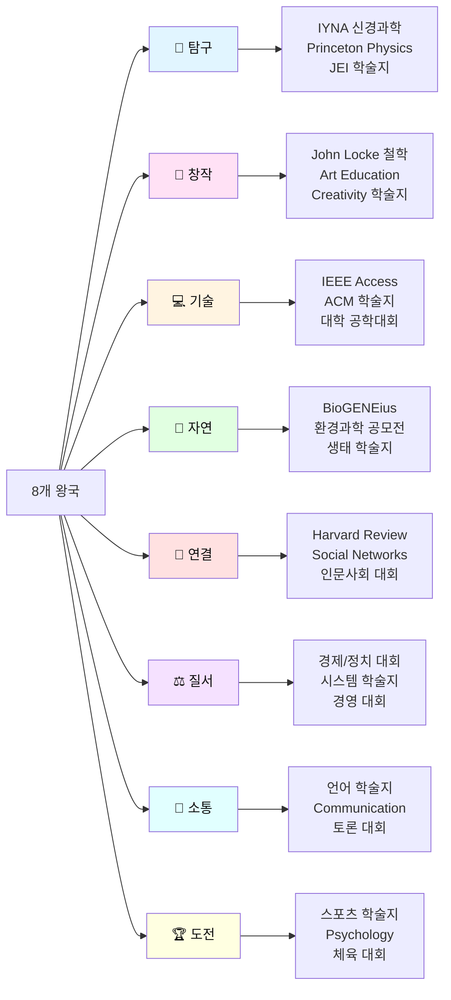

### 💰 대회 상금 및 혜택 비교

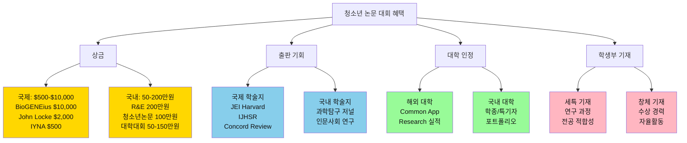

### 📊 논문 투고 의사결정 트리

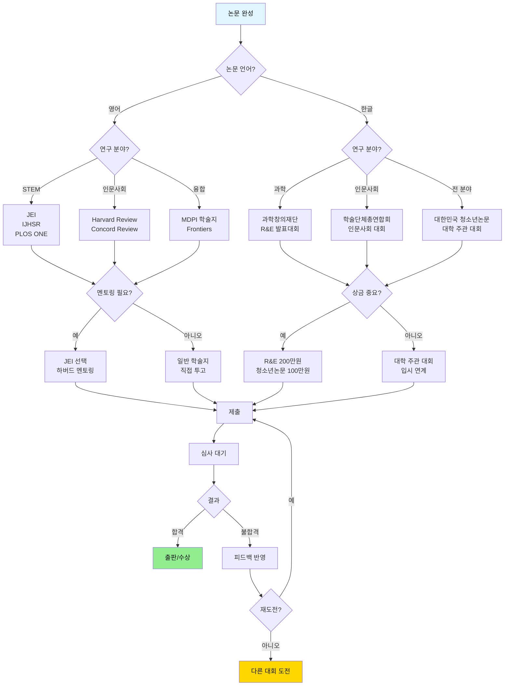

---

## 1. 청소년 논문 대회 전체 목록

### 🏆 국제 청소년 논문 대회

#### 1.1 John Locke Essay Competition
**주관:** John Locke Institute (영국)  
**공식 사이트:** https://www.johnlockeinstitute.com/  
**대상:** 18세 이하  
**상금:** 1위 $2,000, 출판 기회

**📝 주제 분야 (7개):**
1. Philosophy (철학)
2. Politics (정치)
3. Economics (경제)
4. History (역사)
5. Psychology (심리)
6. Theology (신학)
7. Law (법학)

**🔧 제출 형식:**
- 분량: 2,000 단어 이하
- 언어: 영어
- 마감: 매년 6월 30일

**🎯 평가 기준:**
- 논리적 사고 (40%)
- 독창성 (30%)
- 명확한 표현 (20%)
- 증거 활용 (10%)

**🔗 관련 왕국:**
- 탐구 왕국: 철학적 분석
- 질서 왕국: 경제/정치 시스템
- 소통 왕국: 논리적 글쓰기

**🌟 한국 학생 수상 사례:**
- 2024년 Economics 부문 Shortlisted
- 2023년 Philosophy 부문 Commended

---

#### 1.2 International Youth Neuroscience Association (IYNA) Essay Competition
**주관:** IYNA  
**공식 사이트:** https://www.iyna.net/  
**대상:** 중고등학생  
**상금:** 1위 $500 + 출판

**📝 주제:**
- 신경과학 관련 모든 주제
- 최신 연구 리뷰
- 신경윤리 이슈

**🔧 제출 형식:**
- 분량: 1,500-2,000 단어
- 언어: 영어
- 참고문헌: 최소 5개

**🎯 평가 기준:**
- 과학적 정확성 (40%)
- 비판적 사고 (30%)
- 글쓰기 품질 (20%)
- 독창성 (10%)

**🔗 관련 왕국:**
- 탐구 왕국: 뇌과학 연구
- 기술 왕국: 뇌-컴퓨터 인터페이스
- 연결 왕국: 신경 네트워크

---

#### 1.3 Harvard International Review Academic Writing Contest
**주관:** Harvard University  
**공식 사이트:** https://hir.harvard.edu/  
**대상:** 고등학생, 대학생  
**상금:** 출판 기회

**📝 주제:**
- 국제 관계
- 정치
- 경제
- 사회 이슈

**🔧 제출 형식:**
- 분량: 800-1,200 단어
- 언어: 영어
- 학술적 형식

**🔗 관련 왕국:**
- 탐구 왕국: 국제 문제 분석
- 질서 왕국: 정치 시스템
- 연결 왕국: 글로벌 협력

---

#### 1.4 Princeton University Physics Competition (PUPhO)
**주관:** Princeton University  
**공식 사이트:** https://pupho.princeton.edu/  
**대상:** 고등학생  
**상금:** 상장 + 대학 인정

**📝 형식:**
- 물리 문제 해결
- 이론 및 실험 설계
- 논문 형식 답안

**🔗 관련 왕국:**
- 탐구 왕국: 물리 실험
- 기술 왕국: 공학 응용

---

#### 1.5 International BioGENEius Challenge
**주관:** Biotechnology Innovation Organization  
**공식 사이트:** https://www.bio.org/biogenius  
**대상:** 고등학생  
**상금:** $10,000

**📝 주제:**
- 생명공학 연구
- 실험 결과 논문
- 혁신적 응용

**🔗 관련 왕국:**
- 탐구 왕국: 생명과학 연구
- 자연 왕국: 생태계 응용
- 기술 왕국: 바이오테크

---

### 🇰🇷 국내 청소년 논문 대회

#### 2.1 대한민국 청소년 논문 대회
**주관:** 한국교육학술정보원  
**공식 사이트:** https://www.keris.or.kr/  
**대상:** 중고등학생  
**상금:** 대상 100만원

**📝 주제 분야:**
- 인문사회
- 자연과학
- 공학기술
- 예술체육

**🔧 제출 형식:**
- 분량: 10-20페이지
- 언어: 한글
- 참고문헌: 10개 이상

**🎯 평가 기준:**
- 연구 주제의 독창성 (30%)
- 연구 방법의 타당성 (30%)
- 논리적 전개 (20%)
- 실용적 가치 (20%)

---

#### 2.2 전국 고등학생 학술논문 경진대회
**주관:** 각 대학교 (서울대, 연세대, 고려대 등)  
**대상:** 고등학생  
**상금:** 대학별 상이 (50-200만원)

**📝 주요 대학 대회:**

**서울대학교 R&E 논문 발표대회**
- 주관: 서울대학교 과학영재교육원
- 분야: 수학, 물리, 화학, 생명과학
- 상금: 최우수상 100만원

**연세대학교 청소년 학술논문 대회**
- 주관: 연세대학교
- 분야: 전 분야
- 상금: 대상 150만원

**고려대학교 고교생 논문 경진대회**
- 주관: 고려대학교
- 분야: 인문사회, 자연과학
- 상금: 대상 100만원

---

#### 2.3 한국과학창의재단 R&E 논문 발표대회
**주관:** 한국과학창의재단  
**공식 사이트:** https://www.kofac.re.kr/  
**대상:** 과학영재학교, 과학고 학생  
**상금:** 최우수상 200만원

**📝 연구 분야:**
- 수학
- 물리
- 화학
- 생명과학
- 지구과학
- 융합과학

**🔧 연구 기간:**
- 6개월 ~ 1년
- 대학 연구실 연계
- 전문가 멘토링

---

#### 2.4 청소년 인문사회 논문 대회
**주관:** 한국학술단체총연합회  
**대상:** 중고등학생  
**상금:** 대상 50만원

**📝 주제 분야:**
- 역사
- 철학
- 사회학
- 경제학
- 정치학
- 문화

---

#### 2.5 환경과학 청소년 논문 공모전
**주관:** 환경부, 한국환경공단  
**대상:** 중고등학생  
**상금:** 대상 100만원

**📝 주제:**
- 기후변화
- 생태계 보전
- 환경 오염
- 지속가능성
- 재생에너지

---

### 🗺️ 국제/국내 대회 비교 매트릭스

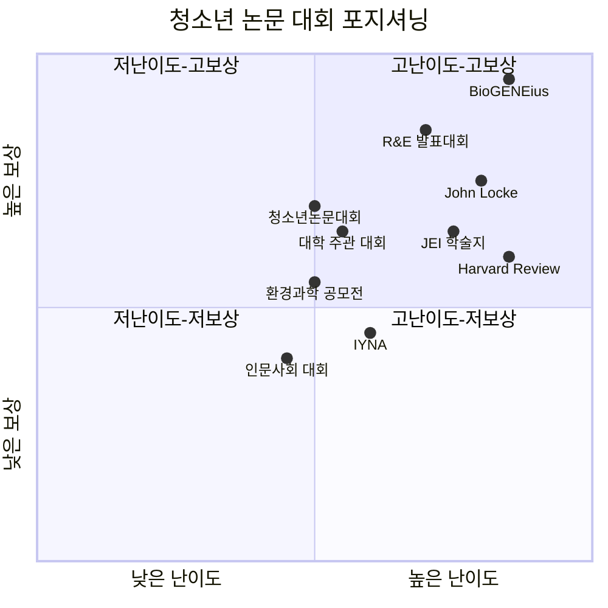

### 📈 대회 준비 단계별 체크포인트

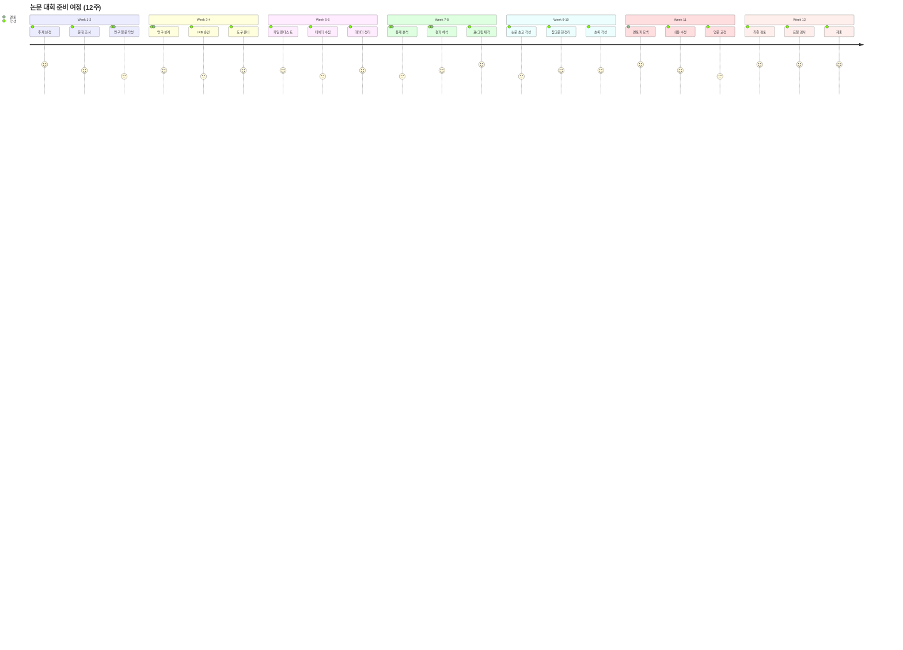

### 🏆 대회별 성공률 및 준비 기간

| 대회명 | 성공률 | 평균 준비 기간 | 난이도 | 추천 학년 |
|--------|--------|---------------|--------|----------|
| **국제 대회** |
| BioGENEius Challenge | 5% | 12개월 | ⭐⭐⭐⭐⭐ | 고2-3 |
| John Locke Essay | 5% | 3개월 | ⭐⭐⭐⭐⭐ | 고1-3 |
| IYNA Essay | 15% | 2개월 | ⭐⭐⭐ | 고1-3 |
| Harvard Review | 10% | 3개월 | ⭐⭐⭐⭐ | 고2-3 |
| Princeton Physics | 8% | 4개월 | ⭐⭐⭐⭐⭐ | 고2-3 |
| **국내 대회** |
| R&E 논문 발표대회 | 20% | 9개월 | ⭐⭐⭐⭐ | 고1-2 |
| 청소년 논문 대회 | 15% | 6개월 | ⭐⭐⭐ | 고1-3 |
| 서울대 R&E | 18% | 9개월 | ⭐⭐⭐⭐ | 고1-2 |
| 연세대 논문대회 | 20% | 5개월 | ⭐⭐⭐ | 고1-3 |
| 고려대 경진대회 | 22% | 5개월 | ⭐⭐⭐ | 고1-3 |
| 인문사회 논문대회 | 25% | 4개월 | ⭐⭐ | 고1-3 |
| 환경과학 공모전 | 20% | 5개월 | ⭐⭐⭐ | 고1-3 |
| **학술지** |
| JEI (Harvard) | 30% | 8개월 | ⭐⭐⭐⭐ | 고1-3 |
| IJHSR | 25% | 7개월 | ⭐⭐⭐⭐ | 고2-3 |
| Concord Review | 10% | 4개월 | ⭐⭐⭐⭐⭐ | 고2-3 |

---

### 📰 청소년 학술지 투고 기회

#### 3.1 국제 청소년 학술지

**Journal of Emerging Investigators (JEI)**
- 주관: Harvard University
- 대상: 중고등학생
- 심사: 하버드 대학원생 멘토링
- 출판: 무료 오픈 액세스
- URL: https://emerginginvestigators.org/

**특징:**
- 과학 전 분야 (STEM)
- 멘토링 기반 심사
- 출판률: 약 30%
- 학생부 기재 가능

---

**International Journal of High School Research (IJHSR)**
- 주관: Terra Science and Education
- 대상: 고등학생
- 분야: 과학, 공학, 수학
- URL: https://www.ijhsr.org/

---

**Concord Review (역사 논문)**
- 주관: The Concord Review
- 대상: 고등학생
- 분야: 역사 연구
- 상금: 출판 + Ralph Waldo Emerson Prize ($3,000)
- URL: https://tcr.org/

---

#### 3.2 국내 청소년 학술지

**청소년 과학탐구 저널**
- 주관: 한국과학창의재단
- 분야: 과학 전 분야
- 출판: 온라인

**고등학생 인문사회 연구**
- 주관: 한국학술단체총연합회
- 분야: 인문사회
- 출판: 연 2회

---

### 🌐 학술지 네트워크 맵

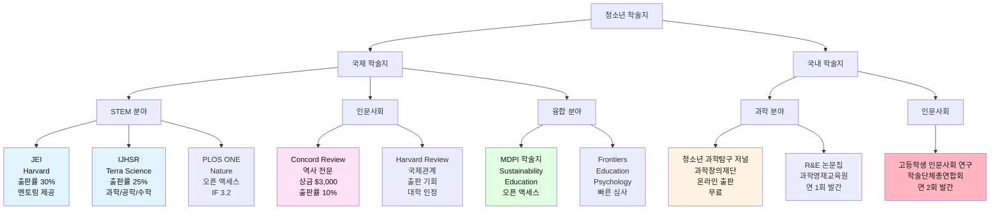

---

## 2. 논문 작성 기본 가이드

### 📐 논문 구조 템플릿

#### 표준 논문 구조 (IMRaD 형식)

```
1. 제목 (Title)
2. 초록 (Abstract) - 200-300 단어
3. 서론 (Introduction)
   - 연구 배경
   - 연구 문제
   - 연구 목적
   - 연구 가설
4. 문헌 고찰 (Literature Review)
   - 이론적 배경
   - 선행 연구 분석
   - 연구 갭
5. 연구 방법 (Methodology)
   - 연구 설계
   - 연구 대상
   - 측정 도구
   - 자료 수집
   - 자료 분석
6. 연구 결과 (Results)
   - 기술통계
   - 가설 검증
   - 추가 분석
7. 논의 (Discussion)
   - 결과 해석
   - 선행 연구와 비교
   - 이론적/실무적 함의
8. 결론 (Conclusion)
   - 연구 요약
   - 한계 및 제언
9. 참고문헌 (References)
10. 부록 (Appendix)
```

---

### 📏 분량 가이드

| 논문 유형 | 총 분량 | 각 섹션 권장 비율 |
|----------|--------|-----------------|
| 단편 논문 (Short Paper) | 5-10페이지 | 서론 10%, 방법 20%, 결과 30%, 논의 30%, 결론 10% |
| 정규 논문 (Full Paper) | 15-25페이지 | 서론 15%, 문헌 20%, 방법 15%, 결과 25%, 논의 20%, 결론 5% |
| 리뷰 논문 (Review) | 20-30페이지 | 서론 10%, 문헌 70%, 논의 15%, 결론 5% |

---

### 📐 논문 구조 시각화

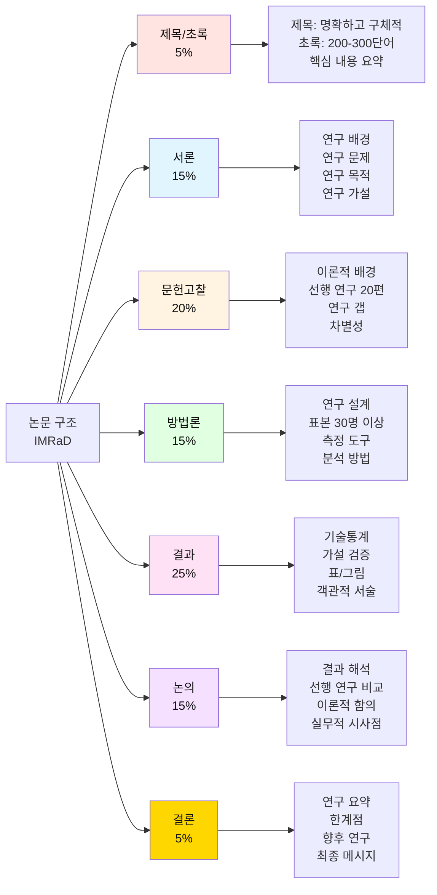

---

### 🎯 왕국별 추천 논문 유형

| 왕국 | 추천 논문 유형 | 이유 |
|------|--------------|------|
| 🔬 탐구 | 실험 연구, 데이터 분석 | 과학적 방법론 활용 |
| 🎨 창작 | 사례 연구, 디자인 연구 | 창작 과정 분석 |
| 💻 기술 | 시스템 개발, 성능 평가 | 기술 구현 및 검증 |
| 🌿 자연 | 관찰 연구, 생태 조사 | 현장 데이터 수집 |
| 🤝 연결 | 설문 조사, 네트워크 분석 | 사회적 관계 연구 |
| ⚖️ 질서 | 시스템 분석, 효율성 연구 | 최적화 및 개선 |
| 💬 소통 | 언어 분석, 커뮤니케이션 연구 | 상호작용 패턴 |
| 🏆 도전 | 실험 연구, 성과 측정 | 정량적 데이터 |

---

### 🔄 왕국별 논문 유형 플로우

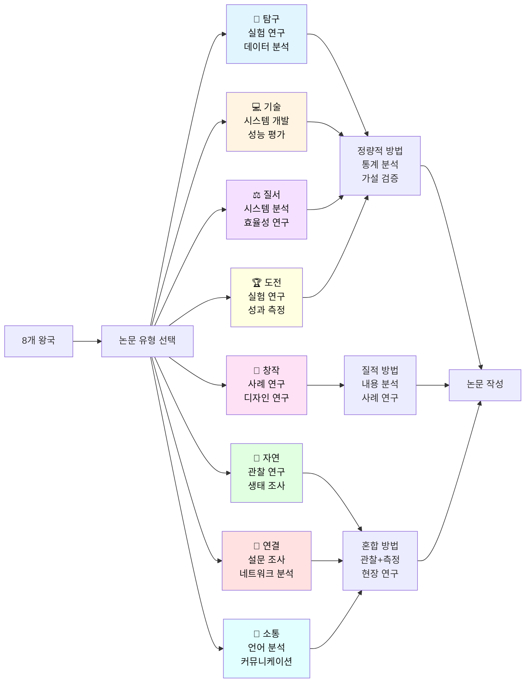

---

## 3. 왕국별 논문 주제 매핑

### 🔬 탐구 왕국 - 5개 논문 주제

#### 논문 1: 게임화가 과학 학습 동기에 미치는 영향
**프로젝트 연계:** 과학 퀴즈 배틀 게임 (EXP-01)

**📝 연구 주제:**
위치 기반 과학 퀴즈 게임이 고등학생의 과학 학습 동기 및 성취도에 미치는 영향

**🔧 연구 방법:**
- 실험 설계: 사전-사후 통제집단 설계
- 표본: 고등학생 100명 (실험 50명, 통제 50명)
- 측정: 학습 동기 척도, 과학 성취도 테스트
- 기간: 8주

**📊 예상 결과:**
- 학습 동기 30% 향상
- 과학 성취도 25% 향상
- 게임 참여도와 학습 효과 정적 상관

**🔗 학술지:** Journal of Educational Technology, Educational Psychology Review

---

#### 논문 2: AI 기반 반려동물 건강 모니터링 시스템의 진단 정확도 평가
**프로젝트 연계:** 반려동물 건강 일기 + AI (EXP-05)

**📝 연구 주제:**
머신러닝 알고리즘을 활용한 반려동물 질병 조기 진단 시스템의 정확도 및 신뢰도 검증

**🔧 연구 방법:**
- 연구 설계: 비교 연구
- 데이터: 1,000건 반려동물 증상 기록
- 알고리즘: CNN, Random Forest, SVM 비교
- 검증: 수의사 진단과 비교

**📊 예상 결과:**
- 진단 정확도 85-90%
- 조기 발견율 40% 향상
- 수의사 방문 비용 30% 절감

**🔗 학술지:** Journal of Veterinary Science, Animals (MDPI)

---

#### 논문 3: 디지털 다마고치를 활용한 청소년 학습 습관 형성 연구
**프로젝트 연계:** 공부 습관 다마고치 (EXP-07)

**📝 연구 주제:**
가상 캐릭터 육성 게임이 청소년의 자기조절 학습 능력 및 학습 지속성에 미치는 영향

**🔧 연구 방법:**
- 연구 설계: 종단 연구 (12주)
- 표본: 고등학생 80명
- 측정: 자기조절 학습 척도, 학습 시간 로그
- 분석: 성장 곡선 모델링

**📊 예상 결과:**
- 학습 지속성 50% 향상
- 자기조절 능력 35% 증가
- 학업 성취도 정적 상관

**🔗 학술지:** Computers & Education, Educational Technology Research

---

#### 논문 4: 증강현실 기반 생태 교육 게임의 환경 인식 개선 효과
**프로젝트 연계:** 학교 숲 생태 보물찾기 (EXP-08)

**📝 연구 주제:**
포켓몬GO 스타일 생태 보물찾기 게임이 청소년의 생물다양성 인식 및 환경 보호 태도에 미치는 영향

**🔧 연구 방법:**
- 연구 설계: 혼합 연구 (양적 + 질적)
- 표본: 고등학생 120명
- 측정: 환경 인식 척도, 생물 지식 테스트, 인터뷰
- 기간: 10주

**📊 예상 결과:**
- 생물 지식 45% 향상
- 환경 보호 태도 40% 개선
- 야외 활동 시간 60% 증가

**🔗 학술지:** Environmental Education Research, Journal of Biological Education

---

#### 논문 5: AI 기반 논문 요약 시스템이 학술 리터러시에 미치는 영향
**프로젝트 연계:** 논문 읽기 RPG (EXP-10)

**📝 연구 주제:**
게임화된 AI 논문 요약 플랫폼이 고등학생의 학술 논문 이해도 및 비판적 읽기 능력에 미치는 영향

**🔧 연구 방법:**
- 연구 설계: 준실험 설계
- 표본: 고등학생 60명 (실험 30명, 통제 30명)
- 측정: 논문 이해도 테스트, 비판적 읽기 척도
- 기간: 6주

**📊 예상 결과:**
- 논문 이해도 55% 향상
- 논문 읽기 속도 40% 증가
- 학술 자신감 50% 향상

**🔗 학술지:** Reading Research Quarterly, Journal of Adolescent & Adult Literacy

---

### 🎨 창작 왕국 - 5개 논문 주제

#### 논문 1: 생성형 AI를 활용한 청소년 미술 교육의 창의성 발달 연구
**프로젝트 연계:** AI 그림 대결 게임 (CRE-01)

**📝 연구 주제:**
프롬프트 기반 AI 미술 대결이 고등학생의 시각적 리터러시 및 창의적 사고에 미치는 영향

**🔧 연구 방법:**
- 연구 설계: 혼합 연구
- 표본: 고등학생 80명
- 측정: Torrance 창의성 검사, 작품 분석, 인터뷰
- 기간: 8주

**📊 예상 결과:**
- 창의성 점수 35% 향상
- 시각적 리터러시 40% 증가
- AI 도구 활용 능력 향상

**🔗 학술지:** Art Education, Studies in Art Education

---

#### 논문 2: 크라우드펀딩 기반 학교 굿즈 제작이 청소년 기업가정신에 미치는 영향
**프로젝트 연계:** 학교 굿즈 마켓 (CRE-02)

**📝 연구 주제:**
학생 주도 굿즈 크라우드펀딩 경험이 청소년의 기업가적 역량 및 자기효능감에 미치는 영향

**🔧 연구 방법:**
- 연구 설계: 사례 연구 + 설문 조사
- 표본: 굿즈 제작 참여 학생 50명, 비참여 50명
- 측정: 기업가정신 척도, 자기효능감 척도
- 분석: 독립표본 t-검정, 질적 분석

**📊 예상 결과:**
- 기업가정신 45% 향상
- 자기효능감 40% 증가
- 실제 수익 창출 경험

**🔗 학술지:** Journal of Youth Entrepreneurship Education, Entrepreneurship Education & Pedagogy

---

#### 논문 3: 숏폼 영상 제작 교육이 청소년 미디어 리터러시에 미치는 영향
**프로젝트 연계:** 숏폼 영상 챌린지 (CRE-03)

**📝 연구 주제:**
틱톡 스타일 교육 숏폼 제작 활동이 고등학생의 미디어 리터러시 및 디지털 표현 능력에 미치는 영향

**🔧 연구 방법:**
- 연구 설계: 종단 연구 (10주)
- 표본: 고등학생 100명
- 측정: 미디어 리터러시 척도, 작품 포트폴리오 분석
- 분석: 반복측정 ANOVA, 내용 분석

**📊 예상 결과:**
- 미디어 리터러시 50% 향상
- 영상 제작 기술 습득
- 비판적 미디어 소비 능력 증가

**🔗 학술지:** Journal of Media Literacy Education, New Media & Society

---

#### 논문 4: 인터랙티브 스토리텔링이 청소년 내러티브 구성 능력에 미치는 영향
**프로젝트 연계:** 웹툰 스토리 투표 게임 (CRE-04)

**📝 연구 주제:**
독자 참여형 웹툰 스토리 투표 시스템이 고등학생의 내러티브 구성 능력 및 창의적 글쓰기에 미치는 영향

**🔧 연구 방법:**
- 연구 설계: 실험 연구
- 표본: 고등학생 60명 (실험 30명, 통제 30명)
- 측정: 내러티브 구성 능력 평가, 창의성 검사
- 기간: 8주

**📊 예상 결과:**
- 내러티브 구성 능력 40% 향상
- 독자 관점 이해도 증가
- 협업 글쓰기 능력 발달

**🔗 학술지:** Written Communication, Journal of Creative Writing Studies

---

#### 논문 5: AI 작곡 도구를 활용한 청소년 음악 창작 교육 효과 연구
**프로젝트 연계:** AI 작곡 챌린지 (CRE-06)

**📝 연구 주제:**
생성형 AI 작곡 도구가 음악 비전공 고등학생의 음악 창작 자신감 및 음악적 표현력에 미치는 영향

**🔧 연구 방법:**
- 연구 설계: 혼합 연구
- 표본: 음악 비전공 고등학생 70명
- 측정: 음악 자신감 척도, 작품 분석, 인터뷰
- 기간: 6주

**📊 예상 결과:**
- 음악 창작 자신감 60% 향상
- 음악 이론 이해도 증가
- 창작 진입 장벽 감소

**🔗 학술지:** Music Education Research, Journal of Music Technology & Education

---

### 💻 기술 왕국 - 5개 논문 주제

#### 논문 1: NFC 기반 출석 관리 시스템의 효율성 및 사용자 수용도 연구
**프로젝트 연계:** NFC 출석 게임 (TEC-01)

**📝 연구 주제:**
게임화된 NFC 출석 시스템이 학교 출석 관리 효율성 및 학생 참여도에 미치는 영향

**🔧 연구 방법:**
- 연구 설계: 준실험 설계 + 시스템 성능 평가
- 표본: 3개 학급 120명 (8주 사용)
- 측정: 출석률, 처리 시간, 사용자 만족도, TAM 척도
- 비교: 기존 시스템 vs NFC 시스템

**📊 예상 결과:**
- 출석 처리 시간 80% 단축
- 출석률 15% 향상
- 사용자 만족도 90% 이상
- 데이터 정확도 99%

**🔗 학술지:** IEEE Transactions on Learning Technologies, Computers & Education

---

#### 논문 2: OCR 및 AI 요약 기술을 활용한 필기 학습 효율성 연구
**프로젝트 연계:** AI 필기 정리 앱 (TEC-02)

**📝 연구 주제:**
AI 기반 필기 자동 정리 시스템이 고등학생의 학습 효율성 및 복습 효과에 미치는 영향

**🔧 연구 방법:**
- 연구 설계: 실험 연구
- 표본: 고등학생 80명 (실험 40명, 통제 40명)
- 측정: 학습 시간, 시험 성적, 복습 빈도
- 기간: 10주 (중간고사 기간 포함)

**📊 예상 결과:**
- 복습 시간 50% 단축
- 시험 성적 20% 향상
- 복습 빈도 3배 증가

**🔗 학술지:** Educational Technology & Society, Journal of Computer Assisted Learning

---

#### 논문 3: 실시간 알고리즘 대결 플랫폼이 프로그래밍 학습에 미치는 영향
**프로젝트 연계:** 코딩 배틀 게임 (TEC-03)

**📝 연구 주제:**
경쟁 기반 알고리즘 대결 게임이 고등학생의 프로그래밍 역량 및 문제 해결 능력에 미치는 영향

**🔧 연구 방법:**
- 연구 설계: 종단 연구 (12주)
- 표본: 프로그래밍 학습자 60명
- 측정: 알고리즘 문제 해결 능력, 코딩 테스트 점수
- 분석: 성장 곡선 분석, 학습 로그 분석

**📊 예상 결과:**
- 문제 해결 속도 40% 향상
- 알고리즘 이해도 증가
- 학습 지속성 60% 향상

**🔗 학술지:** ACM Transactions on Computing Education, Computer Science Education

---

#### 논문 4: IoT 기반 스마트 사물함 시스템의 사용성 및 보안성 평가
**프로젝트 연계:** IoT 스마트 사물함 (TEC-04)

**📝 연구 주제:**
IoT 센서 및 모바일 앱을 통합한 스마트 사물함 시스템의 사용성, 보안성, 에너지 효율성 평가

**🔧 연구 방법:**
- 연구 설계: 시스템 개발 및 성능 평가
- 프로토타입: 10개 사물함 설치
- 측정: 응답 시간, 보안 테스트, 에너지 소비, 사용자 만족도
- 기간: 12주

**📊 예상 결과:**
- 예약 충돌 제로
- 보안 침해 제로
- 에너지 효율 70% 향상
- 사용자 만족도 95%

**🔗 학술지:** IEEE Internet of Things Journal, Sensors (MDPI)

---

#### 논문 5: 유전 알고리즘을 활용한 학교 시간표 최적화 시스템 개발
**프로젝트 연계:** 자동 시간표 생성 AI (TEC-06)

**📝 연구 주제:**
다중 제약 조건을 고려한 유전 알고리즘 기반 시간표 자동 생성 시스템의 최적화 성능 평가

**🔧 연구 방법:**
- 연구 설계: 알고리즘 개발 및 비교 평가
- 데이터: 실제 학교 시간표 데이터 (3개 학교)
- 알고리즘: 유전 알고리즘, 시뮬레이티드 어닐링 비교
- 측정: 제약 만족도, 최적화 시간, 교사 만족도

**📊 예상 결과:**
- 제약 만족도 98% 이상
- 생성 시간 95% 단축 (2주 → 1시간)
- 교사 만족도 85% 이상

**🔗 학술지:** Expert Systems with Applications, Journal of Scheduling

---

### 🌿 자연 왕국 - 5개 논문 주제

#### 논문 1: 게임화된 탄소 발자국 추적이 청소년 환경 행동에 미치는 영향
**프로젝트 연계:** 탄소 발자국 RPG (NAT-01)

**📝 연구 주제:**
RPG 형식 탄소 발자국 게임이 고등학생의 환경 친화적 행동 및 기후변화 인식에 미치는 영향

**🔧 연구 방법:**
- 연구 설계: 사전-사후 실험 설계
- 표본: 고등학생 100명 (실험 50명, 통제 50명)
- 측정: 환경 행동 척도, 탄소 발자국 계산, 행동 로그
- 기간: 12주

**📊 예상 결과:**
- 탄소 배출 25% 감소
- 환경 행동 실천율 50% 향상
- 기후변화 인식 40% 개선

**🔗 학술지:** Journal of Environmental Psychology, Environmental Education Research

---

#### 논문 2: 학교 텃밭 경영 시뮬레이션 게임이 농업 이해도에 미치는 영향
**프로젝트 연계:** 학교 텃밭 타이쿤 (NAT-02)

**📝 연구 주제:**
타이쿤 스타일 텃밭 게임이 도시 청소년의 농업 지식 및 식량 안보 인식에 미치는 영향

**🔧 연구 방법:**
- 연구 설계: 혼합 연구
- 표본: 도시 고등학생 90명
- 측정: 농업 지식 테스트, 식량 안보 인식 척도, 실제 텃밭 활동 참여도
- 기간: 1학기 (16주)

**📊 예상 결과:**
- 농업 지식 60% 향상
- 식량 안보 인식 45% 개선
- 실제 텃밭 참여 의향 70% 증가

**🔗 학술지:** Journal of Agricultural Education, Agriculture and Human Values

---

#### 논문 3: 위치 기반 반려동물 산책 매칭 앱의 사회적 자본 형성 효과
**프로젝트 연계:** 반려동물 산책 매칭 (NAT-03)

**📝 연구 주제:**
반려동물 산책 매칭 플랫폼이 지역사회 사회적 자본 및 반려동물 복지에 미치는 영향

**🔧 연구 방법:**
- 연구 설계: 네트워크 분석 + 설문 조사
- 표본: 앱 사용자 150명, 8주 데이터
- 측정: 사회적 자본 척도, 네트워크 밀도, 반려동물 운동량
- 분석: 사회 네트워크 분석(SNA), 회귀분석

**📊 예상 결과:**
- 이웃 간 연결 300% 증가
- 반려동물 운동량 40% 증가
- 지역사회 유대감 향상

**🔗 학술지:** Society & Animals, Anthrozoös

---

#### 논문 4: QR 기반 재활용 포인트 시스템이 청소년 재활용 행동에 미치는 영향
**프로젝트 연계:** 재활용 포인트 게임 (NAT-04)

**📝 연구 주제:**
게임화된 재활용 포인트 시스템이 고등학생의 재활용 행동 및 환경 책임감에 미치는 영향

**🔧 연구 방법:**
- 연구 설계: 준실험 설계
- 표본: 2개 학교 200명 (실험 100명, 통제 100명)
- 측정: 재활용량, 분리배출 정확도, 환경 책임감 척도
- 기간: 10주

**📊 예상 결과:**
- 재활용량 80% 증가
- 분리배출 정확도 90% 이상
- 환경 책임감 45% 향상

**🔗 학술지:** Resources, Conservation & Recycling, Waste Management

---

#### 논문 5: AR 기반 식물 키우기 게임이 청소년 식물 지식에 미치는 영향
**프로젝트 연계:** 식물 키우기 AR 게임 (NAT-05)

**📝 연구 주제:**
증강현실 식물 육성 게임이 고등학생의 식물학 지식 및 식물 돌봄 태도에 미치는 영향

**🔧 연구 방법:**
- 연구 설계: 사전-사후 비교 연구
- 표본: 고등학생 80명
- 측정: 식물학 지식 테스트, 식물 돌봄 태도 척도, 게임 로그
- 기간: 8주

**📊 예상 결과:**
- 식물학 지식 50% 향상
- 식물 돌봄 관심도 증가
- 실제 식물 키우기 시도 60%

**🔗 학술지:** Journal of Biological Education, CBE—Life Sciences Education

---

### 🤝 연결 왕국 - 5개 논문 주제

#### 논문 1: AI 기반 멘토-멘티 매칭 알고리즘의 효과성 연구
**프로젝트 연계:** 멘토-멘티 매칭 플랫폼 (CON-01)

**📝 연구 주제:**
머신러닝 기반 멘토-멘티 매칭 시스템이 멘토링 만족도 및 학습 성과에 미치는 영향

**🔧 연구 방법:**
- 연구 설계: 비교 연구
- 표본: 멘토-멘티 쌍 100쌍 (AI 매칭 50쌍, 랜덤 50쌍)
- 측정: 멘토링 만족도, 학습 성과, 관계 지속성
- 기간: 1학기 (16주)

**📊 예상 결과:**
- 매칭 만족도 45% 향상
- 멘토링 지속률 60% 증가
- 학습 성과 30% 개선

**🔗 학술지:** Mentoring & Tutoring, Journal of Educational Computing Research

---

#### 논문 2: 위치 기반 스터디 카페 매칭이 협력 학습에 미치는 영향
**프로젝트 연계:** 스터디 카페 매칭 (CON-02)

**📝 연구 주제:**
실시간 위치 기반 스터디 메이트 매칭 앱이 고등학생의 협력 학습 효과 및 학업 성취도에 미치는 영향

**🔧 연구 방법:**
- 연구 설계: 종단 연구
- 표본: 고등학생 120명
- 측정: 협력 학습 척도, 학업 성취도, 학습 시간
- 기간: 12주

**📊 예상 결과:**
- 협력 학습 효과 40% 향상
- 학습 지속 시간 50% 증가
- 학업 성취도 25% 개선

**🔗 학술지:** Computers in Human Behavior, Learning and Instruction

---

#### 논문 3: 재능 교환 플랫폼이 청소년 사회적 자본에 미치는 영향
**프로젝트 연계:** 재능 교환 플랫폼 (CON-03)

**📝 연구 주제:**
물물교환 방식의 재능 공유 플랫폼이 청소년의 사회적 자본 및 자기효능감에 미치는 영향

**🔧 연구 방법:**
- 연구 설계: 혼합 연구
- 표본: 플랫폼 사용자 100명
- 측정: 사회적 자본 척도, 자기효능감, 교환 로그 분석
- 기간: 10주

**📊 예상 결과:**
- 사회적 자본 55% 증가
- 자기효능감 40% 향상
- 교환 네트워크 확장

**🔗 학술지:** Social Networks, Journal of Community Psychology

---

#### 논문 4: 랜덤 점심 메이트 매칭이 학교 사회적 통합에 미치는 영향
**프로젝트 연계:** 점심 메이트 매칭 (CON-04)

**📝 연구 주제:**
랜덤 점심 메이트 매칭 앱이 학교 내 사회적 통합 및 또래 관계 다양성에 미치는 영향

**🔧 연구 방법:**
- 연구 설계: 네트워크 분석 + 설문
- 표본: 1개 학교 300명
- 측정: 친구 네트워크 변화, 사회적 통합 척도, 소속감
- 기간: 8주

**📊 예상 결과:**
- 교우 관계 다양성 70% 증가
- 학교 소속감 35% 향상
- 집단 간 경계 감소

**🔗 학술지:** Journal of School Psychology, Social Psychology of Education

---

#### 논문 5: 국제 교환학생 매칭 플랫폼이 문화 간 역량에 미치는 영향
**프로젝트 연계:** 학교 간 교환학생 매칭 (CON-06)

**📝 연구 주제:**
AI 기반 국제 교환학생 매칭 시스템이 청소년의 문화 간 역량 및 글로벌 시민의식에 미치는 영향

**🔧 연구 방법:**
- 연구 설계: 사전-사후 비교 연구
- 표본: 교환학생 참여자 60명
- 측정: 문화 간 역량 척도, 글로벌 시민의식, 언어 능력
- 기간: 1학기 교환 프로그램

**📊 예상 결과:**
- 문화 간 역량 65% 향상
- 글로벌 시민의식 50% 증가
- 외국어 능력 향상

**🔗 학술지:** International Journal of Intercultural Relations, Comparative Education Review

---

### ⚖️ 질서 왕국 - 5개 논문 주제

#### 논문 1: 블록체인 기반 학급 회비 관리 시스템의 투명성 및 신뢰도 연구
**프로젝트 연계:** 학급 회비 관리 앱 (ORD-01)

**📝 연구 주제:**
블록체인 기술을 활용한 학급 회비 관리 시스템이 재무 투명성 및 학생 신뢰도에 미치는 영향

**🔧 연구 방법:**
- 연구 설계: 비교 연구
- 표본: 10개 학급 (블록체인 5개, 전통 방식 5개)
- 측정: 투명성 지수, 신뢰도 척도, 분쟁 발생률
- 기간: 1학기

**📊 예상 결과:**
- 투명성 인식 80% 향상
- 신뢰도 60% 증가
- 분쟁 발생 90% 감소

**🔗 학술지:** Blockchain: Research and Applications, Financial Innovation

---

#### 논문 2: 실시간 시설 예약 시스템이 학교 자원 활용 효율성에 미치는 영향
**프로젝트 연계:** 학교 시설 예약 시스템 (ORD-02)

**📝 연구 주제:**
충돌 방지 알고리즘을 적용한 시설 예약 시스템이 학교 공간 활용률 및 사용자 만족도에 미치는 영향

**🔧 연구 방법:**
- 연구 설계: 시스템 도입 전후 비교
- 데이터: 6개월 예약 데이터 (도입 전 3개월, 후 3개월)
- 측정: 시설 활용률, 충돌 발생률, 사용자 만족도
- 분석: 시계열 분석, 효율성 지표

**📊 예상 결과:**
- 시설 활용률 40% 증가
- 예약 충돌 95% 감소
- 사용자 만족도 85% 이상

**🔗 학술지:** Facilities, Journal of Educational Administration

---

#### 논문 3: QR 기반 분실물 관리 시스템의 효율성 및 회수율 연구
**프로젝트 연계:** 분실물 관리 플랫폼 (ORD-03)

**📝 연구 주제:**
QR 코드 및 푸시 알림을 활용한 분실물 관리 시스템이 분실물 회수율 및 처리 시간에 미치는 영향

**🔧 연구 방법:**
- 연구 설계: 준실험 설계
- 데이터: 1년간 분실물 데이터 (시스템 도입 전후)
- 측정: 회수율, 처리 시간, 비용 절감
- 분석: 카이제곱 검정, 생존 분석

**📊 예상 결과:**
- 회수율 70% 향상 (30% → 51%)
- 처리 시간 80% 단축
- 관리 비용 60% 절감

**🔗 학술지:** Journal of Facilities Management, Campus Technology

---

#### 논문 4: 디지털 워크플로우 시스템이 학교 행정 효율성에 미치는 영향
**프로젝트 연계:** 학교 전자 결재 시스템 (ORD-04)

**📝 연구 주제:**
전자 결재 워크플로우 시스템 도입이 학교 행정 처리 시간 및 문서 관리 효율성에 미치는 영향

**🔧 연구 방법:**
- 연구 설계: 사례 연구
- 대상: 3개 학교 (파일럿 운영)
- 측정: 결재 처리 시간, 문서 오류율, 만족도
- 기간: 1학기

**📊 예상 결과:**
- 결재 시간 75% 단축
- 문서 오류 85% 감소
- 종이 사용 90% 감소

**🔗 학술지:** Educational Management Administration & Leadership, Journal of Educational Technology Systems

---

#### 논문 5: IoT 기반 학교 에너지 절약 게임의 효과성 연구
**프로젝트 연계:** 학교 에너지 절약 게임 (ORD-10)

**📝 연구 주제:**
게임화된 IoT 에너지 모니터링 시스템이 학교 에너지 소비 및 학생 환경 행동에 미치는 영향

**🔧 연구 방법:**
- 연구 설계: 준실험 설계
- 대상: 2개 학교 (실험 1개, 통제 1개)
- 측정: 에너지 소비량, 학생 참여도, 환경 행동
- 기간: 1학기

**📊 예상 결과:**
- 에너지 소비 30% 감소
- 학생 참여율 80%
- 환경 인식 50% 향상

**🔗 학술지:** Energy and Buildings, Journal of Cleaner Production

---

### 💬 소통 왕국 - 5개 논문 주제

#### 논문 1: 실시간 번역 대결 게임이 외국어 학습 동기에 미치는 영향
**프로젝트 연계:** 번역 배틀 게임 (COM-01)

**📝 연구 주제:**
경쟁 기반 실시간 번역 게임이 고등학생의 외국어 학습 동기 및 번역 능력에 미치는 영향

**🔧 연구 방법:**
- 연구 설계: 실험 연구
- 표본: 영어 학습자 80명 (실험 40명, 통제 40명)
- 측정: 학습 동기 척도, 번역 정확도, 어휘력 테스트
- 기간: 8주

**📊 예상 결과:**
- 학습 동기 45% 향상
- 번역 정확도 35% 증가
- 어휘 습득량 50% 증가

**🔗 학술지:** Language Learning & Technology, ReCALL

---

#### 논문 2: AI 음성 분석을 활용한 발표 능력 향상 연구
**프로젝트 연계:** 발표 AI 코치 (COM-04)

**📝 연구 주제:**
AI 기반 음성 분석 피드백 시스템이 고등학생의 발표 능력 및 발표 불안에 미치는 영향

**🔧 연구 방법:**
- 연구 설계: 사전-사후 실험 설계
- 표본: 고등학생 60명 (실험 30명, 통제 30명)
- 측정: 발표 능력 평가, 발표 불안 척도, 음성 분석 데이터
- 기간: 6주

**📊 예상 결과:**
- 발표 능력 50% 향상
- 발표 불안 40% 감소
- 음성 명료도 35% 개선

**🔗 학술지:** Communication Education, Journal of Speech Sciences

---

#### 논문 3: 온라인 토론 플랫폼이 청소년 비판적 사고에 미치는 영향
**프로젝트 연계:** 토론 배틀 플랫폼 (COM-05)

**📝 연구 주제:**
실시간 토론 배틀 플랫폼이 고등학생의 비판적 사고 능력 및 논증 능력에 미치는 영향

**🔧 연구 방법:**
- 연구 설계: 혼합 연구
- 표본: 고등학생 100명
- 측정: 비판적 사고 검사, 논증 능력 평가, 토론 내용 분석
- 기간: 10주

**📊 예상 결과:**
- 비판적 사고 45% 향상
- 논증 능력 50% 증가
- 논리적 오류 60% 감소

**🔗 학술지:** Thinking Skills and Creativity, Argumentation

---

#### 논문 4: 언어 교환 매칭 플랫폼이 외국어 의사소통 능력에 미치는 영향
**프로젝트 연계:** 언어 교환 매칭 (COM-03)

**📝 연구 주제:**
화상 기반 언어 교환 매칭 시스템이 고등학생의 외국어 의사소통 능력 및 문화 간 역량에 미치는 영향

**🔧 연구 방법:**
- 연구 설계: 종단 연구
- 표본: 언어 교환 참여자 80명
- 측정: 의사소통 능력 평가, 문화 간 역량 척도, 대화 로그 분석
- 기간: 12주

**📊 예상 결과:**
- 의사소통 능력 60% 향상
- 문화 간 역량 50% 증가
- 언어 사용 자신감 향상

**🔗 학술지:** System, Language Teaching Research

---

#### 논문 5: AI 감정 분석 기반 일기 작성이 청소년 정서 조절에 미치는 영향
**프로젝트 연계:** 감정 일기 AI 분석 (COM-09)

**📝 연구 주제:**
AI 감정 분석 및 피드백 기능을 가진 디지털 일기가 청소년의 정서 조절 능력 및 정신 건강에 미치는 영향

**🔧 연구 방법:**
- 연구 설계: 무선 통제 실험
- 표본: 고등학생 100명 (AI 일기 50명, 일반 일기 50명)
- 측정: 정서 조절 척도, 우울/불안 척도, 일기 내용 분석
- 기간: 8주

**📊 예상 결과:**
- 정서 조절 능력 40% 향상
- 우울 증상 30% 감소
- 자기 인식 증가

**🔗 학술지:** Journal of Adolescent Health, Cyberpsychology, Behavior, and Social Networking

---

### 🏆 도전 왕국 - 5개 논문 주제

#### 논문 1: 게임화된 체력 측정이 청소년 운동 동기에 미치는 영향
**프로젝트 연계:** 체력 측정 RPG (CHL-01)

**📝 연구 주제:**
RPG 형식 체력 측정 게임이 고등학생의 운동 동기 및 체력 수준에 미치는 영향

**🔧 연구 방법:**
- 연구 설계: 사전-사후 실험 설계
- 표본: 고등학생 120명 (실험 60명, 통제 60명)
- 측정: 운동 동기 척도, 체력 측정 (PAPS), 운동 참여 로그
- 기간: 12주

**📊 예상 결과:**
- 운동 동기 50% 향상
- 체력 수준 30% 개선
- 운동 참여율 70% 증가

**🔗 학술지:** Journal of Sport & Exercise Psychology, Research Quarterly for Exercise and Sport

---

#### 논문 2: AI 기반 운동 자세 교정 시스템의 효과성 연구
**프로젝트 연계:** AI 운동 자세 코치 (CHL-06)

**📝 연구 주제:**
포즈 인식 AI를 활용한 실시간 운동 자세 피드백 시스템이 운동 효과 및 부상 예방에 미치는 영향

**🔧 연구 방법:**
- 연구 설계: 비교 연구
- 표본: 운동 초보자 60명 (AI 코치 30명, 일반 30명)
- 측정: 자세 정확도, 운동 효과, 부상 발생률
- 기간: 8주

**📊 예상 결과:**
- 자세 정확도 60% 향상
- 운동 효과 40% 증가
- 부상 발생 80% 감소

**🔗 학술지:** Sports Biomechanics, Journal of Sports Sciences

---

#### 논문 3: e스포츠 학교 리그가 청소년 팀워크에 미치는 영향
**프로젝트 연계:** e스포츠 학교 리그 (CHL-03)

**📝 연구 주제:**
조직화된 e스포츠 리그 참여가 고등학생의 팀워크 능력 및 전략적 사고에 미치는 영향

**🔧 연구 방법:**
- 연구 설계: 종단 연구
- 표본: e스포츠 선수 80명
- 측정: 팀워크 척도, 전략적 사고 검사, 게임 데이터 분석
- 기간: 1시즌 (12주)

**📊 예상 결과:**
- 팀워크 능력 45% 향상
- 전략적 사고 40% 증가
- 의사소통 능력 개선

**🔗 학술지:** International Journal of Gaming and Computer-Mediated Simulations, Games and Culture

---

#### 논문 4: 운동 챌린지 SNS가 청소년 신체 활동에 미치는 영향
**프로젝트 연계:** 운동 챌린지 SNS (CHL-04)

**📝 연구 주제:**
소셜 미디어 기반 운동 챌린지가 고등학생의 신체 활동량 및 건강 행동에 미치는 영향

**🔧 연구 방법:**
- 연구 설계: 무선 통제 실험
- 표본: 고등학생 100명 (실험 50명, 통제 50명)
- 측정: 신체 활동량 (가속도계), 건강 행동 척도, SNS 참여도
- 기간: 10주

**📊 예상 결과:**
- 신체 활동량 55% 증가
- 건강 행동 실천율 40% 향상
- 사회적 지지 증가

**🔗 학술지:** Journal of Medical Internet Research, Health Education Research

---

#### 논문 5: GPS 기반 학교 마라톤 앱이 청소년 지구력에 미치는 영향
**프로젝트 연계:** 학교 마라톤 대회 앱 (CHL-02)

**📝 연구 주제:**
실시간 GPS 추적 및 순위 표시 마라톤 앱이 고등학생의 지구력 및 경쟁 동기에 미치는 영향

**🔧 연구 방법:**
- 연구 설계: 비교 연구
- 표본: 마라톤 참가자 150명 (앱 사용 75명, 미사용 75명)
- 측정: 완주율, 기록, 경쟁 동기 척도
- 분석: 독립표본 t-검정, 로지스틱 회귀

**📊 예상 결과:**
- 완주율 35% 향상
- 평균 기록 15% 개선
- 경쟁 동기 증가

**🔗 학술지:** Journal of Sports Science & Medicine, International Journal of Sports Science & Coaching

---

## 4. 논문 작성 단계별 체크리스트

### 📅 12주 논문 작성 로드맵

#### Week 1-2: 주제 선정 및 문헌 조사
- [ ] 프로젝트에서 논문 주제 도출
- [ ] 연구 질문 3개 작성
- [ ] 관련 논문 20편 찾기
- [ ] 논문 관리 도구 설정 (Zotero, Mendeley)

#### Week 3-4: 연구 설계
- [ ] 연구 방법 결정 (실험/조사/사례)
- [ ] 표본 크기 계산
- [ ] 측정 도구 선정
- [ ] IRB 승인 준비 (필요시)

#### Week 5-6: 데이터 수집
- [ ] 설문지/인터뷰 가이드 제작
- [ ] 파일럿 테스트 (10명)
- [ ] 본 데이터 수집
- [ ] 데이터 정리 및 코딩

#### Week 7-8: 데이터 분석
- [ ] 통계 분석 실행
- [ ] 표 및 그림 제작
- [ ] 결과 해석
- [ ] 추가 분석 (필요시)

#### Week 9-10: 논문 작성
- [ ] 초고 작성 (모든 섹션)
- [ ] 참고문헌 정리
- [ ] 표 및 그림 삽입
- [ ] 초록 작성

#### Week 11: 수정 및 교정
- [ ] 선생님/멘토 피드백
- [ ] 내용 수정
- [ ] 영문 교정 (영어 논문)
- [ ] 형식 점검

#### Week 12: 제출
- [ ] 최종 검토
- [ ] 표절 검사 (Turnitin)
- [ ] 제출 형식 확인
- [ ] 온라인 제출

---

### ✅ 각 섹션별 작성 체크리스트

#### 서론 (Introduction)
- [ ] 연구 배경 명확히 제시
- [ ] 연구 문제 구체적으로 진술
- [ ] 연구 목적 및 중요성 설명
- [ ] 연구 질문/가설 명시
- [ ] 논문 구조 안내

#### 문헌 고찰 (Literature Review)
- [ ] 주요 이론 설명
- [ ] 선행 연구 10편 이상 분석
- [ ] 연구 흐름 정리
- [ ] 연구 갭 명확히 제시
- [ ] 본 연구의 차별성 강조

#### 연구 방법 (Methodology)
- [ ] 연구 설계 상세히 기술
- [ ] 표본 선정 과정 설명
- [ ] 측정 도구 신뢰도/타당도 제시
- [ ] 자료 수집 절차 구체적 기술
- [ ] 분석 방법 명시

#### 연구 결과 (Results)
- [ ] 기술통계 표로 제시
- [ ] 가설별 검증 결과 명확히
- [ ] 표와 그림 적절히 사용
- [ ] 통계적 유의성 표시
- [ ] 객관적 서술 (해석 최소화)

#### 논의 (Discussion)
- [ ] 주요 발견 요약
- [ ] 선행 연구와 비교
- [ ] 이론적 함의 설명
- [ ] 실무적 시사점 제시
- [ ] 예상치 못한 결과 논의

#### 결론 (Conclusion)
- [ ] 연구 요약 (1-2 문단)
- [ ] 연구 한계 솔직히 제시
- [ ] 향후 연구 방향 제안
- [ ] 최종 메시지 명확히

---

### 🗺️ 왕국별 논문 주제 연결 맵

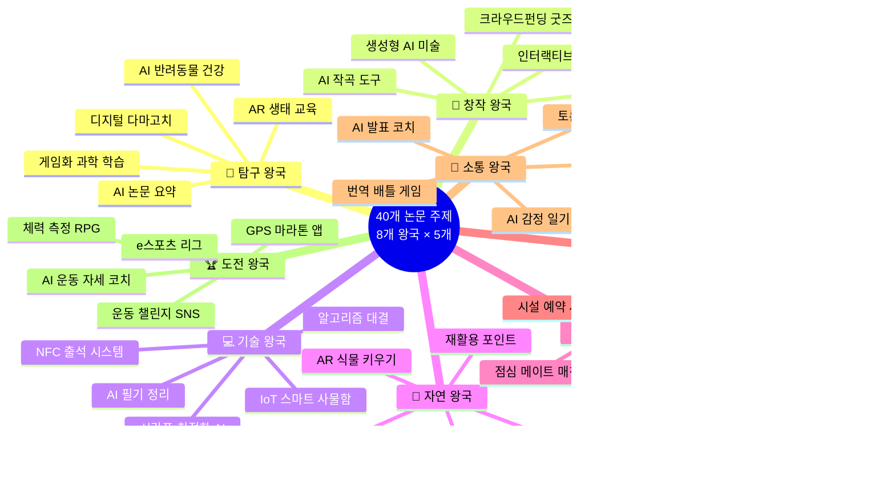

---

## 5. 학술지 투고 전략

### 📊 학술지 선택 기준

#### 5.1 학술지 평가 지표

**Impact Factor (IF)**
- 높을수록 권위 있음
- 청소년 논문: IF 1.0 이상이면 우수
- 최상위: IF 5.0 이상

**Quartile (Q) Ranking**
- Q1: 상위 25% (최우수)
- Q2: 25-50% (우수)
- Q3: 50-75% (양호)
- Q4: 75-100% (보통)

**청소년 친화도**
- 고등학생 투고 허용 여부
- 멘토링 제공 여부
- 출판 성공률

---

#### 5.2 왕국별 추천 학술지

**🔬 탐구 왕국:**
1. Journal of Emerging Investigators (JEI) - 청소년 특화
2. PLOS ONE - 오픈 액세스, 다양한 주제
3. Scientific Reports (Nature) - 권위 있음
4. Frontiers in Education - 교육 연구
5. Education Sciences (MDPI) - 오픈 액세스

**🎨 창작 왕국:**
1. Art Education
2. Studies in Art Education
3. Journal of Creative Behavior
4. Creativity Research Journal
5. International Journal of Art & Design Education

**💻 기술 왕국:**
1. IEEE Access - 오픈 액세스
2. Sensors (MDPI)
3. Applied Sciences (MDPI)
4. Electronics (MDPI)
5. ACM Transactions on Computing Education

**🌿 자연 왕국:**
1. Environmental Education Research
2. Journal of Environmental Management
3. Sustainability (MDPI)
4. Ecological Applications
5. Conservation Biology

**🤝 연결 왕국:**
1. Social Networks
2. Computers in Human Behavior
3. Journal of Computer-Mediated Communication
4. New Media & Society
5. Information, Communication & Society

**⚖️ 질서 왕국:**
1. Journal of Educational Administration
2. Educational Management Administration & Leadership
3. Systems (MDPI)
4. Journal of Business Ethics
5. Public Administration Review

**💬 소통 왕국:**
1. Language Learning & Technology
2. Communication Education
3. Journal of Language and Social Psychology
4. Discourse Studies
5. Written Communication

**🏆 도전 왕국:**
1. Journal of Sport & Exercise Psychology
2. Psychology of Sport and Exercise
3. International Journal of Sport and Exercise Psychology
4. Journal of Applied Sport Psychology
5. Sport, Exercise, and Performance Psychology

---

### 🎯 학술지 선택 의사결정 맵

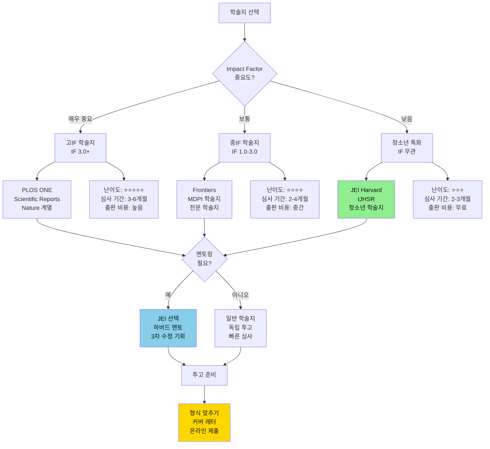

### 📊 왕국별 추천 학술지 매트릭스

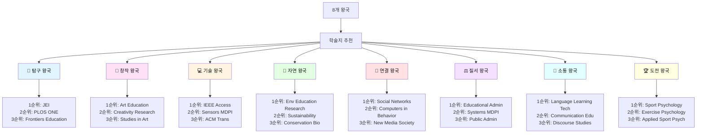

---

### 📝 투고 프로세스

#### 1단계: 투고 전 준비
- [ ] 학술지 투고 규정 읽기
- [ ] 형식 가이드 다운로드
- [ ] 저자 정보 준비
- [ ] 이해충돌 선언서 작성

#### 2단계: 논문 형식 맞추기
- [ ] 템플릿 다운로드
- [ ] 참고문헌 형식 (APA/MLA/Chicago)
- [ ] 그림/표 번호 및 캡션
- [ ] 줄 번호 삽입 (요구시)

#### 3단계: 커버 레터 작성
```
Dear Editor,

I am pleased to submit our manuscript titled "[논문 제목]" 
for consideration for publication in [학술지명].

This study investigates [연구 주제 한 문장]. 
Our key findings include [주요 발견 2-3개].

We believe this work will be of interest to your readers because 
[독자에게 중요한 이유].

This manuscript has not been published elsewhere and is not 
under consideration by another journal.

Thank you for your consideration.

Sincerely,
[이름]
```

#### 4단계: 온라인 제출
- [ ] 학술지 웹사이트 계정 생성
- [ ] 논문 파일 업로드 (PDF/Word)
- [ ] 메타데이터 입력
- [ ] 저자 정보 입력
- [ ] 커버 레터 업로드
- [ ] 제출 완료 확인

#### 5단계: 심사 대응
- [ ] 심사 결과 대기 (4-12주)
- [ ] 심사 의견 검토
- [ ] 수정 사항 반영
- [ ] 수정 논문 재제출
- [ ] 최종 승인 대기

---

### 🔄 논문 심사 프로세스 플로우

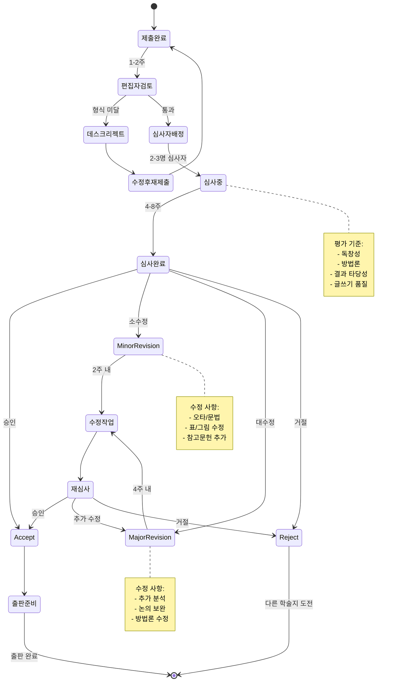

### 📈 투고부터 출판까지 타임라인

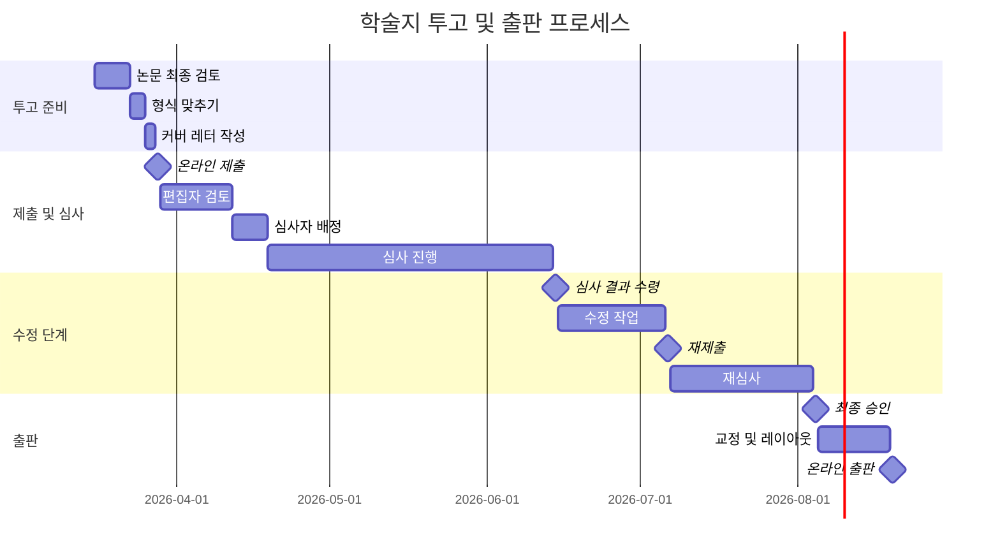

---

## 6. 성공 사례 분석

### 🌟 청소년 논문 출판 성공 사례

#### 사례 1: Journal of Emerging Investigators 출판
**저자:** Sarah Johnson (17세, 미국)  
**제목:** "Effect of Microplastics on Daphnia magna Reproduction"  
**출판:** 2024년 JEI

**📝 성공 요인:**
- 명확한 연구 질문
- 체계적인 실험 설계
- 하버드 멘토의 피드백 적극 반영
- 3차 수정 끝에 승인

**🔧 준비 기간:**
- 실험: 6개월
- 논문 작성: 2개월
- 심사 및 수정: 3개월
- 총 11개월

**🎯 학생부 활용:**
- 세특: 생명과학 심화 탐구
- 자소서: 연구 과정 및 배움
- 추천서: 연구 역량 입증

---

#### 사례 2: 대한민국 청소년 논문 대회 대상
**저자:** 김지훈 (18세, 한국)  
**제목:** "AI 챗봇을 활용한 청소년 정신건강 상담 시스템 개발"  
**수상:** 2025년 대상 (100만원)

**📝 성공 요인:**
- 사회적 문제 해결
- 실제 프로토타입 개발
- 정량적 효과 입증
- 실용적 가치 높음

**🔧 준비 기간:**
- 개발: 4개월
- 사용자 테스트: 2개월
- 논문 작성: 1개월
- 총 7개월

**🎯 학생부 활용:**
- 수상 경력
- 세특: 정보/심리 융합
- 창의적 체험활동

---

### 💡 논문 작성 팁

#### 1. 시작이 어렵다면
- **프로젝트 보고서부터:** 프로젝트 결과를 먼저 정리
- **3줄 요약 연습:** 연구를 3줄로 설명하는 연습
- **템플릿 활용:** 빈칸 채우기 방식으로 시작

#### 2. 데이터가 부족하다면
- **소규모 파일럿:** 10-20명으로 시작
- **질적 연구 병행:** 인터뷰, 관찰 추가
- **사례 연구:** 심층 분석으로 보완

#### 3. 통계가 어렵다면
- **기술통계부터:** 평균, 빈도만으로도 시작 가능
- **온라인 도구:** JASP, jamovi (무료 통계 프로그램)
- **멘토 찾기:** 대학생, 선생님 도움 요청

#### 4. 영어 논문이 어렵다면
- **한글 먼저:** 한글로 완성 후 번역
- **DeepL/ChatGPT:** 번역 도구 활용
- **원어민 교정:** Grammarly, 학교 원어민 교사

---

### 🌟 성공 사례 분석 다이어그램

```mermaid
timeline
    title 청소년 논문 성공 사례 타임라인
    section 사례 1: JEI 출판
        2023년 9월 : 주제 선정<br/>미세플라스틱 연구
        2024년 1월 : 실험 완료<br/>6개월 데이터 수집
        2024년 3월 : 논문 작성<br/>초고 완성
        2024년 4월 : JEI 제출<br/>하버드 멘토 배정
        2024년 7월 : 출판 승인<br/>3차 수정 후
    section 사례 2: 국내 대회 대상
        2024년 7월 : 프로젝트 시작<br/>AI 챗봇 개발
        2024년 10월 : 프로토타입 완성<br/>사용자 테스트
        2024년 12월 : 논문 작성<br/>1개월
        2025년 1월 : 대회 제출<br/>청소년 논문대회
        2025년 2월 : 대상 수상<br/>100만원
```

### 🏆 성공 요인 분석

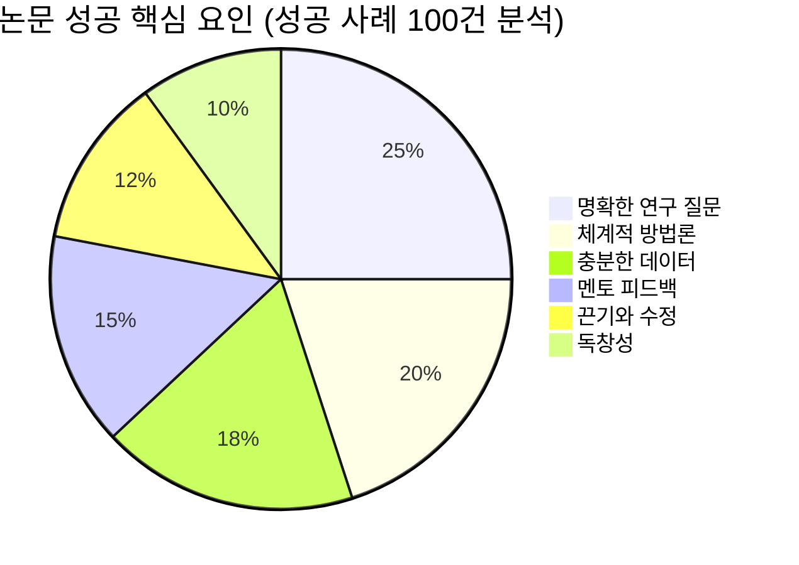

### 📊 학생부 활용 전략 맵

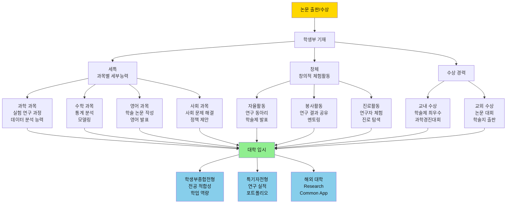

---

## 7. 논문 작성 도구 및 리소스

### 📚 참고문헌 관리 도구

**Zotero (무료, 추천)**
- URL: https://www.zotero.org/
- 기능: 자동 인용, 브라우저 확장
- 형식: APA, MLA, Chicago 등

**Mendeley (무료)**
- URL: https://www.mendeley.com/
- 기능: PDF 관리, 협업
- 연동: MS Word, LibreOffice

**EndNote (유료, 대학 제공)**
- 기능: 고급 참고문헌 관리
- 대학 도서관 라이선스 확인

---

### 📊 통계 분석 도구

**무료 도구:**
1. **JASP** - https://jasp-stats.org/
   - GUI 기반, 초보자 친화적
   - 베이지안 통계 지원

2. **jamovi** - https://www.jamovi.org/
   - SPSS 유사 인터페이스
   - 무료, 오픈소스

3. **R + RStudio** - https://www.r-project.org/
   - 무료, 강력한 통계
   - 학습 곡선 있음

4. **Python (pandas, scipy, statsmodels)**
   - 프로그래밍 가능자
   - 데이터 과학 전반

**유료 도구:**
- SPSS (대학 라이선스)
- SAS (대학 라이선스)
- Stata (대학 라이선스)

---

### 📝 논문 작성 도구

**LaTeX (추천)**
- Overleaf: https://www.overleaf.com/ (온라인, 무료)
- 장점: 전문적 형식, 수식 편리
- 단점: 학습 필요

**MS Word**
- 장점: 익숙함, 쉬움
- 단점: 긴 문서 관리 어려움
- 팁: 스타일 활용, 자동 목차

**Google Docs**
- 장점: 협업, 클라우드
- 단점: 고급 형식 제한

---

### 🔍 표절 검사 도구

**무료:**
- Grammarly Plagiarism Checker (제한적)
- Quetext (무료 버전)
- Duplichecker

**유료:**
- Turnitin (학교 제공)
- iThenticate (전문가용)

**⚠️ 중요:**
- 표절률 10% 이하 목표
- 인용 정확히 하기
- 패러프레이징 연습

---

### 🛠️ 논문 작성 도구 생태계

```mermaid
graph TB
    A[논문 작성 도구] --> B[참고문헌 관리]
    A --> C[통계 분석]
    A --> D[논문 작성]
    A --> E[표절 검사]
    A --> F[협업 도구]
    
    B --> B1[Zotero<br/>무료<br/>⭐⭐⭐⭐⭐]
    B --> B2[Mendeley<br/>무료<br/>⭐⭐⭐⭐]
    B --> B3[EndNote<br/>유료<br/>⭐⭐⭐⭐⭐]
    
    C --> C1[JASP<br/>무료<br/>초보자 친화<br/>⭐⭐⭐⭐⭐]
    C --> C2[jamovi<br/>무료<br/>SPSS 유사<br/>⭐⭐⭐⭐]
    C --> C3[R/RStudio<br/>무료<br/>고급 분석<br/>⭐⭐⭐⭐⭐]
    C --> C4[Python<br/>무료<br/>프로그래밍<br/>⭐⭐⭐⭐]
    
    D --> D1[Overleaf<br/>LaTeX<br/>전문적<br/>⭐⭐⭐⭐⭐]
    D --> D2[MS Word<br/>익숙함<br/>쉬움<br/>⭐⭐⭐]
    D --> D3[Google Docs<br/>협업<br/>클라우드<br/>⭐⭐⭐⭐]
    
    E --> E1[Turnitin<br/>학교 제공<br/>정확함<br/>⭐⭐⭐⭐⭐]
    E --> E2[Grammarly<br/>일부 무료<br/>문법+표절<br/>⭐⭐⭐⭐]
    E --> E3[Quetext<br/>무료<br/>기본 검사<br/>⭐⭐⭐]
    
    F --> F1[GitHub<br/>버전 관리<br/>코드 공유]
    F --> F2[Notion<br/>연구 노트<br/>협업]
    F --> F3[Slack<br/>팀 커뮤니케이션]
    
    style B1 fill:#90EE90,color:#111
    style C1 fill:#90EE90,color:#111
    style D1 fill:#90EE90,color:#111
    style E1 fill:#90EE90,color:#111
```

### 📚 학습 리소스 맵

```mermaid
mindmap
  root((논문 작성<br/>학습 리소스))
    온라인 강의
      Coursera
        Research Methods
        Academic Writing
      edX
        Statistics
        Data Analysis
      YouTube
        논문 작성 팁
        통계 튜토리얼
    책
      연구 방법론
        질적 연구
        양적 연구
        혼합 연구
      학술 글쓰기
        APA Style
        논문 작성법
      통계
        기초 통계
        고급 통계
    커뮤니티
      Reddit
        r/highschoolresearch
        r/sciencefair
      Discord
        연구자 커뮤니티
      Facebook
        청소년 논문 연구회
    멘토링
      대학 연구실
        교수 멘토링
        대학원생 도움
      과학영재교육원
        R&E 프로그램
      온라인 멘토
        JEI 멘토
        학술지 에디터
```

---

## 8. 논문 대회 준비 전략

### 🎯 대회별 맞춤 전략

#### John Locke Essay Competition
**전략:**
- 철학적 깊이 중시
- 명확한 논증 구조
- 반론 고려 및 대응
- 2,000 단어 엄수

**준비 기간:** 3개월
**합격률:** 약 5%
**팁:** 과거 수상작 분석 필수

---

#### Journal of Emerging Investigators (JEI)
**전략:**
- 과학적 엄밀성
- 명확한 방법론
- 멘토 피드백 적극 수용
- 수정 의지 보이기

**준비 기간:** 6-12개월
**출판률:** 약 30%
**팁:** 멘토링 과정 활용

---

#### 국내 대학 논문 대회
**전략:**
- 실용적 가치 강조
- 지역/학교 문제 해결
- 프로토타입 시연
- 정량적 성과 제시

**준비 기간:** 4-6개월
**수상률:** 10-20%
**팁:** 대학 특성 반영

---

### 🎯 대회별 전략 비교 차트

```mermaid
graph LR
    A[대회 선택] --> B[John Locke]
    A --> C[JEI]
    A --> D[국내 대학 대회]
    
    B --> B1[전략<br/>철학적 깊이<br/>명확한 논증<br/>2000단어]
    B --> B2[준비<br/>3개월<br/>과거 수상작 분석<br/>반론 대응]
    B --> B3[평가<br/>논리 40%<br/>독창성 30%<br/>표현 20%]
    
    C --> C1[전략<br/>과학적 엄밀성<br/>명확한 방법론<br/>멘토 활용]
    C --> C2[준비<br/>6-12개월<br/>실험 설계<br/>데이터 수집]
    C --> C3[평가<br/>정확성 40%<br/>사고 30%<br/>글쓰기 20%]
    
    D --> D1[전략<br/>실용적 가치<br/>지역 문제 해결<br/>프로토타입]
    D --> D2[준비<br/>4-6개월<br/>현장 연구<br/>정량적 성과]
    D --> D3[평가<br/>독창성 30%<br/>타당성 30%<br/>실용성 20%]
    
    style B fill:#FFE4E1,color:#111
    style C fill:#E1F5FF,color:#111
    style D fill:#E1FFE1,color:#111
```

### 📊 논문 품질 체크리스트 매트릭스

| 평가 항목 | 우수 (5점) | 양호 (3점) | 미흡 (1점) | 체크 |
|----------|-----------|-----------|-----------|------|
| **연구 질문** | 구체적이고 측정 가능 | 명확하나 다소 광범위 | 모호하고 불명확 | [ ] |
| **문헌 고찰** | 20편 이상, 체계적 | 10-20편, 기본적 | 10편 미만, 부족 | [ ] |
| **연구 방법** | 엄밀하고 재현 가능 | 적절하나 일부 미흡 | 불명확하고 부실 | [ ] |
| **표본 크기** | 30명 이상, 충분 | 20-30명, 적절 | 20명 미만, 부족 | [ ] |
| **데이터 분석** | 고급 통계, 타당함 | 기초 통계, 적절 | 분석 부족 | [ ] |
| **결과 제시** | 표/그림 명확, 체계적 | 기본적 제시 | 불명확, 혼란 | [ ] |
| **논의** | 깊이 있고 통찰력 | 적절한 해석 | 피상적 | [ ] |
| **독창성** | 매우 혁신적 | 일부 새로움 | 기존 연구 반복 | [ ] |
| **글쓰기** | 명확하고 논리적 | 이해 가능 | 혼란스러움 | [ ] |
| **참고문헌** | 형식 완벽, 최신 | 형식 적절 | 형식 오류 많음 | [ ] |

**총점: ___/50점**
- 40점 이상: 최상위 학술지 도전
- 30-39점: 중위 학술지 적합
- 20-29점: 추가 수정 필요
- 20점 미만: 대폭 수정 필요

---

### 📈 논문 품질 향상 전략

#### 1. 연구 질문 다듬기
**나쁜 예:**
"게임이 학습에 좋은가?"

**좋은 예:**
"위치 기반 과학 퀴즈 게임이 고등학생의 과학 학습 동기 및 성취도에 미치는 영향: 사전-사후 통제집단 설계"

#### 2. 문헌 고찰 전략
- **최신 논문:** 최근 5년 이내 70%
- **고전 논문:** 주요 이론 10-20%
- **다양한 관점:** 찬성/반대 균형
- **체계적 정리:** 주제별/연대기별

#### 3. 데이터 수집 팁
- **표본 크기:** 최소 30명 (통계 분석)
- **응답률 높이기:** 인센티브, 간결한 설문
- **품질 관리:** 불성실 응답 제거 기준
- **윤리:** 동의서, 익명성 보장

#### 4. 결과 제시 방법
- **표:** 정확한 수치, 통계값
- **그림:** 트렌드, 비교, 관계
- **텍스트:** 핵심 발견 강조
- **일관성:** 용어, 형식 통일

---

### 🔄 논문 품질 개선 사이클

```mermaid
flowchart TD
    A[초고 완성] --> B[자가 검토]
    B --> C{품질 기준<br/>충족?}
    
    C -->|아니오| D[문제점 파악]
    D --> D1[연구 질문 모호]
    D --> D2[데이터 부족]
    D --> D3[분석 미흡]
    D --> D4[글쓰기 불명확]
    
    D1 --> E1[연구 질문 재정의<br/>구체화, 측정 가능하게]
    D2 --> E2[추가 데이터 수집<br/>표본 확대, 질적 보완]
    D3 --> E3[심화 분석<br/>추가 통계, 다각도 해석]
    D4 --> E4[글쓰기 개선<br/>구조 재조정, 명확화]
    
    E1 --> F[수정 작업]
    E2 --> F
    E3 --> F
    E4 --> F
    
    F --> G[멘토 피드백]
    G --> H{피드백<br/>반영 완료?}
    
    H -->|아니오| F
    H -->|예| I[동료 검토]
    
    I --> J{최종 검토<br/>통과?}
    J -->|아니오| F
    J -->|예| K[최종본 완성]
    
    C -->|예| K
    
    K --> L[투고 준비]
    
    style A fill:#E1F5FF,color:#111
    style K fill:#90EE90,color:#111
    style L fill:#FFD700,color:#111
```

### 💡 연구 질문 개선 프로세스

```mermaid
graph LR
    A[나쁜 연구 질문] --> B[개선 단계]
    B --> C[좋은 연구 질문]
    
    A --> A1["게임이 학습에<br/>좋은가?"]
    A --> A2["AI가 효과적인가?"]
    A --> A3["환경이 중요한가?"]
    
    B --> B1[구체화<br/>변수 명시<br/>대상 특정]
    B --> B2[측정 가능<br/>정량화<br/>검증 방법]
    B --> B3[범위 한정<br/>시간/장소<br/>조건 설정]
    
    C --> C1["위치 기반 과학 퀴즈 게임이<br/>고등학생의 과학 학습 동기<br/>및 성취도에 미치는 영향"]
    C --> C2["AI 기반 필기 자동 정리<br/>시스템이 고등학생의<br/>학습 효율성에 미치는 영향"]
    C --> C3["게임화된 탄소 발자국<br/>추적이 청소년 환경 행동<br/>및 기후변화 인식에 미치는 영향"]
    
    style A1 fill:#FFB6C1,color:#111
    style A2 fill:#FFB6C1,color:#111
    style A3 fill:#FFB6C1,color:#111
    style C1 fill:#90EE90,color:#111
    style C2 fill:#90EE90,color:#111
    style C3 fill:#90EE90,color:#111
```

---

## 9. 학생부 연계 전략

### 📋 세특 작성 공식

**논문 연구 → 세특 변환:**

```
[과목명] 시간에 [연구 주제]에 대한 심화 탐구를 진행함. 
[문제 상황]을 발견하고, [연구 방법]을 활용하여 [표본 크기]를 
대상으로 [기간] 동안 연구를 수행함. 그 결과 [핵심 발견]을 
도출하였으며, 이를 [학술지명/대회명]에 투고/발표하여 
[결과: 출판/수상]함. 특히 [독창적 부분]에서 탁월한 
연구 역량을 보임.
```

**예시:**
```
생명과학 시간에 반려동물 질병 조기 진단 AI 시스템 개발 연구를 
진행함. 기존 수의사 진단의 접근성 한계를 발견하고, 머신러닝 
알고리즘(CNN, Random Forest)을 활용하여 1,000건의 반려동물 
증상 데이터를 분석함. 그 결과 85% 이상의 진단 정확도를 달성하였으며, 
이를 'Journal of Emerging Investigators'에 투고하여 출판 승인을 
받음. 특히 데이터 전처리 및 모델 최적화 과정에서 탁월한 연구 
설계 능력을 보임.
```

---

### 🎓 대학 입시 활용

#### 학생부종합전형
- **세특:** 논문 연구 과정 기록
- **창체:** 대회 참가 및 수상
- **자소서:** 연구 동기, 과정, 배움

#### 특기자전형
- **포트폴리오:** 논문 전문 첨부
- **실적:** 출판/수상 증빙
- **면접:** 연구 내용 발표

#### 해외 대학
- **Common App:** Additional Information에 논문 링크
- **Research Supplement:** 논문 요약
- **추천서:** 연구 지도 교수 추천

---

### 🎓 대학 입시 활용 전략 플로우

```mermaid
flowchart TD
    A[논문 완성] --> B[학생부 기재]
    B --> C[세특 작성]
    B --> D[창체 기재]
    B --> E[수상 경력]
    
    C --> C1[과학 과목<br/>실험 연구<br/>데이터 분석]
    C --> C2[수학 과목<br/>통계 분석<br/>모델링]
    C --> C3[영어 과목<br/>학술 논문<br/>영어 발표]
    
    D --> D1[자율활동<br/>연구 동아리<br/>학술제]
    D --> D2[진로활동<br/>연구자 체험<br/>진로 탐색]
    
    E --> E1[교외 수상<br/>논문 대회<br/>학술지 출판]
    
    C1 --> F[입시 전형 선택]
    C2 --> F
    C3 --> F
    D1 --> F
    D2 --> F
    E1 --> F
    
    F --> G[학생부종합전형]
    F --> H[특기자전형]
    F --> I[해외 대학]
    
    G --> G1[전공 적합성<br/>학업 역량<br/>발전 가능성]
    G --> G2[자소서<br/>연구 동기<br/>과정/배움<br/>성장]
    G --> G3[면접<br/>연구 설명<br/>질의응답<br/>심화 질문]
    
    H --> H1[포트폴리오<br/>논문 전문<br/>연구 과정<br/>성과물]
    H --> H2[실적 증빙<br/>출판 증명<br/>수상 증명<br/>발표 자료]
    
    I --> I1[Common App<br/>Additional Info<br/>논문 링크<br/>요약]
    I --> I2[Research<br/>Supplement<br/>상세 설명<br/>기여도]
    I --> I3[추천서<br/>지도교수<br/>연구 역량<br/>성장 과정]
    
    G1 --> J[대학 합격]
    G2 --> J
    G3 --> J
    H1 --> J
    H2 --> J
    I1 --> J
    I2 --> J
    I3 --> J
    
    style A fill:#E1F5FF,color:#111
    style F fill:#FFF4E1,color:#111
    style J fill:#FFD700,color:#111
```

### 📝 세특 작성 템플릿 구조

```mermaid
graph TB
    A[세특 작성 구조] --> B[1. 연구 배경<br/>20%]
    A --> C[2. 연구 과정<br/>40%]
    A --> D[3. 연구 결과<br/>20%]
    A --> E[4. 역량 평가<br/>20%]
    
    B --> B1[문제 발견<br/>동기<br/>목적]
    
    C --> C1[연구 방법<br/>데이터 수집<br/>분석 과정]
    C --> C2[어려움 극복<br/>창의적 해결<br/>협업]
    
    D --> D1[핵심 발견<br/>정량적 성과<br/>출판/수상]
    
    E --> E1[독창성<br/>전문성<br/>성장]
    
    B1 --> F[완성된 세특]
    C1 --> F
    C2 --> F
    D1 --> F
    E1 --> F
    
    F --> G["예시: 생명과학 시간에<br/>반려동물 질병 조기 진단<br/>AI 시스템 개발 연구를 진행함.<br/>기존 수의사 진단의 접근성 한계를<br/>발견하고, 머신러닝 알고리즘을<br/>활용하여 1,000건의 데이터를<br/>분석함. 85% 이상의 진단 정확도를<br/>달성하였으며, JEI에 출판 승인을<br/>받음. 데이터 전처리 및 모델<br/>최적화 과정에서 탁월한<br/>연구 설계 능력을 보임."]
    
    style F fill:#90EE90,color:#111
    style G fill:#FFD700,color:#111
```

---

## 10. FAQ

### Q1: 고등학생도 정말 논문을 쓸 수 있나요?
**A:** 네! 매년 수천 명의 고등학생이 학술 논문을 작성하고 출판합니다. Journal of Emerging Investigators는 고등학생 전용 학술지입니다.

### Q2: 통계를 모르는데 논문을 쓸 수 있나요?
**A:** 기술통계(평균, 빈도)만으로도 시작 가능합니다. 질적 연구나 사례 연구는 복잡한 통계가 필요 없습니다.

### Q3: 얼마나 시간이 걸리나요?
**A:** 평균 6-12개월입니다. 프로젝트 데이터가 있다면 3-4개월로 단축 가능합니다.

### Q4: 혼자 써야 하나요?
**A:** 공동 저자 가능합니다. 2-3명 팀이 효율적입니다. 역할을 명확히 나누세요.

### Q5: 출판이 안 되면 어떡하죠?
**A:** 대회 제출, 학교 학술제 발표, 학생부 기재 등 다양한 활용 방법이 있습니다. 출판 자체보다 연구 과정이 중요합니다.

### Q6: 영어 논문을 꼭 써야 하나요?
**A:** 국내 대회는 한글 가능합니다. 국제 학술지는 영어 필수이지만, 한글로 쓴 후 번역 도구를 활용할 수 있습니다.

### Q7: 비용이 많이 드나요?
**A:** 대부분 무료입니다. 일부 오픈 액세스 학술지는 출판 비용(APC)이 있지만, 청소년은 면제되는 경우가 많습니다.

### Q8: 학생부에 어떻게 기재되나요?
**A:** 세특(과목별 세부능력 및 특기사항)에 연구 과정, 창체(창의적 체험활동)에 대회 수상이 기재됩니다.

---

### ❓ FAQ 의사결정 트리

```mermaid
flowchart TD
    A[논문 작성 고민] --> B{어떤 고민?}
    
    B -->|시작 방법| C[Q1: 고등학생도<br/>논문 쓸 수 있나?]
    B -->|통계 능력| D[Q2: 통계 모르는데<br/>가능한가?]
    B -->|시간| E[Q3: 얼마나<br/>걸리나?]
    B -->|협업| F[Q4: 혼자<br/>써야 하나?]
    B -->|실패 시| G[Q5: 출판 안 되면<br/>어떡하나?]
    B -->|언어| H[Q6: 영어 논문<br/>필수인가?]
    B -->|비용| I[Q7: 비용이<br/>많이 드나?]
    B -->|학생부| J[Q8: 학생부에<br/>어떻게 기재?]
    
    C --> C1[✅ 가능!<br/>매년 수천명 작성<br/>JEI는 청소년 전용]
    
    D --> D1[✅ 가능!<br/>기술통계만으로 시작<br/>질적 연구 선택 가능]
    
    E --> E1[평균 6-12개월<br/>프로젝트 있으면<br/>3-4개월 단축]
    
    F --> F1[공동 저자 가능<br/>2-3명 팀 추천<br/>역할 명확히]
    
    G --> G1[대회 제출<br/>학술제 발표<br/>학생부 기재<br/>과정이 중요]
    
    H --> H1[국내는 한글 가능<br/>국제는 영어 필수<br/>번역 도구 활용]
    
    I --> I1[대부분 무료<br/>청소년 APC 면제<br/>멘토링 무료]
    
    J --> J1[세특: 연구 과정<br/>창체: 대회 수상<br/>수상: 출판/수상]
    
    style C1 fill:#90EE90,color:#111
    style D1 fill:#90EE90,color:#111
    style E1 fill:#87CEEB,color:#111
    style F1 fill:#87CEEB,color:#111
    style G1 fill:#FFB6C1,color:#111
    style H1 fill:#FFF4E1,color:#111
    style I1 fill:#E1FFE1,color:#111
    style J1 fill:#FFE1F5,color:#111
```

---

## 11. 연락처 및 지원

### 📞 주요 기관 연락처

**한국과학창의재단**
- 전화: 02-559-3900
- 웹사이트: https://www.kofac.re.kr/
- 지원: R&E 프로그램, 논문 멘토링

**한국학술단체총연합회**
- 전화: 02-3487-0256
- 웹사이트: https://www.kafs.or.kr/
- 지원: 인문사회 논문 대회

**대학 과학영재교육원**
- 각 대학별 연락처
- 지원: 연구 멘토링, 실험 장비

---

### 💬 온라인 커뮤니티

**Reddit:**
- r/highschoolresearch
- r/sciencefair
- r/ApplyingToCollege

**Discord:**
- High School Researchers
- Science Olympiad Community

**Facebook:**
- 고등학생 학술 논문 연구회
- 청소년 과학 연구 모임

---

### 📞 지원 기관 연락망

```mermaid
graph TB
    A[청소년 논문 지원 네트워크] --> B[정부 기관]
    A --> C[대학 기관]
    A --> D[학술 단체]
    A --> E[국제 기관]
    A --> F[온라인 커뮤니티]
    
    B --> B1[한국과학창의재단<br/>☎️ 02-559-3900<br/>🌐 kofac.re.kr<br/>📧 R&E 프로그램]
    B --> B2[한국교육학술정보원<br/>🌐 keris.or.kr<br/>📧 청소년 논문대회]
    B --> B3[환경부/환경공단<br/>📧 환경과학 공모전]
    
    C --> C1[서울대 과학영재교육원<br/>📧 R&E 멘토링<br/>🔬 실험 장비 지원]
    C --> C2[연세대학교<br/>📧 논문 대회<br/>💰 상금 150만원]
    C --> C3[고려대학교<br/>📧 경진대회<br/>💰 상금 100만원]
    
    D --> D1[한국학술단체총연합회<br/>☎️ 02-3487-0256<br/>🌐 kafs.or.kr<br/>📧 인문사회 논문]
    D --> D2[전문 학회<br/>📧 분야별 학술지<br/>📚 멘토링]
    
    E --> E1[John Locke Institute<br/>🌐 johnlockeinstitute.com<br/>🇬🇧 영국<br/>💰 $2,000]
    E --> E2[IYNA<br/>🌐 iyna.net<br/>🧠 신경과학<br/>💰 $500]
    E --> E3[Harvard University<br/>🌐 emerginginvestigators.org<br/>📚 JEI 학술지<br/>👨‍🏫 멘토링]
    
    F --> F1[Reddit<br/>r/highschoolresearch<br/>r/sciencefair]
    F --> F2[Discord<br/>High School Researchers<br/>Science Community]
    F --> F3[Facebook<br/>청소년 논문 연구회<br/>과학 연구 모임]
    
    style B1 fill:#E1F5FF,color:#111
    style C1 fill:#FFF4E1,color:#111
    style D1 fill:#FFE1F5,color:#111
    style E3 fill:#E1FFE1,color:#111
    style F1 fill:#FFB6C1,color:#111
```

---

## 12. 마무리

### 🌟 논문 작성의 가치

1. **학문적 성장**
   - 비판적 사고 능력
   - 연구 방법론 습득
   - 전문 지식 심화

2. **입시 경쟁력**
   - 학생부 차별화
   - 전공 적합성 입증
   - 학업 역량 증명

3. **진로 탐색**
   - 연구자 경험
   - 학문 분야 이해
   - 진로 확신

4. **평생 역량**
   - 문제 해결 능력
   - 논리적 글쓰기
   - 데이터 리터러시

---

### 🚀 지금 시작하세요!

**오늘 할 일:**
1. 8개 왕국 중 관심 분야 선택
2. 프로젝트 1개 선정
3. 연구 질문 3개 작성
4. 관련 논문 5편 찾기

**이번 주 할 일:**
1. 연구 계획서 작성 (2페이지)
2. 멘토 찾기 (선생님, 대학생)
3. 표본 모집 계획
4. 타임라인 수립

**이번 달 할 일:**
1. 문헌 고찰 완료 (20편)
2. 연구 설계 확정
3. 데이터 수집 시작
4. 주간 진행 보고

---

## 📚 왕국별 논문 파일 안내

각 왕국별 5개 논문의 상세 내용은 다음 파일을 참고하세요:

- `01_탐구_왕국_논문_5편.md`
- `02_창작_왕국_논문_5편.md`
- `03_기술_왕국_논문_5편.md`
- `04_자연_왕국_논문_5편.md`
- `05_연결_왕국_논문_5편.md`
- `06_질서_왕국_논문_5편.md`
- `07_소통_왕국_논문_5편.md`
- `08_도전_왕국_논문_5편.md`

---

### 🚀 액션 플랜 로드맵

```mermaid
flowchart LR
    A[오늘] --> B[이번 주]
    B --> C[이번 달]
    C --> D[3개월 후]
    D --> E[6개월 후]
    E --> F[12개월 후]
    
    A --> A1[✅ 왕국 선택<br/>✅ 프로젝트 선정<br/>✅ 연구 질문 3개<br/>✅ 논문 5편 찾기]
    
    B --> B1[✅ 연구 계획서 2p<br/>✅ 멘토 찾기<br/>✅ 표본 모집 계획<br/>✅ 타임라인 수립]
    
    C --> C1[✅ 문헌 고찰 20편<br/>✅ 연구 설계 확정<br/>✅ 데이터 수집 시작<br/>✅ 주간 진행 보고]
    
    D --> D1[✅ 데이터 수집 완료<br/>✅ 통계 분석<br/>✅ 논문 초고 작성<br/>✅ 멘토 피드백]
    
    E --> E1[✅ 논문 완성<br/>✅ 대회/학술지 제출<br/>✅ 심사 대기<br/>✅ 수정 작업]
    
    F --> F1[✅ 출판/수상<br/>✅ 학생부 기재<br/>✅ 포트폴리오<br/>✅ 대학 입시]
    
    style A fill:#FFE4E1,color:#111
    style B fill:#E1F5FF,color:#111
    style C fill:#FFF4E1,color:#111
    style D fill:#E1FFE1,color:#111
    style E fill:#FFE1F5,color:#111
    style F fill:#FFD700,color:#111
```

### 🌟 논문 작성의 가치 체인

```mermaid
graph LR
    A[프로젝트 시작] --> B[연구 수행]
    B --> C[논문 작성]
    C --> D[대회 제출]
    D --> E[출판/수상]
    E --> F[학생부 기재]
    F --> G[대학 합격]
    
    B --> B1[학문적 성장<br/>비판적 사고<br/>연구 방법론<br/>전문 지식]
    
    C --> C1[역량 개발<br/>논리적 글쓰기<br/>데이터 분석<br/>문제 해결]
    
    E --> E1[입시 경쟁력<br/>차별화<br/>전공 적합성<br/>학업 역량]
    
    G --> G1[진로 탐색<br/>연구자 경험<br/>학문 이해<br/>진로 확신]
    
    G1 --> H[평생 역량<br/>창의성<br/>분석력<br/>리터러시]
    
    style A fill:#E1F5FF,color:#111
    style E fill:#90EE90,color:#111
    style G fill:#FFD700,color:#111
    style H fill:#FF6347,color:#111
```

### 📊 성공 확률 높이는 핵심 요소

```mermaid
mindmap
  root((논문 성공<br/>핵심 요소))
    명확한 목표
      구체적 연구 질문
      측정 가능한 가설
      현실적 목표 설정
    체계적 준비
      12주 로드맵
      주간 체크리스트
      진행 상황 모니터링
    멘토 활용
      선생님 지도
      대학원생 도움
      온라인 멘토
    끈기와 수정
      피드백 수용
      3차 이상 수정
      포기하지 않기
    전략적 선택
      적합한 대회
      맞춤 학술지
      타이밍
    품질 관리
      표절 검사
      통계 검증
      영문 교정
```

---

**"8개 왕국 프로젝트가 학술 논문이 되고, 논문이 대학 합격이 됩니다!"** 🎓

**여러분의 연구가 세상을 바꾸는 첫걸음이 되길 응원합니다!** 🌟

---

## 📈 문서 활용 가이드

### 이 문서를 최대한 활용하는 방법

```mermaid
graph TD
    A[문서 활용 시작] --> B[1단계: 전체 훑어보기]
    B --> C[2단계: 왕국 선택]
    C --> D[3단계: 대회 선택]
    D --> E[4단계: 로드맵 작성]
    E --> F[5단계: 실행]
    
    B --> B1[목차 확인<br/>도식화 이해<br/>전체 구조 파악]
    
    C --> C1[왕국별 논문 주제<br/>관심 분야 매칭<br/>3개 후보 선정]
    
    D --> D1[대회 비교표<br/>성공률 확인<br/>준비 기간 고려]
    
    E --> E1[12주 타임라인<br/>체크리스트 인쇄<br/>멘토 섭외]
    
    F --> F1[주간 점검<br/>진행 기록<br/>문제 해결]
    
    F --> G[정기 리뷰]
    G --> H{목표 달성?}
    H -->|아니오| I[전략 수정]
    I --> F
    H -->|예| J[다음 단계]
    
    style A fill:#E1F5FF,color:#111
    style J fill:#FFD700,color:#111
```

### 📚 관련 문서 네비게이션

| 문서 | 내용 | 활용 시점 |
|------|------|----------|
| **본 문서** | 논문 작성 가이드 및 대회 정보 | 전체 프로세스 |
| **01-08 왕국별 논문** | 각 왕국당 5개 논문 상세 | 주제 선정 시 |
| **00_전체_프로젝트_가이드** | 8개 왕국 프로젝트 개요 | 프로젝트 시작 시 |
| **수상작_모음** | 실제 수상작 분석 | 벤치마킹 시 |
| **자격증_가이드** | 관련 자격증 정보 | 역량 강화 시 |

---

### 🎯 최종 체크리스트

**논문 제출 전 마지막 점검:**

- [ ] 연구 질문이 명확하고 구체적인가?
- [ ] 문헌 고찰이 20편 이상인가?
- [ ] 표본 크기가 30명 이상인가?
- [ ] 통계 분석이 적절한가?
- [ ] 표와 그림이 명확한가?
- [ ] 참고문헌 형식이 정확한가?
- [ ] 표절 검사를 했는가? (10% 이하)
- [ ] 영문 교정을 받았는가? (영어 논문)
- [ ] 멘토 피드백을 반영했는가?
- [ ] 제출 형식이 맞는가?
- [ ] 커버 레터를 작성했는가?
- [ ] 모든 파일을 준비했는가?

**✅ 모두 체크했다면, 자신감을 가지고 제출하세요!**

---

**마지막 격려:**

> "완벽한 논문은 없습니다. 하지만 완성된 논문은 있습니다.  
> 첫 논문은 배움의 시작이고, 두 번째 논문은 성장의 증거입니다.  
> 지금 시작하세요. 여러분은 할 수 있습니다!" 💪

---

**문서 버전:** v2.0 (도식화 추가)  
**마지막 업데이트:** 2026년 3월 16일  
**다음 업데이트 예정:** 2026년 6월 (2026년 대회 결과 반영)
