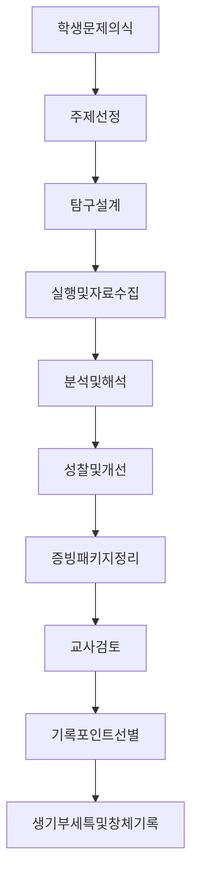
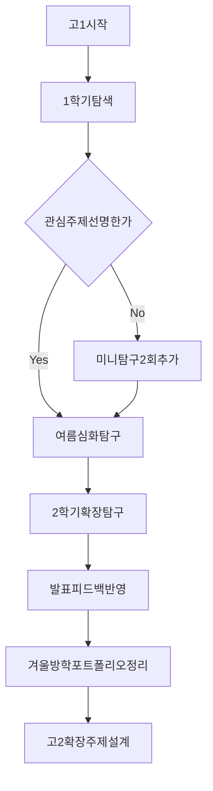

# 고1·2·3 생기부 탐구보고서 종합 가이드 (고1 시작점 중심)

> 고등학교 시기별(고1~고3) 탐구활동을 생기부에 효과적으로 반영하기 위한 실전 안내서 + 세특 문장용 학술 용언 사전

**마지막 업데이트:** 2026년 3월 16일

---

## 빠른 핵심 요약 (고1 기준)

- 생기부 탐구보고서는 별도 전국 공통 양식을 제출하는 제도가 아니라, **수업·동아리·진로 활동 결과가 교사에 의해 기록되는 과정**입니다.
- 같은 활동이라도 학교 운영 방식, 교과별 과제 구조, 교사 기록 스타일에 따라 기록 결과가 달라집니다.
- 고1은 성과보다 **탐구 습관(질문-자료수집-분석-성찰) 형성**이 핵심입니다.
- 탐구 종류는 교과형, 동아리형, 진로형, 대회연계형, 봉사연계형, 융합형 등으로 나눌 수 있습니다.
- 생기부 반영 가능성이 높은 활동은 공통적으로 **문제의식·과정기록·근거자료·결과해석·성장성**이 보입니다.
- 숙제는 제출로 끝나지만, 탐구보고서는 **왜 이 주제를 했는지와 어떻게 발전했는지**가 남아야 합니다.
- 고1 1학기에는 주제 발굴과 기초 조사, 2학기에는 심화/확장, 겨울방학에는 포트폴리오 정리가 좋습니다.
- 교사에게 보여줄 때는 최종 결과물만이 아니라 중간 기록(실험노트, 설문원본, 피드백 반영표)을 같이 준비해야 합니다.
- 문장 표현은 화려함보다 객관성이 중요하며, 구체 수치와 검증 과정을 반드시 포함합니다.
- 이 문서 뒤쪽 부록에는 바로 가져다 쓸 수 있는 학술 용언과 세특 문장 예시를 제공합니다.

---

## 📋 목차

1. [생기부 탐구보고서의 정확한 의미](#1-생기부-탐구보고서의-정확한-의미)
2. [고1·2·3 시기별 준비 전략](#2-고123-시기별-준비-전략)
3. [탐구보고서 종류 전체 지도](#3-탐구보고서-종류-전체-지도)
4. [학교 유형별 특수성과 대응 전략](#4-학교-유형별-특수성과-대응-전략)
5. [구조도: 탐구활동에서 생기부 기록까지](#5-구조도-탐구활동에서-생기부-기록까지)
6. [순서도: 고1 연간 실행 플로우](#6-순서도-고1-연간-실행-플로우)
7. [실제 제출 패키지 구성](#7-실제-제출-패키지-구성)
8. [자주 생기는 오해와 교정법](#8-자주-생기는-오해와-교정법)
9. [부록 A. 세특 문장용 학술 용언 사전](#부록-a-세특-문장용-학술-용언-사전)
10. [부록 B. 세특 작성 예시와 표현 가이드](#부록-b-세특-작성-예시와-표현-가이드)

---

## 1. 생기부 탐구보고서의 정확한 의미

### 생기부에서 탐구가 반영되는 위치

#### 세부능력특기사항(세특)
- **주무대**: 국어, 수학, 영어, 과학, 사회, 정보, 예술, 체육 등 각 교과 수업
- **형태**: 수행평가 보고서, 실험보고서, 발표자료, 프로젝트 결과물
- **기록 주체**: 담당 교사

#### 창의적 체험활동(창체)
- **동아리활동**: 정규/자율 동아리 프로젝트
- **진로활동**: 전공 탐색형 미니 리서치
- **자율활동**: 학급/학교 프로젝트 중 탐구형 활동

### 숙제와 탐구보고서의 실질적 차이

| 구분 | 숙제 | 생기부 반영 가능 탐구보고서 |
|---|---|---|
| 목적 | 과제 이행 | 문제 해결/지식 확장 |
| 과정 기록 | 거의 없음 | 질문-방법-분석-성찰이 남음 |
| 근거 자료 | 단편적 | 데이터/문헌/비교표 등 증거 확보 |
| 교사 관점 | 제출 여부 | 학업역량, 주도성, 발전 가능성 |
| 생기부 반영 | 제한적 | 비교적 높음 |

### 기록이 잘 되는 활동의 공통점

- 탐구 질문이 구체적임 (예: "환경이 중요하다"가 아니라 "학교 매점 플라스틱 컵 사용량을 4주간 줄일 수 있는가")
- 방법이 명확함 (실험/설문/인터뷰/문헌 비교 중 무엇인지 제시)
- 데이터가 남음 (표본수, 기간, 비교 기준, 오차/한계 포함)
- 결과 해석이 있음 (단순 성공/실패가 아니라 원인 분석)
- 다음 단계가 연결됨 (후속 개선안, 심화 주제 제시)

---

## 2. 고1·2·3 시기별 준비 전략

### 고1: 탐구 체력 만들기 (가장 중요)

#### 1학기
- 관심 분야 2~3개를 좁히고, 과목별로 1개씩 미니 탐구 시도
- 도서관/논문 검색, 기사 검증, 기본 통계 읽기 같은 기초 역량 학습
- 짧아도 좋으니 "과정 기록" 습관화 (탐구노트 시작)

#### 여름방학
- 1학기 활동 중 가장 반응이 좋았던 주제 1개 심화
- 선행연구 5~10편 요약, 핵심 용어 정리, 재탐구 계획 작성

#### 2학기
- 교과 간 연결형 탐구 1개 수행 (예: 수학 통계 + 사회 문제)
- 발표/피드백 반영 과정을 남겨 성장 스토리 확보

#### 겨울방학
- 고1 포트폴리오 정리: 주제선정 이유, 시행착오, 개선점
- 고2 확장 주제 후보 2개 준비

### 고2: 심화와 전공 적합성 강화

- 고1 주제를 확장해 난이도와 방법론 업그레이드
- 교내 발표/대회/캠프 연계로 외부 검증 경험 확보
- 전공 관련 키워드 일관성 유지

### 고3: 정리와 완성도 강화

- 신규 주제 남발보다 기존 탐구의 완성도와 연결성 강조
- 자기소개서/면접 대비 관점에서 탐구의 의미 재해석
- 학교 일정에 맞춰 부담 가능한 범위로 선택과 집중

---

## 3. 탐구보고서 종류 전체 지도

### 고등학생이 실제로 접할 수 있는 주요 유형

| 유형 | 핵심 특징 | 대표 산출물 | 생기부 반영 포인트 | 난이도 |
|---|---|---|---|---|
| 교과 세특형 | 수업 내용 기반 심화 | 실험/탐구 보고서, 발표자료 | 학업역량, 사고력 | 중 |
| 수행평가 확장형 | 수행평가를 추가 분석으로 확장 | 개선 보고서, 비교분석표 | 주도성, 성실성 | 중 |
| 동아리 연구형 | 팀 프로젝트, 장기 운영 | 연구일지, 결과보고서 | 협업, 지속성 | 중~상 |
| 진로 연계형 | 희망 전공 중심 탐색 | 전공 미니 리서치, 인터뷰 | 전공적합성 | 중 |
| 대회 연계형 | 교내외 대회 주제 대응 | 제안서, 발표 슬라이드 | 문제해결, 도전성 | 상 |
| 봉사 연계형 | 지역/학교 문제 해결 | 프로그램 설계안, 운영결과 | 공동체 역량 | 중 |
| 캠페인/실천형 | 인식 개선, 행동 변화 유도 | 캠페인 데이터, 참여지표 | 실천력, 리더십 | 중 |
| 실험·측정형 | 가설 검증 중심 | 실험설계서, 데이터셋 | 분석력, 정확성 | 중~상 |
| 조사·통계형 | 설문/관찰 데이터 분석 | 설문지, 통계분석 결과 | 논리성, 근거 기반 | 중 |
| 인문·사회 논증형 | 텍스트 분석, 비교 논증 | 비평문, 정책 제안서 | 비판적 사고 | 중 |
| 창작·제작형 | 결과물을 직접 제작 | 프로토타입, 제작보고서 | 창의성, 실행력 | 중 |
| 융합(STEAM)형 | 2과목 이상 통합 | 융합 프로젝트 보고서 | 융합적 사고 | 상 |

### 고1 추천 시작 조합

- **안전한 시작**: 교과 세특형 + 조사·통계형
- **진로 탐색형**: 진로 연계형 + 창작·제작형
- **협업 강화형**: 동아리 연구형 + 캠페인/실천형

---

## 4. 학교 유형별 특수성과 대응 전략

### 공통 전제

- 교육부 기본 틀은 같지만, 실제 운영은 학교의 시간표/예산/교사 문화/학생 분위기에 따라 달라집니다.
- 따라서 "정답 1개"보다 "학교 맥락에 맞춘 전략"이 중요합니다.

### 유형별 경향

| 학교 유형 | 자주 나타나는 경향 | 준비 전략 |
|---|---|---|
| 일반고 | 교과 중심, 시간 제약 큼 | 교과 내 미니 탐구를 꾸준히 누적 |
| 과학고/영재학교 | 실험·연구 난이도 높음 | 방법론 정확도와 데이터 품질 강화 |
| 외고/국제고 | 언어·사회·국제이슈 강점 | 문헌비교, 정책분석, 토론기록 체계화 |
| 자사고 | 프로그램 다양, 경쟁 높음 | 차별화 주제와 장기 프로젝트 운영 |
| 마이스터고/특성화고 | 실무·현장 연계 강함 | 제작/운영 결과와 개선지표 명확화 |
| 농산어촌/소규모 학교 | 자원 제한, 유연성 존재 | 지역 문제 기반 주제로 특화 |

### 교사 기록 스타일 차이 대응법

- 같은 결과물도 교사가 중요하게 보는 포인트가 다르므로, 초반에 평가 기준을 질문합니다.
- 중간 점검 때 "현재 기록 가능 포인트"를 확인해 보완 방향을 잡습니다.
- 최종 제출 전, 핵심 문장(주제-방법-결과-의미)을 5줄 이내로 정리해 전달합니다.

---

## 5. 구조도: 탐구활동에서 생기부 기록까지



### 구조도 해설

- 생기부는 "결과물 파일 1개"가 아니라 **과정 증거 묶음**을 보고 기록됩니다.
- `evidencePack` 단계(노트, 원자료, 수정기록)가 약하면 기록 문장이 약해집니다.

---

## 6. 순서도: 고1 연간 실행 플로우



### 고1 체크리스트

- 한 학기에 최소 1개는 "근거자료가 남는 탐구"를 수행했는가?
- 탐구노트에 실패 사례와 수정 이유를 기록했는가?
- 교과 선생님 피드백을 반영한 2차 결과물을 만들었는가?
- 활동 간 연결고리(왜 다음 주제로 갔는지)를 설명할 수 있는가?

---

## 7. 실제 제출 패키지 구성

### 기본 5종 세트

1. **주제선정표**: 문제의식, 선택 이유, 선행지식
2. **탐구계획서**: 기간, 방법, 변수, 역할분담
3. **중간기록지**: 진행상황, 오류, 수정사항
4. **최종보고서**: 결과, 해석, 한계, 후속 과제
5. **발표/공유자료**: 슬라이드, 포스터, 시연 영상

### 제출 시 권장 첨부

- 원데이터(설문 원본, 관찰표, 코드/실험 기록)
- 피드백 반영표(무엇을 어떻게 고쳤는지)
- 참고문헌 목록(출처 신뢰도 확인 가능)

---

## 8. 자주 생기는 오해와 교정법

| 오해 | 실제 | 교정 방법 |
|---|---|---|
| 보고서 길면 유리하다 | 핵심 근거가 더 중요 | 질문-방법-결과-성찰 4단 구조 유지 |
| 수상해야 기록된다 | 수상 없이도 기록 가능 | 과정 증거와 개선 과정을 명확히 제시 |
| 어려운 주제가 무조건 좋다 | 실행 가능한 주제가 더 유리 | 4~8주 내 검증 가능한 범위로 축소 |
| 혼자 해야 진정성 있다 | 협업도 중요한 역량 | 개인 기여도를 명확히 분리 기록 |

---

## 부록 A. 세특 문장용 학술 용언 사전

아래 용언 사전은 위 종합 가이드에서 설명한 탐구활동을 생기부 문장으로 정리할 때 활용할 수 있습니다.

---

### A-1. 연구 활동 관련 용언

### 탐구 단계

| 용언 | 의미 | 활용 예시 |
|------|------|----------|
| 탐구하다 | 깊이 있게 연구하다 | 미세플라스틱이 수생태계에 미치는 영향을 **탐구함** |
| 조사하다 | 자료를 수집하고 살피다 | 지역 내 재활용 실태를 **조사하여** 개선 방안을 도출함 |
| 분석하다 | 요소를 나누어 살피다 | 1,000건의 데이터를 통계적으로 **분석하여** 패턴을 발견함 |
| 고찰하다 | 깊이 생각하여 살피다 | 실험 결과를 선행 연구와 비교하여 **고찰함** |
| 검증하다 | 사실 여부를 확인하다 | 가설의 타당성을 실험을 통해 **검증함** |
| 규명하다 | 분명하게 밝히다 | AI 알고리즘의 정확도 향상 요인을 **규명함** |
| 도출하다 | 이끌어 내다 | 데이터 분석을 통해 의미 있는 결론을 **도출함** |
| 수집하다 | 모아서 거두다 | 8주간 100명의 학생으로부터 설문 데이터를 **수집함** |
| 측정하다 | 수치로 나타내다 | 게임화 전후의 학습 동기 변화를 정량적으로 **측정함** |
| 관찰하다 | 주의 깊게 살피다 | 식물 성장 과정을 12주간 체계적으로 **관찰함** |

### 설계 및 개발 단계

| 용언 | 의미 | 활용 예시 |
|------|------|----------|
| 설계하다 | 계획을 세우다 | 사전-사후 통제집단 실험을 **설계하여** 인과관계를 규명함 |
| 구축하다 | 체계를 만들다 | 블록체인 기반 회비 관리 시스템을 **구축함** |
| 개발하다 | 새로운 것을 만들다 | AI 기반 반려동물 건강 모니터링 앱을 **개발함** |
| 제작하다 | 만들어 내다 | 학교 굿즈 디자인을 **제작하고** 크라우드펀딩을 진행함 |
| 구현하다 | 실제로 만들다 | NFC 출석 시스템을 프로토타입으로 **구현함** |
| 설정하다 | 정하여 정하다 | 연구 변수와 통제 조건을 명확히 **설정함** |
| 수립하다 | 계획을 세우다 | 12주간의 연구 일정을 체계적으로 **수립함** |

---

### A-2. 사고 과정 관련 용언

### 비판적 사고

| 용언 | 의미 | 활용 예시 |
|------|------|----------|
| 비판하다 | 잘잘못을 판단하다 | 기존 연구의 한계점을 **비판적으로** 검토함 |
| 평가하다 | 가치를 판단하다 | 개발한 시스템의 효율성을 다각도로 **평가함** |
| 판단하다 | 옳고 그름을 결정하다 | 실험 결과의 통계적 유의성을 **판단함** |
| 검토하다 | 자세히 살피다 | 20편의 선행 연구를 체계적으로 **검토함** |
| 성찰하다 | 자신을 돌아보다 | 연구 과정에서의 시행착오를 **성찰하며** 개선 방안을 모색함 |

### 창의적 사고

| 용언 | 의미 | 활용 예시 |
|------|------|----------|
| 발상하다 | 생각을 떠올리다 | 기존과 다른 접근 방식을 **발상하여** 독창적 해결책을 제시함 |
| 착안하다 | 주목하여 생각하다 | 일상의 불편함에 **착안하여** 연구 주제를 선정함 |
| 고안하다 | 궁리하여 만들다 | 게임화 요소를 접목한 새로운 학습 방법을 **고안함** |
| 창안하다 | 새로 생각해 내다 | 블록체인과 IoT를 결합한 혁신적 시스템을 **창안함** |
| 구상하다 | 머릿속으로 그리다 | 사용자 중심의 인터페이스를 **구상하고** 프로토타입을 제작함 |

### 논리적 사고

| 용언 | 의미 | 활용 예시 |
|------|------|----------|
| 추론하다 | 미루어 생각하다 | 데이터 패턴으로부터 인과관계를 **추론함** |
| 논증하다 | 논리적으로 증명하다 | 가설의 타당성을 통계 분석으로 **논증함** |
| 유추하다 | 비슷한 것에서 미루다 | 다른 분야의 사례를 **유추하여** 적용 가능성을 탐색함 |
| 종합하다 | 하나로 합치다 | 질적·양적 데이터를 **종합하여** 통합적 결론을 도출함 |
| 귀납하다 | 개별에서 일반을 이끌다 | 개별 사례들을 **귀납적으로** 분석하여 일반 원리를 발견함 |
| 연역하다 | 일반에서 개별을 이끌다 | 이론적 틀을 **연역적으로** 적용하여 현상을 설명함 |

---

### A-3. 문제 해결 관련 용언

### 문제 인식

| 용언 | 의미 | 활용 예시 |
|------|------|----------|
| 발견하다 | 찾아내다 | 학교 시설 예약 시스템의 비효율성을 **발견함** |
| 인식하다 | 깨닫다 | 환경 문제의 심각성을 **인식하고** 해결 방안을 모색함 |
| 파악하다 | 알아내다 | 사용자 요구사항을 설문을 통해 정확히 **파악함** |
| 진단하다 | 상태를 판단하다 | 현행 시스템의 문제점을 체계적으로 **진단함** |
| 포착하다 | 잡아내다 | 데이터 분석 과정에서 이상치를 **포착하고** 원인을 규명함 |

### 해결 과정

| 용언 | 의미 | 활용 예시 |
|------|------|----------|
| 해결하다 | 문제를 풀다 | 알고리즘 최적화를 통해 처리 속도 문제를 **해결함** |
| 개선하다 | 더 좋게 고치다 | 사용자 피드백을 반영하여 UI/UX를 **개선함** |
| 극복하다 | 어려움을 이겨내다 | 데이터 부족 문제를 질적 연구 병행으로 **극복함** |
| 보완하다 | 부족한 부분을 채우다 | 시스템의 보안 취약점을 **보완하여** 안정성을 높임 |
| 최적화하다 | 가장 좋게 하다 | 유전 알고리즘을 활용하여 시간표 배정을 **최적화함** |
| 조정하다 | 알맞게 고치다 | 실험 조건을 **조정하며** 최적의 결과를 도출함 |
| 대응하다 | 맞서 처리하다 | 예상치 못한 변수에 유연하게 **대응하며** 연구를 진행함 |

---

### A-4. 협업 및 소통 관련 용언

### 협업

| 용언 | 의미 | 활용 예시 |
|------|------|----------|
| 협력하다 | 함께 힘을 합치다 | 팀원들과 **협력하여** 프로젝트를 성공적으로 완수함 |
| 협업하다 | 함께 일하다 | 다양한 전공의 학생들과 **협업하며** 융합적 해결책을 도출함 |
| 조율하다 | 서로 맞추다 | 팀원 간 의견을 **조율하고** 합의점을 찾아냄 |
| 분담하다 | 나누어 맡다 | 역할을 명확히 **분담하여** 효율적으로 연구를 진행함 |
| 공유하다 | 함께 나누다 | 연구 결과를 학술제에서 **공유하고** 피드백을 수렴함 |

### 소통

| 용언 | 의미 | 활용 예시 |
|------|------|----------|
| 소통하다 | 의사를 통하다 | 멘토와 정기적으로 **소통하며** 연구 방향을 점검함 |
| 교류하다 | 서로 오가다 | 국제 학생들과 **교류하며** 문화 간 이해를 넓힘 |
| 논의하다 | 의논하다 | 연구 윤리 문제를 팀원들과 심도 있게 **논의함** |
| 설득하다 | 이해시키다 | 연구의 필요성을 논리적으로 **설득하여** 지원을 확보함 |
| 발표하다 | 알려 보이다 | 연구 결과를 학술대회에서 **발표하고** 질의응답을 수행함 |
| 전달하다 | 알려 주다 | 복잡한 통계 결과를 시각화하여 명확히 **전달함** |
| 피력하다 | 의견을 말하다 | 토론 시간에 자신의 견해를 논리적으로 **피력함** |

---

### A-5. 성장 및 발전 관련 용언

### 학습 및 습득

| 용언 | 의미 | 활용 예시 |
|------|------|----------|
| 학습하다 | 배워서 익히다 | Python 프로그래밍을 독학으로 **학습하여** 데이터 분석에 활용함 |
| 습득하다 | 배워 얻다 | 통계 분석 방법을 **습득하고** 연구에 적용함 |
| 익히다 | 숙달하다 | LaTeX 문서 작성법을 **익혀** 논문을 전문적으로 작성함 |
| 체득하다 | 몸으로 깨닫다 | 연구 방법론을 실제 프로젝트를 통해 **체득함** |
| 함양하다 | 기르다 | 비판적 사고력을 문헌 고찰 과정에서 **함양함** |

### 발전 및 성장

| 용언 | 의미 | 활용 예시 |
|------|------|----------|
| 발전시키다 | 더 나아지게 하다 | 초기 아이디어를 구체적인 연구 계획으로 **발전시킴** |
| 심화하다 | 깊이를 더하다 | 기초 연구를 **심화하여** 학술지 수준의 논문을 작성함 |
| 확장하다 | 넓히다 | 연구 범위를 **확장하여** 다양한 변수를 고려함 |
| 향상시키다 | 더 좋게 하다 | 반복 실험을 통해 측정 정확도를 **향상시킴** |
| 제고하다 | 높이다 | 연구 윤리 의식을 **제고하며** 책임감 있게 연구를 수행함 |
| 신장하다 | 늘리다 | 프로젝트 경험을 통해 문제 해결 능력을 **신장함** |

### 적응 및 변화

| 용언 | 의미 | 활용 예시 |
|------|------|----------|
| 적응하다 | 맞추어 익숙해지다 | 새로운 연구 환경에 빠르게 **적응하며** 성과를 냄 |
| 전환하다 | 바꾸다 | 연구 방법을 양적에서 혼합 연구로 **전환하여** 깊이를 더함 |
| 수정하다 | 고쳐 바로잡다 | 멘토 피드백을 반영하여 연구 설계를 **수정함** |
| 보완하다 | 부족함을 채우다 | 파일럿 테스트 결과를 바탕으로 설문 문항을 **보완함** |
| 개선하다 | 더 좋게 하다 | 1차 실험의 한계를 **개선한** 2차 실험을 설계함 |

---

### A-6. 창의성 관련 용언

### 창조 및 혁신

| 용언 | 의미 | 활용 예시 |
|------|------|----------|
| 창출하다 | 새로 만들어 내다 | 기존에 없던 학교 굿즈 디자인을 **창출함** |
| 혁신하다 | 새롭게 바꾸다 | 전통적 출석 방식을 NFC 기술로 **혁신함** |
| 창작하다 | 예술 작품을 만들다 | AI 도구를 활용하여 독창적인 음악을 **창작함** |
| 제안하다 | 의견을 내놓다 | 에너지 절약을 위한 게임화 방안을 **제안함** |
| 시도하다 | 해보다 | 다양한 알고리즘을 **시도하며** 최적의 방법을 찾아냄 |

### 융합 및 통합

| 용언 | 의미 | 활용 예시 |
|------|------|----------|
| 융합하다 | 녹여 합치다 | 생명과학과 AI 기술을 **융합하여** 혁신적 진단 시스템을 개발함 |
| 통합하다 | 하나로 합치다 | 질적·양적 연구 방법을 **통합하여** 종합적 결론을 도출함 |
| 접목하다 | 결합하다 | 게임화 요소를 교육에 **접목하여** 학습 동기를 높임 |
| 결합하다 | 합치다 | IoT와 블록체인을 **결합한** 스마트 시스템을 구축함 |
| 연계하다 | 이어 관련짓다 | 이론적 지식을 실제 문제 해결에 **연계함** |

---

### A-7. 분석 및 평가 관련 용언

### 데이터 분석

| 용언 | 의미 | 활용 예시 |
|------|------|----------|
| 분석하다 | 나누어 살피다 | SPSS를 활용하여 설문 데이터를 통계적으로 **분석함** |
| 해석하다 | 의미를 밝히다 | 실험 결과를 이론적 틀에 기반하여 **해석함** |
| 비교하다 | 견주어 보다 | 실험군과 통제군의 성과를 정량적으로 **비교함** |
| 대조하다 | 맞대어 보다 | 선행 연구 결과와 본 연구 결과를 **대조하여** 차이점을 규명함 |
| 분류하다 | 나누어 가르다 | 수집한 데이터를 주제별로 체계적으로 **분류함** |
| 범주화하다 | 범주로 나누다 | 질적 데이터를 코딩하여 의미 있는 범주로 **범주화함** |

### 평가 및 검증

| 용언 | 의미 | 활용 예시 |
|------|------|----------|
| 평가하다 | 가치를 판단하다 | 개발한 시스템의 사용성을 다각도로 **평가함** |
| 검증하다 | 증명하다 | 가설을 통계적 방법으로 **검증하고** 타당성을 입증함 |
| 입증하다 | 증거로 밝히다 | 실험 데이터를 통해 효과성을 객관적으로 **입증함** |
| 확인하다 | 틀림없이 알다 | 측정 도구의 신뢰도와 타당도를 **확인함** |
| 점검하다 | 조사하여 살피다 | 연구 윤리 준수 여부를 지속적으로 **점검함** |
| 측정하다 | 수치화하다 | 학습 효과를 사전-사후 검사로 정량적으로 **측정함** |

---

### A-8. 실행 및 적용 관련 용언

### 실행 및 수행

| 용언 | 의미 | 활용 예시 |
|------|------|----------|
| 실행하다 | 실제로 행하다 | 12주간의 연구 계획을 체계적으로 **실행함** |
| 수행하다 | 맡아서 하다 | 100명 대상 설문 조사를 성실히 **수행함** |
| 진행하다 | 나아가게 하다 | 파일럿 테스트를 거쳐 본 실험을 **진행함** |
| 실시하다 | 실제로 시행하다 | 사전-사후 검사를 엄격한 통제 하에 **실시함** |
| 운영하다 | 움직여 나가게 하다 | 8주간 온라인 실험 플랫폼을 안정적으로 **운영함** |

### 적용 및 활용

| 용언 | 의미 | 활용 예시 |
|------|------|----------|
| 적용하다 | 대상에 맞게 쓰다 | 머신러닝 알고리즘을 실제 데이터에 **적용함** |
| 활용하다 | 효과적으로 이용하다 | Python 라이브러리를 **활용하여** 데이터를 시각화함 |
| 응용하다 | 원리를 실제에 쓰다 | 이론적 지식을 현장 문제 해결에 **응용함** |
| 도입하다 | 받아들여 쓰다 | 블록체인 기술을 회비 관리에 **도입하여** 투명성을 높임 |
| 구현하다 | 실제로 만들다 | 설계한 알고리즘을 코드로 **구현하고** 테스트함 |
| 시행하다 | 실제로 행하다 | 새로운 교육 방법을 시범 학급에 **시행함** |

### 기여 및 공헌

| 용언 | 의미 | 활용 예시 |
|------|------|----------|
| 기여하다 | 이바지하다 | 연구 결과가 환경 보호 실천에 **기여할** 것으로 기대됨 |
| 공헌하다 | 이바지하다 | 학술적 지식 축적에 **공헌하는** 의미 있는 연구를 수행함 |
| 이바지하다 | 도움이 되다 | 지역사회 문제 해결에 **이바지하는** 실용적 시스템을 개발함 |
| 제시하다 | 내보이다 | 기존 문제에 대한 새로운 해결 방안을 **제시함** |
| 제공하다 | 내주다 | 후속 연구를 위한 기초 데이터를 **제공함** |

---

## 부록 B. 세특 작성 예시와 표현 가이드

### 예시 1: 탐구 왕국 (과학 실험)

**나쁜 예:**
```
과학 시간에 실험을 했다. 결과가 좋았다.
```

**좋은 예:**
```
생명과학 시간에 미세플라스틱이 물벼룩 생식에 미치는 영향을 **탐구함**. 
선행 연구 15편을 **고찰하여** 연구 갭을 **발견하고**, 농도별 실험을 
**설계함**. 4주간 체계적으로 **관찰한** 결과, 고농도 조건에서 생식률이 
40% 감소함을 **규명함**. 데이터를 통계적으로 **분석하고** 그래프로 
**시각화하여** 학술제에서 **발표함**. 특히 실험 설계와 변수 통제에서 
탁월한 연구 역량을 **보임**.
```

### 예시 2: 기술 왕국 (시스템 개발)

**나쁜 예:**
```
앱을 만들었다. 사람들이 좋아했다.
```

**좋은 예:**
```
정보 과목에서 NFC 기반 스마트 출석 시스템을 **개발함**. 기존 출석 
방식의 비효율성을 **파악하고**, 사용자 요구사항을 설문으로 **조사함**. 
Android Studio와 Firebase를 **활용하여** 프로토타입을 **구현하고**, 
3개 학급 120명을 대상으로 8주간 **시범 운영함**. 출석 처리 시간이 
80% 단축되고 정확도가 99%에 달함을 **검증함**. 사용자 피드백을 
**반영하여** UI/UX를 지속적으로 **개선하며** 문제 해결 능력을 **함양함**.
```

### 예시 3: 창작 왕국 (예술 프로젝트)

**나쁜 예:**
```
그림을 그렸다. 상을 받았다.
```

**좋은 예:**
```
미술 시간에 생성형 AI를 활용한 디지털 아트 프로젝트를 **수행함**. 
AI 도구의 작동 원리를 **학습하고**, 프롬프트 엔지니어링 기법을 
**습득함**. '기후변화'를 주제로 50개의 작품을 **창작하고**, 작품의 
메시지 전달력을 설문으로 **평가함**. 전통 미술과 AI 기술을 **융합한** 
독창적 표현 방식을 **개발하여** 학교 전시회에서 최우수상을 **수상함**. 
기술과 예술의 경계를 **탐구하며** 창의적 사고력을 **신장함**.
```

### 예시 4: 연결 왕국 (사회 프로젝트)

**나쁜 예:**
```
친구들을 연결해 주는 앱을 만들었다.
```

**좋은 예:**
```
사회 과목에서 학교 내 사회적 통합을 위한 랜덤 점심 메이트 매칭 
플랫폼을 **기획함**. 학생 300명의 교우 관계를 사회 네트워크 분석으로 
**조사하여** 집단 간 단절을 **발견함**. 알고리즘을 **설계하고** 
웹 플랫폼으로 **구현하여** 8주간 **운영함**. 네트워크 분석 결과 
교우 관계 다양성이 70% 증가하고 학교 소속감이 35% 향상됨을 **입증함**. 
데이터 기반 문제 해결 과정을 통해 사회적 자본 형성에 **기여하는** 
의미를 **체득함**.
```

---

### 활용 팁

### 1. 구체적 수치 포함
- ❌ "많은 학생을 대상으로"
- ✅ "100명의 학생을 대상으로"

### 2. 과정 중심 서술
- ❌ "논문을 썼다"
- ✅ "20편의 선행 연구를 **고찰하고**, 데이터를 **분석하여**, 의미 있는 결론을 **도출함**"

### 3. 역량 연결
- ❌ "프로젝트를 완성했다"
- ✅ "프로젝트를 통해 문제 해결 능력과 협업 역량을 **함양함**"

### 4. 학술적 표현 사용
- ❌ "알아봤다"
- ✅ "**탐구함**, **고찰함**, **분석함**"

### 5. 성장 과정 강조
- ❌ "결과가 좋았다"
- ✅ "시행착오를 **극복하며** 연구 역량을 **신장함**"

---

### 용언 사용 빈도 가이드

### 고빈도 (매 세특마다 사용)
- 탐구하다, 분석하다, 수행하다, 개발하다, 활용하다

### 중빈도 (2-3회 사용)
- 설계하다, 검증하다, 도출하다, 해결하다, 협력하다

### 저빈도 (1회, 강조 시)
- 규명하다, 창안하다, 혁신하다, 입증하다, 함양하다

---

### 주의사항

### 피해야 할 표현
- ❌ "~했다" (단순 과거형)
- ❌ "~하였다" (격식체 과다)
- ❌ "매우", "아주", "정말" (주관적 표현)
- ❌ "~인 것 같다" (불확실한 표현)

### 권장 표현
- ✅ "~함" (간결한 종결)
- ✅ 구체적 수치와 결과
- ✅ 객관적 사실 중심
- ✅ 과정과 성장 강조

---

**이 문서는 8개 왕국 탐구보고서 작성 시 참고 자료로 활용하세요!** 📚
