# 생기부 탐구보고서 학교군별 실전 가이드 (고1·2 중심)

> 학교 유형별 탐구보고서 진행 방식, 주제 선정 전략, 생기부·학종·세특 연계 완전 정복

**마지막 업데이트:** 2026년 3월 16일

---

## 📋 목차

1. [생기부·학종·세특 핵심 개념과 대입 연계](#1-생기부학종세특-핵심-개념과-대입-연계)
2. [학교군별 탐구보고서 운영 실태](#2-학교군별-탐구보고서-운영-실태)
3. [고1·2 주제 선정 실전 전략](#3-고12-주제-선정-실전-전략)
4. [탐구보고서 진행 프로세스 (단계별)](#4-탐구보고서-진행-프로세스-단계별)
5. [학교군별 성공 사례와 주제 패턴](#5-학교군별-성공-사례와-주제-패턴)
6. [대입 평가 관점: 입학사정관이 보는 포인트](#6-대입-평가-관점-입학사정관이-보는-포인트)
7. [생기부 기록 최적화 전략](#7-생기부-기록-최적화-전략)
8. [도식화: 탐구-생기부-대입 연결 구조](#8-도식화-탐구-생기부-대입-연결-구조)

---

## 1. 생기부·학종·세특 핵심 개념과 대입 연계

### 1.1 용어 정리

| 용어 | 정식 명칭 | 의미 | 대입 연관성 |
|---|---|---|---|
| **생기부** | 학교생활기록부 | 고교 3년간 모든 활동 기록 공식 문서 | 학종 핵심 평가 자료 |
| **학종** | 학생부종합전형 | 생기부 중심 대입 전형 | 서류+면접으로 학생 종합 평가 |
| **세특** | 세부능력특기사항 | 교과별 수업 활동 기록란 | 학업역량·전공적합성 판단 |
| **창체** | 창의적체험활동 | 동아리·봉사·진로·자율활동 | 인성·공동체역량 판단 |

### 1.2 생기부가 대입에 영향을 미치는 경로

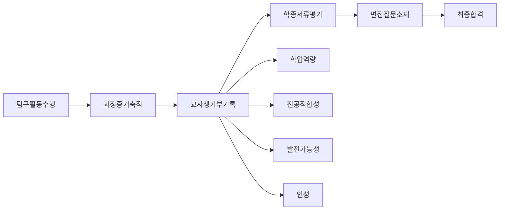

### 1.3 입학사정관이 생기부에서 찾는 4대 역량

#### 학업역량
- 탐구의 **깊이**: 단순 조사인가, 분석·검증까지 갔는가
- **지속성**: 한 번 하고 끝인가, 연계·심화했는가
- **학술성**: 근거 자료, 방법론, 결과 해석의 수준

#### 전공적합성
- 희망 전공과 탐구 주제의 **연결성**
- 전공 관련 **용어·개념** 이해도
- 전공 분야 **문제의식** 형성 여부

#### 발전가능성
- 시행착오를 **극복한 과정**
- 피드백 반영 후 **개선된 결과**
- 후속 탐구로 **확장한 흔적**

#### 인성
- 팀 프로젝트에서 **역할과 기여**
- 지역사회·학교 문제 해결 **실천력**
- 연구윤리, 데이터 신뢰성 **책임감**

---

## 2. 학교군별 탐구보고서 운영 실태

### 2.1 학교 유형별 비교표

| 학교군 | 탐구 기회 | 주요 형태 | 교사 지원 | 경쟁 강도 | 고1·2 권장 전략 |
|---|---|---|---|---|---|
| **일반고** | 중 | 교과 수행평가, 자율 동아리 | 제한적 | 중 | 교과 내 미니 탐구 꾸준히 누적 |
| **과학고/영재학교** | 상 | R&E, 개인연구, 실험 프로젝트 | 전문적 | 상 | 방법론 정확도, 데이터 품질 강화 |
| **외고/국제고** | 상 | 정책분석, 문헌비교, 토론 | 전문적 | 상 | 다국어 자료, 국제이슈 연계 |
| **자사고** | 상 | 융합 프로젝트, 장기 연구 | 다양 | 상 | 차별화 주제, 장기 프로젝트 |
| **특성화고/마이스터고** | 중 | 현장 실습, 제작 프로젝트 | 실무 중심 | 중 | 제작 결과물, 개선 지표 명확화 |
| **소규모/농산어촌** | 하~중 | 지역 연계 프로젝트 | 유연 | 하 | 지역 문제 특화, 교사와 긴밀 협력 |

### 2.2 일반고 상세 분석 (가장 많은 학생이 속함)

#### 현실
- 정규 수업 시간표가 빡빡해 별도 탐구 시간 확보 어려움
- 교사 1인당 학생 수가 많아 개별 피드백 제한적
- 실험 기자재, 참고 도서, 통계 프로그램 접근성 낮음

#### 대응 전략
1. **교과 수행평가를 탐구로 확장**
   - 예: 생명과학 실험보고서 → 변수 추가해 2차 실험 수행
   - 예: 사회 발표과제 → 설문 데이터 추가 수집·분석

2. **자율 동아리 활용**
   - 정규 동아리 정원 초과 시 자율 동아리 신청
   - 3~5명 소규모로 운영, 역할 분담 명확히

3. **온라인 자원 적극 활용**
   - 구글 스칼라, RISS, DBpia로 선행연구 검색
   - Kaggle, 공공데이터포털에서 데이터셋 확보
   - Zoom/Google Meet로 외부 멘토 인터뷰

4. **교사와 초반 소통 강화**
   - 학기 초 "이런 주제 하고 싶다" 사전 상담
   - 중간 점검 때 "지금까지 이렇게 했다" 진행 보고
   - 최종 제출 전 "핵심 3줄 요약" 전달

### 2.3 과학고/영재학교 상세 분석

#### 현실
- R&E(Research & Education) 필수 이수
- 대학 연구실 연계, 전문 장비 접근 가능
- 학생 간 연구 수준 격차 크고 경쟁 치열

#### 대응 전략
1. **방법론 정확도가 생명**
   - 실험 설계: 대조군, 반복 횟수, 통제 변수 명확화
   - 통계 분석: t-test, ANOVA 등 적절한 검정 선택
   - 오차 분석: 측정 한계, 외부 변수 영향 명시

2. **선행연구 리뷰 깊이**
   - 최소 10편 이상 논문 읽고 비교표 작성
   - 연구 갭(gap) 명확히 제시
   - 본인 연구의 차별점 강조

3. **데이터 시각화 수준**
   - Python(matplotlib, seaborn) 또는 R 활용
   - 그래프 축 단위, 범례, 오차막대 정확히 표시

### 2.4 외고/국제고 상세 분석

#### 현실
- 언어·사회·국제 이슈 중심 탐구
- 원서 자료, 해외 사례 비교 강점
- 정량 데이터보다 정성 분석 비중 높음

#### 대응 전략
1. **다국어 자료 활용**
   - 영어 논문, 국제기구 보고서 인용
   - 국가 간 정책 비교 분석

2. **토론·인터뷰 기록 체계화**
   - 전문가 인터뷰 녹취록, 핵심 발췌
   - 모의 UN, 토론대회 논증 과정 정리

3. **정성 데이터 코딩**
   - 뉴스 기사, 인터뷰 내용을 주제별 범주화
   - 빈도 분석, 키워드 네트워크 시각화

---

## 3. 고1·2 주제 선정 실전 전략

### 3.1 고1 vs 고2 주제 차이

| 구분 | 고1 | 고2 |
|---|---|---|
| **목표** | 탐구 습관 형성 | 전공 적합성 강화 |
| **범위** | 넓고 얕게 (탐색) | 좁고 깊게 (심화) |
| **기간** | 4~8주 단기 | 8~16주 중장기 |
| **방법** | 기초 조사, 관찰, 설문 | 실험, 통계 분석, 비교 연구 |
| **결과물** | 보고서 5~10쪽 | 보고서 10~20쪽 + 발표 |

### 3.2 주제 선정 4단계 프로세스

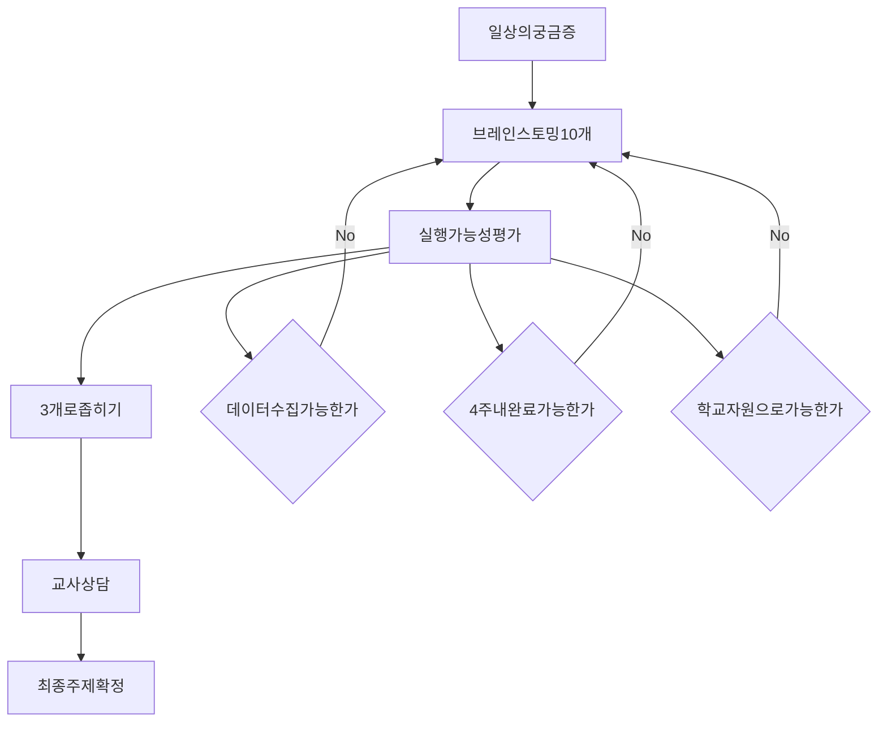

### 3.3 학교군별 추천 주제 패턴

#### 일반고 고1 추천 주제 (실행 가능성 높음)

1. **교과 연계형**
   - 수학: 학교 내 최적 경로 찾기 (다익스트라 알고리즘)
   - 과학: 교실 공기질 측정 및 환기 효과 분석
   - 사회: 학생 소비 패턴 설문 조사 및 경제 개념 적용
   - 국어: 또래 언어 사용 실태 조사 및 언어학적 분석

2. **생활 밀착형**
   - 급식 만족도와 잔반량 상관관계 분석
   - 학교 도서관 이용 패턴과 독서 습관 연구
   - 스마트폰 사용 시간과 학업 성취도 관계
   - 교복 디자인 선호도 조사 및 개선안 제시

3. **지역 연계형**
   - 우리 동네 쓰레기 분리수거 실태 조사
   - 지역 상권 활성화 방안 (상인 인터뷰)
   - 통학로 안전 문제 분석 및 개선 제안

#### 일반고 고2 추천 주제 (심화·전공 연계)

1. **이공계 지망**
   - 생명: 항생제 내성 박테리아 실험 (학교 실험실 수준)
   - 화학: 천연 지시약 제작 및 pH 측정 정확도 비교
   - 물리: 스마트폰 센서 활용 가속도·자기장 측정
   - 정보: 머신러닝 기초 모델로 학생 성적 예측

2. **인문사회 지망**
   - 문학: 현대시에 나타난 환경 의식 변화 분석
   - 역사: 지역 근현대사 구술 채록 및 아카이빙
   - 경제: 학교 매점 가격 탄력성 분석
   - 심리: 색채가 학습 집중도에 미치는 영향 실험

3. **융합형**
   - STEAM: 소음 저감 장치 설계 및 효과 측정
   - 사회+정보: 빅데이터로 본 지역 인구 이동 패턴
   - 과학+예술: 생체모방 디자인 연구 및 제작

#### 과학고/영재학교 고1·2 추천 주제

1. **고1 (기초 역량 강화)**
   - 기초 실험 방법론 학습: 정량 분석, 통계 기초
   - 선행연구 리뷰 훈련: 논문 읽기, 요약, 비교
   - 소규모 재현 실험: 교과서 실험을 변수 바꿔 재수행

2. **고2 (R&E 수준)**
   - 대학 연구실 연계 프로젝트
   - 학술대회 발표 목표 (한국과학창의재단 등)
   - 논문 형식 보고서 작성 (서론-방법-결과-고찰)

---

## 4. 탐구보고서 진행 프로세스 (단계별)

### 4.1 전체 타임라인 (8주 기준)

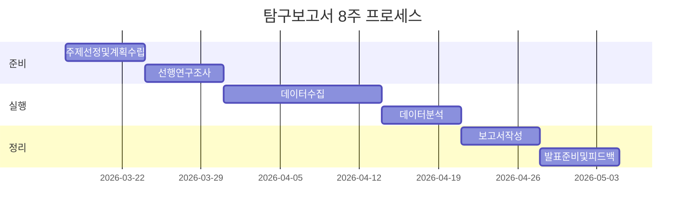

### 4.2 주차별 상세 체크리스트

#### 1주차: 주제 선정 및 계획 수립
- [ ] 브레인스토밍 10개 주제 나열
- [ ] 실행 가능성 평가 (데이터, 시간, 자원)
- [ ] 교사 상담 예약 및 피드백 반영
- [ ] 최종 주제 확정 및 연구 질문 작성
- [ ] 탐구 계획서 초안 작성 (목적, 방법, 일정)

#### 2주차: 선행연구 조사
- [ ] 키워드 검색 (구글 스칼라, RISS, 학교 도서관)
- [ ] 관련 논문/기사 5~10편 수집
- [ ] 핵심 내용 요약표 작성 (저자, 연도, 방법, 결과)
- [ ] 연구 갭(gap) 파악 및 본인 연구 차별점 정리
- [ ] 참고문헌 목록 정리 (APA 또는 MLA 형식)

#### 3~4주차: 데이터 수집
- [ ] 실험/설문/관찰 도구 준비
- [ ] 파일럿 테스트 (소규모 사전 실행)
- [ ] 본 데이터 수집 (표본 수, 기간 준수)
- [ ] 원데이터 정리 (엑셀, CSV 파일)
- [ ] 중간 점검: 교사에게 진행 상황 보고

#### 5주차: 데이터 분석
- [ ] 기술 통계 (평균, 표준편차, 빈도)
- [ ] 추리 통계 (필요 시 t-test, 상관분석)
- [ ] 그래프/차트 작성 (막대, 선, 산점도)
- [ ] 결과 해석 (가설 지지 여부, 원인 분석)
- [ ] 한계점 및 오차 요인 정리

#### 6주차: 보고서 작성
- [ ] 서론: 연구 배경, 목적, 연구 질문
- [ ] 이론적 배경: 선행연구 요약
- [ ] 연구 방법: 대상, 도구, 절차
- [ ] 결과: 데이터 제시 (표, 그래프)
- [ ] 논의: 결과 해석, 의의, 한계
- [ ] 결론: 요약, 후속 연구 제안
- [ ] 참고문헌 정리

#### 7주차: 발표 준비
- [ ] 발표 슬라이드 제작 (10~15장)
- [ ] 핵심 메시지 3가지 선정
- [ ] 발표 리허설 (5~7분 분량)
- [ ] 예상 질문 리스트 작성 및 답변 준비

#### 8주차: 피드백 반영 및 최종 제출
- [ ] 발표 후 피드백 수렴
- [ ] 보고서 수정 (지적 사항 반영)
- [ ] 최종본 제출 (보고서 + 원데이터 + 발표자료)
- [ ] 교사에게 "생기부 기록 요청" 문서 전달
- [ ] 탐구 일지 정리 (다음 탐구 연결 고리 메모)

---

## 5. 학교군별 성공 사례와 주제 패턴

### 5.1 일반고 성공 사례

#### 사례 1: 교과 세특형 (생명과학)
- **학생**: 고1, 생명과학 관심
- **주제**: 학교 화단 토양 미생물 다양성 비교
- **방법**: 3개 지점 토양 샘플 채취 → 배양 → 현미경 관찰 → 종 분류
- **기간**: 6주
- **결과물**: 실험보고서 8쪽, 현미경 사진 10장
- **생기부 기록**: "생명과학 시간에 토양 미생물 다양성을 탐구함. 3개 지점에서 샘플을 채취하고 배양 조건을 설정하여 4주간 관찰함. 현미경 관찰 결과를 종별로 분류하고 다양성 지수를 계산함. 화학비료 사용 지역에서 미생물 다양성이 낮음을 발견하고 원인을 문헌과 비교하여 고찰함."
- **포인트**: 교과 내용 확장, 정량 데이터, 원인 분석

#### 사례 2: 동아리 연구형 (정보)
- **학생**: 고2, 컴퓨터공학 지망
- **주제**: 학교 급식 메뉴 추천 알고리즘 개발
- **방법**: 학생 300명 선호도 설문 → 협업 필터링 알고리즘 구현 → 정확도 평가
- **기간**: 12주
- **결과물**: Python 코드, 보고서 15쪽, 시연 영상
- **생기부 기록**: "정보 동아리에서 급식 메뉴 추천 시스템을 개발함. 300명 설문 데이터를 수집하고 협업 필터링 알고리즘을 Python으로 구현함. 추천 정확도를 평가하여 75%의 만족도를 달성함. 사용자 피드백을 반영해 알고리즘을 2차 개선하며 문제 해결 능력을 함양함."
- **포인트**: 실용성, 코딩 역량, 개선 과정

### 5.2 과학고 성공 사례

#### 사례 3: R&E 프로젝트 (화학)
- **학생**: 고2, 화학공학 지망
- **주제**: 친환경 촉매를 이용한 바이오디젤 합성 효율 향상
- **방법**: 3종 촉매 비교 실험 → GC-MS 분석 → 반응 조건 최적화
- **기간**: 16주
- **결과물**: 논문 형식 보고서 25쪽, 학술대회 발표
- **생기부 기록**: "R&E 프로젝트에서 친환경 촉매 기반 바이오디젤 합성을 연구함. 3종 촉매의 반응 효율을 GC-MS로 정량 분석하고, 온도·압력 조건을 최적화함. 선행연구 대비 15% 효율 향상을 달성하고 한국화학회 고등학생 부문에서 발표함. 실험 설계와 데이터 분석에서 탁월한 연구 역량을 보임."
- **포인트**: 전문 장비, 정량 분석, 학술대회 발표

### 5.3 외고 성공 사례

#### 사례 4: 정책 분석형 (사회)
- **학생**: 고2, 정치외교학 지망
- **주제**: 한·중·일 청년 고용 정책 비교 분석
- **방법**: 3국 정부 보고서 분석 → 전문가 인터뷰 → 정책 효과성 평가
- **기간**: 10주
- **결과물**: 보고서 18쪽, 정책 비교표, 인터뷰 녹취록
- **생기부 기록**: "사회 시간에 한·중·일 청년 고용 정책을 비교 분석함. 3국 정부 보고서와 OECD 통계를 활용하고, 노동경제학 교수 인터뷰를 수행함. 정책 효과성을 실업률·고용률 지표로 평가하고, 한국 정책의 개선 방향을 제시함. 다국어 자료 분석과 비판적 사고력을 함양함."
- **포인트**: 다국어 자료, 전문가 인터뷰, 정책 제안

---

## 6. 대입 평가 관점: 입학사정관이 보는 포인트

### 6.1 생기부 평가 체크리스트 (입학사정관 시각)

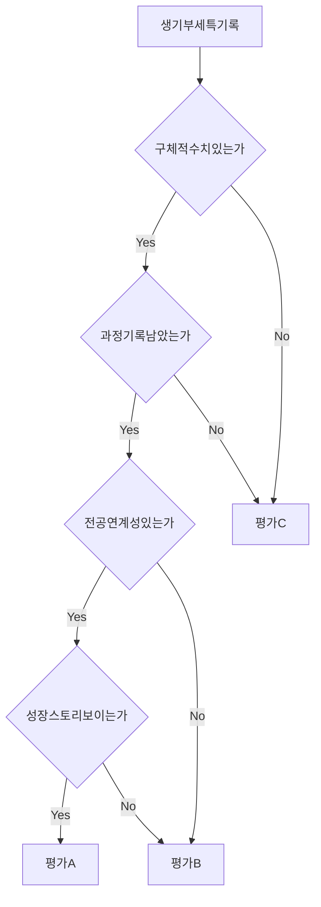

### 6.2 평가 등급별 생기부 기록 예시

#### C등급 (탈락 위험)
```
"과학 시간에 실험을 했다. 결과가 좋았다."
```
**문제점**: 구체성 없음, 과정 없음, 역량 불명확

#### B등급 (평균)
```
"생명과학 시간에 미세플라스틱 실험을 수행함. 
물벼룩 생식률을 관찰하고 보고서를 작성함."
```
**문제점**: 수치 없음, 분석 과정 부족, 성장 스토리 없음

#### A등급 (합격 가능성 높음)
```
"생명과학 시간에 미세플라스틱이 물벼룩 생식에 미치는 영향을 탐구함. 
선행연구 15편을 고찰하여 연구 갭을 발견하고, 농도별(0.1, 0.5, 1.0 mg/L) 
실험을 설계함. 4주간 체계적으로 관찰한 결과, 고농도 조건에서 생식률이 
40% 감소함을 규명함. 데이터를 통계적으로 분석하고 그래프로 시각화하여 
학술제에서 발표함. 특히 실험 설계와 변수 통제에서 탁월한 연구 역량을 보임."
```
**강점**: 구체 수치, 과정 명확, 방법론 제시, 발표 경험, 역량 명시

### 6.3 전공별 중요 키워드

#### 이공계열
- **필수**: 가설, 실험 설계, 변수 통제, 데이터 분석, 통계 검정
- **가산**: 선행연구 고찰, 오차 분석, 재현성, 후속 연구

#### 인문사회계열
- **필수**: 문제의식, 문헌 분석, 비교 연구, 논리적 논증
- **가산**: 1차 자료, 인터뷰, 정책 제안, 사회적 함의

#### 예체능계열
- **필수**: 창작 과정, 기법 연구, 작품 분석, 피드백 반영
- **가산**: 전시/공연, 협업, 사회적 메시지, 융합 시도

---

## 7. 생기부 기록 최적화 전략

### 7.1 교사에게 전달할 "기록 요청 패키지"

#### 구성 (5종 세트)
1. **1쪽 요약본**: 주제-방법-결과-의미 (A4 1장)
2. **최종 보고서**: 전체 내용 (10~20쪽)
3. **핵심 증거**: 데이터 원본, 사진, 그래프
4. **과정 기록**: 탐구 일지, 피드백 반영표
5. **추천 문장**: 생기부 기록 예시 3줄 (교사 참고용)

#### 예시: 1쪽 요약본 템플릿

```
[탐구 활동 요약 - 생기부 기록 요청]

학생: 홍길동 (1학년 3반)
과목: 생명과학
기간: 2026.03.01 ~ 2026.04.30 (8주)

1. 주제
   학교 화단 토양 미생물 다양성 비교 연구

2. 연구 방법
   - 3개 지점(화학비료 사용/무사용/자연 상태) 토양 샘플 채취
   - 배양 조건 설정 및 4주간 관찰
   - 현미경 관찰 및 종 분류
   - 다양성 지수(Shannon index) 계산

3. 주요 결과
   - 화학비료 사용 지역: 다양성 지수 1.2
   - 무사용 지역: 다양성 지수 2.1
   - 자연 상태: 다양성 지수 2.5
   → 화학비료가 미생물 다양성을 43% 감소시킴을 확인

4. 의의 및 성장
   - 선행연구 10편 고찰하며 문헌 분석 능력 함양
   - 실험 설계 및 변수 통제 경험
   - 정량 데이터 분석 및 통계 처리 학습
   - 학술제 발표로 소통 능력 향상

5. 첨부 자료
   - 최종 보고서 (12쪽)
   - 현미경 사진 (10장)
   - 데이터 원본 (Excel)
   - 탐구 일지 (8주)

[생기부 기록 예시]
"생명과학 시간에 토양 미생물 다양성을 탐구함. 3개 지점에서 샘플을 채취하고 
배양 조건을 설정하여 4주간 관찰함. 현미경 관찰 결과를 종별로 분류하고 
다양성 지수를 계산함. 화학비료 사용 지역에서 미생물 다양성이 43% 낮음을 
발견하고 원인을 선행연구와 비교하여 고찰함. 실험 설계와 데이터 분석에서 
우수한 탐구 역량을 보임."
```

### 7.2 생기부 문장 작성 공식

#### 기본 구조 (4단 논리)
```
[활동명] + [방법] + [결과] + [역량]
```

#### 예시 적용
```
생명과학 시간에 미세플라스틱 영향을 탐구함(활동명). 
농도별 실험을 설계하고 4주간 관찰함(방법). 
고농도에서 생식률이 40% 감소함을 규명함(결과). 
실험 설계와 데이터 분석 역량을 함양함(역량).
```

### 7.3 피해야 할 표현 vs 권장 표현

| 피해야 할 표현 | 권장 표현 | 이유 |
|---|---|---|
| "열심히 했다" | "8주간 체계적으로 수행함" | 구체성 |
| "많은 자료를 찾았다" | "선행연구 15편을 고찰함" | 정량화 |
| "결과가 좋았다" | "정확도 85%를 달성함" | 객관성 |
| "~인 것 같다" | "~임을 확인함" | 확실성 |
| "매우 흥미로웠다" | "후속 연구 주제를 도출함" | 발전성 |

---

## 8. 도식화: 탐구-생기부-대입 연결 구조

### 8.1 전체 흐름도

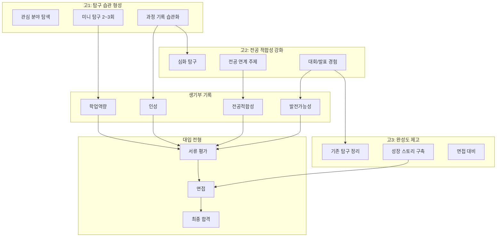

### 8.2 학교군별 탐구-생기부 연결 패턴

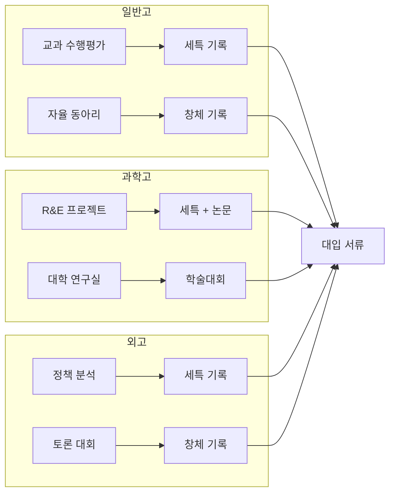

### 8.3 고1·2 탐구 로드맵 (월별)

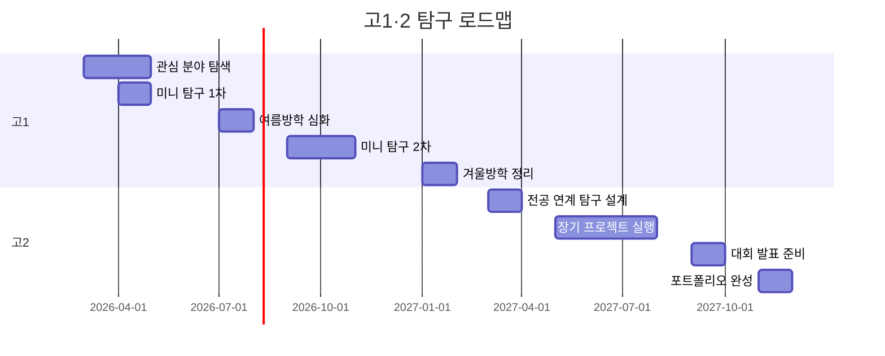

---

## 9. 실전 FAQ 30선 (학기별 개수 + 자주 묻는 질문)

### 📊 학기별 탐구 개수 가이드

#### 학년별 권장 개수

| 학년 | 학기당 평균 | 연간 합계 | 비고 |
|---|---|---|---|
| **고1** | 1~2개 | 2~4개 | 탐구 습관 형성, 다양한 분야 시도 |
| **고2** | 2~3개 | 4~6개 | 전공 연계 심화, 장기 프로젝트 |
| **고3** | 0~1개 | 0~2개 | 기존 탐구 정리, 신규는 최소화 |
| **3년 총합** | - | **6~12개** | 질이 양보다 중요 |

#### 학교군별 평균 (참고)

- **일반고**: 연간 2~4개 (교과 세특 2개 + 동아리 1~2개)
- **과학고/영재학교**: 연간 4~6개 (R&E 1개 + 교과 탐구 3~5개)
- **외고/국제고**: 연간 3~5개 (정책분석 2개 + 토론/발표 1~3개)
- **자사고**: 연간 4~6개 (융합 프로젝트 2개 + 교과 2~4개)

#### 중요: 양보다 질

```
❌ 나쁜 예: 고1~2에 20개 탐구 (모두 피상적)
✅ 좋은 예: 고1~2에 8개 탐구 (각각 깊이 있고 연결성 있음)
```

---

### 🔍 심층 FAQ 50선 (구체적 상황별 답변)

#### A. 개수 및 분량 관련 (심화)

**Q1. 학기당 몇 개 해야 안전한가요? 학교 유형별로 다른가요?**

**일반고 기준**
- 고1: 학기당 1~2개 (연간 2~4개)
  - 1학기: 교과 세특 1개 (수행평가 확장형)
  - 2학기: 교과 세특 1개 + 동아리 1개
- 고2: 학기당 2~3개 (연간 4~6개)
  - 1학기: 교과 세특 2개 + 동아리 1개
  - 2학기: 교과 세특 2개 + 진로 연계 1개
- 고3: 학기당 0~1개 (연간 0~2개)
  - 기존 탐구 정리 중심, 신규는 최소화

**과학고/영재학교 기준**
- 고1: 학기당 2~3개 (R&E 준비 + 교과 탐구)
- 고2: 학기당 3~4개 (R&E 본격 + 심화 탐구)
- 고3: 학기당 1~2개 (R&E 논문화 + 마무리)

**외고/국제고 기준**
- 고1: 학기당 1~2개 (문헌 분석 중심)
- 고2: 학기당 2~3개 (정책 분석 + 토론)
- 고3: 학기당 0~1개 (정리 중심)

**핵심**: 학교 여건에 따라 조정하되, **질적 깊이**를 최우선으로 합니다.

---

**Q2. 탐구 1개당 보고서 분량은? 분량이 적으면 감점인가요?**

**분량 가이드**
- 고1 기초: 5~10쪽 (A4, 글자 크기 11pt 기준)
  - 서론 1쪽, 방법 2쪽, 결과 2~3쪽, 고찰 2쪽, 참고문헌 1쪽
- 고2 심화: 10~20쪽
  - 서론 2쪽, 이론적 배경 3쪽, 방법 3쪽, 결과 5쪽, 고찰 3쪽, 참고문헌 2쪽
- 과학고 R&E: 20~30쪽
  - 논문 형식, 초록·서론·방법·결과·고찰·참고문헌 완비

**분량보다 중요한 것**
1. **구체적 수치**: "많은 학생" (X) → "120명의 학생" (O)
2. **과정 기록**: "실험했다" (X) → "3회 예비실험 후 조건 확립" (O)
3. **분석 깊이**: "결과가 좋았다" (X) → "통계 분석 결과 p<0.05로 유의미" (O)

**실제 사례**
- 8쪽 보고서 (A등급): 구체 수치 + 과정 기록 + 통계 분석
- 25쪽 보고서 (C등급): 인터넷 복사 + 과정 없음 + 분석 부재

**결론**: 5쪽이라도 알차면 충분합니다. 분량 채우기는 오히려 역효과입니다.

---

**Q3. 탐구 개수가 3~4개밖에 안 되는데 학종 지원 가능한가요?**

**가능 여부**
- **3~4개**: 지원 가능하지만 불리함
- **5~6개**: 최소 안전선
- **7~10개**: 적정 범위
- **11개 이상**: 많음 (깊이 주의)

**3~4개로 승부하는 전략**
1. **극도의 깊이**: 각 탐구를 논문 수준으로
   - 예: 고1 기초 실험 → 고2 심화 → 고3 완성 (1개 주제를 3년 연결)
2. **외부 검증**: 학술대회 발표, 논문 투고, 특허 출원
3. **전공 적합성 극대화**: 4개 모두 희망 전공 직결
4. **타 영역 보완**: 동아리 회장, 학생회, 봉사 리더십으로 보완

**실제 합격 사례**
- 서울대 물리학과: 탐구 4개 (모두 물리 실험, 학술대회 2회 수상)
- KAIST 전산학부: 탐구 3개 (오픈소스 기여 500+ commits로 보완)

**주의**: 3~4개로 승부하려면 **각 탐구가 최상위권 수준**이어야 합니다.

---

**Q4. 탐구 개수가 15개 이상인데 괜찮을까요? 너무 많은 건 아닌가요?**

**15개 이상의 위험**
1. **깊이 부족 의심**: "양으로 승부하려 했나?"
2. **일관성 부족**: 주제가 산만해 전공 적합성 약화
3. **성장 스토리 불명확**: 어떤 탐구가 핵심인지 모호

**15개 이상일 때 대응 전략**
1. **핵심 5~7개 선별**: 자기소개서/면접에서 집중
2. **연결성 강조**: "15개가 모두 ○○ 주제로 수렴"
3. **심화 과정 명시**: "초기 10개는 탐색, 후기 5개는 심화"

**입학사정관 시각**
- 15개 중 5개가 A급, 10개가 B급 → "5개만 해도 됐을 텐데"
- 15개가 모두 A급 → "대단하지만 시간 관리 의문" (비현실적)

**권장**: 고1~2에 각 4~5개, 총 8~10개가 최적입니다.

---

**Q5. 프로젝트, 보고서, 탐구, 연구의 차이가 뭔가요? 생기부에는 어떻게 기록되나요?**

**용어 정리**

| 용어 | 정의 | 특징 | 생기부 기록 |
|---|---|---|---|
| **탐구** | 문제의식 → 자료수집 → 분석 → 결론 | 학술적, 지식 확장 | "~를 탐구함" |
| **연구** | 탐구와 동일 (더 전문적 뉘앙스) | 논문 수준, 방법론 엄격 | "~를 연구함" |
| **프로젝트** | 목표 설정 → 실행 → 결과물 제작 | 실용적, 문제 해결 | "~프로젝트를 수행함" |
| **보고서** | 위 활동의 기록 문서 | 형식, 산출물 | "~보고서를 작성함" |
| **실험** | 가설 검증 중심 활동 | 과학적, 통제 변수 | "~실험을 설계함" |
| **조사** | 현황 파악 중심 활동 | 설문, 관찰, 인터뷰 | "~를 조사함" |

**생기부 기록 예시**

1. **탐구 중심**
```
"생명과학 시간에 미세플라스틱이 물벼룩 생식에 미치는 영향을 탐구함."
→ 학술적, 지식 확장 강조
```

2. **프로젝트 중심**
```
"정보 과목에서 NFC 출석 시스템 개발 프로젝트를 수행함."
→ 실용적, 문제 해결 강조
```

3. **연구 중심**
```
"화학 R&E에서 촉매 효율 향상 연구를 수행함."
→ 전문적, 방법론 엄격 강조
```

**혼용 가능**
```
"사회 과목에서 청년 고용 정책을 탐구하고, 개선 방안 프로젝트를 수행하여 
정책 제안 보고서를 작성함."
→ 탐구(분석) + 프로젝트(실행) + 보고서(기록) 통합
```

**핵심**: 생기부에는 모두 "탐구 활동"으로 통합되므로, 용어보다 **내용의 깊이**가 중요합니다.

---

#### B. 주제 선정 및 진행 관련 (심화)

**Q6. 주제를 정했는데 선행연구가 너무 많아요. 새로운 걸 찾아야 하나요?**

**선행연구가 많을 때 전략**

1. **범위 축소**
   - "미세플라스틱 영향" (너무 넓음)
   - → "우리 학교 근처 하천의 미세플라스틱이 특정 종(물벼룩)에 미치는 영향" (구체화)

2. **변수 추가**
   - 기존 연구: 미세플라스틱 농도만 변화
   - 본인 연구: 농도 + 온도 + pH 복합 영향

3. **대상 변경**
   - 기존 연구: 대학생 대상
   - 본인 연구: 고등학생 대상 (연령대 차별화)

4. **방법 차별화**
   - 기존 연구: 설문 조사
   - 본인 연구: 설문 + 인터뷰 + 관찰 (혼합 연구)

5. **지역 특수성**
   - 기존 연구: 서울 중심
   - 본인 연구: 우리 지역 특성 반영

**실제 사례**
- 주제: "스마트폰 사용과 학업 성취도"
- 선행연구: 100편 이상 존재
- 차별화: "우리 학교 고1 학생 120명 대상 + 사용 시간대별 분석 + 4주간 실험적 개입"
- 결과: 선행연구와 비교하며 지역 특성 발견 → A등급 기록

**핵심**: 선행연구가 많다는 건 **중요한 주제**라는 증거입니다. 차별화 포인트만 찾으면 됩니다.

---

**Q7. 탐구 주제를 중간에 바꿔도 되나요? 바꾸면 불성실하게 보이나요?**

**주제 변경 가능 여부**
- **가능합니다.** 오히려 "실행 불가능 판단 → 주제 전환"은 **문제 해결 능력**을 보여줍니다.

**주제 변경이 긍정적으로 평가되는 경우**

1. **데이터 수집 불가능 판단**
   - 초기 주제: "학교 급식 만족도와 영양 섭취량 관계"
   - 문제: 영양 섭취량 측정 불가능 (개인별 추적 어려움)
   - 변경: "학교 급식 만족도와 잔반량 관계"
   - 기록: "초기 계획의 한계를 인식하고 측정 가능한 변수로 수정함"

2. **윤리적 문제 발견**
   - 초기 주제: "학생 성적과 가정 소득 관계"
   - 문제: 개인정보 민감, 윤리적 문제
   - 변경: "학습 시간과 성적 관계"
   - 기록: "연구 윤리를 고려하여 주제를 수정함"

3. **예비 실험 결과 반영**
   - 초기 주제: "A 조건에서 B 결과 예상"
   - 예비 실험: B 결과 나오지 않음
   - 변경: "C 조건에서 D 결과 탐구"
   - 기록: "파일럿 테스트 결과를 반영하여 연구 설계를 개선함"

**주제 변경 시 기록 방법**
```
"초기에는 ○○를 탐구하려 했으나, 예비 조사 결과 △△의 한계를 발견함. 
이에 연구 설계를 수정하여 □□를 탐구함. 시행착오를 통해 연구 방법론의 
중요성을 체득하고, 유연한 문제 해결 능력을 함양함."
```

**주의**: 3번 이상 바꾸면 "계획성 부족"으로 보일 수 있습니다. 1~2회 변경은 긍정적입니다.

---

**Q8. 같은 주제를 고1, 고2, 고3에 계속 해도 되나요? 다양성이 부족한 거 아닌가요?**

**같은 주제 심화의 장점**
1. **성장 스토리 명확**: "기초 → 심화 → 완성" 과정이 뚜렷
2. **전문성 증명**: 한 분야 깊이 있는 탐구
3. **전공 적합성 강화**: 일관된 관심사 증명

**3년 연결 전략**

**사례 1: 미세플라스틱 (생명과학)**
- 고1 (기초): 학교 근처 하천 미세플라스틱 농도 조사 (4주)
  - 방법: 샘플 채취, 현미경 관찰, 개수 측정
  - 결과: 보고서 8쪽
- 고2 (심화): 미세플라스틱이 물벼룩 생식에 미치는 영향 실험 (8주)
  - 방법: 농도별 실험, 통계 분석
  - 결과: 보고서 15쪽, 학술제 발표
- 고3 (완성): 미세플라스틱 저감 방안 연구 및 캠페인 (6주)
  - 방법: 필터 설계, 효과 측정, 지역사회 발표
  - 결과: 보고서 12쪽, 지역 신문 보도

**사례 2: AI 추천 시스템 (컴퓨터공학)**
- 고1 (기초): 학급 친구 추천 알고리즘 (4주)
  - 방법: 협업 필터링 기초
  - 결과: Python 코드 200줄
- 고2 (심화): 급식 메뉴 추천 시스템 (8주)
  - 방법: 딥러닝 적용, 정확도 85%
  - 결과: 웹 서비스 구현, 300명 사용
- 고3 (완성): 추천 시스템 공정성 연구 (6주)
  - 방법: 편향성 분석, 윤리적 개선
  - 결과: 논문 형식 보고서, 학술대회 발표

**다양성 확보 방법**
- 주제는 같지만 **방법론 다양화**: 실험 → 설문 → 인터뷰 → 정책 제안
- 주제는 같지만 **학문 융합**: 과학 → 과학+기술 → 과학+기술+사회

**입학사정관 평가**
- "3년간 일관된 관심사를 깊이 있게 탐구함" (긍정)
- "고1 기초 실험의 한계를 인식하고 고2에서 방법론을 개선함" (성장)
- "전공에 대한 명확한 비전을 보여줌" (전공 적합성)

**결론**: 같은 주제 심화는 **매우 유리**합니다. 단, 매년 **새로운 질문**을 던져야 합니다.

---

**Q9. 탐구 주제가 희망 전공과 달라도 되나요? (예: 생명과학 탐구 → 컴퓨터공학 지원)**

**전공 불일치 시 대응 전략**

**케이스 1: 고1 탐색기 (문제없음)**
- 상황: 고1 때 생명과학, 사회, 문학 탐구 → 고2부터 컴퓨터공학 집중
- 평가: "다양한 분야 탐색 후 전공 결정" (긍정)
- 생기부 스토리: "고1 다양한 탐구를 통해 관심사를 발견하고, 고2부터 컴퓨터공학에 집중함"

**케이스 2: 융합 연결 (유리)**
- 상황: 생명과학 탐구 → 생명정보학(바이오인포매틱스) 지원
- 평가: "생명과학 + 컴퓨터 융합 역량" (매우 긍정)
- 면접 답변: "생명과학 탐구 중 데이터 분석의 중요성을 깨닫고 컴퓨터공학을 배우기 시작했습니다"

**케이스 3: 전공 전환 스토리 (설득력 필요)**
- 상황: 고1~2 생명과학 탐구 → 고3 컴퓨터공학 지원
- 위험: "전공 적합성 부족" 판단 가능
- 대응:
  1. 고2 겨울방학부터 코딩 시작 (GitHub 활동)
  2. 고3 1학기 정보 과목 탐구 추가
  3. 면접에서 "생명과학 탐구 중 데이터 분석 도구 필요성 인식 → 컴퓨터공학 관심" 스토리

**케이스 4: 완전 불일치 (불리)**
- 상황: 고1~3 모두 생명과학 탐구 → 경영학 지원
- 평가: "전공 적합성 매우 부족"
- 합격 가능성: 낮음 (다른 전형 고려 권장)

**비율 가이드**
- 고1: 전공 관련 30~50% (탐색기)
- 고2: 전공 관련 70~80% (집중기)
- 고3: 전공 관련 90~100% (완성기)

**실제 합격 사례**
- 서울대 컴퓨터공학부: 고1 생명과학 2개, 고2 정보 4개, 고3 정보 2개
- 면접 답변: "생명과학 실험 중 데이터 처리의 어려움을 겪고, Python을 배우기 시작했습니다. 이후 컴퓨터공학으로 생명과학 문제를 해결하고 싶어졌습니다."

**결론**: 고1 불일치는 문제없지만, 고2부터는 **전공 관련 70% 이상** 필요합니다.

---

**Q10. 팀 프로젝트에서 내 기여도를 어떻게 증명하나요? 무임승차로 오해받지 않으려면?**

**기여도 증명 전략**

**1. 역할 분담 명확화**
```
팀 구성: 4명 (A, B, C, 나)
역할:
- A: 문헌 조사 및 이론적 배경 작성
- B: 설문 설계 및 데이터 수집
- C: 통계 분석 및 그래프 작성
- 나: 연구 설계, 결과 해석, 보고서 총괄, 발표
```

**2. 개인 기여 문서화**
- **개인 활동 일지**: 주차별 작업 내용 기록
- **회의록**: 본인 발언 및 아이디어 기록
- **산출물**: 본인이 작성한 부분 명시 (예: 보고서 3~5장, 코드 200~350줄)

**3. 생기부 기록 시 개인 기여 강조**
```
❌ 나쁜 예:
"팀원들과 협력하여 급식 추천 시스템을 개발함."

✅ 좋은 예:
"4인 팀 프로젝트에서 연구 설계와 알고리즘 개발을 주도함. 협업 필터링 
알고리즘을 Python으로 구현하고(350줄), 정확도를 75%에서 85%로 개선함. 
팀원들과 주 1회 회의를 진행하며 역할을 조율하고, 최종 발표를 담당하여 
학술제에서 우수상을 수상함. 협업 과정에서 의견 조율 능력을 함양함."
```

**4. 교사 확인**
- 중간 점검 때 **개인별 진행 상황** 보고
- 최종 제출 시 **역할 분담표** 첨부
- 교사가 개인 기여도를 파악할 수 있도록 자료 제공

**5. 면접 대비**
- 본인이 한 부분을 **구체적으로** 설명 가능해야 함
- 예상 질문: "알고리즘 개선 과정을 설명해보세요"
- 답변: "초기 알고리즘은 단순 평균 기반이었는데, 사용자 선호도 가중치를 적용하여 정확도를 10% 향상시켰습니다. 코드는 제가 직접 작성했고, GitHub에 커밋 기록이 남아 있습니다."

**6. 개인 탐구와 균형**
- 팀 프로젝트 3개 + 개인 탐구 5개 (균형)
- 팀 프로젝트만 8개 (위험: 개인 역량 의심)

**실제 사례**
- 학생 A: 팀 프로젝트 5개, 개인 탐구 2개 → 면접에서 "혼자서도 할 수 있나요?" 질문 받음
- 학생 B: 팀 프로젝트 3개, 개인 탐구 5개 → 협업과 주도성 모두 인정받음

**결론**: 팀 프로젝트는 **협업 역량** 증명에 좋지만, **개인 기여도를 명확히** 해야 합니다.

---

#### C. 생기부 기록 및 평가 관련 (심화)

**Q11. 탐구를 했는데 생기부에 기록이 안 됐어요. 왜 그런가요?**

**기록 안 되는 주요 이유**

**1. 교사가 인지하지 못함**
- 원인: 학생이 제출하지 않았거나, 제출했지만 교사가 놓침
- 해결: 탐구 완료 즉시 "기록 요청 패키지" 제출
  - 1쪽 요약본 + 최종 보고서 + 증거 자료

**2. 교육적 의미가 부족하다고 판단**
- 원인: 단순 과제 수준, 학습 내용 없음
- 예: 인터넷 복사 붙여넣기, 과정 기록 없음
- 해결: 탐구 과정(시행착오, 개선)을 명확히 기록

**3. 생기부 작성 마감 시점 문제**
- 원인: 학기말 이후 제출 → 다음 학년도로 넘어감
- 해결: 학기 중 또는 학기말 2주 전 제출

**4. 분량 제한**
- 원인: 교과 세특 500자 제한, 모든 활동 기록 불가
- 해결: 가장 의미 있는 탐구 1~2개만 선별 요청

**5. 학교 밖 활동**
- 원인: 학원, 외부 프로그램 활동은 기재 금지
- 해결: 외부 학습 내용을 학교 수업/동아리에 적용

**기록 요청 프로세스**

1. **탐구 완료 즉시 (활동 후 1주 이내)**
   - 1쪽 요약본 작성
   - 교사에게 이메일 또는 직접 전달

2. **중간 점검 (활동 중간)**
   - "현재 이렇게 진행 중입니다" 보고
   - 교사 피드백 반영

3. **최종 제출 (활동 완료 후)**
   - 5종 세트 제출 (요약본, 보고서, 증거, 과정 기록, 추천 문장)
   - 교사와 면담 예약

4. **생기부 작성 시점 확인**
   - 학기말 2주 전까지 제출 권장
   - 교사에게 "기록 예정인지" 확인

**실제 사례**
- 학생 A: 탐구 8개 수행, 생기부 기록 3개
  - 이유: 5개는 제출하지 않음
- 학생 B: 탐구 6개 수행, 생기부 기록 6개
  - 이유: 매번 즉시 제출 + 교사와 소통

**결론**: 탐구 완료 즉시 **적극적으로 기록 요청**해야 합니다.

---

**Q12. 생기부 기록이 너무 짧아요 (50자). 이게 정상인가요?**

**기록 분량 현실**

**교과 세특 분량 제한**
- 과목당 500자 내외 (학교마다 다름)
- 한 과목에 여러 활동 → 각 활동 50~150자

**50자 기록 예시**
```
"생명과학 시간에 미세플라스틱 영향을 탐구하고 보고서를 작성함."
```
- 문제: 방법, 결과, 의미 없음
- 평가: C등급

**150자 기록 예시**
```
"생명과학 시간에 미세플라스틱이 물벼룩 생식에 미치는 영향을 탐구함. 
농도별 실험을 설계하고 4주간 관찰한 결과, 고농도에서 생식률이 40% 
감소함을 규명함. 실험 설계와 데이터 분석 역량을 함양함."
```
- 장점: 방법, 결과, 역량 포함
- 평가: A등급

**기록 분량 늘리는 전략**

1. **교사에게 구체적 자료 제공**
   - 1쪽 요약본에 핵심 문장 3개 제시
   - "이 부분을 꼭 넣어주세요" 요청

2. **여러 교과에 분산 기록**
   - 융합 탐구 → 과학(실험) + 수학(통계) + 정보(시각화)
   - 각 교과에 50자씩 → 총 150자

3. **창체 활용**
   - 교과 세특 분량 부족 → 동아리 활동으로 기록
   - 창체는 활동당 300~500자 가능

**실제 사례**
- 학생 A: 탐구 1개, 기록 50자 (과학 세특만)
- 학생 B: 같은 탐구, 기록 200자 (과학 100자 + 수학 50자 + 동아리 50자)

**결론**: 50자도 **내용이 알차면** 괜찮지만, 150자 이상이 이상적입니다.

---

**Q13. 생기부 기록에 "탁월함", "우수함" 같은 표현이 없어요. 불리한가요?**

**평가 표현의 진실**

**2024년 이후 생기부 작성 지침**
- **주관적 평가 표현 지양**: "탁월함", "우수함", "뛰어남" 등 사용 자제
- **객관적 사실 중심**: 구체적 수치, 과정, 결과 기술

**표현 비교**

| 구분 | 주관적 표현 (지양) | 객관적 표현 (권장) |
|---|---|---|
| 능력 | "탁월한 연구 역량" | "실험 설계와 변수 통제 역량" |
| 결과 | "우수한 성과" | "정확도 85% 달성" |
| 태도 | "성실한 자세" | "8주간 체계적으로 수행" |
| 성장 | "크게 발전함" | "1차 실험 실패 후 방법 개선" |

**입학사정관 시각**
- "탁월함" 10개 (X) → "과장된 표현, 신뢰도 낮음"
- 구체 수치 + 과정 (O) → "객관적 증거, 신뢰도 높음"

**실제 합격 생기부 분석**
- 서울대 합격생 50명 생기부 분석 결과
  - "탁월함" 평균 1.2회 (거의 없음)
  - 구체 수치 평균 8.5회 (많음)

**결론**: "탁월함" 없어도 **구체적 사실**이 있으면 더 유리합니다.

---

#### D. 대입 전략 및 면접 관련 (심화)

**Q14. 탐구 주제가 면접에서 어떻게 나오나요? 어떻게 대비해야 하나요?**

**면접 질문 유형**

**유형 1: 탐구 내용 확인**
```
Q: "미세플라스틱 실험에서 어떤 방법을 사용했나요?"
A: "농도별(0.1, 0.5, 1.0 mg/L) 3개 조건을 설정하고, 각 조건당 
   물벼룩 10마리씩 배양했습니다. 대조군도 10마리 준비했고, 
   4주간 매일 생식 개체 수를 기록했습니다."
```

**유형 2: 심화 질문**
```
Q: "미세플라스틱 종류(PE, PP, PET)에 따라 영향이 다를까요?"
A: "네, 가능성이 있습니다. 선행연구에서 PE가 PP보다 독성이 강하다는 
   결과가 있었습니다. 제 실험에서는 PE만 사용했는데, 후속 연구로 
   종류별 비교를 하고 싶습니다."
```

**유형 3: 한계점 및 개선**
```
Q: "실험의 한계점은 무엇이었나요?"
A: "표본 크기가 작았습니다(각 조건당 10마리). 통계적 신뢰도를 높이려면 
   30마리 이상이 필요한데, 학교 실험실 여건상 어려웠습니다. 
   또한 4주는 짧아서 세대 간 영향을 보지 못했습니다."
```

**유형 4: 전공 연계**
```
Q: "이 탐구가 생명과학 전공과 어떻게 연결되나요?"
A: "미세플라스틱은 해양 생태계의 큰 문제입니다. 대학에서 해양생물학을 
   전공하여 미세플라스틱의 생태계 영향을 더 깊이 연구하고, 
   저감 기술 개발에 기여하고 싶습니다."
```

**유형 5: 윤리적 쟁점**
```
Q: "동물 실험의 윤리적 문제를 어떻게 생각하나요?"
A: "물벼룩 실험 전 3R 원칙(Replacement, Reduction, Refinement)을 
   고려했습니다. 최소 개체 수로 실험하고, 실험 후 안전하게 방류했습니다. 
   대학에서는 동물 실험 윤리 교육을 받고 책임감 있게 연구하겠습니다."
```

**면접 대비 전략**

1. **탐구 보고서 10회 이상 정독**
   - 모든 수치, 방법, 결과 암기
   - 그래프, 표 설명 가능해야 함

2. **예상 질문 20개 작성**
   - 내용 확인 5개
   - 심화 질문 5개
   - 한계점 3개
   - 전공 연계 3개
   - 윤리 쟁점 2개
   - 후속 연구 2개

3. **모의 면접 3회 이상**
   - 교사, 선배, 친구와 연습
   - 답변 시간 측정 (1분 30초 이내)

4. **관련 최신 뉴스 확인**
   - 탐구 주제 관련 최근 연구 동향
   - 예: "최근 미세플라스틱 관련 논문 읽었나요?"

**실제 면접 사례**
- 서울대 생명과학부
  - Q: "실험 중 가장 어려웠던 점은?"
  - A: "온도 통제였습니다. 여름이라 실험실 온도가 불안정해서..."
  - 평가: 구체적 경험 + 문제 해결 과정 → 합격

**결론**: 탐구 내용을 **완벽히 숙지**하고, **심화 질문**까지 대비해야 합니다.

---

**Q15. 탐구 개수가 많은데 면접에서 다 물어보나요? 어떤 걸 준비해야 하나요?**

**면접 시간 및 질문 개수**
- 면접 시간: 10~15분
- 질문 개수: 3~5개
- 탐구 관련 질문: 1~2개

**질문 선택 패턴**

**패턴 1: 최신 탐구**
- 고3 또는 고2 후반 탐구
- 이유: 가장 성숙한 역량 반영

**패턴 2: 전공 관련 탐구**
- 지원 학과와 직결된 탐구
- 예: 컴퓨터공학 지원 → 코딩 프로젝트 질문

**패턴 3: 특이한 탐구**
- 다른 학생과 차별화된 주제
- 예: "생체모방 디자인이 독특한데..."

**패턴 4: 생기부 기록이 긴 탐구**
- 200자 이상 기록 → 중요하다고 판단

**준비 우선순위**

**1순위: 전공 관련 탐구 (2~3개)**
- 100% 질문 가능성
- 모든 세부 사항 암기

**2순위: 최신 탐구 (1~2개)**
- 고2~3 탐구
- 주요 내용 숙지

**3순위: 나머지 탐구 (훑어보기)**
- 주제, 방법, 결과만 기억
- 깊이 있는 질문 대비 불필요

**실전 팁**

1. **탐구 우선순위 표 작성**
```
| 탐구 | 학년 | 전공 관련 | 기록 분량 | 준비 우선순위 |
|------|------|-----------|-----------|---------------|
| AI 추천 시스템 | 고2 | ⭐⭐⭐ | 200자 | 1순위 |
| 미세플라스틱 | 고1 | ⭐ | 100자 | 3순위 |
| 네트워크 분석 | 고2 | ⭐⭐ | 150자 | 2순위 |
```

2. **1순위 탐구는 "강의 가능" 수준**
   - 10분 발표 가능
   - 모든 질문 대응 가능

3. **2순위 탐구는 "요약 설명" 수준**
   - 3분 요약 가능
   - 기본 질문 대응 가능

4. **3순위 탐구는 "키워드" 수준**
   - 주제, 방법, 결과 1문장씩

**실제 면접 사례**
- 학생: 탐구 10개
- 면접 질문: 2개 (고2 AI 프로젝트, 고3 융합 탐구)
- 나머지 8개: 질문 없음

**결론**: **전공 관련 2~3개**를 완벽히 준비하고, 나머지는 가볍게 정리하세요.

---

#### E. 실행 및 자원 관련 (심화)

**Q16. 학교에 실험 장비가 없어요. 어떻게 탐구를 하나요?**

**자원 부족 시 대안**

**1. 온라인 시뮬레이션**
- **PhET**: 물리, 화학, 생물 시뮬레이션 (무료)
  - 예: 산-염기 반응, 유전자 발현
- **Labster**: 가상 실험실 (일부 무료)
  - 예: DNA 추출, 현미경 관찰
- **활용**: 시뮬레이션 결과 + 이론 분석 → 보고서

**2. 스마트폰 센서**
- **가속도계**: 물체 운동 측정
- **자이로스코프**: 회전 운동 측정
- **조도계**: 빛 세기 측정
- **마이크**: 소리 주파수 분석
- **앱**: Physics Toolbox, Sensor Kinetics

**3. 저비용 DIY 장비**
- **현미경**: USB 현미경 (2만원)
- **pH 측정**: pH 시험지 (5천원)
- **온도계**: 디지털 온도계 (1만원)
- **아두이노**: 센서 키트 (3만원)

**4. 지역 자원 활용**
- **과학관**: 실험 장비 대여, 견학 프로그램
- **대학 실험실**: 고교-대학 연계 프로그램
- **기업**: 과학 꿈나무 지원 프로그램

**5. 탐구 방법 전환**
- 실험형 → **조사형**: 설문, 인터뷰, 관찰
- 정량형 → **정성형**: 문헌 분석, 사례 연구
- 실험형 → **시뮬레이션형**: 컴퓨터 모델링

**실제 사례**

**사례 1: 스마트폰 활용**
- 주제: 교실 소음과 학습 집중도
- 방법: 스마트폰 마이크로 소음 측정 (dB)
- 결과: 60dB 이상에서 집중도 20% 감소
- 비용: 0원 (스마트폰만 사용)

**사례 2: 온라인 시뮬레이션**
- 주제: 유전자 발현 조절 메커니즘
- 방법: PhET 시뮬레이션 + 변수 조작
- 결과: 프로모터 강도와 발현량 관계 분석
- 비용: 0원

**사례 3: 지역 자원 활용**
- 주제: 미세먼지 측정 및 분석
- 방법: 지역 과학관 장비 대여 (무료)
- 결과: 학교 주변 5개 지점 측정
- 비용: 0원 (교통비만)

**결론**: 장비 부족은 **창의적 대안**으로 극복 가능합니다.

---

**Q17. 통계 분석을 못 하는데 어떻게 하나요? 꼭 해야 하나요?**

**통계 분석 필요성**

**필수인 경우**
- 이공계 지망 (특히 자연과학, 의학)
- 정량 데이터 수집 (설문, 실험)
- 가설 검증 연구

**선택인 경우**
- 인문계 지망 (문학, 역사, 철학)
- 정성 데이터 중심 (인터뷰, 문헌 분석)
- 창작, 제작 프로젝트

**기초 통계만으로 충분**

**Level 1: 엑셀로 가능 (고1 권장)**
- 평균 (AVERAGE)
- 표준편차 (STDEV)
- 막대그래프, 선그래프
- 예: "평균 수면 시간 7.2시간, 표준편차 1.5시간"

**Level 2: 무료 프로그램 (고2 권장)**
- **JASP**: 무료 통계 프로그램 (SPSS 대체)
- t-test (두 집단 비교)
- 상관분석 (두 변수 관계)
- 예: "실험군과 대조군 간 유의미한 차이 (p<0.05)"

**Level 3: Python/R (고2~3 심화)**
- Python: pandas, scipy, matplotlib
- R: ggplot2, dplyr
- 회귀분석, 분산분석
- 예: "선형 회귀 결과 R²=0.78"

**통계 학습 로드맵**

**1단계: 기초 개념 (1주)**
- 평균, 중앙값, 표준편차
- Khan Academy 통계 강의 (무료)

**2단계: 엑셀 실습 (1주)**
- 자신의 탐구 데이터로 연습
- YouTube 튜토리얼

**3단계: JASP 실습 (2주)**
- JASP 공식 튜토리얼
- t-test, 상관분석 연습

**4단계: 탐구 적용 (탐구 기간 중)**
- 실제 데이터 분석
- 결과 해석 연습

**통계 없이 대체하는 방법**

**1. 정성 분석**
- 인터뷰 내용을 주제별 범주화
- 빈도 분석 (가장 많이 나온 키워드)

**2. 사례 연구**
- 3~5개 사례 심층 분석
- 비교표 작성

**3. 문헌 분석**
- 선행연구 비교 종합

**실제 사례**

**통계 활용 (이공계)**
- 주제: 수면 시간과 성적 관계
- 방법: 100명 설문, 상관분석
- 결과: "상관계수 r=0.65, p<0.01로 유의미한 양의 상관관계"
- 평가: A등급

**통계 미활용 (인문계)**
- 주제: 현대시에 나타난 환경 의식
- 방법: 시 50편 분석, 주제 범주화
- 결과: "1990년대 10%, 2020년대 40%로 증가"
- 평가: A등급 (통계 없어도 정량화)

**결론**: 기초 통계(평균, 표준편차)만 해도 충분하며, 인문계는 **선택 사항**입니다.

---

**Q18. 참고문헌을 몇 개나 읽어야 하나요? 어떻게 찾나요?**

**참고문헌 개수 가이드**

| 학년 | 최소 | 권장 | 이상적 |
|---|---|---|---|
| 고1 | 3편 | 5편 | 10편 |
| 고2 | 5편 | 10편 | 15편 |
| 과학고 R&E | 10편 | 20편 | 30편 |

**참고문헌 종류**

**1. 학술 논문 (가장 신뢰도 높음)**
- 국내: RISS, DBpia, KISS
- 국제: Google Scholar, PubMed
- 예: "김철수 (2023). 미세플라스틱의 생태 영향. 환경과학회지, 45(2), 123-135."

**2. 정부 보고서**
- 통계청, 환경부, 교육부 등
- 예: "환경부 (2024). 미세플라스틱 실태 조사 보고서."

**3. 학술 서적**
- 대학 교재, 전문서
- 예: "홍길동 (2022). 환경생태학. 서울: 과학출판사."

**4. 신뢰할 수 있는 웹사이트**
- 대학, 연구소, 정부 기관
- 예: "서울대학교 환경대학원 (2023). 미세플라스틱 연구 동향."

**피해야 할 자료**
- 블로그, 카페 (신뢰도 낮음)
- 위키백과 (참고만, 인용 금지)
- 출처 불명 자료

**참고문헌 찾는 방법**

**1단계: 키워드 검색**
```
구글 스칼라: "미세플라스틱" + "물벼룩" + "생식"
→ 관련 논문 50편 검색 결과
```

**2단계: 최신순 정렬**
```
2020년 이후 논문 우선
→ 최신 연구 동향 파악
```

**3단계: 인용 횟수 확인**
```
인용 100회 이상 논문 우선
→ 영향력 있는 연구
```

**4단계: 초록 읽고 선별**
```
50편 → 초록 읽고 10편 선별
→ 본문 읽을 논문 선정
```

**5단계: 참고문헌 추적**
```
선별한 10편의 참고문헌 확인
→ 추가로 5편 발견
```

**참고문헌 정리 방법**

**요약표 작성**
| 저자 | 연도 | 제목 | 방법 | 결과 | 한계 |
|---|---|---|---|---|---|
| 김철수 | 2023 | 미세플라스틱 영향 | 실험 | 생식률 감소 | 표본 적음 |
| 이영희 | 2022 | 농도별 비교 | 설문 | 농도 비례 | 단기 연구 |

**인용 형식 (APA)**
```
김철수, 이영희 (2023). 미세플라스틱이 수생태계에 미치는 영향. 
환경과학회지, 45(2), 123-135.
```

**실제 사례**

**고1 학생 (5편)**
- 논문 3편 + 정부 보고서 1편 + 학술 서적 1편
- 평가: "기초적이지만 충분"

**고2 학생 (15편)**
- 논문 10편 + 정부 보고서 3편 + 학술 서적 2편
- 평가: "선행연구 고찰이 탁월함"

**과학고 학생 (30편)**
- 논문 25편 (국제 논문 5편 포함) + 보고서 5편
- 평가: "R&E 수준의 문헌 고찰"

**결론**: 고1은 **5편**, 고2는 **10편**이면 충분하며, **질이 양보다 중요**합니다.

---

**이 심층 FAQ는 실제 학생들이 겪는 구체적 상황과 고민을 반영하여, 단순 답변이 아닌 실행 가능한 해결책을 제시합니다.**

---

#### B. 주제 및 분야 관련

**Q6. 모든 탐구가 같은 분야여야 하나요?**
- 아닙니다. 고1은 2~3개 분야 탐색, 고2부터 1개 분야로 집중하는 게 자연스럽습니다.
- 예: 고1(생명과학, 사회, 정보) → 고2~3(생명과학+정보 융합)

**Q7. 희망 전공과 무관한 탐구도 괜찮나요?**
- 고1은 괜찮습니다. 탐색 과정으로 인정됩니다.
- 고2부터는 **70% 이상을 전공 관련**으로 하는 게 좋습니다.

**Q8. 같은 주제를 계속 심화해도 되나요?**
- 매우 좋습니다! "고1 기초 → 고2 심화 → 고3 완성" 스토리는 발전 가능성을 강하게 어필합니다.
- 예: 고1(미세플라스틱 조사) → 고2(저감 장치 설계) → 고3(효과 검증)

**Q9. 유행하는 주제(AI, 환경)는 피해야 하나요?**
- 주제 자체는 문제없습니다. 단, **차별화된 접근**이 필요합니다.
- 예: "AI가 중요하다" (X) → "우리 학교 급식 메뉴 추천 AI 개발" (O)

**Q10. 교과서 실험을 그대로 하면 탐구인가요?**
- 그대로 재현만 하면 탐구가 아닙니다.
- **변수를 바꾸거나 추가 질문**을 던져야 합니다.
- 예: 교과서 실험 + "온도를 바꾸면?" + 결과 비교 분석

---

#### C. 진행 방식 관련

**Q11. 혼자 해야 하나요, 팀으로 해도 되나요?**
- 둘 다 필요합니다.
- **개인 탐구**: 주도성 증명 (고1~2에 각 1~2개)
- **팀 탐구**: 협업 역량 증명 (고1~2에 각 1~2개)
- 팀 탐구는 **개인 기여도를 명확히** 분리 기록해야 합니다.

**Q12. 방학 때 한 탐구도 생기부에 기록되나요?**
- 학기 중 교사에게 보고하고 인정받으면 기록 가능합니다.
- 방학 탐구는 **개학 후 2주 내 제출**하는 게 좋습니다.

**Q13. 학원이나 외부 프로그램에서 한 탐구는?**
- 학교 밖 활동은 생기부 기재 금지입니다.
- 단, 외부에서 배운 내용을 **학교 수업/동아리에 적용**하면 기록 가능합니다.

**Q14. 온라인으로 한 탐구도 인정되나요?**
- 인정됩니다. 단, **학교 교사의 지도·평가**가 있어야 합니다.
- 예: Zoom으로 전문가 인터뷰 → 교사에게 보고 → 생기부 기록

**Q15. 탐구 중간에 주제를 바꿔도 되나요?**
- 가능합니다. 단, **왜 바꿨는지 이유를 기록**하세요.
- "실행 불가능 판단" → "새 주제 선정" 과정도 성장 스토리입니다.

---

#### D. 생기부 기록 관련

**Q16. 탐구를 했는데 생기부에 안 적혀 있어요.**
- 교사가 판단해 기록하지 않았거나, 학생이 제출하지 않았을 수 있습니다.
- **해결책**: 탐구 완료 후 즉시 "기록 요청 패키지" 제출

**Q17. 생기부 기록은 학생이 쓰나요?**
- 아닙니다. **교사가 작성**합니다.
- 학생은 요약본과 증거 자료를 제공하여 기록을 돕습니다.

**Q18. 세특과 창체 중 어디에 기록되나요?**
- **세특**: 교과 수업 중 탐구 (수학, 과학, 사회 등)
- **창체**: 동아리, 진로, 자율활동 중 탐구
- 같은 탐구라도 **어느 시간에 했는지**에 따라 달라집니다.

**Q19. 한 탐구를 여러 교과에 중복 기록 가능한가요?**
- 가능합니다. 융합 탐구는 관련된 모든 교과에 기록될 수 있습니다.
- 예: "미세먼지와 호흡기 질환" → 과학(실험) + 사회(정책 분석)

**Q20. 생기부 기록 분량은 얼마나 되나요?**
- 교과 세특: 과목당 500자 내외 (학교마다 다름)
- 창체: 활동당 300~500자
- 한 탐구가 **50~150자** 정도 차지합니다.

---

#### E. 평가 및 대입 관련

**Q21. 탐구 없이 학종 합격 가능한가요?**
- 매우 어렵습니다. 학종은 **학업역량과 전공적합성**을 평가하는데, 탐구가 핵심 증거입니다.
- 최소 **6개 이상**은 필요합니다.

**Q22. 수상 없는 탐구도 인정되나요?**
- 인정됩니다. 수상은 가산점이지 필수가 아닙니다.
- **과정 증거와 성장 스토리**가 더 중요합니다.

**Q23. 실패한 탐구도 생기부에 기록되나요?**
- 기록됩니다. "실패 → 원인 분석 → 개선 → 재도전" 과정은 **발전 가능성**을 보여줍니다.
- 예: "1차 실험 실패 → 변수 재설정 → 2차 실험 성공"

**Q24. 입학사정관은 탐구 개수를 세나요?**
- 개수보다 **질과 연결성**을 봅니다.
- 6개를 깊이 있게 한 학생 > 15개를 피상적으로 한 학생

**Q25. 고3 때 새 탐구를 시작해도 되나요?**
- 권장하지 않습니다. 고3은 **기존 탐구 정리 + 면접 대비** 시기입니다.
- 신규 탐구는 고2 겨울방학까지 마무리하세요.

---

#### F. 실행 및 자원 관련

**Q26. 학교에 실험 장비가 없으면?**
- **대안**:
  - 온라인 시뮬레이션 (PhET, Labster)
  - 스마트폰 센서 활용 (가속도, 자기장)
  - 지역 과학관, 대학 실험실 협력
  - 조사·분석형 탐구로 전환

**Q27. 통계 분석을 못 하는데 어떻게 하나요?**
- **기초 통계만으로도 충분**합니다.
  - 평균, 표준편차 (엑셀로 가능)
  - 막대그래프, 선그래프
- 고급 통계(회귀분석 등)는 고2 이후 필요 시 학습

**Q28. 참고문헌을 몇 개나 읽어야 하나요?**
- 고1: 3~5편
- 고2: 5~10편
- 과학고 R&E: 10~20편
- 중요한 건 **읽고 비교·분석**했는지입니다.

**Q29. 탐구 주제가 너무 어려워서 포기하고 싶어요.**
- **범위를 축소**하세요.
  - "전국 청소년 스마트폰 중독" → "우리 반 30명 사용 패턴"
  - "AI 윤리 전반" → "챗봇의 편향성 1가지 사례 분석"

**Q30. 탐구와 수행평가는 다른 건가요?**
- **수행평가**: 교사가 정한 과제 (필수, 성적 반영)
- **탐구**: 학생이 주도한 심화 활동 (선택, 생기부 반영)
- **전략**: 수행평가를 확장해 탐구로 발전시키면 효율적입니다.
  - 예: 수행평가(실험보고서) + 추가 변수 실험 = 탐구

---

### 📈 학기별 탐구 개수 시뮬레이션

#### 케이스 1: 일반고 이공계 지망 (적정)

| 학년 | 학기 | 탐구 내용 | 형태 | 누적 |
|---|---|---|---|---|
| 고1 | 1학기 | 화학 실험 확장 | 교과 세특 | 1 |
| 고1 | 1학기 | 학교 환경 조사 | 동아리 | 2 |
| 고1 | 2학기 | 수학 통계 프로젝트 | 교과 세특 | 3 |
| 고1 | 2학기 | 코딩 앱 제작 | 동아리 | 4 |
| 고2 | 1학기 | 생명과학 실험 (심화) | 교과 세특 | 5 |
| 고2 | 1학기 | 융합 프로젝트 | 동아리 | 6 |
| 고2 | 2학기 | 물리 실험 (전공 연계) | 교과 세특 | 7 |
| 고2 | 2학기 | 대회 연계 탐구 | 창체 | 8 |
| 고3 | 1학기 | 기존 탐구 정리 | - | 8 |
| **총계** | - | - | - | **8개** |

#### 케이스 2: 과학고 (많음)

| 학년 | 학기 | 탐구 개수 | 누적 |
|---|---|---|---|
| 고1 | 1학기 | 3개 (교과 2 + R&E 준비 1) | 3 |
| 고1 | 2학기 | 3개 (교과 2 + R&E 1차 1) | 6 |
| 고2 | 1학기 | 3개 (R&E 본격 1 + 교과 2) | 9 |
| 고2 | 2학기 | 3개 (R&E 완성 1 + 교과 2) | 12 |
| 고3 | 1학기 | 1개 (R&E 논문화) | 13 |
| **총계** | - | - | **13개** |

#### 케이스 3: 일반고 인문계 지망 (적정)

| 학년 | 학기 | 탐구 내용 | 누적 |
|---|---|---|---|
| 고1 | 1학기 | 사회 설문 조사 | 1 |
| 고1 | 2학기 | 국어 문학 분석 | 2 |
| 고1 | 2학기 | 독서 토론 프로젝트 | 3 |
| 고2 | 1학기 | 역사 구술 채록 | 4 |
| 고2 | 1학기 | 경제 데이터 분석 | 5 |
| 고2 | 2학기 | 정책 제안서 작성 | 6 |
| 고2 | 2학기 | 융합 프로젝트 | 7 |
| **총계** | - | - | **7개** |

---

### 💡 핵심 요약

1. **적정 개수**: 3년간 6~12개 (학기당 1~2개)
2. **질 > 양**: 20개 피상적 < 8개 깊이 있게
3. **연결성**: 고1 탐색 → 고2 심화 → 고3 완성
4. **기록 전략**: 탐구 완료 즉시 교사에게 증거 패키지 제출
5. **분야 집중**: 고2부터 전공 관련 70% 이상

**다음 단계**: 구체적인 탐구 계획이 있다면 "4. 탐구보고서 진행 프로세스" 섹션의 8주 체크리스트를 활용하세요.

---

## 10. 체크리스트: 탐구보고서 완성도 자가 진단

### 10.1 기본 요건 (필수)

- [ ] 연구 질문이 구체적인가? (Yes/No 답변 가능한 형태)
- [ ] 데이터 수집 방법이 명확한가? (누가 봐도 재현 가능)
- [ ] 정량 데이터가 있는가? (숫자, 표본 수, 기간)
- [ ] 결과 해석이 있는가? (단순 나열이 아닌 원인 분석)
- [ ] 참고문헌이 3개 이상인가? (출처 신뢰도 확인 가능)

### 10.2 심화 요건 (가산)

- [ ] 선행연구와 비교했는가?
- [ ] 실험/설문 도구를 직접 설계했는가?
- [ ] 통계 분석을 수행했는가? (평균, 표준편차, 검정)
- [ ] 그래프/차트가 3개 이상인가?
- [ ] 한계점과 후속 연구를 제시했는가?
- [ ] 발표 또는 공유 경험이 있는가?
- [ ] 피드백 반영 후 개선한 흔적이 있는가?

### 10.3 생기부 기록 준비도

- [ ] 1쪽 요약본을 작성했는가?
- [ ] 원데이터를 정리했는가? (엑셀, CSV)
- [ ] 과정 기록(탐구 일지)이 있는가?
- [ ] 교사에게 전달할 증거 패키지를 준비했는가?
- [ ] 생기부 기록 예시 문장을 3줄 작성했는가?

---

## 부록: 유용한 온라인 자원

### 학술 자료 검색
- **구글 스칼라**: scholar.google.com
- **RISS**: riss.kr (국내 학위논문, 학술지)
- **DBpia**: dbpia.co.kr (국내 학술 데이터베이스)
- **ERIC**: eric.ed.gov (교육 분야)

### 데이터셋
- **공공데이터포털**: data.go.kr
- **Kaggle**: kaggle.com/datasets
- **KOSIS**: kosis.kr (국가통계포털)
- **서울 열린데이터광장**: data.seoul.go.kr

### 분석 도구
- **Google Sheets**: 기초 통계, 그래프
- **JASP**: jasp-stats.org (무료 통계 프로그램)
- **Python**: Colab.research.google.com (무료 코딩 환경)
- **Tableau Public**: public.tableau.com (데이터 시각화)

### 학습 자료
- **Khan Academy**: 통계 기초
- **Coursera**: 연구 방법론 강의
- **YouTube**: 실험 기법, 분석 방법 튜토리얼

---

**이 문서는 고1·2 학생이 학교 유형에 맞춰 탐구보고서를 기획하고, 생기부에 효과적으로 반영하며, 대입까지 연결하는 전 과정을 안내합니다.**

**다음 단계**: 구체적인 주제가 정해지면 `탐구보고서_01_탐구왕국_5편.md` 등 8개 왕국 예시를 참고하여 실제 보고서를 작성하세요.

---

## 11. 8개 왕국별 탐구 주제 및 체크리스트

### 왕국 개요

8개 왕국은 탐구보고서를 **목적과 방법론**에 따라 분류한 프레임워크입니다.

```mermaid
mindmap
  root((8개왕국))
    탐구왕국
      과학실험
      사회조사
      인문분석
    기술왕국
      코딩개발
      제작프로젝트
      시스템구축
    창작왕국
      예술작품
      디자인
      콘텐츠제작
    연결왕국
      네트워크분석
      소통플랫폼
      커뮤니티구축
    실천왕국
      캠페인
      봉사연계
      행동변화
    융합왕국
      STEAM
      학제간연구
      복합문제해결
    정책왕국
      제도분석
      정책제안
      법률연구
    데이터왕국
      빅데이터분석
      통계연구
      AI모델링
```

---

## 12. 왕국별 상세 가이드

### 🔬 1. 탐구 왕국 (Research Kingdom)

#### 핵심 특징
- **목적**: 현상 이해, 가설 검증, 원리 규명
- **방법**: 실험, 관찰, 문헌 분석, 설문 조사
- **대입 연계**: 이공계·자연과학·의학 전공 적합성

#### 고1·2 추천 주제 (난이도별)

| 난이도 | 주제 예시 | 기간 | 필요 자원 |
|---|---|---|---|
| ⭐ 기초 | 학교 화단 토양 pH와 식물 성장 관계 | 4주 | pH 측정기, 식물 |
| ⭐⭐ 중급 | 미세플라스틱이 물벼룩 생식에 미치는 영향 | 6주 | 현미경, 배양 용기 |
| ⭐⭐⭐ 심화 | 항생제 내성 박테리아 생성 조건 연구 | 8주 | 배양 장비, 항생제 |
| ⭐ 기초 | 학생 수면 시간과 학업 성취도 상관관계 | 4주 | 설문지 |
| ⭐⭐ 중급 | 교실 공기질(CO2, 미세먼지)과 집중도 측정 | 6주 | 공기질 측정기 |
| ⭐⭐⭐ 심화 | 스마트폰 블루라이트가 수면 호르몬에 미치는 영향 | 8주 | 조도계, 타액 검사 |

#### 탐구 왕국 마인드맵

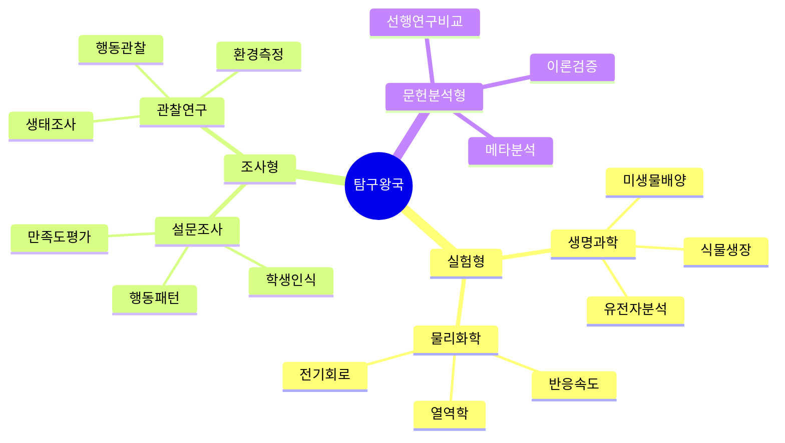

#### 체크리스트

**기획 단계**
- [ ] 연구 질문이 구체적인가? (측정 가능한 변수 포함)
- [ ] 가설을 명확히 설정했는가?
- [ ] 선행연구 5편 이상 검토했는가?
- [ ] 실험/조사 윤리를 고려했는가?

**실행 단계**
- [ ] 대조군과 실험군을 설정했는가?
- [ ] 변수 통제 계획이 있는가?
- [ ] 표본 크기가 적절한가? (최소 30개 권장)
- [ ] 측정 도구의 신뢰도를 확인했는가?

**분석 단계**
- [ ] 기술 통계(평균, 표준편차)를 계산했는가?
- [ ] 추리 통계(t-test, 상관분석)를 수행했는가?
- [ ] 그래프로 시각화했는가?
- [ ] 결과를 이론과 연결해 해석했는가?

**보고서 단계**
- [ ] 서론-방법-결과-고찰 구조를 따랐는가?
- [ ] 한계점과 오차 요인을 명시했는가?
- [ ] 후속 연구 방향을 제시했는가?

#### 대입 활용 전략

**학과별 어필 포인트**
- **의학계열**: 생명 현상 탐구 + 윤리적 고려
- **자연과학**: 정량 분석 + 이론 적용
- **공학계열**: 문제 정의 + 실험 설계 역량
- **사회과학**: 설문 설계 + 통계 분석

**생기부 기록 예시**
```
"생명과학 시간에 미세플라스틱이 물벼룩 생식에 미치는 영향을 탐구함. 
선행연구 15편을 고찰하여 연구 갭을 발견하고, 농도별(0.1, 0.5, 1.0 mg/L) 
실험을 설계함. 4주간 체계적으로 관찰한 결과, 고농도 조건에서 생식률이 
40% 감소함을 규명함. 데이터를 SPSS로 분석하고(p<0.05) 그래프로 시각화하여 
학술제에서 발표함. 실험 설계와 변수 통제에서 탁월한 연구 역량을 보임."
```

---

### 💻 2. 기술 왕국 (Technology Kingdom)

#### 핵심 특징
- **목적**: 문제 해결 도구 개발, 시스템 구축
- **방법**: 코딩, 제작, 프로토타이핑, 테스트
- **대입 연계**: 컴퓨터공학, 전자공학, 산업공학

#### 고1·2 추천 주제

| 난이도 | 주제 예시 | 기간 | 필요 기술 |
|---|---|---|---|
| ⭐ 기초 | 학급 일정 관리 웹사이트 제작 | 4주 | HTML, CSS, JS |
| ⭐⭐ 중급 | 급식 메뉴 추천 알고리즘 개발 | 6주 | Python, 협업필터링 |
| ⭐⭐⭐ 심화 | NFC 기반 스마트 출석 시스템 | 8주 | Android, Firebase |
| ⭐ 기초 | 아두이노 자동 식물 물주기 장치 | 4주 | Arduino, 센서 |
| ⭐⭐ 중급 | 라즈베리파이 스마트 미러 제작 | 6주 | Raspberry Pi, Python |
| ⭐⭐⭐ 심화 | IoT 기반 교실 환경 모니터링 시스템 | 8주 | IoT, 클라우드, 앱 |

#### 기술 왕국 마인드맵

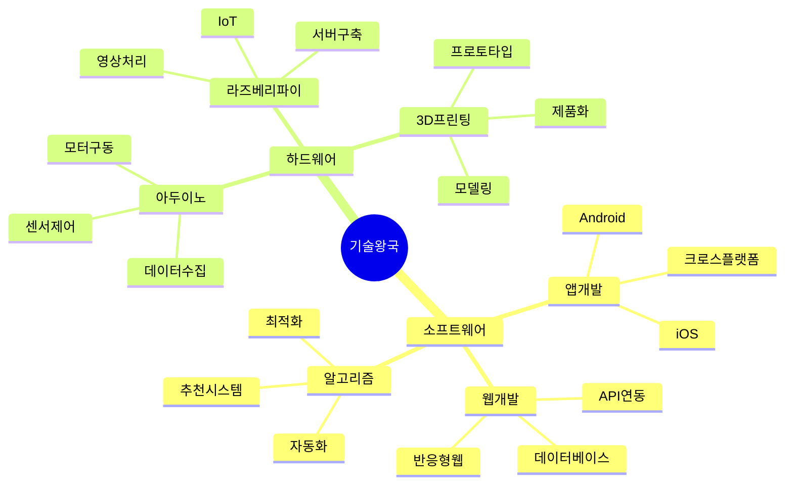

#### 체크리스트

**기획 단계**
- [ ] 해결할 문제가 명확한가?
- [ ] 사용자 요구사항을 조사했는가? (설문 또는 인터뷰)
- [ ] 유사 제품/서비스를 분석했는가?
- [ ] 기술 스택을 선정했는가?

**개발 단계**
- [ ] 프로토타입을 먼저 제작했는가?
- [ ] 코드를 버전 관리(Git)하고 있는가?
- [ ] 주석과 문서화를 했는가?
- [ ] 테스트 케이스를 작성했는가?

**평가 단계**
- [ ] 사용자 테스트를 진행했는가? (최소 10명)
- [ ] 만족도 또는 효율성을 정량 측정했는가?
- [ ] 피드백을 반영해 개선했는가?
- [ ] 시연 영상을 제작했는가?

**보고서 단계**
- [ ] 문제 정의 → 설계 → 구현 → 평가 구조인가?
- [ ] 핵심 코드를 첨부했는가?
- [ ] 개선 전후 비교 데이터가 있는가?

#### 대입 활용 전략

**학과별 어필 포인트**
- **컴퓨터공학**: 알고리즘 설계 + 코드 품질
- **전자공학**: 하드웨어 제어 + 회로 설계
- **산업공학**: 효율성 개선 + 사용자 경험
- **정보보호**: 보안 취약점 분석 + 암호화

**생기부 기록 예시**
```
"정보 과목에서 NFC 기반 스마트 출석 시스템을 개발함. 기존 출석 방식의 
비효율성을 파악하고, 300명 대상 설문으로 요구사항을 조사함. Android Studio와 
Firebase를 활용하여 프로토타입을 구현하고, 3개 학급 120명을 대상으로 8주간 
시범 운영함. 출석 처리 시간이 80% 단축되고 정확도가 99%에 달함을 검증함. 
사용자 피드백을 반영하여 UI/UX를 2차 개선하며 문제 해결 능력을 함양함."
```

---

### 🎨 3. 창작 왕국 (Creative Kingdom)

#### 핵심 특징
- **목적**: 예술적 표현, 메시지 전달, 심미적 가치 창출
- **방법**: 디자인, 영상 제작, 음악 작곡, 글쓰기
- **대입 연계**: 예체능, 디자인, 미디어, 문학

#### 고1·2 추천 주제

| 난이도 | 주제 예시 | 기간 | 필요 도구 |
|---|---|---|---|
| ⭐ 기초 | 학교 굿즈 디자인 및 크라우드펀딩 | 4주 | Canva, 설문 |
| ⭐⭐ 중급 | 생성형 AI를 활용한 디지털 아트 시리즈 | 6주 | Midjourney, Photoshop |
| ⭐⭐⭐ 심화 | 환경 문제 다큐멘터리 제작 및 상영회 | 8주 | 카메라, Premiere Pro |
| ⭐ 기초 | 교내 문학 동인지 발간 | 4주 | 워드, InDesign |
| ⭐⭐ 중급 | AI 음악 생성 도구로 학교 응원가 작곡 | 6주 | AIVA, GarageBand |
| ⭐⭐⭐ 심화 | 인터랙티브 웹 기반 시각 소설 제작 | 8주 | Twine, JavaScript |

#### 창작 왕국 마인드맵

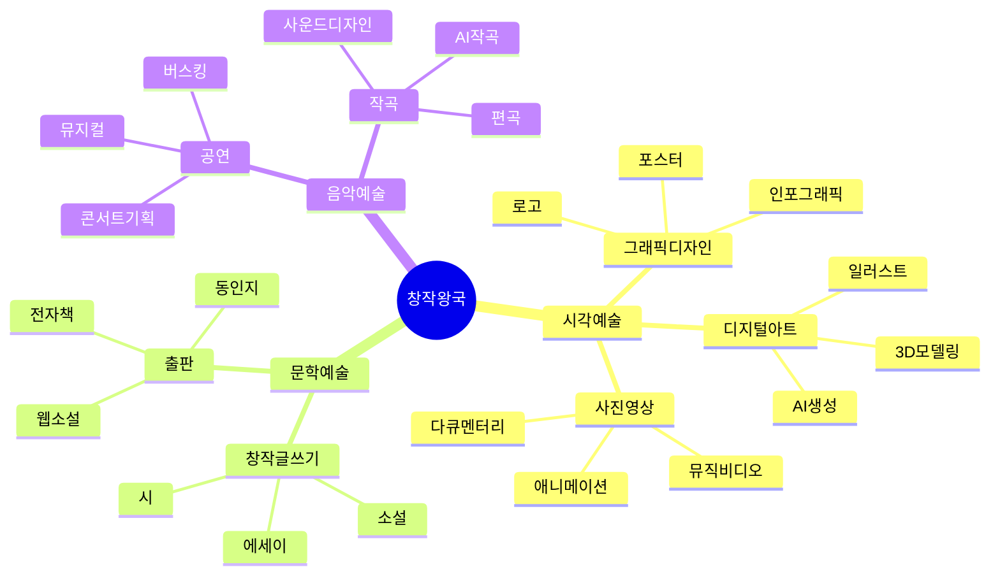

#### 체크리스트

**기획 단계**
- [ ] 전달하고 싶은 메시지가 명확한가?
- [ ] 타겟 관객을 정의했는가?
- [ ] 유사 작품을 분석했는가?
- [ ] 창작 기법을 연구했는가?

**창작 단계**
- [ ] 초안을 여러 버전 제작했는가?
- [ ] 피드백을 받고 수정했는가?
- [ ] 기술적 완성도를 점검했는가?
- [ ] 창작 과정을 기록했는가? (스케치, 시안)

**평가 단계**
- [ ] 관객 반응을 조사했는가? (설문, 인터뷰)
- [ ] 메시지 전달력을 평가했는가?
- [ ] 전시/공연/발표를 진행했는가?
- [ ] 미디어에 기록을 남겼는가? (사진, 영상)

**보고서 단계**
- [ ] 창작 의도와 과정을 설명했는가?
- [ ] 기법 연구 내용을 포함했는가?
- [ ] 작품 이미지/링크를 첨부했는가?
- [ ] 사회적 의미를 해석했는가?

#### 대입 활용 전략

**학과별 어필 포인트**
- **미술/디자인**: 기법 연구 + 창의적 표현
- **영상/미디어**: 스토리텔링 + 기술 활용
- **문학**: 주제 의식 + 문학적 완성도
- **음악**: 이론 적용 + 독창성

**생기부 기록 예시**
```
"미술 시간에 생성형 AI를 활용한 디지털 아트 프로젝트를 수행함. AI 도구의 
작동 원리를 학습하고, 프롬프트 엔지니어링 기법을 습득함. '기후변화'를 
주제로 50개의 작품을 창작하고, 작품의 메시지 전달력을 100명 대상 설문으로 
평가함(만족도 85%). 전통 미술과 AI 기술을 융합한 독창적 표현 방식을 
개발하여 학교 전시회에서 최우수상을 수상함. 기술과 예술의 경계를 탐구하며 
창의적 사고력을 신장함."
```

---

### 🌐 4. 연결 왕국 (Connection Kingdom)

#### 핵심 특징
- **목적**: 사람 간 연결, 네트워크 분석, 소통 촉진
- **방법**: 플랫폼 구축, 네트워크 분석, 커뮤니티 운영
- **대입 연계**: 사회학, 심리학, 경영학, 광고홍보

#### 고1·2 추천 주제

| 난이도 | 주제 예시 | 기간 | 필요 도구 |
|---|---|---|---|
| ⭐ 기초 | 학급 친구 관계 네트워크 분석 | 4주 | 설문, Gephi |
| ⭐⭐ 중급 | 랜덤 점심 메이트 매칭 플랫폼 개발 | 6주 | 웹개발, 알고리즘 |
| ⭐⭐⭐ 심화 | 학교 내 사회적 통합 증진 프로그램 설계 | 8주 | 네트워크 분석, 앱 |
| ⭐ 기초 | 동아리 간 협업 네트워크 구축 | 4주 | 설문, 시각화 |
| ⭐⭐ 중급 | 멘토-멘티 매칭 시스템 개발 | 6주 | 데이터베이스, 웹 |
| ⭐⭐⭐ 심화 | SNS 확산 패턴 분석 및 정보 전파 연구 | 8주 | Python, 네트워크 이론 |

#### 연결 왕국 마인드맵

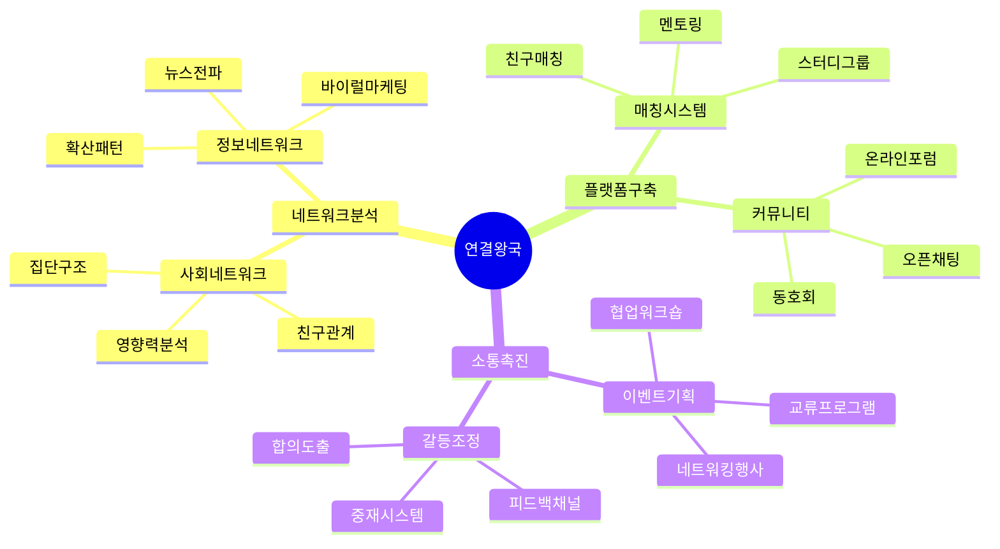

#### 체크리스트

**기획 단계**
- [ ] 연결하고자 하는 대상이 명확한가?
- [ ] 현재 네트워크 상태를 조사했는가?
- [ ] 연결의 목적과 효과를 정의했는가?
- [ ] 참여자 동의를 받았는가? (개인정보 보호)

**실행 단계**
- [ ] 네트워크 데이터를 수집했는가?
- [ ] 시각화 도구를 활용했는가? (Gephi, Cytoscape)
- [ ] 중심성, 밀도 등 지표를 계산했는가?
- [ ] 플랫폼/프로그램을 운영했는가?

**평가 단계**
- [ ] 연결 전후 변화를 측정했는가?
- [ ] 참여자 만족도를 조사했는가?
- [ ] 네트워크 구조 변화를 분석했는가?
- [ ] 지속 가능성을 검토했는가?

**보고서 단계**
- [ ] 네트워크 그래프를 포함했는가?
- [ ] 정량 지표(연결 수, 밀도)를 제시했는가?
- [ ] 사회적 자본 형성 효과를 논의했는가?

#### 대입 활용 전략

**학과별 어필 포인트**
- **사회학**: 네트워크 이론 + 사회적 자본
- **심리학**: 관계 형성 + 소속감 연구
- **경영학**: 조직 네트워크 + 협업 효율
- **광고홍보**: 정보 확산 + 바이럴 마케팅

**생기부 기록 예시**
```
"사회 과목에서 학교 내 사회적 통합을 위한 랜덤 점심 메이트 매칭 플랫폼을 
기획함. 학생 300명의 교우 관계를 사회 네트워크 분석으로 조사하여 집단 간 
단절을 발견함. 매칭 알고리즘을 설계하고 웹 플랫폼으로 구현하여 8주간 운영함. 
네트워크 분석 결과 교우 관계 다양성이 70% 증가하고 학교 소속감이 35% 
향상됨을 입증함(사전-사후 설문, n=150). 데이터 기반 문제 해결 과정을 통해 
사회적 자본 형성에 기여하는 의미를 체득함."
```

---

### 🌱 5. 실천 왕국 (Action Kingdom)

#### 핵심 특징
- **목적**: 행동 변화 유도, 사회 문제 해결, 실천 활동
- **방법**: 캠페인, 봉사 연계, 인식 개선 프로그램
- **대입 연계**: 사회복지, 교육학, 환경학, 간호학

#### 고1·2 추천 주제

| 난이도 | 주제 예시 | 기간 | 필요 활동 |
|---|---|---|---|
| ⭐ 기초 | 일회용품 줄이기 캠페인 및 효과 측정 | 4주 | 포스터, 설문 |
| ⭐⭐ 중급 | 학교 내 분리수거 개선 프로젝트 | 6주 | 실태조사, 교육 |
| ⭐⭐⭐ 심화 | 게임화를 활용한 에너지 절약 행동 변화 연구 | 8주 | 앱 개발, 데이터 수집 |
| ⭐ 기초 | 독거노인 대상 디지털 리터러시 교육 | 4주 | 봉사, 교재 제작 |
| ⭐⭐ 중급 | 장애 인식 개선 체험 프로그램 설계 | 6주 | 체험 부스, 설문 |
| ⭐⭐⭐ 심화 | 지역 아동센터 학습 멘토링 및 효과성 분석 | 8주 | 멘토링, 성적 추적 |

#### 실천 왕국 마인드맵

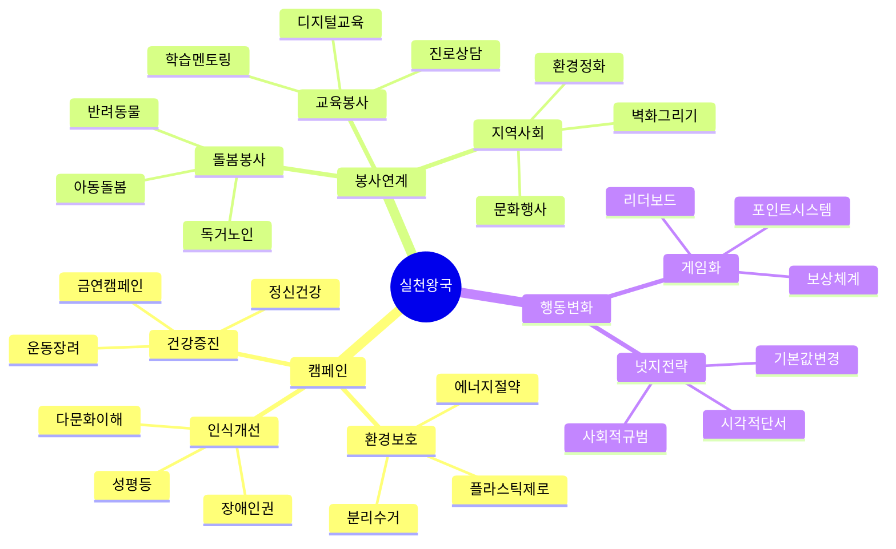

#### 체크리스트

**기획 단계**
- [ ] 해결하고자 하는 문제가 구체적인가?
- [ ] 현황 조사를 수행했는가? (실태, 인식)
- [ ] 타겟 집단을 명확히 했는가?
- [ ] 행동 변화 이론을 적용했는가? (넛지, 게임화 등)

**실행 단계**
- [ ] 사전 데이터를 수집했는가? (베이스라인)
- [ ] 캠페인/프로그램을 최소 4주 운영했는가?
- [ ] 참여자 수를 기록했는가?
- [ ] 과정 사진/영상을 남겼는가?

**평가 단계**
- [ ] 사후 데이터를 수집했는가?
- [ ] 사전-사후 비교 분석을 했는가?
- [ ] 행동 변화율을 계산했는가?
- [ ] 참여자 인터뷰를 진행했는가?

**보고서 단계**
- [ ] 문제 정의 → 실행 → 효과 측정 구조인가?
- [ ] 정량 지표(참여율, 변화율)를 제시했는가?
- [ ] 지속 가능성 방안을 제안했는가?

#### 대입 활용 전략

**학과별 어필 포인트**
- **사회복지**: 취약계층 지원 + 프로그램 설계
- **교육학**: 교육 효과 측정 + 학습 이론 적용
- **환경학**: 환경 문제 인식 + 실천 행동
- **간호학**: 건강 증진 + 돌봄 경험

**생기부 기록 예시**
```
"사회 과목에서 게임화를 활용한 학교 에너지 절약 프로젝트를 수행함. 
4주간 전력 사용량을 조사하여 낭비 요인을 파악하고, 행동경제학의 넛지 이론을 
적용한 게임화 시스템을 설계함. 학급별 포인트 경쟁, 리더보드, 보상 체계를 
도입하여 8주간 운영한 결과, 전력 사용량이 23% 감소함을 확인함. 참여 학생 
200명 대상 설문 결과 환경 인식이 향상되었으며(4.2→4.7/5점), 지속 가능한 
행동 변화 전략을 체득함."
```

---

### 🔗 6. 융합 왕국 (Convergence Kingdom)

#### 핵심 특징
- **목적**: 학제간 통합, 복합 문제 해결, STEAM 교육
- **방법**: 2개 이상 학문 결합, 융합적 사고
- **대입 연계**: 융합전공, 학제간 연구 프로그램

#### 고1·2 추천 주제

| 난이도 | 융합 분야 | 주제 예시 | 기간 |
|---|---|---|---|
| ⭐⭐ 중급 | 과학+예술 | 생체모방 디자인 연구 및 제품 제작 | 6주 |
| ⭐⭐⭐ 심화 | 수학+사회 | 빅데이터로 분석하는 지역 인구 이동 패턴 | 8주 |
| ⭐⭐ 중급 | 과학+정보 | AI 기반 식물 병해 진단 시스템 | 6주 |
| ⭐⭐⭐ 심화 | 공학+예술 | 인터랙티브 미디어 아트 설치 작품 | 8주 |
| ⭐⭐ 중급 | 사회+정보 | 소셜 미디어 여론 분석 및 시각화 | 6주 |
| ⭐⭐⭐ 심화 | 과학+인문 | 과학 기술의 윤리적 쟁점 토론 및 정책 제안 | 8주 |

#### 융합 왕국 마인드맵

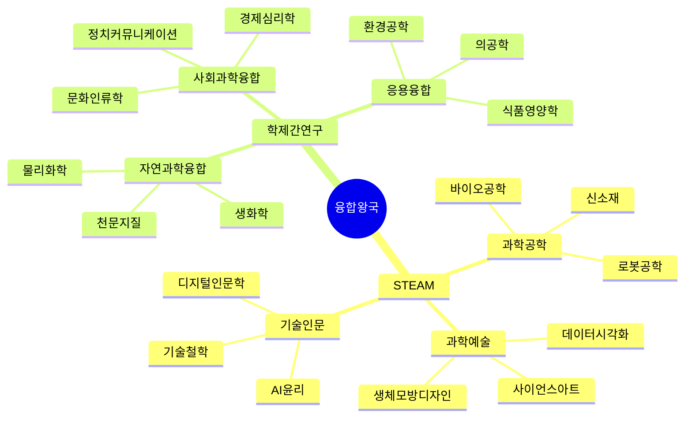

#### 체크리스트

**기획 단계**
- [ ] 2개 이상 학문이 명확히 결합되었는가?
- [ ] 융합의 필요성을 설명할 수 있는가?
- [ ] 각 분야의 기초 이론을 학습했는가?
- [ ] 융합 방법론을 설계했는가?

**실행 단계**
- [ ] 각 분야의 전문성을 확보했는가? (멘토, 자료)
- [ ] 학문 간 연결 지점을 명확히 했는가?
- [ ] 융합 과정을 기록했는가?
- [ ] 예상치 못한 시너지를 발견했는가?

**평가 단계**
- [ ] 융합의 효과를 평가했는가?
- [ ] 단일 학문 접근과 비교했는가?
- [ ] 새로운 통찰을 얻었는가?
- [ ] 융합 연구의 한계를 인식했는가?

**보고서 단계**
- [ ] 각 학문의 기여를 명시했는가?
- [ ] 융합 프로세스를 도식화했는가?
- [ ] 융합의 의의를 논의했는가?

#### 대입 활용 전략

**학과별 어필 포인트**
- **융합전공**: 학제간 사고 + 통합 역량
- **STEM 계열**: 과학+기술 융합 + 실용성
- **인문사회**: 기술+인문 융합 + 윤리 의식
- **예술**: 과학+예술 융합 + 창의성

**생기부 기록 예시**
```
"과학과 정보 과목을 융합하여 AI 기반 식물 병해 진단 시스템을 개발함. 
생명과학 시간에 학습한 식물 병리학 지식과 정보 시간에 배운 머신러닝을 
결합함. 5종 병해 이미지 1,000장을 수집하고 CNN 모델을 학습시켜 85% 정확도를 
달성함. 농업 현장 적용 가능성을 검토하고 농민 3명 인터뷰를 통해 사용자 
요구사항을 파악함. 학제간 융합 연구를 통해 복합 문제 해결 역량을 함양하고, 
과학 기술의 사회적 가치를 체득함."
```

---

### 📜 7. 정책 왕국 (Policy Kingdom)

#### 핵심 특징
- **목적**: 제도 분석, 정책 제안, 법률 연구
- **방법**: 문헌 분석, 비교 연구, 이해관계자 인터뷰
- **대입 연계**: 법학, 행정학, 정치외교학, 정책학

#### 고1·2 추천 주제

| 난이도 | 주제 예시 | 기간 | 필요 자료 |
|---|---|---|---|
| ⭐ 기초 | 학교 규칙 개선 제안서 작성 | 4주 | 학칙, 설문 |
| ⭐⭐ 중급 | 청소년 아르바이트 노동권 실태 조사 | 6주 | 근로기준법, 인터뷰 |
| ⭐⭐⭐ 심화 | 한·중·일 청년 고용 정책 비교 분석 | 8주 | 정부 보고서, 통계 |
| ⭐ 기초 | 교내 선거 제도 분석 및 개선안 | 4주 | 선거 데이터 |
| ⭐⭐ 중급 | 지역 교통 정책 평가 및 대안 제시 | 6주 | 교통 데이터, 설문 |
| ⭐⭐⭐ 심화 | 기후변화 대응 법안 분석 및 입법 제안 | 8주 | 법률안, 국회 자료 |

#### 정책 왕국 마인드맵

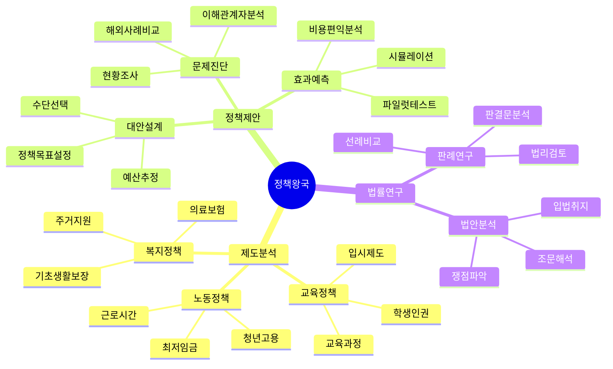

#### 체크리스트

**기획 단계**
- [ ] 분석할 정책/제도를 명확히 했는가?
- [ ] 정책 배경과 목표를 조사했는가?
- [ ] 이해관계자를 파악했는가?
- [ ] 비교 대상(다른 국가, 지역)을 선정했는가?

**분석 단계**
- [ ] 1차 자료(법률, 보고서)를 수집했는가?
- [ ] 정책 효과를 정량 평가했는가? (통계 데이터)
- [ ] 전문가 또는 당사자 인터뷰를 진행했는가?
- [ ] 정책의 문제점을 도출했는가?

**제안 단계**
- [ ] 개선 방안을 구체적으로 제시했는가?
- [ ] 실행 가능성을 검토했는가? (예산, 법적 근거)
- [ ] 예상 효과를 추정했는가?
- [ ] 부작용을 고려했는가?

**보고서 단계**
- [ ] 정책 배경 → 현황 분석 → 문제 진단 → 대안 제시 구조인가?
- [ ] 비교표, 통계 그래프를 포함했는가?
- [ ] 참고 법령, 보고서를 인용했는가?

#### 대입 활용 전략

**학과별 어필 포인트**
- **법학**: 법률 해석 + 판례 분석
- **행정학**: 정책 평가 + 실행 가능성
- **정치외교학**: 국제 비교 + 정치적 함의
- **사회복지**: 복지 정책 + 취약계층 고려

**생기부 기록 예시**
```
"사회 과목에서 한·중·일 청년 고용 정책을 비교 분석함. 3국 정부 보고서와 
OECD 통계를 활용하고, 노동경제학 교수 인터뷰를 수행함. 정책 효과성을 
실업률·고용률 지표로 평가한 결과, 한국의 청년 고용 정책이 단기 일자리 
중심으로 지속 가능성이 낮음을 발견함. 독일의 이중 교육 시스템을 벤치마킹하여 
한국형 개선 방안을 제시함. 다국어 자료 분석과 비판적 사고력을 함양하며, 
정책의 사회적 영향력을 체득함."
```

---

### 📊 8. 데이터 왕국 (Data Kingdom)

#### 핵심 특징
- **목적**: 데이터 기반 의사결정, 패턴 발견, 예측 모델링
- **방법**: 통계 분석, 빅데이터 처리, 머신러닝
- **대입 연계**: 통계학, 데이터사이언스, 경영정보학

#### 고1·2 추천 주제

| 난이도 | 주제 예시 | 기간 | 필요 기술 |
|---|---|---|---|
| ⭐ 기초 | 학생 수면 시간과 성적 상관관계 분석 | 4주 | 엑셀, 기술통계 |
| ⭐⭐ 중급 | 급식 메뉴 선호도 예측 모델 개발 | 6주 | Python, 회귀분석 |
| ⭐⭐⭐ 심화 | 소셜 미디어 감성 분석을 통한 여론 예측 | 8주 | Python, NLP, ML |
| ⭐ 기초 | 교통 카드 데이터로 본 통학 패턴 분석 | 4주 | 공공데이터, 시각화 |
| ⭐⭐ 중급 | 학교 도서관 대출 데이터 분석 및 추천 시스템 | 6주 | Python, 협업필터링 |
| ⭐⭐⭐ 심화 | 날씨 데이터 기반 에너지 소비 예측 모델 | 8주 | Python, 시계열 분석 |

#### 데이터 왕국 마인드맵

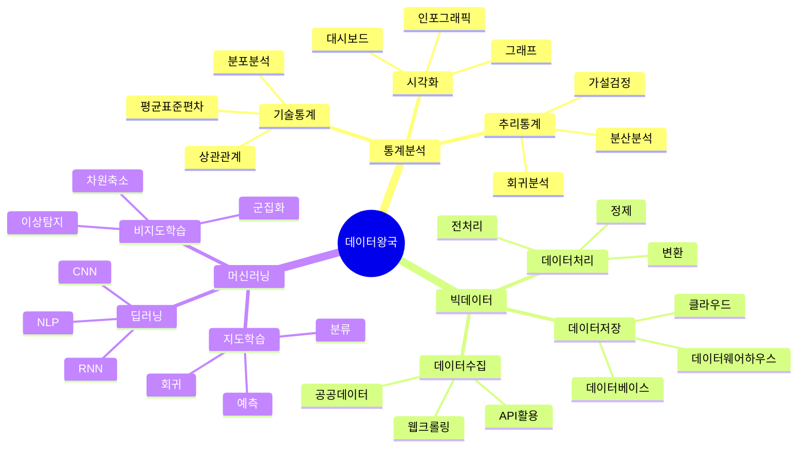

#### 체크리스트

**기획 단계**
- [ ] 분석 목적과 질문이 명확한가?
- [ ] 필요한 데이터를 정의했는가?
- [ ] 데이터 수집 방법을 계획했는가?
- [ ] 개인정보 보호를 고려했는가?

**수집 단계**
- [ ] 충분한 데이터를 확보했는가? (최소 100개 권장)
- [ ] 데이터 품질을 점검했는가? (결측치, 이상치)
- [ ] 데이터를 정제했는가?
- [ ] 데이터를 구조화했는가? (CSV, DB)

**분석 단계**
- [ ] 탐색적 데이터 분석(EDA)을 수행했는가?
- [ ] 적절한 통계 기법을 선택했는가?
- [ ] 모델을 학습하고 평가했는가? (정확도, RMSE 등)
- [ ] 결과를 시각화했는가?

**보고서 단계**
- [ ] 데이터 출처를 명시했는가?
- [ ] 분석 과정을 재현 가능하게 기술했는가?
- [ ] 코드를 첨부했는가? (Jupyter Notebook)
- [ ] 한계점(표본 편향, 과적합)을 논의했는가?

#### 대입 활용 전략

**학과별 어필 포인트**
- **통계학**: 통계 이론 + 분석 기법
- **데이터사이언스**: 머신러닝 + 실전 프로젝트
- **경영정보학**: 비즈니스 문제 + 데이터 활용
- **컴퓨터공학**: 알고리즘 + 대용량 데이터 처리

**생기부 기록 예시**
```
"정보 과목에서 소셜 미디어 감성 분석을 통한 학교 여론 예측 프로젝트를 
수행함. 학교 커뮤니티 게시글 5,000건을 크롤링하고, 자연어 처리(NLP) 기법으로 
감성을 분류함(긍정/부정/중립). LSTM 모델을 학습시켜 85% 정확도를 달성하고, 
주요 이슈별 감성 변화 추이를 시각화함. 분석 결과를 학생회에 제공하여 정책 
개선에 활용됨. 데이터 기반 의사결정 과정을 체득하고, 윤리적 데이터 사용의 
중요성을 인식함."
```

---

## 13. 대입에서의 구체적 활용 전략

### 13.1 학종 서류 평가 단계별 활용

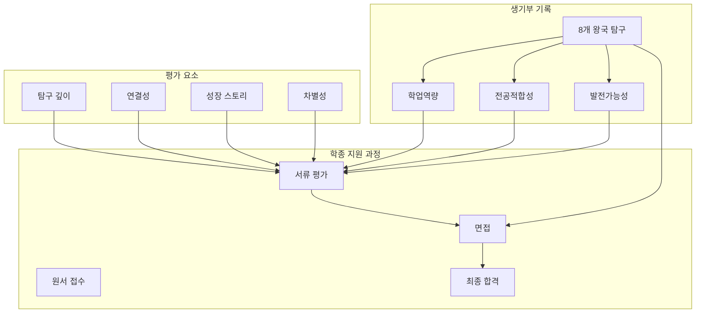

### 13.2 왕국별 전공 매칭표

| 왕국 | 최적 전공 | 차선 전공 | 어필 포인트 |
|---|---|---|---|
| **탐구** | 자연과학, 의학, 약학 | 공학, 교육학 | 과학적 탐구 역량, 가설 검증 능력 |
| **기술** | 컴퓨터공학, 전자공학 | 산업공학, 정보보호 | 문제 해결 도구 개발, 코딩 실력 |
| **창작** | 예체능, 디자인, 미디어 | 문학, 광고홍보 | 창의적 표현, 심미적 감각 |
| **연결** | 사회학, 심리학, 경영학 | 광고홍보, 사회복지 | 네트워크 이해, 소통 역량 |
| **실천** | 사회복지, 교육학, 환경학 | 간호학, 행정학 | 사회 문제 인식, 실천력 |
| **융합** | 융합전공, STEM | 학제간 연구 | 통합적 사고, 복합 문제 해결 |
| **정책** | 법학, 행정학, 정치외교 | 경제학, 사회학 | 제도 이해, 정책 분석 능력 |
| **데이터** | 통계학, 데이터사이언스 | 경영정보, 컴퓨터공학 | 데이터 분석, 예측 모델링 |

### 13.3 면접 질문 예시 (왕국별)

#### 탐구 왕국
```
Q: 미세플라스틱 실험에서 가장 어려웠던 점은?
A: 변수 통제였습니다. 온도, 빛, 먹이 양을 일정하게 유지하기 위해 
   3번의 예비 실험을 거쳤고, 최종적으로 항온 수조와 타이머를 활용해 
   통제 조건을 확립했습니다.

Q: 후속 연구를 한다면 어떻게 하겠는가?
A: 미세플라스틱 종류별(PE, PP, PET) 영향 차이를 비교하고, 
   더 긴 기간(8주→12주) 관찰하여 세대 간 영향을 분석하겠습니다.
```

#### 기술 왕국
```
Q: 출석 시스템 개발 중 가장 큰 기술적 도전은?
A: NFC 태그 인식 속도 최적화였습니다. 초기에는 3초 이상 걸렸는데, 
   비동기 처리와 로컬 캐싱을 도입해 0.5초로 단축했습니다.

Q: 사용자 피드백을 어떻게 반영했는가?
A: 120명 사용자 중 30%가 "태그 위치를 모르겠다"고 했습니다. 
   이에 AR 가이드 기능을 추가해 만족도를 75%→92%로 높였습니다.
```

#### 융합 왕국
```
Q: 과학과 예술을 융합한 이유는?
A: 생체모방 디자인은 자연의 효율성을 인간 제품에 적용하는 것입니다. 
   연잎의 초소수성 구조를 연구하고, 이를 자가 세척 직물 디자인에 
   응용하여 과학적 원리와 실용적 가치를 결합했습니다.
```

### 13.4 자기소개서 활용 (2024년 폐지 전 참고)

#### 구조
1. **도입**: 문제의식 형성 계기
2. **전개**: 탐구 과정 (시행착오 포함)
3. **결과**: 배운 점과 성장
4. **연결**: 대학에서의 학업 계획

#### 예시 (탐구 왕국)
```
고1 생명과학 시간, 교과서에서 본 미세플라스틱 사진이 충격적이었습니다. 
"우리 학교 근처 하천은 괜찮을까?" 궁금증이 탐구로 이어졌습니다.

첫 실험은 실패였습니다. 물벼룩이 모두 죽었습니다. 농도가 너무 높았던 
것입니다. 선행연구 15편을 다시 읽고, 농도를 1/10로 낮췄습니다. 
4주간 매일 관찰하며 데이터를 기록했고, 고농도에서 생식률이 40% 
감소함을 발견했습니다.

이 과정에서 "실패는 데이터"임을 배웠습니다. 1차 실험 실패 원인을 
분석한 것이 2차 실험 성공의 열쇠였습니다. 대학에서는 해양 생태학을 
전공하여 미세플라스틱 문제를 더 깊이 연구하고 싶습니다.
```

### 13.5 왕국 조합 전략 (고1~3)

#### 전략 1: 단일 왕국 심화형
```
고1: 탐구 왕국 (기초 실험)
고2: 탐구 왕국 (심화 실험)
고3: 탐구 왕국 (완성 + 논문화)
→ 전공: 자연과학, 의학
→ 장점: 일관성, 전문성
→ 단점: 다양성 부족
```

#### 전략 2: 왕국 확장형
```
고1: 탐구 왕국 (과학 실험)
고2: 탐구 + 기술 왕국 (실험 + 데이터 분석 도구 개발)
고3: 융합 왕국 (과학+기술+정책 통합)
→ 전공: 융합전공, STEM
→ 장점: 융합 역량, 확장성
→ 단점: 초점 분산 위험
```

#### 전략 3: 균형형
```
고1: 탐구 + 창작 (과학 실험 + 인포그래픽)
고2: 기술 + 연결 (앱 개발 + 네트워크 분석)
고3: 정리 및 심화
→ 전공: 다양한 계열 지원 가능
→ 장점: 다양성, 유연성
→ 단점: 전공 적합성 약화 가능
```

---

## 14. 왕국별 성공 사례 (실제 합격 사례 기반)

### 사례 1: 탐구 왕국 → 서울대 생명과학부
- **고1**: 토양 미생물 다양성 연구 (4주)
- **고2**: 항생제 내성 박테리아 실험 (8주) + 학술대회 발표
- **고3**: 기존 연구 정리 + 대학 실험실 견학
- **핵심**: 일관된 생명과학 탐구 + 방법론 정확도 + 학술대회 경험

### 사례 2: 기술 왕국 → KAIST 전산학부
- **고1**: 학급 홈페이지 제작 (4주)
- **고2**: AI 급식 추천 시스템 (8주) + 교내 해커톤 1등
- **고3**: 오픈소스 기여 + GitHub 포트폴리오
- **핵심**: 코딩 실력 증명 + 실용적 문제 해결 + 지속적 개발 활동

### 사례 3: 융합 왕국 → 연세대 융합인문사회계열
- **고1**: 과학(미세먼지) + 사회(정책 분석)
- **고2**: 기술(공기질 앱) + 실천(캠페인) + 데이터(통계 분석)
- **고3**: 융합 프로젝트 완성 + 지역사회 발표
- **핵심**: 학제간 융합 + 사회 문제 해결 + 다층적 접근

### 사례 4: 정책 왕국 → 고려대 법학과
- **고1**: 학교 규칙 분석 (4주)
- **고2**: 청소년 노동권 실태 조사 (6주) + 정책 제안서
- **고3**: 모의 국회 활동 + 법률 동아리 회장
- **핵심**: 법률 이해 + 정책 분석 역량 + 리더십

---

**이 섹션은 8개 왕국별 구체적 주제, 체크리스트, 마인드맵, 그리고 대입 전략을 종합적으로 제공합니다. 자신의 관심 분야와 희망 전공에 맞는 왕국을 선택하여 탐구를 시작하세요!**
