# 10개 학교 유형별 탐구 전략 및 시간 관리 완전 가이드

> 학교 유형별 특수성, 강점, 약점 분석 + 수능 병행 시간 관리 전략

**마지막 업데이트:** 2026년 3월 16일

---

## 📋 목차

1. [10개 학교 유형 전체 지도](#1-10개-학교-유형-전체-지도)
2. [학교 유형별 상세 분석](#2-학교-유형별-상세-분석)
3. [고1·2 단계별 탐구 로드맵](#3-고12-단계별-탐구-로드맵)
4. [동아리 활용 전략](#4-동아리-활용-전략)
5. [수능 병행 시간 관리](#5-수능-병행-시간-관리)
6. [학교 유형별 성공 사례](#6-학교-유형별-성공-사례)

---

## 1. 10개 학교 유형 전체 지도

### 1.1 학교 유형 분류 체계

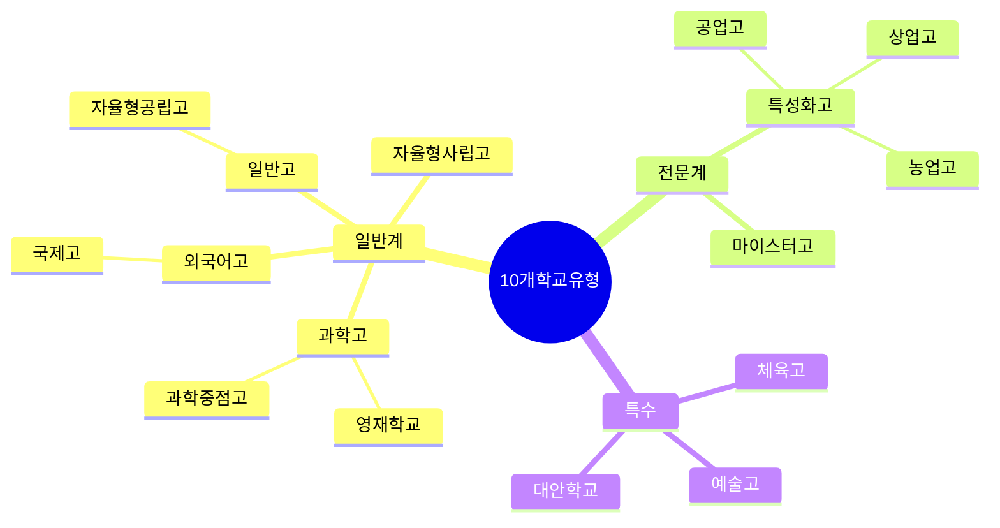

### 1.2 학교 유형별 한눈에 비교

| 학교 유형 | 학생 수 | 탐구 강도 | 수능 부담 | 경쟁 강도 | 대입 주력 전형 |
|---|---|---|---|---|---|
| 🔬 **과학고/영재학교** | 전국 ~5천명 | ⭐⭐⭐⭐⭐ | ⭐⭐ | ⭐⭐⭐⭐⭐ | 학종(과학기술원) |
| 🌐 **외고/국제고** | 전국 ~1만명 | ⭐⭐⭐⭐ | ⭐⭐⭐ | ⭐⭐⭐⭐⭐ | 학종(인문사회) |
| 🏫 **자사고** | 전국 ~3만명 | ⭐⭐⭐⭐ | ⭐⭐⭐⭐ | ⭐⭐⭐⭐ | 학종+수능 |
| 📚 **일반고** | 전국 ~100만명 | ⭐⭐⭐ | ⭐⭐⭐⭐⭐ | ⭐⭐⭐ | 수능+학종 |
| 🔧 **특성화고** | 전국 ~20만명 | ⭐⭐ | ⭐ | ⭐⭐ | 취업+특별전형 |
| ⚙️ **마이스터고** | 전국 ~1만명 | ⭐⭐ | ⭐ | ⭐⭐⭐ | 취업 |
| 🎨 **예술고** | 전국 ~5천명 | ⭐⭐⭐ | ⭐⭐ | ⭐⭐⭐⭐ | 실기+학종 |
| ⚽ **체육고** | 전국 ~3천명 | ⭐⭐ | ⭐ | ⭐⭐⭐ | 실기+특기자 |
| 🌱 **대안학교** | 전국 ~1만명 | ⭐⭐⭐ | ⭐⭐ | ⭐⭐ | 학종 |
| 🏛️ **자공고** | 전국 ~10만명 | ⭐⭐⭐ | ⭐⭐⭐⭐ | ⭐⭐⭐ | 수능+학종 |

---

## 2. 학교 유형별 상세 분석

### 🔬 1. 과학고/영재학교

#### 기본 정보
- **학생 수**: 전국 약 5,000명
- **입학**: 중3 과학/수학 시험 + 면접
- **특징**: 이공계 영재 교육, R&E 필수

#### 탐구 환경

**강점** ✅
- 전문 실험 장비 완비 (대학 수준)
- 대학 연구실 연계 프로그램
- 교사 대부분 석·박사 학위 소지
- R&E(Research & Education) 필수 이수
- 학술대회 참가 기회 많음

**약점** ❌
- 경쟁 매우 치열 (상위 1% 학생들)
- 탐구 수준 높아 부담 큼
- 수학·과학 외 교과 상대적 약함
- 인문사회 탐구 기회 제한적

#### 탐구 특수성

**R&E 프로그램**
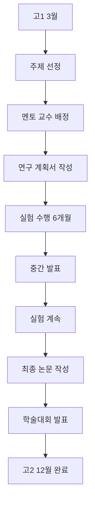

**고1·2 탐구 로드맵**
- **고1 1학기**: R&E 주제 탐색, 선행연구 조사
- **고1 여름**: R&E 본격 시작, 예비 실험
- **고1 2학기**: 본 실험 수행, 데이터 수집
- **고1 겨울**: 중간 발표, 실험 보완
- **고2 1학기**: 실험 완료, 논문 작성
- **고2 여름**: 학술대회 발표 (한국과학창의재단 등)
- **고2 2학기**: 추가 탐구 (선택), 대입 준비

#### 동아리 활용
- **학술 동아리**: 물리, 화학, 생물, 수학 분야별
- **프로젝트 동아리**: 로봇, 코딩, 메이커
- **특징**: 동아리도 연구 수준 높음

#### 시간 관리 (수능 병행)
```
평일 일과 (고2 기준)
06:00-07:00 기상, 아침 식사
07:00-16:00 정규 수업 (9시간)
16:00-18:00 R&E 실험 (2시간)
18:00-19:00 저녁 식사
19:00-22:00 자율학습 (수능 공부 3시간)
22:00-23:00 R&E 논문 작성 (1시간)
23:00-06:00 수면 (7시간)
```

**수능 부담**: 낮음 (과학기술원은 수능 최저 없음)

#### 성공 전략
1. **R&E 주제를 전공과 직결**: KAIST, GIST, DGIST 지원 시 유리
2. **학술대회 수상**: 한국과학창의재단, 한국물리학회 등
3. **논문 투고**: 고교생 대상 학술지 (선택)
4. **방법론 정확도**: 통계 분석, 오차 분석 철저

#### 실제 사례
- **학생 A (과학고 → KAIST 물리학과)**
  - R&E: 양자점 합성 및 광학 특성 연구 (12개월)
  - 학술대회: 한국물리학회 고등학생 부문 우수상
  - 추가 탐구: 물리 올림피아드 준비
  - 수능: 최저 없어 최소한만 준비

---

### 🌐 2. 외고/국제고

#### 기본 정보
- **학생 수**: 전국 약 10,000명
- **입학**: 중3 영어 내신 + 면접
- **특징**: 외국어·국제 이슈 중심 교육

#### 탐구 환경

**강점** ✅
- 다국어 자료 접근 용이 (영어, 제2외국어)
- 국제 이슈, 정책 분석 강점
- 토론, 발표 기회 많음
- 해외 교류 프로그램 풍부
- 모의 UN, 국제회의 참가

**약점** ❌
- 이공계 실험 장비 부족
- 정량 연구보다 정성 연구 중심
- 수능 부담 큼 (국어, 수학, 탐구)
- 경쟁 치열 (상위권 대학 집중)

#### 탐구 특수성

**정책 분석 중심**
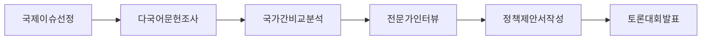

**고1·2 탐구 로드맵**
- **고1 1학기**: 국제 이슈 탐색, 영어 논문 읽기
- **고1 여름**: 해외 자료 수집, 비교 분석
- **고1 2학기**: 정책 분석 보고서 작성
- **고1 겨울**: 모의 UN 준비
- **고2 1학기**: 심화 정책 연구, 전문가 인터뷰
- **고2 여름**: 토론대회, 학술제 발표
- **고2 2학기**: 수능 집중 (탐구 최소화)

#### 동아리 활용
- **모의 UN**: 국제 이슈 토론
- **토론 동아리**: 정책 토론, 디베이트
- **언어 동아리**: 제2외국어 신문 읽기
- **국제교류**: 자매결연 학교 프로젝트

#### 시간 관리 (수능 병행)
```
평일 일과 (고2 기준)
06:00-07:00 기상, 아침 식사
07:00-16:00 정규 수업 (9시간)
16:00-18:00 동아리/탐구 (2시간)
18:00-19:00 저녁 식사
19:00-23:00 자율학습 (수능 공부 4시간)
23:00-24:00 탐구 보고서 작성 (1시간)
24:00-06:00 수면 (6시간)
```

**수능 부담**: 높음 (수능 최저 충족 필수)

#### 성공 전략
1. **다국어 자료 활용**: 영어 논문, 국제기구 보고서
2. **국가 간 비교**: 한국 vs 미국 vs 유럽 정책 비교
3. **전문가 인터뷰**: 대학 교수, 외교관, NGO 활동가
4. **토론 경험**: 모의 UN, 토론대회 수상

#### 실제 사례
- **학생 B (외고 → 서울대 정치외교학부)**
  - 탐구 1: 한·중·일 청년 고용 정책 비교 (8주)
  - 탐구 2: 난민 정책 국제 비교 및 한국 개선안 (10주)
  - 탐구 3: 모의 UN 기후변화 의장국 역할 (6개월)
  - 수능: 국어 1등급, 수학 2등급, 사탐 1등급

---

### 🏫 3. 자율형 사립고 (자사고)

#### 기본 정보
- **학생 수**: 전국 약 30,000명
- **입학**: 추첨 또는 선발 (지역마다 다름)
- **특징**: 자율적 교육과정, 다양한 프로그램

#### 탐구 환경

**강점** ✅
- 다양한 탐구 프로그램 운영
- 대학 연계 프로그램 풍부
- 장기 프로젝트 지원
- 융합 탐구 기회 많음
- 교사 열정 높음

**약점** ❌
- 학생 간 경쟁 매우 치열
- 수능 부담 큼 (내신+수능 병행)
- 프로그램 많아 선택 어려움
- 비용 부담 (등록금 높음)

#### 탐구 특수성

**융합 프로젝트 중심**
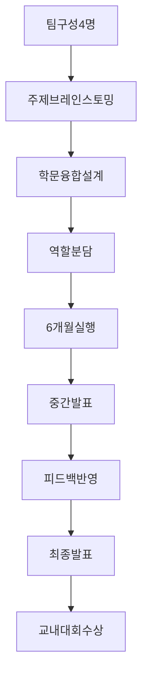

**고1·2 탐구 로드맵**
- **고1 1학기**: 다양한 분야 탐색 (과학, 인문, 예술)
- **고1 여름**: 융합 프로젝트 시작
- **고1 2학기**: 프로젝트 중간 발표, 개선
- **고1 겨울**: 프로젝트 완성, 교내 대회
- **고2 1학기**: 전공 관련 심화 탐구
- **고2 여름**: 대외 대회 참가
- **고2 2학기**: 수능 집중 (탐구 정리)

#### 동아리 활용
- **융합 동아리**: STEAM, 과학+예술
- **사회 문제 해결**: 지역사회 프로젝트
- **창업 동아리**: 비즈니스 모델 개발
- **학술 동아리**: 분야별 심화 연구

#### 시간 관리 (수능 병행)
```
평일 일과 (고2 기준)
06:00-07:00 기상, 아침 식사
07:00-17:00 정규 수업 (10시간, 야간 자율학습 포함)
17:00-18:00 저녁 식사
18:00-20:00 동아리/탐구 (2시간)
20:00-23:00 자율학습 (수능 공부 3시간)
23:00-24:00 탐구 정리 (1시간)
24:00-06:00 수면 (6시간)
```

**수능 부담**: 매우 높음 (내신+수능 모두 중요)

#### 성공 전략
1. **차별화 주제**: 다른 학생과 겹치지 않는 독특한 주제
2. **장기 프로젝트**: 6개월~1년 단위 깊이 있는 탐구
3. **융합 역량**: 2개 이상 학문 결합
4. **대외 활동**: 교내에서 끝나지 않고 대외 대회 도전

#### 실제 사례
- **학생 C (자사고 → 연세대 융합인문사회)**
  - 탐구 1: 과학(미세먼지) + 사회(정책) 융합 (8주)
  - 탐구 2: 기술(공기질 앱) + 실천(캠페인) (12주)
  - 탐구 3: 데이터(통계 분석) + 정책(제안서) (10주)
  - 수능: 국어 1등급, 수학 1등급, 사탐 1등급

---

### 📚 4. 일반고

#### 기본 정보
- **학생 수**: 전국 약 1,000,000명 (가장 많음)
- **입학**: 거주지 배정
- **특징**: 가장 일반적인 고등학교

#### 탐구 환경

**강점** ✅
- 다양한 배경의 학생 (다양성)
- 지역 문제 탐구 용이
- 교사와 1:1 소통 가능 (학교에 따라)
- 수능 중심 커리큘럼 (수능 대비 유리)

**약점** ❌
- 탐구 프로그램 제한적
- 실험 장비 부족
- 교사 1인당 학생 수 많음
- 탐구 시간 확보 어려움
- 수능 부담 매우 큼

#### 탐구 특수성

**교과 수행평가 확장형**
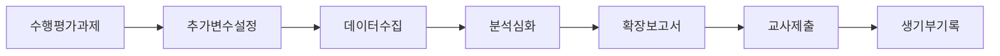

**고1·2 탐구 로드맵**
- **고1 1학기**: 교과 수행평가 1개 확장
- **고1 여름**: 자율 동아리 탐구 1개
- **고1 2학기**: 교과 수행평가 1개 확장
- **고1 겨울**: 탐구 정리, 포트폴리오
- **고2 1학기**: 전공 관련 탐구 2개
- **고2 여름**: 동아리 프로젝트 1개
- **고2 2학기**: 수능 집중 (탐구 중단)

#### 동아리 활용
- **자율 동아리**: 3~5명 소규모, 관심사 중심
- **정규 동아리**: 학교 공식 동아리
- **온라인 동아리**: Zoom 활용 전국 학생 연결
- **지역 연계**: 지역 도서관, 과학관 협력

#### 시간 관리 (수능 병행)
```
평일 일과 (고2 기준)
06:00-07:00 기상, 아침 식사
07:00-16:00 정규 수업 (9시간)
16:00-17:00 동아리 (1시간, 주 2회)
17:00-18:00 저녁 식사
18:00-23:00 자율학습 (수능 공부 5시간)
23:00-24:00 탐구 (주 3회, 1시간)
24:00-06:00 수면 (6시간)
```

**수능 부담**: 매우 높음 (수능이 대입의 핵심)

#### 성공 전략
1. **효율성**: 수행평가를 탐구로 확장 (시간 절약)
2. **온라인 자원**: 구글 스칼라, 공공데이터 활용
3. **지역 특화**: 우리 동네 문제 해결
4. **교사 소통**: 초반에 계획 공유, 피드백 받기

#### 실제 사례
- **학생 D (일반고 → 고려대 생명과학부)**
  - 탐구 1: 생명과학 수행평가 확장 (토양 미생물, 4주)
  - 탐구 2: 동아리 실험 (미세플라스틱, 6주)
  - 탐구 3: 수학 통계 프로젝트 (학생 데이터 분석, 4주)
  - 수능: 국어 2등급, 수학 1등급, 과탐 1등급

---

### 🔧 5. 특성화고

#### 기본 정보
- **학생 수**: 전국 약 200,000명
- **입학**: 중학교 내신 + 면접
- **특징**: 직업 교육 중심, 취업 목표

#### 탐구 환경

**강점** ✅
- 실무 중심 프로젝트
- 산업체 연계 기회
- 제작, 실습 장비 풍부
- 현장 실습 경험
- 취업 후 대학 진학 가능

**약점** ❌
- 학술적 탐구 기회 적음
- 수능 준비 부족
- 이론 교육 약함
- 대입 경쟁력 낮음 (일반 전형)

#### 탐구 특수성

**제작 프로젝트 중심**
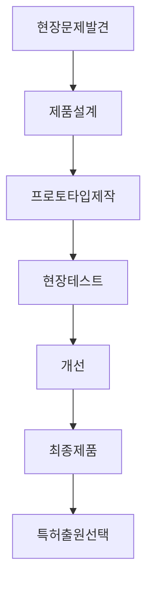

**고1·2 탐구 로드맵**
- **고1 1학기**: 기초 실습, 기능 습득
- **고1 여름**: 소규모 제작 프로젝트
- **고1 2학기**: 팀 프로젝트 참여
- **고1 겨울**: 기능 대회 준비
- **고2 1학기**: 현장 실습 연계 프로젝트
- **고2 여름**: 산업체 협력 프로젝트
- **고2 2학기**: 취업 준비 또는 대입 준비

#### 동아리 활용
- **기능 동아리**: 용접, 목공, 전기 등
- **창업 동아리**: 아이디어 사업화
- **봉사 동아리**: 기술 재능 기부

#### 시간 관리
```
평일 일과 (고2 기준)
06:00-07:00 기상, 아침 식사
07:00-16:00 정규 수업 + 실습 (9시간)
16:00-18:00 동아리/프로젝트 (2시간)
18:00-19:00 저녁 식사
19:00-21:00 자율학습 (2시간)
21:00-22:00 프로젝트 정리 (1시간)
22:00-06:00 수면 (8시간)
```

**수능 부담**: 낮음 (취업 중심)

#### 성공 전략
1. **실용성**: 산업 현장에 바로 적용 가능한 제품
2. **특허 출원**: 아이디어를 지식재산권으로 보호
3. **기능 대회**: 지방/전국 기능경기대회 수상
4. **특별 전형**: 대학 특성화고 전형 활용

#### 실제 사례
- **학생 E (공업고 → 한양대 공학계열 특별전형)**
  - 프로젝트 1: 스마트 팩토리 자동화 시스템 (6개월)
  - 프로젝트 2: 3D 프린터 활용 맞춤형 제품 (4개월)
  - 수상: 전국 기능경기대회 은메달
  - 특허: 실용신안 1건

---

### ⚙️ 6. 마이스터고

#### 기본 정보
- **학생 수**: 전국 약 10,000명
- **입학**: 경쟁률 높음 (3:1~5:1)
- **특징**: 최고 수준 직업 교육, 대기업 취업

#### 탐구 환경

**강점** ✅
- 최신 산업 장비
- 대기업 연계 프로젝트
- 취업률 90% 이상
- 장학금 지원 (학비 무료)
- 현장 맞춤형 교육

**약점** ❌
- 대학 진학 어려움 (취업 후 가능)
- 학술 탐구 기회 적음
- 이론 교육 부족

#### 탐구 특수성

**산업체 프로젝트**
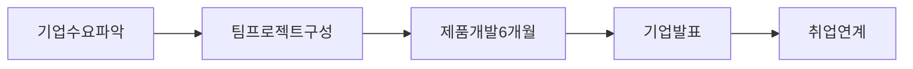

**고1·2 탐구 로드맵**
- **고1**: 기초 기능 습득, 자격증 취득
- **고2**: 산업체 프로젝트, 현장 실습
- **고3**: 취업 준비, 기업 연계 프로젝트

#### 성공 전략
1. **기업 맞춤형**: 취업 목표 기업의 요구 기술 습득
2. **자격증**: 국가기술자격증 다수 취득
3. **프로젝트 포트폴리오**: 실무 프로젝트 경험 축적

---

### 🎨 7. 예술고

#### 기본 정보
- **학생 수**: 전국 약 5,000명
- **입학**: 실기 시험 + 내신
- **특징**: 음악, 미술, 무용 전문 교육

#### 탐구 환경

**강점** ✅
- 전문 예술 교육
- 창작 프로젝트 중심
- 전시, 공연 기회 많음
- 예술 이론 + 실기 병행

**약점** ❌
- 학술 탐구 기회 적음
- 수능 부담 (예체능 입시는 실기 중심)
- 일반 교과 약함

#### 탐구 특수성

**창작 프로젝트**
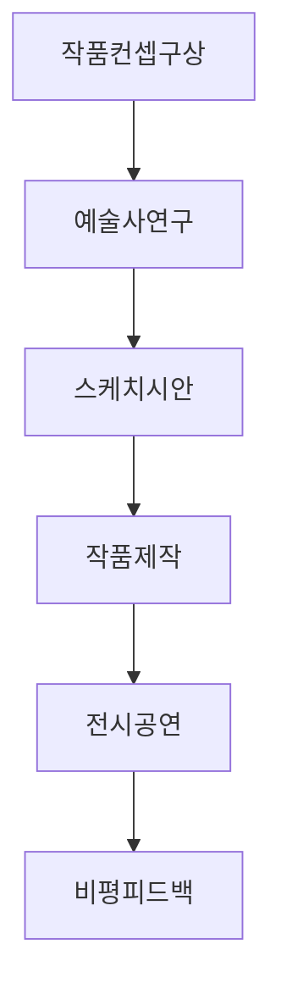

**고1·2 탐구 로드맵**
- **고1**: 기초 기법 습득, 작품 제작
- **고2**: 개인전/공연 준비, 포트폴리오
- **고3**: 입시 실기 준비

#### 성공 전략
1. **작품 연구**: 예술사, 기법 연구 병행
2. **전시/공연**: 대외 활동 경험
3. **융합**: 과학+예술, 기술+예술 융합

---

### ⚽ 8. 체육고

#### 기본 정보
- **학생 수**: 전국 약 3,000명
- **입학**: 체육 실기 + 내신
- **특징**: 운동 선수 양성

#### 탐구 환경

**강점** ✅
- 전문 체육 시설
- 전문 코치 지도
- 대회 참가 기회

**약점** ❌
- 학술 탐구 시간 부족
- 운동 훈련 중심
- 일반 교과 약함

#### 탐구 특수성

**스포츠 과학 연구**
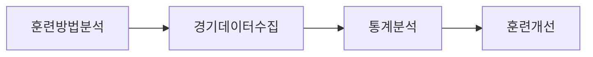

**고1·2 탐구 로드맵**
- **고1**: 기초 체력, 기술 훈련
- **고2**: 대회 참가, 경기 분석
- **고3**: 입시 준비 (체육 특기자)

#### 성공 전략
1. **스포츠 과학**: 훈련 데이터 분석
2. **부상 예방**: 재활 운동 연구
3. **대회 수상**: 전국 대회 입상

---

### 🌱 9. 대안학교

#### 기본 정보
- **학생 수**: 전국 약 10,000명
- **입학**: 학교마다 다름 (면접 중심)
- **특징**: 자유로운 교육, 프로젝트 중심

#### 탐구 환경

**강점** ✅
- 자유로운 주제 선택
- 장기 프로젝트 가능
- 학생 주도 학습
- 창의적 탐구 장려

**약점** ❌
- 학력 인정 문제 (일부)
- 수능 준비 부족
- 체계적 지도 부족 가능

#### 탐구 특수성

**자유 프로젝트**
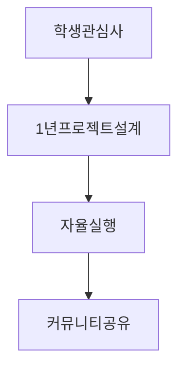

**고1·2 탐구 로드맵**
- 학생 주도로 자유롭게 설계
- 1년 단위 장기 프로젝트 가능

#### 성공 전략
1. **독창성**: 남들과 다른 독특한 주제
2. **장기 프로젝트**: 깊이 있는 탐구
3. **학종 집중**: 수능보다 학종 유리

---

### 🏛️ 10. 자율형 공립고 (자공고)

#### 기본 정보
- **학생 수**: 전국 약 100,000명
- **입학**: 거주지 배정 또는 선발
- **특징**: 일반고와 자사고 중간

#### 탐구 환경

**강점** ✅
- 일반고보다 프로그램 다양
- 자사고보다 경쟁 덜함
- 수능 준비 체계적

**약점** ❌
- 자사고만큼 자원 풍부하지 않음
- 학교마다 편차 큼

#### 탐구 특수성
- 일반고와 유사하지만 프로그램 더 다양

**고1·2 탐구 로드맵**
- 일반고 로드맵 + 추가 프로그램 활용

#### 성공 전략
- 일반고 전략 + 학교 특색 프로그램 활용

---

## 3. 고1·2 단계별 탐구 로드맵

### 3.1 학교 유형별 고1 로드맵 비교

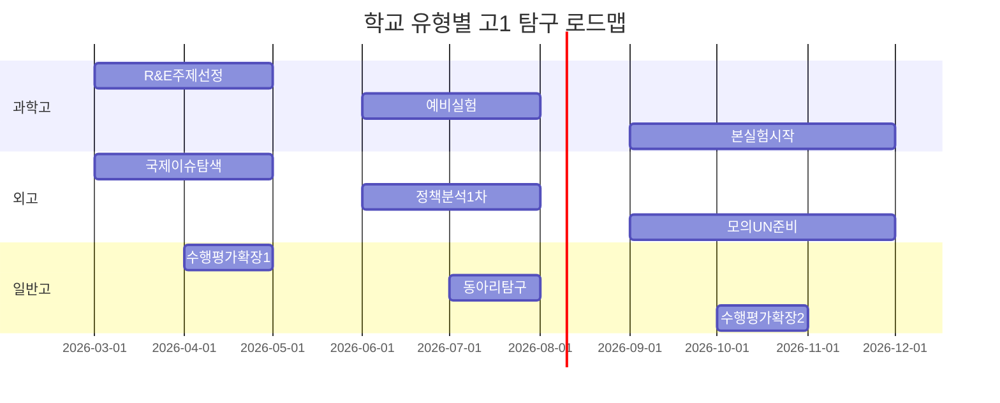

### 3.2 학교 유형별 고2 로드맵 비교

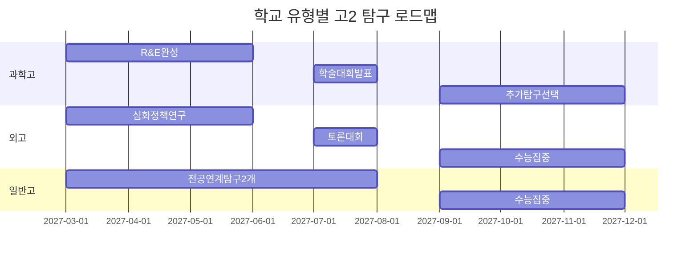

---

## 4. 동아리 활용 전략

### 4.1 동아리 유형별 탐구 연계

| 동아리 유형 | 탐구 주제 예시 | 산출물 | 생기부 기록 |
|---|---|---|---|
| **과학 실험** | 미세플라스틱 영향 연구 | 실험보고서 | 창체 동아리 |
| **코딩** | AI 추천 시스템 개발 | 앱/웹 | 창체 동아리 |
| **토론** | 정책 분석 및 제안 | 정책 제안서 | 창체 동아리 |
| **봉사** | 지역 문제 해결 프로젝트 | 캠페인 결과 | 창체 봉사 |
| **창작** | 예술 작품 제작 | 작품+보고서 | 창체 동아리 |

### 4.2 동아리 탐구 프로세스

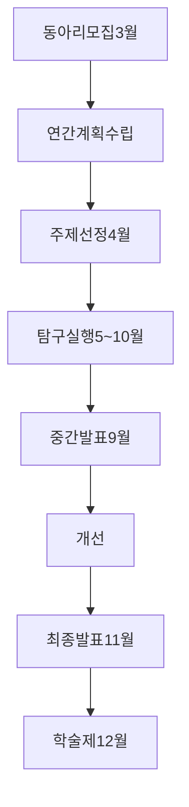

---

## 5. 수능 병행 시간 관리

### 5.1 학교 유형별 수능 부담 비교

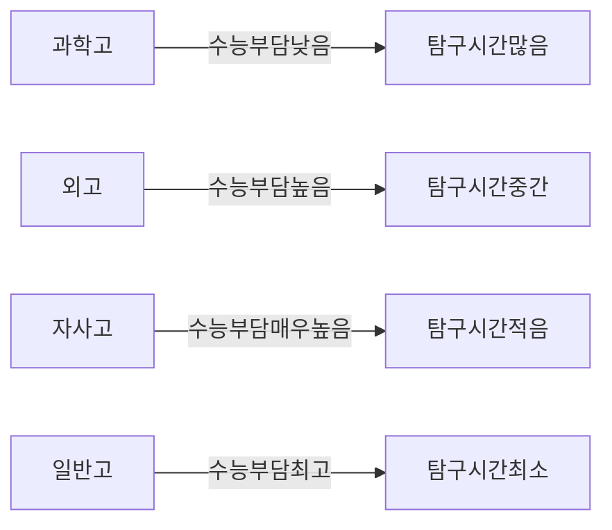

### 5.2 고2 시간 배분 전략 (학교 유형별)

#### 과학고 (수능 부담 낮음)
```
주간 시간 배분 (168시간)
- 수업: 45시간 (27%)
- 수면: 49시간 (29%, 7시간/일)
- 탐구(R&E): 20시간 (12%)
- 수능 공부: 15시간 (9%)
- 기타: 39시간 (23%)
```

#### 외고/자사고 (수능 부담 높음)
```
주간 시간 배분 (168시간)
- 수업: 50시간 (30%)
- 수면: 42시간 (25%, 6시간/일)
- 탐구: 10시간 (6%)
- 수능 공부: 30시간 (18%)
- 기타: 36시간 (21%)
```

#### 일반고 (수능 부담 최고)
```
주간 시간 배분 (168시간)
- 수업: 45시간 (27%)
- 수면: 42시간 (25%, 6시간/일)
- 탐구: 5시간 (3%)
- 수능 공부: 40시간 (24%)
- 기타: 36시간 (21%)
```

### 5.3 수면 시간 현실

**Q: 수능 공부하면서 탐구하면 잠을 5시간밖에 못 자나요?**

**A: 학교 유형과 전략에 따라 다릅니다.**

#### 케이스 1: 과학고 (수면 7시간 가능)
- 수능 부담 낮음 (과기원은 수능 최저 없음)
- 탐구가 곧 전공 준비
- **수면 7시간 + 탐구 충분히 가능**

#### 케이스 2: 외고/자사고 (수면 6시간)
- 수능 최저 충족 필수
- 탐구 + 수능 병행
- **수면 6시간 + 탐구 주 10시간**
- 고2 2학기는 탐구 최소화, 수능 집중

#### 케이스 3: 일반고 (수면 5~6시간)
- 수능이 대입의 핵심
- 탐구는 효율적으로 (수행평가 확장)
- **고2 2학기: 탐구 중단, 수능만 집중**
- 수면 5~6시간 (고3은 더 적을 수 있음)

### 5.4 건강한 시간 관리 전략

#### 전략 1: 효율성 극대화
```
❌ 나쁜 예: 탐구 10개 + 수능 공부 → 수면 4시간
✅ 좋은 예: 탐구 6개 (깊이 있게) + 수능 공부 → 수면 6시간
```

#### 전략 2: 시기 분산
```
고1: 탐구 집중 (수능 부담 낮음)
고2 1학기: 탐구 + 수능 병행
고2 2학기: 수능 집중 (탐구 최소화)
고3: 수능 집중 (탐구 정리만)
```

#### 전략 3: 통합 활동
```
수행평가를 탐구로 확장
→ 시간 절약 + 성적 + 생기부 일석삼조
```

### 5.5 실제 학생 사례

**사례 1: 과학고 학생 (수면 7시간)**
```
평일:
- 수업 9시간
- R&E 2시간
- 수능 공부 2시간
- 수면 7시간
- 기타 4시간

주말:
- R&E 4시간
- 수능 공부 3시간
- 수면 9시간
- 기타 8시간
```

**사례 2: 일반고 학생 (수면 6시간)**
```
평일:
- 수업 9시간
- 탐구 0.5시간 (주 3회)
- 수능 공부 5시간
- 수면 6시간
- 기타 3.5시간

주말:
- 탐구 2시간 (토요일만)
- 수능 공부 8시간
- 수면 8시간
- 기타 6시간
```

### 5.6 수면 시간 확보 팁

1. **스마트폰 사용 줄이기**: 하루 1시간 절약
2. **이동 시간 활용**: 버스에서 단어 암기
3. **점심시간 활용**: 20분 낮잠 (집중력 향상)
4. **주말 보충 수면**: 평일 6시간 → 주말 8시간

---

## 6. 학교 유형별 성공 사례

### 6.1 과학고 → KAIST
- **탐구**: R&E 1개 (12개월), 추가 탐구 2개
- **수면**: 평균 7시간
- **수능**: 최저 없어 최소한만 준비
- **합격 요인**: R&E 학술대회 수상

### 6.2 외고 → 서울대 정치외교
- **탐구**: 정책 분석 3개, 모의 UN 1개
- **수면**: 평균 6시간
- **수능**: 국어 1등급, 수학 2등급, 사탐 1등급
- **합격 요인**: 다국어 자료 활용, 전문가 인터뷰

### 6.3 자사고 → 연세대 융합전공
- **탐구**: 융합 프로젝트 3개
- **수면**: 평균 6시간
- **수능**: 국어 1등급, 수학 1등급, 사탐 1등급
- **합격 요인**: 학제간 융합 역량

### 6.4 일반고 → 고려대 생명과학
- **탐구**: 교과 확장 3개, 동아리 2개
- **수면**: 평균 5.5시간 (고2 2학기 5시간)
- **수능**: 국어 2등급, 수학 1등급, 과탐 1등급
- **합격 요인**: 효율적 탐구 + 수능 고득점

---

## 7. 최종 정리: 학교 유형별 핵심 전략

### 🔬 과학고/영재학교
- **핵심**: R&E 완성도
- **시간**: 탐구 많음, 수능 적음
- **수면**: 7시간 가능

### 🌐 외고/국제고
- **핵심**: 다국어 자료, 정책 분석
- **시간**: 탐구 중간, 수능 많음
- **수면**: 6시간

### 🏫 자사고
- **핵심**: 융합, 차별화
- **시간**: 탐구 중간, 수능 매우 많음
- **수면**: 6시간

### 📚 일반고
- **핵심**: 효율성 (수행평가 확장)
- **시간**: 탐구 적음, 수능 최대
- **수면**: 5~6시간

### 🔧 특성화고/마이스터고
- **핵심**: 실무 프로젝트
- **시간**: 실습 많음, 수능 적음
- **수면**: 7~8시간

### 🎨 예술고/체육고
- **핵심**: 창작/훈련 + 탐구 연계
- **시간**: 실기 많음, 수능 적음
- **수면**: 7시간

---

**결론: 학교 유형에 맞는 전략을 선택하고, 수면 시간을 최소 6시간은 확보하세요. 건강이 최우선입니다!**
