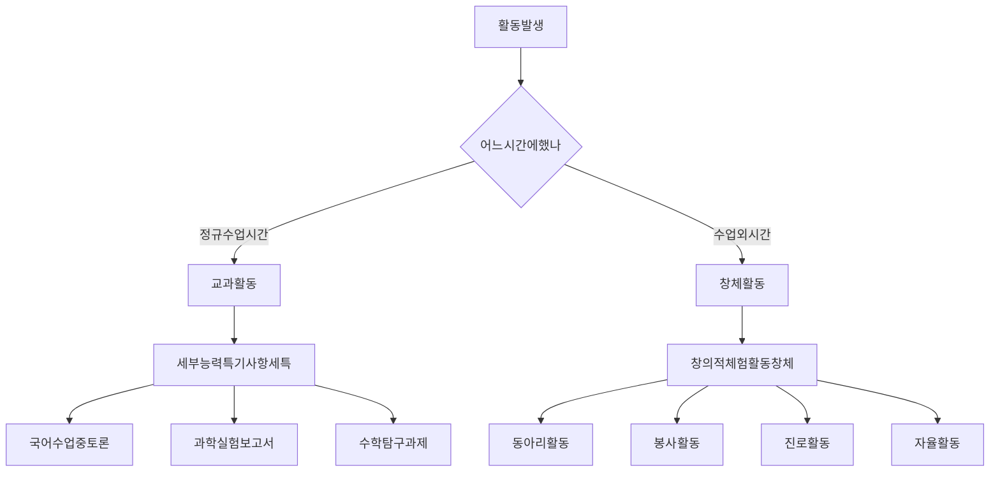
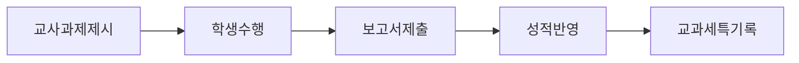
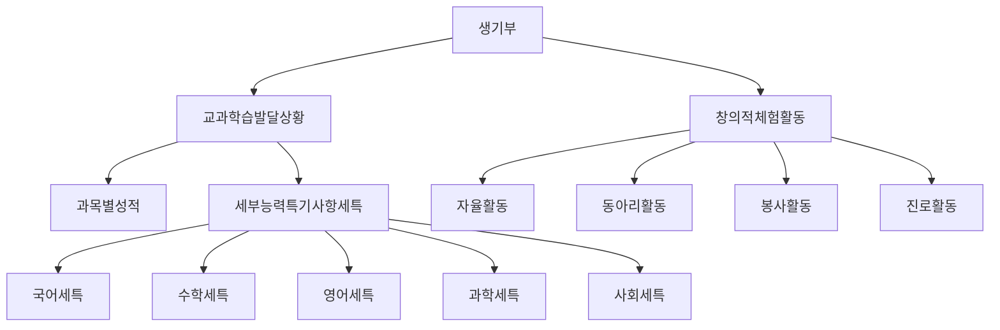
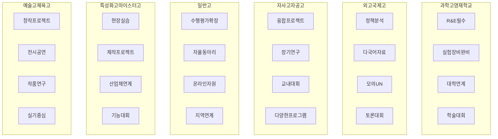
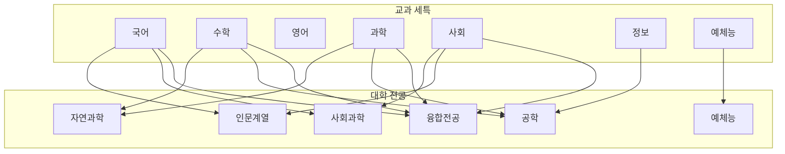
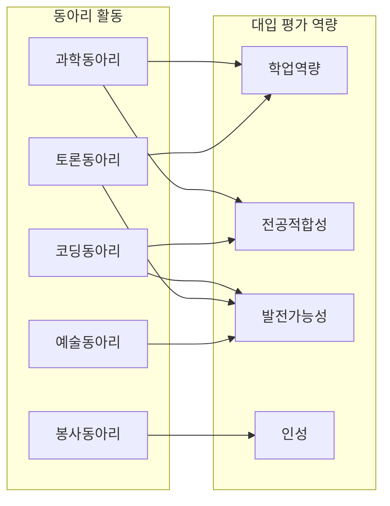

      # 교과 활동 vs 창체 활동 완벽 구분 가이드 + 주제 500개

> 탐구보고서·수행평가는 어디에? 교과 세특 vs 창체 완벽 구분 + 과목별 구체적 주제 500개

**마지막 업데이트:** 2026년 3월 16일

---

## 📋 목차

1. [교과 활동 vs 창체 활동 핵심 구분](#1-교과-활동-vs-창체-활동-핵심-구분)
2. [생기부 기록 위치 완벽 이해](#2-생기부-기록-위치-완벽-이해)
3. [교과별 탐구 주제 500개](#3-교과별-탐구-주제-500개)
4. [동아리별 탐구 주제 200개](#4-동아리별-탐구-주제-200개)
5. [헷갈리는 사례 Q&A](#5-헷갈리는-사례-qa)

---

## 1. 교과 활동 vs 창체 활동 핵심 구분

### 1.1 명확한 구분 기준



### 1.2 핵심 구분표

| 구분 | 교과 활동 (세특) | 창체 활동 (창체) |
|---|---|---|
| **시간** | 정규 수업 시간 (1~7교시) | 수업 외 시간 (동아리, 방과후, 주말) |
| **장소** | 교실, 실험실 (수업 중) | 동아리실, 봉사 현장, 진로 체험 |
| **주도** | 교사 주도 (과제 제시) | 학생 주도 (자발적 참여) |
| **평가** | 성적 반영 (수행평가) | 성적 반영 없음 (참여 기록) |
| **기록** | 교과 세특 (과목별) | 창체 (자율·동아리·봉사·진로) |
| **예시** | 수행평가, 실험보고서, 발표 | 동아리 프로젝트, 봉사, 진로 탐색 |

### 1.3 탐구보고서는 어디에?

**핵심 원칙: "어느 시간에 했는가"가 결정**

#### 케이스 1: 교과 시간 → 세특 기록
```
상황: 생명과학 수업 시간에 교사가 "미세플라스틱 영향 조사" 과제 제시
     → 학생이 4주간 실험하고 보고서 제출
     → 수행평가 점수 반영

기록 위치: 생명과학 세특
기록 예시: "생명과학 시간에 미세플라스틱이 물벼룩 생식에 미치는 
           영향을 탐구함. 농도별 실험을 설계하고..."
```

#### 케이스 2: 동아리 시간 → 창체 기록
```
상황: 과학 동아리 시간에 학생들이 자발적으로 "미세플라스틱" 주제 선정
     → 8주간 실험하고 보고서 작성
     → 성적 반영 없음

기록 위치: 창체 - 동아리활동
기록 예시: "과학 동아리에서 미세플라스틱 영향을 탐구함. 
           팀원들과 역할을 분담하여..."
```

#### 케이스 3: 둘 다 가능 (융합 활동)
```
상황: 생명과학 수업에서 시작 + 동아리에서 심화
     → 수업: 기초 실험 (4주)
     → 동아리: 심화 실험 (4주)

기록 위치: 생명과학 세특 + 창체 동아리 둘 다
세특: "생명과학 시간에 미세플라스틱 기초 실험..."
창체: "과학 동아리에서 수업 내용을 심화하여..."
```

### 1.4 수행평가 보고서는?

**답: 100% 교과 활동 (세특 기록)**



**이유**
- 수행평가 = 정규 수업 시간의 평가
- 성적에 반영됨
- 교사가 과제 제시
- 따라서 **교과 세특**에만 기록

**예시**
```
❌ 틀린 기록: "동아리에서 수행평가 보고서를 작성함"
✅ 올바른 기록: "사회 시간에 수행평가로 청년 고용 정책을 분석함"
```

---

## 2. 생기부 기록 위치 완벽 이해

### 2.1 생기부 구조



### 2.2 교과 세특 기록 예시

#### 국어 세특
```
"국어 시간에 현대시에 나타난 환경 의식 변화를 탐구함. 1990년대와 
2020년대 시 50편을 비교 분석하고, 환경 관련 표현이 10%에서 40%로 
증가함을 발견함. 문학 작품 분석 능력과 시대적 맥락 이해력을 함양함."
```
- **시간**: 국어 수업 시간
- **과제**: 교사가 "현대시 분석" 수행평가 제시
- **기록**: 국어 세특

#### 수학 세특
```
"수학 시간에 통계를 활용하여 학생 수면 시간과 성적 관계를 분석함. 
100명 데이터를 수집하고 상관분석을 수행한 결과, 상관계수 r=0.65로 
양의 상관관계를 확인함. 통계적 사고력과 데이터 해석 능력을 신장함."
```
- **시간**: 수학 수업 시간
- **과제**: 교사가 "통계 프로젝트" 수행평가 제시
- **기록**: 수학 세특

### 2.3 창체 기록 예시

#### 동아리 활동
```
"과학 동아리에서 미세먼지 저감 장치를 설계하고 효과를 검증함. 
팀원 4명과 역할을 분담하여 6개월간 프로젝트를 수행하고, 
학술제에서 우수상을 수상함. 협업 능력과 문제 해결 역량을 함양함."
```
- **시간**: 동아리 시간 (수업 외)
- **주도**: 학생 자발적
- **기록**: 창체 - 동아리활동

#### 봉사 활동
```
"독거노인 대상 디지털 리터러시 교육 봉사를 수행함. 스마트폰 사용법 
교재를 직접 제작하고, 8주간 매주 2시간씩 교육함. 어르신 10명이 
카카오톡 사용법을 습득하고 만족도 95%를 기록함."
```
- **시간**: 봉사 시간 (수업 외)
- **주도**: 학생 자발적
- **기록**: 창체 - 봉사활동

---

## 3. 교과별 탐구 주제 500개

### 📚 국어 (50개 주제)

#### 문학 분석 (20개)
1. 현대시에 나타난 환경 의식 변화 (1990년대 vs 2020년대)
2. 한국 소설 속 여성 인물 변화 추이 (1950~2020년)
3. 청소년 소설에 나타난 학교 폭력 묘사 분석
4. 전쟁 문학에 나타난 트라우마 표현 연구
5. 디스토피아 소설의 사회 비판 기능 분석
6. 한국 시조와 일본 하이쿠 비교 연구
7. 판타지 소설 속 세계관 구축 방식 분석
8. 추리 소설의 서사 구조 패턴 연구
9. 웹소설과 전통 소설의 문체 비교
10. 시의 운율과 독자 감정 반응 관계 연구
11. 소설 속 공간 배경이 서사에 미치는 영향
12. 한국 고전 소설의 현대적 재해석 사례 분석
13. 시적 화자의 유형과 독자 몰입도 관계
14. 소설 속 대화문이 인물 성격 형성에 미치는 영향
15. 비유적 표현이 시의 주제 전달에 미치는 효과
16. 한국 현대시에 나타난 도시 이미지 변화
17. 소설 속 갈등 구조와 독자 긴장감 관계
18. 아동 문학에 나타난 가족 관계 변화
19. 시의 행 구분 방식이 의미 전달에 미치는 영향
20. 한국 문학 속 계절 이미지 상징성 연구

#### 언어 분석 (15개)
21. 또래 언어 사용 실태 조사 (신조어, 줄임말)
22. SNS 언어와 표준어 차이 분석
23. 방언의 보존 가치와 현황 연구
24. 외래어 사용 증가가 한국어에 미치는 영향
25. 광고 언어의 설득 전략 분석
26. 뉴스 기사 제목의 언어적 특징 연구
27. 세대별 언어 사용 차이 비교 (10대 vs 50대)
28. 존댓말 사용 실태와 인식 조사
29. 한국어 맞춤법 오류 유형 분석
30. 이모티콘이 의사소통에 미치는 영향
31. 유행어의 생성과 소멸 패턴 연구
32. 한국어 높임법의 사회적 기능 분석
33. 인터넷 댓글 언어의 특징과 문제점
34. 한국어 어순과 다른 언어 비교 연구
35. 언어 순화 운동의 효과성 분석

#### 독서·토론 (15개)
36. 학생 독서 습관 실태 조사 및 개선 방안
37. 독서량과 어휘력 관계 연구
38. 전자책 vs 종이책 독서 효과 비교
39. 독서 토론이 비판적 사고력에 미치는 영향
40. 추천 도서 목록이 독서 선택에 미치는 영향
41. 독서 동아리 활동이 독해력 향상에 미치는 효과
42. 학교 도서관 이용 패턴 분석
43. 독서 감상문 작성이 독서 이해도에 미치는 영향
44. 장르별 독서 선호도와 성격 관계
45. 독서 시간대가 독서 몰입도에 미치는 영향
46. 북 트레일러가 독서 동기에 미치는 효과
47. 독서 마라톤 프로그램의 효과성 분석
48. 교사 추천 vs 또래 추천 도서의 독서 만족도 비교
49. 독서 기록장 작성이 독서 지속성에 미치는 영향
50. 온라인 독서 커뮤니티의 독서 촉진 효과

---

### 🔢 수학 (50개 주제)

#### 통계·확률 (20개)
1. 학생 수면 시간과 학업 성취도 상관관계 분석
2. 급식 메뉴 선호도 통계 분석 및 예측 모델
3. 학교 내 스마트폰 사용 시간 분포 조사
4. 교통 카드 데이터로 본 통학 패턴 분석
5. 시험 성적 분포와 정규분포 적합도 검정
6. 날씨와 학생 출석률 관계 분석
7. 학급별 키 분포 비교 (t-test 활용)
8. 설문 데이터 신뢰도 분석 (크론바흐 알파)
9. 로또 번호 출현 빈도 분석 및 확률 계산
10. 야구 선수 타율 데이터 통계 분석
11. 주식 가격 변동 패턴 분석
12. 학생 용돈 사용 패턴 통계 조사
13. 교내 설문 조사 표본 크기 최적화 연구
14. 시험 문제 난이도와 정답률 관계 분석
15. 학생 선호 직업 변화 추이 (10년 데이터)
16. 교통사고 발생 시간대 분포 분석
17. 학생 신장과 체중 상관관계 연구
18. 영화 평점과 흥행 수익 관계 분석
19. 학생 운동 시간과 체력 점수 관계
20. 기온과 아이스크림 판매량 상관분석

#### 기하·도형 (10개)
21. 학교 건물 최적 배치 설계 (기하학 활용)
22. 축구공의 정다면체 구조 분석
23. 프랙탈 도형의 자기 유사성 연구
24. 건축물 속 황금비 발견 및 분석
25. 테셀레이션을 활용한 패턴 디자인
26. 그림자 길이로 건물 높이 측정 (삼각법)
27. 최단 경로 찾기 (다익스트라 알고리즘)
28. 종이 접기와 기하학적 원리
29. 원뿔곡선의 실생활 응용 사례 연구
30. 입체도형의 부피와 겉넓이 최적화

#### 대수·함수 (10개)
31. 지수함수를 활용한 세균 증식 모델링
32. 로그 함수를 활용한 지진 규모 분석
33. 이차함수로 포물선 운동 분석
34. 삼각함수를 활용한 파동 현상 연구
35. 수열을 활용한 저축 계획 최적화
36. 함수의 극값을 활용한 최대 이익 계산
37. 지수 증가와 선형 증가 비교 (복리 vs 단리)
38. 삼각비를 활용한 산 높이 측정
39. 함수 그래프로 물체 운동 분석
40. 수열의 합 공식 응용 (계단 오르기 경우의 수)

#### 응용 수학 (10개)
41. 암호학의 수학적 원리 (RSA 암호)
42. 게임 이론을 활용한 최적 전략 분석
43. 선형계획법으로 자원 배분 최적화
44. 수학적 모델링으로 전염병 확산 예측
45. 미적분을 활용한 최적화 문제 해결
46. 행렬을 활용한 이미지 변환
47. 벡터를 활용한 물리 운동 분석
48. 수학적 귀납법을 활용한 증명
49. 조합론을 활용한 경우의 수 계산
50. 수학적 모델링으로 교통 흐름 분석

---

### 🧪 과학 (생명과학, 화학, 물리, 지구과학) (100개 주제)

#### 생명과학 (30개)
1. 미세플라스틱이 물벼룩 생식에 미치는 영향
2. 토양 미생물 다양성과 식물 성장 관계
3. 항생제 내성 박테리아 생성 조건 연구
4. 식물 성장에 미치는 LED 색상 영향
5. 효모 발효 조건 최적화 실험
6. 학교 화단 생태계 조사 및 분석
7. 카페인이 식물 성장에 미치는 영향
8. 학생 혈액형 분포와 성격 관계 (통계)
9. 손 씻기 방법에 따른 세균 제거 효과
10. 유산균 종류별 발효 효과 비교
11. 식물 호르몬이 뿌리 성장에 미치는 영향
12. 학교 주변 하천 수질 조사
13. 광합성 속도에 영향을 미치는 요인 분석
14. 효소 활성에 미치는 온도·pH 영향
15. 학생 시력과 스마트폰 사용 시간 관계
16. 식물 광굴성 실험 및 분석
17. 학교 급식 잔반의 퇴비화 효과 연구
18. 세포 분열 관찰 및 단계 분석
19. 학생 스트레스와 면역력 관계 연구
20. 식물 뿌리의 물 흡수 속도 측정
21. 학교 내 공기 중 미생물 분포 조사
22. 효모 세포 수 변화 추이 관찰
23. 식물 잎의 증산 작용 측정
24. 학생 운동량과 심박수 변화 관계
25. 식물 종자 발아 조건 최적화
26. 학교 주변 생물 다양성 조사
27. 유전자 모형 제작 및 발현 원리 탐구
28. 학생 식습관과 영양 상태 분석
29. 식물 세포와 동물 세포 비교 관찰
30. 학교 연못 생태계 먹이 사슬 분석

#### 화학 (25개)
31. 산-염기 중화 반응 정량 분석
32. 학교 수돗물 vs 정수기 물 성분 비교
33. 천연 지시약 제작 및 pH 측정 정확도
34. 손 소독제 알코올 농도 측정
35. 비타민 C 함량 측정 (요오드 적정)
36. 학교 급식 음식의 칼로리 측정
37. 금속의 반응성 비교 실험
38. 학교 주변 대기 오염도 측정
39. 화학 반응 속도에 미치는 온도 영향
40. 학교 토양의 중금속 함량 분석
41. 전기분해를 활용한 수소 생성
42. 학교 수질의 경도 측정
43. 화학 평형 이동 실험 (르샤틀리에 원리)
44. 학교 급식실 세제의 세척력 비교
45. 촉매가 반응 속도에 미치는 영향
46. 학교 주변 빗물의 산성도 측정
47. 화학 전지 제작 및 전압 측정
48. 학교 실험실 시약 농도 확인
49. 화학 반응의 발열·흡열 측정
50. 학교 급식 식품 첨가물 검출
51. 금속 이온 정성 분석 (불꽃 반응)
52. 학교 수돗물 염소 농도 측정
53. 화학 반응식 균형 맞추기 실습
54. 학교 주변 토양 pH 측정
55. 화학 결합 모형 제작 및 분석

#### 물리 (25개)
56. 학교 건물에서 물체 낙하 시간 측정 (자유낙하)
57. 진자 주기와 길이 관계 실험
58. 학교 교실 소음 측정 및 분석
59. 스마트폰 가속도 센서로 운동 분석
60. 학교 태양광 패널 효율 측정
61. 빛의 굴절 실험 (스넬의 법칙)
62. 학교 운동장 마찰력 측정
63. 전자기 유도 실험 (발전기 원리)
64. 학교 건물 단열 효과 측정
65. 파동의 간섭 실험 (이중 슬릿)
66. 학교 엘리베이터 가속도 측정
67. 렌즈를 활용한 광학 실험
68. 학교 운동장 공의 포물선 운동 분석
69. 전기 회로 설계 및 전류 측정
70. 학교 주변 소음 지도 제작
71. 열의 이동 실험 (전도, 대류, 복사)
72. 학교 계단 일률 계산
73. 자기장 측정 및 시각화
74. 학교 건물 공명 현상 관찰
75. 빛의 속도 측정 실험
76. 학교 운동장 충돌 실험 (운동량 보존)
77. 전자석 제작 및 자기력 측정
78. 학교 주변 방사선 측정
79. 파동의 도플러 효과 실험
80. 학교 건물 진동 측정

#### 지구과학 (20개)
81. 학교 주변 암석 종류 조사
82. 학교 일대 지질 답사 및 지층 분석
83. 학교 주변 미세먼지 농도 측정
84. 학교 기상 관측 (온도, 습도, 기압)
85. 학교 주변 하천 퇴적물 분석
86. 달의 위상 변화 관찰 및 기록
87. 학교 주변 토양 입자 크기 분석
88. 학교 일대 지진 위험도 평가
89. 학교 주변 지하수 수질 조사
90. 태양의 고도 변화 측정
91. 학교 주변 화석 발굴 및 분석
92. 학교 일대 기후 변화 추이 분석
93. 학교 주변 하천 유속 측정
94. 별자리 관측 및 기록
95. 학교 주변 토양 수분 함량 측정
96. 학교 일대 지형 특징 분석
97. 학교 주변 대기압 변화 측정
98. 행성 관측 및 궤도 분석
99. 학교 주변 지하수 위치 추정
100. 학교 일대 기상 재해 위험도 평가

---

### 🌍 사회 (역사, 지리, 일반사회, 윤리) (100개 주제)

#### 역사 (25개)
101. 우리 지역 근현대사 구술 채록 프로젝트
102. 학교 역사 아카이빙 (설립~현재)
103. 일제 강점기 우리 지역 독립운동가 조사
104. 한국 전쟁이 우리 지역에 미친 영향
105. 우리 지역 전통 시장의 변천사
106. 학교 주변 문화재 조사 및 보존 방안
107. 우리 지역 산업화 과정 연구
108. 학교 동문 인터뷰 (세대별 학교 생활 비교)
109. 우리 지역 지명의 유래 연구
110. 한국 민주화 운동이 우리 지역에 미친 영향
111. 우리 지역 전통 음식의 역사
112. 학교 교복 변천사 연구
113. 우리 지역 건축물의 역사적 변화
114. 한국 경제 발전이 우리 지역에 미친 영향
115. 우리 지역 교육 제도 변천사
116. 학교 주변 옛 사진 수집 및 비교
117. 우리 지역 종교 시설의 역사
118. 한국 대중문화 변천사 (1990~2020년)
119. 우리 지역 교통 발달사
120. 학교 축제 변천사 연구
121. 우리 지역 인구 변화 추이 (100년)
122. 한국 여성 지위 변화 연구
123. 우리 지역 환경 변화 역사
124. 학교 교육과정 변천사
125. 우리 지역 정치 성향 변화 추이

#### 지리 (25개)
126. 우리 지역 상권 분포 및 변화 분석
127. 학교 주변 교통 혼잡도 조사
128. 우리 지역 인구 구조 분석 (연령, 성별)
129. 학교 통학 거리와 통학 수단 분석
130. 우리 지역 공원 분포 및 접근성 평가
131. 학교 주변 범죄 발생 지도 제작
132. 우리 지역 주거 형태 분포 조사
133. 학교 주변 상업 시설 입지 분석
134. 우리 지역 기후 특성 분석
135. 학교 주변 보행 환경 평가
136. 우리 지역 산업 구조 분석
137. 학교 주변 녹지 면적 측정
138. 우리 지역 교통망 분석
139. 학교 주변 소음 지도 제작
140. 우리 지역 관광 자원 조사
141. 학교 주변 대기 질 측정
142. 우리 지역 토지 이용 변화 분석
143. 학교 주변 편의 시설 접근성 평가
144. 우리 지역 물 사용량 분석
145. 학교 주변 주차 공간 부족 문제 연구
146. 우리 지역 재해 위험 지역 조사
147. 학교 주변 쓰레기 배출 실태 조사
148. 우리 지역 에너지 소비 패턴 분석
149. 학교 주변 빛 공해 측정
150. 우리 지역 도시 재생 사례 연구

#### 일반사회 (정치, 경제, 법) (30개)
151. 학생 모의 선거 실시 및 결과 분석
152. 학교 규칙 개선 제안서 작성
153. 청소년 아르바이트 노동권 실태 조사
154. 학생 용돈 관리 실태 및 경제 교육 방안
155. 학교 내 민주주의 실천 방안 연구
156. 청소년 정치 참여 의식 조사
157. 학교 예산 배분의 합리성 평가
158. 청소년 소비 패턴 분석
159. 학교 내 갈등 해결 시스템 연구
160. 청소년 법 인식 실태 조사
161. 학교 급식 가격 결정 요인 분석
162. 청소년 인권 실태 조사
163. 학교 매점 운영 방식 개선 방안
164. 청소년 미디어 리터러시 수준 평가
165. 학교 내 의사결정 구조 분석
166. 청소년 금융 이해력 조사
167. 학교 시설 이용 규칙 합리성 평가
168. 청소년 사회 참여 활동 실태 조사
169. 학교 내 평등 실현 방안 연구
170. 청소년 세금 인식 조사
171. 학교 동아리 예산 배분 공정성 평가
172. 청소년 노동 시장 진입 장벽 연구
173. 학교 내 소수자 권리 보호 방안
174. 청소년 경제 활동 실태 조사
175. 학교 의사결정 과정의 민주성 평가
176. 청소년 정책 인지도 조사
177. 학교 내 자치 활동 활성화 방안
178. 청소년 소비자 권리 인식 조사
179. 학교 규정 제·개정 과정 연구
180. 청소년 사회 문제 인식 조사

#### 윤리 (20개)
181. 학생 SNS 사용 윤리 의식 조사
182. 인공지능 윤리 문제 토론 및 정리
183. 학생 환경 윤리 의식 실태 조사
184. 동물 실험 윤리에 대한 인식 조사
185. 학생 정보 윤리 의식 평가
186. 생명 윤리 쟁점 토론 (유전자 편집)
187. 학생 미디어 윤리 의식 조사
188. 과학 기술 발전과 윤리적 쟁점 연구
189. 학생 소비 윤리 의식 실태 조사
190. 사형 제도에 대한 윤리적 논쟁 분석
191. 학생 학업 윤리 의식 조사 (표절, 부정행위)
192. 안락사에 대한 윤리적 입장 조사
193. 학생 디지털 윤리 의식 평가
194. 인간 복제에 대한 윤리적 쟁점 연구
195. 학생 환경 보호 실천 의식 조사
196. 자율주행차 윤리적 딜레마 분석
197. 학생 공정 무역 인식 조사
198. 뇌 과학 연구의 윤리적 한계 토론
199. 학생 동물 권리 인식 조사
200. 인공지능 창작물의 저작권 쟁점 연구

---

### 💻 정보 (50개 주제)

#### 프로그래밍·알고리즘 (20개)
201. 학급 일정 관리 웹사이트 제작
202. 급식 메뉴 추천 알고리즘 개발
203. 학교 시간표 자동 생성 프로그램
204. 학생 성적 분석 프로그램 개발
205. 학교 도서관 도서 추천 시스템
206. 학생 출석 관리 앱 제작
207. 학교 동아리 매칭 알고리즘
208. 학생 멘토-멘티 매칭 시스템
209. 학교 급식 잔반 예측 모델
210. 학생 학습 플래너 앱 개발
211. 학교 시설 예약 시스템 구축
212. 학생 건강 관리 앱 제작
213. 학교 분실물 관리 시스템
214. 학생 진로 추천 알고리즘
215. 학교 에너지 사용량 모니터링 시스템
216. 학생 스터디 그룹 매칭 프로그램
217. 학교 행사 참가 신청 시스템
218. 학생 독서 기록 및 추천 앱
219. 학교 급식 만족도 조사 시스템
220. 학생 운동 기록 및 분석 앱

#### 데이터 분석·AI (15개)
221. 학생 학습 패턴 분석 (머신러닝)
222. 학교 급식 메뉴 만족도 예측 모델
223. 학생 진로 선택 예측 (의사결정 트리)
224. 학교 도서관 대출 패턴 분석
225. 학생 성적 예측 모델 (회귀 분석)
226. 학교 에너지 소비 예측 (시계열 분석)
227. 학생 동아리 선택 예측 모델
228. 학교 급식 잔반량 예측 (AI)
229. 학생 학습 시간 최적화 알고리즘
230. 학교 시설 이용 패턴 분석
231. 학생 건강 상태 예측 모델
232. 학교 교통 혼잡도 예측
233. 학생 진로 적성 분석 (군집화)
234. 학교 행사 참여율 예측
235. 학생 학습 효율 분석 (데이터 마이닝)

#### 하드웨어·IoT (15개)
236. 아두이노 자동 식물 물주기 장치
237. 라즈베리파이 스마트 미러 제작
238. NFC 기반 스마트 출석 시스템
239. 교실 환경 모니터링 시스템 (온도, 습도, CO2)
240. 스마트 사물함 제작 (IoT)
241. 자동 손 소독제 디스펜서 제작
242. 교실 조명 자동 제어 시스템
243. 스마트 쓰레기통 (분리수거 안내)
244. 교실 공기질 측정 장치
245. 스마트 도서 대출 시스템
246. 자동 블라인드 제어 시스템
247. 교실 소음 측정 및 알림 장치
248. 스마트 화분 (자동 관수, 조명)
249. 교실 에너지 사용량 모니터링 장치
250. 스마트 우산 보관함 (IoT)

---

### 🎨 예체능 (음악, 미술, 체육) (50개 주제)

#### 음악 (15개)
251. AI 음악 생성 도구로 학교 응원가 작곡
252. 학생 음악 선호도 조사 및 분석
253. 악기 연주가 학습 집중도에 미치는 영향
254. 학교 합창단 화음 분석
255. 음악 치료가 스트레스 감소에 미치는 효과
256. 학교 방송 음악 선곡 기준 연구
257. 음악 장르별 학생 반응 분석
258. 학교 음악실 음향 개선 방안
259. 리듬 게임이 리듬감 향상에 미치는 효과
260. 학교 축제 공연 기획 및 실행
261. 음악 감상이 감정 조절에 미치는 영향
262. 학교 오케스트라 편성 최적화
263. 전통 음악과 현대 음악 융합 작곡
264. 학교 음악 동아리 활동 효과 분석
265. 음악 이론 학습 방법 효과성 비교

#### 미술 (20개)
266. 생성형 AI를 활용한 디지털 아트 시리즈
267. 학교 굿즈 디자인 및 크라우드펀딩
268. 학교 벽화 디자인 및 제작
269. 학생 미술 선호도 조사 (추상 vs 구상)
270. 색채가 학습 집중도에 미치는 영향
271. 학교 로고 리디자인 프로젝트
272. 환경 문제 인식 개선 포스터 제작
273. 학교 공간 재구성 디자인
274. 미술 치료가 정서 안정에 미치는 효과
275. 학교 전시회 기획 및 운영
276. 전통 미술과 현대 미술 융합 작품
277. 학교 교복 리디자인 프로젝트
278. 미술 작품 감상이 창의성에 미치는 영향
279. 학교 미술 동아리 작품 아카이빙
280. 공공 미술이 지역사회에 미치는 영향
281. 학교 건축물 스케치 및 분석
282. 디지털 드로잉 vs 전통 드로잉 비교
283. 학교 연극 무대 디자인
284. 미술 재료별 표현 효과 비교
285. 학교 미술 작품 전시 공간 최적화

#### 체육 (15개)
286. 학생 체력 수준 분석 및 향상 프로그램
287. 운동이 학업 성취도에 미치는 영향
288. 학교 운동 시설 이용 패턴 분석
289. 스포츠 경기 데이터 분석 (전략 수립)
290. 학생 운동 습관 실태 조사
291. 운동이 스트레스 감소에 미치는 효과
292. 학교 체육 수업 만족도 조사
293. 운동 종목별 부상 위험도 분석
294. 학생 선호 운동 종목 조사
295. 운동이 수면 질에 미치는 영향
296. 학교 운동회 종목 개선 방안
297. 운동 전후 심박수 변화 측정
298. 학생 체육 동아리 활동 효과 분석
299. 운동이 면역력에 미치는 영향
300. 학교 체육 시설 개선 방안 연구

---

### 🌐 영어 (30개 주제)

301. 학생 영어 학습 방법 효과성 비교
302. 영어 듣기 능력 향상을 위한 전략 연구
303. 영어 단어 암기 방법 효과성 비교
304. 영어 말하기 불안 감소 방안 연구
305. 영어 독해 속도 향상 프로그램 개발
306. 영어 작문 오류 유형 분석
307. 영어 발음 교정 앱 효과성 평가
308. 영어 동화책 읽기가 어휘력에 미치는 영향
309. 영어 드라마 시청이 듣기 능력에 미치는 효과
310. 영어 토론 활동이 말하기 능력에 미치는 영향
311. 영어 일기 쓰기가 작문 능력에 미치는 효과
312. 영어 노래 부르기가 발음에 미치는 영향
313. 영어 게임이 학습 동기에 미치는 효과
314. 영어 멘토링 프로그램 효과성 분석
315. 영어 스터디 그룹 활동 효과 연구
316. 영어 학습 앱 사용 패턴 분석
317. 영어 원서 읽기가 독해력에 미치는 영향
318. 영어 팟캐스트 듣기 효과성 평가
319. 영어 프레젠테이션 능력 향상 방안
320. 영어 학습 시간대가 학습 효과에 미치는 영향
321. 영어 어휘 학습 전략 비교 연구
322. 영어 문법 학습 방법 효과성 평가
323. 영어 학습 동기 부여 방안 연구
324. 영어 학습 환경이 학습 효과에 미치는 영향
325. 영어 학습 목표 설정이 성취도에 미치는 영향
326. 영어 학습 피드백 방법 효과성 비교
327. 영어 학습 자료 선호도 조사
328. 영어 학습 습관 형성 전략 연구
329. 영어 학습 불안 감소 프로그램 개발
330. 영어 학습 성취도와 자신감 관계 분석

---

### 🔬 융합 (STEAM, 학제간) (50개 주제)

331. 과학+예술: 생체모방 디자인 연구 및 제품 제작
332. 수학+사회: 빅데이터로 분석하는 지역 인구 이동
333. 과학+정보: AI 기반 식물 병해 진단 시스템
334. 공학+예술: 인터랙티브 미디어 아트 설치
335. 사회+정보: 소셜 미디어 여론 분석 및 시각화
336. 과학+인문: 과학 기술의 윤리적 쟁점 토론
337. 수학+음악: 수학적 패턴을 활용한 음악 작곡
338. 과학+체육: 스포츠 과학 데이터 분석
339. 역사+정보: 역사 사건 시각화 웹사이트
340. 지리+정보: GIS를 활용한 지역 분석
341. 과학+경제: 신재생 에너지 경제성 분석
342. 수학+미술: 프랙탈 아트 제작
343. 과학+사회: 환경 문제 해결 정책 제안
344. 공학+생물: 바이오 센서 개발
345. 물리+음악: 악기의 음향학적 원리 분석
346. 화학+미술: 천연 염료 제작 및 염색
347. 생물+정보: 생물정보학 데이터 분석
348. 지구과학+지리: 기후 변화가 지역에 미치는 영향
349. 수학+체육: 스포츠 전략 수학적 모델링
350. 과학+문학: 과학 소설 속 과학 원리 분석
351. 공학+사회: 스마트 시티 설계
352. 물리+미술: 빛과 색의 물리학적 원리 작품화
353. 화학+음식: 분자 요리 과학
354. 생물+윤리: 유전자 편집 기술의 윤리적 쟁점
355. 지구과학+역사: 기후가 역사에 미친 영향
356. 수학+건축: 건축물의 수학적 구조 분석
357. 과학+경영: 과학 기술 스타트업 사업 계획
358. 공학+환경: 친환경 에너지 시스템 설계
359. 물리+체육: 운동 역학 분석
360. 화학+환경: 친환경 소재 개발
361. 생물+의학: 질병 예방 프로그램 개발
362. 지구과학+환경: 지속 가능한 자원 관리 방안
363. 수학+경제: 금융 수학 모델링
364. 과학+교육: 과학 교육 프로그램 개발
365. 공학+의료: 의료 기기 프로토타입 제작
366. 물리+공학: 재생 에너지 발전 장치 설계
367. 화학+공학: 화학 공정 최적화
368. 생물+농업: 스마트 팜 시스템 개발
369. 지구과학+공학: 지진 대비 건축 설계
370. 수학+컴퓨터: 암호학 알고리즘 연구
371. 과학+철학: 과학적 방법론의 철학적 기초
372. 공학+디자인: 사용자 중심 제품 디자인
373. 물리+천문: 천체 관측 및 데이터 분석
374. 화학+생물: 생화학 반응 메커니즘 연구
375. 생물+심리: 뇌과학과 행동 심리 연구
376. 지구과학+물리: 기상 현상의 물리학적 원리
377. 수학+생물: 생태계 수학적 모델링
378. 과학+법: 과학 기술 관련 법률 연구
379. 공학+경제: 기술 혁신의 경제적 영향 분석
380. 물리+화학: 물리화학 실험 및 분석

---

## 4. 동아리별 탐구 주제 200개

### 🔬 과학 동아리 (40개)

381. 학교 주변 생태계 장기 모니터링
382. 과학 실험 안전 매뉴얼 제작
383. 과학 축제 부스 운영 (체험 실험)
384. 과학 유튜브 채널 운영
385. 과학 도서 독서 토론
386. 과학 올림피아드 준비
387. 과학 멘토링 프로그램 운영
388. 과학 실험 키트 개발
389. 과학 관련 사회 문제 토론
390. 과학 전시회 기획 및 운영
391. 과학 다큐멘터리 제작
392. 과학 관련 진로 탐색
393. 과학 실험 대회 참가
394. 과학 관련 봉사 활동
395. 과학 원리 체험 프로그램 개발
396. 과학 관련 정책 제안
397. 과학 실험 안전 교육
398. 과학 관련 캠페인 진행
399. 과학 실험 결과 학술지 투고
400. 과학 관련 지역사회 협력
401. 과학 실험 장비 제작
402. 과학 관련 창업 아이디어 개발
403. 과학 실험 데이터베이스 구축
404. 과학 관련 국제 교류
405. 과학 실험 프로토콜 개선
406. 과학 관련 전문가 초청 강연
407. 과학 실험 시뮬레이션 개발
408. 과학 관련 정보 공유 플랫폼
409. 과학 실험 윤리 교육
410. 과학 관련 미래 기술 탐구
411. 과학 실험 결과 시각화
412. 과학 관련 사회적 기업 연구
413. 과학 실험 재현성 검증
414. 과학 관련 시민 과학 프로젝트
415. 과학 실험 오픈소스 공유
416. 과학 관련 과학 커뮤니케이션
417. 과학 실험 자동화 시스템
418. 과학 관련 과학 정책 분석
419. 과학 실험 안전 장비 개선
420. 과학 관련 과학 문화 확산

### 💻 코딩/정보 동아리 (40개)

421. 학교 홈페이지 리뉴얼
422. 코딩 교육 봉사 (초등학생 대상)
423. 해커톤 참가 및 프로젝트
424. 오픈소스 프로젝트 기여
425. 코딩 대회 준비 및 참가
426. 앱 개발 프로젝트
427. 웹 개발 프로젝트
428. 게임 개발 프로젝트
429. AI 모델 개발 및 학습
430. 데이터 분석 프로젝트
431. 사이버 보안 연구
432. 블록체인 기술 연구
433. IoT 프로젝트
434. 로봇 프로그래밍
435. 알고리즘 스터디
436. 코딩 멘토링 프로그램
437. 소프트웨어 테스팅
438. 데이터베이스 설계 및 구축
439. 클라우드 컴퓨팅 연구
440. 네트워크 보안 연구
441. 프로그래밍 언어 학습
442. 소프트웨어 개발 방법론 연구
443. 코딩 교육 콘텐츠 제작
444. 기술 블로그 운영
445. 코딩 워크숍 개최
446. 소프트웨어 문서화
447. 코드 리뷰 세션
448. 기술 세미나 참가
449. 코딩 챌린지 운영
450. 소프트웨어 아키텍처 연구
451. 코딩 스타일 가이드 제작
452. 기술 트렌드 분석
453. 코딩 면접 준비
454. 소프트웨어 라이선스 연구
455. 코딩 에러 디버깅 세션
456. 기술 도서 독서 모임
457. 코딩 프로젝트 포트폴리오 제작
458. 소프트웨어 품질 관리
459. 코딩 협업 도구 연구
460. 기술 스타트업 연구

### 🎨 예술 동아리 (미술, 음악, 영상) (40개)

461. 학교 벽화 프로젝트
462. 학교 홍보 영상 제작
463. 학교 축제 공연 기획
464. 미술 전시회 개최
465. 음악 콘서트 개최
466. 영화 제작 프로젝트
467. 사진 전시회 개최
468. 연극 공연 기획 및 실행
469. 뮤지컬 제작
470. 애니메이션 제작
471. 디자인 공모전 참가
472. 음악 앨범 제작
473. 영상 콘텐츠 유튜브 업로드
474. 미술 봉사 (벽화, 캘리그라피)
475. 음악 봉사 (요양원 공연)
476. 영상 제작 교육 봉사
477. 미술 워크숍 개최
478. 음악 워크숍 개최
479. 영상 편집 워크숍
480. 미술 재료 연구
481. 음악 이론 스터디
482. 영상 촬영 기법 연구
483. 미술 작품 아카이빙
484. 음악 작곡 프로젝트
485. 영상 스토리텔링 연구
486. 미술 큐레이팅
487. 음악 프로듀싱
488. 영상 색보정 연구
489. 미술 비평 세션
490. 음악 감상 모임
491. 영화 감상 및 토론
492. 미술 전시 관람
493. 음악 공연 관람
494. 영화제 참가
495. 미술 콜라보레이션
496. 음악 콜라보레이션
497. 영상 콜라보레이션
498. 미술 프로젝트 크라우드펀딩
499. 음악 프로젝트 크라우드펀딩
500. 영상 프로젝트 크라우드펀딩

### 📚 인문사회 동아리 (역사, 철학, 경제, 법) (40개)

501. 역사 탐방 프로젝트
502. 철학 토론 모임
503. 경제 신문 발간
504. 모의 법정 운영
505. 역사 다큐멘터리 제작
506. 철학 독서 모임
507. 경제 스터디
508. 법률 상담 봉사
509. 역사 유적지 답사
510. 철학 에세이 작성
511. 경제 시뮬레이션 게임
512. 모의 국회 운영
513. 역사 인물 연구
514. 철학 강연 개최
515. 경제 정책 분석
516. 법률 교육 프로그램
517. 역사 전시회 기획
518. 철학 영화 감상
519. 경제 뉴스 분석
520. 법률 관련 캠페인
521. 역사 재현 행사
522. 철학 세미나 참가
523. 경제 동향 보고서 작성
524. 법률 개정 제안
525. 역사 구술 채록
526. 철학적 질문 탐구
527. 경제 데이터 분석
528. 법률 판례 연구
529. 역사 아카이빙
530. 철학 논문 읽기
531. 경제 인터뷰 프로젝트
532. 법률 정보 제공 플랫폼
533. 역사 교육 봉사
534. 철학 카페 운영
535. 경제 교육 프로그램
536. 법률 상식 퀴즈 대회
537. 역사 연구 논문 작성
538. 철학 팟캐스트 제작
539. 경제 블로그 운영
540. 법률 관련 진로 탐색

### 🌍 사회 문제 해결 동아리 (봉사, 캠페인, 환경) (40개)

541. 플라스틱 제로 캠페인
542. 독거노인 돌봄 봉사
543. 환경 정화 활동
544. 아동 교육 봉사
545. 에너지 절약 캠페인
546. 장애인 인식 개선 캠페인
547. 분리수거 개선 프로젝트
548. 다문화 가정 지원
549. 기후 변화 대응 캠페인
550. 노숙인 지원 봉사
551. 재활용 활성화 프로젝트
552. 성평등 캠페인
553. 동물 보호 활동
554. 저소득층 교육 지원
555. 친환경 제품 사용 캠페인
556. 인권 캠페인
557. 지역사회 환경 개선
558. 난민 지원 활동
559. 탄소 중립 실천 프로젝트
560. 사회적 약자 지원
561. 환경 교육 프로그램
562. 공정 무역 캠페인
563. 생물 다양성 보전 활동
564. 청소년 인권 캠페인
565. 에코백 제작 및 배포
566. 소수자 권리 옹호
567. 도시 농업 프로젝트
568. 디지털 소외 계층 지원
569. 친환경 급식 캠페인
570. 사회적 기업 연구
571. 업사이클링 프로젝트
572. 지역사회 문제 해결
573. 제로 웨이스트 실천
574. 사회 혁신 프로젝트
575. 환경 영화 상영회
576. 사회 정의 캠페인
577. 친환경 교통 캠페인
578. 공동체 활성화 프로젝트
579. 환경 정책 제안
580. 사회 문제 인식 개선

---

## 5. 헷갈리는 사례 Q&A

### Q1. 수행평가로 시작했는데 동아리에서 심화했어요. 어디에 기록되나요?

**A: 둘 다 기록 가능합니다.**

```
케이스: 
- 생명과학 수행평가: 미세플라스틱 기초 실험 (4주)
- 과학 동아리: 미세플라스틱 심화 실험 (4주)

기록:
✅ 생명과학 세특: "생명과학 시간에 미세플라스틱 영향을 탐구함. 
                  기초 실험을 수행하고..."
✅ 창체 동아리: "과학 동아리에서 수업 내용을 심화하여 
                미세플라스틱 농도별 영향을 추가 실험함..."
```

**핵심**: 각 시간에 한 활동을 각각 기록

---

### Q2. 탐구 보고서를 동아리 시간에 썼는데 교과 세특에 기록되나요?

**A: 아닙니다. 동아리 시간 = 창체 기록**

```
❌ 틀린 기록: "생명과학 시간에 동아리에서 작성한 보고서를..."
✅ 올바른 기록: "과학 동아리에서 미세플라스틱 탐구 보고서를 작성함..."
```

**핵심**: 어느 시간에 했는가가 결정

---

### Q3. 수행평가 점수를 받았으면 무조건 교과 세특인가요?

**A: 네, 맞습니다.**

```
수행평가 = 정규 수업 평가 = 성적 반영 = 교과 세특
```

---

### Q4. 방과후에 한 탐구는 어디에 기록되나요?

**A: 동아리 시간이면 창체, 혼자 한 거면 기록 어려움**

```
케이스 1: 방과후 동아리 시간
→ 창체 동아리 기록

케이스 2: 방과후 혼자 집에서
→ 생기부 기록 어려움 (학교 밖 활동)
→ 해결: 학교에서 교사에게 보고하고 인정받으면 가능
```

---

### Q5. 여러 교과가 관련된 융합 탐구는 어디에 기록되나요?

**A: 관련된 모든 교과에 기록 가능**

```
케이스: 미세먼지 융합 탐구
- 과학: 미세먼지 측정 실험
- 수학: 데이터 통계 분석
- 사회: 미세먼지 정책 분석

기록:
✅ 과학 세특: "과학 시간에 미세먼지 농도를 측정하고..."
✅ 수학 세특: "수학 시간에 미세먼지 데이터를 통계 분석하고..."
✅ 사회 세특: "사회 시간에 미세먼지 정책을 분석하고..."
```

**핵심**: 각 교과 시간에 한 부분을 각각 기록

---

### Q6. 동아리에서 한 활동이 수행평가로도 인정되면?

**A: 교과 세특에만 기록 (성적 반영이 우선)**

```
케이스: 과학 동아리 프로젝트를 생명과학 수행평가로 제출

기록:
✅ 생명과학 세특: "생명과학 시간에 수행평가로 제출한 
                  미세플라스틱 탐구..."
❌ 창체 동아리: 기록 안 함 (이미 교과에 기록됨)
```

**핵심**: 성적 반영되면 교과 세특

---

### Q7. 진로 활동으로 한 탐구는?

**A: 창체 - 진로활동에 기록**

```
케이스: 의사 진로 탐색 → 병원 견학 → 의료 윤리 탐구

기록:
✅ 창체 진로활동: "의사 진로를 탐색하며 병원을 견학하고, 
                  의료 윤리 쟁점을 탐구함..."
```

---

### Q8. 봉사 활동 중 탐구를 했다면?

**A: 창체 - 봉사활동에 기록**

```
케이스: 독거노인 봉사 → 디지털 리터러시 교육 효과 연구

기록:
✅ 창체 봉사활동: "독거노인 대상 디지털 교육 봉사를 수행하며, 
                  교육 효과를 측정하고 분석함..."
```

---

## 6. 10개 학교 카테고리 전체 비교표

### 6.1 종합 비교표

| 학교 유형 | 학생 수 | 탐구 기회 | 교과 세특 강도 | 창체 동아리 | 수능 부담 | 대입 주력 | 탐구 개수(3년) | 수면 시간 |
|---|---|---|---|---|---|---|---|---|
| 🔬 **과학고** | 5천명 | ⭐⭐⭐⭐⭐ | ⭐⭐⭐⭐⭐ | ⭐⭐⭐⭐ | ⭐⭐ | 학종(과기원) | 10~15개 | 7시간 |
| 🧬 **영재학교** | 1천명 | ⭐⭐⭐⭐⭐ | ⭐⭐⭐⭐⭐ | ⭐⭐⭐⭐ | ⭐ | 학종(과기원) | 12~18개 | 7시간 |
| 🌐 **외고** | 8천명 | ⭐⭐⭐⭐ | ⭐⭐⭐⭐ | ⭐⭐⭐⭐ | ⭐⭐⭐⭐ | 학종(인문) | 8~12개 | 6시간 |
| 🌍 **국제고** | 2천명 | ⭐⭐⭐⭐ | ⭐⭐⭐⭐ | ⭐⭐⭐⭐ | ⭐⭐⭐⭐ | 학종(인문) | 8~12개 | 6시간 |
| 🏫 **자사고** | 3만명 | ⭐⭐⭐⭐ | ⭐⭐⭐⭐ | ⭐⭐⭐⭐ | ⭐⭐⭐⭐⭐ | 학종+수능 | 8~12개 | 5~6시간 |
| 🏛️ **자공고** | 10만명 | ⭐⭐⭐ | ⭐⭐⭐ | ⭐⭐⭐ | ⭐⭐⭐⭐ | 수능+학종 | 6~10개 | 6시간 |
| 📚 **일반고** | 100만명 | ⭐⭐ | ⭐⭐ | ⭐⭐ | ⭐⭐⭐⭐⭐ | 수능 중심 | 4~8개 | 5~6시간 |
| 🔧 **특성화고** | 20만명 | ⭐⭐ | ⭐⭐ | ⭐⭐⭐ | ⭐ | 취업+특별 | 3~6개 | 7시간 |
| ⚙️ **마이스터고** | 1만명 | ⭐⭐ | ⭐⭐ | ⭐⭐⭐ | ⭐ | 취업 | 3~6개 | 7~8시간 |
| 🎨 **예술고** | 5천명 | ⭐⭐⭐ | ⭐⭐ | ⭐⭐⭐⭐ | ⭐⭐ | 실기+학종 | 5~8개 | 6~7시간 |

### 6.2 학교 유형별 탐구 특성 비교



### 6.3 학교 유형별 강점·약점·전략

#### 🔬 과학고/영재학교

**강점**
- 최고 수준 실험 장비 (대학원 수준)
- 전문 교사 지도 (석·박사)
- R&E 프로그램 체계적
- 학술대회 참가 기회 풍부
- 수능 부담 낮음 (과기원 수능 최저 없음)

**약점**
- 경쟁 극심 (전국 상위 1%)
- 탐구 수준 높아 부담
- 인문사회 탐구 제한적
- 학교 생활 강도 높음

**전략**
- R&E 주제를 대학 전공과 직결
- 학술대회 수상 목표
- 논문 수준 보고서 작성
- 방법론 정확도 최우선

**대입 연계**
- KAIST, GIST, DGIST, UNIST, 포스텍 학종
- 서울대 과학기술계열 학종
- 연세대, 고려대 이공계 학종

---

#### 🌐 외고/국제고

**강점**
- 다국어 자료 접근 용이
- 국제 이슈 분석 강점
- 토론·발표 기회 많음
- 해외 교류 프로그램
- 모의 UN, 국제회의 참가

**약점**
- 이공계 실험 장비 부족
- 수능 부담 매우 큼
- 경쟁 치열
- 정량 연구 어려움

**전략**
- 다국어 자료 활용 (영어 논문)
- 국가 간 정책 비교
- 전문가 인터뷰 (교수, 외교관)
- 토론 대회 수상

**대입 연계**
- 서울대 인문사회계열 학종
- 연세대, 고려대 인문사회 학종
- 정치외교, 국제학, 법학 전공

---

#### 🏫 자사고

**강점**
- 다양한 탐구 프로그램
- 융합 프로젝트 지원
- 대학 연계 풍부
- 교사 열정 높음

**약점**
- 수능 부담 매우 큼 (내신+수능)
- 경쟁 치열
- 비용 부담
- 프로그램 많아 선택 어려움

**전략**
- 차별화 주제 선정
- 장기 프로젝트 (6개월~1년)
- 융합 역량 강조
- 대외 대회 도전

**대입 연계**
- SKY 학종 (다양한 전공)
- 융합전공, 학제간 연구
- 수능 병행 필수

---

#### 📚 일반고

**강점**
- 다양한 배경 학생 (다양성)
- 지역 문제 탐구 용이
- 수능 준비 체계적
- 교사와 소통 가능 (학교에 따라)

**약점**
- 탐구 프로그램 제한적
- 실험 장비 부족
- 탐구 시간 확보 어려움
- 수능 부담 최대

**전략**
- 수행평가를 탐구로 확장 (효율성)
- 온라인 자원 활용
- 지역 특화 주제
- 교사와 초반 소통

**대입 연계**
- 수능 중심 (정시)
- 학종은 보완 (수시)
- 지역 균형 선발 활용

---

## 7. 심층 FAQ 30선 (대입 연계 중심)

### A. 대입 전략 관련 (10개)

**Q1. 교과 세특과 창체 중 어느 게 대입에 더 중요한가요?**

**A: 교과 세특이 더 중요합니다.**

**비중 분석**
```
입학사정관 평가 비중 (학종)
- 교과 세특: 60~70%
  - 학업역량 (40%)
  - 전공적합성 (20~30%)
- 창체: 20~30%
  - 인성 (10~15%)
  - 발전가능성 (10~15%)
- 기타: 10%
```

**이유**
1. **학업역량 증명**: 교과 세특이 학업 능력의 직접 증거
2. **전공적합성**: 교과 탐구가 전공 관련성 더 명확
3. **깊이**: 교과 탐구가 학술적 깊이 더 높음

**전략**
- 교과 세특 탐구 6개 + 창체 탐구 2~4개 (균형)
- 교과 세특을 우선 집중, 창체는 보완

**실제 합격 사례**
- 서울대 합격생 A: 교과 세특 8개, 창체 2개
- 서울대 합격생 B: 교과 세특 6개, 창체 4개
- 공통점: 교과 세특이 더 많음

---

**Q2. 생기부에 탐구가 많으면 수능 공부 안 한 것처럼 보이나요?**

**A: 아닙니다. 오히려 시간 관리 능력을 보여줍니다.**

**입학사정관 시각**
```
탐구 많음 + 수능 낮음 (2등급 이하)
→ "시간 관리 실패" 또는 "우선순위 잘못"

탐구 많음 + 수능 높음 (1등급)
→ "시간 관리 탁월" + "학업 역량 우수"
```

**수능 최저 충족이 핵심**
- 탐구 10개 + 수능 최저 충족 (O) → 합격 가능
- 탐구 10개 + 수능 최저 미달 (X) → 불합격

**전략**
1. **고1**: 탐구 집중 (수능 부담 낮음)
2. **고2 1학기**: 탐구 + 수능 병행
3. **고2 2학기**: 수능 집중 (탐구 최소화)
4. **고3**: 수능 집중 (탐구 정리만)

**실제 사례**
- 학생 A: 탐구 12개, 수능 1등급 → 서울대 합격
- 학생 B: 탐구 15개, 수능 3등급 → 수능 최저 미달, 불합격

---

**Q3. 탐구가 적어도 수능 만점이면 합격 가능한가요?**

**A: 정시는 가능, 학종은 어렵습니다.**

**전형별 차이**
```
정시 (수능 100%)
- 탐구 개수 무관
- 수능 점수만 반영
- 탐구 0개여도 합격 가능

학종 (생기부 100%)
- 탐구 개수 중요
- 수능 최저만 충족하면 됨
- 탐구 없으면 합격 어려움
```

**학종 최소 기준**
- 탐구 6개 미만: 합격 매우 어려움
- 탐구 6~8개: 최소 안전선
- 탐구 8~12개: 적정 범위

**전략**
- 정시 목표: 탐구 최소화, 수능 집중
- 학종 목표: 탐구 6개 이상 필수
- 수시+정시 병행: 탐구 6~8개 + 수능 공부

---

**Q4. 교과 세특 탐구와 창체 동아리 탐구, 주제가 같아도 되나요?**

**A: 가능하지만, 역할을 구분해야 합니다.**

**좋은 예시**
```
교과 세특 (생명과학): 미세플라스틱 기초 실험 (4주)
- 수업 시간에 교사 지도로 기초 실험
- 농도 1가지만 테스트

창체 동아리 (과학 동아리): 미세플라스틱 심화 실험 (8주)
- 동아리 시간에 학생 주도로 심화 실험
- 농도 3가지 + 온도 변수 추가

연결성: "수업에서 배운 내용을 동아리에서 심화함"
```

**나쁜 예시**
```
교과 세특: 미세플라스틱 실험
창체 동아리: 미세플라스틱 실험 (똑같은 내용)

→ 중복 기록으로 보여 평가 불리
```

**전략**
- 같은 주제라도 **깊이·범위·방법을 다르게**
- 교과: 기초, 동아리: 심화
- 교과: 실험, 동아리: 정책 제안

---

**Q5. 탐구 주제가 최신 트렌드(AI, 환경)면 유리한가요?**

**A: 주제보다 "어떻게 했는가"가 중요합니다.**

**입학사정관 평가**
```
AI 주제 + 피상적 조사 (C등급)
→ "유행만 따라했다"

AI 주제 + 깊이 있는 분석 (A등급)
→ "시대적 문제의식 + 실행력"
```

**차별화 전략**
1. **범위 축소**: "AI 전반" → "우리 학교 급식 추천 AI"
2. **실증 분석**: 이론만 → 직접 개발 + 효과 측정
3. **문제 해결**: 추상적 → 구체적 문제 해결
4. **지역 특화**: 일반적 → 우리 학교/지역 맞춤

**실제 사례**
- 학생 A: "AI 윤리 문제" (문헌 조사만) → C등급
- 학생 B: "우리 학교 AI 챗봇의 편향성 분석 및 개선" → A등급

---

**Q6. 탐구 결과가 실패해도 생기부에 기록되나요? 불리한가요?**

**A: 기록되며, 오히려 유리할 수 있습니다.**

**실패가 긍정적으로 평가되는 조건**
1. **원인 분석**: 왜 실패했는지 명확히 규명
2. **개선 시도**: 실패 → 수정 → 재도전
3. **배움**: 실패에서 얻은 교훈 명시

**생기부 기록 예시**
```
❌ 나쁜 예:
"실험을 했으나 실패함."

✅ 좋은 예:
"1차 실험에서 예상과 다른 결과가 나왔으나, 변수 통제 미흡을 원인으로 
분석함. 온도와 pH를 추가 통제한 2차 실험에서 가설을 검증함. 
시행착오를 통해 실험 설계의 중요성을 체득하고 문제 해결 능력을 함양함."
```

**입학사정관 평가**
- 실패 없는 탐구: "너무 쉬운 주제?" 또는 "과정 기록 부족?"
- 실패 → 개선: "발전 가능성 우수"

**실제 면접 질문**
```
Q: "실험이 실패했다고 했는데, 어떻게 극복했나요?"
A: "1차 실험에서 물벼룩이 모두 죽었습니다. 농도가 너무 높았던 것으로 
   판단하고, 선행연구를 다시 검토하여 농도를 1/10로 낮췄습니다. 
   2차 실험에서는 성공했고, 실패가 중요한 데이터임을 배웠습니다."
```

---

**Q7. 교과 탐구 8개 vs 동아리 탐구 8개, 어느 게 유리한가요?**

**A: 교과 탐구 8개가 더 유리합니다.**

**비교**
```
케이스 1: 교과 8개, 동아리 0개
- 학업역량: ⭐⭐⭐⭐⭐
- 전공적합성: ⭐⭐⭐⭐⭐
- 협업역량: ⭐⭐
- 평가: A등급

케이스 2: 교과 0개, 동아리 8개
- 학업역량: ⭐⭐
- 전공적합성: ⭐⭐⭐
- 협업역량: ⭐⭐⭐⭐⭐
- 평가: B등급 (학업역량 부족)

케이스 3: 교과 6개, 동아리 2개
- 학업역량: ⭐⭐⭐⭐
- 전공적합성: ⭐⭐⭐⭐
- 협업역량: ⭐⭐⭐⭐
- 평가: A등급 (균형)
```

**권장 비율**
- 교과 : 동아리 = 7 : 3 또는 6 : 4

---

**Q8. 탐구 주제가 대학 교수 연구 주제와 같으면 유리한가요?**

**A: 유리하지만, 수준 차이를 인정해야 합니다.**

**전략**
1. **교수 연구 참고**: 선행연구로 활용
2. **고교 수준 조정**: 범위 축소, 방법 단순화
3. **차별점 명시**: "교수 연구는 ○○, 나는 △△"

**예시**
```
교수 연구: "미세플라스틱의 해양 생태계 영향 (5년, 10종 생물)"
고교 탐구: "미세플라스틱이 물벼룩 생식에 미치는 영향 (4주, 1종)"

연결: "교수님 연구를 참고하여 고교 수준에서 재현 가능한 
      실험을 설계함"
```

**면접 대비**
```
Q: "교수님 연구와 차이는?"
A: "교수님은 5년간 10종을 연구하셨지만, 저는 4주간 물벼룩만 
   연구했습니다. 대학에서는 더 다양한 종과 장기 연구를 하고 싶습니다."
```

---

**Q9. 탐구 주제가 지원 학과와 정확히 일치해야 하나요?**

**A: 일치하면 좋지만, 연결 고리만 있어도 됩니다.**

**일치도별 평가**
```
완전 일치 (⭐⭐⭐⭐⭐)
- 생명과학 탐구 → 생명과학부 지원
- "전공 적합성 명확"

간접 연결 (⭐⭐⭐⭐)
- 생명과학 탐구 → 의예과 지원
- "생명과학 기초 → 의학 응용"

융합 연결 (⭐⭐⭐⭐)
- 생명과학 + 정보 탐구 → 생명정보학 지원
- "융합 역량 우수"

약한 연결 (⭐⭐⭐)
- 생명과학 탐구 → 화학과 지원
- "자연과학 관심사 공통"

불일치 (⭐⭐)
- 생명과학 탐구 → 경영학과 지원
- "전공 적합성 부족"
```

**대응 전략**
- 고1: 다양한 분야 탐색 (불일치 OK)
- 고2: 전공 관련 70% 이상
- 고3: 전공 관련 90% 이상

---

**Q10. 탐구 없이 내신 1등급이면 학종 합격 가능한가요?**

**A: 매우 어렵습니다.**

**학종 평가 요소**
```
내신 1등급 + 탐구 0개
- 학업역량: ⭐⭐⭐⭐ (내신으로 증명)
- 전공적합성: ⭐ (증거 부족)
- 발전가능성: ⭐ (성장 스토리 없음)
- 종합 평가: C등급 (불합격 가능성 높음)

내신 2등급 + 탐구 8개
- 학업역량: ⭐⭐⭐⭐ (탐구로 보완)
- 전공적합성: ⭐⭐⭐⭐⭐
- 발전가능성: ⭐⭐⭐⭐⭐
- 종합 평가: A등급 (합격 가능성 높음)
```

**결론**: 학종은 **탐구 필수**, 내신만으로는 부족

---

### B. 생기부 기록 전략 (10개)

**Q11. 같은 탐구를 여러 교과에 중복 기록하면 유리한가요?**

**A: 유리합니다. 융합 탐구의 증거입니다.**

**중복 기록 전략**
```
탐구: 미세먼지 융합 프로젝트

과학 세특 (100자):
"과학 시간에 미세먼지 농도를 측정하고 건강 영향을 분석함."

수학 세특 (80자):
"수학 시간에 미세먼지 데이터를 통계 분석하고 예측 모델을 개발함."

사회 세특 (90자):
"사회 시간에 미세먼지 정책을 분석하고 개선 방안을 제안함."

정보 세특 (70자):
"정보 시간에 미세먼지 데이터 시각화 웹사이트를 제작함."

총 340자 (4개 교과 합산)
```

**장점**
1. **융합 역량**: 학제간 통합 능력 증명
2. **기록 분량**: 총 기록 분량 증가
3. **다면적 접근**: 문제를 여러 각도에서 봄

**주의**
- 각 교과에서 **실제로 활동**해야 함
- 단순 중복 기재는 불가

---

**Q12. 생기부 기록 문장을 학생이 직접 써서 제출하면 그대로 기록되나요?**

**A: 아닙니다. 교사가 참고만 합니다.**

**프로세스**
```
학생: 추천 문장 3줄 작성 → 교사에게 제출
교사: 참고하여 자신의 문장으로 재작성
생기부: 교사 문장으로 기록
```

**학생이 할 수 있는 것**
1. **핵심 정보 제공**: 수치, 방법, 결과
2. **추천 문장 제시**: 참고용 (강제 아님)
3. **증거 자료**: 보고서, 데이터, 사진

**교사 재량**
- 학생 문장을 그대로 쓸 수도 있고
- 완전히 다르게 쓸 수도 있음
- 교사의 최종 판단

**전략**
- 추천 문장은 **객관적 사실** 중심으로
- "탁월함" 같은 주관적 표현 지양
- 구체적 수치와 과정 강조

---

**Q13. 생기부 기록이 짧으면 탐구를 안 한 것처럼 보이나요?**

**A: 내용이 알차면 50자도 충분합니다.**

**비교**
```
150자 (내용 없음) - C등급
"생명과학 시간에 미세플라스틱 영향을 탐구함. 여러 자료를 조사하고 
실험을 수행하여 보고서를 작성함. 열심히 노력하여 좋은 결과를 얻었으며 
많은 것을 배웠음."
→ 구체성 없음, 수치 없음, 과정 모호

50자 (내용 알참) - A등급
"미세플라스틱 농도별 실험 결과, 고농도에서 생식률 40% 감소를 규명함."
→ 방법, 결과, 수치 명확
```

**핵심 정보 우선순위**
1. 구체적 수치 (40%, 100명, 8주)
2. 방법 (실험, 설문, 분석)
3. 결과 (발견, 규명, 입증)
4. 역량 (함양, 신장, 체득)

---

**Q14. 교과 세특 500자 제한인데, 탐구 3개 하면 각각 몇 자씩 배분되나요?**

**A: 교사 재량이지만, 보통 중요도 순입니다.**

**배분 예시**
```
생명과학 세특 총 500자

탐구 1 (중요): 200자
탐구 2 (중간): 150자
탐구 3 (기타): 100자
기타 활동: 50자
```

**전략**
1. **핵심 1개 선정**: 가장 잘한 탐구 1개를 교사에게 강조
2. **요약본 제공**: 핵심 탐구는 200자 요약 제공
3. **우선순위 표시**: "이 탐구를 꼭 넣어주세요" 요청

**실제 사례**
- 학생 A: 탐구 3개 → 모두 100자씩 (평균적)
- 학생 B: 탐구 3개 → 1개는 250자, 2개는 각 100자 (집중)
- 평가: 학생 B가 더 유리 (핵심 탐구 부각)

---

**Q15. 생기부 기록에 "A+ 받음" 같은 성적 기록도 되나요?**

**A: 안 됩니다. 성적은 별도 란에 기록됩니다.**

**생기부 구조**
```
교과학습발달상황
├─ 과목별 성적 (A+, 1등급 등)
└─ 세부능력특기사항 (활동 내용만, 성적 기재 금지)
```

**기록 불가**
- "수행평가 A+ 받음"
- "1등급 달성"
- "100점 받음"

**대신 기록 가능**
- "우수한 성과를 거둠" (주관적이라 지양)
- "정확도 95% 달성" (객관적 지표)

---

**Q16. 탐구 보고서를 제출했는데 생기부에 기록 안 됐어요. 항의 가능한가요?**

**A: 항의보다는 이유 확인 후 개선이 좋습니다.**

**기록 안 된 이유 확인**
1. 교사가 인지 못 함 → 재제출
2. 교육적 의미 부족 → 보완 후 재제출
3. 분량 제한 → 다른 활동 선택
4. 마감 시점 지남 → 다음 학기 반영 요청

**대응**
```
1단계: 교사와 면담 예약
2단계: "기록 안 된 이유" 질문
3단계: 개선 방향 논의
4단계: 보완 자료 제출
5단계: 다음 학기 반영 요청
```

**항의는 비추천**
- 교사와 관계 악화
- 다른 활동 기록도 영향

---

**Q17. 생기부 기록을 학생이 볼 수 있나요? 언제 확인하나요?**

**A: 학기말에 확인 가능합니다.**

**확인 시점**
- 1학기: 7~8월
- 2학기: 12~1월

**확인 방법**
- 학교 홈페이지 또는 나이스 시스템
- 학생·학부모 로그인

**확인 후 조치**
- 오류 발견 시: 교사에게 정정 요청 (마감 전)
- 누락 발견 시: 추가 기록 요청 (어려움)

**전략**
- 학기 중 교사와 소통으로 **사전 확인**
- 마감 후 정정은 매우 어려움

---

**Q18. 생기부 기록이 다른 학생과 똑같으면 어떻게 되나요?**

**A: 불리합니다. 차별화가 중요합니다.**

**문제 상황**
```
학생 A 생기부: "미세플라스틱 영향을 탐구함."
학생 B 생기부: "미세플라스틱 영향을 탐구함."
→ 입학사정관: "같은 활동? 개인 기여도 불명확"
```

**차별화 전략**
```
학생 A: "미세플라스틱이 물벼룩 생식에 미치는 영향을 탐구함. 
        농도별 실험을 설계하고..."

학생 B: "미세플라스틱이 수질에 미치는 영향을 탐구함. 
        학교 주변 하천 5개 지점을 조사하고..."
```

**팀 프로젝트 차별화**
- 역할 분담 명시
- 개인 기여도 강조

---

**Q19. 생기부 기록에 수상 실적도 같이 쓰이나요?**

**A: 세특에는 활동만, 수상은 별도 란에 기록됩니다.**

**생기부 구조**
```
수상경력 (별도 란)
└─ 대회명, 등급, 날짜

세부능력특기사항
└─ 활동 내용 (수상 언급 가능하지만 필수 아님)
```

**기록 예시**
```
✅ 가능: "탐구 결과를 학술제에서 발표하여 우수상을 수상함."
✅ 가능: "탐구 결과를 학술제에서 발표함." (수상 언급 안 해도 됨)
❌ 불가: "○○대회 금상 수상" (수상경력 란에 이미 기록됨, 중복)
```

---

**Q20. 생기부 기록 500자를 모두 채워야 하나요?**

**A: 아닙니다. 의미 있는 활동만 기록합니다.**

**실제 기록 분량**
```
케이스 1: 500자 꽉 채움
- 탐구 3개 + 발표 2개 + 토론 1개
- 평가: "활동 다양" 또는 "산만함"

케이스 2: 300자만 기록
- 탐구 2개 (각 150자)
- 평가: "집중적" 또는 "활동 적음"
```

**입학사정관 시각**
- 500자 채우기보다 **내용의 질**
- 300자라도 구체적이면 A등급
- 500자여도 추상적이면 C등급

---

### C. 면접 및 실전 대비 (10개)

**Q21. 면접에서 생기부 내용과 다르게 답하면 어떻게 되나요?**

**A: 감점되거나 불합격 가능성 높습니다.**

**문제 상황**
```
생기부: "100명 대상 설문 조사"
면접: "실제로는 50명이었어요"
→ 평가: "허위 기재" 또는 "기억 불명확"
```

**대응**
1. **생기부 10회 이상 정독**: 모든 수치 암기
2. **보고서 재확인**: 원본 데이터 확인
3. **불확실하면 솔직히**: "정확히는 기억 안 나지만 보고서에 기록했습니다"

**실제 면접**
```
Q: "설문 대상이 몇 명이었나요?"
A: "100명입니다." (생기부와 일치)

Q: "통계 분석 방법은?"
A: "상관분석을 사용했고, 상관계수는 0.65였습니다." (구체적)
```

---

**Q22. 면접에서 "이 탐구의 한계는?" 질문에 어떻게 답해야 하나요?**

**A: 솔직히 인정하고, 개선 방향을 제시합니다.**

**좋은 답변 구조**
```
1. 한계 인정: "표본 크기가 작았습니다 (30명)"
2. 원인 설명: "학교 여건상 더 많은 학생 모집이 어려웠습니다"
3. 영향 분석: "통계적 신뢰도가 다소 낮을 수 있습니다"
4. 개선 방향: "대학에서는 100명 이상 대상으로 연구하고 싶습니다"
```

**실제 사례**
```
Q: "실험의 한계는?"
A: "4주는 짧아서 장기 영향을 보지 못했습니다. 선행연구에서는 
   12주 이상 관찰했는데, 학기 일정상 4주만 가능했습니다. 
   대학에서는 더 긴 기간 연구하여 세대 간 영향까지 분석하고 싶습니다."
```

---

**Q23. 면접에서 "후속 연구 계획은?" 질문에 어떻게 답하나요?**

**A: 구체적이고 실현 가능한 계획을 제시합니다.**

**좋은 답변**
```
1. 현재 탐구의 한계 지적
2. 구체적 확장 방향 제시
3. 대학 자원 활용 계획
4. 전공 연계성 강조
```

**실제 답변 예시**
```
Q: "미세플라스틱 연구를 대학에서 어떻게 이어가겠나요?"
A: "고교 연구에서는 물벼룩 1종만 연구했습니다. 대학에서는 
   다양한 수생생물(물고기, 갑각류)로 확장하고, 미세플라스틱 종류별 
   (PE, PP, PET) 영향 차이를 비교하고 싶습니다. 또한 생화학적 
   메커니즘을 분석하여 저감 기술 개발에 기여하고 싶습니다."
```

---

**Q24. 면접에서 탐구 내용을 잊어버리면 어떻게 하나요?**

**A: 솔직히 말하되, 핵심은 기억해야 합니다.**

**대응 방법**
```
세부 수치 잊음 (괜찮음)
Q: "정확히 몇 퍼센트였나요?"
A: "정확한 수치는 기억나지 않지만, 40% 정도였던 것으로 기억합니다. 
   보고서에 정확히 기록되어 있습니다."

핵심 방법 잊음 (위험)
Q: "어떤 통계 방법을 사용했나요?"
A: "음... 기억이 안 나네요."
→ 평가: "본인이 안 한 것 아닌가?" 의심
```

**면접 대비**
- 핵심 3가지는 반드시 암기
  1. 연구 질문
  2. 방법
  3. 주요 결과

---

**Q25. 면접에서 "왜 이 주제를 선택했나요?" 질문에 어떻게 답하나요?**

**A: 개인적 경험 + 문제의식을 연결합니다.**

**좋은 답변 구조**
```
1. 개인적 계기: 일상에서 경험한 문제
2. 문제의식: 왜 중요한지
3. 탐구 연결: 어떻게 탐구로 이어졌는지
4. 전공 연결: 대학에서 어떻게 이어갈지
```

**실제 답변**
```
Q: "왜 미세플라스틱을 연구했나요?"
A: "고1 때 해변에 갔는데 모래에 플라스틱 조각이 많았습니다. 
   '이게 바다 생물에 어떤 영향을 줄까?' 궁금했습니다. 
   생명과학 시간에 배운 생태계 개념을 적용하여 탐구를 시작했고, 
   대학에서는 해양생물학을 전공하여 미세플라스틱 문제 해결에 
   기여하고 싶습니다."
```

---

**Q26. 탐구 주제가 교수님 연구와 겹치면 면접에서 어떻게 답하나요?**

**A: 참고했음을 인정하고, 차이점을 강조합니다.**

**답변 전략**
```
1. 참고 인정: "○○ 교수님 논문을 참고했습니다"
2. 차이점 강조: "교수님은 △△, 저는 □□"
3. 배운 점: "교수님 연구에서 ◇◇를 배웠습니다"
4. 확장 계획: "대학에서는 ☆☆로 확장하고 싶습니다"
```

**실제 답변**
```
Q: "이 주제는 ○○ 교수님 연구와 비슷한데요?"
A: "네, 교수님 논문을 선행연구로 참고했습니다. 교수님은 5년간 
   10종 생물을 연구하셨지만, 저는 고교 여건상 4주간 물벼룩만 
   연구했습니다. 교수님 연구에서 실험 설계 방법을 배웠고, 
   대학에서는 교수님처럼 다양한 종을 장기 연구하고 싶습니다."
```

---

**Q27. 면접에서 "팀 프로젝트에서 당신의 역할은?" 질문에 어떻게 답하나요?**

**A: 구체적 기여를 수치로 제시합니다.**

**좋은 답변**
```
1. 역할 명시: "저는 알고리즘 개발을 담당했습니다"
2. 구체적 기여: "Python 코드 350줄을 작성했습니다"
3. 성과: "정확도를 75%에서 85%로 개선했습니다"
4. 협업: "주 1회 회의에서 진행 상황을 공유했습니다"
```

**나쁜 답변**
```
"저는 열심히 했습니다."
"팀원들과 협력했습니다."
→ 구체성 없음
```

---

**Q28. 면접에서 "이 탐구가 전공과 어떻게 연결되나요?" 질문에 어떻게 답하나요?**

**A: 탐구 → 전공 → 진로를 연결합니다.**

**답변 구조**
```
1. 탐구 내용: "미세플라스틱 영향을 연구했습니다"
2. 전공 연결: "대학에서 해양생물학을 전공하여 심화하고 싶습니다"
3. 진로 연결: "해양 환경 보호 연구자가 되고 싶습니다"
4. 사회 기여: "미세플라스틱 저감 기술 개발에 기여하고 싶습니다"
```

---

**Q29. 면접에서 "다른 학생과 차별화된 점은?" 질문에 어떻게 답하나요?**

**A: 독특한 접근 방식이나 결과를 강조합니다.**

**차별화 포인트**
1. **방법**: 다른 학생은 설문, 나는 실험
2. **범위**: 다른 학생은 전국, 나는 우리 학교 심층
3. **융합**: 다른 학생은 단일 과목, 나는 3과목 융합
4. **실천**: 다른 학생은 분석만, 나는 개선안 실행

---

**Q30. 면접에서 "생기부에 없는 내용을 말해도 되나요?" 질문에 어떻게 답하나요?**

**A: 생기부 기반으로 답하되, 보충 설명은 가능합니다.**

**원칙**
- 생기부 내용이 기본
- 생기부에 없는 새로운 활동 언급은 위험
- 생기부 내용의 **세부 설명**은 가능

**예시**
```
✅ 가능:
생기부: "미세플라스틱 탐구"
면접: "구체적으로 3가지 농도를 테스트했고, 각 농도당 10마리씩..."
→ 생기부 내용의 세부 설명

❌ 위험:
생기부: "미세플라스틱 탐구"
면접: "사실 AI 연구도 했는데..."
→ 생기부에 없는 새로운 활동 (신뢰도 의심)
```

---

## 8. 대입 연계 전략 (심화)

### 8.1 교과 세특 → 대입 전공 매칭표



### 8.2 전공별 필수 교과 세특

| 전공 계열 | 필수 교과 | 권장 탐구 개수 | 핵심 키워드 |
|---|---|---|---|
| **자연과학** | 과학(생물/화학/물리) | 4~6개 | 실험, 가설, 검증, 데이터 분석 |
| **공학** | 수학, 과학, 정보 | 4~6개 | 설계, 구현, 최적화, 문제 해결 |
| **의학** | 생명과학, 화학 | 4~6개 | 생명 현상, 실험, 윤리 |
| **인문학** | 국어, 사회, 역사 | 3~5개 | 문헌 분석, 비평, 해석 |
| **사회과학** | 사회, 수학 | 3~5개 | 조사, 통계, 정책 분석 |
| **경영경제** | 수학, 사회 | 3~5개 | 데이터 분석, 경제 이론 |
| **교육** | 교과 다양 | 3~5개 | 교육 방법, 효과 측정 |
| **예체능** | 예술, 체육 | 3~5개 | 창작, 기법 연구, 작품 분석 |

### 8.3 창체 동아리 → 대입 역량 매칭



### 8.4 학종 서류 평가 체크리스트

#### 학업역량 (40점)
- [ ] 교과 세특 탐구 4개 이상
- [ ] 구체적 수치와 데이터 포함
- [ ] 방법론이 명확함
- [ ] 결과 해석이 논리적
- [ ] 선행연구 고찰

#### 전공적합성 (30점)
- [ ] 전공 관련 탐구 3개 이상
- [ ] 전공 키워드 일관성
- [ ] 전공 관련 동아리 활동
- [ ] 전공 관련 독서
- [ ] 전공 관련 진로 활동

#### 발전가능성 (20점)
- [ ] 시행착오 → 개선 과정
- [ ] 고1 → 고2 심화 연결
- [ ] 피드백 반영 흔적
- [ ] 후속 탐구 제시
- [ ] 자기주도 학습

#### 인성 (10점)
- [ ] 팀 프로젝트 협업
- [ ] 봉사 활동 연계
- [ ] 지역사회 기여
- [ ] 연구 윤리 준수
- [ ] 나눔과 배려

---

## 9. 10개 학교 카테고리 상세 비교

### 9.1 탐구 환경 비교

| 항목 | 과학고 | 영재학교 | 외고 | 국제고 | 자사고 | 자공고 | 일반고 | 특성화고 | 마이스터고 | 예술고 |
|---|---|---|---|---|---|---|---|---|---|---|
| 실험 장비 | ⭐⭐⭐⭐⭐ | ⭐⭐⭐⭐⭐ | ⭐⭐ | ⭐⭐ | ⭐⭐⭐ | ⭐⭐ | ⭐⭐ | ⭐⭐⭐ | ⭐⭐⭐⭐ | ⭐⭐ |
| 도서관 자료 | ⭐⭐⭐⭐ | ⭐⭐⭐⭐ | ⭐⭐⭐⭐⭐ | ⭐⭐⭐⭐⭐ | ⭐⭐⭐⭐ | ⭐⭐⭐ | ⭐⭐ | ⭐⭐ | ⭐⭐ | ⭐⭐⭐ |
| 교사 지도 | ⭐⭐⭐⭐⭐ | ⭐⭐⭐⭐⭐ | ⭐⭐⭐⭐ | ⭐⭐⭐⭐ | ⭐⭐⭐⭐ | ⭐⭐⭐ | ⭐⭐ | ⭐⭐⭐ | ⭐⭐⭐ | ⭐⭐⭐⭐ |
| 대학 연계 | ⭐⭐⭐⭐⭐ | ⭐⭐⭐⭐⭐ | ⭐⭐⭐ | ⭐⭐⭐ | ⭐⭐⭐⭐ | ⭐⭐ | ⭐ | ⭐⭐ | ⭐⭐⭐ | ⭐⭐ |
| 동아리 다양성 | ⭐⭐⭐ | ⭐⭐⭐ | ⭐⭐⭐⭐ | ⭐⭐⭐⭐ | ⭐⭐⭐⭐⭐ | ⭐⭐⭐ | ⭐⭐⭐ | ⭐⭐⭐ | ⭐⭐⭐ | ⭐⭐⭐⭐ |

### 9.2 시간 관리 비교

| 학교 | 수업 시간 | 탐구 시간 | 수능 공부 | 수면 시간 | 여유 시간 |
|---|---|---|---|---|---|
| 과학고 | 45h/주 | 20h/주 | 15h/주 | 49h/주 (7h/일) | 39h/주 |
| 영재학교 | 40h/주 | 25h/주 | 10h/주 | 49h/주 (7h/일) | 44h/주 |
| 외고 | 50h/주 | 10h/주 | 30h/주 | 42h/주 (6h/일) | 36h/주 |
| 국제고 | 50h/주 | 10h/주 | 30h/주 | 42h/주 (6h/일) | 36h/주 |
| 자사고 | 50h/주 | 10h/주 | 35h/주 | 38h/주 (5.5h/일) | 35h/주 |
| 자공고 | 45h/주 | 8h/주 | 35h/주 | 42h/주 (6h/일) | 38h/주 |
| 일반고 | 45h/주 | 5h/주 | 40h/주 | 42h/주 (6h/일) | 36h/주 |
| 특성화고 | 45h/주 | 10h/주 | 10h/주 | 56h/주 (8h/일) | 47h/주 |
| 마이스터고 | 45h/주 | 10h/주 | 5h/주 | 56h/주 (8h/일) | 52h/주 |
| 예술고 | 50h/주 | 15h/주 | 15h/주 | 49h/주 (7h/일) | 39h/주 |

### 9.3 대입 결과 비교 (2025년 기준 참고)

| 학교 | SKY 합격률 | 주요 합격 전형 | 평균 탐구 개수 | 특징 |
|---|---|---|---|---|
| 과학고 | 60~80% | 학종(과기원, 이공계) | 10~15개 | R&E 필수 |
| 영재학교 | 70~90% | 학종(과기원) | 12~18개 | 최고 수준 |
| 외고 | 40~60% | 학종(인문사회) | 8~12개 | 다국어 강점 |
| 국제고 | 50~70% | 학종(인문사회) | 8~12개 | 국제 이슈 |
| 자사고 | 30~50% | 학종+정시 | 8~12개 | 융합 역량 |
| 자공고 | 20~40% | 정시+학종 | 6~10개 | 균형 |
| 일반고 | 5~15% | 정시 중심 | 4~8개 | 수능 중심 |
| 특성화고 | 1~5% | 특별전형 | 3~6개 | 취업 중심 |
| 마이스터고 | 1~3% | 특별전형 | 3~6개 | 취업 우선 |
| 예술고 | 10~30% | 실기+학종 | 5~8개 | 실기 중심 |

---

## 최종 정리

### 교과 활동 (세특)
- **시간**: 정규 수업 (1~7교시)
- **예시**: 수행평가, 실험보고서, 발표, 토론
- **기록**: 교과 세특 (과목별)
- **대입 비중**: 60~70% (학업역량, 전공적합성)

### 창체 활동 (창체)
- **시간**: 수업 외 (동아리, 봉사, 진로, 자율)
- **예시**: 동아리 프로젝트, 봉사, 진로 탐색
- **기록**: 창체 (자율·동아리·봉사·진로)
- **대입 비중**: 20~30% (인성, 발전가능성)

### 핵심 원칙
```
"어느 시간에 했는가" = 기록 위치
수업 시간 = 교과 세특 (대입 비중 높음)
수업 외 시간 = 창체 (대입 비중 낮음)
```

### 학교 유형별 전략
- **과학고/영재학교**: 탐구 많음 (10~15개), 수면 7시간
- **외고/국제고**: 탐구 중간 (8~12개), 수면 6시간
- **자사고/자공고**: 탐구 중간 (6~10개), 수면 5~6시간
- **일반고**: 탐구 적음 (4~8개), 수면 5~6시간, 효율성 중시
- **특성화고/마이스터고**: 실무 프로젝트 (3~6개), 수면 7~8시간
- **예술고**: 창작 프로젝트 (5~8개), 수면 6~7시간

**이 가이드로 학교 유형에 맞는 전략을 세우고, 대입까지 연결하세요!**

