# 8개 왕국별 자격증 가이드

## 📋 개요

각 왕국별로 고등학생이 취득 가능하거나 준비할 수 있는 자격증을 정리했습니다.
- **취득 가능**: 고등학생이 바로 응시 가능한 자격증
- **준비 추천**: 대학 진학 후 취득하되, 고등학교 때 미리 학습하면 좋은 자격증
- **포트폴리오 연계**: 프로젝트와 함께 준비하면 시너지가 나는 자격증

---

## 🗺️ 전체 구조도

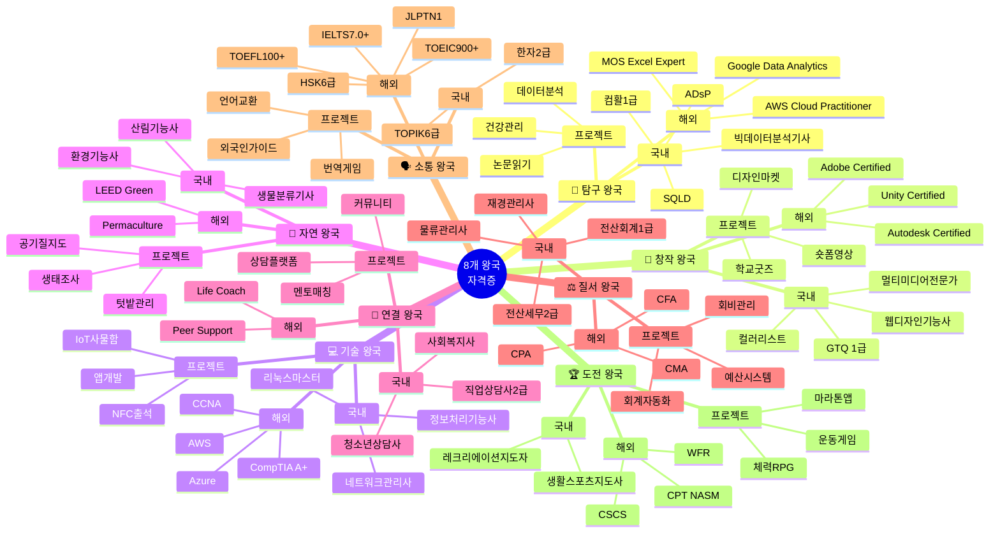

---

## 📊 자격증 취득 단계도

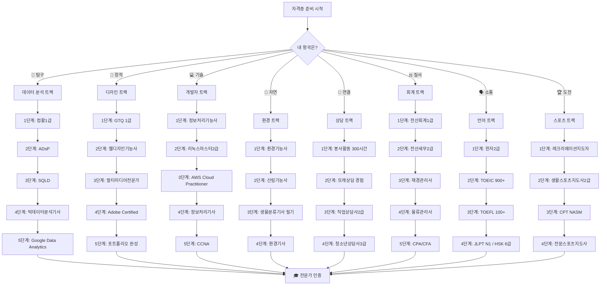

---

## 🎯 학년별 자격증 로드맵

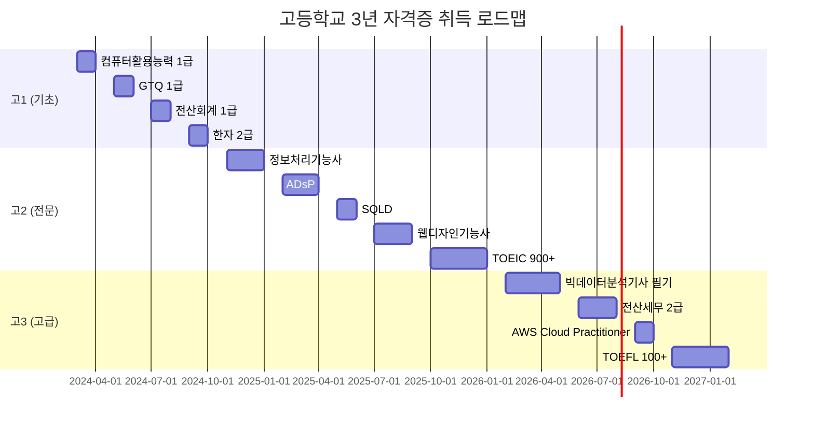

---

## 🏆 자격증 등급 체계

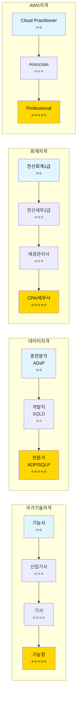

---

## 🎓 왕국별 자격증 마인드맵

### 🔬 탐구 왕국 자격증 맵

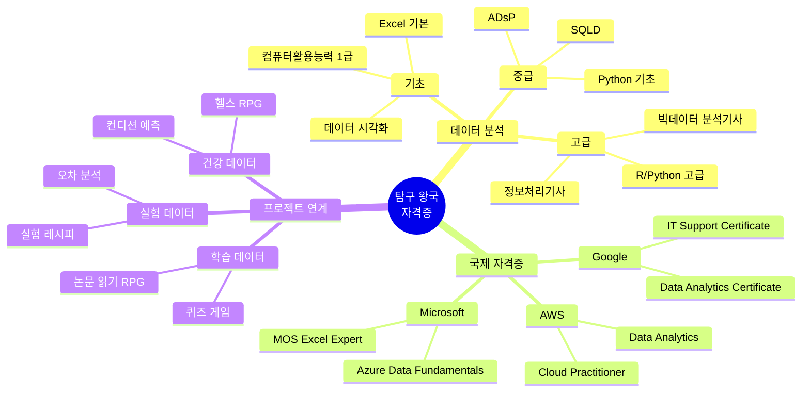

---

### 🎨 창작 왕국 자격증 맵

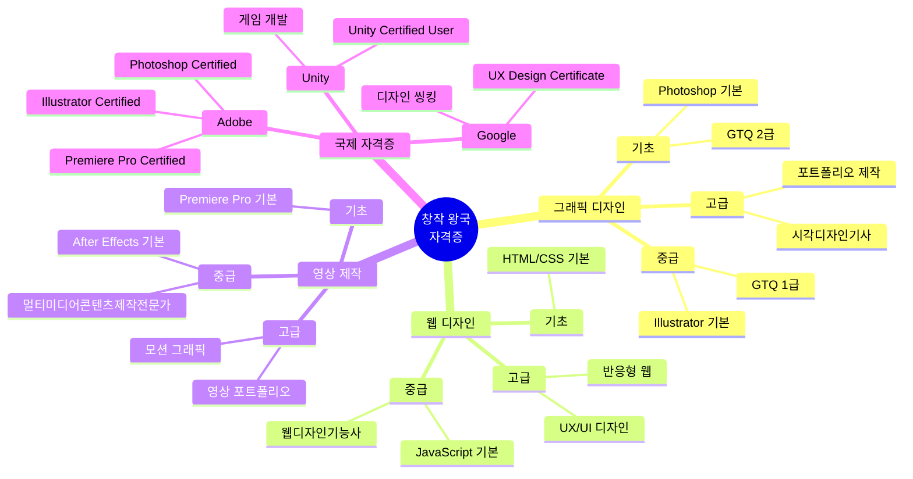

---

### 💻 기술 왕국 자격증 맵

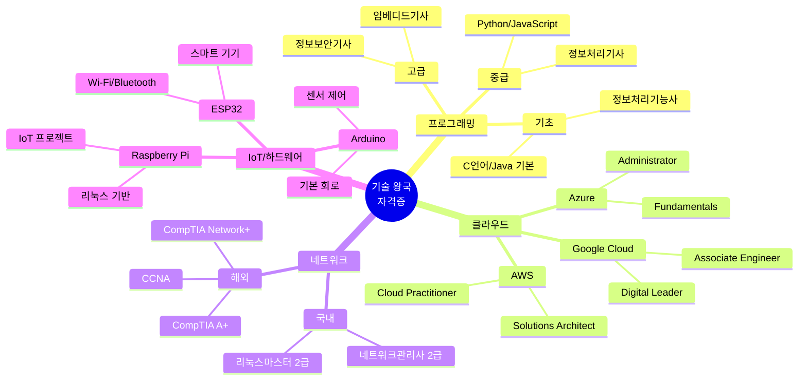

---

### 🌿 자연 왕국 자격증 맵

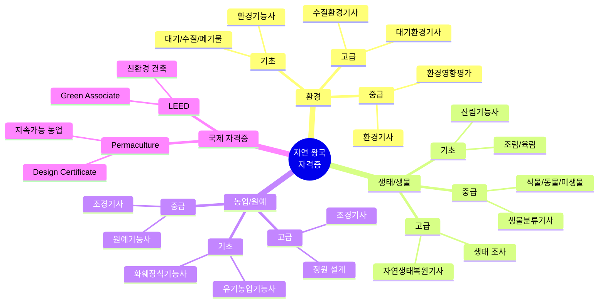

---

### 🤝 연결 왕국 자격증 맵

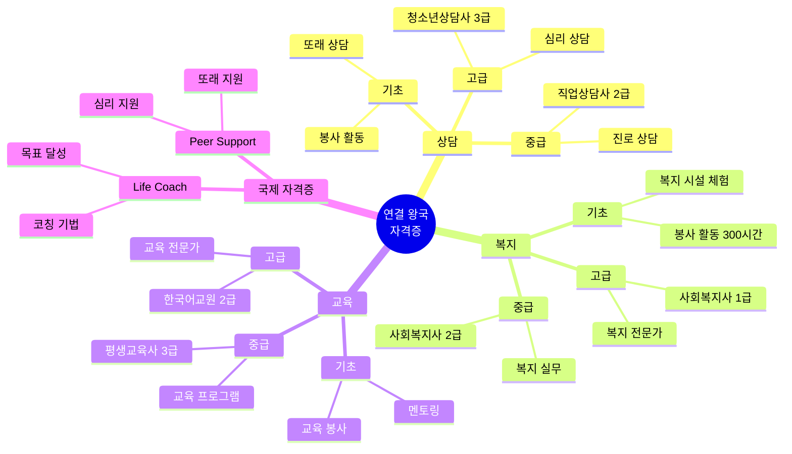

---

### ⚖️ 질서 왕국 자격증 맵

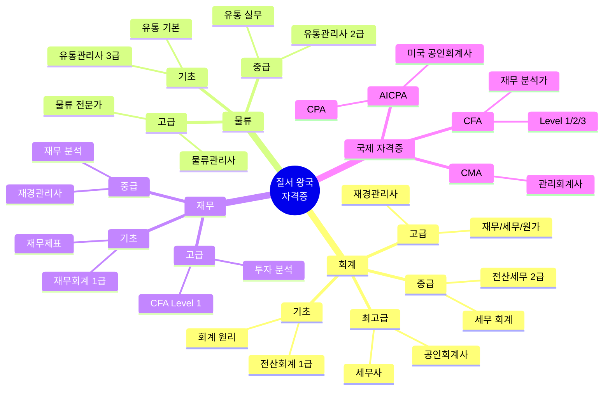

---

### 🗣️ 소통 왕국 자격증 맵

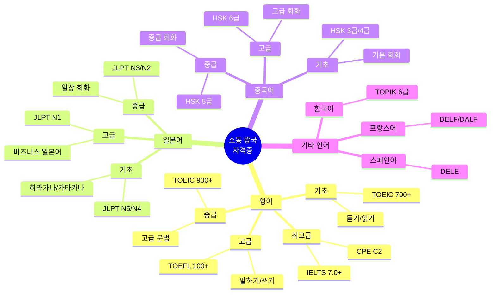

---

### 🏆 도전 왕국 자격증 맵

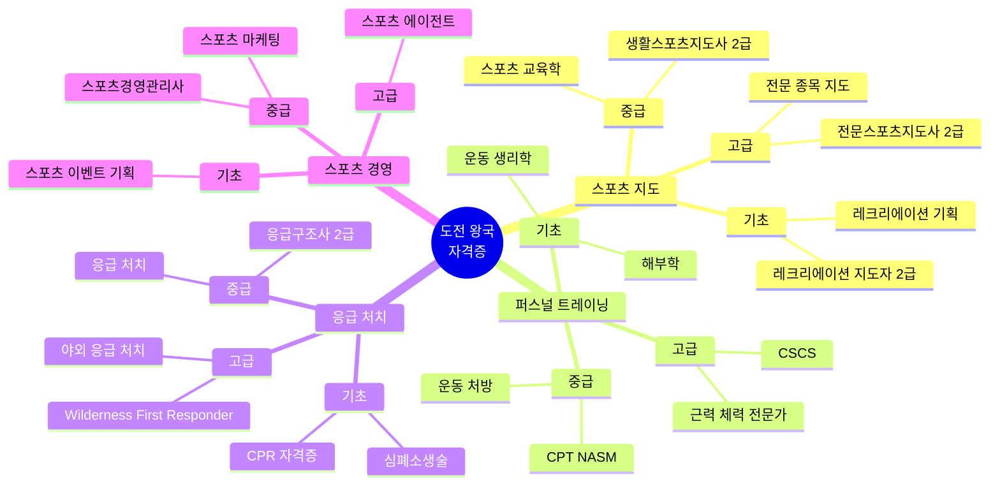

---

## 📈 난이도별 자격증 피라미드

```mermaid
flowchart TD
    subgraph Level5[⭐⭐⭐⭐⭐ 최고급]
        L5A[공인회계사 CPA]
        L5B[세무사]
        L5C[빅데이터분석기사 실기]
        L5D[정보보안기사]
        L5E[CFA Level 3]
    end
    
    subgraph Level4[⭐⭐⭐⭐ 고급]
        L4A[정보처리기사]
        L4B[물류관리사]
        L4C[생물분류기사]
        L4D[TOEFL 100+]
        L4E[IELTS 7.0+]
        L4F[CCNA]
    end
    
    subgraph Level3[⭐⭐⭐ 중급]
        L3A[빅데이터분석기사 필기]
        L3B[전산세무 2급]
        L3C[재경관리사]
        L3D[직업상담사 2급]
        L3E[생활스포츠지도사 2급]
        L3F[TOEIC 900+]
    end
    
    subgraph Level2[⭐⭐ 초급]
        L2A[정보처리기능사]
        L2B[ADsP]
        L2C[SQLD]
        L2D[GTQ 1급]
        L2E[웹디자인기능사]
        L2F[전산회계 1급]
        L2G[컴퓨터활용능력 1급]
        L2H[리눅스마스터 2급]
        L2I[환경기능사]
    end
    
    subgraph Level1[⭐ 입문]
        L1A[컴퓨터활용능력 2급]
        L1B[GTQ 2급]
        L1C[전산회계 2급]
        L1D[워드프로세서]
        L1E[한자 2급]
    end
    
    Level1 --> Level2
    Level2 --> Level3
    Level3 --> Level4
    Level4 --> Level5
    
    style Level5 fill:#ffd700,color:#111
    style Level4 fill:#ffa500,color:#111
    style Level3 fill:#90ee90,color:#111
    style Level2 fill:#87ceeb,color:#111
    style Level1 fill:#e0e0e0,color:#111
```

---

## 🔄 자격증 취득 프로세스

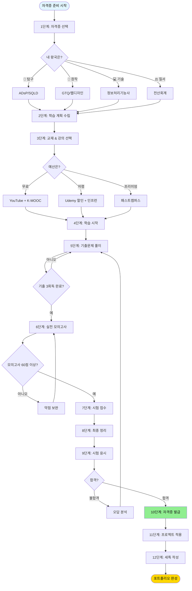

---

## 💰 자격증 비용 vs 효과 분석

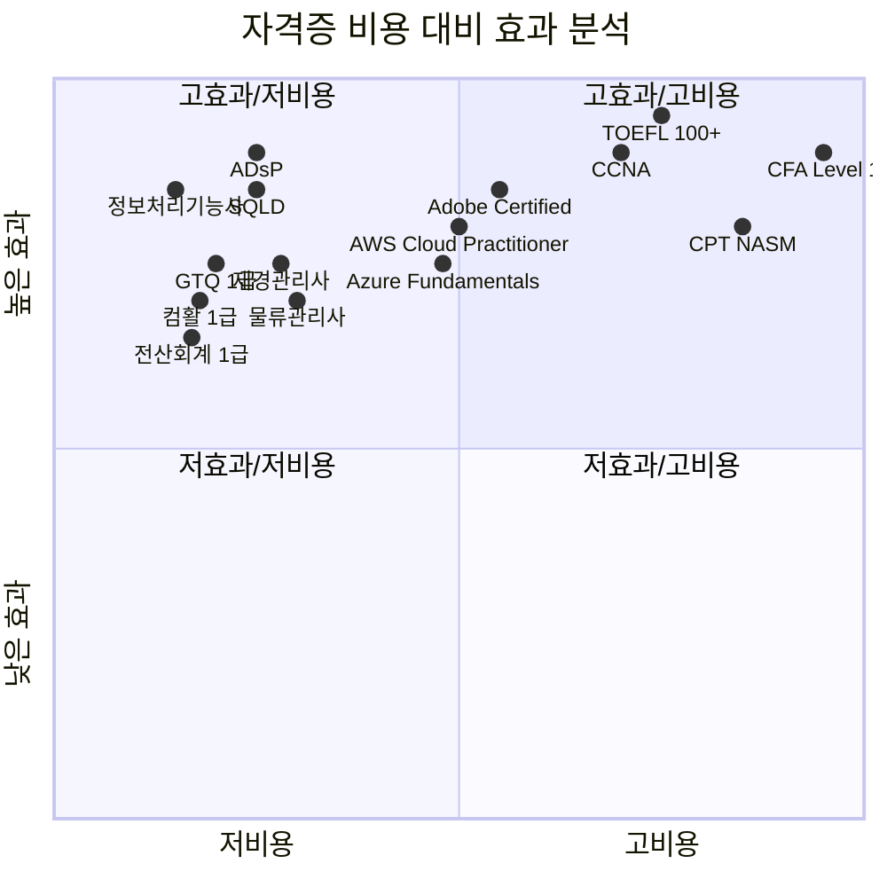

---

## 🔬 01. 탐구 왕국 자격증

### 취득 가능 (고등학생)

#### 1. 빅데이터 분석기사 (필기)
- **발급기관**: 한국데이터산업진흥원
- **난이도**: ⭐⭐⭐
- **응시 자격**: 제한 없음 (필기만 가능, 실기는 관련 경력 필요)
- **시험 과목**: 빅데이터 분석 기획, 빅데이터 탐색, 빅데이터 모델링, 빅데이터 결과 해석
- **준비 기간**: 3-4개월
- **프로젝트 연계**: EXP-01 (퀴즈 게임), EXP-10 (논문 읽기 RPG)
- **세특 활용**: "빅데이터 분석기사 필기 합격 후 학습 데이터 분석 프로젝트 수행"

#### 2. 데이터분석 준전문가 (ADsP)
- **발급기관**: 한국데이터산업진흥원
- **난이도**: ⭐⭐
- **응시 자격**: 제한 없음
- **시험 과목**: 데이터 이해, 데이터 분석 기획, 데이터 분석
- **준비 기간**: 2-3개월
- **프로젝트 연계**: EXP-02 (헬스 RPG), EXP-10 (시험 컨디션 예측)
- **세특 활용**: "ADsP 취득 후 건강 데이터 분석 및 시각화 프로젝트 진행"

#### 3. SQL 개발자 (SQLD)
- **발급기관**: 한국데이터산업진흥원
- **난이도**: ⭐⭐
- **응시 자격**: 제한 없음
- **시험 과목**: 데이터 모델링, SQL 기본 및 활용
- **준비 기간**: 1-2개월
- **프로젝트 연계**: 모든 데이터 기반 프로젝트
- **세특 활용**: "SQLD 취득 후 Firebase 데이터베이스 설계 및 쿼리 최적화"

#### 4. 컴퓨터활용능력 1급
- **발급기관**: 대한상공회의소
- **난이도**: ⭐⭐
- **응시 자격**: 제한 없음
- **시험 과목**: 컴퓨터 일반, 스프레드시트, 데이터베이스
- **준비 기간**: 1-2개월
- **프로젝트 연계**: EXP-06 (급식 예측), EXP-07 (약 리뷰)
- **세특 활용**: "컴활 1급 취득 후 Excel 데이터 분석 및 시각화 역량 강화"

### 준비 추천 (대학 진학 후)

#### 1. 빅데이터 분석기사 (실기)
- **응시 자격**: 관련 경력 또는 학위 필요
- **고교 준비**: 필기 합격 + Python, R 실습 프로젝트
- **추천 학과**: 통계학, 데이터사이언스, 컴퓨터공학

#### 2. 정보처리기사
- **응시 자격**: 관련 학과 졸업 예정자
- **고교 준비**: 프로그래밍 기초 (Python, Java)
- **추천 학과**: 컴퓨터공학, 소프트웨어학과

#### 3. 사회조사분석사 2급
- **응시 자격**: 제한 없음 (대학생 추천)
- **고교 준비**: 통계 기초, 설문 조사 프로젝트
- **추천 학과**: 통계학, 사회학, 심리학

### 국제 자격증

#### 1. Google Data Analytics Certificate
- **발급기관**: Google (Coursera)
- **난이도**: ⭐⭐
- **온라인 수강**: 가능 (영어)
- **준비 기간**: 3-6개월
- **비용**: 약 $39/월 (Coursera 구독)
- **프로젝트 연계**: 모든 데이터 분석 프로젝트

#### 2. Microsoft Office Specialist (MOS) - Excel Expert
- **발급기관**: Microsoft
- **난이도**: ⭐⭐
- **응시 자격**: 제한 없음
- **준비 기간**: 1-2개월
- **프로젝트 연계**: 데이터 시각화 프로젝트

---

## 🎨 02. 창작 왕국 자격증

### 취득 가능 (고등학생)

#### 1. GTQ (그래픽기술자격)
- **발급기관**: 한국생산성본부
- **난이도**: ⭐⭐
- **응시 자격**: 제한 없음
- **시험 도구**: Photoshop, Illustrator
- **급수**: 1급, 2급
- **준비 기간**: 1-2개월
- **프로젝트 연계**: CRE-02 (학교 굿즈), CRE-07 (패션 코디)
- **세특 활용**: "GTQ 1급 취득 후 학교 굿즈 디자인 150개 판매"

#### 2. 컬러리스트 기사/산업기사
- **발급기관**: 한국산업인력공단
- **난이도**: ⭐⭐⭐
- **응시 자격**: 제한 없음 (산업기사)
- **시험 과목**: 색채 심리, 색채 디자인, 색채 관리
- **준비 기간**: 2-3개월
- **프로젝트 연계**: CRE-01 (AI 그림), CRE-07 (패션 코디)
- **세특 활용**: "컬러리스트 산업기사 취득 후 색채 이론 기반 디자인 프로젝트"

#### 3. 웹디자인기능사
- **발급기관**: 한국산업인력공단
- **난이도**: ⭐⭐
- **응시 자격**: 제한 없음
- **시험 과목**: HTML, CSS, JavaScript, Photoshop
- **준비 기간**: 2-3개월
- **프로젝트 연계**: CRE-08 (학교 신문), CRE-04 (웹툰 플랫폼)
- **세특 활용**: "웹디자인기능사 취득 후 반응형 웹사이트 제작"

#### 4. 멀티미디어콘텐츠제작전문가
- **발급기관**: 한국생산성본부
- **난이도**: ⭐⭐
- **응시 자격**: 제한 없음
- **시험 도구**: Premiere Pro, After Effects
- **준비 기간**: 2-3개월
- **프로젝트 연계**: CRE-03 (숏폼 영상), CRE-05 (학교 방송)
- **세특 활용**: "멀티미디어콘텐츠제작전문가 취득 후 교육 숏폼 30개 제작"

### 준비 추천 (대학 진학 후)

#### 1. 시각디자인기사/산업기사
- **응시 자격**: 관련 학과 또는 경력
- **고교 준비**: GTQ, 포트폴리오 제작
- **추천 학과**: 시각디자인, 산업디자인

#### 2. 제품디자인기사/산업기사
- **응시 자격**: 관련 학과 또는 경력
- **고교 준비**: 3D 모델링 (Blender, Fusion 360)
- **추천 학과**: 산업디자인, 제품디자인

#### 3. 영상편집 전문가
- **응시 자격**: 제한 없음
- **고교 준비**: Premiere Pro, DaVinci Resolve 실습
- **추천 학과**: 영상학과, 미디어학과

### 국제 자격증

#### 1. Adobe Certified Professional (ACP)
- **발급기관**: Adobe
- **난이도**: ⭐⭐⭐
- **종류**: Photoshop, Illustrator, Premiere Pro, After Effects
- **응시 자격**: 제한 없음
- **준비 기간**: 2-3개월 (도구당)
- **비용**: 약 $180 (시험당)
- **프로젝트 연계**: 모든 디자인/영상 프로젝트

#### 2. Unity Certified User
- **발급기관**: Unity Technologies
- **난이도**: ⭐⭐
- **응시 자격**: 제한 없음
- **준비 기간**: 3-4개월
- **프로젝트 연계**: CRE-09 (건축 게임)

#### 3. Autodesk Certified User (ACU)
- **발급기관**: Autodesk
- **난이도**: ⭐⭐
- **종류**: AutoCAD, Fusion 360, Maya
- **프로젝트 연계**: CRE-09 (건축 게임)

---

## 💻 03. 기술 왕국 자격증

### 취득 가능 (고등학생)

#### 1. 정보처리기능사
- **발급기관**: 한국산업인력공단
- **난이도**: ⭐⭐
- **응시 자격**: 제한 없음
- **시험 과목**: 프로그래밍, 데이터베이스, 네트워크
- **준비 기간**: 2-3개월
- **프로젝트 연계**: 모든 기술 프로젝트
- **세특 활용**: "정보처리기능사 취득 후 NFC 출석 시스템 개발"

#### 2. 리눅스마스터 2급
- **발급기관**: 한국정보통신진흥협회
- **난이도**: ⭐⭐
- **응시 자격**: 제한 없음
- **시험 과목**: 리눅스 기초, 시스템 관리
- **준비 기간**: 1-2개월
- **프로젝트 연계**: TECH-08 (온도 조절), TECH-10 (분실물)
- **세특 활용**: "리눅스마스터 2급 취득 후 Raspberry Pi 기반 IoT 프로젝트"

#### 3. 네트워크관리사 2급
- **발급기관**: 한국정보통신자격협회
- **난이도**: ⭐⭐
- **응시 자격**: 제한 없음
- **시험 과목**: 네트워크 일반, TCP/IP
- **준비 기간**: 2-3개월
- **프로젝트 연계**: TECH-03 (Wi-Fi 지도)
- **세특 활용**: "네트워크관리사 2급 취득 후 학교 네트워크 분석 프로젝트"

#### 4. 정보기기운용기능사
- **발급기관**: 한국산업인력공단
- **난이도**: ⭐
- **응시 자격**: 제한 없음
- **시험 과목**: 하드웨어, 소프트웨어, 네트워크
- **준비 기간**: 1개월
- **프로젝트 연계**: TECH-05 (스마트 사물함)
- **세특 활용**: "정보기기운용기능사 취득 후 하드웨어 통합 프로젝트"

### 준비 추천 (대학 진학 후)

#### 1. 정보처리기사
- **응시 자격**: 관련 학과 졸업 예정자
- **고교 준비**: 정보처리기능사 + 프로그래밍 실습
- **추천 학과**: 컴퓨터공학, 소프트웨어학과

#### 2. 정보보안기사/산업기사
- **응시 자격**: 관련 학과 또는 경력
- **고교 준비**: 네트워크 기초, 암호학 학습
- **추천 학과**: 정보보안학과, 컴퓨터공학

#### 3. 전자계산기조직응용기사
- **응시 자격**: 관련 학과 또는 경력
- **고교 준비**: 컴퓨터구조, 운영체제 학습
- **추천 학과**: 컴퓨터공학, 전자공학

#### 4. 임베디드기사/산업기사
- **응시 자격**: 관련 학과 또는 경력
- **고교 준비**: Arduino, Raspberry Pi 프로젝트
- **추천 학과**: 전자공학, 컴퓨터공학

### 국제 자격증

#### 1. AWS Certified Cloud Practitioner
- **발급기관**: Amazon Web Services
- **난이도**: ⭐⭐
- **응시 자격**: 제한 없음
- **준비 기간**: 1-2개월
- **비용**: $100
- **프로젝트 연계**: TECH-02 (AI 노트), TECH-06 (급식 대기)

#### 2. CompTIA A+
- **발급기관**: CompTIA
- **난이도**: ⭐⭐
- **응시 자격**: 제한 없음
- **준비 기간**: 2-3개월
- **비용**: $246 (2개 시험)
- **프로젝트 연계**: TECH-05 (스마트 사물함)

#### 3. Cisco Certified Network Associate (CCNA)
- **발급기관**: Cisco
- **난이도**: ⭐⭐⭐
- **응시 자격**: 제한 없음
- **준비 기간**: 3-6개월
- **비용**: $300
- **프로젝트 연계**: TECH-03 (Wi-Fi 지도)

#### 4. Google Cloud Associate Cloud Engineer
- **발급기관**: Google Cloud
- **난이도**: ⭐⭐⭐
- **응시 자격**: 제한 없음
- **준비 기간**: 2-3개월
- **비용**: $125

#### 5. Microsoft Azure Fundamentals (AZ-900)
- **발급기관**: Microsoft
- **난이도**: ⭐⭐
- **응시 자격**: 제한 없음
- **준비 기간**: 1-2개월
- **비용**: $99

---

## 🌿 04. 자연 왕국 자격증

### 취득 가능 (고등학생)

#### 1. 생물분류기사 (필기)
- **발급기관**: 한국산업인력공단
- **난이도**: ⭐⭐⭐
- **응시 자격**: 제한 없음 (필기만 가능)
- **시험 과목**: 식물분류학, 동물분류학, 미생물분류학
- **준비 기간**: 3-4개월
- **프로젝트 연계**: NAT-08 (생태 보물찾기)
- **세특 활용**: "생물분류기사 필기 합격 후 학교 숲 생태 조사 프로젝트"

#### 2. 환경기능사
- **발급기관**: 한국산업인력공단
- **난이도**: ⭐⭐
- **응시 자격**: 제한 없음
- **시험 과목**: 대기, 수질, 폐기물, 소음진동
- **준비 기간**: 2-3개월
- **프로젝트 연계**: NAT-06 (공기질 지도)
- **세특 활용**: "환경기능사 취득 후 학교 환경 모니터링 프로젝트"

#### 3. 산림기능사
- **발급기관**: 한국산업인력공단
- **난이도**: ⭐⭐
- **응시 자격**: 제한 없음
- **시험 과목**: 조림, 육림, 임업경영
- **준비 기간**: 2-3개월
- **프로젝트 연계**: NAT-08 (생태 보물찾기)
- **세특 활용**: "산림기능사 취득 후 학교 숲 관리 및 수종 조사"

#### 4. 화훼장식기능사
- **발급기관**: 한국산업인력공단
- **난이도**: ⭐⭐
- **응시 자격**: 제한 없음
- **시험 과목**: 화훼장식 이론 및 실기
- **준비 기간**: 2-3개월
- **프로젝트 연계**: NAT-03 (식물 키우기)
- **세특 활용**: "화훼장식기능사 취득 후 학교 정원 디자인 프로젝트"

#### 5. 유기농업기능사
- **발급기관**: 한국산업인력공단
- **난이도**: ⭐⭐
- **응시 자격**: 제한 없음
- **시험 과목**: 유기농업 이론, 재배 실습
- **준비 기간**: 2-3개월
- **프로젝트 연계**: NAT-02 (텃밭 게임)
- **세특 활용**: "유기농업기능사 취득 후 학교 텃밭 유기농 재배"

### 준비 추천 (대학 진학 후)

#### 1. 생물분류기사 (실기)
- **응시 자격**: 관련 학과 또는 경력
- **고교 준비**: 필기 합격 + 생태 조사 프로젝트
- **추천 학과**: 생물학, 생태학, 환경학

#### 2. 환경기사/산업기사
- **응시 자격**: 관련 학과 또는 경력
- **고교 준비**: 환경기능사 + 환경 모니터링 프로젝트
- **추천 학과**: 환경공학, 환경과학

#### 3. 대기환경기사/산업기사
- **응시 자격**: 관련 학과 또는 경력
- **고교 준비**: 대기질 측정 프로젝트
- **추천 학과**: 환경공학, 대기과학

#### 4. 수질환경기사/산업기사
- **응시 자격**: 관련 학과 또는 경력
- **고교 준비**: 수질 측정 프로젝트
- **추천 학과**: 환경공학, 수자원공학

#### 5. 조경기사/산업기사
- **응시 자격**: 관련 학과 또는 경력
- **고교 준비**: 정원 설계 프로젝트
- **추천 학과**: 조경학, 원예학

### 국제 자격증

#### 1. LEED Green Associate
- **발급기관**: U.S. Green Building Council
- **난이도**: ⭐⭐⭐
- **응시 자격**: 제한 없음
- **준비 기간**: 2-3개월
- **비용**: $250
- **프로젝트 연계**: 친환경 건축 프로젝트

#### 2. Permaculture Design Certificate (PDC)
- **발급기관**: 국제 퍼머컬처 기관
- **난이도**: ⭐⭐
- **응시 자격**: 제한 없음
- **준비 기간**: 72시간 코스
- **비용**: 약 $1,000-2,000
- **프로젝트 연계**: NAT-02 (텃밭 게임)

---

## 🤝 05. 연결 왕국 자격증

### 취득 가능 (고등학생)

#### 1. 사회복지사 2급
- **발급기관**: 보건복지부
- **난이도**: ⭐⭐⭐
- **응시 자격**: 대학에서 관련 과목 이수 (고교생 불가, 대학 진학 후)
- **고교 준비**: 봉사 활동, 복지 프로젝트
- **프로젝트 연계**: CONN-01 (동네 도움), CONN-03 (할머니 말벗)
- **세특 활용**: "사회복지 관련 봉사 활동 300시간, 독거노인 돌봄 프로젝트"

#### 2. 청소년상담사 3급
- **발급기관**: 여성가족부
- **난이도**: ⭐⭐⭐
- **응시 자격**: 대학 졸업 이상 (고교생 불가)
- **고교 준비**: 또래 상담, 심리학 학습
- **프로젝트 연계**: CONN-04 (고민 상담)
- **세특 활용**: "또래 상담 동아리 활동, 학급 고민 상담 50건"

#### 3. 평생교육사 3급
- **발급기관**: 교육부
- **난이도**: ⭐⭐⭐
- **응시 자격**: 대학에서 관련 과목 이수
- **고교 준비**: 교육 봉사, 멘토링
- **프로젝트 연계**: CONN-07 (재능 교환)
- **세특 활용**: "초등학생 코딩 멘토링 20회, 교육 프로그램 기획"

#### 4. 직업상담사 2급
- **발급기관**: 한국산업인력공단
- **난이도**: ⭐⭐⭐
- **응시 자격**: 제한 없음
- **시험 과목**: 직업상담학, 직업심리학, 노동시장론
- **준비 기간**: 3-4개월
- **프로젝트 연계**: CONN-09 (진로 매칭)
- **세특 활용**: "직업상담사 2급 취득 후 또래 진로 상담 프로그램 운영"

### 준비 추천 (대학 진학 후)

#### 1. 사회복지사 1급
- **응시 자격**: 사회복지학 학사 이상
- **고교 준비**: 봉사 활동, 복지 프로젝트
- **추천 학과**: 사회복지학, 사회학

#### 2. 청소년상담사 2급
- **응시 자격**: 관련 학과 석사 이상
- **고교 준비**: 또래 상담, 심리학 학습
- **추천 학과**: 심리학, 상담학

#### 3. 임상심리사 2급
- **응시 자격**: 심리학 학사 + 실습
- **고교 준비**: 심리학 서적 독서, 상담 봉사
- **추천 학과**: 심리학

#### 4. 건강가정사
- **응시 자격**: 대학에서 관련 과목 이수
- **고교 준비**: 가족 상담, 복지 봉사
- **추천 학과**: 가족학, 사회복지학

### 국제 자격증

#### 1. Certified Peer Support Specialist (CPSS)
- **발급기관**: 미국 각 주 보건부
- **난이도**: ⭐⭐
- **응시 자격**: 교육 이수 + 경험
- **고교 준비**: 또래 상담 경험

#### 2. Life Coach Certification
- **발급기관**: International Coach Federation (ICF)
- **난이도**: ⭐⭐⭐
- **응시 자격**: 교육 이수
- **준비 기간**: 60-125시간 코스
- **비용**: 약 $3,000-10,000

---

## ⚖️ 06. 질서 왕국 자격증

### 취득 가능 (고등학생)

#### 1. 전산회계 1급
- **발급기관**: 한국세무사회
- **난이도**: ⭐⭐
- **응시 자격**: 제한 없음
- **시험 과목**: 회계 원리, 전산 회계
- **준비 기간**: 1-2개월
- **프로젝트 연계**: ORD-02 (용돈 관리), ORD-05 (동아리 회계)
- **세특 활용**: "전산회계 1급 취득 후 동아리 회계 시스템 구축"

#### 2. 전산세무 2급
- **발급기관**: 한국세무사회
- **난이도**: ⭐⭐⭐
- **응시 자격**: 제한 없음
- **시험 과목**: 회계, 세무, 전산 실무
- **준비 기간**: 2-3개월
- **프로젝트 연계**: ORD-02 (용돈 관리), ORD-05 (동아리 회계)
- **세특 활용**: "전산세무 2급 취득 후 학생 창업 세무 자동화 프로젝트"

#### 3. 재경관리사
- **발급기관**: 삼일회계법인
- **난이도**: ⭐⭐⭐
- **응시 자격**: 제한 없음
- **시험 과목**: 재무회계, 세무회계, 원가관리회계
- **준비 기간**: 3-4개월
- **프로젝트 연계**: ORD-05 (동아리 회계)
- **세특 활용**: "재경관리사 취득 후 학생 창업 재무 관리 컨설팅"

#### 4. 물류관리사
- **발급기관**: 한국산업인력공단
- **난이도**: ⭐⭐⭐
- **응시 자격**: 제한 없음
- **시험 과목**: 물류관리, 화물운송, 국제물류
- **준비 기간**: 3-4개월
- **프로젝트 연계**: ORD-06 (교과서 배송)
- **세특 활용**: "물류관리사 취득 후 학교 물류 최적화 프로젝트"

#### 5. 유통관리사 2급
- **발급기관**: 대한상공회의소
- **난이도**: ⭐⭐
- **응시 자격**: 제한 없음
- **시험 과목**: 유통 상식, 판매 및 고객 관리
- **준비 기간**: 2-3개월
- **프로젝트 연계**: ORD-08 (학교 매점)
- **세특 활용**: "유통관리사 2급 취득 후 학교 매점 재고 관리 시스템 구축"

### 준비 추천 (대학 진학 후)

#### 1. 공인회계사 (CPA)
- **응시 자격**: 대학 졸업 예정자
- **고교 준비**: 전산회계, 재경관리사
- **추천 학과**: 회계학, 경영학

#### 2. 세무사
- **응시 자격**: 대학 졸업 이상
- **고교 준비**: 전산세무, 세법 학습
- **추천 학과**: 세무학, 회계학

#### 3. 감정평가사
- **응시 자격**: 대학 졸업 이상
- **고교 준비**: 부동산 학습, 경제 이해
- **추천 학과**: 부동산학, 경영학

#### 4. 관세사
- **응시 자격**: 대학 졸업 이상
- **고교 준비**: 물류관리사, 무역 학습
- **추천 학과**: 무역학, 관세학

### 국제 자격증

#### 1. Certified Public Accountant (CPA) - AICPA
- **발급기관**: American Institute of CPAs
- **난이도**: ⭐⭐⭐⭐⭐
- **응시 자격**: 학사 + 회계 학점
- **준비 기간**: 1-2년
- **비용**: 약 $3,000-5,000

#### 2. Chartered Financial Analyst (CFA) Level 1
- **발급기관**: CFA Institute
- **난이도**: ⭐⭐⭐⭐
- **응시 자격**: 학사 졸업 예정자
- **준비 기간**: 6-12개월
- **비용**: $1,450 (Level 1)

#### 3. Certified Management Accountant (CMA)
- **발급기관**: Institute of Management Accountants
- **난이도**: ⭐⭐⭐⭐
- **응시 자격**: 학사 이상
- **준비 기간**: 6-12개월
- **비용**: $1,770

---

## 🗣️ 07. 소통 왕국 자격증

### 취득 가능 (고등학생)

#### 1. 한국어능력시험 (TOPIK) 6급
- **발급기관**: 국립국제교육원
- **난이도**: ⭐⭐⭐
- **응시 자격**: 제한 없음
- **시험 과목**: 읽기, 쓰기, 듣기
- **준비 기간**: 6-12개월 (외국인 기준)
- **프로젝트 연계**: COMM-02 (다문화 통역)
- **세특 활용**: "TOPIK 6급 취득 후 다문화 학생 한국어 멘토링"

#### 2. TOEIC 900점 이상
- **발급기관**: ETS
- **난이도**: ⭐⭐⭐
- **응시 자격**: 제한 없음
- **시험 과목**: 듣기, 읽기
- **준비 기간**: 3-6개월
- **프로젝트 연계**: COMM-01 (번역 게임), COMM-03 (외국인 가이드)
- **세특 활용**: "TOEIC 900점 취득 후 외국인 관광객 가이드 봉사 30회"

#### 3. TOEFL iBT 100점 이상
- **발급기관**: ETS
- **난이도**: ⭐⭐⭐⭐
- **응시 자격**: 제한 없음
- **시험 과목**: 읽기, 듣기, 말하기, 쓰기
- **준비 기간**: 6-12개월
- **프로젝트 연계**: COMM-01 (번역 게임)
- **세특 활용**: "TOEFL 100점 취득 후 영어 논문 읽기 및 요약 프로젝트"

#### 4. IELTS 7.0 이상
- **발급기관**: British Council
- **난이도**: ⭐⭐⭐⭐
- **응시 자격**: 제한 없음
- **시험 과목**: 읽기, 듣기, 말하기, 쓰기
- **준비 기간**: 6-12개월
- **프로젝트 연계**: COMM-03 (외국인 가이드)
- **세특 활용**: "IELTS 7.0 취득 후 국제 교류 프로그램 통역"

#### 5. 한자능력검정시험 2급
- **발급기관**: 한국어문회
- **난이도**: ⭐⭐
- **응시 자격**: 제한 없음
- **시험 과목**: 한자 읽기, 쓰기, 활용
- **준비 기간**: 2-3개월
- **프로젝트 연계**: COMM-05 (고전 번역)
- **세특 활용**: "한자 2급 취득 후 한문 고전 번역 프로젝트"

### 준비 추천 (대학 진학 후)

#### 1. 번역사/통역사 자격증
- **응시 자격**: 대학 졸업 이상
- **고교 준비**: TOEIC/TOEFL 고득점, 번역 실습
- **추천 학과**: 통번역학, 외국어학

#### 2. 한국어교원 2급
- **응시 자격**: 대학에서 관련 과목 이수
- **고교 준비**: 외국인 한국어 교육 봉사
- **추천 학과**: 한국어교육학, 국어국문학

#### 3. 관광통역안내사
- **응시 자격**: 제한 없음
- **고교 준비**: 외국어 고득점, 관광 가이드 봉사
- **추천 학과**: 관광학, 통번역학

### 국제 자격증

#### 1. Cambridge English: Proficiency (CPE)
- **발급기관**: Cambridge Assessment English
- **난이도**: ⭐⭐⭐⭐⭐
- **응시 자격**: 제한 없음
- **준비 기간**: 1-2년
- **비용**: 약 $250

#### 2. DELE (스페인어)
- **발급기관**: Instituto Cervantes
- **난이도**: ⭐⭐⭐
- **응시 자격**: 제한 없음
- **준비 기간**: 6-12개월
- **비용**: 약 €100-200

#### 3. DELF/DALF (프랑스어)
- **발급기관**: 프랑스 교육부
- **난이도**: ⭐⭐⭐
- **응시 자격**: 제한 없음
- **준비 기간**: 6-12개월
- **비용**: 약 €100-200

#### 4. JLPT N1 (일본어)
- **발급기관**: 일본국제교육지원협회
- **난이도**: ⭐⭐⭐⭐
- **응시 자격**: 제한 없음
- **준비 기간**: 1-2년
- **비용**: 약 ¥7,000

#### 5. HSK 6급 (중국어)
- **발급기관**: 중국 교육부
- **난이도**: ⭐⭐⭐⭐
- **응시 자격**: 제한 없음
- **준비 기간**: 1-2년
- **비용**: 약 ¥450

---

## 🏆 08. 도전 왕국 자격증

### 취득 가능 (고등학생)

#### 1. 생활스포츠지도사 2급
- **발급기관**: 국민체육진흥공단
- **난이도**: ⭐⭐⭐
- **응시 자격**: 만 18세 이상
- **시험 과목**: 스포츠 교육학, 스포츠 심리학, 운동 생리학
- **준비 기간**: 3-4개월
- **프로젝트 연계**: CHAL-01 (운동 게임), CHAL-02 (홈트 배틀)
- **세특 활용**: "생활스포츠지도사 2급 취득 후 학생 운동 프로그램 기획"

#### 2. 응급구조사 2급
- **발급기관**: 한국보건의료인국가시험원
- **난이도**: ⭐⭐⭐
- **응시 자격**: 관련 학과 졸업 (고교생 불가)
- **고교 준비**: 응급처치 교육, CPR 자격증
- **프로젝트 연계**: CHAL-05 (안전 지도)
- **세특 활용**: "CPR 자격증 취득 후 학교 안전 교육 봉사 20회"

#### 3. 레크리에이션 지도자 2급
- **발급기관**: 한국레크리에이션협회
- **난이도**: ⭐⭐
- **응시 자격**: 만 18세 이상
- **시험 과목**: 레크리에이션 이론 및 실기
- **준비 기간**: 1-2개월
- **프로젝트 연계**: CHAL-03 (등산 챌린지), CHAL-04 (자전거 게임)
- **세특 활용**: "레크리에이션 지도자 2급 취득 후 학교 체육대회 기획"

#### 4. 청소년지도사 3급
- **발급기관**: 여성가족부
- **난이도**: ⭐⭐⭐
- **응시 자격**: 대학 졸업 이상 (고교생 불가)
- **고교 준비**: 청소년 활동 기획, 봉사
- **프로젝트 연계**: CHAL-07 (도전 챌린지)
- **세특 활용**: "청소년 활동 기획 동아리, 캠프 프로그램 5회 운영"

### 준비 추천 (대학 진학 후)

#### 1. 전문스포츠지도사
- **응시 자격**: 관련 학과 또는 경력
- **고교 준비**: 생활스포츠지도사, 운동 경력
- **추천 학과**: 체육학, 스포츠과학

#### 2. 운동처방사
- **응시 자격**: 관련 학과 학사 이상
- **고교 준비**: 운동 생리학 학습, 헬스 트레이닝
- **추천 학과**: 체육학, 운동처방학

#### 3. 스포츠경영관리사
- **응시 자격**: 제한 없음
- **고교 준비**: 스포츠 이벤트 기획
- **추천 학과**: 스포츠경영학, 체육학

#### 4. 산업안전기사/산업기사
- **응시 자격**: 관련 학과 또는 경력
- **고교 준비**: 안전 교육, 안전 점검 프로젝트
- **추천 학과**: 안전공학, 산업공학

### 국제 자격증

#### 1. Certified Personal Trainer (CPT) - NASM
- **발급기관**: National Academy of Sports Medicine
- **난이도**: ⭐⭐⭐
- **응시 자격**: 만 18세 이상 + CPR 자격증
- **준비 기간**: 3-6개월
- **비용**: $799
- **프로젝트 연계**: CHAL-01 (운동 게임), CHAL-02 (홈트 배틀)

#### 2. Wilderness First Responder (WFR)
- **발급기관**: Wilderness Medical Associates
- **난이도**: ⭐⭐⭐
- **응시 자격**: 만 18세 이상
- **준비 기간**: 80시간 코스
- **비용**: 약 $1,000
- **프로젝트 연계**: CHAL-03 (등산 챌린지)

#### 3. Certified Strength and Conditioning Specialist (CSCS)
- **발급기관**: National Strength and Conditioning Association
- **난이도**: ⭐⭐⭐⭐
- **응시 자격**: 학사 이상
- **준비 기간**: 6-12개월
- **비용**: $475

---

## 📊 왕국별 자격증 우선순위

### 고등학생 추천 순위 (취득 가능)

| 순위 | 왕국 | 자격증 | 난이도 | 준비 기간 | 포트폴리오 효과 |
|------|------|--------|--------|-----------|----------------|
| 1 | 기술 | 정보처리기능사 | ⭐⭐ | 2-3개월 | ⭐⭐⭐⭐⭐ |
| 2 | 탐구 | ADsP | ⭐⭐ | 2-3개월 | ⭐⭐⭐⭐ |
| 3 | 창작 | GTQ 1급 | ⭐⭐ | 1-2개월 | ⭐⭐⭐⭐ |
| 4 | 질서 | 전산회계 1급 | ⭐⭐ | 1-2개월 | ⭐⭐⭐ |
| 5 | 소통 | TOEIC 900+ | ⭐⭐⭐ | 3-6개월 | ⭐⭐⭐⭐ |
| 6 | 자연 | 환경기능사 | ⭐⭐ | 2-3개월 | ⭐⭐⭐ |
| 7 | 도전 | 생활스포츠지도사 | ⭐⭐⭐ | 3-4개월 | ⭐⭐⭐ |
| 8 | 연결 | 직업상담사 2급 | ⭐⭐⭐ | 3-4개월 | ⭐⭐⭐ |

---

## 💡 자격증 취득 전략

### 1. 프로젝트 우선, 자격증은 보조
- 프로젝트를 먼저 진행하고, 관련 자격증으로 역량 증명
- 자격증만 따는 것보다 "프로젝트 + 자격증" 조합이 강력

### 2. 학년별 추천 로드맵

#### 고1
- 기초 자격증 1-2개 (컴활, GTQ, 전산회계)
- 프로젝트 시작 (간단한 앱/웹사이트)

#### 고2
- 전문 자격증 1-2개 (정보처리기능사, ADsP, TOEIC)
- 프로젝트 심화 (수익 모델, 사용자 확보)

#### 고3
- 고급 자격증 도전 (빅데이터 분석기사 필기, 물류관리사)
- 프로젝트 완성 (포트폴리오, 세특 기록)

### 3. 세특 작성 팁
```
"[자격증명] 취득 후 [프로젝트명]을 통해 [구체적 성과].
[도구/기술] 활용으로 [정량적 결과] 달성."
```

**예시**:
```
"정보처리기능사 취득 후 NFC 출석 시스템 개발.
React Native와 Firebase로 학급 출석률 92% → 98% 향상.
3개 학교 라이선스 판매로 월 45만원 수익 창출."
```

---

## 🎯 왕국별 자격증 + 프로젝트 조합 추천

### 탐구 왕국
- **자격증**: ADsP + SQLD
- **프로젝트**: EXP-02 (헬스 RPG) + EXP-10 (논문 읽기)
- **시너지**: 데이터 분석 역량 증명 + 실제 건강 데이터 분석

### 창작 왕국
- **자격증**: GTQ 1급 + 웹디자인기능사
- **프로젝트**: CRE-02 (학교 굿즈) + CRE-03 (숏폼 영상)
- **시너지**: 디자인 역량 증명 + 실제 판매 실적

### 기술 왕국
- **자격증**: 정보처리기능사 + 리눅스마스터 2급
- **프로젝트**: TECH-01 (NFC 출석) + TECH-05 (스마트 사물함)
- **시너지**: 개발 역량 증명 + IoT 하드웨어 통합

### 자연 왕국
- **자격증**: 환경기능사 + 산림기능사
- **프로젝트**: NAT-06 (공기질 지도) + NAT-08 (생태 보물찾기)
- **시너지**: 환경 전문성 증명 + 실제 환경 개선 제안

### 연결 왕국
- **자격증**: 직업상담사 2급
- **프로젝트**: CONN-04 (고민 상담) + CONN-09 (진로 매칭)
- **시너지**: 상담 역량 증명 + 실제 상담 경험

### 질서 왕국
- **자격증**: 전산회계 1급 + 전산세무 2급
- **프로젝트**: ORD-02 (용돈 관리) + ORD-05 (동아리 회계)
- **시너지**: 회계 역량 증명 + 실제 재무 관리

### 소통 왕국
- **자격증**: TOEIC 900+ + TOEFL 100+
- **프로젝트**: COMM-01 (번역 게임) + COMM-03 (외국인 가이드)
- **시너지**: 언어 역량 증명 + 실제 통역 경험

### 도전 왕국
- **자격증**: 생활스포츠지도사 2급
- **프로젝트**: CHAL-01 (운동 게임) + CHAL-02 (홈트 배틀)
- **시너지**: 운동 전문성 증명 + 실제 운동 프로그램 기획

---

## 📅 자격증 시험 일정 (2026년 기준)

### 상시 시험
- **GTQ**: 매월 2-3회
- **컴퓨터활용능력**: 매월 2-3회
- **전산회계/세무**: 매월 1-2회
- **TOEIC**: 거의 매주

### 정기 시험 (연 3-4회)
- **정보처리기능사**: 3월, 6월, 9월
- **ADsP**: 3월, 6월, 9월, 12월
- **빅데이터 분석기사**: 3월, 6월, 9월

### 연 2회
- **물류관리사**: 5월, 10월
- **직업상담사**: 6월, 9월
- **생활스포츠지도사**: 5월, 11월

---

## 💰 자격증 취득 비용 예상

### 저비용 (5만원 이하)
- 정보처리기능사: 약 2만원
- 컴퓨터활용능력: 약 2만원
- GTQ: 약 3만원
- 전산회계: 약 3만원

### 중비용 (5-10만원)
- ADsP: 약 5만원
- SQLD: 약 5만원
- 리눅스마스터: 약 5만원
- 웹디자인기능사: 약 7만원

### 고비용 (10만원 이상)
- 빅데이터 분석기사: 약 15만원
- 물류관리사: 약 20만원
- 직업상담사: 약 20만원
- 생활스포츠지도사: 약 30만원 (교육 포함)

### 국제 자격증 (고비용)
- AWS Cloud Practitioner: $100 (약 13만원)
- Adobe Certified Professional: $180 (약 24만원)
- TOEFL iBT: $250 (약 33만원)
- CPT (NASM): $799 (약 105만원)

---

## 🎓 학과별 추천 자격증 조합

### 이공계열
1. **컴퓨터공학**: 정보처리기능사 + ADsP + AWS
2. **전자공학**: 정보처리기능사 + 리눅스마스터
3. **환경공학**: 환경기능사 + ADsP
4. **생명과학**: 생물분류기사 필기 + ADsP

### 인문사회계열
1. **경영학**: 전산회계 + ADsP + TOEIC
2. **사회복지학**: 직업상담사 + 봉사 활동
3. **심리학**: 직업상담사 + 또래 상담
4. **통번역학**: TOEIC 900+ + TOEFL 100+

### 예체능계열
1. **디자인**: GTQ 1급 + 웹디자인기능사 + ACP
2. **체육**: 생활스포츠지도사 + CPT
3. **미디어**: 멀티미디어콘텐츠제작전문가 + ACP

---

## ✅ 자격증 준비 체크리스트

### 시험 전 (3개월)
- [ ] 시험 일정 확인 및 접수
- [ ] 교재 구매 및 학습 계획 수립
- [ ] 관련 프로젝트 시작
- [ ] 스터디 그룹 구성 (선택)

### 시험 전 (1개월)
- [ ] 기출문제 3회 이상 풀이
- [ ] 약점 보완 집중 학습
- [ ] 실기 연습 (해당 시)
- [ ] 모의고사 응시

### 시험 후
- [ ] 합격 시: 자격증 발급 신청
- [ ] 프로젝트에 자격증 역량 적용
- [ ] 세특 작성 (자격증 + 프로젝트)
- [ ] 다음 자격증 계획 수립

---

## 📞 자격증 관련 문의처

### 국가 자격증
- **한국산업인력공단**: 1644-8000
- **한국데이터산업진흥원**: 02-3708-5300
- **대한상공회의소**: 02-6050-3000

### 민간 자격증
- **한국생산성본부**: 02-724-1114
- **한국세무사회**: 02-597-3100
- **삼일회계법인**: 02-3781-9000

### 국제 자격증
- **AWS**: aws.amazon.com/ko/certification
- **Adobe**: www.adobe.com/kr/certification
- **Microsoft**: learn.microsoft.com/certifications

---

## 🔗 참고 자료

### 자격증 정보 사이트
- Q-Net (큐넷): www.q-net.or.kr
- 자격증 정보 포털: license.korcham.net
- 국가자격 정보: www.pqi.or.kr

### 학습 자료
- YouTube: 자격증 강의 무료
- 에듀윌, 시대에듀: 온라인 강의
- 스터디 카페: 오프라인 스터디

---

**마지막 업데이트**: 2026년 3월
**문의**: 각 왕국별 프로젝트 담당자
