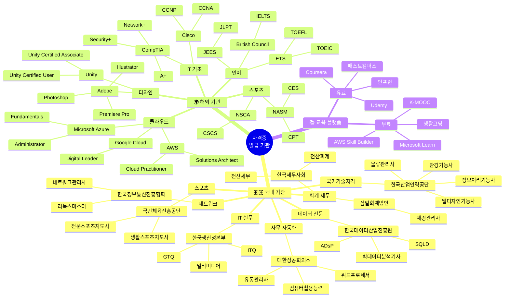
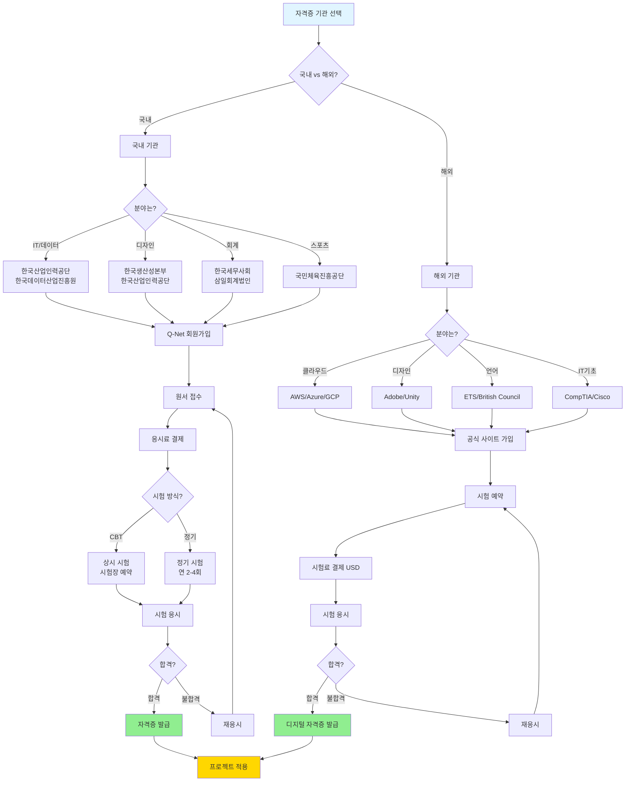
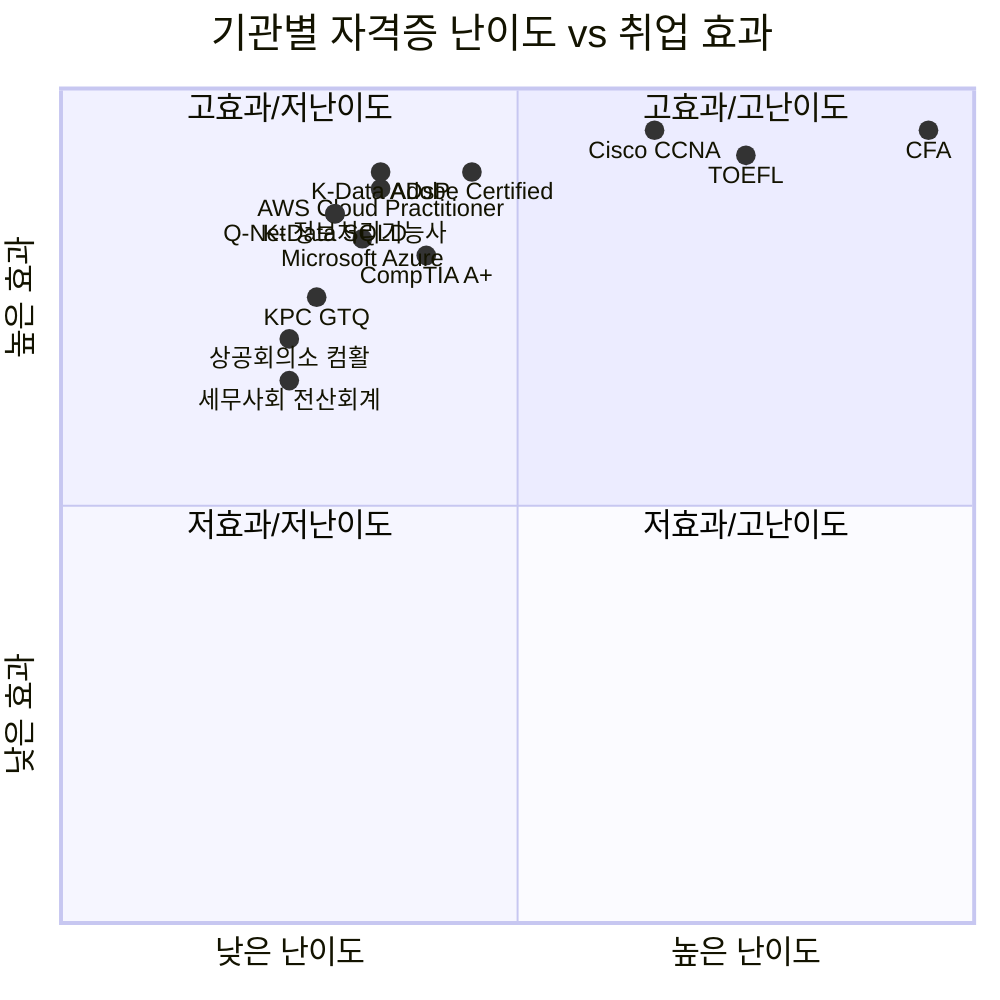
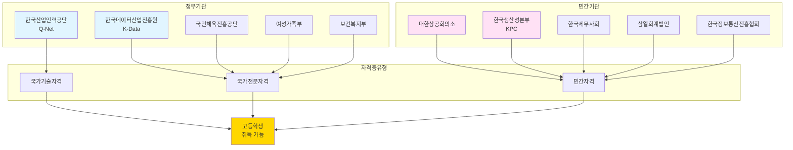
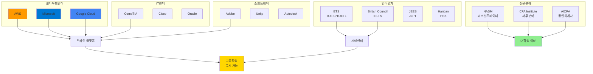

# 자격증 기관별 상세 가이드

## 📋 목차

1. [국내 자격증 발급 기관](#국내-자격증-발급-기관)
2. [해외 자격증 발급 기관](#해외-자격증-발급-기관)
3. [온라인 교육 플랫폼](#온라인-교육-플랫폼)
4. [기관별 추천 자격증](#기관별-추천-자격증)
5. [등급별 취득 전략](#등급별-취득-전략)

---

## 🗺️ 자격증 기관 전체 구조도



---

## 🎯 기관별 자격증 취득 흐름도



---

## 📊 기관별 자격증 비교 매트릭스



---

## 🏢 국내 기관 네트워크 맵



---

## 🌍 해외 기관 네트워크 맵



---

## 🇰🇷 국내 자격증 발급 기관

### 1. 한국산업인력공단 (Q-Net)

**공식 사이트**: https://www.q-net.or.kr

**특징**:
- 국가기술자격 최대 발급 기관
- 기능사, 산업기사, 기사, 기능장 등급 체계
- 연 3-4회 정기 시험

#### 추천 자격증 (왕국별)

##### 🔬 탐구 왕국
| 자격증명 | 등급 | 난이도 | 준비 기간 | 응시료 | 시험 일정 |
|---------|------|--------|----------|--------|----------|
| 빅데이터 분석기사 | 기사 | ⭐⭐⭐⭐ | 3-4개월 | 19,400원 | 연 3회 (3월, 6월, 9월) |
| 정보처리기사 | 기사 | ⭐⭐⭐⭐ | 3-4개월 | 19,400원 | 연 3회 |
| 정보처리기능사 | 기능사 | ⭐⭐ | 2-3개월 | 14,500원 | 연 4회 |
| 사회조사분석사 2급 | 2급 | ⭐⭐⭐ | 3-4개월 | 30,000원 | 연 2회 |

**접수 방법**: Q-Net 홈페이지 → 회원가입 → 원서접수  
**결제 방법**: 신용카드, 계좌이체  
**합격 발표**: 시험 후 약 2주

##### 💻 기술 왕국
| 자격증명 | 등급 | 난이도 | 준비 기간 | 응시료 | 시험 일정 |
|---------|------|--------|----------|--------|----------|
| 정보처리기능사 | 기능사 | ⭐⭐ | 2-3개월 | 14,500원 | 연 4회 |
| 정보보안기사 | 기사 | ⭐⭐⭐⭐ | 4-6개월 | 19,400원 | 연 3회 |
| 임베디드기사 | 기사 | ⭐⭐⭐⭐ | 4-6개월 | 19,400원 | 연 3회 |
| 전자계산기조직응용기사 | 기사 | ⭐⭐⭐⭐ | 4-6개월 | 19,400원 | 연 3회 |

##### 🎨 창작 왕국
| 자격증명 | 등급 | 난이도 | 준비 기간 | 응시료 | 시험 일정 |
|---------|------|--------|----------|--------|----------|
| 웹디자인기능사 | 기능사 | ⭐⭐ | 2-3개월 | 14,500원 | 연 4회 |
| 컬러리스트산업기사 | 산업기사 | ⭐⭐⭐ | 3-4개월 | 19,400원 | 연 3회 |
| 시각디자인기사 | 기사 | ⭐⭐⭐⭐ | 4-6개월 | 19,400원 | 연 3회 |
| 제품디자인기사 | 기사 | ⭐⭐⭐⭐ | 4-6개월 | 19,400원 | 연 3회 |

##### 🌿 자연 왕국
| 자격증명 | 등급 | 난이도 | 준비 기간 | 응시료 | 시험 일정 |
|---------|------|--------|----------|--------|----------|
| 환경기능사 | 기능사 | ⭐⭐ | 2-3개월 | 14,500원 | 연 4회 |
| 산림기능사 | 기능사 | ⭐⭐ | 2-3개월 | 14,500원 | 연 4회 |
| 생물분류기사 | 기사 | ⭐⭐⭐⭐ | 4-6개월 | 19,400원 | 연 3회 |
| 환경기사 | 기사 | ⭐⭐⭐⭐ | 4-6개월 | 19,400원 | 연 3회 |
| 조경기사 | 기사 | ⭐⭐⭐⭐ | 4-6개월 | 19,400원 | 연 3회 |

##### ⚖️ 질서 왕국
| 자격증명 | 등급 | 난이도 | 준비 기간 | 응시료 | 시험 일정 |
|---------|------|--------|----------|--------|----------|
| 물류관리사 | - | ⭐⭐⭐⭐ | 3-4개월 | 50,000원 | 연 2회 (5월, 10월) |
| 직업상담사 2급 | 2급 | ⭐⭐⭐ | 3-4개월 | 35,000원 | 연 2회 (6월, 9월) |

##### 🏆 도전 왕국
| 자격증명 | 등급 | 난이도 | 준비 기간 | 응시료 | 시험 일정 |
|---------|------|--------|----------|--------|----------|
| 생활스포츠지도사 2급 | 2급 | ⭐⭐⭐ | 3-4개월 | 30,000원 | 연 2회 (5월, 11월) |
| 응급구조사 2급 | 2급 | ⭐⭐⭐ | 학과 졸업 | - | 연 1회 |

**학습 자료**:
- Q-Net 기출문제 무료 다운로드
- YouTube: "큐넷 자격증", "기능사 독학"
- 교재: 에듀윌, 시대에듀, 영진닷컴

---

### 2. 한국데이터산업진흥원 (K-Data)

**공식 사이트**: https://www.dataq.or.kr

**특징**:
- 데이터 분석 전문 자격증
- 빅데이터, SQL, 데이터 아키텍처
- 온라인 CBT 시험 (상시 접수)

#### 추천 자격증

| 자격증명 | 등급 | 난이도 | 준비 기간 | 응시료 | 시험 방식 |
|---------|------|--------|----------|--------|----------|
| 빅데이터 분석기사 (필기) | 기사 | ⭐⭐⭐ | 3-4개월 | 25,000원 | CBT (연 3회) |
| 빅데이터 분석기사 (실기) | 기사 | ⭐⭐⭐⭐⭐ | 6-12개월 | 30,000원 | 실습 평가 |
| 데이터분석 준전문가 (ADsP) | 준전문가 | ⭐⭐ | 2-3개월 | 50,000원 | CBT (연 4회) |
| 데이터분석 전문가 (ADP) | 전문가 | ⭐⭐⭐⭐⭐ | 6-12개월 | 80,000원 | 필기 + 실기 |
| SQL 개발자 (SQLD) | 개발자 | ⭐⭐ | 1-2개월 | 50,000원 | CBT (연 4회) |
| SQL 전문가 (SQLP) | 전문가 | ⭐⭐⭐⭐ | 4-6개월 | 80,000원 | 필기 |
| 데이터 아키텍처 준전문가 (DAP) | 준전문가 | ⭐⭐⭐ | 3-4개월 | 50,000원 | CBT |

**왕국 연계**: 🔬 탐구 왕국, 💻 기술 왕국, ⚖️ 질서 왕국

**프로젝트 연계**:
- ADsP: 건강 데이터 분석, 학습 패턴 분석
- SQLD: 데이터베이스 설계, 쿼리 최적화
- 빅데이터 분석기사: 대규모 데이터 처리

**학습 자료**:
- 공식 교재: 데이터 자격검정 공식 가이드
- 온라인 강의: 인프런, 패스트캠퍼스
- 커뮤니티: 데이터 분석 준전문가 카페

**시험 접수**: https://www.dataq.or.kr → 자격검정 → 원서접수

---

### 3. 대한상공회의소

**공식 사이트**: https://license.korcham.net

**특징**:
- 사무 자동화 자격증
- 상시 시험 (CBT)
- 전국 시험장 다수

#### 추천 자격증

| 자격증명 | 등급 | 난이도 | 준비 기간 | 응시료 | 시험 방식 |
|---------|------|--------|----------|--------|----------|
| 컴퓨터활용능력 1급 | 1급 | ⭐⭐ | 1-2개월 | 22,000원 | CBT (상시) |
| 컴퓨터활용능력 2급 | 2급 | ⭐ | 1개월 | 18,000원 | CBT (상시) |
| 워드프로세서 | - | ⭐ | 1개월 | 18,000원 | CBT (상시) |
| 한글속기 1급 | 1급 | ⭐⭐⭐ | 3-4개월 | 25,000원 | CBT |
| 유통관리사 2급 | 2급 | ⭐⭐ | 2-3개월 | 30,000원 | 연 2회 |
| 유통관리사 3급 | 3급 | ⭐ | 1-2개월 | 25,000원 | 연 2회 |

**왕국 연계**: 🔬 탐구 왕국, ⚖️ 질서 왕국

**프로젝트 연계**:
- 컴활 1급: Excel 데이터 분석, 자동화
- 유통관리사: 재고 관리, 매점 운영

**학습 자료**:
- 공식 교재: 대한상공회의소 자격평가사업단
- 온라인 강의: 에듀윌, 시대에듀
- 기출문제: 홈페이지 무료 다운로드

**시험 접수**: https://license.korcham.net → 원서접수

---

### 4. 한국생산성본부 (KPC)

**공식 사이트**: https://www.kpc.or.kr

**특징**:
- IT 실무 자격증
- 디자인, 멀티미디어 전문
- 상시 시험 (CBT)

#### 추천 자격증

| 자격증명 | 등급 | 난이도 | 준비 기간 | 응시료 | 시험 방식 |
|---------|------|--------|----------|--------|----------|
| GTQ (그래픽기술자격) 1급 | 1급 | ⭐⭐ | 1-2개월 | 28,000원 | CBT (월 2-3회) |
| GTQ (그래픽기술자격) 2급 | 2급 | ⭐ | 1개월 | 25,000원 | CBT (월 2-3회) |
| GTQi (일러스트) 1급 | 1급 | ⭐⭐ | 1-2개월 | 28,000원 | CBT (월 2-3회) |
| ITQ (정보기술자격) 엑셀 A등급 | A등급 | ⭐⭐ | 1-2개월 | 22,000원 | CBT (상시) |
| ITQ 파워포인트 A등급 | A등급 | ⭐ | 1개월 | 22,000원 | CBT (상시) |
| 멀티미디어콘텐츠제작전문가 | 1급 | ⭐⭐⭐ | 2-3개월 | 35,000원 | CBT (월 1-2회) |
| 인터넷정보관리사 | 1급 | ⭐⭐ | 2-3개월 | 30,000원 | CBT (월 1-2회) |

**왕국 연계**: 🎨 창작 왕국, 💻 기술 왕국

**프로젝트 연계**:
- GTQ: 학교 굿즈 디자인, 포스터 제작
- 멀티미디어: 숏폼 영상, 교육 콘텐츠

**학습 자료**:
- 공식 교재: KPC 자격시험센터
- 온라인 강의: 에듀윌, 시대에듀
- 연습 프로그램: 홈페이지 무료 다운로드

**시험 접수**: https://www.kpc.or.kr → 자격시험 → 원서접수

---

### 5. 한국세무사회

**공식 사이트**: https://license.kacpta.or.kr

**특징**:
- 회계, 세무 전문 자격증
- 실무 중심 교육
- 상시 시험 (CBT)

#### 추천 자격증

| 자격증명 | 등급 | 난이도 | 준비 기간 | 응시료 | 시험 방식 |
|---------|------|--------|----------|--------|----------|
| 전산회계 1급 | 1급 | ⭐⭐ | 1-2개월 | 20,000원 | CBT (월 1-2회) |
| 전산회계 2급 | 2급 | ⭐ | 1개월 | 17,000원 | CBT (월 1-2회) |
| 전산세무 1급 | 1급 | ⭐⭐⭐⭐ | 4-6개월 | 30,000원 | CBT (월 1회) |
| 전산세무 2급 | 2급 | ⭐⭐⭐ | 2-3개월 | 25,000원 | CBT (월 1-2회) |
| FAT (회계실무) 1급 | 1급 | ⭐⭐ | 2-3개월 | 20,000원 | CBT (월 1-2회) |
| TAT (세무실무) 1급 | 1급 | ⭐⭐⭐ | 3-4개월 | 25,000원 | CBT (월 1회) |

**왕국 연계**: ⚖️ 질서 왕국

**프로젝트 연계**:
- 전산회계: 학급 회비 관리, 동아리 회계
- 전산세무: 학생 창업 세무 관리

**학습 자료**:
- 공식 교재: 삼일인포마인
- 온라인 강의: 에듀윌, 시대에듀
- 연습 프로그램: 케이렙 (무료)

**시험 접수**: https://license.kacpta.or.kr → 원서접수

---

### 6. 삼일회계법인 (재경관리사)

**공식 사이트**: https://www.samili.com

**특징**:
- 재무, 회계 전문 자격증
- 기업 실무 중심
- 연 4회 정기 시험

#### 추천 자격증

| 자격증명 | 등급 | 난이도 | 준비 기간 | 응시료 | 시험 일정 |
|---------|------|--------|----------|--------|----------|
| 재경관리사 | - | ⭐⭐⭐ | 3-4개월 | 50,000원 | 연 4회 (3, 6, 9, 12월) |
| 재무회계 1급 | 1급 | ⭐⭐ | 2-3개월 | 30,000원 | 연 4회 |
| 세무회계 1급 | 1급 | ⭐⭐⭐ | 3-4개월 | 30,000원 | 연 4회 |
| 원가관리회계 1급 | 1급 | ⭐⭐⭐ | 3-4개월 | 30,000원 | 연 4회 |

**왕국 연계**: ⚖️ 질서 왕국

**프로젝트 연계**:
- 재경관리사: 학생 창업 재무 관리, 동아리 예산

**학습 자료**:
- 공식 교재: 삼일회계법인
- 온라인 강의: 에듀윌, 해커스
- 기출문제: 홈페이지 유료 구매

**시험 접수**: https://www.samili.com → 자격시험 → 원서접수

---

### 7. 한국정보통신진흥협회 (ICT)

**공식 사이트**: https://www.ihd.or.kr

**특징**:
- 리눅스, 네트워크 전문
- 실무 중심 교육
- 연 4회 정기 시험

#### 추천 자격증

| 자격증명 | 등급 | 난이도 | 준비 기간 | 응시료 | 시험 일정 |
|---------|------|--------|----------|--------|----------|
| 리눅스마스터 1급 | 1급 | ⭐⭐⭐⭐ | 4-6개월 | 55,000원 | 연 4회 (3, 6, 9, 12월) |
| 리눅스마스터 2급 | 2급 | ⭐⭐ | 1-2개월 | 44,000원 | 연 4회 |
| 네트워크관리사 1급 | 1급 | ⭐⭐⭐⭐ | 4-6개월 | 55,000원 | 연 4회 |
| 네트워크관리사 2급 | 2급 | ⭐⭐ | 2-3개월 | 44,000원 | 연 4회 |

**왕국 연계**: 💻 기술 왕국

**프로젝트 연계**:
- 리눅스마스터: IoT 프로젝트, 서버 관리
- 네트워크관리사: Wi-Fi 지도, 네트워크 분석

**학습 자료**:
- 공식 교재: 한빛미디어
- 온라인 강의: 인프런, 유데미
- 실습 환경: VirtualBox (무료)

**시험 접수**: https://www.ihd.or.kr → 자격시험 → 원서접수

---

### 8. 국민체육진흥공단

**공식 사이트**: https://www.kspo.or.kr

**특징**:
- 스포츠 지도자 자격증
- 교육 이수 필수
- 연 2회 정기 시험

#### 추천 자격증

| 자격증명 | 등급 | 난이도 | 준비 기간 | 응시료 | 교육 비용 |
|---------|------|--------|----------|--------|----------|
| 생활스포츠지도사 1급 | 1급 | ⭐⭐⭐⭐ | 6-12개월 | 50,000원 | 약 100만원 |
| 생활스포츠지도사 2급 | 2급 | ⭐⭐⭐ | 3-4개월 | 30,000원 | 약 50만원 |
| 전문스포츠지도사 1급 | 1급 | ⭐⭐⭐⭐⭐ | 1-2년 | 50,000원 | 약 150만원 |
| 전문스포츠지도사 2급 | 2급 | ⭐⭐⭐⭐ | 6-12개월 | 30,000원 | 약 100만원 |
| 장애인스포츠지도사 2급 | 2급 | ⭐⭐⭐ | 3-4개월 | 30,000원 | 약 50만원 |

**왕국 연계**: 🏆 도전 왕국

**프로젝트 연계**:
- 생활스포츠지도사: 운동 게임, 홈트 배틀, 체육 프로그램

**학습 자료**:
- 공식 교재: 국민체육진흥공단
- 교육 기관: 전국 체육 관련 대학
- 온라인 강의: 스포츠지도사 아카데미

**시험 접수**: https://www.kspo.or.kr → 체육지도자 → 자격검정

---

### 9. 여성가족부 (청소년 관련)

**공식 사이트**: https://www.mogef.go.kr

**특징**:
- 청소년 상담, 지도 자격증
- 대학 졸업 이상 (일부)
- 연 1회 정기 시험

#### 추천 자격증

| 자격증명 | 등급 | 난이도 | 준비 기간 | 응시 자격 | 시험 일정 |
|---------|------|--------|----------|----------|----------|
| 청소년상담사 1급 | 1급 | ⭐⭐⭐⭐⭐ | 1-2년 | 석사 + 경력 | 연 1회 (6월) |
| 청소년상담사 2급 | 2급 | ⭐⭐⭐⭐ | 6-12개월 | 학사 + 경력 | 연 1회 (6월) |
| 청소년상담사 3급 | 3급 | ⭐⭐⭐ | 3-6개월 | 학사 졸업 | 연 1회 (6월) |
| 청소년지도사 1급 | 1급 | ⭐⭐⭐⭐⭐ | 1-2년 | 석사 + 경력 | 연 1회 (5월) |
| 청소년지도사 2급 | 2급 | ⭐⭐⭐⭐ | 6-12개월 | 학사 + 경력 | 연 1회 (5월) |
| 청소년지도사 3급 | 3급 | ⭐⭐⭐ | 3-6개월 | 학사 졸업 | 연 1회 (5월) |

**왕국 연계**: 🤝 연결 왕국, 🏆 도전 왕국

**고교생 준비**:
- 또래 상담 동아리 활동
- 청소년 활동 기획 경험
- 봉사 활동 300시간 이상

**프로젝트 연계**:
- 고민 상담 플랫폼
- 멘토링 매칭 앱
- 청소년 활동 프로그램

**시험 접수**: https://www.q-net.or.kr (한국산업인력공단 위탁)

---

### 10. 보건복지부 (사회복지)

**공식 사이트**: https://www.mohw.go.kr

**특징**:
- 사회복지사 자격증
- 대학 이수 과목 필수
- 국가시험 (연 1회)

#### 추천 자격증

| 자격증명 | 등급 | 난이도 | 준비 기간 | 응시 자격 | 시험 일정 |
|---------|------|--------|----------|----------|----------|
| 사회복지사 1급 | 1급 | ⭐⭐⭐⭐ | 6-12개월 | 학사 + 이수 과목 | 연 1회 (1월) |
| 사회복지사 2급 | 2급 | - | - | 학사 + 이수 과목 | 자격 부여 |

**왕국 연계**: 🤝 연결 왕국

**고교생 준비**:
- 봉사 활동 300시간 이상
- 복지 시설 체험
- 사회복지 관련 독서

**프로젝트 연계**:
- 동네 도움 플랫폼
- 독거노인 돌봄 앱
- 복지 정보 매칭

**시험 접수**: https://www.q-net.or.kr (한국산업인력공단 위탁)

---

## 🌍 해외 자격증 발급 기관

### 1. Google (구글)

**공식 사이트**: https://grow.google/certificates

**특징**:
- 온라인 수강 (Coursera)
- 실무 중심 교육
- 영어 강의 (한글 자막 일부)

#### 추천 자격증

| 자격증명 | 난이도 | 준비 기간 | 비용 | 플랫폼 |
|---------|--------|----------|------|--------|
| Google Data Analytics Certificate | ⭐⭐ | 3-6개월 | $39/월 | Coursera |
| Google IT Support Certificate | ⭐⭐ | 3-6개월 | $39/월 | Coursera |
| Google Project Management Certificate | ⭐⭐⭐ | 3-6개월 | $39/월 | Coursera |
| Google UX Design Certificate | ⭐⭐⭐ | 3-6개월 | $39/월 | Coursera |
| Google Digital Marketing Certificate | ⭐⭐ | 3-6개월 | $39/월 | Coursera |
| Google Cloud Digital Leader | ⭐⭐ | 1-2개월 | 무료 학습 | Google Cloud Skills Boost |

**왕국 연계**: 🔬 탐구, 💻 기술, 🎨 창작, ⚖️ 질서

**프로젝트 연계**:
- Data Analytics: 모든 데이터 분석 프로젝트
- IT Support: 기술 지원, 문제 해결
- UX Design: 앱/웹 디자인

**학습 방법**:
1. Coursera 가입 (7일 무료 체험)
2. 코스 등록
3. 주 10시간 학습 (6개월 완료)
4. 프로젝트 제출
5. 수료증 발급

**링크**: https://www.coursera.org/google-certificates

---

### 2. Amazon Web Services (AWS)

**공식 사이트**: https://aws.amazon.com/certification

**특징**:
- 클라우드 전문 자격증
- 실습 중심
- 전 세계 인정

#### 추천 자격증 (난이도별)

##### 기초 (Foundational)
| 자격증명 | 난이도 | 준비 기간 | 시험료 | 시험 시간 |
|---------|--------|----------|--------|----------|
| AWS Certified Cloud Practitioner | ⭐⭐ | 1-2개월 | $100 | 90분 |

##### 준전문가 (Associate)
| 자격증명 | 난이도 | 준비 기간 | 시험료 | 시험 시간 |
|---------|--------|----------|--------|----------|
| AWS Certified Solutions Architect - Associate | ⭐⭐⭐ | 3-4개월 | $150 | 130분 |
| AWS Certified Developer - Associate | ⭐⭐⭐ | 3-4개월 | $150 | 130분 |
| AWS Certified SysOps Administrator - Associate | ⭐⭐⭐ | 3-4개월 | $150 | 130분 |

##### 전문가 (Professional)
| 자격증명 | 난이도 | 준비 기간 | 시험료 | 시험 시간 |
|---------|--------|----------|--------|----------|
| AWS Certified Solutions Architect - Professional | ⭐⭐⭐⭐⭐ | 6-12개월 | $300 | 180분 |
| AWS Certified DevOps Engineer - Professional | ⭐⭐⭐⭐⭐ | 6-12개월 | $300 | 180분 |

**왕국 연계**: 💻 기술 왕국

**프로젝트 연계**:
- Cloud Practitioner: 모든 클라우드 프로젝트
- Solutions Architect: 앱 아키텍처 설계
- Developer: 서버리스 앱 개발

**학습 자료**:
- AWS Skill Builder (무료): https://skillbuilder.aws
- Udemy: "AWS Certified Cloud Practitioner" (한글)
- YouTube: "AWS 한국어" 채널

**시험 접수**: https://aws.amazon.com/certification → Schedule Exam

---

### 3. Microsoft

**공식 사이트**: https://learn.microsoft.com/certifications

**특징**:
- Azure, Office, Power Platform
- 역할 기반 자격증
- 한글 시험 지원

#### 추천 자격증 (분야별)

##### Azure (클라우드)
| 자격증명 | 레벨 | 난이도 | 준비 기간 | 시험료 |
|---------|------|--------|----------|--------|
| Azure Fundamentals (AZ-900) | 기초 | ⭐⭐ | 1-2개월 | $99 |
| Azure Administrator (AZ-104) | 중급 | ⭐⭐⭐ | 3-4개월 | $165 |
| Azure Developer (AZ-204) | 중급 | ⭐⭐⭐ | 3-4개월 | $165 |
| Azure Solutions Architect (AZ-305) | 고급 | ⭐⭐⭐⭐ | 6-12개월 | $165 |

##### Microsoft 365 (생산성)
| 자격증명 | 레벨 | 난이도 | 준비 기간 | 시험료 |
|---------|------|--------|----------|--------|
| Microsoft 365 Fundamentals (MS-900) | 기초 | ⭐ | 1개월 | $99 |
| Microsoft 365 Certified: Administrator | 중급 | ⭐⭐⭐ | 3-4개월 | $165 |

##### Power Platform (로우코드)
| 자격증명 | 레벨 | 난이도 | 준비 기간 | 시험료 |
|---------|------|--------|----------|--------|
| Power Platform Fundamentals (PL-900) | 기초 | ⭐ | 1개월 | $99 |
| Power Platform App Maker (PL-100) | 중급 | ⭐⭐ | 2-3개월 | $165 |

##### Office Specialist (MOS)
| 자격증명 | 레벨 | 난이도 | 준비 기간 | 시험료 |
|---------|------|--------|----------|--------|
| MOS Excel Expert | Expert | ⭐⭐ | 1-2개월 | $150 |
| MOS Word Expert | Expert | ⭐⭐ | 1-2개월 | $150 |
| MOS PowerPoint | Associate | ⭐ | 1개월 | $100 |

**왕국 연계**: 💻 기술, 🔬 탐구, ⚖️ 질서

**프로젝트 연계**:
- Azure: 클라우드 앱 배포
- Power Platform: 로우코드 앱 제작
- MOS Excel: 데이터 분석, 자동화

**학습 자료**:
- Microsoft Learn (무료): https://learn.microsoft.com
- Udemy: "Azure Fundamentals" (한글)
- YouTube: "Microsoft Korea" 채널

**시험 접수**: https://learn.microsoft.com/certifications → Schedule Exam

---

### 4. CompTIA

**공식 사이트**: https://www.comptia.org

**특징**:
- IT 기초 자격증
- 벤더 중립적
- 전 세계 인정

#### 추천 자격증 (경로별)

##### IT 기초
| 자격증명 | 난이도 | 준비 기간 | 시험료 | 시험 수 |
|---------|--------|----------|--------|--------|
| CompTIA IT Fundamentals (ITF+) | ⭐ | 1개월 | $132 | 1개 |
| CompTIA A+ | ⭐⭐ | 2-3개월 | $246 | 2개 |

##### 네트워크
| 자격증명 | 난이도 | 준비 기간 | 시험료 | 시험 수 |
|---------|--------|----------|--------|--------|
| CompTIA Network+ | ⭐⭐⭐ | 3-4개월 | $358 | 1개 |

##### 보안
| 자격증명 | 난이도 | 준비 기간 | 시험료 | 시험 수 |
|---------|--------|----------|--------|--------|
| CompTIA Security+ | ⭐⭐⭐ | 3-4개월 | $392 | 1개 |

##### 클라우드
| 자격증명 | 난이도 | 준비 기간 | 시험료 | 시험 수 |
|---------|--------|----------|--------|--------|
| CompTIA Cloud+ | ⭐⭐⭐ | 3-4개월 | $358 | 1개 |

**왕국 연계**: 💻 기술 왕국

**프로젝트 연계**:
- A+: 하드웨어 통합, 문제 해결
- Network+: 네트워크 분석, Wi-Fi 프로젝트
- Security+: 보안 시스템, 암호화

**학습 자료**:
- Professor Messer (무료): https://www.professormesser.com
- Udemy: "CompTIA A+" (영어)
- YouTube: "Professor Messer" 채널

**시험 접수**: https://www.comptia.org → Certifications → Buy Exam

---

### 5. Cisco

**공식 사이트**: https://www.cisco.com/c/en/us/training-events/training-certifications.html

**특징**:
- 네트워크 전문 자격증
- 실습 중심
- 업계 표준

#### 추천 자격증 (레벨별)

##### Entry
| 자격증명 | 난이도 | 준비 기간 | 시험료 | 유효 기간 |
|---------|--------|----------|--------|----------|
| Cisco Certified Technician (CCT) | ⭐⭐ | 2-3개월 | $125 | 3년 |

##### Associate
| 자격증명 | 난이도 | 준비 기간 | 시험료 | 유효 기간 |
|---------|--------|----------|--------|----------|
| Cisco Certified Network Associate (CCNA) | ⭐⭐⭐ | 3-6개월 | $300 | 3년 |
| CCNA DevNet Associate | ⭐⭐⭐ | 3-6개월 | $300 | 3년 |

##### Professional
| 자격증명 | 난이도 | 준비 기간 | 시험료 | 유효 기간 |
|---------|--------|----------|--------|----------|
| Cisco Certified Network Professional (CCNP) | ⭐⭐⭐⭐ | 6-12개월 | $400 | 3년 |

**왕국 연계**: 💻 기술 왕국

**프로젝트 연계**:
- CCNA: 네트워크 설계, Wi-Fi 최적화
- DevNet: 네트워크 자동화, API

**학습 자료**:
- Cisco Networking Academy (무료): https://www.netacad.com
- Udemy: "CCNA 200-301" (영어)
- YouTube: "NetworkChuck" 채널

**시험 접수**: https://www.cisco.com → Certifications → Schedule Exam

---

### 6. Adobe

**공식 사이트**: https://www.adobe.com/certification.html

**특징**:
- 디자인 전문 자격증
- 실무 중심
- 포트폴리오 필수

#### 추천 자격증 (제품별)

| 자격증명 | 난이도 | 준비 기간 | 시험료 | 시험 시간 |
|---------|--------|----------|--------|----------|
| Adobe Certified Professional - Photoshop | ⭐⭐⭐ | 2-3개월 | $180 | 50분 |
| Adobe Certified Professional - Illustrator | ⭐⭐⭐ | 2-3개월 | $180 | 50분 |
| Adobe Certified Professional - InDesign | ⭐⭐⭐ | 2-3개월 | $180 | 50분 |
| Adobe Certified Professional - Premiere Pro | ⭐⭐⭐ | 2-3개월 | $180 | 50분 |
| Adobe Certified Professional - After Effects | ⭐⭐⭐⭐ | 3-4개월 | $180 | 50분 |
| Adobe Certified Expert - Photoshop | ⭐⭐⭐⭐ | 4-6개월 | $180 | 50분 |

**왕국 연계**: 🎨 창작 왕국

**프로젝트 연계**:
- Photoshop: 학교 굿즈, 포스터 디자인
- Premiere Pro: 숏폼 영상, 교육 콘텐츠
- After Effects: 모션 그래픽, 애니메이션

**학습 자료**:
- Adobe Learn (무료): https://helpx.adobe.com/learn.html
- Udemy: "Photoshop CC" (한글)
- YouTube: "Adobe Korea" 채널

**시험 접수**: https://www.adobe.com/certification → Schedule Exam

---

### 7. Unity Technologies

**공식 사이트**: https://unity.com/products/unity-certifications

**특징**:
- 게임 개발 자격증
- 실습 중심
- 포트폴리오 필수

#### 추천 자격증 (레벨별)

| 자격증명 | 레벨 | 난이도 | 준비 기간 | 시험료 |
|---------|------|--------|----------|--------|
| Unity Certified User: Programmer | 기초 | ⭐⭐ | 2-3개월 | $65 |
| Unity Certified User: Artist | 기초 | ⭐⭐ | 2-3개월 | $65 |
| Unity Certified Associate: Programmer | 중급 | ⭐⭐⭐ | 3-4개월 | $165 |
| Unity Certified Associate: Artist | 중급 | ⭐⭐⭐ | 3-4개월 | $165 |
| Unity Certified Professional: Programmer | 고급 | ⭐⭐⭐⭐ | 6-12개월 | $200 |

**왕국 연계**: 🎨 창작 왕국, 💻 기술 왕국

**프로젝트 연계**:
- Programmer: 게임형 프로젝트, 시뮬레이션
- Artist: 3D 모델링, 애니메이션

**학습 자료**:
- Unity Learn (무료): https://learn.unity.com
- Udemy: "Unity 게임 개발" (한글)
- YouTube: "Brackeys" 채널

**시험 접수**: https://unity.com/products/unity-certifications → Schedule Exam

---

### 8. ETS (Educational Testing Service)

**공식 사이트**: https://www.ets.org

**특징**:
- 영어 능력 평가
- 전 세계 인정
- 대학 입시 필수

#### 추천 시험

| 시험명 | 목표 점수 | 난이도 | 준비 기간 | 시험료 | 유효 기간 |
|--------|----------|--------|----------|--------|----------|
| TOEIC | 900+ | ⭐⭐⭐ | 3-6개월 | $50 | 2년 |
| TOEFL iBT | 100+ | ⭐⭐⭐⭐ | 6-12개월 | $250 | 2년 |
| GRE (대학원) | 320+ | ⭐⭐⭐⭐⭐ | 6-12개월 | $220 | 5년 |

**왕국 연계**: 🗣️ 소통 왕국

**프로젝트 연계**:
- TOEIC: 번역 게임, 외국인 가이드
- TOEFL: 논문 읽기, 영어 콘텐츠

**학습 자료**:
- ETS 공식 가이드
- 해커스, YBM (한글)
- YouTube: "영어 회화" 채널

**시험 접수**: https://www.ets.org → Register

---

### 9. British Council (IELTS)

**공식 사이트**: https://www.britishcouncil.org/exam/ielts

**특징**:
- 영국식 영어 평가
- 대학 입시, 이민
- 전 세계 인정

#### 추천 시험

| 시험명 | 목표 점수 | 난이도 | 준비 기간 | 시험료 | 유효 기간 |
|--------|----------|--------|----------|--------|----------|
| IELTS Academic | 7.0+ | ⭐⭐⭐⭐ | 6-12개월 | $250 | 2년 |
| IELTS General Training | 7.0+ | ⭐⭐⭐ | 6-12개월 | $250 | 2년 |

**왕국 연계**: 🗣️ 소통 왕국

**프로젝트 연계**:
- IELTS: 외국인 가이드, 국제 교류

**학습 자료**:
- British Council 공식 자료
- 해커스, YBM (한글)
- YouTube: "IELTS Liz" 채널

**시험 접수**: https://www.britishcouncil.org/exam/ielts → Book Test

---

### 10. NASM (National Academy of Sports Medicine)

**공식 사이트**: https://www.nasm.org

**특징**:
- 퍼스널 트레이너 자격증
- 실무 중심
- 미국 표준

#### 추천 자격증

| 자격증명 | 난이도 | 준비 기간 | 시험료 | 교육 비용 |
|---------|--------|----------|--------|----------|
| Certified Personal Trainer (CPT) | ⭐⭐⭐ | 3-6개월 | $799 | 포함 |
| Corrective Exercise Specialist (CES) | ⭐⭐⭐⭐ | 4-6개월 | $699 | 포함 |
| Performance Enhancement Specialist (PES) | ⭐⭐⭐⭐ | 4-6개월 | $699 | 포함 |

**왕국 연계**: 🏆 도전 왕국

**프로젝트 연계**:
- CPT: 운동 게임, 홈트 배틀, 체력 관리

**학습 자료**:
- NASM 공식 교재
- Udemy: "Personal Trainer" (영어)
- YouTube: "NASM" 채널

**시험 접수**: https://www.nasm.org → Get Certified

---

## 📚 온라인 교육 플랫폼

### 1. K-MOOC (한국형 온라인 공개강좌)

**공식 사이트**: https://www.kmooc.kr

**특징**:
- 무료 대학 강의
- 수료증 발급
- 한글 강의

#### 추천 강좌 (왕국별)

| 왕국 | 강좌명 | 대학 | 기간 | 수료증 |
|------|--------|------|------|--------|
| 🔬 탐구 | 데이터 사이언스 입문 | 서울대 | 8주 | 무료 |
| 💻 기술 | 파이썬 프로그래밍 | KAIST | 10주 | 무료 |
| 🎨 창작 | 디자인 씽킹 | 연세대 | 6주 | 무료 |
| 🌿 자연 | 환경과 생태 | 고려대 | 8주 | 무료 |
| ⚖️ 질서 | 회계의 이해 | 성균관대 | 8주 | 무료 |

**링크**: https://www.kmooc.kr

---

### 2. K-Digital Training (K-디지털 트레이닝)

**공식 사이트**: https://www.hrd.go.kr/hrdp/ma/pmmao/indexNew.do

**특징**:
- 정부 지원 교육
- 취업 연계
- 무료 또는 저렴

#### 추천 과정

| 분야 | 과정명 | 기간 | 비용 | 지원 대상 |
|------|--------|------|------|----------|
| AI/빅데이터 | 빅데이터 분석 전문가 | 6개월 | 무료 | 청년 (만 34세 이하) |
| 소프트웨어 | 풀스택 개발자 | 6개월 | 무료 | 청년 |
| 디자인 | UX/UI 디자이너 | 4개월 | 무료 | 청년 |

**링크**: https://www.hrd.go.kr

---

### 3. Coursera (코세라)

**공식 사이트**: https://www.coursera.org

**특징**:
- 세계 유명 대학 강의
- 한글 자막 (일부)
- 수료증 유료

#### 추천 강좌 (왕국별)

| 왕국 | 강좌명 | 대학/기관 | 기간 | 비용 |
|------|--------|----------|------|------|
| 🔬 탐구 | Google Data Analytics | Google | 6개월 | $39/월 |
| 💻 기술 | Python for Everybody | Michigan | 8개월 | $49/월 |
| 🎨 창작 | Google UX Design | Google | 6개월 | $39/월 |
| ⚖️ 질서 | Financial Accounting | Wharton | 4개월 | $49/월 |

**링크**: https://www.coursera.org

---

### 4. Udemy (유데미)

**공식 사이트**: https://www.udemy.com

**특징**:
- 실무 중심 강의
- 한글 강의 다수
- 평생 소장

#### 추천 강좌 (왕국별)

| 왕국 | 강좌명 | 강사 | 가격 | 할인 |
|------|--------|------|------|------|
| 🔬 탐구 | 파이썬 데이터 분석 | 박조은 | ₩55,000 | 할인 시 ₩13,000 |
| 💻 기술 | 웹 개발 부트캠프 | Colt Steele | ₩55,000 | 할인 시 ₩13,000 |
| 🎨 창작 | Photoshop CC 마스터 | Phil Ebiner | ₩55,000 | 할인 시 ₩13,000 |
| 💻 기술 | AWS Certified Cloud Practitioner | Stephane Maarek | ₩55,000 | 할인 시 ₩13,000 |

**팁**: 할인 기간 (월 1-2회) 구매 추천

**링크**: https://www.udemy.com

---

### 5. 인프런

**공식 사이트**: https://www.inflearn.com

**특징**:
- 한국 개발자 강의
- 실무 중심
- 한글 강의

#### 추천 강좌 (왕국별)

| 왕국 | 강좌명 | 강사 | 가격 | 평점 |
|------|--------|------|------|------|
| 🔬 탐구 | 데이터 분석 입문 | 박조은 | ₩55,000 | 4.9 |
| 💻 기술 | 스프링 부트 | 김영한 | ₩99,000 | 5.0 |
| 🎨 창작 | 디자인 시스템 | 이동욱 | ₩44,000 | 4.8 |
| 💻 기술 | AWS 기초 | 이한주 | ₩33,000 | 4.7 |

**링크**: https://www.inflearn.com

---

### 6. 패스트캠퍼스

**공식 사이트**: https://fastcampus.co.kr

**특징**:
- 국내 최대 교육 플랫폼
- 실무 중심
- 취업 연계

#### 추천 강좌 (왕국별)

| 왕국 | 강좌명 | 기간 | 가격 | 할인 |
|------|--------|------|------|------|
| 🔬 탐구 | 데이터 사이언스 올인원 | 6개월 | ₩1,000,000 | 할인 시 ₩300,000 |
| 💻 기술 | 프론트엔드 개발 | 5개월 | ₩900,000 | 할인 시 ₩270,000 |
| 🎨 창작 | UX/UI 디자인 | 4개월 | ₩800,000 | 할인 시 ₩240,000 |

**팁**: 평생 수강권 할인 기간 구매 추천

**링크**: https://fastcampus.co.kr

---

### 7. 생활코딩

**공식 사이트**: https://opentutorials.org

**특징**:
- 무료 프로그래밍 강의
- 초보자 친화적
- 한글 강의

#### 추천 강좌 (왕국별)

| 왕국 | 강좌명 | 난이도 | 시간 | 비용 |
|------|--------|--------|------|------|
| 💻 기술 | WEB1 - HTML & CSS | ⭐ | 5시간 | 무료 |
| 💻 기술 | Python | ⭐⭐ | 10시간 | 무료 |
| 💻 기술 | JavaScript | ⭐⭐ | 15시간 | 무료 |
| 🔬 탐구 | Database | ⭐⭐⭐ | 8시간 | 무료 |

**링크**: https://opentutorials.org

---

### 8. 노마드 코더

**공식 사이트**: https://nomadcoders.co

**특징**:
- 실전 프로젝트 중심
- 한글 강의
- 챌린지 시스템

#### 추천 강좌 (왕국별)

| 왕국 | 강좌명 | 기간 | 가격 | 프로젝트 |
|------|--------|------|------|----------|
| 💻 기술 | 바닐라 JS로 크롬 앱 만들기 | 2주 | ₩30,000 | To-Do 앱 |
| 💻 기술 | React로 영화 웹 서비스 만들기 | 3주 | ₩40,000 | 영화 앱 |
| 💻 기술 | Python으로 웹 스크래퍼 만들기 | 2주 | ₩30,000 | 크롤러 |

**링크**: https://nomadcoders.co

---

## 🎯 기관별 추천 자격증 (왕국별 정리)

### 🔬 탐구 왕국

#### 국내 기관
| 기관 | 자격증 | 등급 | 난이도 | URL |
|------|--------|------|--------|-----|
| 한국데이터산업진흥원 | ADsP | 준전문가 | ⭐⭐ | https://www.dataq.or.kr |
| 한국데이터산업진흥원 | SQLD | 개발자 | ⭐⭐ | https://www.dataq.or.kr |
| 한국산업인력공단 | 빅데이터 분석기사 | 기사 | ⭐⭐⭐⭐ | https://www.q-net.or.kr |
| 대한상공회의소 | 컴퓨터활용능력 1급 | 1급 | ⭐⭐ | https://license.korcham.net |

#### 해외 기관
| 기관 | 자격증 | 레벨 | 난이도 | URL |
|------|--------|------|--------|-----|
| Google | Data Analytics Certificate | Professional | ⭐⭐ | https://grow.google/certificates |
| Microsoft | Azure Data Fundamentals | Fundamentals | ⭐⭐ | https://learn.microsoft.com/certifications |
| AWS | Cloud Practitioner | Foundational | ⭐⭐ | https://aws.amazon.com/certification |

---

### 🎨 창작 왕국

#### 국내 기관
| 기관 | 자격증 | 등급 | 난이도 | URL |
|------|--------|------|--------|-----|
| 한국생산성본부 | GTQ 1급 | 1급 | ⭐⭐ | https://www.kpc.or.kr |
| 한국산업인력공단 | 웹디자인기능사 | 기능사 | ⭐⭐ | https://www.q-net.or.kr |
| 한국생산성본부 | 멀티미디어콘텐츠제작전문가 | 1급 | ⭐⭐⭐ | https://www.kpc.or.kr |

#### 해외 기관
| 기관 | 자격증 | 레벨 | 난이도 | URL |
|------|--------|------|--------|-----|
| Adobe | Photoshop Certified Professional | Professional | ⭐⭐⭐ | https://www.adobe.com/certification |
| Adobe | Premiere Pro Certified Professional | Professional | ⭐⭐⭐ | https://www.adobe.com/certification |
| Unity | Unity Certified User | User | ⭐⭐ | https://unity.com/products/unity-certifications |
| Google | UX Design Certificate | Professional | ⭐⭐⭐ | https://grow.google/certificates |

---

### 💻 기술 왕국

#### 국내 기관
| 기관 | 자격증 | 등급 | 난이도 | URL |
|------|--------|------|--------|-----|
| 한국산업인력공단 | 정보처리기능사 | 기능사 | ⭐⭐ | https://www.q-net.or.kr |
| 한국정보통신진흥협회 | 리눅스마스터 2급 | 2급 | ⭐⭐ | https://www.ihd.or.kr |
| 한국정보통신진흥협회 | 네트워크관리사 2급 | 2급 | ⭐⭐ | https://www.ihd.or.kr |

#### 해외 기관
| 기관 | 자격증 | 레벨 | 난이도 | URL |
|------|--------|------|--------|-----|
| AWS | Cloud Practitioner | Foundational | ⭐⭐ | https://aws.amazon.com/certification |
| Microsoft | Azure Fundamentals | Fundamentals | ⭐⭐ | https://learn.microsoft.com/certifications |
| CompTIA | A+ | Entry | ⭐⭐ | https://www.comptia.org |
| Cisco | CCNA | Associate | ⭐⭐⭐ | https://www.cisco.com/c/en/us/training-events/training-certifications.html |
| Google | IT Support Certificate | Professional | ⭐⭐ | https://grow.google/certificates |

---

### 🌿 자연 왕국

#### 국내 기관
| 기관 | 자격증 | 등급 | 난이도 | URL |
|------|--------|------|--------|-----|
| 한국산업인력공단 | 환경기능사 | 기능사 | ⭐⭐ | https://www.q-net.or.kr |
| 한국산업인력공단 | 산림기능사 | 기능사 | ⭐⭐ | https://www.q-net.or.kr |
| 한국산업인력공단 | 생물분류기사 | 기사 | ⭐⭐⭐⭐ | https://www.q-net.or.kr |

#### 해외 기관
| 기관 | 자격증 | 레벨 | 난이도 | URL |
|------|--------|------|--------|-----|
| USGBC | LEED Green Associate | Associate | ⭐⭐⭐ | https://www.usgbc.org/credentials |
| 국제 퍼머컬처 | Permaculture Design Certificate | Certificate | ⭐⭐ | 지역별 상이 |

---

### 🤝 연결 왕국

#### 국내 기관
| 기관 | 자격증 | 등급 | 난이도 | URL |
|------|--------|------|--------|-----|
| 한국산업인력공단 | 직업상담사 2급 | 2급 | ⭐⭐⭐ | https://www.q-net.or.kr |
| 여성가족부 | 청소년상담사 3급 | 3급 | ⭐⭐⭐ | https://www.q-net.or.kr |
| 보건복지부 | 사회복지사 1급 | 1급 | ⭐⭐⭐⭐ | https://www.q-net.or.kr |

#### 해외 기관
| 기관 | 자격증 | 레벨 | 난이도 | URL |
|------|--------|------|--------|-----|
| ICF | Life Coach Certification | Professional | ⭐⭐⭐ | https://coachingfederation.org |

---

### ⚖️ 질서 왕국

#### 국내 기관
| 기관 | 자격증 | 등급 | 난이도 | URL |
|------|--------|------|--------|-----|
| 한국세무사회 | 전산회계 1급 | 1급 | ⭐⭐ | https://license.kacpta.or.kr |
| 한국세무사회 | 전산세무 2급 | 2급 | ⭐⭐⭐ | https://license.kacpta.or.kr |
| 삼일회계법인 | 재경관리사 | - | ⭐⭐⭐ | https://www.samili.com |
| 한국산업인력공단 | 물류관리사 | - | ⭐⭐⭐⭐ | https://www.q-net.or.kr |

#### 해외 기관
| 기관 | 자격증 | 레벨 | 난이도 | URL |
|------|--------|------|--------|-----|
| AICPA | CPA | Professional | ⭐⭐⭐⭐⭐ | https://www.aicpa.org |
| CFA Institute | CFA Level 1 | Level 1 | ⭐⭐⭐⭐ | https://www.cfainstitute.org |
| IMA | CMA | Professional | ⭐⭐⭐⭐ | https://www.imanet.org |

---

### 🗣️ 소통 왕국

#### 국내 기관
| 기관 | 자격증 | 등급 | 난이도 | URL |
|------|--------|------|--------|-----|
| 한국어문회 | 한자능력검정 2급 | 2급 | ⭐⭐ | https://www.hanja.re.kr |
| 국립국제교육원 | TOPIK 6급 | 6급 | ⭐⭐⭐ | https://www.topik.go.kr |

#### 해외 기관
| 기관 | 시험/자격증 | 목표 점수 | 난이도 | URL |
|------|-----------|----------|--------|-----|
| ETS | TOEIC | 900+ | ⭐⭐⭐ | https://www.ets.org/toeic |
| ETS | TOEFL iBT | 100+ | ⭐⭐⭐⭐ | https://www.ets.org/toefl |
| British Council | IELTS | 7.0+ | ⭐⭐⭐⭐ | https://www.britishcouncil.org/exam/ielts |
| JEES | JLPT N1 | N1 | ⭐⭐⭐⭐ | https://www.jlpt.jp |
| Hanban | HSK 6급 | 6급 | ⭐⭐⭐⭐ | http://www.chinesetest.cn |
| Cambridge | CPE | C2 | ⭐⭐⭐⭐⭐ | https://www.cambridgeenglish.org |

---

### 🏆 도전 왕국

#### 국내 기관
| 기관 | 자격증 | 등급 | 난이도 | URL |
|------|--------|------|--------|-----|
| 국민체육진흥공단 | 생활스포츠지도사 2급 | 2급 | ⭐⭐⭐ | https://www.kspo.or.kr |
| 한국레크리에이션협회 | 레크리에이션 지도자 2급 | 2급 | ⭐⭐ | http://www.recrea.or.kr |

#### 해외 기관
| 기관 | 자격증 | 레벨 | 난이도 | URL |
|------|--------|------|--------|-----|
| NASM | Certified Personal Trainer | Professional | ⭐⭐⭐ | https://www.nasm.org |
| NSCA | CSCS | Professional | ⭐⭐⭐⭐ | https://www.nsca.com |
| WMA | Wilderness First Responder | Professional | ⭐⭐⭐ | https://www.wildmed.com |

---

## 📊 등급별 취득 전략

### 1단계: 기초 자격증 (고1)

**목표**: 기초 역량 증명 + 자신감 획득

#### 추천 자격증
| 자격증 | 기관 | 난이도 | 준비 기간 | 비용 |
|--------|------|--------|----------|------|
| 컴퓨터활용능력 1급 | 대한상공회의소 | ⭐⭐ | 1-2개월 | ₩22,000 |
| GTQ 1급 | 한국생산성본부 | ⭐⭐ | 1-2개월 | ₩28,000 |
| 전산회계 1급 | 한국세무사회 | ⭐⭐ | 1-2개월 | ₩20,000 |
| 한자 2급 | 한국어문회 | ⭐⭐ | 2-3개월 | ₩15,000 |

**학습 전략**:
- 방학 집중 학습
- 온라인 강의 활용
- 기출문제 3회 이상
- 스터디 그룹 구성

---

### 2단계: 중급 자격증 (고2)

**목표**: 전문성 강화 + 프로젝트 연계

#### 추천 자격증
| 자격증 | 기관 | 난이도 | 준비 기간 | 비용 |
|--------|------|--------|----------|------|
| 정보처리기능사 | 한국산업인력공단 | ⭐⭐ | 2-3개월 | ₩14,500 |
| ADsP | 한국데이터산업진흥원 | ⭐⭐ | 2-3개월 | ₩50,000 |
| SQLD | 한국데이터산업진흥원 | ⭐⭐ | 1-2개월 | ₩50,000 |
| 웹디자인기능사 | 한국산업인력공단 | ⭐⭐ | 2-3개월 | ₩14,500 |
| TOEIC 900+ | ETS | ⭐⭐⭐ | 3-6개월 | ₩50,000 |

**학습 전략**:
- 프로젝트와 병행
- 실습 중심 학습
- 포트폴리오 제작
- 세특 기록 준비

---

### 3단계: 고급 자격증 (고3 / 대학)

**목표**: 전문가 수준 + 경쟁력 확보

#### 추천 자격증
| 자격증 | 기관 | 난이도 | 준비 기간 | 비용 |
|--------|------|--------|----------|------|
| 빅데이터 분석기사 (필기) | 한국데이터산업진흥원 | ⭐⭐⭐ | 3-4개월 | ₩25,000 |
| 전산세무 2급 | 한국세무사회 | ⭐⭐⭐ | 2-3개월 | ₩25,000 |
| 물류관리사 | 한국산업인력공단 | ⭐⭐⭐⭐ | 3-4개월 | ₩50,000 |
| TOEFL iBT 100+ | ETS | ⭐⭐⭐⭐ | 6-12개월 | ₩250,000 |
| AWS Cloud Practitioner | AWS | ⭐⭐ | 1-2개월 | $100 |

**학습 전략**:
- 장기 계획 수립
- 전문 강의 수강
- 실전 프로젝트 필수
- 대학 입시 연계

---

### 4단계: 전문가 자격증 (대학 / 취업)

**목표**: 업계 인정 + 취업 경쟁력

#### 추천 자격증
| 자격증 | 기관 | 난이도 | 준비 기간 | 비용 |
|--------|------|--------|----------|------|
| 정보처리기사 | 한국산업인력공단 | ⭐⭐⭐⭐ | 3-4개월 | ₩19,400 |
| 빅데이터 분석기사 (실기) | 한국데이터산업진흥원 | ⭐⭐⭐⭐⭐ | 6-12개월 | ₩30,000 |
| CCNA | Cisco | ⭐⭐⭐ | 3-6개월 | $300 |
| Adobe Certified Professional | Adobe | ⭐⭐⭐ | 2-3개월 | $180 |
| CFA Level 1 | CFA Institute | ⭐⭐⭐⭐ | 6-12개월 | $1,450 |

**학습 전략**:
- 실무 경험 필수
- 멘토 찾기
- 스터디 그룹
- 취업 연계

---

## 💡 자격증 취득 성공 전략

### 1. 왕국별 로드맵 따라가기

**예시: 기술 왕국 로드맵**
```
고1: 컴퓨터활용능력 1급 → GTQ 1급
고2: 정보처리기능사 → 리눅스마스터 2급 → AWS Cloud Practitioner
고3: 정보처리기사 (필기) → 프로젝트 완성
대학: 정보처리기사 (실기) → CCNA → 전문 분야 심화
```

### 2. 프로젝트와 병행

**자격증 → 프로젝트 → 세특 → 포트폴리오**

### 3. 온라인 자원 활용

- **무료**: YouTube, K-MOOC, 생활코딩
- **저렴**: Udemy (할인 시), 인프런
- **프리미엄**: 패스트캠퍼스, Coursera

### 4. 커뮤니티 참여

- 네이버 카페: 자격증별 스터디 카페
- 디스코드: 개발자 커뮤니티
- 오픈채팅: 동기 부여 그룹

---

**마지막 업데이트**: 2026년 3월  
**다음 업데이트 예정**: 2026년 6월

**문의**: 각 기관 공식 사이트 참고
