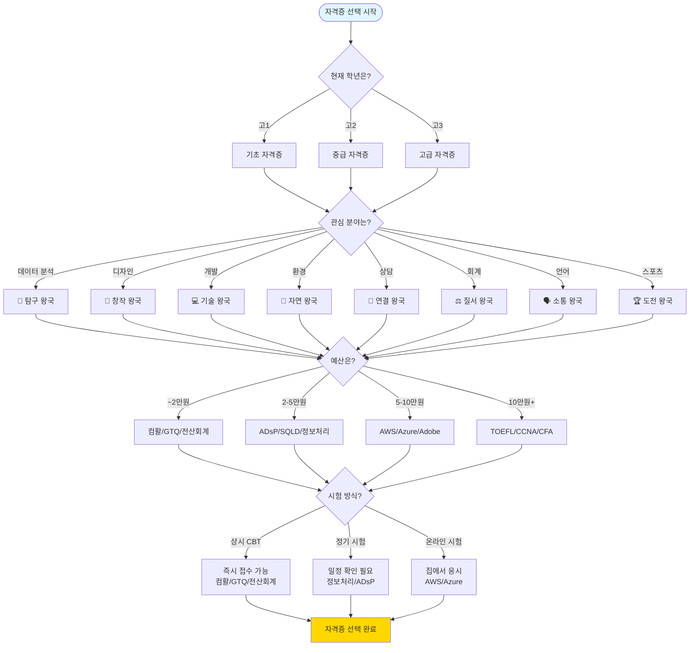
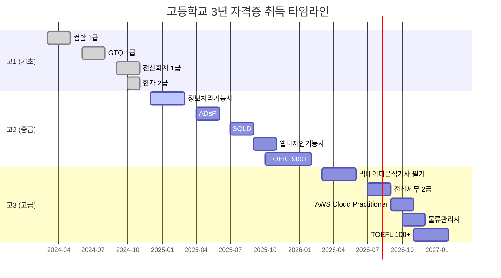
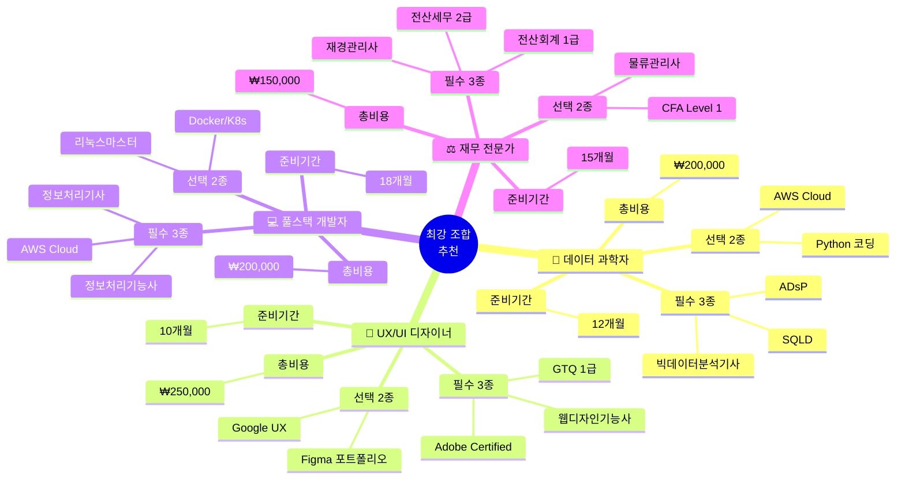
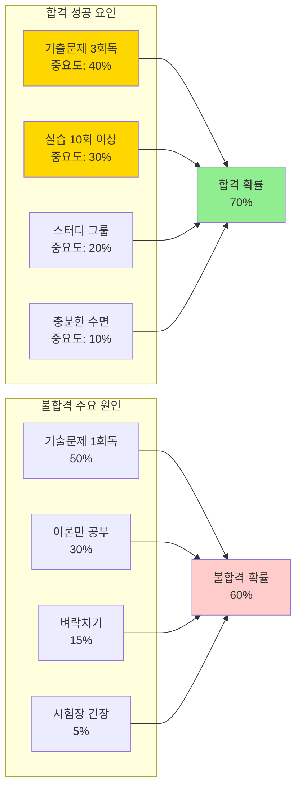

# 자격증 빠른 참고표

## 📊 한눈에 보는 자격증 비교

---

## 🗺️ 자격증 선택 플로우차트



---

## 📈 비용 대비 효과 매트릭스

```mermaid
quadrantChart
    title 자격증 비용 대비 취업/입시 효과
    x-axis 저비용 --> 고비용
    y-axis 낮은 효과 --> 높은 효과
    quadrant-1 고효과/고비용 (전략적 투자)
    quadrant-2 고효과/저비용 (최우선)
    quadrant-3 저효과/저비용 (선택)
    quadrant-4 저효과/고비용 (비추천)
    
    정보처리기능사: [0.15, 0.90]
    ADsP: [0.25, 0.95]
    SQLD: [0.25, 0.90]
    GTQ 1급: [0.20, 0.80]
    컴활 1급: [0.18, 0.75]
    전산회계 1급: [0.17, 0.70]
    정보처리기사: [0.22, 0.92]
    AWS Cloud: [0.50, 0.88]
    Azure: [0.48, 0.82]
    Adobe: [0.55, 0.90]
    CCNA: [0.70, 0.95]
    TOEFL: [0.75, 0.93]
    CFA: [0.95, 0.88]
    물류관리사: [0.30, 0.75]
```

---

## 🎯 학년별 추천 자격증 타임라인



---

## 🏆 왕국별 자격증 조합 추천



---

## 📊 자격증 취득 성공률 요인 분석



---

### 🎯 난이도별 분류

#### ⭐ 쉬움 (1-2개월)
| 자격증 | 기관 | 비용 | 시험 방식 | URL |
|--------|------|------|----------|-----|
| 컴퓨터활용능력 2급 | 대한상공회의소 | ₩18,000 | CBT (상시) | https://license.korcham.net |
| GTQ 2급 | 한국생산성본부 | ₩25,000 | CBT (월 2-3회) | https://www.kpc.or.kr |
| 워드프로세서 | 대한상공회의소 | ₩18,000 | CBT (상시) | https://license.korcham.net |
| 전산회계 2급 | 한국세무사회 | ₩17,000 | CBT (월 1-2회) | https://license.kacpta.or.kr |
| 한자 2급 | 한국어문회 | ₩15,000 | 연 4회 | https://www.hanja.re.kr |

#### ⭐⭐ 보통 (2-3개월)
| 자격증 | 기관 | 비용 | 시험 방식 | URL |
|--------|------|------|----------|-----|
| 컴퓨터활용능력 1급 | 대한상공회의소 | ₩22,000 | CBT (상시) | https://license.korcham.net |
| GTQ 1급 | 한국생산성본부 | ₩28,000 | CBT (월 2-3회) | https://www.kpc.or.kr |
| 전산회계 1급 | 한국세무사회 | ₩20,000 | CBT (월 1-2회) | https://license.kacpta.or.kr |
| ADsP | 한국데이터산업진흥원 | ₩50,000 | CBT (연 4회) | https://www.dataq.or.kr |
| SQLD | 한국데이터산업진흥원 | ₩50,000 | CBT (연 4회) | https://www.dataq.or.kr |
| 정보처리기능사 | 한국산업인력공단 | ₩14,500 | 연 4회 | https://www.q-net.or.kr |
| 웹디자인기능사 | 한국산업인력공단 | ₩14,500 | 연 4회 | https://www.q-net.or.kr |
| 리눅스마스터 2급 | 한국정보통신진흥협회 | ₩44,000 | 연 4회 | https://www.ihd.or.kr |
| 환경기능사 | 한국산업인력공단 | ₩14,500 | 연 4회 | https://www.q-net.or.kr |
| AWS Cloud Practitioner | AWS | $100 | 상시 | https://aws.amazon.com/certification |
| Azure Fundamentals | Microsoft | $99 | 상시 | https://learn.microsoft.com/certifications |

#### ⭐⭐⭐ 중상 (3-4개월)
| 자격증 | 기관 | 비용 | 시험 방식 | URL |
|--------|------|------|----------|-----|
| 전산세무 2급 | 한국세무사회 | ₩25,000 | CBT (월 1-2회) | https://license.kacpta.or.kr |
| 재경관리사 | 삼일회계법인 | ₩50,000 | 연 4회 | https://www.samili.com |
| 빅데이터 분석기사 (필기) | 한국데이터산업진흥원 | ₩25,000 | CBT (연 3회) | https://www.dataq.or.kr |
| 직업상담사 2급 | 한국산업인력공단 | ₩35,000 | 연 2회 | https://www.q-net.or.kr |
| 생활스포츠지도사 2급 | 국민체육진흥공단 | ₩30,000 | 연 2회 | https://www.kspo.or.kr |
| TOEIC 900+ | ETS | ₩50,000 | 거의 매주 | https://www.ets.org/toeic |
| CCNA | Cisco | $300 | 상시 | https://www.cisco.com |
| Adobe Certified Professional | Adobe | $180 | 상시 | https://www.adobe.com/certification |

#### ⭐⭐⭐⭐ 어려움 (4-6개월)
| 자격증 | 기관 | 비용 | 시험 방식 | URL |
|--------|------|------|----------|-----|
| 정보처리기사 | 한국산업인력공단 | ₩19,400 | 연 3회 | https://www.q-net.or.kr |
| 물류관리사 | 한국산업인력공단 | ₩50,000 | 연 2회 | https://www.q-net.or.kr |
| 생물분류기사 | 한국산업인력공단 | ₩19,400 | 연 3회 | https://www.q-net.or.kr |
| TOEFL iBT 100+ | ETS | $250 | 주 3-4회 | https://www.ets.org/toefl |
| IELTS 7.0+ | British Council | $250 | 주 2-3회 | https://www.britishcouncil.org/exam/ielts |
| CFA Level 1 | CFA Institute | $1,450 | 연 4회 | https://www.cfainstitute.org |

---

## 💰 비용별 분류

### 저비용 (5만원 이하)
| 자격증 | 비용 | 기관 | 난이도 |
|--------|------|------|--------|
| 정보처리기능사 | ₩14,500 | 한국산업인력공단 | ⭐⭐ |
| 웹디자인기능사 | ₩14,500 | 한국산업인력공단 | ⭐⭐ |
| 환경기능사 | ₩14,500 | 한국산업인력공단 | ⭐⭐ |
| 한자 2급 | ₩15,000 | 한국어문회 | ⭐ |
| 전산회계 2급 | ₩17,000 | 한국세무사회 | ⭐ |
| 워드프로세서 | ₩18,000 | 대한상공회의소 | ⭐ |
| 전산회계 1급 | ₩20,000 | 한국세무사회 | ⭐⭐ |
| 컴퓨터활용능력 1급 | ₩22,000 | 대한상공회의소 | ⭐⭐ |
| GTQ 1급 | ₩28,000 | 한국생산성본부 | ⭐⭐ |
| 생활스포츠지도사 2급 | ₩30,000 | 국민체육진흥공단 | ⭐⭐⭐ |
| ADsP | ₩50,000 | 한국데이터산업진흥원 | ⭐⭐ |
| SQLD | ₩50,000 | 한국데이터산업진흥원 | ₩50,000 |
| TOEIC | ₩50,000 | ETS | ⭐⭐⭐ |

### 중비용 (5-20만원)
| 자격증 | 비용 | 기관 | 난이도 |
|--------|------|------|--------|
| AWS Cloud Practitioner | $100 (₩130,000) | AWS | ⭐⭐ |
| Azure Fundamentals | $99 (₩130,000) | Microsoft | ⭐⭐ |
| MOS Excel Expert | $150 (₩195,000) | Microsoft | ⭐⭐ |
| Adobe Certified Professional | $180 (₩234,000) | Adobe | ⭐⭐⭐ |

### 고비용 (20만원 이상)
| 자격증 | 비용 | 기관 | 난이도 |
|--------|------|------|--------|
| TOEFL iBT | $250 (₩325,000) | ETS | ⭐⭐⭐⭐ |
| IELTS | $250 (₩325,000) | British Council | ⭐⭐⭐⭐ |
| CCNA | $300 (₩390,000) | Cisco | ⭐⭐⭐ |
| CPT (NASM) | $799 (₩1,040,000) | NASM | ⭐⭐⭐ |
| CFA Level 1 | $1,450 (₩1,885,000) | CFA Institute | ⭐⭐⭐⭐ |

---

## 📅 시험 일정별 분류

### 상시 시험 (CBT)
| 자격증 | 기관 | 접수 | 시험 |
|--------|------|------|------|
| 컴퓨터활용능력 1급 | 대한상공회의소 | 상시 | 상시 |
| GTQ 1급 | 한국생산성본부 | 월 2-3회 | 월 2-3회 |
| 전산회계 1급 | 한국세무사회 | 월 1-2회 | 월 1-2회 |
| ADsP | 한국데이터산업진흥원 | 연 4회 | 연 4회 |
| SQLD | 한국데이터산업진흥원 | 연 4회 | 연 4회 |
| AWS Cloud Practitioner | AWS | 상시 | 상시 |
| Azure Fundamentals | Microsoft | 상시 | 상시 |
| Adobe Certified Professional | Adobe | 상시 | 상시 |

### 정기 시험 (연 3-4회)
| 자격증 | 기관 | 시험 일정 |
|--------|------|----------|
| 정보처리기능사 | 한국산업인력공단 | 3월, 6월, 9월 |
| 정보처리기사 | 한국산업인력공단 | 3월, 6월, 9월 |
| 빅데이터 분석기사 | 한국데이터산업진흥원 | 3월, 6월, 9월 |
| 리눅스마스터 2급 | 한국정보통신진흥협회 | 3월, 6월, 9월, 12월 |
| 재경관리사 | 삼일회계법인 | 3월, 6월, 9월, 12월 |

### 정기 시험 (연 2회)
| 자격증 | 기관 | 시험 일정 |
|--------|------|----------|
| 물류관리사 | 한국산업인력공단 | 5월, 10월 |
| 직업상담사 2급 | 한국산업인력공단 | 6월, 9월 |
| 생활스포츠지도사 2급 | 국민체육진흥공단 | 5월, 11월 |
| 유통관리사 2급 | 대한상공회의소 | 5월, 10월 |

### 수시 시험
| 자격증 | 기관 | 시험 일정 |
|--------|------|----------|
| TOEIC | ETS | 거의 매주 |
| TOEFL iBT | ETS | 주 3-4회 |
| IELTS | British Council | 주 2-3회 |

---

## 🎓 학년별 추천 자격증

### 고1 (기초 다지기)
**목표**: 기초 역량 증명 + 자신감 획득

| 우선순위 | 자격증 | 기관 | 비용 | 준비 기간 |
|---------|--------|------|------|----------|
| 1 | 컴퓨터활용능력 1급 | 대한상공회의소 | ₩22,000 | 1-2개월 |
| 2 | GTQ 1급 | 한국생산성본부 | ₩28,000 | 1-2개월 |
| 3 | 전산회계 1급 | 한국세무사회 | ₩20,000 | 1-2개월 |
| 4 | 한자 2급 | 한국어문회 | ₩15,000 | 2-3개월 |

**총 비용**: 약 ₩85,000  
**총 준비 기간**: 4-8개월 (병행 시 3-4개월)

---

### 고2 (전문성 강화)
**목표**: 전문 자격증 + 프로젝트 연계

| 우선순위 | 자격증 | 기관 | 비용 | 준비 기간 |
|---------|--------|------|------|----------|
| 1 | 정보처리기능사 | 한국산업인력공단 | ₩14,500 | 2-3개월 |
| 2 | ADsP | 한국데이터산업진흥원 | ₩50,000 | 2-3개월 |
| 3 | SQLD | 한국데이터산업진흥원 | ₩50,000 | 1-2개월 |
| 4 | 웹디자인기능사 | 한국산업인력공단 | ₩14,500 | 2-3개월 |
| 5 | TOEIC 900+ | ETS | ₩50,000 | 3-6개월 |

**총 비용**: 약 ₩179,000  
**총 준비 기간**: 10-17개월 (병행 시 6-8개월)

---

### 고3 (포트폴리오 완성)
**목표**: 고급 자격증 + 대학 입시

| 우선순위 | 자격증 | 기관 | 비용 | 준비 기간 |
|---------|--------|------|------|----------|
| 1 | 빅데이터 분석기사 (필기) | 한국데이터산업진흥원 | ₩25,000 | 3-4개월 |
| 2 | 전산세무 2급 | 한국세무사회 | ₩25,000 | 2-3개월 |
| 3 | 물류관리사 | 한국산업인력공단 | ₩50,000 | 3-4개월 |
| 4 | TOEFL iBT 100+ | ETS | $250 | 6-12개월 |
| 5 | AWS Cloud Practitioner | AWS | $100 | 1-2개월 |

**총 비용**: 약 ₩555,000  
**총 준비 기간**: 15-25개월 (병행 시 8-12개월)

---

## 🏆 왕국별 최강 조합

### 🔬 탐구 왕국
**목표**: 데이터 과학자

| 단계 | 자격증 | 비용 | 준비 기간 |
|------|--------|------|----------|
| 1 | 컴퓨터활용능력 1급 | ₩22,000 | 1-2개월 |
| 2 | ADsP | ₩50,000 | 2-3개월 |
| 3 | SQLD | ₩50,000 | 1-2개월 |
| 4 | 빅데이터 분석기사 (필기) | ₩25,000 | 3-4개월 |
| 5 | Google Data Analytics Certificate | $39/월 × 6 | 6개월 |

**총 비용**: 약 ₩450,000  
**예상 효과**: 데이터 분석 전문가 인정

---

### 🎨 창작 왕국
**목표**: 디자이너

| 단계 | 자격증 | 비용 | 준비 기간 |
|------|--------|------|----------|
| 1 | GTQ 1급 | ₩28,000 | 1-2개월 |
| 2 | 웹디자인기능사 | ₩14,500 | 2-3개월 |
| 3 | 멀티미디어콘텐츠제작전문가 | ₩35,000 | 2-3개월 |
| 4 | Adobe Certified Professional (Photoshop) | $180 | 2-3개월 |
| 5 | Adobe Certified Professional (Premiere Pro) | $180 | 2-3개월 |

**총 비용**: 약 ₩545,000  
**예상 효과**: 디자인 + 영상 전문가

---

### 💻 기술 왕국
**목표**: 풀스택 개발자

| 단계 | 자격증 | 비용 | 준비 기간 |
|------|--------|------|----------|
| 1 | 정보처리기능사 | ₩14,500 | 2-3개월 |
| 2 | 리눅스마스터 2급 | ₩44,000 | 1-2개월 |
| 3 | AWS Cloud Practitioner | $100 | 1-2개월 |
| 4 | 정보처리기사 | ₩19,400 | 3-4개월 |
| 5 | CCNA | $300 | 3-6개월 |

**총 비용**: 약 ₩597,900  
**예상 효과**: 개발 + 클라우드 + 네트워크

---

### ⚖️ 질서 왕국
**목표**: 회계사

| 단계 | 자격증 | 비용 | 준비 기간 |
|------|--------|------|----------|
| 1 | 전산회계 1급 | ₩20,000 | 1-2개월 |
| 2 | 전산세무 2급 | ₩25,000 | 2-3개월 |
| 3 | 재경관리사 | ₩50,000 | 3-4개월 |
| 4 | 물류관리사 | ₩50,000 | 3-4개월 |
| 5 | CFA Level 1 (대학) | $1,450 | 6-12개월 |

**총 비용**: 약 ₩2,030,000  
**예상 효과**: 회계 + 재무 + 물류 전문가

---

### 🗣️ 소통 왕국
**목표**: 통번역사

| 단계 | 자격증 | 비용 | 준비 기간 |
|------|--------|------|----------|
| 1 | 한자 2급 | ₩15,000 | 2-3개월 |
| 2 | TOEIC 900+ | ₩50,000 | 3-6개월 |
| 3 | TOEFL iBT 100+ | $250 | 6-12개월 |
| 4 | JLPT N1 | ¥7,000 | 1-2년 |
| 5 | HSK 6급 | ¥450 | 1-2년 |

**총 비용**: 약 ₩500,000  
**예상 효과**: 다국어 전문가

---

### 🏆 도전 왕국
**목표**: 스포츠 지도자

| 단계 | 자격증 | 비용 | 준비 기간 |
|------|--------|------|----------|
| 1 | 레크리에이션 지도자 2급 | ₩50,000 | 1-2개월 |
| 2 | 생활스포츠지도사 2급 | ₩30,000 + 교육비 | 3-4개월 |
| 3 | CPT (NASM) | $799 | 3-6개월 |
| 4 | 전문스포츠지도사 2급 (대학) | ₩30,000 + 교육비 | 6-12개월 |

**총 비용**: 약 ₩1,500,000  
**예상 효과**: 스포츠 전문가 + 퍼스널 트레이너

---

## 📞 빠른 연락처

### 국내 기관
- **Q-Net**: 1644-8000 | https://www.q-net.or.kr
- **K-Data**: 02-3708-5300 | https://www.dataq.or.kr
- **대한상공회의소**: 02-6050-3000 | https://license.korcham.net
- **한국생산성본부**: 02-724-1114 | https://www.kpc.or.kr
- **한국세무사회**: 02-597-3100 | https://license.kacpta.or.kr

### 해외 기관
- **AWS**: https://aws.amazon.com/certification
- **Microsoft**: https://learn.microsoft.com/certifications
- **Google**: https://grow.google/certificates
- **Adobe**: https://www.adobe.com/certification
- **ETS**: https://www.ets.org

---

## 💡 자격증 취득 팁

### 1. 할인 기간 활용
- **Udemy**: 월 1-2회 할인 (₩55,000 → ₩13,000)
- **패스트캠퍼스**: 평생 수강권 할인 (70-80% 할인)
- **AWS/Microsoft**: 학생 할인 (50% 할인)

### 2. 무료 자원 활용
- **YouTube**: 자격증별 무료 강의
- **K-MOOC**: 대학 강의 무료
- **생활코딩**: 프로그래밍 무료

### 3. 스터디 그룹
- **네이버 카페**: 자격증별 스터디
- **디스코드**: 개발자 커뮤니티
- **오픈채팅**: 동기 부여 그룹

### 4. 시험 전략
- **기출문제 3회 이상**: 합격률 2배
- **실습 10회 이상**: 실기 합격률 80%
- **스터디 그룹**: 합격률 70% (혼자 40%)

---

**마지막 업데이트**: 2026년 3월  
**다음 업데이트**: 2026년 6월

**더 자세한 정보**:
- [왕국별 자격증 가이드](./00_왕국별_자격증_가이드.md)
- [기관별 상세 가이드](./01_자격증_기관별_상세가이드.md)
